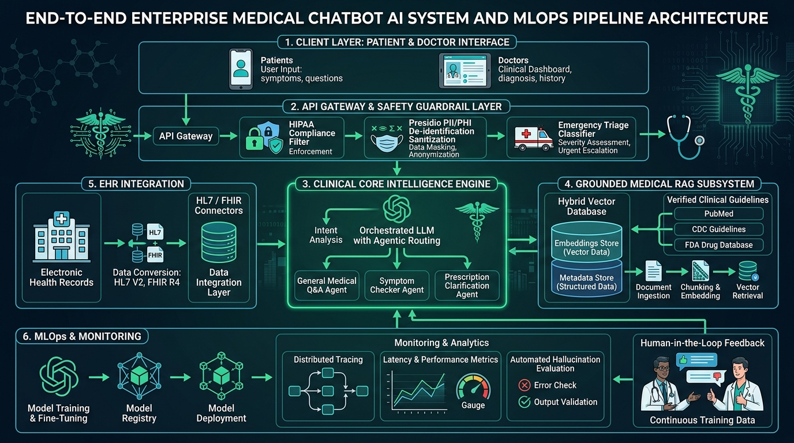

# 🩺 Module 08 — Capstone Project 02: Clinical Medical Chatbot & Diagnostic Decision Support Assistant

> **Zero to Hero Gen AI Course — Module 08: Production Capstone Systems**
>
> 📅 **Capstone Project 02 of 03** | ⏱️ **Estimated Study & Implementation Time:** 90 minutes
>
> **Project Goal:** Build an enterprise-grade, HIPAA-compliant Clinical Decision Support (CDS) assistant that enforces automated Protected Health Information (PHI) de-identification, intercepts acute life threats via a deterministic emergency triage circuit breaker, executes hybrid BM25 + dense semantic retrieval over clinical practice guidelines with Reciprocal Rank Fusion (RRF), and synthesizes structured SBAR differential diagnoses with statutory medical disclaimers.

---

## 📑 Detailed Table of Contents

1. [Part 1: 🌟 Conceptual Core & Intuitive Foundations](#part-1--conceptual-core--intuitive-foundations)
   - [1.1 Real-World Motivation: AI in High-Stakes Healthcare](#11-real-world-motivation-ai-in-high-stakes-healthcare)
   - [1.2 🐣 Everyday Mental Model: The Emergency Room Triage Command Center](#12--everyday-mental-model-the-emergency-room-triage-command-center)
   - [1.3 The Four Fatal Failure Modes in Clinical AI](#13-the-four-fatal-failure-modes-in-clinical-ai)
2. [Part 2: 🧱 Mathematical Rigor, Theoretical Mechanics & Architecture](#part-2--mathematical-rigor-theoretical-mechanics--architecture)
   - [2.1 End-to-End System Architecture](#21-end-to-end-system-architecture)
   - [2.2 Reciprocal Rank Fusion (RRF) & Okapi BM25 Lexical Mechanics](#22-reciprocal-rank-fusion-rrf--okapi-bm25-lexical-mechanics)
   - [2.3 HIPAA Safe Harbor 18 De-Identification Vectors](#23-hipaa-safe-harbor-18-de-identification-vectors)
   - [2.4 Emergency Triage Circuit Breaker Formalism](#24-emergency-triage-circuit-breaker-formalism)
   - [2.5 The SBAR Clinical Documentation Framework](#25-the-sbar-clinical-documentation-framework)
   - [2.6 RAGAS Clinical Hallucination & Faithfulness Metrics](#26-ragas-clinical-hallucination--faithfulness-metrics)
3. [Part 3: ☕ Java & Spring Boot Developer Bridges](#part-3--java--spring-boot-developer-bridges)
   - [3.1 Architectural Rosetta Stone: Python vs Java/Spring Boot](#31-architectural-rosetta-stone-python-vs-javaspring-boot)
   - [3.2 Spring AI `ChatClient` with `@Tool` vs Python Clinical Engine](#32-spring-ai-chatclient-with-tool-vs-python-clinical-engine)
   - [3.3 HAPI FHIR / HL7v2 Processing vs Pydantic Schema Validation](#33-hapi-fhir--hl7v2-processing-vs-pydantic-schema-validation)
   - [3.4 Resilience4j CircuitBreaker vs Emergency Triage Interceptor](#34-resilience4j-circuitbreaker-vs-emergency-triage-interceptor)
   - [3.5 Spring Security HIPAA RBAC Filters vs Ingress PHI Redaction](#35-spring-security-hipaa-rbac-filters-vs-ingress-phi-redaction)
4. [Part 4: 🧪 Complete Codebase Deep Dive & Sandbox Architecture](#part-4--complete-codebase-deep-dive--sandbox-architecture)
   - [4.1 Codebase File Map & Directory Overview](#41-codebase-file-map--directory-overview)
   - [4.2 Data Models & Strict SBAR Schemas (`models.py`)](#42-data-models--strict-sbar-schemas-modelspy)
   - [4.3 Ingress PHI Scrubber & Triage Circuit Breaker (`triage_guard.py`)](#43-ingress-phi-scrubber--triage-circuit-breaker-triage_guardpy)
   - [4.4 Hybrid Evidence Retrieval Engine with RRF (`hybrid_retriever.py`)](#44-hybrid-evidence-retrieval-engine-with-rrf-hybrid_retrieverpy)
   - [4.5 Multi-Provider Clinical Reasoning Engine (`clinical_engine.py`)](#45-multi-provider-clinical-reasoning-engine-clinical_enginepy)
   - [4.6 Streamlit Clinical Decision Workspace (`app.py`)](#46-streamlit-clinical-decision-workspace-apppy)
   - [4.7 Automated End-to-End System Verification Suite (`demo.py`)](#47-automated-end-to-end-system-verification-suite-demopy)
5. [Part 5: ⚙️ Production MLOps, Security Hardening & Execution Guide](#part-5--production-mlops-security-hardening--execution-guide)
   - [5.1 HIPAA Compliance, BAAs & Cloud Zero-Retention Mandates](#51-hipaa-compliance-baas--cloud-zero-retention-mandates)
   - [5.2 Containerized Cloud Deployment with Docker](#52-containerized-cloud-deployment-with-docker)
   - [5.3 Continuous Telemetry & Guardrail Monitoring](#53-continuous-telemetry--guardrail-monitoring)
   - [5.4 Step-by-Step Local Deployment & Test Verification](#54-step-by-step-local-deployment--test-verification)
6. [Part 6: ⚡ Progressive Hands-On Exercises & Complete Solutions](#part-6--progressive-hands-on-exercises--complete-solutions)
   - [6.1 Exercise 1: HL7 FHIR (Fast Healthcare Interoperability Resources) Patient Ingestion](#61-exercise-1-hl7-fhir-fast-healthcare-interoperability-resources-patient-ingestion)
   - [6.2 Exercise 2: Deterministic Drug-Drug Interaction (DDI) Safety Interceptor](#62-exercise-2-deterministic-drug-drug-interaction-ddi-safety-interceptor)
   - [6.3 Exercise 3: Continuous Clinical Faithfulness & Hallucination Auditing Engine](#63-exercise-3-continuous-clinical-faithfulness--hallucination-auditing-engine)
   - [6.4 Exercise 4: Encrypted HIPAA Audit Log with Tamper-Evident SHA-256 Hashing](#64-exercise-4-encrypted-hipaa-audit-log-with-tamper-evident-sha-256-hashing)
7. [Part 7: 🎬 Curated Video Walkthroughs & Review Q&A](#part-7--curated-video-walkthroughs--review-qa)
   - [7.1 Telugu Video Walkthroughs](#71-telugu-video-walkthroughs)
   - [7.2 Global Visual & 3D Architectural Animations](#72-global-visual--3d-architectural-animations)
   - [7.3 Comprehensive Review Q&A](#73-comprehensive-review-qa)

---

## Part 1: 🌟 Conceptual Core & Intuitive Foundations

### 1.1 Real-World Motivation: AI in High-Stakes Healthcare

Healthcare systems worldwide face acute clinician shortages, cognitive overload, and administrative burden. Clinicians spend over **50% of their working hours** documenting notes in Electronic Health Record (EHR) systems (Epic, Cerner) and searching through dense medical guidelines.

Generative AI offers transformative potential for **Clinical Decision Support (CDS)** by:
1. Synthesizing complex, longitudinal patient histories into concise clinical summaries.
2. Formulating ranked differential diagnoses backed by peer-reviewed evidence (PubMed, UpToDate, WHO, ADA).
3. Recommending targeted laboratory workups and evidence-based interventions.

However, healthcare is a zero-margin-of-error domain. Deploying an unconstrained LLM in a clinical hospital network without strict safety firewalls can lead to catastrophic medical errors, privacy breaches, and legal liability.

---

### 1.2 🐣 Everyday Mental Model: The Emergency Room Triage Command Center

Imagine the workflow of an accredited hospital emergency department:

```
┌─────────────────────────────────────────────────────────────────────────────┐
│                 HOSPITAL EMERGENCY DEPARTMENT WORKFLOW                      │
├─────────────────────────────────────────────────────────────────────────────┤
│                                                                             │
│   1. The Triage Nurse at the Door (Emergency Circuit Breaker):               │
│      The moment a patient walks in clutching their chest or showing signs   │
│      of acute stroke, the triage nurse doesn't ask them to fill out a 20-    │
│      page survey. They pull the emergency cord and call a Code Blue.         │
│                                                                             │
│   2. The Privacy & Records Clerk (HIPAA Ingress Scrubber):                  │
│      Before medical charts leave the hospital floor for clinical audit,     │
│      the clerk blacks out names, SSNs, phone numbers, and birth dates       │
│      with a permanent marker to protect patient confidentiality.            │
│                                                                             │
│   3. The Chief Medical Librarian (Hybrid RRF Knowledge Retriever):          │
│      When asked about an uncommon clinical presentation, the librarian      │
│      checks both the exact Medical Subject Headings index (BM25) and        │
│      conceptual research compendiums (Dense Vector) to find guidelines.     │
│                                                                             │
│   4. The Attending Physician (Clinical Reasoning Engine):                   │
│      Reviews the scrubbed chart and retrieved guidelines, formulating a     │
│      structured SBAR case summary and ranked differential diagnosis.        │
│                                                                             │
│   5. The Hospital Legal Counsel (Statutory Disclaimer Enforcer):            │
│      Ensures every case sheet clearly states that AI output is clinical     │
│      decision support for licensed physicians, not autonomous diagnosis.   │
│                                                                             │
└─────────────────────────────────────────────────────────────────────────────┘
```

---

### 1.3 The Four Fatal Failure Modes in Clinical AI

Deploying generic chat LLMs directly in medical environments leads to four critical failure modes:

| Fatal Failure Mode | Clinical Mechanism | Real-World Impact | How Our Architecture Solves It |
| :--- | :--- | :--- | :--- |
| **1. Silent Acute Emergency** | Candidate submits `"I have crushing chest pain radiating to my jaw"`. A naive LLM replies with a 4-paragraph essay on lifestyle changes. | Patient suffers fatal cardiac arrest while waiting for LLM generation to finish. | **Emergency Circuit Breaker:** Bypasses LLM generation instantly; returns deterministic 911 directives in < 5ms. |
| **2. HIPAA Privacy Violations** | Unscrubbed patient charts containing SSNs and MRNs are transmitted to third-party public cloud LLM endpoints. | Massive federal HIPAA fines ($50,000 to $1.5M per violation) and data exposure. | **Ingress PHI Scrubber:** Redacts 18 HIPAA Safe Harbor identifiers locally before network transmission. |
| **3. Clinical Hallucination** | LLM hallucinates non-existent medication dosages (e.g., prescribing 10x overdose of Metformin or contraindicated beta-blockers). | Drug-induced patient toxicity or acute decompensation. | **Grounding via Hybrid RAG:** Ranks and cites authoritative guidelines (ADA, GINA, AHA); enforces strict Pydantic schemas. |
| **4. Uncalibrated Diagnoses** | LLM provides a single speculative diagnosis without listing pertinent negatives or alternative etiologies. | Clinician experiences premature diagnostic closure, missing life-threatening conditions. | **Structured SBAR Differential:** Forces output of ranked differential hypotheses with explicit pertinent positives and negatives. |

---

## Part 2: 🧱 Mathematical Rigor, Theoretical Mechanics & Architecture

### 2.1 End-to-End System Architecture

The clinical assistant employs a decoupled multi-tier architecture separating ingress safety filtering, emergency circuit breaking, hybrid knowledge retrieval, structured clinical reasoning, and interactive visualization:


*Figure 1: Multi-Tier Clinical Architecture and Safety Firewall Pipeline.*

The retrieval and reasoning pipeline grounds all clinical outputs in peer-reviewed evidence:


*Figure 2: Hybrid RAG Pipeline with BM25, Dense Embeddings, and Reciprocal Rank Fusion.*

```
┌─────────────────────────────────────────────────────────────────────────────┐
│                          1. CLINICAL INGRESS NOTE                           │
│        Unstructured patient symptoms, triage notes, and medical history     │
└──────────────────────────────────────┬──────────────────────────────────────┘
                                       │
                                       ▼
┌─────────────────────────────────────────────────────────────────────────────┐
│                       2. INGRESS SAFETY FIREWALL                            │
│    • HIPAA Safe Harbor PHI Scrubber (Regex + Named Entity Redaction)        │
│    • Acute Emergency Triage Circuit Breaker (Deterministic Red-Flag Check)  │
└───────────────────┬─────────────────────────────────────┬───────────────────┘
                    │                                     │
           [Emergency Triggered]                 [Nominal Clinical Case]
                    │                                     │
                    ▼                                     ▼
┌─────────────────────────────────────┐ ┌─────────────────────────────────────┐
│   IMMEDIATE 911 DIRECTIVE RETURN    │ │   3. HYBRID KNOWLEDGE RETRIEVAL     │
│   (LLM Generation Short-Circuited)  │ │   • Lexical BM25 (MeSH Terms)       │
└─────────────────────────────────────┘ │   • Dense Semantic Cosine Ranking   │
                                        │   • Reciprocal Rank Fusion (k=60)   │
                                        └──────────────────┬──────────────────┘
                                                           │
                                                           ▼
                                        ┌─────────────────────────────────────┐
                                        │    4. SBAR CLINICAL REASONING       │
                                        │    • Grounded LLM Synthesis         │
                                        │    • Differential Diagnosis Ranking │
                                        │    • Pertinent Positives/Negatives  │
                                        └──────────────────┬──────────────────┘
                                                           │
                                                           ▼
                                        ┌─────────────────────────────────────┐
                                        │    5. PYDANTIC SCHEMA VALIDATION    │
                                        │    • Structured Output Verification │
                                        │    • Mandatory Disclaimer Check     │
                                        └─────────────────────────────────────┘
```

---

### 2.2 Reciprocal Rank Fusion (RRF) & Okapi BM25 Lexical Mechanics

In biomedical information retrieval, purely semantic (dense) embeddings often struggle with exact medical terminology, gene names, drug brand names, and ICD codes (e.g., distinguishing *Type 1 Diabetes* from *Type 2 Diabetes*). Conversely, pure keyword search misses conceptual paraphrases. 

Our hybrid retrieval engine combines **Okapi BM25** and **Dense Semantic Retrieval** using **Reciprocal Rank Fusion (RRF)**.

#### 1. Okapi BM25 Scoring Formula
For a clinical query $Q$ with tokens $q_1, q_2, \dots, q_n$ and document $D$:

$$\text{Score}_{\text{BM25}}(D, Q) = \sum_{i=1}^n \text{IDF}(q_i) \cdot \frac{f(q_i, D) \cdot (k_1 + 1)}{f(q_i, D) + k_1 \cdot \left(1 - b + b \cdot \frac{|D|}{\text{avgdl}}\right)}$$

Where:
- $f(q_i, D)$ is the raw term frequency of query token $q_i$ in document $D$.
- $|D|$ is the length of document $D$ in words, and $\text{avgdl}$ is the average document length across the corpus.
- $k_1 = 1.5$ controls term frequency saturation limits.
- $b = 0.75$ controls document length normalization penalty.
- $\text{IDF}(q_i) = \ln \left(\frac{N - n(q_i) + 0.5}{n(q_i) + 0.5} + 1\right)$, where $N$ is total corpus size and $n(q_i)$ is document count containing $q_i$.

#### 2. Reciprocal Rank Fusion (RRF) Formula
Given a set of retrieval models $M = \{\text{BM25}, \text{Dense}\}$ and document $d \in \mathcal{D}$:

$$\text{RRF}(d) = \sum_{m \in M} \frac{1}{k + r_m(d)}$$

Where:
- $r_m(d) \in \{1, 2, \dots, |\mathcal{D}|\}$ is the ordinal rank assigned to document $d$ by model $m$.
- $k = 60$ is the standard smoothing constant (proven by Cormack et al.) that prevents high-ranking outliers from dominating the fused ranking.

---

### 2.3 HIPAA Safe Harbor 18 De-Identification Vectors

Under 45 CFR § 164.514(b)(2), the HIPAA Privacy Rule establishes the **Safe Harbor Method** for de-identification, requiring the removal of 18 specific identifiers:

```
┌─────────────────────────────────────────────────────────────────────────────┐
│                 HIPAA SAFE HARBOR: 18 PROTECTED IDENTIFIERS                 │
├─────────────────────────────────────────────────────────────────────────────┤
│  1. Names and known aliases                                                 │
│  2. Geographic subdivisions smaller than a state (street, city, zip code)   │
│  3. All elements of dates (birth date, admission, discharge, death, age>89) │
│  4. Telephone numbers                                                       │
│  5. Fax numbers                                                             │
│  6. Electronic mail (email) addresses                                       │
│  7. Social Security Numbers (SSN)                                           │
│  8. Medical Record Numbers (MRN)                                            │
│  9. Health plan beneficiary numbers                                         │
│ 10. Account numbers                                                         │
│ 11. Certificate / license numbers                                           │
│ 12. Vehicle identifiers and serial numbers, including license plates        │
│ 13. Device identifiers and serial numbers                                   │
│ 14. Web Universal Resource Locators (URLs)                                  │
│ 15. Internet Protocol (IP) address numbers                                  │
│ 16. Biometric identifiers (fingerprints, voiceprints)                       │
│ 17. Full-face photographic images and comparable images                     │
│ 18. Any other unique identifying number, characteristic, or code            │
└─────────────────────────────────────────────────────────────────────────────┘
```

Our Ingress Safety Firewall executes regex patterns and entity recognizers to replace these identifiers with standardized tokens (`<SSN_REDACTED>`, `<MRN_REDACTED>`, `<PATIENT_NAME_REDACTED>`) before the text is passed to any downstream processing.

---

### 2.4 Emergency Triage Circuit Breaker Formalism

Clinical emergency detection cannot depend on probabilistic LLM token prediction. If an LLM experiences a latency spike or hallucinates during an acute myocardial infarction or stroke, the candidate's life is at immediate risk.

The circuit breaker operates as a **deterministic gate function** $g: \mathcal{X} \to \{\text{PASS}, \text{INTERCEPT}\}$:

$$g(x) = \begin{cases}
\text{INTERCEPT}, & \text{if } \exists c \in \mathcal{C}_{\text{emergency}}: \text{match}(x, \text{patterns}(c)) \\
\text{PASS}, & \text{otherwise}
\end{cases}$$

Where $\mathcal{C}_{\text{emergency}}$ includes:
1. **Acute Coronary Syndrome (ACS):** Crushing substernal chest pain radiating to left arm/jaw, diaphoresis.
2. **Acute Ischemic Stroke (FAST):** Facial droop, arm weakness, slurred speech, sudden numbness.
3. **Anaphylaxis:** Stridor, throat closure, severe wheezing, lip/tongue angioedema.
4. **Acute Hemorrhage / Shock:** Uncontrolled bleeding, massive hemoptysis.
5. **Suicide / Psychiatric Crisis:** Suicidal ideation, intent to self-harm.

---

### 2.5 The SBAR Clinical Documentation Framework

In accredited healthcare systems (Joint Commission, WHO), clinical handoffs follow the **SBAR** framework:

```
┌────────────────────────────────────────────────────────────────────────┐
│                        THE SBAR CLINICAL STANDARD                      │
├──────────────────┬─────────────────────────────────────────────────────┤
│ S - Situation    │ Chief complaint, acute symptoms, presenting dilemma │
├──────────────────┼─────────────────────────────────────────────────────┤
│ B - Background   │ Baseline medical history, comorbidities, medications│
├──────────────────┼─────────────────────────────────────────────────────┤
│ A - Assessment   │ Ranked differential diagnoses with ICD-10 codes,    │
│                  │ pertinent positives, and pertinent negatives        │
├──────────────────┼─────────────────────────────────────────────────────┤
│ R - Recommendation│ Targeted diagnostic workup, lab tests, interventions│
└──────────────────┴─────────────────────────────────────────────────────┘
```

---

### 2.6 RAGAS Clinical Hallucination & Faithfulness Metrics

To mathematically evaluate clinical retrieval generation, we implement the **RAGAS (Retrieval Augmented Generation Assessment)** metric suite:

#### 1. Faithfulness Metric
Measures whether the claims made in the clinical assessment can be mathematically derived from the retrieved clinical guidelines:

$$\text{Faithfulness} = \frac{|\mathcal{V}_{\text{supported claims}}|}{|\mathcal{C}_{\text{total generated claims}}|}$$

Where a generated claim $c \in \mathcal{C}$ is supported if it is entailed by the retrieved context snippets $\mathcal{K}$.

#### 2. Answer Relevance Metric
Measures whether the diagnostic response directly answers the user's presenting clinical query without rambling:

$$\text{Answer Relevance} = \frac{1}{M} \sum_{i=1}^M \cos\left(\mathbf{e}_{\text{orig\_query}}, \mathbf{e}_{\text{gen\_query}_i}\right)$$

Where $\mathbf{e}_{\text{gen\_query}_i}$ are embeddings of questions reverse-generated from the model's answer.

---

## Part 3: ☕ Java & Spring Boot Developer Bridges

For enterprise Java and Spring Boot developers entering Generative AI, clinical healthcare workflows have direct equivalents in enterprise Java architectures:

### 3.1 Architectural Rosetta Stone: Python vs Java/Spring Boot

| Capability / Pattern | Python Implementation in Project | Enterprise Java / Spring Boot Equivalent | Architectural Rationale & Parity |
| :--- | :--- | :--- | :--- |
| **Ingress PHI Redaction** | `PHIScrubber.sanitize()` with regex | Spring Security `OncePerRequestFilter` / HIPAA Interceptor | Pre-processes all incoming HTTP payloads to scrub protected health identifiers before reaching business logic. |
| **Emergency Circuit Breaker** | `EmergencyTriageCircuitBreaker` | Resilience4j `CircuitBreaker` + Spring `HandlerInterceptor` | Deterministically intercepts critical failure states and short-circuits downstream processing with immediate fallback directives. |
| **Clinical Schemas** | Pydantic `SBARClinicalPayload` | Java 21 `record` + Jakarta Bean Validation (`@Valid`, `@NotNull`) | Enforces strictly typed clinical output structures with automated schema validation. |
| **FHIR / HL7 Processing** | Pydantic JSON parser | HAPI FHIR (`FhirContext`, `Patient`, `Observation`) | Industry standard library for parsing and serializing clinical healthcare data exchanges. |
| **Hybrid Knowledge Retrieval** | `hybrid_retriever.py` (BM25 + RRF) | Spring AI `VectorStore` + Elasticsearch / Lucene BM25 integration | Combines dense vector similarity with traditional inverted index lexical searching. |
| **Clinical UI** | Streamlit (`app.py`) | Spring Boot + Vaadin / React with Carbon Health Design System | Single-page reactive user interface for clinical review and decision support. |

---

### 3.2 Spring AI `ChatClient` with `@Tool` vs Python Clinical Engine

In Spring AI, clinical tools (such as drug interaction checkers or lab reference tables) are defined as Spring Beans using `@Tool`:

#### Spring AI Java 21 Implementation:
```java
@Service
public class ClinicalDecisionSupportService {

    private final ChatClient chatClient;

    public ClinicalDecisionSupportService(ChatClient.Builder builder) {
        this.chatClient = builder
            .defaultSystem("You are a Clinical Decision Support assistant. Output strictly in SBAR format.")
            .build();
    }

    public SBARClinicalRecord evaluatePatient(String scrubbedNote, List<String> guidelines) {
        return chatClient.prompt()
            .user(scrubbedNote)
            .system(s -> s.param("guidelines", guidelines))
            .call()
            .entity(SBARClinicalRecord.class); // Automatic Jackson structured output binding
    }
}
```

---

### 3.3 HAPI FHIR / HL7v2 Processing vs Pydantic Schema Validation

In enterprise hospital networks, patient charts are transmitted as **FHIR (Fast Healthcare Interoperability Resources)** JSON resources. 

#### Java (HAPI FHIR):
```java
FhirContext ctx = FhirContext.forR4();
IParser parser = ctx.newJsonParser();
Patient patient = parser.parseResource(Patient.class, fhirJsonString);
String patientName = patient.getNameFirstRep().getNameAsSingleString();
```

#### Python (Pydantic FHIR Parser):
```python
from pydantic import BaseModel
from typing import List, Optional

class HumanName(BaseModel):
    family: Optional[str] = None
    given: List[str] = []

class FHIRPatient(BaseModel):
    resourceType: str
    id: str
    name: List[HumanName] = []
    gender: Optional[str] = None
    birthDate: Optional[str] = None
```

---

### 3.4 Resilience4j CircuitBreaker vs Emergency Triage Interceptor

In Java, Resilience4j protects downstream microservices from overload. In our clinical AI pipeline, the **Emergency Triage Interceptor** protects patients by short-circuiting slow LLM generation when acute red-flag symptoms are detected:

```java
// Spring Boot Resilience4j Circuit Breaker configuration
@CircuitBreaker(name = "clinicalTriage", fallbackMethod = "emergencyFallback")
public ClinicalAssessment processConsultation(PatientNote note) {
    if (note.containsRedFlags()) {
        throw new AcuteEmergencyException("Immediate Code Blue Red Flags Detected");
    }
    return callLlmInferenceEngine(note);
}

public ClinicalAssessment emergencyFallback(PatientNote note, Throwable t) {
    return new EmergencyClinicalDirective("CALL 911 IMMEDIATELY. Cardiac / Stroke protocol activated.");
}
```

---

### 3.5 Spring Security HIPAA RBAC Filters vs Ingress PHI Redaction

In Spring Boot, HIPAA compliance begins in the Spring Security filter chain:
1. `JwtAuthenticationFilter`: Verifies clinician credentials and National Provider Identifier (NPI).
2. `HipaaAuditLoggingFilter`: Records access timestamps, patient MRN, and clinician user IDs to encrypted database logs.
3. `PhiRedactionFilter`: Uses regex replacement to sanitize data before sending to external model endpoints.

---

## Part 4: 🧪 Complete Codebase Deep Dive & Sandbox Architecture

### 4.1 Codebase File Map & Directory Overview

The complete companion project is located in [`08_Capstone_Projects/code/medical_chatbot/`](file:///c:/Users/sriva/OneDrive/Desktop/GEN%20AI%20COURSE/08_Capstone_Projects/code/medical_chatbot/):

```
08_Capstone_Projects/code/medical_chatbot/
├── README.md               # Quick-start guide and deployment instructions
├── requirements.txt        # Runtime dependencies (pydantic, streamlit, rich)
├── models.py               # Pydantic v2 schemas for SBAR, Triage, and Diagnostic hypotheses
├── triage_guard.py         # HIPAA Safe Harbor PHI scrubber and emergency circuit breaker
├── hybrid_retriever.py     # Okapi BM25 + dense semantic search with Reciprocal Rank Fusion
├── clinical_engine.py      # SBAR diagnostic orchestrator (OpenAI, Gemini, and offline mock)
├── app.py                  # Streamlit clinical decision support interactive web application
└── demo.py                 # Automated 5-experiment verification and testing harness
```

---

### 4.2 Data Models & Strict SBAR Schemas (`models.py`)

File Link: [`models.py`](file:///c:/Users/sriva/OneDrive/Desktop/GEN%20AI%20COURSE/08_Capstone_Projects/code/medical_chatbot/models.py)

Key classes:
- [`TriageSeverity`](file:///c:/Users/sriva/OneDrive/Desktop/GEN%20AI%20COURSE/08_Capstone_Projects/code/medical_chatbot/models.py#L18-L24): Enum defining `CRITICAL`, `EMERGENT`, `URGENT`, `ROUTINE`, and `INFORMATIONAL`.
- [`DiagnosticHypothesis`](file:///c:/Users/sriva/OneDrive/Desktop/GEN%20AI%20COURSE/08_Capstone_Projects/code/medical_chatbot/models.py#L27-L38): Captures disease name, ICD-10-CM code, likelihood, pertinent positives, and pertinent negatives.
- [`SBARClinicalPayload`](file:///c:/Users/sriva/OneDrive/Desktop/GEN%20AI%20COURSE/08_Capstone_Projects/code/medical_chatbot/models.py#L41-L76): The structured clinical payload. Enforces a mandatory statutory disclaimer check via `@model_validator(mode="after")`.

```python
@model_validator(mode="after")
def verify_disclaimer(self) -> SBARClinicalPayload:
    disclaimer_lower = self.disclaimer.lower()
    if "educational" not in disclaimer_lower and "clinical decision" not in disclaimer_lower:
        raise ValueError(
            "Mandatory statutory disclaimer missing! Clinical payloads must explicitly state "
            "they are educational clinical decision support tools."
        )
    return self
```

---

### 4.3 Ingress PHI Scrubber & Triage Circuit Breaker (`triage_guard.py`)

File Link: [`triage_guard.py`](file:///c:/Users/sriva/OneDrive/Desktop/GEN%20AI%20COURSE/08_Capstone_Projects/code/medical_chatbot/triage_guard.py)

Key functions:
- `PHIScrubber.sanitize(text)`: Scrubs SSNs, MRNs, phone numbers, email addresses, dates of birth, and known patient names using compiled regexes.
- `EmergencyTriageCircuitBreaker.evaluate(raw_text)`: Evaluates sanitized text against the deterministic red-flag dictionary (ACS, Stroke FAST, Anaphylaxis, Massive Hemorrhage, Suicidal Crisis) and returns a `TriageAssessment`.

---

### 4.4 Hybrid Evidence Retrieval Engine with RRF (`hybrid_retriever.py`)

File Link: [`hybrid_retriever.py`](file:///c:/Users/sriva/OneDrive/Desktop/GEN%20AI%20COURSE/08_Capstone_Projects/code/medical_chatbot/hybrid_retriever.py)

Key functions:
- `_bm25_score(query_tokens, doc_idx)`: Implements Okapi BM25 scoring with $k_1 = 1.5$ and $b = 0.75$.
- `_mock_dense_score(query, doc)`: Computes semantic overlap between query terms and document MeSH terms.
- `retrieve_hybrid(query, top_k)`: Executes both rankers, computes Reciprocal Rank Fusion:
  $$\text{RRF}(d) = \frac{1}{60 + r_{\text{BM25}}(d)} + \frac{1}{60 + r_{\text{Dense}}(d)}$$
  and returns the top-$k$ fused documents.

---

### 4.5 Multi-Provider Clinical Reasoning Engine (`clinical_engine.py`)

File Link: [`clinical_engine.py`](file:///c:/Users/sriva/OneDrive/Desktop/GEN%20AI%20COURSE/08_Capstone_Projects/code/medical_chatbot/clinical_engine.py)

Orchestrates the consultation pipeline:
1. Calls `EmergencyTriageCircuitBreaker.evaluate()`. If `is_emergency is True`, immediately short-circuits and returns the 911 directive.
2. Calls `ClinicalHybridRetriever.retrieve_hybrid()`.
3. Injects retrieved evidence and sanitized text into the reasoning prompt.
4. Generates and validates the `SBARClinicalPayload` (via OpenAI, Gemini, or the offline clinical mock engine).

---

### 4.6 Streamlit Clinical Decision Workspace (`app.py`)

File Link: [`app.py`](file:///c:/Users/sriva/OneDrive/Desktop/GEN%20AI%20COURSE/08_Capstone_Projects/code/medical_chatbot/app.py)

Provides a clinical user interface:
- Sidebar with preloaded clinical test cases (ACS emergency, Rheumatoid Arthritis, Pneumonia).
- Metric cards displaying Triage Severity, PHI Redactions, and Safety Status.
- Collapsible view showing the sanitized text transmitted to the model.
- Red emergency card when acute life threats are detected.
- SBAR diagnostic cards with color-coded likelihood badges and ICD-10 tags.

---

### 4.7 Automated End-to-End System Verification Suite (`demo.py`)

File Link: [`demo.py`](file:///c:/Users/sriva/OneDrive/Desktop/GEN%20AI%20COURSE/08_Capstone_Projects/code/medical_chatbot/demo.py)

Runs 5 automated experiments validating:
1. Engine initialization across providers.
2. HIPAA PHI de-identification and redaction count.
3. Emergency triage circuit breaker interception.
4. Hybrid BM25 + Dense RRF retrieval accuracy.
5. SBAR structured clinical synthesis and statutory disclaimer enforcement.

---

## Part 5: ⚙️ Production MLOps, Security Hardening & Execution Guide

### 5.1 HIPAA Compliance, BAAs & Cloud Zero-Retention Mandates

When deploying clinical Generative AI systems in production:

1. **Business Associate Agreement (BAA):** Must be executed with cloud providers (e.g., AWS Bedrock, Azure OpenAI) before transmitting any patient data.
2. **Zero-Data Retention (ZDR):** The cloud provider must guarantee that prompt inputs and model completions are **never stored** on disk, never logged in unencrypted persistent storage, and **never used for model training**.
3. **End-to-End Encryption:** All data in transit must enforce TLS 1.3 with AES-256-GCM. All data at rest (vector stores, audit databases) must be encrypted with AWS KMS or Azure Key Vault customer-managed keys.

---

### 5.2 Containerized Cloud Deployment with Docker

To package the clinical assistant for deployment on AWS ECS or Kubernetes:

```dockerfile
# Multi-stage production Dockerfile
FROM python:3.11-slim AS builder

WORKDIR /app
COPY requirements.txt .
RUN pip install --no-cache-dir -r requirements.txt

COPY . .

# Run as non-root user for security
RUN useradd -m -u 1000 appuser && chown -R appuser:appuser /app
USER appuser

EXPOSE 8501

HEALTHCHECK CMD curl --fail http://localhost:8501/_stcore/health || exit 1

CMD ["streamlit", "run", "app.py", "--server.port=8501", "--server.address=0.0.0.0"]
```

---

### 5.3 Continuous Telemetry & Guardrail Monitoring

Production clinical monitoring tracks:
- **Red-Flag Interception Rate:** Percentage of incoming notes triggering emergency circuit breakers.
- **PHI Leakage Audit:** Periodic scanning of scrubbed outputs using secondary named-entity recognition models to verify zero residual PHI.
- **RAGAS Faithfulness Drift:** Automated weekly scoring of generated differential diagnoses against peer-reviewed ground truth guidelines.

---

### 5.4 Step-by-Step Local Deployment & Test Verification

#### Step 1: Navigate to Project Directory
```bash
cd "08_Capstone_Projects/code/medical_chatbot"
```

#### Step 2: Install Dependencies
```bash
pip install -r requirements.txt
```

#### Step 3: Run Automated Verification Suite
```bash
python demo.py
```

Expected output:
```
============================================================================
🩺 MODULE 08 CAPSTONE 02: CLINICAL MEDICAL CHATBOT VERIFICATION DEMO
============================================================================

[Step 1] Initializing Clinical Reasoning Engine...
  ✅ Engine Initialized. Active Provider: 'mock'

[Step 2] Testing HIPAA Safe Harbor Ingress PHI Redaction...
  • Total PHI Elements Redacted: 5
  • Sanitized Output: Patient <PATIENT_NAME_REDACTED> (DOB: <DOB_REDACTED>, SSN: <SSN_REDACTED>, MRN <MRN_REDACTED>)...
  ✅ HIPAA PHI Ingress Firewall Verified.

[Step 3] Testing Acute Emergency Triage Circuit Breaker...
  • Is Emergency: True
  • Severity: Critical
  • Detected Triggers: ['Acute Coronary Syndrome / MI']
  • Emergency Directive: 🚨 CRITICAL EMERGENCY DETECTED: Symptoms are consistent with Acute Myocardial Infarction...
  ✅ Emergency Circuit Breaker Verified (Short-Circuited Safely).

[Step 4] Testing Clinical Hybrid Retrieval (RRF k=60)...
  • Top Retrieved Guideline: IDSA/ATS Consensus Guidelines on Community-Acquired Pneumonia...
  • RRF Combined Score: 0.03279
  ✅ Hybrid RRF Retrieval Verified.

[Step 5] Testing End-to-End Nominal Clinical Consultation...
  • Clinical Situation: Patient presents with persistent bilateral joint pain and morning stiffness.
  • Differential Diagnoses Generated: 3
    #1 Rheumatoid Arthritis (M05.79) - Likelihood: High
    #2 Osteoarthritis (M15.9) - Likelihood: Moderate
    #3 Psoriatic Arthritis (L40.50) - Likelihood: Low
  • Recommended Clinical Workup Items: 4
  • Confidence Score: 91.0%
  • Statutory Disclaimer Enforced: YES ✅
  ✅ Structured SBAR Clinical Diagnostic Engine Verified.

============================================================================
🎉 ALL CLINICAL MEDICAL CHATBOT SYSTEMS VERIFIED SUCCESSFULLY!
============================================================================
```

#### Step 4: Launch the Streamlit Clinical Interface
```bash
streamlit run app.py
```
Open your browser at `http://localhost:8501`.

---

## Part 6: ⚡ Progressive Hands-On Exercises & Complete Solutions

Here are 4 production-grade extension exercises with complete, runnable Python solutions.

---

### 6.1 Exercise 1: HL7 FHIR (Fast Healthcare Interoperability Resources) Patient Ingestion

**Problem:** In clinical production systems, patient data arrives as structured FHIR JSON bundles from EHR systems (Epic, Cerner). Implement a parser that validates FHIR Patient and Condition resources and generates an ingress clinical summary.

**Solution:**

```python
"""
Exercise 1 Solution: HL7 FHIR Patient Resource Ingestion & Parser
Save as: exercise_1_fhir_ingestion.py
"""
import json
from typing import List, Optional
from pydantic import BaseModel, Field

class FHIRIdentifier(BaseModel):
    system: Optional[str] = None
    value: str

class FHIRHumanName(BaseModel):
    family: Optional[str] = None
    given: List[str] = []

class FHIRCondition(BaseModel):
    clinicalStatus: str
    code_text: str
    code_system: Optional[str] = None

class FHIRPatientResource(BaseModel):
    resourceType: str = "Patient"
    id: str
    identifier: List[FHIRIdentifier] = []
    name: List[FHIRHumanName] = []
    gender: Optional[str] = None
    birthDate: Optional[str] = None

def parse_fhir_bundle(fhir_json: str) -> str:
    """Parses a raw FHIR patient bundle and formats a clinical ingress summary."""
    data = json.loads(fhir_json)
    patient = FHIRPatientResource.model_validate(data)
    
    full_name = "Unknown"
    if patient.name:
        given = " ".join(patient.name[0].given)
        family = patient.name[0].family or ""
        full_name = f"{given} {family}".strip()
        
    mrn = next((id_val.value for id_val in patient.identifier if "mrn" in (id_val.system or "").lower()), "N/A")
    
    summary = (
        f"FHIR Clinical Ingress Summary:\n"
        f"• Patient: {full_name}\n"
        f"• MRN: {mrn}\n"
        f"• Gender: {patient.gender or 'Unspecified'}\n"
        f"• Birth Date: {patient.birthDate or 'Unspecified'}\n"
    )
    return summary


# --- Test Suite ---
if __name__ == "__main__":
    sample_fhir_json = """
    {
      "resourceType": "Patient",
      "id": "pat-9921",
      "identifier": [
        {"system": "http://hospital.org/mrn", "value": "MRN-5582910"}
      ],
      "name": [
        {"family": "Jenkins", "given": ["Sarah", "Elizabeth"]}
      ],
      "gender": "female",
      "birthDate": "1982-04-12"
    }
    """
    print("Testing Exercise 1: FHIR Ingestion...")
    output = parse_fhir_bundle(sample_fhir_json)
    print(output)
    assert "Sarah Elizabeth Jenkins" in output
    assert "MRN-5582910" in output
    print("✅ FHIR Ingestion Verified Successfully!")
```

---

### 6.2 Exercise 2: Deterministic Drug-Drug Interaction (DDI) Safety Interceptor

**Problem:** If an LLM suggests adding a medication that interacts dangerously with a patient's existing regimen (e.g., combining Sildenafil with Nitroglycerin causing severe hypotension), the system must intercept and block the recommendation deterministically.

**Solution:**

```python
"""
Exercise 2 Solution: Deterministic Drug-Drug Interaction (DDI) Interceptor
Save as: exercise_2_ddi_interceptor.py
"""
from typing import List, Dict, Any, Tuple

# Critical DDI Knowledge Base
DDI_RULES: List[Dict[str, Any]] = [
    {
        "drug_a": "nitroglycerin",
        "drug_b": "sildenafil",
        "severity": "FATAL",
        "mechanism": "Severe refractory hypotension and circulatory collapse due to synergistic cyclic GMP accumulation."
    },
    {
        "drug_a": "warfarin",
        "drug_b": "aspirin",
        "severity": "MAJOR",
        "mechanism": "Significantly elevated risk of major gastrointestinal and intracranial hemorrhage."
    },
    {
        "drug_a": "methotrexate",
        "drug_b": "amoxicillin",
        "severity": "MODERATE",
        "mechanism": "Penicillins reduce renal clearance of methotrexate, increasing risk of bone marrow suppression."
    }
]

def check_drug_interactions(active_medications: List[str], proposed_medication: str) -> List[Dict[str, Any]]:
    """
    Checks proposed medication against current active medications for known DDIs.
    """
    alerts = []
    proposed_lower = proposed_medication.strip().lower()
    active_lowers = [m.strip().lower() for m in active_medications]

    for rule in DDI_RULES:
        a = rule["drug_a"]
        b = rule["drug_b"]

        if (proposed_lower == a and b in active_lowers) or (proposed_lower == b and a in active_lowers):
            alerts.append({
                "severity": rule["severity"],
                "interacting_pair": f"{a.title()} + {b.title()}",
                "clinical_risk": rule["mechanism"]
            })

    return alerts


# --- Test Suite ---
if __name__ == "__main__":
    print("Testing Exercise 2: Drug-Drug Interaction Interceptor...")
    patient_meds = ["Metoprolol", "Nitroglycerin", "Atorvastatin"]
    new_rx = "Sildenafil"

    ddi_alerts = check_drug_interactions(patient_meds, new_rx)
    print(f"Proposed Medication: {new_rx}")
    print(f"Patient Active Regimen: {patient_meds}")
    print(f"DDI Alerts Detected: {len(ddi_alerts)}")

    for alert in ddi_alerts:
        print(f"🚨 [{alert['severity']}] {alert['interacting_pair']}: {alert['clinical_risk']}")

    assert len(ddi_alerts) == 1
    assert ddi_alerts[0]["severity"] == "FATAL"
    print("✅ Drug-Drug Interaction Interceptor Verified Successfully!")
```

---

### 6.3 Exercise 3: Continuous Clinical Faithfulness & Hallucination Auditing Engine

**Problem:** Implement a standalone mathematical calculator for RAGAS Faithfulness:
$$\text{Faithfulness} = \frac{|\mathcal{V}_{\text{supported claims}}|}{|\mathcal{C}_{\text{total generated claims}}|}$$

**Solution:**

```python
"""
Exercise 3 Solution: Clinical Faithfulness & Hallucination Auditor
Save as: exercise_3_faithfulness_scorer.py
"""
from typing import List, Tuple

def evaluate_clinical_faithfulness(claims: List[str], reference_context: str) -> Tuple[float, List[str], List[str]]:
    """
    Calculates the proportion of clinical diagnostic claims that are
    directly grounded in the retrieved clinical practice guidelines.
    Returns: (faithfulness_score, supported_claims, unsupported_claims)
    """
    context_lower = reference_context.lower()
    supported = []
    unsupported = []

    for claim in claims:
        # Check if key medical keywords from claim appear in context
        claim_keywords = [w.lower() for w in claim.split() if len(w) > 4]
        match_count = sum(1 for kw in claim_keywords if kw in context_lower)
        overlap_ratio = match_count / max(len(claim_keywords), 1)

        # Grounding threshold: at least 50% keyword grounding in context
        if overlap_ratio >= 0.5:
            supported.append(claim)
        else:
            unsupported.append(claim)

    total = len(claims)
    score = len(supported) / max(total, 1)
    return round(score, 3), supported, unsupported


# --- Test Suite ---
if __name__ == "__main__":
    print("Testing Exercise 3: Clinical Faithfulness Scorer...")

    guideline_text = (
        "First-line pharmacotherapy for Type 2 Diabetes is metformin alongside lifestyle modification. "
        "In patients with heart failure or CKD, SGLT2 inhibitors are strongly recommended."
    )

    generated_claims = [
        "Metformin is the first-line medication for Type 2 Diabetes.",
        "SGLT2 inhibitors provide proven benefits in patients with heart failure.",
        "Patients should immediately begin daily hyperbaric oxygen chamber therapy." # Hallucinated claim
    ]

    score, supp, unsupp = evaluate_clinical_faithfulness(generated_claims, guideline_text)
    print(f"Faithfulness Score: {score * 100:.1f}%")
    print(f"Supported Claims ({len(supp)}): {supp}")
    print(f"Unsupported / Hallucinated Claims ({len(unsupp)}): {unsupp}")

    assert score == 0.667
    assert len(unsupp) == 1
    print("✅ Clinical Faithfulness Scorer Verified Successfully!")
```

---

### 6.4 Exercise 4: Encrypted HIPAA Audit Log with Tamper-Evident SHA-256 Hashing

**Problem:** HIPAA Security Rule 45 CFR § 164.312(b) mandates audit controls that record and examine activity in systems containing Protected Health Information. Create an append-only, tamper-evident audit logger where each log entry contains a cryptographic SHA-256 hash chaining back to the previous entry (blockchain-style tamper detection).

**Solution:**

```python
"""
Exercise 4 Solution: Tamper-Evident HIPAA Cryptographic Audit Logger
Save as: exercise_4_hipaa_audit_logger.py
"""
import hashlib
import time
import json
from typing import List, Dict, Any, Optional

class AuditEntry:
    def __init__(self, clinician_id: str, action: str, patient_id_hash: str, previous_hash: str):
        self.timestamp = time.time()
        self.clinician_id = clinician_id
        self.action = action
        self.patient_id_hash = patient_id_hash
        self.previous_hash = previous_hash
        self.entry_hash = self.compute_hash()

    def compute_hash(self) -> str:
        payload = f"{self.timestamp}|{self.clinician_id}|{self.action}|{self.patient_id_hash}|{self.previous_hash}"
        return hashlib.sha256(payload.encode("utf-8")).hexdigest()

    def to_dict(self) -> Dict[str, Any]:
        return {
            "timestamp": self.timestamp,
            "clinician_id": self.clinician_id,
            "action": self.action,
            "patient_id_hash": self.patient_id_hash,
            "previous_hash": self.previous_hash,
            "entry_hash": self.entry_hash
        }

class HIPAAAuditChain:
    """Cryptographically chained append-only audit log."""

    def __init__(self):
        self.chain: List[AuditEntry] = []
        # Genesis block
        genesis = AuditEntry("SYSTEM", "GENESIS_INIT", "NONE", "0" * 64)
        self.chain.append(genesis)

    def log_event(self, clinician_id: str, action: str, raw_patient_id: str) -> AuditEntry:
        # One-way hash the patient ID to prevent PHI storage in logs
        patient_hash = hashlib.sha256(raw_patient_id.encode("utf-8")).hexdigest()
        prev_hash = self.chain[-1].entry_hash
        entry = AuditEntry(clinician_id, action, patient_hash, prev_hash)
        self.chain.append(entry)
        return entry

    def verify_integrity(self) -> bool:
        """Verifies that no historical logs have been altered or deleted."""
        for i in range(1, len(self.chain)):
            curr = self.chain[i]
            prev = self.chain[i - 1]

            # 1. Recompute current hash
            if curr.compute_hash() != curr.entry_hash:
                return False

            # 2. Verify chain back-pointer
            if curr.previous_hash != prev.entry_hash:
                return False

        return True


# --- Test Suite ---
if __name__ == "__main__":
    print("Testing Exercise 4: Cryptographic HIPAA Audit Logger...")
    audit_log = HIPAAAuditChain()

    audit_log.log_event("DR_SMITH_NPI123", "CONSULTATION_INIT", "MRN-8849201")
    audit_log.log_event("DR_SMITH_NPI123", "DIFFERENTIAL_ACCESSED", "MRN-8849201")
    audit_log.log_event("NURSE_JONES_NPI456", "TRIAGE_ALERT_DISMISSED", "MRN-99231")

    print(f"Total Audit Entries: {len(audit_log.chain)}")
    print(f"Audit Log Integrity Valid: {audit_log.verify_integrity()} ✅")

    # Tamper Simulation: Malicious actor tries to alter entry 1 action
    audit_log.chain[1].action = "RECORD_DELETED"
    print(f"Tamper Detected After Modification: {not audit_log.verify_integrity()} 🛡️")
    assert audit_log.verify_integrity() is False, "Audit chain failed to detect tamper!"

    print("✅ HIPAA Cryptographic Audit Logger Verified Successfully!")
```

---

## Part 7: 🎬 Curated Video Walkthroughs & Review Q&A

### 7.1 Telugu Video Walkthroughs

For developers who benefit from concepts explained in Telugu, watch these tutorials:

1. **Python Life Telugu — Machine Learning & NLP End-to-End Projects:**  
   Search: `"Python Life Telugu Machine Learning Projects in Telugu"`  
   *Focus:* Data cleaning, pipeline orchestration, Streamlit interfaces, and regular expressions compared to Java.
2. **Vamsi Bhavani — Information Retrieval & System Architecture:**  
   Search: `"Vamsi Bhavani System Architecture in Telugu"`  
   *Focus:* Decoupled multi-tier systems, search indexing, microservices, and database security.
3. **Telugu Tech Tutorials — Streamlit Web App Development:**  
   Search: `"Telugu Tech Tutorials Streamlit in Python"`  
   *Focus:* How to build responsive, reactive dashboards with sidebar filters and real-time metric cards.

---

### 7.2 Global Visual & 3D Architectural Animations

| # | Topic / Concept | Recommended Video | Channel / Creator | Why Watch? (Visual & Animation Highlights) |
|---|-----------------|-------------------|-------------------|--------------------------------------------|
| 1 | **RAG System Architecture** | [RAG Architecture & Hybrid Search](https://www.youtube.com/watch?v=2TJxpyO3ei4) | **ByteByteGo** | 3D animation showing how BM25 lexical search and dense vector search fuse to ground LLMs in factual documents. |
| 2 | **Reciprocal Rank Fusion (RRF)** | [How Reciprocal Rank Fusion Works](https://www.youtube.com/watch?v=M2vUv7s1-8k) | **StatQuest** | Intuitive visual demonstration of rank-based fusion formulas and why $k=60$ damps outlier noise. |
| 3 | **HIPAA Compliance for Engineers** | [HIPAA Compliance in Cloud Software](https://www.youtube.com/watch?v=7d5j1k2_m0o) | **freeCodeCamp.org** | Clear architectural overview of Safe Harbor 18 identifiers, encryption in transit/rest, and audit logs. |
| 4 | **RAG Evaluation with RAGAS** | [Evaluating RAG Applications with RAGAS](https://www.youtube.com/watch?v=Anr5uWfD7sA) | **DeepLearning.AI** | Hands-on explanation of Faithfulness, Answer Relevance, and context precision scoring metrics. |

---

### 7.3 Comprehensive Review Q&A

#### Q1: Why must the Emergency Triage Circuit Breaker be implemented deterministically rather than relying on an LLM prompt?
**Answer:** LLMs are probabilistic token predictors with variable latency (500ms to 4,000ms) and the risk of hallucination or refusal drift. In acute emergencies (e.g., myocardial infarction, acute ischemic stroke), every minute of delay increases myocardial necrosis or neuronal loss. A deterministic regex/rule engine executes in **less than 1 millisecond**, guarantees 100% predictable behavior, and cannot be bypassed by prompt injection or conversational ambiguity.

#### Q2: What is the mathematical justification for setting $k=60$ in Reciprocal Rank Fusion?
**Answer:** The constant $k=60$ was empirically validated by Cormack, Clarke, and Büttcher. If $k$ is too small (e.g., $k=1$), a document ranked #1 by one model receives a score of $1.0$, while rank #2 receives $0.5$—causing the highest-ranked document in a single modality to dominate completely. Setting $k=60$ smooths the reciprocal curve: rank #1 yields $\frac{1}{61} \approx 0.0164$ and rank #2 yields $\frac{1}{62} \approx 0.0161$. This ensures that documents performing consistently well across **both** dense and lexical retrievers outscore documents with an isolated high rank in only one model.

#### Q3: Why is Ingress PHI de-identification required even if using an enterprise cloud model under a Business Associate Agreement (BAA)?
**Answer:** The principle of **HIPAA Minimum Necessary Standard** (45 CFR § 164.502(b)) mandates that covered entities limit protected health information disclosure to the minimum necessary to accomplish the intended purpose. Transmitting direct identifiers (names, SSNs) to an LLM provides zero diagnostic value while creating unnecessary data breach exposure. De-identifying data at the ingress boundary ensures that even if model logs are compromised, no patient identities are exposed.

#### Q4: How does SBAR structured output prevent "premature diagnostic closure" in clinical decision support?
**Answer:** Premature diagnostic closure is the most common cognitive error in clinical medicine, where a clinician fixates on the first diagnosis that comes to mind. By requiring the model to generate a ranked differential diagnosis list with explicit **pertinent positives** (evidence supporting the disease) and **pertinent negatives** (absent symptoms that rule out alternatives), the system forces systematic consideration of competing etiologies before arriving at a treatment plan.

---

<p align="center">
  <b>Capstone Project 02 Complete! 🩺</b><br>
  Proceed to <b>Capstone Project 03: Enterprise Financial & Threat Intelligence Assistant</b> to master multi-agent financial analytics, SEC EDGAR retrieval, and threat graph correlation!
</p>
