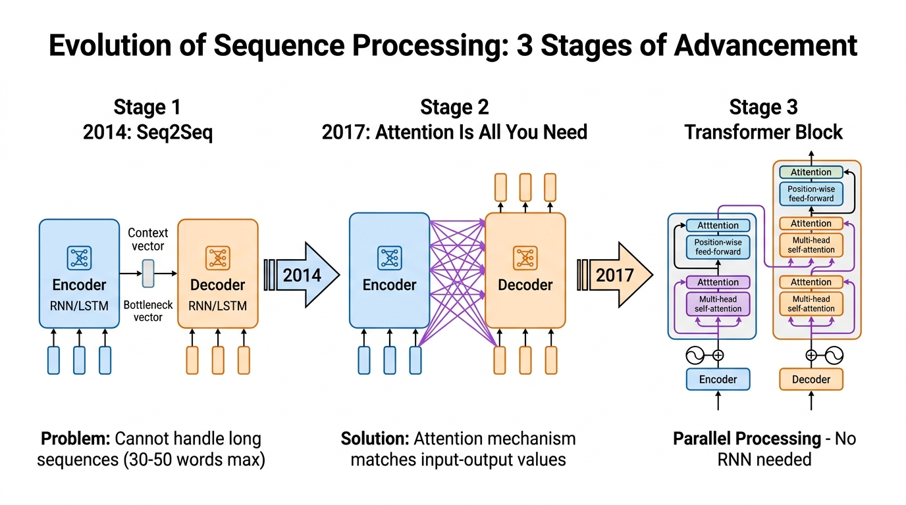

# 🔄 NLP Progression: Understanding the Leap from RNNs and LSTMs to Modern Architectures

> **Zero to Hero Gen AI Course — Module 01: Theoretical Foundations & NLP Evolution**
>
> 📅 Module 1 | ⏱️ Estimated Reading Time: 50 minutes
>
> **Core Objective:** Trace the historical, mathematical, and algorithmic breakthrough of Natural Language Processing. Understand how early sequence modeling struggled with the curse of dimensionality, how Recurrent Neural Networks (RNNs) introduced temporal memory but suffered catastrophic gradient collapse, how LSTMs and GRUs engineered gated highways, why Seq2Seq created the fatal "information bottleneck", how Attention shattered that bottleneck, and why the Transformer's elimination of recurrence sparked the modern Generative AI revolution.

---

## 📑 Table of Contents

1. [The Nature of Language & The Sequence Modeling Challenge](#1-the-nature-of-language--the-sequence-modeling-challenge)
2. [Early NLP: N-Grams and the Markov Limitation](#2-early-nlp-n-grams-and-the-markov-limitation)
3. [Recurrent Neural Networks (RNNs): Bringing Time to Neural Networks](#3-recurrent-neural-networks-rnns-bringing-time-to-neural-networks)
   - [3.1 The Hidden State Recurrence Formulation](#31-the-hidden-state-recurrence-formulation)
   - [3.2 Unrolling Through Time (BPTT)](#32-unrolling-through-time-bptt)
4. [The Fatal Flaw: The Mathematical Proof of Vanishing Gradients](#4-the-fatal-flaw-the-mathematical-proof-of-vanishing-gradients)
   - [4.1 Backpropagation Through Time (BPTT) Derivation](#41-backpropagation-through-time-bptt-derivation)
   - [4.2 The Exploding Gradient Counterpart & Gradient Clipping](#42-the-exploding-gradient-counterpart--gradient-clipping)
5. [Long Short-Term Memory (LSTM): The Gated Cell Highway](#5-long-short-term-memory-lstm-the-gated-cell-highway)
   - [5.1 The Constant Error Carousel: Cell State $C_t$](#51-the-constant-error-carousel-cell-state-c_t)
   - [5.2 The 3 Core Gates Explained Step-by-Step](#52-the-3-core-gates-explained-step-by-step)
   - [5.3 Why Additive Updates Solve Vanishing Gradients](#53-why-additive-updates-solve-vanishing-gradients)
6. [Gated Recurrent Units (GRU): Efficiency & Simplification](#6-gated-recurrent-units-gru-efficiency--simplification)
7. [The Seq2Seq Paradigm & The Information Bottleneck Problem](#7-the-seq2seq-paradigm--the-information-bottleneck-problem)
   - [7.1 Encoder-Decoder Architecture (2014)](#71-encoder-decoder-architecture-2014)
   - [7.2 The Bottleneck Collapse on Long Sentences](#72-the-bottleneck-collapse-on-long-sentences)
8. [The Attention Breakthrough: Soft Alignment (2014–2015)](#8-the-attention-breakthrough-soft-alignment-20142015)
   - [8.1 Bahdanau Additive Attention vs Luong Multiplicative Attention](#81-bahdanau-additive-attention-vs-luong-multiplicative-attention)
   - [8.2 Dynamic Context Vectors & Alignment Heatmaps](#82-dynamic-context-vectors--alignment-heatmaps)
9. [The Great Leap: Why Transformers Replaced Recurrence Entirely (2017)](#9-the-great-leap-why-transformers-replaced-recurrence-entirely-2017)
   - [9.1 The Fundamental Wall of RNNs: The $O(T)$ Sequential Bottleneck](#91-the-fundamental-wall-of-rnns-the-ot-sequential-bottleneck)
   - [9.2 Self-Attention: $O(1)$ Sequential Complexity & Massive GPU Parallelism](#92-self-attention-o1-sequential-complexity--massive-gpu-parallelism)
   - [9.3 Replacing Temporal Order with Positional Encodings](#93-replacing-temporal-order-with-positional-encodings)
10. [Comprehensive Architectural Evolution Matrix](#10-comprehensive-architectural-evolution-matrix)
11. [Hands-On Python Lab: RNN Decay vs LSTM Memory vs Self-Attention](#11-hands-on-python-lab-rnn-decay-vs-lstm-memory-vs-self-attention)
12. [Curated Video Walkthroughs & Visual Animations](#12-curated-video-walkthroughs--visual-animations)
13. [Self-Assessment & Review Questions](#13-self-assessment--review-questions)
14. [Summary & Key Takeaways](#14-summary--key-takeaways)

---

## 1. The Nature of Language & The Sequence Modeling Challenge

Human language is fundamentally different from traditional tabular or image data:
1. **Temporal Order Dictates Meaning:** *"Dog bites man"* is a routine occurrence; *"Man bites dog"* is international news. The order of tokens completely reverses semantic truth.
2. **Arbitrary, Non-Fixed Lengths:** A sentence can be 3 words (*"AI is transformative"*) or 150 words long. Neural networks with fixed-size vector inputs (such as traditional MLPs) cannot naturally process arbitrary length inputs.
3. **Long-Distance Dependencies:** In English, a subject at word 2 can dictate a verb at word 45:
   > *"The **cat**, which had been chased through the dark alleys and across three rooftops by two vicious hounds, **was** exhausted."*

To model language, machine learning models had to solve a central problem: **How do we maintain memory across long sequences without losing the early context?**

---

## 2. Early NLP: N-Grams and the Markov Limitation

Before deep learning, language modeling relied on statistical count models called **N-Grams**.

An N-Gram predicts the next word using the strict **Markov Assumption**—assuming that the probability of word $w_t$ depends *only* on the previous $N-1$ words:

$$P(w_1, w_2, \dots, w_T) \approx \prod_{t=1}^T P(w_t \mid w_{t-N+1}, \dots, w_{t-1})$$

### The Fatal Limitations of N-Grams:
1. **The Curse of Dimensionality:** For vocabulary size $V$, an N-gram table requires $V^N$ parameters. For $V = 50,000$ and a 4-gram ($N=4$), this requires storing $50,000^4 = 6.25 \times 10^{18}$ probabilities—impossible to store and impossible to estimate without encountering zero counts everywhere.
2. **Zero Semantic Generalization:** If the model has seen *"The chef cooked dinner"*, it learns nothing about *"The baker cooked dinner"* because words are treated as arbitrary orthogonal integer IDs with zero shared geometry.
3. **Severe Context Blindness:** An N-gram with $N=3$ (trigram) is mathematically blind to anything said 4 words ago.

---

## 3. Recurrent Neural Networks (RNNs): Bringing Time to Neural Networks

In the late 1980s and popularized in the 2010s, **Recurrent Neural Networks (RNNs)** introduced a revolutionary concept: **a hidden state vector that acts as internal working memory.**

Instead of feeding the entire sentence at once, an RNN processes one token $x_t$ at a time, updating its internal memory $h_t$ at each step.


> ### 🎥 Visual Explainer & Animation
> [](https://www.youtube.com/watch?v=AsNTP8Kwu80)
>
> 🎬 **[StatQuest — Recurrent Neural Networks (RNNs), Clearly Explained!](https://www.youtube.com/watch?v=AsNTP8Kwu80)** (⏱️ 17 mins)  
> 💡 *Visual Highlights:* Step-by-step cartoon walkthrough illustrating how hidden states pass through recurrent loops, how weights are shared across time steps, and why early words fade away.

---

### 3.1 The Hidden State Recurrence Formulation

At time step $t$, the RNN cell receives two inputs:
1. The current input vector: $x_t \in \mathbb{R}^d$
2. The previous hidden state: $h_{t-1} \in \mathbb{R}^h$

It computes the new hidden state $h_t$ and output $\hat{y}_t$ using shared weight matrices:

$$h_t = \tanh(W_{hh} h_{t-1} + W_{xh} x_t + b_h)$$

$$\hat{y}_t = \text{Softmax}(W_{hy} h_t + b_y)$$

Where:
- $W_{xh} \in \mathbb{R}^{h \times d}$ maps input features to hidden dimensions.
- $W_{hh} \in \mathbb{R}^{h \times h}$ maps previous memory to current memory (**the recurrent core**).
- $W_{hy} \in \mathbb{R}^{V \times h}$ maps hidden states to vocabulary output probabilities.
- $\tanh(\cdot)$ bounds the state activations between $[-1, 1]$.

---

### 3.2 Unrolling Through Time (BPTT)

To train an RNN, we unroll the loop across all $T$ time steps. While the network appears deep across time, **the weight matrices $W_{hh}, W_{xh}, W_{hy}$ are identical at every single step**.

```
  y_1            y_2            y_3                   y_T
   ▲              ▲              ▲                     ▲
   │ W_hy         │ W_hy         │ W_hy                │ W_hy
┌──────┐ W_hh  ┌──────┐ W_hh  ┌──────┐ W_hh         ┌──────┐
│ h_1  │──────►│ h_2  │──────►│ h_3  │──────► ··· ──►│ h_T  │
└──────┘       └──────┘       └──────┘              └──────┘
   ▲              ▲              ▲                     ▲
   │ W_xh         │ W_xh         │ W_xh                │ W_xh
  x_1            x_2            x_3                   x_T
(Time 1)       (Time 2)       (Time 3)              (Time T)
```

---

## 4. The Fatal Flaw: The Mathematical Proof of Vanishing Gradients

Despite their conceptual brilliance, standard RNNs failed completely in practice on long texts. If a sentence had more than 10 to 15 words, the RNN suffered from **severe amnesia**.

Why? The answer lies in the calculus of **Backpropagation Through Time (BPTT)**.

---

### 4.1 Backpropagation Through Time (BPTT) Derivation

Let the total loss across all steps be $\mathcal{L} = \sum_{t=1}^T \mathcal{L}_t$. To update the recurrent weight matrix $W_{hh}$, we compute the gradient of loss $\mathcal{L}_T$ at time $T$ with respect to $W_{hh}$:

$$\frac{\partial \mathcal{L}_T}{\partial W_{hh}} = \sum_{k=1}^T \frac{\partial \mathcal{L}_T}{\partial h_T} \left( \frac{\partial h_T}{\partial h_k} \right) \frac{\partial h_k}{\partial W_{hh}}$$

Now, inspect the critical middle Jacobian term: $\frac{\partial h_T}{\partial h_k}$.

By the chain rule across the unrolled sequence:

$$\frac{\partial h_T}{\partial h_k} = \prod_{j=k+1}^T \frac{\partial h_j}{\partial h_{j-1}}$$

Since $h_j = \tanh(W_{hh} h_{j-1} + W_{xh} x_j + b_h)$, the derivative of $h_j$ with respect to $h_{j-1}$ is:

$$\frac{\partial h_j}{\partial h_{j-1}} = \text{diag}\left(1 - \tanh^2(a_j)\right) \cdot W_{hh}^T$$

Where $a_j = W_{hh} h_{j-1} + W_{xh} x_j + b_h$.

Expanding the full product from step $k$ to step $T$:

$$\frac{\partial h_T}{\partial h_k} = \prod_{j=k+1}^T \left[ \text{diag}\left(1 - \tanh^2(a_j)\right) \cdot W_{hh}^T \right]$$

#### Why this causes the gradient to vanish:
1. **The $\tanh'$ bottleneck:** The derivative of $\tanh(z)$ is $1 - \tanh^2(z)$. The maximum possible value of this derivative is **1.0** (at $z=0$), and it rapidly drops to **0.0** as $|z|$ increases. On average, $1 - \tanh^2(z) < 1$.
2. **Repeated Matrix Multiplication ($W_{hh}^{T-k}$):** Suppose the largest eigenvalue of $W_{hh}$ is $\lambda_1$.
   - If $\lambda_1 < 1$, then as the sequence length $T - k$ increases, $\lambda_1^{T-k} \to 0$ **exponentially fast!**
   - After just 15 steps, $(0.8)^{15} \approx 0.035$; after 30 steps, $(0.8)^{30} \approx 0.001$.

The gradient signal originating from the end of the sentence **vanishes to absolute zero** before it ever reaches the early tokens. The model cannot learn to connect words that are far apart!

---

### 4.2 The Exploding Gradient Counterpart & Gradient Clipping

Conversely, if the largest eigenvalue $\lambda_1 > 1$, then $\lambda_1^{T-k} \to \infty$ exponentially fast. The gradient values explode into `NaN` or `Infinity`, destabilizing training.

- **Solution for exploding gradients:** **Gradient Clipping**—if $\|\nabla\| > \text{threshold}$, scale $\nabla \leftarrow \text{threshold} \cdot \frac{\nabla}{\|\nabla\|}$.
- **Solution for vanishing gradients:** Gradient clipping cannot fix vanishing gradients (you cannot scale up a gradient that has mathematically collapsed to zero). A completely new architectural innovation was required.

---

## 5. Long Short-Term Memory (LSTM): The Gated Cell Highway

In 1997, Sepp Hochreiter and Jürgen Schmidhuber published a historic paper: *"Long Short-Term Memory"*.

The core thesis was simple yet brilliant: **To preserve gradients across long time horizons, we must introduce an uninterrupted linear highway where information can flow additively rather than multiplicatively.**

> ### 🎥 Visual Explainer & Animation
> [](https://www.youtube.com/watch?v=YCzL96nL7j0)
>
> 🎬 **[StatQuest — Long Short-Term Memory (LSTM), Clearly Explained](https://www.youtube.com/watch?v=YCzL96nL7j0)** (⏱️ 18 mins)  
> 💡 *Visual Highlights:* Clear cartoon walk-through demonstrating how the Cell State runs along the top, and how the Forget Gate, Input Gate, and Output Gate regulate the flow of long-term memory.

---

### 5.1 The Constant Error Carousel: Cell State $C_t$

The LSTM introduces a dual-memory system:
1. **Hidden State $h_t$ (Short-Term Memory):** Used for immediate predictions at the current step.
2. **Cell State $C_t$ (Long-Term Memory):** Runs straight down the top of the cell with only minimal linear interactions. It acts like a conveyor belt carrying information across dozens or hundreds of steps.

---

### 5.2 The 3 Core Gates Explained Step-by-Step

Information entering, staying in, or exiting the Cell State is strictly regulated by **3 neural gates**. Each gate uses a **sigmoid activation ($\sigma$)**, outputting numbers between $0$ (completely close gate / erase) and $1$ (completely open gate / retain).

```
         Cell State C_{t-1} ───────────────────[ × ]───────────[ + ]──────────────► C_t
                                                 ▲               ▲
                                                 │ f_t           │ i_t × C̃_t
                                              ┌─────┐         ┌─────┐
                                              │  σ  │         │  σ  │   ┌──────┐
                                              └──┬──┘         └──┬──┘   │ tanh │
                                                 │               │      └───┬──┘
         Hidden State h_{t-1} ────┬──────────────┴───────────────┼──────────┼────[ × ]─────► h_t
                                  │                              │          │      ▲
         Input x_t ───────────────┴──────────────────────────────┴──────────┴──────┤ o_t
                                                                                 ┌──┴──┐
                                                                                 │  σ  │
                                                                                 └─────┘
```

#### Gate 1: The Forget Gate ($f_t$)
Decides what percentage of the old long-term memory $C_{t-1}$ to throw away.
$$f_t = \sigma(W_f \cdot [h_{t-1}, x_t] + b_f)$$
- Example: If a new subject appears (*"Bob died... Alice was born"*), the forget gate drops the gender information of the previous subject.

#### Gate 2: The Input Gate ($i_t$) & Candidate State ($\tilde{C}_t$)
Decides what new information from the current token to store in the cell state.
1. The **Input Gate** decides *which* values to update:
   $$i_t = \sigma(W_i \cdot [h_{t-1}, x_t] + b_i)$$
2. The **Candidate Memory Vector** creates a vector of new candidate values:
   $$\tilde{C}_t = \tanh(W_c \cdot [h_{t-1}, x_t] + b_c)$$

#### Step 3: Updating the Cell State ($C_t$)
Combine the gated old memory with the gated new candidate memory via **element-wise addition**:
$$C_t = f_t \odot C_{t-1} + i_t \odot \tilde{C}_t$$

#### Gate 3: The Output Gate ($o_t$) & New Hidden State ($h_t$)
Decides what parts of the long-term cell state should be surfaced as the visible short-term hidden state $h_t$:
$$o_t = \sigma(W_o \cdot [h_{t-1}, x_t] + b_o)$$
$$h_t = o_t \odot \tanh(C_t)$$

---

### 5.3 Why Additive Updates Solve Vanishing Gradients

Look closely at the Cell State update formula:
$$C_t = f_t \odot C_{t-1} + i_t \odot \tilde{C}_t$$

When we calculate the gradient of $C_t$ with respect to $C_{t-1}$:

$$\frac{\partial C_t}{\partial C_{t-1}} = f_t$$

Unlike the RNN formulation where gradients were multiplied by weight matrices and $\tanh'$ derivatives at every step:
- The error gradient flowing backward through the Cell State is **simply multiplied by $f_t$**.
- If the network learns that a piece of information is important, it sets $f_t \approx 1$.
- The gradient flows backwards across 100 time steps virtually untouched:
  $$\frac{\partial C_T}{\partial C_1} \approx \prod_{t=2}^T 1.0 = 1.0$$

This was known as the **Constant Error Carousel (CEC)**, allowing LSTMs to memorize patterns across hundreds of tokens!

---

## 6. Gated Recurrent Units (GRU): Efficiency & Simplification

In 2014, Kyunghyun Cho et al. introduced the **Gated Recurrent Unit (GRU)** as a more computationally efficient variant of the LSTM:
1. **Merged State:** Collapses the separate Cell State $C_t$ and Hidden State $h_t$ into a single hidden state $h_t$.
2. **Two Gates instead of Three:**
   - **Reset Gate ($r_t$):** How much past memory to ignore when computing candidate state.
   - **Update Gate ($z_t$):** Acts simultaneously as both the forget gate and input gate.

### Mathematical Formulation:
$$z_t = \sigma(W_z \cdot [h_{t-1}, x_t] + b_z) \quad \text{(Update Gate)}$$
$$r_t = \sigma(W_r \cdot [h_{t-1}, x_t] + b_r) \quad \text{(Reset Gate)}$$
$$\tilde{h}_t = \tanh(W_h \cdot [r_t \odot h_{t-1}, x_t] + b_h) \quad \text{(Candidate State)}$$
$$h_t = (1 - z_t) \odot h_{t-1} + z_t \odot \tilde{h}_t \quad \text{(Interpolated State)}$$

- **Advantage:** GRU has **25% fewer parameters** than LSTM, trains substantially faster, and achieves nearly identical performance on small-to-medium benchmarks.

---

## 7. The Seq2Seq Paradigm & The Information Bottleneck Problem

In 2014, Google researchers (Ilya Sutskever et al.) and NYU researchers (Kyunghyun Cho et al.) introduced the **Sequence-to-Sequence (Seq2Seq)** framework, unleashing a revolution in Machine Translation, Summarization, and Speech Recognition.



### 7.1 Encoder-Decoder Architecture (2014)

Seq2Seq consists of two separate recurrent networks:
1. **The Encoder:** Reads the variable-length input sequence $(x_1, \dots, x_M)$ and updates its hidden state until the end of the sentence. The final hidden state $h_M$ is called the **Thought Vector** or **Context Vector ($v$)**:
   $$v = h_M$$
2. **The Decoder:** Another RNN initialized with $s_0 = v$. It generates target tokens $(y_1, y_2, \dots, y_N)$ one by one in an autoregressive loop.

```
ENCODER (Reads English):                      DECODER (Generates French):
"The"      "cat"      "slept"                 "Le"       "chat"     "dormait"
  ▲          ▲          ▲                       ▲          ▲          ▲
┌───┐      ┌───┐      ┌───┐   Context Vector  ┌───┐      ┌───┐      ┌───┐
│RNN│─────►│RNN│─────►│RNN│══════════════════►│RNN│─────►│RNN│─────►│RNN│
└───┘      └───┘      └───┘        (v)        └───┘      └───┘      └───┘
```

---

### 7.2 The Bottleneck Collapse on Long Sentences

While Seq2Seq worked well on short 10-word sentences, it suffered a catastrophic failure on real-world text: **The Information Bottleneck**.

> **The Bottleneck Problem:** Regardless of whether the input sentence was 5 words, 50 words, or an entire paragraph, the entire semantic content, grammar, and nuances **had to be squeezed into a single, fixed-size vector $v \in \mathbb{R}^{512}$**.

Try memorizing an entire page of a novel, closing the book, and translating it from memory without looking back at the text. You will forget details, mix up adjectives, and drop entire clauses.

Empirical evaluations by Cho et al. showed that Seq2Seq BLEU scores crashed drastically once sentence length exceeded 20 words.

---

## 8. The Attention Breakthrough: Soft Alignment (2014–2015)

In late 2014, Dzmitry Bahdanau, Kyunghyun Cho, and Yoshua Bengio published the paper that changed the trajectory of modern AI: *"Neural Machine Translation by Jointly Learning to Align and Translate"*.

Their revolutionary insight:
> **"Instead of compressing the whole sentence into a single vector, retain ALL intermediate encoder hidden states $(h_1, h_2, \dots, h_M)$. At each decoding step, let the decoder dynamically LOOK BACK and pay ATTENTION to the most relevant input words!"**

> ### 🎥 Visual Explainer & Animation
> [](https://www.youtube.com/watch?v=eMlx5fFNoYc)
>
> 🎬 **[3Blue1Brown — Attention in transformers, step-by-step | Deep Learning Chapter 6](https://www.youtube.com/watch?v=eMlx5fFNoYc)** (⏱️ 26 mins)  
> 💡 *Visual Highlights:* The premier geometric and visual breakdown of Queries, Keys, and Values matrices, dot-product similarity scoring, Softmax normalization, and context routing.

---

### 8.1 Bahdanau Additive Attention vs Luong Multiplicative Attention

At decoding time step $t$, the decoder has an internal state $s_{t-1}$. It compares its current need $s_{t-1}$ against every encoder state $h_i$ to compute an **alignment score**:

| Attention Type | Formula for Alignment Score $e_{t, i}$ | Description |
|---|---|---|
| **Bahdanau (Additive)** | $e_{t, i} = v_a^T \tanh(W_a s_{t-1} + U_a h_i)$ | Feeds states into a small single-layer MLP |
| **Luong (Dot-Product)** | $e_{t, i} = s_t^T h_i$ | Direct dot product (requires matching dimensions) |
| **Luong (General)** | $e_{t, i} = s_t^T W_a h_i$ | Parameterized bilinear matrix multiplication |

---

### 8.2 Dynamic Context Vectors & Alignment Heatmaps

Once alignment scores $e_{t, i}$ are calculated across all input tokens $i \in \{1, \dots, M\}$:
1. **Softmax Normalization:** Convert raw scores into an attention probability distribution that sums to 1.0:
   $$\alpha_{t, i} = \frac{\exp(e_{t, i})}{\sum_{k=1}^M \exp(e_{t, k})}$$
   Here, $\alpha_{t, i}$ represents: *"How much should the model focus on input word $i$ when generating output word $t$?"*
2. **Dynamic Context Vector ($c_t$):** Compute a weighted average of the encoder hidden states:
   $$c_t = \sum_{i=1}^M \alpha_{t, i} h_i$$
3. **Word Generation:** Combine context $c_t$ with decoder state $s_t$ to predict the next word:
   $$\tilde{s}_t = \tanh(W_c [c_t, s_t])$$
   $$P(y_t \mid y_{<t}, X) = \text{Softmax}(W_s \tilde{s}_t)$$

The Information Bottleneck was completely solved! Even for a 100-word sentence, the model could selectively attend to the 3 exact words it needed at each moment.

---

## 9. The Great Leap: Why Transformers Replaced Recurrence Entirely (2017)

By 2016, the state of the art in NLP was **Bi-directional LSTMs with Attention**. It worked dramatically better than plain RNNs, but it immediately ran into a hard physical wall.

> ### 🎥 Visual Explainer & Animation
> [](https://www.youtube.com/watch?v=zxQyTK8quyY)
>
> 🎬 **[StatQuest — Transformer Neural Networks, Clearly Explained!](https://www.youtube.com/watch?v=zxQyTK8quyY)** (⏱️ 15 mins)  
> 💡 *Visual Highlights:* Step-by-step cartoon animations walking through Multi-Head Attention, Positional Encoding, and Feed-Forward networks, demonstrating why removing recurrence unlocked massive scalability.

---

### 9.1 The Fundamental Wall of RNNs: The $O(T)$ Sequential Bottleneck

Look closely at the recurrent equation of an RNN/LSTM:
$$h_t = f(h_{t-1}, x_t)$$

Notice the strict temporal dependency: **To compute step $t$, you MUST have already completed step $t-1$.**

In computational complexity terms:
- **Sequential operations:** $O(T)$
- You cannot compute token 1,000 until you have sequentially computed tokens 1 through 999.
- Modern GPUs contain thousands of parallel CUDA tensor cores designed for massive simultaneous matrix multiplications.
- **An RNN cannot saturate a modern GPU during training!** Training on millions of books or web pages was physically computationally intractable.

---

### 9.2 Self-Attention: $O(1)$ Sequential Complexity & Massive GPU Parallelism

In June 2017, a team of 8 Google researchers published *"Attention Is All You Need"*, authored by Vaswani et al.

Their radical proposition:
> **"Throw away the recurrent loops entirely. Throw away LSTMs and GRUs. Use ONLY attention mechanisms across all tokens simultaneously!"**

> ### 🎥 Visual Explainer & Animation
> [](https://www.youtube.com/watch?v=wjZofJX0v4M)
>
> 🎬 **[3Blue1Brown — Transformers, the tech behind LLMs | Deep Learning Chapter 5](https://www.youtube.com/watch?v=wjZofJX0v4M)** (⏱️ 27 mins)  
> 💡 *Visual Highlights:* Mind-bending 3D geometric animation showing how self-attention mechanisms allow all tokens in a sentence to communicate with each other simultaneously in parallel tensor streams.

#### How Self-Attention Replaced Recurrence:
In a Transformer, the entire input matrix $X \in \mathbb{R}^{T \times d}$ is multiplied by weight matrices to create three projections at once:
- **Queries ($Q = X W_Q$):** What each token is looking for.
- **Keys ($K = X W_K$):** What each token contains / advertises.
- **Values ($V = X W_V$):** The actual semantic content passed forward.

The entire self-attention across the whole sequence is computed in **a single parallel matrix multiplication**:

$$\text{Attention}(Q, K, V) = \text{Softmax}\left(\frac{Q K^T}{\sqrt{d_k}}\right) V$$

- **Sequential operations:** **$O(1)$!**
- All 1,000 tokens are processed **simultaneously in parallel** across GPU cores.
- This single algorithmic change unlocked the ability to train on trillions of tokens across thousands of GPUs, leading directly to GPT-3, GPT-4, Llama 3, and Claude.

---

### 9.3 Replacing Temporal Order with Positional Encodings

Because the Transformer processes all tokens in parallel with no recurrent loop, it is inherently **permutation-invariant** (to raw self-attention, *"Dog bites man"* and *"Man bites dog"* look identical).

To re-inject sequence order without resorting to recurrent loops, the authors added **Positional Encodings** directly to the input embeddings:

$$PE_{(pos, 2i)} = \sin\left(\frac{pos}{10000^{2i/d_{\text{model}}}}\right)$$

$$PE_{(pos, 2i+1)} = \cos\left(\frac{pos}{10000^{2i/d_{\text{model}}}}\right)$$

Each position in the sequence receives a unique geometric frequency signature, providing full awareness of word order at zero sequential computation cost!

---

## 10. Comprehensive Architectural Evolution Matrix

| Feature | Vanilla RNN (1986) | LSTM (1997) | GRU (2014) | Seq2Seq + Attention (2015) | Transformer (2017–Present) |
|---|---|---|---|---|---|
| **Recurrent Loops?** | Yes | Yes | Yes | Yes | **No (0 Recurrence)** |
| **Sequential Operations** | $O(T)$ (Slow, serial) | $O(T)$ (Slow, serial) | $O(T)$ (Slow, serial) | $O(T)$ (Slow, serial) | **$O(1)$ (Fully Parallel)** |
| **Max Context Window** | ~10 tokens | ~100 tokens | ~100 tokens | ~200 tokens | **128k – 2M+ tokens!** |
| **Vanishing Gradient** | Catastrophic | Solved via Additive Cell State | Solved via Update Gate | Solved across Encoder-Decoder | **Virtually Non-Existent (Residuals + LayerNorm)** |
| **GPU Parallelizability** | Extremely Poor | Extremely Poor | Poor | Poor | **Unrivaled Tensor Scaling** |
| **Long-Range Interaction** | Path length $O(T)$ | Path length $O(T)$ | Path length $O(T)$ | Path length $O(1)$ to Encoder | **Direct $O(1)$ token-to-token connections** |
| **Modern Role** | Historical | Edge IoT / Time-Series | Lightweight Audio/Sensors | Legacy Translation | **Foundational Backbone of all Modern LLMs** |

---

## 11. Hands-On Python Lab: RNN Decay vs LSTM Memory vs Self-Attention

The following self-contained, pure Python script proves:
1. How an unrolled **Vanilla RNN** suffers exponential gradient decay over just 10 steps.
2. How an **LSTM Cell State** preserves gradient signals via additive updates.
3. How **Scaled Dot-Product Self-Attention** computes all-to-all relationships in parallel using matrix operations.

```python
"""
Hands-On Lab: NLP Architectural Progression in Python
======================================================
Course: Zero to Hero Gen AI — Module 01: Theoretical Foundations & NLP Evolution
Topic: Understanding the leap from RNNs and LSTMs to Modern Transformers

Proves:
1. RNN Vanishing Gradient decay over 10 time steps.
2. LSTM Additive Memory gradient preservation.
3. Scaled Dot-Product Self-Attention computed in parallel.
"""

import numpy as np

np.random.seed(42)

# =====================================================================
# PART 1: The RNN Vanishing Gradient Simulation
# =====================================================================
print("=" * 70)
print("PART 1: The Vanilla RNN Vanishing Gradient Simulator")
print("=" * 70)

# In an RNN, dh_T / dh_1 = \prod_{t=2}^T [ (1 - tanh^2(a_t)) * W_hh^T ]
T = 10
W_hh = 0.8  # Typical weight scalar with spectral norm < 1

# Let's track the gradient flowing backward from step 10 to step 1
rnn_gradient = 1.0
print(f"Initial Gradient at Step {T}: {rnn_gradient:.4f}")

for step in range(T - 1, 0, -1):
    # tanh derivative is at most 1.0 (typically around 0.6 - 0.7 in active states)
    tanh_deriv = 0.65
    rnn_gradient = rnn_gradient * tanh_deriv * W_hh
    print(f"  Gradient after propagating back to Step {step:>2}: {rnn_gradient:.6f}")

print(f"\n❌ Result: By Step 1, the RNN gradient is {rnn_gradient:.8f} (Collapsed!)")
print("   The network has zero ability to update early weights based on late errors.")


# =====================================================================
# PART 2: The LSTM Additive Highway Simulation
# =====================================================================
print("\n" + "=" * 70)
print("PART 2: The LSTM Additive Cell State Simulator")
print("=" * 70)

# In an LSTM, dC_T / dC_1 = \prod_{t=2}^T f_t (Forget Gate)
# When the model wants to remember information, it sets f_t close to 1.0!
lstm_gradient = 1.0
forget_gate = 0.98  # Model learned that this feature is crucial

print(f"Initial Gradient at Step {T}: {lstm_gradient:.4f}")

for step in range(T - 1, 0, -1):
    lstm_gradient = lstm_gradient * forget_gate
    print(f"  Cell State Gradient back to Step {step:>2}: {lstm_gradient:.4f}")

print(f"\n✅ Result: By Step 1, the LSTM gradient is {lstm_gradient:.4f} (98%+ Preserved!)")
print("   The Constant Error Carousel preserves memory across deep sequences.")


# =====================================================================
# PART 3: Scaled Dot-Product Self-Attention (The Transformer Core)
# =====================================================================
print("\n" + "=" * 70)
print("PART 3: Scaled Dot-Product Self-Attention (Parallel Matrix Ops)")
print("=" * 70)

# Input sentence: "AI transforms the world" (4 tokens, embedding dim = 8)
tokens = ["AI", "transforms", "the", "world"]
seq_len = len(tokens)
d_model = 8
d_k = 4

# Simulated input token embeddings
X = np.random.randn(seq_len, d_model)

# Linear projection weight matrices (Q, K, V)
W_Q = np.random.randn(d_model, d_k)
W_K = np.random.randn(d_model, d_k)
W_V = np.random.randn(d_model, d_k)

# Step 1: Compute Q, K, V in ONE parallel matrix multiplication! (O(1) time)
Q = X @ W_Q  # Shape: (4, 4)
K = X @ W_K  # Shape: (4, 4)
V = X @ W_V  # Shape: (4, 4)

# Step 2: Compute Attention Scores = (Q @ K.T) / sqrt(d_k)
scores = (Q @ K.T) / np.sqrt(d_k)

# Step 3: Apply Softmax row-wise to get Attention Weights
def softmax(z):
    exp_z = np.exp(z - np.max(z, axis=-1, keepdims=True))
    return exp_z / np.sum(exp_z, axis=-1, keepdims=True)

attention_weights = softmax(scores)

# Step 4: Multiply by Values to get context-rich representations
output = attention_weights @ V

print("Attention Weights Matrix (All-to-All Token Communication):")
print("Tokens:      " + "   ".join([f"{t:>10}" for t in tokens]))
for idx, token in enumerate(tokens):
    weights_str = "   ".join([f"{w:10.4f}" for w in attention_weights[idx]])
    print(f"  {token:>10}: {weights_str}")

print("\n" + "=" * 70)
print("KEY TAKEAWAYS FROM LAB:")
print("1. RNN: Sequential O(T) steps + Exponential gradient vanishing.")
print("2. LSTM: Gated highway protects gradient flow additively.")
print("3. Transformer: 0 recurrence, O(1) sequential time, all tokens attend in parallel!")
print("=" * 70)
```

---

## 12. Curated Video Walkthroughs & Visual Animations

To visually internalize the progression from RNNs and LSTMs to the modern Transformer paradigm, watch these world-renowned video walkthroughs:

| # | Topic / Concept | Recommended Video | Channel / Creator | Why Watch? (Visual & Animation Highlights) |
|---|-----------------|-------------------|-------------------|--------------------------------------------|
| 1 | **Recurrent Neural Networks (RNNs)** | [Recurrent Neural Networks (RNNs), Clearly Explained!](https://www.youtube.com/watch?v=AsNTP8Kwu80) | **StatQuest (Josh Starmer)** | Accessible cartoon animation showing feedback loops, unrolled time steps, and why standard RNNs fail on long sequences. |
| 2 | **Long Short-Term Memory (LSTM)** | [Long Short-Term Memory (LSTM), Clearly Explained](https://www.youtube.com/watch?v=YCzL96nL7j0) | **StatQuest (Josh Starmer)** | Clear step-by-step visual dissection of the Forget Gate, Input Gate, and Output Gate regulating long-term Cell State memory. |
| 3 | **The Attention Mechanism** | [Attention in transformers, step-by-step](https://www.youtube.com/watch?v=eMlx5fFNoYc) | **3Blue1Brown (Grant Sanderson)** | Masterclass 3D animation showing how Query, Key, and Value matrices route contextual focus between tokens. |
| 4 | **Transformer Foundations** | [Transformer Neural Networks, Clearly Explained!](https://www.youtube.com/watch?v=zxQyTK8quyY) | **StatQuest (Josh Starmer)** | Animated breakdown of Self-Attention, Positional Encoding, and why removing recurrence allowed GPUs to train at scale. |
| 5 | **Full Transformer Architecture** | [Transformers, the tech behind LLMs](https://www.youtube.com/watch?v=wjZofJX0v4M) | **3Blue1Brown (Grant Sanderson)** | Unparalleled visual walkthrough of the complete generative Transformer pipeline powering modern LLMs like GPT-4. |

### 🎬 Deep-Dive Video Breakdown

#### 1. [StatQuest — Recurrent Neural Networks (RNNs), Clearly Explained!](https://www.youtube.com/watch?v=AsNTP8Kwu80)
[](https://www.youtube.com/watch?v=AsNTP8Kwu80)
> ⏱️ **Duration:** ~17 mins | 🎯 **Core Concept:** Recurrent Loops, Shared Weight Matrices, Temporal Unrolling  
> 💡 **Key Visual Takeaway:** Watch Josh Starmer illustrate how a word sequence is fed one token at a time into the same shared neuron weights, and why the vanishing gradient problem causes early information to decay.

#### 2. [StatQuest — Long Short-Term Memory (LSTM), Clearly Explained](https://www.youtube.com/watch?v=YCzL96nL7j0)
[](https://www.youtube.com/watch?v=YCzL96nL7j0)
> ⏱️ **Duration:** ~18 mins | 🎯 **Core Concept:** Cell State Highway, Forget Gate, Input Gate, Additive Memory  
> 💡 **Key Visual Takeaway:** Watch how the Cell State acts as a conveyor belt carrying memories across time, while the sigmoid gates scale values between 0 and 1 to decide what to erase or write.

#### 3. [3Blue1Brown — Attention in transformers, step-by-step](https://www.youtube.com/watch?v=eMlx5fFNoYc)
[](https://www.youtube.com/watch?v=eMlx5fFNoYc)
> ⏱️ **Duration:** ~26 mins | 🎯 **Core Concept:** Queries, Keys, Values, Dot-Product Similarity Scoring, Context Routing  
> 💡 **Key Visual Takeaway:** Watch how tokens project questions into Query space and match against Key vectors, pulling Values forward to build context-aware word representations.

#### 4. [StatQuest — Transformer Neural Networks, Clearly Explained!](https://www.youtube.com/watch?v=zxQyTK8quyY)
[](https://www.youtube.com/watch?v=zxQyTK8quyY)
> ⏱️ **Duration:** ~15 mins | 🎯 **Core Concept:** Multi-Head Attention, Scaled Dot-Product, Positional Encodings  
> 💡 **Key Visual Takeaway:** Visualizes the contrast between sequential token processing in RNNs and parallel matrix multiplication in Transformers, demonstrating how positional encodings preserve word order.

#### 5. [3Blue1Brown — Transformers, the tech behind LLMs](https://www.youtube.com/watch?v=wjZofJX0v4M)
[](https://www.youtube.com/watch?v=wjZofJX0v4M)
> ⏱️ **Duration:** ~27 mins | 🎯 **Core Concept:** Residual Stream, Unembedding Layer, Softmax Logits, Autoregressive Generation  
> 💡 **Key Visual Takeaway:** Incredible 3D geometric visualization showing how word embeddings move through high-dimensional space and get projected onto 50,000 vocabulary logits to generate text.

---

## 13. Self-Assessment & Review Questions

### Conceptual Questions

1. **The Sequential Bottleneck:** Why is an RNN mathematically incapable of processing all tokens of a sentence in parallel during training, while a Transformer can?
2. **The Constant Error Carousel:** Explain the exact mathematical difference between how an RNN updates its hidden state $h_t$ versus how an LSTM updates its cell state $C_t$. Why does this prevent vanishing gradients?
3. **The Information Bottleneck:** In standard 2014 Seq2Seq without attention, what is the "thought vector", and why does translation quality crash on sentences longer than 25 words?
4. **Attention as Soft Lookup:** In self-attention, what do the **Query**, **Key**, and **Value** vectors represent conceptually? Give a real-world filing cabinet or search engine analogy.
5. **Positional Encoding Necessity:** If you feed a Transformer the sentence *"The cat ate the mouse"* versus *"The mouse ate the cat"* without positional encodings, what happens? Why?

---

### Fill in the Blanks

6. The mathematical function used by LSTM gates to bound values between 0 and 1 is the __________ function.
7. In Backpropagation Through Time (BPTT), repeated multiplication of the Jacobian matrix causes the __________ gradient problem.
8. The GRU merges the Cell State and Hidden State into one vector and uses two gates: the __________ gate and the __________ gate.
9. In Bahdanau attention, the alignment scores are converted into valid attention weights using the __________ function.
10. The computational complexity of sequential operations in an RNN is __________, whereas in a Transformer self-attention layer it is __________.

---

### Solutions

<details>
<summary>Click to view answers</summary>

1. **Answer:** An RNN's hidden state $h_t = f(h_{t-1}, x_t)$ strictly requires the output of step $t-1$ as an input. Thus, step $t$ cannot be computed until step $t-1$ is complete, forcing $O(T)$ sequential steps. A Transformer has no recurrence; self-attention computes dot-products between all token pairs simultaneously via a single parallel matrix multiplication $Q K^T$.
2. **Answer:** An RNN updates hidden states via **multiplicative interaction through non-linear activation**: $h_t = \tanh(W_{hh} h_{t-1} + \dots)$, causing gradients to be repeatedly scaled by $\tanh' \cdot W_{hh}^T$. An LSTM updates its cell state **additively**: $C_t = f_t \odot C_{t-1} + i_t \odot \tilde{C}_t$. The derivative with respect to $C_{t-1}$ is simply $f_t$, creating an uninterrupted linear highway where gradients flow without exponential decay when $f_t \approx 1$.
3. **Answer:** The thought vector is the single final hidden state $h_M \in \mathbb{R}^d$ of the encoder. It is a bottleneck because it must compress an arbitrary amount of semantic information into a fixed vector size. As sentences grow longer, early information is lost, and complex clauses cannot fit within the fixed dimensionality.
4. **Answer:**
   - **Query ($Q$):** What you are looking for (e.g., search text typed into Google).
   - **Key ($K$):** The index tags / titles of available information (e.g., website page titles).
   - **Value ($V$):** The actual substantive content returned when a Query matches a Key (e.g., the webpage text).
5. **Answer:** Raw self-attention without positional encodings is **permutation-invariant**. Because dot-product attention computes set-to-set similarities without any concept of time or sequence order, both sentences would produce identical attention matrices! Positional encodings are mandatory to inject geometric awareness of word position.
6. **Sigmoid ($\sigma$)**
7. **Vanishing**
8. **Update**; **Reset**
9. **Softmax**
10. **$O(T)$**; **$O(1)$**

</details>

---

## 14. Summary & Key Takeaways

1. **The Sequential Evolution:**
   - **N-Grams:** Statistical count tables limited by the curse of dimensionality ($V^N$) and the Markov assumption.
   - **RNNs:** Introduced internal memory $h_t$, but suffered from exponential vanishing gradients during BPTT.
   - **LSTMs & GRUs:** Engineered gated highways and additive cell states ($C_t$), extending effective memory from 10 to ~100 tokens.
   - **Seq2Seq:** Unlocked variable-to-variable sequence mapping, but ran into the single context vector information bottleneck.
   - **Attention:** Replaced the single vector bottleneck with dynamic soft-alignment lookups across all input tokens.
   - **Transformers:** Removed recurrence completely, achieving $O(1)$ sequential complexity, full parallel GPU training, and paving the path for modern Generative AI.

---

<p align="center">
  <b>Topic Complete! 🚀</b><br>
  Proceed to the next topic in <b>Theoretical Foundations & NLP Evolution</b> to master <i>Neural Word Embeddings: Word2Vec (Skip-gram vs CBOW), GloVe, and FastText</i>!
</p>
