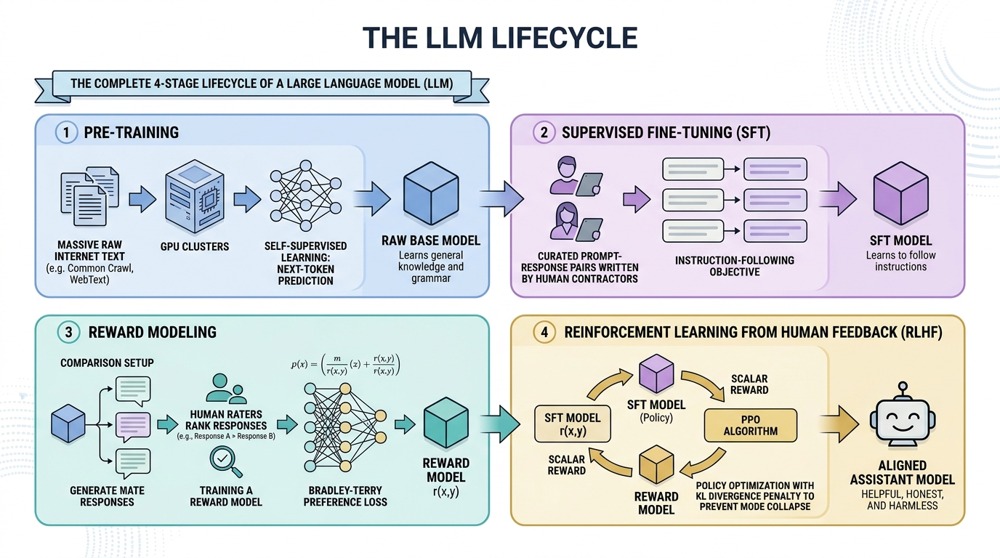

# 04. Training Paradigms: The Lifecycle of an LLM (Pre-Training, SFT, RLHF & DPO)

> **Zero to Hero Gen AI Course — Module 01: Theoretical Foundations & NLP Evolution**  
> ⏱️ Estimated Reading Time: 65 minutes | 🎯 Level: Intermediate to Advanced  
> ☕ **Audience:** Java / Spring Boot Developers transitioning to Python & Generative AI

---

## 0. 🌟 Why this topic matters

When you interact with ChatGPT, Claude, or Llama 3, you are not talking to a raw machine learning model. If you took a raw Transformer fresh out of pre-training and asked it:
> *"What is the capital of France?"*

It would not answer *"Paris"*. It would likely continue generating test questions:
> *"What is the capital of Germany? What is the capital of Italy? Exercise 2: Fill in the blanks."*

Why? Because raw models are **document completers**, not conversational assistants!

Turning raw web data into a helpful, safe, and aligned AI assistant requires a disciplined **four-stage manufacturing lifecycle**:
1. **Pre-Training:** Self-supervised reading of trillions of tokens to learn grammar, world facts, and reasoning priors.
2. **Supervised Fine-Tuning (SFT):** Teaching the model the dialogue protocol and how to behave like an assistant.
3. **Reward Modeling (RM):** Training a mathematical judge to score response quality according to human preferences.
4. **Reinforcement Learning from Human Feedback (RLHF / DPO):** Optimizing the model's behavior to maximize helpfulness while installing strict safety guardrails.

Understanding this lifecycle is essential for enterprise engineers to know **when to use prompting vs. RAG vs. fine-tuning** in production systems.

---

## 1. 🐣 Basic Level – "Explain like I'm new"

### 1.1 The Grand Lifecycle at a Glance

Modern foundation models undergo an assembly line comparable to human education:

```
┌────────────────────────────────────────────────────────────────────────────────────────┐
│                               THE HUMAN EDUCATION ANALOGY                              │
│                                                                                        │
│   STAGE 1: THE WILD SCHOLAR (Pre-Training)                                             │
│   A genius hermit locked in a library for 20 years who reads every book on Earth.      │
│   He knows quantum physics, law, and history.                                          │
│   PROBLEM: If you ask him "How do I fix a flat tire?", he blurts out random facts:     │
│   "Chapter 3: Bicycles. Chapter 4: Air pumps. Buy tires online at 50% discount!"       │
│   He doesn't know you want an answer; he just predicts the next word in the book!      │
│                                                                                        │
│   STAGE 2: THE TRAINED PROFESSIONAL (SFT)                                              │
│   The hermit attends graduate school and works under senior mentors. He learns that    │
│   when a person asks a question, he should respond politely and concisely:             │
│   "Here is how you fix a flat tire: Step 1: Loosen the lug nuts..."                    │
│   PROBLEM: When a criminal asks "How do I hotwire this car?", he eagerly helps!        │
│                                                                                        │
│   STAGE 3: THE ETHICIST & DIPLOMAT (RLHF / DPO)                                        │
│   The professional undergoes ethics and governance certification. He learns when to say:│
│   "I cannot assist with breaking into a vehicle, but I can help you call roadside aid."│
│   He balances helpfulness, truthfulness, and safety under human preferences.           │
└────────────────────────────────────────────────────────────────────────────────────────┘
```

---

### 1.2 The Dog Training Metaphor: Shaping Behavior via Rewards

Supervised training can only teach a model to mimic words it has seen before.

Imagine training a dog:
- **Supervised Learning (SFT):** You physically grab the dog's legs and push them into the "sit" posture. The dog might memorize the posture, but it doesn't understand *why* or what makes a good sit.
- **Reinforcement Learning (RLHF):** You let the dog explore freely. When it performs a clean, attentive sit, you click a clicker and hand it a treat (positive scalar reward). The dog actively modifies its internal decision-making to earn the reward!

---

### ☕ 1.3 The Java & Spring Boot Developer Bridge

```
☕ JAVA ENTERPRISE LIFECYCLE MAPPING:

1. PRE-TRAINING = INSTALLING THE BASE JDK & RUNTIME:
   // Pre-training gives you the entire Java syntax, core libraries, and garbage collector.
   // It knows everything about coding, but contains ZERO business logic for your company.

2. SUPERVISED FINE-TUNING (SFT) = IMPLEMENTING A SPRING REST SERVICE:
   // SFT enforces strict interface contracts:
   @PostMapping("/chat")
   public ResponseDto handlePrompt(@RequestBody UserPromptDto request) {
       // Teaches the model to format responses as a clean, structured DTO rather than raw text.
   }

3. RLHF / GUARDRAILS = SPRING SECURITY & VALIDATION INTERCEPTORS:
   // RLHF is like wrapping endpoints with Spring Security, input sanitization, and governance:
   @PreAuthorize("hasRole('AUTHORIZED_USER')")
   // Prevents toxic payloads, data exfiltration, or dangerous system commands.
```

---

## 2. 🧱 Building Up – Concepts Added One by One

### 2.1 The 4-Stage Lifecycle Architecture



| Stage | Data Volume | Compute Cost (% of Budget) | Duration | Resulting Artifact | Primary Capability |
|---|---|---|---|---|---|
| **1. Pre-Training** | 3 to 15+ Trillion tokens (Raw internet) | **98% – 99%** | Months ($10M - $100M+) | **Base Foundation Model** | World knowledge, grammar, reasoning priors |
| **2. Supervised Fine-Tuning (SFT)** | 10k to 1M high-quality dialog turns | **0.8% – 1%** | Days / Hours | **SFT Model** | Conversational format, instruction following |
| **3. Reward Modeling (RM)** | 50k to 500k human preference pairs | **0.1%** | Hours | **Reward Model $r(x,y)$** | Scores response quality with a scalar float |
| **4. RLHF (PPO / DPO)** | 50k to 200k prompts | **0.5% – 1%** | Days | **Aligned Assistant Model** | Safety guardrails, truthfulness, refusal behavior |

---

### 2.2 Stage 1: Pre-Training (The Self-Supervised Foundation)

Pre-training uses **Self-Supervised Learning** on raw text. No human labels are required—the text itself supplies the training target!

Given sequence $\mathbf{w} = (w_1, \dots, w_T)$, the model minimizes negative log-likelihood:

$$\mathcal{L}_{\text{pretrain}}(\theta) = -\sum_{t=1}^T \log P_\theta(w_t \mid w_1, \dots, w_{t-1})$$

```
Input Tokens:      [ "The",      "capital",     "of",         "France",     "is"     ]
Target Next Token: [ "capital",  "of",          "France",     "is",         "Paris"  ]
                     ▲           ▲              ▲             ▲             ▲
```

#### Chinchilla Compute Scaling Laws (DeepMind 2022):
Hoffmann et al. proved that for compute-optimal training ($C \approx 6ND$):
$$\text{Optimal Tokens } D \approx 20 \times N \text{ (Parameter Count)}$$
- A **7B model** requires at least **140 Billion tokens**.
- Modern models like **Llama 3 8B** train on **15 Trillion tokens** (far beyond compute-optimality to make inference ultra-efficient!).

---

### 2.3 Stage 2: Supervised Fine-Tuning (SFT) & Target Masking

SFT conditions the base model on curated Prompt-Response pairs:

```
<|im_start|>user
Explain quantum entanglement in simple terms.<|im_end|>
<|im_start|>assistant
Imagine you have a pair of magic shoes in two identical boxes...<|im_end|>
```

#### ⚠️ The Critical Technical Detail: Target Masking
The model must **NOT** be penalized for how the user phrased the question!  
Gradients are computed **strictly over assistant response tokens**, masking prompt tokens with label `-100` in PyTorch:

$$\mathcal{L}_{\text{SFT}}(\theta) = -\frac{1}{|y|} \sum_{t=1}^{|y|} \log P_\theta(y_t \mid x, y_{<t})$$

```
Tokens:     [ <|user|>  What  is  2+2?  <|assistant|>  The  answer  is  4.  ]
Labels:     [  -100     -100  -100 -100     -100       The  answer  is  4.  ]
Mask:       [   0         0     0    0        0         1     1     1   1   ]
                        ▲                                       ▲
              PROMPT: Ignored in Loss               RESPONSE: Gradients Computed!
```

---

### 2.4 Stage 3: Reward Modeling & The Bradley-Terry Formula

Direct human scoring of millions of RL outputs is physically and financially impossible. We train a **Reward Model (RM)** to serve as a high-speed digital judge.

Humans evaluate pairwise candidate responses:
- $y_w$: Preferred (winning) response.
- $y_l$: Dispreferred (losing) response.

Using the **Bradley-Terry (1952)** preference model, the probability that humans prefer $y_w$ over $y_l$ is the sigmoid of their scalar reward difference:

$$P(y_w \succ y_l \mid x) = \sigma(r_\theta(x, y_w) - r_\theta(x, y_l)) = \frac{1}{1 + e^{-(r_\theta(x, y_w) - r_\theta(x, y_l))}}$$

The Reward Model is trained by minimizing binary cross-entropy:

$$\mathcal{L}_{\text{RM}}(\theta) = -\mathbb{E}_{(x, y_w, y_l) \sim \mathcal{D}} \left[ \log \sigma\left( r_\theta(x, y_w) - r_\theta(x, y_l) \right) \right]$$

---

### 2.5 Stage 4: RLHF with PPO & The KL Divergence Leash

In RLHF, the model generates responses to maximize the score given by the Reward Model.

```
              ┌────────────────────────────────────────────────────────┐
              │                   PROMPT DATASET (x)                   │
              └───────────────────────────┬────────────────────────────┘
                                          │
                                          ▼
                      ┌────────────────────────────────────────┐
                      │        POLICY MODEL π_θ (LLM)          │
                      │        Generates candidate y           │
                      └───────────┬────────────────┬───────────┘
                                  │                │
            Candidate Response y  │                │ Probability Ratio
                                  ▼                ▼
        ┌──────────────────────────────────┐   ┌───────────────────────────┐
        │       FROZEN REWARD MODEL        │   │    FROZEN REFERENCE SFT   │
        │     Computes scalar score r      │   │   Computes π_ref(y|x)     │
        └─────────────────┬────────────────┘   └─────────────┬─────────────┘
                          │                                  │
                          └─────────────────┬────────────────┘
                                            ▼
                                ┌──────────────────────┐
                                │ COMBINED REWARD WITH │
                                │      KL PENALTY      │
                                └───────────┬──────────┘
                                            │
                                            ▼
                                 PPO GRADIENT UPDATE
```

#### Why We Need the KL Divergence Penalty:
Without constraints, the model commits **Reward Hacking** (Goodhart's Law): it discovers bizarre adversarial text that fools the reward model into outputting $+99.9$, emitting gibberish.

We enforce a **Kullback-Leibler (KL) Divergence penalty** as a mathematical safety leash:

$$\text{Total Reward } R(x, y) = r_\theta(x, y) - \beta \, D_{\text{KL}}\left(\pi_\phi(y \mid x) \parallel \pi_{\text{SFT}}(y \mid x)\right)$$

$$\mathbb{D}_{\text{KL}} \approx \sum_{t=1}^T \left[ \log \pi_\phi(y_t \mid x, y_{<t}) - \log \pi_{\text{SFT}}(y_t \mid x, y_{<t}) \right]$$

- If the policy drifts too far from the original fluent SFT model, the penalty explodes, neutralizing fake rewards!

---

### 2.6 The Modern Revolution: Direct Preference Optimization (DPO)

In late 2023, Rafailov et al. (Stanford) revolutionized alignment by proving that **you don't need a separate reward model or complex PPO actor-critic loop!**

They proved mathematically that under the KL-constrained RL objective, the reward function can be expressed directly in terms of the optimal policy:

$$r(x, y) = \beta \log \frac{\pi^*(y \mid x)}{\pi_{\text{ref}}(y \mid x)} + \beta \log Z(x)$$

Substituting this directly into the Bradley-Terry loss yields the **DPO Loss**:

$$\mathcal{L}_{\text{DPO}}(\theta; \pi_{\text{ref}}) = -\mathbb{E}_{(x, y_w, y_l) \sim \mathcal{D}} \left[ \log \sigma\left( \beta \log \frac{\pi_\theta(y_w \mid x)}{\pi_{\text{ref}}(y_w \mid x)} - \beta \log \frac{\pi_\theta(y_l \mid x)}{\pi_{\text{ref}}(y_l \mid x)} \right) \right]$$

#### Why DPO Took Over the Industry:
- **PPO:** Needs 4 models in GPU VRAM (Policy, Critic, Reference, Reward).
- **DPO:** Needs only **2 models** in VRAM (Active Policy, Frozen Reference).
- Trains with standard, stable cross-entropy gradients—used to train **Llama 3, Mistral, and Zephyr**!

---

## 3. 🧪 Hands-On Lab & Practice Exercises

### Complete Python Lab: Simulating All 4 Lifecycle Loss Functions

You can execute the verified lab script directly in your terminal:
```bash
python "1. Theoretical Foundations & NLP Evolution/code/llm_training_paradigms_lab.py"
```

```python
"""
Hands-On Lab: The Complete LLM Training Lifecycle in Python
=============================================================
Course: Zero to Hero Gen AI — Module 01: Theoretical Foundations & NLP Evolution
Simulates:
1. Pre-Training Next-Token Cross-Entropy Loss.
2. SFT Target-Masked Cross-Entropy Loss.
3. Bradley-Terry Reward Model Loss.
4. Direct Preference Optimization (DPO) Loss.
"""

import numpy as np

np.random.seed(42)

def softmax(z):
    exp_z = np.exp(z - np.max(z, axis=-1, keepdims=True))
    return exp_z / np.sum(exp_z, axis=-1, keepdims=True)

def sigmoid(z):
    return 1.0 / (1.0 + np.exp(-z))

# 1. Pre-Training Loss
def compute_pretrain_loss(logits, targets):
    probs = softmax(logits)
    batch_size, seq_len, _ = logits.shape
    losses = []
    for b in range(batch_size):
        for t in range(seq_len):
            target_idx = targets[b, t]
            losses.append(-np.log(probs[b, t, target_idx] + 1e-12))
    return np.mean(losses)

# 2. SFT Target-Masked Loss
def compute_sft_masked_loss(logits, targets, mask):
    probs = softmax(logits)
    batch_size, seq_len, _ = logits.shape
    losses = []
    for b in range(batch_size):
        for t in range(seq_len):
            if mask[b, t] == 1:  # Only compute loss on assistant tokens!
                target_idx = targets[b, t]
                losses.append(-np.log(probs[b, t, target_idx] + 1e-12))
    return np.mean(losses)

# 3. Reward Modeling (Bradley-Terry Loss)
def compute_bradley_terry_loss(r_winner, r_loser):
    diff = r_winner - r_loser
    prob_prefer_winner = sigmoid(diff)
    loss = -np.log(prob_prefer_winner + 1e-12)
    return loss, prob_prefer_winner

# 4. Direct Preference Optimization (DPO) Loss
def compute_dpo_loss(pi_theta_w, pi_ref_w, pi_theta_l, pi_ref_l, beta=0.1):
    log_ratio_w = np.log(pi_theta_w) - np.log(pi_ref_w)
    log_ratio_l = np.log(pi_theta_l) - np.log(pi_ref_l)
    diff = beta * (log_ratio_w - log_ratio_l)
    return -np.log(sigmoid(diff) + 1e-12)

# Execution Verification
dummy_logits = np.random.randn(2, 4, 10)
dummy_targets = np.random.randint(0, 10, (2, 4))
dummy_mask = np.array([[0, 0, 1, 1], [0, 1, 1, 1]])

print("1. Pre-Training Loss:", round(compute_pretrain_loss(dummy_logits, dummy_targets), 4))
print("2. SFT Masked Loss:  ", round(compute_sft_masked_loss(dummy_logits, dummy_targets, dummy_mask), 4))
loss_rm, p_win = compute_bradley_terry_loss(r_winner=2.5, r_loser=-1.0)
print(f"3. Bradley-Terry Loss: {loss_rm:.4f} (Win Probability: {p_win * 100:.2f}%)")
print("4. DPO Loss:          ", round(compute_dpo_loss(0.4, 0.2, 0.1, 0.3), 4))
```

---

### Practice Exercises (Easy to Hard)

#### Exercise 1: Chinchilla Parameter Math (Easy)
**Question**: According to Chinchilla scaling laws ($D \approx 20N$), if your engineering team has enough compute budget to train a 14-Billion parameter foundation model, how many tokens must your data team curate?
<details>
<summary>👉 View Answer</summary>
<b>Answer:</b>  
$$D = 20 \times N = 20 \times 14 \times 10^9 = \mathbf{280 \text{ Billion tokens}}$$
</details>

---

#### Exercise 2: Bradley-Terry Pairwise Probability (Medium)
**Question**: If a Reward Model assigns response $A$ a scalar score of $+3.5$ and response $B$ a score of $+1.5$, what is the predicted probability that human evaluators prefer response $A$?
<details>
<summary>👉 View Answer</summary>
<b>Answer:</b>  
$$\Delta r = 3.5 - 1.5 = 2.0$$
$$P(A \succ B) = \sigma(2.0) = \frac{1}{1 + e^{-2.0}} \approx \frac{1}{1 + 0.1353} \approx \mathbf{0.8808} \text{ (88.08\%)}$$
</details>

---

#### Exercise 3: Prompt Masking Rationale (Hard)
**Question**: Why does SFT strictly mask out prompt tokens (setting target labels to `-100`)? What happens if you train an LLM on prompts without masking?
<details>
<summary>👉 View Answer</summary>
<b>Answer:</b>  
Prompts reflect user inputs, containing idiosyncratic phrasing, typos, and formatting variations. If prompt tokens are included in the loss, the model wastes valuable gradient capacity trying to predict user typos and quirks. Target masking ensures the model devotes 100% of its learning capacity to generating high-quality assistant responses.
</details>

---

## 4. ⚙️ Pro Level – Internals & Interview Q&A

### 4.1 The Alignment Trilemma: Helpful, Honest, Harmless (HHH)

```
                                  THE HHH TRIANGLE
                                     Helpfulness
                                         ▲
                                        / \
                                       /   \
                                      /     \
                         Honesty   ◄───────────►   Harmlessness
```

- **Helpful vs. Harmless:** If a locked-out homeowner asks how to pick a padlock, an over-aligned model refuses (*"I cannot assist with burglary"*), creating user frustration.
- **Honest vs. Helpful:** When the model does not know an answer, being "helpful" tempts it to invent confident falsehoods (hallucination). An honest model admits ignorance (*"I do not know"*).

---

### 4.2 Top Technical Interview Questions & Answers

#### Q1: "Why can't we skip SFT and go directly from Pre-Training to RLHF?"
**Answer:**  
In RLHF, the model must explore candidate responses that score reasonably well on the Reward Model. A raw pre-trained base model outputs unstructured document completions, not conversational answers. If you feed prompts directly to a base model in an RL loop, virtually all candidate generations are irrelevant text completions scoring near zero, meaning the RL algorithm receives zero positive gradient signals to guide optimization.

#### Q2: "What is Reward Hacking in RLHF, and how does the KL penalty mathematically prevent it?"
**Answer:**  
Reward Hacking occurs when the policy exploits vulnerabilities in the Reward Model, finding bizarre token sequences that trick the judge into outputting high scores without being genuinely helpful. The KL divergence penalty ($\beta \log \frac{\pi_\phi}{\pi_{\text{SFT}}}$) acts as a mathematical leash: if the policy's token probability distribution drifts too far from the reference model, a massive penalty is subtracted from the reward, destroying fake scores.

---

## 5. ⚡ Quick Revision (Cheat-Sheet)

```
┌─────────────────────┬───────────────────────────┬───────────────────────────┬─────────────────────────┐
│ STAGE               │ INPUT DATA                │ PRIMARY OBJECTIVE         │ ARTIFACT PRODUCED       │
├─────────────────────┼───────────────────────────┼───────────────────────────┼─────────────────────────┤
│ 1. Pre-Training     │ 3-15T Unlabeled Tokens    │ Next-Token Prediction     │ Base Model (Knowledge)  │
│ 2. SFT              │ 10k-1M Dialog Turns       │ Target-Masked Imitation   │ Instruct / Chat Model   │
│ 3. Reward Modeling  │ 50k-500k Ranked Pairs     │ Bradley-Terry Sigmoid Loss│ Reward Model (Judge)    │
│ 4. RLHF / DPO       │ 50k-200k Prompts / Pairs  │ PPO + KL Leash / DPO Loss │ Aligned Production Model│
└─────────────────────┴───────────────────────────┴───────────────────────────┴─────────────────────────┘
```

---

## 6. 🎬 References & Visual Learning Videos

To master the complete LLM training lifecycle:

| Category | Channel / Creator | Exact Search Phrase | Why Watch |
|---|---|---|---|
| 🇮🇳 **Telugu** | **Python Life (Telugu)** | `Python Life Telugu What is Fine-Tuning LLM` | Clear Telugu explanation of pre-training vs fine-tuning and domain adaptation. |
| 🇮🇳 **Telugu** | **Vamsi Bhavani** | `Vamsi Bhavani How LLMs are trained Pre-training and Fine-tuning Telugu` | High-energy Telugu overview covering the transition from base models to chat assistants. |
| 🎥 **Industry Masterclass**| **Andrej Karpathy** | `Andrej Karpathy State of GPT` | The definitive 42-minute industry keynote breaking down Pretraining, SFT, Reward Modeling, and RLHF. |
| 🎥 **Intuition Deep-Dive** | **Andrej Karpathy** | `Andrej Karpathy Intro to Large Language Models` | High-level mental models explaining internet compression, hallucinations, and safety alignment. |
| 🎥 **Visual Math** | **StatQuest (Josh Starmer)** | `StatQuest Neural Networks Part 6: Cross Entropy` | Visual derivation of the Cross-Entropy loss function driving both Pre-training and SFT. |
| 🎥 **3D Optimization** | **3Blue1Brown** | `3Blue1Brown Gradient descent, how neural networks learn` | 3D calculus visualization of how gradient vectors steer billions of parameters down loss valleys. |
