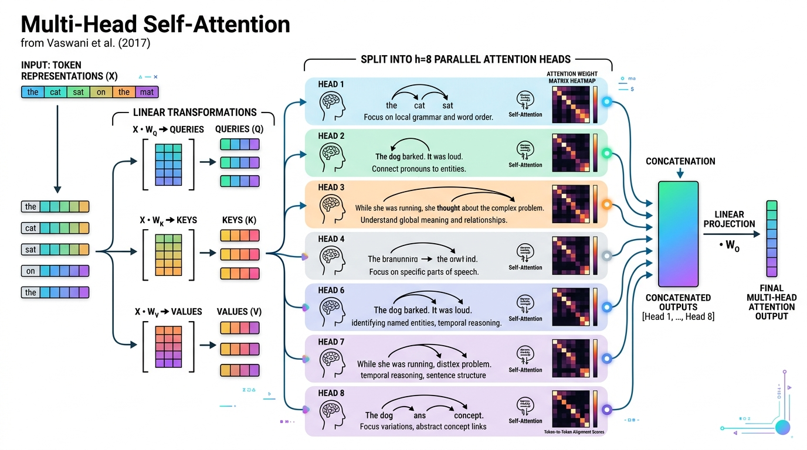
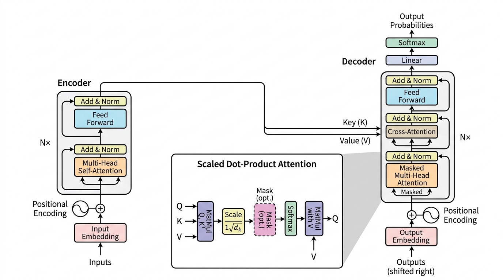

# 03. Transformer Deep-Dive: Mastering the Mechanics of the "Attention is All You Need" Paper

> **Zero to Hero Gen AI Course — Module 01: Theoretical Foundations & NLP Evolution**  
> ⏱️ Estimated Reading Time: 60 minutes | 🎯 Level: Intermediate to Advanced  
> ☕ **Audience:** Java / Spring Boot Developers transitioning to Python & Generative AI

---

## 0. 🌟 Why this topic matters

Every breakthrough model you use today—from **GPT-4o**, **Claude 3.5 Sonnet**, and **Llama 3** to code engines like **GitHub Copilot**—is fundamentally an implementation of the **Transformer architecture**.

Published in 2017 by Google researchers under the title *"Attention Is All You Need"*, this single 15-page paper triggered the largest paradigm shift in computing history. It replaced decades of complex recurrent loops and convolutional filters with an elegant, parallel mathematical engine: **Self-Attention**.

For software engineers coming from Java and Spring Boot:
- A Transformer is not magic; it is a **parallel vector transformation pipeline**.
- It treats words as coordinate vectors in high-dimensional space ($d_{\text{model}} = 512$ or higher).
- It allows all words in a sentence to communicate with each other simultaneously in a single GPU operation.

Mastering the internal mechanics of the Transformer gives you the exact mental model needed to understand context windows, tokens, temperature sampling, and modern LLM inference.

---

## 1. 🐣 Basic Level – "Explain like I'm new"

### 1.1 The Paradigm Shift: From Sequential Trains to Global Networks

In earlier RNNs and LSTMs, processing text was like a **single-track train**: Token 1 had to arrive at Station 1 before Token 2 could move. If your sentence had 500 words, you had to wait through 500 serial steps ($O(T)$ latency).

A Transformer is a **high-speed satellite network**:
- All 500 words enter the network **at the exact same microsecond** ($O(1)$ sequential operations).
- Every word immediately beams signals to every other word in parallel.
- Thousands of GPU CUDA tensor cores process the entire document simultaneously.

```
+-----------------------------------------------------------------------------------------+
|                                THE PARADIGM SHIFT (2017)                               |
|                                                                                         |
|   Traditional NLP (RNN/LSTM):     Token 1  ──> Token 2  ──> Token 3  ──> Token 4       |
|                                   [Sequential Loop: Cannot Parallelize on GPUs]         |
|                                                                                         |
|   The Transformer (Vaswani 2017): Token 1 ◄────► Token 2 ◄────► Token 3 ◄────► Token 4  |
|                                   [All-to-All Parallel Attention: O(1) Sequential Path] |
+-----------------------------------------------------------------------------------------+
```

---

### 1.2 Three Real-World Mental Models & Analogies

#### 📚 Model 1: The Library Search Engine (Query, Key, Value)
At the heart of the Transformer is the triplet: **Query ($Q$)**, **Key ($K$)**, and **Value ($V$)**.  
Think of visiting a university research library:
1. **Query ($Q$):** The search term you type into the library terminal (*"How do neural networks learn?"*). This is **what a token is actively looking for**.
2. **Key ($K$):** The index tags and book spine labels in the library catalog (*"Deep Learning / Backpropagation"*). This is **what each token advertises about itself**.
3. **Value ($V$):** The actual printed text inside the book. This is **the substantive semantic content passed forward**.

```
                ┌────────────────────────────────────────────────────────┐
                │          Query (Q): What am I looking for?             │
                └──────────────────────────┬─────────────────────────────┘
                                           │
                        Dot-Product Match against all Keys
                                           ▼
       ┌──────────────────┐       ┌──────────────────┐       ┌──────────────────┐
       │  Key 1: Tag "AI" │       │  Key 2: Tag "Fly"│       │ Key 3: Tag "Bird"│
       └────────┬─────────┘       └────────┬─────────┘       └────────┬─────────┘
                │                          │                          │
        Match: 0.05                Match: 0.15                Match: 0.80  (Softmax Weights)
                │                          │                          │
                ▼                          ▼                          ▼
       ┌──────────────────┐       ┌──────────────────┐       ┌──────────────────┐
       │ Value 1: Data    │       │ Value 2: Data    │       │ Value 3: Data    │
       └──────────────────┘       └──────────────────┘       └──────────────────┘
                │                          │                          │
                └──────────────────────────┼──────────────────────────┘
                                           ▼
                        Weighted Sum of Values = Context Vector
```

---

#### 👥 Model 2: The Advisory Board (Multi-Head Attention)
If a CEO consults only a single advisor, that advisor might focus exclusively on legal contracts and ignore technology or marketing.  
Instead, the Transformer consults an **advisory board of 8 specialized heads**:
- **Head 1 (Grammar Specialist):** Checks subject-verb agreement (*"They"* $\to$ *"were"*).
- **Head 2 (Pronoun Specialist):** Resolves coreferences (*"it"* $\to$ *"the database"*).
- **Head 3 (Action Specialist):** Connects subjects to verbs (*"developer"* $\to$ *"deployed"*).
- **Head 4 (Adjective Specialist):** Connects qualifiers to nouns (*"production"* $\to$ *"server"*).

Each head looks at the exact same sentence from its own unique projection angle. At the end, their insights are concatenated into a master representation.

---

#### ☕ 1.3 The Java Developer Bridge: Middleware Pipelines & ForkJoin

```
☕ JAVA ENTERPRISE ARCHITECTURE COMPARISONS:

1. MULTI-HEAD ATTENTION vs PARALLEL WORKER POOL:
   // Multi-Head Attention acts like an ExecutorService submitting tasks to 8 specialized beans
   CompletableFuture<HeadOutput> head1 = CompletableFuture.supplyAsync(() -> syntaxHead.attend(q, k, v));
   CompletableFuture<HeadOutput> head2 = CompletableFuture.supplyAsync(() -> pronounHead.attend(q, k, v));
   // Combine all 8 heads into a single consolidated tensor
   CompletableFuture.allOf(head1, head2, ...).join();

2. RESIDUAL CONNECTIONS (Add & Norm) vs JAVA FILTER CHAINS:
   // In a Spring Security filter chain, you pass the original HttpServletRequest forward
   // so downstream handlers always retain access to the raw payload:
   Response processed = filter.apply(request);
   Response combined = request.merge(processed); // Residual Skip Connection: x + F(x)!
```

---

## 2. 🧱 Building Up – Concepts Added One by One

### 2.1 Scaled Dot-Product Attention: The Mathematical Engine

The formal equation from Section 3.2.1 of the 2017 paper is:

$$\text{Attention}(Q, K, V) = \text{softmax}\left(\frac{QK^T}{\sqrt{d_k}}\right)V$$

Where:
- $Q \in \mathbb{R}^{n \times d_k}$ is the matrix of Queries ($n$ tokens, dimension $d_k$).
- $K \in \mathbb{R}^{m \times d_k}$ is the matrix of Keys ($m$ tokens, dimension $d_k$).
- $V \in \mathbb{R}^{m \times d_v}$ is the matrix of Values ($m$ tokens, dimension $d_v$).
- $QK^T \in \mathbb{R}^{n \times m}$ computes the dot-product similarity between every query and key pair.
- $\sqrt{d_k}$ is the mathematical scaling factor (in the base model, $d_k = 64$, so $\sqrt{d_k} = 8$).
- $\text{softmax}(\cdot)$ normalizes each row into probabilities summing to $1.0$.

```
   Q Matrix             K^T Matrix                 Attention Weights                V Matrix             Output Matrix
  (n x d_k)             (d_k x m)                       (n x m)                     (m x d_v)              (n x d_v)

 ┌───────────┐         ┌───────────┐                 ┌───────────┐                ┌───────────┐          ┌───────────┐
 │   q_1     │         │           │                 │ a_11 a_12 │                │   v_1     │          │   out_1   │
 │   q_2     │    x    │ k_1   k_2 │    ==> Softmax  │ a_21 a_22 │      x         │   v_2     │    =     │   out_2   │
 │   ...     │         │           │     (QK^T/√d_k) │ ...   ... │                │   ...     │          │   ...     │
 │   q_n     │         │           │                 │ a_n1 a_nm │                │   v_m     │          │   out_n   │
 └───────────┘         └───────────┘                 └───────────┘                └───────────┘          └───────────┘
```

---

### 2.2 Mathematical Proof: Why Scale by $1/\sqrt{d_k}$?

A classic interview question: **Why divide by $\sqrt{d_k}$? What happens if you omit it?**

Let query vector $q \in \mathbb{R}^{d_k}$ and key vector $k \in \mathbb{R}^{d_k}$ have independent elements with mean 0 and variance 1:
$$\mathbb{E}[q_i] = 0, \quad \text{Var}(q_i) = 1, \quad \mathbb{E}[k_i] = 0, \quad \text{Var}(k_i) = 1$$

The dot product is $S = q \cdot k = \sum_{i=1}^{d_k} q_i k_i$.

Computing the variance of $S$:
$$\text{Var}(S) = \sum_{i=1}^{d_k} \text{Var}(q_i k_i) = \sum_{i=1}^{d_k} 1 = d_k$$
$$\text{Standard Deviation of } S = \sqrt{d_k}$$

#### The Catastrophe Without Scaling:
For large dimensions (e.g., $d_k = 64$), the standard deviation is $\sqrt{64} = 8$. Dot products reach values like $+16$ and $-16$.
When fed into the **Softmax function**:
$$\text{softmax}([+16, -16]) \approx [1.0, 0.0]$$
The softmax pushes into extreme saturation where its gradient is virtually **zero**:
$$\frac{\partial \text{softmax}(z)_i}{\partial z_j} \approx 0$$
**Gradients vanish completely during backpropagation!**

#### The Scaling Fix:
Dividing by $\sqrt{d_k}$ scales variance back to **1.0**:
$$\text{Var}\left(\frac{S}{\sqrt{d_k}}\right) = \frac{1}{d_k} \text{Var}(S) = \frac{1}{d_k} \cdot d_k = 1.0$$
This preserves stable, active gradients throughout training!

---

### 2.3 Multi-Head Attention (MHA): Splitting and Concatenation



Instead of computing one giant attention matrix of dimension $d_{\text{model}} = 512$, the Transformer linearly projects $Q, K, V$ into $h = 8$ parallel subspaces:

$$\text{head}_i = \text{Attention}(Q W_i^Q, K W_i^K, V W_i^V)$$

Where each head has dimension:
$$d_k = d_v = d_{\text{model}} / h = 512 / 8 = 64$$

The outputs are concatenated and multiplied by an output projection matrix $W^O$:

$$\text{MultiHead}(Q, K, V) = \text{Concat}(\text{head}_1, \dots, \text{head}_8) W^O$$

> 💡 **Zero Extra Cost:** Because each head operates on $64$ dimensions rather than $512$, running 8 heads in parallel costs the exact same compute as a single 512-dim head!

---

### 2.4 The Full Transformer Architecture Visualized

Below is the definitive architecture from the 2017 paper:



1. **The Encoder Stack (Left, $N = 6$):**
   - **Sub-Layer 1:** Bidirectional Multi-Head Self-Attention.
   - **Sub-Layer 2:** Position-wise Feed-Forward Network ($\text{FFN}(x) = \max(0, x W_1 + b_1) W_2 + b_2$).
   - Both sub-layers wrapped with Residual Connections and Layer Normalization: $\text{LayerNorm}(x + \text{SubLayer}(x))$.
2. **The Decoder Stack (Right, $N = 6$):**
   - **Sub-Layer 1:** Masked Multi-Head Self-Attention (Causal Mask).
   - **Sub-Layer 2:** Multi-Head Cross-Attention ($Q$ from Decoder, $K$ and $V$ from Encoder).
   - **Sub-Layer 3:** Position-wise Feed-Forward Network.
   - Final Linear layer + Softmax projecting onto the vocabulary $|V|$.

---

### 2.5 Causal Masking: Preventing the Decoder from Cheating

During training, we feed the entire target sentence into the decoder at once for maximum GPU speed (Teacher Forcing). But during generation, the model cannot peek at future tokens!

We enforce this by adding an upper-triangular **Causal Mask ($M$)** filled with $-\infty$:

$$M = \begin{bmatrix} 0 & -\infty & -\infty & -\infty \\ 0 & 0 & -\infty & -\infty \\ 0 & 0 & 0 & -\infty \\ 0 & 0 & 0 & 0 \end{bmatrix}$$

$$\text{MaskedAttention} = \text{softmax}\left(\frac{QK^T}{\sqrt{d_k}} + M\right)V$$

Because $e^{-\infty} = 0$, attention to future tokens becomes **identically 0.0**!

---

### 2.6 Positional Encodings: Giving Order to Sets

Because self-attention is a set operation, *"Dog bites man"* and *"Man bites dog"* produce identical attention matrices without positional tags!

Vaswani et al. added sinusoidal waves of different frequencies directly to token embeddings:

$$PE_{(pos, 2i)} = \sin\left(\frac{pos}{10000^{2i/d_{\text{model}}}}\right), \quad PE_{(pos, 2i+1)} = \cos\left(\frac{pos}{10000^{2i/d_{\text{model}}}}\right)$$

- High frequencies update every step; low frequencies cycle slowly across thousands of tokens.
- For any offset $k$, $PE_{pos+k}$ is a simple linear transformation of $PE_{pos}$, allowing attention to learn relative distances easily.

---

### 2.7 Residual Connections & Layer Normalization (Add & Norm)

1. **Residual Connections ($x + \mathcal{F}(x)$):** Provide an unobstructed highway for gradients to flow straight backward during backpropagation ($\frac{\partial \mathcal{L}}{\partial x} = \frac{\partial \mathcal{L}}{\partial y} \cdot I + \dots$), allowing models to stack 100+ layers deep without degradation.
2. **Layer Normalization vs. Batch Normalization:**
   - **Batch Normalization (BN):** Normalizes across samples in a batch. Breaks in NLP because sentences have variable lengths!
   - **Layer Normalization (LN):** Normalizes across the feature dimensions for each individual sample independently:
     $$\text{LN}(x) = \frac{x - \mu}{\sqrt{\sigma^2 + \epsilon}} \odot \gamma + \beta$$
3. **Pre-LN vs. Post-LN:**
   - **Post-LN (2017 Transformer):** $\text{LN}(x + \mathcal{F}(x))$. Fragile at initialization; requires learning rate warmups.
   - **Pre-LN (Modern GPT-4, Llama 3):** $x + \mathcal{F}(\text{LN}(x))$. Extremely stable; trains smoothly without warmups.

---

### 2.8 The 3 Modern Architectural Archetypes

```
┌────────────────────────────────────────────────────────────────────────┐
│                      THE 3 TRANSFORMER ARCHETYPES                      │
├──────────────────────┬──────────────────────┬──────────────────────────┤
│     ENCODER-ONLY     │     DECODER-ONLY     │     ENCODER-DECODER      │
├──────────────────────┼──────────────────────┼──────────────────────────┤
│ BERT, RoBERTa        │ GPT-4, Claude, Llama │ Original 2017, T5, BART  │
│ Bidirectional        │ Causal Masked        │ Bidirectional + Causal   │
│ Classification / NER │ Autoregressive Chat  │ Translation / Summary    │
└──────────────────────┴──────────────────────┴──────────────────────────┘
```

---

## 3. 🧪 Hands-On Lab & Practice Exercises

### Complete Python Lab: Transformer Mechanics in Pure NumPy

You can execute the verified lab script directly in your terminal:
```bash
python "1. Theoretical Foundations & NLP Evolution/code/transformer_deep_dive_lab.py"
```

```python
"""
Hands-On Lab: Complete Transformer Mechanics from Scratch (NumPy)
=================================================================
Course: Zero to Hero Gen AI — Module 01: Theoretical Foundations & NLP Evolution
Paper: "Attention Is All You Need" (Vaswani et al., 2017)
"""

import numpy as np

np.random.seed(42)

def softmax(z, axis=-1):
    """Numerically stable softmax."""
    exp_z = np.exp(z - np.max(z, axis=axis, keepdims=True))
    return exp_z / np.sum(exp_z, axis=axis, keepdims=True)

# ---------------------------------------------------------------------------
# 1. Scaled Dot-Product Attention (with optional Causal Mask)
# ---------------------------------------------------------------------------
def scaled_dot_product_attention(Q, K, V, mask=None):
    """
    Attention(Q, K, V) = softmax( (Q @ K.T) / sqrt(d_k) + mask ) @ V
    """
    d_k = Q.shape[-1]
    scores = np.matmul(Q, np.swapaxes(K, -2, -1)) / np.sqrt(d_k)
    
    if mask is not None:
        scores = scores + mask
        
    weights = softmax(scores, axis=-1)
    context = np.matmul(weights, V)
    return context, weights

# ---------------------------------------------------------------------------
# 2. Multi-Head Attention Class
# ---------------------------------------------------------------------------
class MultiHeadAttentionNumPy:
    def __init__(self, d_model=64, num_heads=4):
        assert d_model % num_heads == 0
        self.d_model = d_model
        self.num_heads = num_heads
        self.d_k = d_model // num_heads
        
        # Projection matrices
        self.W_Q = np.random.randn(d_model, d_model) * 0.05
        self.W_K = np.random.randn(d_model, d_model) * 0.05
        self.W_V = np.random.randn(d_model, d_model) * 0.05
        self.W_O = np.random.randn(d_model, d_model) * 0.05

    def split_heads(self, x):
        batch_size, seq_len, _ = x.shape
        x = x.reshape(batch_size, seq_len, self.num_heads, self.d_k)
        return np.transpose(x, (0, 2, 1, 3))  # [B, num_heads, seq_len, d_k]

    def combine_heads(self, x):
        x = np.transpose(x, (0, 2, 1, 3))
        batch_size, seq_len, _, _ = x.shape
        return x.reshape(batch_size, seq_len, self.d_model)

    def forward(self, Q, K, V, mask=None):
        Q_proj = np.matmul(Q, self.W_Q)
        K_proj = np.matmul(K, self.W_K)
        V_proj = np.matmul(V, self.W_V)

        Q_heads = self.split_heads(Q_proj)
        K_heads = self.split_heads(K_proj)
        V_heads = self.split_heads(V_proj)

        context, weights = scaled_dot_product_attention(Q_heads, K_heads, V_heads, mask)
        out = self.combine_heads(context)
        return np.matmul(out, self.W_O), weights

# ---------------------------------------------------------------------------
# 3. Sinusoidal Positional Encoding
# ---------------------------------------------------------------------------
def get_positional_encoding(seq_len=6, d_model=16):
    pe = np.zeros((seq_len, d_model))
    for pos in range(seq_len):
        for i in range(0, d_model, 2):
            div_term = np.power(10000, 2 * i / d_model)
            pe[pos, i] = np.sin(pos / div_term)
            if i + 1 < d_model:
                pe[pos, i + 1] = np.cos(pos / div_term)
    return pe

# Verify execution
mha = MultiHeadAttentionNumPy(d_model=64, num_heads=4)
dummy_x = np.random.randn(1, 6, 64)
out, attn = mha.forward(dummy_x, dummy_x, dummy_x)
print(f"✅ MHA Output Shape: {out.shape} | Attention Matrix Shape: {attn.shape}")
```

---

### Practice Exercises (Easy to Hard)

#### Exercise 1: Multi-Head Parameter Calculation (Easy)
**Task**: In a Transformer with $d_{\text{model}} = 768$ and $h = 12$ heads:
1. What is the dimension $d_k$ of each head?
2. How many parameters are in the four projection matrices ($W^Q, W^K, W^V, W^O$)?
<details>
<summary>👉 View Answer</summary>
<b>Answer:</b>
1. Head dimension: $d_k = 768 / 12 = \mathbf{64}$.
2. Each matrix is $768 \times 768 = 589,824$ parameters. Total for all 4 matrices: $4 \times 589,824 = \mathbf{2,359,296}$ (approx. 2.36M parameters).
</details>

---

#### Exercise 2: Causal Mask Construction (Medium)
**Task**: Write down the 4x4 matrix added to the attention scores in an autoregressive decoder to prevent peeking at future tokens.
<details>
<summary>👉 View Answer</summary>
<b>Answer:</b>
$$M = \begin{bmatrix} 0 & -\infty & -\infty & -\infty \\ 0 & 0 & -\infty & -\infty \\ 0 & 0 & 0 & -\infty \\ 0 & 0 & 0 & 0 \end{bmatrix}$$
The lower triangle and diagonal are 0 (allowed), while the upper triangle is $-\infty$ (masked).
</details>

---

#### Exercise 3: Cross-Attention Signal Routing (Hard)
**Task**: In a Seq2Seq translation Transformer, which component supplies Queries ($Q$), and which supplies Keys ($K$) and Values ($V$)? Why?
<details>
<summary>👉 View Answer</summary>
<b>Answer:</b>
- <b>Queries ($Q$):</b> Come from the <b>Decoder</b> (representing what word the target translation is looking for next).
- <b>Keys ($K$) and Values ($V$):</b> Come from the <b>Encoder</b> (representing the source text content).
This allows the decoder to dynamically query the original input sentence at every generation step!
</details>

---

## 4. ⚙️ Pro Level – Internals & Interview Q&A

### 4.1 What Do Individual Attention Heads Actually Learn?
Research by Clark et al. (*What Does BERT Look At?*) revealed that heads naturally specialize into grammatical roles without human rules:

| Head Index | Specialization Discovered | Real-World Linguistic Example |
|---|---|---|
| **Head 1** | **Direct Grammatical Objects** | Connects transitive verbs to direct objects (`read` $\to$ `book`). |
| **Head 2** | **Coreference Resolution** | Connects third-person pronouns to antecedent nouns (`she` $\to$ `Marie Curie`). |
| **Head 3** | **Next Token / Local Syntax** | Attends strongly to the immediate next token ($t \to t+1$). |
| **Head 4** | **Prepositional Modifiers** | Connects prepositional phrases to head nouns (`in the garden` $\to$ `flower`). |

---

### 4.2 Top Technical Interview Questions & Answers

#### Q1: "Why do modern LLMs like Llama 3 and GPT-4 use Decoder-Only architectures instead of the original Encoder-Decoder?"
**Answer:**  
In generative chat and coding tasks, inputs and outputs are part of the exact same continuous text stream. A Decoder-Only architecture simplifies the model to a single stack of homogeneous causal attention blocks with no cross-attention layers. This maximizes KV-caching efficiency during inference and allows pre-training on simple autoregressive next-token prediction across trillions of internet tokens.

#### Q2: "What is the computational complexity of Self-Attention, and why does it struggle with 100,000-token contexts?"
**Answer:**  
Self-Attention computes dot products between all pairs of tokens in the sequence ($Q K^T$), which has a time and memory complexity of **$O(T^2)$** with respect to sequence length $T$. Storing the attention matrix for 100,000 tokens requires $(100,000)^2 = 10 \text{ billion}$ values per head, consuming dozens of gigabytes of GPU VRAM per layer! Techniques like FlashAttention and RoPE are required to scale to long contexts.

---

## 5. ⚡ Quick Revision (Cheat-Sheet)

```
┌─────────────────────────┬───────────────────────────────────────────┬─────────────────────────────────────────┐
│ COMPONENT               │ MATHEMATICAL ROLE                         │ PRIMARY BENEFIT                         │
├─────────────────────────┼───────────────────────────────────────────┼─────────────────────────────────────────┤
│ Scaled Dot-Product      │ softmax(QK^T / √d_k) * V                  │ O(1) sequential path; stabilizes var to 1│
│ Multi-Head Attention    │ Concat(head_1, ..., head_8) * W^O         │ Simultaneous representation subspaces   │
│ Positional Encoding     │ Sinusoids added to embeddings             │ Injects word order into sets            │
│ Causal Masking          │ Adds -∞ to upper triangle of attention    │ Prevents looking ahead during training  │
│ Position-wise FFN       │ max(0, xW_1 + b_1)W_2 + b_2 (512->2048->512│ Stores factual associative knowledge    │
│ Residual Connections    │ x + SubLayer(x)                           │ Allows gradients to flow 100+ layers deep│
│ Layer Normalization     │ Normalizes across features per sample     │ Independent of batch size and length    │
└─────────────────────────┴───────────────────────────────────────────┴─────────────────────────────────────────┘
```

---

## 6. 🎬 References & Visual Learning Videos

To master the 3D geometry and code implementation of the Transformer:

| Category | Channel / Creator | Exact Search Phrase | Why Watch |
|---|---|---|---|
| 🇮🇳 **Telugu** | **Python Life (Telugu)** | `Python Life Telugu Transformers Architecture` | Native Telugu breakdown of Self-Attention, Encoders, Decoders, and foundational concepts. |
| 🇮🇳 **Telugu** | **Vamsi Bhavani** | `Vamsi Bhavani How ChatGPT Works Transformers Telugu` | High-energy Telugu overview explaining how Transformers power modern Generative AI. |
| 🎥 **3D Visual Math** | **3Blue1Brown** | `3Blue1Brown Attention in transformers step-by-step` | The gold standard 3D visual walkthrough of Queries, Keys, and Values vector interactions. |
| 🎥 **3D Visual Math** | **3Blue1Brown** | `3Blue1Brown Transformers the tech behind LLMs` | Masterclass 3D geometric animation showing how token embeddings navigate the residual stream. |
| 💻 **Code from Scratch**| **Andrej Karpathy** | `Andrej Karpathy Let's build GPT from scratch` | Builds the full Transformer layer-by-layer in Python/PyTorch with unrivaled intuition. |
| 🎥 **Visual Cartoons** | **StatQuest (Josh Starmer)** | `StatQuest Transformer Neural Networks` | Step-by-step cartoon dissection of Multi-Head Attention, Softmax scaling, and Encoders. |
| 📄 **Paper Review** | **Yannic Kilcher** | `Yannic Kilcher Attention Is All You Need` | Line-by-line review of the original 2017 paper text and equations. |
