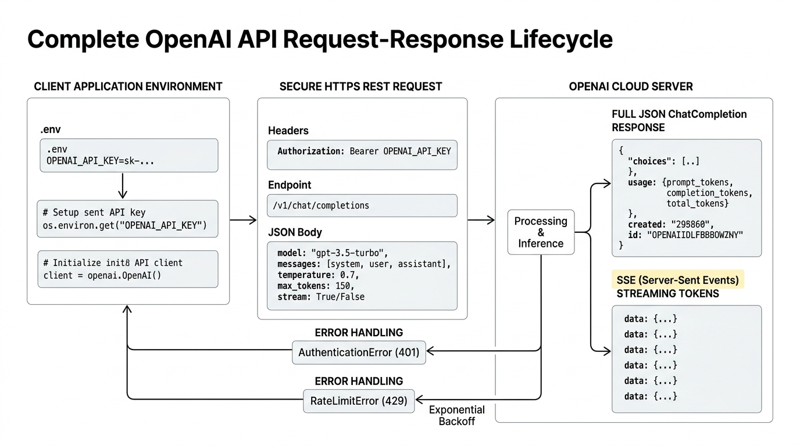

# 🔌 OpenAI API Integration: Setting Up Environments, Managing Keys & Request-Response Cycles

> **Zero to Hero Gen AI Course — Module 02: API Interaction & Prompt Engineering**
>
> 📅 Module 2 | ⏱️ Estimated Reading Time: 55 minutes | 🎯 Level: Beginner to Intermediate
>
> **Core Objective:** Master production-grade integration with the OpenAI API. Learn secure environment variable isolation, modern client architecture (OpenAI v1.0+ SDK), synchronous vs asynchronous execution, streaming via Server-Sent Events (SSE), token accounting, error handling with exponential backoff & jitter, and robust request-response payload management.

---

## 📑 Table of Contents

1. [The API Architecture Paradigm: Cloud Foundation Models as a Service](#1-the-api-architecture-paradigm-cloud-foundation-models-as-a-service)
2. [Intuitive Mental Models & Analogies](#2-intuitive-mental-models--analogies)
   - [2.1 The Restaurant Kitchen: Diner, Waiter, and Chef](#21-the-restaurant-kitchen-diner-waiter-and-chef)
   - [2.2 The Bank Vault & Safe Deposit Box: Secret Hygiene](#22-the-bank-vault--safe-deposit-box-secret-hygiene)
   - [2.3 The Letter vs The Walkie-Talkie: Synchronous vs Streaming](#23-the-letter-vs-the-walkie-talkie-synchronous-vs-streaming)
3. [Setting Up the Development Environment & Secret Hygiene](#3-setting-up-the-development-environment--secret-hygiene)
   - [3.1 Virtual Environment Setup](#31-virtual-environment-setup)
   - [3.2 Installing the Modern OpenAI Python SDK (v1.0+)](#32-installing-the-modern-openai-python-sdk-v10)
   - [3.3 Securing API Keys: The Absolute Do's and Don'ts](#33-securing-api-keys-the-absolute-dos-and-donts)
   - [3.4 Managing Environment Variables with `.env` and `python-dotenv`](#34-managing-environment-variables-with-env-and-python-dotenv)
   - [3.5 Project-Scoped Keys, Usage Tiers & Spend Limits](#35-project-scoped-keys-usage-tiers--spend-limits)
4. [The Anatomy of the OpenAI Client (v1.0+)](#4-the-anatomy-of-the-openai-client-v10)
   - [4.1 Initializing `OpenAI()`](#41-initializing-openai)
   - [4.2 Custom Client Configurations: Timeouts, Retries & Base URLs](#42-custom-client-configurations-timeouts-retries--base-urls)
   - [4.3 Synchronous vs Asynchronous (`AsyncOpenAI`) Execution](#43-synchronous-vs-asynchronous-asyncopenai-execution)
5. [The Chat Completion Request Lifecycle](#5-the-chat-completion-request-lifecycle)
   - [5.1 The Request Anatomy: Endpoint & Payload](#51-the-request-anatomy-endpoint--payload)
   - [5.2 The Roles Matrix: System, User, Assistant & Tool](#52-the-roles-matrix-system-user-assistant--tool)
   - [5.3 Critical Inference Parameters Deep-Dive](#53-critical-inference-parameters-deep-dive)
   - [5.4 Structured Outputs with `response_format`](#54-structured-outputs-with-response_format)
6. [Deconstructing the Response Payload & Token Accounting](#6-deconstructing-the-response-payload--token-accounting)
   - [6.1 The `ChatCompletion` Object Structure](#61-the-chatcompletion-object-structure)
   - [6.2 Finish Reasons: `stop`, `length`, `content_filter`, `tool_calls`](#62-finish-reasons-stop-length-content_filter-tool_calls)
   - [6.3 Token Accounting: Prompt vs Completion Tokens](#63-token-accounting-prompt-vs-completion-tokens)
   - [6.4 Estimating Costs & Pre-Calculating Tokens with `tiktoken`](#64-estimating-costs--pre-calculating-tokens-with-tiktoken)
7. [Streaming Responses: Server-Sent Events (SSE)](#7-streaming-responses-server-sent-events-sse)
   - [7.1 Why Streaming Matters: Time to First Token (TTFT)](#71-why-streaming-matters-time-to-first-token-ttft)
   - [7.2 How Server-Sent Events Work](#72-how-server-sent-events-work)
   - [7.3 Consuming Streaming Chunks in Python](#73-consuming-streaming-chunks-in-python)
8. [Resilient Production Engineering: Errors, Rate Limits & Exponential Backoff](#8-resilient-production-engineering-errors-rate-limits--exponential-backoff)
   - [8.1 The OpenAI API Error Hierarchy](#81-the-openai-api-error-hierarchy)
   - [8.2 Rate Limits: Requests Per Minute (RPM) vs Tokens Per Minute (TPM)](#82-rate-limits-requests-per-minute-rpm-vs-tokens-per-minute-tpm)
   - [8.3 The Exponential Backoff with Jitter Algorithm](#83-the-exponential-backoff-with-jitter-algorithm)
9. [Complete Architecture Visualized](#9-complete-architecture-visualized)
10. [Hands-On Python Lab: Resilient API Integration from Scratch](#10-hands-on-python-lab-resilient-api-integration-from-scratch)
11. [Curated Video Walkthroughs & Visual Animations](#11-curated-video-walkthroughs--visual-animations)
12. [Self-Assessment & Review Questions](#12-self-assessment--review-questions)
13. [Summary & Key Takeaways](#13-summary--key-takeaways)

---

## 1. The API Architecture Paradigm: Cloud Foundation Models as a Service

In the early days of machine learning, deploying a 70-billion-parameter neural network required purchasing eight $30,000 NVIDIA H100 GPUs, engineering complex CUDA drivers, and managing high-performance distributed inference clusters.

Today, **Application Programming Interfaces (APIs)** allow developers to access frontier AI models with a few lines of code:

$$\text{Client (Your Python App)} \xrightarrow[\text{JSON Request over HTTPS}]{\text{Authentication Bearer Token}} \text{OpenAI Cloud Cluster} \xrightarrow[\text{JSON / SSE Stream}]{\text{Inference Logits / Tokens}} \text{Client}$$

Instead of running neural network weights locally, your application acts as an **API client**, sending structured JSON payloads to OpenAI's REST endpoints and receiving generated completions in return.

```
+-----------------------------------------------------------------------------------------+
|                              THE REST API COMMUNICATION FLOW                            |
|                                                                                         |
|   YOUR PYTHON APP                             OPENAI CLOUD INFRASTRUCTURE               |
|  ┌──────────────────┐  POST /v1/chat/completions  ┌───────────────────────────────────┐ │
|  │  Client Code     │ ──────────────────────────► │ Load Balancers & Gateway          │ │
|  │  - Model choice  │   Authorization: Bearer sk- │   │                               │ │
|  │  - Messages      │                             │   ▼                               │ │
|  │  - Temperature   │ ◄────────────────────────── │ NVIDIA H100 GPU Inference Cluster │ │
|  └──────────────────┘     HTTP 200 OK / Tokens    │ Running GPT-4o / GPT-3.5          │ │
|                           JSON or SSE Stream      └───────────────────────────────────┘ │
+-----------------------------------------------------------------------------------------+
```

---

## 2. Intuitive Mental Models & Analogies

### 2.1 The Restaurant Kitchen: Diner, Waiter, and Chef

Think of interacting with the OpenAI API like dining at a high-end restaurant:
- **The Diner (Your Application):** You sit at the table and know what dish you want, but you don't cook it yourself.
- **The Waiter (The OpenAI API):** Takes your order sheet (the JSON request payload), checks that your credit card is valid (API key authentication), delivers the order to the kitchen, and brings back the prepared dish (the response payload).
- **The Executive Chef (The LLM):** Works behind the kitchen doors on massive industrial stoves (GPU clusters) reading your request and synthesizing the meal token by token.
- **The Order Sheet (The Messages Array):** If you give clear, detailed instructions (*"Medium-rare, dressing on the side"*), the chef succeeds. If you scribble an ambiguous note (*"Food please"*), the chef guesses wildly.

### 2.2 The Bank Vault & Safe Deposit Box: Secret Hygiene

Your **OpenAI API Key (`sk-...`)** is not a password—it is a **bearer bond** directly tied to your credit card:
- Whoever holds the key can spend your money immediately.
- If you accidentally commit your key to a public GitHub repository, automated bots scrape it within **4 seconds**, running unauthorized crypto-mining or high-volume fine-tuning scripts that can run up thousands of dollars in minutes!
- Treat your API key like a master key to a bank vault: **never write it on a sticky note attached to the door (hardcoded in code)**. Always lock it in a secure safe (`.env` file excluded by `.gitignore`).

### 2.3 The Letter vs The Walkie-Talkie: Synchronous vs Streaming

- **Synchronous Call (Sending a Letter):** You send an inquiry via postal mail. You sit quietly doing nothing until the entire 10-page essay is written, packaged, and delivered back to your mailbox. If the response takes 15 seconds, your application UI is completely frozen.
- **Streaming (The Walkie-Talkie / Server-Sent Events):** The chef speaks directly through a live walkie-talkie. As soon as word 1 is spoken, your speaker plays it. Word 2 follows immediately. Even if the full speech takes 15 seconds, the user sees words appear in **200 milliseconds** (Time to First Token)!

---

## 3. Setting Up the Development Environment & Secret Hygiene

### 3.1 Virtual Environment Setup

Never install project-specific AI packages into your global operating system Python environment! Always isolate dependencies in a virtual environment:

```bash
# 1. Create a dedicated virtual environment
python -m venv venv

# 2. Activate the virtual environment
# On Windows (PowerShell):
.\venv\Scripts\Activate.ps1
# On macOS / Linux:
source venv/bin/activate
```

### 3.2 Installing the Modern OpenAI Python SDK (v1.0+)

Install the modern `openai` package and `python-dotenv` for environment management:

```bash
pip install --upgrade openai python-dotenv
```

> [!WARNING]
> **Legacy v0.28 vs Modern v1.0+ Warning:**
> Many outdated tutorials on YouTube and medium blogs use the deprecated syntax:
> ```python
> # ❌ DEPRECATED (OpenAI <= 0.28 - Do NOT use!):
> import openai
> openai.api_key = "sk-..."
> response = openai.ChatCompletion.create(model="gpt-3.5-turbo", messages=[...])
> ```
> In November 2023, OpenAI completely redesigned the SDK. The modern production standard is:
> ```python
> # ✅ MODERN (OpenAI >= 1.0.0 - Production Standard):
> from openai import OpenAI
> client = OpenAI()  # Automatically reads OPENAI_API_KEY from environment!
> response = client.chat.completions.create(model="gpt-4o", messages=[...])
> ```

---

### 3.3 Securing API Keys: The Absolute Do's and Don'ts

```
+-----------------------------------------------------------------------------------------+
|                                API KEY SECURITY CHECKLIST                               |
|                                                                                         |
|   ❌ NEVER:                                     ✅ ALWAYS:                              |
|   • Hardcode `client = OpenAI(api_key="sk-..")` • Use `os.environ["OPENAI_API_KEY"]`   |
|   • Commit `.env` files to git repositories     • Add `.env` to your `.gitignore`       |
|   • Paste keys into client-side JS/React apps   • Call the API from a backend server    |
|   • Share team keys in Slack or email           • Use Project-scoped keys with limits   |
+-----------------------------------------------------------------------------------------+
```

### 3.4 Managing Environment Variables with `.env` and `python-dotenv`

Create a file named `.env` in the root of your project:

```bash
# .env file (NEVER COMMIT TO GIT)
OPENAI_API_KEY=sk-proj-abc123xyz789...your-real-key-here...
```

Ensure your `.gitignore` file includes:

```gitignore
# .gitignore
.env
venv/
__pycache__/
*.pyc
```

In your Python code, load the environment variables seamlessly:

```python
import os
from dotenv import load_dotenv
from openai import OpenAI

# 1. Load variables from .env into system environment
load_dotenv()

# 2. Verify key exists
api_key = os.getenv("OPENAI_API_KEY")
if not api_key:
    raise ValueError("❌ OPENAI_API_KEY is not set! Check your .env file.")

# 3. Instantiate client
client = OpenAI()  # Defaults to os.environ["OPENAI_API_KEY"]
```

### 3.5 Project-Scoped Keys, Usage Tiers & Spend Limits

In your OpenAI Platform dashboard:
1. **Create Project-Scoped Keys:** Instead of generating legacy user-level keys, create project-scoped keys restricted to specific models and read/write permissions.
2. **Set Hard & Soft Monthly Spend Caps:** Configure an email notification when spend hits $10, and a hard shutdown cap at $25 to protect against infinite code loops.
3. **Usage Tiers (Tier 1 to 5):** Based on lifetime prepaid balance:
   - **Tier 1 ($5 prepaid):** 500 RPM (Requests Per Minute), 30,000 TPM (Tokens Per Minute).
   - **Tier 3 ($100 prepaid):** 5,000 RPM, 800,000 TPM.
   - **Tier 5 ($1,000+ prepaid):** 10,000 RPM, 30,000,000 TPM.

---

## 4. The Anatomy of the OpenAI Client (v1.0+)

### 4.1 Initializing `OpenAI()`

The client object is the command center for all communication with OpenAI services:

```python
from openai import OpenAI

client = OpenAI()
```

By default, the client automatically inspects your environment for:
- `OPENAI_API_KEY`
- `OPENAI_ORG_ID` (optional organization identifier)
- `OPENAI_PROJECT_ID` (optional project identifier)

### 4.2 Custom Client Configurations: Timeouts, Retries & Base URLs

In enterprise environments, you should configure custom networking parameters:

```python
import httpx
from openai import OpenAI

client = OpenAI(
    # Timeout after 20 seconds instead of hanging indefinitely
    timeout=httpx.Timeout(20.0, read=15.0, write=5.0, connect=5.0),
    # Automatically retry transient failures (HTTP 429, 500, 503) up to 3 times
    max_retries=3,
    # Direct requests to an alternate proxy, Ollama, vLLM, or Azure endpoint
    # base_url="http://localhost:11434/v1"  # Example: Local Ollama instance!
)
```

### 4.3 Synchronous vs Asynchronous (`AsyncOpenAI`) Execution

When handling hundreds of web requests simultaneously (e.g., in a FastAPI or Django web service), blocking synchronous calls tie up worker threads. Use `AsyncOpenAI`:

```python
import asyncio
from openai import AsyncOpenAI

async def generate_response(prompt: str):
    async_client = AsyncOpenAI()
    
    response = await async_client.chat.completions.create(
        model="gpt-4o-mini",
        messages=[{"role": "user", "content": prompt}]
    )
    return response.choices[0].message.content

# Run concurrent requests in parallel:
async def main():
    prompts = ["Tell me a joke", "Summarize AI", "Write a haiku"]
    tasks = [generate_response(p) for p in prompts]
    results = await asyncio.gather(*tasks)
    for r in results:
        print("-->", r)

# asyncio.run(main())
```

---

## 5. The Chat Completion Request Lifecycle

### 5.1 The Request Anatomy: Endpoint & Payload

Every call to `client.chat.completions.create()` sends an HTTP `POST` request to `https://api.openai.com/v1/chat/completions`.

```python
response = client.chat.completions.create(
    model="gpt-4o",
    messages=[
        {"role": "system", "content": "You are a concise data science tutor."},
        {"role": "user", "content": "What is the difference between L1 and L2 regularization?"}
    ],
    temperature=0.7,
    max_tokens=300
)
```

### 5.2 The Roles Matrix: System, User, Assistant & Tool

The `messages` parameter takes a chronological list of dictionaries, where each message has a specific `role`:

| Role | Purpose | Practical Example |
|---|---|---|
| **`system`** | Sets persona, guardrails, output formatting, and persistent rules | `"You are an empathetic customer support agent for Acme Cloud. Always answer in 2 sentences."` |
| **`user`** | The human user's prompt or dynamic input query | `"My server crashed with code 504. Help!"` |
| **`assistant`** | Prior responses generated by the model (used for conversation memory & few-shot examples) | `"I'm sorry to hear that. Could you share your nginx error logs so I can diagnose?"` |
| **`tool`** | External data returned from a function execution | `{"tool_call_id": "call_123", "content": "{\"status\": \"504 Gateway Timeout\"}"}` |

```
                     CONVERSATION MEMORY THROUGH MESSAGE ARRAYS
  messages = [
      {"role": "system",    "content": "You are a French tutor."},
      {"role": "user",      "content": "How do I say hello?"},
      {"role": "assistant", "content": "You say 'Bonjour'."},       <-- Past turn preserved!
      {"role": "user",      "content": "And how do I say goodbye?"} <-- Current turn conditioned on past!
  ]
```

### 5.3 Critical Inference Parameters Deep-Dive

| Parameter | Type / Range | What It Controls | Best Setting |
|---|---|---|---|
| **`temperature`** | Float (`0.0` to `2.0`) | Sharpness of the softmax curve. Lower = deterministic; Higher = creative. | `0.0` for code/facts; `0.7` for dialogue; `1.0+` for brainstorming |
| **`top_p`** | Float (`0.0` to `1.0`) | Nucleus sampling: cuts off vocabulary when cumulative probability exceeds `top_p`. | Use `0.9` or leave at default `1.0` (tune either temperature OR top_p, not both) |
| **`max_tokens`** | Integer | Caps the maximum length of generated response tokens. | Set to prevent runaways (e.g. `500`) |
| **`presence_penalty`** | Float (`-2.0` to `2.0`) | Penalizes tokens based on whether they appeared at all. Encourages topic shifts. | `0.0` to `0.5` |
| **`frequency_penalty`**| Float (`-2.0` to `2.0`) | Penalizes tokens based on how many times they appeared. Stops repeating words. | `0.0` to `0.5` |
| **`seed`** | Integer | Enables deterministic outputs for regression testing and debugging. | E.g. `seed=42` |

### 5.4 Structured Outputs with `response_format`

In production, you often need the model to return valid, parseable JSON rather than free-form conversational chatter.

Use `response_format={"type": "json_object"}`:

```python
response = client.chat.completions.create(
    model="gpt-4o-mini",
    response_format={"type": "json_object"},
    messages=[
        {
            "role": "system",
            "content": "Extract customer data and return strictly valid JSON with keys: 'name', 'sentiment', 'urgency'."
        },
        {
            "role": "user",
            "content": "Hi, I am Sarah Miller. My payment failed 3 times and I need access immediately!"
        }
    ]
)

import json
data = json.loads(response.choices[0].message.content)
print(data)
# {'name': 'Sarah Miller', 'sentiment': 'frustrated', 'urgency': 'high'}
```

> [!IMPORTANT]
> When using `response_format={"type": "json_object"}`, you **must explicitly instruct the model to output JSON** in your system or user message, otherwise the API returns an HTTP 400 error!

---

## 6. Deconstructing the Response Payload & Token Accounting

### 6.1 The `ChatCompletion` Object Structure

When a request succeeds, the API returns a structured `ChatCompletion` Pydantic model:

```python
ChatCompletion(
    id='chatcmpl-A1B2C3D4E5',
    choices=[
        Choice(
            finish_reason='stop',
            index=0,
            message=ChatCompletionMessage(
                content='Regularization prevents overfitting...',
                role='assistant',
                function_call=None,
                tool_calls=None
            )
        )
    ],
    created=1728000000,
    model='gpt-4o-2024-08-06',
    object='chat.completion',
    usage=CompletionUsage(
        completion_tokens=42,
        prompt_tokens=28,
        total_tokens=70
    )
)
```

To extract the text safely:
```python
generated_text = response.choices[0].message.content
```

### 6.2 Finish Reasons: `stop`, `length`, `content_filter`, `tool_calls`

Always verify `response.choices[0].finish_reason` in production:
- **`stop`**: The model finished naturally by emitting the `<|endoftext|>` token. Everything is complete.
- **`length`**: The model was cut off prematurely because it reached `max_tokens` or the context window ceiling. (Response is incomplete!).
- **`content_filter`**: Omitted or truncated because it triggered OpenAI's safety and toxicity moderation filters.
- **`tool_calls`**: The model stopped generating text because it wants your application to execute an external function.

### 6.3 Token Accounting: Prompt vs Completion Tokens

OpenAI charges separately for input tokens and output tokens:

```python
prompt_tokens = response.usage.prompt_tokens         # What you sent
completion_tokens = response.usage.completion_tokens # What the model generated
total_tokens = response.usage.total_tokens           # Sum of both
```

$$\text{Total Cost} = \left(\frac{\text{Prompt Tokens}}{10^6} \times P_{\text{in}}\right) + \left(\frac{\text{Completion Tokens}}{10^6} \times P_{\text{out}}\right)$$

*(For example, GPT-4o-mini is priced at approximately $0.15 per 1M input tokens and $0.60 per 1M output tokens).*

### 6.4 Estimating Costs & Pre-Calculating Tokens with `tiktoken`

You can calculate exact token counts on your local machine *before* sending an API request using OpenAI's official `tiktoken` library:

```python
import tiktoken

# Load the exact BPE tokenizer used by GPT-4o
encoding = tiktoken.encoding_for_model("gpt-4o")

text = "OpenAI API tokenization is fast and efficient!"
tokens = encoding.encode(text)

print(f"Text: '{text}'")
print(f"Token IDs: {tokens}")
print(f"Token Count: {len(tokens)}")
# 1 token ≈ 4 characters in English, or ~0.75 words.
```

---

## 7. Streaming Responses: Server-Sent Events (SSE)

### 7.1 Why Streaming Matters: Time to First Token (TTFT)

When generating a 1,000-word response:
- **Non-Streaming:** The user stares at a blank loading spinner for 12 seconds before the whole wall of text appears at once.
- **Streaming:** The user sees the first token in **250 milliseconds**. Tokens render at conversational reading speed, providing an instantaneous, responsive experience.

### 7.2 How Server-Sent Events Work

Under the hood, setting `stream=True` establishes an HTTP connection where the server transmits an open stream of text chunks using the **Server-Sent Events (SSE)** protocol:

```http
HTTP/1.1 200 OK
Content-Type: text/event-stream
Cache-Control: no-cache

data: {"choices":[{"delta":{"content":"Hello"}}]}
data: {"choices":[{"delta":{"content":" there"}}]}
data: {"choices":[{"delta":{"content":"!"}}]}
data: [DONE]
```

### 7.3 Consuming Streaming Chunks in Python

The Python SDK exposes streaming chunks through a simple generator loop:

```python
from openai import OpenAI

client = OpenAI()

stream = client.chat.completions.create(
    model="gpt-4o-mini",
    messages=[{"role": "user", "content": "Write a 4-line poem about the ocean."}],
    stream=True  # Enables Server-Sent Events!
)

print("Streaming Output: ", end="", flush=True)

for chunk in stream:
    # Each chunk contains a delta token snippet
    delta_content = chunk.choices[0].delta.content
    if delta_content is not None:
        print(delta_content, end="", flush=True)

print("\n[Stream Complete]")
```

---

## 8. Resilient Production Engineering: Errors, Rate Limits & Exponential Backoff

### 8.1 The OpenAI API Error Hierarchy

All OpenAI exceptions inherit from `openai.APIError`:

```
openai.APIError
  ├── openai.APIConnectionError     (Network dropped, DNS failed)
  ├── openai.APITimeoutError        (Request took longer than configured timeout)
  ├── openai.AuthenticationError    (HTTP 401: Invalid API key)
  ├── openai.PermissionDeniedError  (HTTP 403: Key lacks permission for this model)
  ├── openai.NotFoundError          (HTTP 404: Invalid model identifier)
  ├── openai.RateLimitError         (HTTP 429: Exceeded quota or RPM/TPM limit)
  ├── openai.BadRequestError        (HTTP 400: Malformed JSON, context length exceeded)
  └── openai.InternalServerError    (HTTP 500 / 503: OpenAI servers temporarily down)
```

### 8.2 Rate Limits: Requests Per Minute (RPM) vs Tokens Per Minute (TPM)

OpenAI limits accounts across two dimensions simultaneously:
1. **RPM (Requests Per Minute):** How many HTTP calls your app makes per 60 seconds.
2. **TPM (Tokens Per Minute):** The cumulative sum of prompt tokens + completion tokens processed per 60 seconds.

If you exceed either threshold, OpenAI returns **HTTP 429: RateLimitError**.

### 8.3 The Exponential Backoff with Jitter Algorithm

When an API returns HTTP 429 or HTTP 500, naive apps retry immediately in a tight loop. This floods the server (the **"Thundering Herd"** problem) and guarantees continued failure.

The industry-standard solution is **Exponential Backoff with Full Jitter** (Amazon AWS & OpenAI recommendation):

$$t_{\text{wait}} = \text{Uniform}\left(0, \, \min\left(t_{\text{max}}, \, t_{\text{base}} \times 2^{\text{attempt}}\right)\right)$$

```
Attempt 1: Wait Uniform(0, 1.0s * 2^1) = Uniform(0, 2s)  ==> e.g. 1.4s
Attempt 2: Wait Uniform(0, 1.0s * 2^2) = Uniform(0, 4s)  ==> e.g. 3.1s
Attempt 3: Wait Uniform(0, 1.0s * 2^3) = Uniform(0, 8s)  ==> e.g. 6.7s
Attempt 4: Wait Uniform(0, 1.0s * 2^4) = Uniform(0, 16s) ==> e.g. 11.2s
```

Adding random jitter ensures that hundreds of concurrent workers don't wake up at the exact same millisecond to slam the server together!

---

## 9. Complete Architecture Visualized

Below is the definitive visual architectural diagram representing the complete OpenAI API integration lifecycle:



---

## 10. Hands-On Python Lab: Resilient API Integration from Scratch

This standalone runnable Python script implements a production-grade OpenAI API wrapper with:
- Environment variable validation
- Graceful mock simulation fallback (runs 100% cleanly even without a funded API key)
- Automatic token usage and cost accounting
- Streaming generator consumption
- Exponential backoff retry engine

You can run this script directly from your terminal:
```bash
python "2. API Interaction & Prompt Engineering/code/openai_api_integration_lab.py"
```

```python
"""
=============================================================================
Hands-On Lab: Production OpenAI API Integration & Resilience in Python
=============================================================================
Course: Zero to Hero Gen AI — Module 02: API Interaction & Prompt Engineering
Topic: OpenAI API Integration: Environments, Keys & Request-Response Cycles
"""

import os
import time
import random
import json

# ---------------------------------------------------------------------------
# 1. Environment Variable Loader & Secret Validation
# ---------------------------------------------------------------------------
def validate_api_environment():
    api_key = os.getenv("OPENAI_API_KEY")
    if not api_key:
        print("⚠️ OPENAI_API_KEY environment variable not found.")
        print("   Running in SIMULATED MOCK MODE to demonstrate exact payload mechanics.\n")
        return False
    masked_key = api_key[:7] + "..." + api_key[-4:]
    print(f"✅ Found active OPENAI_API_KEY: {masked_key}\n")
    return True

# ---------------------------------------------------------------------------
# 2. Resilient Exponential Backoff Retry Engine
# ---------------------------------------------------------------------------
def resilient_api_call(call_fn, max_retries=3, base_delay=1.0, max_delay=10.0):
    for attempt in range(max_retries):
        try:
            return call_fn()
        except Exception as e:
            if attempt == max_retries - 1:
                raise e
            # Exponential Backoff with Jitter: Uniform(0, min(max_delay, base * 2^attempt))
            backoff_cap = min(max_delay, base_delay * (2 ** attempt))
            sleep_time = random.uniform(0.5, backoff_cap)
            print(f"⚠️ Encountered transient error: {e}")
            print(f"   Backing off attempt {attempt + 1}/{max_retries} for {sleep_time:.2f}s...")
            time.sleep(sleep_time)

# ---------------------------------------------------------------------------
# 3. Cost Calculator
# ---------------------------------------------------------------------------
def calculate_cost(prompt_tokens, completion_tokens, model="gpt-4o-mini"):
    pricing = {
        "gpt-4o": {"in": 2.50, "out": 10.00},
        "gpt-4o-mini": {"in": 0.15, "out": 0.60},
        "gpt-3.5-turbo": {"in": 0.50, "out": 1.50}
    }
    rates = pricing.get(model, pricing["gpt-4o-mini"])
    cost_in = (prompt_tokens / 1_000_000) * rates["in"]
    cost_out = (completion_tokens / 1_000_000) * rates["out"]
    return cost_in + cost_out
```

---

## 11. Curated Video Walkthroughs & Visual Animations

Master practical API integration and prompt engineering with these hand-curated, verified video walkthroughs:

| # | Topic / Video Title | Recommended Video Link | Creator / Channel | Why Watch? (Visual & Technical Highlights) |
|---|---|---|---|---|
| 1 | **OpenAI DevDay Keynote** | [OpenAI DevDay: Opening Keynote](https://www.youtube.com/watch?v=U9mJuUkhUzk) | **OpenAI (Sam Altman)** | The landmark official keynote unveiling GPT-4 Turbo, JSON mode, Assistants API, and modern API capabilities. |
| 2 | **Full OpenAI API Crash Course** | [ChatGPT Course – Use The OpenAI API to Code 5 Projects](https://www.youtube.com/watch?v=uRQH2CFvedY) | **freeCodeCamp.org** | Comprehensive multi-hour project tutorial covering Python environment setup, key management, and building apps. |
| 3 | **State of GPT & API Best Practices** | [State of GPT \| BRK216HFS](https://www.youtube.com/watch?v=bZQun8Y4L2A) | **Andrej Karpathy** | Masterclass explaining context windows, prompt construction, and how to get maximum performance out of LLM APIs. |
| 4 | **Temperature & Top-P Explained** | [Temperature and Top P Explained in Plain English](https://www.youtube.com/watch?v=vI35anoe_fY) | **Annielytics** | Clear visual guide explaining how API hyperparameters steer token sampling distributions from deterministic to creative. |
| 5 | **Intro to Large Language Models** | [Intro to Large Language Models](https://www.youtube.com/watch?v=zjkBMFhNj_g) | **Andrej Karpathy** | Essential foundations: tokenization limits, context window trade-offs, and secure integration practices. |

---

### 🎬 Deep-Dive Video Breakdown

#### 1. [OpenAI — OpenAI DevDay: Opening Keynote](https://www.youtube.com/watch?v=U9mJuUkhUzk)

[](https://www.youtube.com/watch?v=U9mJuUkhUzk)

- **Runtime:** ~45 mins | **Focus:** Official platform features & announcements
- **Key Concepts Covered:**
  - Announcement of GPT-4 Turbo with 128k context window.
  - Introducing `response_format={"type": "json_object"}` and reproducible outputs (`seed`).
  - Dramatic token price reductions making API integration accessible to all developers.

---

#### 2. [freeCodeCamp.org — ChatGPT Course – Use The OpenAI API to Code 5 Projects](https://www.youtube.com/watch?v=uRQH2CFvedY)

[](https://www.youtube.com/watch?v=uRQH2CFvedY)

- **Runtime:** ~2 hrs 40 mins | **Focus:** Hands-on practical project development
- **Key Concepts Covered:**
  - Generating and storing API keys securely.
  - Making raw chat completion calls and iterating over conversational message histories.
  - Building end-to-end Python applications powered by the OpenAI API.

---

#### 3. [Andrej Karpathy — State of GPT | BRK216HFS](https://www.youtube.com/watch?v=bZQun8Y4L2A)

[](https://www.youtube.com/watch?v=bZQun8Y4L2A)

- **Runtime:** ~42 mins | **Focus:** Architecting AI systems & prompt optimization
- **Key Concepts Covered:**
  - Why models need scratchpads and Chain-of-Thought prompts.
  - Context window mechanics and prompt engineering techniques.
  - Practical trade-offs between prompt engineering, RAG, and fine-tuning.

---

## 12. Self-Assessment & Review Questions

### Part 1: Conceptual Questions

1. **Why is it dangerous to hardcode `api_key="sk-..."` in Python source files, even in private code repositories?**
   <details>
   <summary><b>View Answer</b></summary>
   Hardcoding keys risks accidental commits to version control. Automated bots continuously scan GitHub and public repositories, extracting leaked keys within seconds. Once compromised, unauthorized actors can exhaust your monthly spend limits or use your account for malicious activity. Using `.env` files and environment variables keeps secrets decoupled from source code.
   </details>

2. **What is the difference between `max_tokens` and context window length? What happens if your prompt + `max_tokens` exceeds the model's context ceiling?**
   <details>
   <summary><b>View Answer</b></summary>
   Context window length is the total capacity of tokens the model can process at once (e.g., 128k tokens for GPT-4o). <code>max_tokens</code> is the developer-set upper limit on how many tokens the model is allowed to <i>generate</i> in its completion. If the prompt tokens plus <code>max_tokens</code> exceeds the model's context window, the API immediately throws an <code>openai.BadRequestError (HTTP 400)</code> before generating any tokens.
   </details>

3. **Explain the difference between Time to First Token (TTFT) and Total Latency in streaming vs non-streaming API requests.**
   <details>
   <summary><b>View Answer</b></summary>
   In a non-streaming request, the user experiences total latency as waiting time: nothing appears until the entire completion finishes (e.g. 10 seconds). In a streaming request, Time to First Token (TTFT) is the duration until the very first chunk arrives (typically 200–500ms). While total generation time is similar, streaming creates a perceived near-instantaneous response because the user can read tokens as they are produced.
   </details>

---

### Part 2: Code Evaluation & Practical Problems

4. **Identify the bug in this Python snippet:**
   ```python
   from openai import OpenAI
   client = OpenAI()
   
   response = client.chat.completions.create(
       model="gpt-4o-mini",
       response_format={"type": "json_object"},
       messages=[{"role": "user", "content": "List the top 3 cities in Japan."}]
   )
   ```
   <details>
   <summary><b>View Answer</b></summary>
   When using <code>response_format={"type": "json_object"}</code>, the messages payload <b>must explicitly contain the word "JSON"</b> somewhere in the system or user instructions. Because the prompt only says <i>"List the top 3 cities in Japan"</i> without mentioning JSON, the API will reject the request with an <code>openai.BadRequestError (HTTP 400)</code>.
   </details>

5. **A customer support bot processes 10,000 queries per day. Each query averages 400 prompt tokens and 150 completion tokens. Using GPT-4o-mini ($0.15 / 1M prompt tokens, $0.60 / 1M completion tokens), calculate the daily operating cost.**
   <details>
   <summary><b>View Answer</b></summary>
   - Daily prompt tokens: $10,000 \times 400 = 4,000,000$ tokens.<br>
   - Prompt cost: $(4,000,000 / 1,000,000) \times \$0.15 = \$0.60$.<br>
   - Daily completion tokens: $10,000 \times 150 = 1,500,000$ tokens.<br>
   - Completion cost: $(1,500,000 / 1,000,000) \times \$0.60 = \$0.90$.<br>
   - Total daily cost: $\$0.60 + \$0.90 = \mathbf{\$1.50 \text{ per day}}$ (or approx. $45/month).
   </details>

---

### Part 3: Fill-in-the-Blanks

6. The HTTP status code returned by OpenAI when your application exceeds your Requests Per Minute (RPM) or Tokens Per Minute (TPM) limit is HTTP __________.
   <details>
   <summary><b>View Answer</b></summary>
   <b>429</b> (Too Many Requests / RateLimitError)
   </details>

7. In the OpenAI Chat Completion payload, the message role used to define the core persona, tone, and guardrails of the AI is the ____________________ role.
   <details>
   <summary><b>View Answer</b></summary>
   <b>system</b>
   </details>

8. The protocol used by the OpenAI API to stream tokens incrementally over a persistent HTTP connection is called ____________________ (SSE).
   <details>
   <summary><b>View Answer</b></summary>
   <b>Server-Sent Events</b>
   </details>

---

## 13. Summary & Key Takeaways

```
           .env File ──► os.environ ──► client = OpenAI() ──► /v1/chat/completions
           [Key Secure]   [No Hardcode]    [v1.0+ Standard]     [JSON / SSE Stream]
```

1. **Secret Isolation is Non-Negotiable:** Always load `OPENAI_API_KEY` from a `.env` file via `python-dotenv` and add `.env` to `.gitignore`.
2. **Modern SDK (v1.0+):** Use `from openai import OpenAI` and instantiate `client = OpenAI()`. Never use legacy `openai.ChatCompletion.create()`.
3. **Roles Matter:** Structuring messages into `system` (persona), `user` (prompt), and `assistant` (history) maintains coherent multi-turn conversations.
4. **Always Inspect Finish Reasons & Usage:** Check `finish_reason == 'stop'` to detect cutoffs, and monitor `usage.prompt_tokens` and `usage.completion_tokens` to audit costs.
5. **Stream for Superior UX:** Use `stream=True` to minimize Time to First Token (TTFT) and render answers fluidly in real-time.
6. **Engineer for Failure:** Protect production applications with **Exponential Backoff and Jitter** to gracefully handle HTTP 429 rate limits and transient server errors.
