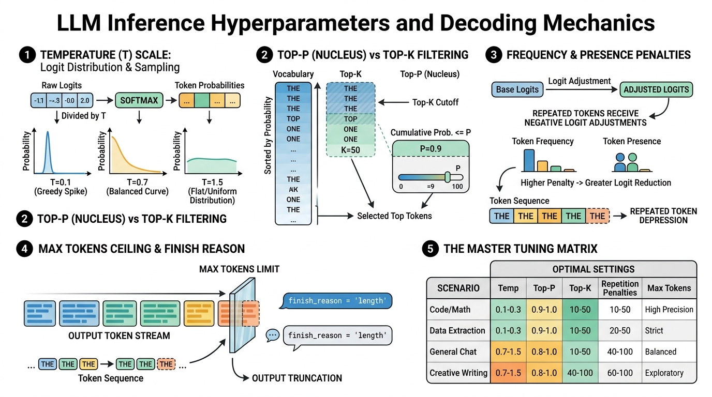

# 🎛️ Parameters: Tuning Hyperparameters Like Temperature & Max Tokens to Control Output Creativity and Length

> **Zero to Hero Gen AI Course — Module 02: API Interaction & Prompt Engineering**
>
> 📅 Module 2 | ⏱️ Estimated Reading Time: 55 minutes | 🎯 Level: Beginner to Intermediate
>
> **Core Objective:** Master the mathematical mechanics and practical tuning of LLM inference decoding hyperparameters. Understand how logits are transformed by Temperature, Top-P (Nucleus Sampling), Top-K filtering, Frequency & Presence Penalties, and Max Tokens limits. Build intuition for balancing deterministic precision against creative diversity across real-world enterprise applications.

---

## 📑 Table of Contents

1. [The Decoding Pipeline: From Neural Logits to Text Tokens](#1-the-decoding-pipeline-from-neural-logits-to-text-tokens)
2. [Intuitive Mental Models & Analogies](#2-intuitive-mental-models--analogies)
   - [2.1 The Gas Burner: Temperature as Heat](#21-the-gas-burner-temperature-as-heat)
   - [2.2 The VIP Velvet Rope: Top-P vs Top-K](#22-the-vip-velvet-rope-top-p-vs-top-k)
   - [2.3 The Repetition Tax: Frequency vs Presence Penalties](#23-the-repetition-tax-frequency-vs-presence-penalties)
   - [2.4 The Fuel Tank & Ceiling: Max Tokens](#24-the-fuel-tank--ceiling-max-tokens)
3. [Temperature ($T$): Controlling Softmax Entropy & Creativity](#3-temperature-t-controlling-softmax-entropy--creativity)
   - [3.1 Mathematical Formulation: The Softmax Scaler](#31-mathematical-formulation-the-softmax-scaler)
   - [3.2 Behavior at the Extremes: $T \to 0$ vs $T \to \infty$](#32-behavior-at-the-extremes-t-to-0-vs-t-to-infty)
   - [3.3 Practical Temperature Spectrum Guide](#33-practical-temperature-spectrum-guide)
4. [Top-P (Nucleus Sampling) vs Top-K: Restricting the Candidate Pool](#4-top-p-nucleus-sampling-vs-top-k-restricting-the-candidate-pool)
   - [4.1 Why Temperature Alone Is Not Enough](#41-why-temperature-alone-is-not-enough)
   - [4.2 Top-K Filtering: Hard Truncation](#42-top-k-filtering-hard-truncation)
   - [4.3 Top-P (Nucleus Sampling): Adaptive Cumulative Thresholding](#43-top-p-nucleus-sampling-adaptive-cumulative-thresholding)
   - [4.4 The Golden Rule: Tune Temperature OR Top-P, Never Both](#44-the-golden-rule-tune-temperature-or-top-p-never-both)
5. [Presence Penalty vs Frequency Penalty: Eliminating Repetition](#5-presence-penalty-vs-frequency-penalty-eliminating-repetition)
   - [5.1 Mathematical Formulation of Logit Modification](#51-mathematical-formulation-of-logit-modification)
   - [5.2 Frequency Penalty: Punishing Repeated Words](#52-frequency-penalty-punishing-repeated-words)
   - [5.3 Presence Penalty: Encouraging Topic Shifts](#53-presence-penalty-encouraging-topic-shifts)
6. [Max Tokens & Context Window Mechanics](#6-max-tokens--context-window-mechanics)
   - [6.1 `max_tokens` vs `max_completion_tokens`](#61-max_tokens-vs-max_completion_tokens)
   - [6.2 Truncation Detection: Handling `finish_reason == 'length'`](#62-truncation-detection-handling-finish_reason--length)
   - [6.3 The Danger of Truncated JSON & Code Blocks](#63-the-danger-of-truncated-json--code-blocks)
7. [The Master Hyperparameter Tuning Matrix](#7-the-master-hyperparameter-tuning-matrix)
8. [Complete Architecture Visualized](#8-complete-architecture-visualized)
9. [Hands-On Python Lab: Simulating Hyperparameter Transformations](#9-hands-on-python-lab-simulating-hyperparameter-transformations)
10. [Curated Video Walkthroughs & Visual Animations](#10-curated-video-walkthroughs--visual-animations)
11. [Self-Assessment & Review Questions](#11-self-assessment--review-questions)
12. [Summary & Key Takeaways](#12-summary--key-takeaways)

---

## 1. The Decoding Pipeline: From Neural Logits to Text Tokens

When an autoregressive Large Language Model (such as GPT-4o) processes a sequence of tokens, its final linear layer produces a raw vector of unnormalized scores over the entire vocabulary $\mathcal{V}$ ($|\mathcal{V}| \approx 100,000$ tokens).

These raw real numbers are called **Logits** $\mathbf{z} = (z_1, z_2, \dots, z_{|\mathcal{V}|}) \in \mathbb{R}^{|\mathcal{V}|}$.

```
+-----------------------------------------------------------------------------------------+
|                              THE INFERENCE DECODING PIPELINE                            |
|                                                                                         |
|   Final Transformer Layer                                                               |
|             │                                                                           |
|             ▼                                                                           |
|   1. Raw Logits Vector z ──► 2. Repetition Penalties ──► 3. Temperature Scaling (z / T) │
|      [-1.2, 4.5, 0.8, ...]      (subtract frequency)        (flatten or sharpen curve)  │
|                                                                     │                   |
|                                                                     ▼                   |
|   6. Final Chosen Token  ◄── 5. Top-P / Top-K Masking ◄─── 4. Softmax Normalization     |
|      "Paris" (ID: 4120)         (prune the tail tokens)        (convert scores to probs)│
+-----------------------------------------------------------------------------------------+
```

Logits do not directly produce text. They must pass through a multi-stage **decoding pipeline** governed by hyperparameters. Changing these hyperparameters does not alter the underlying model weights—it alters the **stochastic selection process** that converts probability distributions into written words.

---

## 2. Intuitive Mental Models & Analogies

### 2.1 The Gas Burner: Temperature as Heat

Think of Temperature like the control dial on a kitchen gas stove:
- **Zero Heat ($T = 0$):** Frozen ice. The flame is off. There is zero movement or randomness. If you drop a marble, it rolls into the deepest groove 100% of the time. The model always picks the single highest-probability token (Greedy Decoding).
- **Medium Heat ($T = 0.7$):** A steady, efficient blue cooking flame. Natural, fluid, and warm. The model explores good alternative words while maintaining logical structure.
- **Extreme Heat ($T = 1.5+$):** An uncontrolled wildfire. Sparks fly everywhere. The kinetic energy is so intense that even absurd, low-probability tokens jump out, creating wild, chaotic, or incoherent sentences.

### 2.2 The VIP Velvet Rope: Top-P vs Top-K

Imagine a bouncer managing the entrance to an exclusive nightclub:
- **Top-K (The Strict Headcount):** The bouncer only allows the **first 50 people in line** through the door, regardless of who they are.
  - *Problem:* If there are only 2 rockstars and 48 random bystanders in line, Top-K lets in 48 low-quality people! If there are 200 celebrities, Top-K cuts off 150 great guests.
- **Top-P / Nucleus (The Quality Cutoff):** The bouncer admits guests starting from the highest VIP score downward until the **cumulative fame rating reaches 90% ($P = 0.9$)**.
  - If Taylor Swift is at the front, she alone makes up 92% of the fame—the door shuts immediately ($1$ person allowed).
  - If a crowd of mid-tier actors arrives, the door stays open for 35 people until their combined score hits 90%. **Top-P adapts dynamically to the quality of the crowd!**

### 2.3 The Repetition Tax: Frequency vs Presence Penalties

- **Frequency Penalty (The Word Meter Tax):** You pay a 10-cent fine every time you repeat the exact word *"essentially"*. If you say it 5 times, your penalty is 50 cents. The model rapidly seeks alternative synonyms (*"fundamentally", "primarily"*).
- **Presence Penalty (The Topic Tax):** A flat $1 entry fee for touching a topic. Once you mention *"climate change"*, you pay the fee. Repeating the word again costs nothing extra, but the initial fee encourages your conversation to migrate toward new, fresh horizons.

### 2.4 The Fuel Tank & Ceiling: Max Tokens

`max_tokens` is the odometer trip limit on a rental car. If you set `max_tokens=100`, the car shuts off after exactly 100 tokens, even if it is midway through a sentence or a JSON object. It is a **hard computational budget ceiling**.

---

## 3. Temperature ($T$): Controlling Softmax Entropy & Creativity

### 3.1 Mathematical Formulation: The Softmax Scaler

The probability of selecting token $w_i$ from vocabulary $\mathcal{V}$ is computed by dividing each logit $z_i$ by temperature $T > 0$ before applying the Softmax function:

$$P(w_i) = \frac{\exp\left(\frac{z_i}{T}\right)}{\sum_{j \in \mathcal{V}} \exp\left(\frac{z_j}{T}\right)}$$

```
Suppose Vocabulary has 3 tokens with raw logits: [z_1 = 4.0, z_2 = 2.0, z_3 = 1.0]

AT T = 1.0 (Standard Softmax):
exp(4.0) = 54.60,  exp(2.0) = 7.39,   exp(1.0) = 2.72   ==> Sum = 64.71
Probabilities: P = [84.4%, 11.4%, 4.2%]

AT T = 0.5 (Low Temperature - Sharpened / Peaked):
z / 0.5 = [8.0, 4.0, 2.0]
exp(8.0) = 2980.9, exp(4.0) = 54.6,   exp(2.0) = 7.4    ==> Sum = 3042.9
Probabilities: P = [98.0%, 1.8%, 0.2%]  <-- Top token dominates overwhelmingly!

AT T = 2.0 (High Temperature - Flattened / High Entropy):
z / 2.0 = [2.0, 1.0, 0.5]
exp(2.0) = 7.39,   exp(1.0) = 2.72,   exp(0.5) = 1.65   ==> Sum = 11.76
Probabilities: P = [62.8%, 23.1%, 14.0%] <-- Low-probability tokens get amplified!
```

---

### 3.2 Behavior at the Extremes: $T \to 0$ vs $T \to \infty$

1. **Greedy Argmax Limit ($T \to 0$):**
   $$\lim_{T \to 0^+} P(w_i) = \begin{cases} 1 & \text{if } i = \arg\max_j z_j \\ 0 & \text{otherwise} \end{cases}$$
   The probability distribution collapses into a **Dirac delta distribution**. The model is completely deterministic: identical prompt input will produce the exact same token sequence on every run.
2. **Uniform Distribution Limit ($T \to \infty$):**
   $$\lim_{T \to \infty} P(w_i) = \frac{1}{|\mathcal{V}|}$$
   All logits become equivalent ($z_i / \infty \to 0 \implies \exp(0) = 1$). The model becomes a random number generator drawing uniformly from the dictionary, outputting complete gibberish.

---

### 3.3 Practical Temperature Spectrum Guide

| Temperature Range | Subjective Personality | Output Distribution | Ideal Production Use Cases |
|---|---|---|---|
| **$T = 0.0$** | **Cold, Deterministic, Rigid** | Dirac spike on highest logit | Factual Q&A, SQL queries, JSON extraction, math calculations |
| **$T = 0.1 - 0.3$** | **Conservative, Focused** | Steep peaked curve | Technical code synthesis, translation, document summarization |
| **$T = 0.5 - 0.7$** | **Balanced, Natural** | Smooth standard distribution | Customer support chat, conversational agents, general writing |
| **$T = 0.8 - 1.0$** | **Creative, Expressive** | Broad moderate distribution | Brainstorming, poetry, marketing slogans, creative fiction |
| **$T = 1.2 - 2.0$** | **Wild, Volatile, Hallucinatory** | Very flat distribution | Highly speculative ideation (Risks severe grammatical collapse) |

---

## 4. Top-P (Nucleus Sampling) vs Top-K: Restricting the Candidate Pool

### 4.1 Why Temperature Alone Is Not Enough

Even with a well-calibrated temperature like $T = 0.7$, a vocabulary of $100,000$ tokens has a long mathematical tail. Hundreds of nonsensical or irrelevant words still retain tiny non-zero probabilities ($0.0001\%$).

Over a generation of 1,000 tokens, the probability of sampling at least one catastrophic outlier from the tail is significant:

$$P(\text{at least one outlier}) = 1 - (1 - p)^{1000} \approx 10\% - 20\%$$

To permanently eliminate this failure, models apply **candidate pool filtering** before sampling.

### 4.2 Top-K Filtering: Hard Truncation

Introduced by Fan et al. (2018), **Top-K** sorts all tokens by logit score and keeps strictly the top $K$ candidates (e.g. $K = 50$), zeroing out all others:

$$\tilde{\mathcal{V}} = \{w_{(1)}, w_{(2)}, \dots, w_{(K)}\}$$

$$P(w_i) = \begin{cases} \frac{\exp(z_i)}{\sum_{j \in \tilde{\mathcal{V}}} \exp(z_j)} & \text{if } w_i \in \tilde{\mathcal{V}} \\ 0 & \text{otherwise} \end{cases}$$

#### The Weakness of Top-K:
- When predicting: *"The capital of France is ___"*, the probability is $99\%$ on `"Paris"`. Setting $K=50$ forces 49 unlikely tokens into the candidate set!
- When predicting: *"She wore a beautiful ___ dress"*, there might be 80 valid adjectives (*"red", "blue", "silk", "vintage"*). Setting $K=50$ artificially truncates 30 valid options!

### 4.3 Top-P (Nucleus Sampling): Adaptive Cumulative Thresholding

Introduced by Holtzman et al. (2019), **Top-P (Nucleus Sampling)** dynamically sizes the candidate pool based on **cumulative probability mass**:

1. Sort all tokens in descending probability order: $P(w_{(1)}) \ge P(w_{(2)}) \ge \dots$
2. Find the smallest subset $V^{(p)}$ such that their cumulative sum reaches threshold $p \in (0, 1]$:
   $$\sum_{i \in V^{(p)}} P(w_i) \ge p$$
3. Truncate all tokens outside $V^{(p)}$ and re-normalize the remaining probabilities to sum to $1.0$.

```
SCENARIO A: HIGH CERTAINTY ("The capital of France is ___")
  Token 1: "Paris"      Prob = 94.0%  ──► Cumulative = 94.0% >= 0.90
  ==> Candidate Pool shrinks to JUST 1 TOKEN! ("Paris")
  Top-P cuts off 99,999 other tokens automatically!

SCENARIO B: HIGH UNCERTAINTY ("The traveler opened the ___")
  Token 1: "door"       Prob = 25.0%  ──► Cumulative = 25.0%
  Token 2: "window"     Prob = 18.0%  ──► Cumulative = 43.0%
  Token 3: "box"        Prob = 15.0%  ──► Cumulative = 58.0%
  Token 4: "letter"     Prob = 12.0%  ──► Cumulative = 70.0%
  Token 5: "map"        Prob = 11.0%  ──► Cumulative = 81.0%
  Token 6: "chest"      Prob = 10.0%  ──► Cumulative = 91.0% >= 0.90
  ==> Candidate Pool expands dynamically to 6 TOKENS!
```

Top-P gives you the best of both worlds: **strict safety when confident, wide diversity when open-ended!**

### 4.4 The Golden Rule: Tune Temperature OR Top-P, Never Both

> [!IMPORTANT]
> **Official OpenAI Recommendation:**
> *"We generally recommend altering this or temperature but not both."*
>
> If you alter both simultaneously, their interactions compound unpredictably. For example, setting $T=0.2$ compresses probabilities, which causes $P=0.8$ to collapse into 1 or 2 tokens, negating the purpose of tuning Top-P.
> - **Default Standard:** Keep `top_p = 1.0` and tune `temperature`.
> - **Alternative:** Keep `temperature = 1.0` and tune `top_p = 0.8 - 0.95`.

---

## 5. Presence Penalty vs Frequency Penalty: Eliminating Repetition

When generating long outputs, LLMs occasionally enter degenerate repetitive loops (*"This is very, very, very important..."*).

OpenAI provides two penalties that modify logits before the Softmax step:

### 5.1 Mathematical Formulation of Logit Modification

$$\tilde{z}_i = z_i - (\text{Frequency Penalty} \times c_i) - (\text{Presence Penalty} \times \mathbb{I}[c_i > 0])$$

Where:
- $z_i$ is the original raw logit for token $i$.
- $c_i$ is the number of times token $i$ has **already appeared** in the current output.
- $\mathbb{I}[c_i > 0]$ is an indicator function: $1$ if the token appeared at least once, $0$ otherwise.
- Both penalties range from $-2.0$ to $+2.0$.

```
+-----------------------------------------------------------------------------------------+
|                    FREQUENCY PENALTY vs PRESENCE PENALTY COMPARISON                     |
|                                                                                         |
|   Token Frequency Count:     c_i = 1       c_i = 2       c_i = 3       c_i = 5          |
|                                                                                         |
|   Presence Penalty (0.5):    -0.5          -0.5          -0.5          -0.5 (Constant!) |
|   Frequency Penalty (0.5):   -0.5          -1.0          -1.5          -2.5 (Scales!)   |
+-----------------------------------------------------------------------------------------+
```

### 5.2 Frequency Penalty: Punishing Repeated Words
- Scales linearly with the exact repetition count.
- **Positive values ($0.1$ to $0.6$):** Strongly suppresses repeated vocabulary, forced synonym variety.
- **Negative values ($-0.1$ to $-1.0$):** Encourages repetition (useful for generating repetitive rhyming poetry or chanting).

### 5.3 Presence Penalty: Encouraging Topic Shifts
- Applies a flat one-time logit penalty as soon as a token is emitted once.
- **Positive values ($0.1$ to $0.6$):** Encourages the model to branch out into new subtopics, talking about fresh concepts rather than dwelling on the initial subject.

---

## 6. Max Tokens & Context Window Mechanics

### 6.1 `max_tokens` vs `max_completion_tokens`

- **`max_tokens` (Legacy / Standard):** Specifies the maximum number of tokens the model is permitted to generate in the completion.
- **`max_completion_tokens` (Modern standard for reasoning models like o1/o3):** Distinguishes between internal reasoning "thinking" tokens and final visible completion tokens.

### 6.2 Truncation Detection: Handling `finish_reason == 'length'`

When an API response returns, always inspect the `finish_reason` attribute:

```python
response = client.chat.completions.create(
    model="gpt-4o-mini",
    messages=[{"role": "user", "content": "Write a 500-word essay."}],
    max_tokens=50  # Artificially tiny ceiling!
)

finish_reason = response.choices[0].finish_reason

if finish_reason == "length":
    print("⚠️ WARNING: The response was truncated by the max_tokens ceiling!")
    # Trigger continuation request or alert user
elif finish_reason == "stop":
    print("✅ Completed normally.")
```

### 6.3 The Danger of Truncated JSON & Code Blocks

If your application relies on `response_format={"type": "json_object"}` and the output is truncated because of an inadequate `max_tokens` ceiling:
```json
{
  "user_name": "Alexander",
  "account_status": "ACTIVE",
  "purchase_history": [
    {"item_id": 104, "price": 49.99},
    {"item_id": 105, "pr
```
The closing bracket `]` and brace `}` are missing! Passing this string to `json.loads()` will throw an unhandled `JSONDecodeError` crash!
- **Rule:** Always allocate generous `max_tokens` (e.g. $1,000$ to $2,000$ tokens) when requesting structured JSON outputs.

---

## 7. The Master Hyperparameter Tuning Matrix

| Use Case | Temperature ($T$) | Top-P ($P$) | Frequency Penalty | Presence Penalty | Max Tokens | Optimization Goal |
|---|---|---|---|---|---|---|
| **SQL & Code Generation** | `0.0` | `1.0` | `0.0` | `0.0` | `1,500` | 100% Deterministic syntax, zero creative improvisation |
| **JSON Data Extraction** | `0.0` | `1.0` | `0.0` | `0.0` | `2,000` | Schema fidelity, avoid syntax crashes |
| **Enterprise RAG / Support** | `0.2` | `0.9` | `0.1` | `0.1` | `500` | Factual grounding with natural conversational warmth |
| **General Conversational Chat**| `0.7` | `0.95` | `0.2` | `0.1` | `800` | Engaging, fluid, human-like cadence |
| **Creative Writing & Fiction** | `0.9` | `0.95` | `0.3` | `0.3` | `2,500` | Rich vocabulary, dynamic imagery, novel narratives |
| **Brainstorming & Ideation** | `1.1` | `1.0` | `0.5` | `0.5` | `1,000` | Divergent lateral thinking, exploratory concepts |

---

## 8. Complete Architecture Visualized

Below is the definitive visual architecture illustrating LLM Inference Hyperparameters and Decoding Mechanics:



---

## 9. Hands-On Python Lab: Simulating Hyperparameter Transformations

This standalone runnable Python script mathematically simulates the entire decoding pipeline from scratch using pure NumPy:
- Raw logits to Softmax probability transformations across different Temperatures ($T=0.1, 0.7, 1.5$)
- Dynamic Top-P (Nucleus) candidate subset extraction
- Frequency and Presence penalty logit subtractions
- Truncation detection and token accounting

You can run this script directly from your terminal:
```bash
python "2. API Interaction & Prompt Engineering/code/hyperparameters_lab.py"
```

```python
"""
=============================================================================
Hands-On Lab: Mathematical Simulation of LLM Hyperparameters (NumPy)
=============================================================================
Course: Zero to Hero Gen AI — Module 02: API Interaction & Prompt Engineering
Topic: Parameters: Tuning Hyperparameters (Temperature, Top-P, Penalties, Max Tokens)
"""

import numpy as np

# ---------------------------------------------------------------------------
# 1. Softmax with Temperature Scaling
# ---------------------------------------------------------------------------
def softmax_with_temperature(logits: np.ndarray, temperature: float = 1.0) -> np.ndarray:
    if temperature <= 0.001:
        # T -> 0: Greedy Argmax (Dirac Delta)
        probs = np.zeros_like(logits)
        probs[np.argmax(logits)] = 1.0
        return probs
    scaled = logits / temperature
    exp_scaled = np.exp(scaled - np.max(scaled))
    return exp_scaled / np.sum(exp_scaled)

# ---------------------------------------------------------------------------
# 2. Top-P (Nucleus Sampling) Filter
# ---------------------------------------------------------------------------
def apply_top_p(probs: np.ndarray, p: float = 0.9) -> np.ndarray:
    sorted_indices = np.argsort(probs)[::-1]
    sorted_probs = probs[sorted_indices]
    cumulative_probs = np.cumsum(sorted_probs)

    # Keep tokens up to cumulative sum >= p
    cutoff_index = np.searchsorted(cumulative_probs, p)
    keep_indices = sorted_indices[:cutoff_index + 1]

    filtered_probs = np.zeros_like(probs)
    filtered_probs[keep_indices] = probs[keep_indices]
    # Re-normalize
    return filtered_probs / np.sum(filtered_probs)

# ---------------------------------------------------------------------------
# 3. Frequency & Presence Penalties
# ---------------------------------------------------------------------------
def apply_penalties(logits: np.ndarray, token_counts: np.ndarray, freq_penalty: float, pres_penalty: float) -> np.ndarray:
    presence_mask = (token_counts > 0).astype(float)
    adjusted_logits = logits - (freq_penalty * token_counts) - (pres_penalty * presence_mask)
    return adjusted_logits
```

---

## 10. Curated Video Walkthroughs & Visual Animations

Master practical hyperparameter tuning and decoding strategies with these verified video lessons:

| # | Topic / Video Title | Recommended Video Link | Creator / Channel | Why Watch? (Visual & Technical Highlights) |
|---|---|---|---|---|
| 1 | **Temperature & Top-P Explained** | [Temperature and Top P Explained in Plain English](https://www.youtube.com/watch?v=vI35anoe_fY) | **Annielytics** | Clear visual animation demonstrating how changing temperature and Top-P alters the softmax curve and candidate pool. |
| 2 | **State of GPT & Sampling Dynamics** | [State of GPT \| BRK216HFS](https://www.youtube.com/watch?v=bZQun8Y4L2A) | **Andrej Karpathy** | Masterclass on model inference, entropy, temperature settings, and why greedy sampling behaves differently than stochastic sampling. |
| 3 | **Full OpenAI Project Pipeline** | [ChatGPT Course – Use The OpenAI API to Code 5 Projects](https://www.youtube.com/watch?v=uRQH2CFvedY) | **freeCodeCamp.org** | Hands-on Python tutorial showing how to configure `temperature`, `max_tokens`, and frequency penalties in production API calls. |
| 4 | **OpenAI DevDay Keynote** | [OpenAI DevDay: Opening Keynote](https://www.youtube.com/watch?v=U9mJuUkhUzk) | **OpenAI (Sam Altman)** | Showcasing deterministic seed parameters, JSON schema mode, and maximum context windows across frontier models. |
| 5 | **Intro to Large Language Models** | [Intro to Large Language Models](https://www.youtube.com/watch?v=zjkBMFhNj_g) | **Andrej Karpathy** | Essential foundations: token probability distributions, loss curves, and system sampling mechanics. |

---

### 🎬 Deep-Dive Video Breakdown

#### 1. [Annielytics — Temperature and Top P Explained in Plain English](https://www.youtube.com/watch?v=vI35anoe_fY)

[](https://www.youtube.com/watch?v=vI35anoe_fY)

- **Runtime:** ~6 mins | **Focus:** Hyperparameter Visual Mechanics
- **Key Concepts Covered:**
  - How temperature flattens or sharpens the probability curve.
  - The difference between Top-K's fixed headcount and Top-P's dynamic probability cutoff.
  - Recommended settings for factual vs creative tasks.

---

#### 2. [Andrej Karpathy — State of GPT | BRK216HFS](https://www.youtube.com/watch?v=bZQun8Y4L2A)

[](https://www.youtube.com/watch?v=bZQun8Y4L2A)

- **Runtime:** ~42 mins | **Focus:** Production LLM Inference & Optimization
- **Key Concepts Covered:**
  - The entropy of token predictions during generation.
  - Why high temperature triggers hallucinations on factual knowledge.
  - Trade-offs between determinism and creativity in agentic systems.

---

## 11. Self-Assessment & Review Questions

### Part 1: Conceptual Questions

1. **Why does setting $T = 0.0$ make an LLM deterministic, and what mathematical operation does it reduce to?**
   <details>
   <summary><b>View Answer</b></summary>
   As temperature approaches zero ($T \to 0^+$), dividing logits by an infinitesimally small number magnifies the numerical differences between scores infinitely. When passed to the softmax function, the single highest logit receives probability $1.0$, while all other tokens receive probability $0.0$. This reduces sampling to <b>Greedy Argmax Decoding</b> ($\arg\max_i z_i$), eliminating all randomness.
   </details>

2. **Why is Top-P (Nucleus Sampling) superior to Top-K sampling in open-ended text generation?**
   <details>
   <summary><b>View Answer</b></summary>
   Top-K uses a rigid, fixed number of candidates (e.g. $K=50$). When the model is highly confident (e.g. only 1 or 2 valid words exist), Top-K still includes 48 low-probability, low-quality words. Conversely, when the distribution is broad (e.g. 100 equally valid adjectives), Top-K arbitrarily discards 50 valid choices. Top-P dynamically expands or contracts the candidate pool based on cumulative probability mass, including only words that meet the threshold.
   </details>

3. **What is the difference between Frequency Penalty and Presence Penalty in the OpenAI API?**
   <details>
   <summary><b>View Answer</b></summary>
   <b>Frequency Penalty</b> scales linearly with how many times a token has appeared ($c_i$), penalizing words proportionally to their repetition count. <b>Presence Penalty</b> applies a constant, one-time flat penalty as long as the token has appeared at least once ($\mathbb{I}[c_i > 0]$), encouraging the model to introduce completely new topics rather than continually suppressing a single word.
   </details>

---

### Part 2: Mathematical Problems

4. **Given a vocabulary with three tokens having logits $z_1 = 3.0$, $z_2 = 1.0$, and $z_3 = 0.0$, compute the exact probability distribution at Temperature $T = 1.0$ and Temperature $T = 0.5$.**
   <details>
   <summary><b>View Answer</b></summary>
   <b>At T = 1.0:</b><br>
   $e^3 \approx 20.086$, $e^1 \approx 2.718$, $e^0 = 1.000$. Sum $= 23.804$.<br>
   $P_1 = 20.086 / 23.804 \approx \mathbf{0.8438 \text{ (84.4\%)}}$<br>
   $P_2 = 2.718 / 23.804 \approx \mathbf{0.1142 \text{ (11.4\%)}}$<br>
   $P_3 = 1.000 / 23.804 \approx \mathbf{0.0420 \text{ (4.2\%)}}$<br><br>
   <b>At T = 0.5:</b><br>
   $z / 0.5 = [6.0, 2.0, 0.0]$.<br>
   $e^6 \approx 403.429$, $e^2 \approx 7.389$, $e^0 = 1.000$. Sum $= 411.818$.<br>
   $P_1 = 403.429 / 411.818 \approx \mathbf{0.9796 \text{ (98.0\%)}}$<br>
   $P_2 = 7.389 / 411.818 \approx \mathbf{0.0179 \text{ (1.8\%)}}$<br>
   $P_3 = 1.000 / 411.818 \approx \mathbf{0.0024 \text{ (0.2\%)}}$<br>
   <i>(Notice how halving the temperature increased the top token from 84.4% to 98.0%!)</i>
   </details>

5. **A customer pipeline generates structured JSON extraction outputs. After deploying, 5% of responses trigger `JSONDecodeError` because the closing brace is missing. What is the root cause and how do you fix it?**
   <details>
   <summary><b>View Answer</b></summary>
   The root cause is that the <code>max_tokens</code> parameter is set too low, causing the generation to cut off prematurely when the ceiling is reached (indicated by <code>finish_reason == 'length'</code>).<br>
   <b>Fix:</b> Increase <code>max_tokens</code> to a generous ceiling (e.g. 1,500 to 2,000 tokens) and check <code>response.choices[0].finish_reason == 'stop'</code> in code before attempting to parse the JSON.
   </details>

---

### Part 3: Fill-in-the-Blanks

6. The dynamic sampling algorithm that selects tokens from the smallest subset whose cumulative probability reaches a threshold $P$ is called ____________________ sampling.
   <details>
   <summary><b>View Answer</b></summary>
   <b>Nucleus (or Top-P)</b>
   </details>

7. When an OpenAI completion ends because it hit the token budget ceiling, the returned `finish_reason` is set to "____________________".
   <details>
   <summary><b>View Answer</b></summary>
   <b>length</b>
   </details>

8. OpenAI officially recommends tuning either Temperature OR ____________________, but not both at the same time.
   <details>
   <summary><b>View Answer</b></summary>
   <b>Top-P</b>
   </details>

---

## 12. Summary & Key Takeaways

```
           LOGITS (z) ──► PENALTIES (Freq/Pres) ──► TEMP SCALING (z/T) ──► TOP-P MASK ──► TOKEN
           [Raw Scores]    [Repetition Tax]        [Entropy Control]      [VIP Cutoff]    [Output]
```

1. **Temperature Governs Entropy:** Higher temperature flattens logits toward uniform randomness; lower temperature concentrates probability on the top tokens ($T=0$ is strictly deterministic greedy argmax).
2. **Top-P Adapts Dynamically:** Nucleus sampling cuts off the long tail of low-quality tokens based on cumulative probability mass, outperforming Top-K's rigid headcount.
3. **Pick One Dial:** Tune either Temperature or Top-P; varying both compounds unpredictably.
4. **Use Penalties to Stop Loops:** Apply Frequency Penalty ($0.1 - 0.4$) to penalize repeating words and Presence Penalty ($0.1 - 0.4$) to encourage topic exploration.
5. **Protect Structured Outputs with Generous `max_tokens`:** Always verify `finish_reason == 'stop'` to avoid JSON parsing crashes caused by premature token budget cutoffs.
