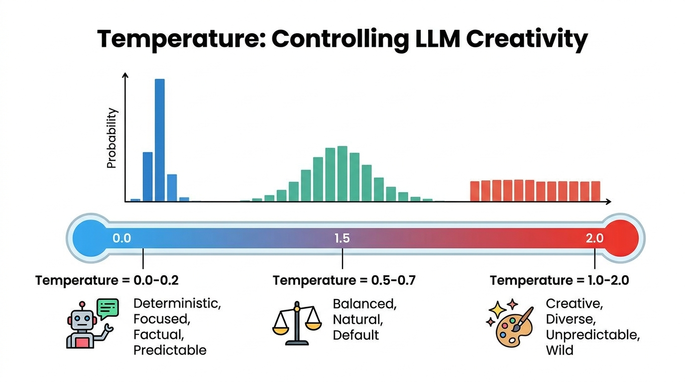

# 04. Parameters: Tuning Hyperparameters Like Temperature & Max Tokens to Control Output Creativity and Length

> **Zero to Hero Gen AI Course — Module 02: API Interaction & Prompt Engineering**  
> ⏱️ Estimated Reading Time: 55 minutes | 🎯 Level: Beginner to Advanced  
> ☕ **Audience:** Java / Spring Boot Developers transitioning to Python & Generative AI

---

## 0. 🌟 Why this topic matters

When an autoregressive Large Language Model (LLM) runs inference, it does not output human text directly. Its final transformer layer computes tens of thousands of raw floating-point numbers called **logits** across its entire vocabulary.

How those raw logits are converted into actual output words is dictated 100% by **decoding hyperparameters**:
1. **Determinism vs. Hallucination:** In enterprise tasks like SQL query generation, medical data extraction, or JSON serialization, a model must be strictly deterministic ($T = 0.0$). An uncalibrated temperature will introduce wild hallucinations and break downstream database queries.
2. **The Runaway Repetition Loop:** Without frequency penalties, neural language models can degrade into bizarre, repetitive loops (*"This is very, very, very important, important, important..."*).
3. **The Truncation Catastrophe:** If `max_tokens` is set too low, your model emits half a JSON object before cutting off. Your backend Java/Python JSON parser immediately crashes with an unhandled `JSONDecodeError` / `JsonParseException`!

Tuning inference hyperparameters is not guesswork—it is an exact mathematical discipline that balances **entropy**, **diversity**, and **safety**.

---

## 1. 🐣 Basic Level – "Explain like I'm new"

### 1.1 The Decoding Pipeline: From Neural Logits to Words

When you ask an LLM: *"The capital of France is ___"*, the model's neural network produces raw scores (logits) for ~100,000 possible tokens in its dictionary:
- `"Paris"`: score `+14.2`
- `"Lyon"`: score `+4.1`
- `"banana"`: score `-8.5`

Before any word is typed on screen, these scores pass through a multi-stage **decoding pipeline**:

```
+-----------------------------------------------------------------------------------------+
|                              THE INFERENCE DECODING PIPELINE                            |
|                                                                                         |
|   Final Transformer Layer                                                               |
|             │                                                                           |
|             ▼                                                                           |
|   1. Raw Logits Vector z ──► 2. Repetition Penalties ──► 3. Temperature Scaling (z / T) │
|      [-1.2, 14.2, 4.1, ...]     (subtract frequency)        (flatten or sharpen curve)  │
|                                                                     │                   |
|                                                                     ▼                   |
|   6. Final Chosen Token  ◄── 5. Top-P / Top-K Masking ◄─── 4. Softmax Normalization     |
|      "Paris" (ID: 4120)         (prune long tail tokens)    (convert scores to probs)   │
+-----------------------------------------------------------------------------------------+
```

Hyperparameters do not modify the model's pre-trained weights. Instead, they act as **valves and filters** controlling the final selection step.

---

### 1.2 Four Real-World Mental Models & Analogies

#### 🔥 Model 1: The Kitchen Gas Burner (Temperature as Kinetic Heat)
Think of Temperature like the flame control dial on a kitchen stove:
- **Zero Heat ($T = 0$):** Frozen solid. The flame is completely off. There is zero movement or randomness. If you drop a marble, it rolls into the single deepest groove 100% of the time. The model always picks the single highest-probability token (Greedy Decoding).
- **Medium Cooking Flame ($T = 0.7$):** A steady, natural blue flame. The marble jiggles gently, occasionally hopping into a creative adjacent groove while staying safely in the pan. The output sounds fluid, natural, and human.
- **Uncontrolled Wildfire ($T = 1.5+$):** Boiling chaos. Kinetic energy is so high that the marble flies wildly out of the pan. Even nonsensical, low-probability tokens get selected, causing grammatical breakdowns and bizarre hallucinations.

---

#### 🎟️ Model 2: The VIP Velvet Rope (Top-P vs. Top-K)
Imagine a bouncer managing the entrance to an exclusive nightclub:
- **Top-K (The Rigid Headcount):** The bouncer strictly admits the **first 50 people in line**, regardless of who they are.
  - *The Flaw:* If there are 2 world-famous rockstars and 48 random bystanders in line, Top-K lets in 48 low-quality people! If there are 200 celebrities, Top-K artificially blocks 150 great guests.
- **Top-P / Nucleus (The Dynamic Quality Cutoff):** The bouncer admits guests starting from the highest celebrity score downward until the **cumulative star rating reaches 90% ($P = 0.9$)**.
  - When Taylor Swift arrives, she alone makes up 92% of the star power—the door immediately shuts ($1$ person allowed).
  - When a group of indie artists arrives, the door stays open for 25 people until their combined score reaches 90%. **Top-P dynamically adapts to the certainty of the moment!**

---

#### 💰 Model 3: The Repetition Tax (Frequency vs. Presence Penalties)
- **Frequency Penalty (The Word Meter Tax):** You pay a 10-cent fine every time you repeat the exact word *"essentially"*. If you say it 5 times, your penalty is 50 cents. The model quickly searches for synonyms (*"fundamentally", "primarily"*).
- **Presence Penalty (The Topic Tax):** A flat $1 entry fee for touching a topic. Once you mention *"renewable energy"*, you pay the fee. Repeating the word again costs nothing extra, but the one-time fee encourages the conversation to wander toward fresh horizons.

---

#### ⛽ Model 4: The Rental Car Fuel Tank (Max Tokens)
`max_tokens` is the odometer trip limit or the fuel tank capacity on a rental car. If you set `max_tokens = 100`, the car shuts off after exactly 100 tokens—even if it is halfway through a sentence, a SQL query, or a closing JSON bracket!

---

### ☕ 1.3 The Java & Spring Boot Developer Bridge

How do LLM hyperparameters map to concepts you already use in Java and Spring Boot?

```
┌───────────────────────────────────────┬───────────────────────────────────────┐
│ Java / Spring Boot Concept            │ Python / OpenAI Hyperparameter        │
├───────────────────────────────────────┼───────────────────────────────────────┤
│ `OpenAiChatOptions.builder()`         │ Keyword arguments in API call         │
│ `.withTemperature(0.0).build()`       │ `client.chat.completions.create(...)` │
├───────────────────────────────────────┼───────────────────────────────────────┤
│ `application.yml` External Config     │ Model Configuration Registry          │
│ `spring.ai.openai.chat.options.temp=0`│ JSON/YAML profile presets             │
├───────────────────────────────────────┼───────────────────────────────────────┤
│ Pseudo-Random Seed (`new Random(42)`) │ OpenAI `seed` & `system_fingerprint`  │
│ Ensures reproducible random streams   │ Guarantees deterministic completions  │
├───────────────────────────────────────┼───────────────────────────────────────┤
│ Jackson `JsonParseException`          │ Inadequate `max_tokens` ceiling       │
│ Crashes when stream cuts off early    │ `finish_reason == 'length'`           │
├───────────────────────────────────────┼───────────────────────────────────────┤
│ Resilience4j RateLimiter & Backoff    │ Token budget accounting & TPM limits  │
│ Prevents system saturation            │ Prevents HTTP 429 quota exhaustion    │
└───────────────────────────────────────┴───────────────────────────────────────┘
```

#### Code Comparison: Spring AI vs. Modern Python

```java
// =========================================================================
// 1. JAVA (Spring AI) - Configuring Hyperparameters via ChatOptions
// =========================================================================
import org.springframework.ai.chat.prompt.Prompt;
import org.springframework.ai.openai.OpenAiChatOptions;
import org.springframework.ai.chat.client.ChatClient;

public class SqlGeneratorService {
    private final ChatClient chatClient;

    public SqlGeneratorService(ChatClient.Builder builder) {
        this.chatClient = builder.build();
    }

    public String generateSql(String userQuery) {
        // Enforce 100% deterministic decoding for SQL generation:
        OpenAiChatOptions options = OpenAiChatOptions.builder()
            .withModel("gpt-4o")
            .withTemperature(0.0f)      // Zero creativity
            .withTopP(1.0f)             // Full nucleus
            .withMaxTokens(1500)        // Ample token budget
            .withFrequencyPenalty(0.0f) // No penalty
            .build();

        return chatClient.prompt(new Prompt(userQuery, options))
                         .call()
                         .content();
    }
}
```

```python
# =========================================================================
# 2. PYTHON (Modern OpenAI SDK v1.0+) - Configuring Hyperparameters
# =========================================================================
from openai import OpenAI

client = OpenAI()

def generate_sql(user_query: str) -> str:
    response = client.chat.completions.create(
        model="gpt-4o",
        messages=[
            {"role": "system", "content": "You are a PostgreSQL expert. Output strictly valid SQL."},
            {"role": "user", "content": user_query}
        ],
        temperature=0.0,       # Zero randomness (Greedy Argmax)
        top_p=1.0,            # Keep full nucleus
        max_tokens=1500,       # Prevent premature truncation
        frequency_penalty=0.0,
        presence_penalty=0.0,
        seed=42                # Ensure reproducible sampling
    )
    return response.choices[0].message.content
```

---

## 2. 🧱 Building Up – Concepts added one by one

### 2.1 Temperature ($T$): Controlling Softmax Entropy & Creativity

#### Mathematical Formulation: The Softmax Scaler
The probability $P(w_i)$ of selecting token $w_i$ from vocabulary $\mathcal{V}$ is computed by dividing each logit $z_i$ by temperature $T > 0$ before applying Softmax:

$$P(w_i) = \frac{\exp\left(\frac{z_i}{T}\right)}{\sum_{j \in \mathcal{V}} \exp\left(\frac{z_j}{T}\right)}$$

```
Suppose Vocabulary has 3 tokens with raw logits: [z_1 = 4.0, z_2 = 2.0, z_3 = 1.0]

1. AT T = 1.0 (Standard Softmax):
   exp(4.0) = 54.60,  exp(2.0) = 7.39,   exp(1.0) = 2.72   ==> Sum = 64.71
   Probabilities: P = [84.4%, 11.4%, 4.2%]

2. AT T = 0.5 (Low Temperature - Sharpened / Peaked):
   z / 0.5 = [8.0, 4.0, 2.0]
   exp(8.0) = 2980.9, exp(4.0) = 54.6,   exp(2.0) = 7.4    ==> Sum = 3042.9
   Probabilities: P = [98.0%, 1.8%, 0.2%]  <-- Top token overwhelmingly dominates!

3. AT T = 2.0 (High Temperature - Flattened / High Entropy):
   z / 2.0 = [2.0, 1.0, 0.5]
   exp(2.0) = 7.39,   exp(1.0) = 2.72,   exp(0.5) = 1.65   ==> Sum = 11.76
   Probabilities: P = [62.8%, 23.1%, 14.0%] <-- Low-probability tokens amplified!
```

#### Behavior at the Extremes: $T \to 0$ vs. $T \to \infty$

1. **Greedy Argmax Limit ($T \to 0$):**
   $$\lim_{T \to 0^+} P(w_i) = \begin{cases} 1 & \text{if } i = \arg\max_j z_j \\ 0 & \text{otherwise} \end{cases}$$
   The distribution collapses into a **Dirac delta spike**. The model is completely deterministic: identical prompt inputs produce the exact same token sequence on every run.
2. **Uniform Randomness Limit ($T \to \infty$):**
   $$\lim_{T \to \infty} P(w_i) = \frac{1}{|\mathcal{V}|}$$
   All logits become equivalent ($z_i / \infty \to 0 \implies \exp(0) = 1$). The model turns into a random token generator, outputting chaotic gibberish.

#### Shannon Entropy Perspective
The Shannon entropy $H(X)$ measures the uncertainty in the output distribution:

$$H(X) = - \sum_{i \in \mathcal{V}} P(w_i) \log_2 P(w_i)$$

As $T \to 0$, $H(X) \to 0$ (Zero uncertainty). As $T$ increases, entropy $H(X)$ rises monotonically, creating higher diversity at the expense of factual grounding.



---

### 2.2 Top-P (Nucleus Sampling) vs. Top-K: Restricting Candidate Pools

#### Why Temperature Alone Is Insufficient
Even at $T = 0.7$, a vocabulary of 100,000 tokens has an extensive mathematical tail. Hundreds of nonsensical words retain tiny probabilities ($0.001\%$). Over a 1,000-token generation, the cumulative probability of sampling at least one disastrous outlier from the tail is:

$$P(\text{at least one outlier}) = 1 - (1 - 0.0001)^{1000} \approx 9.5\%$$

Candidate pool filtering permanently cuts off this tail.

#### Top-K Filtering: Hard Truncation
Introduced by *Fan et al. (2018)*, **Top-K** sorts tokens in descending order and retains strictly the top $K$ candidates (e.g., $K = 50$), zeroing out all others:

$$\tilde{\mathcal{V}} = \{w_{(1)}, w_{(2)}, \dots, w_{(K)}\}$$

**Weakness:** Top-K is static. When the model is $99\%$ certain (*"The capital of France is ___"*), it still retains 49 low-quality words. When the distribution is broad (100 valid adjectives), it artificially truncates 50 valid choices!

#### Top-P (Nucleus Sampling): Adaptive Cumulative Thresholding
Introduced by *Holtzman et al. (2019)*, **Top-P** dynamically sizes the candidate pool based on **cumulative probability mass**:

1. Sort all tokens by probability descending: $P(w_{(1)}) \ge P(w_{(2)}) \ge \dots$
2. Find the minimal subset $V^{(p)}$ such that:
   $$\sum_{i \in V^{(p)}} P(w_i) \ge p \quad \text{where } p \in (0, 1]$$
3. Truncate all tokens outside $V^{(p)}$ and re-normalize probabilities to sum to $1.0$.

```
SCENARIO A: HIGH CERTAINTY ("The capital of France is ___")
  Token 1: "Paris"      Prob = 94.0%  ──► Cumulative = 94.0% >= 0.90
  ==> Candidate Pool shrinks dynamically to JUST 1 TOKEN! ("Paris")
  Top-P cuts off 99,999 other tokens automatically!

SCENARIO B: HIGH UNCERTAINTY ("The traveler opened the ___")
  Token 1: "door"       Prob = 25.0%  ──► Cumulative = 25.0%
  Token 2: "window"     Prob = 18.0%  ──► Cumulative = 43.0%
  Token 3: "box"        Prob = 15.0%  ──► Cumulative = 58.0%
  Token 4: "letter"     Prob = 12.0%  ──► Cumulative = 70.0%
  Token 5: "map"        Prob = 11.0%  ──► Cumulative = 81.0%
  Token 6: "chest"      Prob = 10.0%  ──► Cumulative = 91.0% >= 0.90
  ==> Candidate Pool expands dynamically to 6 TOKENS!
```


#### The Golden Rule: Tune Temperature OR Top-P, Never Both
> [!IMPORTANT]
> **Official OpenAI Recommendation:**
> *"We generally recommend altering this or temperature but not both."*
>
> If you alter both simultaneously, their interactions compound unpredictably. For example, setting $T=0.2$ compresses probabilities, causing $P=0.8$ to collapse into 1 or 2 tokens, negating the purpose of tuning Top-P.
> - **Standard Pattern:** Keep `top_p = 1.0` and tune `temperature`.
> - **Alternative Pattern:** Keep `temperature = 1.0` and tune `top_p = 0.8 - 0.95`.

---

### 2.3 Frequency Penalty vs. Presence Penalty: Eliminating Repetition

When generating long outputs, LLMs can enter degenerate repetitive loops. OpenAI exposes two penalties that subtract directly from raw logits before the Softmax step:

#### Mathematical Formulation of Logit Modification

$$\tilde{z}_i = z_i - (\alpha_{\text{freq}} \times c_i) - (\alpha_{\text{pres}} \times \mathbb{I}[c_i > 0])$$

Where:
- $z_i$ is the original raw logit for token $i$.
- $c_i$ is the number of times token $i$ has **already appeared** in the current output.
- $\mathbb{I}[c_i > 0]$ is an indicator function: $1$ if the token appeared at least once, $0$ otherwise.
- Penalties range from $-2.0$ to $+2.0$.

```
+-----------------------------------------------------------------------------------------+
|                    FREQUENCY PENALTY vs PRESENCE PENALTY COMPARISON                     |
|                                                                                         |
|   Token Frequency Count:     c_i = 1       c_i = 2       c_i = 3       c_i = 5          |
|                                                                                         |
|   Presence Penalty (0.5):    -0.5          -0.5          -0.5          -0.5 (Constant!) |
|   Frequency Penalty (0.5):   -0.5          -1.0          -1.5          -2.5 (Scales!)   |
+-----------------------------------------------------------------------------------------+
```


- **Frequency Penalty ($\alpha_{\text{freq}}$):** Scales linearly with repetition count ($0.1$ to $0.5$ suppresses repeated vocabulary; negative values encourage rhyming).
- **Presence Penalty ($\alpha_{\text{pres}}$):** Constant flat penalty for appearing at all ($0.1$ to $0.5$ encourages the model to branch into new topics).

---

### 2.4 Max Tokens & Context Window Mechanics

#### `max_tokens` vs. `max_completion_tokens`
- **`max_tokens` (Legacy / Standard):** The maximum number of tokens permitted in the visible completion.
- **`max_completion_tokens` (Modern standard for reasoning models like o1/o3):** Sets an upper bound encompassing both internal hidden reasoning "thinking tokens" and final visible tokens.

#### Truncation Detection: Checking `finish_reason == 'length'`
Never assume a completion finished successfully. Always inspect the `finish_reason` attribute:

```python
response = client.chat.completions.create(
    model="gpt-4o-mini",
    messages=[{"role": "user", "content": "Write a 500-word essay."}],
    max_tokens=60  # Tiny ceiling
)

finish_reason = response.choices[0].finish_reason

if finish_reason == "length":
    print("⚠️ WARNING: Truncated by max_tokens ceiling!")
    # Trigger continuation request or alert user
elif finish_reason == "stop":
    print("✅ Completed naturally.")
```

#### The Danger of Truncated JSON
If an application requests JSON mode (`response_format={"type": "json_object"}`) and hits the `max_tokens` ceiling midway:
```json
{
  "order_id": 9042,
  "items": [
    {"name": "Widget", "price": 19.99},
    {"name": "Gadg
```
The closing bracket `]` and brace `}` are missing! Passing this string to `json.loads()` will throw an unhandled `JSONDecodeError` crash.
- **Rule:** Always allocate generous token headroom ($1,500$ to $2,500$ tokens) when requesting structured JSON schemas.

---

### 2.5 The Master Hyperparameter Tuning Matrix

| Use Case | Temperature ($T$) | Top-P ($P$) | Frequency Penalty | Presence Penalty | Max Tokens | Optimization Goal |
|---|---|---|---|---|---|---|
| **SQL & Code Generation** | `0.0` | `1.0` | `0.0` | `0.0` | `1,500` | 100% Deterministic syntax, zero improvisation |
| **JSON Data Extraction** | `0.0` | `1.0` | `0.0` | `0.0` | `2,000` | Schema fidelity, avoid syntax parse crashes |
| **Enterprise RAG / Support** | `0.2` | `0.9` | `0.1` | `0.1` | `800` | Factual grounding with natural conversational cadence |
| **General Conversational Chat**| `0.7` | `0.95` | `0.2` | `0.1` | `1,000` | Engaging, fluid, human-like dialogue |
| **Creative Writing & Fiction** | `0.9` | `0.95` | `0.3` | `0.3` | `3,000` | Rich vocabulary, novel narratives |
| **Brainstorming & Ideation** | `1.1` | `1.0` | `0.5` | `0.5` | `1,200` | Divergent lateral thinking, exploratory concepts |

---

### 2.6 Complete Visual Architecture

Below is the definitive visual architecture illustrating LLM Inference Hyperparameters and Decoding Mechanics:


---

## 3. 🧪 Hands-On Lab & Practice Exercises

### 3.1 Standalone Python Lab: NumPy Hyperparameter Simulator

You can execute the official lab script directly from your terminal:
```bash
python "2. API Interaction & Prompt Engineering/code/hyperparameters_lab.py"
```

Here is the complete, runnable Python script simulating the entire decoding pipeline from scratch using pure NumPy:

```python
"""
=============================================================================
Hands-On Lab: LLM Hyperparameters & Decoding Mechanics in Python (NumPy)
=============================================================================
Course: Zero to Hero Gen AI — Module 02: API Interaction & Prompt Engineering
Topic: Parameters: Tuning Hyperparameters (Temperature, Top-P, Penalties, Max Tokens)
"""

import numpy as np

# ---------------------------------------------------------------------------
# 1. Softmax with Temperature Scaling
# ---------------------------------------------------------------------------
def softmax_with_temperature(logits: np.ndarray, temperature: float = 1.0) -> np.ndarray:
    """Computes Softmax with temperature scaling."""
    if temperature <= 0.001:
        # T -> 0: Deterministic Greedy Argmax
        probs = np.zeros_like(logits)
        probs[np.argmax(logits)] = 1.0
        return probs

    scaled_logits = logits / temperature
    exp_scaled = np.exp(scaled_logits - np.max(scaled_logits))
    return exp_scaled / np.sum(exp_scaled)

# ---------------------------------------------------------------------------
# 2. Top-P (Nucleus Sampling) Filter
# ---------------------------------------------------------------------------
def apply_top_p(probs: np.ndarray, p: float = 0.9) -> tuple[np.ndarray, list]:
    """Dynamically keeps the smallest subset whose cumulative sum >= P."""
    indices = np.argsort(probs)[::-1]
    sorted_probs = probs[indices]
    cumulative = np.cumsum(sorted_probs)

    cutoff = np.searchsorted(cumulative, p)
    keep_indices = indices[:cutoff + 1]

    filtered = np.zeros_like(probs)
    filtered[keep_indices] = probs[keep_indices]
    return (filtered / np.sum(filtered)), list(keep_indices)

# ---------------------------------------------------------------------------
# 3. Frequency & Presence Penalties
# ---------------------------------------------------------------------------
def apply_penalties(logits: np.ndarray, token_counts: np.ndarray, freq_penalty: float, pres_penalty: float) -> np.ndarray:
    """Applies frequency and presence penalties to raw logits."""
    presence_mask = (token_counts > 0).astype(float)
    adjusted_logits = logits - (freq_penalty * token_counts) - (pres_penalty * presence_mask)
    return adjusted_logits

# ---------------------------------------------------------------------------
# 4. Simulation Execution
# ---------------------------------------------------------------------------
if __name__ == "__main__":
    print("=" * 70)
    print("Testing Mathematical Decoding Pipeline")
    print("=" * 70)

    words = ["Paris", "London", "Rome", "Madrid", "Tokyo"]
    raw_logits = np.array([4.0, 2.2, 1.5, 0.8, -0.5])

    print("Candidate Words:", words)
    print("Raw Logits:", raw_logits)

    for T in [0.0, 0.5, 1.0, 1.5]:
        probs = softmax_with_temperature(raw_logits, temperature=T)
        print(f"\n--- Temperature T = {T} ---")
        for w, p in zip(words, probs):
            print(f"  {w:<8}: {p:>6.2%}")
```

---

### 3.2 Practice Exercises (Beginner to Advanced)

#### 🟢 Exercise 1 (Easy): Hand-Calculating Softmax with Temperature
**Problem:** A vocabulary of 3 tokens has raw logits: $z_1 = 3.0$, $z_2 = 1.0$, $z_3 = 0.0$.
Calculate the probability distribution at $T = 1.0$ and $T = 0.5$. Show the step-by-step arithmetic.

<details>
<summary><b>View Complete Solution</b></summary>

```python
import numpy as np

logits = np.array([3.0, 1.0, 0.0])

# 1. At T = 1.0:
exp_1 = np.exp(logits / 1.0) # [20.086, 2.718, 1.000]
p_1 = exp_1 / np.sum(exp_1)

# 2. At T = 0.5:
exp_05 = np.exp(logits / 0.5) # exp([6.0, 2.0, 0.0]) = [403.429, 7.389, 1.000]
p_05 = exp_05 / np.sum(exp_05)

print(f"T = 1.0: P1 = {p_1[0]:.4f} (84.4%), P2 = {p_1[1]:.4f} (11.4%), P3 = {p_1[2]:.4f} (4.2%)")
print(f"T = 0.5: P1 = {p_05[0]:.4f} (98.0%), P2 = {p_05[1]:.4f} (1.8%),  P3 = {p_05[2]:.4f} (0.2%)")
```
*Mathematical Takeaway:* Halving the temperature increased the top token's probability from $84.4\%$ to $98.0\%$, suppressing the alternative tokens drastically!
</details>

---

#### 🟡 Exercise 2 (Intermediate): Building a Truncation-Safe JSON API Client Wrapper
**Problem:** Write a Python function `safe_json_chat_completion(client, model, messages, max_tokens)` that:
1. Calls the OpenAI API requesting JSON mode.
2. Checks `finish_reason`. If `finish_reason == "length"`, raises a `RuntimeError("Response truncated by max_tokens!")`.
3. Safely parses the output using `json.loads()`, returning the validated Python dictionary.

<details>
<summary><b>View Complete Solution</b></summary>

```python
import json
from openai import OpenAI

def safe_json_chat_completion(client: OpenAI, model: str, messages: list[dict], max_tokens: int = 1500) -> dict:
    """Executes a chat completion with JSON mode, detecting premature truncation."""
    # Ensure system prompt mentions "JSON" as required by OpenAI JSON mode
    has_json_keyword = any("json" in m["content"].lower() for m in messages)
    if not has_json_keyword:
        messages[0]["content"] += " Output strictly valid JSON."

    response = client.chat.completions.create(
        model=model,
        messages=messages,
        temperature=0.0,
        max_tokens=max_tokens,
        response_format={"type": "json_object"}
    )

    choice = response.choices[0]
    
    # Check truncation flag
    if choice.finish_reason == "length":
        raise RuntimeError(
            f"Generation truncated by max_tokens={max_tokens} ceiling! "
            f"The JSON object is incomplete and invalid."
        )

    try:
        parsed_json = json.loads(choice.message.content)
        return parsed_json
    except json.JSONDecodeError as e:
        raise ValueError(f"Model emitted invalid JSON despite finish_reason='stop': {e}")
```
</details>

---

#### 🟠 Exercise 3 (Intermediate/Hard): Calculating Nucleus Candidate Pool Sizes
**Problem:** Given 8 tokens with probabilities:
`[0.40, 0.25, 0.15, 0.08, 0.05, 0.04, 0.02, 0.01]`
Write a function that calculates the exact candidate pool size for $P = 0.50$, $P = 0.80$, and $P = 0.95$.

<details>
<summary><b>View Complete Solution</b></summary>

```python
import numpy as np

def calculate_nucleus_pool_size(probs: list[float], p_threshold: float) -> int:
    sorted_probs = sorted(probs, reverse=True)
    cumulative = np.cumsum(sorted_probs)
    # Find the index where cumulative probability reaches or exceeds threshold
    cutoff = np.searchsorted(cumulative, p_threshold)
    return cutoff + 1

sample_probs = [0.40, 0.25, 0.15, 0.08, 0.05, 0.04, 0.02, 0.01]

for p in [0.50, 0.80, 0.95]:
    size = calculate_nucleus_pool_size(sample_probs, p)
    print(f"Top-P = {p:.2f} ==> Candidate Pool Size: {size} tokens")
```
*Output:*
- Top-P = 0.50 $\implies$ Candidate Pool Size: 2 tokens (0.40 + 0.25 = 0.65 $\ge$ 0.50)
- Top-P = 0.80 $\implies$ Candidate Pool Size: 3 tokens (0.40 + 0.25 + 0.15 = 0.80 $\ge$ 0.80)
- Top-P = 0.95 $\implies$ Candidate Pool Size: 6 tokens (0.40 + 0.25 + 0.15 + 0.08 + 0.05 + 0.04 = 0.97 $\ge$ 0.95)
</details>

---

#### 🔴 Exercise 4 (Advanced): Profile-Based Model Configurator Class
**Problem:** Build an enterprise `ModelProfileManager` class that exposes predefined hyperparameter configurations for four distinct environments: `"CODE"`, `"JSON"`, `"CHAT"`, and `"CREATIVE"`. The manager must validate that `temperature` and `top_p` are not modified simultaneously.

<details>
<summary><b>View Complete Solution</b></summary>

```python
class ModelProfileManager:
    PROFILES = {
        "CODE": {
            "temperature": 0.0,
            "top_p": 1.0,
            "frequency_penalty": 0.0,
            "presence_penalty": 0.0,
            "max_tokens": 2000
        },
        "JSON": {
            "temperature": 0.0,
            "top_p": 1.0,
            "frequency_penalty": 0.0,
            "presence_penalty": 0.0,
            "max_tokens": 2500
        },
        "CHAT": {
            "temperature": 0.7,
            "top_p": 1.0,
            "frequency_penalty": 0.2,
            "presence_penalty": 0.1,
            "max_tokens": 1000
        },
        "CREATIVE": {
            "temperature": 0.95,
            "top_p": 1.0,
            "frequency_penalty": 0.3,
            "presence_penalty": 0.3,
            "max_tokens": 3000
        }
    }

    @classmethod
    def get_config(cls, profile_name: str, overrides: dict = None) -> dict:
        profile_name = profile_name.upper()
        if profile_name not in cls.PROFILES:
            raise KeyError(f"Unknown profile '{profile_name}'. Choose from: {list(cls.PROFILES.keys())}")

        config = cls.PROFILES[profile_name].copy()
        if overrides:
            config.update(overrides)

        # Enforce Golden Rule: Never tune both Temperature and Top-P!
        if config["temperature"] != 1.0 and config["top_p"] != 1.0 and config["temperature"] != 0.0:
            print("⚠️ WARNING: Altering both Temperature and Top-P simultaneously can cause unpredictable sampling collapse!")

        return config

# Test demonstration
code_config = ModelProfileManager.get_config("CODE")
print("✅ Loaded Code Config:", code_config)
```
</details>

---

## 4. ⚙️ Pro Level – Internals & Interview Q&A

### 4.1 Advanced Internals

#### 1. The Seed Parameter & `system_fingerprint`
OpenAI supports a `seed` integer parameter (e.g. `seed=42`) for deterministic sampling:
- While setting `temperature=0.0` is generally deterministic, GPU cluster non-determinism (floating-point race conditions in CUDA matrix kernels) can occasionally cause slight token drift.
- Supplying a fixed `seed` forces the backend to use deterministic pseudo-random sequences.
- Each API response returns a `system_fingerprint` string (e.g., `fp_44709d6fcb`). If OpenAI updates its underlying hardware or model quantization weights, the fingerprint changes, alerting you that sampling distributions may have shifted!

#### 2. Logit Bias: Forcing or Banning Specific Tokens
Providers allow passing a `logit_bias` dictionary mapping token IDs to integer penalties or boosts from $-100$ to $+100$:
- Setting `logit_bias={4120: -100}` completely bans token `4120` from ever appearing in the generation ($\exp(z - 100) \approx 0$).
- Setting `logit_bias={4120: +100}` forces the model to select that token.

---

### 4.2 High-Frequency Technical Interview Questions & Answers

#### Q1: Why does setting $T = 0.0$ make an LLM deterministic, and what mathematical operation does it reduce to?
<details>
<summary><b>View Detailed Answer</b></summary>
<b>Explanation:</b><br>
As temperature approaches zero ($T \to 0^+$), dividing logits by an infinitesimally small number magnifies the numerical differences between scores infinitely. When passed to the softmax function, the single highest logit receives probability $1.0$, while all other tokens receive probability $0.0$. 

This reduces sampling to <b>Greedy Argmax Decoding</b> ($\arg\max_i z_i$), eliminating all randomness.
</details>

#### Q2: Why is Top-P (Nucleus Sampling) superior to Top-K sampling in open-ended text generation?
<details>
<summary><b>View Detailed Answer</b></summary>
<b>Explanation:</b><br>
Top-K uses a rigid, fixed number of candidates (e.g. $K=50$). When the model is highly confident (e.g. only 1 or 2 valid words exist), Top-K still includes 48 low-probability, low-quality words. Conversely, when the distribution is broad (e.g. 100 equally valid adjectives), Top-K arbitrarily discards 50 valid choices. 

Top-P dynamically expands or contracts the candidate pool based on cumulative probability mass, including only words that meet the threshold.
</details>

#### Q3: What is the difference between Frequency Penalty and Presence Penalty in the OpenAI API?
<details>
<summary><b>View Detailed Answer</b></summary>
<b>Explanation:</b><br>
<b>Frequency Penalty</b> scales linearly with how many times a token has appeared ($c_i$), penalizing words proportionally to their repetition count: $\tilde{z}_i = z_i - (\alpha_{\text{freq}} \times c_i)$.

<b>Presence Penalty</b> applies a constant, one-time flat penalty as long as the token has appeared at least once ($\mathbb{I}[c_i > 0]$): $\tilde{z}_i = z_i - (\alpha_{\text{pres}} \times 1)$, encouraging the model to introduce completely new topics rather than continually suppressing a single word.
</details>

#### Q4: Why does OpenAI officially recommend tuning either Temperature OR Top-P, but never both simultaneously?
<details>
<summary><b>View Detailed Answer</b></summary>
<b>Explanation:</b><br>
Both hyperparameters alter the entropy of the probability distribution, but through different mechanisms. Temperature scales the relative gaps between all logits across the entire vocabulary, while Top-P truncates the tail based on cumulative probability. 

If you lower Temperature to $0.2$, the probability mass concentrates heavily into the top 1–2 tokens. Applying Top-P ($0.8$) on top of that becomes completely redundant, or worse, can lead to sampling collapse. Tuning one knob while keeping the other fixed allows controlled, predictable calibration.
</details>

#### Q5: What causes `finish_reason == 'length'` and why is it dangerous for downstream JSON consumers?
<details>
<summary><b>View Detailed Answer</b></summary>
<b>Explanation:</b><br>
`finish_reason == 'length'` occurs when the token generation is halted prematurely because it hit the `max_tokens` ceiling before emitting the model's natural end-of-sequence (`<|endoftext|>`) token. 

This is catastrophic for structured outputs (JSON or code) because the string cuts off midway, missing closing delimiters (brackets, quotes, braces). When passed to `json.loads()`, the parser throws a fatal syntax exception. Production pipelines must always inspect `finish_reason` before parsing.
</details>

#### Q6: How does the OpenAI `seed` parameter interact with temperature, and can it guarantee 100% reproducibility?
<details>
<summary><b>View Detailed Answer</b></summary>
<b>Explanation:</b><br>
The `seed` parameter guides the server's pseudo-random number generator to sample deterministically across requests with identical prompts and temperatures. 

However, it offers <b>best-effort reproducibility</b> rather than an absolute 100% mathematical guarantee. Subtle differences in backend GPU cluster architecture, non-deterministic CUDA floating-point matrix operations, or model server updates (indicated by changes to `system_fingerprint`) can still lead to occasional minor token variations.
</details>

---

## 5. ⚡ Quick Revision (Cheat-Sheet)

```
========================================================================================
                          HYPERPARAMETERS REVISION CHEAT SHEET
========================================================================================

1. THE DECODING FORMULA:
   P(w_i) = exp((z_i - freq*c - pres) / T) / Sum(exp(...))

2. TEMPERATURE SPECTRUM:
   • T = 0.0:     Greedy Argmax. 100% Deterministic (SQL, JSON extraction, Math).
   • T = 0.2:     Conservative & focused (Technical code, Enterprise RAG, Support).
   • T = 0.7:     Balanced & natural (Conversational chat, Email drafting).
   • T = 1.0+:    Creative & divergent (Ideation, Poetry, Storytelling).

3. TOP-P (NUCLEUS) vs TOP-K:
   • Top-K:       Fixed headcount (Keeps top K tokens). Rigid; cuts off valid tokens in broad contexts.
   • Top-P:       Dynamic cumulative mass (Keeps smallest subset reaching sum >= P). Adaptive & safe!
   • Golden Rule: Tune Temperature OR Top-P, NEVER BOTH!

4. PENALTIES:
   • Frequency Penalty: Scales linearly with count (-0.1 to 0.5). Punishes repeating words.
   • Presence Penalty:  Flat one-time fee (-0.1 to 0.5). Encourages shifting to new subtopics.

5. TRUNCATION SAFETY:
   • Always inspect choice.finish_reason!
   • finish_reason == 'stop':   Completed naturally. Safe to parse.
   • finish_reason == 'length': Truncated by max_tokens ceiling! JSON will be broken!

6. JAVA / SPRING BOOT EQUIVALENTS:
   • OpenAiChatOptions.builder().withTemperature(0.0).withMaxTokens(1500).build()
   • application.yml: spring.ai.openai.chat.options.temperature: 0.0
========================================================================================
```

---

## 6. 🎬 References & Visual Learning Videos

### 6.1 🇮🇳 Telugu Tech Video References
For native Telugu speakers, these curated video tutorials explain LLM hyperparameters and inference settings step-by-step:

| # | Topic / Video Title | Channel / Creator | Search Query | Highlights |
|---|---|---|---|---|
| 1 | **LLM Parameters & Temperature in Telugu** | **Python Life Telugu** | `Python Life Telugu Gen AI Parameters Temperature` | Complete breakdown of what temperature and max tokens do in Generative AI in Telugu. |
| 2 | **Understanding ChatGPT Settings in Telugu** | **Vamsi Bhavani** | `Vamsi Bhavani ChatGPT Settings Temperature Top P` | Practical guide to controlling AI creativity, avoiding hallucinations, and tuning prompts. |
| 3 | **OpenAI API Parameters & Sampling in Telugu** | **Telugu Tech Tutorials** | `Telugu Tech OpenAI Parameters Sampling` | Step-by-step API integration covering `temperature`, `top_p`, and penalty parameters in Telugu. |

---

### 6.2 🎥 3D Animated & World-Class Visual Deep Dives

| # | Topic / Video Title | Channel / Creator | Search Query | Visual & Technical Highlights |
|---|---|---|---|---|
| 1 | **Temperature and Top P Explained in Plain English** | **Annielytics** | `Annielytics Temperature Top P Explained` | Visual animation showing how temperature scales the softmax curve and how Top-P truncates token tails. |
| 2 | **LLM Inference & Decoding System Design** | **ByteByteGo** | `ByteByteGo LLM Inference Decoding` | Visual system architecture illustrating how foundation models decode logits into tokens during streaming. |
| 3 | **Softmax & Neural Probability Clearly Explained!** | **3Blue1Brown** | `3Blue1Brown Softmax Neural Networks` | World-class 3D geometric animations demonstrating exponential scaling, normalization, and entropy. |
| 4 | **State of GPT & Sampling Dynamics** | **Andrej Karpathy** | `Andrej Karpathy State of GPT Microsoft Build` | The definitive masterclass on temperature, entropy, greedy sampling vs stochastic decoding, and hallucinations. |
| 5 | **Tokenization & Prompting Clearly Explained** | **StatQuest with Josh Starmer** | `StatQuest Tokenization Clearly Explained` | Step-by-step visual breakdown of vocabulary mappings, token logits, and decoding mechanics with zero jargon. |

---

### 6.3 📚 Foundational Research Papers
1. **Holtzman, A., et al. (2019).** *"The Curious Case of Neural Text Degeneration."* ICLR 2020. [arXiv:1904.09751](https://arxiv.org/abs/1904.09751) *(Introduced Top-P / Nucleus Sampling)*
2. **Fan, A., et al. (2018).** *"Hierarchical Neural Story Generation."* ACL 2018. [arXiv:1805.04833](https://arxiv.org/abs/1805.04833) *(Introduced Top-K Sampling)*
3. **OpenAI API Parameter Reference:** [platform.openai.com/docs/api-reference/chat/create](https://platform.openai.com/docs/api-reference/chat/create)
