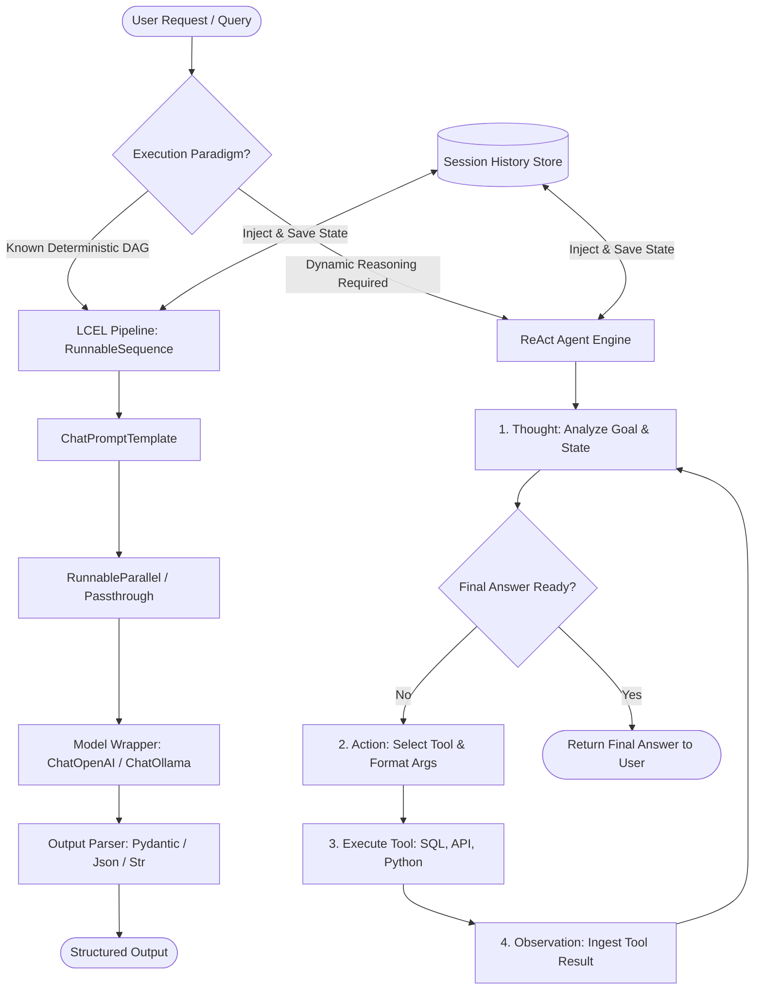

# 🦜 The LangChain Framework Architecture: Wrappers, Chains, and Agents for Modular Application Development

> **Zero to Hero Gen AI Course — Module 03: The LangChain Framework & Chaining**
>
> 📅 Module 3 | ⏱️ Estimated Reading Time: 60 minutes | 🎯 Level: Intermediate to Advanced
>
> **Core Objective:** Master the foundational architectural patterns of the LangChain ecosystem. Understand how standard model wrappers abstract heterogeneous LLM providers, how LangChain Expression Language (LCEL) turns prompt-model-parser workflows into deterministic Unix-style pipelines, and how autonomous ReAct agents use dynamic reasoning loops and tool execution to solve multi-step problems.

---

## 📑 Table of Contents

1. [The Paradigm Shift: From Ad-Hoc Scripts to Composable LLM Architectures](#1-the-paradigm-shift-from-ad-hoc-scripts-to-composable-llm-architectures)
2. [Intuitive Mental Models & Analogies](#2-intuitive-mental-models--analogies)
   - [2.1 The Universal Power Adapter: Model Wrappers](#21-the-universal-power-adapter-model-wrappers)
   - [2.2 The Factory Conveyor Belt & Unix Pipes: Chains & LCEL](#22-the-factory-conveyor-belt--unix-pipes-chains--lcel)
   - [2.3 The Detective with a Toolbag: Autonomous ReAct Agents](#23-the-detective-with-a-toolbag-autonomous-react-agents)
3. [The 6 Core Building Blocks of LangChain](#3-the-6-core-building-blocks-of-langchain)
   - [3.1 High-Level Architecture Overview](#31-high-level-architecture-overview)
   - [3.2 Component Decomposition & Responsibilities](#32-component-decomposition--responsibilities)
4. [Model Wrappers & The Standardized `Runnable` Protocol](#4-model-wrappers--the-standardized-runnable-protocol)
   - [4.1 Why Abstraction Matters: Vendor Lock-in vs Provider Agnosticism](#41-why-abstraction-matters-vendor-lock-in-vs-provider-agnosticism)
   - [4.2 The Unified `Runnable` Interface](#42-the-unified-runnable-interface)
   - [4.3 Synchronous, Asynchronous, Streaming, and Batching Semantics](#43-synchronous-asynchronous-streaming-and-batching-semantics)
5. [LangChain Expression Language (LCEL) & Pipeline Orchestration](#5-langchain-expression-language-lcel--pipeline-orchestration)
   - [5.1 The Mathematical Formulation of LCEL](#51-the-mathematical-formulation-of-lcel)
   - [5.2 The Unix Pipe Operator `|` and `RunnableSequence`](#52-the-unix-pipe-operator--and-runnablesequence)
   - [5.3 Essential LCEL Primitives: Passthrough, Parallel, and Lambda](#53-essential-lcel-primitives-passthrough-parallel-and-lambda)
   - [5.4 Output Parsers: Extracting Deterministic Typed Payloads](#54-output-parsers-extracting-deterministic-typed-payloads)
6. [Agent Architecture: The ReAct Reasoning Paradigm](#6-agent-architecture-the-react-reasoning-paradigm)
   - [6.1 Why Fixed Chains Fall Short](#61-why-fixed-chains-fall-short)
   - [6.2 The ReAct Loop: Thought $\to$ Action $\to$ Action Input $\to$ Observation](#62-the-react-loop-thought-to-action-to-action-input-to-observation)
   - [6.3 Tool Definition, Schemas, and Pydantic Parameter Binding](#63-tool-definition-schemas-and-pydantic-parameter-binding)
   - [6.4 Execution Control, Stop Conditions, and Guardrails](#64-execution-control-stop-conditions-and-guardrails)
7. [Memory & Conversational State Management](#7-memory--conversational-state-management)
   - [7.1 The Statelessness Problem in Multi-Turn Systems](#71-the-statelessness-problem-in-multi-turn-systems)
   - [7.2 Memory Topologies: Buffer, Summary, Window, and Entity](#72-memory-topologies-buffer-summary-window-and-entity)
   - [7.3 Modern State Management with `RunnableWithMessageHistory`](#73-modern-state-management-with-runnablewithmessagehistory)
8. [Complete Architecture Visualized](#8-complete-architecture-visualized)
9. [Hands-On Python Lab: Building LCEL Pipelines & ReAct Agents](#9-hands-on-python-lab-building-lcel-pipelines--react-agents)
10. [Curated Video Walkthroughs & Visual Animations](#10-curated-video-walkthroughs--visual-animations)
11. [Self-Assessment & Review Questions](#11-self-assessment--review-questions)
12. [Summary & Key Takeaways](#12-summary--key-takeaways)

---

## 1. The Paradigm Shift: From Ad-Hoc Scripts to Composable LLM Architectures

When engineers first experiment with Large Language Models (LLMs), they typically write direct scripts using vendor SDKs:

```python
# The Ad-Hoc Approach: Brittle, tightly coupled, and vendor-locked
import openai

response = openai.chat.completions.create(
    model="gpt-4o",
    messages=[{"role": "user", "content": "Analyze quarterly reports..."}]
)
text = response.choices[0].message.content
# Manual string slicing, fragile regex parsing, custom retry loops...
```

While this works for simple prototypes, real-world generative AI products quickly face severe engineering hurdles:
1. **Vendor Lock-in**: Switching from OpenAI (`gpt-4o`) to Anthropic (`claude-3-5-sonnet`) or an on-premise open-source model via Ollama requires rewriting client initializations, payload structures, streaming handlers, and token parsers.
2. **Fragile Composition**: Chaining multiple reasoning steps (e.g., query translation $\to$ document retrieval $\to$ summarization $\to$ safety filter $\to$ JSON extraction) results in nested spaghetti code with manual error handling at every juncture.
3. **No Dynamic Autonomy**: Static code executes pre-determined if-else branches. It cannot autonomously decide *which* tool to call (e.g., SQL database vs Web Search vs Calculator) based on user input.

**LangChain** resolves these hurdles by introducing a unified, modular framework architecture built on three pillars:

$$\text{LangChain Framework} = \underbrace{\text{Unified Model Wrappers}}_{\text{Portability}} + \underbrace{\text{LCEL Chains}}_{\text{Deterministic Composition}} + \underbrace{\text{ReAct Agents}}_{\text{Autonomous Decision-Making}}$$

---

## 2. Intuitive Mental Models & Analogies

```
+-----------------------------------------------------------------------------------+
|                        THE THREE CORE PILLARS ANALOGY                             |
+-----------------------------------------------------------------------------------+
|                                                                                   |
|  1. MODEL WRAPPER               2. LCEL PIPELINE               3. REACT AGENT     |
|   (Universal Plug)              (Conveyor Belt)               (Autonomous Sleuth) |
|                                                                                   |
|   +-----------------+           +-----------------+          +------------------+ |
|   |  OpenAI / Claude|           | Input -> Step A |          |  Thought: Plan   | |
|   |  Ollama / Cohere|  ======>  |   |             |  ======> |  Action: Use Tool| |
|   +--------+--------+           |   v             |          |  Obs: Read result| |
|            |                    | Step B -> Output|          |  Repeat / Finish | |
|   [One Single Method]           +-----------------+          +------------------+ |
|                                                                                   |
+-----------------------------------------------------------------------------------+
```

### 2.1 The Universal Power Adapter: Model Wrappers
Imagine traveling across Europe, the UK, the US, and Japan. Each country features radically different electrical wall sockets and voltages. Without a universal adapter, you must buy four distinct charging devices. 

In software, **Model Wrappers** (`ChatOpenAI`, `ChatAnthropic`, `ChatOllama`) act as the universal international power adapter. Your downstream application code always plugs into the exact same standardized receptacle: `.invoke(prompt)`. The wrapper translates this call behind the scenes into the vendor's proprietary protocol, headers, payload schema, and error codes.

### 2.2 The Factory Conveyor Belt & Unix Pipes: Chains & LCEL
In modern automotive manufacturing, raw steel passes along a high-speed conveyor belt: the stamping press shapes the panel, the robotic arm welds it, the sprayer coats it, and the QA sensor inspects it. No human manually carries half-built frames between rooms.

**LangChain Expression Language (LCEL)** operates like a software conveyor belt using Unix pipe syntax (`|`). Data flows seamlessly:
$$\text{Input Dictionary} \xrightarrow{\mid} \text{Prompt Template} \xrightarrow{\mid} \text{LLM Wrapper} \xrightarrow{\mid} \text{JSON Output Parser}$$
Each workstation transforms the item and immediately passes it to the next workstation with built-in streaming, batching, and asynchronous execution.

### 2.3 The Detective with a Toolbag: Autonomous ReAct Agents
A factory conveyor belt is deterministic: every car gets painted blue, welded, and inspected identically. But what if a task requires investigation?
- *"Find out which branch office had the lowest sales last quarter, lookup the branch manager's phone number, and compose a follow-up briefing."*

A static chain cannot anticipate how many database queries are needed or whether the branch directory needs to be searched. 

An **Agent** is like an autonomous detective equipped with a toolbag (SQL database client, calculator, search engine). The agent looks at the clue, thinks (*"I need to query the quarterly sales database"*), chooses a tool, executes it, observes the result (*"Chicago branch had \$12,000"*), and iterates until the case is solved.

---

## 3. The 6 Core Building Blocks of LangChain

### 3.1 High-Level Architecture Overview

LangChain structures modular AI applications around 6 fundamental architectural pillars:


### 3.2 Component Decomposition & Responsibilities

| Core Module | Primary Purpose | Key Classes & Interfaces | Production Role |
| :--- | :--- | :--- | :--- |
| **1. Models** | Standardized interfaces to chat models and text completion engines | `ChatOpenAI`, `ChatAnthropic`, `ChatOllama`, `BaseChatModel` | Eliminates vendor lock-in; standardizes token generation and streaming across all providers. |
| **2. Prompts** | Dynamic, parameterized templating for system, human, and few-shot prompts | `ChatPromptTemplate`, `PromptTemplate`, `MessagesPlaceholder` | Ensures deterministic formatting, injection prevention, and modular prompt reusability. |
| **3. Chains (LCEL)** | Composable pipelines chaining prompts, models, and transformations | `RunnableSequence`, `RunnableParallel`, `RunnablePassthrough` | Eliminates procedural glue code; provides native async, streaming, and parallel execution. |
| **4. Memory** | State retention across stateless HTTP request cycles | `ChatMessageHistory`, `RunnableWithMessageHistory`, `ConversationBufferMemory` | Injects multi-turn conversational context into prompts dynamically without blowing context limits. |
| **5. Retrievers (RAG)** | Grounding models with external private documents and semantic search | `VectorStoreRetriever`, `Chroma`, `FAISS`, `Document` | Prevents hallucinations; enables domain-specific Q&A by injecting relevant passages into prompts. |
| **6. Agents & Tools** | LLM-driven decision engines that dynamically plan and invoke functions | `create_react_agent`, `AgentExecutor`, `@tool`, `StructuredTool` | Automates multi-step workflows, API calls, database lookups, and external computation. |

---

## 4. Model Wrappers & The Standardized `Runnable` Protocol

### 4.1 Why Abstraction Matters: Vendor Lock-in vs Provider Agnosticism

Without an abstraction layer, switching your LLM provider entails substantial refactoring:

```
[OpenAI API]    -> Request: {"messages": [...]}       -> Response: .choices[0].message.content
[Anthropic API] -> Request: {"system": ..., "messages"} -> Response: .content[0].text
[Ollama API]    -> Request: {"prompt": ...}           -> Response: .response
```

LangChain abstracts all models behind the `BaseChatModel` base class. Every provider wrapper outputs a uniform `AIMessage` containing:
- `content`: The generated text or multimodal output.
- `response_metadata`: Model name, token usage breakdown, and finish reason.
- `tool_calls`: Standardized schema for function/tool invocations.

```python
from langchain_openai import ChatOpenAI
from langchain_anthropic import ChatAnthropic
from langchain_community.chat_models import ChatOllama

# Interchangeable model initializations:
model_openai = ChatOpenAI(model="gpt-4o", temperature=0.2)
model_claude = ChatAnthropic(model="claude-3-5-sonnet-20240620", temperature=0.2)
model_local  = ChatOllama(model="llama3:8b", temperature=0.2)

# Downstream code is 100% identical regardless of provider:
response = model_openai.invoke("Explain quantum entanglement in 1 sentence.")
print(response.content)
```

### 4.2 The Unified `Runnable` Interface

In modern LangChain (v0.1+ and v0.2+), nearly every component—models, prompts, parsers, retrievers, and custom functions—implements the **Runnable Protocol**.

```
                   +-----------------------------------------------+
                   |            THE RUNNABLE PROTOCOL              |
                   +-----------------------------------------------+
                   |                                               |
                   |   Synchronous                 Asynchronous    |
                   |   -------------               -------------   |
                   |   .invoke(input)    <=====>   .ainvoke(input) |
                   |   .batch([inputs])  <=====>   .abatch([inputs])|
                   |   .stream(input)    <=====>   .astream(input) |
                   |                                               |
                   +-----------------------------------------------+
```

This protocol guarantees that any component can receive an input, transform it, and yield an output under four execution modes:

1. **`invoke(input)`**: Synchronous call with a single input; blocks until full output is returned.
2. **`ainvoke(input)`**: Non-blocking asynchronous call utilizing Python's `asyncio` event loop.
3. **`stream(input)`**: Synchronous generator yielding output tokens or chunks as they arrive over the wire.
4. **`astream(input)`**: Asynchronous generator yielding chunks without blocking concurrent tasks.
5. **`batch([inputs])`**: Executes multiple inputs concurrently using automatic internal thread pools.
6. **`abatch([inputs])`**: Executes multiple inputs concurrently using native `asyncio.gather`.

### 4.3 Synchronous, Asynchronous, Streaming, and Batching Semantics

```python
# 1. Standard Synchronous Call
result = model.invoke("Hello, model!")

# 2. Token Streaming (Instant Time to First Token)
for chunk in model.stream("Write a haiku about distributed systems."):
    print(chunk.content, end="", flush=True)

# 3. High-Throughput Batch Processing
prompts = ["Define entropy.", "Define enthalpy.", "Define Gibbs free energy."]
responses = model.batch(prompts)
for r in responses:
    print(r.content[:60])
```

---

## 5. LangChain Expression Language (LCEL) & Pipeline Orchestration

### 5.1 The Mathematical Formulation of LCEL

In mathematics, **function composition** is defined as:

$$(g \circ f)(x) = g(f(x))$$

For an arbitrary sequence of $N$ operations:

$$(\mathcal{R}_n \circ \dots \circ \mathcal{R}_2 \circ \mathcal{R}_1)(x) = \mathcal{R}_n(\dots \mathcal{R}_2(\mathcal{R}_1(x))\dots)$$

LangChain implements this functional composition directly in Python by overloading the bitwise OR operator `__or__` across all `Runnable` objects:

$$\text{Chain} = \mathcal{R}_{\text{Prompt}} \mid \mathcal{R}_{\text{Model}} \mid \mathcal{R}_{\text{Parser}}$$

### 5.2 The Unix Pipe Operator `|` and `RunnableSequence`


When Python evaluates `a | b`, where `a` and `b` inherit from `Runnable`, it instantiates a `RunnableSequence(first=a, middle=[], last=b)`.

```python
from langchain_core.prompts import ChatPromptTemplate
from langchain_core.output_parsers import StrOutputParser
from langchain_openai import ChatOpenAI

# Step 1: Prompt Template
prompt = ChatPromptTemplate.from_template(
    "Translate the following text into {language}: {text}"
)

# Step 2: Model Wrapper
llm = ChatOpenAI(model="gpt-4o", temperature=0.0)

# Step 3: Output Parser
parser = StrOutputParser()

# Constructing the LCEL Pipeline
translation_chain = prompt | llm | parser

# Execution
result = translation_chain.invoke({
    "language": "French",
    "text": "The distributed database reached consensus across all replicas."
})
print(result)
# Output: "La base de données distribuée a atteint le consensus sur toutes les répliques."
```

### 5.3 Essential LCEL Primitives: Passthrough, Parallel, and Lambda

To construct non-trivial, multi-branch architectures (such as RAG pipelines), LCEL provides foundational composition primitives:

```
               +---> [Retriever] -----> "context" ---+
               |                                     |
User Query ----+                                     +---> [Prompt] ---> [LLM]
               |                                     |
               +---> [Passthrough] ---> "question" --+
```

#### 1. `RunnablePassthrough`
Passes the incoming input unchanged into the next stage, or appends additional keys to an input dictionary.

#### 2. `RunnableParallel`
Executes multiple runnables concurrently on the same input, packaging the outputs into a dictionary.

```python
from langchain_core.runnables import RunnableParallel, RunnablePassthrough

# Simulating document retrieval and passthrough
setup_and_retrieval = RunnableParallel({
    "context": (lambda x: f"Retrieved documents for topic: {x['topic']}"),
    "question": (lambda x: x["topic"])
})

rag_prompt = ChatPromptTemplate.from_template(
    "Context: {context}\n\nQuestion: Summarize key aspects of {question}"
)

full_chain = setup_and_retrieval | rag_prompt | llm | parser
```

#### 3. `RunnableLambda`
Wraps any standard Python function or lambda into a `Runnable`, granting it `.invoke()`, `.stream()`, and `.batch()` capabilities automatically.

```python
from langchain_core.runnables import RunnableLambda

def word_count_validator(text: str) -> str:
    count = len(text.split())
    return f"[Validation: {count} words] {text}"

validated_chain = translation_chain | RunnableLambda(word_count_validator)
```

### 5.4 Output Parsers: Extracting Deterministic Typed Payloads

LLMs generate unstructured text strings by default. Modern production systems demand strongly typed structured data (JSON, Pydantic objects).

| Parser | Input Type | Output Type | Best Used For |
| :--- | :--- | :--- | :--- |
| `StrOutputParser` | `AIMessage` | `str` | Pure text pipelines, chatbot dialogues, summaries. |
| `JsonOutputParser` | `AIMessage` | `dict` | Generating arbitrary structured JSON payloads. |
| `PydanticOutputParser` | `AIMessage` | `BaseModel` | Production systems requiring strict schema validation, type enforcement, and auto-formatting instructions. |

```python
from pydantic import BaseModel, Field
from langchain_core.output_parsers import PydanticOutputParser

class IncidentReport(BaseModel):
    service_name: str = Field(description="Name of the affected microservice")
    severity: str = Field(description="Severity level: LOW, MEDIUM, CRITICAL")
    downtime_minutes: int = Field(description="Total observed downtime in minutes")
    root_cause: str = Field(description="Concise description of the failure mechanism")

parser = PydanticOutputParser(pydantic_object=IncidentReport)

prompt = ChatPromptTemplate.from_template(
    "Parse the incident log into a structured report.\n{format_instructions}\nLog: {log}"
).partial(format_instructions=parser.get_format_instructions())

incident_chain = prompt | llm | parser
```

---

## 6. Agent Architecture: The ReAct Reasoning Paradigm

### 6.1 Why Fixed Chains Fall Short

A fixed LCEL chain executes a strictly deterministic directed acyclic graph (DAG):

$$\text{Step } 1 \longrightarrow \text{Step } 2 \longrightarrow \text{Step } 3$$

If Step 2 encounters unexpected data, an edge-case failure, or requires dynamic branching based on runtime evidence, the chain fails.

**Agents** invert control: rather than a hardcoded sequence of calls, an LLM serves as a **reasoning engine** that inspects user goals, plans actions, interacts with the environment, evaluates feedback, and determines termination dynamically.

### 6.2 The ReAct Loop: Thought $\to$ Action $\to$ Action Input $\to$ Observation

The **ReAct** (Reasoning + Acting) paradigm was formulated by Yao et al. (2022) to combine chain-of-thought prompting with action execution in external environments:


The loop executes cyclically:

$$\text{Observation}_{t-1} \xrightarrow{} \text{Thought}_t \xrightarrow{} \text{Action}_t(\text{Tool}, \text{Input}) \xrightarrow{} \text{Environment Execution} \xrightarrow{} \text{Observation}_t$$

```
+-----------------------------------------------------------------------------+
|                         THE REACT REASONING TRACE                           |
+-----------------------------------------------------------------------------+
|                                                                             |
| User: "What is the square root of Nvidia's current stock price?"            |
|                                                                             |
| Thought: I need to find Nvidia's current stock price first.                 |
| Action: StockPriceLookup                                                    |
| Action Input: "NVDA"                                                        |
| Observation: $128.50                                                        |
|                                                                             |
| Thought: Now I need to calculate the square root of 128.50.                 |
| Action: Calculator                                                          |
| Action Input: "sqrt(128.50)"                                                |
| Observation: 11.33579                                                       |
|                                                                             |
| Thought: I have all required information to answer the user request.        |
| Final Answer: The square root of Nvidia's current stock price ($128.50)     |
|               is approximately 11.34.                                       |
|                                                                             |
+-----------------------------------------------------------------------------+
```

### 6.3 Tool Definition, Schemas, and Pydantic Parameter Binding

Tools represent the capabilities exposed to an agent (APIs, databases, Python runtimes, search engines). In LangChain, tools are defined using the `@tool` decorator with explicit type annotations and docstrings:

```python
from langchain_core.tools import tool

@tool
def calculate_compound_interest(principal: float, rate: float, years: int) -> float:
    """Calculates compound interest given principal, annual rate (decimal), and years."""
    return round(principal * ((1 + rate) ** years), 2)

@tool
def check_server_health(cluster_id: str) -> str:
    """Checks the operational status of a Kubernetes cluster by its identifier."""
    # Simulated infrastructure lookup
    return f"Cluster {cluster_id}: STATUS=HEALTHY, CPU_UTILIZATION=42%, PODS=18/18"
```

The LLM inspects the tool docstring and parameter types via **OpenAI Function Calling / Tool Calling JSON schemas**:
```json
{
  "name": "calculate_compound_interest",
  "description": "Calculates compound interest given principal, annual rate (decimal), and years.",
  "parameters": {
    "type": "object",
    "properties": {
      "principal": {"type": "number"},
      "rate": {"type": "number"},
      "years": {"type": "integer"}
    },
    "required": ["principal", "rate", "years"]
  }
}
```

### 6.4 Execution Control, Stop Conditions, and Guardrails

Unbounded agents can fall into infinite loops or burn excessive tokens. Robust agent executors enforce strict operational guardrails:

1. **`max_iterations`**: Caps the maximum number of thought-action cycles (e.g., 5 or 10 iterations).
2. **`max_execution_time`**: Prevents hanging requests by terminating after a timeout threshold (e.g., 30 seconds).
3. **`early_stopping_method`**: Generates a best-effort response if iteration limits are reached before finding a complete answer.
4. **Tool Execution Error Handling**: Catches exceptions in tool logic and injects error messages back into the observation channel so the LLM can self-correct.

---

## 7. Memory & Conversational State Management

### 7.1 The Statelessness Problem in Multi-Turn Systems

HTTP APIs and foundation models are strictly stateless. If a user asks:
- **Turn 1:** *"My name is Maya, and I manage the infrastructure team."*
- **Turn 2:** *"What team do I run?"*

Without memory, the model evaluates Turn 2 in isolation and responds: *"I don't know who you are or what team you manage."*

### 7.2 Memory Topologies: Buffer, Summary, Window, and Entity

```
+-------------------------------------------------------------------------------+
|                        MEMORY TOPOLOGIES COMPARISON                           |
+-------------------------------------------------------------------------------+
|                                                                               |
|  1. CONVERSATION BUFFER MEMORY:                                               |
|     Stores 100% of raw chat history.                                          |
|     [T1] -> [T2] -> [T3] -> [T4] -> [T5] ... (Warning: Context Explosion!)   |
|                                                                               |
|  2. WINDOW BUFFER MEMORY (K=2):                                               |
|     Keeps only the most recent K interactions.                                |
|     (Evicted: [T1], [T2], [T3]) ----> Keeps: [T4] -> [T5]                     |
|                                                                               |
|  3. CONVERSATION SUMMARY MEMORY:                                              |
|     LLM continuously compresses older dialogue into a compact running narrative|
|     Summary: "User is Maya, infra manager." + Active Turn: [T5]               |
|                                                                               |
+-------------------------------------------------------------------------------+
```

| Memory Strategy | How It Works | Strengths | Trade-offs |
| :--- | :--- | :--- | :--- |
| **Buffer Memory** | Appends every raw message to the prompt history. | 100% fidelity, zero data loss. | Rapidly explodes context windows and token costs. |
| **Window Memory (`K`)** | Retains only the last $K$ turns; evicts older messages. | Constant token budget, zero extra LLM calls. | Loses long-term facts established early in conversations. |
| **Summary Memory** | Uses a background LLM call to summarize history continuously. | Preserves core facts in small token space. | Incurs extra LLM token latency and cost per turn. |
| **Vector Store Memory** | Embeds turns and retrieves only semantically relevant past messages. | Scalable to thousands of historical turns. | Higher architectural complexity and vector retrieval latency. |

### 7.3 Modern State Management with `RunnableWithMessageHistory`

In modern LangChain, legacy memory classes are superseded by `RunnableWithMessageHistory`. This wraps any LCEL chain and persists message histories per session ID:

```python
from langchain_community.chat_message_histories import ChatMessageHistory
from langchain_core.runnables.history import RunnableWithMessageHistory

# Session storage dictionary (In production: Redis or PostgreSQL)
session_store = {}

def get_session_history(session_id: str) -> ChatMessageHistory:
    if session_id not in session_store:
        session_store[session_id] = ChatMessageHistory()
    return session_store[session_id]

# LCEL Chain with Message Placeholder
qa_prompt = ChatPromptTemplate.from_messages([
    ("system", "You are a helpful software architecture assistant."),
    ("placeholder", "{chat_history}"),
    ("human", "{input}")
])

base_chain = qa_prompt | llm | StrOutputParser()

# Wrapping with Session Persistence
conversational_chain = RunnableWithMessageHistory(
    base_chain,
    get_session_history,
    input_messages_key="input",
    history_messages_key="chat_history"
)
```

---

## 8. Complete Architecture Visualized

The unified orchestration lifecycle from raw prompt to dynamic agent execution:



---

## 9. Hands-On Python Lab: Building LCEL Pipelines & ReAct Agents

To experience the mechanics firsthand, run the accompanying lab script:

📂 **Lab Location:** [`3. The LangChain Framework & Chaining/code/langchain_architecture_lab.py`](file:///c:/Users/sriva/OneDrive/Desktop/GEN%20AI%20COURSE/3.%20The%20LangChain%20Framework%20&%20Chaining/code/langchain_architecture_lab.py)

### Lab Architecture Overview:
1. **Mock & Real Model Wrappers**: Implements a clean wrapper implementing `.invoke()`, `.stream()`, and `.batch()` that operates standalone without requiring external API keys, while seamlessly connecting to live OpenAI endpoints when an API key is provided.
2. **From-Scratch LCEL Composition**: Implements the Unix pipe operator `__or__` to build a functional `RunnableSequence`, demonstrating how data flows through templates, models, and parsers.
3. **Structured Pydantic Extraction**: Demonstrates reliable JSON payload extraction from model completions.
4. **Autonomous ReAct Agent Loop**: Runs a live reasoning loop with real tool bindings (Calculator, Weather, Infrastructure Diagnostics) showing step-by-step thoughts, actions, and observations.

Run the lab in your terminal:
```bash
python "3. The LangChain Framework & Chaining/code/langchain_architecture_lab.py"
```

---

## 10. Curated Video Walkthroughs & Visual Animations

Enhance your conceptual understanding with these top-tier, verified video resources:

| Video Title | Channel / Speaker | Duration | Core Topics Covered | Verified Link |
| :--- | :--- | :--- | :--- | :--- |
| **LangChain Crash Course for Beginners** | freeCodeCamp.org | 1 hr 25 min | Models, Prompts, Chains, Vector Stores, and End-to-End Projects | [Watch Video](https://www.youtube.com/watch?v=kYRB-v9z610) |
| **Learn RAG From Scratch** | freeCodeCamp.org (Lance Martin) | 2 hr 30 min | Retrieval-Augmented Generation, LCEL routing, vector search, indexing | [Watch Video](https://www.youtube.com/watch?v=JE-NAtLRQ9E) |
| **State of GPT** | Microsoft Build / Andrej Karpathy | 42 min | Tokenization, pre-training, instruction tuning, system prompts, tool use | [Watch Video](https://www.youtube.com/watch?v=bZQun8Y4L2A) |
| **ChatGPT Course: OpenAI API to Code 5 Projects** | freeCodeCamp.org | 3 hr 15 min | API fundamentals, prompt construction, Python orchestration | [Watch Video](https://www.youtube.com/watch?v=uRQH2CFvedY) |

### Visual Breakdown: ReAct Agent Loop vs Fixed Chains
```
+-------------------------------------------------------------------------------------+
|                  STATIC LCEL CHAIN vs AUTONOMOUS REACT AGENT                        |
+-------------------------------------------------------------------------------------+
|                                                                                     |
|  [STATIC LCEL CHAIN]                                                                |
|  Input ===> Prompt ===> Model ===> Parser ===> Output                               |
|  * Strictly 1 pass. Zero iterations. Failure at any node halts pipeline.            |
|                                                                                     |
|  [AUTONOMOUS REACT AGENT]                                                           |
|                 +---------------------------------------------+                     |
|                 |                                             |                     |
|                 v                                             |                     |
|  Input ===> [Thought] ===> [Action: Tool] ===> [Observation] -+                     |
|                 |                                                                   |
|                 +========> [Final Answer] ===> Output                               |
|  * Dynamic loop. Evaluates runtime data. Self-corrects until task completion.       |
+-------------------------------------------------------------------------------------+
```

---

## 11. Self-Assessment & Review Questions

Test your mastery of LangChain architecture and design patterns:

### Q1: What is the primary advantage of the LCEL pipe operator `|` over legacy nested function calls?
<details>
<summary>👉 Click to view answer & architectural explanation</summary>

**Answer:**
LCEL's pipe operator `|` builds a unified `RunnableSequence` where every component conforms to the standardized `Runnable` interface. This provides four crucial architectural capabilities out of the box without manual glue code:
1. **Unified Streaming**: Tokens stream automatically from model to parser to client over Server-Sent Events (SSE).
2. **Native Asynchronous Execution**: Calling `.ainvoke()` or `.astream()` automatically schedules tasks on the Python `asyncio` event loop without blocking threads.
3. **Optimized Batching**: Calling `.batch()` leverages concurrent thread pools or asynchronous task gathering.
4. **Built-in Observability & Tracing**: Every node automatically logs inputs, outputs, latencies, and token counts to tracing frameworks like LangSmith.
</details>

---

### Q2: Why does an agent need both "Reasoning" and "Acting" (ReAct) rather than just acting alone?
<details>
<summary>👉 Click to view answer & architectural explanation</summary>

**Answer:**
Acting alone without reasoning (pure tool-calling) forces the model to guess which function to trigger based purely on pattern matching. In multi-step or ambiguous tasks, this causes incorrect parameters, premature execution, and compounding errors. 

By enforcing an explicit **Thought** step before every **Action**, the model generates an internal Chain-of-Thought (CoT) scratchpad. It tracks what sub-goals have been accomplished, what evidence is missing, which tool is appropriate, and how to format arguments. Furthermore, reasoning over the subsequent **Observation** allows the model to handle errors, adjust hypotheses, and verify whether the user's objective is satisfied before emitting a final answer.
</details>

---

### Q3: When should you use a deterministic LCEL Chain versus an autonomous ReAct Agent?
<details>
<summary>👉 Click to view answer & architectural explanation</summary>

**Answer:**
- **Use an LCEL Chain** when the workflow is predictable and follows a well-defined directed acyclic graph (DAG). Examples include standard document summarization, fixed RAG pipelines (Retrieve $\to$ Augment $\to$ Generate), sentiment classification, and structured data extraction. Chains are faster, cheaper, deterministic, and easier to debug.
- **Use a ReAct Agent** when the path to the solution cannot be determined ahead of time and depends on runtime feedback from external tools. Examples include customer support troubleshooting, dynamic SQL queries requiring exploratory schema checks, multi-step math/financial calculations, and autonomous web research.
</details>

---

### Q4: What failure mode occurs if you use `ConversationBufferMemory` in a long-running customer service bot?
<details>
<summary>👉 Click to view answer & architectural explanation</summary>

**Answer:**
`ConversationBufferMemory` stores 100% of raw conversation history. As dialogues exceed 20, 50, or 100 turns:
1. **Context Window Exhaustion**: The accumulated tokens exceed the model's maximum context limit (e.g., 8k, 32k, or 128k tokens), causing API requests to fail with HTTP 400 Context Length Exceeded errors.
2. **Quadratic Cost Explosion**: Because every turn re-submits the entire preceding transcript as input prompt tokens, costs escalate quadratically relative to conversation length.
3. **Attention Degradation ("Lost in the Middle")**: LLMs struggle to attend accurately to relevant facts buried inside massive message histories.

**Remedy:** Use a sliding window (`ConversationTokenBufferMemory`), running LLM summarization (`ConversationSummaryMemory`), or vector-retrieved semantic memory.
</details>

---

### Q5: How does LangChain ensure that LLM tool calls conform strictly to function parameter types?
<details>
<summary>👉 Click to view answer & architectural explanation</summary>

**Answer:**
LangChain extracts function signatures and type hints via **Pydantic** (`pydantic.BaseModel`) schemas. When tools are bound to a model (`model.bind_tools(tools)`), LangChain automatically converts the Pydantic model into the OpenAPI/JSON Schema required by frontier models (e.g., OpenAI Function Calling). The LLM is trained to emit JSON arguments matching this exact schema. Upon receiving the tool call, LangChain validates the arguments against the Pydantic schema before executing the underlying Python function, rejecting malformed calls before execution occurs.
</details>

---

## 12. Summary & Key Takeaways

1. **Vendor Independence via Wrappers**: Model wrappers (`ChatOpenAI`, `ChatAnthropic`, `ChatOllama`) abstract divergent client APIs into a unified `Runnable` protocol, allowing seamless model swapping with zero downstream code changes.
2. **Deterministic Pipelines with LCEL**: LangChain Expression Language overloads the pipe operator `|` to create composable `RunnableSequence` workflows featuring native streaming, async execution, batching, and built-in tracing.
3. **Autonomous Dynamic Loops via ReAct Agents**: While chains execute static pipelines, agents leverage cyclical `Thought -> Action -> Observation` loops to dynamically investigate, invoke tools, and solve open-ended problems.
4. **State Management requires Pruning**: Because foundation models are stateless, conversational agents require explicit memory strategies (Windowing, Summarization, Vector Retrieval) to balance context retention against token budget limits.
5. **Composability is King**: The ultimate power of LangChain lies in nesting: an entire LCEL chain can be exposed as a single `@tool` inside an autonomous agent, creating hierarchically structured, production-grade AI systems.
