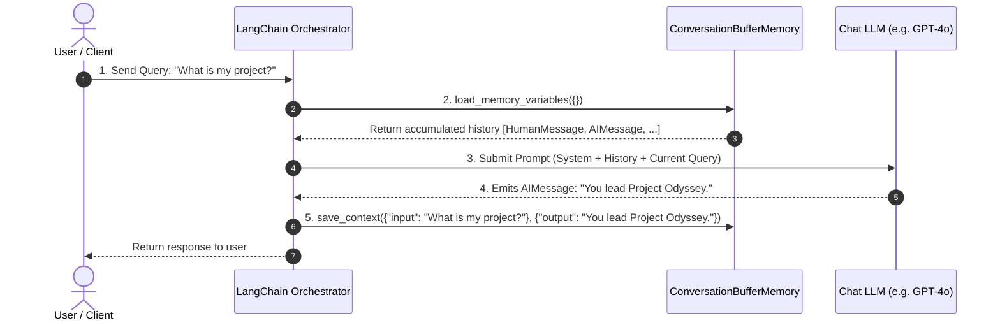

# 🧠 Memory Management: Integrating ConversationBufferMemory to Maintain Context Across Multi-Turn User Interactions

> **Zero to Hero Gen AI Course — Module 03: The LangChain Framework & Chaining**
>
> 📅 Module 3 | ⏱️ Estimated Reading Time: 55 minutes | 🎯 Level: Intermediate
>
> **Core Objective:** Master conversational state retention in stateless Large Language Model architectures. Understand how `ConversationBufferMemory` stores, formats, and injects dialogue transcripts into prompts across multi-turn interactions. Dissect the architectural difference between raw string serialization (`return_messages=False`) and typed message objects (`return_messages=True`), analyze cumulative quadratic token cost curves, and master the migration to modern LCEL session persistence using `RunnableWithMessageHistory` and production backends.

---

## 📑 Table of Contents

1. [The Stateless Amnesia Problem: Why Foundation Models Have No Memory](#1-the-stateless-amnesia-problem-why-foundation-models-have-no-memory)
2. [Intuitive Mental Models & Analogies](#2-intuitive-mental-models--analogies)
   - [2.1 The Goldfish vs The Stenographer](#21-the-goldfish-vs-the-stenographer)
   - [2.2 The Continuous Parchment Scroll](#22-the-continuous-parchment-scroll)
   - [2.3 Plain Text Transcript vs Stack of Color-Coded Cards](#23-plain-text-transcript-vs-stack-of-color-coded-cards)
3. [Anatomy & Lifecycle of `ConversationBufferMemory`](#3-anatomy--lifecycle-of-conversationbuffermemory)
   - [3.1 Internal Architecture & Core Data Structures](#31-internal-architecture--core-data-structures)
   - [3.2 The 5-Step Turn Lifecycle](#32-the-5-step-turn-lifecycle)
   - [3.3 Programmatic Memory Manipulation: `save_context`, `load_memory_variables`, and `clear`](#33-programmatic-memory-manipulation-save_context-load_memory_variables-and-clear)
4. [The Critical Distinction: `return_messages=True` vs `return_messages=False`](#4-the-critical-distinction-return_messagestrue-vs-return_messagesfalse)
   - [4.1 String Concatenation for Legacy Completion Models](#41-string-concatenation-for-legacy-completion-models)
   - [4.2 Typed Message Objects for Modern Chat Models](#42-typed-message-objects-for-modern-chat-models)
   - [4.3 Integrating with `ChatPromptTemplate` and `MessagesPlaceholder`](#43-integrating-with-chatprompttemplate-and-messagesplaceholder)
5. [Token Economics: The Quadratic Prompt Accumulation Curve](#5-token-economics-the-quadratic-prompt-accumulation-curve)
   - [5.1 Mathematical Formulation of Linear Memory Growth](#51-mathematical-formulation-of-linear-memory-growth)
   - [5.2 Quadratic Cumulative Token Costs ($O(N^2)$)](#52-quadratic-cumulative-token-costs-on2)
   - [5.3 Context Window Exhaustion Thresholds](#53-context-window-exhaustion-thresholds)
6. [Comparative Topologies: Buffer vs Window vs Summary vs Entity](#6-comparative-topologies-buffer-vs-window-vs-summary-vs-entity)
7. [The Modern LCEL Migration: `RunnableWithMessageHistory`](#7-the-modern-lcel-migration-runnablewithmessagehistory)
   - [7.1 Why Legacy `ConversationChain` Was Replaced](#71-why-legacy-conversationchain-was-replaced)
   - [7.2 Multi-User Session Isolation via `session_id`](#72-multi-user-session-isolation-via-session_id)
   - [7.3 Production Enterprise Backends (Redis, PostgreSQL)](#73-production-enterprise-backends-redis-postgresql)
8. [Complete Architectural Flow Visualized](#8-complete-architectural-flow-visualized)
9. [Hands-On Python Lab Walkthrough](#9-hands-on-python-lab-walkthrough)
10. [Curated Video Walkthroughs & Visual Animations](#10-curated-video-walkthroughs--visual-animations)
11. [Self-Assessment & Review Questions](#11-self-assessment--review-questions)
12. [Summary & Key Takeaways](#12-summary--key-takeaways)

---

## 1. The Stateless Amnesia Problem: Why Foundation Models Have No Memory

A foundational reality of Large Language Models (GPT-4o, Claude 3.5 Sonnet, LLaMA 3) is that **they possess zero internal memory across HTTP requests**.

Every API call to a model provider is strictly isolated and stateless:
$$\text{Output}_t = f_{\theta}(\text{Input}_t)$$
The neural network weights $\theta$ are static frozen matrices. The server does not maintain a session pointer, a cache of past prompts, or a thread context for your application.

```
+-----------------------------------------------------------------------------------------+
|                              THE STATELESS AMNESIA PROBLEM                              |
+-----------------------------------------------------------------------------------------+
|                                                                                         |
|  Turn 1:                                                                                |
|    User:  "Hello! My name is Dr. Aris Thorne, lead engineer on Project Odyssey."        |
|    Model: "Hello Dr. Thorne! Pleased to meet you. How can I help with Project Odyssey?" |
|                                                                                         |
|  Turn 2 (Without Memory Management):                                                    |
|    User:  "What project do I lead and what is my name?"                                 |
|    Model: "I do not have access to your personal information or what project you lead." |
|                                                                                         |
|  * The model forgot everything between Turn 1 and Turn 2 because Turn 2 was submitted  |
|    as an isolated HTTP POST request with no historical context!                         |
|                                                                                         |
+-----------------------------------------------------------------------------------------+
```

To create the illusion of an ongoing human conversation, client applications must act as **active stenographers**: they must store every prior message, format the transcript, and prepend the accumulated history into each subsequent API request.

**LangChain's Memory subsystem** automates this entire lifecycle.

---

## 2. Intuitive Mental Models & Analogies

```
+-----------------------------------------------------------------------------------------+
|                            CONVERSATIONAL MEMORY ANALOGIES                              |
+-----------------------------------------------------------------------------------------+
|                                                                                         |
|  1. THE GOLDFISH & THE STENOGRAPHER        2. THE CONTINUOUS PARCHMENT SCROLL           |
|                                                                                         |
|      LLM (Goldfish):                          User Turn 1: [New Line]                   |
|      * 3-second memory span.                  AI Reply 1:  [New Line]                   |
|      * Completely forgets each question.      User Turn 2: [New Line]                   |
|                                               AI Reply 2:  [New Line]                   |
|      Memory (Stenographer):                   -----------------------                   |
|      * Records every word verbatim.           * Entire scroll is read from the top      |
|      * Whispers previous transcript             on every single question!               |
|        into goldfish's ear before each turn.                                            |
|                                                                                         |
|  3. THE PLAIN TRANSCRIPT vs THE STACK OF COLOR-CODED CARDS                              |
|                                                                                         |
|      return_messages=False (Plain Text):      return_messages=True (Typed Objects):     |
|      "Human: Hi\nAI: Hello"                   [HumanMessage("Hi"), AIMessage("Hello")]  |
|      (Flat string for legacy text models)     (Structured objects for modern ChatModels)|
|                                                                                         |
+-----------------------------------------------------------------------------------------+
```

### 2.1 The Goldfish vs The Stenographer
Imagine an LLM as a brilliant, world-class consultant who unfortunately has the memory span of a goldfish (statelessness). 

Standing beside the consultant is a **Stenographer (`ConversationBufferMemory`)**. When a client asks a question, the stenographer quickly hands the consultant a typed binder containing every past question and answer from the meeting. The consultant reads the binder, responds with complete awareness of past context, and the stenographer promptly logs the new interaction.

### 2.2 The Continuous Parchment Scroll
`ConversationBufferMemory` maintains a simple, growing parchment scroll. Every exchange is appended to the bottom of the scroll. Whenever a new question arrives:
1. The system unrolls the scroll from the very top.
2. The entire scroll is submitted to the LLM alongside the new question.
3. The LLM generates its response.
4. The response is written onto the end of the scroll.

### 2.3 Plain Text Transcript vs Stack of Color-Coded Cards
- **`return_messages=False`**: Formats history as a flat string:
  ```text
  Human: What is my name?
  AI: You told me your name is Dr. Thorne.
  ```
- **`return_messages=True`**: Formats history as a list of distinct, typed Python objects:
  ```python
  [
      HumanMessage(content="What is my name?"),
      AIMessage(content="You told me your name is Dr. Thorne.")
  ]
  ```
  Chat models (GPT-4o, Claude 3.5) natively expect structured message arrays rather than concatenated raw text strings.

---

## 3. Anatomy & Lifecycle of `ConversationBufferMemory`

### 3.1 Internal Architecture & Core Data Structures


`ConversationBufferMemory` wraps an underlying `ChatMessageHistory` container that stores a chronological list of `BaseMessage` objects:

```python
from langchain.memory import ConversationBufferMemory

memory = ConversationBufferMemory(
    memory_key="chat_history",   # Key used to inject into prompt templates
    return_messages=True         # Returns list of Message objects instead of str
)
```

### 3.2 The 5-Step Turn Lifecycle



1. **User Request Arrival**: The client submits a new input string.
2. **Context Retrieval**: The orchestrator invokes `memory.load_memory_variables({})` to fetch stored dialogue history.
3. **Prompt Synthesis**: The retrieved history is combined with system instructions and current user input into an array of messages.
4. **Model Inference**: The model processes the full prompt and emits a completion.
5. **Memory State Update**: Before returning the response to the user, `memory.save_context(inputs, outputs)` records both the user query and the model reply for future turns.

### 3.3 Programmatic Memory Manipulation: `save_context`, `load_memory_variables`, and `clear`

You can manually inspect and mutate memory states without invoking an LLM:

```python
from langchain.memory import ConversationBufferMemory

memory = ConversationBufferMemory(return_messages=True)

# 1. Manually adding past conversation turns:
memory.save_context(
    {"input": "My favorite programming language is Rust."},
    {"output": "That's great! Rust provides memory safety without a garbage collector."}
)

memory.save_context(
    {"input": "I also build distributed microservices in Go."},
    {"output": "Go is fantastic for high-concurrency network servers and microservices."}
)

# 2. Inspecting the stored state:
state = memory.load_memory_variables({})
print(state["history"])
# Output:
# [
#   HumanMessage(content='My favorite programming language is Rust.'),
#   AIMessage(content="That's great! Rust provides memory safety..."),
#   HumanMessage(content='I also build distributed microservices in Go.'),
#   AIMessage(content='Go is fantastic for high-concurrency network...')
# ]

# 3. Clearing memory to start a fresh session:
memory.clear()
print(memory.load_memory_variables({}))
# Output: {'history': []}
```

---

## 4. The Critical Distinction: `return_messages=True` vs `return_messages=False`

One of the most frequent bugs in LangChain development is mismatched memory serialization formats.

```
+------------------------------------------------------------------------------------+
|               THE CRITICAL SWITCH: return_messages CONFIGURATION                   |
+------------------------------------------------------------------------------------+
|                                                                                    |
|  CONFIGURATION: return_messages=False (DEFAULT IN LEGACY LANGCHAIN)                |
|  ===================================================================                |
|  * Output Data Type: Standard Python string (`str`)                                |
|  * Output Value:                                                                   |
|      "Human: Hello\nAI: Hi there!\nHuman: How are you?\nAI: Doing well."          |
|  * Target Engine: Legacy Completion Models (text-davinci-003, LLaMA base)          |
|  * Prompt Integration: Injected into standard `{history}` text placeholder.        |
|                                                                                    |
|  CONFIGURATION: return_messages=True (MANDATORY FOR MODERN CHAT MODELS)             |
|  ======================================================================             |
|  * Output Data Type: Python List of Message Objects (`List[BaseMessage]`)          |
|  * Output Value:                                                                   |
|      [HumanMessage("Hello"), AIMessage("Hi there!"), HumanMessage("How are you?")] |
|  * Target Engine: Chat Models (gpt-4o, claude-3-5-sonnet, gemini-1.5-pro)          |
|  * Prompt Integration: Injected via `MessagesPlaceholder(variable_name="history")`.|
|                                                                                    |
+------------------------------------------------------------------------------------+
```

### 4.1 String Concatenation for Legacy Completion Models

Legacy completion models accept a single monolithic text string as input. For these models, `return_messages=False` formats turns into formatted text:

```text
Human: I have a pet border collie named Cooper.
AI: Border collies are exceptionally energetic and intelligent dogs!
Human: How old do they typically live?
```

### 4.2 Typed Message Objects for Modern Chat Models

Frontier chat models communicate via structured JSON role payloads:
```json
[
  {"role": "system", "content": "You are a canine health assistant."},
  {"role": "user", "content": "I have a pet border collie named Cooper."},
  {"role": "assistant", "content": "Border collies are exceptionally energetic and intelligent dogs!"},
  {"role": "user", "content": "How old do they typically live?"}
]
```

If you pass a concatenated string (`return_messages=False`) to a Chat Model inside a `MessagesPlaceholder`, LangChain raises a type validation error:

$$\text{TypeError: Expected a list of BaseMessages, but got a string.}$$

### 4.3 Integrating with `ChatPromptTemplate` and `MessagesPlaceholder`

Here is the correct, production-grade pattern for wiring `ConversationBufferMemory` into a modern Chat Model:

```python
from langchain_core.prompts import ChatPromptTemplate, MessagesPlaceholder
from langchain_community.chat_models import ChatOpenAI
from langchain.memory import ConversationBufferMemory
from langchain.chains import LLMChain

# Step 1: Initialize Chat Model
llm = ChatOpenAI(model="gpt-4o-mini", temperature=0.3)

# Step 2: Initialize Memory with return_messages=True
memory = ConversationBufferMemory(
    memory_key="chat_history",      # Must match the MessagesPlaceholder variable name!
    return_messages=True           # Mandatory for chat models
)

# Step 3: Define Prompt with MessagesPlaceholder
prompt = ChatPromptTemplate.from_messages([
    ("system", "You are an expert enterprise systems architect."),
    MessagesPlaceholder(variable_name="chat_history"),   # Injects the list of past messages
    ("human", "{input}")                                 # Injects current user input
])

# Step 4: Assemble LLMChain
conversation_chain = LLMChain(
    llm=llm,
    prompt=prompt,
    memory=memory,
    verbose=True
)

# Execution: Turn 1
r1 = conversation_chain.predict(input="We are migrating from MySQL to distributed PostgreSQL.")
print("Turn 1:", r1)

# Execution: Turn 2 (Model knows the database from Turn 1)
r2 = conversation_chain.predict(input="Which distributed engine do you recommend for this?")
print("Turn 2:", r2)
```

---

## 5. Token Economics: The Quadratic Prompt Accumulation Curve

While `ConversationBufferMemory` is simple, it possesses a dangerous economic trait: **quadratic prompt token consumption**.

### 5.1 Mathematical Formulation of Linear Memory Growth

Let $L_{\text{user}}$ be the average tokens per user query, and $L_{\text{ai}}$ be the average tokens per AI reply.
The incremental tokens added to memory per conversation turn is:

$$\Delta T = L_{\text{user}} + L_{\text{ai}}$$

At turn $n$, the total tokens stored in memory is:

$$M(n) = n \cdot \Delta T$$

Memory size grows **linearly** with respect to the number of turns $n$.

### 5.2 Quadratic Cumulative Token Costs ($O(N^2)$)

However, because the **entire accumulated history** is re-submitted on every subsequent turn, the cumulative prompt tokens submitted across $N$ total turns is:

$$T_{\text{cumulative}}(N) = \sum_{n=1}^{N} M(n-1) + N \cdot L_{\text{user}}$$

$$T_{\text{cumulative}}(N) = \Delta T \sum_{n=0}^{N-1} n + N \cdot L_{\text{user}} = \Delta T \frac{(N-1)N}{2} + N \cdot L_{\text{user}}$$

$$\lim_{N \to \infty} T_{\text{cumulative}}(N) \sim \mathcal{O}(N^2)$$

```
Tokens
  ^
  |                                        . * (Turn 50: ~15,000 prompt tokens/turn)
  |                                  . *
  |                            . *
  |                      . *
  |                . *
  |          . *
  |    . *
  +----------------------------------------------------> Conversation Turns (N)
       Turn 1      Turn 10      Turn 25      Turn 50
```

### 5.3 Context Window Exhaustion Thresholds

| Total Turns ($N$) | Average Tokens / Turn ($\Delta T$) | Prompt Tokens for Turn $N$ | Cumulative Tokens Billed | Est. Cost ($0.15 / 1M prompt tokens) |
| :---: | :---: | :---: | :---: | :---: |
| **5** | 300 | 1,200 | 3,000 | \$0.00045 |
| **15** | 300 | 4,200 | 31,500 | \$0.0047 |
| **30** | 300 | 8,700 | 130,500 | \$0.0195 |
| **60** | 300 | 17,700 | 531,000 | \$0.0796 |
| **120** | 300 | 35,700 | 2,142,000 | \$0.3213 |

> [!WARNING]
> In high-traffic enterprise applications (e.g., 50,000 daily active users averaging 25 turns), raw `ConversationBufferMemory` creates massive cloud costs and inevitably crashes with `context_length_exceeded` errors when conversations run long.

---

## 6. Comparative Topologies: Buffer vs Window vs Summary vs Entity

To prevent context exhaustion and control token budgets, LangChain provides multiple alternative memory topologies:


| Memory Topology | Data Structure | Pruning Algorithm | Token Overhead | Best Production Fit |
| :--- | :--- | :--- | :--- | :--- |
| **`ConversationBufferMemory`** | Full chronological list | None (Retains 100% of turns) | High ($O(N^2)$ cumulative) | Short customer interactions ($\le 10$ turns), prototypes. |
| **`ConversationBufferWindowMemory`** | Fixed-size sliding FIFO queue | Evicts turns older than window $K$ | Fixed ($K \cdot \Delta T$) | Chatbots requiring immediate context with bounded costs. |
| **`ConversationSummaryMemory`** | Compressed running paragraph | LLM continuously summarizes prior turns | Low ($O(1)$ running summary) | Long-running consultations, tutoring bots, RPGs. |
| **`ConversationTokenBufferMemory`** | Token-budget sliding queue | Evicts oldest turns when token cap exceeded | Strictly capped at `max_token_limit` | Production apps with strict token budget compliance. |
| **`VectorStoreRetrieverMemory`** | Vector database (Chroma, Pinecone) | Semantic retrieval of top-$K$ relevant turns | Minimal (Only relevant memories) | Customer support with massive cross-session knowledge. |

---

## 7. The Modern LCEL Migration: `RunnableWithMessageHistory`

### 7.1 Why Legacy `ConversationChain` Was Replaced

In legacy LangChain (v0.0.x), conversational state was tightly coupled to `ConversationChain` and `LLMChain`. These classes had severe shortcomings:
1. **Single-Tenant Memory**: Memory instances were bound directly to the chain object. Serving multiple concurrent web users required instantiating distinct chain objects per user.
2. **No Streaming Support**: Legacy chains could not stream token chunks over HTTP Server-Sent Events (SSE) while managing memory.
3. **No Separation of Concerns**: Memory loading, prompt formatting, model invocation, and state persistence were tangled inside procedural methods.

### 7.2 Multi-User Session Isolation via `session_id`

Modern LangChain uses **`RunnableWithMessageHistory`**. This cleanly separates the stateless pipeline logic from the multi-tenant session storage:

```
+-----------------------------------------------------------------------------------------+
|                  MULTI-TENANT SESSION ISOLATION WITH LCEL                               |
+-----------------------------------------------------------------------------------------+
|                                                                                         |
|       Client A (session_id="user_101") ----+                                            |
|                                            |                                            |
|       Client B (session_id="user_202") ----+---> [RunnableWithMessageHistory]           |
|                                            |           |                                |
|       Client C (session_id="user_303") ----+           v                                |
|                                               [Central Session Store]                   |
|                                               ├── "user_101": ChatMessageHistory        |
|                                               ├── "user_202": ChatMessageHistory        |
|                                               └── "user_303": ChatMessageHistory        |
|                                                                                         |
+-----------------------------------------------------------------------------------------+
```

```python
from langchain_core.prompts import ChatPromptTemplate, MessagesPlaceholder
from langchain_core.output_parsers import StrOutputParser
from langchain_core.runnables.history import RunnableWithMessageHistory
from langchain_community.chat_message_histories import ChatMessageHistory
from langchain_openai import ChatOpenAI

# 1. Stateless LCEL Core Chain
llm = ChatOpenAI(model="gpt-4o-mini", temperature=0.3)
prompt = ChatPromptTemplate.from_messages([
    ("system", "You are an AI support agent."),
    MessagesPlaceholder(variable_name="history"),
    ("human", "{input}")
])
base_chain = prompt | llm | StrOutputParser()

# 2. In-Memory Multi-User Session Store
session_store = {}

def get_session_history(session_id: str) -> ChatMessageHistory:
    if session_id not in session_store:
        session_store[session_id] = ChatMessageHistory()
    return session_store[session_id]

# 3. Wrapping Chain with Session Management
conversational_lcel = RunnableWithMessageHistory(
    base_chain,
    get_session_history,
    input_messages_key="input",
    history_messages_key="history"
)

# 4. Independent Concurrent Multi-Tenant Execution
config_user_a = {"configurable": {"session_id": "session_user_alice"}}
config_user_b = {"configurable": {"session_id": "session_user_bob"}}

# Alice interacts:
resp_a1 = conversational_lcel.invoke({"input": "My favorite color is emerald green."}, config=config_user_a)

# Bob interacts (isolated state):
resp_b1 = conversational_lcel.invoke({"input": "My favorite color is midnight navy."}, config=config_user_b)

# Alice asks what her favorite color is:
resp_a2 = conversational_lcel.invoke({"input": "What is my favorite color?"}, config=config_user_a)
print("Alice Query Response:", resp_a2)
# Output: "Your favorite color is emerald green."
```

### 7.3 Production Enterprise Backends (Redis, PostgreSQL)

For production applications deployed across horizontally scaled containers (Docker, Kubernetes, AWS ECS), memory **cannot live in Python RAM**. If a user's Turn 2 hits Container B, memory stored in Container A's RAM is lost.

Modern LangChain provides drop-in enterprise persistence providers:

```python
from langchain_community.chat_message_histories import RedisChatMessageHistory

def get_redis_session_history(session_id: str) -> RedisChatMessageHistory:
    return RedisChatMessageHistory(
        session_id=session_id,
        url="redis://localhost:6379/0",
        ttl=3600   # Expire inactive conversation keys after 1 hour
    )
```

---

## 8. Complete Architectural Flow Visualized


---

## 9. Hands-On Python Lab Walkthrough

To experience multi-turn memory management firsthand, run the accompanying lab script:

📂 **Lab Location:** [`3. The LangChain Framework & Chaining/code/memory_management_lab.py`](file:///c:/Users/sriva/OneDrive/Desktop/GEN%20AI%20COURSE/3.%20The%20LangChain%20Framework%20&%20Chaining/code/memory_management_lab.py)

### Lab Experiments Included:
1. **Experiment 1: The Stateless Baseline vs Memory-Enabled Chat**: Demonstrates the failure of Turn 2 without memory, and the resolution with `ConversationBufferMemory`.
2. **Experiment 2: Deep Inspection of `return_messages=True` vs `False`**: Compares string serialization vs typed message objects.
3. **Experiment 3: Token Growth Profiler ($O(N^2)$ Simulation)**: Quantifies token growth across 10 turns and displays cumulative billing impact.
4. **Experiment 4: Multi-Tenant Session Isolation with LCEL**: Simulates multiple concurrent users chatting with independent session histories.
5. **Experiment 5: Manual State Mutation & Session Reset**: Demonstrates programmatic `save_context()`, `clear()`, and context pre-loading.

Run the lab in your terminal:
```bash
py "3. The LangChain Framework & Chaining/code/memory_management_lab.py"
```

---

## 10. Curated Video Walkthroughs & Visual Animations

Enhance your conceptual understanding with these top-tier, verified video resources:

| Video Title | Channel / Speaker | Duration | Core Topics Covered | Verified Link |
| :--- | :--- | :--- | :--- | :--- |
| **LangChain Crash Course for Beginners** | freeCodeCamp.org | 1 hr 25 min | Models, Prompts, Memory, Buffer, and End-to-End Chatbots | [Watch Video](https://www.youtube.com/watch?v=kYRB-v9z610) |
| **Learn RAG From Scratch** | freeCodeCamp.org (Lance Martin) | 2 hr 30 min | Retrieval-Augmented Generation, state routing, and conversational memory | [Watch Video](https://www.youtube.com/watch?v=JE-NAtLRQ9E) |
| **State of GPT** | Microsoft Build / Andrej Karpathy | 42 min | Context window mechanics, token dynamics, attention span, and prompting | [Watch Video](https://www.youtube.com/watch?v=bZQun8Y4L2A) |
| **ChatGPT Course: OpenAI API to Code 5 Projects** | freeCodeCamp.org | 3 hr 15 min | Multi-turn conversational loops, message history arrays, and Python integration | [Watch Video](https://www.youtube.com/watch?v=uRQH2CFvedY) |

---

## 11. Self-Assessment & Review Questions

Test your mastery of conversational memory architecture:

### Q1: Why do foundation models have no native memory across HTTP requests?
<details>
<summary>👉 Click to view answer & architectural explanation</summary>

**Answer:**
Foundation models are stateless neural networks executed via standard HTTP POST APIs. Each forward pass takes an input vector of token IDs and computes conditional output logits. The underlying server infrastructure does not store application state, user identifiers, or session context between requests. To maintain context, the client application must explicitly re-transmit the entire conversation history in every API call.
</details>

---

### Q2: What happens if you use `return_messages=False` with a modern `ChatPromptTemplate` and `MessagesPlaceholder`?
<details>
<summary>👉 Click to view answer & architectural explanation</summary>

**Answer:**
`return_messages=False` returns a single concatenated string (e.g., `"Human: Hi\nAI: Hello"`). However, `MessagesPlaceholder` expects a Python list of `BaseMessage` objects (`HumanMessage`, `AIMessage`, etc.). 

Passing a raw string into `MessagesPlaceholder` causes a runtime validation error (`TypeError: Expected a list of BaseMessages, but got a string`). For modern chat models, `return_messages=True` is strictly mandatory.
</details>

---

### Q3: Why does cumulative token cost grow quadratically ($O(N^2)$) when using `ConversationBufferMemory`?
<details>
<summary>👉 Click to view answer & architectural explanation</summary>

**Answer:**
While the number of tokens stored in memory grows linearly with each turn ($\Delta T$ tokens per turn), the prompt submitted to the model on turn $n$ includes **all preceding $n-1$ turns**. 

Summing the prompt tokens across $N$ total turns yields the arithmetic series:
$$\sum_{n=1}^{N} n \cdot \Delta T \propto \frac{N(N+1)}{2} \cdot \Delta T \sim \mathcal{O}(N^2)$$
Consequently, prompt token consumption and associated API costs grow quadratically relative to the conversation length.
</details>

---

### Q4: How does modern LCEL's `RunnableWithMessageHistory` handle multiple concurrent users compared to legacy `ConversationChain`?
<details>
<summary>👉 Click to view answer & architectural explanation</summary>

**Answer:**
Legacy `ConversationChain` bound a single memory instance to a single chain object. In a multi-user web application, this either resulted in cross-user data leakage or required instantiating thousands of separate chain instances in memory.

Modern `RunnableWithMessageHistory` decouples the pipeline from the state: a single stateless LCEL pipeline is wrapped with a session retrieval callback function `get_session_history(session_id)`. When an API call arrives, the runner passes `session_id` via the config dictionary, fetches only that user's history from RAM or Redis, executes the pipeline, updates that specific session's history, and cleanly terminates.
</details>

---

### Q5: When should you upgrade from `ConversationBufferMemory` to `ConversationBufferWindowMemory` or `ConversationSummaryMemory`?
<details>
<summary>👉 Click to view answer & architectural explanation</summary>

**Answer:**
You should upgrade when:
1. **Conversations exceed 10–15 turns**: Prevent hitting model context window limits (e.g., 8k, 32k, or 128k tokens).
2. **Cost optimization is required**: Avoid paying quadratic prompt token costs for long-running customer support or tutoring sessions.
3. **Information decay is acceptable**: Use **Window Memory ($K$)** if only the most recent $K$ interactions are relevant, or **Summary Memory** if high-level historical facts must be retained without preserving verbatim wording.
</details>

---

## 12. Summary & Key Takeaways

1. **Stateless Reality**: Foundation models have zero built-in memory; all multi-turn context must be managed by the application and re-injected into each prompt.
2. **`ConversationBufferMemory` Mechanics**: Verbatim memory buffering appends every human and AI message to an ongoing transcript without loss of detail.
3. **`return_messages=True` is Crucial**: Always set `return_messages=True` when building applications with modern chat models and `MessagesPlaceholder` to avoid string validation exceptions.
4. **Token Economics Matter**: Full buffer memory produces quadratic ($O(N^2)$) cumulative prompt token consumption, requiring migration to Window, Summary, or Vector memories for long-running workflows.
5. **Modern Multi-Tenancy**: Use `RunnableWithMessageHistory` to decouple stateless LCEL pipelines from external multi-user session storage (Redis, PostgreSQL).
