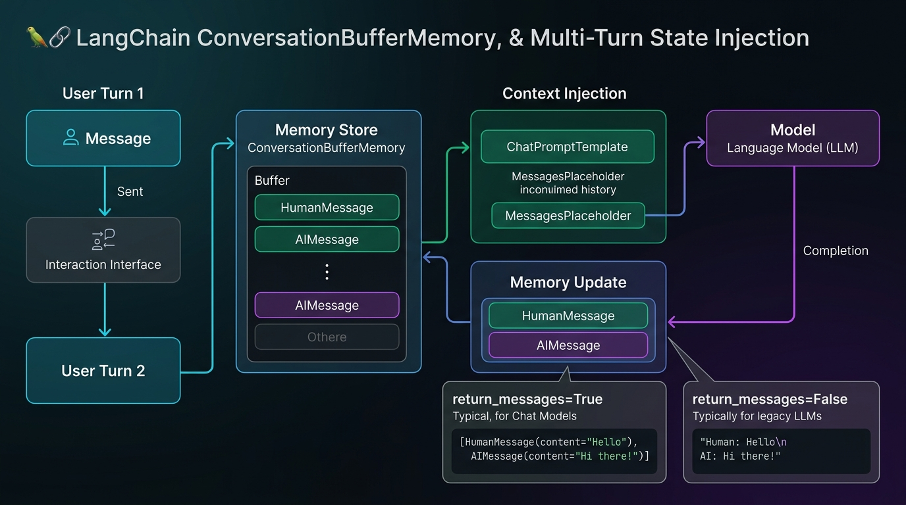
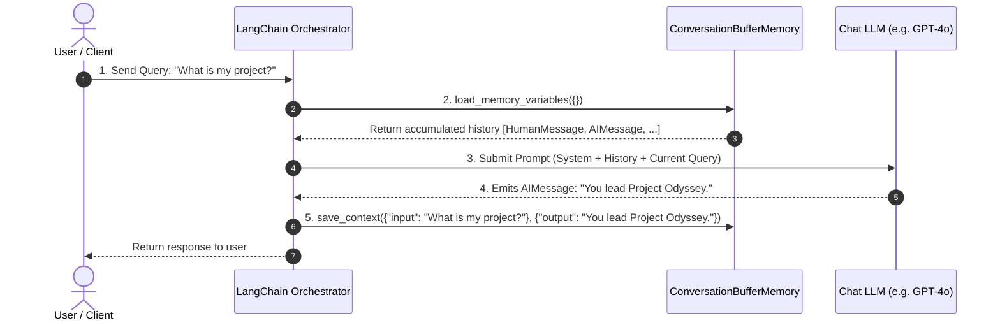
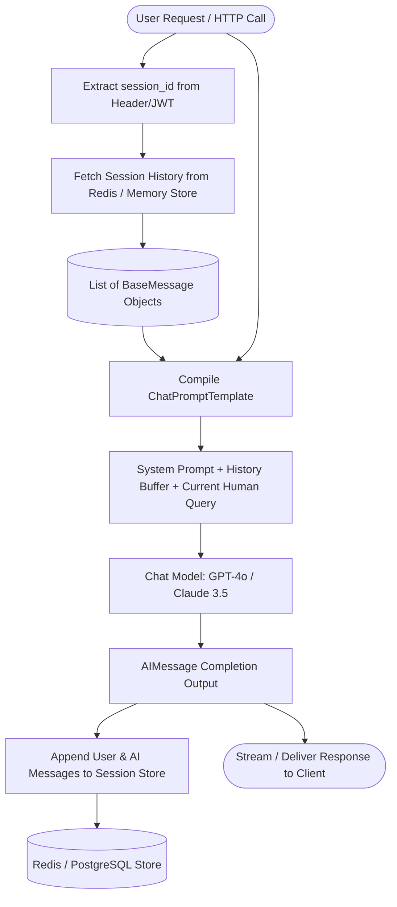

# 02. Memory Management: ConversationBufferMemory & Conversational State

> **Zero to Hero Gen AI Course — Module 03: The LangChain Framework & Chaining**  
> ⏱️ Estimated Reading Time: 55 minutes | 🎯 Level: Intermediate  
> ☕ **Audience:** Java / Spring Boot Developers transitioning to Python & Generative AI

---

## 0. 🌟 Why this topic matters

A foundational reality of Large Language Models (LLMs) like GPT-4o, Claude 3.5 Sonnet, or Llama 3 is that **they are strictly stateless mathematical functions**.

Every API request is an isolated computation:

$$\text{Output}_t = f_{\theta}(\text{Input}_t)$$

The neural network weights $\theta$ are frozen matrices stored on remote GPU clusters. The model does not maintain an active session pointer, a memory cache of your past prompts, or a conversational thread.
- If a user says in Turn 1: *"My name is Dr. Aris Thorne, and I lead the robotics team."*
- And asks in Turn 2: *"What is my name?"*
- Without memory, the model evaluates Turn 2 in complete isolation and replies: *"I do not know who you are."*

To create the seamless illusion of an ongoing human conversation, your application must act as a **diligent stenographer**: recording every message, formatting the dialogue transcript, and prepending the accumulated context into each subsequent API request.

However, naive memory retention introduces severe enterprise hazards:
1. **The Quadratic Cost Explosion ($O(N^2)$):** Re-sending every past turn on every call makes cumulative token consumption explode quadratically, turning a $50/month bill into a $1,500/month bill.
2. **Context Window Exhaustion:** Unchecked conversation buffers eventually breach token limits, causing HTTP 400 `context_length_exceeded` crashes.
3. **Multi-Tenant State Leaks:** In horizontally scaled cloud environments (Kubernetes, AWS ECS), storing memory in local container RAM causes state loss or cross-user data leakage.

Mastering **LangChain's Memory Subsystem** bridges the gap from brittle single-turn prototypes to scalable, multi-tenant enterprise conversational architectures.

---

## 1. 🐣 Basic Level – "Explain like I'm new"

### 1.1 The Goldfish vs. The Stenographer

```
+-----------------------------------------------------------------------------------------+
|                              THE GOLDFISH & THE STENOGRAPHER                            |
+-----------------------------------------------------------------------------------------+
|                                                                                         |
|      LLM (The Goldfish):                          User Turn 1: [New Question]           |
|      * Brilliant intellect.                       AI Reply 1:  [New Answer]             |
|      * 3-second memory span.                      User Turn 2: [New Question]           |
|      * Completely forgets each question.          AI Reply 2:  [New Answer]             |
|                                                   ---------------------------           |
|      Memory (The Stenographer):                   * Entire transcript is read           |
|      * Records every word verbatim.                 from top to bottom before           |
|      * Whispers previous transcript into            answering each new turn!            |
|        goldfish's ear before each answer.                                               |
|                                                                                         |
+-----------------------------------------------------------------------------------------+
```

Imagine an LLM as a world-class consultant who unfortunately has the memory span of a goldfish (statelessness).

Beside the consultant sits a **Stenographer (`ConversationBufferMemory`)**. When a client asks a question, the stenographer quickly hands the consultant a typed binder containing every past question and answer from the meeting. The consultant reads the binder, responds with full context, and the stenographer logs the new exchange.

---

### 1.2 Three Everyday Mental Models & Analogies

#### 📜 Model 1: The Continuous Parchment Scroll
`ConversationBufferMemory` maintains a continuous, growing parchment scroll. Every exchange is appended to the bottom of the scroll:
1. When Turn 1 arrives, the scroll has 1 entry.
2. When Turn 5 arrives, the entire scroll (Turns 1 through 4) is unrolled from the very top and presented to the LLM alongside the new question.
3. The LLM generates its response, and the new text is appended to the end of the scroll.

---

#### 🗂️ Model 2: Flat Transcript vs. Color-Coded Card Stack (`return_messages`)
- **`return_messages=False` (Plain Text Transcript):** Formats history as a flat, single string:
  ```text
  Human: What is my project?
  AI: You lead Project Odyssey.
  ```
  *(Used by legacy completion models like text-davinci-003).*
- **`return_messages=True` (Color-Coded Cards):** Formats history as a list of distinct, typed Python objects:
  ```python
  [
      HumanMessage(content="What is my project?"),
      AIMessage(content="You lead Project Odyssey.")
  ]
  ```
  *(Mandatory for modern chat models like GPT-4o and Claude 3.5).*

---

#### 🏨 Model 3: The Hotel Guest Ledger (Multi-Tenant Isolation)
In a hotel, the front desk doesn't maintain a single master notebook for all guests combined. That would result in Guest B reading Guest A's room charges!
- The front desk organizes records by **Room Number (`session_id`)**.
- When Room 302 calls, the receptionist retrieves strictly the ledger for Room 302.
- In LangChain, **`RunnableWithMessageHistory`** manages multi-user conversations by isolating history per unique `session_id`.

---

### ☕ 1.3 The Java & Spring Boot Developer Bridge

As a Java and Spring Boot developer, here is how conversational memory maps directly to concepts you know:

```
┌───────────────────────────────────────┬───────────────────────────────────────┐
│ Java / Spring Boot Concept            │ Python / LangChain Equivalent         │
├───────────────────────────────────────┼───────────────────────────────────────┤
│ Spring AI `ChatMemory` Interface      │ LangChain `BaseChatMemory`            │
│ `InMemoryChatMemory`                  │ `ConversationBufferMemory`            │
├───────────────────────────────────────┼───────────────────────────────────────┤
│ Spring Session with Redis             │ `RedisChatMessageHistory`             │
│ (`@EnableRedisHttpSession`)           │ Centralized multi-turn state store    │
├───────────────────────────────────────┼───────────────────────────────────────┤
│ `@SessionScope` Spring Bean           │ `RunnableWithMessageHistory`          │
│ Scoped to a specific user session     │ Isolates dialogue per `session_id`    │
├───────────────────────────────────────┼───────────────────────────────────────┤
│ Sticky Sessions vs. Shared Cache      │ In-Memory Dict vs. Redis/Postgres     │
│ (Pods sharing state via Redis)        │ (Horizontally scaled container state) │
└───────────────────────────────────────┴───────────────────────────────────────┘
```

#### Code Comparison: Spring AI vs. Modern Python LangChain

```java
// =========================================================================
// 1. JAVA (Spring AI) - Conversational ChatClient with In-Memory State
// =========================================================================
import org.springframework.ai.chat.client.ChatClient;
import org.springframework.ai.chat.client.advisor.MessageChatMemoryAdvisor;
import org.springframework.ai.chat.memory.InMemoryChatMemory;

public class ConversationalAssistant {
    private final ChatClient chatClient;

    public ConversationalAssistant(ChatClient.Builder builder) {
        this.chatClient = builder
            .defaultAdvisors(new MessageChatMemoryAdvisor(new InMemoryChatMemory()))
            .build();
    }

    public String chat(String conversationId, String userMessage) {
        return this.chatClient.prompt()
            .user(userMessage)
            .advisors(a -> a.param("chat_memory_conversation_id", conversationId))
            .call()
            .content();
    }
}
```

```python
# =========================================================================
# 2. PYTHON (Modern LangChain v0.2+ LCEL with Session History)
# =========================================================================
from langchain_core.prompts import ChatPromptTemplate, MessagesPlaceholder
from langchain_core.output_parsers import StrOutputParser
from langchain_core.runnables.history import RunnableWithMessageHistory
from langchain_community.chat_message_histories import ChatMessageHistory
from langchain_openai import ChatOpenAI

session_store = {}

def get_session_history(session_id: str) -> ChatMessageHistory:
    if session_id not in session_store:
        session_store[session_id] = ChatMessageHistory()
    return session_store[session_id]

prompt = ChatPromptTemplate.from_messages([
    ("system", "You are a helpful software architecture assistant."),
    MessagesPlaceholder(variable_name="history"),
    ("human", "{input}")
])

base_chain = prompt | ChatOpenAI(model="gpt-4o", temperature=0.0) | StrOutputParser()

conversational_chain = RunnableWithMessageHistory(
    base_chain,
    get_session_history,
    input_messages_key="input",
    history_messages_key="history"
)

# Interacting per session_id:
config = {"configurable": {"session_id": "user_42"}}
resp = conversational_chain.invoke({"input": "My name is Srinivas."}, config=config)
```

---

## 2. 🧱 Building Up – Concepts added one by one

### 2.1 Anatomy & Lifecycle of `ConversationBufferMemory`

`ConversationBufferMemory` wraps an underlying `ChatMessageHistory` container that stores a chronological sequence of `BaseMessage` objects:



```python
from langchain.memory import ConversationBufferMemory

memory = ConversationBufferMemory(
    memory_key="chat_history",   # Key used to inject into prompt templates
    return_messages=True         # Returns list of Message objects instead of flat str
)
```

#### The 5-Step Turn Lifecycle



1. **User Request Arrival:** The client submits a new input string.
2. **Context Retrieval:** The orchestrator invokes `memory.load_memory_variables({})` to fetch stored dialogue history.
3. **Prompt Synthesis:** The retrieved history is injected alongside system instructions and the current user input into an array of messages.
4. **Model Inference:** The model processes the full prompt and emits a completion.
5. **Memory State Update:** Before returning the response to the user, `memory.save_context(inputs, outputs)` records both the user query and the model reply for future turns.

#### Programmatic Memory Manipulation
You can manually inspect and mutate memory states without calling an LLM:

```python
memory = ConversationBufferMemory(return_messages=True)

# 1. Manually seeding memory with verified past context:
memory.save_context(
    {"input": "My primary database is PostgreSQL 16."},
    {"output": "Understood. I will provide PostgreSQL-compatible recommendations."}
)

# 2. Inspecting the stored state:
state = memory.load_memory_variables({})
print(state["history"])
# Output: [HumanMessage(content='My primary database...'), AIMessage(content='Understood...')]

# 3. Clearing memory to start a fresh session:
memory.clear()
print(memory.load_memory_variables({})) # Output: {'history': []}
```

---

### 2.2 The Critical Distinction: `return_messages=True` vs. `return_messages=False`

One of the most frequent runtime crashes in LangChain occurs when passing flat string history into a Chat Model:

```
+------------------------------------------------------------------------------------+
|               THE CRITICAL SWITCH: return_messages CONFIGURATION                   |
+------------------------------------------------------------------------------------+
|                                                                                    |
|  CONFIGURATION: return_messages=False (DEFAULT IN LEGACY LANGCHAIN)                |
|  ===================================================================                |
|  * Output Data Type: Standard Python string (`str`)                                |
|  * Output Value:     "Human: Hello\nAI: Hi there!\nHuman: How are you?\nAI: Good." |
|  * Target Engine:    Legacy Completion Models (text-davinci-003, raw base models)  |
|  * Prompt Slot:      Injected into standard `{history}` text placeholder.          |
|                                                                                    |
|  CONFIGURATION: return_messages=True (MANDATORY FOR MODERN CHAT MODELS)             |
|  ======================================================================             |
|  * Output Data Type: Python List of Message Objects (`List[BaseMessage]`)          |
|  * Output Value:     [HumanMessage("Hello"), AIMessage("Hi there!")]               |
|  * Target Engine:    Chat Models (gpt-4o, claude-3-5-sonnet, gemini-1.5-pro)       |
|  * Prompt Slot:      Injected via `MessagesPlaceholder(variable_name="history")`.  |
|                                                                                    |
+------------------------------------------------------------------------------------+
```

#### Why passing a string to `MessagesPlaceholder` fails
Modern chat models communicate via structured JSON role payloads:
```json
[
  {"role": "system", "content": "You are a database architect."},
  {"role": "user", "content": "My primary database is Postgres."},
  {"role": "assistant", "content": "Understood."},
  {"role": "user", "content": "How do I optimize queries?"}
]
```
If you pass a concatenated string (`return_messages=False`) to a Chat Model inside a `MessagesPlaceholder`, LangChain raises a fatal exception:

$$\text{TypeError: Expected a list of BaseMessages, but got a string.}$$

#### Correct Integration Pattern with `ChatPromptTemplate`

```python
from langchain_core.prompts import ChatPromptTemplate, MessagesPlaceholder
from langchain_openai import ChatOpenAI
from langchain.memory import ConversationBufferMemory
from langchain.chains import LLMChain

# 1. Initialize Memory with return_messages=True
memory = ConversationBufferMemory(
    memory_key="chat_history",      # Must match the MessagesPlaceholder variable name!
    return_messages=True           # Mandatory for chat models
)

# 2. Define Prompt with MessagesPlaceholder
prompt = ChatPromptTemplate.from_messages([
    ("system", "You are an expert enterprise systems architect."),
    MessagesPlaceholder(variable_name="chat_history"),   # Injects the list of past messages
    ("human", "{input}")                                 # Injects current user input
])

# 3. Assemble Chain
conversation_chain = LLMChain(
    llm=ChatOpenAI(model="gpt-4o-mini", temperature=0.0),
    prompt=prompt,
    memory=memory
)
```

---

### 2.3 Token Economics: The Quadratic Prompt Accumulation Curve ($O(N^2)$)

While `ConversationBufferMemory` is simple, it possesses a dangerous economic trait: **quadratic prompt token accumulation**.

#### Mathematical Formulation
Let $L_{\text{user}}$ be the average tokens per user query, and $L_{\text{ai}}$ be the average tokens per AI reply.
The incremental tokens added to memory per conversation turn is:

$$\Delta T = L_{\text{user}} + L_{\text{ai}}$$

At turn $n$, the total tokens stored in memory is:

$$M(n) = n \cdot \Delta T$$

Memory size grows **linearly** with respect to the number of turns $n$.

#### Cumulative Prompt Tokens Billed Across $N$ Turns
However, because the **entire accumulated history** is re-submitted on every subsequent turn, the cumulative prompt tokens submitted across $N$ total turns is:

$$T_{\text{cumulative}}(N) = \sum_{n=1}^{N} M(n-1) + N \cdot L_{\text{user}} = \Delta T \frac{(N-1)N}{2} + N \cdot L_{\text{user}}$$

$$\lim_{N \to \infty} T_{\text{cumulative}}(N) \sim \mathcal{O}(N^2)$$

```
Tokens
  ^
  |                                        . * (Turn 50: ~15,000 prompt tokens/turn)
  |                                  . *
  |                            . *
  |                      . *
  |                . *
  |          . *
  |    . *
  +----------------------------------------------------> Conversation Turns (N)
       Turn 1      Turn 10      Turn 25      Turn 50
```

#### Cumulative Billing Impact Table ($\Delta T = 300$ tokens/turn)

| Total Turns ($N$) | Prompt Tokens for Turn $N$ | Cumulative Tokens Billed | Est. Cost ($0.150 / 1M prompt tokens) |
| :---: | :---: | :---: | :---: |
| **5** | 1,200 | 3,000 | \$0.00045 |
| **15** | 4,200 | 31,500 | \$0.0047 |
| **30** | 8,700 | 130,500 | \$0.0195 |
| **60** | 17,700 | 531,000 | \$0.0796 |
| **120** | 35,700 | 2,142,000 | \$0.3213 |

> [!WARNING]
> In high-traffic enterprise applications (e.g., 50,000 daily active users averaging 25 turns), raw `ConversationBufferMemory` creates massive cloud costs and inevitably crashes with `context_length_exceeded` errors when conversations run long.

---

### 2.4 Comparative Memory Topologies

To control token budgets and avoid context limits, LangChain provides multiple specialized memory topologies:


| Memory Topology | Data Structure | Pruning Algorithm | Token Overhead | Best Production Fit |
| :--- | :--- | :--- | :--- | :--- |
| **`ConversationBufferMemory`** | Full chronological list | None (Retains 100% of turns) | High ($O(N^2)$ cumulative) | Short customer interactions ($\le 10$ turns), prototypes. |
| **`ConversationBufferWindowMemory`** | Fixed-size sliding FIFO queue | Evicts turns older than window $K$ | Fixed ($K \cdot \Delta T$) | Chatbots requiring immediate context with bounded costs. |
| **`ConversationSummaryMemory`** | Compressed running paragraph | LLM continuously summarizes prior turns | Low ($O(1)$ running summary) | Long-running consultations, tutoring bots, RPGs. |
| **`ConversationTokenBufferMemory`** | Token-budget sliding queue | Evicts oldest turns when token cap exceeded | Strictly capped at `max_token_limit` | Production apps with strict token budget compliance. |
| **`VectorStoreRetrieverMemory`** | Vector database (Chroma, Pinecone) | Semantic retrieval of top-$K$ relevant turns | Minimal (Only relevant memories) | Customer support with massive cross-session knowledge. |

---

### 2.5 The Modern LCEL Migration: `RunnableWithMessageHistory`

#### Why Legacy `ConversationChain` Was Replaced
In legacy LangChain (v0.0.x), conversational state was tightly coupled to `ConversationChain`. These classes had severe architectural flaws:
1. **Single-Tenant Memory:** Memory instances were bound directly to the chain object. Serving multiple concurrent web users required instantiating separate chain objects per user.
2. **No Streaming Support:** Legacy chains could not stream token chunks over Server-Sent Events (SSE) while managing memory.
3. **No Separation of Concerns:** Memory loading, prompt formatting, model invocation, and persistence were tangled in procedural code.

#### Multi-Tenant Session Isolation via `session_id`
Modern LangChain uses **`RunnableWithMessageHistory`**, cleanly separating stateless pipeline logic from multi-tenant session storage:

```
+-----------------------------------------------------------------------------------------+
|                  MULTI-TENANT SESSION ISOLATION WITH LCEL                               |
+-----------------------------------------------------------------------------------------+
|                                                                                         |
|       Client A (session_id="user_101") ────┐                                            |
|                                            │                                            |
|       Client B (session_id="user_202") ────┼───► [RunnableWithMessageHistory]           |
|                                            │           │                                |
|       Client C (session_id="user_303") ────┘           ▼                                |
|                                               [Central Session Store]                   |
|                                               ├── "user_101": ChatMessageHistory        |
|                                               ├── "user_202": ChatMessageHistory        |
|                                               └── "user_303": ChatMessageHistory        |
|                                                                                         |
+-----------------------------------------------------------------------------------------+
```

```python
from langchain_core.prompts import ChatPromptTemplate, MessagesPlaceholder
from langchain_core.output_parsers import StrOutputParser
from langchain_core.runnables.history import RunnableWithMessageHistory
from langchain_community.chat_message_histories import ChatMessageHistory
from langchain_openai import ChatOpenAI

# 1. Stateless LCEL Core Chain
llm = ChatOpenAI(model="gpt-4o-mini", temperature=0.3)
prompt = ChatPromptTemplate.from_messages([
    ("system", "You are an AI support agent."),
    MessagesPlaceholder(variable_name="history"),
    ("human", "{input}")
])
base_chain = prompt | llm | StrOutputParser()

# 2. In-Memory Multi-User Session Store
session_store = {}

def get_session_history(session_id: str) -> ChatMessageHistory:
    if session_id not in session_store:
        session_store[session_id] = ChatMessageHistory()
    return session_store[session_id]

# 3. Wrapping Chain with Session Management
conversational_lcel = RunnableWithMessageHistory(
    base_chain,
    get_session_history,
    input_messages_key="input",
    history_messages_key="history"
)

# 4. Independent Concurrent Multi-Tenant Execution
config_alice = {"configurable": {"session_id": "session_user_alice"}}
config_bob   = {"configurable": {"session_id": "session_user_bob"}}

resp_a1 = conversational_lcel.invoke({"input": "My favorite color is green."}, config=config_alice)
resp_b1 = conversational_lcel.invoke({"input": "My favorite color is blue."}, config=config_bob)

resp_a2 = conversational_lcel.invoke({"input": "What is my favorite color?"}, config=config_alice)
print("Alice Query Response:", resp_a2) # Output: "Your favorite color is green."
```

#### Production Distributed Persistence (Redis)
For microservices running across multiple Docker/Kubernetes pods, memory **cannot live in Python RAM**. LangChain provides drop-in centralized storage:

```python
from langchain_community.chat_message_histories import RedisChatMessageHistory

def get_redis_session_history(session_id: str) -> RedisChatMessageHistory:
    return RedisChatMessageHistory(
        session_id=session_id,
        url="redis://localhost:6379/0",
        ttl=3600   # Expire inactive conversation keys after 1 hour
    )
```

---

### 2.6 Complete Architectural Flow Visualized



---

## 3. 🧪 Hands-On Lab & Practice Exercises

### 3.1 Standalone Python Lab: Memory Management

You can execute the official lab script directly from your terminal:
```bash
python "3. The LangChain Framework & Chaining/code/memory_management_lab.py"
```

Here is a pure-Python simulation of an in-memory conversational session store and token accounting engine:

```python
"""
Pure-Python Conversational Session Store & Token Growth Simulator
"""
class InMemorySessionStore:
    def __init__(self):
        self._store = {}

    def add_message(self, session_id: str, role: str, content: str):
        if session_id not in self._store:
            self._store[session_id] = []
        self._store[session_id].append({"role": role, "content": content})

    def get_history(self, session_id: str) -> list[dict]:
        return self._store.get(session_id, [])

    def calculate_prompt_tokens(self, session_id: str, new_query: str) -> int:
        history = self.get_history(session_id)
        # Approximate: 1 token ~ 4 characters
        history_chars = sum(len(m["content"]) for m in history)
        new_chars = len(new_query)
        return (history_chars + new_chars) // 4

# Test verification
store = InMemorySessionStore()
store.add_message("sess_1", "user", "I want to book a flight to Paris.")
store.add_message("sess_1", "assistant", "Certainly! What date would you like to depart?")

tokens = store.calculate_prompt_tokens("sess_1", "Next Friday.")
print(f"Estimated prompt tokens for Turn 2: {tokens} tokens")
```

---

### 3.2 Practice Exercises (Beginner to Advanced)

#### 🟢 Exercise 1 (Easy): Programmatic Memory Manipulation
**Problem:** Using LangChain's `ConversationBufferMemory`, write a function `seed_customer_session(memory, user_name, plan_type)` that pre-populates the buffer with a verified user identity, and verify that `load_memory_variables({})` returns typed message objects.

<details>
<summary><b>View Complete Solution</b></summary>

```python
from langchain.memory import ConversationBufferMemory

def seed_customer_session(user_name: str, plan_type: str) -> ConversationBufferMemory:
    mem = ConversationBufferMemory(return_messages=True)
    mem.save_context(
        {"input": f"Hello, I am {user_name} on the {plan_type} subscription plan."},
        {"output": f"Welcome {user_name}! I have verified your {plan_type} status."}
    )
    return mem

# Verification
mem = seed_customer_session("Alice", "ENTERPRISE")
state = mem.load_memory_variables({})
print("Seeded Messages:")
for msg in state["history"]:
    print(f"  [{type(msg).__name__}]: {msg.content}")
```
</details>

---

#### 🟡 Exercise 2 (Intermediate): Token Cost Growth Profiler
**Problem:** Write a Python function `simulate_token_cost(turns: int, tokens_per_turn: int, cost_per_million: float) -> dict` that computes the cumulative tokens submitted across $N$ conversation turns using raw buffer memory and calculates total API cost.

<details>
<summary><b>View Complete Solution</b></summary>

```python
def simulate_token_cost(turns: int, tokens_per_turn: int = 300, cost_per_million: float = 0.150) -> dict:
    cumulative_tokens = 0
    history_tokens = 0
    
    for turn in range(1, turns + 1):
        prompt_tokens_this_turn = history_tokens + (tokens_per_turn // 2)
        cumulative_tokens += prompt_tokens_this_turn
        history_tokens += tokens_per_turn

    total_cost = (cumulative_tokens / 1_000_000) * cost_per_million
    return {
        "turns": turns,
        "final_turn_prompt_tokens": prompt_tokens_this_turn,
        "cumulative_tokens_billed": cumulative_tokens,
        "total_cost_usd": round(total_cost, 5)
    }

# Run for 30 turns:
metrics = simulate_token_cost(turns=30, tokens_per_turn=300)
print("Simulation Metrics (30 Turns):", metrics)
```
</details>

---

#### 🟠 Exercise 3 (Intermediate/Hard): Custom Sliding Window Buffer Queue
**Problem:** Build a pure-Python `SlidingWindowMemory` class that retains strictly the latest $K$ turns (where 1 turn = 1 human message + 1 AI reply). When turn $K+1$ is saved, the oldest turn is automatically evicted.

<details>
<summary><b>View Complete Solution</b></summary>

```python
class SlidingWindowMemory:
    def __init__(self, k: int = 2):
        self.k = k
        self.turns = []  # Stores tuples of (user_text, ai_text)

    def save_context(self, user_msg: str, ai_msg: str):
        self.turns.append({"user": user_msg, "ai": ai_msg})
        # Evict oldest turns if exceeding K
        if len(self.turns) > self.k:
            self.turns = self.turns[-self.k:]

    def get_messages(self) -> list[dict]:
        formatted = []
        for turn in self.turns:
            formatted.append({"role": "user", "content": turn["user"]})
            formatted.append({"role": "assistant", "content": turn["ai"]})
        return formatted

# Verification
win_mem = SlidingWindowMemory(k=2)
win_mem.save_context("T1 Question", "T1 Answer")
win_mem.save_context("T2 Question", "T2 Answer")
win_mem.save_context("T3 Question", "T3 Answer")

print("Remaining Messages in Window (K=2):")
for m in win_mem.get_messages():
    print(f"  {m['role']}: {m['content']}")
# Only T2 and T3 remain; T1 is cleanly evicted!
```
</details>

---

#### 🔴 Exercise 4 (Advanced): Multi-Tenant Session Store with TTL Expiration
**Problem:** Implement an in-memory session store `TTLChatSessionStore` that stores conversation histories keyed by `session_id`. Each session must track its `last_accessed_at` timestamp. Implement a `cleanup_expired_sessions(max_idle_seconds)` method that purges stale sessions.

<details>
<summary><b>View Complete Solution</b></summary>

```python
import time

class TTLChatSessionStore:
    def __init__(self, ttl_seconds: int = 3600):
        self.ttl_seconds = ttl_seconds
        self._sessions = {} # session_id -> {"last_accessed": float, "history": list}

    def append_turn(self, session_id: str, user_msg: str, ai_msg: str):
        now = time.time()
        if session_id not in self._sessions:
            self._sessions[session_id] = {"last_accessed": now, "history": []}
            
        self._sessions[session_id]["history"].append({"user": user_msg, "ai": ai_msg})
        self._sessions[session_id]["last_accessed"] = now

    def get_session(self, session_id: str) -> list[dict]:
        now = time.time()
        if session_id in self._sessions:
            # Check if expired
            if now - self._sessions[session_id]["last_accessed"] > self.ttl_seconds:
                del self._sessions[session_id]
                return []
            self._sessions[session_id]["last_accessed"] = now
            return self._sessions[session_id]["history"]
        return []

    def purge_expired(self) -> int:
        now = time.time()
        expired_keys = [
            sid for sid, data in self._sessions.items()
            if now - data["last_accessed"] > self.ttl_seconds
        ]
        for sid in expired_keys:
            del self._sessions[sid]
        return len(expired_keys)

# Test verification
store = TTLChatSessionStore(ttl_seconds=1)
store.append_turn("user_101", "Hello", "Hi there!")
print("Active sessions before sleep:", len(store._sessions))
time.sleep(1.1)
purged = store.purge_expired()
print(f"Purged {purged} expired session(s). Active sessions: {len(store._sessions)}")
```
</details>

---

## 4. ⚙️ Pro Level – Internals & Interview Q&A

### 4.1 Advanced Internals

#### 1. ChatML Token Overhead in Buffer History
Every turn in a message history is serialized into ChatML control tokens:
```text
<|im_start|>user\n{query}<|im_end|>\n<|im_start|>assistant\n{response}<|im_end|>\n
```
- Each message boundary adds **4 to 7 structural control tokens** on top of the text content.
- In a 30-turn conversation (60 messages), approximately **240 to 420 tokens** are consumed purely by delimiter overhead, before accounting for any dialogue words!

#### 2. The "Lost in the Middle" Attention Phenomenon
Research by *Liu et al. (2023)* revealed that as prompt length grows, Transformer self-attention attends heavily to the **beginning** of the prompt (system instructions) and the **end** of the prompt (latest query), but exhibits substantial degradation in retrieving facts placed in the **middle** of long history buffers.
- If a critical user constraint was spoken on Turn 4 of a 40-turn chat, the model is statistically prone to ignoring it.
- **Architectural Solution:** Extract key facts into an external **Entity Memory** or inject running summary context into the system prompt.

---

### 4.2 High-Frequency Technical Interview Questions & Answers

#### Q1: Why do foundation models have no native memory across HTTP requests?
<details>
<summary><b>View Detailed Answer</b></summary>
<b>Explanation:</b><br>
Foundation models are stateless neural networks executed via standard HTTP POST APIs. Each forward pass takes an input vector of token IDs and computes conditional output logits. The underlying server infrastructure does not store application state, user identifiers, or session context between requests. To maintain context, the client application must explicitly re-transmit the entire conversation history in every API call.
</details>

#### Q2: What happens if you use `return_messages=False` with a modern `ChatPromptTemplate` and `MessagesPlaceholder`?
<details>
<summary><b>View Detailed Answer</b></summary>
<b>Explanation:</b><br>
`return_messages=False` returns a single concatenated string (e.g. <code>"Human: Hi\nAI: Hello"</code>). However, <code>MessagesPlaceholder</code> expects a Python list of <code>BaseMessage</code> objects (<code>HumanMessage</code>, <code>AIMessage</code>). 

Passing a raw string into <code>MessagesPlaceholder</code> causes a runtime validation error (<code>TypeError: Expected a list of BaseMessages, but got a string</code>). For modern chat models, <code>return_messages=True</code> is strictly mandatory.
</details>

#### Q3: Prove mathematically why full buffer memory incurs $O(N^2)$ cumulative prompt token costs.
<details>
<summary><b>View Detailed Answer</b></summary>
<b>Explanation:</b><br>
While the number of tokens stored in memory grows linearly with each turn ($\Delta T$ tokens per turn), the prompt submitted to the model on turn $n$ includes <b>all preceding $n-1$ turns</b>. 

Summing the prompt tokens across $N$ total turns yields the arithmetic progression:
$$\sum_{n=1}^{N} n \cdot \Delta T \propto \frac{N(N+1)}{2} \cdot \Delta T \sim \mathcal{O}(N^2)$$
Consequently, prompt token consumption and associated API costs grow quadratically relative to conversation length.
</details>

#### Q4: How does modern LCEL's `RunnableWithMessageHistory` handle multiple concurrent users compared to legacy `ConversationChain`?
<details>
<summary><b>View Detailed Answer</b></summary>
<b>Explanation:</b><br>
Legacy `ConversationChain` bound a single memory instance to a single chain object. In a multi-user web application, this either resulted in cross-user data leakage or required instantiating thousands of separate chain instances in memory.

Modern `RunnableWithMessageHistory` decouples the pipeline from the state: a single stateless LCEL pipeline is wrapped with a session retrieval callback function `get_session_history(session_id)`. When an API call arrives, the runner passes `session_id` via the config dictionary, fetches only that user's history from RAM or Redis, executes the pipeline, updates that specific session's history, and cleanly terminates.
</details>

#### Q5: When should an enterprise upgrade from `ConversationBufferMemory` to `ConversationBufferWindowMemory` or `ConversationSummaryMemory`?
<details>
<summary><b>View Detailed Answer</b></summary>
<b>Explanation:</b><br>
You should upgrade when:
1. <b>Conversations exceed 10–15 turns:</b> Prevent hitting model context window limits.
2. <b>Cost optimization is required:</b> Avoid paying quadratic prompt token costs for long-running customer support or tutoring sessions.
3. <b>Information decay is acceptable:</b> Use <b>Window Memory ($K$)</b> if only the most recent $K$ interactions are relevant, or <b>Summary Memory</b> if high-level historical facts must be retained without preserving verbatim wording.
</details>

#### Q6: How do you handle session state across horizontally scaled Kubernetes pods?
<details>
<summary><b>View Detailed Answer</b></summary>
<b>Explanation:</b><br>
In auto-scaling container environments, session state cannot reside in container RAM because consecutive requests from the same user may hit different pods. 

Configure `RunnableWithMessageHistory` with a centralized cache like <b>Redis</b> (`RedisChatMessageHistory`) or PostgreSQL. Each incoming request carries a session identifier (e.g. in the JWT or session cookie). The pod fetches the conversation transcript from Redis, executes inference, writes the new turn back to Redis with a Time-To-Live (TTL), ensuring complete state consistency across all replicas.
</details>

---

## 5. ⚡ Quick Revision (Cheat-Sheet)

```
========================================================================================
                          MEMORY MANAGEMENT REVISION CHEAT SHEET
========================================================================================

1. THE CORE REALITY:
   • LLMs are completely stateless functions: Output = f(Input).
   • Memory is an application-layer illusion created by re-submitting transcripts.

2. CRITICAL SWITCH (return_messages):
   • return_messages=False: Returns raw string "Human: ...\nAI: ...". Legacy text models.
   • return_messages=True:  Returns list [HumanMessage, AIMessage]. MANDATORY for Chat models!

3. TOKEN ECONOMICS:
   • Memory storage grows linearly: M(n) = n * delta_T.
   • Cumulative prompt tokens grow quadratically: O(N^2) billing curve!

4. MEMORY TOPOLOGY SPECTRUM:
   • Buffer Memory:        100% fidelity. O(N^2) tokens. Good for short dialogues (<= 10 turns).
   • Window Memory (K):    Keeps last K turns. Bounded token budget. Drops older history.
   • Summary Memory:       Compresses dialogue into a running summary via background LLM.
   • Vector Memory:        Retrieves only semantically relevant memories via vector search.

5. MODERN LCEL PATTERN:
   • Wrap stateless chain with: RunnableWithMessageHistory(chain, get_session_history)
   • Multi-tenancy via: config={"configurable": {"session_id": "user_123"}}
   • Production storage: RedisChatMessageHistory(session_id, url="redis://...", ttl=3600)

6. JAVA / SPRING BOOT EQUIVALENTS:
   • Spring AI ChatMemory        ===> LangChain BaseChatMemory
   • Spring Session (Redis)      ===> RedisChatMessageHistory
   • @SessionScope Bean          ===> RunnableWithMessageHistory
========================================================================================
```

---

## 6. 🎬 References & Visual Learning Videos

### 6.1 🇮🇳 Telugu Tech Video References
For native Telugu speakers, these curated video tutorials explain LangChain memory and conversational state management step-by-step:

| # | Topic / Video Title | Channel / Creator | Search Query | Highlights |
|---|---|---|---|---|
| 1 | **LangChain Memory & Chatbots in Telugu** | **Python Life Telugu** | `Python Life Telugu LangChain Memory Chatbots` | Complete guide to memory types, buffers, and conversation state in Telugu. |
| 2 | **Building Conversational AI with Memory in Telugu** | **Vamsi Bhavani** | `Vamsi Bhavani Conversational AI LangChain` | Practical walkthrough of multi-turn chat applications and session handling. |
| 3 | **LangChain State Management in Telugu** | **Telugu Tech Tutorials** | `Telugu Tech LangChain State Management` | Explains stateless models, session stores, and Redis integration in Telugu. |

---

### 6.2 🎥 3D Animated & World-Class Visual Deep Dives

| # | Topic / Video Title | Channel / Creator | Search Query | Visual & Technical Highlights |
|---|---|---|---|---|
| 1 | **How Chatbots Store Conversational Memory** | **ByteByteGo** | `ByteByteGo Chatbot Architecture Memory Redis` | System design animations showing session stores, Redis caching, and context management. |
| 2 | **Attention Mechanism & Context Windows** | **3Blue1Brown** | `3Blue1Brown Attention Context Windows Transformers` | World-class 3D geometric visualizations of how context length impacts attention distribution. |
| 3 | **LangChain Memory Types Clearly Explained!** | **StatQuest with Josh Starmer** | `StatQuest LangChain Memory Clearly Explained` | Step-by-step visual breakdown of Buffer, Window, and Summary memory with zero jargon. |
| 4 | **LangChain Crash Course (Memory & Buffers)** | **freeCodeCamp.org** | `freeCodeCamp LangChain Crash Course Memory` | Hands-on walkthrough of `ConversationBufferMemory` and modern LCEL session handling. |
| 5 | **State of GPT & Context Window Dynamics** | **Andrej Karpathy** | `Andrej Karpathy State of GPT Microsoft Build` | Foundational talk on context limits, attention span, and prompting memory. |

---

### 6.3 📚 Foundational Research Papers & Framework Docs
1. **Liu, N. F., et al. (2023).** *"Lost in the Middle: How Language Models Use Long Contexts."* Transactions of the Association for Computational Linguistics. [arXiv:2307.03172](https://arxiv.org/abs/2307.03172)
2. **LangChain Chat Message History Docs:** [python.langchain.com/docs/concepts/chat_history/](https://python.langchain.com/docs/concepts/chat_history/)
3. **Redis Session Management for AI Applications:** [redis.io/solutions/ai/](https://redis.io/solutions/ai/)
