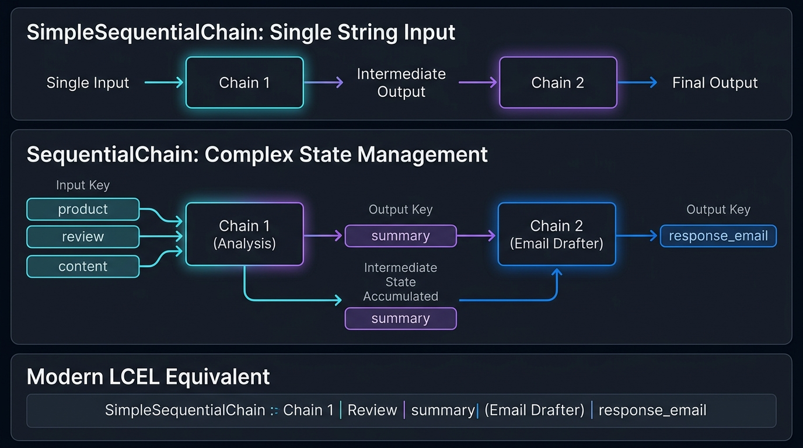
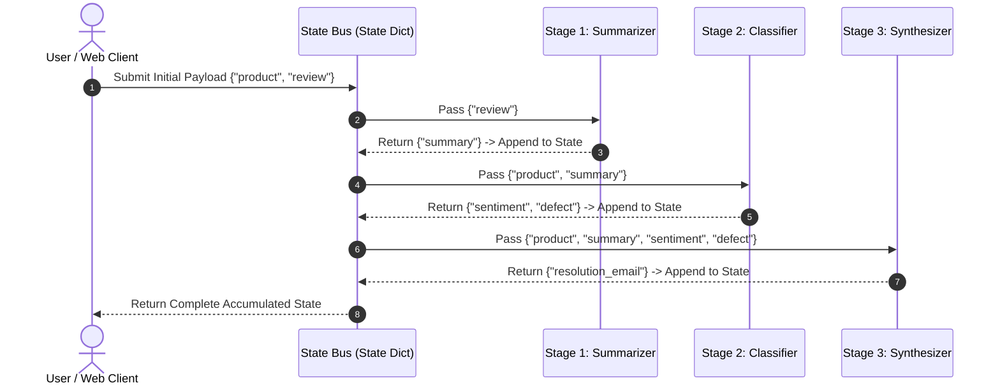

# 03. Sequential Chaining: Connecting Multiple LLM Calls Using Simple Chains & Modern LCEL

> **Zero to Hero Gen AI Course — Module 03: The LangChain Framework & Chaining**  
> ⏱️ Estimated Reading Time: 60 minutes | 🎯 Level: Intermediate  
> ☕ **Audience:** Java / Spring Boot Developers transitioning to Python & Generative AI

---

## 0. 🌟 Why this topic matters

When developers are tasked with a complex reasoning problem—such as translating customer reviews, extracting sentiment, diagnosing hardware root causes, and drafting personalized resolution emails—they often attempt to solve everything inside a **single monolithic prompt**:

```text
❌ THE MONOLITHIC GOD-PROMPT:
"Here is a raw customer review. First, translate it to English. Then classify sentiment. 
Next, diagnose the exact hardware failure. Then search our policy. Finally, draft a 
polite resolution email matching our warranty SLA."
```

While attractive in its simplicity, single-prompt monoliths suffer from four severe production flaws:
1. **Cognitive Overload & Attention Degradation:** Large Language Models exhibit diminished reasoning fidelity when forced to perform multiple disparate tasks simultaneously (translation + classification + policy retrieval + email synthesis).
2. **Brittle Output Formats:** When a single prompt attempts to output both intermediate metadata labels and polished customer-facing prose, downstream parsers frequently crash because the model blends stylistic registers.
3. **Inability to Cache or Scale:** If the translation step is slow or expensive, you cannot cache its output independently of the final email drafting step.
4. **All-or-Nothing Failure:** A single hallucination or formatting glitch in the middle corrupts the entire output, requiring full re-execution from scratch.

**Sequential Chaining** solves this by applying the fundamental software engineering principle of **Separation of Concerns (SoC)**: decompose complex tasks into discrete, specialized sub-tasks, execute each with an optimized prompt and temperature, and pass intermediate outputs downstream.

---

## 1. 🐣 Basic Level – "Explain like I'm new"

### 1.1 The Pipe-and-Filter Mental Model

```
+-----------------------------------------------------------------------------------------+
|                       SEQUENTIAL PIPELINE ARCHITECTURE ANALOGIES                        |
+-----------------------------------------------------------------------------------------+
|                                                                                         |
|  1. THE 4x100m RELAY RACE               2. THE ENTERPRISE CASE DOSSIER                  |
|     (SimpleSequentialChain)                (SequentialChain with State Accumulation)    |
|                                                                                         |
|      Runner 1 (Review)                     Input: [Review, Product, Warranty]           |
|         │                                           │                                   |
|         ▼ [Passes Baton: Summary]                   ▼                                   |
|      Runner 2 (Sentiment)                  Dept 1: Reads Review -> Adds [Sentiment]    |
|         │                                           │                                   |
|         ▼ [Passes Baton: Score]                     ▼                                   |
|      Runner 3 (Response Email)             Dept 2: Reads Review + Sentiment             |
|                                                     -> Adds [Action Plan]               |
|      * Only 1 string passed at each step.           │                                   |
|      * Prior context is discarded!                  ▼                                   |
|                                            Dept 3: Reads All -> Produces [Final Email]  |
|                                                                                         |
+-----------------------------------------------------------------------------------------+
```

Rather than expecting a single worker to perform every job, sequential chaining builds a software assembly line where specialized stations process data in turn.

---

### 1.2 Three Real-World Mental Models & Analogies

#### 🏃 Model 1: The 4x100m Track Relay (SimpleSequentialChain)
In a track relay, Runner 1 sprints and hands a physical baton to Runner 2, who sprints and hands it to Runner 3, who crosses the finish line.
- The baton is a **single physical object** (a single string output).
- Runner 3 receives only the baton; they do not know Runner 1's starting block split times or foot placement.
- **`SimpleSequentialChain`** operates identically: exactly one string output from Stage $N$ becomes the single string input to Stage $N+1$.

---

#### 📁 Model 2: The Enterprise Manila Dossier (SequentialChain)
Imagine an insurance claim moving through a corporate office:
- The intake clerk creates a **manila folder (state dictionary)** containing the customer's policy and photos.
- The inspector opens the folder, reads the damage, writes an *inspection report*, and **places it into the folder**.
- The actuary reads *both* the original policy *and* the inspection report, computes the payout amount, and **adds the payout calculation to the folder**.
- The legal officer reviews all accumulated documents and drafts the final settlement contract.
- **`SequentialChain`** functions like this folder: multiple inputs enter, and each stage appends newly computed variables to a shared state dictionary.

---

#### 🐧 Model 3: The Unix Pipe Pipeline (Modern LCEL Composition)
On a Linux terminal, command-line tools follow the Unix philosophy: *"Do one thing and do it well."* You chain them with pipes:
```bash
cat access.log | grep "404 Not Found" | awk '{print $7}' | sort | uniq -c
```
Data streams through each utility without writing intermediate temporary files to disk. Modern **LangChain Expression Language (LCEL)** brings this exact elegance to AI pipelines:
```python
pipeline = stage1_clean | stage2_extract | stage3_synthesize
```

---

### ☕ 1.3 The Java & Spring Boot Developer Bridge

As a Java and Spring Boot developer, sequential chaining maps directly to enterprise design patterns you implement every day:

```
┌───────────────────────────────────────┬───────────────────────────────────────┐
│ Java / Spring Boot Concept            │ Python / LangChain Equivalent         │
├───────────────────────────────────────┼───────────────────────────────────────┤
│ God Class Anti-Pattern                │ Monolithic Single Prompt              │
│ (`GodService.processEverything()`)    │ (Trying to do all cognitive work at once)│
├───────────────────────────────────────┼───────────────────────────────────────┤
│ Single Responsibility Principle (SRP) │ Decomposed Sequential Chains          │
│ Dedicated microservices / handlers    │ Individual sub-chains per task stage  │
├───────────────────────────────────────┼───────────────────────────────────────┤
│ Java 8 `Function.andThen()`           │ `SimpleSequentialChain` / Pipe `|`    │
│ `fn1.andThen(fn2).andThen(fn3)`       │ Linear 1-to-1 output-to-input passing │
├───────────────────────────────────────┼───────────────────────────────────────┤
│ Apache Camel / Spring Integration     │ `SequentialChain` / LCEL `.assign()`  │
│ `Exchange.setProperty("key", value)`  │ Accumulating keys in a shared state dict│
├───────────────────────────────────────┼───────────────────────────────────────┤
│ Resilience4j `@Retry` & `@Fallback`   │ LCEL `.with_retry()` & `.with_fallbacks()`│
│ Stage-level fault tolerance           │ Stage-level model fallback & retry    │
└───────────────────────────────────────┴───────────────────────────────────────┘
```

#### Code Comparison: Java Spring AI vs. Modern Python LCEL

```java
// =========================================================================
// 1. JAVA (Spring AI / Functional Composition) - Two-Stage Sequential Flow
// =========================================================================
import org.springframework.ai.chat.client.ChatClient;
import java.util.function.Function;

public class SequentialWorkflowService {
    private final ChatClient chatClient;

    public SequentialWorkflowService(ChatClient.Builder builder) {
        this.chatClient = builder.build();
    }

    public String generateBrandedTagline(String description) {
        // Stage 1: Generate Brand Name
        String brandName = chatClient.prompt()
            .user("Suggest a single catchy name for a startup that: " + description)
            .call().content().trim();

        // Stage 2: Generate Tagline using output of Stage 1
        return chatClient.prompt()
            .user("Write a punchy 5-word tagline for the brand: " + brandName)
            .call().content().trim();
    }
}
```

```python
# =========================================================================
# 2. PYTHON (Modern LangChain v0.2+ LCEL Sequential Pipeline)
# =========================================================================
from langchain_core.prompts import ChatPromptTemplate
from langchain_core.output_parsers import StrOutputParser
from langchain_openai import ChatOpenAI

llm = ChatOpenAI(model="gpt-4o-mini", temperature=0.7)
parser = StrOutputParser()

# Stage 1: Generate Brand Name
name_chain = (
    ChatPromptTemplate.from_template("Suggest a single catchy name for: {description}.")
    | llm
    | parser
)

# Stage 2: Generate Tagline
slogan_chain = (
    ChatPromptTemplate.from_template("Create a punchy 5-word tagline for: {name}.")
    | llm
    | parser
)

# Sequential Composition: Map output of name_chain as {"name": ...} into slogan_chain
branded_pipeline = {"name": name_chain} | slogan_chain

tagline = branded_pipeline.invoke({"description": "solar-powered agricultural drones"})
print(tagline) # Output: "Empowering Farms From The Sun."
```

---

## 2. 🧱 Building Up – Concepts added one by one

### 2.1 SimpleSequentialChain: Single-Variable Linear Pipelines



The `SimpleSequentialChain` is designed for strictly linear, single-input, single-output transformations:

$$\text{Input String } x_0 \xrightarrow{\text{Chain}_1} x_1 \xrightarrow{\text{Chain}_2} x_2 \xrightarrow{\text{Chain}_3} x_3 = \text{Final Output}$$

Every sub-chain in the sequence must satisfy two constraints:
1. Exactly **one input variable** in its prompt template.
2. Exactly **one output variable** returned by its execution.

#### Legacy Implementation:
```python
from langchain.chains import LLMChain, SimpleSequentialChain
from langchain.prompts import PromptTemplate
from langchain_openai import ChatOpenAI

llm = ChatOpenAI(model="gpt-4o-mini", temperature=0.7)

prompt_name = PromptTemplate(
    input_variables=["company_description"],
    template="Suggest a brand name for: {company_description}. Return ONLY the name."
)
chain_name = LLMChain(llm=llm, prompt=prompt_name)

prompt_phrase = PromptTemplate(
    input_variables=["company_name"],
    template="Write a punchy 5-word tagline for the brand: {company_name}."
)
chain_phrase = LLMChain(llm=llm, prompt=prompt_phrase)

# Assembling the SimpleSequentialChain
relay_chain = SimpleSequentialChain(chains=[chain_name, chain_phrase], verbose=True)
result = relay_chain.run("autonomous electric cargo drones for rural medical deliveries")
```

#### The Information Bottleneck: Why Simple Sequences Fall Short
`SimpleSequentialChain` introduces an inherent architectural flaw: **loss of upstream context**.

```
Input: "Autonomous electric cargo drones for rural medical deliveries"
   │
   ▼ [Stage 1: Generates Company Name]
Output: "AeroPulse Logistics"
   │
   ▼ [Stage 2: Receives ONLY "AeroPulse Logistics"]
Output Tagline: "Connecting Global Supply Fast"  <-- Lost all context about medical deliveries & drones!
```

Because Stage 2 receives only the raw string `"AeroPulse Logistics"`, it has zero awareness of the original description (*rural medical deliveries*). It generates a generic logistics slogan rather than a healthcare-focused one.

---

### 2.2 SequentialChain: Multi-Variable State Accumulation

`SequentialChain` overcomes the information bottleneck by managing an **explicit state dictionary**:

```
+-----------------------------------------------------------------------------------+
|                        SEQUENTIAL CHAIN STATE ACCUMULATION                        |
+-----------------------------------------------------------------------------------+
|                                                                                   |
|  Initial Inputs: { "product": "ProSound Headphones", "review": "..." }           |
|                                                                                   |
|  ┌─────────────────────────────────────────────────────────────────────────────┐  |
|  │ Stage 1 (Review Analyzer):                                                  │  |
|  │ Inputs:  ["review"]                                                         │  |
|  │ Outputs: ["review_summary", "sentiment"]                                     │  |
|  └─────────────────────────────────────────────────────────────────────────────┘  |
|        │                                                                          |
|        ▼ State: { product, review, review_summary, sentiment }                    |
|                                                                                   |
|  ┌─────────────────────────────────────────────────────────────────────────────┐  |
|  │ Stage 2 (Technical Diagnosis):                                              │  |
|  │ Inputs:  ["product", "review_summary"]                                      │  |
|  │ Outputs: ["defect_category"]                                                │  |
|  └─────────────────────────────────────────────────────────────────────────────┘  |
|        │                                                                          |
|        ▼ State: { product, review, review_summary, sentiment, defect_category }   |
|                                                                                   |
|  ┌─────────────────────────────────────────────────────────────────────────────┐  |
|  │ Stage 3 (Support Response Drafter):                                         │  |
|  │ Inputs:  ["product", "review_summary", "sentiment", "defect_category"]      │  |
|  │ Outputs: ["support_email"]                                                  │  |
|  └─────────────────────────────────────────────────────────────────────────────┘  |
|                                                                                   |
|  Final Return: ["support_email", "sentiment", "defect_category"]                  |
|                                                                                   |
+-----------------------------------------------------------------------------------+
```

#### Multi-Variable Mapping in Code:
```python
from langchain.chains import LLMChain, SequentialChain
from langchain.prompts import PromptTemplate
from langchain_openai import ChatOpenAI

llm = ChatOpenAI(model="gpt-4o-mini", temperature=0.2)

# Stage 1: Summarize & Extract Sentiment
p1 = PromptTemplate(input_variables=["review"], template="Summarize this review: {review}")
c1 = LLMChain(llm=llm, prompt=p1, output_key="summary")

# Stage 2: Diagnose Defect (Reads product AND summary)
p2 = PromptTemplate(input_variables=["product", "summary"], template="Product: {product}\nSummary: {summary}\nIdentify defect:")
c2 = LLMChain(llm=llm, prompt=p2, output_key="defect")

# Stage 3: Draft Resolution (Reads product, summary, AND defect)
p3 = PromptTemplate(input_variables=["product", "summary", "defect"], template="Product: {product}\nSummary: {summary}\nDefect: {defect}\nDraft resolution email:")
c3 = LLMChain(llm=llm, prompt=p3, output_key="reply_email")

# Composing the SequentialChain
support_chain = SequentialChain(
    chains=[c1, c2, c3],
    input_variables=["product", "review"],
    output_variables=["summary", "defect", "reply_email"],
    return_all=True   # Retains complete audit trail
)
```

---

### 2.3 The Modern LCEL Paradigm: Migrating from Legacy Chains

#### Why LangChain Deprecated Legacy Chains
In modern LangChain (v0.1, v0.2, v0.3), `SimpleSequentialChain` and `SequentialChain` are considered legacy because:
1. **Opaque Abstraction:** They hid prompt formatting and model calls inside heavy classes.
2. **No Streaming:** They could not stream intermediate token chunks over HTTP SSE.
3. **No Native Asynchrony:** Running sub-chains asynchronously required complex custom code.

#### Replicating State Accumulation with `RunnablePassthrough.assign()`
In modern LCEL, we replicate multi-variable state accumulation using **`RunnablePassthrough.assign()`**.

Each `.assign()` appends a newly calculated key to the incoming dictionary without discarding existing keys:

```python
from langchain_core.runnables import RunnablePassthrough
from langchain_core.prompts import ChatPromptTemplate
from langchain_core.output_parsers import StrOutputParser
from langchain_openai import ChatOpenAI

llm = ChatOpenAI(model="gpt-4o-mini", temperature=0.2)
parser = StrOutputParser()

# Sub-Chain 1: Summarize Review
summary_chain = (
    ChatPromptTemplate.from_template("Summarize in 1 sentence: {review}")
    | llm
    | parser
)

# Sub-Chain 2: Classify Sentiment
sentiment_chain = (
    ChatPromptTemplate.from_template("Classify sentiment of '{summary}' as POSITIVE, NEUTRAL, or NEGATIVE.")
    | llm
    | parser
)

# Sub-Chain 3: Draft Resolution Email
email_chain = (
    ChatPromptTemplate.from_template(
        "Write a resolution email to a customer who bought '{product}'.\n"
        "Issue: {summary}\n"
        "Sentiment: {sentiment}\n"
        "Offer assistance according to standard warranty."
    )
    | llm
    | parser
)

# Modern LCEL Sequential Pipeline with State Accumulation:
enterprise_pipeline = (
    RunnablePassthrough.assign(summary=summary_chain)
    .assign(sentiment=sentiment_chain)
    .assign(email=email_chain)
)

final_state = enterprise_pipeline.invoke({
    "product": "AirPulse Pro Headphones",
    "review": "Left earbud stopped charging after 3 weeks. Case blinks red."
})

print("Keys in State Dictionary:", list(final_state.keys()))
# Output: ['product', 'review', 'summary', 'sentiment', 'email']
```

Notice how `final_state` contains **all initial inputs plus all intermediate computed outputs**, perfectly replicating `SequentialChain` with 10x less boilerplate!

---

### 2.4 Architectural Comparison Matrix

| Architectural Feature | `SimpleSequentialChain` | `SequentialChain` | Modern LCEL (`RunnableSequence` / `.assign()`) |
| :--- | :--- | :--- | :--- |
| **Input / Output Arity** | Single String In $\to$ Single String Out | Multi-Key Dict In $\to$ Multi-Key Dict Out | Arbitrary Typed Objects (Dicts, Pydantic, Strings) |
| **State Retention** | ❌ Prior stages lost | ✅ Accumulated in state dict | ✅ Preserved natively via `.assign()` |
| **Streaming Support** | ❌ Only final output at end | ❌ Buffer-only execution | ✅ Full native SSE streaming of chunks |
| **Async Execution** | ❌ Blocking only | ❌ Blocking only | ✅ Native `.ainvoke()`, `.astream()`, `.abatch()` |
| **Parallel Branching** | ❌ Linear only | ❌ Sequential only | ✅ Seamless via `RunnableParallel` |
| **Current LangChain Status** | ⚠️ Legacy / Maintenance | ⚠️ Legacy / Maintenance | 🌟 **Current Gold Standard (v0.1+)** |

---

### 2.5 Error Handling & Reliability in Sequential Pipelines

#### Cascading Failures & Compounding Hallucinations
Sequential pipelines are inherently vulnerable to **cascading failures**:

$$\text{Pipeline Reliability} = \prod_{i=1}^{N} (1 - \epsilon_i)$$

If a 4-stage pipeline has an individual error rate of $\epsilon = 5\%$ per stage:

$$\text{Pipeline Reliability} = (0.95)^4 \approx 81.4\%$$

Nearly **1 out of every 5 executions** will fail or hallucinate if stages lack validation checkpoints!

#### Output Validation with `RunnableLambda` Interceptors
To protect downstream stages from corrupted inputs, inject **validation interceptors** between stages:

```python
from langchain_core.runnables import RunnableLambda

def validate_sentiment(data: dict) -> dict:
    valid_labels = {"POSITIVE", "NEUTRAL", "NEGATIVE"}
    sentiment = data.get("sentiment", "").strip().upper()
    if sentiment not in valid_labels:
        # Self-healing fallback: default to NEUTRAL rather than crashing
        data["sentiment"] = "NEUTRAL"
    return data

validated_pipeline = (
    RunnablePassthrough.assign(summary=summary_chain)
    .assign(sentiment=sentiment_chain)
    | RunnableLambda(validate_sentiment)
    .assign(email=email_chain)
)
```

#### Stage-Level Fallbacks and Retries
Modern LCEL allows configuring `.with_fallbacks()` and `.with_retry()` at the individual stage level:

```python
# If the frontier model hits rate limits or timeouts, fallback to a faster model
resilient_summary_chain = (
    (summary_chain)
    .with_fallbacks([fallback_summary_chain])
    .with_retry(stop_after_attempt=3)
)
```

---

### 2.6 Complete Pipeline Architecture Visualized



---

## 3. 🧪 Hands-On Lab & Practice Exercises

### 3.1 Standalone Python Lab: Sequential Chaining

You can execute the official lab script directly from your terminal:
```bash
python "3. The LangChain Framework & Chaining/code/sequential_chains_lab.py"
```

Here is a pure-Python simulation demonstrating the difference between linear baton passing and multi-variable state accumulation:

```python
"""
Pure-Python Simulation of Linear Baton Passing vs. State Accumulation
"""
# 1. Linear Relay Passing (SimpleSequentialChain simulation)
def linear_relay(input_text: str) -> str:
    # Stage 1: Extract Name
    name = f"AeroPulse ({input_text[:15]}...)"
    # Stage 2: Generate Tagline (Notice: input_text is lost!)
    tagline = f"The Premier Solution for {name}"
    return tagline

# 2. State Accumulation Pipeline (SequentialChain / LCEL .assign simulation)
def state_accumulator(initial_state: dict) -> dict:
    state = initial_state.copy()
    
    # Stage 1: Summarize
    state["summary"] = f"Defect reported on {state['product']}: loose port."
    
    # Stage 2: Classify (Reads product AND summary)
    state["defect_type"] = "HARDWARE_PORT_FAILURE"
    
    # Stage 3: Draft (Reads product, summary, AND defect_type)
    state["reply"] = f"Dear Customer, we noticed your {state['product']} experienced {state['defect_type']}. We are sending a replacement."
    return state

# Test verification:
state_result = state_accumulator({"product": "AeroCharge Powerbank", "review": "USB-C port loose."})
print("Accumulated State Keys:", list(state_result.keys()))
print("Drafted Reply:", state_result["reply"])
```

---

### 3.2 Practice Exercises (Beginner to Advanced)

#### 🟢 Exercise 1 (Easy): 2-Stage Linear Translation and Formatter
**Problem:** Build an LCEL pipeline that:
1. Translates a movie review into Spanish.
2. Takes the Spanish translation and reformats it as an HTML blockquote (`<blockquote>...</blockquote>`).

<details>
<summary><b>View Complete Solution</b></summary>

```python
from langchain_core.prompts import ChatPromptTemplate
from langchain_core.output_parsers import StrOutputParser
from langchain_core.runnables import RunnableLambda
from langchain_openai import ChatOpenAI

llm = ChatOpenAI(model="gpt-4o-mini", temperature=0.0)
parser = StrOutputParser()

# Stage 1: Translate
trans_chain = (
    ChatPromptTemplate.from_template("Translate the following review to Spanish:\n{review}")
    | llm
    | parser
)

# Stage 2: HTML Formatter Lambda
def html_formatter(text: str) -> str:
    return f"<blockquote class='review-quote'>\n  {text.strip()}\n</blockquote>"

# Pipe composition
pipeline = trans_chain | RunnableLambda(html_formatter)

result = pipeline.invoke({"review": "The visual effects were breathtaking and the score was epic."})
print(result)
```
</details>

---

#### 🟡 Exercise 2 (Intermediate): 3-Stage LCEL Pipeline with State Accumulation
**Problem:** Construct a 3-stage customer support pipeline using `RunnablePassthrough.assign()`:
- Stage 1: Given `{"ticket_text": "..."}`, generate `ticket_summary`.
- Stage 2: Given the accumulated state, generate `urgency` (`LOW`, `MEDIUM`, `HIGH`).
- Stage 3: Given the accumulated state, generate `escalation_action`.

<details>
<summary><b>View Complete Solution</b></summary>

```python
from langchain_core.runnables import RunnablePassthrough
from langchain_core.prompts import ChatPromptTemplate
from langchain_core.output_parsers import StrOutputParser
from langchain_openai import ChatOpenAI

llm = ChatOpenAI(model="gpt-4o-mini", temperature=0.0)
parser = StrOutputParser()

stage1 = ChatPromptTemplate.from_template("Summarize in 10 words: {ticket_text}") | llm | parser
stage2 = ChatPromptTemplate.from_template("Rate urgency (LOW/MEDIUM/HIGH) for: {ticket_summary}") | llm | parser
stage3 = ChatPromptTemplate.from_template("Suggest action for {urgency} ticket: {ticket_summary}") | llm | parser

support_pipeline = (
    RunnablePassthrough.assign(ticket_summary=stage1)
    .assign(urgency=stage2)
    .assign(escalation_action=stage3)
)

output = support_pipeline.invoke({"ticket_text": "Production Kubernetes cluster API server down!"})
print("Accumulated Output Keys:", list(output.keys()))
print("Urgency:", output["urgency"])
print("Action:", output["escalation_action"])
```
</details>

---

#### 🟠 Exercise 3 (Intermediate/Hard): Pipeline Reliability Calculator
**Problem:** A multi-stage pipeline consists of $N$ sequential stages. Write a Python function `calculate_pipeline_reliability(stage_error_rates: list[float]) -> dict` that computes the overall pipeline reliability and the probability of at least one failure.

<details>
<summary><b>View Complete Solution</b></summary>

```python
def calculate_pipeline_reliability(stage_error_rates: list[float]) -> dict:
    overall_success = 1.0
    for err in stage_error_rates:
        overall_success *= (1.0 - err)
        
    overall_failure = 1.0 - overall_success
    return {
        "num_stages": len(stage_error_rates),
        "overall_reliability_pct": round(overall_success * 100, 2),
        "failure_risk_pct": round(overall_failure * 100, 2)
    }

# Test: 4 stages with 5% error rate each
metrics = calculate_pipeline_reliability([0.05, 0.05, 0.05, 0.05])
print("Pipeline Metrics:", metrics)
# Output: Reliability = 81.45%, Failure Risk = 18.55%
```
</details>

---

#### 🔴 Exercise 4 (Advanced): Self-Healing Sequential Pipeline with Fallback Interceptors
**Problem:** Build an LCEL sequential pipeline that classifies SQL security risk (`SAFE` vs `UNSAFE`). Insert a `RunnableLambda` guardrail interceptor between stages that catches malformed model outputs and applies a self-healing fallback before Stage 2 generates the database action.

<details>
<summary><b>View Complete Solution</b></summary>

```python
from langchain_core.runnables import RunnablePassthrough, RunnableLambda
from langchain_core.prompts import ChatPromptTemplate
from langchain_core.output_parsers import StrOutputParser
from langchain_openai import ChatOpenAI

llm = ChatOpenAI(model="gpt-4o-mini", temperature=0.0)
parser = StrOutputParser()

# Stage 1: Security Scan
scan_prompt = ChatPromptTemplate.from_template("Scan SQL query: '{sql_query}'. Output strictly SAFE or UNSAFE.")
scan_chain = scan_prompt | llm | parser

# Guardrail Interceptor: Self-Healing Normalizer
def guardrail_interceptor(state: dict) -> dict:
    raw_status = state.get("security_status", "").strip().upper()
    if "UNSAFE" in raw_status or "DROP" in state["sql_query"].upper():
        state["security_status"] = "UNSAFE"
    elif "SAFE" in raw_status:
        state["security_status"] = "SAFE"
    else:
        # Default safe policy: fail closed
        state["security_status"] = "UNSAFE"
    return state

# Stage 2: Action Decision
action_prompt = ChatPromptTemplate.from_template("Security status is {security_status} for query: {sql_query}. Decide action (EXECUTE or BLOCK).")
action_chain = action_prompt | llm | parser

# Assemble Resilient Pipeline
resilient_pipeline = (
    RunnablePassthrough.assign(security_status=scan_chain)
    | RunnableLambda(guardrail_interceptor)
    .assign(final_decision=action_chain)
)

res = resilient_pipeline.invoke({"sql_query": "SELECT * FROM users WHERE id = 1;"})
print("Result:", res["security_status"], "-> Decision:", res["final_decision"])
```
</details>

---

## 4. ⚙️ Pro Level – Internals & Interview Q&A

### 4.1 Advanced Internals

#### 1. The State Bus in `RunnablePassthrough.assign()`
Under the hood, `.assign(**kwargs)` constructs a `RunnableParallel` instance merged with the identity runnable:
```python
# Conceptual LCEL implementation:
def assign(**kwargs):
    return RunnableParallel({
        **{key: RunnablePassthrough() for key in existing_keys},
        **kwargs
    })
```
This guarantees that intermediate variables remain immutable dictionaries flowing cleanly through the execution graph without memory leaks.

#### 2. Streaming Chunk Propagation Across Multi-Stage Pipelines
When streaming (`.stream()`) through a sequential pipeline:
- Stage 1 buffers tokens internally until its completion is parsed into structured data.
- The downstream Stage 2 receives Stage 1's output and begins streaming token chunks immediately to the client over Server-Sent Events (SSE).

---

### 4.2 High-Frequency Technical Interview Questions & Answers

#### Q1: What is the fundamental architectural difference between `SimpleSequentialChain` and `SequentialChain`?
<details>
<summary><b>View Detailed Answer</b></summary>
<b>Explanation:</b><br>
- <b>`SimpleSequentialChain`</b> is strictly linear and single-variable: it accepts exactly one string input and passes exactly one string output to the next stage. It has no capability to pass multiple inputs or retain outputs from earlier stages for later steps.
- <b>`SequentialChain`</b> operates on an accumulated <b>state dictionary</b>: it can accept multiple input variables (`input_variables=["product", "review"]`), produce multiple output variables (`output_variables=["summary", "sentiment", "email"]`), and pass all accumulated keys to subsequent stages, preventing the information bottleneck.
</details>

#### Q2: How does modern LCEL replace `SequentialChain` without losing intermediate state?
<details>
<summary><b>View Detailed Answer</b></summary>
<b>Explanation:</b><br>
Modern LCEL uses <b>`RunnablePassthrough.assign()`</b>. When called, `.assign(new_key=sub_chain)` takes the current state dictionary, passes it into `sub_chain`, and appends the result under `new_key` while <b>preserving all existing keys</b> in the dictionary. 

By chaining multiple `.assign()` calls sequentially:
```python
chain = (
    RunnablePassthrough.assign(summary=summary_chain)
    .assign(sentiment=sentiment_chain)
    .assign(email=email_chain)
)
```
Every subsequent stage can access both original inputs and all previously calculated outputs.
</details>

#### Q3: Why is breaking a single complex task into 3 sequential LLM calls often more accurate than a single large prompt?
<details>
<summary><b>View Detailed Answer</b></summary>
<b>Explanation:</b><br>
1. <b>Reduced Cognitive Load:</b> LLMs have finite attention bandwidth per forward pass. A prompt asking for translation, classification, and drafting forces the attention mechanism to divide weights across competing objectives.
2. <b>Specialized Prompts & Temperatures:</b> You can optimize parameters per stage (e.g., `temperature=0.0` for sentiment classification, `temperature=0.7` for creative drafting).
3. <b>Structured Intermediate Validation:</b> You can place code-level validators or regex guardrails between stages, rejecting or repairing corrupted data before it reaches the final output generator.
</details>

#### Q4: If Stage 2 in a 3-stage sequential pipeline outputs malformed text, how does it affect Stage 3?
<details>
<summary><b>View Detailed Answer</b></summary>
<b>Explanation:</b><br>
This causes <b>compounding error / cascading failure</b>: $R_{\text{pipeline}} = \prod (1 - \epsilon_i)$. Stage 3 receives the malformed text as ground-truth input. The model will either hallucinate based on the corrupted premise, refuse to answer, or produce invalid formatting. 

<b>Production Fix:</b> Inject intermediate validation interceptors (`RunnableLambda`) between stages and enforce schema validation (`PydanticOutputParser`).
</details>

#### Q5: What is the latency and token cost trade-off of sequential pipelines versus single prompts?
<details>
<summary><b>View Detailed Answer</b></summary>
<b>Explanation:</b><br>
- <b>Latency:</b> A 3-stage sequential chain has higher wall-clock latency because the 3 LLM calls execute serially ($T_{\text{total}} = T_1 + T_2 + T_3$).
- <b>Token Costs:</b> Total token consumption is often higher because intermediate outputs are re-submitted as prompt context tokens to downstream stages.
- <b>Architectural Decision:</b> You trade increased latency and token cost for substantially higher accuracy, deterministic modularity, testability, and easier error recovery.
</details>

#### Q6: How do you implement stage-level error recovery in modern LCEL sequential pipelines?
<details>
<summary><b>View Detailed Answer</b></summary>
<b>Explanation:</b><br>
Configure fault-tolerance decorators directly on individual sub-chains:
1. <b>`.with_retry()`:</b> Retries transient network or HTTP 429 rate limit exceptions up to $N$ attempts with exponential backoff.
2. <b>`.with_fallbacks()`:</b> Automatically switches to an alternate model or fallback prompt if the primary stage fails.
3. <b>`RunnableLambda` Interceptors:</b> Inspect intermediate state dictionaries and apply self-healing defaults if values are missing or out of bounds.
</details>

---

## 5. ⚡ Quick Revision (Cheat-Sheet)

```
========================================================================================
                          SEQUENTIAL CHAINING REVISION CHEAT SHEET
========================================================================================

1. THE PARADIGM COMPARISON:
   • SimpleSequentialChain: Linear relay race. Passes 1 string forward. Upstream context LOST!
   • SequentialChain:       Corporate manila dossier. Preserves & accumulates state dictionary.
   • Modern LCEL:           Unix pipes (|) and RunnablePassthrough.assign(). Clean, fast, native streaming.

2. MODERN LCEL ACCUMULATION PATTERN:
   pipeline = (
       RunnablePassthrough.assign(summary=summary_chain)
       .assign(sentiment=sentiment_chain)
       .assign(email=email_chain)
   )
   # Result: Dictionary contains original inputs + summary + sentiment + email!

3. CASCADING ERROR FORMULA:
   Pipeline Reliability = (1 - e_1) * (1 - e_2) * ... * (1 - e_N)
   Always place validation interceptors between stages!

4. JAVA / SPRING BOOT EQUIVALENTS:
   • Monolithic Prompt        ===> God Class Anti-Pattern
   • SimpleSequentialChain    ===> Function.andThen()
   • SequentialChain          ===> Apache Camel Exchange state accumulation
   • LCEL .assign()           ===> Immutable Map Builder pattern
   • Fallbacks / Retries      ===> Resilience4j @Retry and @CircuitBreaker
========================================================================================
```

---

## 6. 🎬 References & Visual Learning Videos

### 6.1 🇮🇳 Telugu Tech Video References
For native Telugu speakers, these curated video tutorials explain sequential chains and pipelines step-by-step:

| # | Topic / Video Title | Channel / Creator | Search Query | Highlights |
|---|---|---|---|---|
| 1 | **Sequential Chains in LangChain in Telugu** | **Python Life Telugu** | `Python Life Telugu LangChain Sequential Chains` | Complete guide to chaining multiple LLMs and passing outputs in Telugu. |
| 2 | **Building AI Pipelines with LangChain in Telugu** | **Vamsi Bhavani** | `Vamsi Bhavani LangChain Chains AI Pipelines` | Practical walkthrough of multi-stage AI workflows and prompt chaining. |
| 3 | **LangChain Expression Language LCEL in Telugu** | **Telugu Tech Tutorials** | `Telugu Tech LangChain LCEL Tutorial` | Deep dive into the Unix pipe operator `|` and modern chaining in Telugu. |

---

### 6.2 🎥 3D Animated & World-Class Visual Deep Dives

| # | Topic / Video Title | Channel / Creator | Search Query | Visual & Technical Highlights |
|---|---|---|---|---|
| 1 | **Pipe and Filter Architecture & AI Pipelines** | **ByteByteGo** | `ByteByteGo Pipe and Filter Architecture AI` | System design animations showing data streaming through sequential pipeline stages. |
| 2 | **LangChain Sequential Chains Crash Course** | **freeCodeCamp.org** | `freeCodeCamp LangChain Sequential Chains` | Hands-on walkthrough of `SimpleSequentialChain`, `SequentialChain`, and modern LCEL. |
| 3 | **How Multi-Step Reasoning Works in Transformers** | **3Blue1Brown** | `3Blue1Brown Transformers Neural Networks Reasoning` | World-class 3D geometric visualizations of attention mechanisms across reasoning steps. |
| 4 | **Sequential Pipelines Clearly Explained!** | **StatQuest with Josh Starmer** | `StatQuest LangChain Chains Clearly Explained` | Step-by-step visual breakdown of chain-of-thought pipelines with zero jargon. |
| 5 | **State of GPT & Multi-Step Workflows** | **Andrej Karpathy** | `Andrej Karpathy State of GPT Microsoft Build` | Foundational masterclass on breaking complex tasks into multi-turn stages. |

---

### 6.3 📚 Foundational Documentation & Specifications
1. **LangChain Sequential Chains Documentation:** [python.langchain.com/docs/how_to/sequence/](https://python.langchain.com/docs/how_to/sequence/)
2. **LangChain Expression Language (LCEL) Primitives:** [python.langchain.com/docs/concepts/lcel/](https://python.langchain.com/docs/concepts/lcel/)
3. **Enterprise Integration Patterns (Pipe and Filter):** [enterpriseintegrationpatterns.com/patterns/messaging/PipesAndFilters.html](https://www.enterpriseintegrationpatterns.com/patterns/messaging/PipesAndFilters.html)
