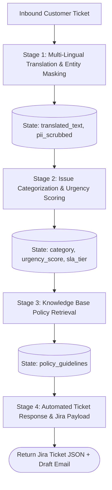
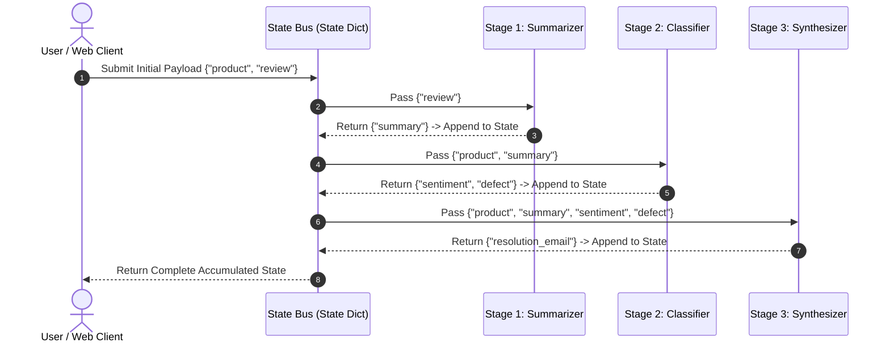

# ⛓️ Sequential Chaining: Connecting Multiple LLM Calls Using SimpleSequentialChain, SequentialChain, and Modern LCEL

> **Zero to Hero Gen AI Course — Module 03: The LangChain Framework & Chaining**
>
> 📅 Module 3 | ⏱️ Estimated Reading Time: 55 minutes | 🎯 Level: Intermediate
>
> **Core Objective:** Master multi-stage LLM workflow orchestration. Learn how to connect independent language model invocations into deterministic pipelines where outputs seamlessly flow as inputs into downstream stages. Compare legacy chaining abstractions (`SimpleSequentialChain` and `SequentialChain`) against modern LangChain Expression Language (LCEL) patterns (`RunnableSequence` and `RunnablePassthrough.assign()`), and master state accumulation, multi-variable mapping, and pipeline error boundaries.

---

## 📑 Table of Contents

1. [The Challenge of Single-Prompt Monoliths](#1-the-challenge-of-single-prompt-monoliths)
2. [Intuitive Mental Models & Analogies](#2-intuitive-mental-models--analogies)
   - [2.1 The 4x100m Relay Race: SimpleSequentialChain](#21-the-4x100m-relay-race-simplesequentialchain)
   - [2.2 The Corporate Workflow Dossier: SequentialChain](#22-the-corporate-workflow-dossier-sequentialchain)
   - [2.3 The Unix Pipeline: Modern LCEL Composition](#23-the-unix-pipeline-modern-lcel-composition)
3. [SimpleSequentialChain: Single-Variable Linear Pipelines](#3-simplesequentialchain-single-variable-linear-pipelines)
   - [3.1 Architectural Principles & Topology](#31-architectural-principles--topology)
   - [3.2 Implementing `SimpleSequentialChain`](#32-implementing-simplesequentialchain)
   - [3.3 The Information Bottleneck: Why Simple Sequences Fall Short](#33-the-information-bottleneck-why-simple-sequences-fall-short)
4. [SequentialChain: Multi-Variable State Accumulation](#4-sequentialchain-multi-variable-state-accumulation)
   - [4.1 Multi-Input, Multi-Output Architectural Topology](#41-multi-input-multi-output-architectural-topology)
   - [4.2 Explicit Variable Mapping & State Accumulation](#42-explicit-variable-mapping--state-accumulation)
   - [4.3 Inspection and Debugging with `return_all=True`](#43-inspection-and-debugging-with-return_alltrue)
5. [The Modern LCEL Paradigm: Migrating from Legacy Chains](#5-the-modern-lcel-paradigm-migrating-from-legacy-chains)
   - [5.1 Why LangChain Deprecated Legacy Chains](#51-why-langchain-deprecated-legacy-chains)
   - [5.2 Replicating Simple Pipelines with the Pipe Operator `|`](#52-replicating-simple-pipelines-with-the-pipe-operator-)
   - [5.3 Replicating Complex Multi-Variable Pipelines with `RunnablePassthrough.assign()`](#53-replicating-complex-multi-variable-pipelines-with-runnablepassthroughassign)
   - [5.4 Architectural Comparison Matrix](#54-architectural-comparison-matrix)
6. [Enterprise Pipeline Case Studies](#6-enterprise-pipeline-case-studies)
   - [6.1 Case Study 1: Automated Customer Feedback & SLA Escalation](#61-case-study-1-automated-customer-feedback--sla-escalation)
   - [6.2 Case Study 2: Automated Code Security & Pull Request Generator](#62-case-study-2-automated-code-security--pull-request-generator)
7. [Error Handling & Reliability in Sequential Pipelines](#7-error-handling--reliability-in-sequential-pipelines)
   - [7.1 Cascading Failures & Compounding Hallucinations](#71-cascading-failures--compounding-hallucinations)
   - [7.2 Output Validation & Guardrail Interceptors](#72-output-validation--guardrail-interceptors)
   - [7.3 Fallbacks and Retries per Stage](#73-fallbacks-and-retries-per-stage)
8. [Complete Pipeline Architecture Visualized](#8-complete-pipeline-architecture-visualized)
9. [Hands-On Python Lab Walkthrough](#9-hands-on-python-lab-walkthrough)
10. [Curated Video Walkthroughs & Visual Animations](#10-curated-video-walkthroughs--visual-animations)
11. [Self-Assessment & Review Questions](#11-self-assessment--review-questions)
12. [Summary & Key Takeaways](#12-summary--key-takeaways)

---

## 1. The Challenge of Single-Prompt Monoliths

When tasked with a complex problem—such as analyzing customer reviews, extracting sentiment, diagnosing root causes, and drafting personalized customer support responses—beginners often attempt to accomplish everything in a **single monolithic prompt**:

```
Prompt: "Here is a customer review. First, translate it into English if needed. 
Then classify the sentiment. Next, identify the product flaw. Finally, draft 
a polite support email addressing the issue, quoting the warranty policy."
```

While attractive in its simplicity, single-prompt monoliths suffer from four fundamental production flaws:

1. **Cognitive Overload & Reduced Accuracy**: LLMs exhibit diminished reasoning quality when forced to perform disparate cognitive tasks simultaneously (translation + classification + policy retrieval + email drafting).
2. **Brittle Output Formats**: If the prompt asks for both intermediate sentiment labels and a final polished letter, parsers frequently fail because the model blends stylistic registers.
3. **Inability to Modularize or Cache**: If the translation step is slow or expensive, you cannot cache its result independently of the email generation step.
4. **All-or-Nothing Failure**: A single hallucination or malformed sentence in the middle corrupts the entire output, requiring full re-execution from scratch.

**Sequential Chaining** solves this by applying the fundamental software engineering principle of **separation of concerns**: decompose the problem into discrete, specialized sub-tasks, execute each with a tailored prompt and temperature, and pass intermediate outputs downstream.

---

## 2. Intuitive Mental Models & Analogies

```
+-----------------------------------------------------------------------------------------+
|                       SEQUENTIAL PIPELINE ARCHITECTURE ANALOGIES                        |
+-----------------------------------------------------------------------------------------+
|                                                                                         |
|  1. THE 4x100m RELAY RACE               2. THE ENTERPRISE CASE DOSSIER                  |
|     (SimpleSequentialChain)                (SequentialChain with State Accumulation)    |
|                                                                                         |
|      Runner 1 (Review)                     Input: [Review, Product, Warranty]           |
|         |                                           |                                   |
|         v [Passes Baton: Summary]                   v                                   |
|      Runner 2 (Sentiment)                  Dept 1: Reads Review -> Adds [Sentiment]    |
|         |                                           |                                   |
|         v [Passes Baton: Score]                     v                                   |
|      Runner 3 (Response Email)             Dept 2: Reads Review + Sentiment             |
|                                                     -> Adds [Action Plan]               |
|      * Only 1 string passed at each step.           |                                   |
|      * Prior context is discarded.                  v                                   |
|                                            Dept 3: Reads All -> Produces [Final Email]  |
|                                                                                         |
+-----------------------------------------------------------------------------------------+
```

### 2.1 The 4x100m Relay Race: SimpleSequentialChain
In a 4x100m track relay, Runner 1 hands a physical baton to Runner 2, who sprints and hands it to Runner 3, who finishes across the line. 
- The baton is a **single physical object** (a single string output).
- Runner 3 only receives the baton; they do not receive Runner 1's split times or foot placement data.
- **`SimpleSequentialChain`** operates identically: exactly one string output from Stage $N$ becomes the single string input to Stage $N+1$.

### 2.2 The Corporate Workflow Dossier: SequentialChain
Imagine an insurance claim moving through a headquarters office:
- The receptionist creates a **manila folder (state dictionary)** containing the customer's policy number and damage photos.
- The claims investigator opens the folder, assesses the damage, writes an *inspection report*, and **places it into the folder**.
- The actuary opens the folder, reads *both* the original policy *and* the inspection report, calculates the payout amount, and **adds the payout calculation to the folder**.
- The legal officer reviews the entire contents and generates the final settlement contract.
- **`SequentialChain`** functions like this folder: multiple inputs enter, and each stage appends newly computed variables to a shared state dictionary.

### 2.3 The Unix Pipeline: Modern LCEL Composition
On a Linux terminal, command-line tools follow the Unix philosophy: *"Do one thing and do it well."* You chain them with pipes:
```bash
cat server.log | grep "ERROR 500" | awk '{print $4}' | sort | uniq -c
```
Data streams through each utility without intermediate temporary files. Modern **LangChain Expression Language (LCEL)** brings this exact elegance to AI pipelines:
```python
pipeline = stage1_clean | stage2_extract | stage3_synthesize
```

---

## 3. SimpleSequentialChain: Single-Variable Linear Pipelines

### 3.1 Architectural Principles & Topology


The `SimpleSequentialChain` is designed for strictly linear, single-input, single-output transformations:

$$\text{Input String } x_0 \xrightarrow{\text{Chain}_1} x_1 \xrightarrow{\text{Chain}_2} x_2 \xrightarrow{\text{Chain}_3} x_3 = \text{Final Output}$$

Every sub-chain in the sequence must satisfy:
1. Exactly **one input variable** in its prompt template.
2. Exactly **one output variable** returned by its execution.

### 3.2 Implementing `SimpleSequentialChain`

Here is a two-stage pipeline: Stage 1 generates a creative startup name for a company description; Stage 2 writes a compelling catchphrase for that generated name.

```python
from langchain_community.chat_models import ChatOpenAI
from langchain.prompts import PromptTemplate
from langchain.chains import LLMChain, SimpleSequentialChain

llm = ChatOpenAI(model="gpt-4o-mini", temperature=0.7)

# --- Stage 1: Company Name Generator ---
prompt_name = PromptTemplate(
    input_variables=["company_description"],
    template="Suggest a single, catchy, brandable name for a company that: {company_description}. Return ONLY the name."
)
chain_name = LLMChain(llm=llm, prompt=prompt_name)

# --- Stage 2: Catchphrase Generator ---
prompt_phrase = PromptTemplate(
    input_variables=["company_name"],
    template="Write a punchy, inspiring 5-word marketing tagline for the brand: {company_name}."
)
chain_phrase = LLMChain(llm=llm, prompt=prompt_phrase)

# --- Composing the SimpleSequentialChain ---
overall_chain = SimpleSequentialChain(
    chains=[chain_name, chain_phrase],
    verbose=True
)

# Execution
result = overall_chain.run("builds autonomous electric cargo drones for rural medical deliveries")
print("Final Tagline:", result)
```

### 3.3 The Information Bottleneck: Why Simple Sequences Fall Short

While clean for toy examples, `SimpleSequentialChain` introduces a catastrophic architectural limitation: **loss of upstream context**.

```
Input: "Autonomous electric cargo drones for rural medical deliveries"
   |
   v [Stage 1: Generates Company Name]
Output: "AeroPulse Logistics"
   |
   v [Stage 2: Receives ONLY "AeroPulse Logistics"]
Output Tagline: "Connecting Global Supply Fast"  <-- Lost all context about medical deliveries & drones!
```

Because Stage 2 only receives the single string `"AeroPulse Logistics"`, it has zero awareness of the original description (*medical drones in rural areas*). It generates a generic logistics tagline rather than a healthcare-specific one.

To fix this, we need an architecture that preserves and passes multiple variables simultaneously.

---

## 4. SequentialChain: Multi-Variable State Accumulation

### 4.1 Multi-Input, Multi-Output Architectural Topology

`SequentialChain` overcomes the information bottleneck by managing an **explicit state dictionary**:

```
+-----------------------------------------------------------------------------------+
|                        SEQUENTIAL CHAIN STATE ACCUMULATION                        |
+-----------------------------------------------------------------------------------+
|                                                                                   |
|  Initial Inputs: { "product": "ProSound Headphones", "review": "..." }           |
|                                                                                   |
|  +-----------------------------------------------------------------------------+  |
|  | Stage 1 (Review Analyzer):                                                  |  |
|  | Inputs:  ["review"]                                                         |  |
|  | Outputs: ["review_summary", "sentiment"]                                     |  |
|  +-----------------------------------------------------------------------------+  |
|        |                                                                          |
|        v State: { product, review, review_summary, sentiment }                    |
|                                                                                   |
|  +-----------------------------------------------------------------------------+  |
|  | Stage 2 (Technical Diagnosis):                                              |  |
|  | Inputs:  ["product", "review_summary"]                                      |  |
|  | Outputs: ["hardware_defect_category"]                                       |  |
|  +-----------------------------------------------------------------------------+  |
|        |                                                                          |
|        v State: { product, review, review_summary, sentiment, defect_category }   |
|                                                                                   |
|  +-----------------------------------------------------------------------------+  |
|  | Stage 3 (Support Response Drafter):                                         |  |
|  | Inputs:  ["product", "review_summary", "sentiment", "defect_category"]      |  |
|  | Outputs: ["support_email"]                                                  |  |
|  +-----------------------------------------------------------------------------+  |
|                                                                                   |
|  Final Return: ["support_email", "sentiment", "defect_category"]                  |
|                                                                                   |
+-----------------------------------------------------------------------------------+
```

### 4.2 Explicit Variable Mapping & State Accumulation

In `SequentialChain`, every link declares its explicit `input_variables` and `output_key`. The parent chain orchestrates the data bus:

```python
from langchain.chains import LLMChain, SequentialChain
from langchain.prompts import PromptTemplate
from langchain_community.chat_models import ChatOpenAI

llm = ChatOpenAI(model="gpt-4o-mini", temperature=0.2)

# --- Stage 1: Summarize & Extract Sentiment ---
prompt_analysis = PromptTemplate(
    input_variables=["review"],
    template="Analyze this product review. Extract a 1-sentence summary and sentiment (POSITIVE, NEUTRAL, NEGATIVE).\n\nReview: {review}\n\nFormat:\nSummary: <summary>\nSentiment: <sentiment>"
)
chain_analysis = LLMChain(llm=llm, prompt=prompt_analysis, output_key="analysis_result")

# --- Stage 2: Identify Defect Category ---
prompt_defect = PromptTemplate(
    input_variables=["product", "analysis_result"],
    template="Given the product '{product}' and analysis:\n{analysis_result}\n\nIdentify the specific hardware or software subsystem failure (e.g. Battery, Bluetooth, Audio Driver)."
)
chain_defect = LLMChain(llm=llm, prompt=prompt_defect, output_key="defect_type")

# --- Stage 3: Draft Customer Resolution Email ---
prompt_email = PromptTemplate(
    input_variables=["product", "analysis_result", "defect_type"],
    template="Draft a professional customer resolution email for '{product}'.\nAnalysis: {analysis_result}\nDefect: {defect_type}\nOffer a replacement or refund."
)
chain_email = LLMChain(llm=llm, prompt=prompt_email, output_key="reply_email")

# --- Composing the SequentialChain ---
full_support_chain = SequentialChain(
    chains=[chain_analysis, chain_defect, chain_email],
    input_variables=["product", "review"],
    output_variables=["analysis_result", "defect_type", "reply_email"],
    verbose=True
)

# Executing with multi-key dictionary
inputs = {
    "product": "AirPulse Noise-Cancelling Headphones",
    "review": "I bought these 3 weeks ago. The sound was incredible, but yesterday the left earbud stopped charging completely. The case LED blinks red and won't reset."
}
output_state = full_support_chain(inputs)
print("Defect:", output_state["defect_type"])
print("\nDrafted Email:\n", output_state["reply_email"])
```

### 4.3 Inspection and Debugging with `return_all=True`

By default, executing a `SequentialChain` returns only the keys specified in `output_variables`. During testing or debugging, setting `return_all=True` outputs the entire state dictionary, including all intermediate steps. This enables:
- Tracing exactly where an error or hallucination originated.
- Measuring latency and token counts across distinct stages.
- Logging structured audit trails for enterprise compliance.

---

## 5. The Modern LCEL Paradigm: Migrating from Legacy Chains

### 5.1 Why LangChain Deprecated Legacy Chains

While `SimpleSequentialChain` and `SequentialChain` established the concept of chaining, they had critical drawbacks:
1. **Opaque Abstraction**: They hid intermediate prompt formatting and output generation inside heavy base classes (`Chain`, `LLMChain`).
2. **Poor Streaming Support**: Legacy chains could not easily stream intermediate tokens across stages over HTTP Server-Sent Events (SSE).
3. **No Native Asynchrony**: Running sub-chains asynchronously required complex custom wrappers.
4. **Heavy Overhead**: Instantiating multiple `LLMChain` objects created unnecessary class hierarchies.

In modern LangChain (v0.1, v0.2, and v0.3), **LangChain Expression Language (LCEL)** completely replaces legacy chains with cleaner, faster, functional primitives.

### 5.2 Replicating Simple Pipelines with the Pipe Operator `|`

To replicate a `SimpleSequentialChain` in modern LCEL, you chain prompts, models, and parsers using `|`:

```python
from langchain_core.prompts import ChatPromptTemplate
from langchain_core.output_parsers import StrOutputParser
from langchain_openai import ChatOpenAI

llm = ChatOpenAI(model="gpt-4o-mini", temperature=0.7)
parser = StrOutputParser()

# Stage 1: Generate Name
prompt_name = ChatPromptTemplate.from_template(
    "Suggest a single catchy name for a startup that: {description}."
)
name_chain = prompt_name | llm | parser

# Stage 2: Generate Slogan
prompt_slogan = ChatPromptTemplate.from_template(
    "Create a punchy 5-word tagline for the company named: {name}."
)
slogan_chain = prompt_slogan | llm | parser

# Modern LCEL Sequential Composition:
# Pass output of name_chain as dictionary {"name": ...} into slogan_chain
full_chain = (
    {"name": name_chain} 
    | slogan_chain
)

tagline = full_chain.invoke({"description": "builds solar-powered underwater research drones"})
print("Generated Tagline:", tagline)
```

### 5.3 Replicating Complex Multi-Variable Pipelines with `RunnablePassthrough.assign()`

To replicate a multi-variable `SequentialChain` with accumulated state in modern LCEL, we use **`RunnablePassthrough.assign()`**.

Each `.assign()` appends a new calculated key to the incoming dictionary without discarding existing keys:

```python
from langchain_core.runnables import RunnablePassthrough
from langchain_core.prompts import ChatPromptTemplate
from langchain_core.output_parsers import StrOutputParser
from langchain_openai import ChatOpenAI

llm = ChatOpenAI(model="gpt-4o-mini", temperature=0.2)
parser = StrOutputParser()

# Sub-Chain 1: Summarize Review
summary_chain = (
    ChatPromptTemplate.from_template("Summarize in 1 sentence: {review}")
    | llm
    | parser
)

# Sub-Chain 2: Classify Sentiment
sentiment_chain = (
    ChatPromptTemplate.from_template("Classify sentiment of '{summary}' as POSITIVE, NEUTRAL, or NEGATIVE.")
    | llm
    | parser
)

# Sub-Chain 3: Draft Resolution Email
email_chain = (
    ChatPromptTemplate.from_template(
        "Write a resolution email to a customer who bought '{product}'.\n"
        "Their issue summary: {summary}\n"
        "Detected sentiment: {sentiment}\n"
        "Offer assistance according to standard warranty."
    )
    | llm
    | parser
)

# Modern LCEL Sequential Pipeline with State Accumulation:
enterprise_pipeline = (
    RunnablePassthrough.assign(summary=summary_chain)
    .assign(sentiment=sentiment_chain)
    .assign(email=email_chain)
)

# Execution:
final_state = enterprise_pipeline.invoke({
    "product": "AeroCharge Ultra Powerbank",
    "review": "Worked great for two weeks, but now the USB-C port is loose and only charges intermittently."
})

print("Keys in State Dictionary:", list(final_state.keys()))
print("\n--- Summary ---:\n", final_state["summary"])
print("\n--- Sentiment ---:\n", final_state["sentiment"])
print("\n--- Email ---:\n", final_state["email"])
```

Notice how `final_state` contains **all initial inputs plus all intermediate computed outputs**, perfectly replicating `SequentialChain` with 10x less boilerplate!

### 5.4 Architectural Comparison Matrix

| Architectural Feature | `SimpleSequentialChain` | `SequentialChain` | Modern LCEL (`RunnableSequence` / `.assign()`) |
| :--- | :--- | :--- | :--- |
| **Input / Output Arity** | Single String In $\to$ Single String Out | Multi-Key Dict In $\to$ Multi-Key Dict Out | Arbitrary Typed Objects (Dicts, Pydantic, Strings) |
| **State Retention** | ❌ Prior stages lost | ✅ Accumulated in state dict | ✅ Preserved natively via `.assign()` |
| **Streaming Support** | ❌ Only final output at end | ❌ Buffer-only execution | ✅ Full native SSE streaming of chunks |
| **Async Execution** | ❌ Blocking only | ❌ Blocking only | ✅ Native `.ainvoke()`, `.astream()`, `.abatch()` |
| **Parallel Branching** | ❌ Linear only | ❌ Sequential only | ✅ Seamless via `RunnableParallel` |
| **Current LangChain Status** | ⚠️ Legacy / Maintenance | ⚠️ Legacy / Maintenance | 🌟 **Current Gold Standard (v0.1+)** |

---

## 6. Enterprise Pipeline Case Studies

### 6.1 Case Study 1: Automated Customer Feedback & SLA Escalation

In enterprise SaaS customer service, inbound support tickets must be processed through strict Service Level Agreements (SLAs).



- **Stage 1 (PII Scrubbing & Language Normalization)**: Translates non-English text and redacts social security numbers, credit cards, or phone numbers.
- **Stage 2 (Urgency Scoring & SLA Categorization)**: Assigns an urgency rating (P1, P2, P3) based on operational impact.
- **Stage 3 (Remediation Plan Formulation)**: Ingests company documentation to select valid warranty or refund actions.
- **Stage 4 (Structured Dispatch)**: Formats an internal ticket for engineers and drafts a reassuring reply to the customer.

### 6.2 Case Study 2: Automated Code Security & Pull Request Generator

In automated DevOps and code review pipelines:

```
[Raw Git Diff] 
    |
    v
[Stage 1: Vulnerability & AST Audit] ---> Outputs: [security_findings, cve_risks]
    |
    v
[Stage 2: Refactoring & Patch Synthesis] ---> Outputs: [git_patch_code, performance_notes]
    |
    v
[Stage 3: Pull Request Formatter] ---> Outputs: [pr_title, markdown_pr_body]
```

Using LCEL `.assign()`, each review stage builds on the previous stage's code analysis, culminating in an automated GitHub pull request.

---

## 7. Error Handling & Reliability in Sequential Pipelines

### 7.1 Cascading Failures & Compounding Hallucinations

Sequential pipelines are inherently vulnerable to **cascading failures**:

$$\text{Error Probability}_{\text{Pipeline}} = 1 - \prod_{i=1}^{N} (1 - \epsilon_i)$$

If a 4-stage pipeline has an individual error rate of $\epsilon = 5\%$ per stage:
$$\text{Pipeline Reliability} = (0.95)^4 \approx 81.4\%$$

Nearly **1 out of every 5 executions** will fail or hallucinate if stages lack validation checkpoints.

### 7.2 Output Validation & Guardrail Interceptors

To protect downstream stages from corrupted inputs, inject **validation interceptors** between stages using `RunnableLambda`:

```python
from langchain_core.runnables import RunnableLambda

def validate_sentiment(data: dict) -> dict:
    valid_labels = {"POSITIVE", "NEUTRAL", "NEGATIVE"}
    sentiment = data.get("sentiment", "").strip().upper()
    if sentiment not in valid_labels:
        # Self-healing fallback: default to NEUTRAL rather than crashing
        data["sentiment"] = "NEUTRAL"
    return data

validated_pipeline = (
    RunnablePassthrough.assign(summary=summary_chain)
    .assign(sentiment=sentiment_chain)
    | RunnableLambda(validate_sentiment)
    .assign(email=email_chain)
)
```

### 7.3 Fallbacks and Retries per Stage

Modern LCEL provides `.with_fallbacks()` and `.with_retry()` at the individual stage level:

```python
# If the frontier model hits rate limits or timeouts, fallback to a faster model
resilient_summary_chain = (
    (prompt_summary | primary_llm | parser)
    .with_fallbacks([prompt_summary | fallback_llm | parser])
    .with_retry(stop_after_attempt=3)
)
```

---

## 8. Complete Pipeline Architecture Visualized



---

## 9. Hands-On Python Lab Walkthrough

To experience sequential chaining hands-on with both legacy patterns and modern LCEL, run the accompanying lab script:

📂 **Lab Location:** [`3. The LangChain Framework & Chaining/code/sequential_chains_lab.py`](file:///c:/Users/sriva/OneDrive/Desktop/GEN%20AI%20COURSE/3.%20The%20LangChain%20Framework%20&%20Chaining/code/sequential_chains_lab.py)

### Lab Experiments Included:
1. **Experiment 1: `SimpleSequentialChain` from Scratch**: Simulates a 2-stage linear pipeline (Idea Generator $\to$ Slogan Creator) and reveals the information bottleneck.
2. **Experiment 2: `SequentialChain` with Multi-Variable Accumulation**: Implements a 3-stage customer support pipeline accumulating `summary`, `sentiment`, and `resolution_email`.
3. **Experiment 3: Modern LCEL Equivalent (`RunnablePassthrough.assign()`)**: Reconstructs the exact pipeline using modern idiomatic LCEL.
4. **Experiment 4: Guardrail Interceptors & Validation**: Injects a custom validator to catch and self-heal invalid outputs between stages.
5. **Experiment 5: Performance & Token Latency Benchmarking**: Compares execution times and token metrics across single-prompt monoliths versus sequential pipelines.

Run the lab in your terminal:
```bash
py "3. The LangChain Framework & Chaining/code/sequential_chains_lab.py"
```

---

## 10. Curated Video Walkthroughs & Visual Animations

Enhance your conceptual understanding with these top-tier, verified video resources:

| Video Title | Channel / Speaker | Duration | Core Topics Covered | Verified Link |
| :--- | :--- | :--- | :--- | :--- |
| **LangChain Crash Course for Beginners** | freeCodeCamp.org | 1 hr 25 min | LLM Chains, Sequential Chains, Prompt Templates, and Projects | [Watch Video](https://www.youtube.com/watch?v=kYRB-v9z610) |
| **Learn RAG From Scratch** | freeCodeCamp.org (Lance Martin) | 2 hr 30 min | LCEL routing, chaining retrievers and prompts, multi-stage pipelines | [Watch Video](https://www.youtube.com/watch?v=JE-NAtLRQ9E) |
| **State of GPT** | Microsoft Build / Andrej Karpathy | 42 min | Multi-step reasoning, Chain-of-Thought, token dynamics, and prompting | [Watch Video](https://www.youtube.com/watch?v=bZQun8Y4L2A) |
| **ChatGPT Course: OpenAI API to Code 5 Projects** | freeCodeCamp.org | 3 hr 15 min | Multi-stage prompt workflows, chained completions, and Python orchestration | [Watch Video](https://www.youtube.com/watch?v=uRQH2CFvedY) |

---

## 11. Self-Assessment & Review Questions

Test your mastery of sequential chaining concepts:

### Q1: What is the fundamental difference between `SimpleSequentialChain` and `SequentialChain`?
<details>
<summary>👉 Click to view answer & architectural explanation</summary>

**Answer:**
- **`SimpleSequentialChain`** is strictly linear and single-variable: it accepts exactly one string input and passes exactly one string output to the next stage. It has no capability to pass multiple inputs or retain outputs from earlier stages for later steps.
- **`SequentialChain`** operates on an accumulated **state dictionary**: it can accept multiple input variables (`input_variables=["product", "review"]`), produce multiple output variables (`output_variables=["summary", "sentiment", "email"]`), and pass all accumulated keys to subsequent stages, preventing the information bottleneck.
</details>

---

### Q2: How does modern LCEL replace `SequentialChain` without losing intermediate state?
<details>
<summary>👉 Click to view answer & architectural explanation</summary>

**Answer:**
Modern LCEL uses **`RunnablePassthrough.assign()`**. When called, `.assign(new_key=sub_chain)` takes the current state dictionary, passes it into `sub_chain`, and appends the result under `new_key` while **preserving all existing keys** in the dictionary. By chaining multiple `.assign()` calls sequentially:
```python
chain = (
    RunnablePassthrough.assign(summary=summary_chain)
    .assign(sentiment=sentiment_chain)
    .assign(email=email_chain)
)
```
Every subsequent stage can access both original inputs and all previously calculated outputs.
</details>

---

### Q3: Why is breaking a single complex task into 3 sequential LLM calls often more accurate than a single large prompt?
<details>
<summary>👉 Click to view answer & architectural explanation</summary>

**Answer:**
1. **Reduced Cognitive Load (Attention Narrowing)**: LLMs have finite attention bandwidth per forward pass. A prompt asking for translation, classification, and drafting forces the attention mechanism to divide weights across competing objectives.
2. **Specialized Prompts & Temperatures**: You can optimize parameters per stage (e.g., `temperature=0.0` for sentiment classification, `temperature=0.7` for creative drafting).
3. **Structured Intermediate Validation**: You can place code-level validators or regex guardrails between stages, rejecting or repairing corrupted data before it reaches the final output generator.
</details>

---

### Q4: If Stage 2 in a 3-stage sequential pipeline outputs malformed text, how does it affect Stage 3?
<details>
<summary>👉 Click to view answer & architectural explanation</summary>

**Answer:**
This causes **compounding error / cascading failure**. Stage 3 receives the malformed text as ground-truth input. The model will either hallucinate based on the corrupted premise, refuse to answer, or produce invalid formatting. To mitigate this in production:
- Inject intermediate validation interceptors (`RunnableLambda`) between stages.
- Enforce schema validation (e.g., `PydanticOutputParser` or `JsonOutputParser`).
- Use stage-level retry and fallback policies (`.with_retry()`, `.with_fallbacks()`).
</details>

---

### Q5: What is the computational and latency trade-off of using a 3-stage sequential chain versus a single prompt?
<details>
<summary>👉 Click to view answer & architectural explanation</summary>

**Answer:**
- **Latency**: A 3-stage sequential chain has significantly higher total wall-clock latency because the 3 LLM calls execute **serially** ($T_{\text{total}} = T_1 + T_2 + T_3$).
- **Token Costs**: Total token consumption is often higher because intermediate outputs are re-submitted as prompt context tokens to downstream stages.
- **Trade-off Decision**: You trade increased latency and token cost for substantially higher accuracy, deterministic modularity, testability, and easier error recovery.
</details>

---

## 12. Summary & Key Takeaways

1. **Avoid Monolithic Prompts**: Breaking complex reasoning tasks into multi-stage sequential pipelines significantly improves model accuracy, determinism, and testability.
2. **`SimpleSequentialChain` Bottleneck**: Legacy `SimpleSequentialChain` passes only a single string forward, discarding upstream context. It is suitable only for strictly linear transformations.
3. **`SequentialChain` State Accumulation**: Legacy `SequentialChain` manages an accumulated dictionary of variables, allowing multi-stage pipelines to reference any earlier input or intermediate output.
4. **LCEL is the Modern Standard**: In modern LangChain, legacy chains are superseded by `RunnablePassthrough.assign()`, providing cleaner syntax, native streaming, asynchronous execution, and superior debugging.
5. **Guardrails Prevent Compounding Errors**: Always insert validation interceptors and fallback handlers between pipeline stages to prevent hallucinations in early stages from corrupting final outputs.
