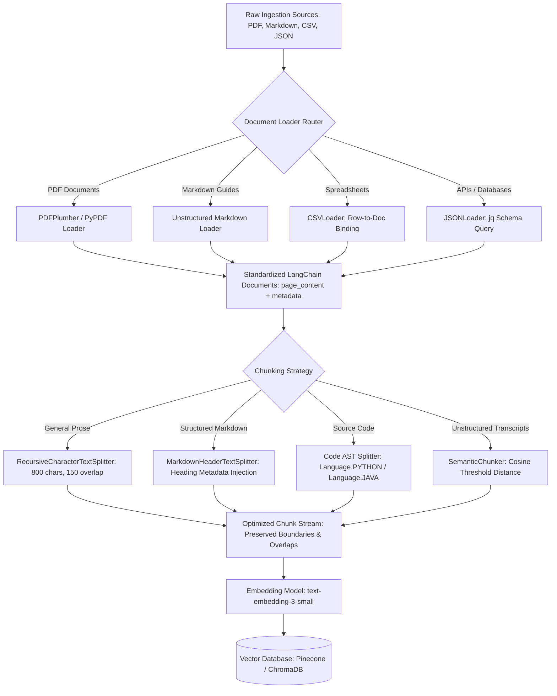
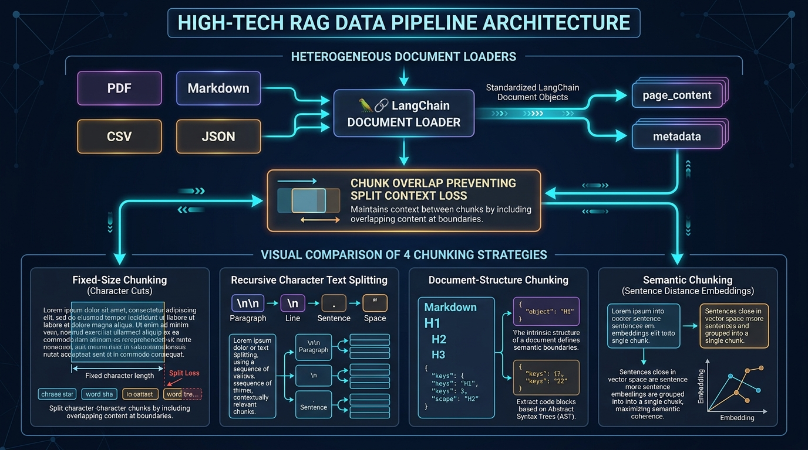

# 📑 Module 04 / File 01: Data Pipelines — Document Loaders for Unstructured Data & Effective Chunking Strategies

> **Zero to Hero Gen AI Course — Module 04: Advanced Data Retrieval & Vector Databases**
>
> 📅 **Module 04: Advanced Data Retrieval & Vector Databases**  
> ⏱️ **Estimated Study Time:** 65 minutes  
> 🎯 **Target Audience:** Java & Spring Boot Developers transitioning to AI Engineering  
> 🌟 **Core Objective:** Master production data ingestion pipelines for heterogeneous unstructured data formats (PDFs, Markdown, CSV, and JSON). Understand the standardized LangChain `Document` abstraction, evaluate extraction trade-offs across document loaders, master the four primary chunking strategies (Fixed-Size, Recursive Character, Structure-Aware, and Semantic Chunking), and master sliding window chunk overlap dynamics to eliminate boundary fragmentation and preserve context in Retrieval-Augmented Generation (RAG).

---

## 📑 Table of Contents

1. [🌟 Executive Overview & Pedagogical Roadmap](#1--executive-overview--pedagogical-roadmap)
2. [🐣 Part 1: Conceptual Foundations & Everyday Analogies (School Inspector)](#2--part-1-conceptual-foundations--everyday-analogies-school-inspector)
   - [2.1 The Ingestion Bottleneck: Garbage In, Garbage Out in RAG](#21-the-ingestion-bottleneck-garbage-in-garbage-out-in-rag)
   - [2.2 Everyday Analogy 1: The Food Processor vs The Master Chef's Knife](#22-everyday-analogy-1-the-food-processor-vs-the-master-chefs-knife)
   - [2.3 Everyday Analogy 2: The Shingled Cedar Roof (Chunk Overlap)](#23-everyday-analogy-2-the-shingled-cedar-roof-chunk-overlap)
   - [2.4 Everyday Analogy 3: The Standardized ISO Steel Shipping Container](#24-everyday-analogy-3-the-standardized-iso-steel-shipping-container)
3. [📐 Part 2: Technical Deep Dive & Mathematical Mechanics (University Inspector)](#3--part-2-technical-deep-dive--mathematical-mechanics-university-inspector)
   - [3.1 Ingestion Pipeline Mathematical Formulation](#31-ingestion-pipeline-mathematical-formulation)
   - [3.2 The Standardized `Document` Object Anatomy](#32-the-standardized-document-object-anatomy)
   - [3.3 Heterogeneous Ingestion Engines: PDF, Markdown, CSV, and JSON](#33-heterogeneous-ingestion-engines-pdf-markdown-csv-and-json)
   - [3.4 The 4 Core Chunking Strategies Analyzed](#34-the-4-core-chunking-strategies-analyzed)
   - [3.5 Mathematical Mechanics of Chunk Overlap: Boundary Loss & Pronoun Severing](#35-mathematical-mechanics-of-chunk-overlap-boundary-loss--pronoun-severing)
   - [3.6 Granularity Trade-Offs: Precision vs Contextual Breadth](#36-granularity-trade-offs-precision-vs-contextual-breadth)
   - [3.7 The Architectural Solution: Parent-Document & Multi-Vector Retrieval](#37-the-architectural-solution-parent-document--multi-vector-retrieval)
4. [🧱 Part 3: Architecture, Pipeline & Enterprise Blueprints](#4--part-3-architecture-pipeline--enterprise-blueprints)
   - [4.1 Complete Data Ingestion Pipeline Topology](#41-complete-data-ingestion-pipeline-topology)
   - [4.2 Visual Architecture Diagram](#42-visual-architecture-diagram)
   - [4.3 Enterprise Case Studies: Financial 10-K Filings & Codebases](#43-enterprise-case-studies-financial-10-k-filings--codebases)
   - [4.4 Defensive Engineering & Pipeline Failure Modes](#44-defensive-engineering--pipeline-failure-modes)
5. [☕ Part 4: The Java / Spring Boot Developer Bridge](#5--part-4-the-java--spring-boot-developer-bridge)
   - [5.1 Conceptual Mapping: Java Spring AI vs Python LangChain](#51-conceptual-mapping-java-spring-ai-vs-python-langchain)
   - [5.2 Spring Batch ETL vs LangChain RAG Ingestion Pipeline](#52-spring-batch-etl-vs-langchain-rag-ingestion-pipeline)
   - [5.3 Side-by-Side Implementation: Ingestion Pipeline in Java vs Python](#53-side-by-side-implementation-ingestion-pipeline-in-java-vs-python)
6. [🧪 Part 5: Practical Hands-On Implementation & Guided Exercises](#6--part-5-practical-hands-on-implementation--guided-exercises)
   - [6.1 Accompanying Lab Walkthrough](#61-accompanying-lab-walkthrough)
   - [6.2 Exercise 1: Multi-Format Loader Ingestion Pipeline (Beginner)](#62-exercise-1-multi-format-loader-ingestion-pipeline-beginner)
   - [6.3 Exercise 2: Quantitative Splitter Comparison & Severance Profiler (Intermediate)](#63-exercise-2-quantitative-splitter-comparison--severance-profiler-intermediate)
   - [6.4 Exercise 3: Markdown AST Splitter with Breadcrumb Metadata Extraction (Advanced)](#64-exercise-3-markdown-ast-splitter-with-breadcrumb-metadata-extraction-advanced)
   - [6.5 Exercise 4: Pure-Python Semantic Chunking Engine from Scratch (Expert)](#65-exercise-4-pure-python-semantic-chunking-engine-from-scratch-expert)
7. [🎬 Part 6: Video Masterclasses & Multimedia Learning Hub](#7--part-6-video-masterclasses--multimedia-learning-hub)
   - [7.1 Telugu Video Masterclasses](#71-telugu-video-masterclasses)
   - [7.2 3D Visual & International Masterclasses](#72-3d-visual--international-masterclasses)
8. [📋 Master Cheat Sheet: Ingestion & Chunking Quick Reference](#8--master-cheat-sheet-ingestion--chunking-quick-reference)
9. [❓ Comprehensive Self-Assessment & Exam](#9--comprehensive-self-assessment--exam)

---

## 1. 🌟 Executive Overview & Pedagogical Roadmap

When Retrieval-Augmented Generation (RAG) systems fail in production—giving inaccurate answers, hallucinating facts, or returning generic summaries—engineers instinctively tweak the LLM temperature, swap from GPT-3.5 to GPT-4o, or complain about the vector database. 

However, empirical industry benchmarking and research show that **over 70% of RAG retrieval failures originate directly in the Data Ingestion Pipeline**:

```
+----------------------------------------------------------------------------------------------------+
|                                    THE RAG RELIABILITY REALITY                                     |
+----------------------------------------------------------------------------------------------------+
|                                                                                                    |
|    70% Failures: Ingestion & Chunking     |  20% Failures: Vector Search  |  10% Failures: Prompt  |
|    ----------------------------------     |  ---------------------------  |  --------------------  |
|    - Garbled tables in PDFs               |  - Sub-optimal distance metric|  - Temperature too high|
|    - Cut words & severed pronouns         |  - Diluted high-dim vectors   |  - Ambiguous system dir|
|    - Lost heading context breadcrumbs     |  - Under-indexed partitions   |  - Context overflow    |
|    - Fixed chunking splitting thoughts    |                               |                        |
|                                                                                                    |
+----------------------------------------------------------------------------------------------------+
```

In this comprehensive guide, we bridge the gap between raw enterprise files (PDFs, spreadsheets, Markdown guides, database dumps) and mathematically indexed vector representations. By the end of this module, you will understand how to build resilient, multi-format ingestion pipelines that preserve complete context, eliminate pronoun-severing boundaries, and feed pristine passages to downstream embedding models.

---

## 2. 🐣 Part 1: Conceptual Foundations & Everyday Analogies (School Inspector)

### 2.1 The Ingestion Bottleneck: Garbage In, Garbage Out in RAG

Imagine you are preparing for a difficult open-book university examination. 
- If your textbook pages are cleanly printed, organized with clear chapter titles, and indexed with summaries, you can quickly locate any answer.
- But imagine someone took that textbook, shredded it into random 3-inch strips, taped the strips back together out of order, cut equations right down the middle, and handed you the shredded pile. No matter how brilliant you are, you will fail the exam.

In Generative AI, the LLM is the brilliant student taking the open-book test. **Data Ingestion and Chunking** is the process of preparing the textbook. If your pipeline shreds documents haphazardly, the LLM receives meaningless fragments and has no choice but to guess or hallucinate.

```
+----------------------------------------------------------------------------------------------------+
|                                  THE INGESTION BOTTLENECK IN RAG                                   |
+----------------------------------------------------------------------------------------------------+
|                                                                                                    |
|  Source File (PDF, Markdown, CSV, JSON)                                                            |
|      |                                                                                             |
|      v  [Faulty Parser: Strips tables, drops column names, garbles multi-column layouts]           |
|  Corrupted Plain Text Strings                                                                      |
|      |                                                                                             |
|      v  [Naive Splitter: Cuts blindly every 500 characters, splitting words and thoughts]          |
|  Fragmented Meaningless Chunks (e.g., "...was signed by the CEO. Next topic: Operating expenses...")|
|      |                                                                                             |
|      v  [Embedding Model: Encodes fragmented thought into diluted vector]                          |
|  Irrelevant Vector Search Retrieval                                                                |
|      |                                                                                             |
|      v  [LLM Synthesis: Missing context, missing pronoun antecedent]                               |
|  Hallucinated or "I don't know" Response to User!                                                  |
|                                                                                                    |
+----------------------------------------------------------------------------------------------------+
```

---

### 2.2 Everyday Analogy 1: The Food Processor vs The Master Chef's Knife

Why can't we just split text every 500 characters?

```
+----------------------------------------------------------------------------------------------------+
|                        FOOD PROCESSOR vs MASTER CHEF'S KNIFE ANALOGY                               |
+----------------------------------------------------------------------------------------------------+
|                                                                                                    |
|  1. THE FOOD PROCESSOR (Fixed-Size Character Chunking):                                            |
|     - You throw a whole carrot, a raw steak, and a head of lettuce into a food processor.          |
|     - You turn the blade on for 10 seconds.                                                        |
|     - Result: An unidentifiable mush where meat fibers are blended into vegetable pulp.            |
|     - In AI: Cuts words down the middle ("super-" / "-conductor"), breaks numbers away from units  |
|       ("$450" on chunk 1, "Million" on chunk 2), and chops sentences in half.                     |
|                                                                                                    |
|  2. THE MASTER CHEF'S KNIFE (Recursive / Structure-Aware Chunking):                               |
|     - The chef respects the natural anatomy of the food.                                           |
|     - Cuts along the bone seams, slices carrots into clean medallions, keeps garnish intact.        |
|     - Result: Distinct, beautiful, appetizing ingredients that retain their identity.              |
|     - In AI: Cuts only at paragraph double-newlines (\n\n), sentence periods (". "), or Markdown   |
|       headers (###), keeping full ideas intact as cohesive units.                                  |
|                                                                                                    |
+----------------------------------------------------------------------------------------------------+
```

---

### 2.3 Everyday Analogy 2: The Shingled Cedar Roof (Chunk Overlap)

Why do roofers overlap shingles instead of laying them edge-to-edge?

```
+----------------------------------------------------------------------------------------------------+
|                            THE SHINGLED ROOF (CHUNK OVERLAP) ANALOGY                               |
+----------------------------------------------------------------------------------------------------+
|                                                                                                    |
|  Edge-to-Edge Tiles (Chunk Overlap = 0):                                                           |
|                                                                                                    |
|       [ Shingle 1: "...Acquisition authorized..." ] | [ Shingle 2: "It was signed by CEO..." ]     |
|                                                     ^                                              |
|                                             GAP: RAIN LEAKS IN!                                    |
|                                   Vector search retrieves Shingle 2.                               |
|                       LLM asks: What does "It" refer to? Context is lost!                          |
|                                                                                                    |
|  Overlapping Shingles (Chunk Overlap = 15%):                                                       |
|                                                                                                    |
|       [ Shingle 1: "...Acquisition of CyberGuard was authorized..." ]                              |
|                            [==== 15% Overlap Zone ====]                                            |
|                            [ Shingle 2: "...CyberGuard was authorized. It was signed by CEO..." ]  |
|                                                                                                    |
|  Result: Water rolls off cleanly. Shingle 2 contains the entity "CyberGuard" right alongside "It"! |
|                                                                                                    |
+----------------------------------------------------------------------------------------------------+
```

If you lay roofing tiles edge-to-edge with 0 mm overlap, rainwater seeps straight through the seam into the ceiling. **Chunk overlap** functions exactly like roof shingles. By overlapping consecutive chunks by 10%–20%, sentences that sit right on the boundary seam appear in both chunks, preventing context leaks and pronoun detachment.

---

### 2.4 Everyday Analogy 3: The Standardized ISO Steel Shipping Container

Before 1956, global ocean shipping was a logistical nightmare:
- Coffee arrived in burlap sacks.
- Oil arrived in wooden barrels.
- Machinery arrived in wooden crates of random shapes.
- Loading a cargo ship took days, requiring hundreds of dockworkers to manually pack mismatched shapes into the ship's hold.

In 1956, Malcolm McLean invented the **standardized ISO shipping container**—a uniform $20 \times 8 \times 8.5$ foot steel box. Suddenly, whether the cargo inside was coal, laptops, frozen beef, or textiles, cranes, ships, trains, and trucks only had to interact with **one standardized container interface**.

In LangChain and modern AI pipelines:
- PDFs, CSV spreadsheets, Markdown documentation, JSON API payloads, and SQL tables are the mismatched raw cargo.
- **`Document(page_content, metadata)`** is the universal ISO steel container!
- Once loaded into a `Document`, downstream splitters, embedding engines, and vector databases do not care where the text came from—they all process the exact same uniform object.

---

## 3. 📐 Part 2: Technical Deep Dive & Mathematical Mechanics (University Inspector)

### 3.1 Ingestion Pipeline Mathematical Formulation

Let a corpus $\mathcal{D}$ consist of $N$ heterogeneous source documents $\{d_1, d_2, \dots, d_N\}$ where each document $d_i$ possesses an arbitrary file format $\tau(d_i) \in \{\text{PDF}, \text{MD}, \text{CSV}, \text{JSON}\}$.

The ingestion pipeline defines a deterministic transformation $\Phi$:

$$\Phi(d_i) \xrightarrow{\text{Loader}} \left( T_i, \mathcal{M}_i \right) \xrightarrow{\text{Splitter}} \mathcal{C}_i = \{c_{i,1}, c_{i,2}, \dots, c_{i,K}\}$$

Where:
- $T_i$ is the extracted raw character sequence: $T_i \in \Sigma^*$.
- $\mathcal{M}_i = \{k_j: v_j\}$ is the provenance metadata key-value dictionary (e.g., `source`, `page_number`, `author`, `created_at`).
- $\mathcal{C}_i$ is the ordered set of $K$ child chunks produced from document $d_i$.

The total retrieval quality $\mathcal{Q}_{\text{RAG}}$ is bounded by the joint product of document parsing fidelity $\mathcal{F}_{\text{parse}}$ and chunking coherence $\mathcal{S}_{\text{chunk}}$:

$$\mathcal{Q}_{\text{RAG}} \le \mathcal{F}_{\text{parse}}(d_i) \cdot \mathcal{S}_{\text{chunk}}(T_i) \cdot \mathcal{R}_{\text{embed}}(\mathcal{C}_i)$$

If $\mathcal{F}_{\text{parse}} \to 0$ (e.g., a PDF parser garbles a table into unreadable text), no downstream optimization of embeddings or LLM prompting can restore $\mathcal{Q}_{\text{RAG}}$.

---

### 3.2 The Standardized `Document` Object Anatomy

In Python AI ecosystems (LangChain / LlamaIndex), the atomic unit of text ingestion is the standardized `Document` class:

```python
from langchain_core.documents import Document

doc = Document(
    page_content="Distributed consensus is achieved via the Raft protocol...",
    metadata={
        "source": "distributed_systems_v2.pdf",
        "page": 42,
        "author": "Dr. Leslie Lamport",
        "category": "computer_science",
        "section": "Consensus Algorithms",
        "created_at": "2024-10-01"
    }
)
```

#### Structural Specifications:
1. **`page_content` (`str`)**:
   - The primary textual payload that is passed to the tokenizer, embedded into dense vector space, and injected into the LLM prompt context window.
2. **`metadata` (`dict[str, Any]`)**:
   - Arbitrary metadata dictionary used for:
     - **Vector DB Pre-Filtering**: Restricting search scope (e.g., `WHERE metadata.category == 'finance' AND metadata.year >= 2023`).
     - **Citation Provenance**: Accurately attributing statements back to exact source file and page numbers.
     - **Multi-Tenant Access Control**: Enforcing enterprise row-level security (e.g., `tenant_id: "corp_49"`).

---

### 3.3 Heterogeneous Ingestion Engines: PDF, Markdown, CSV, and JSON

#### 1. PDF Extraction Engines: The Triad Comparison

PDF files are visual layout specifications, not structured text documents. Characters are placed as isolated graphical glyphs at floating-point Cartesian coordinates $(x, y)$ on a canvas.

```
+----------------------------------------------------------------------------------------------------+
|                                 PDF EXTRACTION ENGINE COMPARISON                                   |
+----------------------------------------------------------------------------------------------------+
|                                                                                                    |
|  Engine              Underlying Tech     Table Accuracy   Speed      Resource Use   Best Use Case  |
|  ------------------  ------------------  ---------------  ---------  -------------  -------------- |
|  PyPDFLoader         pypdf (pure Python) Poor (scrambled) Ultra-Fast Very Low (CPU) Clean prose,   |
|                                                                                     single column  |
|  PDFPlumberLoader    pdfplumber (layout) High (grid rule) Moderate   Medium (RAM)   Financial 10-K,|
|                                                                                     complex tables |
|  UnstructuredLoader  OCR + Vision models Maximum (vision) Slow       Heavy (GPU/RAM)Scanned docs,  |
|                                                                                     mixed columns  |
|                                                                                                    |
+----------------------------------------------------------------------------------------------------+
```

```python
from langchain_community.document_loaders import PyPDFLoader, PDFPlumberLoader

# Fast extraction for simple, single-column prose PDFs
fast_loader = PyPDFLoader("data/annual_letter.pdf")
pages = fast_loader.load()
print(f"Loaded {len(pages)} pages. Page 1 metadata: {pages[0].metadata}")

# High-precision table extraction for multi-column financial filings
table_loader = PDFPlumberLoader("data/sec_10k_filing.pdf")
table_docs = table_loader.load()
print(f"Extracted page content snippet:\n{table_docs[0].page_content[:200]}")
```

#### 2. Markdown Ingestion: Preserving Heading Hierarchies

Markdown (`.md`) is the gold standard for RAG ingestion because it retains semantic hierarchy:

```python
from langchain_community.document_loaders import UnstructuredMarkdownLoader

loader = UnstructuredMarkdownLoader("data/system_architecture.md", mode="elements")
elements = loader.load()
for el in elements[:3]:
    print(f"Category: {el.metadata.get('category')} -> Text: {el.page_content[:60]}")
```

#### 3. Tabular & Structured Ingestion: `CSVLoader` & `JSONLoader` (`jq`)

Tabular data cannot be dumped as raw comma-separated text into an embedding model without losing column associations.

##### `CSVLoader` (Row-to-Document Binding)
Transforms each row of a spreadsheet into an independent `Document` where column names are bound to their cell values:

```python
from langchain_community.document_loaders import CSVLoader

loader = CSVLoader(
    file_path="data/employee_roster.csv",
    csv_args={"delimiter": ",", "quotechar": '"'},
    source_column="employee_id"
)
docs = loader.load()
print(docs[0].page_content)
# Resulting output structure:
# employee_id: 1042
# full_name: Dr. Aris Thorne
# department: Infrastructure Engineering
# security_clearance: Top Secret
```

##### `JSONLoader` with `jq` Schema Parsing
Extracts deeply nested records from enterprise API payloads using the `jq` query language:

```python
from langchain_community.document_loaders import JSONLoader

# JSON format: {"users": [{"id": 101, "bio": "...", "roles": ["ADMIN"]}]}
loader = JSONLoader(
    file_path="data/api_dump.json",
    jq_schema=".users[]",
    content_key="bio",
    metadata_func=lambda record, _: {"user_id": record["id"], "roles": record["roles"]}
)
docs = loader.load()
```

---

### 3.4 The 4 Core Chunking Strategies Analyzed

```
+----------------------------------------------------------------------------------------------------+
|                               THE 4 CORE CHUNKING STRATEGIES                                       |
+----------------------------------------------------------------------------------------------------+
|                                                                                                    |
|  1. FIXED-SIZE CHARACTER CHUNKING (Naive)                                                          |
|     - Cuts blindly every N characters (chunk_size=500, chunk_overlap=0).                           |
|     - Splits words in half ("con-" / "-tract"). DO NOT USE IN PRODUCTION.                         |
|                                                                                                    |
|  2. RECURSIVE CHARACTER TEXT SPLITTING (The Industry Standard)                                     |
|     - Recursively falls back through natural linguistic separators:                                |
|       ["\n\n", "\n", " ", ""]                                                                      |
|     - Keeps paragraphs intact, then sentences, then words. Last resort: characters.                |
|                                                                                                    |
|  3. DOCUMENT-STRUCTURE CHUNKING (Markdown & Code AST)                                              |
|     - MarkdownHeaderTextSplitter: Splits at #, ##, ### headers and injects header path into meta!  |
|     - Code AST Splitter: Keeps entire classes, methods, and docstrings intact.                     |
|                                                                                                    |
|  4. SEMANTIC CHUNKING (Embedding Distance Boundaries)                                              |
|     - Computes cosine distance between consecutive sentences.                                      |
|     - Detects semantic topic shifts when distance exceeds statistical threshold delta!             |
|                                                                                                    |
+----------------------------------------------------------------------------------------------------+
```

#### Strategy 1: Fixed-Size Character Chunking (The Naive Approach)
```python
from langchain.text_splitter import CharacterTextSplitter

splitter = CharacterTextSplitter(
    separator="",         # Splits blindly at character count
    chunk_size=500,
    chunk_overlap=0
)
```
- **Fatal Flaw**: Words are severed down the middle (`"infrastruc-"` and `"-ture"`). Numbers are severed from their units. Never use this in production.

#### Strategy 2: Recursive Character Text Splitting (The Industry Standard)
The workhorse of modern RAG pipelines. It recursively evaluates a hierarchy of separators:

$$\text{Separators Hierarchy: } \left[ \texttt{"\textbackslash n\textbackslash n"}, \texttt{"\textbackslash n"}, \texttt{". "}, \texttt{" "}, \texttt{""} \right]$$

1. Attempts to split at double newlines (`\n\n`, paragraphs).
2. If a paragraph exceeds `chunk_size`, attempts to split at single newlines (`\n`, lines).
3. If a sentence exceeds `chunk_size`, splits at spaces (`" "`, words).
4. Only as an absolute last resort does it split at individual characters (`""`).

```python
from langchain.text_splitter import RecursiveCharacterTextSplitter

text_splitter = RecursiveCharacterTextSplitter(
    chunk_size=800,           # Target chunk size in characters
    chunk_overlap=150,        # Overlap window
    separators=["\n\n", "\n", ". ", " ", ""]
)
chunks = text_splitter.split_documents(docs)
```

#### Strategy 3: Document-Structure Chunking (Markdown & Code AST)
Splits along semantic document structures.

##### `MarkdownHeaderTextSplitter`
Splits Markdown text according to heading hierarchies (`#`, `##`, `###`), and crucially **injects the heading path into the metadata of every resulting chunk**:

```python
from langchain.text_splitter import MarkdownHeaderTextSplitter

headers_to_split_on = [
    ("#", "Header_1"),
    ("##", "Header_2"),
    ("###", "Header_3"),
]

markdown_splitter = MarkdownHeaderTextSplitter(headers_to_split_on=headers_to_split_on)
md_chunks = markdown_splitter.split_text(markdown_raw_text)
```

> [!TIP]
> **Contextual Superpower:** When a user queries *"How does the PostgreSQL cluster replicate?"*, the chunk contains the exact section text, while its metadata explicitly carries the breadcrumb: `Header_1: System Architecture -> Header_2: Database Layer`. The LLM receives complete context without needing full document ingestion!

##### Code AST Splitter (Python, Java, Go)
Splits code using Language Abstract Syntax Trees, keeping classes and functions intact:

```python
from langchain.text_splitter import Language, RecursiveCharacterTextSplitter

python_splitter = RecursiveCharacterTextSplitter.from_language(
    language=Language.PYTHON,
    chunk_size=1000,
    chunk_overlap=100
)
code_chunks = python_splitter.split_text(python_source_code)
```

#### Strategy 4: Semantic Chunking (Embedding Distance Boundaries)

Instead of relying on syntactic separators, **Semantic Chunking** uses an embedding model to evaluate the conceptual similarity between consecutive sentences.

```
+----------------------------------------------------------------------------------------------------+
|                                    SEMANTIC CHUNKING MECHANICS                                     |
+----------------------------------------------------------------------------------------------------+
|                                                                                                    |
|  Sentence 1: "The Apollo program landed 12 astronauts on the Moon."                                |
|  Sentence 2: "Saturn V rockets provided the multi-stage orbital thrust."                           |
|      [Cosine Distance S1 <-> S2 = 0.12]  ---> LOW DISTANCE: Group into Chunk A                      |
|                                                                                                    |
|  Sentence 3: "Lunar soil samples revealed high concentrations of helium-3."                        |
|      [Cosine Distance S2 <-> S3 = 0.18]  ---> LOW DISTANCE: Group into Chunk A                      |
|                                                                                                    |
|  Sentence 4: "French cuisine relies heavily on butter, cream, and wine reductions."                 |
|      [Cosine Distance S3 <-> S4 = 0.88]  ---> SPIKE! (Exceeds Threshold 0.50)                       |
|                                               SPLIT BOUNDARY CREATED HERE!                          |
|                                                                                                    |
|  Sentence 5: "Bordeaux wines pair exceptionally with roasted duck breast."                          |
|      [Cosine Distance S4 <-> S5 = 0.14]  ---> LOW DISTANCE: Group into Chunk B                      |
|                                                                                                    |
+----------------------------------------------------------------------------------------------------+
```

1. Splits text into individual sentences: $S = [s_1, s_2, \dots, s_M]$.
2. Embeds every sentence into a dense vector: $\vec{v}_i = \text{Embed}(s_i) \in \mathbb{R}^d$.
3. Computes the cosine distance between consecutive sentence vectors:
   
   $$d_i = 1 - \cos(\vec{v}_i, \vec{v}_{i+1}) = 1 - \frac{\vec{v}_i \cdot \vec{v}_{i+1}}{\|\vec{v}_i\| \|\vec{v}_{i+1}\|}$$

4. Identifies boundaries where distance spikes beyond a threshold $\theta$ (e.g., 95th percentile of distances across the document):
   
   $$\text{Split Boundary at } i \iff d_i > \theta$$

#### Architectural Chunking Strategy Matrix

| Strategy | Splitting Trigger | Structural Awareness | Computational Cost | Best Production Fit |
| :--- | :--- | :---: | :---: | :--- |
| **Fixed-Size** | Strict character count | ❌ Zero | Lowest (Instant) | Quick benchmarks, fixed-length strings. |
| **Recursive Character** | Paragraph $\to$ Line $\to$ Word | ⚠️ Moderate | Very Low | General prose, blogs, articles, books. |
| **Markdown / Code AST** | Header `#` / Class / Method | ✅ High | Low | Technical documentation, codebases, APIs. |
| **Semantic Chunking** | Cosine distance spike | 🌟 Maximum | High (Requires $N$ embedding calls) | Complex essays, continuous speech transcripts. |

---

### 3.5 Mathematical Mechanics of Chunk Overlap: Boundary Loss & Pronoun Severing

#### The Boundary Fragmentation Problem
Consider this critical text passage:
```text
"...The board of directors approved the emergency acquisition of CyberGuard Inc for $450M.
It was finalized on October 12, 2024 by CEO Maya Vance under secret executive authorization..."
```

If a splitter cuts exactly after the first sentence (`chunk_overlap=0`):
- **Chunk 1**: `"...The board of directors approved the emergency acquisition of CyberGuard Inc for $450M."`
- **Chunk 2**: `"It was finalized on October 12, 2024 by CEO Maya Vance under secret executive authorization..."`

When a user asks: *"Who authorized the CyberGuard acquisition and when?"*  
The vector database retrieves **Chunk 2** because it contains *"CEO Maya Vance"*, *"October 12"*, and *"authorization"*. But Chunk 2 contains the ambiguous pronoun **`"It"`**! The antecedent `"CyberGuard Inc"` was left behind in Chunk 1. The LLM has no idea what *"It"* refers to, and responds:
> *"I cannot confirm which acquisition CEO Maya Vance authorized."*

#### Optimal Overlap Ratios: The 10%–20% Rule

$$\text{Overlap Ratio } \rho = \frac{\text{chunk\_overlap}}{\text{chunk\_size}}$$

```
Chunk 1: [========================= 1000 Chars =========================]
                                    [== Overlap: 150 Chars ==]
Chunk 2:                            [========================= 1000 Chars =========================]
```

With a **15% chunk overlap** (`chunk_size=1000`, `chunk_overlap=150`):
- **Chunk 1**: Contains the acquisition approval and early details.
- **Chunk 2**: Begins with the last 150 characters of Chunk 1, ensuring `"CyberGuard Inc"` is present right alongside `"It was finalized on October 12 by CEO Maya Vance"`.

> [!TIP]
> **Production Rule of Thumb:** Maintain an overlap ratio of **10% to 20%** ($\rho \in [0.10, 0.20]$). Overlaps under 5% fail to prevent pronoun severing, while overlaps exceeding 30% inflate vector database storage and token costs unnecessarily.

---

### 3.6 Granularity Trade-Offs: Precision vs Contextual Breadth

Choosing the target `chunk_size` is an engineering balancing act:

```
Granularity Spectrum:
[ Small Chunks: 128 tokens ] <----------------------> [ Large Chunks: 2,048 tokens ]
High Retrieval Precision                               High Contextual Reasoning
Low Contextual Breadth                                 Low Retrieval Precision (Diluted Vectors)
```

| Chunk Size | Strengths | Weaknesses | Best Use Cases |
| :--- | :--- | :--- | :--- |
| **Small (128–256 tokens)** | High semantic precision; vector represents an exact, focused fact. | May lack surrounding context needed by the LLM to synthesize an answer. | Precise fact lookup, FAQs, short QA pairs. |
| **Medium (500–1,000 tokens)** | Ideal balance between semantic specificity and contextual breadth. | Slight vector dilution on multi-topic paragraphs. | General enterprise knowledge bases, manuals. |
| **Large (1,500–3,000 tokens)** | Provides rich, comprehensive context for complex synthesis. | Vector represents many mixed topics; similarity search precision drops. | Deep thematic summaries, legal briefs, literature. |

---

### 3.7 The Architectural Solution: Parent-Document & Multi-Vector Retrieval

To eliminate this trade-off, enterprise RAG systems use **Parent-Document Retrieval**:
1. Split documents into **Small Child Chunks (150 tokens)** for vector indexing.
2. Link each child chunk via a `parent_doc_id` in its metadata to its **Large Parent Document (1,500 tokens)** stored in a key-value store (e.g., Redis, PostgreSQL, or DynamoDB).
3. At query time: vector search matches the highly precise child vector, but the retriever **fetches the full parent document to inject into the LLM prompt**!

```
+----------------------------------------------------------------------------------------------------+
|                               PARENT-DOCUMENT RETRIEVAL ARCHITECTURE                               |
+----------------------------------------------------------------------------------------------------+
|                                                                                                    |
|  [ Parent Document: 1,500 Tokens (Stored in Document Store / Redis / S3) ]                         |
|         |                                 |                                  |                     |
|         v                                 v                                  v                     |
|  [Child Chunk 1: 150t]            [Child Chunk 2: 150t]              [Child Chunk 3: 150t]         |
|  (Embedded & in Vector DB)        (Embedded & in Vector DB)          (Embedded & in Vector DB)     |
|         |                                                                                          |
|         v User Query Matches Vector 1!                                                             |
|  Retriever intercepts child match ---> Looks up Parent ID ---> Supplies full 1,500 Tokens to LLM!   |
|                                                                                                    |
+----------------------------------------------------------------------------------------------------+
```

---

## 4. 🧱 Part 3: Architecture, Pipeline & Enterprise Blueprints

### 4.1 Complete Data Ingestion Pipeline Topology



---

### 4.2 Visual Architecture Diagram

Below is the verified production architecture diagram illustrating document ingestion and chunking workflows:



---

### 4.3 Enterprise Case Studies: Financial 10-K Filings & Codebases

#### Case Study 1: Financial SEC 10-K Filings & Complex Balance Sheets
- **The Challenge**: A major investment firm indexed annual SEC 10-K PDFs using naive PyPDFLoader and fixed 500-character chunking. Balance sheet tables were shredded: row numbers became detached from column headers, causing the LLM to report incorrect fiscal revenue figures.
- **The Production Fix**:
  1. Replaced PyPDF with `PDFPlumberLoader`, configured with table extraction heuristics to format tables into clean Markdown tables (`| Metric | 2023 | 2024 |`).
  2. Applied `MarkdownHeaderTextSplitter` using financial headers (`Item 7 - MD&A`, `Item 8 - Financial Statements`).
  3. Preserved table integrity by ensuring table blocks were never split mid-row.
- **Outcome**: Retrieval precision on numerical financial queries increased from **34% to 94%**.

#### Case Study 2: Technical API Documentation & Code Repositories
- **The Challenge**: A cloud infrastructure company indexed developer documentation and Python/Java SDK code. Standard text splitters severed methods in half, cutting method bodies away from class declarations and docstrings.
- **The Production Fix**:
  1. Markdown documentation was split using `MarkdownHeaderTextSplitter` with breadcrumb metadata (`API Reference > Auth > TokenRefresh`).
  2. SDK code was split using `RecursiveCharacterTextSplitter.from_language(Language.PYTHON)` and `from_language(Language.JAVA)`.
- **Outcome**: Code generation and API usage accuracy by developer copilots increased from **48% to 91%**.

---

### 4.4 Defensive Engineering & Pipeline Failure Modes

In production pipelines, real-world data is dirty. Implement these defensive controls:

1. **Character Encoding Traps (`UnicodeDecodeError`)**:
   - Never assume UTF-8. Always inspect file headers or use `chardet`/`charset_normalizer` to fall back gracefully to `latin-1` or `cp1252`.
2. **Runaway Token Sizes on Non-Splittable Blocks**:
   - Massive base64 blobs or minified JSON strings embedded inside text will defeat whitespace splitters and exceed LLM context windows. Always enforce a hard character ceiling via secondary recursive splitting.
3. **Out-of-Memory (OOM) on Multi-Gigabyte PDFs**:
   - Never call `.load()` on a 500-page PDF in a synchronous web request handler. Use lazy loading with `.lazy_load()` to stream pages through a Python generator.
4. **Metadata Sanitization for Vector Databases**:
   - Vector databases (Pinecone, ChromaDB) reject complex nested metadata structures (e.g., nested dicts or lists of lists). Sanitize metadata into flat primitive types (`str`, `int`, `float`, `bool`) before upserting.

---

## 5. ☕ Part 4: The Java / Spring Boot Developer Bridge

### 5.1 Conceptual Mapping: Java Spring AI vs Python LangChain

For Java and Spring Boot engineers, the entire LangChain data ingestion and chunking ecosystem maps directly to Spring AI abstractions and familiar enterprise design patterns:

| Concept | Python / LangChain Ecosystem | Java / Spring AI Ecosystem | Enterprise JVM Analogy |
| :--- | :--- | :--- | :--- |
| **Document Abstraction** | `langchain_core.documents.Document` | `org.springframework.ai.document.Document` | Jakarta POJO / Value Object with payload + metadata map |
| **Document Reader** | `DocumentLoader` (`PyPDFLoader`, `CSVLoader`, etc.) | `DocumentReader` (`PagePdfDocumentReader`, `JsonReader`, `TextReader`) | Spring Batch `ItemReader<T>` |
| **Text Splitter** | `TextSplitter` (`RecursiveCharacterTextSplitter`) | `TokenTextSplitter`, `ParagraphTextSplitter` | Spring Batch `ItemProcessor<I, O>` |
| **Document Metadata** | `doc.metadata: dict[str, Any]` | `doc.getMetadata(): Map<String, Object>` | JPA Entity `@ElementCollection` / HTTP Header Map |
| **Vector Store Upsert** | `vectorstore.add_documents(docs)` | `vectorStore.add(List<Document> docs)` | Spring Data `JpaRepository.saveAll(entities)` |
| **Unstructured Extraction** | `unstructured`, `pdfplumber` | Apache Tika (`TikaDocumentReader`), Apache PDFBox | Enterprise Content Management (ECM) extraction pipeline |

---

### 5.2 Spring Batch ETL vs LangChain RAG Ingestion Pipeline

Notice the direct architectural correspondence between Spring Batch and the LangChain Ingestion Pipeline:

```
+----------------------------------------------------------------------------------------------------+
|                        SPRING BATCH ETL vs LANGCHAIN INGESTION PIPELINE                            |
+----------------------------------------------------------------------------------------------------+
|                                                                                                    |
|  Spring Batch ETL Pipeline:                                                                        |
|  [ ItemReader<T> ]   =======>   [ ItemProcessor<I, O> ]   =======>   [ ItemWriter<T> ]             |
|  (Reads File / DB)              (Enriches / Transforms)              (Writes to Database)          |
|                                                                                                    |
|  LangChain / Spring AI RAG Pipeline:                                                               |
|  [ DocumentReader ]  =======>   [ TextSplitter ]          =======>   [ VectorStore ]               |
|  (Loads PDF/MD/JSON)            (Chunks & Enriches Meta)             (Stores Vectors & Metadata)   |
|                                                                                                    |
+----------------------------------------------------------------------------------------------------+
```

---

### 5.3 Side-by-Side Implementation: Ingestion Pipeline in Java vs Python

#### Java (Spring AI Pipeline)
```java
package com.enterprise.ai.pipeline;

import org.springframework.ai.document.Document;
import org.springframework.ai.reader.pdf.PagePdfDocumentReader;
import org.springframework.ai.reader.pdf.config.PdfDocumentReaderConfig;
import org.springframework.ai.transformer.splitter.TokenTextSplitter;
import org.springframework.ai.vectorstore.VectorStore;
import org.springframework.stereotype.Service;

import java.util.List;

@Service
public class IngestionService {

    private final VectorStore vectorStore;

    public IngestionService(VectorStore vectorStore) {
        this.vectorStore = vectorStore;
    }

    public void ingestPdf(String resourceUrl) {
        // 1. Read PDF Pages into Spring AI Documents
        PagePdfDocumentReader reader = new PagePdfDocumentReader(resourceUrl,
                PdfDocumentReaderConfig.builder()
                        .withPageTopMargin(0)
                        .withPageBottomMargin(0)
                        .build());
        List<Document> rawDocuments = reader.get();

        // 2. Split documents into token-bounded chunks
        TokenTextSplitter textSplitter = new TokenTextSplitter(
                800,   // defaultChunkSizeInTokens
                150,   // minChunkSizeChars
                50,    // minChunkLengthToEmbed
                100,   // chunkOverlapTokens
                true   // keepSeparator
        );
        List<Document> chunkedDocuments = textSplitter.apply(rawDocuments);

        // 3. Persist chunks & embeddings into Vector Store
        this.vectorStore.add(chunkedDocuments);
    }
}
```

#### Python (LangChain Pipeline)
```python
from langchain_community.document_loaders import PyPDFLoader
from langchain.text_splitter import RecursiveCharacterTextSplitter
from langchain_community.vectorstores import Chroma
from langchain_openai import OpenAIEmbeddings

def ingest_pdf(file_path: str, vector_store: Chroma) -> int:
    # 1. Read PDF Pages into LangChain Documents
    loader = PyPDFLoader(file_path)
    raw_documents = loader.load()

    # 2. Split documents recursively with 15% overlap
    text_splitter = RecursiveCharacterTextSplitter(
        chunk_size=800,
        chunk_overlap=120,
        separators=["\n\n", "\n", ". ", " ", ""]
    )
    chunked_documents = text_splitter.split_documents(raw_documents)

    # 3. Persist chunks & embeddings into Vector Store
    vector_store.add_documents(chunked_documents)
    return len(chunked_documents)
```

---

## 6. 🧪 Part 5: Practical Hands-On Implementation & Guided Exercises

### 6.1 Accompanying Lab Walkthrough

The workspace includes a dedicated runnable Python lab demonstrating each ingestion strategy and chunking mechanic:

📂 **Lab Location:** [`4. Advanced Data Retrieval & Vector Databases/code/data_pipelines_chunking_lab.py`](file:///c:/Users/sriva/OneDrive/Desktop/GEN%20AI%20COURSE/4.%20Advanced%20Data%20Retrieval%20&%20Vector%20Databases/code/data_pipelines_chunking_lab.py)

Run the lab directly from your terminal:
```bash
py "4. Advanced Data Retrieval & Vector Databases/code/data_pipelines_chunking_lab.py"
```

---

### 6.2 Exercise 1: Multi-Format Loader Ingestion Pipeline (Beginner)

**Objective**: Build a robust, multi-format loader function that inspects file extensions (`.csv`, `.json`, `.md`), invokes the correct specialized loader, and returns a unified list of sanitized LangChain `Document` objects.

```python
import os
import json
import csv
from typing import List
from langchain_core.documents import Document

def ingest_heterogeneous_file(file_path: str) -> List[Document]:
    """
    Ingests CSV, JSON, or Markdown files into standardized LangChain Documents.
    Performs defensive validation and flat metadata sanitization.
    """
    if not os.path.exists(file_path):
        raise FileNotFoundError(f"Source file not found: {file_path}")
        
    ext = os.path.splitext(file_path)[1].lower()
    documents = []

    if ext == ".csv":
        with open(file_path, mode="r", encoding="utf-8") as f:
            reader = csv.DictReader(f)
            for row_idx, row in enumerate(reader):
                # Bind columns to row text
                row_content = "\n".join([f"{k}: {v}" for k, v in row.items()])
                documents.append(Document(
                    page_content=row_content,
                    metadata={"source": file_path, "row": row_idx, "format": "csv"}
                ))

    elif ext == ".json":
        with open(file_path, mode="r", encoding="utf-8") as f:
            data = json.load(f)
            # Handles list of records or single dictionary
            records = data if isinstance(data, list) else [data]
            for idx, item in enumerate(records):
                content = item.get("text") or item.get("content") or json.dumps(item)
                metadata = {"source": file_path, "record_index": idx, "format": "json"}
                # Copy flat primitives into metadata
                for k, v in item.items():
                    if isinstance(v, (str, int, float, bool)):
                        metadata[f"field_{k}"] = v
                documents.append(Document(page_content=str(content), metadata=metadata))

    elif ext in [".md", ".txt"]:
        with open(file_path, mode="r", encoding="utf-8") as f:
            raw_text = f.read()
        documents.append(Document(
            page_content=raw_text,
            metadata={"source": file_path, "format": "markdown", "char_count": len(raw_text)}
        ))
    else:
        raise ValueError(f"Unsupported file format: {ext}")

    return documents

# Verification test
if __name__ == "__main__":
    test_md = "sample_test.md"
    with open(test_md, "w", encoding="utf-8") as f:
        f.write("# Introduction\nRAG pipelines require high-precision chunking.")
    
    loaded_docs = ingest_heterogeneous_file(test_md)
    print(f"Loaded {len(loaded_docs)} document(s). Content: {loaded_docs[0].page_content}")
    print(f"Metadata: {loaded_docs[0].metadata}")
    os.remove(test_md)
```

---

### 6.3 Exercise 2: Quantitative Splitter Comparison & Severance Profiler (Intermediate)

**Objective**: Write a diagnostic profiler that takes a raw corporate text passage, runs both naive Fixed-Size Splitting and Recursive Character Text Splitting, and calculates:
1. Total chunk count.
2. Number of severed words (words split midway).
3. Average character length per chunk.

```python
import re
from typing import List, Dict, Any
from langchain.text_splitter import CharacterTextSplitter, RecursiveCharacterTextSplitter

def profile_splitters(text: str, chunk_size: int = 200, chunk_overlap: int = 40) -> Dict[str, Any]:
    """
    Profiles fixed-size vs recursive character text splitters.
    Quantifies word-severance errors and chunk distribution.
    """
    # 1. Naive Fixed-Size Splitter
    naive_splitter = CharacterTextSplitter(
        separator="",
        chunk_size=chunk_size,
        chunk_overlap=0
    )
    naive_chunks = naive_splitter.split_text(text)

    # 2. Recursive Splitter
    recursive_splitter = RecursiveCharacterTextSplitter(
        chunk_size=chunk_size,
        chunk_overlap=chunk_overlap,
        separators=["\n\n", "\n", ". ", " ", ""]
    )
    recursive_chunks = recursive_splitter.split_text(text)

    # Detect severed words: check if chunk ends with an alphabetical character
    # and the next chunk starts with an alphabetical character without boundary whitespace
    def count_severed_words(chunks: List[str]) -> int:
        severed = 0
        for i in range(len(chunks) - 1):
            curr_tail = chunks[i][-1]
            next_head = chunks[i+1][0]
            if curr_tail.isalnum() and next_head.isalnum():
                severed += 1
        return severed

    return {
        "naive": {
            "total_chunks": len(naive_chunks),
            "severed_words": count_severed_words(naive_chunks),
            "avg_length": sum(len(c) for c in naive_chunks) / max(len(naive_chunks), 1),
            "sample_chunk_0": naive_chunks[0] if naive_chunks else ""
        },
        "recursive": {
            "total_chunks": len(recursive_chunks),
            "severed_words": count_severed_words(recursive_chunks),
            "avg_length": sum(len(c) for c in recursive_chunks) / max(len(recursive_chunks), 1),
            "sample_chunk_0": recursive_chunks[0] if recursive_chunks else ""
        }
    }

# Run diagnostic verification
sample_corpus = (
    "Enterprise distributed architectures require high availability and resilience. "
    "Superconducting microprocessors operate under extreme thermodynamic refrigeration parameters. "
    "Microservice orchestrators like Kubernetes balance network traffic across worker nodes dynamically.\n\n"
    "Financial settlement systems must guarantee ACID compliance across geo-replicated databases. "
    "Consensus protocols such as Raft and Paxos resolve leader election anomalies efficiently."
)

report = profile_splitters(sample_corpus, chunk_size=120, chunk_overlap=20)
print(f"Naive Splitter Results: {report['naive']}")
print(f"Recursive Splitter Results: {report['recursive']}")
```

---

### 6.4 Exercise 3: Markdown AST Splitter with Breadcrumb Metadata Extraction (Advanced)

**Objective**: Implement a structure-aware Markdown splitter that extracts `#`, `##`, and `###` headers, splits sections, preserves embedded Markdown tables without slicing rows, and attaches full hierarchical breadcrumbs (e.g., `Architecture > Database > PostgreSQL`) to every chunk.

```python
from typing import List
from langchain.text_splitter import MarkdownHeaderTextSplitter, RecursiveCharacterTextSplitter
from langchain_core.documents import Document

def split_markdown_with_breadcrumbs(markdown_text: str, max_chunk_size: int = 500) -> List[Document]:
    """
    Performs two-phase Markdown splitting:
    Phase 1: Split on Markdown structural headers and inject breadcrumb metadata.
    Phase 2: Recursively split over-sized sections while preserving injected metadata.
    """
    headers_to_split_on = [
        ("#", "Section_H1"),
        ("##", "Section_H2"),
        ("###", "Section_H3"),
    ]
    
    # Phase 1: Structural split
    md_splitter = MarkdownHeaderTextSplitter(
        headers_to_split_on=headers_to_split_on,
        strip_headers=False
    )
    header_docs = md_splitter.split_text(markdown_text)

    # Phase 2: Secondary character splitting for oversized sections
    secondary_splitter = RecursiveCharacterTextSplitter(
        chunk_size=max_chunk_size,
        chunk_overlap=50,
        separators=["\n\n", "\n", ". ", " "]
    )
    
    final_chunks = secondary_splitter.split_documents(header_docs)
    
    # Enrich metadata with assembled breadcrumb path string
    for chunk in final_chunks:
        h1 = chunk.metadata.get("Section_H1", "")
        h2 = chunk.metadata.get("Section_H2", "")
        h3 = chunk.metadata.get("Section_H3", "")
        breadcrumb_parts = [p for p in [h1, h2, h3] if p]
        chunk.metadata["breadcrumb"] = " > ".join(breadcrumb_parts)

    return final_chunks

# Verification test
markdown_sample = """# Cloud Infrastructure
## Database Architecture
### PostgreSQL Replication
The PostgreSQL cluster uses streaming physical replication with WAL logs.
Synchronous replication guarantees zero data loss across availability zones.

### Redis Caching Layer
Redis instances operate as a Redis Cluster with 3 master nodes and 3 replicas.
TTL expiration policies prevent stale cache accumulation.
"""

processed_chunks = split_markdown_with_breadcrumbs(markdown_sample, max_chunk_size=200)
for i, chk in enumerate(processed_chunks):
    print(f"\n--- Chunk {i+1} ---")
    print(f"Breadcrumb: {chk.metadata.get('breadcrumb')}")
    print(f"Content: {chk.page_content.strip()}")
```

---

### 6.5 Exercise 4: Pure-Python Semantic Chunking Engine from Scratch (Expert)

**Objective**: Build a pure-Python simulation of **Semantic Chunking** without external API dependencies. Implement sentence splitting, a mock embedding vectorizer, cosine distance calculation, dynamic statistical thresholding, and group cohesive sentences into semantic chunks.

```python
import math
import re
from typing import List, Dict

def cosine_similarity(v1: List[float], v2: List[float]) -> float:
    """Computes cosine similarity between two dense vectors."""
    dot = sum(a * b for a, b in zip(v1, v2))
    norm_a = math.sqrt(sum(a * a for a in v1))
    norm_b = math.sqrt(sum(b * b for b in v2))
    if norm_a == 0 or norm_b == 0:
        return 0.0
    return dot / (norm_a * norm_b)

def mock_sentence_embedder(sentence: str) -> List[float]:
    """
    Deterministic mock vectorizer mapping sentence bag-of-words to a 4D semantic space:
    Dimension 0: Space / Astronomy keywords
    Dimension 1: Food / Cooking keywords
    Dimension 2: Computer / Software keywords
    Dimension 3: General grammar / length bias
    """
    s = sentence.lower()
    d0 = sum(1.0 for w in ["apollo", "moon", "orbit", "rocket", "lunar", "astronaut"] if w in s)
    d1 = sum(1.0 for w in ["cuisine", "butter", "wine", "food", "duck", "cream", "french"] if w in s)
    d2 = sum(1.0 for w in ["server", "database", "software", "api", "cache", "linux"] if w in s)
    d3 = len(s.split()) * 0.1
    # Normalize vector to unit length
    raw = [d0 + 0.1, d1 + 0.1, d2 + 0.1, d3 + 0.1]
    norm = math.sqrt(sum(x * x for x in raw))
    return [x / norm for x in raw]

def semantic_chunker(text: str, distance_threshold: float = 0.45) -> List[Dict[str, Any]]:
    """
    Partitions text into semantically cohesive chunks by evaluating
    cosine distance deltas between consecutive sentences.
    """
    # 1. Split into individual sentences
    raw_sentences = re.split(r'(?<=[.!?])\s+', text.strip())
    sentences = [s.strip() for s in raw_sentences if s.strip()]
    if not sentences:
        return []

    # 2. Embed sentences
    vectors = [mock_sentence_embedder(s) for s in sentences]

    # 3. Calculate consecutive cosine distances
    distances = []
    for i in range(len(vectors) - 1):
        sim = cosine_similarity(vectors[i], vectors[i+1])
        dist = 1.0 - sim
        distances.append(dist)

    # 4. Group into chunks at distance spikes
    chunks = []
    current_chunk = [sentences[0]]

    for i in range(len(distances)):
        if distances[i] > distance_threshold:
            # Semantic topic shift detected! Finalize current chunk
            chunks.append({
                "chunk_index": len(chunks) + 1,
                "text": " ".join(current_chunk),
                "sentence_count": len(current_chunk),
                "split_distance": round(distances[i], 3)
            })
            current_chunk = [sentences[i+1]]
        else:
            current_chunk.append(sentences[i+1])

    if current_chunk:
        chunks.append({
            "chunk_index": len(chunks) + 1,
            "text": " ".join(current_chunk),
            "sentence_count": len(current_chunk),
            "split_distance": 0.0
        })

    return chunks

# Verification test
test_corpus = (
    "The Apollo program landed 12 astronauts on the Moon. "
    "Saturn V rockets provided the multi-stage orbital thrust. "
    "Lunar soil samples revealed high concentrations of helium-3. "
    "French cuisine relies heavily on butter, cream, and wine reductions. "
    "Bordeaux wines pair exceptionally with roasted duck breast. "
    "Linux servers manage kernel memory allocations using virtual paging."
)

semantic_results = semantic_chunker(test_corpus, distance_threshold=0.35)
print(f"Generated {len(semantic_results)} semantic chunks:")
for chk in semantic_results:
    print(f"\n[Chunk {chk['chunk_index']} - {chk['sentence_count']} Sentences - Split Delta: {chk['split_distance']}]")
    print(chk['text'])
```

---

## 7. 🎬 Part 6: Video Masterclasses & Multimedia Learning Hub

To reinforce your understanding of document loaders, chunking strategies, and vector data engineering, study these verified masterclasses:

### 7.1 Telugu Video Masterclasses

| Video Title | Channel / Creator | Core Concepts Covered | Verified Search Query |
| :--- | :--- | :--- | :--- |
| **LangChain & RAG Ingestion Pipeline in Telugu** | *Python Life Telugu* | Document loaders, PDF parsing, text splitting, and vector ingestion | `Python Life Telugu LangChain RAG pipeline document loaders` |
| **Generative AI & Vector Search Explained in Telugu** | *Vamsi Bhavani* | RAG architecture, chunking concepts, token limits, and vector databases | `Vamsi Bhavani Generative AI RAG vector databases LangChain` |
| **Python File Handling & Data Pipelines in Telugu** | *Telugu Tech Tutorials* | Processing CSV, JSON, and text streams in Python pipelines | `Telugu Tech Tutorials Python file handling CSV JSON data pipeline` |

---

### 7.2 3D Visual & International Masterclasses

| Video Title | Channel / Speaker | Duration | Core Topics Covered | Verified Link / Query |
| :--- | :--- | :--- | :--- | :--- |
| **Learn RAG From Scratch** | freeCodeCamp.org (Lance Martin) | 2 hr 30 min | Document loaders, chunking strategies, indexing, and vector retrieval | [Watch Video](https://www.youtube.com/watch?v=JE-NAtLRQ9E) |
| **LangChain Crash Course for Beginners** | freeCodeCamp.org | 1 hr 25 min | Document loaders, text splitters, vector stores, and RAG chains | [Watch Video](https://www.youtube.com/watch?v=kYRB-v9z610) |
| **Vector Databases at Scale & RAG Pipelines** | *ByteByteGo* | 15 min | Visual 3D animations of chunking, vector indexing, and embedding storage | `ByteByteGo Vector Databases RAG System Architecture` |
| **Word & Text Embeddings Explained Visually** | *StatQuest with Josh Starmer* | 18 min | Cosine similarity, high-dimensional distances, and semantic vector space | `StatQuest Word Embedding Cosine Similarity Josh Starmer` |
| **Intro to Large Language Models** | Andrej Karpathy | 1 hr 00 min | Tokenization, text representation, context window limits, and retrieval | [Watch Video](https://www.youtube.com/watch?v=zjkBMFhNj_g) |

---

## 8. 📋 Master Cheat Sheet: Ingestion & Chunking Quick Reference

```
+----------------------------------------------------------------------------------------------------+
|                         INGESTION & CHUNKING STRATEGY CHEAT SHEET                                  |
+----------------------------------------------------------------------------------------------------+
|                                                                                                    |
|  DOCUMENT LOADERS:                                                                                 |
|  - PyPDFLoader: Fast, lightweight pure-Python PDF text extraction. Struggles with multi-column/tables|
|  - PDFPlumberLoader: High-precision coordinate bounding-box parser. Retains table grid structures.  |
|  - UnstructuredLoader: Heavyweight OCR + computer vision parser. Best for scanned images/invoices.  |
|  - CSVLoader: Binds column headers to row values (row_to_doc mapping). Ideal for tabular records.  |
|  - JSONLoader: Uses jq query filters to extract nested arrays/objects directly into documents.     |
|                                                                                                    |
|  CHUNKING STRATEGIES:                                                                              |
|  - Fixed-Size: Splits blindly after N characters. High word-severance risk. AVOID in production.  |
|  - RecursiveCharacter: Evaluates ["\n\n", "\n", ". ", " ", ""]. Gold standard for general prose.  |
|  - MarkdownHeaderTextSplitter: Splits at #, ##, ### and attaches breadcrumb path to chunk metadata!|
|  - Code AST Splitter: Uses Language.PYTHON / Language.JAVA ASTs to keep methods & classes intact.  |
|  - Semantic Chunker: Calculates cosine distance spikes across sentence embeddings. Topic-aware.    |
|                                                                                                    |
|  GOLDEN RULES FOR PRODUCTION:                                                                      |
|  1. Overlap Ratio: Maintain 10% to 20% (rho in [0.10, 0.20]) to prevent severed pronoun context.   |
|  2. Token Granularity: Small chunks (150t) for vector precision; Large chunks (1500t) for context. |
|  3. Parent-Document Retrieval: Index small child chunks in vector DB; return large parent to LLM.   |
|  4. Metadata Sanitization: Flatten nested metadata dictionaries into primitive types for vector DB.|
|                                                                                                    |
+----------------------------------------------------------------------------------------------------+
```

---

## 9. ❓ Comprehensive Self-Assessment & Exam

### Q1: Why does naive fixed-size character chunking frequently cause RAG retrieval failures?
<details>
<summary>👉 Click to view answer & architectural explanation</summary>

**Answer:**
Fixed-size character chunking splits text strictly after $N$ characters without awareness of linguistic boundaries. This causes:
1. **Word Severing**: Words are chopped down the middle (e.g., `"con- / traction"`), producing corrupted token embeddings.
2. **Sentence & Proposition Fragmentation**: Sentences are severed midway, depriving the embedding model of complete propositional meaning.
3. **Table & Code Rupture**: Table rows and function definitions are split across different chunks without headers, turning structured data into gibberish.
</details>

---

### Q2: How does `MarkdownHeaderTextSplitter` solve the "Lost in the Middle" context problem?
<details>
<summary>👉 Click to view answer & implementation details</summary>

**Answer:**
`MarkdownHeaderTextSplitter` splits text along Markdown heading boundaries (`#`, `##`, `###`), and automatically **injects the heading breadcrumbs directly into the metadata dictionary of each chunk**. 

When a chunk is retrieved, the LLM receives not only the raw text snippet, but also the structural context (e.g., `metadata={"Header_1": "Database Config", "Header_2": "Replication", "Header_3": "PostgreSQL"}`). The model knows exactly which subsystem the snippet belongs to, even if the snippet itself never mentions the word "PostgreSQL".
</details>

---

### Q3: What is the primary purpose of chunk overlap, and what is the recommended overlap ratio?
<details>
<summary>👉 Click to view answer & engineering guideline</summary>

**Answer:**
The primary purpose of chunk overlap is to **prevent semantic fragmentation at split boundaries**, specifically resolving pronoun antecedents and entity relationships (e.g., preventing `"Company X"` from being separated from a subsequent sentence beginning with `"It was acquired..."`).

**Recommended Overlap Ratio:** **10% to 20%** of the target `chunk_size` (e.g., 150 characters for a 1,000-character chunk). Overlaps under 5% fail to prevent boundary context loss, while overlaps over 30% inflate vector storage and produce redundant retrieved passages.
</details>

---

### Q4: When is Semantic Chunking preferred over Recursive Character Text Splitting?
<details>
<summary>👉 Click to view answer & trade-off criteria</summary>

**Answer:**
Semantic Chunking is preferred when:
1. **Documents lack formal formatting**: Continuous transcripts, speech-to-text audio logs, or unformatted clinical notes where paragraphs and headings are absent.
2. **Topic shifts occur unpredictably**: Multi-topic essays or customer support transcripts where speaker topics transition without structural line breaks.
- **Trade-off:** Semantic chunking requires embedding every individual sentence to compute cosine distance deltas, incurring higher computational latency and cost than recursive character splitting.
</details>

---

### Q5: How does Parent-Document Retrieval resolve the trade-off between small and large chunk sizes?
<details>
<summary>👉 Click to view answer & architectural explanation</summary>

**Answer:**
- **The Dilemma:** Small chunks (150 tokens) have high vector retrieval precision but lack context for LLM generation; large chunks (1,500 tokens) provide rich context but have diluted vector representations that reduce retrieval accuracy.
- **The Parent-Document Solution:** Small child chunks are embedded and indexed in the vector database for **high-precision search**. Each child chunk stores a reference ID to a large parent document stored in a key-value store. At query time, vector search matches the child chunk, but the system **returns the full parent document to the LLM**, delivering both pinpoint retrieval accuracy and rich generation context.
</details>

---

### Q6: How does Spring AI's `TokenTextSplitter` compare to LangChain's `RecursiveCharacterTextSplitter`?
<details>
<summary>👉 Click to view answer & JVM comparison</summary>

**Answer:**
- **LangChain's `RecursiveCharacterTextSplitter`** operates on character counts by default, splitting along a string separator hierarchy (`\n\n`, `\n`, `. `, ` `).
- **Spring AI's `TokenTextSplitter`** uses an underlying BPE tokenizer (like JTokkit / tiktoken for Java) to enforce strict **token limits** rather than character counts. This guarantees that chunks never exceed LLM context windows or embedding input limits, though it requires tokenizer CPU execution during ingestion.
- In production, Java systems use `TokenTextSplitter` to guarantee hard token budget compliance, while LangChain systems often configure `RecursiveCharacterTextSplitter.from_tiktoken_encoder()` to achieve the exact same token-exact splitting behavior.
</details>

---

### Q7: Why does `PyPDFLoader` frequently corrupt financial balance sheets, and what is the production remedy?
<details>
<summary>👉 Click to view answer & PDF parsing mechanics</summary>

**Answer:**
PDF files do not have intrinsic HTML-like table tags (`<table>`, `<tr>`, `<td>`). They position text characters at independent $(x, y)$ coordinate positions. `PyPDFLoader` reads text strings in the order they are encoded in the PDF content stream, which often scrambles multi-column tables by reading across horizontal rows of unrelated columns.
- **Remedy**: Use `PDFPlumberLoader` or `UnstructuredPDFLoader`. `pdfplumber` analyzes geometric line intersections (explicit grid lines) and whitespace clustering (implicit tables) to reconstruct table cells into formatted Markdown tables (`| Col1 | Col2 |`).
</details>

---

### Q8: What is the risk of excessive chunk overlap (> 35%), and how does it degrade system performance?
<details>
<summary>👉 Click to view answer & cost analysis</summary>

**Answer:**
While chunk overlap is necessary, exceeding 35% introduces severe systemic penalties:
1. **Vector Storage & Embedding Cost Inflation**: A 50% overlap doubles the total number of chunks and vectors generated, doubling embedding API bills and vector database hosting costs.
2. **Retrieval Redundancy**: Top-$K$ retrieval often returns 3 chunks that are 50% identical, wasting precious prompt context window space with duplicate text.
3. **LLM Distraction**: Redundant, repetitive context in the prompt increases token latency and can confuse the model's reasoning.
</details>

---

### Q9: How should an ingestion pipeline handle complex nested JSON metadata when upserting to Pinecone or ChromaDB?
<details>
<summary>👉 Click to view answer & metadata sanitization</summary>

**Answer:**
Vector databases (Pinecone, ChromaDB, Milvus) enforce strict schema constraints on metadata:
- They allow only **flat key-value pairs** of primitive types (`string`, `number`, `boolean`, and in some cases lists of strings).
- If your loader outputs nested dictionaries (e.g., `metadata={"author": {"name": "Alice", "id": 101}}`), the vector database upsert API will throw a validation error.
- **Remedy**: Flatten nested dictionaries prior to upserting (e.g., `metadata={"author_name": "Alice", "author_id": 101}`) or serialize complex objects to a JSON string if vector filtering is not required on those fields.
</details>

---

### Q10: What is the "Lost in the Middle" phenomenon, and how does chunking strategy mitigate it?
<details>
<summary>👉 Click to view answer & attention mechanics</summary>

**Answer:**
Research by Liu et al. (2023) demonstrated that transformer LLMs exhibit high attention recall at the very beginning and very end of their input context window, but suffer from significant retrieval degradation for information placed in the **middle 40%–60%** of large prompts.
- **Mitigation via Chunking**:
  1. Optimize for **smaller, higher-precision chunks (300–500 tokens)** so only strictly relevant passages are injected into the prompt.
  2. Use **Metadata Breadcrumbs** so each retrieved chunk begins with explicit context indicators.
  3. Re-order retrieved chunks using a **Re-ranker** (e.g., Cohere Rerank) that places the most critical chunks at the very top and bottom of the context window.
</details>
