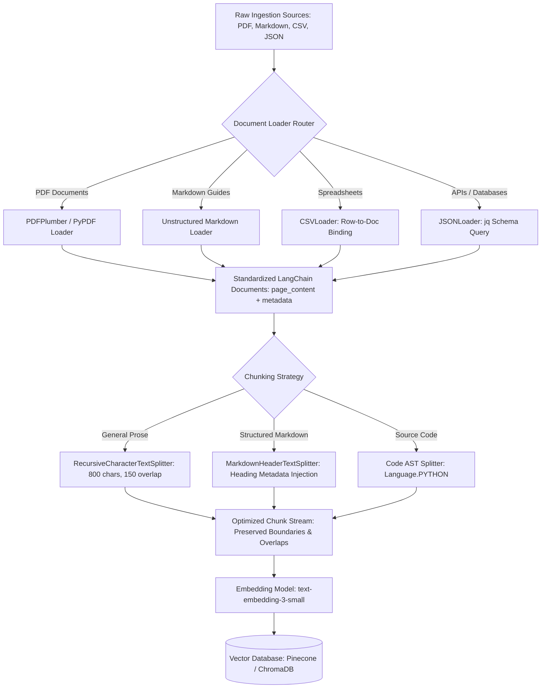

# 📑 Data Pipelines: Document Loaders for Unstructured Data & Effective Chunking Strategies to Preserve Context

> **Zero to Hero Gen AI Course — Module 04: Advanced Data Retrieval & Vector Databases**
>
> 📅 Module 4 | ⏱️ Estimated Reading Time: 60 minutes | 🎯 Level: Intermediate to Advanced
>
> **Core Objective:** Master production data ingestion pipelines for heterogeneous unstructured data formats (PDFs, Markdown, CSV, and JSON). Understand the standardized LangChain `Document` abstraction, evaluate extraction trade-offs across document loaders, and master the four primary chunking strategies (Fixed-Size, Recursive Character, Structure-Aware, and Semantic Chunking). Deep-dive into chunk overlap dynamics to prevent context loss at split boundaries.

---

## 📑 Table of Contents

1. [The Ingestion Bottleneck: Garbage In, Garbage Out in RAG](#1-the-ingestion-bottleneck-garbage-in-garbage-out-in-rag)
2. [Intuitive Mental Models & Analogies](#2-intuitive-mental-models--analogies)
   - [2.1 The Food Processor vs The Chef's Knife](#21-the-food-processor-vs-the-chefs-knife)
   - [2.2 The Shingled Roof: Chunk Overlap](#22-the-shingled-roof-chunk-overlap)
   - [2.3 The Standardized ISO Shipping Container](#23-the-standardized-iso-shipping-container)
3. [Heterogeneous Document Loaders Deep-Dive](#3-heterogeneous-document-loaders-deep-dive)
   - [3.1 The Standardized `Document` Object Anatomy](#31-the-standardized-document-object-anatomy)
   - [3.2 PDF Ingestion: PyPDF, PDFPlumber, and Unstructured](#32-pdf-ingestion-pypdf-pdfplumber-and-unstructured)
   - [3.3 Markdown Ingestion: Preserving Heading Hierarchies](#33-markdown-ingestion-preserving-heading-hierarchies)
   - [3.4 Tabular & Structured Ingestion: CSVLoader & JSONLoader (`jq`)](#34-tabular--structured-ingestion-csvloader--jsonloader-jq)
4. [The 4 Core Chunking Strategies](#4-the-4-core-chunking-strategies)
   - [4.1 Strategy 1: Fixed-Size Character Chunking (The Naive Approach)](#41-strategy-1-fixed-size-character-chunking-the-naive-approach)
   - [4.2 Strategy 2: Recursive Character Text Splitting (The Industry Standard)](#42-strategy-2-recursive-character-text-splitting-the-industry-standard)
   - [4.3 Strategy 3: Document-Structure Chunking (Markdown & Code AST)](#43-strategy-3-document-structure-chunking-markdown--code-ast)
   - [4.4 Strategy 4: Semantic Chunking (Embedding Distance Boundaries)](#44-strategy-4-semantic-chunking-embedding-distance-boundaries)
   - [4.5 Architectural Chunking Strategy Matrix](#45-architectural-chunking-strategy-matrix)
5. [The Mechanics of Chunk Overlap: Preserving Context Boundaries](#5-the-mechanics-of-chunk-overlap-preserving-context-boundaries)
   - [5.1 The Boundary Fragmentation Problem](#51-the-boundary-fragmentation-problem)
   - [5.2 Pronoun Antecedent & Entity Severing](#52-pronoun-antecedent--entity-severing)
   - [5.3 Optimal Overlap Ratios: The 10%–20% Rule](#53-optimal-overlap-ratios-the-1020-rule)
6. [Chunk Granularity Trade-Offs: Precision vs Context](#6-chunk-granularity-trade-offs-precision-vs-context)
   - [6.1 Small Chunks (128–256 tokens)](#61-small-chunks-128256-tokens)
   - [6.2 Medium Chunks (500–1,000 tokens)](#62-medium-chunks-5001000-tokens)
   - [6.3 Large Chunks (2,000+ tokens)](#63-large-chunks-2000-tokens)
   - [6.4 The Solution: Parent-Document & Multi-Vector Retrieval](#64-the-solution-parent-document--multi-vector-retrieval)
7. [Enterprise Case Studies](#7-enterprise-case-studies)
   - [7.1 Case Study 1: Financial SEC 10-K Filings & Complex Tables](#71-case-study-1-financial-sec-10-k-filings--complex-tables)
   - [7.2 Case Study 2: Technical API Documentation & Code Repositories](#72-case-study-2-technical-api-documentation--code-repositories)
8. [Complete Data Ingestion Pipeline Visualized](#8-complete-data-ingestion-pipeline-visualized)
9. [Hands-On Python Lab Walkthrough](#9-hands-on-python-lab-walkthrough)
10. [Curated Video Walkthroughs & Visual Animations](#10-curated-video-walkthroughs--visual-animations)
11. [Self-Assessment & Review Questions](#11-self-assessment--review-questions)
12. [Summary & Key Takeaways](#12-summary--key-takeaways)

---

## 1. The Ingestion Bottleneck: Garbage In, Garbage Out in RAG

When Retrieval-Augmented Generation (RAG) systems fail or hallucinate, engineers frequently blame the embedding model or the LLM. However, industry benchmarking shows that **over 70% of RAG retrieval failures originate in the Data Ingestion Pipeline**:

$$\text{RAG Accuracy} \propto \text{Document Parsing Quality} \times \text{Chunking Strategy Coherence}$$

```
+-----------------------------------------------------------------------------------------+
|                              THE INGESTION BOTTLENECK                                   |
+-----------------------------------------------------------------------------------------+
|                                                                                         |
|  Unstructured Source File (PDF, Markdown, CSV, JSON)                                    |
|      |                                                                                  |
|      v [Faulty Ingestion: Stripped tables, discarded headings, lost formatting]         |
|  Corrupted Raw Text Strings                                                             |
|      |                                                                                  |
|      v [Naive Chunking: Cut mid-sentence at character 500]                              |
|  Fragmented Meaningless Chunks (e.g. "...was authorized by the CFO. Next paragraph...") |
|      |                                                                                  |
|      v [Embedding & Vector Search]                                                      |
|  Irrelevant / Partial Retrieved Chunks                                                  |
|      |                                                                                  |
|      v [LLM Inference]                                                                  |
|  Hallucination / Incomplete Answer to User!                                             |
|                                                                                         |
+-----------------------------------------------------------------------------------------+
```

To build production-grade search systems, data pipelines must:
1. **Faithfully extract text and structural metadata** from diverse file formats.
2. **Decompose documents into semantically coherent passages** that respect logical boundaries (paragraphs, sections, tables, code blocks).
3. **Preserve contextual continuity** across split boundaries via sliding window chunk overlaps.

---

## 2. Intuitive Mental Models & Analogies

```
+-----------------------------------------------------------------------------------------+
|                              DATA PIPELINE ANALOGIES                                    |
+-----------------------------------------------------------------------------------------+
|                                                                                         |
|  1. FOOD PROCESSOR vs CHEF'S KNIFE             2. THE SHINGLED ROOF (CHUNK OVERLAP)     |
|                                                                                         |
|      Naive Fixed Chunking:                        Flat Tiles (No Overlap):              |
|      * Blind blender puree.                       * Water leaks through the seam!       |
|      * Cuts words, breaks tables in half,         * An entity on the boundary is lost.  |
|        chops sentences midway.                                                          |
|                                                   Shingled Tiles (20% Overlap):         |
|      Structure-Aware Splitting:                   * Upper tile overlaps lower tile.     |
|      * Master chef slicing along natural joints   * Seamless barrier: complete context  |
|        (chapters, paragraphs, headers).             preserved across seams.             |
|                                                                                         |
|  3. THE STANDARDIZED ISO SHIPPING CONTAINER                                             |
|                                                                                         |
|      Whether raw cargo is coal, cars, or fruit (PDF, CSV, JSON, Markdown),             |
|      it is loaded into identical steel containers: LangChain Document(page_content, meta)|
|                                                                                         |
+-----------------------------------------------------------------------------------------+
```

### 2.1 The Food Processor vs The Chef's Knife
Imagine preparing a gourmet dinner. If you dump steak, carrots, and potatoes into a food processor and pulse blindly for 10 seconds, you get an unrecognizable slurry. 
- **Fixed-size chunking** is the food processor: it blindly slices every 500 characters, severing words in half (`"super-"` / `"-conductor"`) and disconnecting chart labels from numbers.
- **Structure-aware chunking** is the executive chef: it cuts cleanly along natural anatomical seams—preserving complete paragraphs, keeping Markdown table rows intact, and keeping functions with their docstrings.

### 2.2 The Shingled Roof: Chunk Overlap
Why do roofers overlap cedar shingles by 20%? If shingles were placed side-by-side with zero overlap, rain would seep directly through the crack into the attic. 
**Chunk overlap** functions like roof shingles. By overlapping consecutive chunks by 10%–20%, sentences that sit right on the boundary line are duplicated in both chunks, preventing context leaks and severed pronouns.

### 2.3 The Standardized ISO Shipping Container
Before 1956, cargo ships took days to load because goods came in barrels, sacks, and wooden crates. The shipping container revolutionized global commerce by standardizing cargo into a single rectangular steel box.
In LangChain, **`Document(page_content, metadata)`** is the universal shipping container. Regardless of whether data originates from an Oracle SQL database, an SEC 10-K PDF, a Git commit diff, or an S3 JSON bucket, downstream splitters, embedding models, and vector databases interact with the exact same standardized container.

---

## 3. Heterogeneous Document Loaders Deep-Dive

### 3.1 The Standardized `Document` Object Anatomy

Every document loader in LangChain produces instances of the `Document` class:

```python
from langchain_core.documents import Document

doc = Document(
    page_content="Distributed consensus is achieved via the Raft protocol...",
    metadata={
        "source": "distributed_systems_v2.pdf",
        "page": 42,
        "author": "Dr. Leslie Lamport",
        "category": "computer_science",
        "created_at": "2024-10-01"
    }
)
```

- **`page_content` (`str`)**: The extracted plain text passage that will be chunked, embedded, and passed to the LLM.
- **`metadata` (`dict`)**: Arbitrary key-value attributes used for **vector database pre-filtering**, citation provenance, source attribution, and access control.

### 3.2 PDF Ingestion: PyPDF, PDFPlumber, and Unstructured

PDFs are the most notorious file format in data engineering because they are designed for **visual printing, not semantic extraction**. Characters in a PDF are positioned as physical $(X, Y)$ coordinate glyphs without intrinsic concepts of "paragraphs" or "table cells".

```
+------------------------------------------------------------------------------------+
|                         PDF EXTRACTION ENGINE COMPARISON                           |
+------------------------------------------------------------------------------------+
|                                                                                    |
|  1. PyPDFLoader:                                                                   |
|     * Fast, lightweight, pure Python.                                              |
|     * Extracts raw text strings page-by-page.                                      |
|     ⚠️ Scrambles multi-column layouts; garbles complex financial tables.           |
|                                                                                    |
|  2. PDFPlumberLoader:                                                              |
|     * High-precision bounding box extraction.                                      |
|     * Detects visual table grid lines and preserves cell alignment.                |
|     * Slower, higher CPU overhead.                                                 |
|                                                                                    |
|  3. UnstructuredPDFLoader:                                                         |
|     * AI-powered vision & layout parsing (detects headers, footers, images).       |
|     * Integrates Tesseract OCR for scanned document images.                        |
|     * Heaviest resource footprint (often deployed as an independent microservice). |
|                                                                                    |
+------------------------------------------------------------------------------------+
```

```python
from langchain_community.document_loaders import PyPDFLoader, PDFPlumberLoader

# Fast extraction for clean single-column digital PDFs
loader = PyPDFLoader("annual_report.pdf")
pages = loader.load()
print(f"Loaded {len(pages)} pages. Page 1 metadata: {pages[0].metadata}")

# High-precision table extraction for multi-column documents
table_loader = PDFPlumberLoader("financial_tables.pdf")
table_docs = table_loader.load()
```

### 3.3 Markdown Ingestion: Preserving Heading Hierarchies

Markdown (`.md`) is the ideal format for LLM pipelines because it contains explicit semantic markup (`#`, `##`, `###`, `-`, ` ``` `). 

Using **`UnstructuredMarkdownLoader`**, Markdown is ingested with structural element tagging:

```python
from langchain_community.document_loaders import UnstructuredMarkdownLoader

loader = UnstructuredMarkdownLoader("system_architecture.md", mode="elements")
elements = loader.load()
for el in elements[:3]:
    print(f"Category: {el.metadata.get('category')} -> Text: {el.page_content[:50]}")
```

### 3.4 Tabular & Structured Ingestion: CSVLoader & JSONLoader (`jq`)

Tabular data cannot be dumped as raw comma-separated text into an embedding model without losing column associations.

#### 1. `CSVLoader`
Converts each row of a spreadsheet into an independent `Document` where column headers are explicitly bound to their row values:

```python
from langchain_community.document_loaders import CSVLoader

loader = CSVLoader(
    file_path="employee_roster.csv",
    csv_args={"delimiter": ",", "quotechar": '"'},
    source_column="employee_id"
)
docs = loader.load()
print(docs[0].page_content)
# Output:
# employee_id: 1042
# name: Dr. Aris Thorne
# department: Infrastructure
# security_clearance: Top Secret
```

#### 2. `JSONLoader` with `jq` Schema Parsing
Extracts deeply nested records from enterprise API payloads using the `jq` query language:

```python
from langchain_community.document_loaders import JSONLoader

# JSON file with structure: {"users": [{"id": 1, "bio": "...", "roles": [...]}]}
loader = JSONLoader(
    file_path="api_dump.json",
    jq_schema=".users[]",
    content_key="bio",
    metadata_func=lambda record, _: {"user_id": record["id"], "roles": record["roles"]}
)
docs = loader.load()
```

---

## 4. The 4 Core Chunking Strategies


Once text is extracted, it must be partitioned into chunks. The four primary strategies represent an evolution from crude character slicing to intelligent semantic clustering:

### 4.1 Strategy 1: Fixed-Size Character Chunking (The Naive Approach)

Slices text strictly every $N$ characters (e.g., `chunk_size=500`):

```python
from langchain.text_splitter import CharacterTextSplitter

splitter = CharacterTextSplitter(
    separator="",         # Splits blindly at character count
    chunk_size=500,
    chunk_overlap=0
)
```

- **Fatal Flaw**: Words are severed down the middle (`"infrastruc-"` and `"-ture"`). Sentences are chopped mid-thought. Never use this in production.

### 4.2 Strategy 2: Recursive Character Text Splitting (The Industry Standard)

The default workhorse of modern RAG pipelines. It recursively searches through a **hierarchy of natural linguistic separators**:

$$\text{Separators Hierarchy: } \left[ \texttt{"\textbackslash n\textbackslash n"}, \texttt{"\textbackslash n"}, \texttt{" "}, \texttt{""} \right]$$

1. Attempts to split at **double newlines** (`\n\n`, paragraphs).
2. If a paragraph exceeds `chunk_size`, attempts to split at **single newlines** (`\n`, sentences/lines).
3. If still too large, splits at **spaces** (`" "`, words).
4. Only as an absolute last resort does it split at individual characters (`""`).

```python
from langchain.text_splitter import RecursiveCharacterTextSplitter

text_splitter = RecursiveCharacterTextSplitter(
    chunk_size=800,           # Target chunk size in characters or tokens
    chunk_overlap=150,        # Overlap window
    separators=["\n\n", "\n", ". ", " ", ""]
)

chunks = text_splitter.split_documents(docs)
print(f"Original: {len(docs)} documents -> Split into: {len(chunks)} chunks")
```

### 4.3 Strategy 3: Document-Structure Chunking (Markdown & Code AST)

Rather than arbitrary character counts, this strategy splits text along **structural document boundaries**.

#### 1. `MarkdownHeaderTextSplitter`
Splits Markdown text according to heading hierarchies (`#`, `##`, `###`), and crucially **injects the heading path into the metadata of every resulting chunk**:

```python
from langchain.text_splitter import MarkdownHeaderTextSplitter

headers_to_split_on = [
    ("#", "Header_1"),
    ("##", "Header_2"),
    ("###", "Header_3"),
]

markdown_splitter = MarkdownHeaderTextSplitter(headers_to_split_on=headers_to_split_on)
md_chunks = markdown_splitter.split_text(markdown_content)

print(md_chunks[0].page_content)
print(md_chunks[0].metadata)
# Output Metadata: {'Header_1': 'System Architecture', 'Header_2': 'Database Layer', 'Header_3': 'PostgreSQL Cluster'}
```

> [!TIP]
> **Contextual Superpower:** When a user queries *"How does the PostgreSQL cluster replicate?"*, the chunk contains the exact section text, while its metadata explicitly carries the breadcrumb: `Header_1: System Architecture -> Header_2: Database Layer`. The LLM receives complete context without needing full document ingestion!

#### 2. Code AST Splitters (Python, JavaScript, Go)
Splits source code using Abstract Syntax Trees (ASTs), keeping entire classes, functions, and docstrings intact as individual chunks:

```python
from langchain.text_splitter import Language, RecursiveCharacterTextSplitter

python_splitter = RecursiveCharacterTextSplitter.from_language(
    language=Language.PYTHON,
    chunk_size=1000,
    chunk_overlap=100
)
code_chunks = python_splitter.split_text(source_code)
```

### 4.4 Strategy 4: Semantic Chunking (Embedding Distance Boundaries)

Instead of relying on syntactic separators, **Semantic Chunking** uses an embedding model to evaluate the conceptual similarity between consecutive sentences.

```
+-----------------------------------------------------------------------------------------+
|                               SEMANTIC CHUNKING MECHANICS                               |
+-----------------------------------------------------------------------------------------+
|                                                                                         |
|  Sentence 1: "The Apollo program landed 12 astronauts on the Moon."                    |
|  Sentence 2: "Saturn V rockets provided the multi-stage orbital thrust."               |
|      [Cosine Distance S1 <-> S2 = 0.12]  ---> LOW DISTANCE: Group into Chunk A          |
|                                                                                         |
|  Sentence 3: "Lunar soil samples revealed high concentrations of helium-3."            |
|      [Cosine Distance S2 <-> S3 = 0.18]  ---> LOW DISTANCE: Group into Chunk A          |
|                                                                                         |
|  Sentence 4: "French cuisine relies heavily on butter, cream, and wine reductions."     |
|      [Cosine Distance S3 <-> S4 = 0.88]  ---> SPIKE! (Exceeds Threshold 0.50)           |
|                                               SPLIT BOUNDARY CREATED HERE!              |
|                                                                                         |
|  Sentence 5: "Bordeaux wines pair exceptionally with roasted duck breast."              |
|      [Cosine Distance S4 <-> S5 = 0.14]  ---> LOW DISTANCE: Group into Chunk B          |
|                                                                                         |
+-----------------------------------------------------------------------------------------+
```

1. Partitions text into individual sentences.
2. Embeds every sentence into a vector $\vec{v}_i$.
3. Computes the cosine distance between consecutive sentences: $d_i = 1 - \cos(\vec{v}_i, \vec{v}_{i+1})$.
4. Whenever distance spikes above a statistical threshold (e.g., 95th percentile or a fixed threshold), a new chunk is instantiated.

### 4.5 Architectural Chunking Strategy Matrix

| Strategy | Splitting Trigger | Structural Awareness | Computational Cost | Best Production Fit |
| :--- | :--- | :---: | :---: | :--- |
| **Fixed-Size** | Strict character count | ❌ Zero | Lowest (Instant) | Quick benchmarks, fixed-length strings. |
| **Recursive Character** | Paragraph $\to$ Line $\to$ Word | ⚠️ Moderate | Very Low | General prose, blogs, articles, books. |
| **Markdown / Code AST** | Header `#` / Class / Function | ✅ High | Low | Technical documentation, codebases, APIs. |
| **Semantic Chunking** | Cosine distance spike | 🌟 Maximum | High (Requires $N$ embedding calls) | Complex essays, conversational transcripts. |

---

## 5. The Mechanics of Chunk Overlap: Preserving Context Boundaries

### 5.1 The Boundary Fragmentation Problem

Consider this critical text passage:

```text
"...The board of directors approved the emergency acquisition of CyberGuard Inc for $450M.
It was finalized on October 12, 2024 by CEO Maya Vance under secret executive authorization..."
```

If a splitter cuts exactly after the first sentence (`chunk_overlap=0`):
- **Chunk 1**: `"...The board of directors approved the emergency acquisition of CyberGuard Inc for $450M."`
- **Chunk 2**: `"It was finalized on October 12, 2024 by CEO Maya Vance under secret executive authorization..."`

### 5.2 Pronoun Antecedent & Entity Severing

Now, a user asks:
- *"Who authorized the CyberGuard acquisition and when?"*

The vector database retrieves **Chunk 2** because it contains *"CEO Maya Vance"*, *"October 12"*, and *"authorization"*. But Chunk 2 contains the pronoun **`"It"`**! The antecedent `"CyberGuard Inc"` was left behind in Chunk 1. The LLM has no idea what *"It"* refers to, and responds:
- *"I cannot confirm which acquisition CEO Maya Vance authorized."*

### 5.3 Optimal Overlap Ratios: The 10%–20% Rule

$$\text{Overlap Ratio } \rho = \frac{\text{chunk\_overlap}}{\text{chunk\_size}}$$

With a **15% chunk overlap** (`chunk_size=1000`, `chunk_overlap=150`):
- **Chunk 1**: Contains the acquisition approval and early details.
- **Chunk 2**: Begins with the last 150 characters of Chunk 1, ensuring `"CyberGuard Inc"` is present right alongside `"It was finalized on October 12 by CEO Maya Vance"`.

```
Chunk 1: [========================= 1000 Chars =========================]
                                    [== Overlap: 150 Chars ==]
Chunk 2:                            [========================= 1000 Chars =========================]
```

> [!TIP]
> **Production Rule of Thumb:** Maintain an overlap ratio of **10% to 20%** ($\rho \in [0.10, 0.20]$). Overlaps under 5% fail to prevent pronoun severing, while overlaps exceeding 30% inflate vector database storage and token costs unnecessarily.

---

## 6. Chunk Granularity Trade-Offs: Precision vs Context

Choosing the target `chunk_size` is an engineering balancing act:

```
Granularity Spectrum:
[ Small Chunks: 128 tokens ] <----------> [ Large Chunks: 2,048 tokens ]
High Retrieval Precision                   High Contextual Reasoning
Low Contextual Breadth                     Low Retrieval Precision (Diluted Vectors)
```

| Chunk Size | Strengths | Weaknesses | Best Use Cases |
| :--- | :--- | :--- | :--- |
| **Small (128–256 tokens)** | High semantic precision; vector represents an exact, focused fact. | May lack surrounding context needed by the LLM to synthesize an answer. | Precise fact lookup, FAQs, short QA pairs. |
| **Medium (500–1,000 tokens)** | Ideal balance between semantic specificity and contextual breadth. | Slight vector dilution on multi-topic paragraphs. | General enterprise knowledge bases, manuals. |
| **Large (1,500–3,000 tokens)** | Provides rich, comprehensive context for complex synthesis. | Vector represents many mixed topics; similarity search precision drops. | Deep thematic summaries, legal briefs, literature. |

### 6.4 The Solution: Parent-Document & Multi-Vector Retrieval

To eliminate this trade-off, enterprise RAG systems use **Parent-Document Retrieval**:
1. Split documents into **Small Child Chunks (150 tokens)** for vector indexing.
2. Link each child chunk to its **Large Parent Document (1,500 tokens)** stored in a key-value store.
3. At query time: vector search matches the highly precise child vector, but the retriever **fetches the full parent document to inject into the LLM prompt**!

---

## 7. Enterprise Case Studies

### 7.1 Case Study 1: Financial SEC 10-K Filings & Complex Tables
- **Challenge**: Financial reports contain balance sheets where numbers are meaningless without column and row headers.
- **Solution**: Use `PDFPlumberLoader` to extract tables as structured Markdown tables (`| Revenue | 2024 | 2023 |`). Apply `MarkdownHeaderTextSplitter` to keep entire financial tables within single chunks alongside the preceding section header (`Item 8 - Financial Statements`).

### 7.2 Case Study 2: Technical API Documentation & Code Repositories
- **Challenge**: Generic splitters cut Python classes in half, separating method bodies from class attributes.
- **Solution**: Ingest Markdown API guides using `MarkdownHeaderTextSplitter`, and parse Python source code using `RecursiveCharacterTextSplitter.from_language(Language.PYTHON)`, ensuring methods remain intact.

---

## 8. Complete Data Ingestion Pipeline Visualized



---

## 9. Hands-On Python Lab Walkthrough

To experience document loading and chunking strategies hands-on, run the accompanying lab script:

📂 **Lab Location:** [`4. Advanced Data Retrieval & Vector Databases/code/data_pipelines_chunking_lab.py`](file:///c:/Users/sriva/OneDrive/Desktop/GEN%20AI%20COURSE/4.%20Advanced%20Data%20Retrieval%20&%20Vector%20Databases/code/data_pipelines_chunking_lab.py)

### Lab Experiments Included:
1. **Experiment 1: Heterogeneous Document Ingestion**: Simulates loading CSV, JSON, Markdown, and PDF documents into standardized `Document` objects with metadata payloads.
2. **Experiment 2: Fixed-Size vs Recursive Character Splitting**: Directly contrasts naive character cuts (severing words) against recursive splitting (preserving paragraphs and sentences).
3. **Experiment 3: Markdown Structure-Aware Splitting**: Demonstrates `MarkdownHeaderTextSplitter` injecting H1/H2/H3 heading metadata into chunks.
4. **Experiment 4: Chunk Overlap & Pronoun Antecedent Recovery**: Simulates a boundary split and proves how a 15% overlap preserves pronoun context.
5. **Experiment 5: Semantic Chunking Simulation**: Simulates cosine distance thresholding between consecutive sentences to identify natural topic transitions.

Run the lab in your terminal:
```bash
py "4. Advanced Data Retrieval & Vector Databases/code/data_pipelines_chunking_lab.py"
```

---

## 10. Curated Video Walkthroughs & Visual Animations

Enhance your conceptual understanding with these top-tier, verified video resources:

| Video Title | Channel / Speaker | Duration | Core Topics Covered | Verified Link |
| :--- | :--- | :--- | :--- | :--- |
| **Learn RAG From Scratch** | freeCodeCamp.org (Lance Martin) | 2 hr 30 min | Document loaders, chunking strategies, indexing, and vector retrieval | [Watch Video](https://www.youtube.com/watch?v=JE-NAtLRQ9E) |
| **LangChain Crash Course for Beginners** | freeCodeCamp.org | 1 hr 25 min | Document loaders, text splitters, vector stores, and RAG | [Watch Video](https://www.youtube.com/watch?v=kYRB-v9z610) |
| **Intro to Large Language Models** | Andrej Karpathy | 1 hr 00 min | Tokenization, text representation, context window limits, and retrieval | [Watch Video](https://www.youtube.com/watch?v=zjkBMFhNj_g) |
| **State of GPT** | Microsoft Build / Andrej Karpathy | 42 min | Data ingestion pipelines, context augmentation, and system prompt framing | [Watch Video](https://www.youtube.com/watch?v=bZQun8Y4L2A) |

---

## 11. Self-Assessment & Review Questions

Test your mastery of document loading and chunking strategies:

### Q1: Why does naive fixed-size character chunking frequently cause RAG retrieval failures?
<details>
<summary>👉 Click to view answer & architectural explanation</summary>

**Answer:**
Fixed-size character chunking splits text strictly after $N$ characters without awareness of linguistic boundaries. This causes:
1. **Word Severing**: Words are chopped down the middle (e.g., `"con- / traction"`), producing corrupt token embeddings.
2. **Sentence & Thought Fragmentation**: Sentences are severed midway, depriving the embedding model of complete propositional meaning.
3. **Table & Code Rupture**: Table rows and function definitions are split across different chunks without headers, turning structured data into gibberish.
</details>

---

### Q2: How does `MarkdownHeaderTextSplitter` solve the "Lost in the Middle" context problem?
<details>
<summary>👉 Click to view answer & implementation details</summary>

**Answer:**
`MarkdownHeaderTextSplitter` splits text along Markdown heading boundaries (`#`, `##`, `###`), and automatically **injects the heading breadcrumbs directly into the metadata dictionary of each chunk**. 

When a chunk is retrieved, the LLM receives not only the raw text snippet, but also the structural context (e.g., `metadata={"Header_1": "Database Config", "Header_2": "Replication", "Header_3": "PostgreSQL"}`). The model knows exactly which subsystem the snippet belongs to, even if the snippet itself never mentions the word "PostgreSQL".
</details>

---

### Q3: What is the primary purpose of chunk overlap, and what is the recommended overlap ratio?
<details>
<summary>👉 Click to view answer & engineering guideline</summary>

**Answer:**
The primary purpose of chunk overlap is to **prevent semantic fragmentation at split boundaries**, specifically resolving pronoun antecedents and entity relationships (e.g., preventing `"Company X"` from being separated from a subsequent sentence beginning with `"It was acquired..."`).

**Recommended Overlap Ratio:** **10% to 20%** of the target `chunk_size` (e.g., 150 characters for a 1,000-character chunk). Overlaps under 5% fail to prevent boundary context loss, while overlaps over 30% inflate vector storage and produce redundant retrieved passages.
</details>

---

### Q4: When is Semantic Chunking preferred over Recursive Character Text Splitting?
<details>
<summary>👉 Click to view answer & trade-off criteria</summary>

**Answer:**
Semantic Chunking is preferred when:
1. **Documents lack formal formatting**: Continuous transcripts, speech-to-text audio logs, or unformatted clinical notes where paragraphs and headings are absent.
2. **Topic shifts occur unpredictably**: Multi-topic essays or customer support transcripts where speaker topics transition without structural line breaks.
- **Trade-off:** Semantic chunking requires embedding every individual sentence to compute cosine distance deltas, incurring higher computational latency and cost than recursive character splitting.
</details>

---

### Q5: How does Parent-Document Retrieval resolve the trade-off between small and large chunk sizes?
<details>
<summary>👉 Click to view answer & architectural explanation</summary>

**Answer:**
- **The Dilemma:** Small chunks (150 tokens) have high vector retrieval precision but lack context for LLM generation; large chunks (1,500 tokens) provide rich context but have diluted vector representations that reduce retrieval accuracy.
- **The Parent-Document Solution:** Small child chunks are embedded and indexed in the vector database for **high-precision search**. Each child chunk stores a reference ID to a large parent document stored in a key-value store. At query time, vector search matches the child chunk, but the system **returns the full parent document to the LLM**, delivering both pinpoint retrieval accuracy and rich generation context.
</details>

---

## 12. Summary & Key Takeaways

1. **Ingestion Dictates RAG Quality**: Over 70% of RAG retrieval failures stem from poor document extraction and naive text splitting rather than embedding model flaws.
2. **Recursive Splitting is the Gold Standard**: `RecursiveCharacterTextSplitter` respects the natural linguistic hierarchy (`\n\n` $\to$ `\n` $\to$ `" "` $\to$ `""`), keeping paragraphs and sentences intact.
3. **Structure-Aware Chunking Preserves Provenance**: `MarkdownHeaderTextSplitter` and Code AST splitters inject semantic document hierarchies directly into chunk metadata.
4. **Overlap Solves Boundary Loss**: A 10%–20% chunk overlap sliding window prevents severed pronouns and disconnected entity references across split seams.
5. **Standardized Ingestion Abstraction**: Ingesting heterogeneous formats (PDF, Markdown, CSV, JSON) into uniform `Document(page_content, metadata)` containers ensures clean, decoupled, production-grade vector pipelines.
