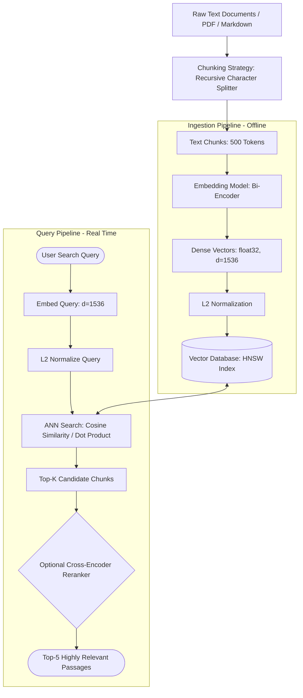

# 📐 Embeddings: Converting Text into Dense Vector Representations for Semantic Understanding

> **Zero to Hero Gen AI Course — Module 04: Advanced Data Retrieval & Vector Databases**
>
> 📅 Module 4 | ⏱️ Estimated Reading Time: 60 minutes | 🎯 Level: Intermediate to Advanced
>
> **Core Objective:** Master the mathematical, architectural, and engineering foundations of text embeddings. Understand the transition from lexical sparse representations (BM25, TF-IDF) to continuous dense vector spaces ($\mathbb{R}^d$). Dissect similarity metrics (Cosine, Dot Product, Euclidean distance), contrastive loss formulations (InfoNCE), modern embedding model architectures (Bi-Encoders, Matryoshka Representation Learning), and dimensional trade-offs in enterprise retrieval systems.

---

## 📑 Table of Contents

1. [The Semantic Search Revolution: Moving Beyond Lexical Keywords](#1-the-semantic-search-revolution-moving-beyond-lexical-keywords)
2. [Intuitive Mental Models & Analogies](#2-intuitive-mental-models--analogies)
   - [2.1 The Multi-Dimensional Semantic GPS](#21-the-multi-dimensional-semantic-gps)
   - [2.2 The Star Constellations in Vector Space](#22-the-star-constellations-in-vector-space)
   - [2.3 Vector Arithmetic: The Compass Direction of Meaning](#23-vector-arithmetic-the-compass-direction-of-meaning)
3. [Sparse vs Dense Vectors: The Representation Evolution](#3-sparse-vs-dense-vectors-the-representation-evolution)
   - [3.1 Sparse Vectors: One-Hot, TF-IDF, and BM25](#31-sparse-vectors-one-hot-tf-idf-and-bm25)
   - [3.2 The Orthogonality Curse of Lexical Representations](#32-the-orthogonality-curse-of-lexical-representations)
   - [3.3 Dense Vectors: Continuous Semantic Geometries](#33-dense-vectors-continuous-semantic-geometries)
   - [3.4 Comprehensive Comparison Matrix](#34-comprehensive-comparison-matrix)
4. [Mathematical Foundations of Vector Distance & Similarity](#4-mathematical-foundations-of-vector-distance--similarity)
   - [4.1 Dot Product (Inner Product)](#41-dot-product-inner-product)
   - [4.2 Cosine Similarity & Angular Distance](#42-cosine-similarity--angular-distance)
   - [4.3 Euclidean Distance ($L_2$ Norm)](#43-euclidean-distance-l_2-norm)
   - [4.4 The $L_2$ Normalization Equivalence Theorem](#44-the-l_2-normalization-equivalence-theorem)
5. [Architecture of Modern Embedding Models](#5-architecture-of-modern-embedding-models)
   - [5.1 Bi-Encoders vs Cross-Encoders](#51-bi-encoders-vs-cross-encoders)
   - [5.2 Contrastive Learning & InfoNCE Loss](#52-contrastive-learning--infonce-loss)
   - [5.3 Pooling Strategies: CLS vs Mean Pooling](#53-pooling-strategies-cls-vs-mean-pooling)
   - [5.4 Matryoshka Representation Learning (MRL): Adaptive Dimensionality](#54-matryoshka-representation-learning-mrl-adaptive-dimensionality)
6. [Leading Embedding Models & Dimensionality Benchmarks](#6-leading-embedding-models--dimensionality-benchmarks)
   - [6.1 OpenAI `text-embedding-3-small` vs `text-embedding-3-large`](#61-openai-text-embedding-3-small-vs-text-embedding-3-large)
   - [6.2 Open-Source Champions: BAAI BGE & Voyage AI](#62-open-source-champions-baai-bge--voyage-ai)
   - [6.3 Symmetric vs Asymmetric Retrieval Tasks](#63-symmetric-vs-asymmetric-retrieval-tasks)
7. [Enterprise Engineering & Operational Trade-offs](#7-enterprise-engineering--operational-trade-offs)
   - [7.1 Memory Footprint & Storage Calculations](#71-memory-footprint--storage-calculations)
   - [7.2 Quantization: FP32 $\to$ FP16 $\to$ INT8 $\to$ Binary Embeddings](#72-quantization-fp32-to-fp16-to-int8-to-binary-embeddings)
   - [7.3 The Indexing & Search Pipeline](#73-the-indexing--search-pipeline)
8. [Complete Architecture Visualized](#8-complete-architecture-visualized)
9. [Hands-On Python Lab Walkthrough](#9-hands-on-python-lab-walkthrough)
10. [Curated Video Walkthroughs & Visual Animations](#10-curated-video-walkthroughs--visual-animations)
11. [Self-Assessment & Review Questions](#11-self-assessment--review-questions)
12. [Summary & Key Takeaways](#12-summary--key-takeaways)

---

## 1. The Semantic Search Revolution: Moving Beyond Lexical Keywords

For five decades, computerized information retrieval relied on **lexical keyword matching** (Inverted Indexes, TF-IDF, BM25). Lexical engines index documents by parsing literal strings: if a user searches for `"heart attack symptoms"`, the database looks for documents containing the exact tokens `"heart"`, `"attack"`, and `"symptoms"`.

While fast and effective for exact matches, lexical search completely fails when confronted with human language nuance:

1. **Synonym Blindness**: A query for `"canine cardiovascular distress"` shares zero tokens with `"dog heart attack"`. A keyword search yields **zero results**.
2. **Polysemy (Word Ambiguity)**: The word `"bank"` has distinct meanings in `"river bank"` versus `"investment bank"`. Lexical engines treat them as identical tokens.
3. **Typo & Morphological Fragility**: Searches fail when users make minor spelling errors or use irregular verb conjugations.
4. **Cross-Lingual Impasse**: A query in Spanish (`"ataque cardíaco"`) cannot find an English document (`"myocardial infarction"`), despite identical conceptual meaning.

**Embeddings** solve this by transforming text into **dense mathematical vectors in a continuous geometric space**:

$$\text{Text String } s \xrightarrow{\text{Embedding Model } \mathcal{E}} \vec{v} \in \mathbb{R}^d$$

In this space, **spatial proximity directly corresponds to semantic similarity**. Texts expressing similar meanings are located close together, regardless of vocabulary, phrasing, or language.

---

## 2. Intuitive Mental Models & Analogies

```
+-----------------------------------------------------------------------------------------+
|                               EMBEDDING MENTAL MODELS                                   |
+-----------------------------------------------------------------------------------------+
|                                                                                         |
|  1. THE SEMANTIC GPS (LATITUDE & LONGITUDE)       2. THE CONSTELLATIONS IN SPACE        |
|                                                                                         |
|      Physical World:                              3D Dense Vector Space:                |
|      * Paris:  (48.8566° N, 2.3522° E)              * Technology Cluster (AI, GPU, CUDA)|
|      * London: (51.5074° N, 0.1278° W)              * Healthcare Cluster (Heart, ECG)   |
|      -> Close GPS coordinates = Close distance      * Finance Cluster (Bonds, Stocks)   |
|                                                                                         |
|      Semantic Embedding Space:                      -> Distance = Conceptual similarity |
|      * "dog":   [0.82, -0.14, 0.55, ..., 0.31]                                          |
|      * "puppy": [0.81, -0.12, 0.53, ..., 0.29]                                          |
|      -> Close 1536-D coordinates = Identical meaning                                    |
|                                                                                         |
|  3. VECTOR ARITHMETIC (THE COMPASS OF MEANING)                                          |
|                                                                                         |
|      Vector("King") - Vector("Man") + Vector("Woman") ≈ Vector("Queen")                 |
|      Vector("Paris") - Vector("France") + Vector("Japan") ≈ Vector("Tokyo")             |
|                                                                                         |
+-----------------------------------------------------------------------------------------+
```

### 2.1 The Multi-Dimensional Semantic GPS
In our physical world, a pair of numbers—`(Latitude, Longitude)`—pinpoints any location on Earth. Two cities that are physically near each other (like Dallas and Fort Worth) have coordinates with very small numerical differences.

An **Embedding Model** acts like a satellite assigning GPS coordinates to ideas. Instead of just 2 dimensions, it assigns coordinates across **1,536 or 3,072 dimensions**. Each dimension represents a subtle latent semantic feature (e.g., *animateness*, *formality*, *technical complexity*, *sentiment*). Two sentences with similar meanings receive coordinates that sit adjacent in 1,536-dimensional space.

### 2.2 The Star Constellations in Vector Space
Imagine standing inside a celestial planetarium. Millions of documents float like stars:
- Articles about cardiology, beta-blockers, and cardiac surgery cluster together into a glowing **Medical Nebula**.
- Articles about PyTorch, gradient descent, and transformers form an adjacent **Machine Learning Constellation**.
- When you pose a question, your query becomes a shooting star entering the galaxy. The vector database simply shines a spotlight on the nearest cluster of stars.

### 2.3 Vector Arithmetic: The Compass Direction of Meaning
Because embeddings represent conceptual properties as continuous vectors, they support linear algebra operations. In Word2Vec and modern transformer embeddings, semantic relationships behave like directional vectors:

$$\vec{v}_{\text{King}} - \vec{v}_{\text{Man}} \approx \vec{v}_{\text{Royalty}}$$

$$\vec{v}_{\text{Royalty}} + \vec{v}_{\text{Woman}} \approx \vec{v}_{\text{Queen}}$$

The vector connecting `"Man"` to `"Woman"` points in the exact same geometric direction as the vector connecting `"Uncle"` to `"Aunt"` or `"Actor"` to `"Actress"`.

---

## 3. Sparse vs Dense Vectors: The Representation Evolution


### 3.1 Sparse Vectors: One-Hot, TF-IDF, and BM25

In early NLP, documents were represented as **sparse vectors** across a fixed vocabulary $V$:
- **Vocabulary Size $|V|$**: Typically $50,000$ to $500,000$ unique words.
- **One-Hot Encoding**: A vector of length $|V|$ where only one index is $1$ and all other elements are $0$.
- **TF-IDF & BM25**: A vector of length $|V|$ where elements represent Term Frequency weighted by Inverse Document Frequency.

```
Vocabulary: ["apple", "bank", "cat", "dog", "finance", "river", ...] (Dim: 50,000)

Vector("cat"): [  0,   0,   1,   0,   0,   0, ... ]  (99.99% zeros)
Vector("dog"): [  0,   0,   0,   1,   0,   0, ... ]  (99.99% zeros)
```

### 3.2 The Orthogonality Curse of Lexical Representations

In sparse representations, distinct words have non-overlapping indices:

$$\vec{v}_{\text{cat}} \cdot \vec{v}_{\text{dog}} = 0$$

Because the dot product between distinct words is exactly zero, the geometric angle between them is $90^\circ$ ($\cos(90^\circ) = 0$). Lexically, `"cat"` is just as distant from `"kitten"` as it is from `"refrigerator"` or `"quantum mechanics"`. This is known as the **Orthogonality Curse**.

### 3.3 Dense Vectors: Continuous Semantic Geometries

Dense embeddings compress text into a fixed, compact vector space of dimensionality $d \ll |V|$ (typically $d \in [384, 3072]$):

$$\vec{v} = \begin{bmatrix} 0.042 \\ -0.187 \\ 0.512 \\ \vdots \\ -0.019 \end{bmatrix} \in \mathbb{R}^d$$

- **Dense**: Nearly every dimension contains a non-zero floating-point value.
- **Continuous**: Words and concepts occupy smooth, continuous regions of space.
- **Semantic Overlap**: The dot product between $\vec{v}_{\text{cat}}$ and $\vec{v}_{\text{kitten}}$ is high ($\approx 0.88$), mathematically capturing their conceptual kinship.

### 3.4 Comprehensive Comparison Matrix

| Property | Sparse Vectors (BM25, TF-IDF) | Dense Embeddings (OpenAI, BGE, Cohere) |
| :--- | :--- | :--- |
| **Dimensionality ($d$)** | High ($|V| \approx 50,000 - 1,000,000$) | Low to Moderate ($d \approx 384 - 3,072$) |
| **Sparsity** | Extremely Sparse ($> 99.9\%$ zeros) | 100% Dense (All non-zero floats) |
| **Storage Structure** | Inverted Index (Postings lists) | Vector Index (HNSW, IVF-PQ graphs) |
| **Semantic Awareness** | None (Zero similarity for synonyms) | High (Captures synonyms, intent, concepts) |
| **Exact Keyword Precision** | Excellent (Matches rare IDs, serial numbers) | Moderate (May fuzz out exact serial codes) |
| **Language Portability** | Monolingual per vocabulary | Often Multilingual out-of-the-box |
| **Computation Model** | Fast string hashing and counting | Deep Neural Network forward pass |

---

## 4. Mathematical Foundations of Vector Distance & Similarity


Given two embedding vectors $\vec{u}, \vec{v} \in \mathbb{R}^d$, vector databases determine their semantic proximity using one of three primary geometric metrics:

### 4.1 Dot Product (Inner Product)

The dot product is the sum of the element-wise products:

$$\langle \vec{u}, \vec{v} \rangle = \vec{u} \cdot \vec{v} = \sum_{i=1}^{d} u_i v_i = \|\vec{u}\| \|\vec{v}\| \cos(\theta)$$

- **Geometric Interpretation**: Projects vector $\vec{u}$ onto vector $\vec{v}$ and multiplies their lengths.
- **Sensitivity**: Dependent on both the **angle** between vectors and their **magnitudes** (lengths). Longer documents with larger vector norms will receive higher similarity scores unless normalized.

### 4.2 Cosine Similarity & Angular Distance

Cosine similarity measures the cosine of the angle $\theta$ between two vectors, completely independent of their lengths:

$$S_C(\vec{u}, \vec{v}) = \cos(\theta) = \frac{\vec{u} \cdot \vec{v}}{\|\vec{u}\|_2 \|\vec{v}\|_2} = \frac{\sum_{i=1}^d u_i v_i}{\sqrt{\sum_{i=1}^d u_i^2} \sqrt{\sum_{i=1}^d v_i^2}}$$

- **Range**: $[-1.0, 1.0]$:
  - $+1.0$: Identical direction ($\theta = 0^\circ$, identical meaning).
  - $0.0$: Orthogonal ($\theta = 90^\circ$, unrelated).
  - $-1.0$: Diametrically opposite ($\theta = 180^\circ$, opposite meaning).
- **Cosine Distance**: Often defined for vector databases as:
  $$D_C(\vec{u}, \vec{v}) = 1 - S_C(\vec{u}, \vec{v})$$

### 4.3 Euclidean Distance ($L_2$ Norm)

Euclidean distance measures the straight-line geometric distance between two coordinate points:

$$d_E(\vec{u}, \vec{v}) = \|\vec{u} - \vec{v}\|_2 = \sqrt{\sum_{i=1}^{d} (u_i - v_i)^2}$$

- **Range**: $[0, \infty)$:
  - $0.0$: Identical vectors.
  - Larger values indicate increasing dissimilarity.

### 4.4 The $L_2$ Normalization Equivalence Theorem

A vector is **$L_2$-normalized** (unit vector) when its Euclidean length equals 1:

$$\|\vec{u}\|_2 = \sqrt{\sum_{i=1}^d u_i^2} = 1 \implies \hat{u} = \frac{\vec{u}}{\|\vec{u}\|_2}$$

When vectors are normalized to unit length, an elegant mathematical equivalence emerges:

$$\|\hat{u} - \hat{v}\|_2^2 = \sum_{i=1}^d (\hat{u}_i - \hat{v}_i)^2 = \sum_{i=1}^d \hat{u}_i^2 + \sum_{i=1}^d \hat{v}_i^2 - 2 \sum_{i=1}^d \hat{u}_i \hat{v}_i$$

$$\|\hat{u} - \hat{v}\|_2^2 = \|\hat{u}\|_2^2 + \|\hat{v}\|_2^2 - 2 (\hat{u} \cdot \hat{v}) = 1 + 1 - 2 \cos(\theta)$$

$$\boxed{\|\hat{u} - \hat{v}\|_2 = \sqrt{2(1 - \cos(\theta))}}$$

> [!TIP]
> **Engineering Optimization:** When vectors are normalized to unit length before indexing, **Dot Product, Cosine Similarity, and Euclidean Distance produce identical nearest-neighbor rankings**! 
> Vector databases can therefore use simple, hardware-accelerated **Dot Product** (FMA / SIMD / AVX-512 instructions) to compute cosine similarity without running expensive square root operations at runtime.

---

## 5. Architecture of Modern Embedding Models

```
+-----------------------------------------------------------------------------------------+
|                         BI-ENCODER vs CROSS-ENCODER TOPOLOGY                            |
+-----------------------------------------------------------------------------------------+
|                                                                                         |
|  1. BI-ENCODER (EMBEDDING RETRIEVAL)         2. CROSS-ENCODER (RERANKER)                |
|     Fast, pre-computable, scalable              Slow, accurate, query-dependent         |
|                                                                                         |
|      Query ---> [Transformer] ---> Vector Q        [Query + Doc]                        |
|                                         |               |                               |
|                                      Dot Prod       [Transformer Joint Attention]       |
|                                         |               |                               |
|      Doc   ---> [Transformer] ---> Vector D             v                               |
|                 (Pre-computed in DB!)             Relevance Score (0.94)                |
|                                                                                         |
|      * Search 10M docs in 5 milliseconds!       * Compare 50 docs in 200 milliseconds.  |
|                                                                                         |
+-----------------------------------------------------------------------------------------+
```

### 5.1 Bi-Encoders vs Cross-Encoders

Modern semantic retrieval systems employ a two-stage pattern:
1. **Bi-Encoder (First-Stage Retriever)**:
   - Processes the query and candidate documents **independently**.
   - Embeds documents offline into vectors stored in a vector database.
   - At query time, embeds only the user query once, then performs approximate nearest neighbor (ANN) search across millions of documents in milliseconds.
2. **Cross-Encoder (Second-Stage Reranker)**:
   - Concatenates `[Query] [SEP] [Document]` and passes them jointly through all self-attention layers.
   - Allows full cross-attention between every query token and every document token.
   - Extremely accurate, but computationally expensive ($O(N \cdot L^2)$). Used only to rerank the top 20–50 candidates returned by the bi-encoder.

### 5.2 Contrastive Learning & InfoNCE Loss

Modern embedding models (like BGE, OpenAI, and Voyage) are trained using **Contrastive Learning**. The network is trained to push positive pairs (query and relevant document) together, while repelling negative pairs (irrelevant documents):

$$\mathcal{L}_{\text{InfoNCE}} = -\log \frac{\exp\left(\frac{\text{sim}(q, d^+)}{\tau}\right)}{\exp\left(\frac{\text{sim}(q, d^+)}{\tau}\right) + \sum_{j=1}^{K} \exp\left(\frac{\text{sim}(q, d_j^-)}{\tau}\right)}$$

Where:
- $q$: Embedded query vector.
- $d^+$: Ground-truth positive passage vector.
- $d_j^-$: Hard negative passages (passages that share keywords but don't answer the query).
- $\tau$: Temperature scaling hyperparameter (typically $0.05$ to $0.1$).

### 5.3 Pooling Strategies: CLS vs Mean Pooling

Transformer encoders produce an output embedding for every input token: $\mathbf{H} \in \mathbb{R}^{L \times d_{\text{model}}}$. To compress a sequence of $L$ tokens into a single document vector $\vec{v} \in \mathbb{R}^d$, models use **pooling**:

```
Token Embeddings: [h_1, h_2, h_3, ..., h_L]

1. [CLS] Token Pooling:     v = h_1  (Used by original BERT)
2. Mean Pooling:            v = (1 / L) * sum(h_i)  (Used by Sentence-BERT / BGE)
3. Last Token Pooling:      v = h_L  (Used by decoder-only models like LLaMA)
```

**Mean pooling** consistently outperforms `[CLS]` pooling for semantic search because it aggregates contextual information across all tokens rather than relying on a single classification token.

### 5.4 Matryoshka Representation Learning (MRL): Adaptive Dimensionality

Historically, if a model produced 1,536-dimensional vectors, you were forced to store all 1,536 dimensions.

OpenAI's `text-embedding-3` family and modern models implement **Matryoshka Representation Learning (MRL)** (Kusupati et al., 2022). Inspired by Russian nesting dolls (Matryoshkas), MRL trains the model so that the **first $K$ dimensions independently form a high-quality embedding**:

$$\vec{v}_{1536} = [\underbrace{v_1, v_2, \dots, v_{256}}_{\text{High quality } 256\text{-D}}, \underbrace{v_{257}, \dots, v_{512}}_{\text{Extended } 512\text{-D}}, \dots, v_{1536}]$$

```python
# Truncating 1536 dimensions down to 256 dimensions with zero retraining:
vector_1536 = get_embedding("Quantum computing architectures")
vector_256 = vector_1536[:256]

# Re-normalize to unit length:
vector_256_normalized = vector_256 / np.linalg.norm(vector_256)
```

**MRL Benefits:**
- **6x reduction in storage and memory**: 256 floats vs 1,536 floats.
- **6x faster search speeds** in vector databases.
- **Retains 97%+ of original retrieval accuracy**!

---

## 6. Leading Embedding Models & Dimensionality Benchmarks

| Model | Provider | Dimensions ($d$) | Max Context | MRL Support | MTEB Retrieval Score | Cost (per 1M tokens) |
| :--- | :--- | :---: | :---: | :---: | :---: | :---: |
| **`text-embedding-3-small`** | OpenAI | 1,536 (or 512) | 8,191 | ✅ Yes | 62.3 | \$0.02 |
| **`text-embedding-3-large`** | OpenAI | 3,072 (or 1024, 256) | 8,191 | ✅ Yes | 64.6 | \$0.13 |
| **`bge-large-en-v1.5`** | BAAI (Open Source) | 1,024 | 512 | ❌ No | 64.1 | Free (Self-hosted) |
| **`embed-english-v3.0`** | Cohere | 1,024 | 512 | ❌ No | 64.5 | \$0.10 |
| **`voyage-large-2`** | Voyage AI | 1,536 | 16,000 | ❌ No | 65.4 | \$0.12 |

### 6.3 Symmetric vs Asymmetric Retrieval Tasks

- **Symmetric Search**: The query and target documents are of similar length and phrasing (e.g., finding similar questions on Quora: *"How to learn Python?"* $\leftrightarrow$ *"Best way to study Python?"*).
- **Asymmetric Search**: The query is a short question or phrase, while documents are long explanatory paragraphs (e.g., Query: *"Why is the sky blue?"* $\leftrightarrow$ Document: *"Rayleigh scattering occurs when particles..."*).

> [!IMPORTANT]
> For asymmetric tasks, models like **BGE** require explicit instruction prefixes:
> - Passages are embedded normally: `"passage: Rayleigh scattering occurs..."`
> - Queries require an instruction: `"Represent this sentence for searching relevant passages: Why is the sky blue?"`

---

## 7. Enterprise Engineering & Operational Trade-offs

### 7.1 Memory Footprint & Storage Calculations

When architecting a production vector database, engineers must accurately forecast RAM requirements:

$$\text{RAM Requirements} = N_{\text{vectors}} \times d_{\text{dimensions}} \times \text{Bytes per Float} \times \text{Index Overhead Factor}$$

For **10,000,000 document chunks** using standard 32-bit floating-point (`FP32`, 4 bytes):

$$\text{Raw Vectors} = 10^7 \times 1,536 \times 4 \text{ bytes} \approx 61.44 \text{ GB}$$

With HNSW graph indexing overhead ($\approx 1.25\times$), the cluster requires:

$$\text{Total RAM} \approx 61.44 \text{ GB} \times 1.25 \approx \mathbf{76.8 \text{ GB RAM}}$$

### 7.2 Quantization: FP32 $\to$ FP16 $\to$ INT8 $\to$ Binary Embeddings

To slash memory costs by 75% to 96%, enterprise vector databases employ **vector quantization**:

```
1. Full Precision (FP32):   [0.024185, -0.198421, ...]  -> 4 bytes per dimension (100% RAM)
2. Half Precision (FP16):   [0.0242,   -0.1984,   ...]  -> 2 bytes per dimension (50% RAM)
3. Integer Quantized (INT8): [12,       -98,       ...]  -> 1 byte per dimension  (25% RAM)
4. 1-Bit Binary:            [1,         0,         ...]  -> 1 bit per dimension   (3.1% RAM!)
```

Using **Binary Quantization** (`1-bit`), 1,536 dimensions consume only **192 bytes** per vector! Hamming distance can then be calculated using blazing-fast hardware `POPCNT` (population count) CPU instructions.

### 7.3 The Indexing & Search Pipeline


The end-to-end vector retrieval lifecycle:
1. **Document Ingestion**: Text is loaded, cleaned, and partitioned into chunks (e.g., 500 tokens with 50-token overlap).
2. **Batch Embedding**: Chunks are passed through an embedding model in batches over HTTPS.
3. **Index Construction**: Dense vectors and metadata payloads are indexed into an Approximate Nearest Neighbor (ANN) index (HNSW or IVF-PQ).
4. **Query Execution**: User query is vectorized in real-time ($<20$ ms).
5. **Similarity Search**: Database scans the HNSW graph using Cosine Similarity, returning the top-$K$ most relevant document chunks to augment the LLM prompt.

---

## 8. Complete Architecture Visualized



---

## 9. Hands-On Python Lab Walkthrough

To experience text embeddings, vector geometries, and similarity calculations hands-on, run the accompanying lab script:

📂 **Lab Location:** [`4. Advanced Data Retrieval & Vector Databases/code/embeddings_lab.py`](file:///c:/Users/sriva/OneDrive/Desktop/GEN%20AI%20COURSE/4.%20Advanced%20Data%20Retrieval%20&%20Vector%20Databases/code/embeddings_lab.py)

### Lab Experiments Included:
1. **Experiment 1: Sparse vs Dense Semantic Search**: Compares lexical keyword matching failures (synonyms like "canine" vs "dog") against dense semantic vectors.
2. **Experiment 2: Mathematical Similarity Deep-Dive**: Computes Dot Product, Cosine Similarity, and Euclidean Distance from scratch in pure Python/NumPy, proving the $L_2$ equivalence theorem.
3. **Experiment 3: Semantic Clustering & Vector Arithmetic**: Demonstrates vector math ($\vec{v}_{\text{King}} - \vec{v}_{\text{Man}} + \vec{v}_{\text{Woman}} \approx \vec{v}_{\text{Queen}}$) in synthetic embedding space.
4. **Experiment 4: Matryoshka Representation Learning (MRL)**: Truncates 1,536-dimensional embeddings to 256 dimensions, verifying that similarity rankings remain preserved.
5. **Experiment 5: Enterprise RAM & Cost Forecasting Engine**: Calculates exact memory consumption, index overhead, and storage requirements for $100\text{k}$ to $10\text{M}$ documents across FP32, FP16, and INT8.

Run the lab in your terminal:
```bash
py "4. Advanced Data Retrieval & Vector Databases/code/embeddings_lab.py"
```

---

## 10. Curated Video Walkthroughs & Visual Animations

Enhance your conceptual understanding with these top-tier, verified video resources:

| Video Title | Channel / Speaker | Duration | Core Topics Covered | Verified Link |
| :--- | :--- | :--- | :--- | :--- |
| **Learn RAG From Scratch** | freeCodeCamp.org (Lance Martin) | 2 hr 30 min | Embeddings, vector spaces, distance metrics, and indexing | [Watch Video](https://www.youtube.com/watch?v=JE-NAtLRQ9E) |
| **LangChain Crash Course for Beginners** | freeCodeCamp.org | 1 hr 25 min | Embeddings, Vector Stores, Document Loaders, and RAG | [Watch Video](https://www.youtube.com/watch?v=kYRB-v9z610) |
| **Intro to Large Language Models** | Andrej Karpathy | 1 hr 00 min | Pre-training, token representations, neural networks, and retrieval | [Watch Video](https://www.youtube.com/watch?v=zjkBMFhNj_g) |
| **State of GPT** | Microsoft Build / Andrej Karpathy | 42 min | Vector embeddings, context augmentation, and retrieval mechanics | [Watch Video](https://www.youtube.com/watch?v=bZQun8Y4L2A) |

---

## 11. Self-Assessment & Review Questions

Test your mastery of embedding concepts:

### Q1: Why do two $L_2$-normalized vectors produce identical nearest-neighbor rankings under Cosine Similarity, Dot Product, and Euclidean Distance?
<details>
<summary>👉 Click to view answer & mathematical proof</summary>

**Answer:**
When vectors $\vec{u}$ and $\vec{v}$ are normalized such that $\|\vec{u}\|_2 = \|\vec{v}\|_2 = 1$:
1. **Cosine Similarity equals Dot Product**: 
   $$S_C(\vec{u}, \vec{v}) = \frac{\vec{u} \cdot \vec{v}}{\|\vec{u}\|_2 \|\vec{v}\|_2} = \vec{u} \cdot \vec{v}$$
2. **Euclidean Distance is a monotonic function of Dot Product**:
   $$\|\vec{u} - \vec{v}\|_2^2 = \|\vec{u}\|_2^2 + \|\vec{v}\|_2^2 - 2(\vec{u} \cdot \vec{v}) = 2 - 2(\vec{u} \cdot \vec{v})$$
   $$\|\vec{u} - \vec{v}\|_2 = \sqrt{2(1 - S_C(\vec{u}, \vec{v}))}$$

As Cosine Similarity increases from $-1$ to $1$, Euclidean Distance strictly decreases from $2$ to $0$. Thus, sorting by maximum Cosine Similarity, maximum Dot Product, or minimum Euclidean Distance yields mathematically identical rank orderings.
</details>

---

### Q2: What is the primary operational trade-off between a Bi-Encoder and a Cross-Encoder?
<details>
<summary>👉 Click to view answer & architectural explanation</summary>

**Answer:**
- **Bi-Encoders** embed query and documents independently into vectors. Document vectors can be computed **offline once** and indexed in a vector database. At query time, searching 10,000,000 documents takes under $10\text{ ms}$ via ANN search. However, because query and document tokens do not cross-attend to each other, retrieval quality is slightly lower.
- **Cross-Encoders** pass the query and document together through transformer layers with full self-attention across all tokens. They provide state-of-the-art accuracy, but require running a forward pass on every query-document pair at query time ($O(N)$ transformer evaluations). Searching 10,000,000 documents with a cross-encoder would take hours.
- **Production Solution**: A two-stage pipeline where a Bi-Encoder retrieves the top 50 candidates, and a Cross-Encoder reranks those 50 to return the top 5.
</details>

---

### Q3: How does Matryoshka Representation Learning (MRL) allow truncating vector dimensions from 1536 to 256 without retraining?
<details>
<summary>👉 Click to view answer & architectural explanation</summary>

**Answer:**
During training, MRL optimizes the loss function **simultaneously across nested dimensional subsets** (e.g., the first 64, 128, 256, 512, and 1536 dimensions). This forces the neural network to pack the most important, high-variance semantic features into the earliest dimensions. 

In downstream production, engineers can take the full 1536-D vector, slice the first 256 floats (`vec[:256]`), re-normalize it to unit length, and achieve 6x smaller storage and faster search while retaining over 97% of full-dimensional retrieval accuracy.
</details>

---

### Q4: When is lexical BM25 search superior to dense vector embeddings?
<details>
<summary>👉 Click to view answer & architectural explanation</summary>

**Answer:**
BM25 outperforms dense embeddings in scenarios involving:
1. **Rare, Specific Identifiers**: Part numbers, serial codes, UUIDs, SKU codes (e.g., `"ERR-4091-B7"`). Embedding models often compress or tokenize these into generic subwords, losing exact character sequences.
2. **Out-of-Distribution Technical Jargon**: Extremely specialized domain acronyms absent from the embedding model's pre-training corpus.
3. **Exact Keyword Constraints**: Compliance or legal queries where the literal presence of specific statutory terms is mandatory.
- **Remedy**: **Hybrid Search** combining BM25 sparse scores with dense vector cosine similarity via Reciprocal Rank Fusion (RRF).
</details>

---

### Q5: How much RAM is required to store 5,000,000 document embeddings of dimension 1,536 in FP32 vs INT8?
<details>
<summary>👉 Click to view answer & mathematical calculation</summary>

**Answer:**
- **FP32 (4 bytes per dimension)**:
  $$\text{RAM} = 5,000,000 \times 1,536 \times 4 \text{ bytes} = 30,720,000,000 \text{ bytes} \approx \mathbf{30.72 \text{ GB}}$$
- **INT8 Quantization (1 byte per dimension)**:
  $$\text{RAM} = 5,000,000 \times 1,536 \times 1 \text{ byte} = 7,680,000,000 \text{ bytes} \approx \mathbf{7.68 \text{ GB}}$$
- **Savings**: INT8 delivers a **75% reduction in RAM footprint**, enabling the entire index to fit on a single cost-effective cloud instance.
</details>

---

## 12. Summary & Key Takeaways

1. **Continuous Semantic Geometry**: Embeddings transcend lexical keyword limitations by mapping text into dense vectors ($\mathbb{R}^d$) where spatial proximity corresponds to conceptual similarity.
2. **Metric Equivalence via Normalization**: When vectors are $L_2$-normalized to unit length, Dot Product, Cosine Similarity, and Euclidean Distance produce identical rank orderings, enabling high-speed dot-product hardware acceleration.
3. **Two-Stage Retrieval Standard**: Industrial search pairs high-speed Bi-Encoder vector retrieval (Top-50 candidates) with high-precision Cross-Encoder reranking (Top-5 final passages).
4. **Adaptive Dimensions with MRL**: Matryoshka Representation Learning packs essential semantic features into early dimensions, enabling 6x memory reductions with near-zero quality loss.
5. **Quantization Unlocks Scale**: Moving from FP32 to INT8 or Binary embeddings slashes enterprise memory footprints by 75% to 96%, making multi-million document RAG architectures economically viable.
