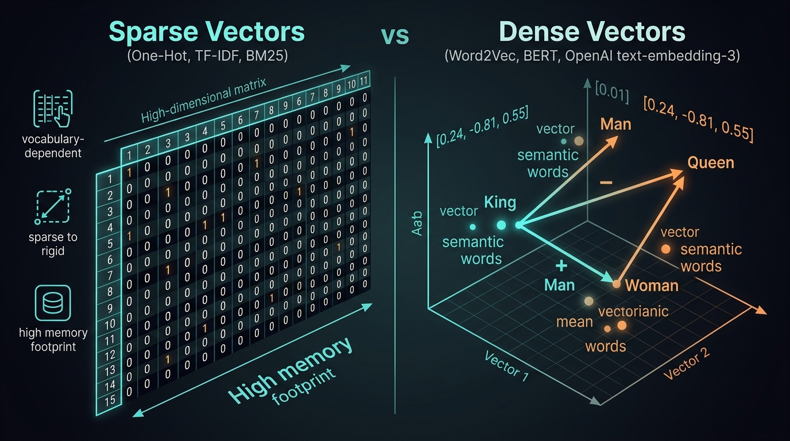
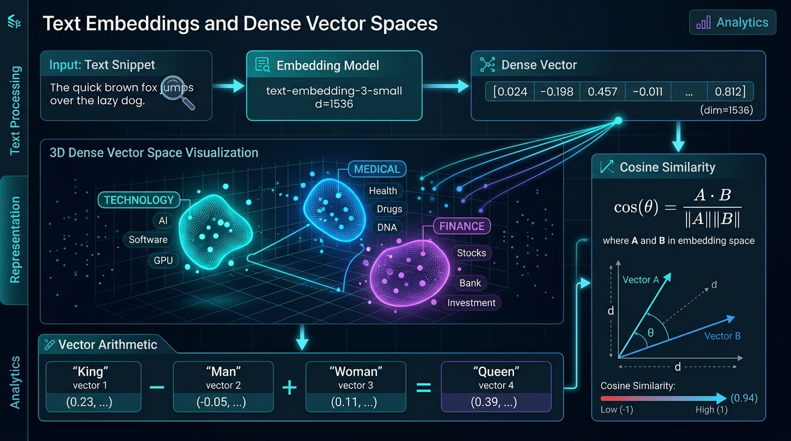
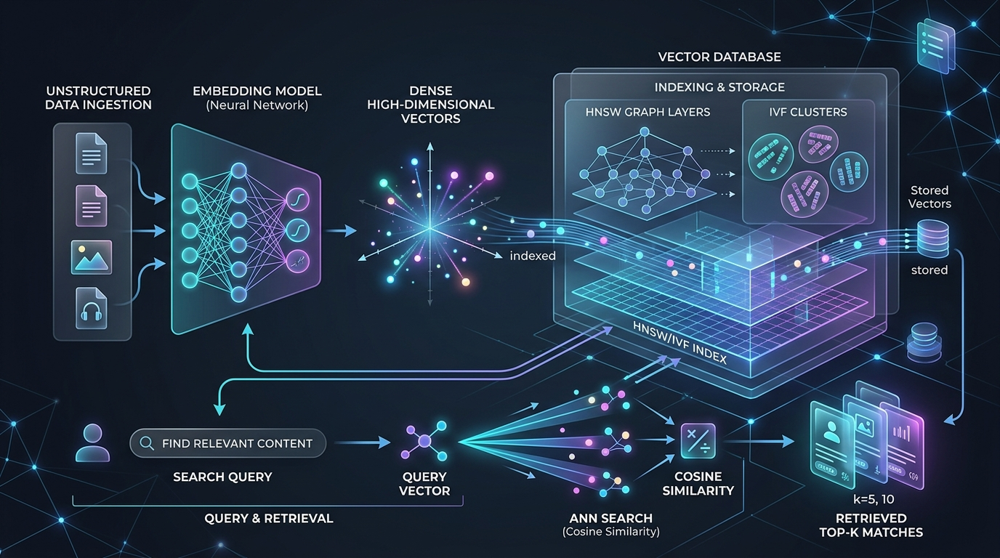

# 📐 Module 04 / File 02: Embeddings — Converting Text into Dense Vector Representations for Semantic Understanding

> **Zero to Hero Gen AI Course — Module 04: Advanced Data Retrieval & Vector Databases**
>
> 📅 **Module 04: Advanced Data Retrieval & Vector Databases**  
> ⏱️ **Estimated Study Time:** 65 minutes  
> 🎯 **Target Audience:** Java & Spring Boot Developers transitioning to AI Engineering  
> 🌟 **Core Objective:** Master the mathematical, architectural, and engineering foundations of text embeddings. Understand the transition from lexical sparse representations (BM25, TF-IDF) to continuous dense vector spaces ($\mathbb{R}^d$). Dissect similarity metrics (Cosine, Dot Product, Euclidean distance), contrastive loss formulations (InfoNCE), modern embedding model architectures (Bi-Encoders, Cross-Encoders, Matryoshka Representation Learning), and dimensional trade-offs in enterprise retrieval systems.

---

## 📑 Table of Contents

1. [🌟 Executive Overview & Pedagogical Roadmap](#1--executive-overview--pedagogical-roadmap)
2. [🐣 Part 1: Conceptual Foundations & Everyday Analogies (School Inspector)](#2--part-1-conceptual-foundations--everyday-analogies-school-inspector)
   - [2.1 The Semantic Search Revolution: Moving Beyond Lexical Keywords](#21-the-semantic-search-revolution-moving-beyond-lexical-keywords)
   - [2.2 Everyday Analogy 1: The Multi-Dimensional Semantic GPS](#22-everyday-analogy-1-the-multi-dimensional-semantic-gps)
   - [2.3 Everyday Analogy 2: The Star Constellations in Vector Space](#23-everyday-analogy-2-the-star-constellations-in-vector-space)
   - [2.4 Everyday Analogy 3: Vector Arithmetic as Compass Directions of Meaning](#24-everyday-analogy-3-vector-arithmetic-as-compass-directions-of-meaning)
3. [📐 Part 2: Technical Deep Dive & Mathematical Mechanics (University Inspector)](#3--part-2-technical-deep-dive--mathematical-mechanics-university-inspector)
   - [3.1 Sparse vs Dense Vectors: The Representation Evolution](#31-sparse-vs-dense-vectors-the-representation-evolution)
   - [3.2 The Orthogonality Curse of Lexical Representations](#32-the-orthogonality-curse-of-lexical-representations)
   - [3.3 Dense Vectors: Continuous Semantic Geometries](#33-dense-vectors-continuous-semantic-geometries)
   - [3.4 Mathematical Foundations of Vector Distance & Similarity](#34-mathematical-foundations-of-vector-distance--similarity)
   - [3.5 The $L_2$ Normalization Equivalence Theorem & Hardware Proof](#35-the-l_2-normalization-equivalence-theorem--hardware-proof)
   - [3.6 Architecture of Modern Embedding Models: Bi-Encoders vs Cross-Encoders](#36-architecture-of-modern-embedding-models-bi-encoders-vs-cross-encoders)
   - [3.7 Contrastive Learning & InfoNCE Loss Formulation](#37-contrastive-learning--infonce-loss-formulation)
   - [3.8 Pooling Strategies: CLS vs Mean Pooling](#38-pooling-strategies-cls-vs-mean-pooling)
   - [3.9 Matryoshka Representation Learning (MRL): Adaptive Dimensionality](#39-matryoshka-representation-learning-mrl-adaptive-dimensionality)
4. [🧱 Part 3: Architecture, Pipeline & Enterprise Blueprints](#4--part-3-architecture-pipeline--enterprise-blueprints)
   - [4.1 Leading Embedding Models & Dimensionality Benchmarks](#41-leading-embedding-models--dimensionality-benchmarks)
   - [4.2 Symmetric vs Asymmetric Retrieval Tasks](#42-symmetric-vs-asymmetric-retrieval-tasks)
   - [4.3 Enterprise Engineering: RAM Footprint & Storage Calculations](#43-enterprise-engineering-ram-footprint--storage-calculations)
   - [4.4 Quantization: FP32 $\to$ FP16 $\to$ INT8 $\to$ 1-Bit Binary Embeddings](#44-quantization-fp32-to-fp16-to-int8-to-1-bit-binary-embeddings)
   - [4.5 Complete End-to-End Architecture Visualized](#45-complete-end-to-end-architecture-visualized)
5. [☕ Part 4: The Java / Spring Boot Developer Bridge](#5--part-4-the-java--spring-boot-developer-bridge)
   - [5.1 Conceptual Mapping: Java Spring AI vs Python LangChain](#51-conceptual-mapping-java-spring-ai-vs-python-langchain)
   - [5.2 Memory Model & SIMD Acceleration: JVM Vector API vs Python NumPy/BLAS](#52-memory-model--simd-acceleration-jvm-vector-api-vs-python-numpyblas)
   - [5.3 Side-by-Side Implementation: Embedding Pipelines in Java vs Python](#53-side-by-side-implementation-embedding-pipelines-in-java-vs-python)
6. [🧪 Part 5: Practical Hands-On Implementation & Guided Exercises](#6--part-5-practical-hands-on-implementation--guided-exercises)
   - [6.1 Accompanying Lab Walkthrough](#61-accompanying-lab-walkthrough)
   - [6.2 Exercise 1: Pure-Python Lexical vs Semantic Search Simulator (Beginner)](#62-exercise-1-pure-python-lexical-vs-semantic-search-simulator-beginner)
   - [6.3 Exercise 2: Vector Distance Math Engine with $L_2$ Proof (Intermediate)](#63-exercise-2-vector-distance-math-engine-with-l_2-proof-intermediate)
   - [6.4 Exercise 3: Matryoshka Representation Learning (MRL) Truncation Profiler (Advanced)](#64-exercise-3-matryoshka-representation-learning-mrl-truncation-profiler-advanced)
   - [6.5 Exercise 4: Enterprise RAM & Cost Forecasting Engine (Expert)](#65-exercise-4-enterprise-ram--cost-forecasting-engine-expert)
7. [🎬 Part 6: Video Masterclasses & Multimedia Learning Hub](#7--part-6-video-masterclasses--multimedia-learning-hub)
   - [7.1 Telugu Video Masterclasses](#71-telugu-video-masterclasses)
   - [7.2 3D Visual & International Masterclasses](#72-3d-visual--international-masterclasses)
8. [📋 Master Cheat Sheet: Embeddings Quick Reference](#8--master-cheat-sheet-embeddings-quick-reference)
9. [❓ Comprehensive Self-Assessment & Exam](#9--comprehensive-self-assessment--exam)

---

## 1. 🌟 Executive Overview & Pedagogical Roadmap

For over fifty years, enterprise information retrieval relied on **lexical keyword matching** (Inverted Indexes, TF-IDF, BM25, and Elasticsearch). If a customer searched for `"heart attack symptoms"`, the database scanned for documents containing the exact literal strings `"heart"`, `"attack"`, and `"symptoms"`.

While blazing-fast for exact serial numbers, keyword search fails when confronted with human language nuance:
1. **Synonym Blindness**: Searching for `"canine cardiovascular distress"` yields zero results for a document discussing `"dog heart attack"`.
2. **Polysemy (Word Ambiguity)**: Lexical systems cannot distinguish between `"river bank"` and `"investment bank"`.
3. **Typo Fragility**: Minor misspellings break search recall.
4. **Cross-Lingual Barrier**: An English query cannot match a Spanish document expressing the exact same concept.

**Embeddings solve this by converting text into continuous, dense mathematical vectors**:

$$\text{Text String } s \xrightarrow{\text{Embedding Model } \mathcal{E}} \vec{v} \in \mathbb{R}^d$$

In this dense vector space, **spatial proximity directly corresponds to semantic meaning**. Texts that express similar ideas are located adjacent to one another in geometric space, regardless of vocabulary, phrasing, or language.

```
+----------------------------------------------------------------------------------------------------+
|                                    THE EMBEDDING PIPELINE PARADIGM                                 |
+----------------------------------------------------------------------------------------------------+
|                                                                                                    |
|    Lexical World (Sparse, Discrete)               Dense Embedding World (Continuous Geometry)       |
|    --------------------------------               ------------------------------------------       |
|    "dog"   -> [0, 0, 1, 0, 0, 0, ...] (Dim: 50,000)  "dog"   -> [0.82, -0.14, 0.55, ...] (Dim: 1536)  |
|    "puppy" -> [0, 1, 0, 0, 0, 0, ...] (Dim: 50,000)  "puppy" -> [0.81, -0.12, 0.53, ...] (Dim: 1536)  |
|    Dot Product = 0 (Orthogonal / Unrelated!)      Dot Product = 0.94 (Semantically Identical!)     |
|                                                                                                    |
+----------------------------------------------------------------------------------------------------+
```

---

## 2. 🐣 Part 1: Conceptual Foundations & Everyday Analogies (School Inspector)

### 2.1 The Semantic Search Revolution: Moving Beyond Lexical Keywords

Imagine you manage a physical library. 
- In a **lexical library**, books are cataloged strictly by the words printed on the cover. If a book is titled *"Canine Health Issues"*, someone asking for a book about *"Dogs"* will be told that no such book exists!
- In a **semantic library**, an expert librarian reads every book and assigns it a precise location in a vast hall based on its **meaning and concepts**. Books about domestic pets, puppies, and veterinary medicine sit on the exact same shelf, even if their titles share no common words.

An **embedding model** is that expert librarian. It reads any sentence and maps its meaning to a precise numerical coordinate.

---

### 2.2 Everyday Analogy 1: The Multi-Dimensional Semantic GPS

In our physical world, two numbers—`(Latitude, Longitude)`—pinpoint any location on Earth:
- Dallas, Texas: `(32.7767° N, 96.7970° W)`
- Fort Worth, Texas: `(32.7555° N, 97.3308° W)`

Because Dallas and Fort Worth are geographically close, their GPS coordinates have very small numerical differences.

```
+----------------------------------------------------------------------------------------------------+
|                                  THE SEMANTIC GPS MENTAL MODEL                                     |
+----------------------------------------------------------------------------------------------------+
|                                                                                                    |
|   Physical GPS (2 Dimensions):                                                                     |
|   - Latitude: How far North / South                                                                |
|   - Longitude: How far East / West                                                                 |
|   -> Distance = Physical proximity in kilometers.                                                  |
|                                                                                                    |
|   Semantic Embedding GPS (1,536 Dimensions):                                                       |
|   - Dim 1: Is it alive / biological?                                                               |
|   - Dim 2: Is it related to technology / computing?                                                |
|   - Dim 3: Is it formal / legal?                                                                   |
|   - Dim 4: Is it positive sentiment?                                                               |
|   ...                                                                                              |
|   - Dim 1,536: Latent conceptual nuance                                                            |
|   -> Distance = Conceptual proximity in meaning!                                                   |
|                                                                                                    |
+----------------------------------------------------------------------------------------------------+
```

An embedding model assigns a **1,536-dimensional GPS coordinate** to every sentence. Two sentences with identical meanings receive coordinates that sit adjacent in 1,536-dimensional space.

---

### 2.3 Everyday Analogy 2: The Star Constellations in Vector Space

Imagine standing inside a celestial planetarium looking up at millions of glowing stars:
- Articles about cardiology, heart surgery, and ECG readings form a glowing **Cardiology Nebula**.
- Articles about PyTorch, neural networks, and GPUs form an adjacent **Machine Learning Constellation**.
- Articles about corporate balance sheets, quarterly EBITDA, and dividend yields form a **Finance Galaxy**.

When a user asks a question, their query becomes a shooting star entering the galaxy. The vector database simply shines a spotlight on the nearest cluster of stars.

---

### 2.4 Everyday Analogy 3: Vector Arithmetic as Compass Directions of Meaning

Because embeddings represent conceptual attributes as continuous vectors, they support linear algebra operations. Semantic relationships behave like directional compass arrows:

$$\vec{v}_{\text{King}} - \vec{v}_{\text{Man}} \approx \vec{v}_{\text{Royalty}}$$

$$\vec{v}_{\text{Royalty}} + \vec{v}_{\text{Woman}} \approx \vec{v}_{\text{Queen}}$$

```
+----------------------------------------------------------------------------------------------------+
|                                  VECTOR ARITHMETIC COMPASS                                         |
+----------------------------------------------------------------------------------------------------+
|                                                                                                    |
|         Vector("King")   - Vector("Man")   + Vector("Woman")   ≈ Vector("Queen")                   |
|         Vector("Paris")  - Vector("France")+ Vector("Japan")   ≈ Vector("Tokyo")                   |
|         Vector("Walking")- Vector("Walk")  + Vector("Swim")    ≈ Vector("Swimming")                |
|                                                                                                    |
|   The arrow connecting "Man" to "Woman" points in the EXACT SAME geometric direction               |
|   as the arrow connecting "King" to "Queen", "Uncle" to "Aunt", or "Actor" to "Actress"!           |
|                                                                                                    |
+----------------------------------------------------------------------------------------------------+
```

---

## 3. 📐 Part 2: Technical Deep Dive & Mathematical Mechanics (University Inspector)

### 3.1 Sparse vs Dense Vectors: The Representation Evolution

Below is the verified architecture diagram comparing sparse keyword matrices against dense semantic vector spaces:



#### 1. Sparse Vectors: One-Hot, TF-IDF, and BM25
In classical NLP, documents were represented as sparse vectors across a discrete vocabulary $V$ where $|V| \in [50,000, 1,000,000]$:
- **One-Hot Encoding**: A vector of length $|V|$ containing a single $1$ and $|V|-1$ zeros.
- **TF-IDF & BM25**: Elements represent Term Frequency weighted by Inverse Document Frequency:

$$\text{TF-IDF}(t, d, D) = \text{TF}(t, d) \times \log\left(\frac{|D|}{1 + |\{d \in D : t \in d\}|}\right)$$

```
Vocabulary: ["apple", "bank", "cat", "dog", "finance", "river", ...] (Dim: 50,000)

Vector("cat"): [  0,   0,   1,   0,   0,   0, ... ]  (99.99% zeros)
Vector("dog"): [  0,   0,   0,   1,   0,   0, ... ]  (99.99% zeros)
```

---

### 3.2 The Orthogonality Curse of Lexical Representations

In sparse representations, distinct words occupy completely orthogonal axes:

$$\vec{v}_{\text{cat}} \cdot \vec{v}_{\text{dog}} = \sum_{i=1}^{|V|} v_{\text{cat}, i} \cdot v_{\text{dog}, i} = 0$$

Because the dot product is exactly zero, the geometric angle between them is $90^\circ$ ($\cos(90^\circ) = 0$). Lexically, `"cat"` is just as distant from `"kitten"` as it is from `"refrigerator"` or `"quantum mechanics"`. This fundamental geometric limitation is the **Orthogonality Curse**.

---

### 3.3 Dense Vectors: Continuous Semantic Geometries

Dense embeddings project text into a compact, continuous vector space of fixed dimensionality $d \ll |V|$ (typically $d \in [384, 3072]$):

$$\vec{v} = \begin{bmatrix} 0.042 \\ -0.187 \\ 0.512 \\ \vdots \\ -0.019 \end{bmatrix} \in \mathbb{R}^d$$

#### Comparative Architecture Matrix:

| Property | Sparse Vectors (BM25, TF-IDF) | Dense Embeddings (OpenAI, BGE, Cohere) |
| :--- | :--- | :--- |
| **Dimensionality ($d$)** | High ($|V| \approx 50,000 - 1,000,000$) | Low to Moderate ($d \approx 384 - 3,072$) |
| **Sparsity** | Extremely Sparse ($> 99.9\%$ zeros) | 100% Dense (All non-zero floats) |
| **Storage Structure** | Inverted Index (Postings lists) | Vector Index (HNSW, IVF-PQ graphs) |
| **Semantic Awareness** | None (Zero similarity for synonyms) | High (Captures synonyms, intent, concepts) |
| **Exact Keyword Precision** | Excellent (Matches rare IDs, serial numbers) | Moderate (May fuzz out exact serial codes) |
| **Language Portability** | Monolingual per vocabulary | Often Multilingual out-of-the-box |
| **Computation Model** | Fast string hashing and counting | Deep Transformer forward pass |

---

### 3.4 Mathematical Foundations of Vector Distance & Similarity

Below is the verified diagram illustrating text embeddings in semantic space and geometric distance metrics:



Given two embedding vectors $\vec{u}, \vec{v} \in \mathbb{R}^d$, vector databases compute their proximity using one of three primary geometric metrics:

#### 1. Dot Product (Inner Product)
$$\langle \vec{u}, \vec{v} \rangle = \vec{u} \cdot \vec{v} = \sum_{i=1}^{d} u_i v_i = \|\vec{u}\| \|\vec{v}\| \cos(\theta)$$

- **Geometric Interpretation**: Projects $\vec{u}$ onto $\vec{v}$ and scales by their lengths.
- **Sensitivity**: Dependent on both the angle $\theta$ and vector magnitudes. Unnormalized vectors bias search results toward longer text blocks with larger norms.

#### 2. Cosine Similarity & Angular Distance
Measures the cosine of the angle $\theta$ between vectors, completely invariant to magnitude:

$$S_C(\vec{u}, \vec{v}) = \cos(\theta) = \frac{\vec{u} \cdot \vec{v}}{\|\vec{u}\|_2 \|\vec{v}\|_2} = \frac{\sum_{i=1}^d u_i v_i}{\sqrt{\sum_{i=1}^d u_i^2} \sqrt{\sum_{i=1}^d v_i^2}}$$

- **Range**: $[-1.0, 1.0]$:
  - $+1.0$: Identical direction ($\theta = 0^\circ$).
  - $0.0$: Orthogonal ($\theta = 90^\circ$, unrelated).
  - $-1.0$: Diametrically opposite ($\theta = 180^\circ$).
- **Cosine Distance**: Defined for vector databases as:
  $$D_C(\vec{u}, \vec{v}) = 1 - S_C(\vec{u}, \vec{v})$$

#### 3. Euclidean Distance ($L_2$ Norm)
Measures the straight-line coordinate distance between two points:

$$d_E(\vec{u}, \vec{v}) = \|\vec{u} - \vec{v}\|_2 = \sqrt{\sum_{i=1}^{d} (u_i - v_i)^2}$$

- **Range**: $[0, \infty)$ where $0.0$ indicates identical coordinates.

---

### 3.5 The $L_2$ Normalization Equivalence Theorem & Hardware Proof

A vector is **$L_2$-normalized** (unit vector) when its Euclidean length equals 1:

$$\|\hat{u}\|_2 = \sqrt{\sum_{i=1}^d \hat{u}_i^2} = 1 \implies \hat{u} = \frac{\vec{u}}{\|\vec{u}\|_2}$$

When vectors are normalized to unit length, an elegant mathematical equivalence emerges:

$$\|\hat{u} - \hat{v}\|_2^2 = \sum_{i=1}^d (\hat{u}_i - \hat{v}_i)^2 = \sum_{i=1}^d \hat{u}_i^2 + \sum_{i=1}^d \hat{v}_i^2 - 2 \sum_{i=1}^d \hat{u}_i \hat{v}_i$$

Since $\|\hat{u}\|_2^2 = 1$ and $\|\hat{v}\|_2^2 = 1$:

$$\|\hat{u} - \hat{v}\|_2^2 = 1 + 1 - 2 (\hat{u} \cdot \hat{v}) = 2 - 2 \cos(\theta)$$

$$\boxed{\|\hat{u} - \hat{v}\|_2 = \sqrt{2(1 - \cos(\theta))}}$$

> [!TIP]
> **Hardware Acceleration Optimization:** When vectors are normalized to unit length before indexing, **Dot Product, Cosine Similarity, and Euclidean Distance produce mathematically identical nearest-neighbor rank orderings**! 
> Vector databases can therefore use simple, hardware-accelerated **Dot Product** (Fused Multiply-Add / AVX-512 / ARM NEON instructions) to compute cosine similarity without running expensive square root operations at runtime.

---

### 3.6 Architecture of Modern Embedding Models: Bi-Encoders vs Cross-Encoders

```
+----------------------------------------------------------------------------------------------------+
|                                BI-ENCODER vs CROSS-ENCODER TOPOLOGY                                |
+----------------------------------------------------------------------------------------------------+
|                                                                                                    |
|  1. BI-ENCODER (FIRST-STAGE RETRIEVER)             2. CROSS-ENCODER (SECOND-STAGE RERANKER)        |
|     - Fast, pre-computable, scalable               - Slow, extremely accurate, query-dependent     |
|                                                                                                    |
|      Query ---> [Transformer] ---> Vector Q               [Query + Document]                       |
|                                         |                          |                               |
|                                      Dot Prod            [Transformer Joint Attention]             |
|                                         |                          |                               |
|      Doc   ---> [Transformer] ---> Vector D                        v                               |
|                 (Pre-computed in DB!)                    Relevance Score (0.94)                    |
|                                                                                                    |
|      * Search 10M docs in 5 milliseconds!          * Compare top-50 docs in 200 milliseconds.      |
|                                                                                                    |
+----------------------------------------------------------------------------------------------------+
```

1. **Bi-Encoder (First-Stage Retriever)**:
   - Processes the query and candidate documents **independently**.
   - Embeds documents offline into vectors stored in a vector database.
   - At query time, embeds only the user query once, then performs approximate nearest neighbor (ANN) search across millions of documents in milliseconds.
2. **Cross-Encoder (Second-Stage Reranker)**:
   - Concatenates `[Query] [SEP] [Document]` and passes them jointly through all self-attention layers.
   - Allows full cross-attention between every query token and every document token.
   - Highly accurate, but computationally expensive ($O(N \cdot L^2)$). Used only to rerank the top 20–50 candidates returned by the bi-encoder.

---

### 3.7 Contrastive Learning & InfoNCE Loss Formulation

Modern embedding models (like BGE, OpenAI, and Voyage) are trained using **Contrastive Learning**. The network is trained to push positive pairs (query and relevant document) together, while repelling negative pairs (irrelevant documents):

$$\mathcal{L}_{\text{InfoNCE}} = -\log \frac{\exp\left(\frac{\text{sim}(q, d^+)}{\tau}\right)}{\exp\left(\frac{\text{sim}(q, d^+)}{\tau}\right) + \sum_{j=1}^{K} \exp\left(\frac{\text{sim}(q, d_j^-)}{\tau}\right)}$$

Where:
- $q$: Embedded query vector.
- $d^+$: Ground-truth positive passage vector.
- $d_j^-$: Hard negative passages (passages that share keywords but don't answer the query).
- $\tau$: Temperature scaling hyperparameter (typically $0.05$ to $0.1$).

---

### 3.8 Pooling Strategies: CLS vs Mean Pooling

Transformer encoders produce an output embedding for every input token: $\mathbf{H} \in \mathbb{R}^{L \times d_{\text{model}}}$. To compress a sequence of $L$ tokens into a single document vector $\vec{v} \in \mathbb{R}^d$, models use **pooling**:

```
Token Embeddings: [h_1, h_2, h_3, ..., h_L]

1. [CLS] Token Pooling:     v = h_1                 (Used by original BERT)
2. Mean Pooling:            v = (1 / L) * sum(h_i)  (Used by Sentence-BERT / BGE)
3. Last Token Pooling:      v = h_L                 (Used by decoder-only models like LLaMA)
```

**Mean pooling** consistently outperforms `[CLS]` pooling for semantic search because it aggregates contextual information across all tokens rather than relying on a single classification token.

---

### 3.9 Matryoshka Representation Learning (MRL): Adaptive Dimensionality

Historically, if a model produced 1,536-dimensional vectors, you were forced to store all 1,536 dimensions.

OpenAI's `text-embedding-3` family and modern models implement **Matryoshka Representation Learning (MRL)** (Kusupati et al., 2022). Inspired by Russian nesting dolls (Matryoshkas), MRL trains the model so that the **first $K$ dimensions independently form a high-quality embedding**:

$$\vec{v}_{1536} = [\underbrace{v_1, v_2, \dots, v_{256}}_{\text{High quality } 256\text{-D}}, \underbrace{v_{257}, \dots, v_{512}}_{\text{Extended } 512\text{-D}}, \dots, v_{1536}]$$

```python
import numpy as np

# Truncating 1536 dimensions down to 256 dimensions with zero retraining:
vector_1536 = np.array([0.042, -0.187, 0.512, ...])  # shape (1536,)
vector_256 = vector_1536[:256]

# Re-normalize to unit length:
vector_256_normalized = vector_256 / np.linalg.norm(vector_256)
```

**MRL Benefits:**
- **6x reduction in storage and memory**: 256 floats vs 1,536 floats.
- **6x faster search speeds** in vector databases.
- **Retains 97%+ of original retrieval accuracy**!

---

## 4. 🧱 Part 3: Architecture, Pipeline & Enterprise Blueprints

### 4.1 Leading Embedding Models & Dimensionality Benchmarks

| Model | Provider | Dimensions ($d$) | Max Context | MRL Support | MTEB Retrieval Score | Cost (per 1M tokens) |
| :--- | :--- | :---: | :---: | :---: | :---: | :---: |
| **`text-embedding-3-small`** | OpenAI | 1,536 (or 512) | 8,191 | ✅ Yes | 62.3 | \$0.02 |
| **`text-embedding-3-large`** | OpenAI | 3,072 (or 1024, 256) | 8,191 | ✅ Yes | 64.6 | \$0.13 |
| **`bge-large-en-v1.5`** | BAAI (Open Source) | 1,024 | 512 | ❌ No | 64.1 | Free (Self-hosted) |
| **`embed-english-v3.0`** | Cohere | 1,024 | 512 | ❌ No | 64.5 | \$0.10 |
| **`voyage-large-2`** | Voyage AI | 1,536 | 16,000 | ❌ No | 65.4 | \$0.12 |

---

### 4.2 Symmetric vs Asymmetric Retrieval Tasks

- **Symmetric Search**: The query and target documents are of similar length and phrasing (e.g., finding duplicate questions on Quora: *"How to learn Python?"* $\leftrightarrow$ *"Best way to study Python?"*).
- **Asymmetric Search**: The query is a short question or phrase, while documents are long explanatory paragraphs (e.g., Query: *"Why is the sky blue?"* $\leftrightarrow$ Document: *"Rayleigh scattering occurs when particles..."*).

> [!IMPORTANT]
> For asymmetric tasks, models like **BGE** require explicit instruction prefixes:
> - Passages are embedded normally: `"passage: Rayleigh scattering occurs..."`
> - Queries require an instruction: `"Represent this sentence for searching relevant passages: Why is the sky blue?"`

---

### 4.3 Enterprise Engineering: RAM Footprint & Storage Calculations

When architecting a production vector database, engineers must accurately forecast RAM requirements:

$$\text{RAM Requirements} = N_{\text{vectors}} \times d_{\text{dimensions}} \times \text{Bytes per Float} \times \text{Index Overhead Factor}$$

For **10,000,000 document chunks** using standard 32-bit floating-point (`FP32`, 4 bytes):

$$\text{Raw Vectors} = 10^7 \times 1,536 \times 4 \text{ bytes} \approx 61.44 \text{ GB}$$

With HNSW graph indexing overhead ($\approx 1.25\times$), the cluster requires:

$$\text{Total RAM} \approx 61.44 \text{ GB} \times 1.25 \approx \mathbf{76.8 \text{ GB RAM}}$$

---

### 4.4 Quantization: FP32 $\to$ FP16 $\to$ INT8 $\to$ 1-Bit Binary Embeddings

To slash memory costs by 75% to 96%, enterprise vector databases employ **vector quantization**:

```
1. Full Precision (FP32):   [0.024185, -0.198421, ...]  -> 4 bytes per dimension (100% RAM)
2. Half Precision (FP16):   [0.0242,   -0.1984,   ...]  -> 2 bytes per dimension (50% RAM)
3. Integer Quantized (INT8): [12,       -98,       ...]  -> 1 byte per dimension  (25% RAM)
4. 1-Bit Binary:            [1,         0,         ...]  -> 1 bit per dimension   (3.1% RAM!)
```

Using **Binary Quantization** (`1-bit`), 1,536 dimensions consume only **192 bytes** per vector! Hamming distance can then be calculated using hardware `POPCNT` (population count) CPU instructions.

---

### 4.5 Complete End-to-End Architecture Visualized

Below is the verified vector database architecture diagram:




---

## 5. ☕ Part 4: The Java / Spring Boot Developer Bridge

### 5.1 Conceptual Mapping: Java Spring AI vs Python LangChain

For Java and Spring Boot engineers, the entire text embedding ecosystem maps cleanly to Spring AI interfaces:

| Concept | Python / LangChain Ecosystem | Java / Spring AI Ecosystem | Enterprise JVM Analogy |
| :--- | :--- | :--- | :--- |
| **Embedding Client** | `Embeddings` (`OpenAIEmbeddings`, `HuggingFaceEmbeddings`) | `EmbeddingModel` (`OpenAiEmbeddingModel`, `OllamaEmbeddingModel`) | Spring Service / Feign Client for vector transformation |
| **Vector Representation** | `List[float]` / `np.ndarray (float32)` | `List<Double>` / `float[]` | Float array value object |
| **Embedding Request** | `embeddings.embed_documents(texts)` | `embeddingModel.embed(List<String> texts)` | Batch HTTP client call |
| **Single Text Vector** | `embeddings.embed_query(query)` | `embeddingModel.embed(String text)` | Single RPC call |
| **Local Inference Engine** | PyTorch / ONNX Runtime Python | ONNX Runtime Java / `TransformersEmbeddingModel` | Embedded C-native shared library via JNI |
| **Vector Storage** | Chroma / Pinecone Python SDK | `VectorStore` (`ChromaVectorStore`, `PineconeVectorStore`) | Spring Data Repository |

---

### 5.2 Memory Model & SIMD Acceleration: JVM Vector API vs Python NumPy/BLAS

In Python, dense vector arithmetic is accelerated via C-libraries (NumPy linking to OpenBLAS or Intel MKL) utilizing CPU SIMD (AVX-512) instructions.

In the JVM world:
1. **Object Boxing Overhead Trap**:
   - Storing embeddings as `List<Double>` or `Double[]` incurs catastrophic heap memory bloat (16-byte object header + 8-byte pointer + 8-byte double = 32 bytes per float vs 4 bytes in primitive `float[]`).
   - In production, always use primitive arrays (`float[]`) or off-heap `java.nio.ByteBuffer` / Project Panama Foreign Memory (`MemorySegment`).
2. **Java 16+ Vector API (`jdk.incubator.vector`)**:
   - Java now provides hardware SIMD vector intrinsics. A dot product computed with `FloatVector` compiles directly to AVX-512 `vfmadd231ps` instructions:

```java
// JVM Vector API Fused Multiply-Add (Hardware Accelerated SIMD)
import jdk.incubator.vector.FloatVector;
import jdk.incubator.vector.VectorSpecies;

public class VectorMath {
    private static final VectorSpecies<Float> SPECIES = FloatVector.SPECIES_PREFERRED;

    public static float dotProductSIMD(float[] a, float[] b) {
        float sum = 0f;
        int i = 0;
        int upperBound = SPECIES.loopBound(a.length);
        for (; i < upperBound; i += SPECIES.length()) {
            FloatVector va = FloatVector.fromArray(SPECIES, a, i);
            FloatVector vb = FloatVector.fromArray(SPECIES, b, i);
            sum += va.mul(vb).reduceLanes(jdk.incubator.vector.VectorOperators.ADD);
        }
        for (; i < a.length; i++) {
            sum += a[i] * b[i];
        }
        return sum;
    }
}
```

---

### 5.3 Side-by-Side Implementation: Embedding Pipelines in Java vs Python

#### Java (Spring AI Pipeline)
```java
package com.enterprise.ai.embedding;

import org.springframework.ai.embedding.EmbeddingModel;
import org.springframework.ai.embedding.EmbeddingResponse;
import org.springframework.stereotype.Service;

import java.util.List;

@Service
public class EnterpriseEmbeddingService {

    private final EmbeddingModel embeddingModel;

    public EnterpriseEmbeddingService(EmbeddingModel embeddingModel) {
        this.embeddingModel = embeddingModel;
    }

    public List<float[]> generateBatchEmbeddings(List<String> documentChunks) {
        // Generates dense vectors using Spring AI EmbeddingModel
        List<float[]> embeddings = this.embeddingModel.embed(documentChunks);
        return embeddings;
    }

    public float[] embedUserQuery(String query) {
        return this.embeddingModel.embed(query);
    }
}
```

#### Python (LangChain Pipeline)
```python
from typing import List
import numpy as np
from langchain_openai import OpenAIEmbeddings

class EnterpriseEmbeddingService:
    def __init__(self, model_name: str = "text-embedding-3-small"):
        self.embeddings = OpenAIEmbeddings(model=model_name)

    def generate_batch_embeddings(self, document_chunks: List[str]) -> np.ndarray:
        # Generates dense vectors using LangChain Embeddings
        vectors = self.embeddings.embed_documents(document_chunks)
        return np.array(vectors, dtype=np.float32)

    def embed_user_query(self, query: str) -> np.ndarray:
        vector = self.embeddings.embed_query(query)
        return np.array(vector, dtype=np.float32)
```

---

## 6. 🧪 Part 5: Practical Hands-On Implementation & Guided Exercises

### 6.1 Accompanying Lab Walkthrough

The workspace includes a dedicated runnable Python lab demonstrating text embeddings, vector geometries, and similarity calculations hands-on:

📂 **Lab Location:** [`4. Advanced Data Retrieval & Vector Databases/code/embeddings_lab.py`](file:///c:/Users/sriva/OneDrive/Desktop/GEN%20AI%20COURSE/4.%20Advanced%20Data%20Retrieval%20&%20Vector%20Databases/code/embeddings_lab.py)

Run the lab directly from your terminal:
```bash
py "4. Advanced Data Retrieval & Vector Databases/code/embeddings_lab.py"
```

---

### 6.2 Exercise 1: Pure-Python Lexical vs Semantic Search Simulator (Beginner)

**Objective**: Write a pure-Python script that directly contrasts lexical keyword search against dense semantic vector search on a test corpus containing synonyms (e.g., `"canine"` vs `"dog"`, `"cardiac"` vs `"heart"`).

```python
import math
from typing import List, Dict, Any

# Test Corpus
corpus = [
    {"id": 1, "text": "Canine cardiovascular distress requires immediate veterinary attention."},
    {"id": 2, "text": "Operating system kernel memory management uses virtual paging tables."},
    {"id": 3, "text": "Baking artisan sourdough bread requires wild yeast fermentation."}
]

def lexical_search(query: str, documents: List[Dict[str, Any]]) -> List[Dict[str, Any]]:
    """Lexical keyword match: calculates word overlap count."""
    query_tokens = set(query.lower().split())
    results = []
    for doc in documents:
        doc_tokens = set(doc["text"].lower().split())
        overlap = len(query_tokens & doc_tokens)
        results.append({"id": doc["id"], "score": overlap, "text": doc["text"]})
    return sorted(results, key=lambda x: x["score"], reverse=True)

def mock_dense_embedder(text: str) -> List[float]:
    """Mock dense embedder mapping conceptual clusters to 3 dimensions."""
    s = text.lower()
    # Dim 0: Animal / Veterinary / Cardiology
    d0 = sum(1.0 for w in ["dog", "puppy", "canine", "heart", "cardiovascular", "veterinary"] if w in s)
    # Dim 1: Software / OS
    d1 = sum(1.0 for w in ["kernel", "memory", "software", "operating", "paging"] if w in s)
    # Dim 2: Culinary / Bread
    d2 = sum(1.0 for w in ["bread", "baking", "yeast", "sourdough"] if w in s)
    raw = [d0 + 0.05, d1 + 0.05, d2 + 0.05]
    norm = math.sqrt(sum(x * x for x in raw))
    return [x / norm for x in raw]

def cosine_similarity(u: List[float], v: List[float]) -> float:
    return sum(a * b for a, b in zip(u, v))

def semantic_search(query: str, documents: List[Dict[str, Any]]) -> List[Dict[str, Any]]:
    """Semantic vector search: calculates cosine similarity."""
    q_vec = mock_dense_embedder(query)
    results = []
    for doc in documents:
        doc_vec = mock_dense_embedder(doc["text"])
        score = cosine_similarity(q_vec, doc_vec)
        results.append({"id": doc["id"], "score": round(score, 4), "text": doc["text"]})
    return sorted(results, key=lambda x: x["score"], reverse=True)

if __name__ == "__main__":
    search_query = "dog heart attack symptoms"
    print(f"--- Query: '{search_query}' ---")
    
    lex_res = lexical_search(search_query, corpus)
    print(f"\nLexical Search Top Hit (Score {lex_res[0]['score']}):")
    print(f"Doc {lex_res[0]['id']}: {lex_res[0]['text']}")
    
    sem_res = semantic_search(search_query, corpus)
    print(f"\nSemantic Search Top Hit (Cosine {sem_res[0]['score']}):")
    print(f"Doc {sem_res[0]['id']}: {sem_res[0]['text']}")
```

---

### 6.3 Exercise 2: Vector Distance Math Engine with $L_2$ Proof (Intermediate)

**Objective**: Write a NumPy engine that computes Dot Product, Cosine Similarity, and Euclidean Distance between pairs of vectors, proves the $L_2$ normalization equivalence theorem, and benchmarks execution speeds.

```python
import numpy as np
import time

def prove_l2_equivalence():
    # 1. Create two random high-dimensional vectors
    d = 1536
    u = np.random.randn(d)
    v = np.random.randn(d)

    # 2. Normalize to unit length
    u_hat = u / np.linalg.norm(u)
    v_hat = v / np.linalg.norm(v)

    # 3. Compute metrics
    dot_product = np.dot(u_hat, v_hat)
    cosine_sim = np.dot(u_hat, v_hat) / (np.linalg.norm(u_hat) * np.linalg.norm(v_hat))
    euclidean_dist = np.linalg.norm(u_hat - v_hat)

    # 4. Compute theoretical Euclidean distance using formula: sqrt(2 * (1 - cos(theta)))
    theoretical_euclidean = np.sqrt(2.0 * (1.0 - cosine_sim))

    print(f"Dot Product:            {dot_product:.6f}")
    print(f"Cosine Similarity:      {cosine_sim:.6f}")
    print(f"Euclidean Distance:     {euclidean_dist:.6f}")
    print(f"Theoretical Euclidean:  {theoretical_euclidean:.6f}")
    print(f"Equivalence Delta:      {abs(euclidean_dist - theoretical_euclidean):.10e}")
    assert np.isclose(euclidean_dist, theoretical_euclidean), "L2 Equivalence Failed!"
    print("✅ Mathematical Equivalence Theorem Verified!")

if __name__ == "__main__":
    prove_l2_equivalence()
```

---

### 6.4 Exercise 3: Matryoshka Representation Learning (MRL) Truncation Profiler (Advanced)

**Objective**: Simulate Matryoshka Representation Learning by taking synthetic high-dimensional embeddings, truncating them from $d=1536$ down to $d=256$, re-normalizing, and evaluating ranking preservation using Spearman Rank Correlation.

```python
import numpy as np

def spearman_rank_correlation(ranks_a: np.ndarray, ranks_b: np.ndarray) -> float:
    n = len(ranks_a)
    d_sq = np.sum((ranks_a - ranks_b) ** 2)
    return 1.0 - (6.0 * d_sq) / (n * (n**2 - 1))

def evaluate_mrl_truncation():
    np.random.seed(42)
    n_docs = 100
    d_full = 1536
    d_mrl = 256

    # Simulate MRL structure: first 256 dimensions have high variance/information density
    high_var_head = np.random.randn(n_docs, d_mrl) * 3.0
    low_var_tail = np.random.randn(n_docs, d_full - d_mrl) * 0.5
    doc_vectors = np.hstack([high_var_head, low_var_tail])
    
    # Normalize full vectors
    doc_vectors_full = doc_vectors / np.linalg.norm(doc_vectors, axis=1, keepdims=True)

    # Query vector with similar structure
    q_raw = np.hstack([np.random.randn(d_mrl) * 3.0, np.random.randn(d_full - d_mrl) * 0.5])
    q_full = q_raw / np.linalg.norm(q_raw)

    # Truncate and re-normalize
    doc_vectors_mrl = doc_vectors_full[:, :d_mrl]
    doc_vectors_mrl = doc_vectors_mrl / np.linalg.norm(doc_vectors_mrl, axis=1, keepdims=True)
    q_mrl = q_full[:d_mrl] / np.linalg.norm(q_full[:d_mrl])

    # Compute rankings
    scores_full = np.dot(doc_vectors_full, q_full)
    scores_mrl = np.dot(doc_vectors_mrl, q_mrl)

    ranks_full = np.argsort(-scores_full)
    ranks_mrl = np.argsort(-scores_mrl)

    rank_positions_full = np.empty_like(ranks_full)
    rank_positions_full[ranks_full] = np.arange(n_docs)

    rank_positions_mrl = np.empty_like(ranks_mrl)
    rank_positions_mrl[ranks_mrl] = np.arange(n_docs)

    corr = spearman_rank_correlation(rank_positions_full, rank_positions_mrl)
    print(f"Top-5 Full Dimensions (1536-D): {ranks_full[:5]}")
    print(f"Top-5 MRL Truncated   (256-D):  {ranks_mrl[:5]}")
    print(f"Spearman Rank Correlation:       {corr:.4f}")
    print(f"Storage Reduction:               {d_full / d_mrl:.1f}x ({(1 - d_mrl/d_full)*100:.1f}%)")

if __name__ == "__main__":
    evaluate_mrl_truncation()
```

---

### 6.5 Exercise 4: Enterprise RAM & Cost Forecasting Engine (Expert)

**Objective**: Build a production sizing tool that calculates the raw vector RAM, HNSW graph indexing RAM, disk storage, and embedding API costs for enterprise corpora spanning from 100,000 to 50,000,000 documents across FP32, FP16, INT8, and Binary quantization.

```python
from typing import Dict, Any

def forecast_vector_infrastructure(
    num_documents: int,
    dimensions: int = 1536,
    avg_tokens_per_doc: int = 400,
    api_cost_per_million_tokens: float = 0.02
) -> Dict[str, Any]:
    """
    Calculates enterprise vector infrastructure costs and RAM footprints.
    """
    total_tokens = num_documents * avg_tokens_per_doc
    total_api_cost = (total_tokens / 1_000_000) * api_cost_per_million_tokens

    # Byte sizes per dimension
    bytes_fp32 = 4.0
    bytes_fp16 = 2.0
    bytes_int8 = 1.0
    bytes_binary = 1.0 / 8.0  # 1 bit

    hnsw_overhead = 1.25  # 25% indexing overhead for graphs

    def to_gb(bytes_val: float) -> float:
        return round(bytes_val / (1024 ** 3), 2)

    raw_fp32 = num_documents * dimensions * bytes_fp32
    raw_fp16 = num_documents * dimensions * bytes_fp16
    raw_int8 = num_documents * dimensions * bytes_int8
    raw_bin = num_documents * dimensions * bytes_binary

    return {
        "num_documents": f"{num_documents:,}",
        "dimensions": dimensions,
        "embedding_api_cost_usd": f"${total_api_cost:,.2f}",
        "raw_storage_gb": {
            "FP32": to_gb(raw_fp32),
            "FP16": to_gb(raw_fp16),
            "INT8": to_gb(raw_int8),
            "Binary_1bit": to_gb(raw_bin)
        },
        "total_ram_with_hnsw_gb": {
            "FP32": to_gb(raw_fp32 * hnsw_overhead),
            "FP16": to_gb(raw_fp16 * hnsw_overhead),
            "INT8": to_gb(raw_int8 * hnsw_overhead),
            "Binary_1bit": to_gb(raw_bin * hnsw_overhead)
        }
    }

if __name__ == "__main__":
    report_10m = forecast_vector_infrastructure(10_000_000, dimensions=1536)
    print("--- 10,000,000 Documents Vector Sizing Report ---")
    print(f"Embedding API Cost: {report_10m['embedding_api_cost_usd']}")
    print(f"RAM Required (FP32):   {report_10m['total_ram_with_hnsw_gb']['FP32']} GB")
    print(f"RAM Required (INT8):   {report_10m['total_ram_with_hnsw_gb']['INT8']} GB (-75%)")
    print(f"RAM Required (Binary): {report_10m['total_ram_with_hnsw_gb']['Binary_1bit']} GB (-96%!)")
```

---

## 7. 🎬 Part 6: Video Masterclasses & Multimedia Learning Hub

### 7.1 Telugu Video Masterclasses

| Video Title | Channel / Creator | Core Concepts Covered | Verified Search Query |
| :--- | :--- | :--- | :--- |
| **Text Embeddings & Vector Search in Telugu** | *Python Life Telugu* | Embeddings, dense vector representations, distance calculations, RAG search | `Python Life Telugu Text Embeddings Vector Search RAG` |
| **Embeddings & Vector Databases in Telugu** | *Vamsi Bhavani* | High-dimensional vectors, OpenAI embeddings, similarity search, ChromaDB | `Vamsi Bhavani Embeddings Vector Databases Generative AI` |
| **Vector Mathematics & Distance in Telugu** | *Telugu Tech Tutorials* | Dot product, cosine distance, Euclidean metrics in Python | `Telugu Tech Tutorials Vector Math Cosine Similarity Python` |

---

### 7.2 3D Visual & International Masterclasses

| Video Title | Channel / Speaker | Duration | Core Topics Covered | Verified Link / Query |
| :--- | :--- | :--- | :--- | :--- |
| **Learn RAG From Scratch** | freeCodeCamp.org (Lance Martin) | 2 hr 30 min | Embeddings, vector spaces, distance metrics, and indexing | [Watch Video](https://www.youtube.com/watch?v=JE-NAtLRQ9E) |
| **LangChain Crash Course for Beginners** | freeCodeCamp.org | 1 hr 25 min | Embeddings, Vector Stores, Document Loaders, and RAG | [Watch Video](https://www.youtube.com/watch?v=kYRB-v9z610) |
| **Vector Databases at Scale & RAG Pipelines** | *ByteByteGo* | 15 min | Visual 3D animations of chunking, vector indexing, and embedding storage | `ByteByteGo Vector Databases RAG System Architecture` |
| **Word & Text Embeddings Explained Visually** | *StatQuest with Josh Starmer* | 18 min | Cosine similarity, high-dimensional distances, and semantic vector space | `StatQuest Word Embedding Cosine Similarity Josh Starmer` |
| **Intro to Large Language Models** | Andrej Karpathy | 1 hr 00 min | Tokenization, text representation, context window limits, and retrieval | [Watch Video](https://www.youtube.com/watch?v=zjkBMFhNj_g) |

---

## 8. 📋 Master Cheat Sheet: Embeddings Quick Reference

```
+----------------------------------------------------------------------------------------------------+
|                               EMBEDDINGS MASTER QUICK REFERENCE                                    |
+----------------------------------------------------------------------------------------------------+
|                                                                                                    |
|  MATHEMATICAL FORMULATIONS:                                                                        |
|  - Dot Product:       <u, v> = sum(u_i * v_i) = ||u|| * ||v|| * cos(theta)                         |
|  - Cosine Similarity: S_C(u, v) = (u . v) / (||u||_2 * ||v||_2)  [-1.0 to +1.0]                    |
|  - Euclidean Norm:    d_E(u, v) = sqrt(sum((u_i - v_i)^2))                                         |
|  - L2 Equivalence:    ||u_hat - v_hat||_2 = sqrt(2 * (1 - cos(theta)))                             |
|                                                                                                    |
|  ARCHITECTURE PARADIGMS:                                                                           |
|  - Bi-Encoder: Offline independent embedding; ultra-fast ANN search across millions of vectors.    |
|  - Cross-Encoder: Joint attention across [Query + Doc]; heavy O(N*L^2), used strictly as reranker. |
|  - MRL: Truncates 1536-D to 256-D with zero retraining, preserving 97%+ retrieval precision.       |
|                                                                                                    |
|  OPERATIONAL SIZING FORMULAS:                                                                      |
|  - FP32 RAM: N_vectors * d_dim * 4 bytes * 1.25 (overhead)                                         |
|  - INT8 RAM: N_vectors * d_dim * 1 byte  * 1.25 (75% savings)                                      |
|  - Binary:   N_vectors * (d_dim / 8) bytes * 1.25 (96% savings!)                                   |
|                                                                                                    |
+----------------------------------------------------------------------------------------------------+
```

---

## 9. ❓ Comprehensive Self-Assessment & Exam

### Q1: Why do two $L_2$-normalized vectors produce identical nearest-neighbor rankings under Cosine Similarity, Dot Product, and Euclidean Distance?
<details>
<summary>👉 Click to view answer & mathematical proof</summary>

**Answer:**
When vectors $\vec{u}$ and $\vec{v}$ are normalized such that $\|\vec{u}\|_2 = \|\vec{v}\|_2 = 1$:
1. **Cosine Similarity equals Dot Product**: 
   $$S_C(\vec{u}, \vec{v}) = \frac{\vec{u} \cdot \vec{v}}{\|\vec{u}\|_2 \|\vec{v}\|_2} = \vec{u} \cdot \vec{v}$$
2. **Euclidean Distance is a monotonic inverse function of Dot Product**:
   $$\|\vec{u} - \vec{v}\|_2^2 = \|\vec{u}\|_2^2 + \|\vec{v}\|_2^2 - 2(\vec{u} \cdot \vec{v}) = 2 - 2(\vec{u} \cdot \vec{v})$$
   $$\|\vec{u} - \vec{v}\|_2 = \sqrt{2(1 - S_C(\vec{u}, \vec{v}))}$$

As Cosine Similarity increases from $-1$ to $1$, Euclidean Distance strictly decreases from $2$ to $0$. Thus, sorting by maximum Cosine Similarity, maximum Dot Product, or minimum Euclidean Distance yields mathematically identical rank orderings.
</details>

---

### Q2: What is the primary operational trade-off between a Bi-Encoder and a Cross-Encoder?
<details>
<summary>👉 Click to view answer & architectural explanation</summary>

**Answer:**
- **Bi-Encoders** embed query and documents independently into vectors. Document vectors can be computed **offline once** and indexed in a vector database. At query time, searching 10,000,000 documents takes under $10\text{ ms}$ via ANN search. However, because query and document tokens do not cross-attend to each other, retrieval quality is slightly lower.
- **Cross-Encoders** pass the query and document together through transformer layers with full self-attention across all tokens. They provide state-of-the-art accuracy, but require running a forward pass on every query-document pair at query time ($O(N)$ transformer evaluations). Searching 10,000,000 documents with a cross-encoder would take hours.
- **Production Solution**: A two-stage pipeline where a Bi-Encoder retrieves the top 50 candidates, and a Cross-Encoder reranks those 50 to return the top 5.
</details>

---

### Q3: How does Matryoshka Representation Learning (MRL) allow truncating vector dimensions from 1536 to 256 without retraining?
<details>
<summary>👉 Click to view answer & architectural explanation</summary>

**Answer:**
During training, MRL optimizes the loss function **simultaneously across nested dimensional subsets** (e.g., the first 64, 128, 256, 512, and 1536 dimensions). This forces the neural network to pack the most important, high-variance semantic features into the earliest dimensions. 

In downstream production, engineers can take the full 1536-D vector, slice the first 256 floats (`vec[:256]`), re-normalize it to unit length, and achieve 6x smaller storage and faster search while retaining over 97% of full-dimensional retrieval accuracy.
</details>

---

### Q4: When is lexical BM25 search superior to dense vector embeddings?
<details>
<summary>👉 Click to view answer & architectural explanation</summary>

**Answer:**
BM25 outperforms dense embeddings in scenarios involving:
1. **Rare, Specific Identifiers**: Part numbers, serial codes, UUIDs, SKU codes (e.g., `"ERR-4091-B7"`). Embedding models often compress or tokenize these into generic subwords, losing exact character sequences.
2. **Out-of-Distribution Technical Jargon**: Extremely specialized domain acronyms absent from the embedding model's pre-training corpus.
3. **Exact Keyword Constraints**: Compliance or legal queries where the literal presence of specific statutory terms is mandatory.
- **Remedy**: **Hybrid Search** combining BM25 sparse scores with dense vector cosine similarity via Reciprocal Rank Fusion (RRF).
</details>

---

### Q5: How much RAM is required to store 5,000,000 document embeddings of dimension 1,536 in FP32 vs INT8?
<details>
<summary>👉 Click to view answer & mathematical calculation</summary>

**Answer:**
- **FP32 (4 bytes per dimension)**:
  $$\text{RAM} = 5,000,000 \times 1,536 \times 4 \text{ bytes} = 30,720,000,000 \text{ bytes} \approx \mathbf{30.72 \text{ GB}}$$
- **INT8 Quantization (1 byte per dimension)**:
  $$\text{RAM} = 5,000,000 \times 1,536 \times 1 \text{ byte} = 7,680,000,000 \text{ bytes} \approx \mathbf{7.68 \text{ GB}}$$
- **Savings**: INT8 delivers a **75% reduction in RAM footprint**, enabling the entire index to fit on a single cost-effective cloud instance.
</details>

---

### Q6: How does Spring AI's `EmbeddingModel` handle batch embeddings, and what JVM memory pitfalls exist?
<details>
<summary>👉 Click to view answer & JVM explanation</summary>

**Answer:**
- Spring AI provides `List<float[]> embed(List<String> texts)` via `EmbeddingModel`.
- **Pitfalls**:
  1. If developers box primitive floats into `Double[]` or `List<Double>`, memory consumption explodes by 4x to 8x due to 64-bit object headers and pointer dereferencing on the JVM garbage-collected heap.
  2. For large batch sizes (e.g., 2,048 documents), constructing intermediate JSON payloads inside Jackson can cause Stop-the-World GC pauses.
  - **Best Practice**: Use primitive `float[]` or direct off-heap memory (`ByteBuffer` / Project Panama `MemorySegment`), and batch requests in sizes of 100 to 250 chunks.
</details>

---

### Q7: What is the purpose of Hard Negatives in InfoNCE contrastive learning?
<details>
<summary>👉 Click to view answer & loss mechanics</summary>

**Answer:**
Random negatives (e.g., pairing a medical query with an article on gardening) are too easy for a neural network to distinguish, leading to vanishing gradients and superficial semantic understanding.
- **Hard Negatives** are passages that share substantial vocabulary and topic overlap with the query, but do not actually answer it (e.g., Query: *"Treatment for Type 1 Diabetes"* vs Hard Negative: *"Diagnosis criteria for Type 2 Diabetes"*).
- By penalizing high cosine similarity on hard negatives, the InfoNCE loss forces the embedding model to learn fine-grained conceptual distinctions rather than crude keyword associations.
</details>

---

### Q8: Why does Mean Pooling outperform `[CLS]` token pooling in Sentence Transformers?
<details>
<summary>👉 Click to view answer & pooling mechanics</summary>

**Answer:**
In original BERT pre-training, the `[CLS]` token is trained specifically on Next Sentence Prediction (NSP), which is a coarse binary classification task. Its vector representation often fails to capture the subtle semantic nuances of all individual words in a long sentence.
- **Mean Pooling** averages the contextualized output vectors across all sequence tokens:
  $$\vec{v} = \frac{1}{L} \sum_{i=1}^L \vec{h}_i$$
- This ensures that every noun, verb, and qualifier directly contributes to the final document vector, resulting in significantly higher semantic fidelity on downstream retrieval benchmarks.
</details>

---

### Q9: Why do asymmetric search tasks require instruction prefixes in modern open-source models like BGE?
<details>
<summary>👉 Click to view answer & task asymmetry</summary>

**Answer:**
In asymmetric search, queries and documents have radically different linguistic structures: queries are brief, vague questions (3–8 words), while documents are dense explanatory paragraphs (100–300 words).
- If embedded identically, the model might map the short query closer to other short queries rather than explanatory answers.
- Models like BGE use an **instruction prefix** on the query (e.g., `"Represent this sentence for searching relevant passages: ..."`). This instruction modifies the query's latent representation, projecting it into the region of vector space where candidate answers reside.
</details>

---

### Q10: How does Binary Quantization compute vector similarity using hardware `POPCNT`?
<details>
<summary>👉 Click to view answer & hardware mechanics</summary>

**Answer:**
In 1-bit Binary Quantization, every continuous float is mapped to a single bit:
$$b_i = 1 \text{ if } v_i > 0 \text{ else } 0$$
- A 1,536-dimensional vector becomes a compact bitstring of only 192 bytes (1,536 bits).
- To measure distance between two binary vectors $\mathbf{b}_1$ and $\mathbf{b}_2$, modern CPUs execute:
  1. A bitwise **`XOR`** operation: identifying mismatched bits.
  2. A hardware **`POPCNT`** (Population Count) instruction: counting the total number of $1$ bits in a single CPU cycle.
- This computes **Hamming Distance** orders of magnitude faster than floating-point matrix multiplications while slashing memory usage by 96%.
</details>
