# 💾 Storage Implementation: Building and Managing Vector Indices with Cloud-Based Pinecone and Local-Based ChromaDB

> **Zero to Hero Gen AI Course — Module 04: Advanced Data Retrieval & Vector Databases**
>
> 📅 Module 4 | ⏱️ Estimated Reading Time: 60 minutes | 🎯 Level: Intermediate to Advanced
>
> **Core Objective:** Master production-grade vector storage implementations across cloud and local architectural patterns. Compare managed serverless cloud indexing (Pinecone) against local in-process embedded storage (ChromaDB). Master the unified vector CRUD lifecycle (index/collection provisioning, batch embedding upsertion with rich metadata payloads, metadata-filtered nearest neighbor search, and record invalidation), implement multi-tenant namespace isolation, and evaluate trade-offs between local zero-latency versus cloud enterprise scale.

---

## 📑 Table of Contents

1. [The Vector Storage Imperative: Beyond In-Memory Arrays](#1-the-vector-storage-imperative-beyond-in-memory-arrays)
2. [Intuitive Mental Models & Analogies](#2-intuitive-mental-models--analogies)
   - [2.1 The Global Fulfillment Center vs The Private Home Workshop](#21-the-global-fulfillment-center-vs-the-private-home-workshop)
   - [2.2 The Document Dossier with an RFID Smart Chip](#22-the-document-dossier-with-an-rfid-smart-chip)
   - [2.3 The Secured Filing Cabinet Drawers: Namespaces](#23-the-secured-filing-cabinet-drawers-namespaces)
3. [Cloud-Based Vector Storage: Managed Pinecone Architecture](#3-cloud-based-vector-storage-managed-pinecone-architecture)
   - [3.1 Pinecone Architecture: Serverless vs Pod-Based Deployments](#31-pinecone-architecture-serverless-vs-pod-based-deployments)
   - [3.2 The Modern Pinecone Python SDK (v3.0+)](#32-the-modern-pinecone-python-sdk-v30)
   - [3.3 Index Provisioning: Dimensions, Metric, and Cloud Specs](#33-index-provisioning-dimensions-metric-and-cloud-specs)
   - [3.4 Multi-Tenant Namespaces: Logical Tenant Isolation](#34-multi-tenant-namespaces-logical-tenant-isolation)
   - [3.5 Batch Upsertion Strategies & Rate Limit Mitigation](#35-batch-upsertion-strategies--rate-limit-mitigation)
4. [Local-Based Vector Storage: Embedded ChromaDB Architecture](#4-local-based-vector-storage-embedded-chromadb-architecture)
   - [4.1 ChromaDB Architecture: SQLite, DuckDB, and In-Process HNSW](#41-chromadb-architecture-sqlite-duckdb-and-in-process-hnsw)
   - [4.2 Ephemeral vs Persistent Local Client Modes](#42-ephemeral-vs-persistent-local-client-modes)
   - [4.3 Creating Collections & Configuring Distance Spaces (`hnsw:space`)](#43-creating-collections--configuring-distance-spaces-hnswspace)
   - [4.4 Automatic Embedding Pipelines vs Custom Vectors](#44-automatic-embedding-pipelines-vs-custom-vectors)
   - [4.5 Deploying ChromaDB in Client-Server Docker Containers](#45-deploying-chromadb-in-client-server-docker-containers)
5. [The Unified Vector CRUD Lifecycle](#5-the-unified-vector-crud-lifecycle)
   - [5.1 Step 1: Provisioning Indices & Collections](#51-step-1-provisioning-indices--collections)
   - [5.2 Step 2: Batch Upserting Vectors + Metadata Dicts](#52-step-2-batch-upserting-vectors--metadata-dicts)
   - [5.3 Step 3: Metadata-Filtered Nearest Neighbor Search](#53-step-3-metadata-filtered-nearest-neighbor-search)
   - [5.4 Step 4: Record Mutation & Deletion](#54-step-4-record-mutation--deletion)
6. [Deep Architectural Comparison: Pinecone vs ChromaDB](#6-deep-architectural-comparison-pinecone-vs-chromadb)
7. [Enterprise Case Studies](#7-enterprise-case-studies)
   - [7.1 Case Study 1: Multi-Tenant Enterprise SaaS Knowledge Base (Pinecone)](#71-case-study-1-multi-tenant-enterprise-saas-knowledge-base-pinecone)
   - [7.2 Case Study 2: Air-Gapped On-Premise Legal Contract Auditor (ChromaDB)](#72-case-study-2-air-gapped-on-premise-legal-contract-auditor-chromadb)
8. [Complete Ingestion & Query Architecture Visualized](#8-complete-ingestion--query-architecture-visualized)
9. [Hands-On Python Lab Walkthrough](#9-hands-on-python-lab-walkthrough)
10. [Curated Video Walkthroughs & Visual Animations](#10-curated-video-walkthroughs--visual-animations)
11. [Self-Assessment & Review Questions](#11-self-assessment--review-questions)
12. [Summary & Key Takeaways](#12-summary--key-takeaways)

---

## 1. The Vector Storage Imperative: Beyond In-Memory Arrays

In basic prototypes, engineers often store vector embeddings inside Python lists or NumPy arrays:

```python
# The Naive Prototype: Python RAM
vectors = [get_embedding(chunk) for chunk in documents]
# Search: Linear scan across RAM
```

While acceptable for 500 documents, this approach fails in production:
1. **Volatile Ephemeral Memory**: If the Python process restarts or the server crashes, all embeddings are lost, requiring costly re-embedding of millions of tokens over HTTPS.
2. **Memory Exhaustion (OOM)**: Storing 2,000,000 vectors of dimension 1,536 requires over 12 GB of raw RAM, crashing serverless Lambdas and standard application pods.
3. **Zero Distributed Scaling**: An in-memory Python array cannot be shared across horizontally autoscaled web servers.
4. **Lack of Metadata Filtering & ACID Operations**: Python arrays lack atomic updates, indexing structures (HNSW), and metadata query engines.

To solve this, modern AI architectures rely on **dedicated Vector Databases** capable of persistent storage, sub-10ms approximate nearest neighbor (ANN) search, and metadata-filtered queries.

---

## 2. Intuitive Mental Models & Analogies

```
+-----------------------------------------------------------------------------------------+
|                              VECTOR STORAGE ANALOGIES                                   |
+-----------------------------------------------------------------------------------------+
|                                                                                         |
|  1. CLOUD FULFILLMENT CENTER vs PRIVATE WORKSHOP                                        |
|                                                                                         |
|      Pinecone (Cloud SaaS):                       ChromaDB (Local Embedded):            |
|      * Automated Amazon warehouse.                * Personal garage workbench.          |
|      * Handles 100 million items effortlessly.    * Zero network lag, 100% private.     |
|      * Pay monthly subscription.                  * Runs directly inside your app.      |
|                                                                                         |
|  2. THE DOSSIER WITH AN RFID SMART CHIP                                                 |
|                                                                                         |
|      [Document Payload (Text)] <==== Attached ====> [RFID Smart Chip (Vector)]         |
|      "The case fan failed..."                       [0.024, -0.198, ..., 0.812]         |
|      + Metadata: { author: "Maya", year: 2024, department: "DevOps" }                   |
|                                                                                         |
|  3. THE SECURED FILING CABINET DRAWERS (NAMESPACES)                                     |
|                                                                                         |
|      Single Pinecone Index:                                                             |
|      ├── Drawer A (Namespace: "Tenant_AcmeCorp")   --> Isolated vectors                 |
|      ├── Drawer B (Namespace: "Tenant_GlobexInc")  --> Isolated vectors                 |
|      └── Drawer C (Namespace: "Tenant_Initech")    --> Isolated vectors                 |
|                                                                                         |
+-----------------------------------------------------------------------------------------+
```

### 2.1 The Global Fulfillment Center vs The Private Home Workshop
- **Pinecone** is like an automated Amazon fulfillment center. You don't manage concrete floors or conveyor belts (infrastructure). You send crates via API, and the warehouse dynamically scales to store 100 million items with 99.99% uptime.
- **ChromaDB** is like a precision workbench in your garage. It lives right inside your room (in-process Python). It costs zero dollars, requires zero API keys, and has zero network latency, but is limited by the physical capacity of your workbench (local disk and RAM).

### 2.2 The Document Dossier with an RFID Smart Chip
When you store a record in a vector database, it is not just a vector. It is a **document dossier**:
- **The Vector ID**: A unique primary key (e.g., `"doc_9921_chunk_4"`).
- **The RFID Smart Chip (Dense Vector)**: The 1,536-dimensional coordinate array used by the vector engine to calculate semantic distances.
- **The Paper Payload**: The raw source text chunk so you can display it to the user.
- **The Metadata Stamp**: Structured attributes (e.g., `{"department": "Legal", "access_level": 3, "year": 2024}`) used for pre-filtering.

### 2.3 The Secured Filing Cabinet Drawers: Namespaces
In enterprise multi-tenant software, Tenant A must never see Tenant B's confidential documents. Rather than paying for 1,000 separate vector database clusters, **Namespaces** partition a single index into logically isolated drawers. A search query targeted at Namespace `"Tenant_A"` can never traverse or match vectors in Namespace `"Tenant_B"`.

---

## 3. Cloud-Based Vector Storage: Managed Pinecone Architecture


### 3.1 Pinecone Architecture: Serverless vs Pod-Based Deployments

Pinecone is a cloud-native vector database offering two primary architectural models:

1. **Pinecone Serverless (Current Standard)**:
   - **Decoupled Architecture**: Storage is completely separated from compute (vectors reside on cost-effective blob storage like AWS S3, while indexing and search execute on demand on ephemeral compute nodes).
   - **Zero Cold-Starts**: On-demand scaling with sub-50ms latency.
   - **Pay-Per-Query Pricing**: You pay only for read/write compute units (RCUs/WCUs) and GBs of storage. Zero idle cluster costs.
2. **Pinecone Pod-Based (Legacy Enterprise)**:
   - Dedicated cloud instances (e.g., `p1` for fast queries, `s1` for high storage capacity).
   - Fixed hourly cluster cost regardless of query volume.

### 3.2 The Modern Pinecone Python SDK (v3.0+)

In modern Pinecone (v3.0+), the client uses an object-oriented interface:

```bash
pip install pinecone-client
```

```python
from pinecone import Pinecone, ServerlessSpec
import os

# Initialize client
pc = Pinecone(api_key=os.getenv("PINECONE_API_KEY"))
```

### 3.3 Index Provisioning: Dimensions, Metric, and Cloud Specs

Before vectors can be ingested, an index must be provisioned specifying the vector dimension and distance metric:

```python
index_name = "enterprise-kb"

# Check if index exists before creating
if index_name not in pc.list_indexes().names():
    pc.create_index(
        name=index_name,
        dimension=1536,                 # Must match your embedding model (e.g. text-embedding-3-small)
        metric="cosine",                # "cosine", "dotproduct", or "euclidean"
        spec=ServerlessSpec(
            cloud="aws",                # "aws", "gcp", or "azure"
            region="us-east-1"
        )
    )

# Connect to the target index
index = pc.Index(index_name)
```

### 3.4 Multi-Tenant Namespaces: Logical Tenant Isolation

Pinecone supports **Namespaces** within a single index to achieve hard multi-tenant partitioning:

```python
# Upserting vectors into Tenant-Specific Namespaces
index.upsert(
    vectors=[
        {
            "id": "acme_doc_01",
            "values": [0.024, -0.198, 0.457, ...],  # 1536-D vector
            "metadata": {"title": "Acme SLA Policy", "category": "contract"}
        }
    ],
    namespace="tenant_acme"   # Isolated partition
)

# Querying ONLY within Tenant Acme's namespace
results = index.query(
    vector=[0.021, -0.185, 0.441, ...],
    top_k=5,
    namespace="tenant_acme",  # Guarantees zero leakage into tenant_globex!
    include_metadata=True
)
```

### 3.5 Batch Upsertion Strategies & Rate Limit Mitigation

Sending vectors one by one over HTTP creates massive network overhead. Always upsert in batches of **100 to 500 vectors**:

```python
def batch_upsert(index, records, batch_size=200, namespace="default"):
    for i in range(0, len(records), batch_size):
        batch = records[i:i + batch_size]
        index.upsert(vectors=batch, namespace=namespace)
        print(f"Upserted batch {i} to {i + len(batch)}")
```

---

## 4. Local-Based Vector Storage: Embedded ChromaDB Architecture

### 4.1 ChromaDB Architecture: SQLite, DuckDB, and In-Process HNSW

**ChromaDB** is the leading open-source, developer-friendly embedding database designed to run **directly inside your Python application process**:
- **Metadata Store**: Uses an embedded **SQLite** engine to persist document IDs and JSON metadata.
- **Vector Search Engine**: Uses **HNSWlib** in C++ via Python bindings for blazing-fast in-memory nearest neighbor graph search.
- **Persistence Layer**: Serializes HNSW graphs and SQLite databases directly to a local directory on your file system.

```bash
pip install chromadb
```

### 4.2 Ephemeral vs Persistent Local Client Modes

ChromaDB provides two distinct operating modes:

```python
import chromadb

# Mode 1: Ephemeral In-Memory (Wiped on process termination - great for unit tests)
ephemeral_client = chromadb.EphemeralClient()

# Mode 2: Persistent Local Disk (Saved permanently to disk - production edge/local)
persistent_client = chromadb.PersistentClient(path="./chroma_db_storage")
```

### 4.3 Creating Collections & Configuring Distance Spaces (`hnsw:space`)

In ChromaDB, indices are called **Collections**. Distance metrics are configured via the `metadata={"hnsw:space": ...}` attribute:

```python
# Create or get collection
collection = persistent_client.get_or_create_collection(
    name="legal_contracts",
    metadata={"hnsw:space": "cosine"}   # "cosine", "l2", or "ip" (inner product)
)
```

### 4.4 Automatic Embedding Pipelines vs Custom Vectors

ChromaDB allows you to pass either pre-computed vectors or raw strings (delegating embedding generation to Chroma's built-in models):

```python
# Pattern A: Passing Raw Text (Chroma generates embeddings automatically via default MiniLM)
collection.add(
    documents=["The contract terminates on December 31, 2026.", "Liability is capped at $1,000,000."],
    metadatas=[{"section": "term"}, {"section": "liability"}],
    ids=["contract_clause_01", "contract_clause_02"]
)

# Pattern B: Supplying Custom Pre-Computed Vectors (e.g. from OpenAI text-embedding-3)
collection.add(
    embeddings=[[0.024, -0.198, ...], [0.115, 0.452, ...]],
    documents=["Raw text 1", "Raw text 2"],
    metadatas=[{"source": "pdf"}, {"source": "docx"}],
    ids=["doc_01", "doc_02"]
)
```

### 4.5 Deploying ChromaDB in Client-Server Docker Containers

For microservice environments, ChromaDB can run as an independent Docker container accessible over HTTP:

```bash
docker run -p 8000:8000 chromadb/chroma
```

Your Python application then connects remotely:
```python
client = chromadb.HttpClient(host="localhost", port=8000)
```

---

## 5. The Unified Vector CRUD Lifecycle

Regardless of whether you use cloud-based Pinecone or local-based ChromaDB, vector database interaction follows a **Unified 4-Step CRUD Lifecycle**:

```
+-----------------------------------------------------------------------------------------+
|                              THE UNIFIED VECTOR CRUD LIFECYCLE                          |
+-----------------------------------------------------------------------------------------+
|                                                                                         |
|  [1. CREATE]  Provision Index / Collection with Dimension (d) & Distance Metric.        |
|                  |                                                                      |
|                  v                                                                      |
|  [2. UPSERT]  Insert or Update: (Vector ID, Float Array, Metadata Dict, Text Payload).   |
|                  |                                                                      |
|                  v                                                                      |
|  [3. QUERY]   Nearest Neighbor Search: (Query Vector, Top-K, Metadata Filter Predicate).|
|                  |                                                                      |
|                  v                                                                      |
|  [4. DELETE]  Invalidate / Evict: Delete by ID, Metadata Filter, or Clear Namespace.    |
|                                                                                         |
+-----------------------------------------------------------------------------------------+
```

### 5.1 Step 1: Provisioning Indices & Collections
- **Pinecone**: `pc.create_index(name="kb", dimension=1536, metric="cosine", spec=ServerlessSpec(...))`
- **ChromaDB**: `client.get_or_create_collection(name="kb", metadata={"hnsw:space": "cosine"})`

### 5.2 Step 2: Batch Upserting Vectors + Metadata Dicts
- **Pinecone**: `index.upsert(vectors=[{"id": "1", "values": [...], "metadata": {...}}])`
- **ChromaDB**: `collection.upsert(ids=["1"], embeddings=[[...]], metadatas=[{...}], documents=[...])`

### 5.3 Step 3: Metadata-Filtered Nearest Neighbor Search
- **Pinecone**:
  ```python
  results = index.query(
      vector=query_vec,
      top_k=5,
      filter={"department": {"$eq": "Engineering"}, "year": {"$gte": 2024}},
      include_metadata=True
  )
  ```
- **ChromaDB**:
  ```python
  results = collection.query(
      query_embeddings=[query_vec],
      n_results=5,
      where={"$and": [{"department": "Engineering"}, {"year": {"$gte": 2024}}]}
  )
  ```

### 5.4 Step 4: Record Mutation & Deletion
- **Pinecone**: `index.delete(ids=["doc_1", "doc_2"], namespace="tenant_acme")` or `index.delete(delete_all=True)`
- **ChromaDB**: `collection.delete(ids=["doc_1", "doc_2"])` or `collection.delete(where={"status": "deprecated"})`

---

## 6. Deep Architectural Comparison: Pinecone vs ChromaDB

| Architectural Dimension | Pinecone (Cloud Serverless) | ChromaDB (Local Embedded) |
| :--- | :--- | :--- |
| **Deployment Model** | Managed Cloud SaaS (AWS / GCP / Azure) | In-Process Embedded Library or Self-Hosted Docker |
| **Infrastructure Management** | 100% Zero DevOps (Serverless auto-scaling) | Self-managed (RAM and disk bounded by local host) |
| **Network Latency** | $\approx 25\text{ ms} - 60\text{ ms}$ (Public Cloud HTTPS/gRPC) | **$\approx 0.5\text{ ms} - 2\text{ ms}$ (Local In-Memory IPC)** |
| **Max Capacity** | Billions of vectors across distributed nodes | Millions of vectors (Bounded by local machine RAM) |
| **Cost Model** | Pay-as-you-go (\$0.33 / 1M read units + storage) | **100% Free & Open Source (Apache 2.0)** |
| **Multi-Tenancy** | First-class Namespaces with strict isolation | Separate Collections per tenant |
| **Air-Gapped / Privacy** | Requires public internet / VPC Peering | **Runs 100% offline (Ideal for defense/HIPAA/finance)** |
| **Best Production Fit** | Enterprise SaaS, large-scale multi-user apps | Edge computing, desktop apps, prototyping, CI/CD |

---

## 7. Enterprise Case Studies

### 7.1 Case Study 1: Multi-Tenant Enterprise SaaS Knowledge Base (Pinecone)

An enterprise customer service platform serves 5,000 corporate clients:
- **Requirement**: Each corporate client has private internal HR policies and employee handbooks.
- **Implementation**: The application maintains a single Pinecone serverless index with 5,000 dedicated **Namespaces** (`namespace=f"tenant_{client_id}"`).
- **Outcome**: A single managed index scales dynamically from zero to 500 million vectors without provisioning separate databases, with guaranteed cryptographic and logical isolation between tenants.

### 7.2 Case Study 2: Air-Gapped On-Premise Legal Contract Auditor (ChromaDB)

A top-tier law firm audits classified merger contracts for defense contractors:
- **Requirement**: Data cannot leave the on-premise workstation under strict regulatory compliance (zero external cloud APIs).
- **Implementation**: The desktop application packages an embedded **ChromaDB PersistentClient** running alongside a local Ollama model (`llama3:8b` and `nomic-embed-text`).
- **Outcome**: Lightning-fast sub-millisecond retrieval with complete data sovereignty and zero cloud egress risk.

---

## 8. Complete Ingestion & Query Architecture Visualized

```mermaid
sequenceDiagram
    autonumber
    actor Dev as Developer / Ingestion Worker
    participant Embed as Embedding API (OpenAI / Local)
    participant CloudDB as Pinecone (Cloud Serverless)
    participant LocalDB as ChromaDB (Local Embedded)
    actor App as Production Chatbot Application

    Dev->>Embed: 1. Send Text Chunks for Embedding
    Embed-->>Dev: Return 1536-D Float Arrays
    
    rect rgb(20, 30, 45)
        Note over Dev,CloudDB: Cloud Path (Pinecone)
        Dev->>CloudDB: 2a. Batch Upsert (Vectors + Metadata + Namespace)
        CloudDB-->>Dev: HTTP 200 OK (Indexed in Cloud)
    end

    rect rgb(30, 20, 45)
        Note over Dev,LocalDB: Local Path (ChromaDB)
        Dev->>LocalDB: 2b. Add Documents (Vectors + Metadata to Local SQLite/HNSW)
        LocalDB-->>Dev: In-Process Commit OK
    end

    App->>Embed: 3. Embed User Query
    Embed-->>App: Query Vector
    App->>CloudDB: 4. Query with Metadata Filter (Top-5)
    CloudDB-->>App: Return Top-5 Matches + Payloads
    App-->>App: 5. Ground Prompt & Call LLM
```




---

## 9. Hands-On Python Lab Walkthrough

To experience building and managing vector indices with both Pinecone and ChromaDB hands-on, run the accompanying lab script:

📂 **Lab Location:** [`4. Advanced Data Retrieval & Vector Databases/code/vector_storage_lab.py`](file:///c:/Users/sriva/OneDrive/Desktop/GEN%20AI%20COURSE/4.%20Advanced%20Data%20Retrieval%20&%20Vector%20Databases/code/vector_storage_lab.py)

### Lab Experiments Included:
1. **Experiment 1: Local In-Memory ChromaDB Collection**: Provisions a collection, ingests document passages, and executes top-$K$ cosine similarity search.
2. **Experiment 2: Single-Stage Metadata Filtering in ChromaDB**: Tests complex Boolean metadata filtering (`{"$and": [{"dept": "legal"}, {"urgency": "high"}]}`).
3. **Experiment 3: Persistent ChromaDB Disk Serialization**: Tests saving data to a local directory, restarting the client, and verifying persistent recovery.
4. **Experiment 4: Pinecone Serverless Architecture & Multi-Tenant Namespaces**: Simulates Pinecone's serverless client API and tests namespace tenant isolation (`tenant_alpha` vs `tenant_beta`).
5. **Experiment 5: Performance Benchmarking (Local IPC vs Cloud REST Latency)**: Measures and compares in-process retrieval times against simulated cloud round-trips.

Run the lab in your terminal:
```bash
py "4. Advanced Data Retrieval & Vector Databases/code/vector_storage_lab.py"
```

---

## 10. Curated Video Walkthroughs & Visual Animations

Enhance your conceptual understanding with these top-tier, verified video resources:

| Video Title | Channel / Speaker | Duration | Core Topics Covered | Verified Link |
| :--- | :--- | :--- | :--- | :--- |
| **Learn RAG From Scratch** | freeCodeCamp.org (Lance Martin) | 2 hr 30 min | Vector databases, Pinecone, ChromaDB, indexing, and retrieval | [Watch Video](https://www.youtube.com/watch?v=JE-NAtLRQ9E) |
| **LangChain Crash Course for Beginners** | freeCodeCamp.org | 1 hr 25 min | Vector store integrations, document loaders, embeddings, and RAG | [Watch Video](https://www.youtube.com/watch?v=kYRB-v9z610) |
| **Intro to Large Language Models** | Andrej Karpathy | 1 hr 00 min | Vector stores, retrieval mechanisms, and grounding AI systems | [Watch Video](https://www.youtube.com/watch?v=zjkBMFhNj_g) |
| **State of GPT** | Microsoft Build / Andrej Karpathy | 42 min | External knowledge retrieval, vector indexing, and grounding | [Watch Video](https://www.youtube.com/watch?v=bZQun8Y4L2A) |

---

## 11. Self-Assessment & Review Questions

Test your mastery of vector storage implementation:

### Q1: What is the primary architectural difference between Pinecone Serverless and local ChromaDB?
<details>
<summary>👉 Click to view answer & architectural explanation</summary>

**Answer:**
- **Pinecone Serverless** is a fully managed cloud SaaS where compute and storage are decoupled. Vectors are stored in distributed cloud object storage, and indexing/searching scale dynamically on cloud compute nodes across AWS/GCP regions. It offers unlimited horizontal scalability and high availability, but incurs network latency ($20-50\text{ ms}$) and cloud subscription costs.
- **ChromaDB** is an open-source, in-process embedded database that runs directly inside your application's Python process (using SQLite and in-memory HNSWlib). It has near-zero latency ($<1\text{ ms}$), zero cloud costs, and runs completely offline/air-gapped, but is bounded by the RAM and disk limits of the host machine.
</details>

---

### Q2: Why are Pinecone "Namespaces" essential for enterprise multi-tenant applications?
<details>
<summary>👉 Click to view answer & architectural explanation</summary>

**Answer:**
In enterprise SaaS, thousands of business tenants share the same application. Provisioning a dedicated vector database index per tenant is prohibitively expensive and violates cloud provider resource limits. 

Pinecone **Namespaces** logically partition a single physical index into isolated virtual drawers. When an application queries `index.query(vector=..., namespace="tenant_123")`, the search graph traversal is strictly restricted to that namespace. This provides guaranteed data isolation with zero risk of cross-tenant data leakage while sharing underlying cluster infrastructure.
</details>

---

### Q3: What happens in ChromaDB if you pass raw text documents without supplying vector embeddings?
<details>
<summary>👉 Click to view answer & implementation details</summary>

**Answer:**
If you call `collection.add(documents=[...], ids=[...])` without supplying the `embeddings` parameter, ChromaDB automatically invokes its default built-in **Embedding Function** (typically an ONNX runtime executing `all-MiniLM-L6-v2`, yielding 384-dimensional vectors). 

**Warning in Production:** If your downstream retrieval model uses OpenAI embeddings ($d=1,536$), you must explicitly pass either custom embedding vectors or configure an OpenAI embedding function in ChromaDB to prevent dimension mismatch exceptions.
</details>

---

### Q4: When should you choose ChromaDB over Pinecone in an enterprise architecture?
<details>
<summary>👉 Click to view answer & trade-off criteria</summary>

**Answer:**
Choose ChromaDB over Pinecone when:
1. **Air-Gapped / Strict Data Sovereignty Requirements**: Highly confidential environments (defense, healthcare HIPAA, legal) where customer data cannot leave the private server or local network.
2. **Sub-Millisecond Latency SLAs**: Real-time applications requiring instant in-memory vector lookups ($<1-2\text{ ms}$) where public cloud round-trips ($30-60\text{ ms}$) are unacceptable.
3. **Local Desktop / Edge AI Applications**: Standalone desktop apps running with local models (e.g. Electron + Python).
4. **Zero Cloud Infrastructure Budget**: Developing prototypes, CI/CD automated test suites, or academic research.
</details>

---

### Q5: Why is batching mandatory when upserting vectors into a cloud database like Pinecone?
<details>
<summary>👉 Click to view answer & networking explanation</summary>

**Answer:**
Upserting vectors one by one over HTTP incurs severe network latency overhead: each HTTP POST request requires TLS handshakes, header serialization, network transit, and database write acknowledgments ($\approx 50\text{ ms}$ per vector). Ingesting 100,000 vectors sequentially would take over **80 minutes**.

By batching vectors in chunks of 100 to 500 records per HTTP request, network round-trips are reduced by $500\times$, maximizing cloud ingress bandwidth and completing the ingestion in seconds without triggering API rate limits.
</details>

---

## 12. Summary & Key Takeaways

1. **Persistent Storage is Mandatory**: Vector databases eliminate ephemeral in-memory fragility and OOM crashes, providing persistent HNSW graphs and metadata filtering engines.
2. **Pinecone for Cloud Scale**: Managed serverless cloud indexing decouples compute and storage, providing multi-tenant namespaces and unlimited horizontal scaling with zero DevOps.
3. **ChromaDB for Local Speed & Privacy**: In-process embedded execution provides sub-millisecond retrieval with complete data sovereignty and zero cloud infrastructure costs.
4. **The Unified CRUD Contract**: All vector databases conform to the same foundational lifecycle: Provision Collection $\to$ Batch Upsert $\to$ Filtered Search $\to$ Record Invalidation.
5. **Architectural Complementarity**: Professional engineering teams often use ChromaDB for local unit testing and developer experimentation, and Pinecone or self-hosted Milvus/Qdrant for enterprise production deployments.
