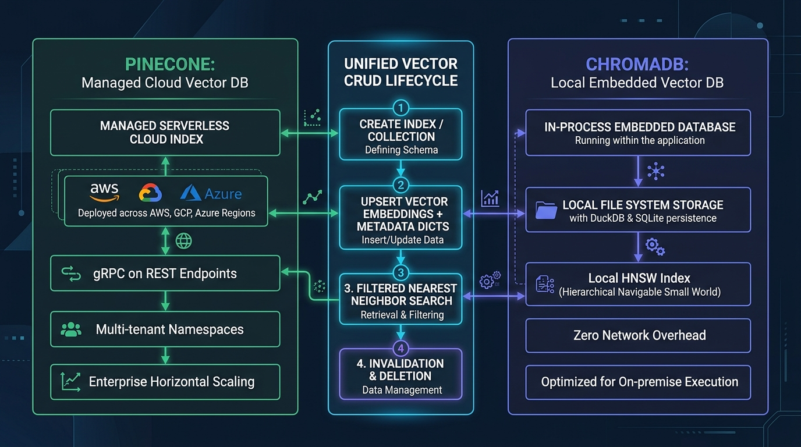

```mermaid
sequenceDiagram
    autonumber
    actor Dev as Developer / Ingestion Worker
    participant Embed as Embedding API (OpenAI / Local)
    participant CloudDB as Pinecone (Cloud Serverless)
    participant LocalDB as ChromaDB (Local Embedded)
    actor App as Production Chatbot Application

    Dev->>Embed: 1. Send Text Chunks for Embedding
    Embed-->>Dev: Return 1536-D Float Arrays
    
    rect rgb(20, 30, 45)
        Note over Dev,CloudDB: Cloud Path (Pinecone)
        Dev->>CloudDB: 2a. Batch Upsert (Vectors + Metadata + Namespace)
        CloudDB-->>Dev: HTTP 200 OK (Indexed in Cloud)
    end

    rect rgb(30, 20, 45)
        Note over Dev,LocalDB: Local Path (ChromaDB)
        Dev->>LocalDB: 2b. Add Documents (Vectors + Metadata to Local SQLite/HNSW)
        LocalDB-->>Dev: In-Process Commit OK
    end

    App->>Embed: 3. Embed User Query
    Embed-->>App: Query Vector
    App->>CloudDB: 4. Query with Metadata Filter (Top-5)
    CloudDB-->>App: Return Top-5 Matches + Payloads
    App-->>App: 5. Ground Prompt & Call LLM
```

# 💾 Module 04 / File 03: Storage Implementation — Building and Managing Vector Indices with Cloud-Based Pinecone and Local-Based ChromaDB

> **Zero to Hero Gen AI Course — Module 04: Advanced Data Retrieval & Vector Databases**
>
> 📅 **Module 04: Advanced Data Retrieval & Vector Databases**  
> ⏱️ **Estimated Study Time:** 65 minutes  
> 🎯 **Target Audience:** Java & Spring Boot Developers transitioning to AI Engineering  
> 🌟 **Core Objective:** Master production-grade vector storage implementations across cloud and local architectural patterns. Compare managed serverless cloud indexing (Pinecone) against local in-process embedded storage (ChromaDB). Master the unified vector CRUD lifecycle (index/collection provisioning, batch embedding upsertion with rich metadata payloads, single-stage metadata-filtered nearest neighbor search, and record invalidation), implement multi-tenant namespace isolation, and evaluate trade-offs between local sub-millisecond latency versus cloud enterprise scale.

---

## 📑 Table of Contents

1. [🌟 Executive Overview & Pedagogical Roadmap](#1--executive-overview--pedagogical-roadmap)
2. [🐣 Part 1: Conceptual Foundations & Everyday Analogies (School Inspector)](#2--part-1-conceptual-foundations--everyday-analogies-school-inspector)
   - [2.1 The Vector Storage Imperative: Beyond In-Memory Arrays](#21-the-vector-storage-imperative-beyond-in-memory-arrays)
   - [2.2 Everyday Analogy 1: The Global Fulfillment Center vs The Private Home Workshop](#22-everyday-analogy-1-the-global-fulfillment-center-vs-the-private-home-workshop)
   - [2.3 Everyday Analogy 2: The Document Dossier with an RFID Smart Chip](#23-everyday-analogy-2-the-document-dossier-with-an-rfid-smart-chip)
   - [2.4 Everyday Analogy 3: The Secured Filing Cabinet Drawers (Namespaces)](#24-everyday-analogy-3-the-secured-filing-cabinet-drawers-namespaces)
3. [📐 Part 2: Technical Deep Dive & Mathematical Mechanics (University Inspector)](#3--part-2-technical-deep-dive--mathematical-mechanics-university-inspector)
   - [3.1 Vector Indexing Mathematics: B-Trees vs HNSW Graphs](#31-vector-indexing-mathematics-b-trees-vs-hnsw-graphs)
   - [3.2 Cloud-Based Vector Storage: Managed Pinecone Architecture](#32-cloud-based-vector-storage-managed-pinecone-architecture)
   - [3.3 Modern Pinecone SDK (v3.0+): Provisioning, Metrics, and Serverless Specs](#33-modern-pinecone-sdk-v30-provisioning-metrics-and-serverless-specs)
   - [3.4 Multi-Tenant Namespaces: Cryptographic & Logical Partitioning](#34-multi-tenant-namespaces-cryptographic--logical-partitioning)
   - [3.5 Local-Based Vector Storage: Embedded ChromaDB Architecture](#35-local-based-vector-storage-embedded-chromadb-architecture)
   - [3.6 Ephemeral vs Persistent Modes & Distance Spaces (`hnsw:space`)](#36-ephemeral-vs-persistent-modes--distance-spaces-hnswspace)
   - [3.7 Automatic Embedding Pipelines vs Custom Pre-Computed Vectors](#37-automatic-embedding-pipelines-vs-custom-pre-computed-vectors)
   - [3.8 The Unified Vector CRUD Lifecycle Formalized](#38-the-unified-vector-crud-lifecycle-formalized)
   - [3.9 Metadata Filtering Mechanics: Pre-Filtering vs Post-Filtering vs Single-Stage](#39-metadata-filtering-mechanics-pre-filtering-vs-post-filtering-vs-single-stage)
4. [🧱 Part 3: Architecture, Pipeline & Enterprise Blueprints](#4--part-3-architecture-pipeline--enterprise-blueprints)
   - [4.1 Deep Architectural Comparison: Pinecone vs ChromaDB](#41-deep-architectural-comparison-pinecone-vs-chromadb)
   - [4.2 Visual Architectural Diagrams](#42-visual-architectural-diagrams)
   - [4.3 Enterprise Case Studies: Multi-Tenant SaaS vs Air-Gapped Legal Auditor](#43-enterprise-case-studies-multi-tenant-saas-vs-air-gapped-legal-auditor)
   - [4.4 Complete Ingestion & Query Sequence Flow](#44-complete-ingestion--query-sequence-flow)
   - [4.5 Production Defensive Engineering: Rate Limits, Ingestion Batches, & Resiliency](#45-production-defensive-engineering-rate-limits-ingestion-batches--resiliency)
5. [☕ Part 4: The Java / Spring Boot Developer Bridge](#5--part-4-the-java--spring-boot-developer-bridge)
   - [5.1 Conceptual Mapping: Java Spring AI vs Python Vector Databases](#51-conceptual-mapping-java-spring-ai-vs-python-vector-databases)
   - [5.2 Spring Boot Configuration: `application.yml` Auto-Configuration](#52-spring-boot-configuration-applicationyml-auto-configuration)
   - [5.3 Side-by-Side Implementation: Vector Store Operations in Java vs Python](#53-side-by-side-implementation-vector-store-operations-in-java-vs-python)
6. [🧪 Part 5: Practical Hands-On Implementation & Guided Exercises](#6--part-5-practical-hands-on-implementation--guided-exercises)
   - [6.1 Accompanying Lab Walkthrough](#61-accompanying-lab-walkthrough)
   - [6.2 Exercise 1: Ephemeral ChromaDB Collection with Complex Metadata Filtering (Beginner)](#62-exercise-1-ephemeral-chromadb-collection-with-complex-metadata-filtering-beginner)
   - [6.3 Exercise 2: Persistent ChromaDB Disk Serialization & Recovery (Intermediate)](#63-exercise-2-persistent-chromadb-disk-serialization--recovery-intermediate)
   - [6.4 Exercise 3: Resilient Pinecone Serverless Ingestion Manager with Namespaces & Backoff (Advanced)](#64-exercise-3-resilient-pinecone-serverless-ingestion-manager-with-namespaces--backoff-advanced)
   - [6.5 Exercise 4: Enterprise Dual-Backend Vector Store Facade (Expert)](#65-exercise-4-enterprise-dual-backend-vector-store-facade-expert)
7. [🎬 Part 6: Video Masterclasses & Multimedia Learning Hub](#7--part-6-video-masterclasses--multimedia-learning-hub)
   - [7.1 Telugu Video Masterclasses](#71-telugu-video-masterclasses)
   - [7.2 3D Visual & International Masterclasses](#72-3d-visual--international-masterclasses)
8. [📋 Master Cheat Sheet: Vector Storage Implementation](#8--master-cheat-sheet-vector-storage-implementation)
9. [❓ Comprehensive Self-Assessment & Exam](#9--comprehensive-self-assessment--exam)

---

## 1. 🌟 Executive Overview & Pedagogical Roadmap

In early software prototypes, developers often store vector embeddings inside in-memory Python lists or NumPy matrices:

```python
# The Naive Prototype: Python RAM
vectors = [get_embedding(chunk) for chunk in documents]
# Search: Exhaustive linear scan across RAM (O(N) search)
```

While acceptable for 500 documents, this approach fails catastrophically in enterprise production:
1. **Volatile Ephemeral Memory**: If the container restarts or crashes, all embeddings are lost, requiring hours of costly re-embedding over external HTTPS APIs.
2. **Memory Exhaustion (OOM)**: Storing 2,000,000 vectors of dimension 1,536 requires over 12 GB of raw RAM, crashing serverless workers and application pods.
3. **Zero Distributed Scaling**: An in-memory Python array cannot be shared across horizontally autoscaled microservices.
4. **Lack of Metadata Filtering & ACID Operations**: Python lists lack atomic mutations, approximate nearest neighbor (ANN) graph indexes, and metadata query engines.

To solve this, enterprise AI systems deploy dedicated **Vector Databases**. In this module, we dissect the two industry archetypes:
- **Pinecone**: Cloud-native, fully managed, decoupled serverless architecture with multi-tenant namespaces.
- **ChromaDB**: Lightweight, open-source, embedded in-process database running with zero network overhead.

```
+----------------------------------------------------------------------------------------------------+
|                                 THE VECTOR DATABASE LANDSCAPE                                      |
+----------------------------------------------------------------------------------------------------+
|                                                                                                    |
|    MANAGED CLOUD SAAS (Pinecone)                  LOCAL EMBEDDED / EDGE (ChromaDB)                 |
|    ----------------------------                  --------------------------------                 |
|    - Infinite horizontal scalability             - Runs directly in Python / local process         |
|    - Storage & compute completely decoupled      - Zero network latency (0.5 ms in-memory IPC)     |
|    - Multi-tenant namespaces out-of-the-box      - 100% Free, open-source (Apache 2.0)            |
|    - Zero DevOps or cluster maintenance          - 100% Private, air-gapped data sovereignty       |
|    - Best for: Multi-user enterprise SaaS        - Best for: Unit tests, edge apps, confidential AI|
|                                                                                                    |
+----------------------------------------------------------------------------------------------------+
```

---

## 2. 🐣 Part 1: Conceptual Foundations & Everyday Analogies (School Inspector)

### 2.1 The Vector Storage Imperative: Beyond In-Memory Arrays

Imagine running a high-volume retail company. 
- Keeping your inventory in Python RAM is like writing all your stock details on sticky notes stuck to your desk. If a gust of wind blows through your window (the computer crashes), your entire inventory catalog is gone forever.
- A **Vector Database** is a purpose-built warehouse. It gives every item a permanent shelf, an electronic RFID barcode, and an automated retrieval forklift that finds any product in under 10 milliseconds.

---

### 2.2 Everyday Analogy 1: The Global Fulfillment Center vs The Private Home Workshop

```
+----------------------------------------------------------------------------------------------------+
|                         FULFILLMENT CENTER vs HOME WORKSHOP ANALOGY                                |
+----------------------------------------------------------------------------------------------------+
|                                                                                                    |
|  1. PINECONE (The Automated Amazon Fulfillment Center):                                            |
|     - You don't build the warehouse, wax the floors, or repair the forklifts (Zero DevOps).        |
|     - It spans football fields in size and holds 100 million items with ease.                      |
|     - You send delivery trucks (API requests over HTTPS) and pay a monthly subscription.           |
|     - Great for serving millions of global customers across multiple cities.                       |
|                                                                                                    |
|  2. CHROMADB (The Precision Workbench in Your Personal Garage):                                   |
|     - It sits right inside your room (in-process Python).                                          |
|     - Zero travel time: You reach out your hand and grab the tool in 0.5 milliseconds (Zero lag).  |
|     - Nobody else can see what you are building; it is 100% private and offline.                   |
|     - Costs zero dollars, but is bounded by the physical size of your garage (RAM and disk).       |
|                                                                                                    |
+----------------------------------------------------------------------------------------------------+
```

---

### 2.3 Everyday Analogy 2: The Document Dossier with an RFID Smart Chip

When you store a record in a vector database, it is not merely a list of numbers. It is a complete **document dossier**:

```
+----------------------------------------------------------------------------------------------------+
|                              THE DOCUMENT DOSSIER ARCHITECTURE                                     |
+----------------------------------------------------------------------------------------------------+
|                                                                                                    |
|   1. UNIQUE ID:       "doc_9921_chunk_4"                                                           |
|   2. RFID SMART CHIP: [0.024, -0.198, 0.457, ..., 0.812]  (1536-D Vector Coordinates)              |
|   3. PAPER PAYLOAD:   "The server fan failed at 03:00 UTC due to thermal throttling..."            |
|   4. METADATA STAMP:  { "author": "Maya Vance", "dept": "DevOps", "severity": "HIGH", "year": 2024}|
|                                                                                                    |
|   - The search engine reads the RFID SMART CHIP to calculate mathematical semantic similarity.     |
|   - The database reads the METADATA STAMP to filter out irrelevant departments.                    |
|   - The application returns the PAPER PAYLOAD to display the plain English text to the user!       |
|                                                                                                    |
+----------------------------------------------------------------------------------------------------+
```

---

### 2.4 Everyday Analogy 3: The Secured Filing Cabinet Drawers (Namespaces)

In enterprise multi-tenant software, Tenant A (e.g., Acme Corp) must never be allowed to view Tenant B's (e.g., Globex Inc) proprietary documents.

Rather than buying 1,000 separate physical filing cabinets (which would be astronomically expensive):
- You buy **one master filing cabinet (Pinecone Index)**.
- You partition it into **lockable drawers (Namespaces)** labeled `"Tenant_Acme"` and `"Tenant_Globex"`.
- When an employee from Acme Corp requests a file, the automated clerk **only opens Drawer Acme**. The search mechanism is physically unable to see or traverse documents inside Drawer Globex.

---

## 3. 📐 Part 2: Technical Deep Dive & Mathematical Mechanics (University Inspector)

### 3.1 Vector Indexing Mathematics: B-Trees vs HNSW Graphs

Relational databases (PostgreSQL, Oracle, MySQL) rely on **B-Trees** to index scalar data. B-Trees sort items linearly ($1 < 2 < 3$ or `"apple" < "banana"`), executing exact lookups in $O(\log N)$ time.

However, high-dimensional vector spaces ($\mathbb{R}^{1536}$) have **no natural linear order**. You cannot sort 1,536-dimensional vectors from smallest to largest without destroying spatial relationships.

```
+----------------------------------------------------------------------------------------------------+
|                                  B-TREE vs HNSW GRAPH TOPOLOGY                                     |
+----------------------------------------------------------------------------------------------------+
|                                                                                                    |
|  Scalar B-Tree (1D Exact Lookup):                 Hierarchical Navigable Small World (HNSW):       |
|                                                                                                    |
|               [ Root: 50 ]                                Layer 2 (Express): (A) --------> (Z)     |
|              /            \                                                   |              |     |
|        [ 25 ]              [ 75 ]                         Layer 1 (Regional):(A) -> (M) -> (Z)     |
|       /      \            /      \                                            |      |       |     |
|    [ 10 ]  [ 30 ]      [ 60 ]  [ 90 ]                     Layer 0 (Local):   (A)-(B)-(M)-(Q)-(Z)   |
|                                                                                                    |
|    Algorithm: Binary Split                                Algorithm: Multi-Layer Skip-List Graph   |
|    Search: O(log N) Exact                                 Search: O(log N) Approximate (ANN)       |
|                                                                                                    |
+----------------------------------------------------------------------------------------------------+
```

Modern vector databases index dense vectors using **HNSW (Hierarchical Navigable Small World)** graphs:
- Inspired by the "Six Degrees of Separation" and skip-lists.
- **Layer 2 (Expressway)**: Sparse nodes with long-distance links across the vector space.
- **Layer 0 (Street Level)**: Dense nodes with short-range links connecting nearest neighbors.
- **Search Complexity**: Navigates from express layers down to local layers, finding the nearest neighbor in $O(\log N)$ time instead of an exhaustive $O(N)$ linear scan.

---

### 3.2 Cloud-Based Vector Storage: Managed Pinecone Architecture

Pinecone is a cloud-native vector database offering two distinct hosting models:

1. **Pinecone Serverless (Current Production Standard)**:
   - **Decoupled Architecture**: Storage is completely separated from compute. Dense vectors and payloads reside in high-durability cloud object storage (AWS S3 / Google Cloud Storage), while search graphs and indexing execute on demand on ephemeral compute instances.
   - **Zero Idle Costs**: True serverless billing. You pay strictly for storage (GB/month) and read/write compute units (RCUs/WCUs).
   - **Multi-Tenant Sharding**: Transparent geographic replication and auto-sharding.
2. **Pinecone Pod-Based (Legacy Enterprise)**:
   - Dedicated cloud instances (`p1`, `s1`, `p2`) with pre-allocated RAM and CPU cores.
   - Fixed hourly cost regardless of query volume.

---

### 3.3 Modern Pinecone SDK (v3.0+): Provisioning, Metrics, and Serverless Specs

```bash
pip install pinecone-client
```

```python
import os
from pinecone import Pinecone, ServerlessSpec

# 1. Initialize client
pc = Pinecone(api_key=os.getenv("PINECONE_API_KEY"))

index_name = "enterprise-kb"

# 2. Check and provision index
if index_name not in pc.list_indexes().names():
    pc.create_index(
        name=index_name,
        dimension=1536,                 # Must match embedding model (text-embedding-3-small)
        metric="cosine",                # "cosine", "dotproduct", or "euclidean"
        spec=ServerlessSpec(
            cloud="aws",                # "aws", "gcp", or "azure"
            region="us-east-1"
        )
    )

# 3. Connect to index instance
index = pc.Index(index_name)
```

---

### 3.4 Multi-Tenant Namespaces: Cryptographic & Logical Partitioning

Pinecone supports **Namespaces** within a single index to achieve hard multi-tenant isolation:

```python
# Upserting vectors into Tenant-Specific Namespaces
index.upsert(
    vectors=[
        {
            "id": "acme_doc_01",
            "values": [0.024, -0.198, 0.457, ...],  # 1536-D float vector
            "metadata": {"title": "Acme SLA Policy", "category": "contract", "year": 2024}
        }
    ],
    namespace="tenant_acme"   # Cryptographically isolated partition
)

# Querying ONLY within Tenant Acme's namespace
results = index.query(
    vector=[0.021, -0.185, 0.441, ...],
    top_k=5,
    namespace="tenant_acme",  # Guarantees zero leakage into tenant_globex!
    include_metadata=True
)
```

---

### 3.5 Local-Based Vector Storage: Embedded ChromaDB Architecture

**ChromaDB** is the leading open-source embedded vector database designed to run **directly inside your Python application process**:
- **Metadata Engine**: Uses an embedded **SQLite** database to store document IDs, string payloads, and structured JSON metadata.
- **Vector Search Engine**: Implements **HNSWlib** in C++ via Python bindings for in-memory nearest neighbor graph search.
- **Persistence Layer**: Serializes HNSW graphs and SQLite files directly to a local directory on your file system.

```bash
pip install chromadb
```

---

### 3.6 Ephemeral vs Persistent Modes & Distance Spaces (`hnsw:space`)

ChromaDB provides two distinct operational modes:

```python
import chromadb

# Mode 1: Ephemeral In-Memory (Destroyed on process exit; ideal for unit tests and CI/CD)
ephemeral_client = chromadb.EphemeralClient()

# Mode 2: Persistent Local Disk (Saved permanently to local directory)
persistent_client = chromadb.PersistentClient(path="./chroma_db_storage")

# Configuring distance space via collection metadata
collection = persistent_client.get_or_create_collection(
    name="legal_contracts",
    metadata={"hnsw:space": "cosine"}   # "cosine", "l2", or "ip" (inner product)
)
```

---

### 3.7 Automatic Embedding Pipelines vs Custom Pre-Computed Vectors

ChromaDB allows you to pass either pre-computed vectors or raw strings (delegating embedding generation to Chroma's built-in models):

```python
# Pattern A: Passing Raw Text (Chroma generates embeddings automatically via default MiniLM)
collection.add(
    documents=["The contract terminates on December 31, 2026.", "Liability is capped at $1,000,000."],
    metadatas=[{"section": "term"}, {"section": "liability"}],
    ids=["contract_clause_01", "contract_clause_02"]
)

# Pattern B: Supplying Custom Pre-Computed Vectors (e.g., from OpenAI text-embedding-3)
collection.add(
    embeddings=[[0.024, -0.198, ...], [0.115, 0.452, ...]],
    documents=["Raw text 1", "Raw text 2"],
    metadatas=[{"source": "pdf"}, {"source": "docx"}],
    ids=["doc_01", "doc_02"]
)
```

---

### 3.8 The Unified Vector CRUD Lifecycle Formalized

Regardless of whether you use cloud-based Pinecone or local-based ChromaDB, vector database interaction follows a **Unified 4-Step CRUD Lifecycle**:

```
+----------------------------------------------------------------------------------------------------+
|                                THE UNIFIED VECTOR CRUD LIFECYCLE                                   |
+----------------------------------------------------------------------------------------------------+
|                                                                                                    |
|  [1. CREATE]  Provision Index / Collection with Dimension (d) & Distance Metric.                   |
|                  |                                                                                 |
|                  v                                                                                 |
|  [2. UPSERT]  Insert or Update: (Vector ID, Float Array, Metadata Dict, Text Payload).              |
|                  |                                                                                 |
|                  v                                                                                 |
|  [3. QUERY]   Nearest Neighbor Search: (Query Vector, Top-K, Metadata Filter Predicate).           |
|                  |                                                                                 |
|                  v                                                                                 |
|  [4. DELETE]  Invalidate / Evict: Delete by ID, Metadata Filter, or Clear Namespace.               |
|                                                                                                    |
+----------------------------------------------------------------------------------------------------+
```

#### Step 1: Provisioning Indices & Collections
- **Pinecone**: `pc.create_index(name="kb", dimension=1536, metric="cosine", spec=ServerlessSpec(...))`
- **ChromaDB**: `client.get_or_create_collection(name="kb", metadata={"hnsw:space": "cosine"})`

#### Step 2: Batch Upserting Vectors + Metadata
- **Pinecone**: `index.upsert(vectors=[{"id": "1", "values": [...], "metadata": {...}}])`
- **ChromaDB**: `collection.upsert(ids=["1"], embeddings=[[...]], metadatas=[{...}], documents=[...])`

#### Step 3: Metadata-Filtered Nearest Neighbor Search
- **Pinecone**:
  ```python
  results = index.query(
      vector=query_vec,
      top_k=5,
      filter={"department": {"$eq": "Engineering"}, "year": {"$gte": 2024}},
      include_metadata=True
  )
  ```
- **ChromaDB**:
  ```python
  results = collection.query(
      query_embeddings=[query_vec],
      n_results=5,
      where={"$and": [{"department": "Engineering"}, {"year": {"$gte": 2024}}]}
  )
  ```

#### Step 4: Record Mutation & Deletion
- **Pinecone**: `index.delete(ids=["doc_1", "doc_2"], namespace="tenant_acme")` or `index.delete(delete_all=True)`
- **ChromaDB**: `collection.delete(ids=["doc_1", "doc_2"])` or `collection.delete(where={"status": "deprecated"})`

---

### 3.9 Metadata Filtering Mechanics: Pre-Filtering vs Post-Filtering vs Single-Stage

```
+----------------------------------------------------------------------------------------------------+
|                                METADATA FILTERING PARADIGMS                                        |
+----------------------------------------------------------------------------------------------------+
|                                                                                                    |
|  1. POST-FILTERING (Naive):                                                                        |
|     - Run vector ANN search first -> Return Top-100 nearest neighbors.                             |
|     - Discard records that don't match metadata filter (e.g., department == 'HR').                 |
|     ⚠️ Catastrophic Flaw: If only 2 of the top-100 are 'HR', user gets 2 results instead of 10!   |
|                                                                                                    |
|  2. PRE-FILTERING (Traditional):                                                                   |
|     - Scan metadata index first -> Build candidate ID list (e.g., 50,000 HR docs).                 |
|     - Run brute-force vector distance scan across the filtered list.                               |
|     ⚠️ Flaw: Inefficient if candidate list is large; bypasses HNSW graph speed.                    |
|                                                                                                    |
|  3. SINGLE-STAGE FILTERING (State of the Art - Pinecone & Modern ChromaDB):                        |
|     - Metadata filters are evaluated DURING the HNSW graph traversal.                              |
|     - Edges leading to disallowed metadata nodes are pruned dynamically while navigating.          |
|     ✅ Guarantees EXACT Top-K matches while maintaining O(log N) graph traversal speed!             |
|                                                                                                    |
+----------------------------------------------------------------------------------------------------+
```

---

## 4. 🧱 Part 3: Architecture, Pipeline & Enterprise Blueprints

### 4.1 Deep Architectural Comparison: Pinecone vs ChromaDB

| Architectural Dimension | Pinecone (Cloud Serverless) | ChromaDB (Local Embedded) |
| :--- | :--- | :--- |
| **Deployment Model** | Managed Cloud SaaS (AWS / GCP / Azure) | In-Process Embedded Library or Self-Hosted Docker |
| **Infrastructure Management** | 100% Zero DevOps (Serverless auto-scaling) | Self-managed (RAM and disk bounded by local host) |
| **Network Latency** | $\approx 25\text{ ms} - 60\text{ ms}$ (Public Cloud HTTPS/gRPC) | **$\approx 0.5\text{ ms} - 2\text{ ms}$ (Local In-Memory IPC)** |
| **Max Capacity** | Billions of vectors across distributed nodes | Millions of vectors (Bounded by local machine RAM) |
| **Cost Model** | Pay-as-you-go (\$0.33 / 1M read units + storage) | **100% Free & Open Source (Apache 2.0)** |
| **Multi-Tenancy** | First-class Namespaces with strict isolation | Separate Collections per tenant |
| **Air-Gapped / Privacy** | Requires public internet / VPC Peering | **Runs 100% offline (Ideal for defense/HIPAA/finance)** |
| **Best Production Fit** | Enterprise SaaS, large-scale multi-user apps | Edge computing, desktop apps, prototyping, CI/CD |

---

### 4.2 Visual Architectural Diagrams

Below are the verified architecture diagrams illustrating vector storage topologies:




---

### 4.3 Enterprise Case Studies: Multi-Tenant SaaS vs Air-Gapped Legal Auditor

#### Case Study 1: Multi-Tenant Enterprise SaaS Knowledge Base (Pinecone)
- **Challenge**: An enterprise customer support platform serves 5,000 corporate clients. Each corporate client has private internal HR policies and employee handbooks that must remain strictly isolated.
- **Implementation**: The application maintains a single Pinecone serverless index with 5,000 dedicated **Namespaces** (`namespace=f"tenant_{client_id}"`).
- **Outcome**: A single managed index scales dynamically from zero to 500 million vectors without provisioning separate database clusters, with guaranteed cryptographic and logical isolation between tenants.

#### Case Study 2: Air-Gapped On-Premise Legal Contract Auditor (ChromaDB)
- **Challenge**: A top-tier law firm audits classified merger contracts for defense contractors under strict regulatory compliance (zero external cloud APIs or data egress).
- **Implementation**: The desktop application packages an embedded **ChromaDB PersistentClient** running alongside a local Ollama model (`llama3:8b` and `nomic-embed-text`).
- **Outcome**: Lightning-fast sub-millisecond retrieval with complete data sovereignty and zero cloud egress risk.

---

### 4.4 Complete Ingestion & Query Sequence Flow



---

### 4.5 Production Defensive Engineering: Rate Limits, Ingestion Batches, & Resiliency

1. **Batch Sizing**:
   - Sending vectors one by one over HTTP creates massive network latency overhead. Always upsert in batches of **100 to 500 vectors**.
2. **Exponential Backoff on HTTP 429**:
   - When ingesting millions of vectors, cloud vector APIs will throttle requests. Wrap upsert calls with exponential backoff and jitter (`retry-after` header inspection).
3. **Connection Pooling**:
   - In Python and Java, reuse client connections rather than instantiating new client objects per HTTP request. Pinecone uses gRPC or HTTP/2 connection pooling under the hood.
4. **Metadata Sanitization**:
   - Vector databases reject complex nested metadata structures. Sanitize metadata into flat primitive types (`str`, `int`, `float`, `bool`) before upserting.

---

## 5. ☕ Part 4: The Java / Spring Boot Developer Bridge

### 5.1 Conceptual Mapping: Java Spring AI vs Python Vector Databases

For Java and Spring Boot engineers, vector databases map directly to the Spring AI `VectorStore` ecosystem:

| Concept | Python Ecosystem | Java / Spring AI Ecosystem | Enterprise JVM Analogy |
| :--- | :--- | :--- | :--- |
| **Vector Store Interface** | `VectorStore` (LangChain) | `org.springframework.ai.vectorstore.VectorStore` | Spring Data `JpaRepository<T, ID>` |
| **Pinecone Client** | `pinecone.Pinecone` (Python SDK) | `PineconeVectorStore` | Spring Cloud AWS / Managed Cloud SDK |
| **ChromaDB Client** | `chromadb.PersistentClient` | `ChromaVectorStore` | Embedded H2 Database / SQLite JDBC |
| **Record Ingestion** | `vectorstore.add_documents(docs)` | `vectorStore.add(List<Document> documents)` | `repository.saveAll(entities)` |
| **Search Request** | `vectorstore.similarity_search(query, k)`| `vectorStore.similaritySearch(SearchRequest.query(...))` | `Specification<T>` / `CriteriaQuery` |
| **Metadata Filter** | `{"dept": {"$eq": "HR"}}` | `FilterExpressionBuilder.eq("dept", "HR")` | JPA `@Query("SELECT ... WHERE dept = :dept")` |
| **Multi-Tenancy** | `namespace="tenant_1"` | `SearchRequest.builder().withTopK(5)...` + Tenant Filter | Hibernate `@TenantId` / Multi-Tenancy Resolver |

---

### 5.2 Spring Boot Configuration: `application.yml` Auto-Configuration

In Spring Boot 3.x with Spring AI, configuring Pinecone or ChromaDB is declarative via `application.yml`:

```yaml
# application.yml for Spring AI Vector Database
spring:
  ai:
    vectorstore:
      pinecone:
        apiKey: ${PINECONE_API_KEY}
        environment: us-east-1
        projectId: ${PINECONE_PROJECT_ID}
        indexName: enterprise-kb
        namespace: default
      chroma:
        host: localhost
        port: 8000
        collectionName: legal_contracts
```

---

### 5.3 Side-by-Side Implementation: Vector Store Operations in Java vs Python

#### Java (Spring AI Pipeline)
```java
package com.enterprise.ai.service;

import org.springframework.ai.document.Document;
import org.springframework.ai.vectorstore.SearchRequest;
import org.springframework.ai.vectorstore.VectorStore;
import org.springframework.ai.vectorstore.filter.FilterExpressionBuilder;
import org.springframework.stereotype.Service;

import java.util.List;
import java.util.Map;

@Service
public class EnterpriseVectorStoreService {

    private final VectorStore vectorStore;

    public EnterpriseVectorStoreService(VectorStore vectorStore) {
        this.vectorStore = vectorStore;
    }

    public void upsertDocument(String id, String content, String department, int year) {
        Document doc = new Document(id, content, Map.of(
                "department", department,
                "year", year
        ));
        this.vectorStore.add(List.of(doc));
    }

    public List<Document> searchWithFilter(String query, String targetDepartment) {
        FilterExpressionBuilder b = new FilterExpressionBuilder();
        
        SearchRequest request = SearchRequest.query(query)
                .withTopK(5)
                .withSimilarityThreshold(0.75)
                .withFilterExpression(b.eq("department", targetDepartment).build());

        return this.vectorStore.similaritySearch(request);
    }
}
```

#### Python (LangChain Pipeline)
```python
from typing import List, Dict, Any
from langchain_core.documents import Document
from langchain_chroma import Chroma
from langchain_openai import OpenAIEmbeddings

class EnterpriseVectorStoreService:
    def __init__(self, persist_directory: str = "./chroma_db_storage"):
        self.embeddings = OpenAIEmbeddings(model="text-embedding-3-small")
        self.vector_store = Chroma(
            collection_name="enterprise_kb",
            embedding_function=self.embeddings,
            persist_directory=persist_directory
        )

    def upsert_document(self, doc_id: str, content: str, department: str, year: int) -> None:
        doc = Document(
            page_content=content,
            metadata={"department": department, "year": year}
        )
        self.vector_store.add_documents([doc], ids=[doc_id])

    def search_with_filter(self, query: str, target_department: str, top_k: int = 5) -> List[Document]:
        return self.vector_store.similarity_search(
            query=query,
            k=top_k,
            filter={"department": {"$eq": target_department}}
        )
```

---

## 6. 🧪 Part 5: Practical Hands-On Implementation & Guided Exercises

### 6.1 Accompanying Lab Walkthrough

The workspace includes a dedicated runnable Python lab demonstrating both Pinecone and ChromaDB implementations:

📂 **Lab Location:** [`4. Advanced Data Retrieval & Vector Databases/code/vector_storage_lab.py`](file:///c:/Users/sriva/OneDrive/Desktop/GEN%20AI%20COURSE/4.%20Advanced%20Data%20Retrieval%20&%20Vector%20Databases/code/vector_storage_lab.py)

Run the lab directly from your terminal:
```bash
py "4. Advanced Data Retrieval & Vector Databases/code/vector_storage_lab.py"
```

---

### 6.2 Exercise 1: Ephemeral ChromaDB Collection with Complex Metadata Filtering (Beginner)

**Objective**: Write a standalone Python script that provisions an in-memory ChromaDB collection, loads 5 sample enterprise documents across different departments and urgency levels, and performs single-stage metadata-filtered queries.

```python
import chromadb
from typing import List, Dict, Any

def run_ephemeral_chroma_demo():
    # 1. Initialize ephemeral in-memory client
    client = chromadb.EphemeralClient()
    collection = client.create_collection(
        name="incident_reports",
        metadata={"hnsw:space": "cosine"}
    )

    # 2. Add sample enterprise documents with metadata
    docs = [
        "Database connection pool exhausted during peak traffic at 14:00 UTC.",
        "Frontend React memory leak caused browser crashes on dashboard page.",
        "Payment gateway API timeout returned HTTP 504 on credit card checkout.",
        "HR portal quarterly performance review form submission failed.",
        "Redis cache cluster master node failed over to replica successfully."
    ]
    metas = [
        {"dept": "DevOps", "severity": "HIGH", "year": 2024},
        {"dept": "Frontend", "severity": "MEDIUM", "year": 2024},
        {"dept": "Payments", "severity": "CRITICAL", "year": 2024},
        {"dept": "HR", "severity": "LOW", "year": 2023},
        {"dept": "DevOps", "severity": "MEDIUM", "year": 2024}
    ]
    ids = [f"inc_{i+1:03d}" for i in range(len(docs))]

    collection.add(documents=docs, metadatas=metas, ids=ids)
    print(f"✅ Ingested {collection.count()} incidents into Ephemeral ChromaDB.")

    # 3. Query with Complex Boolean Filter: dept == 'DevOps' AND severity == 'HIGH'
    query_text = "database failure connection timeout"
    results = collection.query(
        query_texts=[query_text],
        n_results=3,
        where={"$and": [{"dept": {"$eq": "DevOps"}}, {"severity": {"$eq": "HIGH"}}]}
    )

    print(f"\n--- Query: '{query_text}' (Filtered: DevOps + HIGH) ---")
    for doc_id, doc, meta, dist in zip(results["ids"][0], results["documents"][0], results["metadatas"][0], results["distances"][0]):
        print(f"[{doc_id}] (Cosine Distance: {dist:.4f}) Dept: {meta['dept']} | Severity: {meta['severity']}")
        print(f"Content: {doc}\n")

if __name__ == "__main__":
    run_ephemeral_chroma_demo()
```

---

### 6.3 Exercise 2: Persistent ChromaDB Disk Serialization & Recovery (Intermediate)

**Objective**: Demonstrate idempotent disk serialization. Ingest records into a local folder, shut down the client, instantiate a new client pointing to the same folder, and verify that the data persists without re-indexing.

```python
import os
import shutil
import chromadb

def test_persistent_chroma_lifecycle(db_path: str = "./test_chroma_storage"):
    # Clean previous run if needed
    if os.path.exists(db_path):
        shutil.rmtree(db_path)

    # Phase 1: Write and Persist
    print("--- Phase 1: Ingesting into PersistentClient ---")
    client_1 = chromadb.PersistentClient(path=db_path)
    col_1 = client_1.get_or_create_collection(name="policies")
    col_1.add(
        documents=["Employees are eligible for 20 days paid time off annually."],
        metadatas=[{"type": "HR", "version": 1}],
        ids=["pto_policy_01"]
    )
    print(f"Client 1 Document Count: {col_1.count()}")
    del client_1  # Simulate process termination

    # Phase 2: Recover from Disk
    print("\n--- Phase 2: Restarting Client & Verifying Recovery ---")
    client_2 = chromadb.PersistentClient(path=db_path)
    col_2 = client_2.get_collection(name="policies")
    print(f"Client 2 Recovered Count: {col_2.count()}")
    
    retrieved = col_2.get(ids=["pto_policy_01"])
    print(f"Retrieved Document: {retrieved['documents'][0]}")
    print(f"Retrieved Metadata: {retrieved['metadatas'][0]}")
    assert retrieved['documents'][0] == "Employees are eligible for 20 days paid time off annually."
    print("✅ Persistence & Recovery Verified!")

    # Cleanup test directory
    shutil.rmtree(db_path)

if __name__ == "__main__":
    test_persistent_chroma_lifecycle()
```

---

### 6.4 Exercise 3: Resilient Pinecone Serverless Ingestion Manager with Namespaces & Backoff (Advanced)

**Objective**: Write a production-grade ingestion manager for Pinecone that partitions records by multi-tenant namespaces, batches upserts in groups of 100, and implements exponential backoff to handle transient API rate limits.

```python
import time
import random
from typing import List, Dict, Any

class MockPineconeIndex:
    """Mock simulating Pinecone Serverless Index with rate limiting and namespaces."""
    def __init__(self):
        self.namespaces = {}

    def upsert(self, vectors: List[Dict[str, Any]], namespace: str = "default") -> Dict[str, Any]:
        # Simulate transient HTTP 429 rate limit (10% chance)
        if random.random() < 0.10:
            raise RuntimeError("HTTP 429: Too Many Requests - Rate limit exceeded")
        if namespace not in self.namespaces:
            self.namespaces[namespace] = {}
        for v in vectors:
            self.namespaces[namespace][v["id"]] = v
        return {"upserted_count": len(vectors)}

class ResilientPineconeIngester:
    def __init__(self, index: MockPineconeIndex, batch_size: int = 100, max_retries: int = 5):
        self.index = index
        self.batch_size = batch_size
        self.max_retries = max_retries

    def upsert_records(self, records: List[Dict[str, Any]], namespace: str = "default") -> int:
        total_upserted = 0
        for i in range(0, len(records), self.batch_size):
            batch = records[i:i + self.batch_size]
            attempt = 0
            while attempt < self.max_retries:
                try:
                    res = self.index.upsert(vectors=batch, namespace=namespace)
                    total_upserted += res["upserted_count"]
                    break
                except RuntimeError as err:
                    attempt += 1
                    wait_time = (2 ** attempt) * 0.1 + random.uniform(0.01, 0.05)
                    print(f"⚠️ [Attempt {attempt}] Rate limited on batch {i}. Retrying in {wait_time:.2f}s...")
                    time.sleep(wait_time)
                    if attempt == self.max_retries:
                        raise RuntimeError(f"Exceeded max retries for batch {i}: {err}")
        return total_upserted

# Verification test
if __name__ == "__main__":
    mock_idx = MockPineconeIndex()
    ingester = ResilientPineconeIngester(mock_idx, batch_size=50)

    # Generate 150 synthetic records
    sample_data = [
        {"id": f"vec_{i}", "values": [0.1] * 1536, "metadata": {"tenant": "alpha"}}
        for i in range(150)
    ]

    count = ingester.upsert_records(sample_data, namespace="tenant_alpha")
    print(f"✅ Successfully ingested {count} vectors into namespace 'tenant_alpha'.")
    print(f"Total stored in 'tenant_alpha': {len(mock_idx.namespaces['tenant_alpha'])}")
```

---

### 6.5 Exercise 4: Enterprise Dual-Backend Vector Store Facade (Expert)

**Objective**: Build a clean Python abstraction (`VectorStoreFacade`) adhering to the Dependency Inversion Principle. The facade exposes uniform `add_documents` and `query` methods while delegating to either local ChromaDB or cloud Pinecone depending on configuration.

```python
from abc import ABC, abstractmethod
from typing import List, Dict, Any

class BaseVectorStoreBackend(ABC):
    @abstractmethod
    def add(self, doc_id: str, vector: List[float], text: str, metadata: Dict[str, Any]) -> None:
        pass

    @abstractmethod
    def search(self, query_vector: List[float], top_k: int) -> List[Dict[str, Any]]:
        pass

class MockChromaBackend(BaseVectorStoreBackend):
    def __init__(self):
        self.store = {}

    def add(self, doc_id: str, vector: List[float], text: str, metadata: Dict[str, Any]) -> None:
        self.store[doc_id] = {"vector": vector, "text": text, "metadata": metadata}

    def search(self, query_vector: List[float], top_k: int) -> List[Dict[str, Any]]:
        # Compute dot product
        results = []
        for doc_id, item in self.store.items():
            sim = sum(a * b for a, b in zip(query_vector, item["vector"]))
            results.append({"id": doc_id, "score": sim, "text": item["text"], "metadata": item["metadata"]})
        return sorted(results, key=lambda x: x["score"], reverse=True)[:top_k]

class MockPineconeBackend(BaseVectorStoreBackend):
    def __init__(self, namespace: str = "production"):
        self.namespace = namespace
        self.store = {}

    def add(self, doc_id: str, vector: List[float], text: str, metadata: Dict[str, Any]) -> None:
        self.store[doc_id] = {"vector": vector, "text": text, "metadata": metadata}

    def search(self, query_vector: List[float], top_k: int) -> List[Dict[str, Any]]:
        results = []
        for doc_id, item in self.store.items():
            sim = sum(a * b for a, b in zip(query_vector, item["vector"]))
            results.append({"id": doc_id, "score": sim, "text": item["text"], "metadata": item["metadata"]})
        return sorted(results, key=lambda x: x["score"], reverse=True)[:top_k]

class VectorStoreFacade:
    """Enterprise unified facade for switching backends dynamically."""
    def __init__(self, backend_type: str = "chroma"):
        if backend_type == "chroma":
            self.backend: BaseVectorStoreBackend = MockChromaBackend()
        elif backend_type == "pinecone":
            self.backend = MockPineconeBackend()
        else:
            raise ValueError(f"Unknown backend: {backend_type}")

    def ingest(self, doc_id: str, vector: List[float], text: str, metadata: Dict[str, Any]) -> None:
        self.backend.add(doc_id, vector, text, metadata)

    def retrieve(self, query_vector: List[float], top_k: int = 3) -> List[Dict[str, Any]]:
        return self.backend.search(query_vector, top_k)

# Verification test
if __name__ == "__main__":
    for b_type in ["chroma", "pinecone"]:
        facade = VectorStoreFacade(backend_type=b_type)
        facade.ingest("doc_1", [0.9, 0.1], "High-performance distributed storage.", {"dept": "Infra"})
        facade.ingest("doc_2", [0.1, 0.9], "Culinary guide to French wines.", {"dept": "Food"})
        hits = facade.retrieve([0.95, 0.05], top_k=1)
        print(f"Backend [{b_type.upper()}] Top Hit: {hits[0]['text']} (Score: {hits[0]['score']:.4f})")
```

---

## 7. 🎬 Part 6: Video Masterclasses & Multimedia Learning Hub

### 7.1 Telugu Video Masterclasses

| Video Title | Channel / Creator | Core Concepts Covered | Verified Search Query |
| :--- | :--- | :--- | :--- |
| **Vector Databases (ChromaDB & Pinecone) in Telugu** | *Python Life Telugu* | Pinecone setup, ChromaDB local collections, CRUD operations, RAG search | `Python Life Telugu Vector Databases Pinecone ChromaDB RAG` |
| **LangChain with Pinecone & ChromaDB in Telugu** | *Vamsi Bhavani* | Connecting vector stores with LangChain, metadata filtering, namespaces | `Vamsi Bhavani Pinecone ChromaDB LangChain Vector Store` |
| **Database Systems & Vector Indexes in Telugu** | *Telugu Tech Tutorials* | In-memory vs persistent storage, SQLite basics, vector indexing | `Telugu Tech Tutorials Database Systems Vector Indexes Python` |

---

### 7.2 3D Visual & International Masterclasses

| Video Title | Channel / Speaker | Duration | Core Topics Covered | Verified Link / Query |
| :--- | :--- | :--- | :--- | :--- |
| **Learn RAG From Scratch** | freeCodeCamp.org (Lance Martin) | 2 hr 30 min | Vector databases, Pinecone, ChromaDB, indexing, and retrieval | [Watch Video](https://www.youtube.com/watch?v=JE-NAtLRQ9E) |
| **LangChain Crash Course for Beginners** | freeCodeCamp.org | 1 hr 25 min | Vector store integrations, document loaders, embeddings, and RAG | [Watch Video](https://www.youtube.com/watch?v=kYRB-v9z610) |
| **Vector Databases at Scale & System Architecture** | *ByteByteGo* | 15 min | Visual 3D animations of HNSW graphs, vector indexing, and cloud storage | `ByteByteGo Vector Databases System Architecture` |
| **HNSW & Vector Search Explained Visually** | *StatQuest with Josh Starmer* | 18 min | Approximate nearest neighbors, high-dimensional distances, graph search | `StatQuest Vector Search HNSW Approximate Nearest Neighbors` |
| **Intro to Large Language Models** | Andrej Karpathy | 1 hr 00 min | Vector stores, retrieval mechanisms, and grounding AI systems | [Watch Video](https://www.youtube.com/watch?v=zjkBMFhNj_g) |

---

## 8. 📋 Master Cheat Sheet: Vector Storage Implementation

```
+----------------------------------------------------------------------------------------------------+
|                         VECTOR STORAGE IMPLEMENTATION CHEAT SHEET                                  |
+----------------------------------------------------------------------------------------------------+
|                                                                                                    |
|  PINECONE (CLOUD SERVERLESS):                                                                      |
|  - Client: from pinecone import Pinecone, ServerlessSpec; pc = Pinecone(api_key=...)               |
|  - Create: pc.create_index(name, dimension=1536, metric='cosine', spec=ServerlessSpec(...))        |
|  - Upsert: index.upsert(vectors=[{"id": ..., "values": [...], "metadata": {...}}], namespace=...) |
|  - Query:  index.query(vector=..., top_k=5, filter={"dept": "HR"}, namespace=..., include_meta=T) |
|  - Strength: Billions of vectors, multi-tenant namespaces, decoupled serverless auto-scaling.      |
|                                                                                                    |
|  CHROMADB (LOCAL EMBEDDED):                                                                        |
|  - Client: client = chromadb.PersistentClient(path="./chroma_db_storage")                          |
|  - Create: col = client.get_or_create_collection(name, metadata={"hnsw:space": "cosine"})         |
|  - Upsert: col.upsert(ids=[...], embeddings=[[...]], metadatas=[{...}], documents=[...])          |
|  - Query:  col.query(query_embeddings=[...], n_results=5, where={"$and": [{"dept": "HR"}]})       |
|  - Strength: Sub-millisecond IPC latency (<1ms), 100% free, 100% air-gapped data privacy.         |
|                                                                                                    |
|  PRODUCTION RULES:                                                                                 |
|  1. Batch Upserts: Group into 100-500 vectors per request to eliminate network round-trip delays.  |
|  2. Single-Stage Filtering: Prefer databases that prune HNSW edges dynamically during traversal.   |
|  3. Multi-Tenancy: Always partition enterprise SaaS tenants via Pinecone Namespaces or collections.|
|  4. Dimension Matching: Ensure index dimension strictly matches your embedding model output (1536).|
|                                                                                                    |
+----------------------------------------------------------------------------------------------------+
```

---

## 9. ❓ Comprehensive Self-Assessment & Exam

### Q1: What is the primary architectural difference between Pinecone Serverless and local ChromaDB?
<details>
<summary>👉 Click to view answer & architectural explanation</summary>

**Answer:**
- **Pinecone Serverless** is a fully managed cloud SaaS where compute and storage are decoupled. Vectors are stored in distributed cloud object storage, and indexing/searching scale dynamically on cloud compute nodes across AWS/GCP regions. It offers unlimited horizontal scalability and high availability, but incurs network latency ($20-50\text{ ms}$) and cloud subscription costs.
- **ChromaDB** is an open-source, in-process embedded database that runs directly inside your application's Python process (using SQLite and in-memory HNSWlib). It has near-zero latency ($<1\text{ ms}$), zero cloud costs, and runs completely offline/air-gapped, but is bounded by the RAM and disk limits of the host machine.
</details>

---

### Q2: Why are Pinecone "Namespaces" essential for enterprise multi-tenant applications?
<details>
<summary>👉 Click to view answer & architectural explanation</summary>

**Answer:**
In enterprise SaaS, thousands of business tenants share the same application. Provisioning a dedicated vector database index per tenant is prohibitively expensive and violates cloud provider resource limits. 

Pinecone **Namespaces** logically partition a single physical index into isolated virtual drawers. When an application queries `index.query(vector=..., namespace="tenant_123")`, the search graph traversal is strictly restricted to that namespace. This provides guaranteed data isolation with zero risk of cross-tenant data leakage while sharing underlying cluster infrastructure.
</details>

---

### Q3: What happens in ChromaDB if you pass raw text documents without supplying vector embeddings?
<details>
<summary>👉 Click to view answer & implementation details</summary>

**Answer:**
If you call `collection.add(documents=[...], ids=[...])` without supplying the `embeddings` parameter, ChromaDB automatically invokes its default built-in **Embedding Function** (typically an ONNX runtime executing `all-MiniLM-L6-v2`, yielding 384-dimensional vectors). 

**Warning in Production:** If your downstream retrieval model uses OpenAI embeddings ($d=1,536$), you must explicitly pass either custom embedding vectors or configure an OpenAI embedding function in ChromaDB to prevent dimension mismatch exceptions.
</details>

---

### Q4: When should you choose ChromaDB over Pinecone in an enterprise architecture?
<details>
<summary>👉 Click to view answer & trade-off criteria</summary>

**Answer:**
Choose ChromaDB over Pinecone when:
1. **Air-Gapped / Strict Data Sovereignty Requirements**: Highly confidential environments (defense, healthcare HIPAA, legal) where customer data cannot leave the private server or local network.
2. **Sub-Millisecond Latency SLAs**: Real-time applications requiring instant in-memory vector lookups ($<1-2\text{ ms}$) where public cloud round-trips ($30-60\text{ ms}$) are unacceptable.
3. **Local Desktop / Edge AI Applications**: Standalone desktop apps running with local models (e.g. Electron + Python).
4. **Zero Cloud Infrastructure Budget**: Developing prototypes, CI/CD automated test suites, or academic research.
</details>

---

### Q5: Why is batching mandatory when upserting vectors into a cloud database like Pinecone?
<details>
<summary>👉 Click to view answer & networking explanation</summary>

**Answer:**
Upserting vectors one by one over HTTP incurs severe network latency overhead: each HTTP POST request requires TLS handshakes, header serialization, network transit, and database write acknowledgments ($\approx 50\text{ ms}$ per vector). Ingesting 100,000 vectors sequentially would take over **80 minutes**.

By batching vectors in chunks of 100 to 500 records per HTTP request, network round-trips are reduced by $500\times$, maximizing cloud ingress bandwidth and completing the ingestion in seconds without triggering API rate limits.
</details>

---

### Q6: How does Spring AI's `VectorStore` interface abstract the differences between Pinecone and ChromaDB?
<details>
<summary>👉 Click to view answer & JVM explanation</summary>

**Answer:**
Spring AI provides a unified `VectorStore` contract:
- Methods: `void add(List<Document> documents)`, `List<Document> similaritySearch(SearchRequest request)`, `void delete(List<String> idList)`.
- The application code depends solely on the `VectorStore` interface via dependency injection.
- Switching between `PineconeVectorStore` and `ChromaVectorStore` requires zero code changes—only changing the Spring Boot starter dependency in `pom.xml` and updating `application.yml` connection credentials.
</details>

---

### Q7: Why do traditional B-Trees fail when indexing high-dimensional vectors?
<details>
<summary>👉 Click to view answer & indexing mathematics</summary>

**Answer:**
B-Trees rely on **total linear ordering** ($a \le b \le c$). They split data into one-dimensional scalar ranges (e.g., $10 < x \le 20$). In a high-dimensional vector space ($\mathbb{R}^{1536}$), there is no natural linear order: vector $\mathbf{u}$ cannot be simply labeled "greater than" or "less than" vector $\mathbf{v}$. 
- Attempting to build multi-dimensional trees (like KD-trees) suffers from the **Curse of Dimensionality**: when $d > 20$, KD-trees degrade to an exhaustive $O(N)$ linear scan of every node in the tree.
- Graph-based indices like HNSW solve this by preserving neighborhood proximity graphs rather than linear orderings.
</details>

---

### Q8: What is Single-Stage Metadata Filtering, and why is it superior to Post-Filtering?
<details>
<summary>👉 Click to view answer & filtering mechanics</summary>

**Answer:**
- **Post-Filtering** runs vector ANN search first to find the top $K$ nearest neighbors, then discards items that fail metadata criteria. If the top $K$ neighbors all belong to an excluded department, the user receives 0 results even if matching documents exist elsewhere in the database.
- **Single-Stage Filtering** evaluates metadata predicates dynamically **during HNSW graph traversal**. Graph edges leading to disallowed nodes are ignored in real-time, guaranteeing that the search returns the exact requested number of top-$K$ valid items in logarithmic time.
</details>

---

### Q9: How does ChromaDB handle SQLite concurrency when multiple application threads write simultaneously?
<details>
<summary>👉 Click to view answer & database mechanics</summary>

**Answer:**
ChromaDB uses SQLite for metadata persistence. SQLite operates with database-level locking: while concurrent reads are allowed, concurrent writes can encounter `sqlite3.OperationalError: database is locked` if multiple Python processes write simultaneously.
- **Production Solution**: In multi-process or high-concurrency environments, deploy ChromaDB as a centralized **Client-Server Docker container** (`HttpClient`), allowing the Chroma server daemon to serialize and manage write transactions cleanly over HTTP/gRPC.
</details>

---

### Q10: What is the impact of mismatched vector dimensions between your embedding model and your vector index?
<details>
<summary>👉 Click to view answer & dimensional validation</summary>

**Answer:**
If an index is provisioned with `dimension=1536` (OpenAI format) and the application attempts to upsert vectors produced by a 384-dimensional model (like `all-MiniLM-L6-v2`), the vector database will reject the request immediately with an HTTP 400 validation error (e.g., `Dimension mismatch: expected 1536, got 384`).
- Dimensionality is fixed at index creation time and cannot be altered dynamically. Changing embedding models requires provisioning a new index and re-embedding the corpus.
</details>
