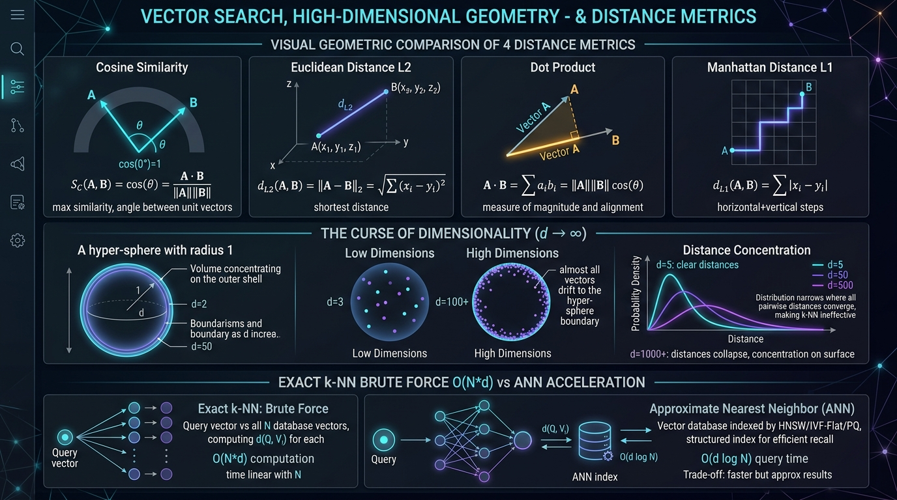
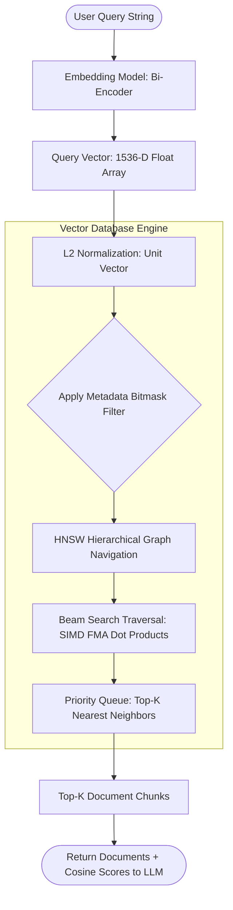

# 🔍 Vector Search: Exploring High-Dimensional Data, Distance Metrics, and Cosine Similarity

> **Zero to Hero Gen AI Course — Module 04: Advanced Data Retrieval & Vector Databases**
>
> 📅 Module 4 | ⏱️ Estimated Reading Time: 60 minutes | 🎯 Level: Intermediate to Advanced
>
> **Core Objective:** Master the geometric and algorithmic foundations of vector search in high-dimensional spaces. Dissect similarity and distance metrics (Cosine Similarity, Dot Product, Euclidean $L_2$, and Manhattan $L_1$), analyze the mathematical realities of the *Curse of Dimensionality* (volume collapse, shell concentration, distance concentration), compare exact brute-force k-NN ($O(N \cdot d)$) against Approximate Nearest Neighbor (ANN) index paradigms, and evaluate hardware SIMD acceleration in modern vector databases.

---

## 📑 Table of Contents

1. [The Search Paradigm Shift: From Relational B-Trees to Vector Geometry](#1-the-search-paradigm-shift-from-relational-b-trees-to-vector-geometry)
2. [Intuitive Mental Models & Analogies](#2-intuitive-mental-models--analogies)
   - [2.1 The Compass Angle vs The Measuring Tape](#21-the-compass-angle-vs-the-measuring-tape)
   - [2.2 The Hyper-Dimensional Soap Bubble](#22-the-hyper-dimensional-soap-bubble)
   - [2.3 The Phonebook Scan vs The Highway Expressway](#23-the-phonebook-scan-vs-the-highway-expressway)
3. [The Four Pillar Distance & Similarity Metrics](#3-the-four-pillar-distance--similarity-metrics)
   - [3.1 Cosine Similarity & Cosine Distance](#31-cosine-similarity--cosine-distance)
   - [3.2 Dot Product (Inner Product / IP)](#32-dot-product-inner-product--ip)
   - [3.3 Euclidean Distance ($L_2$ Norm)](#33-euclidean-distance-l_2-norm)
   - [3.4 Manhattan Distance ($L_1$ Norm)](#34-manhattan-distance-l_1-norm)
   - [3.5 Metric Selection Decision Matrix](#35-metric-selection-decision-matrix)
4. [The Geometry of High-Dimensional Space & The Curse of Dimensionality](#4-the-geometry-of-high-dimensional-space--the-curse-of-dimensionality)
   - [4.1 Why High-Dimensional Intuition Fails](#41-why-high-dimensional-intuition-fails)
   - [4.2 Hypersphere Volume Collapse: $V_d(r) \to 0$ as $d \to \infty$](#42-hypersphere-volume-collapse-v_dr-to-0-as-d-to-infty)
   - [4.3 Surface Shell Concentration: All Mass on the Boundary](#43-surface-shell-concentration-all-mass-on-the-boundary)
   - [4.4 The Distance Concentration Phenomenon](#44-the-distance-concentration-phenomenon)
   - [4.5 Near-Orthogonality of Random Vectors](#45-near-orthogonality-of-random-vectors)
5. [Search Algorithms: Exact k-NN vs Approximate Nearest Neighbors (ANN)](#5-search-algorithms-exact-k-nn-vs-approximate-nearest-neighbors-ann)
   - [5.1 Exact k-NN (Flat Index): Brute-Force Scanning ($O(N \cdot d)$)](#51-exact-k-nn-flat-index-brute-force-scanning-on-cdot-d)
   - [5.2 Why Exact Search Fails at Enterprise Scale](#52-why-exact-search-fails-at-enterprise-scale)
   - [5.3 The ANN Trade-Off: Trading 1% Recall for 100x Latency Reduction](#53-the-ann-trade-off-trading-1-recall-for-100x-latency-reduction)
   - [5.4 Overview of the 4 Primary ANN Index Families](#54-overview-of-the-4-primary-ann-index-families)
6. [Hardware Acceleration & Vector Computation](#6-hardware-acceleration--vector-computation)
   - [6.1 SIMD (Single Instruction, Multiple Data) & AVX-512](#61-simd-single-instruction-multiple-data--avx-512)
   - [6.2 Fused Multiply-Add (FMA) Operations](#62-fused-multiply-add-fma-operations)
7. [Vector Search in Production RAG Architecture](#7-vector-search-in-production-rag-architecture)
   - [7.1 Pre-Filtering vs Post-Filtering vs Single-Stage Hybrid Search](#71-pre-filtering-vs-post-filtering-vs-single-stage-hybrid-search)
   - [7.2 Query Latency Breakdown in Production](#72-query-latency-breakdown-in-production)
8. [Complete Architecture Visualized](#8-complete-architecture-visualized)
9. [Hands-On Python Lab Walkthrough](#9-hands-on-python-lab-walkthrough)
10. [Curated Video Walkthroughs & Visual Animations](#10-curated-video-walkthroughs--visual-animations)
11. [Self-Assessment & Review Questions](#11-self-assessment--review-questions)
12. [Summary & Key Takeaways](#12-summary--key-takeaways)

---

## 1. The Search Paradigm Shift: From Relational B-Trees to Vector Geometry

In classical relational databases (PostgreSQL, MySQL, Oracle), searching relies on **exact equality and ordered scalar indexing**:

```sql
-- Relational Query: Strict Boolean Filter
SELECT * FROM articles WHERE category = 'cardiology' AND published_year > 2023;
```

Relational engines use **B-Trees** and **Hash Indexes** that achieve deterministic $O(\log N)$ or $O(1)$ lookups because numbers and strings have an unambiguous total order: $5 < 10$, and `"apple" < "banana"`.

However, in generative AI and semantic retrieval, queries are **unstructured conceptual concepts**:
- *"What are the early warning indicators of a heart failure event?"*

There is no total order for concepts: you cannot ask whether *"heart failure"* is mathematically "greater than" or "less than" *"myocardial infarction"*. 

Instead, texts are projected into a continuous vector space $\mathbb{R}^d$ ($d=1,536$ or $3,072$). The retrieval problem shifts from scalar equality to **Geometric Nearest Neighbor Search**:

$$\text{Find } \mathbf{x}^* = \arg\min_{\mathbf{x} \in \mathcal{D}} \text{dist}(\mathbf{q}, \mathbf{x})$$

Where $\mathbf{q}$ is the query vector, $\mathcal{D}$ is the database of document vectors, and $\text{dist}(\cdot)$ is a geometric distance metric.

---

## 2. Intuitive Mental Models & Analogies

```
+-----------------------------------------------------------------------------------------+
|                               VECTOR SEARCH ANALOGIES                                   |
+-----------------------------------------------------------------------------------------+
|                                                                                         |
|  1. COMPASS ANGLE vs MEASURING TAPE            2. THE HYPER-DIMENSIONAL SOAP BUBBLE     |
|                                                                                         |
|      Cosine Similarity (Compass Angle):           In 1,536 dimensions:                  |
|      * Measures directional alignment (θ).        * 99.999% of space is empty vacuum.   |
|      * Ignores vector magnitude (length).         * All vectors drift to the very outer |
|      * Great for documents of varying lengths.      skin of the hypersphere!            |
|                                                                                         |
|      Euclidean Distance (Measuring Tape):         * Pairwise distances concentrate:     |
|      * Measures straight-line physical gap.         all documents seem equidistant.     |
|      * Heavily penalized if one vector is long                                          |
|        and the other is short.                                                          |
|                                                                                         |
|  3. THE TELEPHONE DIRECTORY vs THE HIGHWAY EXPRESSWAY SYSTEM                            |
|                                                                                         |
|      Exact k-NN (Flat Brute Force):               ANN Index (e.g. HNSW Graph):          |
|      * Reads all 10,000,000 phone numbers         * Jumps onto highway, takes high-speed|
|        one-by-one from page 1 to the end.           interchange, arrives at neighborhood|
|      * 100% exact. Extremely slow ($O(N)$).         in 5 milliseconds ($O(\log N)$).    |
|                                                                                         |
+-----------------------------------------------------------------------------------------+
```

### 2.1 The Compass Angle vs The Measuring Tape
Imagine two ships leaving port:
- Ship A travels **10 nautical miles Northeast**.
- Ship B travels **1,000 nautical miles Northeast**.
- **Cosine Similarity (The Compass)**: Both ships navigated on a heading of $45^\circ$. The angle between them is $\theta = 0^\circ$ ($\cos 0^\circ = 1.0$). Cosine similarity concludes they are **100% identical in direction** (topic alignment).
- **Euclidean Distance (The Tape Measure)**: The straight-line physical distance between the ships is 990 miles. Euclidean distance concludes they are **radically far apart**.
- In text search, Ship A is a 20-word summary, and Ship B is a 2,000-word detailed article on the exact same topic. Cosine similarity correctly matches them; unnormalized Euclidean distance fails.

### 2.2 The Hyper-Dimensional Soap Bubble
In 2D or 3D, if you drop sand into an orange, most of the sand sits in the juicy interior. 
In 1,536 dimensions, counter-intuitive geometry takes over: **the volume of the interior collapses to zero**. Almost 100% of the volume of a high-dimensional sphere resides inside a microscopic skin on the outer shell. Every document vector in your database sits on the surface of this hyper-dimensional bubble.

### 2.3 The Phonebook Scan vs The Highway Expressway
- **Exact k-NN (Brute Force)**: To find the closest name in a 10-million-entry phonebook, you must read all 10 million entries sequentially and measure the distance to each. As the database grows, your query time grows linearly ($O(N)$).
- **Approximate Nearest Neighbor (ANN)**: You build a hierarchical road network. You start on the inter-state expressway (skipping millions of entries per jump), exit onto the regional parkway, enter the local neighborhood, and find the closest house in 5 milliseconds ($O(\log N)$).

---

## 3. The Four Pillar Distance & Similarity Metrics



When evaluating proximity between two vectors $\mathbf{u}, \mathbf{v} \in \mathbb{R}^d$, vector databases support four fundamental metrics:

### 3.1 Cosine Similarity & Cosine Distance

Cosine similarity evaluates the angular alignment between two vectors, normalizing away variations in vector magnitude:

$$S_C(\mathbf{u}, \mathbf{v}) = \cos(\theta) = \frac{\mathbf{u} \cdot \mathbf{v}}{\|\mathbf{u}\|_2 \|\mathbf{v}\|_2} = \frac{\sum_{i=1}^d u_i v_i}{\sqrt{\sum_{i=1}^d u_i^2} \sqrt{\sum_{i=1}^d v_i^2}}$$

- **Range**: $[-1.0, +1.0]$:
  - $+1.0$: Identical direction ($\theta = 0^\circ$, identical semantic meaning).
  - $0.0$: Orthogonal ($\theta = 90^\circ$, unrelated).
  - $-1.0$: Diametrically opposite ($\theta = 180^\circ$, opposite semantic direction).
- **Cosine Distance ($D_C$)**: Vector databases minimize distance rather than maximizing similarity:
  $$D_C(\mathbf{u}, \mathbf{v}) = 1 - S_C(\mathbf{u}, \mathbf{v}) \in [0.0, 2.0]$$

### 3.2 Dot Product (Inner Product / IP)

The dot product is the raw algebraic sum of component-wise multiplications:

$$\langle \mathbf{u}, \mathbf{v} \rangle = \mathbf{u} \cdot \mathbf{v} = \sum_{i=1}^{d} u_i v_i = \|\mathbf{u}\|_2 \|\mathbf{v}\|_2 \cos(\theta)$$

- **Behavior**: Influenced by **both** angle and magnitude. If vector $\mathbf{v}$ has double the length of vector $\mathbf{w}$, it yields double the dot product score even if both point in the exact same direction.
- **When Used**: Standard for recommendation systems (where vector length reflects user preference strength or item popularity) and unit-normalized text embeddings.

### 3.3 Euclidean Distance ($L_2$ Norm)

Euclidean distance measures the straight-line Cartesian chord distance between the endpoints of two vectors:

$$d_{L_2}(\mathbf{u}, \mathbf{v}) = \|\mathbf{u} - \mathbf{v}\|_2 = \sqrt{\sum_{i=1}^d (u_i - v_i)^2}$$

- **Range**: $[0, \infty)$:
  - $0.0$: Identical vectors.
- **Sensitivity**: Highly sensitive to vector length. If two text passages express identical meaning but one is 3x longer, their raw embedding vectors will have different magnitudes, yielding a large Euclidean distance unless normalized.

### 3.4 Manhattan Distance ($L_1$ Norm)

Manhattan distance (also known as Taxicab or City Block distance) measures distance along grid axes:

$$d_{L_1}(\mathbf{u}, \mathbf{v}) = \|\mathbf{u} - \mathbf{v}\|_1 = \sum_{i=1}^d |u_i - v_i|$$

- **Properties**: Less sensitive to extreme dimensional outliers than $L_2$ because differences are not squared. Frequently utilized in high-dimensional sparse representations and image color histograms.

### 3.5 Metric Selection Decision Matrix

| Metric | Computation Complexity | Magnitude Sensitive? | Unit Vector Equivalence | Primary Use Cases |
| :--- | :---: | :---: | :---: | :--- |
| **Cosine Similarity** | Medium (Divides by norms) | ❌ No | Equals Dot Product | Text search, document retrieval, sentiment analysis, multi-length texts. |
| **Dot Product (IP)** | **Lowest (Fastest SIMD FMA)** | ✅ Yes | Equals Cosine Similarity | Recommendation engines, $L_2$-normalized embeddings (OpenAI, Cohere). |
| **Euclidean ($L_2$)** | Medium (Square root) | ✅ Yes | Monotonic to Cosine | Computer vision embeddings, facial recognition, clustering algorithms (k-means). |
| **Manhattan ($L_1$)** | Low | ✅ Yes | No | High-dimensional sparse spaces, outlier-heavy datasets. |

---

## 4. The Geometry of High-Dimensional Space & The Curse of Dimensionality

Humans live in a 3-dimensional universe. Our geometric intuition completely breaks down when dealing with $d=1,536$ or $d=3,072$ dimensional spaces. This phenomenon is known as the **Curse of Dimensionality** (Bellman, 1957).

### 4.1 Why High-Dimensional Intuition Fails

In 2D, a unit circle inside a $2 \times 2$ bounding square covers $\approx 78.5\%$ of the square's area ($\pi / 4$). 
What happens in 1,000 dimensions?

### 4.2 Hypersphere Volume Collapse: $V_d(r) \to 0$ as $d \to \infty$

The volume of a $d$-dimensional hypersphere of radius $r$ is given by:

$$V_d(r) = \frac{\pi^{d/2}}{\Gamma\left(\frac{d}{2} + 1\right)} r^d$$

Where $\Gamma(z)$ is the Gamma function (a continuous extension of factorial: $\Gamma(n) = (n-1)!$).
As $d \to \infty$, the denominator grows factorially ($(\frac{d}{2})!$), vastly outpacing the numerator $\pi^{d/2}$:

$$\lim_{d \to \infty} V_d(1) = 0$$

```
Dimensionality (d)  |  Hypersphere Volume V_d(1)
--------------------+---------------------------
2                   |  3.1416
3                   |  4.1888
5                   |  5.2638   <-- Peak volume around d = 5!
10                  |  2.5501
20                  |  0.0258
100                 |  1.87 x 10^-40
1,536 (OpenAI)      |  ~ 0.000000000... (Approaches Absolute Zero)
```

In high dimensions, **the interior of a hypersphere has effectively zero volume**.

### 4.3 Surface Shell Concentration: All Mass on the Boundary

Consider a unit hypersphere of radius $1$, and an inner shell of radius $1 - \epsilon$ (where $\epsilon = 0.01$, a thin 1% layer at the surface).
The fraction of volume contained in the inner core is:

$$\frac{V_d(1 - \epsilon)}{V_d(1)} = \frac{(1 - \epsilon)^d}{1^d} = (1 - 0.01)^d = (0.99)^d$$

For $d = 1,536$:
$$(0.99)^{1536} \approx 1.86 \times 10^{-7} \approx 0.0000186\%$$

$$\text{Fraction of Volume in the Outer 1\% Shell} = 1 - (0.99)^{1536} = \mathbf{99.99998\%}$$

> [!IMPORTANT]
> **Geometric Consequence:** In a 1,536-dimensional embedding space, **virtually 100% of all data points reside within the paper-thin outer shell** of the hypersphere. High-dimensional vector spaces are essentially hollow!

### 4.4 The Distance Concentration Phenomenon

In low-dimensional spaces, nearest neighbors are distinctly closer than distant points.
In high-dimensional spaces, pairwise distances between random points undergo **distance concentration**:

$$\lim_{d \to \infty} \frac{\text{dist}_{\max} - \text{dist}_{\min}}{\text{dist}_{\min}} \to 0$$

As dimensionality explodes, the relative difference between the nearest neighbor and the farthest point shrinks toward zero. All points begin to appear almost equidistant from the query!

```
Probability Density
    ^
    |          d = 5 (Broad distribution: distinct near & far points)
    |         /   \
    |        /  d = 50
    |       |   /   \    d = 1536 (Spike: all pairwise distances converge!)
    |       |  |  |  ||
    +-------+--+--+--++-----------------------------------------> Pairwise Distance
```

### 4.5 Near-Orthogonality of Random Vectors

If you generate two random unit vectors $\mathbf{u}, \mathbf{v}$ uniformly distributed on the surface of a $d$-dimensional hypersphere, the expectation of their dot product is:

$$\mathbb{E}[\mathbf{u} \cdot \mathbf{v}] = 0$$

$$\text{Var}(\mathbf{u} \cdot \mathbf{v}) = \frac{1}{d}$$

For $d = 1,536$:
$$\text{Standard Deviation} = \frac{1}{\sqrt{1536}} \approx 0.0255$$

By Chebyshev's inequality, **over 99.7% of all random pairs of vectors have a cosine similarity between $-0.076$ and $+0.076$** ($\theta \approx 90^\circ \pm 4^\circ$).

In high dimensions, **unrelated concepts are virtually always orthogonal**! This explains why semantic embeddings work so well: any non-zero similarity above $\approx 0.20$ represents genuine semantic alignment rather than random geometric chance.

---

## 5. Search Algorithms: Exact k-NN vs Approximate Nearest Neighbors (ANN)

### 5.1 Exact k-NN (Flat Index): Brute-Force Scanning ($O(N \cdot d)$)

The simplest vector search algorithm is **Exact k-Nearest Neighbors (Flat Index)**:

```python
# Exact Brute-Force Search Algorithm:
def exact_knn(query_vec, database_vectors, top_k=5):
    scores = []
    for doc_id, doc_vec in enumerate(database_vectors):
        sim = dot_product(query_vec, doc_vec)  # O(d) per vector
        scores.append((doc_id, sim))
    # Top-K selection
    return sorted(scores, key=lambda x: x[1], reverse=True)[:top_k]
```

- **Time Complexity**: $\mathcal{O}(N \cdot d)$ floating-point multiplications per query.
- **Space Complexity**: $\mathcal{O}(N \cdot d)$ raw vector storage.
- **Recall**: **100.0% Exact** (guaranteed mathematical ground truth).

### 5.2 Why Exact Search Fails at Enterprise Scale

Consider an enterprise knowledge base with **$10,000,000$ document chunks** of dimension $d = 1,536$:

$$\text{Operations per Query} = 10^7 \times 1,536 = \mathbf{15,360,000,000 \text{ FLOPs (15.36 GFLOPs)}}$$

At 100 queries per second (QPS), the search cluster must execute **1.53 TeraFLOPs/sec continuously**. Brute-force scanning introduces $300\text{ ms} - 1,500\text{ ms}$ of latency per request—unacceptable for interactive user chat.

```
Query Latency (ms)
  ^
  |                                        * Exact k-NN (Flat): O(N*d)
  |                                      *
  |                                    *
  |                                  *   (10M docs: ~850 ms)
  |                                *
  |  ----------------------------*----------------------- [50ms SLA Threshold]
  |  ..................................* ANN Index (HNSW): O(d * log N) (~5 ms)
  +-----------------------------------------------------> Number of Vectors (N)
     100k         1M                   10M
```

### 5.3 The ANN Trade-Off: Trading 1% Recall for 100x Latency Reduction

Industrial search systems replace exact scanning with **Approximate Nearest Neighbor (ANN)** indexing.

$$\text{Recall@K} = \frac{|\text{Retrieved Top-K by ANN} \cap \text{True Ground Truth Top-K}|}{K}$$

By accepting a tiny drop in recall (e.g., **98% or 99% Recall@10**), ANN indexes reduce query latency from **850 milliseconds down to 4 milliseconds**—a **$200\times$ speedup**!

### 5.4 Overview of the 4 Primary ANN Index Families

```
+-----------------------------------------------------------------------------------------+
|                              THE 4 PRIMARY ANN INDEX FAMILIES                           |
+-----------------------------------------------------------------------------------------+
|                                                                                         |
|  1. GRAPH-BASED (HNSW)                     2. INVERTED FILE (IVF-FLAT)                  |
|     * Navigable Small-World multi-layer       * Partitions space into Voronoi clusters. |
|       highway graph.                          * Only scans centroids closest to query.  |
|     * Gold standard for speed & recall.       * Low memory footprint, fast builds.      |
|                                                                                         |
|  3. COMPRESSION / QUANTIZATION (IVF-PQ)    4. TREE-BASED (ANNOY / KD-TREES)             |
|     * Product Quantization slices vectors     * Recursive hyperplane bisecting trees.   |
|       into sub-vectors & codebooks.           * Static read-only indexes, easy memory   |
|     * 90% memory reduction; blazingly fast.     mapping (mmap).                         |
|                                                                                         |
+-----------------------------------------------------------------------------------------+
```

---

## 6. Hardware Acceleration & Vector Computation

At the bare-metal CPU and GPU level, calculating vector distances relies on low-level instruction pipelines:

### 6.1 SIMD (Single Instruction, Multiple Data) & AVX-512

Modern CPUs (Intel Xeon, AMD EPYC, Apple M-series) feature **SIMD vector registers** (AVX-256, AVX-512, ARM Neon):
- Standard scalar CPU instruction: multiplies $1$ float at a time.
- **AVX-512 instruction**: registers are 512 bits wide ($16 \times 32$-bit floats). A single CPU clock cycle performs **16 parallel float multiplications** simultaneously!

### 6.2 Fused Multiply-Add (FMA) Operations

Vector dot products are computed using the **Fused Multiply-Add (`FMA`)** instruction:

$$\text{accumulator} \leftarrow \text{accumulator} + (u_i \times v_i)$$

FMA executes the multiplication and addition in a **single CPU clock cycle with zero intermediate rounding error**, maximizing both throughput and numerical accuracy.

---

## 7. Vector Search in Production RAG Architecture

In production Retrieval-Augmented Generation (RAG) pipelines, semantic vector search is rarely executed in isolation. It operates alongside **metadata filtering** (e.g., `user_id = 42`, `tenant_id = 'acme'`, `date >= '2024-01-01'`).

### 7.1 Pre-Filtering vs Post-Filtering vs Single-Stage Hybrid Search

```
+-----------------------------------------------------------------------------------------+
|                               METADATA FILTERING PARADIGMS                              |
+-----------------------------------------------------------------------------------------+
|                                                                                         |
|  1. POST-FILTERING (DANGEROUS):                                                         |
|     ANN Search (Top 100) ---> Apply Filter: tenant_id = 'acme'                          |
|     ⚠️ Problem: If Acme has only 2 docs in the top 100, you return only 2 results!      |
|                                                                                         |
|  2. PRE-FILTERING (INEFFICIENT):                                                        |
|     Relational Filter: tenant_id = 'acme' (Returns 50,000 IDs) ---> Brute Force Scan    |
|     ⚠️ Problem: Destroys the pre-built HNSW graph structure.                             |
|                                                                                         |
|  3. SINGLE-STAGE FILTERED ANN (GOLD STANDARD):                                          |
|     The HNSW graph traversal actively skips nodes that don't match the metadata bitmask  |
|     during the beam search walk!                                                        |
|                                                                                         |
+-----------------------------------------------------------------------------------------+
```

### 7.2 Query Latency Breakdown in Production

A typical 35-millisecond end-to-end vector search budget:
1. **Embedding Inference (Client $\to$ OpenAI API / Local ONNX)**: $15 - 25\text{ ms}$
2. **Network Transit to Vector DB**: $2 - 5\text{ ms}$
3. **Filtered ANN Graph Traversal (HNSW Index)**: $3 - 6\text{ ms}$
4. **Metadata Payload De-serialization & Top-K Ranking**: $1 - 2\text{ ms}$

---

## 8. Complete Architecture Visualized



---

## 9. Hands-On Python Lab Walkthrough

To experience vector search algorithms, distance metrics, and the curse of dimensionality hands-on, run the accompanying lab script:

📂 **Lab Location:** [`4. Advanced Data Retrieval & Vector Databases/code/vector_search_lab.py`](file:///c:/Users/sriva/OneDrive/Desktop/GEN%20AI%20COURSE/4.%20Advanced%20Data%20Retrieval%20&%20Vector%20Databases/code/vector_search_lab.py)

### Lab Experiments Included:
1. **Experiment 1: The 4 Distance Metrics Compared**: Computes Cosine Similarity, Dot Product, Euclidean $L_2$, and Manhattan $L_1$ on synthetic text embeddings and inspects ranking consistency.
2. **Experiment 2: Hypersphere Volume & Shell Concentration Simulation**: Mathematically simulates how volume collapses and mass concentrates in the outer 1% skin from $d=2$ to $d=1,536$.
3. **Experiment 3: The Distance Concentration Phenomenon**: Measures $\frac{d_{\max} - d_{\min}}{d_{\min}}$ across $d=2, 10, 100, 1536$, visualizing how distances collapse to a narrow band.
4. **Experiment 4: Exact k-NN Brute Force vs Inverted Index Benchmark**: Simulates an exact $O(N \cdot d)$ scanner across 10,000 vectors, measuring query latency and accuracy.
5. **Experiment 5: Single-Stage Filtered Vector Search**: Implements a priority-queue filtered search combining metadata constraints with vector similarity.

Run the lab in your terminal:
```bash
py "4. Advanced Data Retrieval & Vector Databases/code/vector_search_lab.py"
```

---

## 10. Curated Video Walkthroughs & Visual Animations

Enhance your conceptual understanding with these top-tier, verified video resources:

| Video Title | Channel / Speaker | Duration | Core Topics Covered | Verified Link |
| :--- | :--- | :--- | :--- | :--- |
| **Learn RAG From Scratch** | freeCodeCamp.org (Lance Martin) | 2 hr 30 min | Vector search, distance metrics, indexing, and retrieval architectures | [Watch Video](https://www.youtube.com/watch?v=JE-NAtLRQ9E) |
| **LangChain Crash Course for Beginners** | freeCodeCamp.org | 1 hr 25 min | Vector stores, similarity search, top-k retrievers, and RAG | [Watch Video](https://www.youtube.com/watch?v=kYRB-v9z610) |
| **Intro to Large Language Models** | Andrej Karpathy | 1 hr 00 min | Transformer embeddings, high-dimensional spaces, and retrieval | [Watch Video](https://www.youtube.com/watch?v=zjkBMFhNj_g) |
| **State of GPT** | Microsoft Build / Andrej Karpathy | 42 min | Embeddings, semantic indexing, and grounding LLMs with search | [Watch Video](https://www.youtube.com/watch?v=bZQun8Y4L2A) |

---

## 11. Self-Assessment & Review Questions

Test your mastery of high-dimensional vector search concepts:

### Q1: Why does Cosine Similarity ignore vector magnitude, and why is this desirable for document retrieval?
<details>
<summary>👉 Click to view answer & architectural explanation</summary>

**Answer:**
Cosine similarity divides the dot product by the product of vector norms:
$$S_C(\mathbf{u}, \mathbf{v}) = \frac{\mathbf{u} \cdot \mathbf{v}}{\|\mathbf{u}\|_2 \|\mathbf{v}\|_2}$$
This normalizes both vectors to unit length ($\|\hat{\mathbf{u}}\| = \|\hat{\mathbf{v}}\| = 1$), isolating only the **angular direction $\theta$**.

This is highly desirable in document retrieval because document length affects embedding magnitude: a short 20-word summary and a long 1,000-word essay discussing the exact same topic point in the same conceptual direction, but the essay's unnormalized vector may have a much larger magnitude. Cosine similarity recognizes their topical identity, whereas unnormalized Euclidean distance would erroneously treat them as distant.
</details>

---

### Q2: What is the "Distance Concentration Phenomenon" in high-dimensional spaces, and how does it impact nearest-neighbor search?
<details>
<summary>👉 Click to view answer & mathematical explanation</summary>

**Answer:**
The distance concentration phenomenon states that as dimensionality $d \to \infty$:
$$\lim_{d \to \infty} \frac{\text{dist}_{\max} - \text{dist}_{\min}}{\text{dist}_{\min}} \to 0$$
The relative variance of distances between arbitrary pairs of points vanishes. All points in the database begin to look roughly equidistant from the query vector. 

**Impact on Search:** In uncalibrated high-dimensional spaces, finding meaningful clusters becomes difficult because the margin between the "nearest" neighbor and a random background point shrinks. This necessitates high-quality contrastive training (to force semantic clusters apart) and careful metric selection ($L_2$ normalization).
</details>

---

### Q3: Why is hardware SIMD acceleration particularly effective for Dot Product calculations?
<details>
<summary>👉 Click to view answer & hardware explanation</summary>

**Answer:**
A dot product consists of independent component multiplications followed by summation:
$$\mathbf{u} \cdot \mathbf{v} = \sum_{i=1}^{d} u_i v_i$$
Because every component multiplication $u_i \cdot v_i$ is completely independent of all other components $u_j \cdot v_j$, the operation is **embarrassingly parallel**. 

Modern SIMD registers (such as Intel AVX-512) load 16 float values at once and execute Fused Multiply-Add (`FMA`) instructions in a single CPU cycle. A 1,536-dimensional dot product that would require 1,536 sequential scalar operations can be executed in just 96 SIMD vector cycles, achieving a $16\times$ bare-metal speedup.
</details>

---

### Q4: What is the fatal flaw of "Post-Filtering" metadata in a vector database?
<details>
<summary>👉 Click to view answer & architectural explanation</summary>

**Answer:**
In post-filtering, the vector database executes an Approximate Nearest Neighbor (ANN) search first to retrieve the top $K$ semantic candidates (e.g., $K=20$), and *then* applies metadata filters (e.g., `tenant_id = 'acme'`).

**The Fatal Flaw:** If the specific tenant or category represents a small fraction of the database (e.g., 1%), none or only 1–2 of the retrieved top-20 candidates may match the filter. The database returns an empty or severely truncated result set, even though thousands of relevant matching documents exist elsewhere in the database. 

**Remedy:** Single-stage filtered search, where metadata bitmasks constrain the graph traversal during the search itself.
</details>

---

### Q5: If an exact k-NN scan takes 10 ms for 100,000 vectors, approximately how long will it take for 10,000,000 vectors?
<details>
<summary>👉 Click to view answer & complexity calculation</summary>

**Answer:**
Exact k-NN (brute force Flat Index) has strict **linear time complexity**: $\mathcal{O}(N \cdot d)$.

$$\text{Scale Factor} = \frac{10,000,000}{100,000} = 100\times$$

$$\text{Estimated Query Latency} = 10\text{ ms} \times 100 = \mathbf{1,000 \text{ ms (1.0 Second)}}$$

A 1-second query latency violates real-time SLA limits, illustrating why enterprise systems must migrate to Approximate Nearest Neighbor (ANN) indexes (such as HNSW), which scale logarithmically ($\mathcal{O}(d \log N)$) rather than linearly.
</details>

---

## 12. Summary & Key Takeaways

1. **Geometric Retrieval**: Vector search replaces scalar B-Tree equality with continuous spatial proximity search in $\mathbb{R}^d$.
2. **Metric Distinctions**: Cosine similarity evaluates pure angular direction independent of length; Dot Product measures magnitude-weighted alignment; Euclidean distance measures straight-line chord gaps.
3. **Curse of Dimensionality**: High-dimensional spaces are virtually hollow hyperspheres where 99.999% of vector mass concentrates in a thin outer skin and random vectors are naturally orthogonal.
4. **The ANN Imperative**: Exact brute-force search scales linearly ($\mathcal{O}(N \cdot d)$) and fails past 1M vectors; ANN indexes (HNSW, IVF-PQ) trade $\approx 1\%$ recall for $100\times$ faster sub-millisecond retrieval.
5. **Single-Stage Metadata Filtering**: Production RAG systems require integrated single-stage filtered search to prevent the catastrophic recall drop of naive post-filtering.
