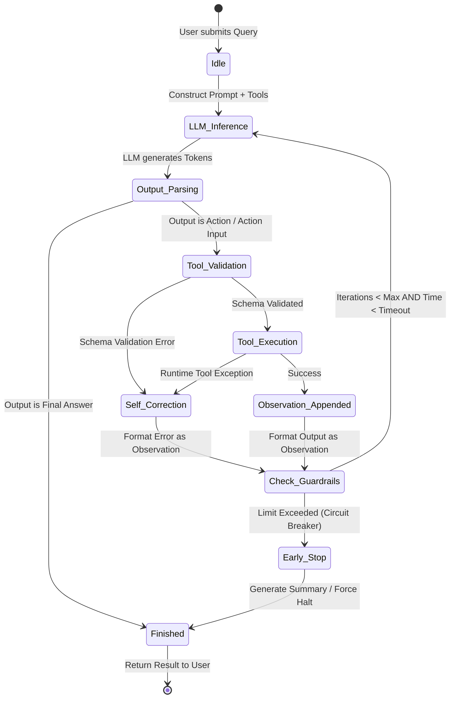

# 🤖 Module 05 / File 01: Autonomous Agents — Designing ReAct (Reasoning + Acting) Agents Capable of Using External Tools

> **Zero to Hero Gen AI Course — Module 05: Agents, Tooling & Open-Source Models**
>
> 📅 **Module 05: Agents, Tooling & Open-Source Models**  
> ⏱️ **Estimated Study Time:** 65 minutes  
> 🎯 **Target Audience:** Java & Spring Boot Developers transitioning to AI Engineering  
> 🌟 **Core Objective:** Bridge the fundamental divide between deterministic LLM execution chains and autonomous, goal-oriented decision systems. Master the ReAct (Reasoning + Acting) framework pioneered by Yao et al. (2022). Deconstruct the cyclic interplay of internal verbal reasoning (`Thought`), external environment manipulation (`Action`), sensory feedback integration (`Observation`), and termination condition synthesis (`Final Answer`). Engineer robust, type-safe external tools with Pydantic validation schemas, implement production-grade `AgentExecutor` loops, enforce strict execution guardrails (`max_iterations`, wall-clock timeouts), handle runtime exceptions via autonomous self-correction, and evaluate the trade-offs between zero-shot prompt-based ReAct and native API-level function calling.

---

## 📑 Table of Contents

1. [🌟 Executive Overview & Pedagogical Roadmap](#1--executive-overview--pedagogical-roadmap)
2. [🐣 Part 1: Conceptual Foundations & Everyday Analogies (School Inspector)](#2--part-1-conceptual-foundations--everyday-analogies-school-inspector)
   - [2.1 The Paradigm Shift: From Deterministic Chains to Autonomous Agents](#21-the-paradigm-shift-from-deterministic-chains-to-autonomous-agents)
   - [2.2 Everyday Analogy 1: The Master Detective with a Tool Bag](#22-everyday-analogy-1-the-master-detective-with-a-tool-bag)
   - [2.3 Everyday Analogy 2: The Rigid Factory Conveyor vs The Autonomous Mars Rover](#23-everyday-analogy-2-the-rigid-factory-conveyor-vs-the-autonomous-mars-rover)
   - [2.4 Everyday Analogy 3: The Executive Assistant and the Corporate Rolodex](#24-everyday-analogy-3-the-executive-assistant-and-the-corporate-rolodex)
3. [📐 Part 2: Technical Deep Dive & Mathematical Mechanics (University Inspector)](#3--part-2-technical-deep-dive--mathematical-mechanics-university-inspector)
   - [3.1 The ReAct Framework: Yao et al. (2022) Formulation](#31-the-react-framework-yao-et-al-2022-formulation)
   - [3.2 The Formal Execution Tuple](#32-the-formal-execution-tuple)
   - [3.3 Deconstructing the ReAct Prompt Architecture & Lexical Tokens](#33-deconstructing-the-react-prompt-architecture--lexical-tokens)
   - [3.4 Stop Sequences: Why the Engine Must Halt at `Observation:`](#34-stop-sequences-why-the-engine-must-halt-at-observation)
   - [3.5 Tool Engineering & Type-Safe Schemas with Pydantic V2](#35-tool-engineering--type-safe-schemas-with-pydantic-v2)
   - [3.6 The Agent Execution Engine & State Machine](#36-the-agent-execution-engine--state-machine)
   - [3.7 Output Parsers & Regex Token Extraction](#37-output-parsers--regex-token-extraction)
   - [3.8 Modern Function Calling & Tool Calling Protocols (OpenAI, Anthropic, Gemini)](#38-modern-function-calling--tool-calling-protocols-openai-anthropic-gemini)
   - [3.9 Production Guardrails, Resilience & Self-Correction](#39-production-guardrails-resilience--self-correction)
   - [3.10 Architectural Comparison Matrix: Agent Patterns](#310-architectural-comparison-matrix-agent-patterns)
4. [🧱 Part 3: Architecture, Pipeline & Enterprise Blueprints](#4--part-3-architecture-pipeline--enterprise-blueprints)
   - [4.1 Enterprise Case Studies: Multi-Hop Research & Database Diagnostics](#41-enterprise-case-studies-multi-hop-research--database-diagnostics)
   - [4.2 Visual System Architecture: The Cyclic ReAct Reasoning Loop](#42-visual-system-architecture-the-cyclic-react-reasoning-loop)
   - [4.3 Visual Tool Lifecycle: Modern Function Calling](#43-visual-tool-lifecycle-modern-function-calling)
   - [4.4 Complete Agent State Machine Topology](#44-complete-agent-state-machine-topology)
5. [☕ Part 4: The Java / Spring Boot Developer Bridge](#5--part-4-the-java--spring-boot-developer-bridge)
   - [5.1 Conceptual Mapping: Java Spring AI vs Python LangChain Agents](#51-conceptual-mapping-java-spring-ai-vs-python-langchain-agents)
   - [5.2 Spring AI Tooling: `@Tool` Annotations & `FunctionCallback` Registration](#52-spring-ai-tooling-tool-annotations--functioncallback-registration)
   - [5.3 Resilience4j Circuit Breakers vs Agent Guardrails](#53-resilience4j-circuit-breakers-vs-agent-guardrails)
   - [5.4 Side-by-Side Implementation: Tool Calling Agent in Java vs Python](#54-side-by-side-implementation-tool-calling-agent-in-java-vs-python)
6. [🧪 Part 5: Practical Hands-On Implementation & Guided Exercises](#6--part-5-practical-hands-on-implementation--guided-exercises)
   - [6.1 Accompanying Lab Walkthrough](#61-accompanying-lab-walkthrough)
   - [6.2 Exercise 1: Pure-Python ReAct Text Engine from Scratch (Beginner)](#62-exercise-1-pure-python-react-text-engine-from-scratch-beginner)
   - [6.3 Exercise 2: Type-Safe Tool Definition with Pydantic V2 (Intermediate)](#63-exercise-2-type-safe-tool-definition-with-pydantic-v2-intermediate)
   - [6.4 Exercise 3: Self-Healing Agent with Exception Interception (Advanced)](#64-exercise-3-self-healing-agent-with-exception-interception-advanced)
   - [6.5 Exercise 4: Production AgentExecutor with Timeouts & Fallback Summary (Expert)](#65-exercise-4-production-agentexecutor-with-timeouts--fallback-summary-expert)
7. [🎬 Part 6: Video Masterclasses & Multimedia Learning Hub](#7--part-6-video-masterclasses--multimedia-learning-hub)
   - [7.1 Telugu Video Masterclasses](#71-telugu-video-masterclasses)
   - [7.2 3D Visual & International Masterclasses](#72-3d-visual--international-masterclasses)
8. [📋 Master Cheat Sheet: Autonomous ReAct Agents Quick Reference](#8--master-cheat-sheet-autonomous-react-agents-quick-reference)
9. [❓ Comprehensive Self-Assessment & Exam](#9--comprehensive-self-assessment--exam)

---

## 1. 🌟 Executive Overview & Pedagogical Roadmap

In Module 03, we explored **Sequential Chains** (`SimpleSequentialChain`, `SequentialChain`, and LCEL pipelines). Sequential chains are powerful when the computational path is completely known at compile time:

$$\text{Input} \xrightarrow{\text{Step 1}} f_1(x) \xrightarrow{\text{Step 2}} f_2(y) \xrightarrow{\text{Step 3}} f_3(z) \xrightarrow{} \text{Output}$$

However, real-world enterprise tasks are non-linear, unpredictable, and information-incomplete. Consider the following user query:

> *"Check the stock price of Apple, calculate its forward P/E ratio given our internal projected earnings in the SQL database, and if the ratio exceeds 28, alert our portfolio team on Slack with a summary chart."*

If you attempt to solve this with a deterministic chain, you immediately hit structural roadblocks:
1. **Unknown Branching at Design Time:** What if the SQL query fails or the stock price API is throttled? A static chain cannot dynamically decide to fall back to a web search or reformulate the query.
2. **Dynamic Step Counts:** A simple question might require 1 lookup; a complex question might require 7 multi-hop lookups. A static chain has a fixed, hard-coded number of pipeline stages.
3. **No Environmental Feedback:** In a chain, Step 2 executes regardless of whether Step 1 returned valid data, an empty string, or an error message. There is no feedback loop to inspect Step 1's output, judge its completeness, and revise the strategy.

```
+-------------------------------------------------------------------------------------------------+
|                                 CHAINS vs AUTONOMOUS AGENTS                                     |
+-------------------------------------------------------------------------------------------------+
|                                                                                                 |
|  DETERMINISTIC CHAIN (Hard-Coded DAG):                                                          |
|  [User Query] ---> [Step 1: Scrape Web] ---> [Step 2: Math Engine] ---> [Step 3: Format Output] |
|                             |                                                                   |
|                             x [Fails if site is down or requires login; pipeline crashes!]      |
|                                                                                                 |
|  AUTONOMOUS AGENT (Dynamic Closed-Loop State Machine):                                          |
|                                                                                                 |
|             +-------------------------------------------------------+                           |
|             |                       LLM BRAIN                       |                           |
|             |  1. Reason: "Site is 403 Forbidden. Let me search     |                           |
|             |             alternative SEC 10-K archive via API."    |                           |
|             |  2. Decide: Call Tool "sec_filing_search"             |                           |
|             +-------------------------------------------------------+                           |
|                     |                                         ^                                 |
|             Action: Call Tool                          Observation: Data                        |
|                     v                                         |                                 |
|             +-------------------------------------------------------+                           |
|             |                 EXTERNAL ENVIRONMENT                  |                           |
|             |      [Web Search]  [SQL DB]  [Python REPL]  [API]     |                           |
|             +-------------------------------------------------------+                           |
|                                                                                                 |
+-------------------------------------------------------------------------------------------------+
```

---

## 2. 🐣 Part 1: Conceptual Foundations & Everyday Analogies (School Inspector)

### 2.1 The Paradigm Shift: From Deterministic Chains to Autonomous Agents

Imagine you are planning a road trip across the country.
- A **Deterministic Chain** is like setting your car on cruise control, locking the steering wheel in a straight line, and hoping you don't hit traffic, construction, or a detour. If there's a roadblock on Mile 50, you crash into it.
- An **Autonomous Agent** is an attentive driver with GPS navigation. When a sign says *"Highway Closed: Bridge Repair Ahead"*, the driver reads the sign, checks alternate routes on Google Maps, takes the scenic bypass, and successfully reaches the destination.

---

### 2.2 Everyday Analogy 1: The Master Detective with a Tool Bag

Imagine Sherlock Holmes investigating a crime scene:
- A detective does not solve the entire case in their head in 300 milliseconds.
- Instead, they stand at the scene and **think** (*"I wonder what is behind this locked safe?"*).
- They reach into their tool bag and choose an **action** (*"Use lockpick set on safe dial"*).
- The world responds with an **observation** (*"Safe dial clicks and door swings open, revealing a passport and bank statement"*).
- The detective digests this new observation, updates their mental model of the crime, and formulates their next **thought** (*"Now I need to translate the foreign stamp in this passport"*).
- They pull out a translation dictionary (their next tool) and continue until the culprit is identified (**Final Answer**).

---

### 2.3 Everyday Analogy 2: The Rigid Factory Conveyor vs The Autonomous Mars Rover

```
+-------------------------------------------------------------------------------------------------+
|                                FACTORY CONVEYOR vs MARS ROVER                                   |
+-------------------------------------------------------------------------------------------------+
|                                                                                                 |
|  1. THE FACTORY CONVEYOR (Deterministic Chain):                                                 |
|     - Fixed belt moves a steel part past 3 robot arms.                                          |
|     - If a part arrives upside-down, Arm 2 welds at the exact pre-programmed coordinate anyway,  |
|       ruining the part. It has zero situational awareness and no eyes.                          |
|                                                                                                 |
|  2. THE AUTONOMOUS MARS ROVER (Autonomous ReAct Agent):                                         |
|     - NASA provides a high-level goal: "Collect a soil sample from Crater Alpha."               |
|     - The rover has wheels, cameras, lidar, drills, and chemical sensors (Tools).               |
|     - When it encounters unexpected sand dunes, its internal sensors detect wheel slip, it      |
|       halts, recalculates a topological path, engages its rock drill, verifies sample density,  |
|       and transmits the verified findings back to Earth.                                        |
|                                                                                                 |
+-------------------------------------------------------------------------------------------------+
```

---

### 2.4 Everyday Analogy 3: The Executive Assistant and the Corporate Rolodex

If an executive asks their assistant: *"Book a table for 4 at our CEO's favorite Italian restaurant this Thursday at 7 PM, but only if our regional director is in town."*
1. The assistant does not guess or assume.
2. **Thought:** Check the regional director's calendar first.
3. **Action:** Open Microsoft Outlook Calendar API.
4. **Observation:** Regional director is in Chicago until Friday.
5. **Thought:** The director is out of town; therefore, the precondition is false. I must not book the table.
6. **Final Answer:** *"The dinner was not booked because the Regional Director is in Chicago until Friday."*

A static chain would likely have booked the table first and checked the calendar later (or never). The agent dynamically evaluated conditions before taking costly downstream actions.

---

## 3. 📐 Part 2: Technical Deep Dive & Mathematical Mechanics (University Inspector)

### 3.1 The ReAct Framework: Yao et al. (2022) Formulation

In their seminal paper, *"ReAct: Synergizing Reasoning and Acting in Language Models"* (ICLR 2023 / arXiv:2210.03629), Shunyu Yao, Jeffrey Zhao, Dian Yu, Nan Du, Izhak Shafran, Karthik Narasimhan, and Yuan Cao demonstrated a profound discovery:

> **Core Insight:** Language models that *only reason* (Chain-of-Thought) suffer from hallucination and inability to update knowledge. Language models that *only act* (Action-generation without reasoning) lack working memory, struggle with multi-hop synthesis, and execute aimless, trial-and-error actions. **Interleaving reasoning traces with actionable tool executions creates a synergistic feedback loop that dramatically outperforms both.**

```
+-------------------------------------------------------------------------------------------------+
|                                 THE REASONING & ACTING SPECTRUM                                 |
+-------------------------------------------------------------------------------------------------+
|                                                                                                 |
|   1. STANDARD PROMPTING         2. CHAIN-OF-THOUGHT (CoT)      3. ACT-ONLY (WebGPT Style)       |
|                                                                                                 |
|      [Question]                    [Question]                     [Question]                    |
|          |                             |                              |                         |
|          v                             v                              v                         |
|      [Answer]                      [Thought 1]                    [Action 1]                    |
|      (High Hallucination)              |                              |                         |
|                                    [Thought 2]                    [Action 2]                    |
|                                        |                              |                         |
|                                    [Answer]                       [Answer]                      |
|                                    (No external facts)            (No planning or working mem)  |
|                                                                                                 |
|   4. ReAct (Yao et al., 2022) - THE SYNERGISTIC TRIAD                                           |
|                                                                                                 |
|      [Question] ---> [Thought 1] ---> [Action 1] ---> [Observation 1]                           |
|                                                              |                                  |
|                                                              v                                  |
|                      [Final Answer] <--- [Thought 2] <-------+                                  |
|                                                                                                 |
+-------------------------------------------------------------------------------------------------+
```

#### Paradigms Compared:

| Dimension | Standard Direct Prompt | Chain-of-Thought (CoT) | Act-Only (Tool Use Only) | ReAct (Reasoning + Acting) |
| :--- | :--- | :--- | :--- | :--- |
| **External Interaction** | ❌ None (Parametric memory only) | ❌ None (Internalized reasoning) | ✅ Yes (Executes tools directly) | ✅ Yes (Executes tools with feedback) |
| **Working Memory / Plan** | ❌ None | ✅ High (Expressed in text) | ❌ Poor (No explicit reasoning) | ✅ Highest (Reasoning tracks state) |
| **Hallucination Risk** | 🔴 Extreme | 🟡 Moderate (Cannot verify facts) | 🟡 Moderate (Blind actions) | 🟢 Lowest (Grounds thoughts in tools) |
| **Multi-Hop Synthesis** | 🔴 Fails on complex lookups | 🟡 Struggles without live facts | 🔴 Wanders aimlessly | 🟢 Systematically breaks down tasks |
| **Interpretability / Debug** | 🔴 Black box | 🟡 Internal thoughts only | 🟡 Raw API calls only | 🟢 Full audit trail (Thought + Action) |

---

### 3.2 The Formal Execution Tuple

Mathematically, let the agent interact with an external environment $\mathcal{E}$ over discrete time steps $t = 1, 2, \dots, T$.

At step $t$, the agent context contains the historical trajectory $c_t$:

$$c_t = (q, r_1, a_1, o_1, r_2, a_2, o_2, \dots, r_{t-1}, a_{t-1}, o_{t-1})$$

Where:
- $q$ is the original user query / goal.
- $r_t \in \mathcal{R}$ is the **Thought (Reasoning Trace)** generated by the LLM. It expresses planning, sub-goal decomposition, hypothesis validation, or reflection on prior observations. Crucially, $r_t$ does *not* affect the external environment state.
- $a_t \in \mathcal{A}$ is the **Action (Tool Call)** generated by the LLM, consisting of an action identifier and input parameters: $a_t = (\text{tool\_name}, \text{arguments})$.
- $o_t \in \mathcal{O}$ is the **Observation (Environmental Feedback)** produced by executing $a_t$ in the environment $\mathcal{E}$: $o_t = \mathcal{E}(a_t)$.

The execution terminates at step $T$ when the model produces:

$$a_T = \text{Finish}(\text{Final Answer})$$

---

### 3.3 Deconstructing the ReAct Prompt Architecture & Lexical Tokens

```
+-------------------------------------------------------------------------------------------------+
|                               THE CANONICAL ReAct SYSTEM PROMPT                                 |
+-------------------------------------------------------------------------------------------------+
|                                                                                                 |
|  You are an assistant that solves problems by interleaving Reasoning and Actions.              |
|                                                                                                 |
|  You have access to the following tools:                                                        |
|  - search(query: str): Searches the live web for recent events and facts.                       |
|  - calculator(expression: str): Evaluates mathematical Python expressions.                     |
|  - database_lookup(ticker: str): Queries internal financial fundamentals for a stock ticker.   |
|                                                                                                 |
|  Use the following format strictly:                                                            |
|                                                                                                 |
|  Question: the input question you must answer                                                   |
|  Thought: you should always think about what to do next                                         |
|  Action: the action to take, should be one of [search, calculator, database_lookup]             |
|  Action Input: the input to the action                                                          |
|  Observation: the result of the action                                                          |
|  ... (this Thought/Action/Action Input/Observation can repeat N times)                          |
|  Thought: I now know the final answer                                                           |
|  Final Answer: the final answer to the original input question                                  |
|                                                                                                 |
|  Begin!                                                                                         |
|                                                                                                 |
+-------------------------------------------------------------------------------------------------+
```

#### Lexical Token Roles:
- **`[Thought:]`**: Internal monologue. Synthesizes previous observations, deduces the next sub-goal, and plans tool invocation.
- **`[Action:]`**: Exact identifier of the tool to invoke from the catalog (e.g., `calculator`).
- **`[Action Input:]`**: The parameter payload passed to the tool.
- **`[Observation:]`**: Environmental feedback payload. Injected by the execution harness, **never** by the LLM.
- **`[Final Answer:]`**: Termination condition returning the end-user response.

---

### 3.4 Stop Sequences: Why the Engine Must Halt at `Observation:`

A fundamental error made by novice agent builders is failing to set the **Stop Sequence**.

If you send the ReAct prompt to an LLM without a stop sequence, the LLM will generate:
```text
Thought: I need to calculate 25 * 40.
Action: calculator
Action Input: 25 * 40
Observation: 1000
Thought: Now I need to search for the CEO of Apple...
Action: search
Action Input: CEO of Apple
Observation: Tim Cook
Final Answer: Tim Cook
```

**The LLM hallucinated the Observation!** It never actually called the calculator or search tool. It simply imagined what the tool *might* return.

> [!IMPORTANT]
> **The Stop Sequence Rule:**
> When calling the LLM inside an agent loop, you **MUST** configure the model's `stop` parameter to `["\nObservation:", "Observation:"]`.
> 
> As soon as the LLM finishes generating `Action Input: ...\n`, the model hits the stop token and immediately relinquishes control back to your Python runtime. Your code parses the Action and Action Input, executes the actual tool, appends `\nObservation: <real_tool_result>\nThought:`, and calls the LLM again.

---

### 3.5 Tool Engineering & Type-Safe Schemas with Pydantic V2

In autonomous agent architectures, **Tools are the sensory organs and actuator limbs of the LLM.**

```python
from pydantic import BaseModel, Field
from typing import Optional, Literal

class StockAnalysisInput(BaseModel):
    """Input schema for stock fundamental analysis tool."""
    ticker: str = Field(
        ..., 
        description="The 1-5 letter uppercase stock ticker symbol (e.g. AAPL, MSFT, GOOGL)."
    )
    metric: Literal["pe_ratio", "market_cap", "revenue", "ebitda"] = Field(
        default="pe_ratio",
        description="The specific financial metric to retrieve."
    )
    fiscal_year: Optional[int] = Field(
        default=2024,
        description="The 4-digit fiscal year for historical financial reporting."
    )
```

#### Approach A: The `@tool` Decorator
```python
from langchain_core.tools import tool

@tool(args_schema=StockAnalysisInput)
def analyze_stock_fundamentals(ticker: str, metric: str = "pe_ratio", fiscal_year: int = 2024) -> str:
    """Retrieve verified financial fundamentals for a given publicly traded company.
    Use this tool whenever the user asks for stock valuation, P/E ratios, or corporate balance sheets.
    Do NOT use this tool for general news or sentiment analysis."""
    return f"Ticker: {ticker} | Metric: {metric} ({fiscal_year}) | Value: 29.4x"
```

#### Approach B: The `BaseTool` Subclass (Enterprise, Async)
```python
from langchain_core.tools import BaseTool
from typing import Type

class SQLQueryTool(BaseTool):
    name: str = "execute_sql_query"
    description: str = "Executes read-only SQL queries against the enterprise Postgres database."
    args_schema: Type[BaseModel] = StockAnalysisInput
    return_direct: bool = False

    def _run(self, ticker: str, metric: str = "pe_ratio", fiscal_year: int = 2024) -> str:
        return f"Database query result for {ticker}: {metric} = 29.4x"

    async def _arun(self, ticker: str, metric: str = "pe_ratio", fiscal_year: int = 2024) -> str:
        return f"Async database query result for {ticker}: {metric} = 29.4x"
```

---

### 3.6 The Agent Execution Engine & State Machine

The `AgentExecutor` coordinates the conversation between the LLM and external tools:

```
+-------------------------------------------------------------------------------------------------+
|                                 AGENT EXECUTOR STATE MACHINE                                    |
+-------------------------------------------------------------------------------------------------+
|                                                                                                 |
|   [START]                                                                                       |
|      |                                                                                          |
|      v                                                                                          |
|   (Initialize Context: User Query + System Prompt + Tool Schemas)                               |
|      |                                                                                          |
|      +-------------------> [STATE 1: CALL LLM]                                                  |
|      |                         | (Stop Sequence: "\nObservation:")                              |
|      |                         v                                                                |
|      |                     [STATE 2: PARSE OUTPUT]                                              |
|      |                         |                                                                |
|      |         +---------------+---------------+                                                |
|      |         |                               |                                                |
|      |         v [Contains "Final Answer:"]    v [Contains "Action:" & "Action Input:"]         |
|      |   [STATE 5: TERMINATE]            [STATE 3: VALIDATE & RESOLVE TOOL]                     |
|      |   Return answer to user.                |                                                |
|      |                                         +---> Tool Found?                                |
|      |                                         |       |                                        |
|      |                                         |       |-- NO --> Generate ToolNotFound Error   |
|      |                                         |       v                                        |
|      |                                         +---> Validate Params against Pydantic           |
|      |                                                 |                                        |
|      |                                                 v                                        |
|      |                                           [STATE 4: EXECUTE TOOL]                        |
|      |                                                 | (Run python callable safely)           |
|      |                                                 v                                        |
|      |                                           Format Observation String                     |
|      |                                                 |                                        |
|      |                                                 v                                        |
|      |                                           Check Guardrails:                              |
|      |                                           * iterations >= max_iterations?                |
|      |                                           * elapsed_time >= timeout?                     |
|      |                                                 |                                        |
|      |                                         +-------+-------+                                |
|      |                                         |               |                                |
|      |                                         v NO            v YES                            |
|      |                                   Append to Context:    Trigger Early Stopping           |
|      |                                   "Observation: ..."    (Force Stop or Summarize)        |
|      |                                         |                                                |
|      +-----------------------------------------+                                                |
|                                                                                                 |
+-------------------------------------------------------------------------------------------------+
```

---

### 3.7 Output Parsers & Regex Token Extraction

```python
import re
from typing import Union

class AgentAction:
    def __init__(self, tool: str, tool_input: str, log: str):
        self.tool = tool
        self.tool_input = tool_input
        self.log = log

class AgentFinish:
    def __init__(self, return_values: dict, log: str):
        self.return_values = return_values
        self.log = log

FINAL_ANSWER_ACTION = "Final Answer:"

def parse_react_output(llm_output: str) -> Union[AgentAction, AgentFinish]:
    """Parse text LLM completion into either an Action or a Finish signal."""
    if FINAL_ANSWER_ACTION in llm_output:
        final_answer = llm_output.split(FINAL_ANSWER_ACTION)[-1].strip()
        return AgentFinish(return_values={"output": final_answer}, log=llm_output)
    
    regex = r"Action:\s*(.*?)\nAction Input:\s*[\"']?(.*?)[\"']?$"
    match = re.search(regex, llm_output, re.DOTALL)
    
    if not match:
        raise ValueError(
            f"Could not parse LLM output: `{llm_output}`. "
            "Output must contain 'Action:' followed by 'Action Input:' or 'Final Answer:'."
        )
        
    action = match.group(1).strip()
    action_input = match.group(2).strip().strip('"').strip("'")
    return AgentAction(tool=action, tool_input=action_input, log=llm_output)
```

---

### 3.8 Modern Function Calling & Tool Calling Protocols (OpenAI, Anthropic, Gemini)

```
+-------------------------------------------------------------------------------------------------+
|                         TEXT ReAct vs NATIVE API TOOL CALLING                                   |
+-------------------------------------------------------------------------------------------------+
|                                                                                                 |
|  TEXT-BASED ReAct (Open-Source / Generic Models):                                               |
|  1. Tool schemas stringified into System Prompt.                                                |
|  2. LLM emits raw text: "Action: calculator\nAction Input: 12 * 4".                             |
|  3. Client executes regex parsing on raw text.                                                  |
|  4. Susceptible to formatting hallucinations, syntax errors, and missing stop tokens.           |
|                                                                                                 |
|  NATIVE API TOOL CALLING (OpenAI / Anthropic / Gemini):                                         |
|  1. Tool schemas passed as dedicated JSON payload in HTTP request header/body.                  |
|  2. LLM trained with special function calling tokens (e.g. `<|start_call|>`).                   |
|  3. API response returns structured JSON object:                                                |
|     `{"tool_calls": [{"name": "calculator", "arguments": {"expr": "12 * 4"}}]}`                |
|  4. Zero regex parsing required; 99.9% parameter type safety guaranteed.                        |
|                                                                                                 |
+-------------------------------------------------------------------------------------------------+
```

---

### 3.9 Production Guardrails, Resilience & Self-Correction

1. **`max_iterations`**: Hard circuit breaker on loop count (typically 5 to 10 iterations).
2. **`max_execution_time`**: Wall-clock timeout in seconds (e.g., 25.0s) protecting against hanging HTTP calls.
3. **Exception Interception & Self-Correction**: When a tool crashes (e.g., `ZeroDivisionError`), catch it, format the traceback as an `Observation:`, and allow the LLM to reflect and self-correct in its next `Thought`.
4. **Early Stopping Methods**:
   - `early_stopping_method="force_stop"`: Returns an immediate error message.
   - `early_stopping_method="generate_summary"`: Prompts the LLM one final time to synthesize a best-effort response from collected observations.

---

### 3.10 Architectural Comparison Matrix: Agent Patterns

| Feature / Architecture | Classical Text ReAct | Modern Native Tool Calling | Plan-and-Solve (BabyAGI Style) | Multi-Agent Swarms (AutoGen / CrewAI) |
| :--- | :--- | :--- | :--- | :--- |
| **Model Requirements** | Any text model (Llama, Mistral, GPT) | Models with Function Calling APIs | Any reasoning LLM | High-capability LLMs (GPT-4o, Claude 3.5) |
| **Parsing Mechanism** | Regular Expressions on Raw Strings | Deterministic JSON Schema Parser | Structured Plan List Parser | Agent-to-Agent Message Broker |
| **Step Latency** | Low to Medium | Low (Single inference call) | High (Upfront planning + sub-steps) | Very High (Multiple round-trip agent dialogs) |
| **Complex Planning** | Emergent step-by-step | Emergent step-by-step | Explicit pre-computed roadmap | Hierarchical delegation & debate |
| **Tool Calling Reliability** | 80%–90% (Can hallucinate syntax) | 98%–99.5% (Enforced JSON schema) | 90%–95% | 90%–95% |
| **Token Efficiency** | Moderate | High (Compressed tokens) | Low (Re-prompting for plan updates) | Very Low (Context expands rapidly) |
| **Best Used For** | Open-source edge LLMs, local SLMs | Production cloud applications | Multi-stage analytical workflows | Complex simulations, cross-functional teams |

---

## 4. 🧱 Part 3: Architecture, Pipeline & Enterprise Blueprints

### 4.1 Enterprise Case Studies: Multi-Hop Research & Database Diagnostics

#### Case Study 1: Multi-Hop Research Agent (Search + Python REPL + Structured Extraction)
- **Task**: *"Find the total global revenue of Tesla in 2023, calculate its year-over-year growth compared to 2022, and compute what our 0.05% portfolio stake would be worth if Tesla traded at 6.5x 2023 revenue."*
- **Execution Trajectory**:
  1. `Thought 1`: Lookup 2022 and 2023 revenue.
  2. `Action 1`: `web_search("Tesla total revenue 2022 2023 10-K")`
  3. `Observation 1`: Tesla reported \$81.46B in 2022 and \$96.77B in 2023.
  4. `Thought 2`: Calculate YoY percentage and stake valuation.
  5. `Action 2`: `python_repl("yoy = ((96.77 - 81.46) / 81.46) * 100; stake = 96.77 * 6.5 * 0.0005; print(f'YoY={yoy:.2f}%, Stake=${stake*1e3:.2f}M')")`
  6. `Observation 2`: `YoY=18.79%, Stake=$314.50M`
  7. `Final Answer`: 18.79% YoY growth, stake value is \$314.50 million.

#### Case Study 2: Autonomous SQL Database Diagnostic & Repair Agent
- **Task**: DevOps agent monitors database performance when query response times degrade by 400%.
- **Execution Trajectory**:
  1. `Thought 1`: Check active lock tables and slow queries in PostgreSQL.
  2. `Action 1`: `execute_sql("SELECT pid, query, state, age(clock_timestamp(), query_start) FROM pg_stat_activity WHERE state != 'idle' ORDER BY age DESC LIMIT 3;")`
  3. `Observation 1`: Unindexed query on `orders` by PID 44102 running for 18 minutes.
  4. `Thought 2`: Check row count to verify impact.
  5. `Action 2`: `execute_sql("SELECT reltuples FROM pg_class WHERE relname = 'orders';")`
  6. `Observation 2`: 14,200,000 rows.
  7. `Thought 3`: Terminate PID 44102 and recommend index creation.
  8. `Action 3`: `terminate_pid(44102)`
  9. `Final Answer`: Connection PID 44102 terminated. Recommended index: `CREATE INDEX CONCURRENTLY idx_orders_customer_id ON orders(customer_id);`.

---

### 4.2 Visual System Architecture: The Cyclic ReAct Reasoning Loop

Below is the verified architecture diagram illustrating the ReAct agent perception, cognition, and actuation cycle:


---

### 4.3 Visual Tool Lifecycle: Modern Function Calling

Below is the verified architecture diagram illustrating the function calling lifecycle:


---

### 4.4 Complete Agent State Machine Topology



---

## 5. ☕ Part 4: The Java / Spring Boot Developer Bridge

### 5.1 Conceptual Mapping: Java Spring AI vs Python LangChain Agents

| Concept | Python / LangChain Ecosystem | Java / Spring AI Ecosystem | Enterprise JVM Pattern |
| :--- | :--- | :--- | :--- |
| **Tool Definition** | `@tool` decorator / `BaseTool` class | `@Tool` annotation or `Function<Request, Response>` bean | Spring `@Service` / `@Component` method |
| **Tool Schema** | Pydantic V2 `BaseModel` | Java Record / POJO with `@JsonProperty` & `@JsonPropertyDescription` | Jackson JSON Schema generator |
| **Tool Registration** | `tools = [search_tool, calc_tool]` | `ChatClient.prompt().tools(toolCallbacks)` | Spring Service Registry / Dependency Injection |
| **Tool Invocation** | `agent_executor.invoke(...)` | `chatClient.prompt().call().content()` | RPC Client with dynamic dispatch |
| **Guardrails** | `max_iterations`, `max_execution_time` | Resilience4j `@TimeLimiter`, `@CircuitBreaker`, `@Retry` | Fault-tolerant enterprise microservice patterns |

---

### 5.2 Spring AI Tooling: `@Tool` Annotations & `FunctionCallback` Registration

In Spring AI (1.0+), Java developers declare tools either as functional Spring Beans or using `@Tool` annotations on services:

```java
package com.enterprise.ai.tools;

import org.springframework.ai.tool.annotation.Tool;
import org.springframework.ai.tool.annotation.ToolParam;
import org.springframework.stereotype.Service;

@Service
public class FinancialAnalysisService {

    public record StockAnalysisRequest(
        @ToolParam(description = "1-5 uppercase stock ticker symbol, e.g. AAPL") String ticker,
        @ToolParam(description = "Financial metric: pe_ratio, market_cap, revenue") String metric,
        @ToolParam(description = "Fiscal year") int fiscalYear
    ) {}

    @Tool(description = "Retrieve verified financial fundamentals for a publicly traded company.")
    public String analyzeStockFundamentals(StockAnalysisRequest request) {
        // Business logic...
        return String.format("Ticker: %s | Metric: %s (%d) | Value: 29.4x", 
                request.ticker(), request.metric(), request.fiscalYear());
    }
}
```

---

### 5.3 Resilience4j Circuit Breakers vs Agent Guardrails

In Spring Boot architectures, agent execution loops are governed by **Resilience4j**:
- **`@TimeLimiter(name = "agentTimeout")`**: Enforces strict wall-clock SLA limits (e.g., 25.0 seconds).
- **`@CircuitBreaker(name = "agentCircuitBreaker")`**: Trips open if an external tool (like an unstable payment API) fails repeatedly, preventing cascading thread pool exhaustion.
- **`@Retry(name = "agentRetry")`**: Manages transient network retries with exponential backoff.

---

### 5.4 Side-by-Side Implementation: Tool Calling Agent in Java vs Python

#### Java (Spring AI Tool Calling)
```java
package com.enterprise.ai.agent;

import com.enterprise.ai.tools.FinancialAnalysisService;
import org.springframework.ai.chat.client.ChatClient;
import org.springframework.stereotype.Service;

@Service
public class EnterpriseAgentService {

    private final ChatClient chatClient;
    private final FinancialAnalysisService financialService;

    public EnterpriseAgentService(ChatClient.Builder chatClientBuilder, FinancialAnalysisService financialService) {
        this.chatClient = chatClientBuilder.build();
        this.financialService = financialService;
    }

    public String runAgent(String userGoal) {
        return this.chatClient.prompt()
                .user(userGoal)
                .tools(this.financialService) // Automatically exposes @Tool methods to the LLM!
                .call()
                .content();
    }
}
```

#### Python (LangChain Tool Calling Agent)
```python
from langchain_openai import ChatOpenAI
from langchain_core.tools import tool
from langchain.agents import create_tool_calling_agent, AgentExecutor
from langchain_core.prompts import ChatPromptTemplate, MessagesPlaceholder
from pydantic import BaseModel, Field

class StockRequest(BaseModel):
    ticker: str = Field(description="1-5 letter uppercase ticker symbol, e.g. AAPL")
    metric: str = Field(default="pe_ratio", description="Financial metric")

@tool(args_schema=StockRequest)
def analyze_stock(ticker: str, metric: str = "pe_ratio") -> str:
    """Retrieve verified financial fundamentals for a publicly traded company."""
    return f"Ticker: {ticker} | Metric: {metric} | Value: 29.4x"

def run_agent(user_goal: str) -> str:
    llm = ChatOpenAI(model="gpt-4o", temperature=0)
    tools = [analyze_stock]
    prompt = ChatPromptTemplate.from_messages([
        ("system", "You are an expert financial research assistant."),
        ("human", "{input}"),
        MessagesPlaceholder(variable_name="agent_scratchpad"),
    ])
    agent = create_tool_calling_agent(llm, tools, prompt)
    executor = AgentExecutor(agent=agent, tools=tools, max_iterations=6, max_execution_time=25.0)
    result = executor.invoke({"input": user_goal})
    return result["output"]
```

---

## 6. 🧪 Part 5: Practical Hands-On Implementation & Guided Exercises

### 6.1 Accompanying Lab Walkthrough

The workspace includes a dedicated runnable Python lab demonstrating each ReAct mechanic, Pydantic tool schemas, and self-correction loops:

📂 **Lab Location:** [`5. Agents, Tooling & Open-Source Models/code/autonomous_react_agent_lab.py`](file:///c:/Users/sriva/OneDrive/Desktop/GEN%20AI%20COURSE/5.%20Agents,%20Tooling%20&%20Open-Source%20Models/code/autonomous_react_agent_lab.py)

Run the lab directly from your terminal:
```bash
py "5. Agents, Tooling & Open-Source Models/code/autonomous_react_agent_lab.py"
```

---

### 6.2 Exercise 1: Pure-Python ReAct Text Engine from Scratch (Beginner)

**Objective**: Build a complete, standalone ReAct execution engine in pure Python with zero framework dependencies. Implement the prompt formatter, stop sequence halt simulator, regex parser, tool dispatcher, and observation injection loop.

```python
import re
from typing import Dict, Callable

# 1. Define Tools
def calculator(expr: str) -> str:
    """Evaluates mathematical expressions."""
    try:
        # Safe eval restricted to basic math
        allowed = {"__builtins__": None}
        return str(eval(expr, allowed, {}))
    except Exception as e:
        return f"MathError: {e}"

def search(query: str) -> str:
    """Mock search database."""
    kb = {
        "capital of france": "Paris is the capital of France.",
        "population of paris": "The population of Paris is approximately 2.16 million people.",
    }
    q = query.lower().strip()
    for k, v in kb.items():
        if k in q or q in k:
            return v
    return "No search results found."

tools: Dict[str, Callable[[str], str]] = {
    "calculator": calculator,
    "search": search
}

# 2. Mock LLM Simulator demonstrating ReAct Trajectory
def mock_llm_react_step(context: str) -> str:
    """Simulates an LLM producing one Thought + Action step at a time."""
    if "capital of France" in context and "Observation:" not in context:
        return "Thought: I need to find the capital of France.\nAction: search\nAction Input: capital of france"
    elif "Paris is the capital" in context and "population" not in context:
        return "Thought: The capital is Paris. Now I need to find the population of Paris.\nAction: search\nAction Input: population of paris"
    elif "2.16 million" in context and "calculate" not in context:
        return "Thought: The population is 2.16 million. Let me calculate what 10% of that would be.\nAction: calculator\nAction Input: 2.16 * 0.10"
    elif "0.216" in context:
        return "Thought: I have gathered all necessary information.\nFinal Answer: The capital of France is Paris, with a population of 2.16 million. 10% of this population is 216,000."
    return "Final Answer: Unable to resolve goal."

# 3. The ReAct Runtime Harness
def run_pure_react_agent(user_question: str, max_steps: int = 5) -> str:
    context = f"Question: {user_question}\n"
    print(f"--- Starting ReAct Agent: '{user_question}' ---")

    for step in range(1, max_steps + 1):
        print(f"\n[Step {step}] Invoking LLM Brain...")
        llm_response = mock_llm_react_step(context)
        print(llm_response)

        if "Final Answer:" in llm_response:
            final_ans = llm_response.split("Final Answer:")[-1].strip()
            return final_ans

        # Parse Action and Action Input using Regex
        action_match = re.search(r"Action:\s*(.*?)\nAction Input:\s*(.*?)$", llm_response, re.DOTALL)
        if not action_match:
            print("❌ Failed to parse Action/Action Input syntax!")
            break

        tool_name = action_match.group(1).strip()
        tool_input = action_match.group(2).strip()

        # Execute Tool
        if tool_name in tools:
            obs = tools[tool_name](tool_input)
        else:
            obs = f"Error: Tool '{tool_name}' not found."

        print(f"Observation: {obs}")
        context += f"\n{llm_response}\nObservation: {obs}\n"

    return "Agent terminated without final answer."

if __name__ == "__main__":
    result = run_pure_react_agent("What is the capital of France and what is 10% of its population?")
    print(f"\n✅ Result: {result}")
```

---

### 6.3 Exercise 2: Type-Safe Tool Definition with Pydantic V2 (Intermediate)

**Objective**: Define an enterprise SQL diagnostic tool using Pydantic V2 schemas. Validate parameters, enforce constraints (positive integers, allowed SQL verbs), inspect the auto-generated JSON schema, and verify fail-fast error handling.

```python
from pydantic import BaseModel, Field, field_validator
from typing import Literal, Dict, Any

class SafeSQLQueryInput(BaseModel):
    query: str = Field(
        ...,
        description="The SQL query to execute. Must be a read-only SELECT statement."
    )
    max_rows: int = Field(
        default=50,
        ge=1,
        le=500,
        description="Maximum number of rows to return (between 1 and 500)."
    )
    environment: Literal["production_replica", "staging"] = Field(
        default="production_replica",
        description="Target database cluster environment."
    )

    @field_validator("query")
    @classmethod
    def validate_read_only(cls, v: str) -> str:
        clean = v.strip().lower()
        if not clean.startswith("select"):
            raise ValueError("Security Violation: Only SELECT queries are permitted.")
        forbidden = ["drop", "delete", "update", "insert", "truncate", "alter"]
        if any(f in clean for f in forbidden):
            raise ValueError("Security Violation: Destructive DDL/DML keywords are forbidden.")
        return v

def execute_safe_sql_tool(params: Dict[str, Any]) -> str:
    """Validates inputs against Pydantic schema before execution."""
    try:
        validated = SafeSQLQueryInput(**params)
        return f"Executing on {validated.environment} (Limit {validated.max_rows}): {validated.query}"
    except Exception as err:
        return f"ValidationError: {err}"

# Verification test
if __name__ == "__main__":
    print("--- JSON Schema Generated for LLM ---")
    import json
    print(json.dumps(SafeSQLQueryInput.model_json_schema(), indent=2))

    print("\n--- Testing Valid Execution ---")
    res1 = execute_safe_sql_tool({"query": "SELECT id, name FROM users;", "max_rows": 25})
    print(f"Result 1: {res1}")

    print("\n--- Testing Security Violation Interception ---")
    res2 = execute_safe_sql_tool({"query": "DROP TABLE users;"})
    print(f"Result 2: {res2}")
```

---

### 6.4 Exercise 3: Self-Healing Agent with Exception Interception (Advanced)

**Objective**: Write a resilient execution engine that intercepts runtime tool crashes (e.g., zero division, database timeouts), wraps the stack trace as an observation, and prompts the agent to autonomously diagnose the failure and pivot to an alternative tool.

```python
from typing import Dict, Any, Callable

def flaky_payment_api(amount: float) -> str:
    if amount <= 0:
        raise ValueError("Amount must be greater than zero.")
    if amount > 1000:
        raise ConnectionResetError("HTTP 504: Gateway Timeout connecting to Visa Network.")
    return f"Success: Processed ${amount:.2f}"

def fallback_offline_ledger(amount: float) -> str:
    return f"Queued in Offline Ledger: Processed ${amount:.2f} for asynchronous settlement."

tool_registry: Dict[str, Callable] = {
    "flaky_payment_api": flaky_payment_api,
    "fallback_offline_ledger": fallback_offline_ledger
}

def resilient_tool_executor(tool_name: str, args: Dict[str, Any]) -> str:
    """Intercepts tool exceptions and feeds diagnostic feedback to the LLM."""
    if tool_name not in tool_registry:
        return f"Error: Tool '{tool_name}' does not exist in registry."
    try:
        fn = tool_registry[tool_name]
        return str(fn(**args))
    except Exception as exc:
        return (
            f"ToolExecutionError [{type(exc).__name__}]: {exc}. "
            "Please analyze this error, adjust parameters, or invoke an alternative fallback tool."
        )

# Verification test
if __name__ == "__main__":
    print("--- 1. Normal Execution ---")
    print(resilient_tool_executor("flaky_payment_api", {"amount": 50.0}))

    print("\n--- 2. Intercepting Timeout Exception ---")
    err_obs = resilient_tool_executor("flaky_payment_api", {"amount": 5000.0})
    print(f"Observation fed to LLM:\n{err_obs}")

    print("\n--- 3. LLM Pivots to Fallback Tool ---")
    fallback_obs = resilient_tool_executor("fallback_offline_ledger", {"amount": 5000.0})
    print(f"Observation fed to LLM:\n{fallback_obs}")
```

---

### 6.5 Exercise 4: Production AgentExecutor with Timeouts & Fallback Summary (Expert)

**Objective**: Build a production-grade `AgentExecutor` state machine featuring `max_iterations`, wall-clock `max_execution_time` timeouts, and an `early_stopping_method="generate_summary"` fallback handler.

```python
import time
from typing import List, Dict, Any

class ProductionAgentExecutor:
    def __init__(self, max_iterations: int = 3, max_execution_time_sec: float = 2.0, early_stopping: str = "generate_summary"):
        self.max_iterations = max_iterations
        self.max_execution_time_sec = max_execution_time_sec
        self.early_stopping = early_stopping

    def run(self, user_goal: str) -> Dict[str, Any]:
        start_time = time.time()
        observations: List[str] = []
        iteration = 0

        print(f"Starting Agent for goal: '{user_goal}'")
        print(f"Guardrails: Max Iterations={self.max_iterations}, Timeout={self.max_execution_time_sec}s")

        while iteration < self.max_iterations:
            iteration += 1
            elapsed = time.time() - start_time

            # Check Wall-Clock Timeout Circuit Breaker
            if elapsed >= self.max_execution_time_sec:
                print(f"⚠️ [Circuit Breaker] Timeout exceeded ({elapsed:.2f}s >= {self.max_execution_time_sec}s)!")
                return self._handle_early_stop("Execution timeout exceeded", observations)

            print(f"\n[Iteration {iteration}] Executing simulated step...")
            time.sleep(0.8)  # Simulate API latency
            observations.append(f"Observation from step {iteration}: Data packet {iteration} collected.")

        # Reached Max Iterations
        print(f"⚠️ [Circuit Breaker] Max iterations reached ({iteration}/{self.max_iterations})!")
        return self._handle_early_stop("Maximum iterations reached", observations)

    def _handle_early_stop(self, reason: str, observations: List[str]) -> Dict[str, Any]:
        if self.early_stopping == "force_stop":
            return {"status": "FAILED", "reason": reason, "output": "Agent forcefully terminated by guardrail."}
        else:
            # generate_summary mode: synthesize best-effort summary
            summary = (
                f"Notice: Agent stopped early ({reason}). "
                f"Best-effort synthesis from {len(observations)} partial observation(s): "
                + "; ".join(observations)
            )
            return {"status": "PARTIAL_SUCCESS", "reason": reason, "output": summary}

# Verification test
if __name__ == "__main__":
    executor = ProductionAgentExecutor(max_iterations=4, max_execution_time_sec=1.5, early_stopping="generate_summary")
    result = executor.run("Perform distributed web audit across 50 endpoints")
    print(f"\nFinal Result:\nStatus: {result['status']}\nOutput: {result['output']}")
```

---

## 7. 🎬 Part 6: Video Masterclasses & Multimedia Learning Hub

### 7.1 Telugu Video Masterclasses

| Video Title | Channel / Creator | Core Concepts Covered | Verified Search Query |
| :--- | :--- | :--- | :--- |
| **Autonomous AI Agents & Tool Calling in Telugu** | *Python Life Telugu* | ReAct framework, tool creation, AgentExecutor, prompt-based reasoning | `Python Life Telugu Autonomous AI Agents LangChain ReAct` |
| **LangChain Tools & OpenAI Function Calling in Telugu** | *Vamsi Bhavani* | Function calling, Pydantic schemas, building custom agent tools | `Vamsi Bhavani LangChain Tools Function Calling AI Agents` |
| **Python Function Calling & Agentic Loops in Telugu** | *Telugu Tech Tutorials* | Tool decorators, JSON schemas, cyclic state machines in Python | `Telugu Tech Tutorials Python Function Calling Agent Workflows` |

---

### 7.2 3D Visual & International Masterclasses

| Video Title | Channel / Speaker | Duration | Core Topics Covered | Verified Link / Query |
| :--- | :--- | :--- | :--- | :--- |
| **AI Agents For Beginners** | freeCodeCamp | 1 hr 30 min | ReAct loops, planning, memory, and multi-agent coordination | [Watch Video](https://www.youtube.com/watch?v=xM7E_Of1J80) |
| **LangChain Crash Course for Beginners** | freeCodeCamp | 1 hr 25 min | LangChain tools, agents, AgentExecutor, and custom tool binding | [Watch Video](https://www.youtube.com/watch?v=kYRB-v9z610) |
| **AI Agents & Function Calling System Architecture** | *ByteByteGo* | 16 min | Visual 3D animations of tool dispatch, function calling, and agent loops | `ByteByteGo AI Agents Function Calling Architecture` |
| **State of GPT** | Andrej Karpathy | 42 min | System 1 vs System 2 thinking, tree-of-thought search, and tool augmentation | [Watch Video](https://www.youtube.com/watch?v=bZQun8Y4L2A) |

---

## 8. 📋 Master Cheat Sheet: Autonomous ReAct Agents Quick Reference

```
+-------------------------------------------------------------------------------------------------+
|                             AUTONOMOUS ReAct AGENTS CHEAT SHEET                                 |
+-------------------------------------------------------------------------------------------------+
|                                                                                                 |
|  CORE FORMULATION:                                                                              |
|  - Yao et al. (2022): c_t = (q, r_1, a_1, o_1, ..., r_{t-1}, a_{t-1}, o_{t-1})                 |
|  - Thought (r_t): Internal monologue for planning & deduction. Not executed.                    |
|  - Action (a_t): Tool identifier + arguments. Sent to external environment.                     |
|  - Observation (o_t): Real-world result injected by runtime harness. NEVER hallucinated by LLM! |
|  - Stop Sequence: MUST set stop=["\nObservation:"] to halt LLM before it fakes observations!    |
|                                                                                                 |
|  TOOL ENGINEERING:                                                                              |
|  - Pydantic Schemas: Declare strict types, descriptions, constraints, and field defaults.       |
|  - Tool Descriptions: Drive 100% of LLM routing decisions! Detail when AND when not to use.    |
|  - LangChain Decorator: @tool(args_schema=MyInput) def my_tool(...) -> str                      |
|                                                                                                 |
|  PRODUCTION GUARDRAILS:                                                                         |
|  - max_iterations: Circuit breaker capping total steps (Default: 5 - 10).                       |
|  - max_execution_time: Wall-clock timeout (e.g. 25.0s) protecting against hanging APIs.         |
|  - Self-Correction: Intercept exceptions, feed traceback as Observation, allow LLM to reflect. |
|  - Early Stopping: force_stop (abrupt halt) vs generate_summary (best-effort partial synthesis).|
|                                                                                                 |
+-------------------------------------------------------------------------------------------------+
```

---

## 9. ❓ Comprehensive Self-Assessment & Exam

### Q1: In the ReAct framework, why is interleaving Thought and Action fundamentally superior to either Chain-of-Thought (CoT) alone or Action-generation (Act-only) alone?
<details>
<summary>👉 Click to view answer & architectural explanation</summary>

**Answer:**
1. **CoT Alone (Reasoning Only):** Lacks any interface with the external world. Because the model relies solely on static parametric memory learned during pre-training, it cannot look up real-time information, verify dynamic calculations, or inspect database states. If it starts with a false assumption, it hallucinates plausible-sounding but completely incorrect deductions.
2. **Act-Only (Actions Without Reasoning):** Acts blindly without an internal monologue or working memory. It cannot break down complex multi-hop queries into sub-goals, cannot track hypotheses across steps, and cannot diagnose why an external tool call failed. It frequently falls into chaotic trial-and-error spirals.
3. **ReAct Interleaving (Synergy):**
   - **Thoughts guide Actions:** The model uses reasoning traces to formulate plans, select the correct tool, and structure arguments cleanly.
   - **Actions ground Thoughts:** The observations returned by tools inject ground-truth real-world facts back into the model's working memory, correcting faulty hypotheses before hallucinated reasoning compounds.
</details>

---

### Q2: What is a "Stop Sequence" in text-based ReAct agent implementations, and what catastrophic bug occurs if it is omitted?
<details>
<summary>👉 Click to view answer & implementation details</summary>

**Answer:**
A **Stop Sequence** is a token string configured in the LLM generation request (typically `["\nObservation:", "Observation:"]`) that commands the inference engine to immediately halt token production when that exact string is generated.

**The Catastrophic Bug:**
If the stop sequence is omitted, the LLM will not yield execution back to your Python runtime after emitting `Action Input: <value>`. Instead, the LLM will continue generating tokens, **hallucinating the `Observation:` itself** based on its training distribution. 

Your code will never actually call the calculator, database, or API; the LLM will simply imagine what the tool *might* have returned, resulting in severe data corruption and completely ungrounded answers.
</details>

---

### Q3: Why are Pydantic schemas essential when designing enterprise tools for LLMs, compared to accepting raw string arguments?
<details>
<summary>👉 Click to view answer & typing architecture</summary>

**Answer:**
1. **Type Coercion & Validation:** LLMs frequently output numbers as strings (`"42"` instead of `42`) or booleans as strings (`"true"`). Pydantic automatically validates, casts, and coerces these values into verified Python datatypes before the function executes.
2. **Schema Generation for System Prompts / APIs:** Pydantic models automatically export strict, standardized JSON Schemas (`model_json_schema()`). These schemas clearly inform the LLM which fields are required, which are optional, what defaults exist, and what enum choices are valid.
3. **Immediate Fail-Fast Validation:** If an LLM passes a hallucinated argument (e.g. `metric="net_worth"` when only `["pe_ratio", "market_cap"]` are allowed), Pydantic catches the validation error immediately before any database or external API call is initiated, returning a clean, actionable error message to the agent for self-correction.
</details>

---

### Q4: How does an Agent Executor handle a runtime exception (such as a 404 HTTP error or division by zero) without crashing the entire service?
<details>
<summary>👉 Click to view answer & resilience mechanics</summary>

**Answer:**
An enterprise `AgentExecutor` wraps every tool execution in an isolated `try/except` block. 

Instead of re-raising the exception and terminating the Python process:
1. The executor intercepts the exception and formats the error message as a standard string:
   `"Observation: ToolExecutionError: [ZeroDivisionError] Division by zero encountered."`
2. This formatted error string is appended to the agent's context history under the `Observation:` token.
3. The LLM is prompted with the updated trajectory. Because LLMs are trained to reason over text, the agent reads the error in its observation, reflects in its next `Thought:` (*"The calculation resulted in division by zero, so I should try an alternative formula or notify the user"*), and self-corrects gracefully.
</details>

---

### Q5: Contrast the termination mechanisms of `force_stop` versus `generate_summary` when an agent exhausts its `max_iterations` guardrail.
<details>
<summary>👉 Click to view answer & termination trade-offs</summary>

**Answer:**
When an agent hits its maximum iteration threshold (e.g., step 10 reached without outputting `Final Answer:`):
- **`force_stop`:** The execution engine immediately aborts the loop. It raises an `AgentStoppedException` or returns a fixed boilerplate fallback message (e.g., *"Agent reached maximum iteration limit of 10 without resolving the goal"*). This is deterministic and zero-cost, but provides a poor user experience.
- **`generate_summary`:** The execution engine makes one final, single-turn LLM inference call. It provides the full trajectory of thoughts and observations collected so far, with an explicit prompt instruction: *"You have exceeded your execution budget. Based strictly on the partial observations you have collected so far, synthesize the best possible summary and note what information remains missing."* This provides a helpful, graceful degradation for end users.
</details>

---

### Q6: How does Spring AI's `@Tool` annotation compare to LangChain's `@tool` decorator?
<details>
<summary>👉 Click to view answer & JVM comparison</summary>

**Answer:**
- **LangChain's `@tool` decorator**: Attaches metadata and a Pydantic schema to a standalone Python function or class, producing a `BaseTool` runnable object.
- **Spring AI's `@Tool` annotation**: Annotates methods on Spring-managed `@Service` or `@Component` beans. Spring AI uses Jackson reflection to generate the JSON Schema from Java Records or POJOs automatically. When registered with a `ChatClient`, Spring AI automatically passes the generated tool declarations to the model and dispatches tool execution to the appropriate bean method using Spring's dependency injection container.
</details>

---

### Q7: Why are tool descriptions more critical than the actual internal code of a tool?
<details>
<summary>👉 Click to view answer & prompt engineering</summary>

**Answer:**
The LLM never sees or inspects the Python or Java implementation code inside your tool method. 
- During inference, the LLM reads only the **Tool Name** and the **Tool Description** injected into the system prompt or JSON schema.
- If a description is vague or misleading, the model will either hallucinate its own answers, fail to call the tool when necessary, or route queries to the wrong tool entirely. High-quality tool descriptions must explicitly document the tool's purpose, triggers, input parameter constraints, and negative constraints (when NOT to use it).
</details>

---

### Q8: What is the primary difference between Classical Text ReAct and Modern API Function Calling?
<details>
<summary>👉 Click to view answer & API architecture</summary>

**Answer:**
- **Classical Text ReAct**: The agent framework manually formats tool descriptions into the textual system prompt and instructs the model to output specific tokens (`Action:`, `Action Input:`). A client-side regular expression extracts tool arguments from the generated text string. It is prone to formatting deviations and missing stop sequences.
- **Native API Function Calling**: The model is fine-tuned at the tokenization level with dedicated function tokens (`<|start_call|>`). Tool schemas are passed as structured JSON objects in the API request payload, and the model returns structured JSON tool call objects directly in the API response. This eliminates regex parsing and guarantees near-100% syntactic reliability.
</details>

---

### Q9: How does an agent avoid falling into an "Oscillating Hypothesis" infinite loop?
<details>
<summary>👉 Click to view answer & agent trajectory management</summary>

**Answer:**
An oscillating hypothesis loop occurs when an agent alternates between two tools indefinitely (e.g., Tool A yields incomplete data $\to$ Agent calls Tool B $\to$ Tool B suggests checking Tool A $\to$ Repeat).
- **Mitigation strategies**:
  1. Enforce strict `max_iterations` limits (e.g., 6 steps).
  2. Maintain a tool invocation frequency history in the execution harness: if the same `(tool_name, arguments)` tuple is detected more than twice, the harness injects an explicit warning observation: *"System Warning: You have already executed this action with identical parameters. You must change your approach or provide a final answer."*
</details>

---

### Q10: Why should enterprise tools return strings rather than raw Python/Java objects to the AgentExecutor?
<details>
<summary>👉 Click to view answer & context window management</summary>

**Answer:**
The LLM context window accepts only textual token sequences.
- If a tool returns a complex internal object (such as a database connection pool, a binary socket stream, or an unformatted 50MB dataframe), stringifying it naively can exhaust LLM context window limits or cause serialization errors.
- Enterprise tools should serialize results into concise, human-readable summaries or markdown tables (e.g., returning the top 5 rows instead of 10,000 rows), ensuring the model receives dense, actionable facts without overflowing its context window.
</details>
