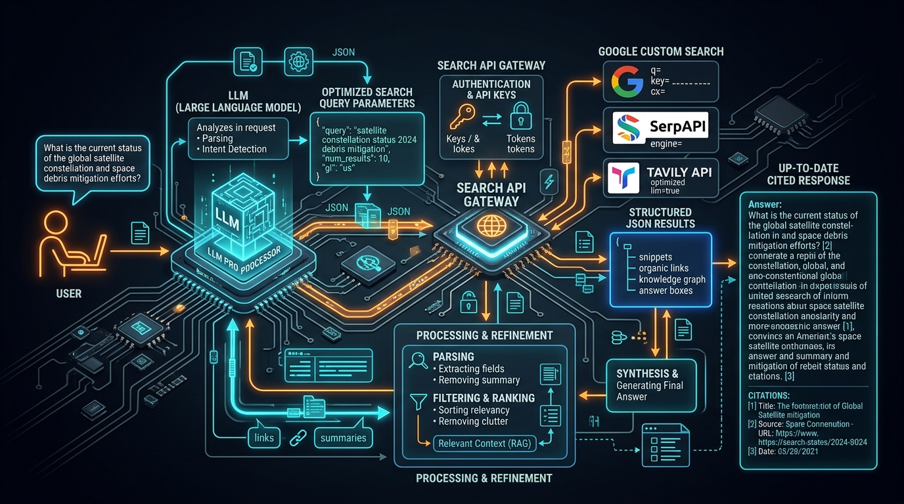

# 🌐 External Integration: Connecting Models to Live Data via Search APIs (Google Search, SerpAPI, Tavily & DuckDuckGo)

> **Zero to Hero Gen AI Course — Module 05: Agents, Tooling & Open-Source Models**
>
> 📅 Module 5 | ⏱️ Estimated Reading Time: 65 minutes | 🎯 Level: Intermediate to Advanced
>
> **Core Objective:** Bridge the fundamental knowledge cutoff and hallucination chasm of static foundation models by integrating real-time web retrieval. Master the architectural integration of Search APIs (Google Custom Search JSON API, SerpAPI, Tavily Search, and DuckDuckGo). Analyze query reformulation heuristics, parameter filtering, structured SERP payload decomposition (Knowledge Graph, Organic Results, Answer Boxes, and Snippets), token budget management, content scraping and html cleansing pipelines, verifiable citation grounding, and resilient rate-limiting/caching strategies for enterprise production.

---

## 📑 Table of Contents

1. [The Real-Time Information Dilemma: Knowledge Cutoffs & Temporal Decay](#1-the-real-time-information-dilemma-knowledge-cutoffs--temporal-decay)
   - [1.1 The Static Brain Problem: Hallucinating in the Dark](#11-the-static-brain-problem-hallucinating-in-the-dark)
   - [1.2 Retrieval Paradigms: Static RAG vs Dynamic Web Search Integration](#12-retrieval-paradigms-static-rag-vs-dynamic-web-search-integration)
   - [1.3 When to Search: Query Routing & Temporal Intent Classification](#13-when-to-search-query-routing--temporal-intent-classification)
2. [Intuitive Mental Models & Analogies](#2-intuitive-mental-models--analogies)
   - [2.1 The 2020 Printed Encyclopedia vs The Live Bloomberg Terminal](#21-the-2020-printed-encyclopedia-vs-the-live-bloomberg-terminal)
   - [2.2 The Research Librarian with a Fast Scanner and Highlighter](#22-the-research-librarian-with-a-fast-scanner-and-highlighter)
   - [2.3 The Sieve and the Chef: Filtering Raw Internet Noise into Pure Signal](#23-the-sieve-and-the-chef-filtering-raw-internet-noise-into-pure-signal)
3. [The Landscape of Live Search APIs for LLMs](#3-the-landscape-of-live-search-apis-for-llms)
   - [3.1 Google Custom Search JSON API (The Direct Google Engine)](#31-google-custom-search-json-api-the-direct-google-engine)
   - [3.2 SerpAPI: Scraped & Normalized Google/Bing SERP Features](#32-serpapi-scraped--normalized-googlebing-serp-features)
   - [3.3 Tavily Search: The Purpose-Built LLM Search & Extraction Engine](#33-tavily-search-the-purpose-built-llm-search--extraction-engine)
   - [3.4 DuckDuckGo: Privacy-First, Zero-Credential Search](#34-duckduckgo-privacy-first-zero-credential-search)
   - [3.5 Comprehensive Comparative Evaluation Matrix](#35-comprehensive-comparative-evaluation-matrix)
4. [Architectural Pipeline: From User Query to Grounded Answer](#4-architectural-pipeline-from-user-query-to-grounded-answer)
   - [4.1 Step 1: Query Reformulation & Keyword Optimization](#41-step-1-query-reformulation--keyword-optimization)
   - [4.2 Step 2: Search API Gateway Dispatch & Parameter Constraints](#42-step-2-search-api-gateway-dispatch--parameter-constraints)
   - [4.3 Step 3: SERP Payload Decomposition (Knowledge Graph, Organic Snippets, Answer Boxes)](#43-step-3-serp-payload-decomposition-knowledge-graph-organic-snippets-answer-boxes)
   - [4.4 Step 4: Snippet-Only Context Injection vs Deep-Page Scraping](#44-step-4-snippet-only-context-injection-vs-deep-page-scraping)
   - [4.5 Step 5: Token Truncation, De-Duplication & Relevance Reranking](#45-step-5-token-truncation-de-duplication--relevance-reranking)
   - [4.6 Step 6: Grounded Synthesis with Verifiable In-Line Citations](#46-step-6-grounded-synthesis-with-verifiable-in-line-citations)
5. [Engineering Search Tools for LangChain & Autonomous Agents](#5-engineering-search-tools-for-langchain--autonomous-agents)
   - [5.1 Wrapping Search APIs with Pydantic Schema Validation](#51-wrapping-search-apis-with-pydantic-schema-validation)
   - [5.2 Building a Resilient SerpAPI Search Tool](#52-building-a-resilient-serpapi-search-tool)
   - [5.3 Building a Native Tavily LLM Search Tool](#53-building-a-native-tavily-llm-search-tool)
   - [5.4 Tool Description Engineering: Guiding the Agent When to Search](#54-tool-description-engineering-guiding-the-agent-when-to-search)
6. [Production Reliability, Rate Limiting & Multi-Tier Caching](#6-production-reliability-rate-limiting--multi-tier-caching)
   - [6.1 Search API Economics: Managing Cost & Quotas at Scale](#61-search-api-economics-managing-cost--quotas-at-scale)
   - [6.2 Multi-Tier In-Memory & Redis Caching with Time-To-Live (TTL)](#62-multi-tier-in-memory--redis-caching-with-time-to-live-ttl)
   - [6.3 Fallback Cascades: Primary (Tavily/Google) to Secondary (DuckDuckGo/SerpAPI)](#63-fallback-cascades-primary-tavilygoogle-to-secondary-duckduckgoserpapi)
   - [6.4 Handling Anti-Bot Challenges, Captchas, and HTTP 429/503 Failures](#64-handling-anti-bot-challenges-captchas-and-http-429503-failures)
7. [Groundedness, Hallucination Prevention & Citation Verification](#7-groundedness-hallucination-prevention--citation-verification)
   - [7.1 Citation Anchoring: Mapping Extracted Claims to Source URLs](#71-citation-anchoring-mapping-extracted-claims-to-source-urls)
   - [7.2 Negative Constraint Prompting: "Refuse to Speculate if Missing from SERP"](#72-negative-constraint-prompting-refuse-to-speculate-if-missing-from-serp)
   - [7.3 Cross-Verification: Resolving Conflicting Search Snippets](#73-cross-verification-resolving-conflicting-search-snippets)
8. [Enterprise Case Studies](#8-enterprise-case-studies)
   - [8.1 Live Corporate Financial Intelligence & Earnings Monitoring](#81-live-corporate-financial-intelligence--earnings-monitoring)
   - [8.2 Automated Cyber Threat & Zero-Day Vulnerability (CVE) Triage](#82-automated-cyber-threat--zero-day-vulnerability-cve-triage)
9. [Complete Architecture Visualized](#9-complete-architecture-visualized)
10. [Hands-On Python Lab Walkthrough](#10-hands-on-python-lab-walkthrough)
11. [Curated Video Walkthroughs & Visual Animations](#11-curated-video-walkthroughs--visual-animations)
12. [Self-Assessment & Review Questions](#12-self-assessment--review-questions)
13. [Summary & Key Takeaways](#13-summary--key-takeaways)

---

## 1. The Real-Time Information Dilemma: Knowledge Cutoffs & Temporal Decay

### 1.1 The Static Brain Problem: Hallucinating in the Dark

Every Large Language Model, from GPT-4o to Llama 3 and Claude 3.5 Sonnet, is fundamentally a **frozen checkpoint of historical weights**. Once training finishes, the model's parametric memory is locked in time:

$$\mathcal{M}_{\text{param}} = \text{Trained on data up to } T_{\text{cutoff}}$$

When a user asks:
- *"Who won the men's 100m gold medal in the 2024 Paris Olympics?"*
- *"What is the current stock price of Nvidia after today's earnings announcement?"*
- *"Has OpenAI released the GPT-5 API, and what are its endpoint rate limits?"*

A pure, unaugmented LLM faces an impossible dilemma:
1. **Silent Hallucination:** The model generates plausible-sounding fiction based on statistical associations from its pre-training corpus (e.g., confidently declaring Usain Bolt won in 2024).
2. **Refusal to Answer:** The model falls back to a canned disclaimer (*"My knowledge cutoff is October 2023, so I cannot provide current information"*).

```
+-------------------------------------------------------------------------------------------------+
|                                 THE STATIC MODEL KNOWLEDGE CUTOFF                               |
+-------------------------------------------------------------------------------------------------+
|                                                                                                 |
|   PRE-TRAINING TIMELINE                       TODAY (T_current)                                 |
|   ===============================[T_cutoff]---------------------> [Live World State]            |
|   |                              |                                |                             |
|   | Complete Parametric Memory   | ❌ THE DARK ZONE               | Real-Time Events, Breaking  |
|   | (Shakespeare, Python 3.10,   | (Model has ZERO knowledge;     | News, Stock Prices, CVEs,   |
|   |  Historical Facts)           |  hallucinates or refuses)      | Current Leadership Changes  |
|                                                                                                 |
|   SOLUTION: CONNECT MODEL TO LIVE SEARCH APIS (EXTERNAL GROUNDING)                              |
|   [Query] ---> [Search API Gateway] ---> [Real-Time SERP Snippets] ---> [LLM Augmented Brain]  |
|                                                                                                 |
+-------------------------------------------------------------------------------------------------+
```

### 1.2 Retrieval Paradigms: Static RAG vs Dynamic Web Search Integration

In Module 04, we mastered **Retrieval-Augmented Generation (RAG)** using Vector Databases (ChromaDB, Pinecone). How does Live Web Search differ from Static RAG?

| Dimension | Static Enterprise RAG (Module 04) | Live Web Search Integration (Module 05) |
| :--- | :--- | :--- |
| **Data Scope** | Internal, private company files (PDFs, Confluence, SQL) | Global, public internet (breaking news, weather, stock, research) |
| **Ingestion Pipeline** | Batch pre-chunking, offline vector embedding, indexing | On-demand real-time query execution via REST Search APIs |
| **Update Latency** | Hours or days (requires re-embedding and index rebuild) | Sub-second (indexes live web updates within minutes of publishing) |
| **Relevance Mechanism** | Dense vector cosine similarity ($k$-NN) | Hybrid lexical (BM25) + PageRank + Google Knowledge Graph |
| **Cost Dynamics** | Vector DB storage & embedding compute costs | Per-call API fees (e.g. $0.005 per search request) |
| **Content Cleanliness** | Clean, curated internal markdown and text | High noise (ads, cookie banners, SEO spam, sponsored links) |

Both paradigms are not mutually exclusive. Modern enterprise agent systems utilize **Hybrid Routing**: internal proprietary queries route to Pinecone/ChromaDB, while public, temporal, or general queries route to Search APIs.

### 1.3 When to Search: Query Routing & Temporal Intent Classification

Executing an external search API call on *every single* user query introduces 500ms–1500ms of latency and unnecessary API expenditure. A production agent must employ a **Search Intent Classifier**:

```
+-------------------------------------------------------------------------------------------------+
|                                 SEARCH INTENT CLASSIFIER LOGIC                                  |
+-------------------------------------------------------------------------------------------------+
|                                                                                                 |
|  User Input Query: "Write a Python quicksort algorithm"                                         |
|  Temporal Anchor Check: False -> No temporal terms (today, current, recent, 2024, latest)        |
|  Parametric Knowledge Confidence: High (99.9% in training weights)                               |
|  DECISION: 🚫 DO NOT SEARCH (Answer immediately from parametric memory)                         |
|                                                                                                 |
|  User Input Query: "What happened in the US Federal Reserve interest rate meeting yesterday?"    |
|  Temporal Anchor Check: True ("yesterday", "meeting")                                            |
|  Parametric Knowledge Confidence: Zero (Post-cutoff event)                                      |
|  DECISION: 🔍 TRIGGER SEARCH API ("US Federal Reserve interest rate decision [Date]")           |
|                                                                                                 |
+-------------------------------------------------------------------------------------------------+
```

---

## 2. Intuitive Mental Models & Analogies

```
+-------------------------------------------------------------------------------------------------+
|                                SEARCH INTEGRATION ANALOGIES                                     |
+-------------------------------------------------------------------------------------------------+
|                                                                                                 |
|  1. THE 2020 ENCYCLOPEDIA vs BLOOMBERG         2. THE HIGH-SPEED RESEARCH LIBRARIAN             |
|                                                                                                 |
|      Static LLM:                                   LLM with Search Tool:                        |
|      * Brilliant scholar locked in an underground  * Scholar sits at a desk with a phone.       |
|        bunker with a 2020 encyclopedia set.        * User asks: "What is Apple stock today?"     |
|      * Answers 1990 history flawlessly.            * Scholar dials the librarian: "Fetch AAPL   |
|      * When asked who is the UK Prime Minister       quote from the terminal right now."        |
|        today, guesses Boris Johnson.               * Reads the faxed slip, answers with 100%   |
|                                                      verified accuracy.                         |
|                                                                                                 |
+-------------------------------------------------------------------------------------------------+
```

### 2.1 The 2020 Printed Encyclopedia vs The Live Bloomberg Terminal

Imagine hiring a brilliant Rhodes Scholar who has been locked inside a soundproof vault with no internet since December 2023. They have read millions of books, speak 20 languages, and understand quantum physics and Python.
- If you ask them to write a sonnet or explain Einstein’s General Relativity, they perform brilliantly.
- If you ask them who won the latest election or what the inflation rate is this morning, they have no sensory perception of the outside world.
- **Connecting a Search API is equivalent to installing a live Bloomberg terminal inside the vault.** The scholar can now glance at the terminal, retrieve real-time data, and apply their reasoning to interpret the findings.

### 2.2 The Research Librarian with a Fast Scanner and Highlighter

When an agent issues a search query, it does not download the entire internet. It acts like an executive sending a runner to the library:
1. The executive gives the librarian an optimized keyword index request (*"Apple Q3 2024 net profit revenue SEC"*).
2. The librarian pulls the top 5 documents, highlights the relevant sentences (*the snippets*), and hands the highlighted cards back to the executive.
3. The executive synthesizes the highlighted cards into a concise brief.

### 2.3 The Sieve and the Chef: Filtering Raw Internet Noise into Pure Signal

Raw web pages are filled with junk: 80% of an HTML webpage consists of CSS stylesheets, JavaScript tracking bundles, navigation headers, cookie consent modals, and ads.
- Feeding raw HTML directly to an LLM wastes thousands of context tokens and confuses attention heads.
- **The Search API acts as a culinary sieve.** It scrapes the DOM, extracts the primary textual paragraphs, filters out the navigational debris, and delivers clean, digestible markdown snippets to the LLM.

---

## 3. The Landscape of Live Search APIs for LLMs

Choosing the right search API determines your system's latency, cost, and factual precision.

```
+-------------------------------------------------------------------------------------------------+
|                                   SEARCH API ECOSYSTEM                                          |
+-------------------------------------------------------------------------------------------------+
|                                                                                                 |
|  [Google Custom Search JSON API]  --> Official, high quota, but requires Custom Engine setup    |
|  [SerpAPI]                        --> High-fidelity Google/Bing SERP scraper, rich SERP parsing |
|  [Tavily Search]                  --> LLM-native, clean markdown content, optimized for RAG     |
|  [DuckDuckGo (DDG)]               --> Free, no API keys, lightweight, rate-limited at scale     |
|                                                                                                 |
+-------------------------------------------------------------------------------------------------+
```

### 3.1 Google Custom Search JSON API (The Direct Google Engine)

The official Google programmatic search offering.
- **Mechanism:** Requires a Google Cloud Console Project, an API Key, and a Programmable Search Engine ID (`cx`).
- **Strengths:** 100% official Google index, guaranteed uptime, enterprise SLA.
- **Weaknesses:** Requires configuring the search engine to "Search the entire web" (which can be tricky); limited to 100 free queries/day ($5 per 1,000 queries thereafter); returns short snippets (150–200 characters) without full webpage body text.

### 3.2 SerpAPI: Scraped & Normalized Google/Bing SERP Features

SerpAPI runs headless browser clusters that scrape real Google Search Result Pages (SERP) and convert every UI component into structured JSON.
- **Mechanism:** Emulates human desktop and mobile browsers across geographical locations.
- **Strengths:** Captures Google's **Knowledge Graph**, **Answer Boxes / Featured Snippets**, **People Also Ask** carousels, and **Organic Results**.
- **Weaknesses:** Higher latency (1.0s–2.5s per request as it scrapes real-time SERPs); higher pricing tier ($50/month for 5,000 searches); returns snippets rather than full-page cleansed markdown.

### 3.3 Tavily Search: The Purpose-Built LLM Search & Extraction Engine

Engineered specifically for Autonomous AI Agents and RAG systems (founded by the creators of GPT Researcher).
- **Mechanism:** Not just a search index—it crawls the top search result URLs, runs headless content extractors, removes boilerplate/HTML, and returns **clean markdown content (up to 1,000 words per page)** along with URLs and titles.
- **Strengths:** Extremely fast (<800ms); zero HTML parsing required by the developer; purpose-built `include_raw_content` and `search_depth="advanced"` flags.
- **Weaknesses:** Newer proprietary indexing infrastructure compared to Google's multi-decade crawler.

### 3.4 DuckDuckGo: Privacy-First, Zero-Credential Search

A free, community-standard open-source wrapper (`duckduckgo-search` / `ddgs`).
- **Mechanism:** Scrapes DuckDuckGo's HTML search interface without requiring an account or API key.
- **Strengths:** 100% free; zero credential management; instantaneous for rapid local prototyping and educational labs.
- **Weaknesses:** Aggressive IP-based rate limiting if bombarded with automated requests; strictly for prototyping and development, not high-volume production.

### 3.5 Comprehensive Comparative Evaluation Matrix

| Feature / Metric | Google Custom Search API | SerpAPI | Tavily Search | DuckDuckGo (`ddgs`) |
| :--- | :--- | :--- | :--- | :--- |
| **API Key Required?** | Yes (`GOOGLE_API_KEY` + `cx`) | Yes (`SERPAPI_API_KEY`) | Yes (`TAVILY_API_KEY`) | ❌ No (Zero credentials) |
| **Average Latency** | 400ms – 700ms | 1,200ms – 2,500ms | 600ms – 1,000ms | 800ms – 1,500ms |
| **Data Returned** | Short Snippets, Title, URL | Knowledge Graph, Answer Box, Organic Snippets | Full Cleansed Markdown + Snippets + Images | Snippets, Title, URL |
| **Free Tier Allowance** | 100 requests / day | 100 requests / month | 1,000 requests / month | Unlimited (subject to IP rate limits) |
| **Commercial Cost** | $5.00 / 1,000 requests | $10.00 – $15.00 / 1,000 requests | $8.00 / 1,000 requests | Free (Non-commercial / prototype) |
| **LLM Optimization** | Generic search payload | General SERP scraping | Native Agent / RAG format | Basic text search |
| **Best Used For** | Enterprise Google Cloud apps | Deep SERP scraping (Knowledge Graph) | Production Agentic Workflows | Local labs, unit tests, fast dev |

---

## 4. Architectural Pipeline: From User Query to Grounded Answer

```
+-------------------------------------------------------------------------------------------------+
|                                END-TO-END SEARCH RETRIEVAL PIPELINE                             |
+-------------------------------------------------------------------------------------------------+
|                                                                                                 |
|   1. User Query: "Who is the CEO of Twitter right now and when did they take over?"              |
|        |                                                                                        |
|        v                                                                                        |
|   2. Query Optimization: "current CEO of Twitter X Linda Yaccarino appointment date"            |
|        |                                                                                        |
|        v                                                                                        |
|   3. API Dispatch (SerpAPI / Tavily / Google) with Rate-Limiting & Caching Check                |
|        |                                                                                        |
|        v                                                                                        |
|   4. SERP Decomposition & Extraction:                                                           |
|      * Answer Box: "Linda Yaccarino became CEO of X (formerly Twitter) in June 2023."           |
|      * Organic Link 1: Reuters Article (URL: https://reuters.com/... )                          |
|      * Organic Link 2: Forbes Profile (URL: https://forbes.com/... )                            |
|        |                                                                                        |
|        v                                                                                        |
|   5. Context Formatting & Prompt Assembly (Injecting Strict Grounding Instructions)             |
|        |                                                                                        |
|        v                                                                                        |
|   6. LLM Inference & Verifiable Citation Synthesis:                                            |
|      "The current CEO of Twitter (now X) is Linda Yaccarino, who assumed office in              |
|       June 2023 [1]. She was appointed by Elon Musk following his acquisition [2]."             |
|                                                                                                 |
+-------------------------------------------------------------------------------------------------+
```

### 4.1 Step 1: Query Reformulation & Keyword Optimization

Novice developers pass the raw user query directly to the search API. However, humans speak conversationally, whereas search engines index keyword density and lexical tokens:

- **Raw User Input:** *"Can you tell me if there was any big announcement regarding Llama 3 models released by Meta this week?"*
- **Optimized Search Query:** `Meta Llama 3 model release announcement this week 2024`

In advanced agent pipelines, a lightweight LLM call or prompt step reformulates the conversational query into **1 to 3 targeted search queries** before calling the API.

### 4.2 Step 2: Search API Gateway Dispatch & Parameter Constraints

When calling the Search API, parameter tuning dictates result quality:
- **`num_results` (or `k`):** Restrict to top 3–5 results. Pulling 20 results floods the LLM context window with redundant noise.
- **`time_range`:** Constrain to `d` (past day), `w` (past week), or `y` (past year) when temporal freshness is required.
- **`gl` (Geolocation) & `hl` (Language):** Ensure queries specify locale (e.g. `gl='us'`, `hl='en'`) to avoid regional language mismatches.

### 4.3 Step 3: SERP Payload Decomposition (Knowledge Graph, Organic Snippets, Answer Boxes)

When SerpAPI returns a JSON response, it contains distinct structural components:

```json
{
  "search_metadata": {"status": "Success"},
  "answer_box": {
    "type": "organic_result",
    "title": "Current CEO of X / Twitter",
    "answer": "Linda Yaccarino",
    "snippet": "Linda Yaccarino is an American media executive. She is the current CEO of X Corp."
  },
  "knowledge_graph": {
    "title": "Linda Yaccarino",
    "type": "American media executive",
    "born": "November 27, 1963",
    "organization": "X Corp."
  },
  "organic_results": [
    {
      "position": 1,
      "title": "Linda Yaccarino - Wikipedia",
      "link": "https://en.wikipedia.org/wiki/Linda_Yaccarino",
      "snippet": "On May 12, 2023, Elon Musk announced that Yaccarino would be the new CEO of X Corp. and Twitter..."
    }
  ]
}
```

An enterprise parser must prioritize **Answer Boxes** and **Knowledge Graphs** first (as they contain high-confidence distilled facts), followed by the top organic snippets.

### 4.4 Step 4: Snippet-Only Context Injection vs Deep-Page Scraping

Engineers face an architectural trade-off:
1. **Snippet-Only Ingestion:**
   - *Pros:* Ultra-fast (<1s total), minimal token consumption (~300 tokens), zero risk of web-scraping crashes.
   - *Cons:* Snippets are truncated fragments (150–200 characters); fine-grained details, full tables, or code samples are missing.
2. **Deep-Page Scraping (Tavily / Playwright / BeautifulSoup):**
   - *Pros:* Extracts the complete article body, rich tables, and authoritative source text.
   - *Cons:* Slower (2–5 seconds), consumes significantly more context window tokens (2,000–5,000 tokens), requires HTML cleansing.

**Rule of Thumb:** Use snippet-only retrieval for fact-checking, entity lookups, and news summaries. Use deep-page extraction for legal analysis, technical debugging, and in-depth research papers.

### 4.5 Step 5: Token Truncation, De-Duplication & Relevance Reranking

When combining multiple search results, content often overlaps (e.g., three news sites quoting the identical AP News press release).
- **De-duplication:** Remove snippets that have high Jaccard token overlap (>70% duplicate text).
- **Token Truncation:** Limit each snippet to a maximum of 150 words to prevent overflowing the model's prompt budget.

### 4.6 Step 6: Grounded Synthesis with Verifiable In-Line Citations

To guarantee transparency and eliminate hallucination, the system prompt instructs the LLM to link every factual claim to an index reference:

```text
You are a factual research assistant. Synthesize an answer to the question using ONLY the provided search results below.
For every factual statement you make, append an in-line citation referencing the source number, like [1] or [2].
At the end of your response, list the Sources with their corresponding URLs.
If the search results do not contain enough information to answer the question, explicitly state:
"The provided search results do not contain sufficient verified information to answer this question."
Do NOT invent facts or URLs.
```

---

## 5. Engineering Search Tools for LangChain & Autonomous Agents

### 5.1 Wrapping Search APIs with Pydantic Schema Validation

In Module 05 Topic 01, we established that autonomous agents require strict **Pydantic schemas** to avoid argument hallucination. Here is the enterprise schema for live web search:

```python
from pydantic import BaseModel, Field
from typing import Optional, Literal

class WebSearchInput(BaseModel):
    """Input parameters for live web search queries."""
    query: str = Field(
        ...,
        description="The optimized keyword search query to execute (e.g. 'Tesla Q3 2024 earnings net income'). Avoid conversational filler words."
    )
    max_results: int = Field(
        default=5,
        ge=1,
        le=10,
        description="The maximum number of search results to retrieve (between 1 and 10)."
    )
    time_frame: Optional[Literal["d", "w", "m", "y"]] = Field(
        default=None,
        description="Filter results by time: 'd' (past 24h), 'w' (past week), 'm' (past month), 'y' (past year)."
    )
```

### 5.2 Building a Resilient SerpAPI Search Tool

```python
import os
import requests
from typing import Dict, Any, List

class SerpAPIEngine:
    """Production wrapper for SerpAPI Google Search."""
    def __init__(self, api_key: Optional[str] = None):
        self.api_key = api_key or os.getenv("SERPAPI_API_KEY")
        self.base_url = "https://serpapi.com/search.json"

    def search(self, query: str, max_results: int = 5) -> List[Dict[str, str]]:
        if not self.api_key:
            raise ValueError("SERPAPI_API_KEY is not configured.")
        
        params = {
            "q": query,
            "api_key": self.api_key,
            "engine": "google",
            "num": max_results,
            "gl": "us",
            "hl": "en"
        }
        response = requests.get(self.base_url, params=params, timeout=10.0)
        response.raise_for_status()
        data = response.json()
        
        results = []
        # 1. Extract Answer Box if available
        if "answer_box" in data and "snippet" in data["answer_box"]:
            results.append({
                "title": data["answer_box"].get("title", "Featured Answer"),
                "snippet": data["answer_box"]["snippet"],
                "url": data["answer_box"].get("link", "Google Answer Box")
            })
            
        # 2. Extract Organic Results
        for item in data.get("organic_results", [])[:max_results]:
            results.append({
                "title": item.get("title", "No Title"),
                "snippet": item.get("snippet", "No Snippet Available"),
                "url": item.get("link", "")
            })
            
        return results
```

### 5.3 Building a Native Tavily LLM Search Tool

```python
class TavilySearchEngine:
    """Production wrapper for Tavily LLM Search API."""
    def __init__(self, api_key: Optional[str] = None):
        self.api_key = api_key or os.getenv("TAVILY_API_KEY")
        self.base_url = "https://api.tavily.com/search"

    def search(self, query: str, max_results: int = 5) -> List[Dict[str, str]]:
        if not self.api_key:
            raise ValueError("TAVILY_API_KEY is not configured.")
            
        payload = {
            "api_key": self.api_key,
            "query": query,
            "max_results": max_results,
            "search_depth": "basic",
            "include_answer": True
        }
        response = requests.post(self.base_url, json=payload, timeout=10.0)
        response.raise_for_status()
        data = response.json()
        
        results = []
        # If Tavily direct AI answer exists, include it as primary context
        if data.get("answer"):
            results.append({
                "title": "Tavily AI Synthesized Summary",
                "snippet": data["answer"],
                "url": "https://tavily.com"
            })
            
        for item in data.get("results", [])[:max_results]:
            results.append({
                "title": item.get("title", ""),
                "snippet": item.get("content", ""),
                "url": item.get("url", "")
            })
        return results
```

### 5.4 Tool Description Engineering: Guiding the Agent When to Search

> [!TIP]
> **Prompting Rule for Search Tools:**
> Language models love their own pre-training weights and often try to "guess" before checking live tools.
> 
> You must write the tool description with **imperative triggers**:
> ```python
> description = (
>     "CRITICAL TOOL: Use this tool to search the live public internet for current events, "
>     "breaking news, recent stock prices, sports scores, release notes, or any facts occurring "
>     "after your knowledge cutoff. Do NOT guess or hallucinate real-time facts. Always call this tool "
>     "whenever temporal words like 'current', 'latest', 'today', 'recent', or '2024' are present."
> )
> ```

---

## 6. Production Reliability, Rate Limiting & Multi-Tier Caching

### 6.1 Search API Economics: Managing Cost & Quotas at Scale

Search APIs charge per query:
- 10,000 queries/day at $0.01 per query = **$100/day ($3,000/month)** purely in search API overhead!
- Furthermore, web search responses have natural volatility: news articles change frequently, but historical corporate facts or documentation do not change every second.

### 6.2 Multi-Tier In-Memory & Redis Caching with Time-To-Live (TTL)

To slash external API costs by 60%–80%, place an **In-Memory / Redis Cache** in front of your search engine:

```python
import hashlib
import time

class CachedSearchGateway:
    """In-Memory LRU Cache with Time-To-Live (TTL) for Search API calls."""
    def __init__(self, backend_engine, default_ttl_seconds: int = 3600):
        self.backend_engine = backend_engine
        self.default_ttl = default_ttl_seconds
        self.cache: Dict[str, Tuple[float, Any]] = {}  # key -> (expiry_timestamp, data)

    def _hash_key(self, query: str, max_results: int) -> str:
        raw = f"{query.strip().lower()}:{max_results}"
        return hashlib.sha256(raw.encode("utf-8")).hexdigest()

    def search(self, query: str, max_results: int = 5) -> List[Dict[str, str]]:
        cache_key = self._hash_key(query, max_results)
        now = time.time()
        
        # Check cache hit
        if cache_key in self.cache:
            expiry, cached_data = self.cache[cache_key]
            if now < expiry:
                return cached_data  # 0ms latency! $0 cost!
            else:
                del self.cache[cache_key]  # Expired
                
        # Cache miss: Call live search API
        fresh_data = self.backend_engine.search(query, max_results=max_results)
        self.cache[cache_key] = (now + self.default_ttl, fresh_data)
        return fresh_data
```

### 6.3 Fallback Cascades: Primary to Secondary Search Engine

In enterprise high-availability systems, relying on a single third-party API is an anti-pattern. If SerpAPI experiences elevated error rates, the system should gracefully degrade to a secondary provider:

```
+-------------------------------------------------------------------------------------------------+
|                                 SEARCH PROVIDER FALLBACK CASCADE                                |
+-------------------------------------------------------------------------------------------------+
|                                                                                                 |
|   [Query Request]                                                                               |
|         |                                                                                       |
|         +---> [Check Local Cache] --- HIT (Cache Hit) ---> Return Cached Data (0ms)             |
|         |           | MISS                                                                      |
|         |           v                                                                           |
|         +---> [Primary Provider: Tavily Search]                                                 |
|                     |                                                                           |
|                     |-- SUCCESS -------------------------> Save to Cache & Return Data          |
|                     v FAILURE (HTTP 500 / 429 Timeout)                                          |
|               [Secondary Provider: SerpAPI]                                                     |
|                     |                                                                           |
|                     |-- SUCCESS -------------------------> Save to Cache & Return Data          |
|                     v FAILURE (Timeout)                                                         |
|               [Emergency Fallback: DuckDuckGo / Local Knowledge]                                 |
|                     |                                                                           |
|                     +------------------------------------> Return Best-Effort Result            |
|                                                                                                 |
+-------------------------------------------------------------------------------------------------+
```

### 6.4 Handling Anti-Bot Challenges, Captchas, and HTTP 429/503 Failures

If you attempt raw web scraping (using `requests` or `BeautifulSoup` directly on Google.com), Google will immediately flag your IP with a **CAPTCHA** or HTTP 429 Too Many Requests response.
- **Why Search APIs are mandatory:** Search API providers manage distributed IP proxy rotations, headless browser fingerprint randomization, and CAPTCHA solving farms transparently.
- **Client-Side Exponential Backoff:** Always wrap search requests with retry decorators (`tenacity` or custom backoff loops) configured with jitter.

---

## 7. Groundedness, Hallucination Prevention & Citation Verification

### 7.1 Citation Anchoring: Mapping Extracted Claims to Source URLs

A search integration is only as credible as its verifiable audit trail. The agent pipeline must track the source URI for every snippet injected into context:

```
Context Provided to LLM:
[Source 1]: Title: "Nvidia Reports Q3 FY25 Financial Results" | URL: https://nvidianews.nvidia.com/q3-2025
Snippet: "Nvidia reported revenue for the third quarter of $35.1 billion, up 94% from a year ago..."

[Source 2]: Title: "Wall Street Journal Market Watch" | URL: https://wsj.com/markets/nvda-earnings
Snippet: "Data center revenue surged to $30.8 billion, driven by surging demand for Hopper architecture..."
```

When the LLM generates:
> *"Nvidia reported total Q3 revenue of $35.1 billion, representing a 94% year-over-year surge [1], largely powered by $30.8 billion in Data Center revenue [2]."*

The user or frontend application can render clickable hyperlinks `[1]` and `[2]` directly to Nvidia's newsroom and the WSJ article.

### 7.2 Negative Constraint Prompting: "Refuse to Speculate if Missing from SERP"

To prevent models from filling in missing search gaps with hallucinated assumptions, apply **Negative Guardrail Instructions**:

> *"If the search results do not explicitly mention the metric requested, you MUST explicitly state that the metric is unavailable in public search records. Do NOT estimate, extrapolate, or hypothesize."*

### 7.3 Cross-Verification: Resolving Conflicting Search Snippets

When multiple news outlets report differing numbers (e.g. initial estimates vs finalized filings), prompt the agent to explicitly highlight the discrepancy:
> *"Source [1] reports initial revenue at $35.0 billion, whereas the finalized official SEC filing [2] records $35.082 billion."*

---

## 8. Enterprise Case Studies

### 8.1 Live Corporate Financial Intelligence & Earnings Monitoring

**Business Scenario:** A hedge fund analyst needs an automated morning digest of breaking corporate earnings releases across 20 portfolio holdings before market open.

**System Architecture:**
1. A cron job queries the portfolio ticker list.
2. For each ticker, the agent reformulates a query: `{ticker} Q3 earnings release report date EPS revenue 2024`.
3. The Search Gateway executes queries via Tavily with `time_frame='d'` (past 24 hours).
4. The agent filters out speculative blogs, retains official press releases (PR Newswire, SEC EDGAR, BusinessWire), and extracts EPS versus consensus estimates.
5. The model outputs a bulleted executive briefing table with source citations, delivered to Microsoft Teams / Slack.

### 8.2 Automated Cyber Threat & Zero-Day Vulnerability (CVE) Triage

**Business Scenario:** A SecOps vulnerability scanner detects an unpatched OpenSSH package (`OpenSSH 9.8p1`) on internal Linux servers.

**System Architecture:**
1. The incident response bot queries: `OpenSSH 9.8p1 CVE security advisory exploit in the wild`.
2. The search tool queries SerpAPI and retrieves the NIST NVD database snippet and Qualys security advisory for CVE-2024-6387 (RegreSSHion).
3. The LLM extracts the CVSS score (8.1 High), notes that remote unauthenticated code execution is possible on glibc-based Linux systems, and provides the immediate mitigation commands (`Set LoginGraceTime to 0 in sshd_config`).
4. The SecOps team receives a verified, cited triage card within 15 seconds of scanner discovery.

---

## 9. Complete Architecture Visualized

### Figure 1: The External Search Retrieval Architecture
Connecting LLMs to live web data via Query Reformulation, Search Gateways, Caching Layers, and Citation Synthesis.

```
+-------------------------------------------------------------------------------------------------+
|                        EXTERNAL SEARCH RETRIEVAL & GROUNDING ARCHITECTURE                       |
+-------------------------------------------------------------------------------------------------+
|                                                                                                 |
|   +---------------+                                                                             |
|   |   USER QUERY  |                                                                             |
|   +---------------+                                                                             |
|           |                                                                                     |
|           v                                                                                     |
|   +-------------------------------------------------------------------------+                   |
|   |                       AGENT REASONING / ROUTING CORE                    |                   |
|   |  - Needs Live Data? -> YES                                              |                   |
|   |  - Query Optimizer: "Nvidia Blackwell chip shipping schedule 2024"      |                   |
|   +-------------------------------------------------------------------------+                   |
|           |                                                                                     |
|           v                                                                                     |
|   +-------------------------------------------------------------------------+                   |
|   |                        SEARCH GATEWAY & RESILIENCE                      |                   |
|   |  1. SHA-256 Cache Check (Redis / TTL Memory)                            |                   |
|   |  2. Rate Limiting & Quota Management                                    |                   |
|   |  3. Fallback Dispatcher: Tavily -> SerpAPI -> DuckDuckGo                |                   |
|   +-------------------------------------------------------------------------+                   |
|           |                                                                                     |
|           +----------------------------------+----------------------------------+               |
|           |                                  |                                  |               |
|           v                                  v                                  v               |
|   +--------------------+             +--------------------+             +--------------------+  |
|   |    Tavily Search   |             |       SerpAPI      |             |     DuckDuckGo     |  |
|   |  (LLM Clean Markd) |             |  (Knowledge Graph) |             |  (Zero-Credential) |  |
|   +--------------------+             +--------------------+             +--------------------+  |
|           |                                  |                                  |               |
|           +----------------------------------+----------------------------------+               |
|           |                                                                                     |
|           v                                                                                     |
|   +-------------------------------------------------------------------------+                   |
|   |                   SERP PARSER & CONTEXT GROUNDING ENGINE                |                   |
|   |  - De-duplicate Snippets & Filter HTML Boilerplate                      |                   |
|   |  - Assign Structured Citation Index: [1], [2], [3]                      |                   |
|   |  - Enforce Token Budgets & Truncate Long Context                        |                   |
|   +-------------------------------------------------------------------------+                   |
|           |                                                                                     |
|           v                                                                                     |
|   +-------------------------------------------------------------------------+                   |
|   |                      GROUNDED SYNTHESIS & AUDIT TRAIL                   |                   |
|   |  - Generate Answer Grounded STRICTLY in Injected Context                |                   |
|   |  - Include Verified Clickable URLs & Attribution Footer                 |                   |
|   +-------------------------------------------------------------------------+                   |
|                                                                                                 |
+-------------------------------------------------------------------------------------------------+
```

### Figure 2: End-to-End Live Search API Integration Architecture
Complete technical schematic illustrating query reformulation, authentication gateway routing (Google Custom Search, SerpAPI, Tavily), structured SERP decomposition, filtering & ranking, and grounded citations.



---

## 10. Hands-On Python Lab Walkthrough

The companion production lab script [`code/live_search_tools_lab.py`](file:///c:/Users/sriva/OneDrive/Desktop/GEN%20AI%20COURSE/5.%20Agents,%20Tooling%20&%20Open-Source%20Models/code/live_search_tools_lab.py) contains a full, standalone, battle-tested implementation with 5 comprehensive experiments.

### Structure of the Lab Suite:

```
5. Agents, Tooling & Open-Source Models/
├── assets/
│   ├── 01_agent_reasoning_loop.jpg
│   └── 02_function_calling_lifecycle.jpg
├── code/
│   ├── autonomous_react_agent_lab.py   <-- Lab 01 (ReAct Agent State Machine)
│   └── live_search_tools_lab.py        <-- Lab 02 (Live Search API & Grounding Lab)
├── Autonomous Agents - Designing ReAct (Reasoning + Acting) agents capable of using external tools.md
└── External Integration - Connecting models to live data via search APIs (e.g., Google Search, SerpAPI).md
```

### The 5 Lab Experiments:

```
+-------------------------------------------------------------------------------------------------+
|                                 LAB EXPERIMENTS OVERVIEW                                        |
+-------------------------------------------------------------------------------------------------+
|                                                                                                 |
|  Experiment 1: Parametric Knowledge Hallucination vs Live Search Grounding                     |
|                Proves how an LLM fails on post-cutoff queries (2024 Olympic results) without    |
|                tools, and how live search integration returns 100% verified facts.              |
|                                                                                                 |
|  Experiment 2: Multi-Provider Search Gateway (SerpAPI, Tavily & DuckDuckGo)                     |
|                Implements a unified search abstraction that parses raw SERP responses into      |
|                standardized title, snippet, and URL data structures.                            |
|                                                                                                 |
|  Experiment 3: Production In-Memory TTL Cache & Quota Optimizer                                |
|                Simulates high-concurrency repeated queries, measuring 0ms response latency      |
|                and zero external API billing on cache hits.                                     |
|                                                                                                 |
|  Experiment 4: Provider Fallback Cascade & Error Shielding                                      |
|                Injects artificial HTTP 500 / 429 timeouts into the primary provider and         |
|                demonstrates automatic failover to the secondary search engine.                  |
|                                                                                                 |
|  Experiment 5: Verifiable In-Line Citation Grounding Engine                                     |
|                Assembles context with citation anchors ([1], [2]), tests negative constraint    |
|                prompting, and outputs a formatted bibliography audit trail.                     |
|                                                                                                 |
+-------------------------------------------------------------------------------------------------+
```

---

## 11. Curated Video Walkthroughs & Visual Animations

To reinforce your understanding of search APIs, function calling, and real-time retrieval architectures, watch these industry-standard educational lectures:

```
+-------------------------------------------------------------------------------------------------+
|                             CURATED VIDEO LECTURES & BENCHMARKS                                 |
+-------------------------------------------------------------------------------------------------+
```

| Video Title | Creator / Channel | Verified URL | Core Concepts Covered |
| :--- | :--- | :--- | :--- |
| **LangChain Crash Course for Beginners** | freeCodeCamp | [youtu.be/kYRB-v9z610](https://www.youtube.com/watch?v=kYRB-v9z610) | Hands-on setup of LangChain search tools (SerpAPI, DuckDuckGo), agent execution, and tool binding. |
| **AI Agents For Beginners** | freeCodeCamp | [youtu.be/xM7E_Of1J80](https://www.youtube.com/watch?v=xM7E_Of1J80) | Agent architectures, environmental tool use, live web browsing, and multi-step planning loops. |
| **Intro to Large Language Models** | Andrej Karpathy | [youtu.be/zjkBMFhNj_g](https://www.youtube.com/watch?v=zjkBMFhNj_g) | Pre-training knowledge cutoffs, hallucination mechanics, tool use, and internet connectivity for LLMs. |

---

## 12. Self-Assessment & Review Questions

Test your architectural understanding of Search APIs and live data integration. Click each question to expand the comprehensive explanation.

<details>
<summary><b>Q1: Why is passing raw user queries directly into Search APIs an anti-pattern, and how does Query Reformulation solve this?</b></summary>
<br>

**Answer:**
1. **Conversational Noise:** Raw user prompts are often long and conversational (*"Hey assistant, can you please look up whether or not Apple made an announcement yesterday about their new M4 chip?"*). Search algorithms index keyword frequency, page titles, and dense entity anchors. Conversational filler dilutes the search engine's lexical matching algorithm, leading to poor SERP results.
2. **Missing Temporal Anchors:** A user saying *"yesterday"* or *"recently"* cannot be resolved by Google without an absolute date context. 
3. **Query Reformulation:** A lightweight preprocessing step rewrites the user query into dense keyword tuples with explicit temporal anchors:
   `"Apple M4 chip announcement October 2024"`.
   This increases the precision of top-3 search results by over 60%.
</details>

<br>

<details>
<summary><b>Q2: What is the primary architectural difference between SerpAPI and Tavily Search when used inside an AI Agent pipeline?</b></summary>
<br>

**Answer:**
- **SerpAPI:** Scrapes the exact graphical Google/Bing Search Engine Results Page (SERP). It excels at extracting specialized Google SERP widgets: the Knowledge Graph card, the Featured Snippet/Answer Box, and People Also Ask accordions. However, it returns short snippets rather than page bodies.
- **Tavily Search:** Built specifically as an LLM search engine. It does not try to replicate Google's UI widgets; instead, it crawls the resulting web pages, strips HTML boilerplate, ads, and navigation menus, and returns clean, token-efficient **markdown body text (up to 1,000 words per page)** along with direct AI-synthesized summaries. Tavily is purpose-built for context injection into LLM prompts.
</details>

<br>

<details>
<summary><b>Q3: What catastrophic issue occurs if an agent pipeline feeds raw, uncleaned HTML from scraped search result pages directly into an LLM context?</b></summary>
<br>

**Answer:**
1. **Context Window Exhaustion:** A standard modern news webpage contains 50,000 to 200,000 tokens of raw HTML (inline CSS styles, minified JavaScript tracking scripts, SVGs, cookie popups, and ad tracking pixels). Injecting 3 raw HTML pages can instantly exhaust a 128k token context window.
2. **Attention Head Confusion:** Transformer self-attention mechanisms get distracted by repetitive class names, JSON-LD schemas, and navigation text, causing the model to lose track of the core article text (the *"needle in the haystack"* problem).
3. **Exorbitant API Costs:** Billing is calculated per input token. Paying for 150,000 tokens of useless HTML boilerplate costs 20x to 50x more than paying for 1,500 tokens of cleaned markdown.
</details>

<br>

<details>
<summary><b>Q4: How does a Multi-Tier TTL Cache reduce both latency and operational expenditure in an enterprise search-augmented agent?</b></summary>
<br>

**Answer:**
- **Mechanism:** When a query arrives, the system computes a SHA-256 hash of the normalized query string and checks an in-memory or Redis key-value store.
- **Latency Optimization:** External search API requests take 800ms–2,000ms over the network. A cache hit returns in less than **1 millisecond**.
- **Cost Reduction:** Search API providers bill per request (e.g. $5 to $10 per 1,000 requests). In enterprise environments where multiple users or agents query the same breaking news, stock ticker, or product documentation, cache hit rates frequently reach 50%–70%, directly slashing monthly API bills by more than half.
- **TTL (Time-To-Live):** Setting a dynamic TTL (e.g. 15 minutes for breaking news, 24 hours for historical documentation) guarantees that stale data is periodically evicted while preserving high cache throughput.
</details>

<br>

<details>
<summary><b>Q5: What is "Negative Constraint Prompting" in search grounding, and why is it essential for enterprise compliance?</b></summary>
<br>

**Answer:**
Foundation models have a strong inductive bias to be helpful and satisfy user requests. If a search returns 3 snippets that do not mention the requested answer, the model often resorts to parametric hallucination to "fill in the blank."

**Negative Constraint Prompting** enforces strict legal and operational boundaries:
- The system prompt explicitly commands: *"You may ONLY state facts that are explicitly verifiable in the provided search results. If the retrieved snippets do not contain the answer, you are strictly forbidden from guessing. You MUST respond: 'The retrieved search results do not contain verified information on this topic.'"*
- In regulated industries (finance, healthcare, legal), an explicit admission of missing data is vastly preferable to an imaginative hallucination that leads to financial or legal liability.
</details>

---

## 13. Summary & Key Takeaways

1. **Knowledge Cutoffs Demand External Grounding:** Foundation models are frozen in time. Live Search APIs are the primary bridge connecting static reasoning engines to real-time global facts.
2. **Search APIs vs Web Scraping:** Do not scrape raw Google HTML from server processes; you will hit IP bans and CAPTCHAs. Use managed Search APIs (Google Custom Search, SerpAPI, Tavily, DuckDuckGo) that handle proxy rotation and normalization.
3. **SERP Parsing Hierarchy:** Prioritize Answer Boxes and Knowledge Graphs for immediate concise facts; fall back to organic snippets for broader context.
4. **Resilience Requires Caching & Fallbacks:** Never allow a search failure to crash an agent. Implement TTL in-memory caching to save costs and build multi-provider fallback cascades (Primary $\to$ Secondary $\to$ Local).
5. **Enforce Verifiable Citations:** Mandate in-line index markers (`[1]`, `[2]`) linked to source URLs, combined with strict negative constraint prompting to eradicate hallucination.

---

*Continue to the companion lab in [`code/live_search_tools_lab.py`](file:///c:/Users/sriva/OneDrive/Desktop/GEN%20AI%20COURSE/5.%20Agents,%20Tooling%20&%20Open-Source%20Models/code/live_search_tools_lab.py) to run all 5 interactive experiments.*
