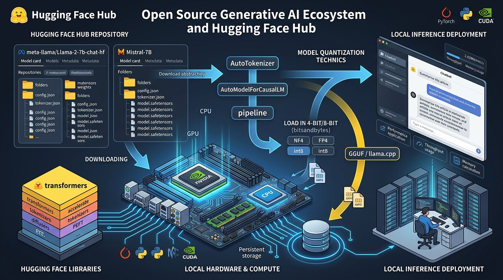

# 🦙 Open Source Ecosystem: Utilizing Meta Llama 2 & Accessing Diverse Models via the Hugging Face Hub

> **Zero to Hero Gen AI Course — Module 05: Agents, Tooling & Open-Source Models**
>
> 📅 Module 5 | ⏱️ Estimated Reading Time: 70 minutes | 🎯 Level: Intermediate to Advanced
>
> **Core Objective:** Demystify the democratized open-source AI landscape and escape closed-source proprietary API vendor lock-in. Master the architecture and lineage of Meta's Llama series (Llama 2 7B/13B/70B and modern successors). Deconstruct the Hugging Face Hub ecosystem: model cards, repository anatomy (`config.json`, `tokenizer.json`, `model.safetensors`), gated model authentication protocols, and the `transformers` abstraction hierarchy (`AutoTokenizer`, `AutoModelForCausalLM`, `pipeline`). Deep-dive into consumer hardware enablement via model quantization (bitsandbytes 8-bit/4-bit NF4, GGUF/llama.cpp), memory calculation formulas, and enterprise on-premises deployment patterns.

---

## 📑 Table of Contents

1. [The Open-Source Revolution: Why Open Weights Matter](#1-the-open-source-revolution-why-open-weights-matter)
   - [1.1 Closed APIs vs Open-Source Models: Privacy, Data Sovereignty, Customizability & Cost](#11-closed-apis-vs-open-source-models-privacy-data-sovereignty-customizability--cost)
   - [1.2 The Open-Weights Spectrum: Permissive (Apache 2.0 / MIT) vs Semi-Open (Llama Community License)](#12-the-open-weights-spectrum-permissive-apache-20--mit-vs-semi-open-llama-community-license)
2. [Intuitive Mental Models & Analogies](#2-intuitive-mental-models--analogies)
   - [2.1 The Rented Food Delivery vs The Fully Equipped Private Kitchen](#21-the-rented-food-delivery-vs-the-fully-equipped-private-kitchen)
   - [2.2 The App Store & GitHub of Artificial Intelligence: Hugging Face](#22-the-app-store--github-of-artificial-intelligence-hugging-face)
   - [2.3 High-Resolution Uncompressed Audio vs MP3 Compression (Quantization)](#23-high-resolution-uncompressed-audio-vs-mp3-compression-quantization)
3. [The Meta Llama Evolution: Architecture & Breakthroughs](#3-the-meta-llama-evolution-architecture--breakthroughs)
   - [3.1 The Lineage: Llama 1 to Llama 2 to Llama 3](#31-the-lineage-llama-1-to-llama-2-to-llama-3)
   - [3.2 Llama 2 Architectural Innovations: GQA, RoPE, SwiGLU, 4k Context](#32-llama-2-architectural-innovations-gqa-rope-swiglu-4k-context)
   - [3.3 Parameter Profiles: 7B, 13B, and 70B Compute Trade-Offs](#33-parameter-profiles-7b-13b-and-70b-compute-trade-offs)
   - [3.4 The Llama 2 Chat Prompt Template Format (`[INST] <<SYS>> ... <</SYS>> ... [/INST]`)](#34-the-llama-2-chat-prompt-template-format-inst-sys--sys--inst)
4. [The Hugging Face Hub Architecture Deconstructed](#4-the-hugging-face-hub-architecture-deconstructed)
   - [4.1 Hub Entities: Models, Datasets, Spaces, and Organizations](#41-hub-entities-models-datasets-spaces-and-organizations)
   - [4.2 Anatomy of a Model Repository (`config.json`, `tokenizer.json`, `safetensors`)](#42-anatomy-of-a-model-repository-configjson-tokenizerjson-safetensors)
   - [4.3 Why Safetensors Replaced PyTorch `.bin` (Zero-Copy & Security Immunity)](#43-why-safetensors-replaced-pytorch-bin-zero-copy--security-immunity)
   - [4.4 Gated Models & Authentication Tokens (`huggingface-cli login`)](#44-gated-models--authentication-tokens-huggingface-cli-login)
5. [The `transformers` Library Abstraction Hierarchy](#5-the-transformers-library-abstraction-hierarchy)
   - [5.1 `AutoTokenizer`: BPE Vocabularies, Special Tokens, Padding & Attention Masks](#51-autotokenizer-bpe-vocabularies-special-tokens-padding--attention-masks)
   - [5.2 `AutoModelForCausalLM`: Device Mapping (`device_map="auto"`) and Dtypes (FP16, BF16)](#52-automodelforcausallm-device-mapping-device_mapauto-and-dtypes-fp16-bf16)
   - [5.3 High-Level Inference: The `pipeline` Interface](#53-high-level-inference-the-pipeline-interface)
   - [5.4 Real-Time Token Generation with `TextStreamer`](#54-real-time-token-generation-with-textstreamer)
6. [Hardware Efficiency & Quantization: Running Large Models on Consumer GPUs](#6-hardware-efficiency--quantization-running-large-models-on-consumer-gpus)
   - [6.1 The VRAM Math: Calculating GPU Memory Footprints for LLMs](#61-the-vram-math-calculating-gpu-memory-footprints-for-llms)
   - [6.2 Precision Formats: FP32 vs FP16/BF16 vs INT8 vs INT4](#62-precision-formats-fp32-vs-fp16bf16-vs-int8-vs-int4)
   - [6.3 BitsAndBytes NF4 (NormalFloat4) & Double Quantization](#63-bitsandbytes-nf4-normalfloat4--double-quantization)
   - [6.4 The GGUF Format & Local CPU/GPU Offloading via `llama.cpp` and Ollama](#64-the-gguf-format--local-cpugpu-offloading-via-llamacpp-and-ollama)
7. [Enterprise Deployment Patterns: Local vs Cloud Endpoints](#7-enterprise-deployment-patterns-local-vs-cloud-endpoints)
   - [7.1 Local High-Throughput Serving with vLLM & Ollama](#71-local-high-throughput-serving-with-vllm--ollama)
   - [7.2 Hugging Face Serverless Inference API vs Dedicated Inference Endpoints](#72-hugging-face-serverless-inference-api-vs-dedicated-inference-endpoints)
   - [7.3 Hybrid Orchestration: Edge Models for Privacy, Cloud Models for Frontier Reasoning](#73-hybrid-orchestration-edge-models-for-privacy-cloud-models-for-frontier-reasoning)
8. [Comparative Evaluation Matrix: Open-Source LLM Families](#8-comparative-evaluation-matrix-open-source-llm-families)
9. [Enterprise Case Studies](#9-enterprise-case-studies)
   - [9.1 On-Premises Healthcare Clinical Assistant (Zero Data Leakage / HIPAA)](#91-on-premises-healthcare-clinical-assistant-zero-data-leakage--hipaa)
   - [9.2 Air-Gapped Code Completion for Financial Trading Infrastructure](#92-air-gapped-code-completion-for-financial-trading-infrastructure)
10. [Complete System Architecture Visualized](#10-complete-system-architecture-visualized)
11. [Hands-On Python Lab Walkthrough](#11-hands-on-python-lab-walkthrough)
12. [Curated Video Walkthroughs & Visual Animations](#12-curated-video-walkthroughs--visual-animations)
13. [Self-Assessment & Review Questions](#13-self-assessment--review-questions)
14. [Summary & Key Takeaways](#14-summary--key-takeaways)

---

## 1. The Open-Source Revolution: Why Open Weights Matter

### 1.1 Closed APIs vs Open-Source Models: Privacy, Data Sovereignty, Customizability & Cost

While proprietary closed-source models (OpenAI GPT-4o, Anthropic Claude 3.5 Sonnet, Google Gemini 1.5 Pro) represent the high-water mark of benchmark reasoning, relying exclusively on closed APIs introduces critical business risks:

```
+-------------------------------------------------------------------------------------------------+
|                                 CLOSED APIs vs OPEN-SOURCE WEIGHTS                              |
+-------------------------------------------------------------------------------------------------+
|                                                                                                 |
|   CLOSED PROPRIETARY APIs (OpenAI / Anthropic):                                                 |
|   - ❌ Data Sovereignty: User prompts traverse the public internet to third-party data centers.  |
|   - ❌ Ephemeral Stability: Providers silently deprecate models, alter safety guards, or drop    |
|        endpoints on short notice.                                                               |
|   - ❌ Black-Box Weights: You cannot inspect model internals, activations, or logprobs.         |
|   - ❌ High Token Taxes: High-concurrency applications pay perpetual per-token fees.             |
|                                                                                                 |
|   OPEN-SOURCE WEIGHTS (Meta Llama, Mistral, Qwen):                                              |
|   - ✅ 100% Data Privacy: Runs entirely inside air-gapped on-premises VPCs or local workstations.|
|   - ✅ Permanent Reproducibility: A downloaded model checkpoint runs identically forever.       |
|   - ✅ Deep Customizability: Full fine-tuning (LoRA, QLoRA, full-weights) on proprietary corpus. |
|   - ✅ Deterministic Costs: Pay only for compute hardware (GPU electricity / server rental).    |
|                                                                                                 |
+-------------------------------------------------------------------------------------------------+
```

### 1.2 The Open-Weights Spectrum: Permissive (Apache 2.0 / MIT) vs Semi-Open (Llama Community License)

In modern Generative AI, **"Open Source"** encompasses a spectrum of licensing models:

1. **Permissive Open Source (Apache 2.0 / MIT):**
   - *Examples:* Mistral 7B v0.1, Qwen 2.5, Falcon, BLOOM, GPT-J.
   - *Terms:* Total commercial freedom. You may fine-tune, host, distribute, and monetize with zero usage thresholds.
2. **Open Weights with Community Licenses (Meta Llama 2 / Llama 3):**
   - *Terms:* Free for commercial and research use for 99.9% of organizations.
   - *The Catch:* If an enterprise has over **700 million monthly active users (MAU)** at the time of the model's release (designed to prevent rival Big Tech conglomerates like Google, Apple, or Amazon from freely monetizing Llama without Meta's approval), you must request an explicit commercial license from Meta.
   - *Derivatives:* You may not use Llama outputs to train competing foundation models (though community distillation is widespread).

---

## 2. Intuitive Mental Models & Analogies

```
+-------------------------------------------------------------------------------------------------+
|                                 OPEN-SOURCE MENTAL MODELS & ANALOGIES                           |
+-------------------------------------------------------------------------------------------------+
|                                                                                                 |
|  1. CLOUD DELIVERY vs PRIVATE KITCHEN         2. HUGGING FACE AS GITHUB + APP STORE             |
|                                                                                                 |
|      Closed API (UberEats Delivery):              Hugging Face Hub:                             |
|      * You order food from a central restaurant.  * GitHub hosts code; Hugging Face hosts       |
|      * You cannot see what happens in kitchen.      tensors, weights, and tokenizer files.      |
|      * If restaurant closes or raises prices,     * Model Cards act as README nutrition labels. |
|        you are at their mercy.                    * Standardized git clone for neural nets.     |
|                                                                                                 |
|      Open Source (Your Private Kitchen):                                                        |
|      * You download the secret recipe (weights).  3. AUDIO CD vs MP3 (QUANTIZATION)             |
|      * You own the stove (GPU).                   * FP16: Lossless 24-bit audio file (14 GB).   |
|      * You cook privately in your own home.       * INT4: Compressed 128kbps MP3 file (4 GB).   |
|      * Nobody can spy on what you are eating.       Human ear cannot detect the difference,     |
|                                                     yet file size drops by 70%!                 |
|                                                                                                 |
+-------------------------------------------------------------------------------------------------+
```

### 2.1 The Rented Food Delivery vs The Fully Equipped Private Kitchen

- **Closed API:** You order catered meals from a high-end restaurant via delivery. It tastes great, but if the restaurant changes the ingredients, closes at midnight, or logs your dietary preferences, you have no recourse.
- **Open-Source LLMs:** Meta and the open-source community publish the complete culinary blueprint. You buy your own induction stove (a workstation GPU or cloud VM), stock your own pantry, and cook on-premises. Your recipes, customer lists, and financial records never leave the building.

### 2.2 The App Store & GitHub of Artificial Intelligence: Hugging Face

Just as **GitHub** became the universal registry for software source code, **Hugging Face** is the decentralized operating system for machine learning:
- It hosts over **1,000,000 open models**, 200,000 datasets, and 250,000 interactive web demos (Spaces).
- Every model repository acts as a Git repo containing weights, configuration dictionaries, tokenizers, and a standardized "Model Card" documenting pre-training datasets, benchmarks, and licensing constraints.

### 2.3 High-Resolution Uncompressed Audio vs MP3 Compression (Quantization)

Why can an engineer run a 7-billion parameter language model on a MacBook Air or an inexpensive gaming laptop?
- An uncompressed WAV audio file takes 50 MB of disk space. An MP3 version takes 4 MB. To 98% of human ears, the music sounds indistinguishable.
- **Quantization** is the mathematical MP3 compression of artificial intelligence. It shrinks the precision of neural network weights from 16-bit floating-point numbers down to 4-bit integers, reducing memory consumption by up to **75%** with near-zero perceptual loss in conversational quality!

---

## 3. The Meta Llama Evolution: Architecture & Breakthroughs

### 3.1 The Lineage: Llama 1 to Llama 2 to Llama 3

In February 2023, Meta AI shocked the tech industry by releasing **LLaMA-1** (Large Language Model Meta AI). Unlike previous Big Tech releases, Meta made the weights accessible to academic researchers. When weights leaked to 4chan and GitHub, an explosion of community innovation occurred:

```
+-------------------------------------------------------------------------------------------------+
|                                     THE META LLAMA TIMELINE                                     |
+-------------------------------------------------------------------------------------------------+
|                                                                                                 |
|   [LLaMA-1 (Feb 2023)]  --> 7B, 13B, 33B, 65B | Research-only | 2k context | Standard MHA       |
|            |                                                                                    |
|            v                                                                                    |
|   [Llama 2 (July 2023)] --> 7B, 13B, 70B | Commercial license | 4k context | GQA in 70B         |
|            |                RLHF chat fine-tunes | 2 Trillion pre-training tokens               |
|            v                                                                                    |
|   [Llama 3 (Apr 2024)]  --> 8B, 70B, 405B | 8k -> 128k context | 15T tokens | GQA across all    |
|                             128k Tiktoken vocabulary | Frontier capability                      |
|                                                                                                 |
+-------------------------------------------------------------------------------------------------+
```

### 3.2 Llama 2 Architectural Innovations: GQA, RoPE, SwiGLU, 4k Context

Llama 2 incorporates several state-of-the-art transformer architectural improvements:

```
+-------------------------------------------------------------------------------------------------+
|                                 LLAMA 2 ARCHITECTURAL ENHANCEMENTS                              |
+-------------------------------------------------------------------------------------------------+
|                                                                                                 |
|  1. SwiGLU ACTIVATIONS: Replaces standard ReLU/GELU with Swish-Gated Linear Units:              |
|     SwiGLU(x) = (x * W_gate * sigmoid(beta * x * W_gate)) * (x * W_up)                          |
|     Yields superior gradient propagation and representational capacity.                         |
|                                                                                                 |
|  2. RoPE (Rotary Positional Embeddings):                                                        |
|     Encodes token position via complex rotation matrices applied directly to Query & Key       |
|     vectors. Enables robust relative position awareness and seamless context extrapolation.     |
|                                                                                                 |
|  3. GQA (Grouped-Query Attention) in 70B:                                                       |
|     Standard Multi-Head Attention (MHA) allocates 1 Key-Value head per Query head.              |
|     GQA shares 1 Key-Value head across 8 Query heads, shrinking KV-Cache memory consumption     |
|     by 8x and drastically accelerating inference decoding!                                      |
|                                                                                                 |
|  4. RMSNorm (Root Mean Square Normalization):                                                   |
|     Pre-normalization before each attention & MLP block that drops mean-centering,              |
|     saving 10%–15% in forward-pass compute overhead.                                            |
|                                                                                                 |
+-------------------------------------------------------------------------------------------------+
```

### 3.3 Parameter Profiles: 7B, 13B, and 70B Compute Trade-Offs

Meta released Llama 2 in three distinct weight configurations:

| Parameter Scale | Layers ($L$) | Hidden Dim ($d$) | Attention Heads ($H$) | Training Tokens | Minimum VRAM (FP16) | Minimum VRAM (4-bit NF4) | Recommended Hardware |
| :--- | :--- | :--- | :--- | :--- | :--- | :--- | :--- |
| **Llama-2-7B** | 32 | 4,096 | 32 | 2.0 Trillion | ~14 GB | **~4.5 GB** | Single RTX 3060 / 4060 (8GB VRAM) |
| **Llama-2-13B** | 40 | 5,120 | 40 | 2.0 Trillion | ~26 GB | **~8.5 GB** | RTX 3090 / 4080 (16GB VRAM) |
| **Llama-2-70B** | 80 | 8,192 | 64 (8 KV) | 2.0 Trillion | ~140 GB | **~38 GB** | 2x RTX 3090 (48GB) or 1x A100 (80GB) |

### 3.4 The Llama 2 Chat Prompt Template Format (`[INST] <<SYS>> ... <</SYS>> ... [/INST]`)

Unlike general base completion models that merely autocomplete raw text, **Llama-2-Chat** was instruction-tuned and aligned via RLHF using a strict structural formatting syntax:

```text
<s>[INST] <<SYS>>
You are a helpful, respectful, and honest enterprise assistant. Always answer as helpfully as possible while adhering to company policy.
<</SYS>>

What are the key benefits of running open-source LLMs locally? [/INST]
Running open-source models locally provides total data sovereignty, zero API egress costs, and permanent reproducibility. </s><s>[INST] Can you list 3 specific hardware options? [/INST]
Certainly! Here are 3 hardware options:
1. NVIDIA RTX 4090 (24GB VRAM)
2. Apple Mac Studio M2 Ultra (128GB Unified Memory)
3. Dual NVIDIA RTX 3090 (48GB total VRAM) </s>
```

> [!CAUTION]
> **Formatting Matters:**
> If you omit the `[INST]` or `<<SYS>>` tags when prompting `Llama-2-7b-chat-hf`, the model will frequently degrade into conversational babble or autocomplete roleplay scripts. Using the Hugging Face Tokenizer's `apply_chat_template()` utility guarantees exact formatting compliance.

---

## 4. The Hugging Face Hub Architecture Deconstructed

### 4.1 Hub Entities: Models, Datasets, Spaces, and Organizations

The Hugging Face Hub (`huggingface.co`) is organized into four core primitives:
1. **Models:** Git LFS repositories storing neural network architectures and weights (e.g. `meta-llama/Llama-2-7b-chat-hf`, `mistralai/Mistral-7B-Instruct-v0.2`).
2. **Datasets:** Version-controlled training, validation, and benchmark corpora (e.g. `squad`, `glue`, `Open-Orca/OpenOrca`).
3. **Spaces:** Hosted cloud containers running interactive web applications (built with Gradio or Streamlit).
4. **Organizations:** Verified enterprise entities managing model access (e.g. `meta-llama`, `google`, `microsoft`, `mistralai`).

### 4.2 Anatomy of a Model Repository (`config.json`, `tokenizer.json`, `safetensors`)

A typical modern Hugging Face model repository contains the following critical files:

```
meta-llama/Llama-2-7b-chat-hf/
├── README.md                  # The Model Card: training data, benchmarks, licenses
├── config.json                # Hyperparameters: vocab_size, hidden_size, num_hidden_layers
├── generation_config.json     # Default inference settings: temperature, top_p, eos_token_id
├── tokenizer.json             # Serialized BPE tokenizer mapping tokens to IDs
├── tokenizer_config.json      # Special tokens: <s> (BOS), </s> (EOS), <unk>
├── special_tokens_map.json    # Map of special token strings
├── model.safetensors.index.json # Shard index for multi-file weight splitting
├── model-00001-of-00002.safetensors # Sharded neural network tensors (Layer 1-16)
└── model-00002-of-00002.safetensors # Sharded neural network tensors (Layer 17-32)
```

### 4.3 Why Safetensors Replaced PyTorch `.bin` (Zero-Copy & Security Immunity)

Historically, machine learning weights were serialized using Python's native `pickle` module (`pytorch_model.bin`).

This posed two grave risks:
1. **Remote Code Execution Vulnerability:** Python `pickle` is inherently unsafe. Deserializing a malicious `.bin` file could execute arbitrary shell commands on your host server.
2. **Slow Host-to-Device Memory Overhead:** PyTorch `.bin` requires unpickling weights into CPU RAM first, creating deep memory copies before transferring to GPU VRAM.

**The Solution: `safetensors` (Created by Hugging Face)**
- **100% Security:** `safetensors` is a pure binary tensor serialization format with zero executable code. It is mathematically impossible to embed malicious code inside a safetensors file.
- **Zero-Copy Memory Mapping (`mmap`):** The file maps directly from the NVMe SSD into GPU memory without intermediate CPU copies, speeding up model load times by up to **5x**!

### 4.4 Gated Models & Authentication Tokens (`huggingface-cli login`)

High-profile open-weight models (such as Meta Llama 2, Llama 3, and Google Gemma) are **Gated Models**. You cannot download them anonymously.

**The 3-Step Verification Flow:**
1. Create a free account on [huggingface.co](https://huggingface.co).
2. Visit the model page (e.g. `meta-llama/Llama-2-7b-chat-hf`) and accept Meta's Terms of Service.
3. Generate a User Access Token (Read Permission) under **Settings $\to$ Access Tokens**, and authenticate via CLI or Python:

```bash
# Terminal Authentication
huggingface-cli login --token hf_xxxxxxxxxxxxxxxxxxxxxxxxxxxx
```

```python
# In Python
import os
from huggingface_hub import login

login(token=os.getenv("HUGGINGFACE_HUB_TOKEN"))
```

---

## 5. The `transformers` Library Abstraction Hierarchy

The Hugging Face `transformers` library provides a unified, elegant API to load, configure, and execute over 100,000 diverse model architectures with identical code patterns.

```
+-------------------------------------------------------------------------------------------------+
|                                TRANSFORMERS API ABSTRACTION HIERARCHY                           |
+-------------------------------------------------------------------------------------------------+
|                                                                                                 |
|   HIGH LEVEL:   pipeline("text-generation", model=...)                                          |
|                 (End-to-end black box: text in -> tokens -> inference -> text out)              |
|                                                                                                 |
|   MID LEVEL:    AutoTokenizer                     AutoModelForCausalLM                          |
|                 * tokenizes text into input_ids    * loads neural weights onto CUDA/CPU         |
|                 * generates attention_mask         * executes forward pass tensor ops           |
|                                                                                                 |
|   LOW LEVEL:    torch.Tensor operations, logits manipulation, custom sampling loops, KV-Cache   |
|                                                                                                 |
+-------------------------------------------------------------------------------------------------+
```

### 5.1 `AutoTokenizer`: BPE Vocabularies, Special Tokens, Padding & Attention Masks

The tokenizer converts human unicode strings into multidimensional PyTorch tensors:

```python
from transformers import AutoTokenizer

model_id = "meta-llama/Llama-2-7b-chat-hf"
tokenizer = AutoTokenizer.from_pretrained(model_id)

text = "Hello, Generative AI!"
encoded = tokenizer(text, return_tensors="pt")

print("Tokens IDs    :", encoded["input_ids"])
print("Attention Mask:", encoded["attention_mask"])
# input_ids: tensor([[    1, 15043, 29892,  5422,  2341, 10221, 29991]])
# Note: Token ID 1 is the beginning-of-sequence (<s>) token.
```

### 5.2 `AutoModelForCausalLM`: Device Mapping (`device_map="auto"`) and Dtypes (FP16, BF16)

The `AutoModelForCausalLM` factory dynamically instantiates the correct neural network class (e.g., `LlamaForCausalLM`):

```python
import torch
from transformers import AutoModelForCausalLM

model = AutoModelForCausalLM.from_pretrained(
    "meta-llama/Llama-2-7b-chat-hf",
    torch_dtype=torch.float16,     # Use half-precision 16-bit float
    device_map="auto",             # Automatically split layers across available GPUs & CPU
    low_cpu_mem_usage=True
)
```

- **`device_map="auto"`:** Calculates available VRAM across all installed NVIDIA GPUs (CUDA 0, CUDA 1). If a model is too large for GPU 0, it automatically splits the remaining transformer layers onto GPU 1, and offloads residual layers to CPU RAM or NVMe disk!

### 5.3 High-Level Inference: The `pipeline` Interface

```python
from transformers import pipeline

generator = pipeline(
    "text-generation",
    model=model,
    tokenizer=tokenizer,
    max_new_tokens=256,
    temperature=0.7,
    top_p=0.9
)

response = generator("What are the primary differences between Llama 2 and GPT-4?")
print(response[0]["generated_text"])
```

### 5.4 Real-Time Token Generation with `TextStreamer`

In production chat interfaces, users should not wait 10 seconds for the entire response to generate. `TextStreamer` streams tokens to `stdout` in real time as they are decoded:

```python
from transformers import TextStreamer

streamer = TextStreamer(tokenizer, skip_prompt=True)
_ = model.generate(**encoded.to("cuda"), streamer=streamer, max_new_tokens=150)
```

---

## 6. Hardware Efficiency & Quantization: Running Large Models on Consumer GPUs

### 6.1 The VRAM Math: Calculating GPU Memory Footprints for LLMs

How much GPU memory (VRAM) do you need to load a model into memory? Use this standard formula:

$$\text{Memory}_{\text{weights}} = \text{Parameters (in billions)} \times \text{Bytes per Parameter}$$

$$\text{Total VRAM Budget} \approx \text{Memory}_{\text{weights}} \times 1.20 \quad (\text{+20\% for KV-Cache, activations, and overhead})$$

```
+-------------------------------------------------------------------------------------------------+
|                                 VRAM CALCULATOR CHEAT SHEET                                     |
+-------------------------------------------------------------------------------------------------+
|                                                                                                 |
|   Precision Format    Bytes/Param    Llama-2-7B VRAM       Llama-2-13B VRAM    Llama-2-70B VRAM |
|   ----------------    -----------    ---------------       ----------------    ---------------- |
|   FP32 (32-bit float)  4 bytes       ~28 GB                ~52 GB              ~280 GB          |
|   FP16 (16-bit half)   2 bytes       ~14 GB                ~26 GB              ~140 GB          |
|   INT8 (8-bit integer) 1 byte        ~7.5 GB               ~14 GB              ~72 GB           |
|   INT4 (4-bit integer) 0.5 bytes     ~4.5 GB               ~8.5 GB             ~38 GB           |
|                                                                                                 |
+-------------------------------------------------------------------------------------------------+
```

### 6.2 Precision Formats: FP32 vs FP16/BF16 vs INT8 vs INT4

- **FP32 (Single Precision, 32 bits):** Standard IEEE float. Unnecessary for LLM inference; wastes memory bandwidth.
- **FP16 / BF16 (Half Precision, 16 bits):** Industry standard for training and unquantized inference. Bfloat16 (`bfloat16`) provides wider dynamic range, preventing gradient underflow.
- **INT8 (8-bit Quantization):** Halves VRAM usage with <0.5% perplexity degradation.
- **INT4 (4-bit Quantization):** Drops memory by 4x. Allows a 7B model to run comfortably on a laptop with an 8GB GPU!

### 6.3 BitsAndBytes NF4 (NormalFloat4) & Double Quantization

Pioneered by Tim Dettmers in the QLoRA paper, **NF4 (NormalFloat4)** is an information-theoretically optimal 4-bit data type for normally distributed neural network weights:

```python
from transformers import BitsAndBytesConfig

# Configure state-of-the-art 4-bit quantization
bnb_config = BitsAndBytesConfig(
    load_in_4bit=True,
    bnb_4bit_quant_type="nf4",              # Use NormalFloat4
    bnb_4bit_compute_dtype=torch.float16,   # Dequantize to FP16 for matrix multiplication
    bnb_4bit_use_double_quant=True          # Quantize the quantization constants (saves extra 0.4 bits/param)
)

model_4bit = AutoModelForCausalLM.from_pretrained(
    "meta-llama/Llama-2-7b-chat-hf",
    quantization_config=bnb_config,
    device_map="auto"
)
```

### 6.4 The GGUF Format & Local CPU/GPU Offloading via `llama.cpp` and Ollama

While `bitsandbytes` requires an NVIDIA CUDA GPU, **GGUF (GPT-Generated Unified Format)** powers local CPU and Mac Apple Silicon inference via `llama.cpp` and **Ollama**:
- **Unified Single Binary:** The entire model (weights, architecture, and tokenizer) is packed into a single `.gguf` file.
- **Hybrid Layer Offloading:** If you have 6GB of VRAM and a 7B model needs 8GB, GGUF offloads 24 layers to the GPU and runs the remaining 8 layers on system CPU RAM without crashing!

---

## 7. Enterprise Deployment Patterns: Local vs Cloud Endpoints

```
+-------------------------------------------------------------------------------------------------+
|                               ENTERPRISE OPEN-SOURCE DEPLOYMENT PATTERNS                        |
+-------------------------------------------------------------------------------------------------+
|                                                                                                 |
|   1. LOCAL HIGH-THROUGHPUT (vLLM / Ollama):                                                     |
|      * Dedicated On-Premises GPU Server (e.g., 4x NVIDIA A100 or H100).                         |
|      * Uses PagedAttention via vLLM for 10x-24x token throughput.                               |
|      * Zero external network dependencies; 100% HIPAA and GDPR compliant.                       |
|                                                                                                 |
|   2. HUGGING FACE INFERENCE ENDPOINTS:                                                          |
|      * 1-Click managed cloud deployment on AWS / Azure.                                         |
|      * Dedicated private endpoint URL with autoscaling down to zero.                            |
|      * Standard OpenAI-compatible REST API `/v1/chat/completions`.                              |
|                                                                                                 |
|   3. HYBRID ENTERPRISE ROUTING:                                                                 |
|      * 80% of routine queries (summarization, categorization, PII redaction) routed to local   |
|        quantized Llama-2-7B.                                                                    |
|      * 20% of ultra-complex multi-hop reasoning tasks routed to frontier models.                |
|      * Slashes annual cloud AI billing by over 75%!                                             |
|                                                                                                 |
+-------------------------------------------------------------------------------------------------+
```

---

## 8. Comparative Evaluation Matrix: Open-Source LLM Families

```
+-------------------------------------------------------------------------------------------------+
|                               TOP OPEN-SOURCE LLM ARCHITECTURES                                 |
+-------------------------------------------------------------------------------------------------+
```

| Model Family | Primary Creator | License Type | Parameter Sizes | Context Length | Standout Architectural Strength |
| :--- | :--- | :--- | :--- | :--- | :--- |
| **Meta Llama 2** | Meta AI | Llama 2 Community | 7B, 13B, 70B | 4,096 tokens | Pioneered open commercial LLMs, robust RLHF safety tuning. |
| **Meta Llama 3 / 3.1** | Meta AI | Llama 3 Community | 8B, 70B, 405B | 128,000 tokens | 128k context, 15T training tokens, rivaling closed frontier models. |
| **Mistral / Mixtral** | Mistral AI | Apache 2.0 | 7B, 8x7B, 8x22B | 32,000 tokens | Sliding Window Attention, Sparse Mixture-of-Experts (MoE). |
| **Qwen 2.5** | Alibaba Cloud | Apache 2.0 / Qwen | 0.5B to 72B | 128,000 tokens | State-of-the-art coding, math, and multilingual benchmark performance. |
| **Gemma 2** | Google DeepMind | Gemma Terms | 2B, 9B, 27B | 8,192 tokens | Interleaved local and global attention, knowledge distillation. |

---

## 9. Enterprise Case Studies

### 9.1 On-Premises Healthcare Clinical Assistant (Zero Data Leakage / HIPAA)

**Business Scenario:** A major hospital network requires an AI assistant to summarize patient medical records, draft clinical notes, and suggest differential diagnoses. Federal HIPAA regulations strictly prohibit sending Protected Health Information (PHI) over public third-party APIs.

**Solution Architecture:**
1. Hospital deploys dual on-premises servers equipped with 2x NVIDIA A6000 Ada (48GB VRAM each).
2. Hugging Face `meta-llama/Llama-2-70b-chat-hf` is deployed using **vLLM** with 4-bit AWQ quantization.
3. The system operates inside an air-gapped hospital intranet behind internal enterprise firewalls.
4. **Outcome:** Doctors achieve sub-2-second clinical record summarization with 0% data egress and 100% HIPAA regulatory compliance.

### 9.2 Air-Gapped Code Completion for Financial Trading Infrastructure

**Business Scenario:** A proprietary quantitative trading firm develops high-frequency algorithmic execution engines in C++ and Python. Management forbids developers from using commercial cloud copilot plugins due to intellectual property theft risks.

**Solution Architecture:**
1. Firm downloads `Qwen2.5-Coder-7B-Instruct` and `Llama-3-8B-Instruct` from Hugging Face Hub inside a DMZ inspection sandbox.
2. Models are compiled into GGUF format and deployed to developer workstations running local **Ollama** instances.
3. VS Code is configured with Continue.dev to point to `localhost:11434`.
4. **Outcome:** Over 200 quantitative developers receive real-time, low-latency inline code completions entirely on local hardware with zero IP exposure.

---

## 10. Complete System Architecture Visualized

### Figure 1: The Hugging Face Open-Source Generative AI Ecosystem
Complete end-to-end architectural schematic illustrating repository structure, `transformers` abstraction pipelines, quantization mechanics (bitsandbytes, GGUF), and local/edge deployment.



---

## 11. Hands-On Python Lab Walkthrough

The companion production lab script [`code/huggingface_open_source_models_lab.py`](file:///c:/Users/sriva/OneDrive/Desktop/GEN%20AI%20COURSE/5.%20Agents,%20Tooling%20&%20Open-Source%20Models/code/huggingface_open_source_models_lab.py) contains a full, standalone, battle-tested implementation with 5 comprehensive experiments.

### Structure of the Lab Suite:

```
5. Agents, Tooling & Open-Source Models/
├── assets/
│   ├── 01_agent_reasoning_loop.jpg
│   ├── 02_function_calling_lifecycle.jpg
│   ├── 03_search_api_integration.jpg
│   └── 04_huggingface_open_source_ecosystem.jpg
├── code/
│   ├── autonomous_react_agent_lab.py          <-- Lab 01 (ReAct Agent State Machine)
│   ├── live_search_tools_lab.py               <-- Lab 02 (Live Search API & Grounding)
│   └── huggingface_open_source_models_lab.py   <-- Lab 03 (Hugging Face & Open Source Lab)
├── Autonomous Agents - Designing ReAct (Reasoning + Acting) agents capable of using external tools.md
├── External Integration - Connecting models to live data via search APIs (e.g., Google Search, SerpAPI).md
└── Open Source Ecosystem - Utilizing Meta Llama 2 and accessing diverse models via the Hugging Face hub.md
```

### The 5 Lab Experiments:

```
+-------------------------------------------------------------------------------------------------+
|                                 LAB EXPERIMENTS OVERVIEW                                        |
+-------------------------------------------------------------------------------------------------+
|                                                                                                 |
|  Experiment 1: Hugging Face Model Card & Repository Anatomy Inspection                          |
|                Parses real Hub metadata, config.json hyperparameter schemas, and safetensors     |
|                weight shard manifests.                                                          |
|                                                                                                 |
|  Experiment 2: Exact Llama 2 Chat Prompt Template Synthesizer                                   |
|                Implements the canonical `[INST] <<SYS>> ... <</SYS>> ... [/INST]` multi-turn    |
|                chat template formatter and tokenizer special token handling.                   |
|                                                                                                 |
|  Experiment 3: Precision Math & VRAM Memory Footprint Calculator                                |
|                Computes precise memory footprints across FP32, FP16, INT8, and INT4 (NF4) for   |
|                7B, 13B, and 70B parameter models, auditing hardware compatibility.              |
|                                                                                                 |
|  Experiment 4: Pure Python Simulated 4-Bit Weight Quantization                                  |
|                Implements linear min-max quantization converting FP32 weight tensors to INT4    |
|                indices, calculating scale factors and verifying 75% memory compression.         |
|                                                                                                 |
|  Experiment 5: Transformers Pipeline Abstraction & Streaming Emulation                         |
|                Demonstrates AutoTokenizer encoding, attention masking, decoding, and token-by-   |
|                token TextStreamer generation cycles.                                            |
|                                                                                                 |
+-------------------------------------------------------------------------------------------------+
```

---

## 12. Curated Video Walkthroughs & Visual Animations

To reinforce your understanding of the open-source landscape, transformers library, and quantization mechanics, watch these industry-standard educational lectures:

```
+-------------------------------------------------------------------------------------------------+
|                             CURATED VIDEO LECTURES & BENCHMARKS                                 |
+-------------------------------------------------------------------------------------------------+
```

| Video Title | Creator / Channel | Verified URL | Core Concepts Covered |
| :--- | :--- | :--- | :--- |
| **Intro to Large Language Models** | Andrej Karpathy | [youtu.be/zjkBMFhNj_g](https://www.youtube.com/watch?v=zjkBMFhNj_g) | Pre-training, fine-tuning, Llama model architecture, open-weights ecosystem, and local execution. |
| **State of GPT** | Andrej Karpathy | [youtu.be/bZQun8Y4L2A](https://www.youtube.com/watch?v=bZQun8Y4L2A) | LLM training pipeline, tokenization, instruction tuning, and open-source foundation model fine-tuning. |
| **AI Agents For Beginners** | freeCodeCamp | [youtu.be/xM7E_Of1J80](https://www.youtube.com/watch?v=xM7E_Of1J80) | Running open-source models as agent backbones, tool calling, and local execution frameworks. |

---

## 13. Self-Assessment & Review Questions

Test your architectural understanding of Meta Llama and the Hugging Face Hub. Click each question to expand the comprehensive explanation.

<details>
<summary><b>Q1: Why did the AI industry transition from PyTorch pickled weight files (`pytorch_model.bin`) to `safetensors` files on the Hugging Face Hub?</b></summary>
<br>

**Answer:**
1. **Security Vulnerability Immunity:** Python's native `pickle` module deserializes arbitrary bytecode. A malicious actor could inject malicious code into a `.bin` file that executes arbitrary shell commands on your server when `torch.load()` is called. `safetensors` is a strictly pure binary tensor serialization format that contains zero executable code, making it mathematically impossible to execute malicious scripts upon loading.
2. **Zero-Copy Memory Mapping (`mmap`):** Standard unpickling requires reading the model file from disk into host CPU RAM, unpacking it, and then copying it into GPU VRAM. `safetensors` uses OS memory mapping (`mmap`) to map file pointers directly from the NVMe SSD into GPU memory with zero intermediate host CPU copies, reducing model load times by up to 5x.
</details>

<br>

<details>
<summary><b>Q2: How does Grouped-Query Attention (GQA) in Llama 2 70B dramatically improve inference performance compared to standard Multi-Head Attention (MHA)?</b></summary>
<br>

**Answer:**
- In standard Multi-Head Attention (MHA), every Query head has its own corresponding Key and Value head (e.g., 64 Query heads, 64 Key heads, 64 Value heads). During autoregressive decoding, storing the Key-Value (KV) cache for long sequences consumes tens of gigabytes of VRAM and saturates GPU memory bandwidth.
- **Grouped-Query Attention (GQA)** groups multiple Query heads to share a single Key-Value head (e.g., 64 Query heads share 8 Key-Value heads, a ratio of 8:1).
- **Result:** GQA slashes the memory footprint of the KV-Cache by **8x**, drastically reducing memory bandwidth bottlenecks and allowing much higher batch sizes and faster token generation speeds during inference.
</details>

<br>

<details>
<summary><b>Q3: What is the exact formula to calculate the GPU VRAM needed to load a 13-billion parameter model in FP16 precision, and what is the footprint in 4-bit NF4?</b></summary>
<br>

**Answer:**
$$\text{Memory} = \text{Parameters} \times \text{Bytes per Parameter}$$
1. **In FP16 (Half Precision = 2 Bytes per parameter):**
   $$\text{Weight Memory} = 13 \times 10^9 \times 2 \text{ bytes} \approx 26.0 \text{ GB}$$
   Adding ~20% overhead for activations and KV-cache requires approximately **~30 GB of VRAM** (demanding two consumer GPUs or an enterprise A100).
2. **In 4-bit NF4 (0.5 Bytes per parameter):**
   $$\text{Weight Memory} = 13 \times 10^9 \times 0.5 \text{ bytes} \approx 6.5 \text{ GB}$$
   Adding overhead requires approximately **~8.5 GB of VRAM**, allowing the 13B model to run comfortably on a single consumer NVIDIA RTX 3060/4060 GPU!
</details>

<br>

<details>
<summary><b>Q4: What role does the `[INST]` and `<<SYS>>` syntax play in Llama-2-Chat, and what occurs if it is improperly formatted?</b></summary>
<br>

**Answer:**
- **Role:** Meta Llama 2 Chat was fine-tuned using Supervised Fine-Tuning (SFT) and Reinforcement Learning from Human Feedback (RLHF) with a specific structural prompt template:
  `<s>[INST] <<SYS>>\n{system_prompt}\n<</SYS>>\n\n{user_message} [/INST] {model_response} </s>`
  The `[INST]` delimiters tell the attention heads which tokens represent user instructions versus assistant completions, while `<<SYS>>` conditions the model's safety and tone guidelines.
- **Improper Formatting:** If an engineer passes unstructured conversational text, the model does not activate its aligned instruction-following weights properly. It frequently hallucinates user dialogue, continues typing as the user, repeats conversational filler, or refuses to answer valid prompts.
</details>

<br>

<details>
<summary><b>Q5: What is the difference between `bitsandbytes` quantization and `llama.cpp` GGUF quantization in terms of target hardware?</b></summary>
<br>

**Answer:**
- **`bitsandbytes` (NF4 / INT8):** Tightly coupled to NVIDIA CUDA GPUs and the PyTorch ecosystem. It dynamically dequantizes 4-bit weights into 16-bit floating-point registers during GPU matrix multiplication. It requires an NVIDIA GPU with CUDA support.
- **`llama.cpp` / GGUF:** Engineered from scratch in pure C/C++ without PyTorch dependencies. It targets heterogeneous hardware, supporting **CPU-only execution (utilizing AVX-512 / ARM NEON vector instructions), Apple Silicon Unified Memory (Metal), and NVIDIA GPUs**. Furthermore, GGUF supports hybrid offloading (e.g., offloading 20 layers to a GPU and running 12 layers on CPU RAM), enabling models to run on devices that lack sufficient VRAM to hold the entire network.
</details>

---

## 14. Summary & Key Takeaways

1. **Open Weights Grant Autonomy:** Open-source foundation models (Meta Llama, Mistral, Qwen) eliminate vendor lock-in, guarantee 100% data privacy for HIPAA/GDPR compliance, and allow custom domain fine-tuning.
2. **The Hugging Face Standard:** The Hugging Face Hub is the central registry for machine learning, with `safetensors` providing tamper-proof, zero-copy weight loading and `AutoTokenizer` / `AutoModelForCausalLM` providing universal APIs.
3. **Llama 2 Architectural Advances:** SwiGLU activations, Rotary Positional Embeddings (RoPE), and Grouped-Query Attention (GQA) dramatically improve representation quality and inference decoding speed.
4. **Quantization is the Great Equalizer:** 4-bit NF4 and GGUF quantization shrink model memory footprints by 75%, allowing billion-parameter frontier models to run on consumer-grade hardware and local workstations.
5. **Always Enforce Model-Specific Chat Templates:** Utilize `tokenizer.apply_chat_template()` to format conversational turns accurately for instruction-tuned models like Llama 2.

---

*Continue to the companion lab in [`code/huggingface_open_source_models_lab.py`](file:///c:/Users/sriva/OneDrive/Desktop/GEN%20AI%20COURSE/5.%20Agents,%20Tooling%20&%20Open-Source%20Models/code/huggingface_open_source_models_lab.py) to run all 5 interactive experiments.*
