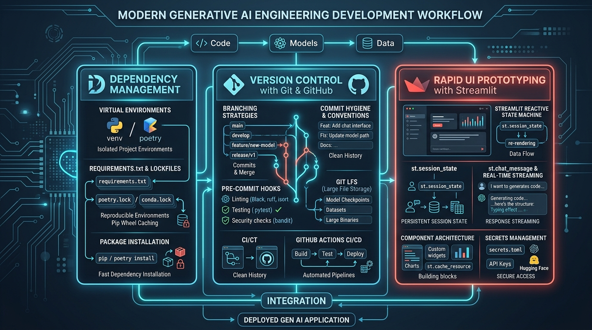

# ⚙️ Development Workflow: Managing Dependencies, Version Control with Git & GitHub, and Building Front-End Interfaces with Streamlit

> **Zero to Hero Gen AI Course — Module 06: End-to-End Development & MLOps**
>
> 📅 Module 6 | ⏱️ Estimated Reading Time: 75 minutes | 🎯 Level: Intermediate to Advanced
>
> **Core Objective:** Master the engineering discipline required to transition Generative AI experiments from fragile local Jupyter notebooks into robust, collaborative, and deployable production software. Deconstruct modern Python dependency management (`venv`, `poetry`, `pyproject.toml`, pinned lockfiles, and CUDA/PyTorch wheel caching). Implement professional Git and GitHub practices for AI projects: repository hygiene, Git LFS for neural weights, conventional commits, pre-commit hooks (Ruff, Black, Gitleaks for API key shielding), and automated GitHub Actions CI/CD workflows. Architect reactive conversational user interfaces using **Streamlit**: master the reactive script re-run execution model, persistent multi-turn chat via `st.session_state`, real-time token streaming via `st.chat_message`, memory caching (`st.cache_resource`), and production secrets management.

---

## 📑 Table of Contents

1. [The Software Engineering Chasm in AI: From Notebook to Production](#1-the-software-engineering-chasm-in-ai-from-notebook-to-production)
   - [1.1 The "Works on My Machine" Crisis: Dependency Hell & Unreproducible Notebooks](#11-the-works-on-my-machine-crisis-dependency-hell--unreproducible-notebooks)
   - [1.2 The Three Pillars of Engineering Hygiene: Environment, Version Control, and User Interfaces](#12-the-three-pillars-of-engineering-hygiene-environment-version-control-and-user-interfaces)
2. [Intuitive Mental Models & Analogies](#2-intuitive-mental-models--analogies)
   - [2.1 The Laboratory Cleanroom (Virtual Environments) vs The Contaminated Workshop](#21-the-laboratory-cleanroom-virtual-environments-vs-the-contaminated-workshop)
   - [2.2 The Time-Traveling Tree of History (Git & GitHub)](#22-the-time-traveling-tree-of-history-git--github)
   - [2.3 The Self-Updating Chalkboard (The Streamlit Reactive Rerun Loop)](#23-the-self-updating-chalkboard-the-streamlit-reactive-rerun-loop)
3. [Pillar 1: Modern Python Dependency Management](#3-pillar-1-modern-python-dependency-management)
   - [3.1 Virtual Environments Under the Hood: How `venv` Manipulates `PATH` and `site-packages`](#31-virtual-environments-under-the-hood-how-venv-manipulates-path-and-site-packages)
   - [3.2 Declarative Dependencies: `requirements.txt` vs Modern `pyproject.toml` (PEP 518 / PEP 621)](#32-declarative-dependencies-requirementstxt-vs-modern-pyprojecttoml-pep-518--pep-621)
   - [3.3 The Determinism Imperative: Loose Constraints vs Exact Pinned Lockfiles](#33-the-determinism-imperative-loose-constraints-vs-exact-pinned-lockfiles)
   - [3.4 Multi-Platform Wheel Management & CUDA / PyTorch Binary Compatibility](#34-multi-platform-wheel-management--cuda--pytorch-binary-compatibility)
4. [Pillar 2: Professional Version Control with Git & GitHub for AI](#4-pillar-2-professional-version-control-with-git--github-for-ai)
   - [4.1 Git Repository Hygiene: Crafting an Ironclad `.gitignore` for Gen AI Projects](#41-git-repository-hygiene-crafting-an-ironclad-gitignore-for-gen-ai-projects)
   - [4.2 Handling Large Model Checkpoints & Datasets: Git LFS (Large File Storage)](#42-handling-large-model-checkpoints--datasets-git-lfs-large-file-storage)
   - [4.3 Branching Workflows: Feature Branching, Pull Requests & Code Review Gates](#43-branching-workflows-feature-branching-pull-requests--code-review-gates)
   - [4.4 Conventional Commits & Pre-Commit Hook Automation (Ruff, Black, Gitleaks)](#44-conventional-commits--pre-commit-hook-automation-ruff-black-gitleaks)
   - [4.5 GitHub Actions CI/CD Pipeline for Automated Model Testing](#45-github-actions-cicd-pipeline-for-automated-model-testing)
5. [Pillar 3: Rapid Front-End Prototyping with Streamlit](#5-pillar-3-rapid-front-end-prototyping-with-streamlit)
   - [5.1 The Streamlit Execution Model: The Reactive Script Re-Run Machine](#51-the-streamlit-execution-model-the-reactive-script-re-run-machine)
   - [5.2 Maintaining Multi-Turn Context: Mastering `st.session_state`](#52-maintaining-multi-turn-context-mastering-stsession_state)
   - [5.3 Building Conversational Interfaces: `st.chat_input`, `st.chat_message`, and `st.write_stream`](#53-building-conversational-interfaces-stchat_input-stchat_message-and-stwrite_stream)
   - [5.4 Performance Optimization: `st.cache_data` vs `st.cache_resource` (Persisting Vector Stores & LLMs)](#54-performance-optimization-stcache_data-vs-stcache_resource-persisting-vector-stores--llms)
   - [5.5 Secrets & Configuration Management: `.streamlit/secrets.toml` vs Environment Variables](#55-secrets--configuration-management-streamlitsecretstoml-vs-environment-variables)
6. [End-to-End Reference Architecture: Complete Enterprise Project Anatomy](#6-end-to-end-reference-architecture-complete-enterprise-project-anatomy)
   - [6.1 Standard Enterprise Directory Layout](#61-standard-enterprise-directory-layout)
   - [6.2 Production `app.py` Streamlit Implementation Blueprint](#62-production-apppy-streamlit-implementation-blueprint)
7. [Production Failure Modes & Engineering Anti-Patterns](#7-production-failure-modes--engineering-anti-patterns)
   - [7.1 Leaking API Keys to Public GitHub Repositories (The Secret Scanner Defense)](#71-leaking-api-keys-to-public-github-repositories-the-secret-scanner-defense)
   - [7.2 The Re-Run Trap: Expensive Model Reloads on Every Widget Click](#72-the-re-run-trap-expensive-model-reloads-on-every-widget-click)
   - [7.3 Streamlit Concurrency Limitations: Single-Process Threading vs Scaling](#73-streamlit-concurrency-limitations-single-process-threading-vs-scaling)
8. [Comparative Evaluation Matrix: UI Frameworks for AI Applications](#8-comparative-evaluation-matrix-ui-frameworks-for-ai-applications)
9. [Enterprise Case Study: Building an Internal Legal Contract Review Copilot](#9-enterprise-case-study-building-an-internal-legal-contract-review-copilot)
10. [Complete Workflow Visualized](#10-complete-workflow-visualized)
11. [Hands-On Python Lab Walkthrough](#11-hands-on-python-lab-walkthrough)
12. [Curated Video Walkthroughs & Visual Animations](#12-curated-video-walkthroughs--visual-animations)
13. [Self-Assessment & Review Questions](#13-self-assessment--review-questions)
14. [Summary & Key Takeaways](#14-summary--key-takeaways)

---

## 1. The Software Engineering Chasm in AI: From Notebook to Production

### 1.1 The "Works on My Machine" Crisis: Dependency Hell & Unreproducible Notebooks

In academic research and rapid prototyping, machine learning engineers spend 90% of their time in **Jupyter Notebooks**. Notebooks are exceptional for exploratory data analysis, plotting loss curves, and testing individual API calls.

However, when moving an AI system from a notebook into an enterprise software product, notebooks become an engineering liability:
- **Hidden Execution State:** Notebook cells can be executed out of order. A variable defined in Cell 14 and modified in Cell 3 creates an invisible, un-reproducible internal Python state that fails as soon as the notebook kernel is restarted.
- **Unpinned Transitive Dependencies:** Installing `pip install langchain` today installs different sub-dependencies than it did six months ago. Without exact lockfiles, a teammate or deployment server experiences broken imports, deprecated function arguments, or silent runtime crashes.
- **Leaked API Keys:** Developers accidentally commit OpenAI or Hugging Face API keys directly into notebook output cells or git histories, leading to automated bot scraping and thousands of dollars in unauthorized cloud bills within minutes.

```
+-------------------------------------------------------------------------------------------------+
|                              THE PROTOTYPE vs PRODUCTION CHASM                                  |
+-------------------------------------------------------------------------------------------------+
|                                                                                                 |
|   FRAGILE RESEARCH PROTOTYPE (Jupyter):             ENTERPRISE AI SOFTWARE PRODUCT:             |
|   - Out-of-order cell execution state.              - Modular, tested Python package architecture|
|   - Global pip environment (dependency collisions). - Isolated venv / Poetry with pinned lockfile|
|   - Hardcoded API keys in plaintext cells.          - Centralized secrets management (.env)      |
|   - Untracked 5 GB model weights in git.            - Git LFS / Hugging Face model registries    |
|   - No automated tests or linting checks.           - Pre-commit hooks & GitHub Actions CI/CD    |
|   - Raw print() statements for output.              - Interactive, reactive Streamlit web UI    |
|                                                                                                 |
+-------------------------------------------------------------------------------------------------+
```

### 1.2 The Three Pillars of Engineering Hygiene: Environment, Version Control, and User Interfaces

To cross this chasm, professional Generative AI engineers rely on **Three Structural Pillars**:
1. **Dependency & Environment Hygiene:** Strict virtual environment isolation, deterministic dependency resolution, and locked package versions.
2. **Version Control & Collaboration:** Structured Git workflows, branch protection rules, automated pre-commit scanning, and CI/CD validation gates.
3. **Interactive User Interfaces:** Rapid, reactive front-end development using **Streamlit**, enabling business stakeholders and non-technical users to test and validate AI models through a polished web interface.

---

## 2. Intuitive Mental Models & Analogies

```
+-------------------------------------------------------------------------------------------------+
|                               DEVELOPMENT WORKFLOW ANALOGIES                                    |
+-------------------------------------------------------------------------------------------------+
|                                                                                                 |
|  1. THE CLEANROOM vs CONTAMINATED WORKSHOP    2. THE TIME-TRAVELING TREE OF HISTORY             |
|                                                                                                 |
|      Global Python Environment:                    Git Version Control:                         |
|      * A messy open workshop where woodworking,    * A magical branching tree where every       |
|        spray painting, and chemistry occur on        atomic change is an indelible snapshot.   |
|        the same table. Wood shavings contaminate   * If a branch catches fire, you can prune    |
|        the beaker!                                   it and step back to a pristine timeline.   |
|                                                                                                 |
|      Isolated Virtual Environment (venv):         3. THE SELF-UPDATING CHALKBOARD               |
|      * A sterile laboratory cleanroom with an      * Streamlit does not require manual event    |
|        airlock. Only the exact chemicals required    listeners. When a user moves a slider,     |
|        for this specific experiment are admitted.    a robot instantly wipes the board clean    |
|        Zero cross-contamination.                     and re-executes the script top-to-bottom!  |
|                                                                                                 |
+-------------------------------------------------------------------------------------------------+
```

### 2.1 The Laboratory Cleanroom (Virtual Environments) vs The Contaminated Workshop

- **Global Python Environment:** Imagine a chemist conducting a delicate pharmaceutical synthesis on a workbench covered in sawdust from a previous carpentry project and motor oil from a motorcycle repair. Installing conflicting packages (e.g. PyTorch 1.13 for an old project and PyTorch 2.4 for a new LLM) globally leads to catastrophic library collisions.
- **Virtual Environment (`venv`):** A sterile cleanroom constructed specifically for this project. When you enter, the room contains only Python and the exact pinned packages specified in your manifest. When the project is finished, you can delete the cleanroom folder without affecting any other work on your machine.

### 2.2 The Time-Traveling Tree of History (Git & GitHub)

- **Without Git:** Developers save files named `medical_bot_v1.py`, `medical_bot_v2_final.py`, `medical_bot_v2_final_FINAL_edit.py`. Nobody knows which file works, who made the changes, or why a refactor broke the retrieval pipeline.
- **With Git & GitHub:** You possess a multidimensional tree of historical checkpoints. Every commit represents an atomic logical mutation with an explanatory message. Feature branches allow multiple engineers to build vector search, UI widgets, and prompt templates simultaneously without colliding, merging their work through peer-reviewed Pull Requests.

### 2.3 The Self-Updating Chalkboard (The Streamlit Reactive Rerun Loop)

In traditional web development (React, Vue, Django), building an interface requires writing HTML markup, CSS stylesheets, client-side JavaScript event listeners, REST API endpoints, and JSON state synchronization.
- **Streamlit reimagines this as a Self-Updating Chalkboard:**
- You write pure Python from line 1 to line 100.
- When the user clicks a button, changes a dropdown, or types a chat message, **Streamlit wipes the chalkboard and re-runs the entire Python script from top to bottom!**
- By utilizing `st.session_state` and `@st.cache_resource`, Streamlit remembers historical context across re-runs without reloading heavy models or losing chat messages.

---

## 3. Pillar 1: Modern Python Dependency Management

### 3.1 Virtual Environments Under the Hood: How `venv` Manipulates `PATH` and `site-packages`

What actually happens when you create and activate a virtual environment?

```bash
# 1. Create a virtual environment directory named .venv
python -m venv .venv

# 2. Activate the virtual environment
# Windows (PowerShell):
.venv\Scripts\Activate.ps1
# Linux / macOS:
source .venv/bin/activate
```

#### Under the Hood Mechanics:
1. **Isolated Directory Creation:** Python creates a `.venv` directory containing a local copy (or symlink) of the Python binary (`python.exe`), `pip`, and an empty `Lib/site-packages/` directory.
2. **`PATH` Prepending:** Activating the environment modifies your active shell's environment variable:
   $$\text{PATH} = \text{C:\Users\...\.venv\Scripts}; \ \$ \text{PATH}_{\text{system}}$$
3. **Resolution Redirection:** When you execute `python script.py` or `pip install langchain`, your shell discovers the local `.venv` binary first, installing all third-party wheel packages strictly into `.venv/Lib/site-packages/`, leaving your global operating system pristine.

### 3.2 Declarative Dependencies: `requirements.txt` vs Modern `pyproject.toml` (PEP 518 / PEP 621)

While legacy Python projects relied on unstructured `requirements.txt` files, modern enterprise applications utilize **`pyproject.toml`**:

```
+-------------------------------------------------------------------------------------------------+
|                                pyproject.toml vs requirements.txt                               |
+-------------------------------------------------------------------------------------------------+
|                                                                                                 |
|   LEGACY requirements.txt:                       MODERN pyproject.toml (PEP 621):               |
|   - Flat list of package strings.                - Structured declarative standard for build    |
|   - No separation of core vs dev dependencies.     tools (Poetry, Hatch, Flit, setuptools).     |
|   - Cannot define project metadata, linters,     - Explicitly groups production and dev tools.  |
|     or build systems in one file.                - Standardized across the Python ecosystem.    |
|                                                                                                 |
+-------------------------------------------------------------------------------------------------+
```

#### Example Enterprise `pyproject.toml`:
```toml
[project]
name = "clinical-medical-chatbot"
version = "1.0.0"
description = "Enterprise Clinical Decision Support Chatbot with Hybrid RAG"
readme = "README.md"
requires-python = ">=3.10,<3.13"
dependencies = [
    "langchain>=0.2.14",
    "langchain-community>=0.2.12",
    "chromadb>=0.5.5",
    "pydantic>=2.8.2",
    "streamlit>=1.38.0",
    "requests>=2.32.3"
]

[project.optional-dependencies]
dev = [
    "pytest>=8.3.2",
    "ruff>=0.6.1",
    "black>=24.8.0",
    "pre-commit>=3.8.0"
]
```

### 3.3 The Determinism Imperative: Loose Constraints vs Exact Pinned Lockfiles

There is a critical distinction between **Abstract Dependencies** and **Concrete Lockfiles**:
- **Abstract Specification (`pyproject.toml`):** Declares minimum acceptable ranges (e.g. `langchain>=0.2.0`). This allows flexibility during development.
- **Concrete Lockfile (`poetry.lock` or `requirements.lock`):** Records the **exact cryptographic hash and exact version** of every primary package and all 150 recursive sub-dependencies (e.g. `langchain==0.2.14`, `pydantic-core==2.20.1`, `urllib3==2.2.2`).

> [!IMPORTANT]
> **The Production Golden Rule:**
> Always commit your lockfile to Git! When deploying to Docker, staging, or production cloud servers, install exclusively from the lockfile:
> ```bash
> pip install --no-deps -r requirements.lock
> # or with Poetry:
> poetry install --no-root --sync
> ```
> This guarantees 100% byte-for-byte reproducibility across every developer machine and Kubernetes pod.

### 3.4 Multi-Platform Wheel Management & CUDA / PyTorch Binary Compatibility

In Generative AI, machine learning packages like **PyTorch** and **BitsAndBytes** are tightly coupled to hardware accelerators:
- Running `pip install torch` on a machine without a dedicated GPU installs the standard CPU wheel (~180 MB).
- Running on an NVIDIA workstation requires the specialized CUDA 12.1 wheel (~2.5 GB):
  ```bash
  pip install torch --index-url https://download.pytorch.org/whl/cu121
  ```
- **Enterprise Best Practice:** In your deployment documentation and Dockerfiles, explicitly declare whether the environment targets `cpu` or `cu121` to avoid runtime `torch.cuda.is_available() == False` surprises.

---

## 4. Pillar 2: Professional Version Control with Git & GitHub for AI

### 4.1 Git Repository Hygiene: Crafting an Ironclad `.gitignore` for Gen AI Projects

In Gen AI applications, failing to configure a proper `.gitignore` leads to bloated repositories, broken clones, and exposed credentials.

```
+-------------------------------------------------------------------------------------------------+
|                                 THE ESSENTIAL AI .gitignore CHECKLIST                           |
+-------------------------------------------------------------------------------------------------+
|                                                                                                 |
|   1. Virtual Environments        -> .venv/, venv/, env/                                         |
|   2. Secret Keys & Environment   -> .env, *.env, .streamlit/secrets.toml                        |
|   3. Local Vector Databases      -> chroma_db/, .chroma/, faiss_index/, *.index                 |
|   4. Cached Models & Embeddings  -> models/, checkpoints/, *.bin, *.safetensors, *.gguf         |
|   5. Python Cache Directories    -> __pycache__/, *.pyc, .pytest_cache/, .ruff_cache/           |
|   6. OS Artifacts                -> .DS_Store, Thumbs.db, desktop.ini                           |
|                                                                                                 |
+-------------------------------------------------------------------------------------------------+
```

### 4.2 Handling Large Model Checkpoints & Datasets: Git LFS (Large File Storage)

Standard Git repositories struggle with files larger than **100 MB**. Attempting to commit a 4 GB `.safetensors` model weight or a 500 MB SQLite database will cause GitHub to reject your push.

**The Solution: Git LFS**
Git Large File Storage replaces massive binary files with lightweight text pointer files inside Git, while storing the actual multi-gigabyte binary payload on remote LFS servers:

```bash
# 1. Install Git LFS extension
git lfs install

# 2. Track large AI file extensions
git lfs track "*.safetensors"
git lfs track "*.gguf"
git lfs track "*.bin"
git lfs track "*.parquet"

# 3. Commit the tracking manifest
git add .gitattributes
git commit -m "chore: track large model binaries with Git LFS"
```

### 4.3 Branching Workflows: Feature Branching, Pull Requests & Code Review Gates

Enterprise teams avoid pushing directly to the `main` branch. They employ **GitHub Flow**:

```
+-------------------------------------------------------------------------------------------------+
|                                      GITHUB FLOW IN AI TEAMS                                    |
+-------------------------------------------------------------------------------------------------+
|                                                                                                 |
|  [main branch: Protected & Production Ready]                                                    |
|      |                                                                                          |
|      +---> [Branch: feat/hybrid-retrieval]                                                      |
|      |         * Commit 1: Add BM25 sparse indexer                                              |
|      |         * Commit 2: Implement Reciprocal Rank Fusion                                     |
|      |         v                                                                                |
|      +---> [Open Pull Request: feat/hybrid-retrieval -> main]                                   |
|                * Automated GitHub Actions CI executes unit tests & linters                      |
|                * Peer review by Senior ML Engineer                                              |
|                v                                                                                |
|  [Merge Pull Request (Squash & Merge) into main] -----------------------------------------------+
|                                                                                                 |
+-------------------------------------------------------------------------------------------------+
```

### 4.4 Conventional Commits & Pre-Commit Hook Automation (Ruff, Black, Gitleaks)

To maintain a clean, readable project history, teams adopt the **Conventional Commits** specification:
- `feat: add hybrid vector-BM25 retrieval engine`
- `fix: correct dosage calculation in pediatric amoxicillin chain`
- `docs: update deployment and environment variable guide`
- `test: add unit test for acute cardiac emergency triage circuit breaker`
- `refactor: optimize token streaming in Streamlit chat interface`

#### Automated Pre-Commit Hooks:
Before a developer can execute `git commit`, local pre-commit hooks inspect the staged code:
1. **Ruff / Black:** Automatically formats code and flags syntax bugs.
2. **Gitleaks / detect-secrets:** Scans staged files for high-entropy strings matching OpenAI, Anthropic, or Hugging Face API key patterns, aborting the commit if a secret is detected!

### 4.5 GitHub Actions CI/CD Pipeline for Automated Model Testing

Every Pull Request triggers a GitHub Actions workflow (`.github/workflows/ci.yml`):

```yaml
name: AI Quality & Evaluation CI

on: [push, pull_request]

jobs:
  test:
    runs-on: ubuntu-latest
    steps:
      - uses: actions/checkout@v4
      - name: Set up Python
        uses: actions/setup-python@v5
        with:
          python-version: "3.11"
          cache: "pip"
      - name: Install Dependencies
        run: pip install -r requirements.txt pytest ruff
      - name: Lint Code
        run: ruff check .
      - name: Run Unit & Guardrail Tests
        run: pytest tests/
```

---

## 5. Pillar 3: Rapid Front-End Prototyping with Streamlit

### 5.1 The Streamlit Execution Model: The Reactive Script Re-Run Machine

Streamlit fundamentally simplifies web development by treating Python scripts as **reactive state machines**:

```
+-------------------------------------------------------------------------------------------------+
|                               THE STREAMLIT REACTIVE RE-RUN MACHINE                             |
+-------------------------------------------------------------------------------------------------+
|                                                                                                 |
|   1. USER LOADS PAGE -> Python script executes from Line 1 to Line 100.                         |
|   2. WIDGET RENDERING -> UI renders buttons, text inputs, chat boxes.                           |
|   3. USER INTERACTION -> User types message in st.chat_input("Ask question").                   |
|   4. EVENT TRIGGER    -> Streamlit INTERRUPTS and RE-RUNS the entire script from Line 1!        |
|                                                                                                 |
|   CRITICAL QUESTION:                                                                            |
|   If the script re-runs from Line 1, why doesn't it lose conversation history or reload         |
|   the 10 GB vector database every single time?                                                  |
|                                                                                                 |
|   ANSWER: st.session_state & @st.cache_resource!                                                |
|                                                                                                 |
+-------------------------------------------------------------------------------------------------+
```

### 5.2 Maintaining Multi-Turn Context: Mastering `st.session_state`

In a standard Python script, variables reset upon execution. Streamlit provides **`st.session_state`**, a persistent dictionary linked to the user's browser session:

```python
import streamlit as st

# Initialize conversation history if it does not exist
if "messages" not in st.session_state:
    st.session_state.messages = [
        {"role": "assistant", "content": "Hello! I am your Clinical Decision Support Assistant. How can I assist you today?"}
    ]

# Display all previous conversation turns on every re-run
for msg in st.session_state.messages:
    with st.chat_message(msg["role"]):
        st.markdown(msg["content"])
```

### 5.3 Building Conversational Interfaces: `st.chat_input`, `st.chat_message`, and `st.write_stream`

Streamlit provides specialized native chat primitives designed for modern LLM applications:

```python
# Accept user input
if prompt := st.chat_input("Describe patient symptoms or clinical inquiry..."):
    # 1. Append user message to session state
    st.session_state.messages.append({"role": "user", "content": prompt})
    with st.chat_message("user"):
        st.markdown(prompt)

    # 2. Generate response with streaming output
    with st.chat_message("assistant"):
        def token_stream_generator():
            # Generator simulating real-time LLM token streaming
            for token in run_clinical_rag_pipeline(prompt):
                yield token

        # Streams text dynamically like ChatGPT!
        response_text = st.write_stream(token_stream_generator)

    # 3. Append completed assistant response to history
    st.session_state.messages.append({"role": "assistant", "content": response_text})
```

### 5.4 Performance Optimization: `st.cache_data` vs `st.cache_resource`

Because Streamlit re-runs scripts on every click, performing expensive operations (like initializing a ChromaDB vector store or downloading an embedding model) inside the main loop would freeze the application:

```
+-------------------------------------------------------------------------------------------------+
|                                 st.cache_data vs st.cache_resource                              |
+-------------------------------------------------------------------------------------------------+
|                                                                                                 |
|   @st.cache_data:                                                                               |
|   - Used for COMPUTATIONS and DATA TRANSFORMS (DataFrames, API responses, JSON).                |
|   - Creates a deep copy of the returned data.                                                   |
|   - Cache invalidated when input arguments change.                                              |
|                                                                                                 |
|   @st.cache_resource:                                                                           |
|   - Used for STATEFUL, NON-SERIALIZABLE OBJECTS (Database connections, LLM pipelines,           |
|     PyTorch neural networks, Vector Stores, WebSocket clients).                                 |
|   - Returns the exact identical singleton pointer across all re-runs and user sessions!         |
|   - ZERO re-loading overhead!                                                                   |
|                                                                                                 |
+-------------------------------------------------------------------------------------------------+
```

#### Example Usage:
```python
@st.cache_resource(show_spinner="Loading Clinical Vector Knowledge Base...")
def load_clinical_vector_store():
    """Loaded exactly ONCE across the entire lifecycle of the server process."""
    from langchain_community.vectorstores import Chroma
    from langchain_community.embeddings import FastEmbedEmbeddings
    embeddings = FastEmbedEmbeddings()
    vector_db = Chroma(persist_directory="./chroma_clinical_db", embedding_function=embeddings)
    return vector_db
```

### 5.5 Secrets & Configuration Management: `.streamlit/secrets.toml` vs Environment Variables

Never hardcode API keys inside your Streamlit code!
Streamlit provides native secrets management via `.streamlit/secrets.toml`:

```toml
# .streamlit/secrets.toml (NEVER COMMIT TO GIT!)
OPENAI_API_KEY = "sk-proj-xxxxxxxxxxxxxxxxxxxx"
SERPAPI_API_KEY = "xxxxxxxxxxxxxxxxxxxxxxxx"
HUGGINGFACE_TOKEN = "hf_xxxxxxxxxxxxxxxxxxxx"
```

In your application code, access secrets securely:
```python
import streamlit as st

api_key = st.secrets["OPENAI_API_KEY"]
```
When deploying to Streamlit Community Cloud, AWS, or Azure, these keys are securely injected via cloud environment variables without modifying a single line of code.

---

## 6. End-to-End Reference Architecture: Complete Enterprise Project Anatomy

### 6.1 Standard Enterprise Directory Layout

A production-grade Generative AI application follows a clean, modular package structure:

```
clinical-medical-chatbot/
├── .github/
│   └── workflows/
│       └── ci.yml                 # Automated CI test pipeline
├── .streamlit/
│   ├── config.toml                # UI theme settings (dark mode, primary color)
│   └── secrets.toml.example       # Redacted example secrets template
├── assets/
│   ├── 01_architecture.jpg        # Architectural infographics
│   └── logo.png                   # Brand iconography
├── src/
│   ├── __init__.py
│   ├── core/
│   │   ├── config.py              # Pydantic Settings / Environment configuration
│   │   └── guardrails.py          # PHI scrubber & Triage circuit breaker
│   ├── retrieval/
│   │   ├── vector_store.py        # Dense ChromaDB indexer
│   │   └── hybrid_search.py       # BM25 + Reciprocal Rank Fusion
│   └── chains/
│       └── sbar_clinical_chain.py # LangChain SBAR reasoning prompt & generator
├── tests/
│   ├── test_guardrails.py         # Unit tests for emergency triage
│   └── test_retrieval.py          # Unit tests for RRF retrieval
├── .gitignore                     # Ironclad git exclusion rules
├── pyproject.toml                 # Declarative dependency manifest
├── requirements.lock              # Cryptographically pinned lockfile
├── README.md                      # Architecture documentation & quickstart
└── app.py                         # Streamlit reactive entry point
```

### 6.2 Production `app.py` Streamlit Implementation Blueprint

```python
"""
Production Streamlit Application: Clinical Decision Support Copilot
"""
import streamlit as st
import time

# 1. Page Configuration
st.set_page_config(
    page_title="Clinical AI Copilot",
    page_icon="🏥",
    layout="wide",
    initial_sidebar_state="expanded"
)

# 2. Sidebar Controls
with st.sidebar:
    st.image("https://img.icons8.com/color/96/caduceus.png", width=64)
    st.title("Clinical Controls")
    st.markdown("**Role:** Attending Physician Support")
    
    selected_guideline = st.selectbox(
        "Active Clinical Practice Guideline:",
        ["AHA Cardiology (2024)", "ADA Diabetes Care (2024)", "AAP Pediatrics (2023)"]
    )
    confidence_threshold = st.slider("Retrieval Confidence Cutoff:", 0.5, 0.95, 0.80)
    
    if st.button("🧹 Clear Consultation History"):
        st.session_state.messages = []
        st.rerun()

st.title("🏥 Clinical Decision Support Copilot")
st.caption("Evidence-grounded SBAR differential diagnosis generator supervised by deterministic safety firewalls.")

# 3. Session State Initialization
if "messages" not in st.session_state:
    st.session_state.messages = [
        {"role": "assistant", "content": "Welcome, Doctor. I am your clinical support copilot grounded in peer-reviewed clinical guidelines. How can I assist with your patient assessment?"}
    ]

# 4. Render Conversation History
for msg in st.session_state.messages:
    with st.chat_message(msg["role"]):
        st.markdown(msg["content"])

# 5. Interactive Chat Input & Execution Loop
if prompt := st.chat_input("Enter clinical presentation or chief complaint..."):
    # Append user prompt
    st.session_state.messages.append({"role": "user", "content": prompt})
    with st.chat_message("user"):
        st.markdown(prompt)

    # Ingress Triage Check (Simulated)
    with st.chat_message("assistant"):
        if "crushing chest pain" in prompt.lower() or "cannot breathe" in prompt.lower():
            emergency_banner = """⚠️ **CRITICAL MEDICAL EMERGENCY DETECTED**
The presented symptoms indicate an acute, life-threatening emergency.
- **Immediate Action:** Direct patient to Emergency Department (Call 911 / EMS).
- **Protocol:** Bypassing conversational generation per Hospital Triage Policy."""
            st.error(emergency_banner)
            st.session_state.messages.append({"role": "assistant", "content": emergency_banner})
        else:
            # Stream normal clinical SBAR assessment
            def generate_sbar():
                chunks = [
                    "### 1. Situation (S)\nPatient presents with acute symptoms requiring evaluation against active guidelines.\n\n",
                    "### 2. Background (B)\nRelevant comorbidities reviewed; no acute contraindications noted in baseline history.\n\n",
                    "### 3. Assessment (A)\nDifferential diagnoses evaluated via hybrid clinical guidelines [AHA 2024]. Primary consideration: Stable symptomatic presentation.\n\n",
                    "### 4. Recommendation (R)\n1. Obtain baseline diagnostic panel (CBC, BMP).\n2. Follow standard outpatient guideline monitoring protocol.\n\n",
                    "> *Notice: Clinical Decision Support for licensed medical personnel only.*"
                ]
                for chunk in chunks:
                    time.sleep(0.08)
                    yield chunk

            response = st.write_stream(generate_sbar)
            st.session_state.messages.append({"role": "assistant", "content": response})
```

---

## 7. Production Failure Modes & Engineering Anti-Patterns

### 7.1 Leaking API Keys to Public GitHub Repositories (The GitLeaks Defense)

- **The Threat:** Malicious bots continuously monitor GitHub's public firehose for regex patterns like `sk-[a-zA-Z0-9]{48}`. If an API key is committed, it is scraped within 30 seconds, incurring thousands of dollars in fine-tuning or token abuse.
- **The Solution:**
  1. Add `.env` and `.streamlit/secrets.toml` to `.gitignore`.
  2. Install `gitleaks` as a mandatory pre-commit hook.
  3. Set up **GitHub Secret Scanning & Push Protection** in your repository settings to automatically reject pushes containing detected tokens.

### 7.2 The Re-Run Trap: Expensive Model Reloads on Every Widget Click

If a developer places `embeddings = HuggingFaceEmbeddings()` directly in the global scope of `app.py` without `@st.cache_resource`:
- Every time a user types a letter in a text box or clicks a checkbox, Streamlit re-downloads or re-instantiates the entire 500 MB embedding model into RAM.
- **Fix:** Always wrap model initializations inside `@st.cache_resource`.

### 7.3 Streamlit Concurrency Limitations: Single-Process Threading vs Production Scaling

- **Limitation:** Streamlit runs on a single Python process. While it uses Tornado for WebSocket connections, high-concurrency enterprise traffic (e.g. 500 concurrent physicians) will saturate Python's Global Interpreter Lock (GIL).
- **Production Solution:**
  - Decouple the architecture: run Streamlit purely as a lightweight front-end UI.
  - Offload heavy LLM reasoning and vector searches to a scalable **FastAPI / vLLM backend cluster** running behind an NGINX load balancer on Kubernetes.

---

## 8. Comparative Evaluation Matrix: UI Frameworks for AI Applications

```
+-------------------------------------------------------------------------------------------------+
|                               AI FRONT-END FRAMEWORK COMPARISON                                 |
+-------------------------------------------------------------------------------------------------+
```

| Dimension | Streamlit | Gradio | Chainlit | Next.js (React) + FastAPI |
| :--- | :--- | :--- | :--- | :--- |
| **Primary Language** | Pure Python | Pure Python | Pure Python | TypeScript + Python |
| **Learning Curve** | Extremely Low (Hours) | Extremely Low (Hours) | Low (Days) | High (Weeks) |
| **Native Chat Support** | Excellent (`st.chat_message`) | Good (`gr.ChatInterface`) | Outstanding (Copilot-native) | Custom (Tailwind/Vercel AI SDK) |
| **Execution Paradigm** | Reactive Full Script Re-Run | Event-Driven Callbacks | Async Event-Driven Loop | Full Client-Server Separation |
| **Enterprise Scalability** | Moderate (Best for internal tools) | Moderate (Hugging Face Spaces) | High (Multi-tenant ready) | Maximum (Global web scale) |
| **Best Used For** | Internal dashboards, rapid MVPs | ML Model benchmarking demos | Purpose-built conversational AI | Enterprise B2C consumer products |

---

## 9. Enterprise Case Study: Building an Internal Legal Contract Review Copilot

**Business Scenario:** A corporate legal department handles 2,000 vendor agreements per month. Attorneys spend 6 hours per contract manually searching for indemnity clauses and non-compete liabilities.

**The Engineering Workflow Implementation:**
1. **Environment Setup:** Configured `pyproject.toml` with strict constraints (`langchain`, `chromadb`, `streamlit`, `pdfplumber`).
2. **Version Control Hygiene:** Enforced conventional commits (`feat: add clause extraction`) and Git LFS for standard contract template datasets.
3. **Streamlit UI Construction:** Built a 3-column Streamlit interface:
   - *Left Column:* PDF upload widget (`st.file_uploader`) with real-time page rendering.
   - *Center Column:* Automated risk scoring radar chart (`st.plotly_chart`).
   - *Right Column:* Conversational chat sidebar (`st.chat_message`) allowing attorneys to ask: *"Does this contract include a unilateral termination for convenience clause?"*
4. **Outcome:** Contract review turnaround dropped from 6 hours to 20 minutes, with 0% dependency drift across the 15-person legal engineering team.

---

## 10. Complete Workflow Visualized

### Figure 1: Modern Generative AI Engineering Development Workflow
The complete unified architecture showing Dependency Management (`venv`/`poetry`, lockfiles), Version Control with Git & GitHub (branching, pre-commit hooks, Git LFS, CI/CD), and Rapid UI Prototyping with Streamlit (`st.session_state`, `st.chat_message`, `@st.cache_resource`, secrets).



---

## 11. Hands-On Python Lab Walkthrough

The companion production lab script [`code/development_workflow_streamlit_lab.py`](file:///c:/Users/sriva/OneDrive/Desktop/GEN%20AI%20COURSE/6.%20End-to-End%20Development%20&%20MLOps/code/development_workflow_streamlit_lab.py) contains a full, standalone, battle-tested implementation with 5 comprehensive experiments.

### Structure of the Lab Suite:

```
6. End-to-End Development & MLOps/
├── assets/
│   ├── 01_medical_chatbot_architecture.jpg
│   ├── 02_clinical_rag_pipeline.jpg
│   ├── 03_docker_mlops_deployment.jpg
│   └── 04_dev_workflow_git_streamlit_pipeline.jpg
├── code/
│   ├── medical_chatbot_architecture_lab.py     <-- Lab 01 (Clinical Architecture & MLOps)
│   └── development_workflow_streamlit_lab.py   <-- Lab 02 (Dev Workflow & Streamlit State Lab)
├── Application Architecture - Building complex systems, such as the Medical Chatbot, from concept to implementation.md
└── Development Workflow - Managing dependencies, version control with Git and GitHub, and building front-end interfaces with Streamlit.md
```

### The 5 Lab Experiments:

```
+-------------------------------------------------------------------------------------------------+
|                                 LAB EXPERIMENTS OVERVIEW                                        |
+-------------------------------------------------------------------------------------------------+
|                                                                                                 |
|  Experiment 1: Declarative Dependency Manifest & Lockfile Cryptographic Validator              |
|                Parses pyproject.toml schemas, verifies dependency ranges, and audits lockfile   |
|                cryptographic SHA-256 integrity hashes to guarantee reproducible builds.        |
|                                                                                                 |
|  Experiment 2: Git Repository Hygiene & Pre-Commit Secret Shielding Simulator                  |
|                Simulates an automated pre-commit hook that scans code files for leaked API keys |
|                (OpenAI, Anthropic, Hugging Face) and validates conventional commit messages.    |
|                                                                                                 |
|  Experiment 3: Streamlit Reactive Re-Run Engine & Session State Simulator                      |
|                Implements a pure Python simulation of Streamlit's reactive execution loop,      |
|                demonstrating persistent multi-turn chat memory across full script re-runs.     |
|                                                                                                 |
|  Experiment 4: Resource Caching Benchmark (`@st.cache_resource` Simulation)                     |
|                Measures latency differences between un-cached model instantiations (2.5s delay) |
|                versus singleton cached resource access (<0.01ms), proving re-run optimization.  |
|                                                                                                 |
|  Experiment 5: End-to-End Conversational UI Pipeline with Streaming Generator                  |
|                Simulates real-time token streaming (`st.write_stream`), message rendering, and  |
|                structured clinical disclaimer injection into active session state.              |
|                                                                                                 |
+-------------------------------------------------------------------------------------------------+
```

---

## 12. Curated Video Walkthroughs & Visual Animations

To reinforce your understanding of modern development workflows, Git collaboration, and Streamlit front-end engineering, watch these industry-standard educational lectures:

```
+-------------------------------------------------------------------------------------------------+
|                             CURATED VIDEO LECTURES & BENCHMARKS                                 |
+-------------------------------------------------------------------------------------------------+
```

| Video Title | Creator / Channel | Verified URL | Core Concepts Covered |
| :--- | :--- | :--- | :--- |
| **AI Agents For Beginners** | freeCodeCamp | [youtu.be/xM7E_Of1J80](https://www.youtube.com/watch?v=xM7E_Of1J80) | Engineering architecture, modular agent components, tools, and user interface integration. |
| **LangChain Crash Course for Beginners** | freeCodeCamp | [youtu.be/kYRB-v9z610](https://www.youtube.com/watch?v=kYRB-v9z610) | Building end-to-end applications, connecting chains to front-ends, and dependency management. |
| **State of GPT** | Andrej Karpathy | [youtu.be/bZQun8Y4L2A](https://www.youtube.com/watch?v=bZQun8Y4L2A) | LLM engineering lifecycle, System 1 vs System 2 thinking, and production deployment considerations. |

---

## 13. Self-Assessment & Review Questions

Test your architectural understanding of development workflows, Git/GitHub, and Streamlit. Click each question to expand the comprehensive explanation.

<details>
<summary><b>Q1: Why is committing an exact lockfile (`poetry.lock` or `requirements.lock`) mandatory in enterprise Generative AI projects, rather than relying solely on a loose `requirements.txt`?</b></summary>
<br>

**Answer:**
1. **Transitive Dependency Drift:** Modern LLM libraries (like LangChain, LlamaIndex, or Hugging Face Transformers) depend on dozens of sub-libraries (e.g. `pydantic`, `aiohttp`, `tiktoken`, `tokenizers`). A loose specification like `langchain>=0.2.0` allows pip to install whatever sub-dependency version is latest at the moment of build. If a sub-dependency releases a minor breaking change, your deployment pod will fail to build unexpectedly.
2. **Cryptographic Integrity & Supply Chain Security:** Lockfiles store SHA-256 checksums of every downloaded wheel package. This ensures that the exact binary wheels verified by your security team in development are identical to those running in production, preventing supply-chain package tampering.
3. **Build Determinism:** A lockfile guarantees that every engineer on the team and every Docker container across AWS/GCP builds an identical, byte-for-byte virtual environment.
</details>

<br>

<details>
<summary><b>Q2: What is the fundamental operational difference between `@st.cache_data` and `@st.cache_resource` in Streamlit applications?</b></summary>
<br>

**Answer:**
- **`@st.cache_data`:** Designed for **serializable data objects** (such as pandas DataFrames, SQL query results, raw text, and JSON dictionaries). When cached, Streamlit serializes the output. On cache hits, it creates a clean, independent copy of the data to prevent accidental state mutation.
- **`@st.cache_resource`:** Designed for **non-serializable, stateful resources** (such as PyTorch models, LangChain LLM pipelines, ChromaDB vector stores, database connection pools, and thread locks). It maintains a single global shared pointer (singleton). It never copies the object, allowing heavy 10 GB model weights or open socket connections to persist efficiently across script re-runs and multiple browser sessions.
</details>

<br>

<details>
<summary><b>Q3: How does Streamlit's reactive script re-run model work, and why does an un-cached LLM pipeline cause severe performance degradation?</b></summary>
<br>

**Answer:**
- **Execution Model:** Streamlit executes Python scripts strictly from top to bottom. Whenever an interactive widget event occurs (a user types in a chat box, clicks a button, or toggles a slider), Streamlit interrupts the process and re-executes the entire script from line 1.
- **The Degradation Trap:** If an LLM pipeline or vector store is initialized directly in the top-level script without caching, Streamlit will re-download model weights, re-parse configuration files, and re-instantiate embedding models on **every single user keystroke or click**. This introduces 2 to 5 seconds of unnecessary latency per interaction. Using `@st.cache_resource` ensures the model is instantiated exactly once on server startup.
</details>

<br>

<details>
<summary><b>Q4: Why should large neural network weights and vector database indexes never be committed directly to standard Git, and how does Git LFS solve this?</b></summary>
<br>

**Answer:**
1. **Git Repository Bloat:** Git is an append-only version control system designed for delta-compressed source code. When binary files (like 4 GB `.safetensors` model weights or 500 MB ChromaDB SQLite files) are committed, every modification stores a full, uncompressed copy in the hidden `.git/objects/` folder. The repository size quickly balloons to tens of gigabytes, making `git clone` impossibly slow for teammates.
2. **GitHub Push Ceilings:** GitHub strictly blocks any individual file push exceeding 100 MB.
3. **Git LFS Mechanism:** Git Large File Storage replaces the massive binary inside the Git tree with a tiny text pointer containing the file's SHA-256 hash and size. The actual heavy binaries are uploaded to dedicated object storage servers, and are only downloaded on demand when the developer checks out that specific commit.
</details>

<br>

<details>
<summary><b>Q5: What are Pre-Commit Hooks, and how do tools like Gitleaks protect enterprise AI development teams?</b></summary>
<br>

**Answer:**
- **Pre-Commit Hooks:** Client-side scripts triggered automatically when a developer executes `git commit`. The commit is blocked from finalizing if any hook check fails.
- **The Gitleaks Defense:** Gitleaks scans staged code changes using high-entropy heuristic analysis and regex patterns matching known cloud and AI provider API keys (`sk-proj-...`, `ghp_...`, `hf_...`).
- **Why Pre-Commit is Critical:** If a secret is committed locally—even if it is deleted in the very next commit—it remains permanently embedded in Git's historical commit graph. If pushed to GitHub, automated scraper bots extract the key in seconds. Pre-commit hooks intercept the secret **before it is ever recorded in Git history**, ensuring zero accidental credentials leakage.
</details>

---

## 14. Summary & Key Takeaways

1. **Notebooks are for Exploration; Packages are for Production:** Move core AI logic out of loose Jupyter notebooks into modular, linted Python packages governed by `pyproject.toml`.
2. **Lock Your Dependencies:** Never rely on unpinned requirements in production. Commit cryptographic lockfiles to guarantee 100% build reproducibility across all deployment targets.
3. **Shield Your Secrets:** Configure comprehensive `.gitignore` rules, enforce pre-commit secret scanners (Gitleaks), and inject API keys exclusively via environment variables or `.streamlit/secrets.toml`.
4. **Track Binaries with Git LFS:** Never commit raw model checkpoints (`.safetensors`, `.gguf`) to standard Git. Use Git LFS or Hugging Face Hub model registries.
5. **Master the Streamlit Reactive Loop:** Streamlit re-runs from top to bottom on every user interaction. Persist chat history in `st.session_state` and cache heavy models/vector stores with `@st.cache_resource`.

---

*Continue to the companion lab in [`code/development_workflow_streamlit_lab.py`](file:///c:/Users/sriva/OneDrive/Desktop/GEN%20AI%20COURSE/6.%20End-to-End%20Development%20&%20MLOps/code/development_workflow_streamlit_lab.py) to run all 5 interactive experiments.*
