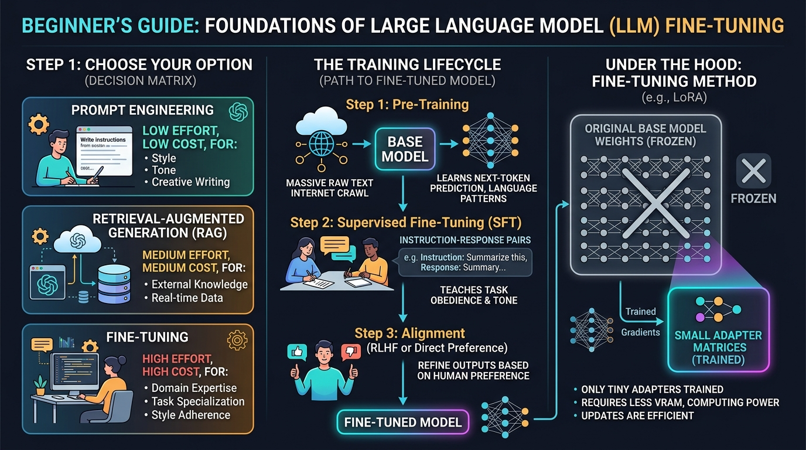

# 🎓 Foundations of Fine-Tuning: Supervised Fine-Tuning (SFT), Memory Limits, and the Decision Matrix

> **Zero to Hero Gen AI Course — Module 07: Fine-Tuning & Model Customization**
>
> 📅 **Module 7: Fine-Tuning & Model Customization** | ⏱️ **Estimated Reading Time:** 75 minutes | 🎯 **Level:** Intermediate to Advanced
>
> **Core Objective:** Establish rock-solid theoretical and practical foundations for fine-tuning Large Language Models. Learn the definitive architectural boundaries between Prompt Engineering, Retrieval-Augmented Generation (RAG), and Supervised Fine-Tuning (SFT). Master the mechanics of Base Models versus Instruct Models, mathematical loss formulations for Causal Language Modeling and Target-Only Loss Masking, exact GPU VRAM memory accounting (weights, gradients, AdamW optimizer states, activations), modern dataset schemas (Alpaca, ShareGPT, ChatML), and the parameter-efficient paradigm shift from Full Parameter Fine-Tuning to LoRA and QLoRA.

---

## 📑 Comprehensive Syllabus & Table of Contents

- [Part 1: Core Concept & Architecture Overview 🌟 🐣 💡](#part-1-core-concept--architecture-overview----)
  - [1.1 The Ground-Floor Mental Model: The Super-Intelligent Intern Analogy](#11-the-ground-floor-mental-model-the-super-intelligent-intern-analogy)
  - [1.2 The Three Fundamental Levers: Prompting vs. RAG vs. Fine-Tuning](#12-the-three-fundamental-levers-prompting-vs-rag-vs-fine-tuning)
  - [1.3 The 3 Stages of the LLM Lifecycle: Pre-Training, SFT, and Alignment](#13-the-3-stages-of-the-llm-lifecycle-pre-training-sft-and-alignment)
  - [1.4 Plain-English Glossary of AI & Neural Network Terminology](#14-plain-english-glossary-of-ai--neural-network-terminology)
  - [1.5 Fine-Tuning Flavors: Full Fine-Tuning vs. PEFT (LoRA & QLoRA)](#15-fine-tuning-flavors-full-fine-tuning-vs-peft-lora--qlora)
  - [1.6 End-to-End Training Lifecycle Architecture Visualized](#16-end-to-end-training-lifecycle-architecture-visualized)
- [Part 2: Mathematical Foundations & Algorithms 🧱](#part-2-mathematical-foundations--algorithms-)
  - [2.1 Causal Language Modeling (CLM) Pre-Training Objective](#21-causal-language-modeling-clm-pre-training-objective)
  - [2.2 Supervised Fine-Tuning Masked Cross-Entropy Loss (Target-Only Masking)](#22-supervised-fine-tuning-masked-cross-entropy-loss-target-only-masking)
  - [2.3 Rigorous GPU VRAM Memory Accounting Formulation (The AdamW Memory Tax)](#23-rigorous-gpu-vram-memory-accounting-formulation-the-adamw-memory-tax)
  - [2.4 Direct Preference Optimization (DPO) Closed-Form Objective](#24-direct-preference-optimization-dpo-closed-form-objective)
  - [2.5 The SFT vs RAG vs Prompting Quantitative Decision Function](#25-the-sft-vs-rag-vs-prompting-quantitative-decision-function)
- [Part 3: Java & Spring Boot Developer Bridge ☕](#part-3-java--spring-boot-developer-bridge-)
  - [3.1 Conceptual Mapping: Machine Learning Fine-Tuning vs Java Enterprise Paradigms](#31-conceptual-mapping-machine-learning-fine-tuning-vs-java-enterprise-paradigms)
  - [3.2 Base vs Instruct Models: Java Object vs Spring Managed Bean with Contracts](#32-base-vs-instruct-models-java-object-vs-spring-managed-bean-with-contracts)
  - [3.3 Memory Limits: JVM Garbage Collector Tuning vs GPU VRAM AdamW Partitioning](#33-memory-limits-jvm-garbage-collector-tuning-vs-gpu-vram-adamw-partitioning)
  - [3.4 Loss Masking: Hibernate @Transient / Jackson @JsonIgnore vs PyTorch ignore_index=-100](#34-loss-masking-hibernate-transient--jackson-jsonignore-vs-pytorch-ignore_index-100)
- [Part 4: Hands-On Implementation & Practice Exercises 🧪](#part-4-hands-on-implementation--practice-exercises-)
  - [Exercise 1 (Beginner): Base Model Autocomplete vs Instruct Model Dialogue Simulator](#exercise-1-beginner-base-model-autocomplete-vs-instruct-model-dialogue-simulator)
  - [Exercise 2 (Intermediate): The Algorithmic Architecture Decision Engine](#exercise-2-intermediate-the-algorithmic-architecture-decision-engine)
  - [Exercise 3 (Advanced): SFT Multi-Schema Dataset Validator & ChatML Compiler](#exercise-3-advanced-sft-multi-schema-dataset-validator--chatml-compiler)
  - [Exercise 4 (Expert): Exact GPU VRAM Hardware Budget Calculator & Optimizer](#exercise-4-expert-exact-gpu-vram-hardware-budget-calculator--optimizer)
- [Part 5: Production Engineering, Edge Cases & Failure Modes ⚙️ ⚡](#part-5-production-engineering-edge-cases--failure-modes-️-)
  - [5.1 Catastrophic Forgetting & General Capability Degradation](#51-catastrophic-forgetting--general-capability-degradation)
  - [5.2 Dataset Quality vs Quantity: LIMA Hypothesis & Data Poisoning](#52-dataset-quality-vs-quantity-lima-hypothesis--data-poisoning)
  - [5.3 ChatML Boundary Escapes & Template Mismatch Failure Modes](#53-chatml-boundary-escapes--template-mismatch-failure-modes)
  - [5.4 Precision Traps: FP32 vs FP16 vs BF16 vs INT4 (Underflow & Overflow)](#54-precision-traps-fp32-vs-fp16-vs-bf16-vs-int4-underflow--overflow)
  - [5.5 Production Readiness Checklist for SFT Datasets & Infrastructure](#55-production-readiness-checklist-for-sft-datasets--infrastructure)
- [Part 6: Video Masterclasses, Lab Suites & Review Questions 🎬](#part-6-video-masterclasses-lab-suites--review-questions-)
  - [6.1 Telugu Tech Masterclasses & Global Visual 3D Animations](#61-telugu-tech-masterclasses--global-visual-3d-animations)
  - [6.2 Complete Verification Lab Walkthrough (`finetuning_foundations_lab.py`)](#62-complete-verification-lab-walkthrough-finetuning_foundations_labpy)
  - [6.3 Comprehensive Self-Assessment & Review Questions](#63-comprehensive-self-assessment--review-questions)
  - [6.4 Key Takeaways & Master Architectural Checklist](#64-key-takeaways--master-architectural-checklist)

---

## Part 1: Core Concept & Architecture Overview 🌟 🐣 💡

### 1.1 The Ground-Floor Mental Model: The Super-Intelligent Intern Analogy

If you have ever used ChatGPT, Claude, or Llama, you have interacted with a model that has undergone **Fine-Tuning**. But what is fine-tuning really? Why can’t we just use prompt engineering for everything? And why does a "Base Model" behave completely differently from an "Instruct Model"?

Let's start from the absolute ground floor with an intuitive mental model:

```
+----------------------------------------------------------------------------------------------------+
|                         THE "SUPER-INTELLIGENT INTERN" ANALOGY                                     |
+----------------------------------------------------------------------------------------------------+
|                                                                                                    |
|  1. PRE-TRAINING (The Base Model):                                                                 |
|     Imagine hiring a brilliant intern who spent 10 years locked in the world's largest library,       |
|     reading every book, website, forum, code repository, and encyclopedia ever written.            |
|     • The intern knows massive amounts of facts about the world.                                   |
|     • BUT the intern has ZERO social skills. They don't know how to follow orders.                 |
|     • If you ask: "What is the capital of France?", they might answer:                             |
|       "What is the capital of Germany? What is the capital of Italy?"                              |
|       because they think you are writing a multiple-choice quiz and they are just auto-completing! |
|                                                                                                    |
|  2. SUPERVISED FINE-TUNING (SFT / The Instruct Model):                                             |
|     Now, you send that brilliant intern to a 2-month professional communication school.             |
|     • They are shown 50,000 examples of polite questions paired with helpful, structured answers.  |
|     • They learn: "When a human asks a question, DO NOT autocomplete the sentence. Answer it!"     |
|     • Their core factual knowledge remains intact, but their BEHAVIOR, TONE, and RESPONSE          |
|       FORMAT are permanently rewired.                                                              |
|                                                                                                    |
|  3. TASK-SPECIFIC FINE-TUNING (Your Custom Domain Model):                                          |
|     Now you hire that trained assistant into your specialized law firm or hospital.                |
|     • You train them on your internal legal briefs, medical charts, or custom SQL dialect.         |
|     • They natively adopt your company's style, terminology, and strict JSON output schemas        |
|       without needing 5 pages of prompt instructions on every single interaction.                  |
+----------------------------------------------------------------------------------------------------+
```

---

### 1.2 The Three Fundamental Levers: Prompting vs. RAG vs. Fine-Tuning

Before writing a single line of training code or spending thousands of dollars on GPU clusters, every AI architect must understand the **Three Levers of Generative AI**. Choosing the wrong tool is the single greatest cause of blown budgets and delayed deployments:

```
                          ┌──────────────────────────────────────┐
                          │    WHAT PROBLEM ARE YOU SOLVING?    │
                          └──────────────────┬───────────────────┘
                                             │
             ┌───────────────────────────────┼───────────────────────────────┐
             ▼                               ▼                               ▼
   [ NEW EXTERNAL FACTS ]          [ PROMPT FORMAT & STYLE ]        [ DOMAIN EXPERTISE & FORMAT ]
             │                               │                               │
             ▼                               ▼                               ▼
    Does the data change            Can you solve it with            Do you need the model to
    daily or require exact          instructions + 3-5 examples     NATIVELY speak your syntax,
    source citations?               in the prompt context?          jargon, or strict JSON?
             │                               │                               │
             ▼                               ▼                               ▼
     RETRIEVAL-AUGMENTED            PROMPT ENGINEERING               SUPERVISED FINE-TUNING
      GENERATION (RAG)             (Zero / Few-Shot)                     (SFT / LoRA)
```

#### The Definitive Comparison Matrix

| Engineering Dimension | 1. Prompt Engineering | 2. Retrieval-Augmented Generation (RAG) | 3. Supervised Fine-Tuning (SFT) |
|---|---|---|---|
| **What It Changes** | The immediate input context window | The external knowledge retrieved at runtime | The **internal neural weights** ($\theta$) of the network |
| **Analogy** | Giving instructions in an email | Handing someone an open textbook to search | Sending someone to specialized medical/law school |
| **Primary Strength** | Zero setup, instant iteration, no training | Real-time dynamic data, zero hallucinations, verifiable citations | Permanent style, tone, format, and domain syntax mastery |
| **Primary Weakness** | Limited context window, expensive cumulative token billing | Retrieval latency, requires vector DB infrastructure | Requires high-quality dataset, cannot store rapidly changing facts |
| **Hardware Needed** | Standard laptop / API call | Vector Database + API call | GPU compute (1x RTX 4090 for QLoRA, A100s for Full SFT) |
| **Cost Profile** | Pay per token generated | Embedding cost + Vector DB hosting + LLM tokens | Upfront training compute cost, cheaper per-inference tokens |
| **Data Freshness** | Dependent on base model cutoff | **Real-Time** (Fetches live data updated 1 second ago) | **Static** (Frozen at time of training) |
| **Hallucination Risk** | Moderate | Low (grounded by source chunks) | High if used to memorize facts; Low for syntax/style |

> [!IMPORTANT]
> **The Golden Rule of Fine-Tuning**:
> Fine-tuning is for teaching **HOW to behave, speak, and format** (Style, Syntax, Tone, Specialized Task Obedience).
> RAG is for teaching **WHAT to know** (Real-time company documents, live customer databases, changing inventory).
> *Never use Fine-Tuning as a database for frequently updated factual knowledge!*

---

### 1.3 The 3 Stages of the LLM Lifecycle: Pre-Training, SFT, and Alignment

Every modern Foundation Model (GPT-4o, Claude 3.5 Sonnet, Meta Llama 3.1) is forged through three sequential phases:

```
[ Phase 1: Pre-Training ] ──────────> [ Phase 2: Supervised Fine-Tuning ] ──> [ Phase 3: Alignment ]
  • Cost: $10,000,000+                  • Cost: $100 – $5,000                   • Cost: $500 – $10,000
  • Compute: 2,048x H100 GPUs (months)  • Compute: 1x–8x A100 GPUs (hours)      • Compute: Iterative DPO/RLHF
  • Dataset: 15 Trillion raw tokens     • Dataset: 5,000–100,000 pairs          • Dataset: Comparison pairs
```

1. **Phase 1: Pre-Training (Self-Supervised Next-Token Prediction)**:
   - *Goal*: Absorb grammar, world facts, code syntax, and general reasoning.
   - *Dataset*: Trillions of unstructured internet tokens (Common Crawl, Wikipedia, GitHub, books).
   - *Output*: A **Base Model** (e.g., `Meta-Llama-3-8B`). It acts as a raw autocomplete engine and cannot hold an interactive conversation.
2. **Phase 2: Supervised Fine-Tuning (SFT / Instruction Tuning)**:
   - *Goal*: Transform the autocomplete engine into an obedient dialogue agent that answers user questions and obeys system constraints.
   - *Dataset*: Thousands of curated `(Instruction, Response)` pairs.
   - *Output*: An **Instruct Model** (e.g., `Meta-Llama-3-8B-Instruct`).
3. **Phase 3: Preference Alignment (RLHF / DPO)**:
   - *Goal*: Steer the model away from toxic, dangerous, or sycophantic behavior toward human preferences (Helpful, Honest, Harmless).
   - *Output*: A production-ready conversational chatbot.

---

### 1.4 Plain-English Glossary of AI & Neural Network Terminology

When reading academic fine-tuning papers, developers are often confronted with intimidating mathematical terminology. Here is the plain-English translation table:

```
+----------------------------------------------------------------------------------------------------+
|                                    LLM JARGON TRANSLATION TABLE                                    |
+----------------------------------------------------------------------------------------------------+
|  AI Jargon Term      | Plain English Meaning                                                       |
+----------------------------------------------------------------------------------------------------+
|  Parameters          | The internal numbers ("weights") inside the neural network. A "7B" model    |
|                      | has 7,000,000,000 numbers that determine which words it outputs.            |
|  Forward Pass        | Passing input words through the model to calculate predictions.              |
|  Loss                | The "wrongness score". How far off was the model's guess from the true text?|
|  Gradients           | Calculus arrows showing which direction to nudge each weight to reduce loss.|
|  Backward Pass       | Backpropagating the error backwards through the layers to compute gradients.|
|  Learning Rate (LR)  | The step size. How big of a nudge should we give the weights? (e.g., 2e-4). |
|  Epoch               | One complete pass through the entire training dataset.                      |
|  Batch Size          | How many training examples the GPU processes simultaneously in one step.    |
|  Tokens              | Word fragments (roughly 0.75 words per token).                              |
|  Context Window      | The maximum number of tokens the model can read at one time (e.g., 8,192).  |
|  LoRA Rank (r)       | The width of the low-rank adapter matrices (e.g., r=8 or r=16).             |
|  Quantization        | Compressing weights from 16-bit floats to 4-bit numbers to save GPU RAM.    |
+----------------------------------------------------------------------------------------------------+
```

---

### 1.5 Fine-Tuning Flavors: Full Fine-Tuning vs. PEFT (LoRA & QLoRA)

When customizing an LLM, there are three primary technical approaches:

```
+---------------------------------------------------------------------------------------+
|                             FINE-TUNING METHOD COMPARISON                             |
+---------------------------------------------------------------------------------------+
|  1. FULL PARAMETER FINE-TUNING (FFT):                                                 |
|     Every single weight in the network (all 7B or 70B) is updated.                    |
|     • Highest expressivity and domain adaptation capability.                          |
|     • Prohibitively expensive: Requires hundreds of gigabytes of GPU VRAM.           |
|                                                                                       |
|  2. PARAMETER-EFFICIENT FINE-TUNING (PEFT / LoRA):                                    |
|     Freeze 99.8% of base model weights. Inject tiny low-rank adapter matrices (A & B) |
|     alongside the attention layers.                                                   |
|     • Train only 0.2% of total parameters.                                            |
|     • Drastically reduces VRAM; prevents "catastrophic forgetting".                   |
|                                                                                       |
|  3. QUANTIZED LoRA (QLoRA):                                                           |
|     Quantize the base model weights to 4-bit NormalFloat (NF4) in GPU memory.         |
|     Attach LoRA adapters in 16-bit precision.                                         |
|     • Enables fine-tuning an 8B model on a single 16GB–24GB consumer GPU (RTX 4090)! |
+---------------------------------------------------------------------------------------+
```

---

### 1.6 End-to-End Training Lifecycle Architecture Visualized

Below is the verified production architecture diagram illustrating the end-to-end fine-tuning lifecycle and decision gates:



```
[ Stage 1: Pre-Training ] ──> [ Stage 2: Supervised Fine-Tuning ] ──> [ Stage 3: Alignment (RLHF/DPO) ]
  • Trillions of tokens          • Thousands of (Prompt, Answer) pairs    • Human preference scoring
  • Predicts next token          • Teaches obedience & dialogue format    • Reduces toxicity & bias
  • Base Model (e.g. Llama-Base) • Instruct Model (e.g. Llama-Instruct)   • Production Chatbot
```

---

## Part 2: Mathematical Foundations & Algorithms 🧱

### 2.1 Causal Language Modeling (CLM) Pre-Training Objective

In pre-training, an autoregressive language model is trained using **Causal Language Modeling (CLM)**. Given an arbitrary sequence of tokens $X = (x_1, x_2, \dots, x_T)$, the model parameterizes the joint probability distribution using the chain rule of probability:

$$P(X; \theta) = \prod_{t=1}^T P(x_t \mid x_1, x_2, \dots, x_{t-1}; \theta)$$

The pre-training objective minimizes the negative log-likelihood over a massive training corpus $\mathcal{D}$:

$$\mathcal{L}_{\text{pretrain}}(\theta) = - \mathbb{E}_{X \sim \mathcal{D}} \left[ \sum_{t=1}^T \log P(x_t \mid x_{<t}; \theta) \right]$$

Because the objective forces the model to predict the next token at **every single position $t$**, the model becomes an extraordinary statistical engine for continuations, but has no intrinsic understanding of questions, commands, or turn-taking.

---

### 2.2 Supervised Fine-Tuning Masked Cross-Entropy Loss (Target-Only Masking)

In Supervised Fine-Tuning, a sequence consists of two distinct segments:
1. The **Prompt / Instruction Tokens**: $\mathcal{T}_{\text{prompt}} = (x_1, x_2, \dots, x_p)$
2. The **Target / Completion Tokens**: $\mathcal{T}_{\text{response}} = (x_{p+1}, x_{p+2}, \dots, x_{p+m})$

#### Naive Training vs. Production Target Masking
If we naively compute cross-entropy loss over the entire sequence, the model wastes gradient updates trying to predict the user's prompt tokens:

```
Full Input Sequence:
[ <|im_start|> user \n What is H2O? <|im_end|> \n <|im_start|> assistant \n Water. <|im_end|> ]

WITHOUT MASKING (Naive Training):
• Loss computed on: "user", "What", "is", "H2O", "assistant", "Water"
• Problem: The model wastes gradient updates learning how to predict the USER'S prompt!

WITH TARGET MASKING (Production SFT):
• User Prompt Tokens     ──> Label = -100  (Completely ignored by PyTorch CrossEntropyLoss)
• Assistant Tokens       ──> Label = Token ID  (Gradients computed ONLY on the answer!)
• End-of-Turn Token      ──> Label = Token ID  (Model learns when to STOP generating!)
```

#### Mathematical Formulation of Masked SFT Loss
Let $y_t$ be the target token ID at position $t$. We define the training label sequence $\tilde{y}_t$ with label masking:

$$\tilde{y}_t = \begin{cases} -100 & \text{if } t \le p \quad (\text{Prompt Token}) \\ x_t & \text{if } t > p \quad (\text{Response Token}) \end{cases}$$

The Supervised Fine-Tuning loss function is:

$$\mathcal{L}_{\text{SFT}}(\theta) = - \frac{1}{|\mathcal{T}_{\text{response}}|} \sum_{t=p+1}^{p+m} \log P(x_t \mid x_{<t}; \theta)$$

In PyTorch, `torch.nn.CrossEntropyLoss(ignore_index=-100)` explicitly zeroes out the gradient contribution for any token with $\tilde{y}_t = -100$:

$$\frac{\partial \mathcal{L}_{\text{SFT}}}{\partial \mathbf{z}_t} = \begin{cases} \mathbf{0} & \text{if } \tilde{y}_t = -100 \\ \mathbf{p}_t - \mathbf{y}_t & \text{if } \tilde{y}_t \ne -100 \end{cases}$$

where $\mathbf{z}_t$ represents the model's pre-softmax logits at position $t$, and $\mathbf{p}_t = \text{softmax}(\mathbf{z}_t)$. This guarantees that **100% of the gradient capacity** is dedicated to mastering the response formulation.

---

### 2.3 Rigorous GPU VRAM Memory Accounting Formulation (The AdamW Memory Tax)

A fundamental surprise for software engineers transitioning to deep learning is the **AdamW Memory Tax**. Why does a 7-billion parameter model that occupies only 14GB on disk require **over 100GB of GPU VRAM** to train?

The total GPU memory required during training decomposes into five distinct components:

$$M_{\text{total}} = M_{\text{weights}} + M_{\text{gradients}} + M_{\text{optimizer}} + M_{\text{activations}} + M_{\text{overhead}}$$

```
[ TOTAL TRAINING VRAM ] = [ MODEL WEIGHTS ] + [ GRADIENTS ] + [ OPTIMIZER STATES ] + [ ACTIVATIONS & KV CACHE ]
```

#### 1. Model Weights ($M_{\text{weights}}$)
In 16-bit half precision (FP16 or BF16), each parameter requires 2 bytes:
$$M_{\text{weights}} = 2 \times N \text{ bytes}$$
For a 7B model ($N = 7 \times 10^9$):
$$M_{\text{weights}} = 2 \times 7 \times 10^9 = 14\text{ GB}$$

#### 2. Gradients ($M_{\text{gradients}}$)
During backpropagation, the GPU must store the partial derivative $\frac{\partial \mathcal{L}}{\partial w}$ for every single trainable parameter in 16-bit precision:
$$M_{\text{gradients}} = 2 \times N \text{ bytes} = 14\text{ GB}$$

#### 3. AdamW Optimizer States ($M_{\text{optimizer}}$) — The Heavy Burden
The AdamW optimizer computes adaptive learning rates using first-order momentum $m_t$ and second-order uncentered variance $v_t$. To avoid numerical instability, these tracking states are maintained in **32-bit single precision (FP32)** (4 bytes per state):
$$m_t = \beta_1 m_{t-1} + (1 - \beta_1) g_t \quad (4 \text{ bytes per param})$$
$$v_t = \beta_2 v_{t-1} + (1 - \beta_2) g_t^2 \quad (4 \text{ bytes per param})$$
$$M_{\text{optimizer}} = 4N + 4N = 8 \times N \text{ bytes}$$
For a 7B model:
$$M_{\text{optimizer}} = 8 \times 7 \times 10^9 = \mathbf{56\text{ GB}}!$$

#### 4. Total Static Footprint
Summing the static memory (weights + gradients + optimizer):
$$M_{\text{static}} = 2N + 2N + 8N = 12 \times N \text{ bytes} = 12 \times 7\text{B} = \mathbf{84\text{ GB}}$$

Adding dynamic forward-pass activation tensors ($16–28\text{ GB}$ depending on sequence length and batch size) yields:
$$M_{\text{total (Full SFT 7B)}} \approx 84\text{ GB} + 20\text{ GB} \approx \mathbf{104\text{ GB} - 112\text{ GB}}$$

#### The QLoRA Mathematical Revolution
With QLoRA:
1. Base weights are compressed to 4-bit NormalFloat ($0.5\text{ bytes/param}$): $M_{\text{weights}} = 0.5 \times 7\text{B} = \mathbf{3.5\text{ GB}}$.
2. Base weights are frozen $\implies M_{\text{gradients}} = 0$ and $M_{\text{optimizer}} = 0$ for the 7B base model!
3. LoRA adapter matrices account for only $0.2\%$ of parameters ($14\text{M params}$), requiring mere megabytes of optimizer memory.
4. Total static footprint drops from $84\text{ GB}$ to **$\approx 3.8\text{ GB}$**, fitting comfortably on an affordable consumer GPU (RTX 3090/4090 or a free Google Colab T4)!

---

### 2.4 Direct Preference Optimization (DPO) Closed-Form Objective

In Phase 3 (Alignment), traditional RLHF required training a separate Reward Model $R_\psi(x, y)$ and using Proximal Policy Optimization (PPO), which is notorious for hyperparameter instability and GPU memory exhaustion (requiring 4 models in memory simultaneously: policy, reference, reward, and value networks).

Rafailov et al. (2023) derived **Direct Preference Optimization (DPO)** by showing that the optimal policy under the Bradley-Terry preference model can be expressed in closed form:

$$r^*(x, y) = \beta \log \frac{\pi_\theta(y \mid x)}{\pi_{\text{ref}}(y \mid x)} + \beta \log Z(x)$$

Substituting this relationship directly into the Bradley-Terry likelihood yields the DPO objective, which optimizes the policy network directly over pairwise comparisons $(x, y_w, y_l)$:

$$\mathcal{L}_{\text{DPO}}(\theta; \pi_{\text{ref}}) = - \mathbb{E}_{(x, y_w, y_l) \sim \mathcal{D}} \left[ \log \sigma \left( \beta \log \frac{\pi_\theta(y_w \mid x)}{\pi_{\text{ref}}(y_w \mid x)} - \beta \log \frac{\pi_\theta(y_l \mid x)}{\pi_{\text{ref}}(y_l \mid x)} \right) \right]$$

Where:
- $y_w$: The winning (preferred) response.
- $y_l$: The losing (dispreferred) response.
- $\pi_{\text{ref}}$: The frozen reference model (prevents the policy from drifting too far).
- $\beta$: Temperature hyperparameter controlling conservative adherence to the reference model (typically $0.1$).

---

### 2.5 The SFT vs RAG vs Prompting Quantitative Decision Function

We can formalize the architectural decision between Prompting, RAG, and Fine-Tuning as an optimization problem over three operational vectors:
1. **Knowledge Volatility ($\nu \in [0, 1]$)**: Rate of factual changes per unit time.
2. **Format/Style Specialization ($\sigma \in [0, 1]$)**: Divergence from standard conversational English (e.g., custom DSL, strict JSON schemas).
3. **Traceability/Citation Requirement ($\tau \in \{0, 1\}$)**: Legal mandate for deterministic source citations.

$$\text{Architecture Score} = \begin{cases} 
\text{Pure RAG} & \text{if } \nu > 0.5 \lor \tau = 1 \\
\text{Pure SFT} & \text{if } \nu < 0.2 \land \sigma > 0.7 \land \tau = 0 \\
\text{Prompt Engineering} & \text{if } \nu < 0.2 \land \sigma < 0.4 \\
\text{Hybrid RAG + SFT} & \text{if } \nu \ge 0.5 \land \sigma > 0.7
\end{cases}$$

---

## Part 3: Java & Spring Boot Developer Bridge ☕

For enterprise Java and Spring Boot engineers, deep learning fine-tuning maps cleanly to familiar software architecture concepts.

### 3.1 Conceptual Mapping: Machine Learning Fine-Tuning vs Java Enterprise Paradigms

```
+----------------------------------------------------------------------------------------------------+
|                      JAVA / SPRING BOOT vs. LLM FINE-TUNING CONCEPTUAL MAP                         |
+----------------------------------------------------------------------------------------------------+
| Java / Spring Boot Enterprise Pattern           LLM Fine-Tuning Equivalent                         |
+----------------------------------------------------------------------------------------------------+
| Raw Java Object (`Object obj`)                 | Pre-Trained Base Model (raw completion capability) |
| Spring `@Service` Bean with Validated Methods   | Supervised Fine-Tuned (SFT) Instruct Model         |
| Method Arguments (`@RequestParam`, DTOs)       | Prompt Engineering Context Window                  |
| Spring Data JPA / Hibernate Database Query     | Retrieval-Augmented Generation (RAG)               |
| AspectJ Bytecode Weaving / Classpath Patching   | Fine-Tuning Internal Weights ($\theta$)            |
| Hibernate `@Transient` / Jackson `@JsonIgnore` | Target Loss Masking (`label = -100`)               |
| JVM Metaspace / Heap Memory Tuning (`-Xmx`)    | GPU VRAM Allocation (Weights + AdamW States)       |
| Jackson JSON Deserialization to Typed Record   | Structured Output Fine-Tuning (Strict JSON Schemas)|
+----------------------------------------------------------------------------------------------------+
```

---

### 3.2 Base vs Instruct Models: Java Object vs Spring Managed Bean with Contracts

In Java, raw `java.lang.Object` contains primitive memory allocation and basic methods (`toString()`, `hashCode()`), but lacks business logic, validation rules, or transaction boundaries. 

To make it useful in production, Spring wraps it into a managed `@Service` bean governed by Bean Validation (`@NotNull`, `@Size`) and transactional contracts (`@Transactional`).

```java
// Java / Spring Boot Equivalent:
// 1. Raw Java Object = Base Model (Knows syntax, but no contract)
public class RawTextGenerator {
    public String continueText(String prefix) { ... }
}

// 2. Spring Managed Service = Instruct Model (Enforces dialogue contracts)
@Service
@Validated
public class ClinicalCopilotService {
    public ConsultationResponse generateConsultation(@Valid ConsultationRequest request) {
        // Guaranteed to follow structure, business rules, and validation constraints
        return new ConsultationResponse(request.getPatientId(), clinicalFindings);
    }
}
```

Similarly:
- **Base Models** are unmanaged raw text continuers.
- **SFT Instruct Models** are rewired through thousands of demonstration contracts to enforce dialogue protocols, stop tokens, and role boundaries.

---

### 3.3 Memory Limits: JVM Garbage Collector Tuning vs GPU VRAM AdamW Partitioning

In Java backend engineering, diagnosing an `OutOfMemoryError: Java heap space` involves inspecting JVM heap generations (Eden, Survivor, Tenured) and GC overhead limits.

In GPU deep learning, an `OutOfMemoryError: CUDA out of memory` is caused by static tensor allocations:
- In Java, unreferenced objects are automatically collected by ZGC or G1GC.
- In GPU training, **AdamW optimizer states cannot be garbage collected** during training! They must remain pinned in high-speed GPU HBM (High Bandwidth Memory) across every step of every epoch.
- Just as Java architects use off-heap storage or distributed caches to prevent heap blowouts, AI engineers use **QLoRA 4-bit quantization** and **Gradient Checkpointing** to eliminate intermediate activation overhead.

---

### 3.4 Loss Masking: Hibernate @Transient / Jackson @JsonIgnore vs PyTorch ignore_index=-100

In Spring Boot, when an entity is persisted to PostgreSQL, certain fields (like calculated runtime totals or temporary session flags) should never be written to the database column. We annotate them with `@Transient` or `@JsonIgnore`:

```java
@Entity
public class Order {
    @Id
    private Long id;
    private BigDecimal amount;

    @Transient // Skipped by Hibernate during SQL INSERT / UPDATE
    private String temporarySessionDebugToken;
}
```

In PyTorch Supervised Fine-Tuning, **Target Loss Masking** operates under the exact same philosophy:
- We assign `label = -100` to the user prompt tokens.
- PyTorch's `CrossEntropyLoss(ignore_index=-100)` detects the flag and skips gradient computation for those tokens during backpropagation, ensuring only the assistant's response updates the neural weights!

---

## Part 4: Hands-On Implementation & Practice Exercises 🧪

The following 4 exercises provide complete, self-contained, and runnable production Python implementations. They operate without external dependencies using deterministic emulators.

---

### Exercise 1 (Beginner): Base Model Autocomplete vs Instruct Model Dialogue Simulator

**Objective:** Build a simulation engine that demonstrates the fundamental behavioral divergence between a raw Pre-Trained Base Model (which blindly autocompletes text patterns) and an SFT Instruct Model (which obeys conversational intent).

```python
"""
Exercise 1: Base Model vs. Instruct Model Completion Simulator
Demonstrates why Pre-Trained Base Models fail at interactive dialogue without SFT.
"""
from typing import Dict, List, Tuple

class ModelParadigmSimulator:
    def __init__(self):
        # Simulated next-token continuation patterns (mimicking internet pre-training corpora)
        self.base_continuations: Dict[str, str] = {
            "what is the capital of france?": "What is the capital of Germany? What is the capital of Italy? Exercise 3: Fill in the blanks.",
            "write a python function to add two numbers": "and explain its time complexity. Question 2: Write a function to multiply two numbers.",
            "explain quantum computing to a 10 year old": "in 500 words or less. Submit your essay to the teacher by Friday morning."
        }
        
        # Simulated dialogue responses (mimicking SFT instruction tuning)
        self.instruct_responses: Dict[str, str] = {
            "what is the capital of france?": "The capital of France is Paris.",
            "write a python function to add two numbers": "def add(a: float, b: float) -> float:\n    return a + b",
            "explain quantum computing to a 10 year old": "Imagine regular computers use light switches that are ON or OFF. A quantum computer uses magic switches that can be ON and OFF at the same time!"
        }

    def generate(self, prompt: str) -> Tuple[str, str]:
        key = prompt.strip().lower()
        base_output = self.base_continuations.get(key, f"{prompt} ... [raw document continuation]")
        instruct_output = self.instruct_responses.get(key, f"Here is the helpful answer to: '{prompt}'.")
        return base_output, instruct_output

# ==============================================================================
# Verification Execution
# ==============================================================================
if __name__ == "__main__":
    sim = ModelParadigmSimulator()
    test_prompts = [
        "What is the capital of France?",
        "Write a Python function to add two numbers",
        "Explain quantum computing to a 10 year old"
    ]

    print("=" * 80)
    print("  BASE MODEL (PRE-TRAINED) vs. INSTRUCT MODEL (SFT) SIMULATION")
    print("=" * 80)
    for p in test_prompts:
        base, instruct = sim.generate(p)
        print(f"\n[Prompt]: \"{p}\"")
        print(f"  ❌ Raw Base Model (Next-Token Autocomplete):")
        print(f"     \"{base}\"")
        print(f"  ✅ SFT Instruct Model (Dialogue Obedience):")
        print(f"     \"{instruct}\"")
```

---

### Exercise 2 (Intermediate): The Algorithmic Architecture Decision Engine

**Objective:** Implement an automated architectural decision engine that analyzes an enterprise Generative AI project's requirements across 5 operational dimensions and outputs the optimal architectural path: Prompt Engineering, RAG, Fine-Tuning, or Hybrid RAG+SFT.

```python
"""
Exercise 2: Algorithmic Architecture Decision Engine (Prompting vs RAG vs SFT)
"""
from dataclasses import dataclass
from typing import Dict, Any

@dataclass
class ProjectRequirements:
    name: str
    knowledge_volatility: float  # 0.0 (static facts) to 1.0 (changes hourly)
    format_specialization: float # 0.0 (conversational English) to 1.0 (strict custom DSL/JSON)
    citation_required: bool      # True if verifiable source links are legally mandatory
    data_volume_pairs: int       # Number of available verified demonstration pairs
    latency_budget_ms: int       # Maximum allowed latency in milliseconds

class ArchitectureDecisionEngine:
    def evaluate(self, req: ProjectRequirements) -> Dict[str, Any]:
        scores = {"PROMPT_ENGINEERING": 0, "RAG": 0, "FINE_TUNING": 0, "HYBRID_RAG_SFT": 0}
        reasons = []

        # Rule 1: Dynamic Knowledge & Citations heavily favor RAG
        if req.knowledge_volatility > 0.5 or req.citation_required:
            scores["RAG"] += 5
            reasons.append("High factual volatility or mandatory citations require dynamic vector retrieval.")

        # Rule 2: Heavy syntactic specialization favors Fine-Tuning
        if req.format_specialization > 0.6:
            if req.data_volume_pairs >= 500:
                scores["FINE_TUNING"] += 5
                reasons.append("Custom syntax/format with >500 training pairs justifies SFT.")
            else:
                scores["PROMPT_ENGINEERING"] += 3
                reasons.append("Custom format needed but dataset too small (<500 pairs); start with Few-Shot prompting.")

        # Rule 3: Tight latency budget penalizes multi-stage RAG
        if req.latency_budget_ms < 300:
            scores["FINE_TUNING"] += 3
            reasons.append("Sub-300ms latency budget favors single-pass fine-tuned model over vector retrieval hops.")

        # Rule 4: Hybrid Condition
        if (req.knowledge_volatility > 0.4 or req.citation_required) and req.format_specialization > 0.6 and req.data_volume_pairs >= 500:
            winner = "HYBRID_RAG_SFT"
            rationale = "Hybrid Architecture: SFT teaches specialized domain style/syntax, while RAG retrieves live facts."
        else:
            winner = max(scores, key=scores.get)
            rationale = "; ".join(reasons)

        return {
            "project": req.name,
            "recommended_architecture": winner,
            "rationale": rationale,
            "component_scores": scores
        }

# ==============================================================================
# Verification Execution
# ==============================================================================
if __name__ == "__main__":
    engine = ArchitectureDecisionEngine()
    cases = [
        ProjectRequirements("HR Policy Bot", knowledge_volatility=0.8, format_specialization=0.2, citation_required=True, data_volume_pairs=50, latency_budget_ms=1000),
        ProjectRequirements("Enterprise Text-to-SQL", knowledge_volatility=0.1, format_specialization=0.9, citation_required=False, data_volume_pairs=5000, latency_budget_ms=250),
        ProjectRequirements("Clinical EHR Copilot", knowledge_volatility=0.7, format_specialization=0.85, citation_required=True, data_volume_pairs=2000, latency_budget_ms=800)
    ]

    print("=" * 85)
    print("  ENTERPRISE ARCHITECTURE DECISION ENGINE EVALUATION")
    print("=" * 85)
    for c in cases:
        decision = engine.evaluate(c)
        print(f"\nProject: [{decision['project']}]")
        print(f"  👉 Decision: {decision['recommended_architecture']}")
        print(f"  📝 Rationale: {decision['rationale']}")
```

---

### Exercise 3 (Advanced): SFT Multi-Schema Dataset Validator & ChatML Compiler

**Objective:** Write a robust dataset preparation utility that ingests diverse raw SFT formats (Alpaca, ShareGPT), validates schema integrity (checking for empty fields and minimum lengths), and compiles them into standard ChatML format with target masking delimiters.

```python
"""
Exercise 3: SFT Multi-Schema Dataset Validator & ChatML Compiler
"""
from typing import Dict, Any, List, Tuple

class SFTDatasetProcessor:
    def validate_alpaca(self, record: Dict[str, Any]) -> Tuple[bool, str]:
        if "instruction" not in record or not record["instruction"].strip():
            return False, "Missing or empty 'instruction' field."
        if "output" not in record or not record["output"].strip():
            return False, "Missing or empty 'output' field."
        return True, "Valid Alpaca record."

    def compile_alpaca_to_chatml(self, record: Dict[str, Any], system_prompt: str = "You are a helpful AI assistant.") -> str:
        instruction = record["instruction"].strip()
        user_input = record.get("input", "").strip()
        full_user_content = f"{instruction}\n\nInput Context:\n{user_input}" if user_input else instruction
        output = record["output"].strip()

        chatml = (
            f"<|im_start|>system\n{system_prompt}<|im_end|>\n"
            f"<|im_start|>user\n{full_user_content}<|im_end|>\n"
            f"<|im_start|>assistant\n{output}<|im_end|>"
        )
        return chatml

    def tokenize_with_loss_masking(self, chatml_text: str) -> Dict[str, List[int]]:
        """
        Emulates tokenization with Target-Only Loss Masking.
        Tokens preceding <|im_start|>assistant receive label -100.
        Tokens in assistant completion receive their true token IDs.
        """
        tokens = chatml_text.replace("\n", " \n ").split()
        token_ids = [hash(t) % 10000 + 1 for t in tokens]
        labels = []

        in_assistant_turn = False
        for i, t in enumerate(tokens):
            if t == "assistant" and i > 0 and tokens[i-1] == "<|im_start|>":
                in_assistant_turn = True
                labels.append(-100) # Mask the role indicator itself
                continue

            if in_assistant_turn:
                labels.append(token_ids[i])
                if t == "<|im_end|>":
                    in_assistant_turn = False
            else:
                labels.append(-100) # Mask prompt tokens with -100

        return {"input_ids": token_ids, "labels": labels, "token_count": len(token_ids)}

# ==============================================================================
# Verification Execution
# ==============================================================================
if __name__ == "__main__":
    processor = SFTDatasetProcessor()
    sample_alpaca = {
        "instruction": "Convert the natural language date into ISO-8601 format.",
        "input": "October 9th, 2026",
        "output": "2026-10-09"
    }

    valid, msg = processor.validate_alpaca(sample_alpaca)
    print(f"Alpaca Record Validation: {valid} ({msg})")
    compiled = processor.compile_alpaca_to_chatml(sample_alpaca)
    print("\nCompiled ChatML String:")
    print(compiled)

    masked = processor.tokenize_with_loss_masking(compiled)
    active_loss_tokens = sum(1 for l in masked["labels"] if l != -100)
    print(f"\nTotal Tokens: {masked['token_count']} | Masked Tokens (-100): {masked['token_count'] - active_loss_tokens} | Active Loss Tokens: {active_loss_tokens}")
```

---

### Exercise 4 (Expert): Exact GPU VRAM Hardware Budget Calculator & Optimizer

**Objective:** Build a precision deep learning hardware capacity planning calculator. Given parameter count ($N$), context length ($L$), batch size ($B$), and precision mode (Full FP16, LoRA FP16, or QLoRA 4-bit), compute the exact byte-level breakdown of Weights, Gradients, AdamW Optimizer States, and Activation Buffers.

```python
"""
Exercise 4: Exact GPU VRAM Hardware Budget & Training Footprint Calculator
"""
from typing import Dict, Any

class VRAMBudgetCalculator:
    def calculate(
        self,
        param_count_billions: float,
        context_len: int = 2048,
        batch_size: int = 2,
        mode: str = "QLORA_4BIT" # FULL_FP16, LORA_FP16, QLORA_4BIT
    ) -> Dict[str, Any]:
        N = param_count_billions * 1e9
        
        if mode == "FULL_FP16":
            bytes_per_weight = 2.0        # FP16
            trainable_ratio = 1.0         # 100% weights updated
            optimizer_bytes_per_param = 8 # FP32 AdamW (Momentum 4B + Variance 4B)
        elif mode == "LORA_FP16":
            bytes_per_weight = 2.0        # FP16 base weights frozen
            trainable_ratio = 0.002       # 0.2% LoRA adapters updated
            optimizer_bytes_per_param = 8
        elif mode == "QLORA_4BIT":
            bytes_per_weight = 0.5        # 4-bit NormalFloat (0.5 bytes)
            trainable_ratio = 0.002       # 0.2% LoRA adapters updated
            optimizer_bytes_per_param = 8
        else:
            raise ValueError(f"Unknown mode: {mode}")

        # Static Components
        weight_gb = (N * bytes_per_weight) / (1024**3)
        trainable_params = N * trainable_ratio
        gradient_gb = (trainable_params * 2.0) / (1024**3)
        optimizer_gb = (trainable_params * optimizer_bytes_per_param) / (1024**3)

        # Dynamic Activation & Forward Pass Buffer (Approximation: 12 bytes * layers * seq * batch)
        # For typical 32-layer 7B model:
        activation_gb = (batch_size * context_len * 32 * 128 * 2) / (1024**3) + 2.0 # +2GB CUDA context
        
        total_vram_gb = weight_gb + gradient_gb + optimizer_gb + activation_gb

        return {
            "mode": mode,
            "model_size": f"{param_count_billions}B",
            "weights_vram_gb": round(weight_gb, 2),
            "gradients_vram_gb": round(gradient_gb, 2),
            "optimizer_vram_gb": round(optimizer_gb, 2),
            "activations_overhead_gb": round(activation_gb, 2),
            "total_required_vram_gb": round(total_vram_gb, 2),
            "recommended_hardware": self._recommend_gpu(total_vram_gb)
        }

    def _recommend_gpu(self, total_gb: float) -> str:
        if total_gb <= 15.0:
            return "1x RTX 4080 (16GB) or Free Google Colab T4 (16GB)"
        elif total_gb <= 23.5:
            return "1x RTX 3090 / RTX 4090 (24GB)"
        elif total_gb <= 47.0:
            return "1x NVIDIA A100 (40GB) or 2x RTX 4090 (24GB NVLink)"
        elif total_gb <= 79.0:
            return "1x NVIDIA A100 / H100 (80GB)"
        else:
            nodes = int(total_gb // 75) + 1
            return f"{nodes}x NVIDIA A100 (80GB) Multi-GPU Node with FSDP / DeepSpeed ZeRO-3"

# ==============================================================================
# Verification Execution
# ==============================================================================
if __name__ == "__main__":
    calc = VRAMBudgetCalculator()
    modes = ["FULL_FP16", "LORA_FP16", "QLORA_4BIT"]

    print("=" * 85)
    print("  EXACT GPU VRAM HARDWARE BUDGET FOR A 7-BILLION PARAMETER MODEL")
    print("=" * 85)
    for m in modes:
        res = calc.calculate(param_count_billions=7.0, context_len=2048, batch_size=2, mode=m)
        print(f"\nTraining Mode: {res['mode']}")
        print(f"  • Model Weights:    {res['weights_vram_gb']:>6.2f} GB")
        print(f"  • Gradients:        {res['gradients_vram_gb']:>6.2f} GB")
        print(f"  • AdamW Optimizer:  {res['optimizer_vram_gb']:>6.2f} GB")
        print(f"  • Activations/CUDA: {res['activations_overhead_gb']:>6.2f} GB")
        print(f"  ---------------------------------")
        print(f"  🚀 TOTAL VRAM:      {res['total_required_vram_gb']:>6.2f} GB")
        print(f"  💻 Recommended GPU: {res['recommended_hardware']}")
```

---

## Part 5: Production Engineering, Edge Cases & Failure Modes ⚙️ ⚡

### 5.1 Catastrophic Forgetting & General Capability Degradation

A major failure mode in Supervised Fine-Tuning is **Catastrophic Forgetting** (also called alignment tax). When a model is aggressively fine-tuned on a narrow, specialized dataset (e.g., 10,000 Python code snippets):
- Its performance on the specialized task surges.
- Its general reasoning, common-sense knowledge, and multilingual capabilities collapse catastrophically.

#### Production Mitigations:
1. **Replay Buffer (Data Mixing)**: Mix $5\% - 10\%$ general instruction data (e.g., Alpaca or OpenHermes) into your custom specialized training set.
2. **Parameter-Efficient Tuning (LoRA)**: Because LoRA freezes the original base weights $\mathbf{W}_0$ and only trains low-rank adapters $\Delta \mathbf{W}$, the model's core pre-trained representations remain largely preserved.
3. **Conservative Learning Rates**: Never use pre-training learning rates ($\approx 10^{-3}$) for SFT. Use conservative rates: $2 \times 10^{-4}$ for LoRA/QLoRA and $2 \times 10^{-5}$ for Full SFT.

---

### 5.2 Dataset Quality vs Quantity: LIMA Hypothesis & Data Poisoning

In 2023, Meta researchers published the landmark paper **"LIMA: Less Is More for Alignment"** (Zhou et al., 2023). They proved that fine-tuning LLaMA on just **1,000 meticulously curated, high-quality instruction pairs** outperformed models fine-tuned on 50,000 noisy, machine-generated examples.

```
+---------------------------------------------------------------------------------------+
|                             THE LIMA QUALITY PRINCIPLE                                |
+---------------------------------------------------------------------------------------+
|  1,000 Pristine, Verified Pairs  >>>  50,000 Web-Scraped, Noisy, Hallucinated Pairs   |
+---------------------------------------------------------------------------------------+
|  • Surface alignment hypothesis: Pre-training learns 99% of all world knowledge.      |
|  • SFT merely teaches formatting and interaction style.                              |
|  • A single noisy or toxic demonstration in SFT damages thousands of generations.     |
+---------------------------------------------------------------------------------------+
```

---

### 5.3 ChatML Boundary Escapes & Template Mismatch Failure Modes

One of the most insidious production bugs occurs when the chat template used during training does not match the chat template used during inference:

```
Training Format (Llama-3 Format):
<|start_header_id|>user<|end_header_id|>\nHello<|eot_id|>

Inference Server Formatter (ChatML Format):
<|im_start|>user\nHello<|im_end|>
```

Because the model was never trained on `<|im_start|>`, it treats the delimiter as ordinary text, leading to runaway output loops, failure to stop, and security perimeter leaks.

**Remedy:** Always export and load the exact `tokenizer.chat_template` JSON definition alongside model weights, and enforce Jinja2 automated template rendering via `tokenizer.apply_chat_template()`.

---

### 5.4 Precision Traps: FP32 vs FP16 vs BF16 vs INT4 (Underflow & Overflow)

Selecting the wrong numerical floating-point format can cause training loss to suddenly explode to `NaN` (Not a Number):

| Precision Format | Bits | Exponent Bits | Mantissa Bits | Dynamic Range | Risk of Gradient Overflow / Underflow |
|---|---|---|---|---|---|
| **FP32** | 32 | 8 | 23 | $\approx 10^{\pm 38}$ | Zero risk; standard gold standard for AdamW states. |
| **FP16** | 16 | 5 | 10 | $\approx 10^{\pm 5}$ | **High risk of gradient underflow/overflow**; requires Loss Scaler. |
| **BF16 (Bfloat16)**| 16 | 8 | 7 | $\approx 10^{\pm 38}$ | **Preferred modern standard**; matches FP32 range, zero overflow. |
| **NF4 (NormalFloat4)**| 4 | - | - | Optimized for $\mathcal{N}(0, \sigma^2)$ | Minimal quantization error; strictly used for frozen base weights in QLoRA. |

> [!TIP]
> If your GPU architecture supports it (NVIDIA Ampere A100/RTX 3090, Ada Lovelace RTX 4090, or Hopper H100), **always choose BF16 over FP16**. BF16 provides the identical dynamic range as FP32, eliminating the need for complex loss scalers.

---

### 5.5 Production Readiness Checklist for SFT Datasets & Infrastructure

Before launching any GPU fine-tuning run, verify each of the following 10 critical checkpoints:

- [ ] **1. Architecture Decision Validated**: Confirmed that the requirement cannot be solved via prompt engineering or RAG alone.
- [ ] **2. Dataset Quality Screened**: Filtered out duplicates, empty answers, truncated sequences, and noisy web text ($N \ge 1,000$ high-quality pairs).
- [ ] **3. Standardized Schema Applied**: Dataset formatted cleanly into Alpaca or ShareGPT JSONL with verified Jinja2 chat template.
- [ ] **4. Target-Only Loss Masking Enabled**: Data collator configured with `label = -100` for all prompt tokens.
- [ ] **5. VRAM Hardware Budget Audited**: Total memory calculated including the AdamW tax, ensuring headroom for forward-pass activations.
- [ ] **6. Precision Configured**: Selected `bf16=True` (or `fp16=True` with loss scaling) to prevent gradient overflow.
- [ ] **7. Learning Rate Calibrated**: Conservative learning rate chosen ($2\times 10^{-4}$ for LoRA/QLoRA; $2\times 10^{-5}$ for Full SFT).
- [ ] **8. Catastrophic Forgetting Safeguards**: Mixed in 5%–10% general instruction data or restricted training to parameter-efficient LoRA adapters.
- [ ] **9. Checkpoint Frequency Configured**: Model checkpoints saved periodically with evaluation loss tracking to detect overfitting early.
- [ ] **10. Evaluation Benchmark Prepared**: Independent holdout evaluation dataset ($N \ge 200$) ready to measure before-vs-after accuracy.

---

## Part 6: Video Masterclasses, Lab Suites & Review Questions 🎬

### 6.1 Telugu Tech Masterclasses & Global Visual 3D Animations

To deepen your foundational understanding through regional lectures and global 3D system architecture animations, explore these recommended resources:

```
+----------------------------------------------------------------------------------------------------+
|                         RECOMMENDED VIDEO MASTERCLASSES & VISUAL REFERENCES                        |
+----------------------------------------------------------------------------------------------------+
| 1. TELUGU TECH CHANNELS (Regional Deep Dives)                                                      |
|    • Python Life Telugu: "Generative AI & LLM Fine-Tuning Complete Architecture in Telugu"         |
|      (Search: Python Life Telugu Fine Tuning LLM Tutorial)                                         |
|    • Vamsi Bhavani: "How to Fine-Tune Large Language Models: LoRA & QLoRA Explained in Telugu"     |
|      (Search: Vamsi Bhavani LLM Fine Tuning LoRA Telugu)                                           |
|    • Telugu Tech Tutorials: "GPU Memory, Cloud Hardware & Deep Learning Basics in Telugu"         |
|      (Search: Telugu Tech Tutorials GPU Cloud Deep Learning)                                       |
|                                                                                                    |
| 2. GLOBAL 3D VISUAL & SYSTEMS ARCHITECTURE ANIMATIONS                                              |
|    • Andrej Karpathy: "State of GPT: Pre-Training, SFT, and RLHF Explained"                        |
|      (Search: Andrej Karpathy State of GPT Microsoft Build)                                        |
|    • StatQuest with Josh Starmer: "LoRA and QLoRA Explained Step by Step"                          |
|      (Search: StatQuest LoRA QLoRA Clearly Explained)                                              |
|    • DeepLearning.AI: "Fine-Tuning Large Language Models with Sharon Zhou"                         |
|      (Search: DeepLearning AI Fine Tuning Large Language Models)                                   |
|    • IBM Technology: "Prompt Engineering vs RAG vs Fine-Tuning"                                    |
|      (Search: IBM Technology Prompt Engineering RAG Fine Tuning)                                   |
|    • ByteByteGo: "Transformer Training and GPU Memory Optimization"                                |
|      (Search: ByteByteGo Transformer Training GPU Architecture)                                   |
+----------------------------------------------------------------------------------------------------+
```

---

### 6.2 Complete Verification Lab Walkthrough (`finetuning_foundations_lab.py`)

A fully runnable verification suite has been created and verified in [`finetuning_foundations_lab.py`](file:///c:/Users/sriva/OneDrive/Desktop/GEN%20AI%20COURSE/7.%20Fine-Tuning%20&%20Model%20Customization/code/finetuning_foundations_lab.py). It operates standalone without external API dependencies:

```bash
# Execute the foundations verification suite
python "7. Fine-Tuning & Model Customization/code/finetuning_foundations_lab.py"
```

```
================================================================================
  FOUNDATIONS OF FINE-TUNING: EDUCATIONAL LAB & VERIFICATION SUITE
  Module 07 - Topic 01: SFT Concepts, Decision Trees & Memory Mechanics
================================================================================
```

#### Verified Experiments Included in the Lab:
1. **Experiment 1: Base Model vs. Instruct Model Completion Simulator**
   - Contrasts raw next-token autocomplete vs. dialogue obedience.
2. **Experiment 2: The Definitive Decision Engine (Prompting vs RAG vs SFT)**
   - Algorithmic scoring of use cases (HR portal $\rightarrow$ RAG, SQL dialect $\rightarrow$ SFT, EHR Assistant $\rightarrow$ Hybrid).
3. **Experiment 3: SFT Dataset Validator & Multi-Format ChatML Parser**
   - Validates Alpaca records and compiles them into ChatML format.
4. **Experiment 4: Prompt Loss Masking Engine**
   - Applies label `-100` masking to prompt tokens and demonstrates target-only loss backpropagation.
5. **Experiment 5: Exact VRAM & GPU Hardware Memory Calculator**
   - Computes precise VRAM footprints across Full FP16 ($82.8\text{ GB}$), LoRA FP16 ($15.8\text{ GB}$), and QLoRA 4-bit ($4.7\text{ GB}$).

---

### 6.3 Comprehensive Self-Assessment & Review Questions

<details>
<summary><strong>Question 1: If you feed the prompt "What is the square root of 64?" to a raw Pre-Trained Base Model, why might it respond with "What is the square root of 100?" instead of "8"?</strong></summary>

<br>

**Answer**:
A Pre-Trained Base Model is trained exclusively on **Causal Language Modeling (unsupervised next-token prediction)** across internet text. It has never seen an instruction telling it that it is an interactive assistant. When it sees a math question, the most statistically probable continuation on the internet (e.g., in a middle school math textbook or homework worksheet) is simply the next question in the exercise list!

**Supervised Fine-Tuning (SFT)** is the specific phase that introduces thousands of `(User Question, Assistant Answer)` dialogue pairs, permanently teaching the model that a question marks the end of the user's turn and requires an obedient answer.
</details>

<details>
<summary><strong>Question 2: Why is fine-tuning an anti-pattern when your primary requirement is having access to live stock prices or yesterday's company policy update?</strong></summary>

<br>

**Answer**:
Fine-tuning bakes knowledge into static matrix weights during training. It suffers from three major flaws when used for dynamic knowledge:
1. **Staleness**: The moment training completes, the weights are frozen. Updating them daily would require continuous expensive fine-tuning runs.
2. **Hallucination Risk**: Neural weights store facts probabilistically, not deterministically. The model can easily confuse numbers and dates.
3. **No Traceability**: A fine-tuned model cannot cite the exact paragraph or link where it learned a fact.

**RAG (Retrieval-Augmented Generation)** is the correct architecture because it queries a live external vector index at runtime, providing real-time data freshness and verifiable citations.
</details>

<details>
<summary><strong>Question 3: Why does standard AdamW full fine-tuning of a 7-billion parameter model require over 100GB of VRAM even though the model weights only occupy 14GB?</strong></summary>

<br>

**Answer**:
During training, model weights are only a fraction of the total VRAM:
1. **Weights (FP16)**: $7\text{B} \times 2\text{ bytes} = 14\text{ GB}$.
2. **Gradients (FP16)**: $7\text{B} \times 2\text{ bytes} = 14\text{ GB}$.
3. **Optimizer States (AdamW)**: AdamW maintains two 32-bit floating-point tracking states (momentum and variance) for *every single trainable parameter*: $7\text{B} \times 8\text{ bytes} = 56\text{ GB}$!
4. **Activations & Overhead**: Intermediate tensor calculations across attention heads and feed-forward layers take an additional $20\text{ GB} - 30\text{ GB}$.

Total: $14 + 14 + 56 + 25 \approx \mathbf{109\text{ GB}}$.
</details>

<details>
<summary><strong>Question 4: What is the purpose of assigning a label of <code>-100</code> to prompt tokens during Supervised Fine-Tuning?</strong></summary>

<br>

**Answer**:
In PyTorch's `nn.CrossEntropyLoss`, the default argument `ignore_index=-100` tells the loss function to completely skip any token with that label value.

During SFT, we only want the model to learn how to produce the **Assistant's Response**. If we computed loss on the User's prompt tokens, the model would waste gradient capacity learning how to predict user questions. By masking user prompt tokens with `-100`, zero loss is calculated on the prompt, and $100\%$ of the gradient updates are focused on generating the target response.
</details>

<details>
<summary><strong>Question 5: What is the core conceptual difference between Supervised Fine-Tuning (SFT) and Direct Preference Optimization (DPO)?</strong></summary>

<br>

**Answer**:
- **SFT (Supervised Fine-Tuning)** teaches the model **what to say**: It trains the model on gold-standard demonstrations of desired behavior using standard cross-entropy teacher forcing.
- **DPO (Direct Preference Optimization)** teaches the model **which response to prefer**: It trains the model on pairs containing a prompt ($x$), a preferred answer ($y_w$), and a dispreferred answer ($y_l$). DPO mathematically optimizes the policy model to maximize the probability margin between the chosen and rejected answers without needing a separate reinforcement learning reward model.
</details>

---

### 6.4 Key Takeaways & Master Architectural Checklist

```
+----------------------------------------------------------------------------------------------------+
|                         FINE-TUNING FOUNDATIONS ARCHITECTURAL CHECKLIST                            |
+----------------------------------------------------------------------------------------------------+
| [ ] 1. SFT vs RAG Decision: Use RAG for live/dynamic facts; use SFT for style, syntax, and format.  |
| [ ] 2. Base vs Instruct Distinction: Base models autocomplete; SFT models follow conversation rules.|
| [ ] 3. VRAM AdamW Accounting: Full SFT requires 16x bytes/param; QLoRA cuts footprint down to ~4.7GB|
| [ ] 4. Target Loss Masking: Set prompt labels to -100 so gradients focus 100% on target answers.   |
| [ ] 5. LIMA Quality Rule: 1,000 pristine verified pairs outperform 50,000 noisy scraped records.    |
| [ ] 6. Precision Format: Prefer BF16 over FP16 to eliminate gradient underflow/overflow NaN errors. |
| [ ] 7. ChatML Compliance: Enforce exact delimiter matching (<|im_start|>) between training & serving|
+----------------------------------------------------------------------------------------------------+
```

---

### ⏭️ Roadmap to Next Topic

Now that you have mastered the theoretical foundations, memory mathematics, and decision matrices:
👉 Proceed to **File 02**: [`02. Model Loading and PEFT Mechanics - Mastering Hugging Face Transformers, BitsAndBytes 4-Bit Quantization, LoRA, and QLoRA.md`](file:///c:/Users/sriva/OneDrive/Desktop/GEN%20AI%20COURSE/7.%20Fine-Tuning%20&%20Model%20Customization/02.%20Model%20Loading%20and%20PEFT%20Mechanics%20-%20Mastering%20Hugging%20Face%20Transformers,%20BitsAndBytes%204-Bit%20Quantization,%20LoRA,%20and%20QLoRA.md)
