# 🧠 Gen AI Masterclass — Day 01
## From Deep Learning Foundations to the Generative AI Revolution

[](https://github.com/)
[](https://github.com/)
[](https://github.com/)
[](https://github.com/)

---

## 📌 Executive Overview & Learning Objectives

Welcome to **Day 01** of the **Generative AI Masterclass**! 

Modern Generative AI models—such as **ChatGPT (GPT-4o)**, **Claude 3.5**, **Midjourney**, **Stable Diffusion**, and **Sora**—did not appear overnight. They are the direct descendants of decades of breakthroughs in **Deep Learning (DL)**. To truly master GenAI, engineer high-performance prompts, fine-tune models, or build production-ready agentic pipelines, you must first master the architectural building blocks that made them possible.

By the end of this study guide, you will be able to:
1. **Explain the core Deep Learning architectures** (**ANN**, **CNN**, **RNN**, **RL**, **GAN**) from first principles, intuitive analogies, and architectural blueprints.
2. **Understand why classical models hit boundaries** and how each breakthrough solved its predecessor's fatal flaw.
3. **Formally define Generative AI** and contrast discriminative modeling ($P(Y|X)$) with generative modeling ($P(X)$).
4. **Navigate the modern GenAI ecosystem**: Text-to-Text (LLMs), Text-to-Image, Text-to-Voice/Audio, Text-to-Video, and Multimodal foundation models.
5. **Connect classic techniques to modern models**: e.g., how RL powers **RLHF** in ChatGPT, how CNNs power **Latent Diffusion VAEs**, and how RNNs motivated **Transformers**.

---

## 🗺️ Table of Contents

- [1. The Paradigm Shift: Why Deep Learning?](#1-the-paradigm-shift-why-deep-learning)
- [2. Artificial Neural Networks (ANN) — The Digital Neuron](#2-artificial-neural-networks-ann--the-digital-neuron)
  - [2.1 The Biological Analogy](#21-the-biological-analogy)
  - [2.2 Architecture & Blueprint](#22-architecture--blueprint)
  - [2.3 Forward Propagation & Mathematics](#23-forward-propagation--mathematics)
  - [2.4 Activation Functions](#24-activation-functions)
  - [2.5 Backpropagation & Gradient Descent](#25-backpropagation--gradient-descent)
- [3. Convolutional Neural Networks (CNN) — Giving Machines Eyes](#3-convolutional-neural-networks-cnn--giving-machines-eyes)
  - [3.1 Why ANNs Fail on Images: The Parameter Explosion](#31-why-anns-fail-on-images-the-parameter-explosion)
  - [3.2 Architecture & Blueprint](#32-architecture--blueprint)
  - [3.3 Core Operations: Convolution, Stride, Padding, Pooling](#33-core-operations-convolution-stride-padding-pooling)
  - [3.4 The Connection to GenAI](#34-the-connection-to-genai)
- [4. Recurrent Neural Networks (RNN) — Giving Machines Memory](#4-recurrent-neural-networks-rnn--giving-machines-memory)
  - [4.1 Why Sequences Need Memory](#41-why-sequences-need-memory)
  - [4.2 Architecture & Blueprint](#42-architecture--blueprint)
  - [4.3 The Fatal Flaw: Vanishing & Exploding Gradients](#43-the-fatal-flaw-vanishing--exploding-gradients)
  - [4.4 The Solution: LSTMs & GRUs](#44-the-solution-lstms--grus)
  - [4.5 Bridge to Modern LLMs](#45-bridge-to-modern-llms)
- [5. Reinforcement Learning (RL) — Learning by Reward & Consequence](#5-reinforcement-learning-rl--learning-by-reward--consequence)
  - [5.1 The Reward-Driven Paradigm](#51-the-reward-driven-paradigm)
  - [5.2 Architecture & Blueprint](#52-architecture--blueprint)
  - [5.3 Core Terminology: Agent, Environment, Policy, Value](#53-core-terminology-agent-environment-policy-value)
  - [5.4 The Critical GenAI Bridge: RLHF (Reinforcement Learning from Human Feedback)](#54-the-critical-genai-bridge-rlhf-reinforcement-learning-from-human-feedback)
- [6. Generative Adversarial Networks (GAN) — The Creative Duel](#6-generative-adversarial-networks-gan--the-creative-duel)
  - [6.1 The Counterfeiter vs. The Detective Analogy](#61-the-counterfeiter-vs-the-detective-analogy)
  - [6.2 Architecture & Blueprint](#62-architecture--blueprint)
  - [6.3 Minimax Objective Function & Training Dynamics](#63-minimax-objective-function--training-dynamics)
  - [6.4 Failure Modes: Mode Collapse](#64-failure-modes-mode-collapse)
  - [6.5 The Historical Leap in Generative Synthesis](#65-the-historical-leap-in-generative-synthesis)
- [7. What is Generative AI?](#7-what-is-generative-ai)
  - [7.1 Formal Definition](#71-formal-definition)
  - [7.2 Discriminative AI vs. Generative AI](#72-discriminative-ai-vs-generative-ai)
  - [7.3 The Evolutionary Timeline (1950 to 2026+)](#73-the-evolutionary-timeline-1950-to-2026)
  - [7.4 The Three Pillars Fueling the Modern GenAI Boom](#74-the-three-pillars-fueling-the-modern-genai-boom)
- [8. Generative AI Modalities & Model Landscape](#8-generative-ai-modalities--model-landscape)
  - [8.1 Landscape Overview](#81-landscape-overview)
  - [8.2 Modality 1: Text-to-Text (Large Language Models / LLMs)](#82-modality-1-text-to-text-large-language-models--llms)
  - [8.3 Modality 2: Text-to-Image (Diffusion Models & GANs)](#83-modality-2-text-to-image-diffusion-models--gans)
  - [8.4 Modality 3: Text-to-Voice / Audio & Speech Synthesis](#84-modality-3-text-to-voice--audio--speech-synthesis)
  - [8.5 Modality 4: Speech-to-Text & Native Speech-to-Speech](#85-modality-4-speech-to-text--native-speech-to-speech)
  - [8.6 Modality 5: Text-to-Video & Image-to-Video](#86-modality-5-text-to-video--image-to-video)
  - [8.7 Modality 6: Multimodal Foundation Models (Any-to-Any)](#87-modality-6-multimodal-foundation-models-any-to-any)
- [9. Comparison Matrix: Deep Learning vs. Generative AI Families](#9-comparison-matrix-deep-learning-vs-generative-ai-families)
- [10. Knowledge Check & Self-Assessment](#10-knowledge-check--self-assessment)
- [11. Summary & Looking Ahead to Day 02](#11-summary--looking-ahead-to-day-02)

---

# 1. The Paradigm Shift: Why Deep Learning?

Before diving into specific neural networks, let's understand how computing evolved:

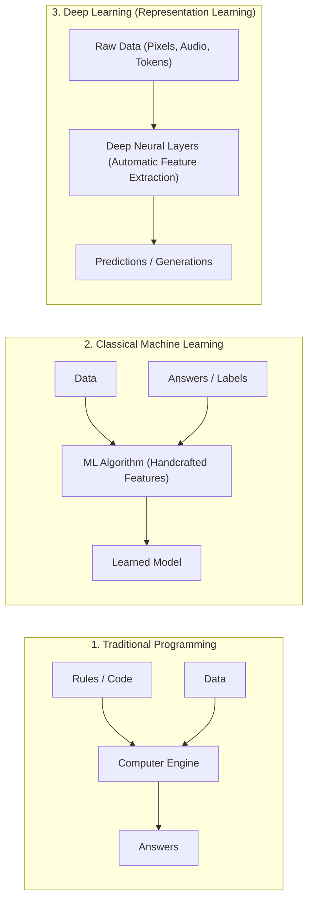

### The "Feature Engineering" Bottleneck
- In **Classical Machine Learning** (Logistic Regression, Random Forests, SVMs), human experts had to manually extract features (e.g., measuring the length of a bird's beak, extracting edges using Sobel filters).
- If the problem had high-dimensional, unstructured data (like raw images, audio waves, or free-form text), handcrafted features fell apart.
- **Deep Learning solved this:** By stacking layers of artificial neurons, deep networks learn **hierarchical representations** directly from raw inputs. Early layers detect simple patterns (edges, sounds); deeper layers assemble them into complex semantic concepts (faces, melodies, paragraphs).

---

# 2. Artificial Neural Networks (ANN) — The Digital Neuron

## 2.1 The Biological Analogy
In the human brain, a biological neuron receives electrochemical signals via **dendrites**, accumulates them in the **soma** (cell body), and if the combined voltage crosses a threshold, fires an action potential down its **axon** through **synapses** to downstream neurons.

```
Biological Neuron:   Dendrites (Inputs)   ---> Soma (Summation) ---> Axon/Synapse (Activation & Output)
Artificial Neuron:   Inputs (x1, x2, x3)  ---> Weighted Sum (z)  ---> Activation Function f(z) ---> Output (y)
```

## 2.2 Architecture & Blueprint

An **Artificial Neural Network (ANN)**, commonly configured as a **Multi-Layer Perceptron (MLP)**, consists of:
1. **Input Layer**: Ingests raw numerical features ($x_1, x_2, \dots, x_n$).
2. **Hidden Layer(s)**: Intermediate layers where weighted transformations and non-linear activations happen. "Deep" learning simply means having more than one hidden layer.
3. **Output Layer**: Produces the final target prediction ($\hat{y}$), such as a regression value or class probability.

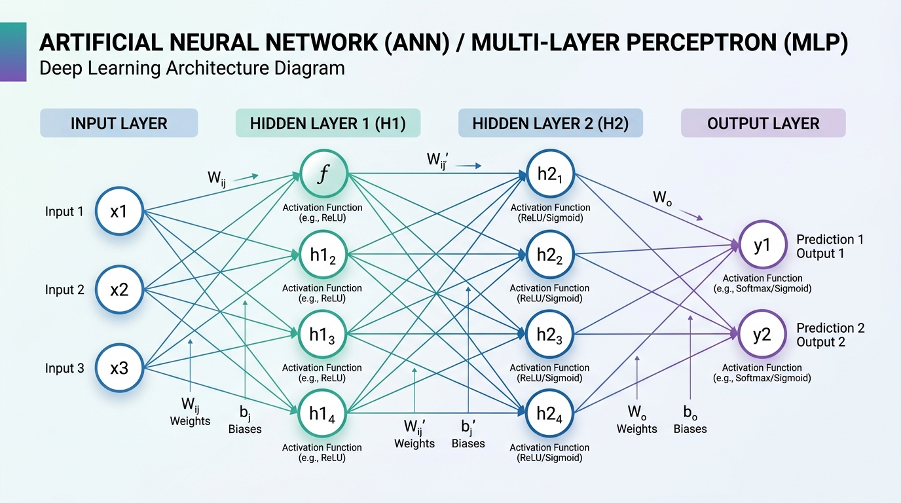

### Structural Flowchart (Mermaid)

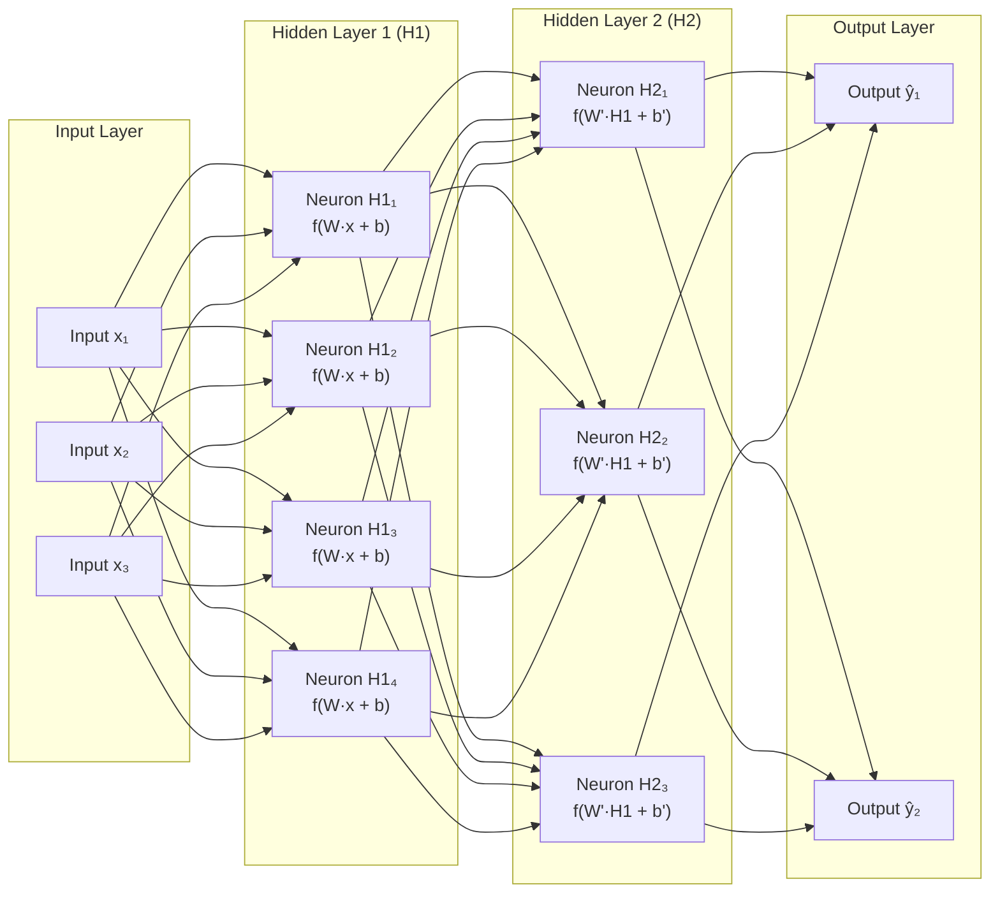

## 2.3 Forward Propagation & Mathematics

For any given neuron $j$ in layer $l$:

$$\mathbf{z}_j^{[l]} = \sum_{i} W_{ji}^{[l]} a_i^{[l-1]} + b_j^{[l]}$$

In vectorized notation:
$$\mathbf{z}^{[l]} = \mathbf{W}^{[l]} \mathbf{a}^{[l-1]} + \mathbf{b}^{[l]}$$
$$\mathbf{a}^{[l]} = \sigma\left(\mathbf{z}^{[l]}\right)$$

Where:
- $\mathbf{W}^{[l]}$ is the weight matrix (controls how strongly each input affects the neuron).
- $\mathbf{b}^{[l]}$ is the bias vector (allows shifting the activation function left or right).
- $\sigma(\cdot)$ is the non-linear **activation function**.
- $\mathbf{a}^{[l]}$ is the resulting activation vector passed to the next layer.

## 2.4 Activation Functions
Without non-linear activation functions, stacking 100 neural layers would still simply equal a single linear transformation: $W_2(W_1 x + b_1) + b_2 = W' x + b'$. Non-linearities allow neural networks to approximate **any continuous mathematical function** (The Universal Approximation Theorem).

| Activation Function | Formula | Output Range | Key Characteristics | Modern Usage |
| :--- | :--- | :--- | :--- | :--- |
| **Sigmoid** | $\sigma(z) = \frac{1}{1 + e^{-z}}$ | $(0, 1)$ | S-shaped curve, squashes values to probabilities. **Problem**: Vanishing gradient for $|z| > 4$. | Binary classification output layer. |
| **Tanh** | $\tanh(z) = \frac{e^z - e^{-z}}{e^z + e^{-z}}$ | $(-1, 1)$ | Zero-centered, stronger gradients than sigmoid. | Hidden layers in RNNs / LSTMs. |
| **ReLU** (Rectified Linear Unit) | $f(z) = \max(0, z)$ | $[0, \infty)$ | Extremely fast to compute, non-saturating for $z > 0$. **Problem**: "Dying ReLU" if $z \le 0$. | Default hidden layer activation in CNNs and early MLPs. |
| **Leaky ReLU** | $f(z) = \max(\alpha z, z)$ ($\alpha \approx 0.01$) | $(-\infty, \infty)$ | Prevents dying neurons by allowing a small gradient when $z < 0$. | GAN discriminators, computer vision. |
| **GELU** (Gaussian Error Linear Unit) | $z \cdot \Phi(z)$ | $(-0.17, \infty)$ | Smooth, probabilistic gating based on normal distribution. | **Standard in modern LLMs** (GPT-3/4, BERT, Claude, LLaMA). |
| **Softmax** | $\frac{e^{z_i}}{\sum_{j} e^{z_j}}$ | $(0, 1)$, sum $= 1$ | Converts logits into a normalized categorical probability distribution. | Multi-class classification & **Attention scores** in Transformers. |

## 2.5 Backpropagation & Gradient Descent

How does a neural network actually learn?
1. **Compute Loss ($L$)**: Measure the difference between prediction $\hat{y}$ and true label $y$ using a Loss Function (e.g., Mean Squared Error for regression, Cross-Entropy for classification).
2. **Backpropagation**: Apply the **Chain Rule of Calculus** in reverse, calculating the partial derivative of the loss with respect to every single weight and bias in the network:
   
   $$\frac{\partial L}{\partial W^{[l]}} = \frac{\partial L}{\partial a^{[l]}} \cdot \frac{\partial a^{[l]}}{\partial z^{[l]}} \cdot \frac{\partial z^{[l]}}{\partial W^{[l]}}$$

3. **Weight Update (Gradient Descent)**:
   
   $$W_{\text{new}} = W_{\text{old}} - \eta \cdot \frac{\partial L}{\partial W}$$
   
   Where $\eta$ is the **learning rate**.
4. **Modern Optimizers**:
   - **SGD**: Stochastic Gradient Descent (noisy single-sample updates).
   - **Momentum**: Adds a fraction of previous updates to roll past local minima.
   - **Adam (Adaptive Moment Estimation)**: Computes adaptive learning rates per parameter by tracking both the exponentially decaying average of past gradients and squared gradients. **Adam and AdamW are the industry standards for training Foundation Models.**

---

# 3. Convolutional Neural Networks (CNN) — Giving Machines Eyes

## 3.1 Why ANNs Fail on Images: The Parameter Explosion
Consider a modest modern color image: $1000 \times 1000$ pixels with 3 color channels (RGB).
- Total input nodes $= 1000 \times 1000 \times 3 = 3,000,000$ inputs!
- If the first hidden layer has 1,000 neurons, that single layer requires:
  $$3,000,000 \times 1,000 = 3,000,000,000 \text{ (3 Billion weights!)}$$
- **Catastrophic Failure**: Overfitting, impossible memory footprint, and worst of all, **ANNs are spatially blind**—flattening an image into a 1D vector completely destroys the 2D spatial arrangement of pixels (an eye next to a nose).

## 3.2 Architecture & Blueprint

**Convolutional Neural Networks (CNNs)** solve this by introducing two key properties:
1. **Local Receptive Fields (Spatial Locality)**: Neurons only connect to a small patch of adjacent pixels at a time.
2. **Weight Sharing (Translation Invariance)**: The same small filter (e.g., $3 \times 3$) slides over the entire image. If a filter learns to recognize a vertical edge or a cat ear in the top-left, it can recognize it in the bottom-right!

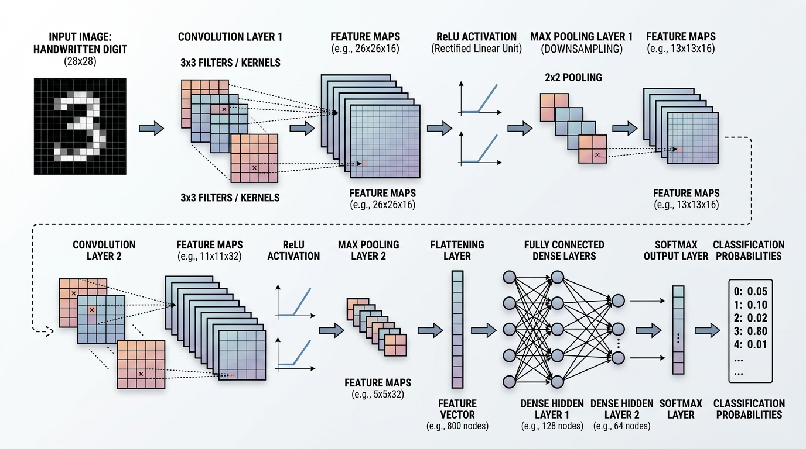

## 3.3 Core Operations: Convolution, Stride, Padding, Pooling

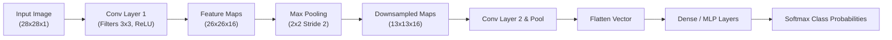

### 1. The Convolution Operation
A small matrix called a **Kernel / Filter** (typically $3 \times 3$ or $5 \times 5$) slides over the input matrix, calculating element-wise multiplications and summing them up to produce a single value on the **Feature Map**.

### 2. Stride and Padding
- **Stride ($S$)**: How many pixels the filter shifts per step. Stride 1 moves 1 pixel; Stride 2 halves the spatial dimension.
- **Padding ($P$)**: Adding a border of zeros around the image.
  - **Valid Padding**: No border; output dimensions shrink ($N - F + 1$).
  - **Same Padding**: Adds zeros so output spatial dimensions match the input:
    $$O = \left\lfloor \frac{N + 2P - F}{S} \right\rfloor + 1$$

### 3. Pooling (Downsampling)
- **Max Pooling**: Extracts the maximum value in each $2 \times 2$ window. Keeps the strongest feature activation, discards spatial noise, and makes the model robust to small translations.
- **Average Pooling**: Computes the mean value across the window.

### 4. Flattening & Fully Connected Layers
Once the convolutional layers have converted raw pixels into high-level semantic feature representations (e.g., "contains wheels, windshield, headlights"), the 2D maps are flattened into a 1D vector and fed to a standard dense MLP for final classification.

## 3.4 The Connection to GenAI
> [!IMPORTANT]
> **Why do we study CNNs in a GenAI course?**
> 1. **Latent Diffusion Models (Stable Diffusion, FLUX)**: The image encoder and decoder (VAE - Variational Autoencoder) that compresses high-resolution images into latent vectors and reconstructs them back into pixel space relies heavily on convolutional residual blocks.
> 2. **UNet Backbone**: Many popular image generation models use a convolutional UNet to predict and remove noise step by step.
> 3. **StyleGAN**: Generates hyper-realistic human faces using progressive convolutional synthesis networks.

---

# 4. Recurrent Neural Networks (RNN) — Giving Machines Memory

## 4.1 Why Sequences Need Memory
Standard ANNs and CNNs assume all inputs and outputs are **independent of each other**. But human communication and reality are fundamentally **sequential**:
- Text: *"The cloud is in the..."* $\to$ you cannot predict the next word without remembering the preceding words.
- In language, order changes meaning completely: *"The dog bit the man"* vs. *"The man bit the dog"*.

## 4.2 Architecture & Blueprint

An **RNN** contains an internal cyclical loop. At every time step $t$, the RNN cell receives two inputs:
1. The current sequential element: $\mathbf{x}_t$ (e.g., current word vector).
2. The **Hidden State** from the previous step: $\mathbf{h}_{t-1}$ (the network's working memory).

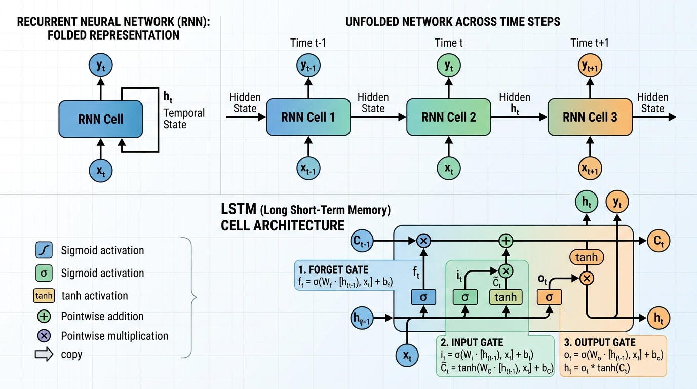

### The Mathematical Recurrence
$$\mathbf{h}_t = \tanh\left(\mathbf{W}_{hh} \mathbf{h}_{t-1} + \mathbf{W}_{xh} \mathbf{x}_t + \mathbf{b}_h\right)$$
$$\mathbf{y}_t = \text{softmax}\left(\mathbf{W}_{hy} \mathbf{h}_t + \mathbf{b}_y\right)$$

Notice that the exact same weight matrices ($\mathbf{W}_{hh}, \mathbf{W}_{xh}, \mathbf{W}_{hy}$) are shared across all time steps!

## 4.3 The Fatal Flaw: Vanishing & Exploding Gradients
When training an RNN over long sequences, we use **Backpropagation Through Time (BPTT)**. The error must backpropagate backwards across 50, 100, or 500 time steps.
- Because $\mathbf{W}_{hh}$ is multiplied repeatedly at every step:
  - If the largest eigenvalue of $\mathbf{W}_{hh} > 1$, gradients grow exponentially $\to$ **Exploding Gradients** (loss becomes `NaN`).
  - If the largest eigenvalue of $\mathbf{W}_{hh} < 1$, gradients shrink exponentially $\to$ **Vanishing Gradients** (gradients become $0.0000...$).
- **Consequence**: Traditional RNNs suffer from **short-term amnesia**. If a sentence is 30 words long, the RNN completely forgets the beginning of the sentence by the end.

## 4.4 The Solution: LSTMs & GRUs

To conquer the vanishing gradient, Hochreiter & Schmidhuber introduced **Long Short-Term Memory (LSTM)** in 1997.

### The LSTM Secret: The Cell State Highway ($C_t$)
The LSTM introduces a dedicated **Cell State** ($C_t$) that runs straight down the entire chain with only minor linear interactions, acting as an uninterrupted information highway.

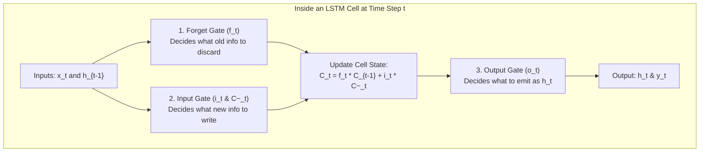

The three gates of an LSTM:
1. **Forget Gate ($f_t$)**: Decides what percentage of the past memory to discard.
   $$f_t = \sigma\left(W_f \cdot [h_{t-1}, x_t] + b_f\right)$$
2. **Input Gate ($i_t$)**: Decides which new values from the current input should be stored in memory.
   $$i_t = \sigma\left(W_i \cdot [h_{t-1}, x_t] + b_i\right)$$
   $$\tilde{C}_t = \tanh\left(W_c \cdot [h_{t-1}, x_t] + b_c\right)$$
3. **Output Gate ($o_t$)**: Decides what the hidden state $h_t$ should be based on the updated cell state.
   $$o_t = \sigma\left(W_o \cdot [h_{t-1}, x_t] + b_o\right)$$
   $$h_t = o_t \odot \tanh(C_t)$$

- **GRU (Gated Recurrent Unit)**: A streamlined variant of LSTM with only 2 gates (**Reset Gate** and **Update Gate**), merging the cell state and hidden state for faster training.

## 4.5 Bridge to Modern LLMs
While LSTMs solved short-term amnesia for sentences of 50–100 words, they had one fatal architectural bottleneck: **They are sequential by nature**.
- Step $t=5$ cannot be computed until Step $t=4$ finishes. This made training on modern GPUs impossible to parallelize!
- In 2017, Google published *"Attention Is All You Need"*, discarding recurrence entirely in favor of the **Transformer Architecture**, which processes all tokens in parallel. However, understanding sequence modeling, hidden states, and autoregression in RNNs is the foundation of understanding how LLMs generate tokens.

---

# 5. Reinforcement Learning (RL) — Learning by Reward & Consequence

## 5.1 The Reward-Driven Paradigm
In Supervised Learning, an algorithm is spoon-fed input-output pairs ($(x, y)$). In **Reinforcement Learning (RL)**, there is no teacher. Instead, an **Agent** learns how to behave in an unknown **Environment** through trial-and-error, maximizing a cumulative scalar **Reward**.

```
Supervised Learning:    "Here is an image of a cat. It is labeled 'Cat'."
Unsupervised Learning:  "Here are 10,000 unlabelled images. Group similar ones together."
Reinforcement Learning: "Here is a game board. Try moves. If you win, +100 points; if you lose, -100 points. Figure out how to win."
```

## 5.2 Architecture & Blueprint

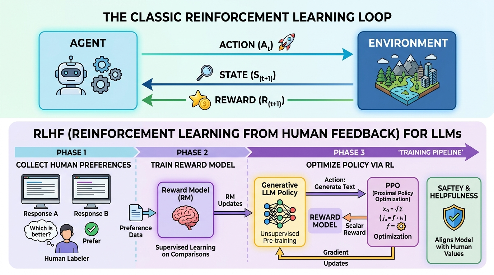

## 5.3 Core Terminology: Agent, Environment, Policy, Value

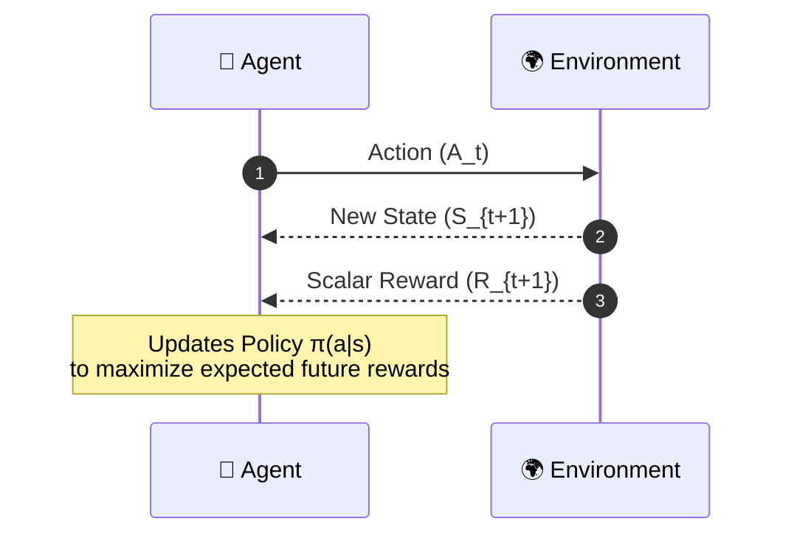

1. **Agent**: The learner or decision-maker (e.g., an autonomous robot, game engine, or an LLM responding to a user).
2. **Environment**: The world with which the agent interacts (e.g., a chess board, a simulated physics engine, or a human conversational partner).
3. **State ($S_t$)**: The current configuration of the environment at time $t$.
4. **Action ($A_t$)**: The choice executed by the agent from the set of possible actions.
5. **Reward ($R_t$)**: A scalar feedback signal indicating immediate performance.
6. **Policy ($\pi(a|s)$)**: The strategy mapping state $s$ to action $a$.
7. **Discount Factor ($\gamma \in [0, 1)$)**: Determines how much the agent values immediate rewards versus distant future rewards:
   $$G_t = \sum_{k=0}^{\infty} \gamma^k R_{t+k+1}$$

## 5.4 The Critical GenAI Bridge: RLHF (Reinforcement Learning from Human Feedback)

> [!IMPORTANT]
> **Why is RL essential for modern LLMs?**
> When a raw LLM (like base GPT-4) finishes pre-training, it is merely a text-completion engine. If you ask it: *"How do I make a bomb?"*, it might autocomplete: *"Step 1: Buy these chemicals..."* It has no intrinsic concept of truth, safety, or helpfulness.
>
> **RLHF** is the post-training alignment method that turned wild base LLMs into ChatGPT, Claude, and Gemini!

### The 3-Phase RLHF Pipeline

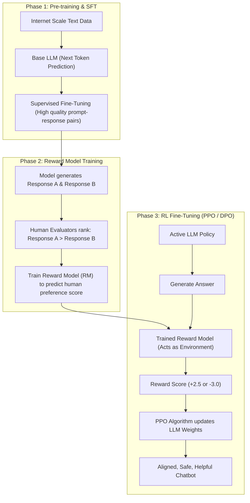

In this framework:
- The **Agent** is the Large Language Model.
- The **Action** is the next generated sentence/tokens.
- The **Environment** is the Reward Model (trained to mimic human taste and safety rules).
- The **Reward** is the score assigned to the answer's quality, helpfulness, and safety.

---

# 6. Generative Adversarial Networks (GAN) — The Creative Duel

## 6.1 The Counterfeiter vs. The Detective Analogy
Introduced by Ian Goodfellow et al. in 2014, **Generative Adversarial Networks (GANs)** treated generative AI not as an optimization problem of a single model, but as an **adversarial game between two rival networks**:

1. **The Generator ($G$) — The Art Forger**: Takes pure random noise ($z$) and tries to generate realistic-looking synthetic data (e.g., fake images of human faces).
2. **The Discriminator ($D$) — The Art Detective**: Takes both real images from the dataset and fake images from the Generator, and tries to correctly classify: *"Is this sample Real (1) or Fake (0)?"*

As training progresses:
- The Detective ($D$) gets better at spotting flaws.
- The Forger ($G$) is forced to create increasingly hyper-realistic forgeries to fool the Detective.
- At Nash Equilibrium, the Generator produces synthetic images indistinguishable from real data!

## 6.2 Architecture & Blueprint

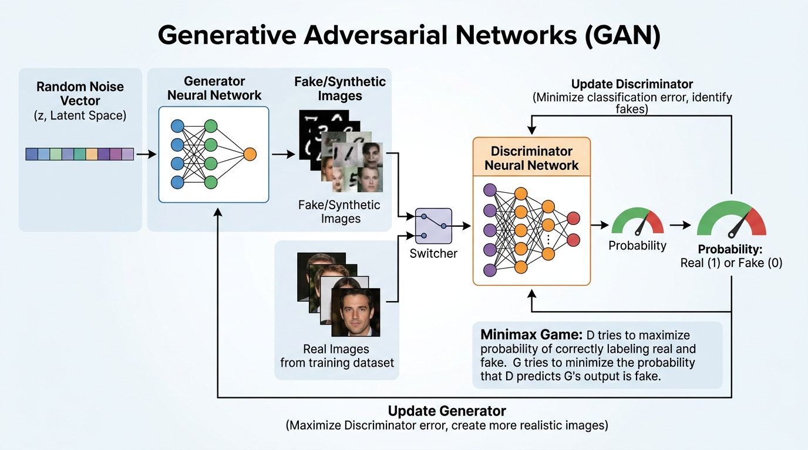

## 6.3 Minimax Objective Function & Training Dynamics

The interaction is formulated as a zero-sum **Minimax Game**:

$$\min_G \max_D V(D, G) = \mathbb{E}_{x \sim p_{\text{data}}}[\log D(x)] + \mathbb{E}_{z \sim p_z}[\log(1 - D(G(z)))]$$

- **The Discriminator ($D$) wants to maximize $V(D, G)$**:
  - For real samples $x$: $D(x) \to 1 \implies \log(1) = 0$ (maximum value).
  - For fake samples $G(z)$: $D(G(z)) \to 0 \implies \log(1 - 0) = 0$.
- **The Generator ($G$) wants to minimize $V(D, G)$**:
  - Wants $D(G(z)) \to 1 \implies \log(1 - 1) = \log(0) \to -\infty$.

## 6.4 Failure Modes: Mode Collapse
Training a GAN is notoriously difficult because both networks are learning simultaneously against a moving target:
- **Mode Collapse**: The Generator finds a single image type that successfully fools the Discriminator (e.g., generating only pictures of a blue cat) and generates *only that output* over and over again, completely losing diversity.
- **Vanishing Gradient**: If the Discriminator gets too smart too fast, $D(G(z)) \approx 0$, and the Generator receives no meaningful gradients to learn from.
- **Modern Solutions**: Wasserstein GAN (WGAN-GP), StyleGAN-2/3 with adaptive instance normalization (AdaIN).

## 6.5 The Historical Leap in Generative Synthesis
GANs were the first models that produced crisp, photorealistic outputs without the blurry artifacts of early Variational Autoencoders (VAEs). They laid the cultural and scientific groundwork for the public fascination with synthetic media and deepfakes that presaged modern GenAI.

---

# 7. What is Generative AI?

## 7.1 Formal Definition
> **Generative Artificial Intelligence (GenAI)** refers to a subset of artificial intelligence systems designed to create **novel, original content**—including text, code, high-resolution imagery, synthesized voice, audio, 3D assets, and video—by learning the underlying probability distribution and latent patterns of vast training datasets.

Unlike traditional AI that acts as a judge, categorizer, or calculator, Generative AI acts as a **creator and synthesizer**.

## 7.2 Discriminative AI vs. Generative AI

To truly understand GenAI, we must contrast it with its historical counterpart: **Discriminative AI**.

```
                ┌────────────────────────────────────────────────────────┐
                │                       All AI                           │
                └──────────────────────────┬─────────────────────────────┘
                                           │
             ┌─────────────────────────────┴─────────────────────────────┐
             ▼                                                           ▼
┌───────────────────────────────┐                       ┌───────────────────────────────┐
│       Discriminative AI       │                       │         Generative AI         │
│   Learns Decision Boundary    │                       │    Learns Underlying Data     │
│           P(Y | X)            │                       │      Distribution P(X)        │
│                               │                       │                               │
│  • Classification             │                       │  • Creative Synthesis         │
│  • Spam Detection             │                       │  • Text Generation (LLMs)     │
│  • Object Detection           │                       │  • Image Synthesis            │
│  • Sentiment Analysis         │                       │  • Voice Cloning & Music      │
└───────────────────────────────┘                       └───────────────────────────────┘
```

### Comprehensive Comparison Matrix

| Dimension | Discriminative AI | Generative AI |
| :--- | :--- | :--- |
| **Mathematical Goal** | Models conditional probability: **$P(Y \mid X)$** (probability of label $Y$ given input features $X$). | Models data distribution: **$P(X)$** or joint probability **$P(X, Y)$**. |
| **Core Question** | *"Given this picture, is it a cat or a dog?"* | *"Create a brand new picture of a cat playing piano."* |
| **Operational Mechanism** | Draws a **decision boundary** dividing different classes in feature space. | Maps the **entire multi-dimensional feature distribution** to sample new data points from it. |
| **Output Type** | Discrete labels, probabilities, bounding boxes, numerical regressions. | Coherent unstructured artifacts: essays, computer code, images, audio, video. |
| **Evaluation Metrics** | Accuracy, Precision, Recall, F1-Score, ROC-AUC. | Perplexity, BLEU/ROUGE, Fréchet Inception Distance (FID), Human Preference (Elo). |
| **Classic Exemplars** | Logistic Regression, SVM, Random Forest, ResNet, YOLO. | GPT-4o, Claude 3.5, Stable Diffusion, ElevenLabs, Sora. |

## 7.3 The Evolutionary Timeline (1950 to 2026+)

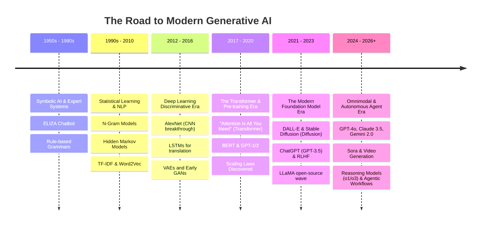

## 7.4 The Three Pillars Fueling the Modern GenAI Boom
Why did this explosion happen now rather than 20 years ago?

1. **Massive Parallel Compute**: Transitioning from CPUs to high-bandwidth cluster GPUs (NVIDIA A100/H100/B200) and TPUs enabled training models with hundreds of billions of parameters.
2. **Internet-Scale Unlabeled Data**: The digitization of human knowledge—billions of web pages (Common Crawl), Github repositories, open books, and digitized artwork provided the raw substrate.
3. **Self-Supervised Learning & Transformers**: Removing the bottleneck of human labeling. By simply training models to predict the next token on raw text, networks autonomously acquire common-sense reasoning, coding abilities, and world models.

---

# 8. Generative AI Modalities & Model Landscape

Modern Generative AI is organized into distinct **modalities** based on the type of input prompt and synthesized output:

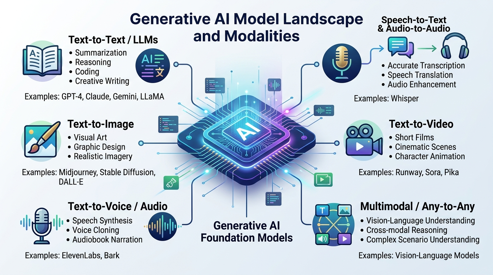

## 8.1 Landscape Overview

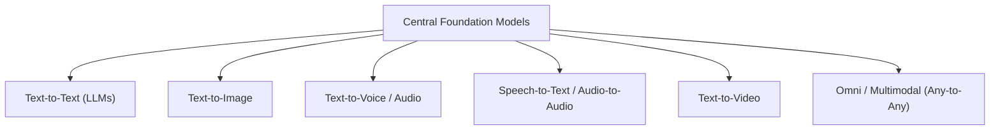

---

## 8.2 Modality 1: Text-to-Text (Large Language Models / LLMs)
- **Core Mechanism**: **Autoregressive Next-Token Prediction**. Given a sequence of $N$ previous tokens, compute a probability distribution over the entire vocabulary ($\approx 100,000$ tokens) to select token $N+1$:
  $$P(w_1, w_2, \dots, w_T) = \prod_{t=1}^{T} P(w_t \mid w_1, \dots, w_{t-1})$$
- **Leading Architectures**: Decoder-only Transformers.
- **Top Models**:
  - **Proprietary**: OpenAI GPT-4o, Anthropic Claude 3.5 Sonnet, Google Gemini 1.5/2.0.
  - **Open Weights**: Meta LLaMA 3.3, Mistral Large, DeepSeek-V3 / R1, Qwen 2.5.
- **Capabilities**: Mathematical reasoning, multi-step code generation, logical deductions, document summarization, and human-like conversational dialogue.

---

## 8.3 Modality 2: Text-to-Image (Diffusion Models & GANs)
- **Core Mechanism (Diffusion)**: 
  1. **Forward Process**: Gradually destroy an image over $T$ steps by adding Gaussian noise until it becomes pure static.
  2. **Reverse Process**: Train a neural network (typically a UNet or Diffusion Transformer / DiT) conditioned on text prompt embeddings (via CLIP or T5) to predict and subtract the noise at each step, revealing a pristine, novel image.
- **Top Models**:
  - **Stable Diffusion (SDXL, SD3)**: Open-weights, runs on consumer GPUs.
  - **FLUX.1**: State-of-the-art open visual model by Black Forest Labs.
  - **Midjourney v6**: Premier artistic visual fidelity.
  - **DALL-E 3**: Exceptional prompt adherence and complex composition.

---

## 8.4 Modality 3: Text-to-Voice / Audio & Speech Synthesis
- **Core Mechanism**: Converts text tokens into intermediate acoustic representations (Mel-Spectrograms) using acoustic transformers, followed by a **Neural Vocoder** that synthesizes raw audio waveforms ($44.1\text{kHz}$). Modern models use autoregressive or diffusion modeling on discrete audio tokens.
- **Capabilities**:
  - **Zero-Shot Voice Cloning**: Cloning any human speaker's voice timbre, pitch, and accent from a 3-second reference clip.
  - **Emotion & Prosody Control**: Injecting whispers, laughter, sadness, or excitement into spoken dialogue.
- **Top Models**:
  - **ElevenLabs**: Industry standard for hyper-realistic voice acting and multilingual dubbing.
  - **Bark (Suno)**: Transformer-based audio model capable of generating speech, background noise, and music.
  - **OpenVoice / ChatTTS / XTTS**: Open-source voice synthesis frameworks.

---

## 8.5 Modality 4: Speech-to-Text & Native Speech-to-Speech
- **Speech-to-Text (ASR - Automatic Speech Recognition)**:
  - **OpenAI Whisper**: Weakly supervised sequence-to-sequence model trained on 680,000+ hours of multilingual audio. Robust to heavy background noise, technical jargon, and varied accents.
- **Native Speech-to-Speech (Omni Models)**:
  - **The Old Way (Cascaded Pipeline)**: Audio $\to$ [ASR] $\to$ Text $\to$ [LLM] $\to$ Text $\to$ [TTS] $\to$ Audio. (Suffers from $1.5-3\text{s}$ latency; loses tone, laughter, and sarcasm).
  - **The Modern Way (End-to-End Native Audio)**: **GPT-4o Audio / Gemini Live**. Audio waveforms are tokenized directly into the model's native latent space, allowing sub-300ms conversational responses with real-time interruptions and emotional inflection.

---

## 8.6 Modality 5: Text-to-Video & Image-to-Video
- **Core Mechanism**: Extends 2D image diffusion into the 3D **Spatio-Temporal Domain**. Treats video as a sequence of latent spacetime patches. The network must not only maintain photorealism within each frame, but also maintain physics, lighting, and object permanence across time steps.
- **Top Models**:
  - **OpenAI Sora**: World-simulating diffusion transformer with dynamic camera motion and physical consistency.
  - **Runway Gen-3 Alpha**: Cinematic motion control and high visual fidelity.
  - **Kling AI & Luma Dream Machine**: Hyper-realistic human motion, camera zooming, and dynamic scene transitions.
  - **Pika 2.0**: Creative VFX modifications and animation.

---

## 8.7 Modality 6: Multimodal Foundation Models (Any-to-Any)
The frontier of AI is no longer single-modality. Modern foundation models are **natively multimodal**:
- A single neural network can simultaneously ingest:
  $$\text{Inputs: } [\text{Text Prompt} + \text{High-Res Image} + \text{PDF Document} + \text{Audio Stream} + \text{Video Clip}]$$
- And produce synchronized outputs across text, code, audio, and visual modalities.
- **Key Architectures**:
  - **Vision-Language Models (VLMs)**: Use vision encoders (like SigLIP or ViT) connected to LLM backbones via projection layers (MLP cross-attention adapters).
  - **Examples**: GPT-4o, Claude 3.5 Sonnet (computer use capability), Gemini 1.5 Pro (2-million token multimodal context window).

---

# 9. Comparison Matrix: Deep Learning vs. Generative AI Families

| Architecture | Input Type | Output Type | Core Mathematical Superpower | Fatal Limitation / Gotcha | Modern Successor / Role in GenAI |
| :--- | :--- | :--- | :--- | :--- | :--- |
| **ANN / MLP** | Tabular / 1D numerical vectors | Continuous values or class probabilities | Universal Function Approximator; simple dense connectivity | Spatially & temporally blind; parameter explosion on raw media | Feed-Forward layers inside every modern Transformer! |
| **CNN** | 2D/3D grids (Images, video frames) | Class labels, feature maps | Spatial locality & translation invariance via parameter sharing | Inability to capture long-range global context across distant pixels | Latent Encoders/Decoders in Diffusion (VAEs, UNets) |
| **RNN / LSTM** | 1D sequential tokens (Words, time series) | Next token or sequence label | Sequential memory via internal recurrent hidden state ($h_t$) | Sequential execution prevents GPU parallelization; memory bottlenecks | Replaced by Transformers with Self-Attention |
| **RL** | Environment States & scalar rewards | Actions (Policies) | Optimizes long-term cumulative reward without supervised labels | Sample inefficient, unstable training dynamics | **RLHF** alignment for conversational LLMs |
| **GAN** | Random noise vector $z$ + conditions | Synthetic data (Images, audio) | Minimax adversarial duel produces razor-sharp realistic samples | Highly unstable training; Mode Collapse; difficult convergence | Coexists with & complements Diffusion Models |
| **LLM (Transformer)** | Text tokens / Multimodal tokens | Predicted next tokens | Global self-attention ($O(1)$ path length between any two words) | Quadratic context complexity $O(N^2)$; Hallucinations | The undisputed engine of modern Generative AI! |

---

# 10. Knowledge Check & Self-Assessment

Test your understanding of Day 01 concepts. (Answers provided at the end of each question).

<details>
<summary><b>❓ Question 1: Why can't we simply use a standard Artificial Neural Network (ANN) to process high-resolution images?</b></summary>
<br/>
<b>Answer:</b> 
Flattening a high-resolution image (e.g., $1000 \times 1000 \times 3$) yields 3 million input nodes. Connecting this to a single hidden layer with 1,000 neurons results in 3 billion parameters for that layer alone, causing extreme overfitting and memory exhaustion. Furthermore, flattening completely destroys the 2D spatial relationships between neighboring pixels. CNNs solve this via local receptive fields and weight-sharing filters.
</details>

<details>
<summary><b>❓ Question 2: What is the difference between an LSTM's Cell State and Hidden State?</b></summary>
<br/>
<b>Answer:</b> 
The <b>Cell State ($C_t$)</b> acts as a long-term memory highway that flows down the network with minimal linear interactions, allowing gradients to backpropagate across long sequences without vanishing. The <b>Hidden State ($h_t$)</b> acts as working short-term memory that is filtered through the output gate and directly influences the prediction at the current time step.
</details>

<details>
<summary><b>❓ Question 3: How does Reinforcement Learning from Human Feedback (RLHF) prevent an LLM from giving dangerous answers?</b></summary>
<br/>
<b>Answer:</b> 
During pre-training, an LLM only learns to predict the next word, regardless of safety. In RLHF, humans rank multiple candidate responses based on helpfulness and safety. A <b>Reward Model</b> is trained to predict these human scores. Then, reinforcement learning (e.g., PPO) updates the LLM policy, rewarding helpful/safe completions and penalizing harmful ones.
</details>

<details>
<summary><b>❓ Question 4: In a GAN, what happens during "Mode Collapse"?</b></summary>
<br/>
<b>Answer:</b> 
Mode collapse occurs when the Generator discovers a small subset of outputs (or even a single output) that reliably tricks the Discriminator, and begins producing only that output repeatedly while ignoring the true diversity of the training dataset.
</details>

<details>
<summary><b>❓ Question 5: Why is native speech-to-speech (like GPT-4o) superior to a traditional cascaded pipeline (Whisper -> GPT -> ElevenLabs)?</b></summary>
<br/>
<b>Answer:</b> 
A cascaded pipeline loses non-verbal audio characteristics during transcription (tone, cadence, laughter, accents, emotional nuance) and accumulates latency ($1.5 - 3$ seconds) across each intermediate hop. An end-to-end native audio model processes audio tokens directly in sub-300ms, enabling seamless interruptions and expressive vocal performance.
</details>

---

# 11. Summary & Looking Ahead to Day 02

### 📌 Day 01 Recap
- **Deep Learning** freed AI from manual feature engineering by learning hierarchical representations from raw data.
- **ANNs** laid the foundation of weighted linear combinations, non-linear activation functions, backpropagation, and gradient descent.
- **CNNs** conquered spatial data via convolutional kernels, pooling, and translation invariance.
- **RNNs & LSTMs** unlocked temporal sequence processing and memory gating, but were bottlenecked by sequential compute.
- **Reinforcement Learning** established the agent-environment reward loop, which now acts as the backbone of model alignment (**RLHF**).
- **GANs** demonstrated the power of adversarial generative synthesis.
- **Generative AI** represents a paradigm shift from predicting labels ($P(Y|X)$) to modeling and generating complete data distributions ($P(X)$) across text, audio, image, video, and code.

### 🔮 What's Next in Day 02?
Tomorrow, we unlock the single most important architecture in modern artificial intelligence:
- **The Transformer Deep Dive**: Why *"Attention Is All You Need"* changed everything.
- **Self-Attention Mechanism**: Query ($Q$), Key ($K$), Value ($V$) intuition and matrix math.
- **Multi-Head Attention & Positional Encodings**: How models understand grammar and word order in parallel.
- **Tokenization & Embedding Spaces**: Byte-Pair Encoding (BPE), WordPiece, and how text turns into high-dimensional geometry.

---

<p align="center">
  <b>🌟 End of Day 01 Notes — Keep Building and Experimenting! 🌟</b>
</p>
