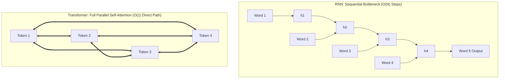
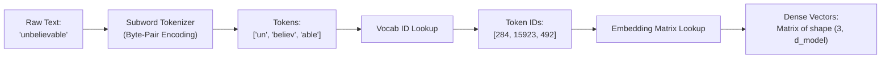
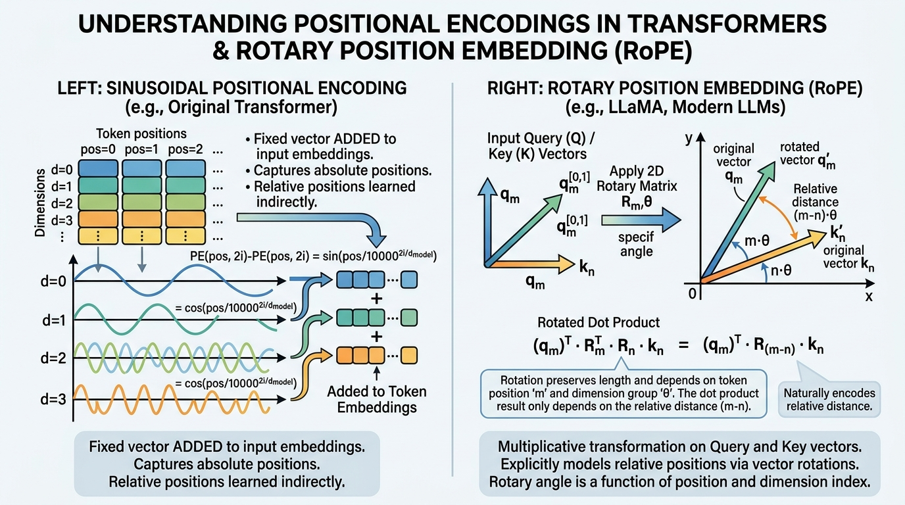
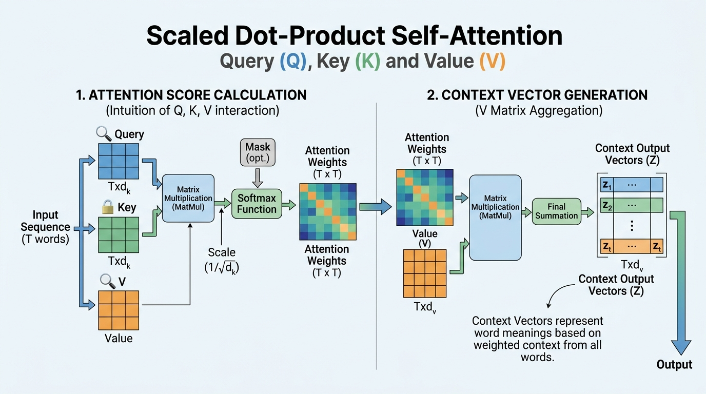
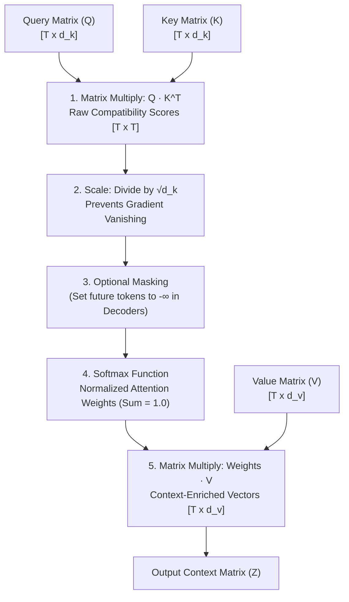
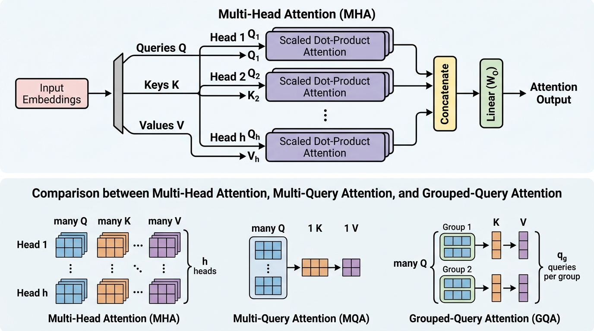
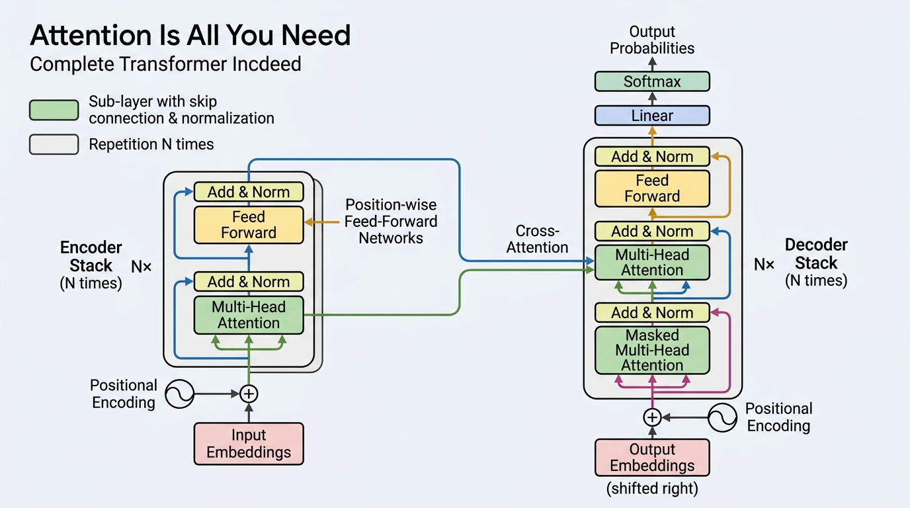
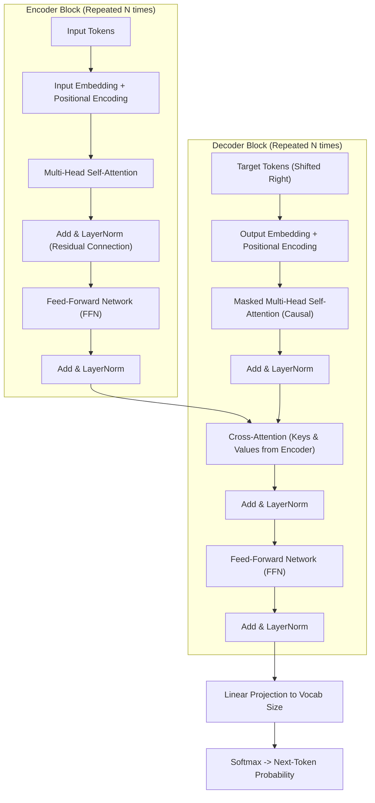
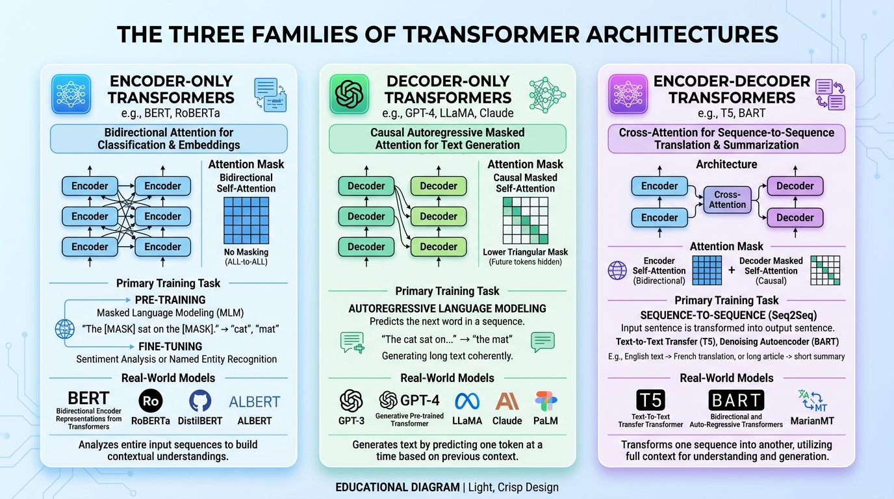

# ⚡ Gen AI Masterclass — Day 02
## The Transformer Revolution & Self-Attention Architecture

[](https://github.com/)
[](https://github.com/)
[](https://github.com/)
[](https://github.com/)

---

## 📌 Executive Overview & Learning Objectives

Welcome to **Day 02** of the **Generative AI Masterclass**! 

On Day 01, we explored how classical deep learning models evolved—from ANNs and CNNs to RNNs, LSTMs, and GANs. We saw how recurrent architectures attempted to process sequential data, but ultimately ran into a brick wall of **short-term memory loss** and **inability to train in parallel on GPUs**.

In 2017, a team of eight researchers at Google published a landmark paper titled:
> **"Attention Is All You Need"** *(Vaswani et al., 2017)*

This single paper discarded recurrence entirely and introduced the **Transformer**—the architectural foundation powering virtually every breakthrough in modern AI: **GPT-4o, Claude 3.5, Gemini, LLaMA 3, DeepSeek, Midjourney, and AlphaFold 3**.

By the end of this study guide, you will be able to:
1. **Master the prerequisite basics** from scratch: Vectors, high-dimensional embeddings, tokenization, and dot-product similarity.
2. **Understand the fatal bottleneck of RNNs** and why Transformers won the AI revolution.
3. **Deconstruct Scaled Dot-Product Self-Attention ($Q, K, V$)** through intuitive real-world analogies, step-by-step matrix multiplication, and mathematical proofs.
4. **Understand Multi-Head Attention (MHA)** and modern inference optimizations like **Grouped-Query Attention (GQA)**.
5. **Differentiate Positional Encodings**: From original Sinusoidal frequencies to modern **Rotary Position Embeddings (RoPE)**.
6. **Navigate the Transformer Trinity**: Encoder-only (BERT), Decoder-only (GPT/LLaMA), and Encoder-Decoder (T5).

---

## 🗺️ Table of Contents

- [1. Prerequisites Made Simple: The Basics Before The Deep Dive](#1-prerequisites-made-simple-the-basics-before-the-deep-dive)
  - [1.1 What is a Vector? (Why Computers Need Numbers)](#11-what-is-a-vector-why-computers-need-numbers)
  - [1.2 What is an Embedding? (Semantic Geometry)](#12-what-is-an-embedding-semantic-geometry)
  - [1.3 What is a Dot Product? (The Mathematical Flashlight)](#13-what-is-a-dot-product-the-mathematical-flashlight)
  - [1.4 How Human Attention Works](#14-how-human-attention-works)
- [2. The Fall of Recurrence: Why Transformers Were Born](#2-the-fall-of-recurrence-why-transformers-were-born)
  - [2.1 The Two Fatal Bottlenecks of RNNs & LSTMs](#21-the-two-fatal-bottlenecks-of-rnns--lstms)
  - [2.2 The Transformer Breakthrough: O(1) Path Length & Full Parallelism](#22-the-transformer-breakthrough-o1-path-length--full-parallelism)
- [3. Tokenization: Converting Human Language into Model Tokens](#3-tokenization-converting-human-language-into-model-tokens)
  - [3.1 Character vs. Word vs. Subword Tokenization](#31-character-vs-word-vs-subword-tokenization)
  - [3.2 Byte-Pair Encoding (BPE) Algorithm Step-by-Step](#32-byte-pair-encoding-bpe-algorithm-step-by-step)
  - [3.3 Special Tokens & Vocabulary Projections](#33-special-tokens--vocabulary-projections)
- [4. Positional Encodings: Teaching Word Order to a Parallel Model](#4-positional-encodings-teaching-word-order-to-a-parallel-model)
  - [4.1 Why Transformers are Permutation-Invariant](#41-why-transformers-are-permutation-invariant)
  - [4.2 Classic Sinusoidal Positional Encoding](#42-classic-sinusoidal-positional-encoding)
  - [4.3 Modern SOTA: Rotary Position Embedding (RoPE)](#43-modern-sota-rotary-position-embedding-rope)
- [5. Scaled Dot-Product Self-Attention (Q, K, V) — The Heart of Transformers](#5-scaled-dot-product-self-attention-q-k-v--the-heart-of-transformers)
  - [5.1 The Intuitive Search Engine / Library Analogy](#51-the-intuitive-search-engine--library-analogy)
  - [5.2 The Mathematical Formula & Step-by-Step Derivation](#52-the-mathematical-formula--step-by-step-derivation)
  - [5.3 Why Divide by √d_k? (The Variance Saturation Proof)](#53-why-divide-by-d_k-the-variance-saturation-proof)
  - [5.4 Concrete Matrix Walkthrough with a 3-Word Sentence](#54-concrete-matrix-walkthrough-with-a-3-word-sentence)
- [6. Multi-Head Attention (MHA) & Modern KV-Cache Optimizations](#6-multi-head-attention-mha--modern-kv-cache-optimizations)
  - [6.1 Why One Attention Head Isn't Enough](#61-why-one-attention-head-isnt-enough)
  - [6.2 The Multi-Head Mechanism: Split, Attend, Concatenate, Project](#62-the-multi-head-mechanism-split-attend-concatenate-project)
  - [6.3 The KV-Cache Memory Wall: MHA vs. MQA vs. GQA](#63-the-kv-cache-memory-wall-mha-vs-mqa-vs-gqa)
- [7. The Complete Transformer Block Blueprint](#7-the-complete-transformer-block-blueprint)
  - [7.1 The Full Architecture Diagram](#71-the-full-architecture-diagram)
  - [7.2 Residual / Skip Connections: The Gradient Highway](#72-residual--skip-connections-the-gradient-highway)
  - [7.3 Layer Normalization: Pre-LN vs. Post-LN & RMSNorm](#73-layer-normalization-pre-ln-vs-post-ln--rmsnorm)
  - [7.4 Feed-Forward Networks (FFN) & Modern SwiGLU](#74-feed-forward-networks-ffn--modern-swiglu)
- [8. The Transformer Trinity: Encoder vs. Decoder vs. Encoder-Decoder](#8-the-transformer-trinity-encoder-vs-decoder-vs-encoder-decoder)
  - [8.1 Architecture Comparison Blueprint](#81-architecture-comparison-blueprint)
  - [8.2 Family 1: Encoder-Only (BERT)](#82-family-1-encoder-only-bert)
  - [8.3 Family 2: Decoder-Only (GPT, LLaMA, Claude)](#83-family-2-decoder-only-gpt-llama-claude)
  - [8.4 Family 3: Encoder-Decoder (T5, BART)](#84-family-3-encoder-decoder-t5-bart)
- [9. Comparison Matrix: Transformer Components & Modern LLM Variants](#9-comparison-matrix-transformer-components--modern-llm-variants)
- [10. Knowledge Check & Self-Assessment](#10-knowledge-check--self-assessment)
- [11. Summary & Looking Ahead to Day 03](#11-summary--looking-ahead-to-day-03)

---

# 1. Prerequisites Made Simple: The Basics Before The Deep Dive

Before we look at complex matrices, let's understand the basic vocabulary that makes neural language processing work.

```
Text: "Puppy" ──(Tokenizer)──> Token ID: 9452 ──(Embedding)──> Vector: [0.24, -0.81, 0.55, ...]
```

---

## 1.1 What is a Vector? (Why Computers Need Numbers)
Computers are glorified calculators. They cannot read letters, understand rhymes, or feel emotions; **they can only multiply and add numbers**.

* A **scalar** is a single number: $5$ (e.g., temperature).
* A **vector** is an ordered list of numbers representing coordinates in a multi-dimensional space:
  $$\mathbf{v} = [0.82, -0.15, 0.44, 0.91]$$

If we want a computer to understand words, we must map every word to a point in a high-dimensional mathematical space.

---

## 1.2 What is an Embedding? (Semantic Geometry)
Imagine a 2D map where words with similar meanings are placed close to each other:

```
                  ▲ [Royalty Axis]
                  │
        King ●    │    ● Queen
                  │
                  │
  ────────────────┼────────────────► [Gender Axis]
                  │
         Man ●    │    ● Woman
                  │
                  ▼
```

If we subtract the vector for **"Man"** from **"King"** and add the vector for **"Woman"**, we land remarkably close to the vector for **"Queen"**!

$$\mathbf{v}_{\text{King}} - \mathbf{v}_{\text{Man}} + \mathbf{v}_{\text{Woman}} \approx \mathbf{v}_{\text{Queen}}$$

In modern LLMs like LLaMA 3 or GPT-4, these embeddings do not live in 2 dimensions; they live in **4,096 to 12,288 dimensions**! In this vast space, every dimension captures subtle nuances: tense, sentiment, formality, domain, and abstract semantics.

---

## 1.3 What is a Dot Product? (The Mathematical Flashlight)
Throughout the Transformer architecture, you will see the **Dot Product** everywhere ($Q \cdot K^T$). What is it intuitively?

The dot product of two vectors $\mathbf{a}$ and $\mathbf{b}$ is:
$$\mathbf{a} \cdot \mathbf{b} = \sum_{i=1}^{d} a_i b_i = \|\mathbf{a}\| \|\mathbf{b}\| \cos(\theta)$$

```
Vectors Pointing Same Direction:     Vectors Perpendicular (90°):      Vectors Pointing Opposite:
       ▲        ▲                               ▲                               ▲
      a│       b│                              a│                              a│
       │        │                               │                               │
    Angle θ = 0°                             Angle θ = 90°                   Angle θ = 180°
    cos(0°) = 1.0                            cos(90°) = 0.0                  cos(180°) = -1.0
  [MAXIMUM SIMILARITY]                     [NO CORRELATION]                [OPPOSITE MEANING]
```

> [!TIP]
> **Intuition**: The dot product acts like a **similarity radar**. If two word vectors point in the same direction, their dot product is large and positive. If they are completely unrelated, their dot product is near zero.

---

## 1.4 How Human Attention Works
Consider this sentence:

> *"The bank of the river was muddy, so the fishermen couldn't sit on the bank."*

When your brain reads the first word **"bank"**, you immediately look at the surrounding context: **"river"** and **"muddy"**. You instantly know this "bank" means *sloping land beside water*, not a financial institution.

When you read the second **"bank"**, you look at **"fishermen"** and **"sit"**. 

**Human Attention is dynamic contextual weighting.** A word's meaning is never static; it is shaped by every other word around it. The Transformer provides a mathematical mechanism that allows every word in a sequence to look at and borrow meaning from every other word!

---

# 2. The Fall of Recurrence: Why Transformers Were Born

## 2.1 The Two Fatal Bottlenecks of RNNs & LSTMs
In Day 01, we saw that Recurrent Neural Networks (RNNs) and LSTMs process sequences one step at a time:

```
Time step t=1:  [The]       ──> State h1
                                 │
Time step t=2:  [animal]    ──> State h2  (needs h1)
                                 │
Time step t=3:  [crossed]   ──> State h3  (needs h2)
                                 │
Time step t=4:  [the]       ──> State h4  (needs h3)
                                 │
Time step t=5:  [street]    ──> State h5  (needs h4)
```

This design had two fatal architectural flaws:

### 1. The Sequential Compute Bottleneck (GPU Idling)
Modern supercomputers use **GPUs (Graphics Processing Units)** that contain thousands of tensor cores designed to compute massive matrix multiplications simultaneously.
* In an RNN, **Step 5 cannot start until Step 4 finishes**, which cannot start until Step 3 finishes, and so on.
* GPUs were forced to sit idle, waiting for sequential loops to complete. Training on the entire internet was computationally impossible.

### 2. The Long-Distance Amnesia ($O(N)$ Path Length)
To pass information from Word 1 to Word 100, the signal had to survive 100 sequential matrix multiplications. Even with LSTMs, information inevitably degraded, vanished, or became corrupted by intermediate tokens.

---

## 2.2 The Transformer Breakthrough: O(1) Path Length & Full Parallelism

The Transformer authors proposed a radical concept: **Remove recurrence completely.**



| Metric | Recurrent Neural Network (RNN/LSTM) | Transformer (Self-Attention) |
| :--- | :--- | :--- |
| **Computation per Layer** | Sequential: Cannot be parallelized across sequence length | **Fully Parallelized**: All tokens processed simultaneously on GPU |
| **Path Length Between Distant Tokens** | $O(N)$ hops (information degrades with distance) | **$O(1)$ direct connection** between any two tokens regardless of distance |
| **Long-Range Memory** | Fails after ~100–200 tokens | Easily scales to **hundreds of thousands of tokens** |
| **Training Speed** | Extremely slow | **Massively scalable on GPU clusters** |

---

# 3. Tokenization: Converting Human Language into Model Tokens

Before a sentence enters the Transformer, it must be chopped into numerical pieces called **Tokens**.



## 3.1 Character vs. Word vs. Subword Tokenization

1. **Word-level Tokenization**: Splitting purely by spaces.
   - *Problem*: The dictionary grows to millions of words. New words, slang, or typos (e.g., *"ChatGPTting"*) produce `<UNK>` (Unknown) errors.
2. **Character-level Tokenization**: Splitting into individual letters (`c-a-t`).
   - *Problem*: Sequences become ridiculously long; models waste capacity learning that 't' usually follows 'a' in "cat".
3. **Subword Tokenization (The Gold Standard)**: Common words remain intact, while rare words are broken into meaningful morphological sub-units (`un` + `break` + `able`).

---

## 3.2 Byte-Pair Encoding (BPE) Algorithm Step-by-Step
Used by **GPT-2, GPT-3, GPT-4, LLaMA, and Mistral**, BPE builds a vocabulary from the bottom up by iteratively merging the most frequent pair of characters or bytes:

### Example Walkthrough
Imagine our training corpus consists of the following words and frequencies:
- `low : 5`
- `lower : 2`
- `newest : 6`
- `widest : 3`

1. **Start with character vocabulary**: `{l, o, w, e, r, n, s, t, i, d}`.
2. **Count adjacent pairs**:
   - `e` followed by `s` appears in `newest` (6 times) and `widest` (3 times) = **9 times**.
   - `s` followed by `t` appears in `newest` (6 times) and `widest` (3 times) = **9 times**.
3. **Merge the most frequent pair**: Merge `e` + `s` $\to$ `es`.
4. **Next iteration**: Merge `es` + `t` $\to$ `est`.
5. Now, words like `smartest` or `fastest` can instantly reuse the subword `est`!

Modern models use **Byte-Level BPE** (operating directly on raw UTF-8 bytes instead of Unicode characters), ensuring **zero out-of-vocabulary errors** across all world languages, emojis, and code!

---

## 3.3 Special Tokens & Vocabulary Projections

Every LLM tokenizer reserves special tokens to control generation flow:

| Special Token | Meaning | Usage |
| :--- | :--- | :--- |
| `<BOS>` or `<s>` | Beginning of Sequence | Tells the model where a prompt begins. |
| `<EOS>` or `</s>` | End of Sequence | Model emits this when it finishes generating. |
| `<PAD>` | Padding | Fills shorter sequences in a batch to equal length. |
| `<UNK>` | Unknown | Fallback for unseen characters (rare in Byte-BPE). |
| `<MASK>` | Masked Token | Used in BERT during pre-training to predict hidden words. |

---

# 4. Positional Encodings: Teaching Word Order to a Parallel Model

## 4.1 Why Transformers are Permutation-Invariant
Because the Transformer processes all words simultaneously through matrix multiplication, it treats sentences as an unordered **"bag of words"**.

Without positional information, the Transformer sees these two sentences as mathematically identical:
1. *"The dog bit the man."*
2. *"The man bit the dog."*

To fix this, we must inject a unique positional signature into each token's embedding vector before it enters the attention layers.



---

## 4.2 Classic Sinusoidal Positional Encoding
In the original 2017 Transformer paper, Vaswani et al. introduced fixed mathematical waveforms using sine and cosine functions across different frequencies:

$$PE_{(pos, 2i)} = \sin\left(\frac{pos}{10000^{2i/d_{\text{model}}}}\right)$$
$$PE_{(pos, 2i+1)} = \cos\left(\frac{pos}{10000^{2i/d_{\text{model}}}}\right)$$

Where:
- $pos$ is the position index of the word in the sentence ($0, 1, 2, \dots$).
- $i$ is the dimension index within the embedding vector ($0 \le i < d_{\text{model}} / 2$).
- $d_{\text{model}}$ is the embedding dimension (e.g., 512).

### Why Sine and Cosine?
1. **Bounded Values**: Always oscillate between $-1.0$ and $+1.0$, preventing positional numbers from drowning out the semantic word vectors.
2. **Unique Coordinate per Position**: Every position receives a unique binary-like wave pattern.
3. **Linear Shift Property**: For any fixed offset $k$, $PE_{pos+k}$ can be expressed as a linear function of $PE_{pos}$, allowing the model to easily learn relative distances!

The positional vector is simply **added element-wise** to the token embedding:
$$\mathbf{x}_{\text{input}} = \text{Embedding}(\text{token}) + \text{PositionalEncoding}(pos)$$

---

## 4.3 Modern SOTA: Rotary Position Embedding (RoPE)

While sinusoidal encodings worked well, they had trouble generalizing when a model was tested on context lengths longer than it was trained on.

In 2021, Jianlin Su proposed **Rotary Position Embedding (RoPE)**, which is now the industry standard used in **LLaMA 1/2/3, Mistral, Gemma, Qwen, and DeepSeek**.

### The RoPE Geometric Magic
Instead of *adding* a static vector to the embedding at the bottom of the network, RoPE rotates the **Query ($Q$)** and **Key ($K$)** vectors in a 2D complex plane by an angle proportional to their position index:

$$\mathbf{q}_m = \mathbf{R}_{\Theta, m} \mathbf{W}_q \mathbf{x}_m$$
$$\mathbf{k}_n = \mathbf{R}_{\Theta, n} \mathbf{W}_k \mathbf{x}_n$$

When we calculate the dot product between Query at position $m$ and Key at position $n$:

$$\langle \mathbf{q}_m, \mathbf{k}_n \rangle = \mathbf{q}_m^T \mathbf{k}_n = \left(\mathbf{R}_m \mathbf{q}\right)^T \left(\mathbf{R}_n \mathbf{k}\right) = \mathbf{q}^T \mathbf{R}_{m-n} \mathbf{k}$$

> [!IMPORTANT]
> **Why RoPE is Revolutionary**:
> The resulting dot product naturally depends **only on the relative distance $(m - n)$** between the two words, not their absolute positions! If word 5 is referring to word 2, the angle difference is $(5 - 2) = 3$, whether that pair appears at the beginning of a document or 50,000 words into a book!

---

# 5. Scaled Dot-Product Self-Attention (Q, K, V) — The Heart of Transformers

Now we enter the core engine of the Transformer: **Self-Attention**.



---

## 5.1 The Intuitive Search Engine / Library Analogy
Every token in an input sequence is projected into three distinct vectors: **Query ($Q$)**, **Key ($K$)**, and **Value ($V$)**.

Think of a modern search engine like YouTube:

```
┌────────────────────────────────────────────────────────────────────────┐
│  1. QUERY (Q): What YOU type into the search bar                       │
│     Example: "How to bake sourdough bread"                             │
└───────────────────────────────────┬────────────────────────────────────┘
                                    │
                                    ▼ (Dot Product Matching)
┌────────────────────────────────────────────────────────────────────────┐
│  2. KEYS (K): The titles, tags, and keywords on all videos in database │
│     Video A Tag: "Sourdough bread recipe"      ──> HIGH Match Score!   │
│     Video B Tag: "Minecraft gameplay"          ──> ZERO Match Score    │
└───────────────────────────────────┬────────────────────────────────────┘
                                    │
                                    ▼ (Softmax Normalized Weights)
┌────────────────────────────────────────────────────────────────────────┐
│  3. VALUES (V): The actual video content / knowledge stream            │
│     You watch the content of Video A with 98% attention, and Video B   │
│     with 0% attention!                                                 │
└────────────────────────────────────────────────────────────────────────┘
```

In a Transformer:
- Every word acts as a **Query** (asking: *"Who in this sentence is relevant to me?"*).
- Every word acts as a **Key** (broadcasting: *"Here is who I am and what role I play"*).
- Every word acts as a **Value** (holding: *"Here is the actual semantic content I contribute"*).

---

## 5.2 The Mathematical Formula & Step-by-Step Derivation

The attention equation is arguably the most famous equation in modern deep learning:

$$\text{Attention}(Q, K, V) = \text{softmax}\left(\frac{Q K^T}{\sqrt{d_k}}\right) V$$



---

## 5.3 Why Divide by $\sqrt{d_k}$? (The Variance Saturation Proof)

Many beginners ask: *Why do we divide by $\sqrt{d_k}$? Why not just compute $\text{softmax}(Q K^T)$?*

### The Mathematical Proof
Assume the components of $q$ and $k$ are independent random variables with mean $\mu = 0$ and variance $\sigma^2 = 1$.

The dot product is:
$$q \cdot k = \sum_{i=1}^{d_k} q_i k_i$$

- The expected mean is: $\mathbb{E}[q \cdot k] = 0$.
- The variance of each term $q_i k_i$ is $1 \times 1 = 1$.
- The sum of $d_k$ independent terms has variance:
  $$\text{Var}(q \cdot k) = \sum_{i=1}^{d_k} 1 = d_k$$
- Therefore, the standard deviation is $\sqrt{d_k}$.

### The Consequence without Scaling:
In modern models, $d_k$ is typically $64$ or $128$.
- As $d_k$ grows large, the dot products blow up into huge positive and negative numbers (e.g., $+45$ or $-60$).
- When you pass large numbers into **Softmax**:
  $$\text{softmax}([45, -60, 2]) \approx [1.0, 0.0, 0.0]$$
- The softmax curve becomes **completely flat** (saturated). The derivative of a flat function is **zero**!
- **Catastrophe**: The gradients vanish, and the model completely stops learning.
- Dividing by $\sqrt{d_k}$ normalizes the variance back to $1.0$, keeping gradients alive and flowing!

---

## 5.4 Concrete Matrix Walkthrough with a 3-Word Sentence

Let's trace this step-by-step with a 3-word phrase: **"AI creates art"**.

### Step 1: Linear Projections
Each word's embedding $\mathbf{x}$ is multiplied by three learnable weight matrices to create $Q, K, V$:
$$Q = X W_Q, \quad K = X W_K, \quad V = X W_V$$

Suppose sequence length $T = 3$ and key dimension $d_k = 4$.

### Step 2: Compute Similarity Scores ($Q K^T$)
We multiply the Query of every word with the Key of every word:

$$Q K^T = \begin{bmatrix} \text{AI} \\ \text{creates} \\ \text{art} \end{bmatrix} \times \begin{bmatrix} \text{AI} & \text{creates} & \text{art} \end{bmatrix} = \begin{bmatrix} 8.0 & 2.0 & 1.0 \\ 3.0 & 9.0 & 4.0 \\ 2.0 & 5.0 & 8.0 \end{bmatrix}$$

Notice that this produces a $3 \times 3$ grid of raw matching scores!

### Step 3: Scale by $\sqrt{d_k} = \sqrt{4} = 2$
Divide each score by 2:
$$\frac{Q K^T}{\sqrt{d_k}} = \begin{bmatrix} 4.0 & 1.0 & 0.5 \\ 1.5 & 4.5 & 2.0 \\ 1.0 & 2.5 & 4.0 \end{bmatrix}$$

### Step 4: Apply Softmax (Row-wise)
Softmax converts each row into probabilities that sum to $1.0$:

$$\mathbf{A} = \text{softmax}\left(\frac{Q K^T}{\sqrt{d_k}}\right) = \begin{bmatrix} 0.91 & 0.05 & 0.04 \\ 0.04 & 0.89 & 0.07 \\ 0.04 & 0.18 & 0.78 \end{bmatrix}$$

Look at the third row (**"art"**):
- It pays $78\%$ attention to itself.
- It pays $18\%$ attention to **"creates"** (because an action verb tells us how the art came to be).
- It pays $4\%$ attention to **"AI"**.

### Step 5: Multiply by Values ($A \times V$)
The final representation of "art" is a weighted blend:
$$\mathbf{z}_{\text{art}} = 0.04 \cdot \mathbf{v}_{\text{AI}} + 0.18 \cdot \mathbf{v}_{\text{creates}} + 0.78 \cdot \mathbf{v}_{\text{art}}$$

The resulting vector $\mathbf{z}_{\text{art}}$ is no longer just generic "art"—it is now **art contextualized by the fact that an AI created it!**

---

# 6. Multi-Head Attention (MHA) & Modern KV-Cache Optimizations

## 6.1 Why One Attention Head Isn't Enough
Language is multifaceted. In the sentence:
> *"The cat sat on the mat because it was tired."*

A single attention mechanism might struggle because:
- **Head 1** needs to figure out grammar: What noun does *"it"* refer to? (*"it"* $\to$ *"cat"*).
- **Head 2** needs to figure out physical location: Where is the cat? (*"sat"* $\to$ *"mat"*).
- **Head 3** needs to figure out reason: Why? (*"tired"* $\to$ *"because"*).

If we only had one attention head, these different relational signals would average out into muddy noise.



---

## 6.2 The Multi-Head Mechanism: Split, Attend, Concatenate, Project

Instead of performing a single attention function with $d_{\text{model}}$-dimensional vectors, **Multi-Head Attention (MHA)** projects $Q, K, V$ into $h$ different smaller subspaces (e.g., $h = 8$ or $32$ heads):

$$\text{head}_i = \text{Attention}\left(Q W_i^Q, K W_i^K, V W_i^V\right)$$

Where each head operates on dimension:
$$d_k = \frac{d_{\text{model}}}{h}$$

1. **Split**: $Q, K, V$ are projected into $h$ heads in parallel.
2. **Attend**: Scaled dot-product attention runs independently across all $h$ heads.
3. **Concatenate**: The outputs of all $h$ heads are glued back together side by side.
4. **Project ($W_O$)**: A final dense linear projection matrix blends the insights from all heads into the final vector.

$$\text{MultiHead}(Q, K, V) = \text{Concat}(\text{head}_1, \dots, \text{head}_h) W^O$$

---

## 6.3 The KV-Cache Memory Wall: MHA vs. MQA vs. GQA

When serving LLMs to millions of users, generating tokens one-by-one requires caching previous Keys and Values (the **KV-Cache**) in high-speed GPU VRAM to avoid recalculating past tokens.

As context windows grew to 32k, 128k, and 1M tokens, the KV-Cache became **too big to fit in GPU memory**! This prompted a major architectural evolution:

```
Multi-Head Attention (MHA)        Multi-Query Attention (MQA)       Grouped-Query Attention (GQA)
(Standard, High Memory)           (Fast, but Quality Loss)          (The Gold Standard: LLaMA 3)

Q Heads:  [Q1] [Q2] [Q3] [Q4]     Q Heads:  [Q1] [Q2] [Q3] [Q4]     Q Heads:  [Q1] [Q2]  [Q3] [Q4]
K Heads:  [K1] [K2] [K3] [K4]     K Heads:  [        K1       ]     K Heads:  [   K1  ]  [   K2  ]
V Heads:  [V1] [V2] [V3] [V4]     V Heads:  [        V1       ]     V Heads:  [   V1  ]  [   V2  ]
  4 Keys, 4 Values per token        1 Key, 1 Value shared by all      2 Keys, 2 Values (Shared by pairs)
```

| Architecture | Description | Memory Footprint | Reasoning Quality | Models Using It |
| :--- | :--- | :--- | :--- | :--- |
| **MHA** (Multi-Head Attention) | Each Query head has its own private Key and Value head ($h_Q = h_{KV}$). | 100% (High VRAM consumption) | Baseline Gold Standard | Original Transformer, GPT-3 |
| **MQA** (Multi-Query Attention) | All Query heads share a single Key and Value head ($h_{KV} = 1$). | ~10-15% (Massive VRAM savings) | Slight degradation on complex tasks | Falcon, PaLM |
| **GQA** (Grouped-Query Attention) | Query heads are divided into $G$ groups; each group shares one Key and Value head. | **~25% (Huge savings with zero quality loss!)** | **Matches full MHA performance** | **LLaMA 2/3, Mistral, Gemma 2, DeepSeek** |

---

# 7. The Complete Transformer Block Blueprint

## 7.1 The Full Architecture Diagram

Below is the complete architectural layout of the classic Transformer, featuring both the **Encoder Stack** on the left and the **Decoder Stack** on the right:



### Structural Flowchart (Mermaid)



---

## 7.2 Residual / Skip Connections: The Gradient Highway
Notice the arrows jumping over the sub-layers:
$$\text{Output} = \text{LayerNorm}\left(x + \text{SubLayer}(x)\right)$$

Why do we add the original input $x$ back to the transformed output?
- Stacking 32, 70, or 100 deep layers causes gradients to fade during backpropagation.
- The **Residual Connection** acts as an uninterrupted superhighway: during backprop, the gradient $\frac{\partial (x + f(x))}{\partial x} = 1 + f'(x)$. The "+1" guarantees that error signals flow directly back to the earliest layers without vanishing!

---

## 7.3 Layer Normalization: Pre-LN vs. Post-LN & RMSNorm

### Post-LN (Original 2017 Paper)
$$\mathbf{y} = \text{LayerNorm}(x + \text{SubLayer}(x))$$
- *Problem*: Normalization happens *after* the residual addition. At deep layers (e.g., >30 layers), activations near the output explode, requiring delicate learning rate warmup to avoid crashing during training.

### Pre-LN (Modern Standard)
$$\mathbf{y} = x + \text{SubLayer}(\text{LayerNorm}(x))$$
- Normalizing *before* the sub-layer keeps the residual path completely clear, enabling stable training of 100+ layer LLMs right from step zero!

### Modern SOTA: RMSNorm (Root Mean Square Normalization)
Used in **LLaMA 3, Mistral, and Gemma**, RMSNorm simplifies standard LayerNorm by calculating only the root mean square without subtracting the mean:
$$\bar{a}_i = \frac{a_i}{\text{RMS}(\mathbf{a})} g_i, \quad \text{where } \text{RMS}(\mathbf{a}) = \sqrt{\frac{1}{d} \sum_{i=1}^{d} a_i^2}$$
- **Why it matters**: Cuts compute overhead by 10–15% without any drop in model quality!

---

## 7.4 Feed-Forward Networks (FFN) & Modern SwiGLU

While attention is responsible for mixing information *between* different words, the **Feed-Forward Network (FFN)** is responsible for processing and storing factual knowledge *within* each individual token.

### Classic FFN:
Two dense linear layers with a non-linearity in between:
$$\text{FFN}(x) = \max(0, x W_1 + b_1) W_2 + b_2$$
The intermediate dimension expands to typically $4 \times d_{\text{model}}$ before compressing back down.

### Modern SOTA: SwiGLU (Swish Gated Linear Unit)
Used in **LLaMA 3, PaLM, and Mistral**:
$$\text{SwiGLU}(x) = \left(\text{Swish}(x W_{\text{gate}}) \odot x W_{\text{up}}\right) W_{\text{down}}$$
- Instead of a static activation function, one matrix gate dynamically controls how much information passes through the other path, providing significantly richer expressiveness for reasoning and coding.

---

# 8. The Transformer Trinity: Encoder vs. Decoder vs. Encoder-Decoder

The original 2017 Transformer contained both an Encoder and a Decoder. However, researchers quickly realized they could split the architecture to create specialized model families:



---

## 8.1 Family 1: Encoder-Only (BERT)
- **Attention Type**: **Bidirectional**. Every token looks at all other tokens (both left and right).
- **Masking**: None. Complete visibility of the entire sequence.
- **Pre-training Task**: **Masked Language Modeling (MLM)**. 15% of words are hidden with a `[MASK]` token, and the model predicts them (like filling in the blanks).
- **Best Suited For**:
  - Sentence embeddings & Semantic Search.
  - Text classification, sentiment analysis, and Named Entity Recognition (NER).
- **Famous Models**: **BERT, RoBERTa, DeBERTa, DistilBERT**.

---

## 8.2 Family 2: Decoder-Only (GPT, LLaMA, Claude)
- **Attention Type**: **Causal / Masked Self-Attention**. Tokens can **only look at past tokens**, never into the future!
- **The Causal Mask Matrix**:
  $$\text{Mask} = \begin{bmatrix} 0 & -\infty & -\infty \\ 0 & 0 & -\infty \\ 0 & 0 & 0 \end{bmatrix}$$
  Adding $-\infty$ before softmax turns future probabilities to exactly $0.0$.
- **Pre-training Task**: **Autoregressive Next-Token Prediction**. Given words $1 \dots t$, predict word $t+1$.
- **Why it dominates modern Generative AI**:
  - Simple, elegant, and scales predictably with compute.
  - Capable of open-ended conversational generation, creative writing, reasoning, and coding.
- **Famous Models**: **GPT-4o, Claude 3.5 Sonnet, LLaMA 3.3, Mistral, DeepSeek-V3/R1, Qwen 2.5**.

---

## 8.3 Family 3: Encoder-Decoder (T5, BART)
- **Attention Type**: Combines bidirectional encoding on the input prompt with causal autoregressive decoding on the target response, bridged by **Cross-Attention**.
- **How Cross-Attention Works**:
  - **Queries ($Q$)** come from the Decoder (what the output is currently generating).
  - **Keys ($K$) and Values ($V$)** come from the Encoder (the original source document).
- **Best Suited For**:
  - Direct sequence transformation: Language translation (English $\to$ French), long document summarization.
- **Famous Models**: **T5 (Text-to-Text Transfer Transformer), BART, MarianMT**.

---

# 9. Comparison Matrix: Transformer Components & Modern LLM Variants

| Architectural Component | Original 2017 Paper ("Attention Is All You Need") | Modern Generative LLM Standard (e.g., LLaMA 3, Mistral, DeepSeek) |
| :--- | :--- | :--- |
| **High-Level Paradigm** | Encoder-Decoder | **Decoder-Only** |
| **Tokenization** | Subword WordPiece / BPE | **Byte-Level BPE** (128k+ vocabulary) |
| **Positional Encodings** | Fixed Absolute Sinusoidal Frequencies | **Rotary Position Embedding (RoPE)** |
| **Attention Architecture** | Full Multi-Head Attention (MHA) | **Grouped-Query Attention (GQA)** |
| **Layer Normalization Placement** | Post-LN | **Pre-LN** (or RMSNorm with Pre-LN) |
| **Normalization Formula** | Standard LayerNorm (Mean + Variance) | **RMSNorm** (Variance only) |
| **FFN Activation Function** | ReLU | **SwiGLU** (Swish Gated Linear Unit) |
| **Context Window Length** | 512 tokens | **128,000 to 1,000,000+ tokens** |

---

# 10. Knowledge Check & Self-Assessment

Test your mastery of Day 02 concepts. (Click each question to reveal the detailed answer).

<details>
<summary><b>❓ Question 1: Why does a Transformer need Positional Encodings, while an RNN does not?</b></summary>
<br/>
<b>Answer:</b> 
An RNN processes tokens sequentially one time step after another, which inherently bakes temporal sequence order into its recurrent hidden states. In contrast, a Transformer computes Self-Attention across all tokens in parallel via matrix multiplication, making the operation mathematically permutation-invariant (order-agnostic). Without adding positional encodings to the input embeddings, the model would treat "dog bites man" and "man bites dog" identically.
</details>

<details>
<summary><b>❓ Question 2: What is the intuitive difference between Query (Q), Key (K), and Value (V)?</b></summary>
<br/>
<b>Answer:</b> 
Using a search engine analogy: 
<ul>
  <li><b>Query (Q)</b> represents what the current token is searching for or inquiring about in the rest of the sentence.</li>
  <li><b>Key (K)</b> represents the identity, tag, or label of each token that can be matched against queries.</li>
  <li><b>Value (V)</b> represents the actual semantic information or content that is retrieved and aggregated if a Query matches that Key.</li>
</ul>
</details>

<details>
<summary><b>❓ Question 3: Why do we divide the dot product Q·K^T by √d_k before applying Softmax?</b></summary>
<br/>
<b>Answer:</b> 
For high-dimensional vectors, the variance of the dot product grows proportionally to the dimension $d_k$. Without scaling by $\frac{1}{\sqrt{d_k}}$, large dot products push the Softmax function into extreme saturation regions where the distribution collapses to one-hot vectors and the gradients approach zero. Dividing by $\sqrt{d_k}$ normalizes the variance back to 1.0, preserving healthy gradient flow during backpropagation.
</details>

<details>
<summary><b>❓ Question 4: How does Grouped-Query Attention (GQA) improve LLM inference speed compared to standard Multi-Head Attention (MHA)?</b></summary>
<br/>
<b>Answer:</b> 
During token generation, past Keys and Values must be cached in GPU VRAM (the KV-Cache). In standard MHA, every single Query head has its own separate Key and Value head, which consumes massive memory bandwidth. GQA groups multiple Query heads to share a single Key and Value head, reducing the memory footprint and memory access overhead by up to 75% while retaining virtually 100% of MHA's reasoning capabilities.
</details>

<details>
<summary><b>❓ Question 5: Why did the AI industry converge on Decoder-Only architectures (like GPT and LLaMA) for general-purpose Generative AI instead of Encoder-Only or Encoder-Decoder models?</b></summary>
<br/>
<b>Answer:</b> 
Decoder-only models use causal masking, which makes the training objective (autoregressive next-token prediction) seamlessly align with the inference task (generating tokens one by one). Furthermore, empirical scaling laws proved that next-token prediction on internet-scale text allows decoder models to implicitly learn translation, summarization, coding, and reasoning as emergent behaviors—rendering separate encoder pipelines redundant for generalist foundation models.
</details>

---

# 11. Summary & Looking Ahead to Day 03

### 📌 Day 02 Recap
- **Embeddings & Dot Products**: Language is translated into high-dimensional geometric vectors where semantic similarity is measured via vector dot products.
- **The Death of Recurrence**: The Transformer replaced sequential RNN loops with parallel self-attention, unlocking massive GPU training efficiency.
- **Subword Tokenization**: BPE breaks words into frequent subword chunks, balancing vocabulary size and out-of-vocabulary robustness.
- **Positional Encodings**: Fixed sinusoidal frequencies and modern **RoPE** provide spatial awareness to parallel matrix operations.
- **Self-Attention ($Q, K, V$)**: Every word simultaneously queries all other words, computes normalized compatibility weights, and aggregates their values.
- **Multi-Head & GQA**: Multiple heads allow models to track different syntactic/semantic relationships, while GQA drastically compresses the KV-Cache.
- **The Modern Transformer Blueprint**: Decoder-only architectures powered by Pre-LN, RMSNorm, and SwiGLU form the engine of today's premier LLMs.

### 🔮 What's Next in Day 03?
Now that we understand the Transformer engine, tomorrow we dive into **how these models actually learn**:
- **The Life Cycle of an LLM**: Pre-training $\to$ Supervised Fine-Tuning (SFT) $\to$ Alignment.
- **Causal Language Modeling**: Next-token prediction loss, perplexity, and training dynamics.
- **Parameter-Efficient Fine-Tuning (PEFT)**: Why fine-tuning 70B parameters is impossible on consumer hardware.
- **LoRA (Low-Rank Adaptation) & QLoRA**: Decomposing weight update matrices $\Delta W = B \times A$ and 4-bit quantization.

---

<p align="center">
  <b>🌟 End of Day 02 Notes — Keep Building and Experimenting! 🌟</b>
</p>
