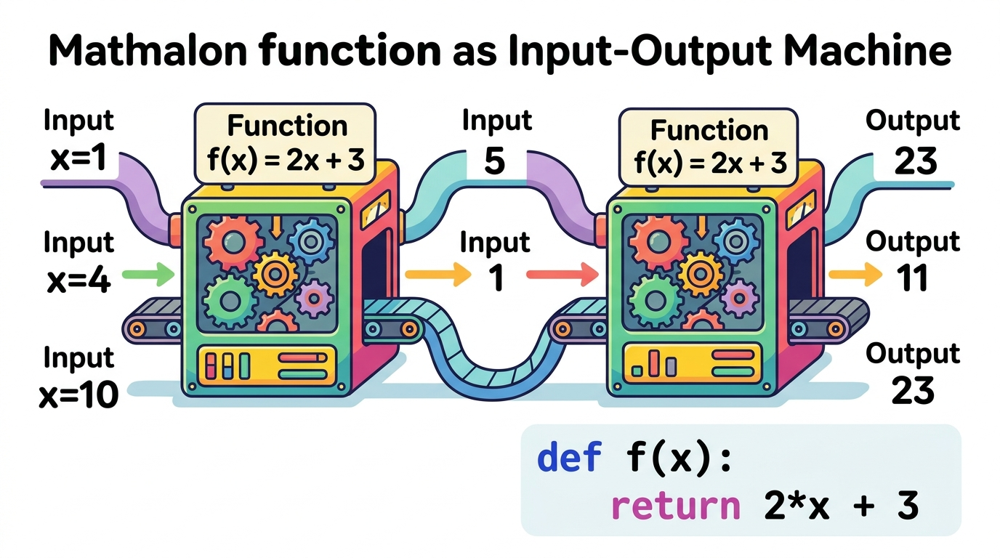
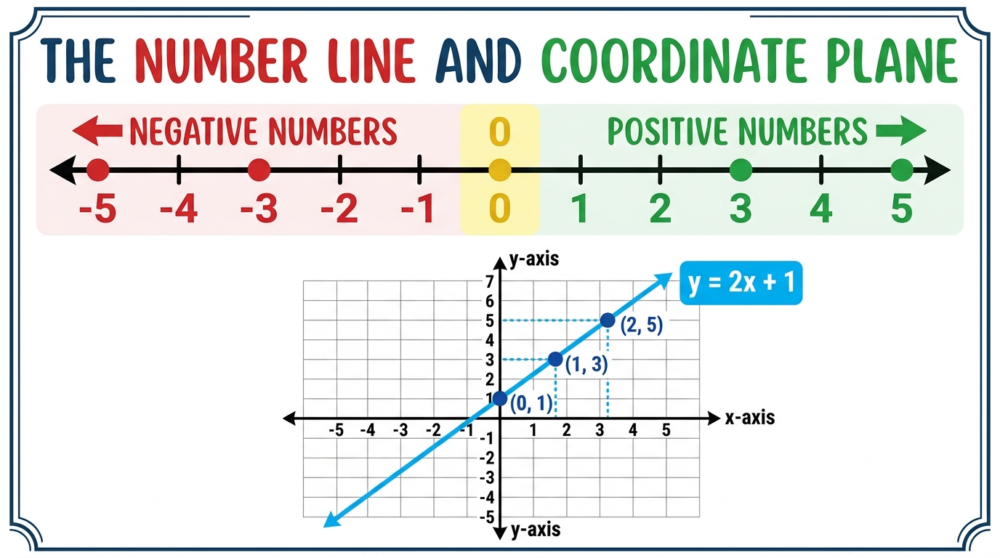
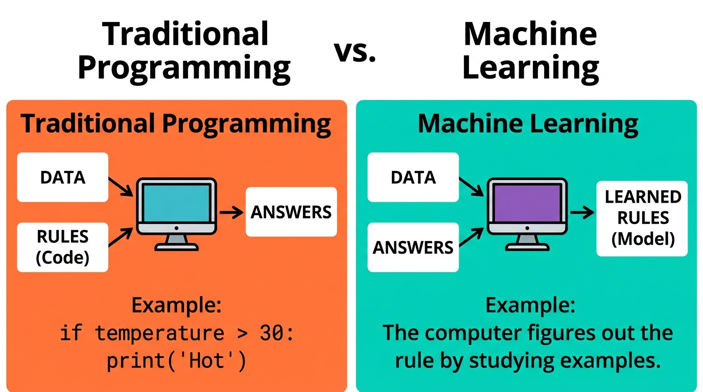
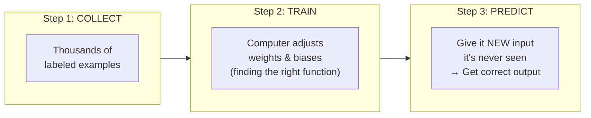

# 🔢 Day 01: Numbers, Variables & Functions
## The Language Computers Speak

[](../../README.md)
[](../../README.md)
[](../../README.md)
[](../../README.md)

---

## 📌 What Will You Learn Today?

Today is the **very first brick** of your journey to understanding Generative AI. No prior math knowledge is needed. If you know how to write a simple Python program, you're ready.

By the end of today, you will understand:
- ✅ Why computers can ONLY understand numbers (not words, images, or sounds).
- ✅ What a **variable** is — and why it's just a labeled container.
- ✅ What a **function** is — the fundamental building block of ALL AI.
- ✅ How to plot a function as a graph (a picture showing how inputs relate to outputs).
- ✅ How **AI is fundamentally just finding the right function** that maps inputs to outputs.

---

## 🗺️ Table of Contents

- [1. The Fundamental Truth: Computers Only Understand Numbers](#1-the-fundamental-truth-computers-only-understand-numbers)
- [2. Variables — Labeled Containers for Numbers](#2-variables--labeled-containers-for-numbers)
- [3. Basic Arithmetic — The Operations Computers Do](#3-basic-arithmetic--the-operations-computers-do)
- [4. Functions — The Input-Output Machine](#4-functions--the-input-output-machine)
- [5. Functions With Multiple Inputs](#5-functions-with-multiple-inputs)
- [6. Graphing Functions — Seeing the Pattern](#6-graphing-functions--seeing-the-pattern)
- [7. The Big Picture: Why Does This Matter for AI?](#7-the-big-picture-why-does-this-matter-for-ai)
- [8. Key Takeaways](#8-key-takeaways)
- [9. Practice Exercises](#9-practice-exercises)

---

# 1. The Fundamental Truth: Computers Only Understand Numbers

Let's start with the most basic truth in all of computer science:

> **A computer is a calculator. That's it. It can only add, subtract, multiply, and divide numbers. Nothing else.**

When you see a photo on your screen, the computer doesn't "see" a sunset. It sees a giant grid of numbers — each number representing how bright a tiny dot (pixel) is.

When you type the word `"hello"`, the computer doesn't "read" it. Internally, it stores the number `104` for `h`, `101` for `e`, `108` for `l`, `108` for `l`, and `111` for `o`.

When Spotify plays music, the computer doesn't "hear" a melody. It rapidly reads thousands of numbers per second that describe the vibration of your speaker.

### Real-World Analogy: The Translation Problem

Imagine you're a shopkeeper in India who only speaks Telugu. A tourist walks in who only speaks Japanese. You cannot communicate directly. You need a **translator** who converts Japanese words into Telugu words.

In AI, the same problem exists:
- **Humans** think in words, images, sounds, and emotions.
- **Computers** think ONLY in numbers.

**AI is the translator.** It converts human things (photos, sentences, voice recordings) into numbers, does math on those numbers, and then converts the results back into human things (answers, images, speech).

```
Human World                          Computer World
───────────                          ──────────────
Photo of a cat     ──(translate)──>  [[0.2, 0.8, 0.1], [0.9, 0.3, 0.7], ...]
The word "hello"   ──(translate)──>  [104, 101, 108, 108, 111]
A 3-second audio   ──(translate)──>  [0.02, -0.05, 0.08, 0.12, -0.03, ...]
```

### Let's Verify This in Python

```python
# Computers store letters as numbers internally
word = "hello"

for letter in word:
    number = ord(letter)  # ord() gives the number code for a character
    print(f"Letter '{letter}' is stored as number: {number}")
```

**Output:**
```
Letter 'h' is stored as number: 104
Letter 'e' is stored as number: 101
Letter 'l' is stored as number: 108
Letter 'l' is stored as number: 108
Letter 'o' is stored as number: 111
```

See? Even the word "hello" is just a list of numbers: `[104, 101, 108, 108, 111]`.

---

# 2. Variables — Labeled Containers for Numbers

A **variable** is simply a **named container** that holds a value. Think of it as a labeled box.

### Real-World Analogy: Kitchen Jars

In your kitchen, you have jars labeled "Sugar", "Salt", "Rice". The label tells you what's inside, and you can change the contents anytime.

```
┌─────────┐    ┌─────────┐    ┌─────────┐
│  Sugar  │    │  Salt   │    │  Rice   │
│         │    │         │    │         │
│  500g   │    │  200g   │    │  1000g  │
└─────────┘    └─────────┘    └─────────┘
```

In Python, variables work exactly the same way:

```python
# Creating variables (labeled containers)
sugar = 500        # The jar labeled "sugar" contains 500
salt = 200         # The jar labeled "salt" contains 200
rice = 1000        # The jar labeled "rice" contains 1000

# You can use them in calculations
total_weight = sugar + salt + rice
print(f"Total weight: {total_weight}g")  # Output: Total weight: 1700g

# You can change what's inside
sugar = 300        # Replaced the sugar amount
print(f"Sugar now: {sugar}g")            # Output: Sugar now: 300g
```

### Types of Values a Variable Can Hold

| Python Type | What It Stores | Example | Real-World Analogy |
| :--- | :--- | :--- | :--- |
| `int` | Whole numbers (no decimal) | `age = 25` | Counting items: "I have 3 books" |
| `float` | Decimal numbers | `price = 99.99` | Measuring: "Temperature is 36.6°C" |
| `str` | Text (string of characters) | `name = "Srinu"` | A label or a name tag |
| `bool` | True or False | `is_raining = True` | A light switch: ON or OFF |
| `list` | Ordered collection of values | `scores = [85, 92, 78]` | A shopping list of items |

### Why Variables Matter in AI

In AI, EVERY piece of information is stored as a variable:
- A model's **weight** (importance setting) is a variable: `weight = 0.75`
- A model's **bias** (default offset) is a variable: `bias = 0.3`
- A model's **prediction** is a variable: `prediction = weight * input + bias`

---

# 3. Basic Arithmetic — The Operations Computers Do

Computers do math incredibly fast, but they can only do these basic operations:

```python
# The 6 basic math operations in Python
a = 10
b = 3

print(f"Addition:       {a} + {b} = {a + b}")       # 13
print(f"Subtraction:    {a} - {b} = {a - b}")       # 7
print(f"Multiplication: {a} × {b} = {a * b}")       # 30
print(f"Division:       {a} ÷ {b} = {a / b}")       # 3.333...
print(f"Power:          {a} ^ {b} = {a ** b}")       # 1000 (10×10×10)
print(f"Remainder:      {a} % {b} = {a % b}")       # 1
```

### Real-World Example: Calculating Your Electricity Bill

```python
# Real-world math: Calculating electricity bill
units_consumed = 250          # How many units you used this month
rate_per_unit = 5.50          # Cost per unit in ₹
fixed_charge = 100            # Monthly fixed charge in ₹

# The formula
total_bill = (units_consumed * rate_per_unit) + fixed_charge

print(f"Units consumed: {units_consumed}")
print(f"Rate per unit:  ₹{rate_per_unit}")
print(f"Usage charge:   ₹{units_consumed * rate_per_unit}")
print(f"Fixed charge:   ₹{fixed_charge}")
print(f"──────────────────────")
print(f"Total bill:     ₹{total_bill}")
```

**Output:**
```
Units consumed: 250
Rate per unit:  ₹5.5
Usage charge:   ₹1375.0
Fixed charge:   ₹100
──────────────────────
Total bill:     ₹1475.0
```

### The Key Insight

Everything the computer does — from calculating your bill to generating a ChatGPT response — is built from these 6 simple operations applied millions of times per second.

> **An AI model making a prediction is just:** `result = (input × weight) + bias`
>
> That's multiplication and addition. The same math you just did for the electricity bill!

---

# 4. Functions — The Input-Output Machine

A **function** is the single most important concept in all of programming AND all of AI. Let's understand it step by step.

### Real-World Analogy: A Juice Machine

Think of a juice machine at a restaurant:

```
┌──────────────────────────────────────────────────────┐
│                                                      │
│   INPUT                MACHINE              OUTPUT   │
│   ─────                ───────              ──────   │
│                                                      │
│   🍊 Orange    ───►  [Juice Machine]  ───►  🥤 OJ   │
│   🍎 Apple     ───►  [Juice Machine]  ───►  🥤 AJ   │
│   🥕 Carrot    ───►  [Juice Machine]  ───►  🥤 CJ   │
│                                                      │
│   Same machine, different input = different output    │
└──────────────────────────────────────────────────────┘
```

A function works the same way:
1. You **put something in** (input).
2. The function **does some work** (processing).
3. You **get something back** (output).

### Functions in Math vs. Python

Here's a simple function: **"Double the input and add 3"**

In math notation, this is written as:
```
f(x) = 2x + 3
```

In Python, this is written as:
```python
def f(x):
    return 2 * x + 3
```

**They mean the EXACT SAME THING.** The math version is just shorter.



### Let's Run It

```python
def f(x):
    """Double the input and add 3"""
    return 2 * x + 3

# Let's try different inputs
print(f"f(1)  = {f(1)}")    # 2×1 + 3 = 5
print(f"f(4)  = {f(4)}")    # 2×4 + 3 = 11
print(f"f(10) = {f(10)}")   # 2×10 + 3 = 23
print(f"f(0)  = {f(0)}")    # 2×0 + 3 = 3
print(f"f(-2) = {f(-2)}")   # 2×(-2) + 3 = -1
```

**Output:**
```
f(1)  = 5
f(4)  = 11
f(10) = 23
f(0)  = 3
f(-2) = -1
```

### Breaking Down the Math Notation

Let's decode the scary-looking math notation `f(x) = 2x + 3` piece by piece:

| Symbol | What It Means | Python Equivalent |
| :---: | :--- | :--- |
| `f` | The name of the function | `def f` |
| `(x)` | The function takes one input called `x` | `def f(x):` |
| `=` | "is defined as" or "returns" | `return` |
| `2x` | Multiply `x` by 2 | `2 * x` |
| `+ 3` | Then add 3 | `+ 3` |

> **Key Insight:** Every time you see a math formula in an AI paper or tutorial, it's just describing a Python function. The math symbol `f(x) = ...` is identical to `def f(x): return ...`

---

# 5. Functions With Multiple Inputs

Real-world problems rarely depend on just one thing. Most functions take **multiple inputs**.

### Real-World Example: Predicting House Price

What determines the price of a house? Multiple factors:
- Number of bedrooms
- Square footage (area)
- Age of the house

A simple prediction function might look like:

```
price(bedrooms, area, age) = 500000 × bedrooms + 3000 × area - 10000 × age + 1000000
```

In Python:
```python
def predict_price(bedrooms, area, age):
    """
    Predict house price based on 3 features.
    
    bedrooms: Number of bedrooms (e.g., 3)
    area:     Square footage (e.g., 1500)
    age:      Age of house in years (e.g., 10)
    """
    price = (500000 * bedrooms) + (3000 * area) + (-10000 * age) + 1000000
    return price

# Let's predict some prices
house_1 = predict_price(bedrooms=2, area=1000, age=20)
house_2 = predict_price(bedrooms=3, area=1500, age=5)
house_3 = predict_price(bedrooms=4, area=2500, age=1)

print(f"2-BHK, 1000sqft, 20yr old:  ₹{house_1:,.0f}")
print(f"3-BHK, 1500sqft, 5yr old:   ₹{house_2:,.0f}")
print(f"4-BHK, 2500sqft, 1yr old:   ₹{house_3:,.0f}")
```

**Output:**
```
2-BHK, 1000sqft, 20yr old:  ₹4,800,000
3-BHK, 1500sqft, 5yr old:   ₹6,950,000
4-BHK, 2500sqft, 1yr old:   ₹10,490,000
```

### The Numbers 500000, 3000, -10000 Are Called "Weights"

Notice the numbers we multiplied with each input:

| Input (Feature) | Weight (Multiplier) | Meaning |
| :--- | :--- | :--- |
| `bedrooms` | `500000` | Each extra bedroom adds ₹5 lakh to the price |
| `area` | `3000` | Each extra square foot adds ₹3000 to the price |
| `age` | `-10000` | Each year of age REDUCES the price by ₹10000 (negative because older = cheaper) |

The **weight** is a number that controls **how important** each input is. A big weight means "this input matters a lot." A small weight means "this input barely matters."

> **Here's the mind-blowing connection to AI:**
>
> When you hear that "GPT-4 has 1.8 trillion parameters" — those parameters are just **1.8 trillion weights** (numbers) inside a massive function. Training the AI means finding the right value for each of those 1.8 trillion numbers!

### The Number 1000000 Is Called the "Bias"

The `+ 1000000` at the end is the **bias** — a starting baseline. Even a house with 0 bedrooms, 0 area, and 0 age would still have a base value of ₹10 lakh (the land itself has value).

```
AI Prediction = (input₁ × weight₁) + (input₂ × weight₂) + ... + bias
```

That's it. That's what every single neuron in every AI model does.

---

# 6. Graphing Functions — Seeing the Pattern

A **graph** is a picture that shows how the output of a function changes as you change the input. It's incredibly powerful because humans understand visual patterns much faster than tables of numbers.



### How to Read a Graph

A graph has two axes (directions):
- **X-axis (horizontal)**: The INPUT values (what you put into the function).
- **Y-axis (vertical)**: The OUTPUT values (what the function gives back).

Every point on the graph represents one `(input, output)` pair.

### Let's Plot Our Function in Python

```python
# Let's graph the function f(x) = 2x + 3

# Step 1: Create a list of input values
inputs = [-3, -2, -1, 0, 1, 2, 3, 4, 5]

# Step 2: Calculate the output for each input
outputs = []
for x in inputs:
    y = 2 * x + 3
    outputs.append(y)
    print(f"Input x = {x:>2}  →  Output y = {y:>2}")
```

**Output:**
```
Input x = -3  →  Output y = -3
Input x = -2  →  Output y = -1
Input x = -1  →  Output y =  1
Input x =  0  →  Output y =  3
Input x =  1  →  Output y =  5
Input x =  2  →  Output y =  7
Input x =  3  →  Output y =  9
Input x =  4  →  Output y = 11
Input x =  5  →  Output y = 13
```

### What Do These Points Look Like?

```
    y
   13│                              ●  (5, 13)
   11│                          ●      (4, 11)
    9│                      ●          (3, 9)
    7│                  ●              (2, 7)
    5│              ●                  (1, 5)
    3│          ●                      (0, 3)
    1│      ●                          (-1, 1)
   -1│  ●                             (-2, -1)
   -3●                                (-3, -3)
    ─┼──┼──┼──┼──┼──┼──┼──┼──┼──► x
     -3 -2 -1  0  1  2  3  4  5
```

Notice: All the points form a **straight line**! That's because `f(x) = 2x + 3` is a **linear function** (the word "linear" literally means "line-shaped").

### The Two Magic Numbers in a Line

Every straight line is defined by just two numbers:

| Number | Name | What It Controls | In `f(x) = 2x + 3` |
| :--- | :--- | :--- | :---: |
| **2** | Slope (steepness) | How fast the line goes up. A slope of 2 means "for every 1 step right, go 2 steps up." | `2` |
| **3** | Intercept (starting point) | Where the line crosses the y-axis (the output when input is 0). | `3` |

### Real-World Analogy: Auto-Rickshaw Fare

```
fare = 2.5 × distance_km + 30
       ───                   ──
       slope                intercept
       (₹2.50 per km)       (₹30 base fare)
```

- The **slope** (2.5) is the per-km charge.
- The **intercept** (30) is the base fare you pay even if you travel 0 km (just for sitting in the auto!).

```python
def auto_fare(distance_km):
    return 2.5 * distance_km + 30

print(f"2 km ride:  ₹{auto_fare(2)}")    # ₹35.0
print(f"5 km ride:  ₹{auto_fare(5)}")    # ₹42.5
print(f"10 km ride: ₹{auto_fare(10)}")   # ₹55.0
print(f"20 km ride: ₹{auto_fare(20)}")   # ₹80.0
```

---

# 7. The Big Picture: Why Does This Matter for AI?

Now let's connect everything we learned today to AI and Generative AI.

### AI Is Just Function-Finding



Here's the fundamental difference between traditional programming and AI:

### Traditional Programming (What You've Done Before)

**YOU write the function.** You decide the rules.

```python
# YOU decide the rules manually
def is_spam(email_text):
    spam_words = ["win", "prize", "free", "lottery", "click here"]
    for word in spam_words:
        if word in email_text.lower():
            return True
    return False

print(is_spam("You WIN a FREE prize!"))     # True
print(is_spam("Meeting at 3pm tomorrow"))   # False
```

**Problem:** What about sneaky spam that doesn't use these exact words? You'd have to keep adding rules forever. And what about detecting spam in Telugu or Japanese? You can't manually write rules for every language.

### Machine Learning (How AI Does It)

**The COMPUTER finds the function.** You give it examples, and it figures out the rules by itself.

```python
# Instead of writing rules, you give EXAMPLES:
# 
# Email: "You WIN a FREE prize!"       → Spam (True)
# Email: "Meeting at 3pm tomorrow"     → Not Spam (False)
# Email: "CLICK HERE for $$$$"         → Spam (True)
# Email: "Hi mom, coming for dinner"   → Not Spam (False)
# Email: "Congratulations! You won!"   → Spam (True)
# Email: "Project deadline extended"   → Not Spam (False)
# ... (thousands more examples)
#
# The computer studies these examples and DISCOVERS the rules itself.
# It finds a function f(email) that correctly classifies new emails
# it has NEVER seen before!
```

### The Complete AI Pipeline (Preview)



Today, we learned the building blocks:
1. **Numbers** → Computers only understand numbers.
2. **Variables** → Named containers holding numbers (weights, biases, inputs).
3. **Functions** → Input-output machines that transform data.
4. **Graphs** → Visual pictures showing function behavior.

Tomorrow (Day 02), we'll learn about **Vectors** — the data structure that powers ALL of AI. A vector is just a Python list of numbers, and it's how AI represents everything: words, images, sounds, and user preferences.

---

# 8. Key Takeaways

```
┌────────────────────────────────────────────────────────────────────┐
│                     DAY 01 CHEAT SHEET                             │
├────────────────────────────────────────────────────────────────────┤
│                                                                    │
│  🔢 Computers only understand NUMBERS                              │
│     • Text, images, audio → all converted to numbers internally    │
│                                                                    │
│  📦 A VARIABLE is a labeled container                              │
│     • age = 25    (the container "age" holds the number 25)        │
│                                                                    │
│  ⚙️ A FUNCTION is an input-output machine                          │
│     • Math:   f(x) = 2x + 3                                       │
│     • Python: def f(x): return 2 * x + 3                          │
│     • Same thing, different notation!                              │
│                                                                    │
│  📊 A GRAPH is a picture of a function                             │
│     • x-axis = input, y-axis = output                              │
│     • Each point = one (input, output) pair                        │
│                                                                    │
│  🎯 AI = Finding the right function                                │
│     • Traditional: Human writes the function (rules)               │
│     • Machine Learning: Computer discovers the function            │
│       by studying examples                                         │
│                                                                    │
│  ⚖️ WEIGHTS = how important each input is                          │
│     • output = (input × weight) + bias                             │
│     • GPT-4 has ~1.8 trillion weights!                             │
│                                                                    │
└────────────────────────────────────────────────────────────────────┘
```

---

# 9. Practice Exercises

Try these in your Python IDE or Jupyter Notebook:

<details>
<summary><b>🏋️ Exercise 1: Temperature Converter</b></summary>
<br/>

Write a function that converts Celsius to Fahrenheit.

**The formula:** `fahrenheit = (celsius × 9/5) + 32`

```python
def celsius_to_fahrenheit(celsius):
    # YOUR CODE HERE
    pass

# Test it:
# celsius_to_fahrenheit(0)   should return 32.0
# celsius_to_fahrenheit(100) should return 212.0
# celsius_to_fahrenheit(37)  should return 98.6
```

**Solution:**
```python
def celsius_to_fahrenheit(celsius):
    return (celsius * 9/5) + 32

print(celsius_to_fahrenheit(0))    # 32.0
print(celsius_to_fahrenheit(100))  # 212.0
print(celsius_to_fahrenheit(37))   # 98.6
```
</details>

<details>
<summary><b>🏋️ Exercise 2: Simple AI Prediction</b></summary>
<br/>

A pizza shop wants to predict how many pizzas they'll sell based on temperature.
They noticed: On hotter days, people order more cold drinks and fewer pizzas.

Write a function: `pizzas_sold = (-2 × temperature) + 100`

```python
def predict_pizzas(temperature):
    # YOUR CODE HERE
    pass

# Test it:
# predict_pizzas(10)  → 80 pizzas (cold day, people want warm food!)
# predict_pizzas(25)  → 50 pizzas (normal day)
# predict_pizzas(40)  → 20 pizzas (hot day, nobody wants pizza!)
```

**Solution:**
```python
def predict_pizzas(temperature):
    return (-2 * temperature) + 100

print(f"10°C day: {predict_pizzas(10)} pizzas")   # 80
print(f"25°C day: {predict_pizzas(25)} pizzas")   # 50
print(f"40°C day: {predict_pizzas(40)} pizzas")   # 20
```
</details>

<details>
<summary><b>🏋️ Exercise 3: Multi-Input Function</b></summary>
<br/>

An e-commerce company wants to predict delivery time (in hours) based on:
- `distance` (in km)
- `weight` (in kg)
- `is_express` (True/False → 1/0)

Function: `time = (0.5 × distance) + (0.2 × weight) - (3 × is_express) + 2`

```python
def predict_delivery_time(distance, weight, is_express):
    # YOUR CODE HERE
    pass

# Test it:
# predict_delivery_time(10, 5, False)  → 8.0 hours
# predict_delivery_time(10, 5, True)   → 5.0 hours (express saves 3 hours!)
# predict_delivery_time(50, 20, False) → 31.0 hours
```

**Solution:**
```python
def predict_delivery_time(distance, weight, is_express):
    express_value = 1 if is_express else 0
    time = (0.5 * distance) + (0.2 * weight) - (3 * express_value) + 2
    return time

print(f"10km, 5kg, Standard: {predict_delivery_time(10, 5, False)} hours")  # 8.0
print(f"10km, 5kg, Express:  {predict_delivery_time(10, 5, True)} hours")   # 5.0
print(f"50km, 20kg, Standard: {predict_delivery_time(50, 20, False)} hours") # 31.0
```
</details>

<details>
<summary><b>🏋️ Exercise 4: Understanding Weights and Bias</b></summary>
<br/>

Look at this prediction function:

```python
def predict_exam_score(hours_studied, hours_slept, cups_of_coffee):
    score = (8 * hours_studied) + (5 * hours_slept) + (1 * cups_of_coffee) + 10
    return score
```

**Questions:**
1. Which input has the HIGHEST weight? What does that mean in real life?
2. Which input has the LOWEST weight? What does that mean?
3. What is the bias? What does it represent?
4. If you studied 0 hours, slept 0 hours, and drank 0 coffee, what would the predicted score be?

**Answers:**
1. `hours_studied` has weight `8` (highest) → Studying has the MOST impact on your score.
2. `cups_of_coffee` has weight `1` (lowest) → Coffee barely helps your exam score.
3. Bias = `10` → Even with no studying, no sleep, and no coffee, you'd still get 10 marks (maybe from guessing or previous knowledge).
4. `predict_exam_score(0, 0, 0)` = `(8×0) + (5×0) + (1×0) + 10` = **10**
</details>

---

## ⏭️ What's Next: Day 02 — Vectors (Lists of Numbers)

Tomorrow, you'll learn:
- A **vector** is just a Python list of numbers: `[0.5, -0.3, 0.8, 1.2]`.
- How to add, subtract, and scale vectors.
- **Why vectors are the single most important data structure in ALL of AI** — they are how AI represents words, images, sounds, and everything else.

---

<p align="center">
  <b>🌟 End of Day 01 — You just learned the language that ALL AI speaks! 🌟</b>
</p>
