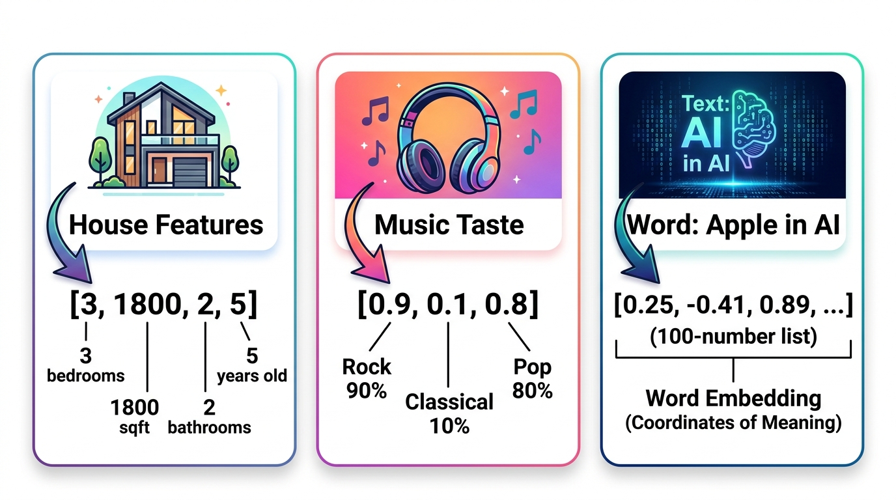
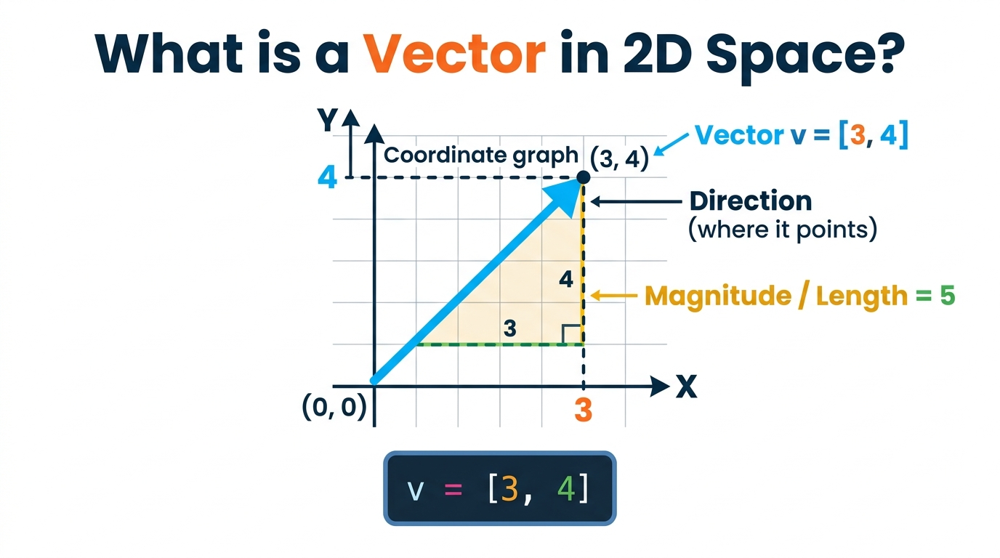
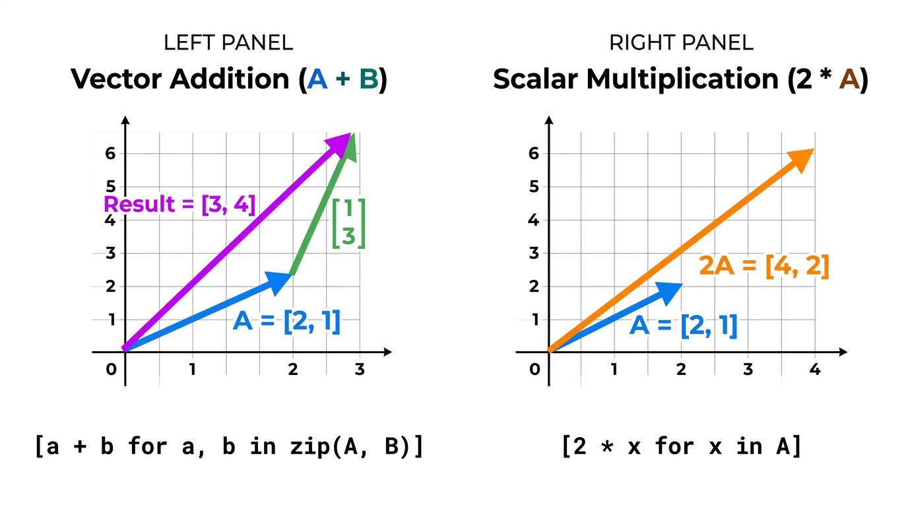
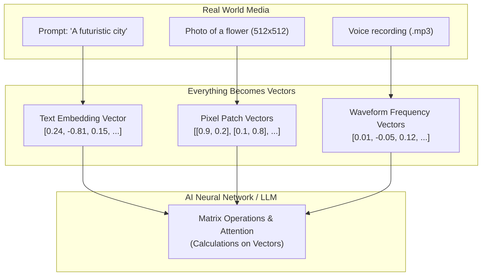

# 🏹 Day 02: Vectors — Lists of Numbers
## The Universal Building Block of All AI


| ⬅️ Previous Day | 📚 Course Hub | ➡️ Next Day |
|:---|:---:|---:|
| [← Day 01: Numbers, Variables & Functions](../Day_01_Numbers_Variables_Functions/Day_01_Numbers_Variables_Functions.md) | [All 50 Days Overview](../../README.md) | [Day 03: Matrices →](../Day_03_Matrices/Day_03_Matrices.md) |

[](../../README.md)
[](../../README.md)
[](../../README.md)
[](../Day_01_Numbers_Variables_Functions/Day_01_Numbers_Variables_Functions.md)

---

## 📌 What Will You Learn Today?

Yesterday, on [Day 01](../Day_01_Numbers_Variables_Functions/Day_01_Numbers_Variables_Functions.md), we discovered the foundational truth of AI: **computers only understand numbers**.

Today, we take the next big step. A single number can only describe one thing (e.g., `age = 25` or `temperature = 30`). But what if you want to describe a **house**, a **customer**, a **sound**, or the word **"Apple"**? 

You need a **collection of numbers in a specific order**. In computer science, we call this a `list`. In AI and mathematics, we call this a **vector**.

By the end of today, you will understand:
- ✅ What a **vector** is (and why it is just a Python list).
- ✅ How real-world objects, songs, people, and words become vectors.
- ✅ What **dimensions** mean in plain English (1D, 2D, 3D, and 1536D in modern LLMs).
- ✅ How to perform **Vector Addition** and **Vector Subtraction** with Python.
- ✅ How to perform **Scalar Multiplication** (stretching, shrinking, or flipping vectors).
- ✅ What the **Magnitude** (length/norm) of a vector is and how to calculate it.
- ✅ Why vectors are the core data structure behind **ChatGPT, Claude, and Midjourney**.

---

## 🗺️ Table of Contents

- [1. Demystifying the Word "Vector"](#1-demystifying-the-word-vector)
- [2. How Real-World Objects Become Vectors](#2-how-real-world-objects-become-vectors)
- [3. What Does "Dimension" Mean?](#3-what-does-dimension-mean)
- [4. Visualizing Vectors: From Coordinates to Arrows](#4-visualizing-vectors-from-coordinates-to-arrows)
- [5. Vector Addition: Combining Forces & Profiles](#5-vector-addition-combining-forces--profiles)
- [6. Scalar Multiplication: Scaling Up and Down](#6-scalar-multiplication-scaling-up-and-down)
- [7. Vector Subtraction: Finding Direction and Difference](#7-vector-subtraction-finding-direction-and-difference)
- [8. Magnitude: Calculating Vector Length in Python](#8-magnitude-calculating-vector-length-in-python)
- [9. Why Vectors Are the Backbone of Gen AI](#9-why-vectors-are-the-backbone-of-gen-ai)
- [10. Key Takeaways & Cheat Sheet](#10-key-takeaways--cheat-sheet)
- [11. Practice Exercises with Solutions](#11-practice-exercises-with-solutions)

---

# 1. Demystifying the Word "Vector"

Math textbooks love to make simple things look intimidating. They will define a vector as:

$$\vec{v} \in \mathbb{R}^n$$

Ignore that scary formula! Here is what a vector actually is to a software engineer:

> **A vector is simply an ordered Python list of numbers.**
>
> That's it. Nothing more, nothing less.

```python
# A vector is literally just this:
v = [3, 4]

# Or this:
user_profile = [0.85, 0.12, 0.95]

# Or a 1536-number list from OpenAI's embedding model:
word_embedding = [0.0023, -0.0154, 0.0821, ..., -0.0042]
```

### Why Do We Call It "Ordered"?

Because **the position of each number has a specific meaning**. 

If you swap the order of numbers in a vector, you completely change what it describes!

```python
# Suppose our convention is: [bedrooms, bathrooms, area_sqft]
house_a = [3, 2, 1500]  # 3 bedrooms, 2 bathrooms, 1500 sq ft (Normal house!)
house_b = [1500, 2, 3]  # 1500 bedrooms, 2 bathrooms, 3 sq ft (A bizarre nightmare!)
```

The order matters. The first slot means *bedrooms*, the second means *bathrooms*, and the third means *area*.

---

# 2. How Real-World Objects Become Vectors

How does an AI model recommend a song on Spotify, match a movie on Netflix, or understand a sentence in ChatGPT? 

It converts the real-world object into a **feature vector**.



### Real-World Example 1: A House Profile

Imagine an estate agent app. To compare two houses, we convert each house into a list of measurements:

```python
# Feature slots: [bedrooms, area_sqft, bathrooms, age_years]
villa = [4, 3200, 3, 2]
apartment = [2, 950, 1, 12]
studio = [1, 450, 1, 5]

print(f"Villa vector:      {villa}")
print(f"Apartment vector:  {apartment}")
print(f"Studio vector:     {studio}")
```

### Real-World Example 2: A User's Music Taste (Spotify)

How does Spotify know you will like a song? It creates a taste vector for you, scoring genres from `0.0` (hate) to `1.0` (love):

```python
# Feature slots: [Rock, Classical, Pop, HipHop, Jazz]
rahul_taste = [0.90, 0.10, 0.85, 0.70, 0.20]
sneha_taste = [0.15, 0.85, 0.30, 0.10, 0.90]

print(f"Rahul prefers Rock & Pop: {rahul_taste}")
print(f"Sneha prefers Classical & Jazz: {sneha_taste}")
```

### Real-World Example 3: Words as Vectors (Embeddings Preview)

Computers cannot read the words `"Apple"`, `"King"`, or `"Mango"`. So AI models assign each word a list of numbers representing its meaning:

```python
# Simplified concept: [fruitiness, royalty, tech_company, cuteness]
apple_word = [0.95, 0.00, 0.98, 0.10]
mango_word = [0.99, 0.00, 0.00, 0.10]
king_word  = [0.00, 0.99, 0.00, 0.05]
```

Because `apple_word` and `mango_word` both have high numbers in the `fruitiness` slot, the AI instantly knows **Apple and Mango are related**, even though they are spelled completely differently!

---

# 3. What Does "Dimension" Mean?

You often hear AI researchers say:
> *"This model creates 768-dimensional vectors."*
> *"OpenAI embeddings have 1536 dimensions."*

What does "dimensional" actually mean? 

> **The dimension of a vector is simply the count of numbers inside the list!**
>
> In Python: `dimension = len(vector)`

| Dimension | Python Representation | What It Can Represent |
| :---: | :--- | :--- |
| **1D** | `[25]` | A single measurement (e.g. Temperature) |
| **2D** | `[10, 20]` | A point on a flat map (e.g. X, Y coordinate) |
| **3D** | `[12.5, 77.2, 920]` | A drone in 3D space (Latitude, Longitude, Altitude) |
| **4D** | `[3, 1800, 2, 5]` | A house with 4 features |
| **768D** | `[0.02, -0.15, ..., 0.91]` | BERT model's representation of a single word |
| **1536D** | `[0.003, 0.021, ..., -0.012]` | OpenAI's `text-embedding-3-small` vector |

```python
v1 = [50]                         # 1-dimensional (1 element)
v2 = [3, 4]                       # 2-dimensional (2 elements)
v3 = [10, 20, 30]                 # 3-dimensional (3 elements)
v4 = [3, 1800, 2, 5]              # 4-dimensional (4 elements)

print(f"v1 has {len(v1)} dimension")
print(f"v2 has {len(v2)} dimensions")
print(f"v3 has {len(v3)} dimensions")
print(f"v4 has {len(v4)} dimensions")
```

When someone says: *"We are searching in 1536-dimensional space,"* do not panic. It simply means: *"We have lists of 1536 numbers, and we are comparing them."*

---

# 4. Visualizing Vectors: From Coordinates to Arrows

When a vector has 2 numbers (2D), we can draw it on regular graph paper!



A 2D vector `v = [3, 4]` can be viewed in two identical ways:
1. **As a Coordinate Point**: A location on the grid at `x = 3` and `y = 4`.
2. **As an Arrow (Vector)**: An arrow starting at the origin `(0, 0)` and pointing directly to `(3, 4)`.

### Why the Arrow Matters

An arrow gives us two intuitive pieces of information:
- **Direction**: Where the arrow points (e.g., towards the upper right).
- **Magnitude (Length)**: How long the arrow is (e.g., length is 5 units).

### Real-World Analogy: Walking Directions

Imagine giving directions to someone:
- *"Walk 3 blocks East, then 4 blocks North."*

```
   North (Y)
       ▲
     4 │             🎯 Destination (3, 4)
       │            ↗
     3 │          ↗
       │        ↗   Length = 5
     2 │      ↗
       │    ↗
     1 │  ↗
       ┼──────────────────► East (X)
     (0,0)  1   2   3   4
```

That walk is a vector! `v = [3, 4]`.

---

# 5. Vector Addition: Combining Forces & Profiles

What happens when we add two vectors together?

> **Rule of Vector Addition**: You add the numbers **element-by-element** (the first with the first, the second with the second, and so on).
>
> Both vectors **MUST have the same length (dimension)**.



### The Math & Python Side-by-Side

If Vector $A = [2, 1]$ and Vector $B = [1, 3]$:

$$A + B = [2 + 1, \ 1 + 3] = [3, 4]$$

Let's write this in Python:

```python
# Pure Python using a for loop
A = [2, 1]
B = [1, 3]

result = []
for i in range(len(A)):
    result.append(A[i] + B[i])

print(f"Vector A:        {A}")
print(f"Vector B:        {B}")
print(f"Result (A + B):  {result}")  # [3, 4]
```

### The Clean Pythonic Way (List Comprehension + `zip`)

As a software engineer, you can write this elegantly in one line using Python's `zip()`:

```python
A = [2, 1]
B = [1, 3]

# zip(A, B) pairs up corresponding elements: (2, 1) and (1, 3)
result = [a + b for a, b in zip(A, B)]
print(f"A + B = {result}")  # [3, 4]
```

### Real-World Analogy 1: Connecting Two Walks

If you walk `[2, 1]` (2 miles East, 1 mile North) in the morning, and then walk `[1, 3]` (1 mile East, 3 miles North) in the afternoon:

Your total displacement from where you started is:
`[2 + 1, 1 + 3] = [3, 4]` (3 miles East, 4 miles North).

### Real-World Analogy 2: Updating a User's Taste Profile in AI

Imagine a user has a music preference profile:

```python
# [Rock, Classical, Pop]
current_profile = [0.40, 0.10, 0.50]

# User spends the weekend binge-listening to Classical Mozart music!
new_activity_boost = [0.00, 0.30, 0.05]

# The AI updates their profile:
updated_profile = [curr + boost for curr, boost in zip(current_profile, new_activity_boost)]
print(f"Updated taste profile: {updated_profile}")  # [0.40, 0.40, 0.55]
```

---

# 6. Scalar Multiplication: Scaling Up and Down

What is a **"scalar"**?

> **A "scalar" is just a fancy math term for a single, ordinary number.**
> (e.g., `2`, `0.5`, `-1`, `10`).
>
> We call it a *scalar* because it **scales** (stretches or shrinks) a vector!

### The Rule of Scalar Multiplication

You multiply **every element** in the vector by that single number.

If $v = [2, 1]$ and scalar $k = 2$:

$$k \cdot v = [2 \times 2, \ 2 \times 1] = [4, 2]$$

```python
v = [2, 1]
scalar = 2

# Scale every element by scalar
scaled = [x * scalar for x in v]
print(f"Original vector:  {v}")
print(f"Doubled vector:   {scaled}")  # [4, 2]
```

### What Does It Do Visually?

- Multiplying by `2.0` 👉 **Doubles the length** of the arrow in the same direction.
- Multiplying by `0.5` 👉 **Halves the length** (shrinks it).
- Multiplying by `-1.0` 👉 **Flips the arrow 180°** to point in the opposite direction!

```python
v = [3, 4]

double_v = [x * 2.0  for x in v]   # [6.0, 8.0]   (Stretched)
half_v   = [x * 0.5  for x in v]   # [1.5, 2.0]   (Shrunk)
flip_v   = [x * -1.0 for x in v]   # [-3.0, -4.0] (Opposite direction!)

print(f"Original: {v}")
print(f"Stretched (x2):  {double_v}")
print(f"Shrunk (x0.5):   {half_v}")
print(f"Flipped (x-1):   {flip_v}")
```

### Real-World Analogy: Volume Knob or Recipe Scaling

If a recipe for 1 cake requires:
`cake_recipe = [2_cups_flour, 3_eggs, 1.5_cups_sugar, 1_cup_milk]`

To make **3 cakes** for a party, you scale the recipe vector by scalar `3`:
```python
single_recipe = [2.0, 3.0, 1.5, 1.0]
party_recipe = [item * 3 for item in single_recipe]

print(f"Party recipe: {party_recipe}")  # [6.0, 9.0, 4.5, 3.0]
```

---

# 7. Vector Subtraction: Finding Direction and Difference

What if we want to know the difference between two vectors?

> **Rule of Vector Subtraction**: Subtract element-by-element.
>
> $$A - B = [A_0 - B_0, \ A_1 - B_1, \ \dots]$$

```python
A = [5, 7]
B = [2, 3]

difference = [a - b for a, b in zip(A, B)]
print(f"A - B = {difference}")  # [3, 4]
```

### What Does Vector Subtraction Mean in Practice?

> **$A - B$ represents the step-by-step direction needed to get from point $B$ to point $A$.**

### Real-World Example: GPS Navigation

Suppose your current position is point $B = [2, 3]$ and your goal destination is point $A = [5, 7]$.

How should your car move?
```python
destination = [5, 7]
current_pos = [2, 3]

move_needed = [d - c for d, c in zip(destination, current_pos)]
print(f"To reach destination, move: {move_needed}")  # [3, 4]
# Move 3 units East, 4 units North!
```

### The Famous AI Discovery: Word Math!

In 2013, Google researchers discovered that if you subtract word vectors, you get conceptual directions:

$$\vec{v}_{\text{King}} - \vec{v}_{\text{Man}} + \vec{v}_{\text{Woman}} \approx \vec{v}_{\text{Queen}}$$

- If you take **King**,
- Subtract the concept of **Man** (leaving behind pure "royalty"),
- And add the concept of **Woman**,
- The resulting vector lands right next to **Queen**!

This was the first proof that neural networks truly understand human concepts mathematically through vectors!

---

# 8. Magnitude: Calculating Vector Length in Python

How "big" or "strong" is a vector? We call this its **Magnitude** (or **Norm**).

If a vector is an arrow, the magnitude is simply the **physical length of that arrow**.

### Remember Pythagoras from School?

For a 2D right-angled triangle with sides $x$ and $y$, the hypotenuse length is:

$$\text{Length} = \sqrt{x^2 + y^2}$$

Look at our vector `v = [3, 4]` from earlier:
- $x = 3 \implies 3^2 = 9$
- $y = 4 \implies 4^2 = 16$
- $9 + 16 = 25$
- $\sqrt{25} = 5$

The length of `[3, 4]` is **exactly 5**!

### Does This Work for Any Number of Dimensions?

**YES!** Even for a 1000-dimensional vector, the formula is identical:
1. Square every number in the list.
2. Sum all the squared numbers together.
3. Take the square root of the total sum.

Let's write a reusable Python function:

```python
import math

def vector_magnitude(v):
    """
    Calculate the length (magnitude / Euclidean norm) of any vector.
    Works for 2D, 3D, or 1000D vectors!
    """
    squared_elements = [x ** 2 for x in v]
    sum_of_squares = sum(squared_elements)
    length = math.sqrt(sum_of_squares)
    return length

# Let's test it:
v2d = [3, 4]
print(f"Magnitude of [3, 4]:        {vector_magnitude(v2d):.2f}")  # 5.00

v3d = [1, 2, 2]
# 1^2 + 2^2 + 2^2 = 1 + 4 + 4 = 9 -> sqrt(9) = 3
print(f"Magnitude of [1, 2, 2]:     {vector_magnitude(v3d):.2f}")  # 3.00

# High-dimensional vector:
v5d = [0.2, -0.5, 0.8, -0.1, 0.4]
print(f"Magnitude of 5D vector:     {vector_magnitude(v5d):.4f}")
```

### Normalizing a Vector (Unit Vector)

Often in AI, we don't care how "big" the numbers are; we only care about the **direction** the vector is pointing (e.g. what meaning it has).

To remove the effect of length, we **normalize** the vector by dividing every element by its magnitude. The resulting vector will always have a length of **1.0**:

```python
def normalize_vector(v):
    mag = vector_magnitude(v)
    if mag == 0:
        return v  # Prevent division by zero
    return [x / mag for x in v]

original = [3, 4]
unit_vector = normalize_vector(original)

print(f"Original vector:     {original}")
print(f"Normalized vector:   {unit_vector}")                  # [0.6, 0.8]
print(f"Length of unit vector: {vector_magnitude(unit_vector)}")  # 1.0!
```

---

# 9. Why Vectors Are the Backbone of Gen AI

Why did we spend today learning about vectors?

Because **every single Generative AI system converts EVERYTHING into vectors before processing it**:



1. **In LLMs (ChatGPT, Claude)**:
   - When you type `"What is the capital of France?"`, each word is turned into a vector of 4,096 numbers called an **embedding**.
2. **In Vector Databases (RAG - Day 47)**:
   - Company documents are converted into vectors and stored. When you ask a question, the database finds the vectors that point in the same direction!
3. **In Diffusion Models (Midjourney, Stable Diffusion - Day 43)**:
   - Your text prompt is turned into a guiding vector that steers the noise-removal process to create the final painting.

Without vectors, modern AI literally cannot operate.

---

# 10. Key Takeaways & Cheat Sheet

```
┌────────────────────────────────────────────────────────────────────────┐
│                        DAY 02 CHEAT SHEET                              │
├────────────────────────────────────────────────────────────────────────┤
│                                                                        │
│  🏹 VECTOR = An ordered list of numbers                                │
│     • v = [3, 4]                                                      │
│     • Position matters! Each slot represents a specific feature.       │
│                                                                        │
│  📏 DIMENSION = The count of numbers in the list                       │
│     • len([3, 4]) = 2 dimensions (2D)                                  │
│     • len([0.1, ..., 0.9]) with 1536 items = 1536D                     │
│                                                                        │
│  ➕ VECTOR ADDITION = Element-by-element sum                           │
│     • [a + b for a, b in zip(A, B)]                                   │
│     • Both vectors must have identical lengths!                        │
│                                                                        │
│  🔢 SCALAR MULTIPLICATION = Multiply every item by a single number     │
│     • [x * scalar for x in v]                                         │
│     • Stretches, shrinks, or reverses the arrow.                       │
│                                                                        │
│  ➖ VECTOR SUBTRACTION = Direction from B to A                         │
│     • [a - b for a, b in zip(A, B)]                                   │
│                                                                        │
│  📐 MAGNITUDE (Length) = sqrt(sum of all squared elements)             │
│     • math.sqrt(sum(x**2 for x in v))                                 │
│     • Length of [3, 4] is 5.0                                          │
│                                                                        │
│  🎯 UNIT VECTOR (Normalized) = Vector scaled to have length = 1.0      │
│     • [x / magnitude for x in v]                                      │
│                                                                        │
└────────────────────────────────────────────────────────────────────────┘
```

---

# 11. Practice Exercises with Solutions

Test your understanding with these hands-on coding exercises. Try them yourself before looking at the solutions!

<details>
<summary><b>🏋️ Exercise 1: Build a Vector Addition Function with Safety Check</b></summary>
<br/>

Write a Python function `add_vectors(v1, v2)` that:
1. Checks if `len(v1) == len(v2)`. If not, raises a `ValueError("Vectors must have the same dimension!")`.
2. Returns a new list containing their element-by-element sum.

```python
def add_vectors(v1, v2):
    # YOUR CODE HERE
    pass

# Test cases:
# add_vectors([1, 2, 3], [4, 5, 6])  -> [5, 7, 9]
# add_vectors([1, 2], [3, 4, 5])      -> Should raise ValueError!
```

**Solution:**
```python
def add_vectors(v1, v2):
    if len(v1) != len(v2):
        raise ValueError(f"Dimension mismatch: {len(v1)} != {len(v2)}")
    return [a + b for a, b in zip(v1, v2)]

# Test it:
print(add_vectors([1, 2, 3], [4, 5, 6]))  # [5, 7, 9]

try:
    add_vectors([1, 2], [3, 4, 5])
except ValueError as e:
    print(f"Caught expected error: {e}")
```
</details>

<details>
<summary><b>🏋️ Exercise 2: Shopping Cart as a Vector</b></summary>
<br/>

Suppose you run an online grocery store. 
The items are: `[Apples (kg), Milk (litres), Bread (loaves), Eggs (dozens)]`.

- Price vector: `prices = [120, 60, 40, 90]` (Price per unit in ₹)
- Customer A's order: `cart = [2, 1, 3, 2]`

Write code to calculate the **total bill** by multiplying each quantity with its corresponding price and summing them up.

```python
prices = [120, 60, 40, 90]
cart   = [2, 1, 3, 2]

# YOUR CODE HERE: Calculate total bill
```

**Solution:**
```python
prices = [120, 60, 40, 90]
cart   = [2, 1, 3, 2]

total_bill = sum(p * q for p, q in zip(prices, cart))

print(f"Detailed breakdown:")
items = ["Apples", "Milk", "Bread", "Eggs"]
for item, p, q in zip(items, prices, cart):
    print(f"  {item}: {q} x ₹{p} = ₹{p * q}")

print(f"Total Bill: ₹{total_bill}")  # (2*120) + (1*60) + (3*40) + (2*90) = 240 + 60 + 120 + 180 = ₹600
```
*(Hint: What you just calculated is called the **Dot Product**! We will explore this deeply on Day 05!)*
</details>

<details>
<summary><b>🏋️ Exercise 3: Distance Between Two Customers</b></summary>
<br/>

Two users have movie preference vectors across 3 genres `[Action, Comedy, Horror]` on a scale of 1 to 10:
- `user_a = [9, 2, 8]` (Loves Action & Horror, dislikes Comedy)
- `user_b = [8, 3, 7]` (Very similar taste!)
- `user_c = [1, 9, 2]` (Loves Comedy, dislikes Action & Horror)

Write a function `euclidean_distance(u1, u2)` that calculates the straight-line geometric distance between two users:

$$\text{Distance} = \sqrt{\sum (u1_i - u2_i)^2}$$

```python
import math

def euclidean_distance(u1, u2):
    # YOUR CODE HERE
    pass

# Compare distance(user_a, user_b) vs distance(user_a, user_c)
```

**Solution:**
```python
import math

def euclidean_distance(u1, u2):
    diff_squared = [(a - b) ** 2 for a, b in zip(u1, u2)]
    return math.sqrt(sum(diff_squared))

user_a = [9, 2, 8]
user_b = [8, 3, 7]
user_c = [1, 9, 2]

dist_ab = euclidean_distance(user_a, user_b)
dist_ac = euclidean_distance(user_a, user_c)

print(f"Distance between User A and User B: {dist_ab:.2f}")  # ~1.73 (Close friends!)
print(f"Distance between User A and User C: {dist_ac:.2f}")  # ~12.21 (Total opposites!)
```
*(Notice: Smaller distance = more similar preferences! This is how recommendation systems work!)*
</details>

---

## ⏭️ What's Next: Day 03 — Matrices (2D Lists)

Today, we mastered a single vector: a list of numbers representing **one** object (one house, one user, one word).

Tomorrow on **Day 03**, you'll learn:
- What happens when you stack multiple vectors together? You get a **Matrix** (a table / spreadsheet / 2D list).
- Why an entire dataset of 10,000 houses is a matrix.
- Why every digital photo on your phone is a matrix of pixel numbers.
- How to manipulate rows and columns using plain Python lists.

---

<p align="center">
  <b>🌟 End of Day 02 — You've mastered Vectors, the universal currency of AI! 🌟</b>
</p>


---

## 🧭 Navigation & Next Steps

| ⬅️ Previous Day | 📚 Course Hub | ➡️ Next Day |
|:---|:---:|---:|
| [← Day 01: Numbers, Variables & Functions](../Day_01_Numbers_Variables_Functions/Day_01_Numbers_Variables_Functions.md) | [All 50 Days Overview](../../README.md) | [Day 03: Matrices →](../Day_03_Matrices/Day_03_Matrices.md) |
