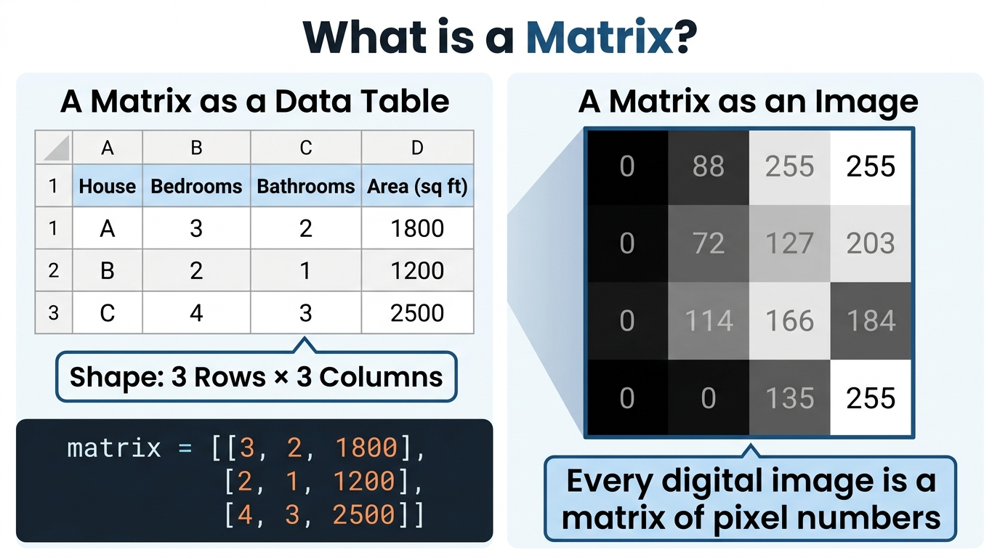
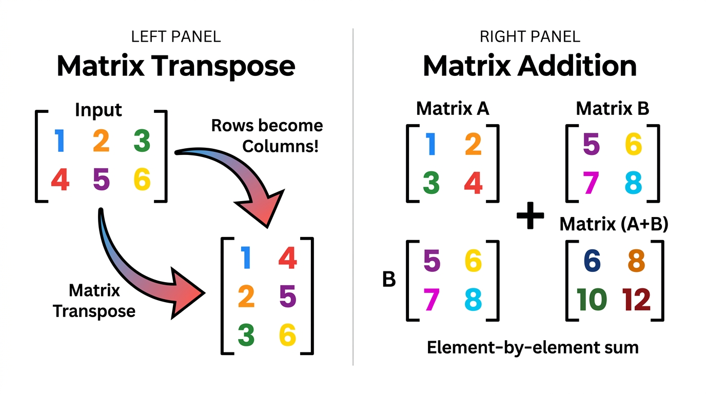
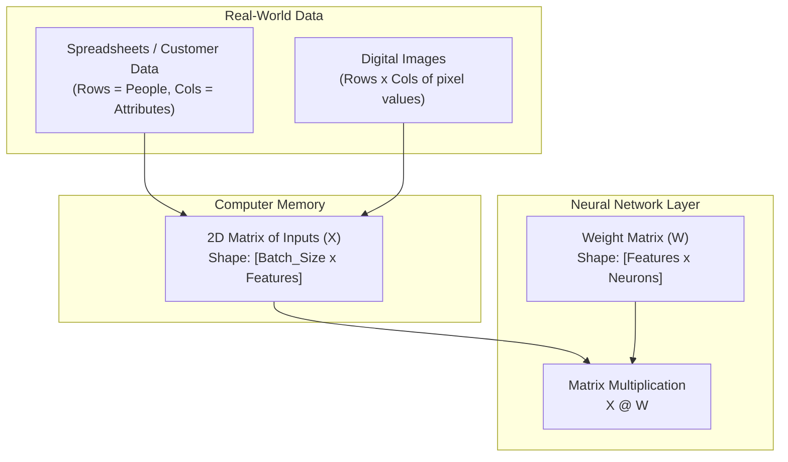

# 📊 Day 03: Matrices — Tables of Numbers
## 2D Lists: How AI Stores Datasets, Images, and Weights


| ⬅️ Previous Day | 📚 Course Hub | ➡️ Next Day |
|:---|:---:|---:|
| [← Day 02: Vectors](../Day_02_Vectors/Day_02_Vectors.md) | [All 50 Days Overview](../../README.md) | [Day 04: Matrix Multiplication →](../Day_04_Matrix_Multiplication/Day_04_Matrix_Multiplication.md) |

[](../../README.md)
[](../../README.md)
[](../../README.md)
[](../Day_02_Vectors/Day_02_Vectors.md)

---

## 📌 What Will You Learn Today?

Yesterday on [Day 02](../Day_02_Vectors/Day_02_Vectors.md), you learned about **Vectors** — a single ordered list of numbers representing **one** object (like one house or one person's musical taste).

Today, we take the natural next step: **What if you have 1,000 houses? Or an entire digital photograph? Or connections between hundreds of artificial neurons?**

You stack vectors together to form a **table of numbers**. In math and AI, we call this a **Matrix**. In Python, you already know it as a **list of lists (2D list)**!

By the end of today, you will understand:
- ✅ What a **matrix** is in plain English and in Python code.
- ✅ How datasets (spreadsheets) and digital images are secretly matrices.
- ✅ How to determine the **shape / dimensions** of a matrix (`Rows × Columns`).
- ✅ How to access specific rows, columns, and individual cells in Python.
- ✅ How to perform **Matrix Addition**, **Subtraction**, and **Scalar Multiplication**.
- ✅ What **Matrix Transpose** is (flipping rows into columns) and why AI models do it constantly.
- ✅ Why matrices are the primary data structure for training AI models and LLMs.

---

## 🗺️ Table of Contents

- [1. Demystifying the Word "Matrix"](#1-demystifying-the-word-matrix)
- [2. The Two Ways to View a Matrix](#2-the-two-ways-to-view-a-matrix)
- [3. Matrix Dimensions & Shape: Rows × Columns](#3-matrix-dimensions--shape-rows--columns)
- [4. Indexing: Accessing Rows, Columns, and Cells in Python](#4-indexing-accessing-rows-columns-and-cells-in-python)
- [5. Matrix Addition & Subtraction](#5-matrix-addition--subtraction)
- [6. Scalar Multiplication on Matrices](#6-scalar-multiplication-on-matrices)
- [7. Matrix Transpose: Flipping the Table](#7-matrix-transpose-flipping-the-table)
- [8. Why Matrices Are Everywhere in AI](#8-why-matrices-are-everywhere-in-ai)
- [9. Key Takeaways & Cheat Sheet](#9-key-takeaways--cheat-sheet)
- [10. Practice Exercises with Solutions](#10-practice-exercises-with-solutions)

---

# 1. Demystifying the Word "Matrix"

Forget movies with green code raining down. To a software engineer, the definition of a matrix is simple:

> **A Matrix is just a 2-Dimensional table of numbers.**
>
> In Python, a matrix is simply a **list of lists**.

```python
# A simple matrix with 2 rows and 3 columns
matrix = [
    [1, 2, 3],   # Row 0
    [4, 5, 6]    # Row 1
]
```

That's it! Every inner list `[1, 2, 3]` is a **row** (which is just a vector from Day 02!). 

When you stack multiple row vectors on top of each other, you get a matrix.

---

# 2. The Two Ways to View a Matrix

In computer science and AI, you will encounter matrices in two main forms:



### View 1: A Matrix as a Data Table (Spreadsheet / SQL Table)

If one vector describes **one house**:
`house_1 = [3, 2, 1800]` (3 beds, 2 baths, 1800 sq ft)

Then a **matrix** describes an **entire real-estate database**:

```python
# Each row is a house. Each column is a feature: [Bedrooms, Bathrooms, Area]
real_estate_dataset = [
    [3, 2, 1800],   # House A
    [2, 1, 1200],   # House B
    [4, 3, 2500],   # House C
    [1, 1,  650]    # House D
]
```

| Row | House | Bedrooms (Col 0) | Bathrooms (Col 1) | Area sq ft (Col 2) |
| :---: | :---: | :---: | :---: | :---: |
| **0** | House A | 3 | 2 | 1800 |
| **1** | House B | 2 | 1 | 1200 |
| **2** | House C | 4 | 3 | 2500 |
| **3** | House D | 1 | 1 | 650 |

---

### View 2: A Matrix as a Digital Image

Every photo on your phone or laptop is stored as a matrix of numbers!

In a black-and-white (grayscale) image:
- Each cell in the matrix represents **one pixel**.
- The number in that cell represents the **brightness** of that pixel:
  - `0` = Pure Black ⬛
  - `255` = Pure White ⬜
  - Numbers in between (e.g., `128`) = Shades of Gray 🔘

```python
# A tiny 4x4 grayscale image of an 'X' pattern:
image_matrix = [
    [255,   0,   0, 255],   # Top row: white on edges, black in middle
    [  0, 255, 255,   0],   # Second row
    [  0, 255, 255,   0],   # Third row
    [255,   0,   0, 255]    # Bottom row
]
```

When a computer vision AI (like a face scanner or self-driving car) "looks" at an image, it isn't using eyes — it is reading a matrix of numbers!

---

# 3. Matrix Dimensions & Shape: Rows × Columns

Every matrix has a **Shape** (or dimensions), defined as:

$$\text{Shape} = \text{Rows} \times \text{Columns} \quad (M \times N)$$

> **Golden Rule of Matrix Shapes**:
> **Always mention Rows FIRST, then Columns!**
> 
> Memory trick: Think of **R**obert **C**ook, or a **R**acing **C**ar (**R**ows then **C**olumns).


### Finding the Shape in Python

```python
matrix = [
    [10, 20, 30],
    [40, 50, 60]
]

# How many rows? (How many inner lists?)
num_rows = len(matrix)

# How many columns? (How many elements in the first row?)
num_cols = len(matrix[0])

print(f"Number of Rows:    {num_rows}")  # 2
print(f"Number of Columns: {num_cols}")  # 3
print(f"Matrix Shape:      {num_rows} x {num_cols}")  # 2 x 3
```

### Common Matrix Shapes in Real-World AI

| Object | Shape $(M \times N)$ | Explanation |
| :--- | :---: | :--- |
| **Dataset of 5,000 customers** with 10 features | $5000 \times 10$ | 5,000 rows (customers), 10 columns (features) |
| **Grayscale Image** (28×28 MNIST digit) | $28 \times 28$ | 28 rows of pixels, 28 columns of pixels |
| **Movie Ratings** (1,000 users rating 500 movies) | $1000 \times 500$ | Rows = Users, Columns = Movie ratings |
| **Batch of text in ChatGPT** (16 sentences, 128 words) | $16 \times 128$ | 16 rows (prompts), 128 columns (token IDs) |

---

# 4. Indexing: Accessing Rows, Columns, and Cells in Python

Because a matrix is a list of lists, you access elements using two sets of square brackets:

$$\text{matrix}[\text{row\_index}][\text{col\_index}]$$

Remember that Python uses **0-based indexing**:
- The first row is index `0`.
- The first column is index `0`.

> [!CAUTION]
> **Common Beginner Trap: The Row-Column Flip!**
> In high school math or Cartesian planes, you learned `(x, y)` where `x` is horizontal and `y` is vertical.
> 
> In computer science matrices, this is **REVERSED**:
> - The first index `[r]` is the **Row** (vertical position, which line down).
> - The second index `[c]` is the **Column** (horizontal position, which element across).
> 
> If you write `matrix[col][row]`, you will either access the wrong data or crash your code with an `IndexError: list index out of range`!

### Let's Explore with Code

```python
grid = [
    [ 2, 13, 18],   # Row 0
    [ 7, 42, 35],   # Row 1
    [ 9, 16, 20]    # Row 2
]

# 1. Accessing a single specific cell:
special_number = grid[1][1]
print(f"Cell at Row 1, Column 1: {special_number}")  # 42

top_right = grid[0][2]
print(f"Top-right cell (Row 0, Col 2): {top_right}")  # 18

# 2. Accessing an ENTIRE row:
second_row = grid[1]
print(f"Entire Row 1: {second_row}")  # [7, 42, 35]

# 3. Accessing an ENTIRE column:
# In pure Python, we loop through all rows and pick that column index:
column_1 = [row[1] for row in grid]
print(f"Entire Column 1: {column_1}")  # [13, 42, 16]
```

### Modifying a Matrix Cell

You can modify any cell directly just like any Python list:

```python
# Change cell (0, 0) from 2 to 99
grid[0][0] = 99
print(f"Modified Row 0: {grid[0]}")  # [99, 13, 18]
```

---

# 5. Matrix Addition & Subtraction

Just like vectors, you can add or subtract two matrices!

> **The Compatibility Rule**:
> Two matrices can ONLY be added or subtracted if they have the **EXACT SAME SHAPE** (same number of rows and columns).
>
> You add or subtract **element-by-element** (corresponding cells).



### The Math & Python Side-by-Side

If we have two $2 \times 2$ matrices:

$$A = \begin{bmatrix} 1 & 2 \\ 3 & 4 \end{bmatrix}, \quad B = \begin{bmatrix} 5 & 6 \\ 7 & 8 \end{bmatrix}$$

$$A + B = \begin{bmatrix} 1+5 & 2+6 \\ 3+7 & 4+8 \end{bmatrix} = \begin{bmatrix} 6 & 8 \\ 10 & 12 \end{bmatrix}$$

Let's implement this cleanly in Python:

```python
A = [
    [1, 2],
    [3, 4]
]

B = [
    [5, 6],
    [7, 8]
]

# Function to add two matrices
def add_matrices(mat_a, mat_b):
    rows = len(mat_a)
    cols = len(mat_a[0])
    
    result = []
    for r in range(rows):
        new_row = []
        for c in range(cols):
            new_row.append(mat_a[r][c] + mat_b[r][c])
        result.append(new_row)
    return result

sum_matrix = add_matrices(A, B)

print("Matrix A + B:")
for row in sum_matrix:
    print(f"  {row}")
```

**Output:**
```
Matrix A + B:
  [6, 8]
  [10, 12]
```

### One-Line Pythonic Matrix Addition (List Comprehension)

```python
sum_matrix = [
    [A[r][c] + B[r][c] for c in range(len(A[0]))]
    for r in range(len(A))
]
```

### Real-World Example: Combining Quarterly Sales

```python
# Sales of [Laptops, Phones, Tablets] in Store 1 and Store 2
q1_sales = [
    [120, 250, 80],   # Store 1
    [ 90, 310, 60]    # Store 2
]

q2_sales = [
    [140, 280, 95],   # Store 1
    [110, 330, 75]    # Store 2
]

# Total first half sales:
total_h1 = add_matrices(q1_sales, q2_sales)
print("Total Sales (Store 1):", total_h1[0])  # [260, 530, 175]
print("Total Sales (Store 2):", total_h1[1])  # [200, 640, 135]
```

---

# 6. Scalar Multiplication on Matrices

Just like with vectors, a **scalar** is a single ordinary number.

> **Rule of Scalar Multiplication**:
> Multiply **EVERY SINGLE CELL** in the matrix by that number.

$$2 \times \begin{bmatrix} 1 & 2 \\ 3 & 4 \end{bmatrix} = \begin{bmatrix} 2 & 4 \\ 6 & 8 \end{bmatrix}$$

```python
matrix = [
    [1, 2],
    [3, 4]
]
scalar = 2

scaled_matrix = [
    [cell * scalar for cell in row]
    for row in matrix
]

print("Scaled Matrix:")
for row in scaled_matrix:
    print(f"  {row}")
```

### Real-World Example: Adjusting Image Brightness!

Remember that digital images are matrices of brightness numbers:

```python
# A 3x3 dark grayscale patch (dim values)
dark_photo = [
    [20, 30, 40],
    [50, 60, 70],
    [30, 40, 50]
]

# Brighten the image by scaling all pixels by 1.5x:
brightened_photo = [
    [min(255, int(pixel * 1.5)) for pixel in row]  # min(255) ensures we don't exceed max brightness
    for row in dark_photo
]

print("Original Dark Photo:")
for row in dark_photo:
    print(f"  {row}")

print("\nBrightened Photo (1.5x Brightness):")
for row in brightened_photo:
    print(f"  {row}")
```

**Output:**
```
Original Dark Photo:
  [20, 30, 40]
  [50, 60, 70]
  [30, 40, 50]

Brightened Photo (1.5x Brightness):
  [30, 45, 60]
  [75, 90, 105]
  [45, 60, 75]
```

You just wrote an image processing filter with basic matrix math!

---

# 7. Matrix Transpose: Flipping the Table

One of the most frequent operations you will see in AI papers and code is **Matrix Transpose**, denoted as:

$$M^T$$

> **What is a Transpose?**
>
> You **swap the rows and columns**:
> - Row 0 becomes Column 0.
> - Row 1 becomes Column 1.
> - A matrix of shape **$M \times N$** becomes shape **$N \times M$**.

### The Math Walkthrough

Take a $2 \times 3$ matrix (2 rows, 3 columns):

$$M = \begin{bmatrix} \mathbf{1} & \mathbf{2} & \mathbf{3} \\ \color{red}{4} & \color{red}{5} & \color{red}{6} \end{bmatrix}$$

When we transpose it ($M^T$), it becomes a $3 \times 2$ matrix (3 rows, 2 columns):

$$M^T = \begin{bmatrix} \mathbf{1} & \color{red}{4} \\ \mathbf{2} & \color{red}{5} \\ \mathbf{3} & \color{red}{6} \end{bmatrix}$$

Notice how the first row `[1, 2, 3]` stood upright to become the first column!

### How to Transpose in Python

There are two clean ways to do this in Python:

#### Method 1: Using Nested Loops
```python
M = [
    [1, 2, 3],
    [4, 5, 6]
]

num_rows = len(M)
num_cols = len(M[0])

# Create an empty N x M result matrix
transposed = []
for c in range(num_cols):
    new_row = []
    for r in range(num_rows):
        new_row.append(M[r][c])
    transposed.append(new_row)

print("Transposed Matrix (Nested Loops):")
for row in transposed:
    print(f"  {row}")
```

#### Method 2: The Pythonic Pro Trick (`zip(*matrix)`)
```python
# The asterisk (*) unpacks the rows, and zip groups them by column!
transposed_fast = [list(col) for col in zip(*M)]

print("Transposed Matrix (zip trick):")
for row in transposed_fast:
    print(f"  {row}")
```

**Output:**
```
Transposed Matrix:
  [1, 4]
  [2, 5]
  [3, 6]
```

### Why Does AI Transpose Matrices?

Tomorrow on **Day 04 (Matrix Multiplication)**, you will learn the most important operation in AI. 

In matrix multiplication, the shapes of two matrices must align: 
$$\text{Columns of Matrix A} = \text{Rows of Matrix B}$$

If the shapes don't match, the computer **transposes** one of the matrices so they fit together perfectly! In neural networks and Transformer attention heads, matrices are transposed constantly during every forward and backward pass.

---

# 8. Why Matrices Are Everywhere in AI



1. **Neural Network Weights are Matrices**:
   - When 4 input neurons connect to 3 output neurons, there are $4 \times 3 = 12$ connection strengths. These 12 numbers are stored as a **$4 \times 3$ weight matrix**.
2. **Mini-Batches**:
   - Instead of feeding one user prompt to ChatGPT at a time, GPUs process **batches of 32 or 64 prompts at once**. Stacking 32 vectors together creates a matrix!
3. **Hardware Acceleration (GPUs & TPUs)**:
   - Modern GPUs (NVIDIA H100, RTX 4090) are not just fast CPUs; they are **specialized hardware machines built specifically to process matrices in parallel**. That is why AI runs on GPUs!

---

# 9. Key Takeaways & Cheat Sheet

```
┌────────────────────────────────────────────────────────────────────────┐
│                        DAY 03 CHEAT SHEET                              │
├────────────────────────────────────────────────────────────────────────┤
│                                                                        │
│  📊 MATRIX = A 2D list of numbers (a table with Rows & Columns)        │
│     • matrix = [[1, 2, 3], [4, 5, 6]]                                 │
│                                                                        │
│  📐 SHAPE = (Rows x Columns)                                           │
│     • rows = len(matrix)                                              │
│     • cols = len(matrix[0])                                           │
│     • ALWAYS mention Rows first, then Columns! (RC rule)               │
│                                                                        │
│  🎯 INDEXING = matrix[row_idx][col_idx]                                │
│     • 0-indexed: matrix[0][0] is top-left cell.                        │
│     • Entire Row:    matrix[r]                                         │
│     • Entire Column: [row[c] for row in matrix]                        │
│                                                                        │
│  ➕ ADDITION / SUBTRACTION = Element-by-element                         │
│     • Both matrices MUST have the exact same shape!                    │
│                                                                        │
│  🔢 SCALAR MULTIPLICATION = Multiply every cell by a single number     │
│     • Used in image processing (e.g. brightness adjustments).          │
│                                                                        │
│  🔄 TRANSPOSE (M^T) = Swap rows and columns                            │
│     • Shape (M x N) becomes (N x M).                                   │
│     • Pythonic shortcut: [list(col) for col in zip(*M)]                │
│                                                                        │
└────────────────────────────────────────────────────────────────────────┘
```

---

# 10. Practice Exercises with Solutions

<details>
<summary><b>🏋️ Exercise 1: Matrix Shape Validator</b></summary>
<br/>

Write a function `get_matrix_shape(matrix)` that:
1. Returns a tuple `(num_rows, num_cols)`.
2. Checks if all rows have the exact same length. If not, raises a `ValueError("Irregular matrix: rows have different lengths!")`.

```python
def get_matrix_shape(matrix):
    # YOUR CODE HERE
    pass

# Test cases:
# get_matrix_shape([[1, 2], [3, 4], [5, 6]]) -> (3, 2)
# get_matrix_shape([[1, 2], [3, 4, 5]])       -> ValueError!
```

**Solution:**
```python
def get_matrix_shape(matrix):
    if not matrix or not isinstance(matrix, list):
        raise ValueError("Input must be a non-empty list of lists!")
    
    num_rows = len(matrix)
    num_cols = len(matrix[0])
    
    for r, row in enumerate(matrix):
        if len(row) != num_cols:
            raise ValueError(f"Row {r} has {len(row)} elements, expected {num_cols}!")
            
    return (num_rows, num_cols)

print(get_matrix_shape([[1, 2], [3, 4], [5, 6]]))  # (3, 2)

try:
    get_matrix_shape([[1, 2], [3, 4, 5]])
except ValueError as e:
    print(f"Successfully caught error: {e}")
```
</details>

<details>
<summary><b>🏋️ Exercise 2: Invert Image Colors (Negative Filter)</b></summary>
<br/>

In grayscale image processing, pixel values range from `0` (black) to `255` (white).
To create a photo **negative**, you invert every pixel:

$$\text{new\_pixel} = 255 - \text{old\_pixel}$$

Write a function `invert_image(image_matrix)` that takes a 2D matrix of pixel values and returns the negative image.

```python
tiny_photo = [
    [  0, 100, 255],
    [ 50, 200, 150]
]

# YOUR CODE HERE: Invert the photo
```

**Solution:**
```python
def invert_image(image_matrix):
    return [
        [255 - pixel for pixel in row]
        for row in image_matrix
    ]

tiny_photo = [
    [  0, 100, 255],
    [ 50, 200, 150]
]

inverted = invert_image(tiny_photo)

print("Original:")
for row in tiny_photo:
    print(" ", row)

print("\nInverted (Negative):")
for row in inverted:
    print(" ", row)
# Expected:
# [255, 155, 0]
# [205, 55, 105]
```
</details>

<details>
<summary><b>🏋️ Exercise 3: Extracting Column Summaries (Dataset Analytics)</b></summary>
<br/>

Suppose you have a dataset matrix of 4 students with scores across 3 exams: `[Math, English, Science]`:

```python
student_scores = [
    [85, 90, 78],   # Student 0
    [70, 80, 85],   # Student 1
    [95, 88, 92],   # Student 2
    [60, 75, 70]    # Student 3
]
```

Write a function `calculate_subject_averages(scores_matrix)` that calculates and returns the **average score for each subject** (the average of each column).

```python
def calculate_subject_averages(scores_matrix):
    # YOUR CODE HERE
    pass

# Expected output: [77.5, 83.25, 81.25]
```

**Solution:**
```python
def calculate_subject_averages(scores_matrix):
    num_rows = len(scores_matrix)
    num_cols = len(scores_matrix[0])
    
    averages = []
    for c in range(num_cols):
        # Extract column c
        col_values = [scores_matrix[r][c] for r in range(num_rows)]
        col_avg = sum(col_values) / num_rows
        averages.append(col_avg)
        
    return averages

student_scores = [
    [85, 90, 78],
    [70, 80, 85],
    [95, 88, 92],
    [60, 75, 70]
]

subjects = ["Math", "English", "Science"]
avgs = calculate_subject_averages(student_scores)

for sub, avg in zip(subjects, avgs):
    print(f"{sub} Class Average: {avg:.2f}")
```
</details>

---

## ⏭️ What's Next: Day 04 — Matrix Multiplication

Today, you mastered 2D matrices: tables of numbers, rows, columns, addition, and transposing.

Tomorrow on **Day 04**, we will tackle:
- **Matrix Multiplication (`@`)**: The **single most important operation in all of modern AI**.
- Why every layer of every neural network in ChatGPT is essentially one giant matrix multiplication.
- How to multiply matrices step-by-step with the "Row $\times$ Column" rule.
- Writing `matmul()` from scratch in Python, and understanding why GPUs exist to run it billions of times per second!

---

<p align="center">
  <b>🌟 End of Day 03 — You have mastered Matrices, the tables that power all of AI! 🌟</b>
</p>


---

## 🧭 Navigation & Next Steps

| ⬅️ Previous Day | 📚 Course Hub | ➡️ Next Day |
|:---|:---:|---:|
| [← Day 02: Vectors](../Day_02_Vectors/Day_02_Vectors.md) | [All 50 Days Overview](../../README.md) | [Day 04: Matrix Multiplication →](../Day_04_Matrix_Multiplication/Day_04_Matrix_Multiplication.md) |
