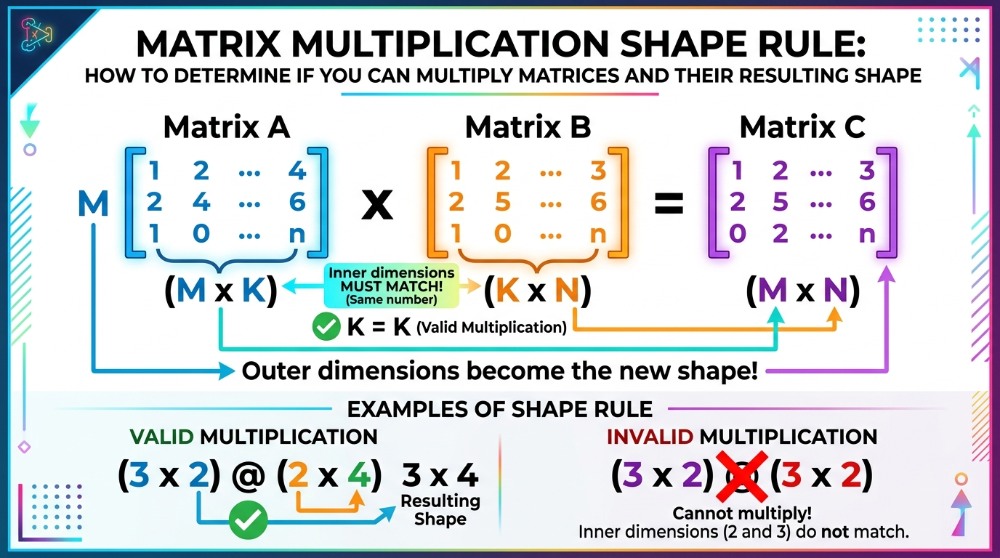
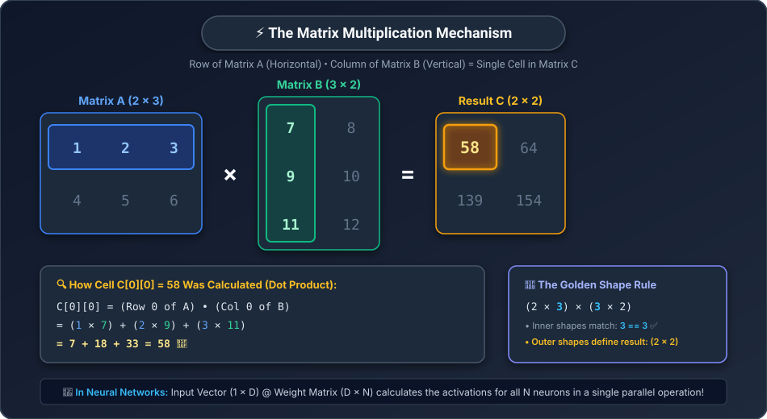
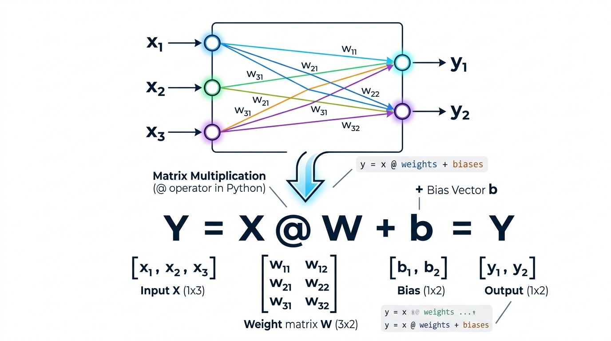

# ⚡ Day 04: Matrix Multiplication
## The Single Most Important Operation in All of AI

[](../../README.md)
[](../../README.md)
[](../../README.md)
[](../Day_03_Matrices/Day_03_Matrices.md)

---

## 📌 What Will You Learn Today?

If you opened the hood of ChatGPT, Midjourney, or Tesla's self-driving neural networks, you would find that **over 95% of all computer calculations being performed are just one thing: Matrix Multiplication.**

NVIDIA became one of the most valuable companies in world history simply because they build chips (GPUs) that can do Matrix Multiplication faster than anything else on Earth.

Today, you will master this operation from scratch — not with abstract formulas, but with plain Python code, intuitive analogies, and crystal-clear visual diagrams.

By the end of today, you will understand:
- ✅ Why regular multiplication isn't enough for tables of numbers.
- ✅ The **Student-University grading analogy** that makes matrix multiplication instantly intuitive.
- ✅ The **Golden Shape Rule**: How to know if two matrices can be multiplied, and what the output shape will be.
- ✅ The step-by-step **Row-by-Column dance** with exact numbers.
- ✅ How to build `matmul()` from scratch in pure Python using nested loops.
- ✅ How an entire neural network layer is literally just: `Y = X @ W + b`.
- ✅ Why GPUs and Tensor Cores exist specifically for this math.

---

## 🗺️ Table of Contents

- [1. Real-World Analogy: The University Admissions Calculator](#1-real-world-analogy-the-university-admissions-calculator)
- [2. The Golden Shape Rule: Can We Multiply Them?](#2-the-golden-shape-rule-can-we-multiply-them)
- [3. The Step-by-Step Row-by-Column Dance](#3-the-step-by-step-row-by-column-dance)
- [4. Coding Matrix Multiplication from Scratch in Python](#4-coding-matrix-multiplication-from-scratch-in-python)
- [5. The AI Connection: Neural Networks as Matrix Multiplication](#5-the-ai-connection-neural-networks-as-matrix-multiplication)
- [6. Why Did NVIDIA Win? (GPUs and Matrix Engines)](#6-why-did-nvidia-win-gpus-and-matrix-engines)
- [7. Key Takeaways & Cheat Sheet](#7-key-takeaways--cheat-sheet)
- [8. Practice Exercises with Solutions](#8-practice-exercises-with-solutions)

---

# 1. Real-World Analogy: The University Admissions Calculator

Before touching any math symbols, let's look at a problem you could solve with a spreadsheet.

Suppose **3 students** took exams in **3 subjects**: `[Math, Science, English]`.

```python
# Student Scores Table (Matrix A: 3 Students x 3 Subjects)
scores = [
    [90, 80, 70],   # Student 0 (Rahul)
    [60, 70, 95],   # Student 1 (Sneha)
    [85, 85, 85]    # Student 2 (Aman)
]
```

Now, **two different universities** want to calculate admission scores. Each university values subjects differently:
- **Engineering College**: Heavy focus on Math (50%) & Science (40%), low on English (10%).
- **Literature College**: Low focus on Math (10%), medium on Science (20%), heavy on English (70%).

```python
# Weights Table (Matrix B: 3 Subjects x 2 Colleges)
# Columns: [Engineering Weight, Literature Weight]
college_weights = [
    [0.50, 0.10],   # Math
    [0.40, 0.20],   # Science
    [0.10, 0.70]    # English
]
```

### How Do We Calculate Rahul's Score for Engineering?

You multiply each of Rahul's subject grades by that subject's engineering weight and add them up:

$$\text{Rahul's Engineering Score} = (90 \times 0.50) + (80 \times 0.40) + (70 \times 0.10)$$
$$= 45 + 32 + 7 = \mathbf{84.0}$$

### How Do We Calculate Rahul's Score for Literature?

You multiply Rahul's grades by the literature weights:

$$\text{Rahul's Literature Score} = (90 \times 0.10) + (80 \times 0.20) + (70 \times 0.70)$$
$$= 9 + 16 + 49 = \mathbf{74.0}$$

If you repeat this for all 3 students across both universities, you get a new table: **Final Scores (3 Students $\times$ 2 Colleges)**!

```python
final_scores = [
    [84.0, 74.0],   # Rahul:      Eng=84.0,  Lit=74.0
    [67.5, 86.5],   # Sneha:      Eng=67.5,  Lit=86.5
    [85.0, 85.0]    # Aman:       Eng=85.0,  Lit=85.0
]
```

> **Congratulations: You just did Matrix Multiplication!**
>
> Matrix Multiplication takes a table of inputs (Students) and transforms it through a table of weights (Colleges) to produce a table of final results!

---

# 2. The Golden Shape Rule: Can We Multiply Them?

You cannot just multiply any two random matrices. Their shapes must align.



### The Rule:

To multiply Matrix $A$ and Matrix $B$:

$$\text{Shape of } A: (M \times \mathbf{K}) \quad \times \quad \text{Shape of } B: (\mathbf{K} \times N)$$

1. **Inner dimensions MUST MATCH!** The number of columns in $A$ must equal the number of rows in $B$ ($K == K$).
2. **Outer dimensions become the new shape!** The resulting Matrix $C$ will have shape **$(M \times N)$**.

### Why Must the Inner Dimensions Match?

In our university example:
- Rahul had **3 subject scores** `[Math, Science, English]`.
- The university MUST provide **3 subject weights** `[Math, Science, English]`.
- If the university only had 2 weights, you couldn't calculate the score because one subject would have nothing to multiply with!

### Let's Test Your Intuition:

| Matrix A Shape | Matrix B Shape | Can You Multiply? | Resulting Shape |
| :---: | :---: | :---: | :---: |
| $(3 \times \mathbf{2})$ | $(\mathbf{2} \times 4)$ | ✅ **YES** (2 == 2) | $(3 \times 4)$ |
| $(100 \times \mathbf{50})$ | $(\mathbf{50} \times 10)$ | ✅ **YES** (50 == 50) | $(100 \times 10)$ |
| $(1 \times \mathbf{768})$ | $(\mathbf{768} \times 3072)$ | ✅ **YES** (768 == 768) | $(1 \times 3072)$ *(Actual GPT layer!)* |
| $(3 \times \mathbf{2})$ | $(\mathbf{3} \times 2)$ | ❌ **NO** (2 != 3) | Impossible! Inner shapes don't match! |

---

# 3. The Step-by-Step Row-by-Column Dance

Let's watch Matrix Multiplication happen step-by-step with small numbers so you can trace every single calculation.

Suppose we multiply:
- **Matrix A** of shape $(2 \times 3)$
- **Matrix B** of shape $(3 \times 2)$
- **Result C** will be of shape $(2 \times 2)$!

$$A = \begin{bmatrix} 1 & 2 & 3 \\ 4 & 5 & 6 \end{bmatrix}, \quad B = \begin{bmatrix} 7 & 8 \\ 9 & 10 \\ 11 & 12 \end{bmatrix}$$



### Full Arithmetic Breakdown Table:

| Target Cell in C | Row from Matrix A | Column from Matrix B | Step-by-Step Dot Product | Calculation | Final Value |
| :---: | :---: | :---: | :--- | :--- | :---: |
| **$C[0][0]$** | Row 0: `[1, 2, 3]` | Col 0: `[7, 9, 11]` | $(1 \times 7) + (2 \times 9) + (3 \times 11)$ | $7 + 18 + 33$ | **`58`** |
| **$C[0][1]$** | Row 0: `[1, 2, 3]` | Col 1: `[8, 10, 12]` | $(1 \times 8) + (2 \times 10) + (3 \times 12)$ | $8 + 20 + 36$ | **`64`** |
| **$C[1][0]$** | Row 1: `[4, 5, 6]` | Col 0: `[7, 9, 11]` | $(4 \times 7) + (5 \times 9) + (6 \times 11)$ | $28 + 45 + 66$ | **`139`** |
| **$C[1][1]$** | Row 1: `[4, 5, 6]` | Col 1: `[8, 10, 12]` | $(4 \times 8) + (5 \times 10) + (6 \times 12)$ | $32 + 50 + 72$ | **`154`** |

### Final Result Matrix C:

$$C = \begin{bmatrix} 58 & 64 \\ 139 & 154 \end{bmatrix}$$

> [!WARNING]
> **Critical Rule: Matrix Multiplication is NOT Commutative! ($A \times B \neq B \times A$)**
> In normal arithmetic, $3 \times 5 = 5 \times 3 = 15$. The order doesn't matter.
> 
> In Matrix Multiplication, **ORDER MATTERS COMPLETELY**:
> - $A(2 \times 3) \times B(3 \times 2)$ produces a **$2 \times 2$ matrix**!
> - $B(3 \times 2) \times A(2 \times 3)$ produces a **$3 \times 3$ matrix**!
> 
> Swapping the order produces completely different numbers and even a completely different shape!

---

# 4. Coding Matrix Multiplication from Scratch in Python

Now that you understand the mechanics, let's write it in clean Python.

To compute every cell $C[i][j]$:
- Loop $i$ over every row of $A$.
- Loop $j$ over every column of $B$.
- Loop $k$ to multiply corresponding items and accumulate the sum.

```python
def matmul(A, B):
    """
    Multiply Matrix A (M x K) by Matrix B (K x N).
    Returns Result Matrix C (M x N).
    """
    rows_A = len(A)
    cols_A = len(A[0])
    rows_B = len(B)
    cols_B = len(B[0])
    
    # 1. Shape Safety Check
    if cols_A != rows_B:
        raise ValueError(
            f"Cannot multiply! Incompatible shapes: ({rows_A}x{cols_A}) and ({rows_B}x{cols_B})"
        )
    
    # 2. Initialize an empty result matrix of shape (rows_A x cols_B) with zeros
    C = [[0 for _ in range(cols_B)] for _ in range(rows_A)]
    
    # 3. The 3 Nested Loops
    for i in range(rows_A):          # Over each row of A
        for j in range(cols_B):      # Over each column of B
            total = 0
            for k in range(cols_A):  # Walk along row i of A and column j of B
                total += A[i][k] * B[k][j]
            C[i][j] = total
            
    return C

# Test it with our exact example!
A = [
    [1, 2, 3],
    [4, 5, 6]
]

B = [
    [7, 8],
    [9, 10],
    [11, 12]
]

result = matmul(A, B)

print("Result of A @ B:")
for row in result:
    print(" ", row)
```

**Output:**
```
Result of A @ B:
  [58, 64]
  [139, 154]
```

Matches our manual calculation to the exact digit!

### The Modern Python `@` Operator

In modern Python (and libraries like NumPy and PyTorch), the `@` symbol is reserved specifically for matrix multiplication:

```python
# In NumPy / PyTorch:
# C = A @ B  (instead of typing a long function name!)
```

---

# 5. The AI Connection: Neural Networks as Matrix Multiplication

Now for the grand reveal: **What does this have to do with Artificial Intelligence?**



Look at an Artificial Neural Network with 3 inputs connecting to 2 output neurons:
- Input 1: House Bedrooms ($x_1$)
- Input 2: House Bathrooms ($x_2$)
- Input 3: House Area ($x_3$)

We want to predict two outputs:
- Output 1: Expected House Price ($y_1$)
- Output 2: Expected Monthly Rent ($y_2$)

Every connection between an input and an output is a **weight** ($W$).
With 3 inputs and 2 outputs, there are $3 \times 2 = 6$ weights!

```python
# Input features for 1 house: [Bedrooms, Bathrooms, Area]
# Shape: (1 x 3)
X = [[3, 2, 1800]]

# Weight Matrix: Connections to [Price_neuron, Rent_neuron]
# Shape: (3 x 2)
W = [
    [ 50000,   200],   # Weights for Bedrooms
    [ 25000,   150],   # Weights for Bathrooms
    [   200,     1]    # Weights for Area
]

# Bias Vector: Baseline defaults [Base_Price, Base_Rent]
# Shape: (1 x 2)
b = [[100000, 500]]
```

To compute the predictions for both neurons simultaneously:

$$Y = X @ W + b$$

Let's run it using our `matmul()` function:

```python
# Compute X @ W
raw_prediction = matmul(X, W)

# Add bias b
final_prediction = [
    [raw_prediction[0][0] + b[0][0], raw_prediction[0][1] + b[0][1]]
]

print(f"Predicted Price: ₹{final_prediction[0][0]:,}")
print(f"Predicted Rent:  ₹{final_prediction[0][1]:,}")
```

**Output:**
```
Predicted Price: ₹660,000
Predicted Rent:  ₹3,200
```

> **The Core Realization**:
> An entire layer of a neural network — whether it has 2 neurons or 10,000 neurons — is calculated in **one single matrix multiplication**!

---

# 6. Why Did NVIDIA Win? (GPUs and Matrix Engines)

Look back at the code for `matmul()` in Section 4. Notice something special:

To compute cell $C[0][0]$, you don't need to know cell $C[1][1]$!
**Every single cell in the result matrix can be calculated completely independently from all other cells!**

- A standard **CPU** has 8 or 16 powerful cores that execute tasks in sequence.
- A modern **GPU** (like an NVIDIA H100) has **14,592 smaller cores**!
- Instead of calculating cells one-by-one with a `for` loop, the GPU assigns all 14,000 calculations to separate hardware cores and computes them **at the exact same microsecond**!

```
CPU (Sequential):
  Cell (0,0) ──► Cell (0,1) ──► Cell (1,0) ──► Cell (1,1) ... (Slow!)

GPU (Massively Parallel):
  Cell (0,0) ─┐
  Cell (0,1) ─┼── All calculated AT THE SAME INSTANT! ⚡
  Cell (1,0) ─┤
  Cell (1,1) ─┘
```

This is why deep learning and Gen AI exploded in recent years: when we learned that AI is just matrix multiplication, we realized we could run it on GPUs millions of times faster.

---

# 7. Key Takeaways & Cheat Sheet

```
┌────────────────────────────────────────────────────────────────────────┐
│                        DAY 04 CHEAT SHEET                              │
├────────────────────────────────────────────────────────────────────────┤
│                                                                        │
│  ⚡ MATRIX MULTIPLICATION (A @ B)                                      │
│     • Transforms an input matrix through a weight matrix.              │
│     • Calculates Row of A · Column of B for each cell.                 │
│                                                                        │
│  📐 THE SHAPE RULE: (M x K) @ (K x N) = (M x N)                        │
│     • Inner dimensions MUST MATCH! (Cols of A == Rows of B)            │
│     • Outer dimensions determine the resulting shape! (M x N)          │
│                                                                        │
│  ⚠️ NOT COMMUTATIVE!                                                   │
│     • A @ B is NOT equal to B @ A! Order matters!                      │
│                                                                        │
│  🧠 NEURAL NETWORK CORE FORMULA:                                       │
│     • Output = Input @ Weights + Bias                                  │
│     • Y = X @ W + b                                                    │
│                                                                        │
│  💻 WHY GPUs?                                                          │
│     • Every cell in the result can be computed in parallel.            │
│     • 14,000+ GPU cores compute millions of cells simultaneously.      │
│                                                                        │
└────────────────────────────────────────────────────────────────────────┘
```

---

# 8. Practice Exercises with Solutions

<details>
<summary><b>🏋️ Exercise 1: Predict the Output Shapes</b></summary>
<br/>

Without running code, determine if the following matrix multiplications are valid. If valid, what is the output shape?

1. $A (4 \times 3) \ @ \ B (3 \times 5)$
2. $A (10 \times 4) \ @ \ B (5 \times 10)$
3. $A (1 \times 512) \ @ \ B (512 \times 128)$
4. $A (64 \times 64) \ @ \ B (64 \times 64)$

**Answers:**
1. **Valid!** Inner: $3 == 3$. Output shape: **$(4 \times 5)$**.
2. **Invalid!** Inner: $4 \neq 5$. Incompatible shapes!
3. **Valid!** Inner: $512 == 512$. Output shape: **$(1 \times 128)$**.
4. **Valid!** Inner: $64 == 64$. Output shape: **$(64 \times 64)$**.
</details>

<details>
<summary><b>🏋️ Exercise 2: Multiply a Vector by a Matrix</b></summary>
<br/>

In AI, we often multiply a single row vector of shape $(1 \times 3)$ by a weight matrix of shape $(3 \times 2)$.

Given:
```python
vector = [[2, 3, 1]]  # Shape (1 x 3)
weights = [
    [1, 0],
    [2, 1],
    [0, 3]
]  # Shape (3 x 2)
```

Use your `matmul(vector, weights)` function to calculate the result. What is the output and what is its shape?

**Solution:**
```python
# Inner dimensions match: (1 x 3) @ (3 x 2) -> Output shape is (1 x 2)
# Calculation:
# Col 0: (2 * 1) + (3 * 2) + (1 * 0) = 2 + 6 + 0 = 8
# Col 1: (2 * 0) + (3 * 1) + (1 * 3) = 0 + 3 + 3 = 6

result = matmul(vector, weights)
print(result)  # [[8, 6]]
```
</details>

<details>
<summary><b>🏋️ Exercise 3: Prove that Order Matters (A @ B != B @ A)</b></summary>
<br/>

In regular arithmetic, $3 \times 5 = 5 \times 3$. Multiplication is commutative.
Is Matrix Multiplication commutative?

Let:
$$A = \begin{bmatrix} 1 & 2 \\ 3 & 4 \end{bmatrix}, \quad B = \begin{bmatrix} 0 & 1 \\ 2 & 3 \end{bmatrix}$$

Calculate $A @ B$ and $B @ A$ in Python. Are they the same?

**Solution:**
```python
A = [[1, 2], [3, 4]]
B = [[0, 1], [2, 3]]

AB = matmul(A, B)
BA = matmul(B, A)

print("A @ B:")
for r in AB:
    print(" ", r)
# A @ B:
#   [4, 7]
#   [8, 15]

print("\nB @ A:")
for r in BA:
    print(" ", r)
# B @ A:
#   [3, 4]
#   [11, 16]

print(f"\nIs A @ B equal to B @ A? {AB == BA}")  # False!
```
*(Crucial takeaway: In AI, the order of matrix multiplication matters immensely! Swapping the matrices will either give completely different numbers or cause a shape mismatch error!)*
</details>

---

## ⏭️ What's Next: Day 05 — The Dot Product & Similarity

Today, you saw that Matrix Multiplication is really just performing **many Dot Products** between rows and columns.

Tomorrow on **Day 05**, we will zoom into the **Dot Product** itself:
- How two vectors "talk to each other".
- How the Dot Product measures **Similarity** (are these two vectors pointing in the same direction?).
- The **Cosine Similarity** formula in Python.
- **The direct bridge to Transformers**: How Self-Attention in ChatGPT calculates word relationships using dot products!

---

<p align="center">
  <b>🌟 End of Day 04 — You've conquered the engine of AI: Matrix Multiplication! 🌟</b>
</p>
