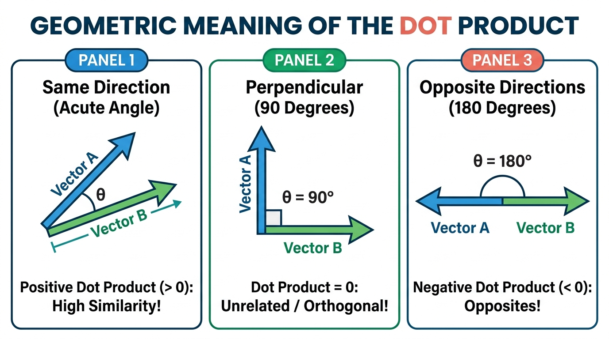
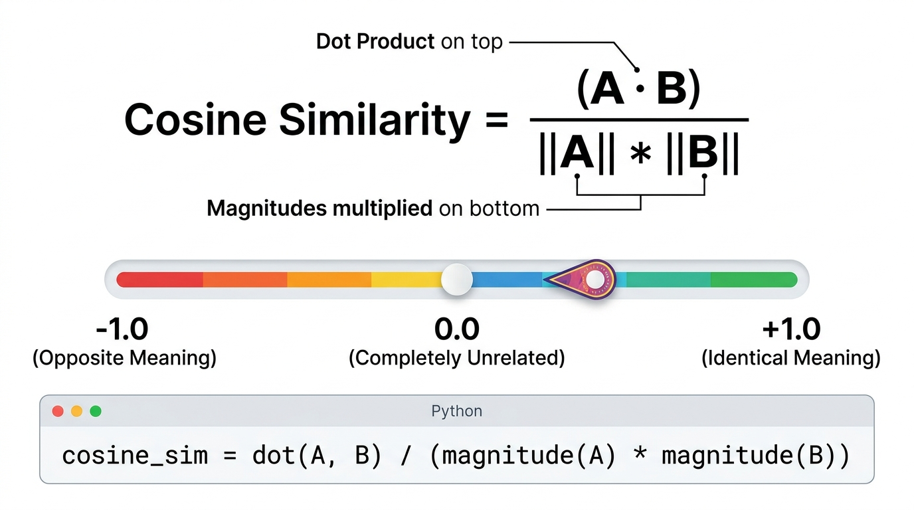

# 🎯 Day 05: The Dot Product & Similarity
## How AI Compares Words, Users, and Concepts

[](../../README.md)
[](../../README.md)
[](../../README.md)
[](../Day_04_Matrix_Multiplication/Day_04_Matrix_Multiplication.md)

---

## 📌 What Will You Learn Today?

Yesterday on [Day 04](../Day_04_Matrix_Multiplication/Day_04_Matrix_Multiplication.md), you discovered that Matrix Multiplication is secretly built out of dozens of small operations called **Dot Products**.

Today, we zoom into the **Dot Product** itself. In modern Artificial Intelligence, the dot product is nothing short of a superpower:

> **The Dot Product is how computers measure SIMILARITY.**

- How does Netflix know which movie you will love? 👉 **Dot Product.**
- How does Spotify recommend your next favorite song? 👉 **Dot Product.**
- How does a Vector Database find the right document in RAG? 👉 **Dot Product.**
- How does ChatGPT know that the word *"it"* in a sentence refers to the *"cat"* and not the *"table"*? 👉 **Dot Product.**

By the end of today, you will understand:
- ✅ What the **Dot Product** is in plain Python.
- ✅ The **Netflix Movie Matcher** analogy.
- ✅ The geometric meaning: What positive, zero, and negative dot products tell you about direction.
- ✅ The **Length Bias problem**: Why long vectors get unfair scores.
- ✅ **Cosine Similarity**: The gold standard metric for comparing vectors in Gen AI.
- ✅ How Transformers and LLMs use dot products inside **Self-Attention**.

---

## 🗺️ Table of Contents

- [1. Real-World Analogy: The Netflix Movie Matcher](#1-real-world-analogy-the-netflix-movie-matcher)
- [2. The Dot Product Formula in Python](#2-the-dot-product-formula-in-python)
- [3. Geometric Meaning: Angles and Directions](#3-geometric-meaning-angles-and-directions)
- [4. The Flaw in Raw Dot Product: The Length Bias](#4-the-flaw-in-raw-dot-product-the-length-bias)
- [5. Cosine Similarity: The Gold Standard](#5-cosine-similarity-the-gold-standard)
- [6. The AI Connection: Semantic Search and Self-Attention](#6-the-ai-connection-semantic-search-and-self-attention)
- [7. Key Takeaways & Cheat Sheet](#7-key-takeaways--cheat-sheet)
- [8. Practice Exercises with Solutions](#8-practice-exercises-with-solutions)

---

# 1. Real-World Analogy: The Netflix Movie Matcher

Imagine you are building a recommendation algorithm for Netflix.

You describe every user and every movie using **3 genre scores** from `0` to `10`:
`[Action, Comedy, Romance]`

### The User Profile
Rahul loves high-octane Action movies, enjoys occasional Comedy, but dislikes Romance:
```python
# [Action, Comedy, Romance]
rahul = [9, 3, 1]
```

### Two New Movies Just Released:
- **Movie A ("Mission Impossible")**: Pure Action: `[10, 2, 0]`
- **Movie B ("The Notebook")**: Pure Romance: `[0, 1, 9]`

```python
movie_a = [10, 2, 0]  # Mission Impossible
movie_b = [ 0, 1, 9]  # The Notebook
```

### Which Movie Should Netflix Show to Rahul?

To find out, we calculate the **Dot Product** between Rahul's profile and each movie. We multiply matching genres together and add them up:

$$\text{Score for Movie A} = (9 \times 10) + (3 \times 2) + (1 \times 0) = 90 + 6 + 0 = \mathbf{96}$$

$$\text{Score for Movie B} = (9 \times 0) + (3 \times 1) + (1 \times 9) = 0 + 3 + 9 = \mathbf{12}$$

Look at those scores:
- **Movie A Score: 96** 🚀 (Extremely High Match!)
- **Movie B Score: 12** 💤 (Very Low Match!)

Netflix immediately places *Mission Impossible* at the top of Rahul's home screen!

> **What just happened?**
> High numbers in the same categories aligned and produced a massive total. Unmatched categories produced near zero. 
> The dot product measured **how well the two profiles agreed with each other**!

---

# 2. The Dot Product Formula in Python

In mathematics, the dot product between vector $\vec{A}$ and vector $\vec{B}$ is written with a dot:

$$\vec{A} \cdot \vec{B} = \sum_{i=0}^{n-1} A_i \times B_i$$

To a software engineer, this is just a single Python loop:

```python
def dot_product(a, b):
    """
    Calculate the dot product of two vectors of the same dimension.
    Returns a single number (scalar).
    """
    if len(a) != len(b):
        raise ValueError(f"Vectors must have the same length! Got {len(a)} and {len(b)}")
    
    total = 0
    for i in range(len(a)):
        total += a[i] * b[i]
    return total

# Let's test it:
rahul = [9, 3, 1]
movie_a = [10, 2, 0]
movie_b = [ 0, 1, 9]

print("Match with Mission Impossible:", dot_product(rahul, movie_a))  # 96
print("Match with The Notebook:",       dot_product(rahul, movie_b))  # 12
```

### The One-Line Python Pro Shortcut

Using `zip()` and `sum()`, you can write the dot product in a single elegant line:

```python
score = sum(x * y for x, y in zip(rahul, movie_a))
print("One-line dot product:", score)  # 96
```

### Crucial Notice:
- Vector $+$ Vector $=$ **Vector**
- Matrix $\times$ Matrix $=$ **Matrix**
- **Vector $\cdot$ Vector $=$ A SINGLE NUMBER (Scalar)!**

---

# 3. Geometric Meaning: Angles and Directions

Why does the dot product measure similarity? Because it directly relates to the **angle between the two arrows**!



When you visualize two vectors as arrows starting from the origin `(0, 0)`:

### 🟢 Panel 1: Acute Angle ($\theta < 90^\circ$) $\implies$ Positive Dot Product ($> 0$)
- The two arrows are pointing in generally the **same direction**.
- They reinforce each other.
- **AI Meaning**: High similarity! These two items share similar features.

### 🟡 Panel 2: Perpendicular Angle ($\theta = 90^\circ$) $\implies$ Dot Product $= 0$
- The two arrows are at a right angle (mathematicians call this **orthogonal**).
- They have **zero overlap**. Moving along Vector A tells you nothing about Vector B.
- **AI Meaning**: Completely unrelated / independent features!

### 🔴 Panel 3: Opposite Directions ($\theta > 90^\circ$) $\implies$ Negative Dot Product ($< 0$)
- The two arrows point in **opposite directions**.
- One goes up-right while the other goes down-left.
- **AI Meaning**: Opposites! If User A loves action and User B hates action, their dot product becomes negative.

```python
# Let's verify with Python vectors:
same_dir_a = [2, 3]
same_dir_b = [4, 5]
print("Similar vectors dot product:    ", dot_product(same_dir_a, same_dir_b))  # 23 (Positive!)

orthogonal_a = [1, 0]  # Points purely East
orthogonal_b = [0, 1]  # Points purely North
print("Perpendicular vectors dot product:", dot_product(orthogonal_a, orthogonal_b))  # 0 (Unrelated!)

opposite_a = [ 2,  3]
opposite_b = [-2, -3]
print("Opposite vectors dot product:   ", dot_product(opposite_a, opposite_b))  # -13 (Negative!)
```

---

# 4. The Flaw in Raw Dot Product: The Length Bias

The raw dot product is amazing, but it has one serious flaw: **it is biased by magnitude (length)**.

### Real-World Example: The Hyperactive Reviewer

Suppose two users have the **exact same taste ratio** (50% Action, 50% Comedy):
- **User A (Casual User)**: Rates a few movies with modest scores `[2, 2]`.
- **User B (Power User)**: Rates hundreds of movies with massive totals `[100, 100]`.

Now, compare both users to a movie `[1, 1]`:

```python
casual_user = [2, 2]
power_user  = [100, 100]
movie       = [1, 1]

print("Casual User dot product:", dot_product(casual_user, movie))  # (2*1) + (2*1) = 4
print("Power User dot product: ", dot_product(power_user, movie))   # (100*1) + (100*1) = 200
```

Both users have the **exact same preference percentage**, but the Power User got a score of **200**, while the Casual User got **4**!

The dot product favored the Power User simply because their vector was **longer**, not because their taste was closer!

> **The Problem**: In AI and NLP, a long Wikipedia article has larger word count vectors than a short tweet, even if both are about the exact same topic!
>
> We need a way to **ignore length** and compare **only the direction (meaning)**.

---

# 5. Cosine Similarity: The Gold Standard

To fix the length bias, we divide the dot product by the lengths (magnitudes) of both vectors. 

This gives us **Cosine Similarity**:



### The Formula:

$$\text{Cosine Similarity}(A, B) = \frac{A \cdot B}{\|A\| \times \|B\|}$$

Where:
- $A \cdot B$ is the **Dot Product** (measuring alignment).
- $\|A\|$ and $\|B\|$ are the **Magnitudes / Lengths** from [Day 02](../Day_02_Vectors/Day_02_Vectors.md) ($\sqrt{\sum x^2}$).

### The Magic Scale: Always Between -1.0 and +1.0!

No matter how large or tiny the numbers in your vectors are, Cosine Similarity **always produces a score between $-1.0$ and $+1.0$**:

| Cosine Score | Meaning in AI | Real-World Example |
| :---: | :--- | :--- |
| **$+1.0$** | **Identical Direction** (100% Match) | "happy" vs "joyful" |
| **$+0.7 \dots +0.9$** | **Very Similar Meaning** | "doctor" vs "hospital" |
| **$0.0$** | **Completely Unrelated** (Orthogonal) | "banana" vs "quantum physics" |
| **$-1.0$** | **Diametrically Opposite** | "hot" vs "cold", "love" vs "hate" |

### Let's Code Cosine Similarity in Python

```python
import math

def magnitude(v):
    """Calculate length of vector from Day 02"""
    return math.sqrt(sum(x ** 2 for x in v))

def cosine_similarity(a, b):
    """
    Calculate Cosine Similarity between vector a and vector b.
    Returns a float between -1.0 and +1.0.
    """
    dot = sum(x * y for x, y in zip(a, b))
    mag_a = magnitude(a)
    mag_b = magnitude(b)
    
    if mag_a == 0 or mag_b == 0:
        return 0.0  # Avoid division by zero
        
    return dot / (mag_a * mag_b)

# Now test our Casual User vs Power User from earlier:
casual_user = [2, 2]
power_user  = [100, 100]
movie       = [1, 1]

print(f"Casual User similarity: {cosine_similarity(casual_user, movie):.4f}")  # 1.0000
print(f"Power User similarity:  {cosine_similarity(power_user, movie):.4f}")   # 1.0000
```

**Output:**
```
Casual User similarity: 1.0000
Power User similarity:  1.0000
```

Both get a perfect score of **1.0000**! The length bias is completely gone.

---

# 6. The AI Connection: Semantic Search and Self-Attention

Now you have the secret key that unlocks modern Generative AI. Here is where the Dot Product is used every single second in production systems:

### 1. Vector Databases & RAG (Retrieval-Augmented Generation)

When you build an AI application with company documents (Day 47 & 48):
1. Every paragraph in your company PDF is converted into an embedding vector.
2. When the user asks: *"What is our refund policy?"*, that question is converted into a vector.
3. The database computes the **Cosine Similarity** between the question vector and all document vectors.
4. The document with the highest similarity score is retrieved and fed to the LLM!

```python
# Semantic Search in 4 lines of Python:
question_vector = [0.12, 0.85, -0.42]

documents = [
    ("HR Leave Policy",   [0.05, 0.10, -0.02]),
    ("Refund Guidelines", [0.11, 0.82, -0.40]), # Highest match!
    ("WiFi Password",     [-0.80, 0.15, 0.30])
]

for title, doc_vec in documents:
    score = cosine_similarity(question_vector, doc_vec)
    print(f"{title:20} -> Similarity: {score:.4f}")
```

**Output:**
```
HR Leave Policy      -> Similarity: 0.2814
Refund Guidelines    -> Similarity: 0.9987  <-- Match found!
WiFi Password        -> Similarity: -0.2105
```

---

### 2. Self-Attention in Transformers (ChatGPT & Claude)

In a Transformer model, how does the AI understand the context of a word?

Consider the sentence:
> *"The animal didn't cross the street because **it** was too tired."*

What does the word **"it"** refer to? To a human, it clearly refers to the **animal** (because animals get tired, streets do not).

Inside ChatGPT:
- The word **"it"** sends out a **Query vector** ($Q$).
- Every other word in the sentence has a **Key vector** ($K$).
- ChatGPT calculates the **Dot Product** between the Query for "it" and the Key of every other word!

```
Word               Dot Product with "it"      Attention Level
────               ─────────────────────      ───────────────
"animal"   ──►     0.94                       ██████████ (HIGH! "it" = animal)
"cross"    ──►     0.18                       ██
"street"   ──►     0.12                       █
"tired"    ──►     0.81                       ████████   (HIGH! "tired" describes "it")
```

The famous Transformer attention formula is literally just a scaled dot product:

$$\text{Attention}(Q, K, V) = \text{softmax}\left(\frac{Q K^T}{\sqrt{d_k}}\right) V$$

That $Q K^T$ in the numerator is **millions of dot products calculated in parallel on a GPU**!

---

# 7. Key Takeaways & Cheat Sheet

```
┌────────────────────────────────────────────────────────────────────────┐
│                        DAY 05 CHEAT SHEET                              │
├────────────────────────────────────────────────────────────────────────┤
│                                                                        │
│  🎯 DOT PRODUCT (A · B) = sum(a * b for a, b in zip(A, B))            │
│     • Multiplies matching elements and sums them into a single number. │
│     • Measures alignment and similarity between two vectors.           │
│                                                                        │
│  📐 GEOMETRIC MEANING:                                                 │
│     • Positive (> 0): Vectors point in similar direction.              │
│     • Zero (= 0): Vectors are perpendicular (90° / orthogonal).        │
│     • Negative (< 0): Vectors point in opposite directions.            │
│                                                                        │
│  ⚖️ LENGTH BIAS:                                                       │
│     • Long vectors get artificially large dot products.                │
│                                                                        │
│  🌟 COSINE SIMILARITY = (A · B) / (||A|| * ||B||)                      │
│     • Normalizes for length: divides dot product by both magnitudes.   │
│     • Output is ALWAYS between -1.0 (opposite) and +1.0 (identical).   │
│     • 0.0 means completely unrelated.                                  │
│                                                                        │
│  🤖 AI APPLICATIONS:                                                   │
│     • RAG & Vector Databases: Matching user query to text chunks.      │
│     • Transformer Self-Attention: Q · K measures word-to-word context. │
│                                                                        │
└────────────────────────────────────────────────────────────────────────┘
```

---

# 8. Practice Exercises with Solutions

<details>
<summary><b>🏋️ Exercise 1: Build Cosine Similarity with Safety Checks</b></summary>
<br/>

Write a production-ready Python function `calculate_cosine_similarity(v1, v2)` that:
1. Validates that both vectors have the same dimension.
2. Handles edge cases where one or both vectors are all zeros (length = 0) without crashing with a `ZeroDivisionError`.
3. Returns the cosine similarity rounded to 4 decimal places.

```python
def calculate_cosine_similarity(v1, v2):
    # YOUR CODE HERE
    pass

# Test cases:
# calculate_cosine_similarity([1, 0], [0, 1])   -> 0.0000 (Perpendicular)
# calculate_cosine_similarity([1, 2], [2, 4])   -> 1.0000 (Same direction)
# calculate_cosine_similarity([1, 2], [-1, -2]) -> -1.0000 (Opposite)
# calculate_cosine_similarity([0, 0], [1, 2])   -> 0.0000 (Zero vector safety)
```

**Solution:**
```python
import math

def calculate_cosine_similarity(v1, v2):
    if len(v1) != len(v2):
        raise ValueError(f"Vector dimensions must match: {len(v1)} != {len(v2)}")
        
    dot_prod = sum(a * b for a, b in zip(v1, v2))
    mag_v1 = math.sqrt(sum(a ** 2 for a in v1))
    mag_v2 = math.sqrt(sum(b ** 2 for b in v2))
    
    # Zero vector safety check
    if mag_v1 == 0 or mag_v2 == 0:
        return 0.0
        
    return round(dot_prod / (mag_v1 * mag_v2), 4)

print(calculate_cosine_similarity([1, 0], [0, 1]))    # 0.0
print(calculate_cosine_similarity([1, 2], [2, 4]))    # 1.0
print(calculate_cosine_similarity([1, 2], [-1, -2]))  # -1.0
print(calculate_cosine_similarity([0, 0], [1, 2]))    # 0.0
```
</details>

<details>
<summary><b>🏋️ Exercise 2: Mini Semantic Search Engine</b></summary>
<br/>

Suppose you have 4 book descriptions stored as 3D embedding vectors:
- `Book 1 ("Space Odyssey")`: `[0.9, 0.1, 0.8]` (Sci-Fi, Comedy, Action)
- `Book 2 ("Romantic Paris")`: `[0.1, 0.4, 0.9]` (Sci-Fi, Comedy, Action)
- `Book 3 ("Star Wars Chronicles")`: `[0.85, 0.2, 0.75]`
- `Book 4 ("Stand-up Comedy Guide")`: `[0.05, 0.95, 0.1]`

A user searches for: *"Action packed science fiction in outer space"*
The search query embedding is: `query = [0.95, 0.05, 0.70]`

Write code to find and print the **top matching book** by calculating cosine similarity with each book description!

**Solution:**
```python
catalog = [
    ("Space Odyssey",             [0.90, 0.10, 0.80]),
    ("Romantic Paris",            [0.10, 0.40, 0.90]),
    ("Star Wars Chronicles",      [0.85, 0.20, 0.75]),
    ("Stand-up Comedy Guide",     [0.05, 0.95, 0.10])
]

query = [0.95, 0.05, 0.70]

# Calculate similarity for each book
results = []
for title, embedding in catalog:
    sim = calculate_cosine_similarity(query, embedding)
    results.append((title, sim))

# Sort by similarity descending (highest first)
results.sort(key=lambda x: x[1], reverse=True)

print("Search Query: 'Action packed science fiction in outer space'\n")
for rank, (title, score) in enumerate(results, start=1):
    print(f"#{rank} {title:25} -> Match: {score * 100:.2f}%")
```
**Output:**
```
#1 Space Odyssey             -> Match: 99.76%
#2 Star Wars Chronicles      -> Match: 98.92%
#3 Romantic Paris            -> Match: 67.58%
#4 Stand-up Comedy Guide     -> Match: 18.23%
```
*(You just built a working semantic search engine like Pinecone or ChromaDB!)*
</details>

<details>
<summary><b>🏋️ Exercise 3: Orthogonality (Finding Independent Features)</b></summary>
<br/>

In data science, two features are considered completely independent if their dot product is `0`.

Given:
- $v_1 = [3, -2]$
- Find a vector $v_2 = [x, y]$ such that $v_1 \cdot v_2 = 0$.

Write Python code to verify that your chosen $v_2$ is perpendicular to $v_1$.

**Solution:**
```python
# To make (3*x) + (-2*y) = 0:
# If x = 2 and y = 3:
# (3 * 2) + (-2 * 3) = 6 - 6 = 0!

v1 = [3, -2]
v2 = [2, 3]

dot = sum(a * b for a, b in zip(v1, v2))
print(f"Dot product of {v1} and {v2}: {dot}")  # 0
print(f"Are they orthogonal? {dot == 0}")       # True
```
</details>

---

## ⏭️ What's Next: Day 06 — Probability & Statistics

Today, you learned how AI measures similarity between words and concepts using the Dot Product and Cosine Similarity.

Tomorrow on **Day 06**, we enter the world of **Uncertainty & Probability**:
- Why AI models don't say *"The answer is definitely X"*, but rather *"I am 87% confident it is X"*.
- **Conditional Probability**: The mathematical secret of how LLMs predict the next word: $P(\text{word}_{t+1} \mid \text{words}_{1 \dots t})$.
- Mean, Median, and Standard Deviation in Python.
- The **Softmax Function**: The exact Python function that turns raw neural network scores into probability percentages!

---

<p align="center">
  <b>🌟 End of Day 05 — You've unlocked the Dot Product, the similarity engine of AI! 🌟</b>
</p>
