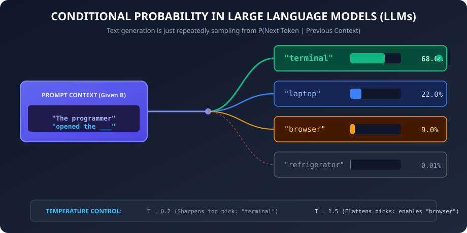
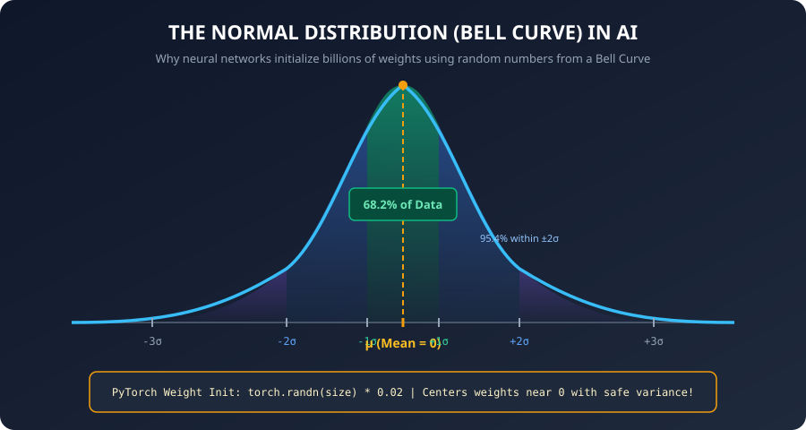
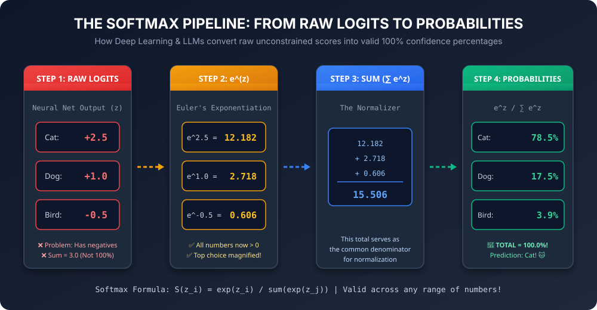

# 🎲 Day 06: Probability & Statistics
## Making Predictions Under Uncertainty & The Magic of Softmax

[](../../README.md)
[](../../README.md)
[](../../README.md)
[](../Day_05_Dot_Product_and_Similarity/Day_05_Dot_Product_and_Similarity.md)

---

## 📌 What Will You Learn Today?

If you ask a traditional software program: *"Is this email spam?"*, it checks a rule and says `True` or `False`.

If you ask an AI model: *"Is this email spam?"*, it never gives a simple yes or no. Instead, it says:
> *"I am **94.2%** sure this email is spam, and **5.8%** sure it is legitimate."*

AI models live in a world of **uncertainty**. They never output absolute certainties; they output **probabilities**.

When ChatGPT generates an answer word-by-word, it isn't "thinking" in sentences. At every single step, it calculates a probability percentage for every word in the dictionary, and picks the most likely one!

By the end of today, you will understand:
- ✅ What **probability** means in AI and the two non-negotiable rules it must obey.
- ✅ **Conditional Probability**: The mathematical foundation of LLM next-word prediction ($P(\text{next} \mid \text{previous})$).
- ✅ Core Statistics in Python: **Mean**, **Median**, **Variance**, and **Standard Deviation** from scratch.
- ✅ The **Normal Distribution (Bell Curve)**: Why real-world data clusters around the average, and why AI weights are initialized with it.
- ✅ The **Softmax Function**: The single most important probability formula in all of Deep Learning and LLMs.
- ✅ **Temperature**: How LLMs mathematically dial up "creativity" or "factuality".

---

## 🗺️ Table of Contents

- [1. The Two Golden Rules of Probability](#1-the-two-golden-rules-of-probability)
- [2. Conditional Probability: How LLMs Think](#2-conditional-probability-how-llms-think)
- [3. Descriptive Statistics in Python: Mean, Median, and Spread](#3-descriptive-statistics-in-python-mean-median-and-spread)
- [4. The Normal Distribution (Bell Curve)](#4-the-normal-distribution-bell-curve)
- [5. The Logits Problem: Raw Neural Network Outputs](#5-the-logits-problem-raw-neural-network-outputs)
- [6. The Softmax Function: Converting Raw Scores to Probabilities](#6-the-softmax-function-converting-raw-scores-to-probabilities)
- [7. Temperature in LLMs: Controlling Creativity](#7-temperature-in-llms-controlling-creativity)
- [8. Key Takeaways & Cheat Sheet](#8-key-takeaways--cheat-sheet)
- [9. Practice Exercises with Solutions](#9-practice-exercises-with-solutions)

---

# 1. The Two Golden Rules of Probability

In AI, **Probability** represents the model's **degree of confidence** in an outcome. It is a number between `0.0` (impossible) and `1.0` (guaranteed certainty).

### The Two Non-Negotiable Rules:

```
┌────────────────────────────────────────────────────────────────────────┐
│  Rule 1: Every individual probability must be between 0.0 and 1.0     │
│          0.0 ≤ P(Outcome) ≤ 1.0  (i.e., 0% to 100%)                    │
│                                                                        │
│  Rule 2: The sum of ALL possible mutually exclusive outcomes           │
│          MUST equal exactly 1.0 (100%)                                 │
│          P(Rain) + P(No Rain) = 1.0                                    │
└────────────────────────────────────────────────────────────────────────┘
```

### Real-World Analogy: Weather Forecast

When your weather app says there is a **70% chance of rain** ($0.70$), it automatically means there is a **30% chance of no rain** ($0.30$):

$$P(\text{Rain}) + P(\text{No Rain}) = 0.70 + 0.30 = \mathbf{1.0}$$

### In AI Image Classification

When an AI scans a photo of an animal, it outputs a probability distribution across possible classes:

```python
# Image Classifier Output:
predictions = {
    "Cat":  0.82,  # 82% confident it's a cat
    "Dog":  0.15,  # 15% confident it's a dog
    "Fox":  0.03   # 3% confident it's a fox
}

# Verify Rule 2:
total = sum(predictions.values())
print(f"Total probability: {total:.2f}")  # 1.00 (100%)
```

---

# 2. Conditional Probability: How LLMs Think

What is **Conditional Probability**?

> **Conditional Probability is the probability of an event happening, GIVEN that another event has already occurred.**
>
> In math notation: $P(A \mid B)$
> Read aloud as: *"The probability of A given B"*.

### Real-World Analogy: Umbrellas and Rain

- What is the probability that a stranger is carrying an umbrella? Maybe **10%** on an average day ($P(\text{Umbrella}) = 0.10$).
- But what is the probability they are carrying an umbrella, **given that it is storming outside**? It jumps to **90%**!

$$P(\text{Umbrella} \mid \text{Storm}) = 0.90$$

The new information (the storm) completely shifts the probabilities.

---

### How ChatGPT Uses Conditional Probability

Every Large Language Model (LLM) is fundamentally a **conditional probability engine**.

When you type a prompt into ChatGPT, the model doesn't "know" what it is going to say three paragraphs from now. It looks at the words that exist right now, computes a probability score for every single word in its vocabulary (~100,000 possible words), and samples the next one!



> [!NOTE]
> **Teacher's Mental Model**:
> Think of an LLM as a supercharged version of your smartphone's keyboard predictive text.
> When you type `"I'm on my..."`, your keyboard suggests `["way", "phone", "bed"]`.
> 
> The keyboard is literally asking:
> *"What is the probability of the next word, GIVEN that the previous words were 'I'm on my'?"*
> 
> ChatGPT does the exact same calculation, but with 100 billion parameters and a memory context of 128,000 words!

---

# 3. Descriptive Statistics in Python: Mean, Median, and Spread

Before training an AI model, you must understand your dataset. The four most important statistical measures are:

### 1. Mean (Average)
The sum of all values divided by the count.
$$\text{Mean} = \frac{\sum x}{N}$$

### 2. Median (Middle Value)
Sort the numbers and pick the middle one. Unlike the mean, the median is **not fooled by extreme outliers** (e.g. if Elon Musk walks into a cafe, the *average* wealth of the cafe patrons becomes billions, but the *median* stays realistic!).

### 3. Variance & Standard Deviation ($\sigma$)
How "spread out" are the numbers from the average?
- **Small standard deviation**: Numbers are packed tightly around the average.
- **Large standard deviation**: Numbers are wildly scattered.

$$\sigma = \sqrt{\frac{\sum (x - \text{mean})^2}{N}}$$

### Let's Code All Four From Scratch in Python

```python
import math

dataset = [10, 12, 23, 23, 16, 23, 21, 16]

# 1. Mean
mean = sum(dataset) / len(dataset)

# 2. Median
sorted_data = sorted(dataset)
n = len(sorted_data)
if n % 2 == 1:
    median = sorted_data[n // 2]
else:
    median = (sorted_data[(n // 2) - 1] + sorted_data[n // 2]) / 2

# 3. Variance (average squared distance from mean)
variance = sum((x - mean) ** 2 for x in dataset) / len(dataset)

# 4. Standard Deviation (square root of variance)
std_dev = math.sqrt(variance)

print(f"Dataset:            {dataset}")
print(f"Mean (Average):     {mean:.2f}")
print(f"Median:             {median:.2f}")
print(f"Variance:           {variance:.2f}")
print(f"Standard Deviation: {std_dev:.2f}")
```

**Output:**
```
Dataset:            [10, 12, 23, 23, 16, 23, 21, 16]
Mean (Average):     18.00
Median:             18.50
Variance:           24.00
Standard Deviation: 4.90
```

---

# 4. The Normal Distribution (Bell Curve)

In nature and human society, almost everything follows a **Bell Curve (Normal Distribution)**:
- Human heights
- Exam scores
- Blood pressure
- Factory component sizes

Most people/items cluster right in the middle around the average ($\mu$), with very few extreme cases on the far left or far right.



> [!TIP]
> **Key Percentages to Remember (The Empirical Rule)**:
> - **68.2%** of all data falls within $\pm 1\sigma$ of the mean.
> - **95.4%** of all data falls within $\pm 2\sigma$ of the mean.
> - **99.7%** of all data falls within $\pm 3\sigma$ of the mean.
> 
> When weights in a neural network are drawn from a normal distribution with `mean = 0.0, std = 0.02`, 99.7% of all weights will be between `-0.06` and `+0.06`!

### Why Does This Matter in AI?

When a neural network is born, its billions of weight variables must be given initial random values.
If you set all weights to `0`, the network cannot learn. If you set them too big, the numbers explode.

Instead, AI frameworks initialize weights by **drawing random numbers from a Normal Distribution with mean 0 and a tiny standard deviation** (e.g., `mean = 0.0, std = 0.02`):

```python
import random

# Simulating drawing 5 initial neural network weights from a normal distribution:
initial_weights = [random.gauss(mu=0.0, sigma=0.02) for _ in range(5)]
print("Initial AI Weights:")
for w in initial_weights:
    print(f"  {w:+.5f}")
```

**Output:**
```
Initial AI Weights:
  +0.01421
  -0.00834
  +0.00319
  -0.02154
  +0.01087
```
Small, balanced, and centered around zero — the perfect starting point for learning!

---

# 5. The Logits Problem: Raw Neural Network Outputs

When a neural network finishes multiplying its inputs by its weights ($Y = X @ W + b$ from Day 04), the final output numbers are raw mathematical values called **Logits**.

Suppose an AI is classifying an image as `[Cat, Dog, Bird]`:

```python
# Raw output from neural network layer (Logits):
logits = [2.5, 1.0, -0.5]
```

Notice the problems with these raw logits:
1. **They don't sum to 1.0**: $2.5 + 1.0 + (-0.5) = 3.0$ (Not a valid probability!).
2. **Some numbers can be negative**: $-0.5$ makes no sense as a confidence percentage (you can't have a -50% chance of a bird!).
3. **They can be arbitrarily large**: Logits could be `150.2` or `-89.4`.

How do we turn these arbitrary raw scores into **clean, valid probabilities that sum to 1.0**?

We use the most famous function in Deep Learning: **The Softmax Function**.

---

# 6. The Softmax Function: Converting Raw Scores to Probabilities

The **Softmax** function takes any list of real numbers (positive, negative, or zero) and converts them into a probability distribution:



### The Step-by-Step Numerical Walkthrough

Let's trace how the raw scores `[2.5, 1.0, -0.5]` transform into clean percentages step-by-step:

| Step | Operation | Cat ($z_1 = 2.5$) | Dog ($z_2 = 1.0$) | Bird ($z_3 = -0.5$) | Notes |
| :---: | :--- | :---: | :---: | :---: | :--- |
| **1** | Raw Logit | `+2.5` | `+1.0` | `-0.5` | Unnormalized; contains negative! |
| **2** | Exponentiate ($e^z$) | $e^{2.5} \approx \mathbf{12.182}$ | $e^{1.0} \approx \mathbf{2.718}$ | $e^{-0.5} \approx \mathbf{0.606}$ | All values now positive! |
| **3** | Sum of Exponentials | \multicolumn{3}{c|}{$\sum e^z = 12.182 + 2.718 + 0.606 = \mathbf{15.506}$} | Common normalizer |
| **4** | Divide by Sum | $12.182 / 15.506 = \mathbf{0.785}$ | $2.718 / 15.506 = \mathbf{0.175}$ | $0.606 / 15.506 = \mathbf{0.039}$ | Valid probabilities! |
| **5** | Percentage | **78.5%** | **17.5%** | **3.9%** | **Total = 100.0%!** 🎉 |

### The Softmax Formula:

$$\text{Softmax}(z_i) = \frac{e^{z_i}}{\sum_{j} e^{z_j}}$$

Let's demystify the formula step-by-step:
1. **$e^z$ (Exponentiation)**: We raise Euler's number ($e \approx 2.718$) to the power of each score (`math.exp(z)`).
   - This does two magic things:
     - It turns **every negative number into a positive number** ($e^{-0.5} \approx 0.61 > 0$).
     - It **magnifies differences** (rewarding higher scores more aggressively).
2. **$\sum e^z$ (Total Sum)**: We add up all the exponentiated values.
3. **Divide each by the total**: This guarantees that the final numbers **sum to exactly 1.0 (100%)**!

### Let's Code Softmax from Scratch in Python

```python
import math

def softmax(logits):
    """
    Convert a list of raw real numbers (logits) into probabilities.
    Guaranteed: All values > 0, and sum(output) == 1.0.
    """
    # Step 1: Exponentiate every score
    exp_scores = [math.exp(z) for z in logits]
    
    # Step 2: Sum all exponentiated scores
    total_exp = sum(exp_scores)
    
    # Step 3: Divide each by total
    probabilities = [exp_val / total_exp for exp_val in exp_scores]
    
    return probabilities

# Test with our animal classifier logits:
logits = [2.5, 1.0, -0.5]
probs = softmax(logits)

classes = ["Cat", "Dog", "Bird"]

print("Raw Logits:    ", logits)
print("\nSoftmax Probabilities:")
for cls, p in zip(classes, probs):
    print(f"  {cls:5}: {p:.4f} ({p * 100:.1f}%)")

print(f"\nSum of probabilities: {sum(probs):.4f}")  # Exactly 1.0!
```

**Output:**
```
Raw Logits:     [2.5, 1.0, -0.5]

Softmax Probabilities:
  Cat  : 0.7854 (78.5%)
  Dog  : 0.1753 (17.5%)
  Bird : 0.0393 (3.9%)

Sum of probabilities: 1.0000
```

Cat gets **78.5%**, Dog gets **17.5%**, and Bird gets **3.9%**.
The AI predicts: **It's a Cat!** 🐱

---

# 7. Temperature in LLMs: Controlling Creativity

When using the OpenAI API, Anthropic Claude, or local Ollama models, you will always see a setting called:

$$\text{Temperature} \ (T)$$

What does temperature actually do? **It is just a divisor inside the Softmax function!**

$$\text{Softmax with Temperature} = \text{Softmax}\left(\frac{z}{T}\right)$$

```python
def softmax_with_temperature(logits, temperature=1.0):
    """
    Scale logits by temperature before applying softmax.
    temperature > 1.0 : Flattens probabilities (more random, creative)
    temperature < 1.0 : Sharpens probabilities (more confident, deterministic)
    """
    scaled_logits = [z / temperature for z in logits]
    return softmax(scaled_logits)
```

### Let's See It in Action!

Suppose ChatGPT is deciding between 3 next words with raw scores `[4.0, 2.0, 1.0]`:

```python
words = ["mat", "carpet", "blanket"]
raw_logits = [4.0, 2.0, 1.0]

print("1. Standard Temperature (T = 1.0):")
probs_standard = softmax_with_temperature(raw_logits, temperature=1.0)
for w, p in zip(words, probs_standard):
    print(f"   {w:8}: {p * 100:.1f}%")

print("\n2. Low Temperature / Deterministic (T = 0.2) -> For Coding & Math:")
probs_low = softmax_with_temperature(raw_logits, temperature=0.2)
for w, p in zip(words, probs_low):
    print(f"   {w:8}: {p * 100:.1f}%")

print("\n3. High Temperature / Creative (T = 2.0) -> For Poetry & Storytelling:")
probs_high = softmax_with_temperature(raw_logits, temperature=2.0)
for w, p in zip(words, probs_high):
    print(f"   {w:8}: {p * 100:.1f}%")
```

**Output:**
```
1. Standard Temperature (T = 1.0):
   mat     : 84.4%
   carpet  : 11.4%
   blanket : 4.2%

2. Low Temperature / Deterministic (T = 0.2) -> For Coding & Math:
   mat     : 99.99%
   carpet  : 0.01%
   blanket : 0.00%

3. High Temperature / Creative (T = 2.0) -> For Poetry & Storytelling:
   mat     : 57.6%
   carpet  : 26.0%
   blanket : 16.4%
```

### Why This Matters:
- **Low Temperature ($T \to 0$)**: The top choice dominates with near 100% certainty. The AI becomes factual, predictable, and repeats the same answer every time. Great for code generation and mathematical reasoning!
- **High Temperature ($T > 1.0$)**: The probability differences shrink. The second and third options now have a fair chance of being chosen. The AI becomes surprising, poetic, and varied!

---

# 8. Key Takeaways & Cheat Sheet

```
┌────────────────────────────────────────────────────────────────────────┐
│                        DAY 06 CHEAT SHEET                              │
├────────────────────────────────────────────────────────────────────────┤
│                                                                        │
│  🎲 PROBABILITY RULES:                                                 │
│     • 0.0 ≤ P(x) ≤ 1.0 (between 0% and 100%)                           │
│     • Sum of all mutually exclusive outcomes MUST equal 1.0 (100%)     │
│                                                                        │
│  🔍 CONDITIONAL PROBABILITY: P(A | B)                                  │
│     • Probability of A occurring GIVEN that B has already occurred.    │
│     • LLM text generation is: P(next_word | previous_words).           │
│                                                                        │
│  📊 CORE STATS:                                                        │
│     • Mean: Sum / N (Average)                                          │
│     • Median: Middle sorted element (Robust to outliers)               │
│     • Std Dev (σ): How widely spread values are around the mean.       │
│                                                                        │
│  🔔 BELL CURVE (NORMAL DISTRIBUTION):                                  │
│     • Most data clusters in the middle (μ).                            │
│     • Used to initialize neural network weights with small randoms.    │
│                                                                        │
│  ⚡ SOFTMAX FUNCTION:                                                  │
│     • Converts raw logits [-0.5, 2.5] into valid probabilities [4%, 78%]│
│     • Exponentiates (e^z) to remove negatives, then divides by sum.    │
│                                                                        │
│  🌡️ TEMPERATURE (T):                                                   │
│     • Softmax(z / T)                                                   │
│     • Low T (< 1.0): Sharp, predictable, factual (Coding/Math).        │
│     • High T (> 1.0): Flat, diverse, creative (Writing/Poetry).        │
│                                                                        │
└────────────────────────────────────────────────────────────────────────┘
```

---

# 9. Practice Exercises with Solutions

<details>
<summary><b>🏋️ Exercise 1: Numerically Stable Softmax (Senior Engineer Trick)</b></summary>
<br/>

If an AI outputs very large logits (e.g. `[1000, 1001, 1002]`), `math.exp(1000)` causes an `OverflowError: math range error` because the number has over 400 digits!

In production libraries (PyTorch, TensorFlow), engineers use a simple mathematical trick:
> **Subtract the maximum logit from all logits before exponentiating!**
> 
> Mathematically, $\text{softmax}(z) = \text{softmax}(z - \max(z))$ produces the exact same probabilities, but never overflows!

Write a numerically stable `safe_softmax(logits)` function in Python.

**Solution:**
```python
import math

def safe_softmax(logits):
    # Find the maximum value in the list
    max_val = max(logits)
    
    # Subtract max_val from every score (largest value becomes 0, e^0 = 1.0 -> no overflow!)
    shifted_exp = [math.exp(z - max_val) for z in logits]
    
    total = sum(shifted_exp)
    return [val / total for val in shifted_exp]

# Test with huge numbers that would normally crash Python:
huge_logits = [1000.0, 1001.0, 1002.0]
probs = safe_softmax(huge_logits)

print("Safe Softmax Probabilities:")
for p in probs:
    print(f"  {p:.4f}")
# Output: [0.0900, 0.2447, 0.6652] -> Doesn't crash!
```
</details>

<details>
<summary><b>🏋️ Exercise 2: Simulating Token Sampling with Random Choices</b></summary>
<br/>

Given a vocabulary and their softmax probabilities:
- Words: `["def", "class", "import"]`
- Probabilities: `[0.60, 0.30, 0.10]`

Use Python's `random.choices()` to simulate generating **10 consecutive tokens** according to their probability distribution. Count how many times each word was generated!

**Solution:**
```python
import random

words = ["def", "class", "import"]
probabilities = [0.60, 0.30, 0.10]

# Sample 10 tokens weighted by their probabilities
generated_tokens = random.choices(words, weights=probabilities, k=10)

print("Generated Sequence:")
print(" -> ".join(generated_tokens))

# Count frequencies:
counts = {w: generated_tokens.count(w) for w in words}
print("\nWord frequencies in 10 generations:")
for w, c in counts.items():
    print(f"  {w:8}: {c} times")
```
</details>

<details>
<summary><b>🏋️ Exercise 3: Filter Spam by Confidence Threshold</b></summary>
<br/>

An email classification system outputs a spam probability for each email:
```python
emails = [
    ("Win free cash now!", 0.98),
    ("Team meeting at 2pm", 0.04),
    ("Your package has shipped", 0.12),
    ("URGENT: Verify your account", 0.88),
    ("Lunch tomorrow?", 0.01)
]
```

Write Python code that:
- Flags emails as **"SPAM"** if the probability is $\ge 0.85$.
- Flags emails as **"SUSPICIOUS (Review)"** if the probability is between $0.50$ and $0.84$.
- Flags emails as **"INBOX (Clean)"** if the probability is $< 0.50$.

**Solution:**
```python
emails = [
    ("Win free cash now!", 0.98),
    ("Team meeting at 2pm", 0.04),
    ("Your package has shipped", 0.12),
    ("URGENT: Verify your account", 0.88),
    ("Lunch tomorrow?", 0.01)
]

for subject, prob in emails:
    if prob >= 0.85:
        tag = "🚨 SPAM"
    elif prob >= 0.50:
        tag = "⚠️  SUSPICIOUS"
    else:
        tag = "✅ INBOX"
        
    print(f"[{tag}] ({prob * 100:>4.1f}% confidence) -> '{subject}'")
```
</details>

---

## ⏭️ What's Next: Day 07 — Slopes & Derivatives

Today, you mastered probability, descriptive statistics, the Bell Curve, Softmax, and Temperature.

Tomorrow on **Day 07**, we conquer the final mathematical peak before training real AI models: **Calculus without fear!**
- You will learn what a **Slope** and **Derivative** actually mean (spoiler: it's just hiking on a hill!).
- How to calculate a slope with 2 lines of Python.
- Why training an AI model is nothing more than asking: *"Which direction should I turn each weight knob to reduce my error?"*

---

<p align="center">
  <b>🌟 End of Day 06 — You've mastered Probability and Softmax, the decision engine of AI! 🌟</b>
</p>
