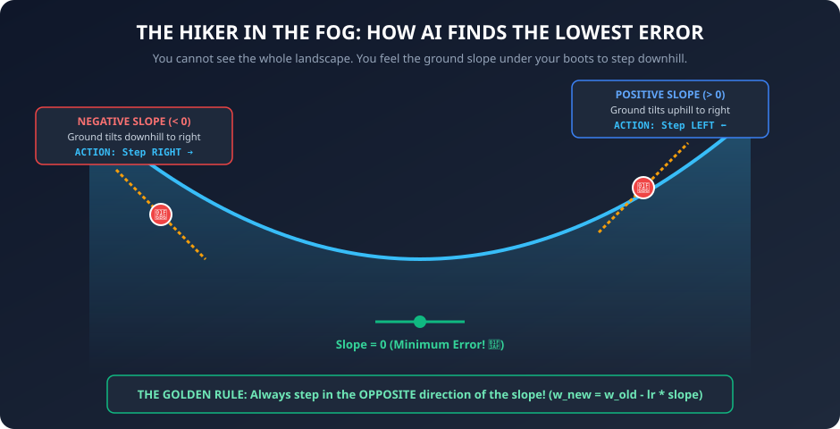
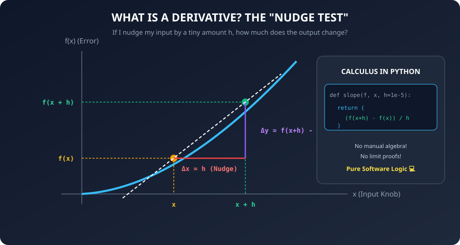
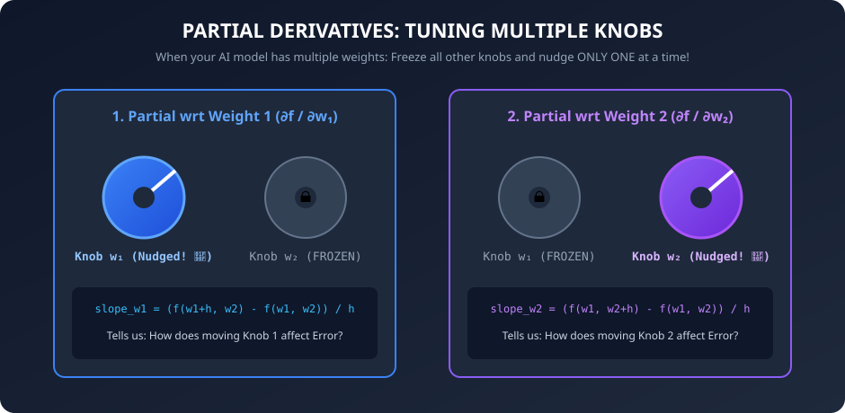
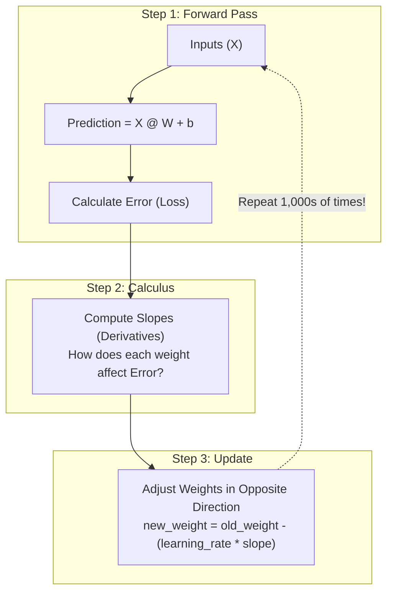

# 📈 Day 07: Slopes & Derivatives
## The Only Calculus You'll Ever Need for AI


| ⬅️ Previous Day | 📚 Course Hub | ➡️ Next Day |
|:---|:---:|---:|
| [← Day 06: Probability & Statistics](../Day_06_Probability_and_Statistics/Day_06_Probability_and_Statistics.md) | [All 50 Days Overview](../../README.md) | [Day 08: Gradients & Optimization →](../Day_08_Gradients_and_Optimization/Day_08_Gradients_and_Optimization.md) |

[](../../README.md)
[](../../README.md)
[](../../README.md)
[](../Day_01_Numbers_Variables_Functions/Day_01_Numbers_Variables_Functions.md)

---

## 📌 What Will You Learn Today?

Many software engineers avoid Machine Learning and AI because they see the word **"Calculus"** and run away.

Here is the truth:
> **You do NOT need to memorize college calculus formulas or solve symbolic integration proofs.**
>
> In AI, we only care about **one simple question**:
> *"If I tweak this weight knob by a tiny amount, does the model's error go UP or DOWN?"*

The mathematical tool that answers that question is called the **Derivative** (or **Slope**). And you can calculate it in **two lines of plain Python**!

By the end of today, you will understand:
- ✅ The **Hiker in the Fog** analogy that demystifies slopes forever.
- ✅ What a **derivative** is in plain English (the "Nudge Test").
- ✅ How to code a **numerical derivative** in Python without memorizing any calculus rules.
- ✅ Why the slope of a curve changes depending on where you stand.
- ✅ What **Partial Derivatives** ($\frac{\partial f}{\partial x}$) are (when you have multiple adjustable knobs).
- ✅ How derivatives guide AI models to learn and fix their mistakes.

---

## 🗺️ Table of Contents

- [1. Real-World Analogy: The Hiker in the Thick Fog](#1-real-world-analogy-the-hiker-in-the-thick-fog)
- [2. Slopes on Straight Lines vs. Curves](#2-slopes-on-straight-lines-vs-curves)
- [3. What Is a Derivative? The "Nudge Test"](#3-what-is-a-derivative-the-nudge-test)
- [4. Coding the Derivative in 2 Lines of Python](#4-coding-the-derivative-in-2-lines-of-python)
- [5. The 3 Possibilities for Any Slope](#5-the-3-possibilities-for-any-slope)
- [6. Partial Derivatives: When You Have Multiple Knobs](#6-partial-derivatives-when-you-have-multiple-knobs)
- [7. The AI Connection: How Models Learn From Slopes](#7-the-ai-connection-how-models-learn-from-slopes)
- [8. Key Takeaways & Cheat Sheet](#8-key-takeaways--cheat-sheet)
- [9. Practice Exercises with Solutions](#9-practice-exercises-with-solutions)

---

# 1. Real-World Analogy: The Hiker in the Thick Fog

Imagine you are hiking in the mountains. Suddenly, a **thick fog** rolls in. You cannot see more than two inches in front of your face.

Your goal is to reach the **lowest point in the valley** (where the cabin and safety are).



You cannot see the cabin. How do you find your way down?

**You use your feet to feel the slope under your boots:**
- If the ground slopes **upward to your right** (positive slope), you step to the **left** (downhill).
- If the ground slopes **downward to your right** (negative slope), you step to the **right** (downhill).
- When the ground feels **completely flat** under your feet (zero slope), you have reached the **bottom of the valley**!

| Your Current Position | What Your Boots Feel | Slope Sign | Direction to Step | Result |
| :--- | :--- | :---: | :---: | :--- |
| **High on Left Hill** | Tilts downward to the right | **Negative ($-$)** | **Step Right ($+$)** | Altitude (Error) drops |
| **High on Right Hill** | Tilts upward to the right | **Positive ($+$)** | **Step Left ($-$)** | Altitude (Error) drops |
| **At the Cabin (Valley Floor)** | Perfectly horizontal / flat | **Zero ($0$)** | **Stop! Stay put!** | Lowest possible altitude reached! |

> [!NOTE]
> **Teacher's Mental Model: Why AI is Just an Optimization Problem**
> - The altitude of the mountain is the **Error (Loss)**. High altitude = high error (bad predictions).
> - Your coordinates on the mountain are the **Model's Weights** (knobs).
> - Feeling the tilt under your feet is calculating the **Derivative (Slope)**.
> - Taking downhill steps to reach minimum error is called **Gradient Descent** (Day 08)!
> 
> When people say "ChatGPT was trained for 3 months on 25,000 GPUs", it means the supercomputers spent 3 months feeling the slope under their feet and nudging trillions of knobs downhill!

---

# 2. Slopes on Straight Lines vs. Curves

Back on [Day 01](../Day_01_Numbers_Variables_Functions/Day_01_Numbers_Variables_Functions.md), we looked at straight lines:

$$y = 2x + 3$$

On a straight line, the slope is **constant everywhere**. Every time $x$ increases by `1`, $y$ increases by `2`. The slope is always `2.0`.

### But Real-World AI Error Functions Are CURVES!

Consider a bowl-shaped error curve:

$$f(x) = x^2$$

Let's examine the points on this curve:

| Point $x$ | Altitude $f(x) = x^2$ | Steepness & Direction | Exact Slope (Derivative) | Meaning for AI |
| :---: | :---: | :--- | :---: | :--- |
| **$-3$** | $(-3)^2 = 9$ | Steeply declining to the right | **$-6.0$** | Step RIGHT fast to reduce error |
| **$-1$** | $(-1)^2 = 1$ | Gently declining to the right | **$-2.0$** | Step RIGHT gently |
| **$0$** | $(0)^2 = 0$ | Perfectly flat bottom | **$0.0$** | Perfect! Minimum error reached |
| **$+1$** | $(1)^2 = 1$ | Gently climbing to the right | **$+2.0$** | Step LEFT gently |
| **$+3$** | $(3)^2 = 9$ | Steeply climbing to the right | **$+6.0$** | Step LEFT fast to reduce error |

Notice two critical insights:
1. **On a curve, the slope is DIFFERENT at every single point!** A derivative is not a single number for the whole curve; it is a calculation of *"What is the exact slope at THIS specific point right now?"*
2. **The further you are from the bottom, the steeper the slope is.** This is brilliant for AI: when the model is making huge errors, the steep slope forces it to take big corrective steps; when it is close to perfection, the gentle slope makes it take tiny, careful adjustments!

---

# 3. What Is a Derivative? The "Nudge Test"

Forget complicated limit notation like $\lim_{h \to 0} \frac{f(x+h)-f(x)}{h}$. 

Think of a derivative as the **"Nudge Test"**:



### Step-by-Step Arithmetic Walkthrough

Let's manually perform the Nudge Test on $f(x) = x^2$ at the point **$x = 3.0$**:

| Step | Operation | Formula / Value | Result |
| :---: | :--- | :--- | :---: |
| **1** | Current Input ($x$) | $x = 3.0$ | `3.0` |
| **2** | Current Output ($y$) | $f(3.0) = 3.0^2$ | `9.0` |
| **3** | Tiny Nudge ($h$) | $h = 0.001$ | `0.001` |
| **4** | Nudged Input ($x + h$) | $3.0 + 0.001$ | `3.001` |
| **5** | Nudged Output | $f(3.001) = 3.001^2$ | `9.006001` |
| **6** | Change in Output ($\Delta y$) | $9.006001 - 9.0$ | `0.006001` |
| **7** | **Slope Ratio ($\frac{\Delta y}{\Delta x}$)** | $\frac{0.006001}{0.001}$ | **`6.001`** |

Look what happens when we use an even tinier nudge $h = 0.00001$:

$$\Delta \text{Output} = 3.00001^2 - 3^2 = 9.0000600001 - 9 = 0.0000600001$$

$$\text{Slope} = \frac{0.0000600001}{0.00001} = \mathbf{6.00001} \approx \mathbf{6.0}$$

As the nudge gets closer to zero, the slope becomes **exactly $6.0$**!

> **That is all a derivative is:**
> The exact sensitivity ratio: *"For every 1 unit I nudge this input, how many units will the output change?"*

---

# 4. Coding the Derivative in 2 Lines of Python

Let's write a universal derivative function in Python. It takes **any Python function `f`** and **any point `x`**, and returns the exact slope!

```python
def derivative(f, x, h=1e-5):
    """
    Calculate the derivative (slope) of function f at point x.
    h is a tiny nudge (0.00001).
    """
    return (f(x + h) - f(x)) / h
```

### Let's Test It on $f(x) = x^2$

Calculus textbooks prove that the theoretical derivative of $x^2$ is $2x$. 
Let's see what our 2-line Python code computes without knowing any calculus rules!

```python
def f(x):
    return x ** 2

# Test the slope at different points on the bowl:
points_to_test = [-3, -1, 0, 2, 4]

print(f"{'Point (x)':>10} | {'Theoretical (2x)':>18} | {'Python Derivative':>18}")
print("-" * 52)

for x in points_to_test:
    computed_slope = derivative(f, x)
    theoretical_slope = 2 * x
    print(f"{x:>10} | {theoretical_slope:>18} | {computed_slope:>18.4f}")
```

**Output:**
```
 Point (x) |   Theoretical (2x) |  Python Derivative
----------------------------------------------------
        -3 |                 -6 |            -5.9999
        -1 |                 -2 |            -1.9999
         0 |                  0 |             0.0000
         2 |                  4 |             4.0001
         4 |                  8 |             8.0001
```

Look at that: **Python computed the exact calculus derivative without a single formula!**
- At $x = 0$, slope is `0.0000` (flat bottom!).
- At $x = 4$, slope is `8.0001` ($\approx 8$).

---

# 5. The 3 Possibilities for Any Slope

Whenever you calculate the slope of an AI model's error function, you will get one of three answers:

```
    SLOPE > 0 (Positive)           SLOPE = 0 (Zero)           SLOPE < 0 (Negative)
    
           ▲                             ▲                             ▲
          ╱                             ───                           ╲
         ╱                                                             ╲
   Tilted UPHILL                  FLAT / MINIMUM                Tilted DOWNHILL
   
   To go downhill:               YOU ARE AT THE BOTTOM!        To go downhill:
   Step LEFT (decrease x)        Stop! Lowest error!           Step RIGHT (increase x)
```

| Slope Value | Meaning for Error | Action to Reduce Error | Mathematical Update |
| :---: | :--- | :--- | :---: |
| **Positive ($> 0$)** | Moving right increases error (going uphill) | **Decrease the weight** (step left) | $w_{\text{new}} = w - \alpha(\text{slope})$ |
| **Negative ($< 0$)** | Moving right decreases error (going downhill) | **Increase the weight** (step right) | $w_{\text{new}} = w - \alpha(\text{slope})$ |
| **Zero ($= 0$)** | Flat ground (at minimum error) | **Do nothing! You found optimal setting!** | $w_{\text{new}} = w - 0 = w$ |

> [!TIP]
> **Notice the Golden Rule of AI Optimization**:
> To go downhill, you ALWAYS step in the **OPPOSITE DIRECTION of the slope**!
> Notice how the minus sign naturally handles both cases:
> - If slope is $+4$, then $w - (0.1 \times 4) = w - 0.4$ (weight goes down!).
> - If slope is $-4$, then $w - (0.1 \times -4) = w + 0.4$ (weight goes up!).
> One simple formula automatically steers you in the right direction!

---

# 6. Partial Derivatives: When You Have Multiple Knobs

In real life, an AI model doesn't just have one variable $x$. It has **millions or billions of weights** ($w_1, w_2, w_3, \dots, \text{bias}$).

How do you calculate slopes when there are multiple knobs?

You use **Partial Derivatives**, written with a curly symbol $\partial$ ("del"):

$$\frac{\partial \text{Error}}{\partial w_1}$$

Don't let the symbol scare you. The concept is completely straightforward:

> **A Partial Derivative simply means:**
> **"Freeze all other knobs in place! Nudge ONLY ONE knob, and measure how the error changes."**



> [!NOTE]
> **Teacher's Mental Model: The Music Studio Mixing Console**
> Imagine an audio engineer sitting at a 32-channel mixing console.
> - Knob 1 controls Bass.
> - Knob 2 controls Vocals.
> - Knob 3 controls Drums.
> 
> If the song sounds muddy, how does the engineer know which knob to tweak?
> They don't turn all 32 knobs at random simultaneously!
> They **freeze Vocals and Drums**, nudge **ONLY the Bass knob** up by 1 millimeter, and listen to whether the clarity gets better or worse.
> That is a **partial derivative**!

### Step-by-Step Arithmetic Walkthrough

Suppose our error function depends on two weights $w_1$ and $w_2$:

$$\text{Error}(w_1, w_2) = (w_1)^2 + 3(w_2)$$

Let's compute both partial derivatives at $(w_1 = 3.0, w_2 = 5.0)$:

1. **Current Error**:
   $$\text{Error}(3.0, 5.0) = (3.0)^2 + 3(5.0) = 9 + 15 = \mathbf{24.0}$$

2. **Partial Derivative with respect to $w_1$ (Freeze $w_2 = 5.0$!)**:
   - Nudge $w_1$ by $h = 0.001 \implies w_1 = 3.001$
   - Keep $w_2$ frozen at $5.0$
   - $\text{Error}(3.001, 5.0) = (3.001)^2 + 3(5.0) = 9.006001 + 15 = \mathbf{24.006001}$
   - $\frac{\partial \text{Error}}{\partial w_1} = \frac{24.006001 - 24.0}{0.001} = \mathbf{6.001} \approx \mathbf{6.0}$

3. **Partial Derivative with respect to $w_2$ (Freeze $w_1 = 3.0$!)**:
   - Nudge $w_2$ by $h = 0.001 \implies w_2 = 5.001$
   - Keep $w_1$ frozen at $3.0$
   - $\text{Error}(3.0, 5.001) = (3.0)^2 + 3(5.001) = 9 + 15.003 = \mathbf{24.003}$
   - $\frac{\partial \text{Error}}{\partial w_2} = \frac{24.003 - 24.0}{0.001} = \mathbf{3.0}$

### Python Implementation: Freeze & Nudge

```python
# A function with two knobs: x and y
def error_function(x, y):
    return (x ** 2) + (3 * y)

# 1. Partial derivative with respect to x (freeze y!):
def partial_wrt_x(f, x, y, h=1e-5):
    return (f(x + h, y) - f(x, y)) / h

# 2. Partial derivative with respect to y (freeze x!):
def partial_wrt_y(f, x, y, h=1e-5):
    return (f(x, y + h) - f(x, y)) / h

# Let's test at point (x=3, y=5):
slope_x = partial_wrt_x(error_function, x=3, y=5)
slope_y = partial_wrt_y(error_function, x=3, y=5)

print(f"Slope along x-direction: {slope_x:.2f}")  # 2*x = 6.00
print(f"Slope along y-direction: {slope_y:.2f}")  # 3.00
```

**Output:**
```
Slope along x-direction: 6.00
Slope along y-direction: 3.00
```

That's it!
- Nudging $x$ by 1 increases output by ~6.
- Nudging $y$ by 1 increases output by ~3.
Both slopes are independent and calculated by freezing the other variable!

---

# 7. The AI Connection: How Models Learn From Slopes

Now you understand the secret behind how EVERY artificial intelligence model learns:



1. **Make a guess**: The network predicts house prices using its current weights.
2. **Measure the error**: The predictions are off by ₹50,000.
3. **Calculate the slopes**: For every single weight knob, calculate its partial derivative $\frac{\partial \text{Error}}{\partial w}$.
4. **Turn the knobs**: If a weight has a positive slope, decrease it slightly. If negative, increase it slightly.
5. **Repeat**: After thousands of iterations, the error shrinks to near zero. The AI has learned!

Tomorrow on **Day 08**, we will put all these slopes together into a vector called the **Gradient** and implement the complete **Gradient Descent** algorithm!

---

# 8. Key Takeaways & Cheat Sheet

```
┌────────────────────────────────────────────────────────────────────────┐
│                        DAY 07 CHEAT SHEET                              │
├────────────────────────────────────────────────────────────────────────┤
│                                                                        │
│  ⛰️ SLOPE / DERIVATIVE = How steep the ground is under your feet       │
│     • Rate of change: (Change in Output) / (Change in Input)           │
│     • Python: (f(x + h) - f(x)) / h                                    │
│                                                                        │
│  🧭 THE 3 SLOPE DIRECTIONS:                                            │
│     • Positive (> 0): Tilted uphill -> Decrease knob to go downhill.   │
│     • Negative (< 0): Tilted downhill -> Increase knob to go downhill. │
│     • Zero (= 0): Flat bottom -> You reached minimum error!            │
│                                                                        │
│  🔄 THE GOLDEN UPDATE RULE:                                            │
│     • Always move in the OPPOSITE direction of the slope!              │
│     • new_knob = old_knob - (step_size * slope)                        │
│                                                                        │
│  🎛️ PARTIAL DERIVATIVE (∂f / ∂w):                                      │
│     • When a function has multiple knobs.                              │
│     • Freeze all other knobs, nudge ONLY ONE, and observe change.      │
│                                                                        │
│  🤖 WHY AI NEEDS THIS:                                                 │
│     • "Training" an AI model = calculating slopes for all weights and   │
│       nudging them downhill to minimize error!                         │
│                                                                        │
└────────────────────────────────────────────────────────────────────────┘
```

---

# 9. Practice Exercises with Solutions

<details>
<summary><b>🏋️ Exercise 1: Finding the Minimum of a Curve Numerically</b></summary>
<br/>

Consider the error curve:

$$f(x) = (x - 4)^2 + 10$$

By looking at the formula, you can tell the minimum error ($10$) occurs when $x = 4$.
Let's write a small Python loop that starts at a random guess $x = 20.0$ and uses the slope to step downhill until it finds $x \approx 4.0$!

**Formula for each step:**
$$\text{new\_}x = \text{old\_}x - (\text{step\_size} \times \text{slope})$$

Use `step_size = 0.1` and run for 30 steps.

**Solution:**
```python
def error_function(x):
    return ((x - 4) ** 2) + 10

def get_slope(f, x, h=1e-5):
    return (f(x + h) - f(x)) / h

x = 20.0       # Terrible starting guess!
step_size = 0.1

print(f"Starting guess: x = {x:.2f}, Error = {error_function(x):.2f}\n")

for iteration in range(1, 31):
    slope = get_slope(error_function, x)
    x = x - (step_size * slope)  # Step opposite to slope!
    
    if iteration % 5 == 0 or iteration == 1:
        print(f"Step {iteration:2d} -> x = {x:.4f}, Error = {error_function(x):.4f}, Slope = {slope:.4f}")

print(f"\nFinal discovered optimal x: {x:.4f} (True minimum is 4.0!)")
```
*(You just built a 1-dimensional gradient descent optimizer!)*
</details>

<details>
<summary><b>🏋️ Exercise 2: Derivative of a Multi-Feature House Pricing Error</b></summary>
<br/>

Suppose an AI model predicts a house price using one weight:
$$\text{predicted} = \text{weight} \times \text{sqft}$$

Actual price = ₹50,00,000 for `sqft = 2000`.
Current weight = `3000` (predicts $3000 \times 2000 = 60,00,000 \implies$ overpredicting by 10 lakh!).

Loss function (Squared Error):
$$\text{Error}(\text{weight}) = (\text{predicted} - \text{actual})^2$$

1. Calculate the current error at `weight = 3000`.
2. Compute the derivative of Error with respect to `weight` using Python.
3. Is the slope positive or negative? Should we increase or decrease the weight?

**Solution:**
```python
actual_price = 5000000
sqft = 2000

def loss(weight):
    predicted = weight * sqft
    return (predicted - actual_price) ** 2

current_weight = 3000
current_error = loss(current_weight)

# Calculate derivative of loss wrt weight
slope = derivative(loss, current_weight)

print(f"Current Weight:  ₹{current_weight}")
print(f"Current Error:   {current_error:,}")
print(f"Slope:           {slope:,.2f}")

if slope > 0:
    print("Decision: Slope is POSITIVE -> We must DECREASE the weight to lower error!")
else:
    print("Decision: Slope is NEGATIVE -> We must INCREASE the weight to lower error!")
```
**Output:**
```
Current Weight:  ₹3000
Current Error:   1,000,000,000,000
Slope:           4,000,000,000.00
Decision: Slope is POSITIVE -> We must DECREASE the weight to lower error!
```
*(Decreasing the weight from 3000 towards 2500 brings the prediction closer to 50 lakh!)*
</details>

<details>
<summary><b>🏋️ Exercise 3: Two-Knob Partial Derivatives</b></summary>
<br/>

A loss function depends on two weights $w_1$ and $w_2$:
$$\text{Loss}(w_1, w_2) = (w_1 - 2)^2 + (w_2 + 5)^2$$

Write Python code to compute both partial derivatives at $(w_1 = 10, w_2 = 10)$.
What are the two slopes? In which direction should each weight be adjusted?

**Solution:**
```python
def loss(w1, w2):
    return ((w1 - 2) ** 2) + ((w2 + 5) ** 2)

h = 1e-5
w1 = 10.0
w2 = 10.0

slope_w1 = (loss(w1 + h, w2) - loss(w1, w2)) / h
slope_w2 = (loss(w1, w2 + h) - loss(w1, w2)) / h

print(f"Slope along w1: {slope_w1:.2f} (Positive -> DECREASE w1 towards 2)")
print(f"Slope along w2: {slope_w2:.2f} (Positive -> DECREASE w2 towards -5)")
```
</details>

---

## ⏭️ What's Next: Day 08 — Gradients & Optimization

Today, you learned how to calculate the slope of any function with Python.

Tomorrow on **Day 08**, we reach the **grand finale of Phase 1**:
- When you collect all the partial derivatives into a vector, you get the **Gradient**!
- We will build the complete **Gradient Descent** algorithm from scratch.
- You will understand **Learning Rate** (what happens if your steps are too big or too small).
- **The milestone achievement**: You will see how this exact algorithm is used to train every neural network and LLM in the world!

---

<p align="center">
  <b>🌟 End of Day 07 — You just mastered Calculus for AI without memorizing a single formula! 🌟</b>
</p>


---

## 🧭 Navigation & Next Steps

| ⬅️ Previous Day | 📚 Course Hub | ➡️ Next Day |
|:---|:---:|---:|
| [← Day 06: Probability & Statistics](../Day_06_Probability_and_Statistics/Day_06_Probability_and_Statistics.md) | [All 50 Days Overview](../../README.md) | [Day 08: Gradients & Optimization →](../Day_08_Gradients_and_Optimization/Day_08_Gradients_and_Optimization.md) |
