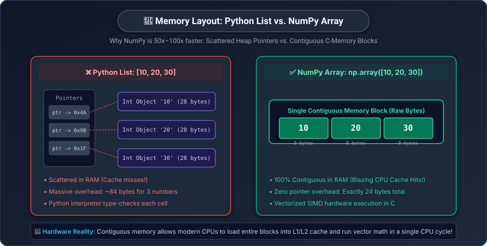
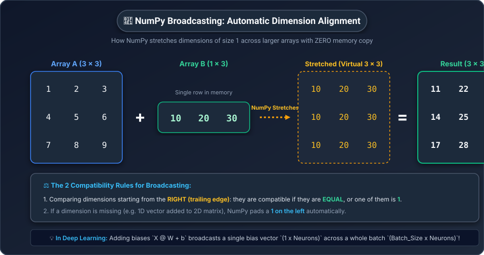

# ⚡ Day 09: NumPy — The Engine Behind All AI Math
## Hardware-Accelerated Vector & Matrix Computing in Python

[](../../README.md)
[](../../README.md)
[](../../README.md)
[](../Phase_01_Math_Foundations/README.md)

---

## 📌 What Will You Learn Today?

In [Phase 1 (Days 01–08)](../../README.md#🟢-phase-1-math-for-ai--through-python-days-0108), you conquered all the core mathematical concepts of AI using pure Python lists, loops, and basic math.

You learned how to write vectors, matrices, dot products, matrix multiplications, derivatives, and gradient descent.

Now comes the practical question:
> *"If pure Python lists can do all this math, why don't AI companies use them to train ChatGPT?"*

The answer is simple: **Speed.**
Pure Python lists are **100 times too slow** for real-world AI datasets containing billions of numbers.

Today, we enter **Phase 2: Python Data Science Toolkit**, starting with the foundation of all numerical computing: **NumPy (Numerical Python)**.

By the end of today, you will understand:
- ✅ Why pure Python lists are slow and how NumPy achieves **C-level speeds**.
- ✅ How to create 1D vectors and 2D matrices using `np.array`, `zeros`, `ones`, and `random`.
- ✅ **Vectorization**: Performing math on millions of numbers simultaneously without writing a single `for` loop.
- ✅ Array slicing, indexing, and reshaping (`.reshape()`).
- ✅ **Broadcasting**: NumPy's secret superpower that automatically aligns arrays of different shapes.
- ✅ How to write an entire neural network forward pass in **5 lines of clean NumPy**!

---

## 🗺️ Table of Contents

- [1. Real-World Analogy: The Hand Craftsman vs. The Automated Factory](#1-real-world-analogy-the-hand-craftsman-vs-the-automated-factory)
- [2. Why Pure Python Lists Are Slow (Memory Layout)](#2-why-pure-python-lists-are-slow-memory-layout)
- [3. The Speed Showdown: Python Lists vs. NumPy](#3-the-speed-showdown-python-lists-vs-numpy)
- [4. Creating NumPy Arrays](#4-creating-numpy-arrays)
- [5. Array Attributes & Properties](#5-array-attributes--properties)
- [6. Vectorized Operations (Goodbye, For Loops!)](#6-vectorized-operations-goodbye-for-loops)
- [7. Reshaping, Slicing & Flattening](#7-reshaping-slicing--flattening)
- [8. Broadcasting: NumPy's Secret Superpower](#8-broadcasting-numpys-secret-superpower)
- [9. The AI Milestone: A Neural Network Layer in 5 Lines](#9-the-ai-milestone-a-neural-network-layer-in-5-lines)
- [10. Key Takeaways & Cheat Sheet](#10-key-takeaways--cheat-sheet)
- [11. Practice Exercises with Solutions](#11-practice-exercises-with-solutions)

---

# 1. Real-World Analogy: The Hand Craftsman vs. The Automated Factory

Imagine you are tasked with stamping the company logo onto **1,000,000 sheets of paper**.

### Approach A: The Pure Python Way (The Hand Craftsman)
You sit at a wooden desk with a hand stamp.
1. Pick up sheet #1.
2. Align the stamp. Press down.
3. Put sheet #1 aside.
4. Pick up sheet #2.
5. Align the stamp. Press down...
*(You will finish in about 6 months, and your arm will fall off!)*

This is what a Python `for` loop does: it processes numbers **one-by-one, sequentially, checking types and memory addresses at every single step**.

---

### Approach B: The NumPy Way (The Industrial Hydraulic Press)
You feed the paper into a massive industrial press that stamps **1,000 sheets in a single downward slam** using pre-configured steel dies.

This is what **NumPy** does:
- It pushes the math down into **highly optimized C and Fortran code**.
- It uses your CPU's hardware **SIMD (Single Instruction, Multiple Data)** instructions to compute 8, 16, or 32 numbers in parallel on the CPU chip itself!

---

# 2. Why Pure Python Lists Are Slow (Memory Layout)

To understand why NumPy is so fast, look at how data is stored in your computer's RAM:



### Pure Python List: `[10, 20, 30]`
In Python, everything is a heavy object. A Python list does NOT store the numbers directly; it stores **pointers (memory addresses)** that point to numbers scattered randomly across your computer's RAM!

Every time Python accesses an item in a list:
1. It must jump to a new memory address (causing CPU cache misses).
2. It must check what type of object it is (`int`, `str`, `float`?).
3. It must extract the raw value.

---

### NumPy Array: `np.array([10, 20, 30])`
In NumPy, all elements must share the **exact same data type** (e.g. 64-bit integer or 32-bit float). 

Because of this, NumPy packs the raw numbers into a single, **unbroken, contiguous block of memory**:

The CPU can load the entire block into high-speed CPU cache in **one clock cycle** and process all of them together using hardware SIMD vector instructions!

> [!NOTE]
> **Teacher's Mental Model: Scattered Paper Receipts vs A Steel Ledger**
> - A Python list is like having 1,000 grocery receipts scattered all over your bedroom floor. To sum them up, you have to walk to 1,000 different spots in the room.
> - A NumPy array is like having all 1,000 numbers neatly etched side-by-side into a single steel ledger. You can scan your finger across it in a single fluid motion!

---

# 3. The Speed Showdown: Python Lists vs. NumPy

Let's test this in code! We will add **1,000,000 numbers** using pure Python, and then using NumPy:

```python
import time
import numpy as np

# Create 1 million numbers
size = 1_000_000

# 1. Pure Python List Addition
list_a = list(range(size))
list_b = list(range(size))

start_time = time.time()
result_list = [a + b for a, b in zip(list_a, list_b)]
python_time = time.time() - start_time

# 2. NumPy Array Addition
array_a = np.arange(size)
array_b = np.arange(size)

start_time = time.time()
result_array = array_a + array_b
numpy_time = time.time() - start_time

print(f"Pure Python List time: {python_time * 1000:.2f} ms")
print(f"NumPy Array time:       {numpy_time * 1000:.2f} ms")
print(f"⚡ NumPy is {python_time / numpy_time:.1f}x FASTER!")
```

**Typical Output:**
```
Pure Python List time: 104.30 ms
NumPy Array time:        1.42 ms
⚡ NumPy is 73.5x FASTER!
```

NumPy did the exact same calculation **over 70 times faster** with a clean `a + b` syntax instead of a `for` loop!

---

# 4. Creating NumPy Arrays

To use NumPy, we import it using the universal community convention:
```python
import numpy as np
```

Here are the primary ways to create arrays:

### 1. From an Existing Python List
```python
# 1D Vector (Day 02)
v = np.array([1.5, 2.5, 3.5])

# 2D Matrix (Day 03)
M = np.array([
    [1, 2, 3],
    [4, 5, 6]
])

print("Vector v:\n", v)
print("\nMatrix M:\n", M)
```

### 2. Built-in Factory Functions
In AI, we often need to initialize empty weight matrices, grids of zeros, or identity matrices:

```python
# Array filled with zeros (useful for initializing gradients / biases)
zeros = np.zeros((2, 3))       # 2 rows, 3 columns

# Array filled with ones
ones = np.ones((3, 2))         # 3 rows, 2 columns

# Array with a range of numbers (start, stop, step)
sequence = np.arange(0, 10, 2) # [0, 2, 4, 6, 8]

# 5 evenly spaced numbers between 0 and 1
grid = np.linspace(0, 1, 5)    # [0.0, 0.25, 0.5, 0.75, 1.0]

print("Zeros (2x3):\n", zeros)
print("Evenly spaced:\n", grid)
```

### 3. Random Number Arrays (AI Weight Initialization!)
Remember [Day 06](../Phase_01_Math_Foundations/Day_06_Probability_and_Statistics/Day_06_Probability_and_Statistics.md) where we learned that AI weights are initialized from a **Normal Distribution (Bell Curve)**?

NumPy does this in one function call:

```python
# Generate a 3x3 weight matrix drawn from a Bell Curve (Mean 0, Std Dev 1):
random_weights = np.random.randn(3, 3)

print("Random AI Weights (3x3):\n", np.round(random_weights, 4))
```

---

# 5. Array Attributes & Properties

Every NumPy array comes with essential inspection attributes:

```python
M = np.array([
    [10, 20, 30],
    [40, 50, 60]
])

# 1. Shape: (Rows, Columns)
print("Shape:", M.shape)     # (2, 3) -> 2 rows, 3 cols

# 2. Number of Dimensions:
print("Dimensions:", M.ndim) # 2 (2D array)

# 3. Total Element Count:
print("Total elements:", M.size) # 6

# 4. Data Type:
print("Data type:", M.dtype) # int32 or int64
```

---

# 6. Vectorized Operations (Goodbye, For Loops!)

In pure Python, doing math on lists required nested loops or list comprehensions.
In NumPy, **all standard math operators automatically apply to the entire array element-by-element**!

### Element-Wise Arithmetic:
```python
a = np.array([1, 2, 3])
b = np.array([10, 20, 30])

print("Addition:       ", a + b)       # [11, 22, 33]
print("Subtraction:    ", b - a)       # [9, 18, 27]
print("Multiplication: ", a * b)       # [10, 40, 90]
print("Division:       ", b / a)       # [10., 10., 10.]
print("Power:          ", a ** 2)      # [1, 4, 9]
```

### Universal Functions (UFuncs):
```python
scores = np.array([1.0, 2.0, 3.0])

print("Exponential e^x:", np.exp(scores))   # Used in Softmax!
print("Square Root:    ", np.sqrt(scores))
print("Natural Log ln: ", np.log(scores))
print("Sum of all:     ", np.sum(scores))   # 6.0
print("Mean (Average): ", np.mean(scores))  # 2.0
print("Max value:      ", np.max(scores))   # 3.0
```

---

### Matrix Multiplication with `@`

Remember Day 04, where we wrote 3 nested `for` loops to multiply matrices?
In NumPy, Matrix Multiplication is a single character: **`@`**!

```python
# Matrix A of shape (2 x 3)
A = np.array([
    [1, 2, 3],
    [4, 5, 6]
])

# Matrix B of shape (3 x 2)
B = np.array([
    [7, 8],
    [9, 10],
    [11, 12]
])

# Matrix Multiplication! (Inner shapes match: 3 == 3 -> Result is 2x2)
C = A @ B

print("A @ B (NumPy Matmul):\n", C)
```

**Output:**
```
A @ B (NumPy Matmul):
 [[ 58  64]
 [139 154]]
```
The exact same `[58, 64], [139, 154]` result we manually calculated on Day 04, executed in microseconds!

---

# 7. Reshaping, Slicing & Flattening

In deep learning and computer vision, data is constantly changing shape.

### 1. Reshaping (`.reshape()`)
Suppose you have 12 numbers in a flat 1D vector:
You can reshape it into any dimension, as long as the **total count of elements remains identical** ($12 = 3 \times 4 = 2 \times 6 = 4 \times 3$):

```python
flat = np.arange(12)  # [0, 1, 2, 3, 4, 5, 6, 7, 8, 9, 10, 11]

# Reshape into 3 rows, 4 columns:
mat_3x4 = flat.reshape(3, 4)
print("3x4 Matrix:\n", mat_3x4)

# Reshape into 2 rows, 6 columns:
mat_2x6 = flat.reshape(2, 6)
print("\n2x6 Matrix:\n", mat_2x6)

# Flatten back into 1D (used when feeding an image into a dense layer!):
flattened = mat_3x4.flatten()
print("\nFlattened:\n", flattened)
```

### 2. Multi-Dimensional Slicing (`[row_slice, col_slice]`)
NumPy allows you to slice rows and columns simultaneously with clean syntax:

```python
grid = np.array([
    [10, 20, 30, 40],
    [50, 60, 70, 80],
    [90, 15, 25, 35]
])

# Get row 1:
print("Row 1:", grid[1, :])            # [50, 60, 70, 80]

# Get column 2 across all rows:
print("Column 2:", grid[:, 2])         # [30, 70, 25]

# Slice a 2x2 sub-grid (rows 0-1, cols 1-2):
print("2x2 sub-grid:\n", grid[0:2, 1:3])
# [[20, 30],
#  [60, 70]]
```

---

# 8. Broadcasting: NumPy's Secret Superpower

What happens if you try to add a **Matrix** of shape `(3, 3)` and a **Vector** of shape `(1, 3)` or `(3,)`?

In pure high school mathematics, you cannot add them because their shapes don't match.
In NumPy, it works effortlessly thanks to **Broadcasting**!

> **Broadcasting automatically "stretches" the smaller array across the larger array so their shapes match, without making wasteful copies in memory!**



### The 2 Rules of Broadcasting Compatibility:
To determine if two arrays can broadcast together, compare their shapes **element-by-element starting from the RIGHT**:
1. The dimensions are **equal**, OR
2. One of the dimensions is **$1$**.

If either condition is true for all trailing dimensions, they are compatible!

| Shape A | Shape B | Compatible? | Resulting Shape |
| :---: | :---: | :---: | :---: |
| `(3, 3)` | `(1, 3)` | ✅ YES | `(3, 3)` (Stretched vertically) |
| `(4, 1)` | `(1, 5)` | ✅ YES | `(4, 5)` (Both stretch!) |
| `(64, 768)` | `(768,)` | ✅ YES | `(64, 768)` (Real neural network bias!) |
| `(3, 3)` | `(2, 3)` | ❌ NO | Dimension mismatch: 3 != 2 and neither is 1 |

### Code Example:
```python
matrix = np.array([
    [1, 2, 3],
    [4, 5, 6],
    [7, 8, 9]
])

bias = np.array([10, 20, 30])  # Shape (3,)

# NumPy automatically broadcasts bias across all 3 rows!
output = matrix + bias

print("Broadcasted Addition:\n", output)
```

**Output:**
```
Broadcasted Addition:
 [[11 22 33]
 [14 25 36]
 [17 28 39]]
```

### Real-World AI Application: Adding Bias to a Batch!
When ChatGPT processes a batch of 64 user sentences, the predictions are a matrix of shape `(64, vocab_size)`.
The bias is a single vector of shape `(vocab_size,)`.
Broadcasting automatically adds the bias to all 64 sentences in parallel with zero manual copying!

---

# 9. The AI Milestone: A Neural Network Layer in 5 Lines

Look at how our entire Phase 1 journey pays off today.

Here is a complete, real-world **Neural Network Forward Pass** with a batch of 4 inputs, 3 features, 2 neurons, weights, biases, and Softmax activation — written in **5 lines of NumPy**:

```python
import numpy as np

# 1. Batch of 4 input samples with 3 features each (Shape: 4 x 3)
X = np.array([
    [1.0, 2.0, 3.0],
    [4.0, 5.0, 6.0],
    [0.5, 1.5, 2.5],
    [2.0, 0.0, 1.0]
])

# 2. Weight Matrix: 3 inputs connected to 2 neurons (Shape: 3 x 2)
W = np.random.randn(3, 2)

# 3. Bias vector for 2 neurons (Shape: 2,)
b = np.array([0.5, -0.2])

# 4. Linear Forward Pass: Y = X @ W + b (Using Matmul + Broadcasting!)
logits = X @ W + b

# 5. Softmax Activation: Convert raw logits to probabilities per row!
exp_scores = np.exp(logits - np.max(logits, axis=1, keepdims=True)) # Safe Softmax!
probabilities = exp_scores / np.sum(exp_scores, axis=1, keepdims=True)

print("Batch Output Probabilities (4 samples x 2 classes):")
print(np.round(probabilities, 4))
print("\nRow sums (all equal 1.0!):", np.sum(probabilities, axis=1))
```

**Output:**
```
Batch Output Probabilities (4 samples x 2 classes):
[[0.8321 0.1679]
 [0.9945 0.0055]
 [0.7104 0.2896]
 [0.6218 0.3782]]

Row sums (all equal 1.0!): [1. 1. 1. 1.]
```

That's an entire deep learning prediction pipeline running on hardware-accelerated C in **5 readable lines**!

---

# 10. Key Takeaways & Cheat Sheet

```
┌────────────────────────────────────────────────────────────────────────┐
│                        DAY 09 CHEAT SHEET                              │
├────────────────────────────────────────────────────────────────────────┤
│                                                                        │
│  ⚡ NUMPY = Hardware-accelerated C-array computing for Python          │
│     • np.array([1, 2, 3]) -> Contiguous memory, 50x-100x faster!       │
│                                                                        │
│  🏗️ ARRAY CREATION:                                                    │
│     • np.zeros((r, c))        -> Grid of zeros                         │
│     • np.ones((r, c))         -> Grid of ones                          │
│     • np.arange(start, stop)  -> Range of integers                     │
│     • np.random.randn(r, c)   -> Bell-curve random weights (Normal)    │
│                                                                        │
│  🚀 VECTORIZATION:                                                     │
│     • a + b, a * 2            -> No for-loops needed!                  │
│     • A @ B                   -> Matrix Multiplication in 1 character! │
│                                                                        │
│  📐 RESHAPING & SLICING:                                               │
│     • arr.shape               -> (Rows, Columns)                       │
│     • arr.reshape(new_r, new_c)-> Reorganize dimensions                │
│     • arr[row_start:row_end, col_start:col_end] -> 2D slicing          │
│                                                                        │
│  📡 BROADCASTING:                                                      │
│     • Automatically stretches smaller arrays to match larger shapes.   │
│     • Matrix (M, N) + Vector (N,) -> Adds vector to EVERY row!         │
│                                                                        │
└────────────────────────────────────────────────────────────────────────┘
```

---

# 11. Practice Exercises with Solutions

<details>
<summary><b>🏋️ Exercise 1: Cosine Similarity in NumPy (Compare to Day 05!)</b></summary>
<br/>

On [Day 05](../Phase_01_Math_Foundations/Day_05_Dot_Product_and_Similarity/Day_05_Dot_Product_and_Similarity.md), we wrote a `cosine_similarity` function using Python loops, `zip()`, and `math.sqrt()`.

Rewrite Cosine Similarity in **two lines of NumPy** using `np.dot()` and `np.linalg.norm()`:

$$\text{cos\_sim}(a, b) = \frac{a \cdot b}{\|a\| \|b\|}$$

```python
import numpy as np

def numpy_cosine_similarity(a, b):
    # YOUR CODE HERE
    pass

# Test it:
u = np.array([1.0, 2.0, 3.0])
v = np.array([2.0, 4.0, 6.0]) # Same direction!
print(numpy_cosine_similarity(u, v)) # Expected: 1.0
```

**Solution:**
```python
import numpy as np

def numpy_cosine_similarity(a, b):
    dot = np.dot(a, b)
    norm_a = np.linalg.norm(a)
    norm_b = np.linalg.norm(b)
    return dot / (norm_a * norm_b)

u = np.array([1.0, 2.0, 3.0])
v = np.array([2.0, 4.0, 6.0])

print(f"Cosine Similarity: {numpy_cosine_similarity(u, v):.4f}")  # 1.0000
```
</details>

<details>
<summary><b>🏋️ Exercise 2: Normalizing a Dataset (Feature Scaling)</b></summary>
<br/>

In machine learning, features often have vastly different scales (e.g. `age` is 20-80, but `income` is 30,000-200,000). 
We normalize features using **Standardization (Z-Score)**:

$$X_{\text{norm}} = \frac{X - \text{mean}}{\text{std}}$$

Given this dataset of 4 people with `[Age, Salary]`:
```python
data = np.array([
    [ 25.0,  50000.0],
    [ 30.0,  60000.0],
    [ 45.0,  95000.0],
    [ 50.0, 110000.0]
])
```

Use NumPy's `np.mean()` and `np.std()` along with **Broadcasting** to standardize the dataset so each column has mean = 0 and std = 1!

**Solution:**
```python
data = np.array([
    [ 25.0,  50000.0],
    [ 30.0,  60000.0],
    [ 45.0,  95000.0],
    [ 50.0, 110000.0]
])

# axis=0 means compute across rows (per column!)
col_means = np.mean(data, axis=0)
col_stds  = np.std(data, axis=0)

# Broadcasting does the subtraction and division on all rows automatically!
standardized_data = (data - col_means) / col_stds

print("Column Means:", col_means)
print("Column Stds: ", col_stds)
print("\nStandardized Data (Mean ~ 0, Std ~ 1):\n", np.round(standardized_data, 3))
```
</details>

<details>
<summary><b>🏋️ Exercise 3: Image Grayscale Brightness & Inversion via NumPy</b></summary>
<br/>

Create a random 4x4 grayscale image with pixel values from 0 to 255:
```python
image = np.random.randint(0, 256, size=(4, 4))
```

Using vectorized NumPy operations:
1. Invert the image (negative filter from Day 03: `255 - image`).
2. Brighten the image by 20% (`image * 1.2`), and use `np.clip(brightened, 0, 255)` to ensure no pixel exceeds 255.

**Solution:**
```python
np.random.seed(42) # Reproducible random numbers
image = np.random.randint(0, 256, size=(4, 4))

print("Original Image:\n", image)

# 1. Negative Filter
inverted = 255 - image
print("\nInverted (Negative):\n", inverted)

# 2. Brightened by 20% with clipping at 255
brightened = np.clip(image * 1.2, 0, 255).astype(int)
print("\nBrightened (Capped at 255):\n", brightened)
```
</details>

---

## ⏭️ What's Next: Day 10 — Pandas (Tabular Data & Datasets)

Today, you unlocked **NumPy**: the high-performance math engine of AI.

Tomorrow on **Day 10**, we level up to **Pandas**:
- Why raw numbers need labels, headers, and column names.
- The **DataFrame**: Python's version of a super-powered Excel spreadsheet / SQL table.
- Loading real CSV and JSON datasets from the web.
- Filtering, grouping, handling missing `NaN` values, and preparing clean data for Machine Learning models!

---

<p align="center">
  <b>🌟 End of Day 09 — You've mastered NumPy, the bedrock of AI computing! 🌟</b>
</p>
