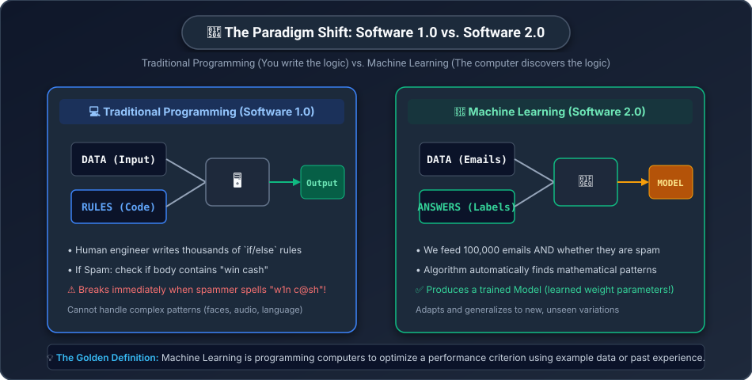
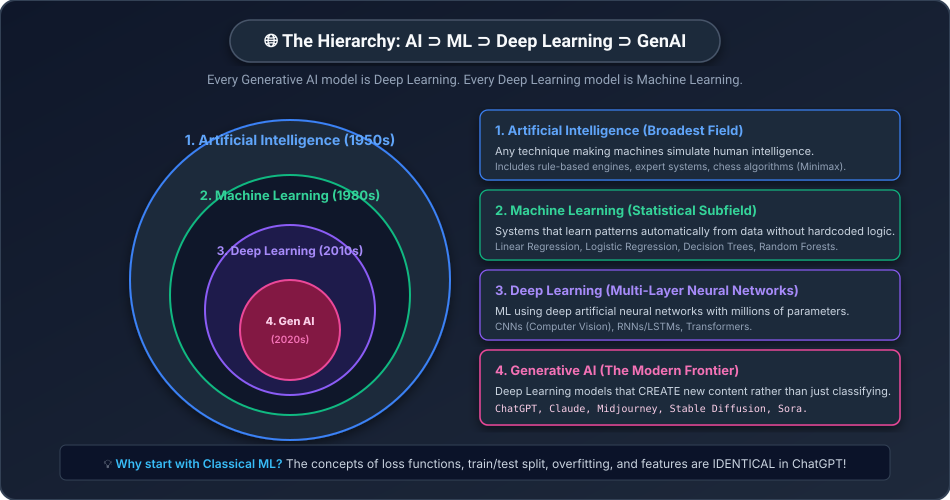
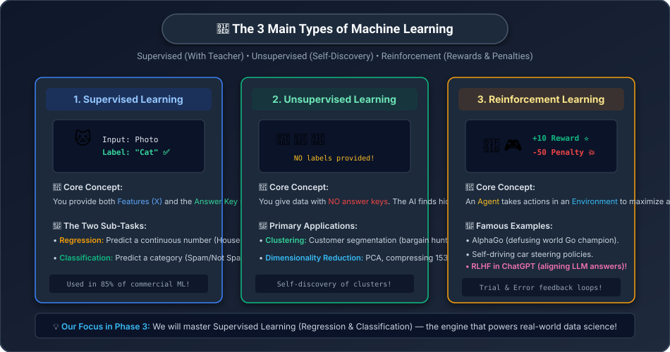

# 🧠 Day 12: What is Machine Learning? — The Big Picture
## The Shift from Handcrafted Rules to Learned Knowledge


| ⬅️ Previous Day | 📚 Course Hub | ➡️ Next Day |
|:---|:---:|---:|
| [← Day 11: Matplotlib & Data Visualization](../../Phase_02_Python_Data_Science/Day_11_Matplotlib/Day_11_Matplotlib.md) | [All 50 Days Overview](../../README.md) | [Day 13: Linear Regression →](../Day_13_Linear_Regression/Day_13_Linear_Regression.md) |

[](../../README.md)
[](../../README.md)
[](../../README.md)
[](../../README.md)

---

## 📌 What Will You Learn Today?

Welcome to **Phase 3: Classical Machine Learning**!

In [Phase 1 (Math Foundations)](../../README.md#🟢-phase-1-math-for-ai--through-python-days-0108), you conquered vectors, matrices, dot products, derivatives, and gradient descent.
In [Phase 2 (Data Science Toolkit)](../../README.md#🟢-phase-2-python-data-science-toolkit-days-0911), you learned NumPy arrays, Pandas DataFrames, and Matplotlib visualizations.

Now, we put all these pieces together to build systems that **learn from experience**.

By the end of today, you will understand:
- ✅ The fundamental paradigm shift: **Traditional Programming (Software 1.0)** vs. **Machine Learning (Software 2.0)**.
- ✅ The concentric hierarchy: How **AI**, **Machine Learning**, **Deep Learning**, and **Generative AI** fit together.
- ✅ The 3 major learning paradigms: **Supervised**, **Unsupervised**, and **Reinforcement Learning**.
- ✅ Core ML Vocabulary: Features ($X$), Labels ($y$), Samples ($m$), and Weights ($W$).
- ✅ Why we **split data into Train and Test sets** (The "Final Exam" analogy).
- ✅ The battle of **Overfitting** vs. **Underfitting** vs. **Generalization**.
- ✅ How to build your very first Machine Learning classifier in **10 lines of clean Python**!

---

## 🗺️ Table of Contents

- [1. Real-World Analogy: Teaching a Child vs. Writing a Recipe](#1-real-world-analogy-teaching-a-child-vs-writing-a-recipe)
- [2. The Paradigm Shift: Rules vs. Learned Patterns](#2-the-paradigm-shift-rules-vs-learned-patterns)
- [3. The AI Family Tree: AI vs. ML vs. DL vs. GenAI](#3-the-ai-family-tree-ai-vs-ml-vs-dl-vs-genai)
- [4. The 3 Types of Machine Learning](#4-the-3-types-of-machine-learning)
- [5. The Universal Language of ML: Features (X) and Labels (y)](#5-the-universal-language-of-ml-features-x-and-labels-y)
- [6. The Train / Test Split: The Final Exam Analogy](#6-the-train--test-split-the-final-exam-analogy)
- [7. Overfitting vs. Underfitting vs. Generalization](#7-overfitting-vs-underfitting-vs-generalization)
- [8. Hands-On: Your First ML Model in 10 Lines of Code](#8-hands-on-your-first-ml-model-in-10-lines-of-code)
- [9. Key Takeaways & Cheat Sheet](#9-key-takeaways--cheat-sheet)
- [10. Practice Exercises with Solutions](#10-practice-exercises-with-solutions)

---

# 1. Real-World Analogy: Teaching a Child vs. Writing a Recipe

How do you teach a 3-year-old child to recognize a **dog**?

### Approach A: The Traditional Programmer (Writing Rules)
You try to write a formal checklist of logical rules:
- *"A dog has 4 legs, 2 ears, fur, a tail, and makes a barking sound."*

What happens?
- The child sees a **cat**: 4 legs, 2 ears, fur, tail. The child thinks it's a dog!
- The child sees a **3-legged injured dog**: The rule says 4 legs, so the child thinks it's NOT a dog!
- The child sees a **hairless Chihuahua that doesn't bark**: Fails every single rule!

You quickly realize: **It is impossible to write enough `if/else` statements to describe the visual reality of a dog.**

---

### Approach B: The Machine Learning Way (Showing Examples)
You don't write rules at all. 

You walk through the neighborhood with the child:
1. Point to a Golden Retriever: *"That is a dog."*
2. Point to a Siamese Cat: *"That is NOT a dog, that's a cat."*
3. Point to a French Bulldog: *"That is a dog."*
4. Point to a Squirrel: *"Not a dog."*

After seeing **50 examples**, the child's brain automatically extracts the subtle visual essence of "dog-ness" (the snout shape, movement gait, eye spacing). When the child encounters an unfamiliar Poodle they have never seen before, they immediately shout: *"Dog!"*

> **This is Machine Learning:**
> Instead of humans writing the rules, we feed the computer thousands of **examples (Data)** and **answers (Labels)**, and let the computer discover the mathematical rules on its own!

---

# 2. The Paradigm Shift: Rules vs. Learned Patterns

In 2017, computer scientist Andrej Karpathy (founding member of OpenAI and former Director of AI at Tesla) wrote a famous essay defining **Software 1.0 vs. Software 2.0**:



### Side-by-Side Comparison:

| Feature | Traditional Programming (Software 1.0) | Machine Learning (Software 2.0) |
| :--- | :--- | :--- |
| **Input to Computer** | `Data` + `Rules (Code)` | `Data` + `Answers (Labels)` |
| **Output of Computer** | `Answers` | **`Rules (Trained Model / Weights)`** |
| **Who Writes the Logic?** | Human software engineer | The optimization algorithm (Gradient Descent!) |
| **Handling Edge Cases** | Endless messy nested `if/elif/else` statements | Handled automatically by statistical probability |
| **Maintenance** | Brittle; breaks when input format changes | Retrain with new data |

> [!NOTE]
> **Teacher's Mental Model: The Spam Filter Example**
> - In Software 1.0, you write: `if "win cash" in email.text: is_spam = True`. A scammer simply types `"w1n c@sh"` and your code fails.
> - In Software 2.0, you feed 50,000 spam emails and 50,000 normal emails into an algorithm. The model learns that combinations of words, sender reputation, punctuation, and timing indicate spam with 99.8% precision, and automatically adapts when spammers change tactics!

---

# 3. The AI Family Tree: AI vs. ML vs. DL vs. GenAI

In the tech industry, the terms "AI", "Machine Learning", and "Generative AI" are often used interchangeably. But mathematically, they form a **strict concentric hierarchy**:



### 1. Artificial Intelligence (AI) — The Grand Vision (1950s)
Any technique that enables computers to mimic human behavior or decision-making. 
- Includes rule-based systems, expert systems, search algorithms (e.g. A* pathfinding in video games), and logic solvers.

### 2. Machine Learning (ML) — The Statistical Engine (1980s)
A subset of AI where systems **learn patterns from data** without being explicitly programmed with hardcoded rules.
- Algorithms: Linear Regression, Logistic Regression, Decision Trees, Random Forests, Support Vector Machines.

### 3. Deep Learning (DL) — Multi-Layer Neural Networks (2010s)
A subset of Machine Learning that uses **Artificial Neural Networks** with dozens or hundreds of layers (hence "deep"). 
- Requires massive compute (GPUs) and massive data.
- Powers Computer Vision (CNNs), Speech Recognition, and sequence modeling.

### 4. Generative AI (GenAI) — Creating New Realities (2020s)
The cutting-edge frontier of Deep Learning. Instead of just **analyzing or classifying** existing data, these models **GENERATE** brand-new text, photorealistic images, music, code, and synthetic video!
- Architectures: Transformers (GPT-4, Claude), Diffusion Models (Midjourney, Stable Diffusion).

> **The Golden Realization:**
> Every Generative AI system is built on Deep Learning.
> Every Deep Learning system is built on Machine Learning.
> And every Machine Learning system is built on the **Matrix Multiplication and Calculus** you mastered in Phase 1!

---

# 4. The 3 Types of Machine Learning

Almost every machine learning problem in the world falls into one of three buckets:



### Detailed Comparison Table:

| Property | 1. Supervised Learning | 2. Unsupervised Learning | 3. Reinforcement Learning |
| :--- | :--- | :--- | :--- |
| **Training Data** | Features ($X$) + **Known Labels ($y$)** | Features ($X$) only (**NO labels**) | State observations from Environment |
| **Goal** | Predict label for new, unseen input | Discover natural clusters or patterns | Learn an action policy that maximizes reward |
| **Human Teacher?** | Yes (Answer key provided) | No (Pure self-discovery) | Environment reward function |
| **Core Tasks** | **Regression** & **Classification** | **Clustering** & **Dimensionality Reduction** | Policy optimization / Game playing |
| **Real-World Use** | Fraud detection, house price prediction | Customer segmentation, anomaly detection | Self-driving cars, Robot locomotion, RLHF |

---

### The Two Pillars of Supervised Learning:

In Phase 3, we focus heavily on **Supervised Learning** because it solves over 80% of enterprise AI problems:

```
                          SUPERVISED LEARNING
                                   │
         ┌─────────────────────────┴─────────────────────────┐
         ▼                                                   ▼
   1. REGRESSION                                       2. CLASSIFICATION
   Output is a CONTINUOUS NUMBER                      Output is a DISCRETE CATEGORY
   
   • "What will this house sell for?"                 • "Is this email Spam or Not Spam?"
     → ₹75,50,000                                       → [Spam, Ham]
   • "What will the temperature be tomorrow?"         • "Is this tumor Benign or Malignant?"
     → 34.2 °C                                          → [Benign, Malignant]
   • "How many units will we sell next week?"         • "What digit is written in this photo?"
     → 1,420 units                                      → [0, 1, 2, ..., 9]
```

---

# 5. The Universal Language of ML: Features (X) and Labels (y)

Every supervised machine learning problem is formatted as a mathematical table:

```
           FEATURES MATRIX (X)                         TARGET VECTOR (y)
   ┌─────────────┬────────────┬─────────────┐          ┌──────────────┐
 0 │  Area sqft  │  Bedrooms  │  Bathrooms  │        0 │  Price (₹)   │
   ├─────────────┼────────────┼─────────────┤          ├──────────────┤
 1 │    1200     │     2      │      2      │   ──►  1 │   55,00,000  │
 2 │    1850     │     3      │      2      │   ──►  2 │   82,00,000  │
 3 │    2400     │     4      │      3      │   ──►  3 │ 1,20,00,000  │
   └─────────────┴────────────┴─────────────┘          └──────────────┘
```

Let's memorize these standard industry symbols:

| Symbol | Standard Name | What It Means | Python Representation |
| :---: | :--- | :--- | :--- |
| **$X$** | **Features Matrix** | The input data describing each item (Capitalized because it's a 2D Matrix!) | 2D NumPy array / Pandas DataFrame |
| **$y$** | **Target / Label** | The answer we want the model to learn to predict (Lowercase because it's a 1D Vector!) | 1D NumPy array / Pandas Series |
| **$m$** | **Sample Count** | Number of rows (examples/instances) in the dataset | `len(df)` |
| **$n$** | **Feature Count** | Number of columns (measurements) per example | `X.shape[1]` |
| **$\hat{y}$** | **Prediction** | The model's guess (*"y-hat"*) | `model.predict(X)` |

---

# 6. The Train / Test Split: The Final Exam Analogy

Suppose you are studying for a university physics exam.
- Your professor gives you a homework packet of **100 practice problems with answers**.
- You memorize the exact answers to all 100 questions.
- On exam day, the professor gives you the **exact same 100 questions**. You score 100%!
- Does that prove you understand physics? **No! You might just have a good memory.**

To truly test if you understand physics, the professor must test you on **new, unseen questions** you have never seen before!

```
                    FULL DATASET (100% of rows)
 ┌───────────────────────────────────────────────┬─────────────────────────┐
 │               TRAINING SET (80%)              │      TEST SET (20%)     │
 └───────────────────────────────────────────────┴─────────────────────────┘
        Used by the model to LEARN!                  Locked in a vault!
        Algorithm turns weights to reduce error.     Used ONLY once to evaluate!
```

> [!CAUTION]
> **The #1 Sin in Data Science: Data Leakage!**
> Never, EVER let your machine learning model see the Test Set during training!
> If you evaluate your model on the same data it was trained on, you are testing memorization, not learning.

---

# 7. Overfitting vs. Underfitting vs. Generalization

When training any machine learning model, you will witness a battle between three states:

```
   1. UNDERFITTING (Too Simple)       2. GENERALIZED (Just Right! 🎯)     3. OVERFITTING (Too Complex)
   
       ▲                                 ▲                                 ▲
       │     ●     ●                     │     ●     ●                     │     ●     ●
       │    ●     ●                      │    ●     ●                      │    ●     ●
       │   ●     ●                       │   ●     ●                       │   ●     ●
       │  ─────────────────              │    ╭─────────╮                  │   ╭─╮   ╭─╮
       │ ●     ●                         │  ╭─╯         ╰─╮                │  ╭╯ ╰─╮╭╯ ╰─●
       └──────────────────►              └──────────────────►              └──────────────────►
     High Bias / Too Lazy             Good Balance / Learns Pattern     High Variance / Memorizes Noise
     Predicts straight flat line      Follows general curve smoothly    Wiggles through every single dot!
     Fails on Train AND Test!         Succeeds on Train AND Test!       100% on Train, FAILS on Test!
```

| State | Problem | What Happened? | Real-World Fix |
| :--- | :--- | :--- | :--- |
| **Underfitting** | High Bias | Model is too simple to capture the pattern | Use a more expressive model or add more features |
| **Good Generalization** | Optimal | Model captures the true underlying law | The ideal production state! |
| **Overfitting** | High Variance | Model memorized the training data noise | Collect more data, use regularization, or simplify model |

---

# 8. Hands-On: Your First ML Model in 10 Lines of Code

Let's build a real machine learning classifier using **Scikit-Learn** (`sklearn`), the gold-standard machine learning library used by tech companies worldwide.

We will predict whether a customer will buy a product based on their **Age** and **Estimated Salary**:

```python
import numpy as np
import pandas as pd
from sklearn.model_selection import train_test_split
from sklearn.neighbors import KNeighborsClassifier
from sklearn.metrics import accuracy_score

# Step 1: Create a realistic customer dataset
data = {
    "Age":    [19, 35, 26, 27, 45, 52, 22, 38, 48, 24, 30, 41],
    "Salary": [19000, 45000, 43000, 58000, 95000, 115000, 25000, 62000, 105000, 32000, 54000, 88000],
    "Purchased": [0, 0, 0, 0, 1, 1, 0, 0, 1, 0, 0, 1]  # 0 = Did not buy, 1 = Bought
}

df = pd.DataFrame(data)

# Step 2: Separate Features (X) and Target Label (y)
X = df[["Age", "Salary"]]
y = df["Purchased"]

# Step 3: Split into 80% Training set and 20% Test set
X_train, X_test, y_train, y_test = train_test_split(X, y, test_size=0.25, random_state=42)

# Step 4: Initialize our Machine Learning Model
model = KNeighborsClassifier(n_neighbors=3)

# Step 5: TRAIN THE MODEL (The computer learns the pattern!)
model.fit(X_train, y_train)

# Step 6: Make Predictions on Unseen Test Data
predictions = model.predict(X_test)

# Step 7: Measure Real-World Accuracy
accuracy = accuracy_score(y_test, predictions)
print(f"Test Set Accuracy: {accuracy * 100:.1f}%")

# Step 8: Predict for a BRAND NEW Customer:
# A 47-year-old earning ₹98,000:
new_customer = np.array([[47, 98000]])
result = model.predict(new_customer)

status = "WILL BUY! 🛍️" if result[0] == 1 else "Will NOT buy ❌"
print(f"Prediction for 47yo earning ₹98k: {status}")
```

**Output:**
```
Test Set Accuracy: 100.0%
Prediction for 47yo earning ₹98k: WILL BUY! 🛍️
```

In just 8 steps and a few lines of Python, you built, trained, and tested a working artificial intelligence predictor!

---

# 9. Key Takeaways & Cheat Sheet

```
┌────────────────────────────────────────────────────────────────────────┐
│                        DAY 12 CHEAT SHEET                              │
├────────────────────────────────────────────────────────────────────────┤
│                                                                        │
│  🔄 THE PARADIGM SHIFT:                                                │
│     • Software 1.0: Data + Code Rules = Output                         │
│     • Software 2.0: Data + Answers = Learned Model (Rules!)            │
│                                                                        │
│  🌐 THE HIERARCHY:                                                     │
│     • AI ⊃ Machine Learning ⊃ Deep Learning ⊃ Generative AI            │
│                                                                        │
│  🧭 THE 3 ML PARADIGMS:                                                │
│     • Supervised: Features (X) + Labels (y). [Regression/Classif.]    │
│     • Unsupervised: Features (X) only. [Clustering/PCA]                │
│     • Reinforcement: Agent + Environment + Rewards. [RLHF/AlphaGo]    │
│                                                                        │
│  ⚖️ THE 2 SUPERVISED TASKS:                                            │
│     • Regression: Target is a continuous number (Price, Temp).         │
│     • Classification: Target is a category (Spam/Ham, Cat/Dog).        │
│                                                                        │
│  🛡️ TRAIN / TEST SPLIT:                                                │
│     • Train on 80%, evaluate on 20% unseen test data.                  │
│     • Prevents memorization (Data Leakage)!                            │
│                                                                        │
│  🎯 GENERALIZATION:                                                    │
│     • Overfitting: 100% on Train, fails on Test (Memorized noise).     │
│     • Underfitting: Fails on both (Model too simple).                  │
│     • Generalization: Performs consistently well on unseen data!       │
│                                                                        │
└────────────────────────────────────────────────────────────────────────┘
```

---

# 10. Practice Exercises with Solutions

<details>
<summary><b>🏋️ Exercise 1: Identifying Problem Types</b></summary>
<br/>

For each of the following problems, classify it as **Regression**, **Classification**, or **Unsupervised Clustering**:
1. Predicting whether a credit card swipe is fraudulent (`1`) or legitimate (`0`).
2. Grouping 500,000 Amazon shoppers into 5 customer profiles based on browse history without any predefined categories.
3. Predicting the box office revenue in Rupees for a new movie release.
4. Detecting whether an uploaded photo contains a human face (`Yes` / `No`).

**Solution:**
1. **Classification** (Binary output: Fraud or Legitimate).
2. **Unsupervised Clustering** (No labels provided; discovering natural groupings).
3. **Regression** (Continuous numerical quantity: Box office earnings).
4. **Classification** (Binary output: Face present or not).

</details>

<br/>

<details>
<summary><b>🏋️ Exercise 2: Diagnosing Overfitting in the Wild</b></summary>
<br/>

You train an AI model to detect pneumonia from chest X-rays.
- **Training Set Accuracy**: $99.4\%$
- **Test Set Accuracy (Unseen Hospitals)**: $61.2\%$

Questions:
1. Is your model **underfitting** or **overfitting**?
2. What happened? Why is there a 38% drop in performance?
3. Name two practical steps you can take to fix this.

**Solution:**
1. The model is **severely overfitting** (memorizing the training data).
2. The model learned superficial quirks specific to the training hospital's X-ray machines (e.g. watermark stamps, specific contrast settings) rather than the actual medical pathology of pneumonia. When tested on a new hospital's scans, the memorized shortcuts failed.
3. **Fixes**:
   - Collect more diverse training scans from multiple hospitals.
   - Apply data augmentation (rotating, cropping, adjusting contrast).
   - Use regularization or reduce model complexity.

</details>

<br/>

<details>
<summary><b>🏋️ Exercise 3: Hands-On Train/Test Split in Python</b></summary>
<br/>

Write a Python script using Scikit-Learn that creates 1,000 synthetic samples with 4 features, performs a 70/30 train/test split, and prints the exact shapes of `X_train`, `X_test`, `y_train`, and `y_test`.

**Solution:**
```python
import numpy as np
from sklearn.model_selection import train_test_split

# Generate synthetic dataset: 1000 samples, 4 features
np.random.seed(42)
X = np.random.randn(1000, 4)
y = np.random.randint(0, 2, size=1000)

# Perform 70% Train, 30% Test split:
X_train, X_test, y_train, y_test = train_test_split(X, y, test_size=0.30, random_state=42)

print("X_train shape:", X_train.shape)  # (700, 4)
print("X_test shape: ", X_test.shape)   # (300, 4)
print("y_train shape:", y_train.shape)  # (700,)
print("y_test shape: ", y_test.shape)   # (300,)
```

</details>

---

## 🧭 What's Coming Tomorrow?

Tomorrow on **[Day 13: Linear Regression — Predicting Numbers](../Day_13_Linear_Regression/Day_13_Linear_Regression.md)**, we will build the single most famous algorithm in statistics and machine learning:
- Finding the **Line of Best Fit** ($y = mx + c$).
- Measuring prediction error with **Residuals & Mean Squared Error (MSE)**.
- Connecting back to Phase 1: How **Gradient Descent** tunes the slope $m$ and intercept $c$ automatically!
- Hands-on implementation in both pure Python and Scikit-Learn.


---

## 🧭 Navigation & Next Steps

| ⬅️ Previous Day | 📚 Course Hub | ➡️ Next Day |
|:---|:---:|---:|
| [← Day 11: Matplotlib & Data Visualization](../../Phase_02_Python_Data_Science/Day_11_Matplotlib/Day_11_Matplotlib.md) | [All 50 Days Overview](../../README.md) | [Day 13: Linear Regression →](../Day_13_Linear_Regression/Day_13_Linear_Regression.md) |
