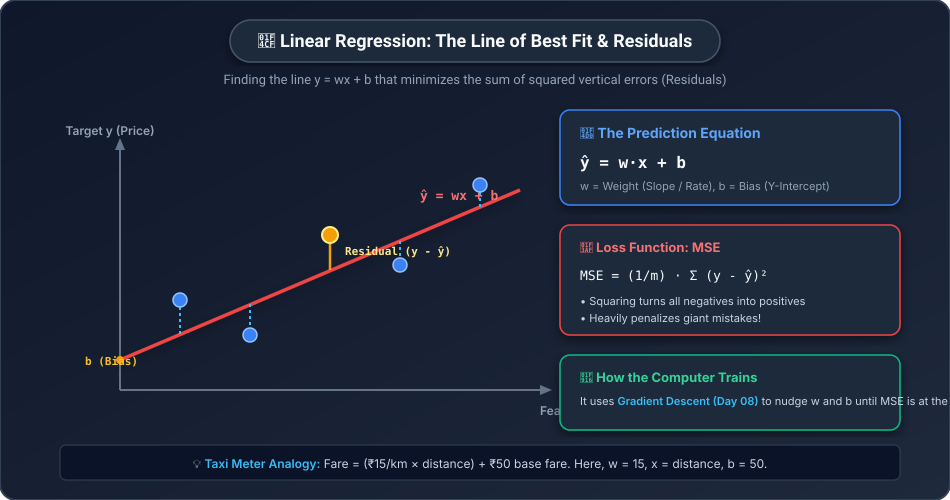
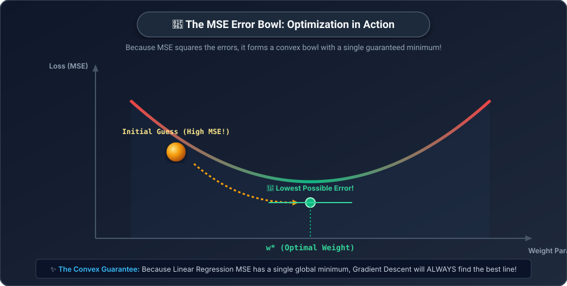

# 📏 Day 13: Linear Regression — Predicting Numbers
## The Foundation of All Predictive Modeling


| ⬅️ Previous Day | 📚 Course Hub | ➡️ Next Day |
|:---|:---:|---:|
| [← Day 12: What is Machine Learning?](../Day_12_What_is_Machine_Learning/Day_12_What_is_Machine_Learning.md) | [All 50 Days Overview](../../README.md) | [Day 14: Logistic Regression & Classification →](../Day_14_Logistic_Regression_and_Classification/Day_14_Logistic_Regression_and_Classification.md) |

[](../../README.md)
[](../../README.md)
[](../../README.md)
[](../Day_12_What_is_Machine_Learning/Day_12_What_is_Machine_Learning.md)

---

## 📌 What Will You Learn Today?

Yesterday on [Day 12](../Day_12_What_is_Machine_Learning/Day_12_What_is_Machine_Learning.md), you learned the big picture of Machine Learning: instead of humans writing rules, algorithms learn patterns from data.

Today, we dive into the **oldest, most reliable, and most widely used algorithm in all of data science: Linear Regression.**

Whenever an AI model needs to predict a **continuous number** — like tomorrow's stock price, the sale price of a home, or the delivery time of an Uber ride — Linear Regression is the starting baseline.

By the end of today, you will understand:
- ✅ The **Auto-Rickshaw / Taxi Meter** analogy that demystifies regression equations.
- ✅ The **Line of Best Fit**: $\hat{y} = w \cdot x + b$.
- ✅ **Residuals**: The vertical errors between reality and prediction.
- ✅ **Mean Squared Error (MSE)**: Why we square errors instead of just adding them up.
- ✅ How **Gradient Descent (from Day 08)** automatically finds the optimal slope ($w$) and intercept ($b$).
- ✅ How to build Linear Regression in **Scikit-Learn** in 4 lines of Python.
- ✅ **Multiple Linear Regression**: Predicting prices using dozens of features simultaneously.
- ✅ How to grade regression models using **$R^2$ Score**, **MAE**, and **RMSE**.

---

## 🗺️ Table of Contents

- [1. Real-World Analogy: The City Taxi Meter](#1-real-world-analogy-the-city-taxi-meter)
- [2. The Math: The Line of Best Fit](#2-the-math-the-line-of-best-fit)
- [3. What Are Residuals? Measuring Prediction Mistakes](#3-what-are-residuals-measuring-prediction-mistakes)
- [4. The Loss Function: Mean Squared Error (MSE)](#4-the-loss-function-mean-squared-error-mse)
- [5. How the Computer Finds the Best Line: Gradient Descent](#5-how-the-computer-finds-the-best-line-gradient-descent)
- [6. Linear Regression with Scikit-Learn](#6-linear-regression-with-scikit-learn)
- [7. Multiple Linear Regression: Stacking Features](#7-multiple-linear-regression-stacking-features)
- [8. Evaluating Your Model: R² Score, MAE, and RMSE](#8-evaluating-your-model-r-score-mae-and-rmse)
- [9. Key Takeaways & Cheat Sheet](#9-key-takeaways--cheat-sheet)
- [10. Practice Exercises with Solutions](#10-practice-exercises-with-solutions)

---

# 1. Real-World Analogy: The City Taxi Meter

Imagine you hail a yellow taxi in Mumbai or New York.

Before the wheels even turn, the driver starts the meter.
1. The meter immediately reads **₹50** (or $3.00). This is the **Base Fare** (fixed minimum cost).
2. For every kilometer driven, the meter adds **₹15**.

```
Distance Driven (x)      Calculation                 Total Fare (y)
───────────────────      ───────────                 ──────────────
0 km                     (15 × 0)  + 50              ₹50  (Base fare)
5 km                     (15 × 5)  + 50 = 75 + 50    ₹125
10 km                    (15 × 10) + 50 = 150 + 50   ₹200
20 km                    (15 × 20) + 50 = 300 + 50   ₹350
```

You can express the taxi fare as a simple mathematical equation:

$$\text{Fare} = (15 \times \text{Distance}) + 50$$

In Machine Learning, this equation is written as:

$$\hat{y} = w \cdot x + b$$

- $x$ is the **Feature** (Distance).
- $w = 15$ is the **Weight** (The rate / slope: how much fare increases per km).
- $b = 50$ is the **Bias** (The base fare / intercept: fare when distance is 0).
- $\hat{y}$ is the **Predicted Target** (Fare).

> **In traditional programming, you are given $w$ and $b$ and calculate $y$.**
> **In Machine Learning, you are given thousands of taxi receipts $(x, y)$, and the computer must DISCOVER $w$ and $b$ automatically!**

---

# 2. The Math: The Line of Best Fit

In real life, data points never line up in a perfectly straight row like a taxi meter. 

Look at real-estate data: two houses with the exact same 1,500 square feet might sell for slightly different amounts depending on the view, paint, or buyer urgency:



Because the dots don't line up in a perfect line, our goal is to draw a **Line of Best Fit** that cuts through the cloud of points with the **least total error**.

$$\hat{y} = w_1 x_1 + b$$

Where:
- $w_1$: Slope / Weight (How much $y$ changes when $x$ increases by 1).
- $b$: Intercept / Bias (Where the line crosses the vertical Y-axis).

---

# 3. What Are Residuals? Measuring Prediction Mistakes

For any single data point, the difference between the **actual observed value ($y$)** and what our line **predicted ($\hat{y}$)** is called the **Residual** (or Error):

$$\text{Residual}_i = y_i - \hat{y}_i$$

Let's look at an example with 4 actual houses:

| House | Area ($x$) | Actual Price ($y$) | Model Guess ($\hat{y}$) | Residual ($y - \hat{y}$) | Meaning |
| :---: | :---: | :---: | :---: | :---: | :--- |
| **A** | 1000 sqft | ₹45 Lakhs | ₹42 Lakhs | **$+3$ Lakhs** | Model under-predicted by ₹3L |
| **B** | 1500 sqft | ₹60 Lakhs | ₹65 Lakhs | **$-5$ Lakhs** | Model over-predicted by ₹5L |
| **C** | 2000 sqft | ₹90 Lakhs | ₹88 Lakhs | **$+2$ Lakhs** | Model under-predicted by ₹2L |
| **D** | 2500 sqft | ₹110 Lakhs | ₹110 Lakhs | **$0$ Lakhs** | Perfect prediction! 🎯 |

---

# 4. The Loss Function: Mean Squared Error (MSE)

How do we measure the overall quality of our line across all houses?

### Why Not Just Add Up the Residuals?
Notice what happens if you just sum the residuals from the table above:

$$\text{Sum} = (+3) + (-5) + (+2) + (0) = \mathbf{0}$$

The positive mistakes ($+3, +2$) and negative mistake ($-5$) **canceled each other out**, giving a sum of zero! The computer would think the line is 100% perfect, even though it missed almost every house!

### The Solution: Square Every Mistake!
To prevent negative and positive errors from canceling out, we **square** each residual before averaging them:

$$\text{MSE} = \frac{1}{m} \sum_{i=1}^m (y_i - \hat{y}_i)^2$$

### Hand-Calculated Step-by-Step Walkthrough:

| House | Actual ($y$) | Predicted ($\hat{y}$) | Error ($y - \hat{y}$) | Squared Error $(y - \hat{y})^2$ |
| :---: | :---: | :---: | :---: | :---: |
| **A** | 45 | 42 | $+3$ | $3^2 = \mathbf{9}$ |
| **B** | 60 | 65 | $-5$ | $(-5)^2 = \mathbf{25}$ |
| **C** | 90 | 88 | $+2$ | $2^2 = \mathbf{4}$ |
| **D** | 110 | 110 | $0$ | $0^2 = \mathbf{0}$ |
| **Total** | | | | $\sum = 9 + 25 + 4 + 0 = \mathbf{38}$ |

$$\text{MSE} = \frac{38}{4} = \mathbf{9.5}$$

> [!NOTE]
> **Two Brilliant Reasons Why We Square Errors:**
> 1. **Squares are always positive**: $3^2 = 9$ and $(-5)^2 = 25$. Errors can never cancel out.
> 2. **Heavy penalty on huge blunders**: A small mistake of $2$ costs $4$. A big mistake of $10$ costs $100$! The model is heavily motivated to avoid catastrophic misses.

---

# 5. How the Computer Finds the Best Line: Gradient Descent

Because the loss function squares the errors, plotting MSE against the weight $w$ creates a smooth, symmetric **Parabolic Bowl**:



Notice how beautifully this connects to **Day 07 (Derivatives)** and **Day 08 (Gradient Descent)**:
1. We start with random guesses for the slope $w$ and bias $b$ (e.g., $w = 0.0, b = 0.0$).
2. We calculate the slope of the error bowl: $\frac{\partial \text{MSE}}{\partial w}$ and $\frac{\partial \text{MSE}}{\partial b}$.
3. We update the line downhill:
   $$w_{\text{new}} = w - \alpha \frac{\partial \text{MSE}}{\partial w}$$
   $$b_{\text{new}} = b - \alpha \frac{\partial \text{MSE}}{\partial b}$$
4. Within a split second, the line settles at the absolute bottom of the bowl ($w^*, b^*$).

> **Because this bowl is strictly convex (a smooth salad bowl with no local trap potholes), Linear Regression is mathematically GUARANTEED to find the best line!**

---

# 6. Linear Regression with Scikit-Learn

In production data science, you don't need to manually write derivative formulas. Scikit-Learn provides a lightning-fast C-accelerated implementation:

```python
import numpy as np
import matplotlib.pyplot as plt
from sklearn.linear_model import LinearRegression

# Step 1: Prepare Training Data
# House size in sq ft (Features matrix X must be 2D!)
X = np.array([
    [800],
    [1100],
    [1400],
    [1750],
    [2100],
    [2600],
    [3000]
])

# Actual House Price in Lakhs INR (Target vector y)
y = np.array([35.0, 48.0, 58.0, 72.0, 84.0, 102.0, 120.0])

# Step 2: Initialize the Linear Regression Model
model = LinearRegression()

# Step 3: Train the Model (Discovers optimal w and b!)
model.fit(X, y)

# Step 4: Inspect the Learned Parameters
weight_w = model.coef_[0]      # Slope (w)
bias_b   = model.intercept_    # Y-Intercept (b)

print(f"Learned Weight (Slope w):  ₹{weight_w:.4f} Lakhs per sqft")
print(f"Learned Bias   (Base b):   ₹{bias_b:.4f} Lakhs")
print(f"Model Equation: Price = ({weight_w:.4f} * sqft) + {bias_b:.4f}\n")

# Step 5: Predict for a New Unseen House (e.g. 1900 sq ft)
new_house = np.array([[1900]])
predicted_price = model.predict(new_house)[0]
print(f"Predicted price for 1,900 sqft house: ₹{predicted_price:.2f} Lakhs")
```

**Output:**
```
Learned Weight (Slope w):  ₹0.0384 Lakhs per sqft (₹3,840 / sqft)
Learned Bias   (Base b):   ₹4.7391 Lakhs
Model Equation: Price = (0.0384 * sqft) + 4.7391

Predicted price for 1,900 sqft house: ₹77.70 Lakhs
```

In 5 lines of code, Scikit-Learn discovered that houses in this area cost ₹3,840 per square foot with a base value of ₹4.74 Lakhs!

---

# 7. Multiple Linear Regression: Stacking Features

In real life, house prices don't depend solely on square footage. They depend on:
- Area in sq ft ($x_1$)
- Number of bedrooms ($x_2$)
- Age of the property in years ($x_3$)

This is called **Multiple Linear Regression**:

$$\hat{y} = w_1 x_1 + w_2 x_2 + w_3 x_3 + b$$

Notice that this is literally the **Dot Product** from [Day 05](../../Phase_01_Math_Foundations/Day_05_Dot_Product_and_Similarity/Day_05_Dot_Product_and_Similarity.md) and the **Matrix Multiplication** from [Day 04](../../Phase_01_Math_Foundations/Day_04_Matrix_Multiplication/Day_04_Matrix_Multiplication.md):

$$\hat{y} = \vec{x} \cdot \vec{w} + b = X @ W + b$$

```python
# Multiple Features: [Area_sqft, Bedrooms, Age_years]
X_multi = np.array([
    [1200, 2, 5],
    [1800, 3, 2],
    [2400, 4, 10],
    [950,  2, 15],
    [3100, 5, 1]
])

y_prices = np.array([55.0, 85.0, 92.0, 38.0, 140.0])

multi_model = LinearRegression()
multi_model.fit(X_multi, y_prices)

print("Learned Feature Weights:")
features = ["Area", "Bedrooms", "Age"]
for name, weight in zip(features, multi_model.coef_):
    print(f"  • {name:10}: {weight:+.4f}")
print(f"  • Base Intercept (b): {multi_model.intercept_:.4f}")
```

**Output:**
```
Learned Feature Weights:
  • Area      : +0.0392  (Larger area increases price!)
  • Bedrooms  : +4.1205  (Each extra bedroom adds ₹4.1 Lakhs!)
  • Age       : -1.2410  (Each year of age decreases price by ₹1.24 Lakhs!)
  • Base Intercept (b): +12.4501
```

Look at the weights: The algorithm automatically discovered that **Age has a negative weight** (older houses depreciate), while **Area and Bedrooms have positive weights**!

---

# 8. Evaluating Your Model: R² Score, MAE, and RMSE

How do you know if your regression model is actually good? In industry, we use three primary metrics:

### 1. $R^2$ Score (Coefficient of Determination) — The Percentage Explained
$R^2$ measures **what percentage of the variance in prices is explained by your features**.
- $R^2 = 1.0 \implies$ **100% Perfect Prediction** (Every single point lies exactly on the line).
- $R^2 = 0.85 \implies$ **Great model** (85% of price differences explained by the features).
- $R^2 = 0.0 \implies$ **Useless model** (Does no better than simply guessing the average price every time).
- $R^2 < 0 \implies$ **Terrible model** (Worse than guessing the average!).

### 2. MAE (Mean Absolute Error) — Human-Readable Error
The average absolute mistake in real units:
$$\text{MAE} = \frac{1}{m} \sum |y - \hat{y}|$$
- If $\text{MAE} = 3.5$, it means your model is off by an average of **₹3.5 Lakhs** per prediction.

### 3. RMSE (Root Mean Squared Error)
The square root of MSE, returning the metric back into original currency units while keeping the heavy penalty on large blunders:
$$\text{RMSE} = \sqrt{\text{MSE}}$$

```python
from sklearn.metrics import r2_score, mean_absolute_error, mean_squared_error

# Evaluate model predictions against real prices:
predictions = multi_model.predict(X_multi)

r2   = r2_score(y_prices, predictions)
mae  = mean_absolute_error(y_prices, predictions)
rmse = np.sqrt(mean_squared_error(y_prices, predictions))

print(f"R² Score: {r2:.4f}  ({r2 * 100:.1f}% variance explained)")
print(f"MAE:      ₹{mae:.2f} Lakhs average error")
print(f"RMSE:     ₹{rmse:.2f} Lakhs")
```

---

# 9. Key Takeaways & Cheat Sheet

```
┌────────────────────────────────────────────────────────────────────────┐
│                        DAY 13 CHEAT SHEET                              │
├────────────────────────────────────────────────────────────────────────┤
│                                                                        │
│  📏 THE LINE OF BEST FIT:                                              │
│     • ŷ = w·x + b   (1 Feature)                                        │
│     • ŷ = X @ W + b (Multiple Features - Matrix math from Day 04!)     │
│                                                                        │
│  📉 RESIDUALS & LOSS:                                                  │
│     • Residual: (y - ŷ)  [Actual minus Predicted]                      │
│     • MSE Loss: (1/m) · Σ (y - ŷ)²                                     │
│     • Squaring avoids error cancellation and penalizes large errors.   │
│                                                                        │
│  🥣 THE CONVEX BOWL:                                                   │
│     • MSE forms a smooth parabolic bowl with ONE global minimum.       │
│     • Gradient Descent (Day 08) guarantees finding optimal weights.    │
│                                                                        │
│  🐍 SCIKIT-LEARN SYNTAX:                                               │
│     • from sklearn.linear_model import LinearRegression                │
│     • model = LinearRegression()                                       │
│     • model.fit(X_train, y_train)                                      │
│     • predictions = model.predict(X_test)                             │
│                                                                        │
│  📊 EVALUATION METRICS:                                                │
│     • R² Score: Closer to 1.0 is better (variance explained).          │
│     • MAE: Average error in actual real-world units (e.g. ₹ or $).     │
│     • RMSE: Square root of MSE; penalizes huge misses.                 │
│                                                                        │
└────────────────────────────────────────────────────────────────────────┘
```

---

# 10. Practice Exercises with Solutions

<details>
<summary><b>🏋️ Exercise 1: Hand-Calculating MSE for Two Lines</b></summary>
<br/>

Suppose you have 3 data points: $(x=1, y=3), (x=2, y=5), (x=3, y=7)$.
You test two competing candidate lines:
- **Candidate Line A**: $\hat{y} = 2x + 1$
- **Candidate Line B**: $\hat{y} = x + 3$

Calculate the Mean Squared Error (MSE) for both lines. Which line is better?

**Solution:**
**For Line A ($\hat{y} = 2x + 1$):**
- At $x=1$: $\hat{y} = 2(1)+1 = 3 \implies \text{Error} = 3 - 3 = 0 \implies 0^2 = 0$
- At $x=2$: $\hat{y} = 2(2)+1 = 5 \implies \text{Error} = 5 - 5 = 0 \implies 0^2 = 0$
- At $x=3$: $\hat{y} = 2(3)+1 = 7 \implies \text{Error} = 7 - 7 = 0 \implies 0^2 = 0$
- $\text{MSE}_A = \frac{0 + 0 + 0}{3} = \mathbf{0.0}$ (Perfect fit!)

**For Line B ($\hat{y} = x + 3$):**
- At $x=1$: $\hat{y} = 1 + 3 = 4 \implies \text{Error} = 3 - 4 = -1 \implies (-1)^2 = 1$
- At $x=2$: $\hat{y} = 2 + 3 = 5 \implies \text{Error} = 5 - 5 = 0 \implies 0^2 = 0$
- At $x=3$: $\hat{y} = 3 + 3 = 6 \implies \text{Error} = 7 - 6 = 1 \implies 1^2 = 1$
- $\text{MSE}_B = \frac{1 + 0 + 1}{3} = \frac{2}{3} = \mathbf{0.67}$

**Conclusion**: Line A is significantly better ($\text{MSE} = 0.0$ vs $0.67$).

</details>

<br/>

<details>
<summary><b>🏋️ Exercise 2: The Extrapolation Trap</b></summary>
<br/>

You train a linear regression model on children's heights between ages 2 and 12.
- The learned equation is: $\text{Height (cm)} = 6.5 \times \text{Age} + 75$
- Your model predicts that a 40-year-old adult will be:
  $$\text{Height} = (6.5 \times 40) + 75 = 260 + 75 = \mathbf{335\text{ cm}} \quad (11\text{ feet tall!})$$

1. Why did the model make such a bizarre prediction?
2. What is this phenomenon called in machine learning?

**Solution:**
1. Humans stop growing around age 18. The linear growth rate of $6.5\text{ cm/year}$ is only valid during childhood, not adulthood.
2. This is called **Extrapolation** (making predictions far outside the range of the training data). Linear models will blindly extend a straight line into infinity unless constrained!

</details>

<br/>

<details>
<summary><b>🏋️ Exercise 3: Complete Scikit-Learn Regression Pipeline</b></summary>
<br/>

Write a Python script that:
1. Loads a dataset of 100 samples with 3 features using `sklearn.datasets.make_regression`.
2. Splits the dataset into 80% Train and 20% Test.
3. Fits a `LinearRegression` model on the training set.
4. Computes and prints the $R^2$ Score on the test set.

**Solution:**
```python
from sklearn.datasets import make_regression
from sklearn.model_selection import train_test_split
from sklearn.linear_model import LinearRegression
from sklearn.metrics import r2_score

# 1. Generate realistic regression data
X, y = make_regression(n_samples=100, n_features=3, noise=15.0, random_state=42)

# 2. 80/20 Train-Test split
X_train, X_test, y_train, y_test = train_test_split(X, y, test_size=0.20, random_state=42)

# 3. Fit Linear Regression
reg = LinearRegression()
reg.fit(X_train, y_train)

# 4. Evaluate on Test Set
y_pred = reg.predict(X_test)
score = r2_score(y_test, y_pred)

print(f"Test Set R² Score: {score:.4f}")
```

</details>

---

## 🧭 What's Coming Tomorrow?

What happens when the target is NOT a continuous number, but a **Category** like:
- `Spam` vs. `Not Spam`
- `Will Buy` vs. `Will Not Buy`
- `Malignant Tumor` vs. `Benign`

Tomorrow on **[Day 14: Logistic Regression & Classification — Predicting Categories](../Day_14_Logistic_Regression_and_Classification/Day_14_Logistic_Regression_and_Classification.md)**, we will discover how squashing a straight line through the **Sigmoid S-curve** turns regression into a probability classifier!


---

## 🧭 Navigation & Next Steps

| ⬅️ Previous Day | 📚 Course Hub | ➡️ Next Day |
|:---|:---:|---:|
| [← Day 12: What is Machine Learning?](../Day_12_What_is_Machine_Learning/Day_12_What_is_Machine_Learning.md) | [All 50 Days Overview](../../README.md) | [Day 14: Logistic Regression & Classification →](../Day_14_Logistic_Regression_and_Classification/Day_14_Logistic_Regression_and_Classification.md) |
