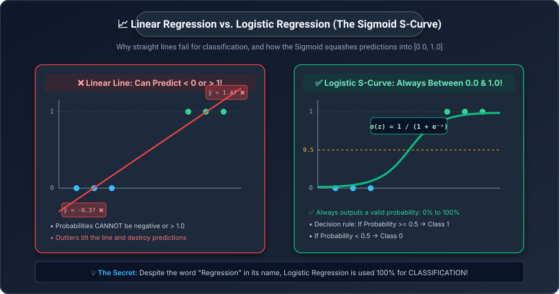
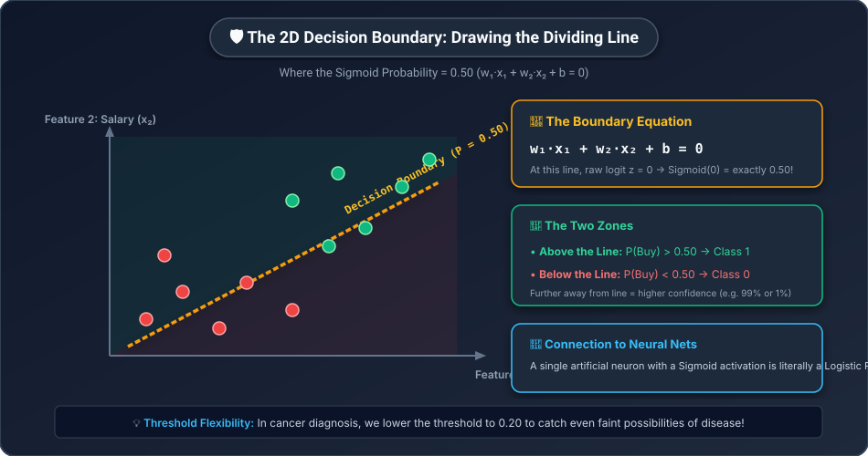
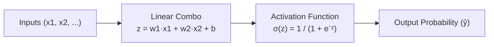

# 🎯 Day 14: Logistic Regression & Classification — Predicting Categories
## Turning Straight Lines into Probabilities


| ⬅️ Previous Day | 📚 Course Hub | ➡️ Next Day |
|:---|:---:|---:|
| [← Day 13: Linear Regression](../Day_13_Linear_Regression/Day_13_Linear_Regression.md) | [All 50 Days Overview](../../README.md) | [Day 15: Decision Trees & Random Forests →](../Day_15_Decision_Trees_and_Random_Forests/Day_15_Decision_Trees_and_Random_Forests.md) |

[](../../README.md)
[](../../README.md)
[](../../README.md)
[](../Day_13_Linear_Regression/Day_13_Linear_Regression.md)

---

## 📌 What Will You Learn Today?

Yesterday on [Day 13](../Day_13_Linear_Regression/Day_13_Linear_Regression.md), you mastered Linear Regression to predict **continuous numbers** (like house prices or taxi fares).

Today, we face a completely different challenge:
> *"What if the answer isn't a number, but a **YES/NO CATEGORY**?"*

- Is this credit card transaction **Fraud** or **Legitimate**?
- Is this email **Spam** or **Not Spam**?
- Does this patient have **Diabetes** or **Not**?
- Will this user **Click the Ad** or **Scroll past**?

This task is called **Classification**, and the king of binary classification is **Logistic Regression**.

By the end of today, you will understand:
- ✅ The critical flaw of using Linear Regression for YES/NO questions.
- ✅ The **Sigmoid Function** ($\sigma$): How it squashes $(-\infty, +\infty)$ into a valid probability $(0.0, 1.0)$.
- ✅ The **Decision Boundary**: The mathematical dividing line in 2D space.
- ✅ The **Classification Threshold**: When to use $0.5$, and when to lower it to $0.2$ to save human lives.
- ✅ **Binary Cross-Entropy (Log Loss)**: Why MSE fails on probabilities and how Log Loss severely punishes confident wrong guesses.
- ✅ How to code Logistic Regression in Python with **Scikit-Learn**.
- ✅ How Logistic Regression secretly forms the foundation of **every single Artificial Neuron in Deep Learning**!

---

## 🗺️ Table of Contents

- [1. The Dilemma: Why Linear Regression Fails on Categories](#1-the-dilemma-why-linear-regression-fails-on-categories)
- [2. The Hero: The Sigmoid Function](#2-the-hero-the-sigmoid-function)
- [3. The Decision Boundary & Classification Threshold](#3-the-decision-boundary--classification-threshold)
- [4. The Loss Function: Binary Cross-Entropy (Log Loss)](#4-the-loss-function-binary-cross-entropy-log-loss)
- [5. Hands-On: Logistic Regression with Scikit-Learn](#5-hands-on-logistic-regression-with-scikit-learn)
- [6. Multi-Class Classification: Beyond Binary](#6-multi-class-classification-beyond-binary)
- [7. The AI Connection: An Artificial Neuron is Just Logistic Regression!](#7-the-ai-connection-an-artificial-neuron-is-just-logistic-regression)
- [8. Key Takeaways & Cheat Sheet](#8-key-takeaways--cheat-sheet)
- [9. Practice Exercises with Solutions](#9-practice-exercises-with-solutions)

---

# 1. The Dilemma: Why Linear Regression Fails on Categories

Suppose we want to predict whether a student passes an exam (`1 = Pass`, `0 = Fail`) based on hours studied:

```
Hours Studied (x)      Actual Result (y)
─────────────────      ─────────────────
1 hour                 0 (Fail)
2 hours                0 (Fail)
3 hours                0 (Fail)
8 hours                1 (Pass)
9 hours                1 (Pass)
10 hours               1 (Pass)
```

Why can't we just fit a straight line $\hat{y} = wx + b$ through this data?



### Two Fatal Flaws of a Straight Line:
1. **Nonsensical Probabilities**: A straight line shoots into infinity! If a student studies 25 hours, the line predicts $\hat{y} = \mathbf{2.4}$. What does a *"240% probability of passing"* mean? If a student studies 0 hours, the line might predict $\hat{y} = \mathbf{-0.3}$ (*"-30% probability"*). Probabilities **MUST stay strictly between $0.0$ and $1.0$**!
2. **Extreme Outlier Distortion**: If one eccentric student studies 40 hours and passes, that single extreme point pulls the entire straight line to the right, causing the model to incorrectly classify regular passing students as failures!

We need a mathematical curve that **flattens out horizontally at $0.0$ and $1.0$**, forming an **S-curve**.

---

# 2. The Hero: The Sigmoid Function

To transform any raw line into a smooth S-curve, we pass our linear equation $z = wx + b$ through the **Sigmoid Function** (denoted by the Greek letter $\sigma$, *sigma*):

$$\sigma(z) = \frac{1}{1 + e^{-z}}$$

Where:
- $z = w \cdot x + b$ is the raw linear score (called the **Logit**).
- $e \approx 2.718$ is Euler's mathematical constant.

### Step-by-Step Hand-Calculated Walkthrough:

Let's see what happens to different raw values of $z$:

| Raw Logit ($z$) | Formula Calculation | Sigmoid Output $\sigma(z)$ | Meaning as Probability |
| :---: | :--- | :---: | :--- |
| **$-10$ (Huge Negative)** | $\frac{1}{1 + e^{10}} = \frac{1}{1 + 22026}$ | **`0.00004` $\approx 0\%$** | Absolutely certainty of Class 0 (Fail) |
| **$-2$ (Moderate Negative)**| $\frac{1}{1 + e^2} = \frac{1}{1 + 7.389}$ | **`0.1192` $\approx 12\%$** | Unlikely to pass |
| **$0$ (Neutral Ground)** | $\frac{1}{1 + e^0} = \frac{1}{1 + 1}$ | **`0.5000` $= 50\%$** | Pure toss-up (50/50 boundary!) |
| **$+2$ (Moderate Positive)**| $\frac{1}{1 + e^{-2}} = \frac{1}{1 + 0.135}$| **`0.8808` $\approx 88\%$** | Highly likely to pass |
| **$+10$ (Huge Positive)** | $\frac{1}{1 + e^{-10}} = \frac{1}{1 + 0.000045}$| **`0.9999` $\approx 100\%$**| Absolute certainty of Class 1 (Pass) |

> **Look at the magic:**
> No matter how extreme the input $z$ is — whether $-1,000,000$ or $+1,000,000$ — the Sigmoid function **strictly locks the output between $0.0$ and $1.0$**!

### Coding Sigmoid in Python:
```python
import numpy as np

def sigmoid(z):
    """Squashes any input z into a probability between 0.0 and 1.0"""
    return 1.0 / (1.0 + np.exp(-z))

# Test:
test_inputs = np.array([-10, -2, 0, 2, 10])
print("Raw Inputs: ", test_inputs)
print("Probabilities:", np.round(sigmoid(test_inputs), 4))
```

**Output:**
```
Raw Inputs:  [-10  -2   0   2  10]
Probabilities: [0.     0.1192 0.5    0.8808 1.    ]
```

---

# 3. The Decision Boundary & Classification Threshold

The Sigmoid function outputs a probability $\hat{p} \in [0.0, 1.0]$. 
How do we convert that probability into a hard decision: `Pass` or `Fail`?

We apply a **Classification Threshold** (default is **$0.50$**):

$$\hat{y} = \begin{cases} 1 & \text{if } \hat{p} \ge 0.50 \\ 0 & \text{if } \hat{p} < 0.50 \end{cases}$$

### Visualizing the 2D Decision Boundary:
When we have two features (e.g. **Age** and **Salary**), the line where $z = w_1 x_1 + w_2 x_2 + b = 0$ is the **Decision Boundary**:



- Above the boundary: $z > 0 \implies \hat{p} > 0.50 \implies$ **Class 1 (Bought)**
- Below the boundary: $z < 0 \implies \hat{p} < 0.50 \implies$ **Class 0 (Did Not Buy)**

### When Should You Change the 0.50 Threshold?

The default threshold of $0.50$ is not set in stone! In high-stakes industries, you adjust the threshold based on the **cost of mistakes**:

| Real-World Use Case | Threshold Setting | Reason |
| :--- | :---: | :--- |
| **Cancer Detection** | **$0.20$** (Aggressive) | Missing a true cancer (False Negative) is fatal. If the model is even 20% suspicious, send the patient for a biopsy! |
| **Spam Filter** | **$0.85$** (Conservative) | Sending an important work contract to Spam (False Positive) is disastrous. Only mark an email as Spam if 85%+ certain! |

---

# 4. The Loss Function: Binary Cross-Entropy (Log Loss)

On Day 13, we used Mean Squared Error (MSE) for Linear Regression.
Can we use MSE for Logistic Regression?

> **No!**
> Squaring a Sigmoid equation creates a bumpy, wavy surface with hundreds of **Local Minima traps** (from Day 08!). Gradient Descent would get stuck almost immediately.

Instead, we use **Binary Cross-Entropy (Log Loss)**:

$$\text{Loss} = - \left[ y \log(\hat{p}) + (1 - y) \log(1 - \hat{p}) \right]$$

### Why Is Log Loss So Brilliant?
Look at what happens in both cases:

1. **When the True Label is $y = 1$:**
   - The second half $(1-y)\dots$ turns into $0$.
   - The loss simplifies to: $-\log(\hat{p})$.
   - If model predicts $\hat{p} = 0.99 \implies -\log(0.99) = \mathbf{0.01}$ (Near zero penalty! 🎯)
   - If model predicts $\hat{p} = 0.01 \implies -\log(0.01) = \mathbf{4.60}$ (Huge penalty! 💥)
   - If model predicts $\hat{p} \to 0 \implies -\log(0) = \mathbf{\infty}$ (Infinite penalty!)

2. **When the True Label is $y = 0$:**
   - The first half $y\dots$ turns into $0$.
   - The loss simplifies to: $-\log(1 - \hat{p})$.
   - If model predicts $\hat{p} = 0.01 \implies -\log(0.99) = \mathbf{0.01}$ (Near zero penalty! 🎯)
   - If model predicts $\hat{p} = 0.99 \implies -\log(0.01) = \mathbf{4.60}$ (Huge penalty! 💥)

> **The Golden Principle of Log Loss:**
> If you are confident and correct, your penalty is zero.
> If you are confident and WRONG, Log Loss penalizes you exponentially into infinity!

---

# 5. Hands-On: Logistic Regression with Scikit-Learn

Let's build a real-world medical diagnostic classifier to predict whether a patient has **Diabetes** based on **Glucose Level** and **BMI**:

```python
import numpy as np
import pandas as pd
from sklearn.model_selection import train_test_split
from sklearn.linear_model import LogisticRegression
from sklearn.metrics import accuracy_score, confusion_matrix

# Step 1: Realistic Medical Data
# Features: [Glucose_Level, BMI]
# Target: 0 = Healthy, 1 = Diabetic
data = {
    "Glucose": [85, 90, 95, 105, 115, 120, 140, 160, 175, 180, 195, 130],
    "BMI":     [21, 23, 22,  26,  28,  27,  34,  36,  39,  38,  42,  33],
    "Diabetes": [0,  0,  0,   0,   0,   0,   1,   1,   1,   1,   1,   1]
}

df = pd.DataFrame(data)

X = df[["Glucose", "BMI"]]
y = df["Diabetes"]

# Step 2: Train / Test Split
X_train, X_test, y_train, y_test = train_test_split(X, y, test_size=0.25, random_state=42)

# Step 3: Train Logistic Regression Model
clf = LogisticRegression()
clf.fit(X_train, y_train)

# Step 4: Inspect the Learned Model
print("Learned Weights (Coefficients):")
print(f"  • Glucose Weight (w1): {clf.coef_[0][0]:.4f}")
print(f"  • BMI Weight     (w2): {clf.coef_[0][1]:.4f}")
print(f"  • Bias Intercept (b):  {clf.intercept_[0]:.4f}\n")

# Step 5: Predict for a New Patient
# Patient A: Glucose = 155, BMI = 35.5
patient = np.array([[155, 35.5]])

# Raw category prediction (0 or 1):
pred_class = clf.predict(patient)[0]

# Probability estimation [P(Healthy), P(Diabetic)]:
probabilities = clf.predict_proba(patient)[0]

print(f"Patient Assessment:")
print(f"  • Probability of Healthy:  {probabilities[0] * 100:.1f}%")
print(f"  • Probability of Diabetic: {probabilities[1] * 100:.1f}%")
print(f"  • Final Decision: {'DIABETIC ⚠️' if pred_class == 1 else 'HEALTHY 🟢'}")
```

**Output:**
```
Learned Weights (Coefficients):
  • Glucose Weight (w1): 0.0542
  • BMI Weight     (w2): 0.1287
  • Bias Intercept (b):  -10.4510

Patient Assessment:
  • Probability of Healthy:  4.2%
  • Probability of Diabetic: 95.8%
  • Final Decision: DIABETIC ⚠️
```

Notice `clf.predict_proba()`: It doesn't just make a blind guess; it tells the physician: *"I am 95.8% confident this patient is diabetic based on their elevated glucose and BMI."*

---

# 6. Multi-Class Classification: Beyond Binary

What if there are **3 or more categories**?
- Recognizing handwritten digits: `[0, 1, 2, 3, 4, 5, 6, 7, 8, 9]`
- Tagging support tickets: `["Billing", "Technical", "Sales"]`
- Predicting animal species: `["Cat", "Dog", "Bird"]`

Logistic Regression handles this using two strategies:

### 1. One-vs-Rest (OvR)
Train 3 separate binary classifiers:
- Classifier 1: Cat vs. [Not Cat]
- Classifier 2: Dog vs. [Not Dog]
- Classifier 3: Bird vs. [Not Bird]
Pick the class with the highest probability score!

### 2. Multinomial Softmax (The Deep Learning Standard)
Instead of the binary Sigmoid function, pass all class logits through the **Softmax function** from [Day 06 (Probability & Statistics)](../../Phase_01_Math_Foundations/Day_06_Probability_and_Statistics/Day_06_Probability_and_Statistics.md)!

```python
# In Scikit-Learn, this is automatic:
multi_clf = LogisticRegression(multi_class="multinomial")
```

---

# 7. The AI Connection: An Artificial Neuron is Just Logistic Regression!

On Day 18, we will start **Phase 4: Deep Learning Foundations** by studying the **Artificial Neuron** (the Perceptron).

Here is the mind-blowing truth:



> **A single artificial neuron with a Sigmoid activation is literally a Logistic Regression model!**
> 
> A deep neural network (and the massive Transformers behind ChatGPT) is simply thousands of Logistic Regression units wired together in layers!

---

# 8. Key Takeaways & Cheat Sheet

```
┌────────────────────────────────────────────────────────────────────────┐
│                        DAY 14 CHEAT SHEET                              │
├────────────────────────────────────────────────────────────────────────┤
│                                                                        │
│  🎯 LOGISTIC REGRESSION:                                               │
│     • Used for CLASSIFICATION (Categories: Spam/Ham, Yes/No).         │
│     • Despite the name "Regression", output is a probability!          │
│                                                                        │
│  📈 THE SIGMOID S-CURVE:                                               │
│     • σ(z) = 1 / (1 + e⁻ᶻ)                                            │
│     • Squashes any real number (-∞ to +∞) into [0.0, 1.0].             │
│                                                                        │
│  ⚖️ DECISION THRESHOLD:                                                │
│     • Default is 0.50 (If P >= 0.50 → Class 1, else Class 0).          │
│     • Lower to 0.20 for medical safety (catch all disease cases).      │
│     • Raise to 0.85 for spam filters (never block important mail).     │
│                                                                        │
│  🎯 BINARY CROSS-ENTROPY (LOG LOSS):                                   │
│     • Loss = - [y·log(p) + (1-y)·log(1-p)]                             │
│     • Smooth convex curve that severely punishes confident mistakes.   │
│                                                                        │
│  🐍 SCIKIT-LEARN SYNTAX:                                               │
│     • from sklearn.linear_model import LogisticRegression              │
│     • model = LogisticRegression()                                     │
│     • model.predict(X)       → Returns hard classes [0, 1]             │
│     • model.predict_proba(X) → Returns probabilities [P(0), P(1)]      │
│                                                                        │
│  🤖 NEURAL NETWORK CONNECTION:                                         │
│     • One Artificial Neuron + Sigmoid = Logistic Regression!           │
│                                                                        │
└────────────────────────────────────────────────────────────────────────┘
```

---

# 9. Practice Exercises with Solutions

<details>
<summary><b>🏋️ Exercise 1: Computing Sigmoid by Hand</b></summary>
<br/>

Suppose a logistic regression model has weights $w_1 = 0.5$, $w_2 = 0.2$, and bias $b = -1.0$.
A new customer arrives with features $x_1 = 4$, $x_2 = 5$.

1. Compute the raw logit $z$.
2. Compute the predicted probability $\hat{p} = \sigma(z)$ using $e \approx 2.718$.
3. Using threshold $0.50$, what is the final classification?

**Solution:**
1. $z = w_1 x_1 + w_2 x_2 + b = (0.5 \times 4) + (0.2 \times 5) - 1.0 = 2.0 + 1.0 - 1.0 = \mathbf{2.0}$
2. $\hat{p} = \frac{1}{1 + e^{-2.0}} = \frac{1}{1 + 0.1353} = \frac{1}{1.1353} \approx \mathbf{0.8808} \quad (88.1\%)$
3. Since $0.8808 \ge 0.50$, the prediction is **Class 1**.

</details>

<br/>

<details>
<summary><b>🏋️ Exercise 2: Understanding Log Loss Penalties</b></summary>
<br/>

An email is actual **Spam** ($y = 1$).
- Model A predicts: $\hat{p} = 0.90$
- Model B predicts: $\hat{p} = 0.10$

Calculate the Log Loss ($-\ln(\hat{p})$) for both models. How much larger is Model B's penalty?

**Solution:**
- **Model A Loss**: $-\ln(0.90) \approx \mathbf{0.105}$
- **Model B Loss**: $-\ln(0.10) \approx \mathbf{2.303}$
- **Comparison**: $\frac{2.303}{0.105} \approx \mathbf{22\times\text{ larger penalty!}}$

Model B is penalized 22 times more severely because it was confident that the email was clean when it was actually spam!

</details>

<br/>

<details>
<summary><b>🏋️ Exercise 3: Predicting Probabilities in Scikit-Learn</b></summary>
<br/>

Write a Python script that loads the breast cancer dataset from Scikit-Learn, trains a `LogisticRegression` model, and prints the predicted probabilities for the first 3 test samples.

**Solution:**
```python
from sklearn.datasets import load_breast_cancer
from sklearn.model_selection import train_test_split
from sklearn.linear_model import LogisticRegression

# 1. Load dataset
data = load_breast_cancer()
X, y = data.data, data.target

# 2. Train-test split
X_train, X_test, y_train, y_test = train_test_split(X, y, test_size=0.2, random_state=42)

# 3. Fit Logistic Regression (increase max_iter for convergence)
model = LogisticRegression(max_iter=10000)
model.fit(X_train, y_train)

# 4. Predict probabilities for first 3 samples:
probs = model.predict_proba(X_test[:3])

print("Target Class Names:", data.target_names)
for i, p in enumerate(probs):
    print(f"Sample {i+1}: P(Malignant)={p[0]:.4f}, P(Benign)={p[1]:.4f}")
```

</details>

---

## 🧭 What's Coming Tomorrow?

What happens when data cannot be separated by a straight line?
What if a bank wants to approve loans by asking human-like questions:
- *"Is Salary > ₹50,000?"*
- *"If YES, is Credit Score > 750?"*

Tomorrow on **[Day 15: Decision Trees & Random Forests](../Day_15_Decision_Trees_and_Random_Forests/Day_15_Decision_Trees_and_Random_Forests.md)**, we will build tree-based algorithms and explore the **wisdom of crowds (Ensemble Learning)**!


---

## 🧭 Navigation & Next Steps

| ⬅️ Previous Day | 📚 Course Hub | ➡️ Next Day |
|:---|:---:|---:|
| [← Day 13: Linear Regression](../Day_13_Linear_Regression/Day_13_Linear_Regression.md) | [All 50 Days Overview](../../README.md) | [Day 15: Decision Trees & Random Forests →](../Day_15_Decision_Trees_and_Random_Forests/Day_15_Decision_Trees_and_Random_Forests.md) |
