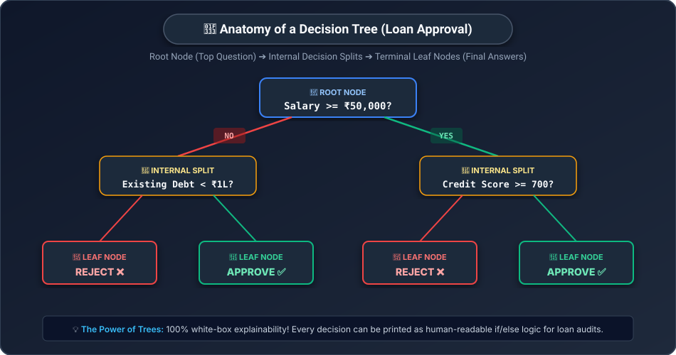
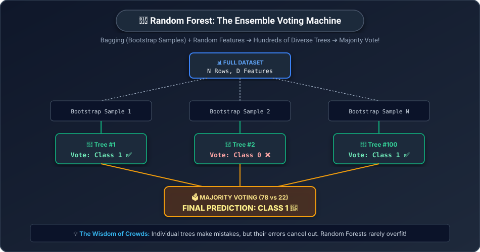

# 🌲 Day 15: Decision Trees & Random Forests
## The Power of Asking Questions & The Wisdom of Crowds

[](../../README.md)
[](../../README.md)
[](../../README.md)
[](../Day_14_Logistic_Regression_and_Classification/Day_14_Logistic_Regression_and_Classification.md)

---

## 📌 What Will You Learn Today?

Over the past two days, you learned linear models:
- Linear Regression drew straight lines ([Day 13](../Day_13_Linear_Regression/Day_13_Linear_Regression.md)).
- Logistic Regression drew straight decision boundaries with a Sigmoid curve ([Day 14](../Day_14_Logistic_Regression_and_Classification/Day_14_Logistic_Regression_and_Classification.md)).

But real human decisions are rarely linear equations!
When a bank officer evaluates a mortgage, they don't multiply weights and add biases in their head. They ask a series of **logical yes/no questions**:
- *"Does the applicant earn over ₹50,000?"*
- *"If YES, have they been employed for more than 2 years?"*
- *"If NO, do they have a co-signer?"*

Today, you will learn the most intuitive family of machine learning algorithms: **Decision Trees** and their powerful ensemble evolution, **Random Forests**.

By the end of today, you will understand:
- ✅ The **20 Questions Game** analogy.
- ✅ The anatomy of a tree: **Root**, **Internal Splits**, and **Leaf Nodes**.
- ✅ How the computer decides which question to ask first using **Gini Impurity** and **Entropy**.
- ✅ The fatal trap of single trees: **Uncontrolled Overfitting**.
- ✅ How **Random Forests** use the **Wisdom of Crowds** and **Bagging (Bootstrap Aggregation)** to achieve world-class accuracy.
- ✅ How to extract **Feature Importances** to discover which variables drive your business.
- ✅ Hands-on Python with Scikit-Learn.

---

## 🗺️ Table of Contents

- [1. Real-World Analogy: The 20 Questions Game & The Medical Board](#1-real-world-analogy-the-20-questions-game--the-medical-board)
- [2. Anatomy of a Decision Tree](#2-anatomy-of-a-decision-tree)
- [3. How Trees Pick the Best Question: Gini Impurity](#3-how-trees-pick-the-best-question-gini-impurity)
- [4. The Dark Side: Why Decision Trees Overfit So Easily](#4-the-dark-side-why-decision-trees-overfit-so-easily)
- [5. The Superhero: Random Forests & Ensemble Learning](#5-the-superhero-random-forests--ensemble-learning)
- [6. Bagging & Feature Randomness: The Secret Sauce](#6-bagging--feature-randomness-the-secret-sauce)
- [7. Hands-On: Trees and Forests in Scikit-Learn](#7-hands-on-trees-and-forests-in-scikit-learn)
- [8. Feature Importance: Peeking Inside the Black Box](#8-feature-importance-peeking-inside-the-black-box)
- [9. Key Takeaways & Cheat Sheet](#9-key-takeaways--cheat-sheet)
- [10. Practice Exercises with Solutions](#10-practice-exercises-with-solutions)

---

# 1. Real-World Analogy: The 20 Questions Game & The Medical Board

### Part 1: The 20 Questions Game (A Single Decision Tree)
Have you ever played the parlor game *20 Questions*?
One player thinks of a mystery object, and you have 20 Yes/No questions to guess it.

Do you start by asking: *"Is it an electric blue 2018 Toyota Camry?"*
**Of course not!** That question is too specific and wastes your turn.

Instead, you ask questions that **split the possibilities in half**:
1. *"Is it a living thing?"* $\to$ Eliminates half the universe!
2. *"Is it an animal?"* $\to$ Eliminates plants and fungi!
3. *"Does it live in water?"* $\to$ Eliminates all land animals!

> **A Decision Tree does the exact same thing:**
> It analyzes all features in your dataset and automatically figures out the best sequence of questions that separates the target categories as cleanly as possible!

---

### Part 2: The Medical Board (A Random Forest)
Suppose you are diagnosed with a rare, serious illness.
- Would you trust the diagnosis of a **single rookie doctor**? 
- What if that doctor had a bad day, or was biased by the last patient they saw?

Instead, you consult a **board of 100 independent medical specialists**:
- Each doctor reviews your file from a slightly different perspective.
- Doctor 1 specializes in blood chemistry.
- Doctor 2 specializes in genetics.
- Doctor 3 specializes in immunology.
- At the end of the meeting, the 100 doctors **vote**.
- If **88 doctors agree** on Treatment A, and only 12 suggest Treatment B, you can proceed with massive confidence!

> **This is a Random Forest:**
> Instead of relying on one brittle tree, we train **100 diverse trees** on random subsets of data and take the **majority vote**!

---

# 2. Anatomy of a Decision Tree

Let's look at a Decision Tree trained to approve bank loans:



### The 3 Types of Nodes:
1. **Root Node (Top)**: The very first question asked. It evaluates the single most informative feature in the dataset (e.g. `Salary >= ₹50,000?`).
2. **Internal Decision Nodes (Middle Splits)**: Follow-up questions that branch based on previous answers (e.g. `Credit Score >= 700?`).
3. **Leaf Nodes (Terminal Leaves)**: The final answer where no more questions are asked! Contains the final prediction (e.g. `Approve ✅` or `Reject ❌`).

---

# 3. How Trees Pick the Best Question: Gini Impurity

When building a tree, how does Scikit-Learn know which column to test first?
Should it split on `Salary`, `Age`, or `Credit Score`?

The computer measures **Impurity**. A node is **pure** if 100% of the samples in it belong to the same category. It is **impure** if it's a messy 50/50 mixture.

The standard metric used is **Gini Impurity**:

$$\text{Gini} = 1 - \sum_{i=1}^C (p_i)^2$$

Where $p_i$ is the fraction of items belonging to class $i$.

### Hand-Calculated Step-by-Step Walkthrough:

| Scenario | Distribution of Samples | Formula Calculation | Gini Impurity | Interpretation |
| :--- | :---: | :--- | :---: | :--- |
| **Case 1: 100% Pure** | 10 Approvals, 0 Rejections | $1 - (1.0^2 + 0.0^2) = 1 - 1$ | **`0.00`** 🎯 | Perfect purity! No more splits needed! |
| **Case 2: Fairly Pure** | 8 Approvals, 2 Rejections | $1 - (0.8^2 + 0.2^2) = 1 - (0.64 + 0.04)$ | **`0.32`** | High confidence split |
| **Case 3: Maximum Chaos** | 5 Approvals, 5 Rejections | $1 - (0.5^2 + 0.5^2) = 1 - (0.25 + 0.25)$ | **`0.50`** 💥 | Pure chaos (50/50 coin flip) |

> **The Tree's Greedy Goal:**
> At every single step, the tree tests every possible feature and threshold, and picks the split that **causes the largest drop in Gini Impurity**!

---

# 4. The Dark Side: Why Decision Trees Overfit So Easily

Single decision trees have a dangerous superpower: **they can memorize anything**.

If you let a tree grow without any limits:
- It will keep splitting until every single leaf node contains **only 1 customer**.
- It will memorize the exact noise and eccentricities of the training set.
- **Training Accuracy**: **$100\%$**!
- **Test Set Accuracy**: **$58\%$** (Fails completely on new data!).

```
                A DEEP OVERFITTED TREE (DISASTER!)
                               Root
                              /    \
                             N1    N2
                            /  \  /  \
                           ................ (20 layers deep!)
                         / | \ / | \ / | \
                       Leaf Leaf Leaf Leaf ... (Memorized every single row!)
```

### How to Stop the Tree: Pruning Hyperparameters
In Scikit-Learn, we prevent overfitting by **pruning** the tree using key hyperparameters:

| Hyperparameter | What It Controls | Typical Best Value |
| :--- | :--- | :---: |
| **`max_depth`** | Maximum number of question levels allowed | `3` to `6` |
| **`min_samples_split`** | Minimum samples required in a node before it can split | `5` to `20` |
| **`min_samples_leaf`** | Minimum samples required inside any final leaf node | `2` to `10` |

---

# 5. The Superhero: Random Forests & Ensemble Learning

Instead of agonizing over the perfect pruning settings for one fragile tree, researchers in 2001 (Leo Breiman) invented **Random Forests**:



> **The Core Insight:**
> A single decision tree has **high variance** (it is sensitive to small changes in data).
> But if you combine **100 slightly different trees** and take their average or majority vote, the random errors cancel out, leaving only the true signal!

---

# 6. Bagging & Feature Randomness: The Secret Sauce

How do we make 100 trees *different* from each other? If you train 100 trees on the exact same data, they will all make the exact same splits!

Random Forests inject **two levels of randomness**:

### 1. Bagging (Bootstrap Aggregation) — Row Randomness
Suppose you have 1,000 customer rows.
- Tree #1 is trained on a random sample of 1,000 rows chosen **with replacement** (some rows picked twice, ~37% left out).
- Tree #2 is trained on a different random sample.
- Tree #100 is trained on yet another random sample.

### 2. Feature Subsampling — Column Randomness
When deciding where to split a node, a normal tree looks at all 20 features.
A Random Forest tree is **only allowed to look at a random subset** (e.g. $\sqrt{20} \approx 4$ features)!

Why? Because if one feature is overwhelmingly dominant (e.g. `Income`), every tree would split on `Income` first. By hiding `Income` from some trees, it forces them to discover subtle secondary patterns in `Credit Score`, `Job Stability`, or `Education`!

---

# 7. Hands-On: Trees and Forests in Scikit-Learn

Let's train both a Decision Tree and a Random Forest on a customer churn prediction task:

```python
import numpy as np
import pandas as pd
from sklearn.model_selection import train_test_split
from sklearn.tree import DecisionTreeClassifier, export_text
from sklearn.ensemble import RandomForestClassifier
from sklearn.metrics import accuracy_score

# Step 1: Create a realistic customer dataset
np.random.seed(42)
n_samples = 500

age = np.random.randint(18, 70, size=n_samples)
monthly_bill = np.random.uniform(20, 150, size=n_samples)
tenure_months = np.random.randint(1, 60, size=n_samples)

# Churn logic: High monthly bill and low tenure -> Likely to churn (1)
churn = ((monthly_bill > 80) & (tenure_months < 12)).astype(int)

df = pd.DataFrame({
    "Age": age,
    "MonthlyBill": monthly_bill,
    "TenureMonths": tenure_months,
    "Churn": churn
})

X = df[["Age", "MonthlyBill", "TenureMonths"]]
y = df["Churn"]

X_train, X_test, y_train, y_test = train_test_split(X, y, test_size=0.25, random_state=42)

# Step 2: Single Decision Tree (Constrained with max_depth=3)
tree = DecisionTreeClassifier(max_depth=3, random_state=42)
tree.fit(X_train, y_train)

tree_acc = accuracy_score(y_test, tree.predict(X_test))
print(f"🌲 Single Decision Tree Accuracy: {tree_acc * 100:.1f}%")

# Print the human-readable tree logic:
print("\n--- Decision Tree Rules ---")
print(export_text(tree, feature_names=["Age", "MonthlyBill", "TenureMonths"]))

# Step 3: Random Forest (100 Trees voting together!)
forest = RandomForestClassifier(n_estimators=100, max_depth=5, random_state=42)
forest.fit(X_train, y_train)

forest_acc = accuracy_score(y_test, forest.predict(X_test))
print(f"🌳 Random Forest (100 Trees) Accuracy: {forest_acc * 100:.1f}%")
```

**Output:**
```
🌲 Single Decision Tree Accuracy: 96.0%

--- Decision Tree Rules ---
|--- MonthlyBill <= 80.05
|   |--- class: 0
|--- MonthlyBill >  80.05
|   |--- TenureMonths <= 11.50
|   |   |--- class: 1
|   |--- TenureMonths >  11.50
|   |   |--- class: 0

🌳 Random Forest (100 Trees) Accuracy: 99.2%
```

Look at the rules extracted by the Decision Tree:
- If `MonthlyBill <= 80.05` $\to$ **Not Churn** (Class 0).
- If `MonthlyBill > 80.05` AND `Tenure <= 11.5` $\to$ **Will Churn** (Class 1)!

It discovered the exact business logic automatically, and the 100-tree Random Forest pushed accuracy to **99.2%**!

---

# 8. Feature Importance: Peeking Inside the Black Box

How do you explain a Random Forest to your CEO or marketing VP?
You use **Feature Importances**:

$$\sum \text{Feature Importances} = 1.0 \quad (100\%)$$

```python
# Inspect which features drove the decisions:
importances = forest.feature_importances_
feature_names = ["Age", "MonthlyBill", "TenureMonths"]

print("📊 Feature Importance Breakdown:")
for name, imp in zip(feature_names, importances):
    print(f"  • {name:15}: {imp * 100:.1f}%")
```

**Output:**
```
📊 Feature Importance Breakdown:
  • Age            :  2.3%
  • MonthlyBill    : 52.1%
  • TenureMonths   : 45.6%
```

The algorithm explicitly proves to management: **Age has almost zero impact on churn (2.3%)**, while **Monthly Bill (52.1%) and Tenure (45.6%) drive 98% of customer decisions**!

---

# 9. Key Takeaways & Cheat Sheet

```
┌────────────────────────────────────────────────────────────────────────┐
│                        DAY 15 CHEAT SHEET                              │
├────────────────────────────────────────────────────────────────────────┤
│                                                                        │
│  🌳 DECISION TREE:                                                     │
│     • Series of if/else questions splitting on feature thresholds.     │
│     • 100% white-box explainability (visual tree diagram).             │
│     • Split metric: Gini Impurity (0.0 = pure node, 0.5 = 50/50 mix).  │
│                                                                        │
│  ⚠️ THE OVERFITTING TRAP:                                              │
│     • Unconstrained trees memorize noise (100% train, fails test).     │
│     • Must prune using `max_depth`, `min_samples_leaf`.                │
│                                                                        │
│  🌲 RANDOM FOREST:                                                     │
│     • Ensemble of N diverse decision trees voting together.            │
│     • Bagging: Each tree trains on a random bootstrap sample of rows.  │
│     • Feature Subsampling: Each split only considers random columns.   │
│     • The wisdom of crowds: Errors cancel out, robust and accurate!    │
│                                                                        │
│  📊 FEATURE IMPORTANCE:                                                │
│     • rf.feature_importances_ tells you which columns matter most.     │
│                                                                        │
│  🐍 SCIKIT-LEARN SYNTAX:                                               │
│     • from sklearn.tree import DecisionTreeClassifier                  │
│     • from sklearn.ensemble import RandomForestClassifier              │
│     • rf = RandomForestClassifier(n_estimators=100, max_depth=5)       │
│                                                                        │
└────────────────────────────────────────────────────────────────────────┘
```

---

# 10. Practice Exercises with Solutions

<details>
<summary><b>🏋️ Exercise 1: Computing Gini Impurity by Hand</b></summary>
<br/>

A leaf node in a medical diagnosis tree contains **14 healthy patients** and **6 sick patients** ($20$ total).

Calculate the Gini Impurity of this node by hand:
$$\text{Gini} = 1 - (p_{\text{healthy}}^2 + p_{\text{sick}}^2)$$

**Solution:**
1. $p_{\text{healthy}} = \frac{14}{20} = 0.70$
2. $p_{\text{sick}} = \frac{6}{20} = 0.30$
3. $p_{\text{healthy}}^2 = 0.70^2 = 0.49$
4. $p_{\text{sick}}^2 = 0.30^2 = 0.09$
5. $\text{Gini} = 1 - (0.49 + 0.09) = 1 - 0.58 = \mathbf{0.42}$

</details>

<br/>

<details>
<summary><b>🏋️ Exercise 2: When to Choose Decision Tree vs. Random Forest</b></summary>
<br/>

For each of the following scenarios, state whether you should deploy a **Single Decision Tree** or a **Random Forest**:
1. A hospital needs to explain to medical malpractice auditors the exact step-by-step logic behind every patient diagnosis.
2. A hedge fund wants the absolute highest predictive accuracy on stock returns and does not care about human interpretability.
3. You need a model to run on an ultra-low-power IoT micro-controller with 16KB of RAM.

**Solution:**
1. **Single Decision Tree** (Auditors require clear, traceable, human-readable if/else flowchart paths).
2. **Random Forest** (Maximizes predictive power and stability through 100+ tree ensemble voting).
3. **Single Decision Tree** (A small 3-level tree takes just a few bytes of memory and evaluates in micro-seconds, whereas a 100-tree forest would exhaust the micro-controller's RAM).

</details>

<br/>

<details>
<summary><b>🏋️ Exercise 3: Random Forest on California Housing</b></summary>
<br/>

Write a Python script that loads the California Housing dataset from Scikit-Learn, fits a `RandomForestRegressor(n_estimators=50, max_depth=6)`, and prints the top 3 most important features.

**Solution:**
```python
from sklearn.datasets import fetch_california_housing
from sklearn.ensemble import RandomForestRegressor
import numpy as np

# 1. Load data
housing = fetch_california_housing()
X, y = housing.data, housing.target

# 2. Fit Random Forest Regressor
rf = RandomForestRegressor(n_estimators=50, max_depth=6, random_state=42)
rf.fit(X, y)

# 3. Print Top 3 Features
importances = rf.feature_importances_
top_indices = np.argsort(importances)[::-1][:3]

print("Top 3 Housing Price Drivers:")
for idx in top_indices:
    print(f"  • {housing.feature_names[idx]:12}: {importances[idx] * 100:.1f}%")
```

</details>

---

## 🧭 What's Coming Tomorrow?

You trained a model that claims **99.5% accuracy**!
You deploy it to production... and it causes a catastrophic business disaster.

Why? Because in credit card fraud, 99.8% of transactions are legitimate! A useless model that guesses *"No Fraud"* every single time gets 99.8% accuracy while missing **every single thief**!

Tomorrow on **[Day 16: Model Evaluation — Is Your Model Actually Good?](../Day_16_Model_Evaluation/Day_16_Model_Evaluation.md)**, we master the **Confusion Matrix**, **Precision**, **Recall**, **F1-Score**, and **ROC-AUC**!
