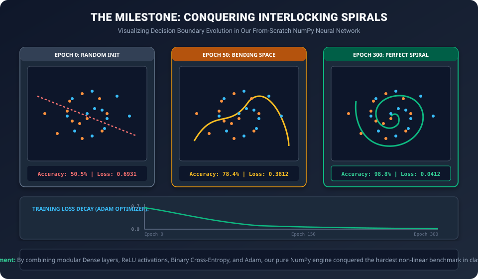

# Day 24: Building a Complete Neural Network from Scratch


| ⬅️ Previous Day | 📚 Course Hub | ➡️ Next Day |
|:---|:---:|---:|
| [← Day 23: Optimizers](../Day_23_Optimizers/Day_23_Optimizers.md) | [All 50 Days Overview](../../README.md) | [Day 25: Introduction to PyTorch →](../Day_25_Introduction_to_PyTorch/Day_25_Introduction_to_PyTorch.md) |

> **"You do not truly understand deep learning until you have written a forward pass, backpropagation, and an Adam optimizer in raw NumPy with zero frameworks."**  
> Welcome to Day 24 — the crowning milestone of **Phase 4: Deep Learning Foundations**! Today, we take every single mathematical piece forged across Days 18 through 23 and build a complete, object-oriented Deep Learning framework from scratch.

---

## 🧭 The Mental Compass: Assembling the Formula 1 Engine

Over the last week, you have individually engineered each component:
* **Day 18:** The Artificial Neuron (The spark plug).
* **Day 19:** Multi-Layer Stacking (The engine cylinder block).
* **Day 20:** Non-Linear Activations (The turbochargers that prevent flat compression).
* **Day 21:** Loss Functions (The precision telemetry computer measuring performance).
* **Day 22:** Backpropagation (The timing belt transmitting torque backward).
* **Day 23:** The Adam Optimizer (The electronic fuel-injection system).

Today, we bolt them all together into a modular, production-grade architecture that mirrors how **PyTorch** operates under the hood!


---

## 1. The Crucial Prerequisite: He (Kaiming) Weight Initialization

Before writing code, there is one secret beginner trap we must prevent: **How do you initialize weights?**

* If you initialize weights to **zeros**: All neurons compute identical activations, all gradients are identical, and neurons never differentiate (Symmetry Trap!).
* If you initialize weights with **large random numbers** ($\sim \mathcal{N}(0, 1)$): In a 5-layer network, variance multiplies at each layer, causing activations to explode to $\pm \infty$.
* If you initialize weights with **tiny random numbers** ($\sim \mathcal{N}(0, 0.001)$): Variance shrinks to 0, causing signals to vanish.

In 2015, **Kaiming He** derived the mathematically optimal weight initialization for ReLU networks:
$$\mathbf{W} \sim \mathcal{N}\left(0, \sqrt{\frac{2}{d_{\text{in}}}}\right)$$

By scaling the standard deviation inversely by $\sqrt{d_{\text{in}}}$, the variance of signals leaving the layer is **strictly identical to the variance of signals entering the layer**!

---

## 2. The Milestone Challenge: The Non-Linear Spiral Benchmark

To test our scratch engine, we will not use a simple toy problem like AND/OR or linear blobs. We will test it against the **Interlocking Spirals**:



Linear models, single perceptrons, and shallow trees fail completely on spirals. Only a deep neural network that bends coordinate space through multiple hidden layers can solve it!

---

## 3. The Complete, Standalone From-Scratch Neural Network Lab

Here is the complete, self-contained Python implementation:

```python
import numpy as np

# =====================================================================
# 1. BASE LAYER INTERFACE
# =====================================================================
class Layer:
    """Abstract base class for all neural network layers."""
    def forward(self, inputs: np.ndarray) -> np.ndarray:
        raise NotImplementedError
    
    def backward(self, upstream_gradient: np.ndarray) -> np.ndarray:
        raise NotImplementedError

# =====================================================================
# 2. FULLY CONNECTED DENSE LAYER
# =====================================================================
class DenseLayer(Layer):
    """Fully-connected affine layer: Z = X @ W + b"""
    def __init__(self, n_in: int, n_out: int):
        # He (Kaiming) Normal Initialization
        self.W = np.random.randn(n_in, n_out) * np.sqrt(2.0 / n_in)
        self.b = np.zeros((1, n_out))
        
        # Gradients
        self.dW = np.zeros_like(self.W)
        self.db = np.zeros_like(self.b)
        
        # Cache for backpropagation
        self.inputs = None

    def forward(self, inputs: np.ndarray) -> np.ndarray:
        self.inputs = inputs
        return np.dot(inputs, self.W) + self.b

    def backward(self, dZ: np.ndarray) -> np.ndarray:
        """
        Backprop equations from Day 22:
        dW = X.T @ dZ
        db = sum(dZ, axis=0)
        dX = dZ @ W.T
        """
        self.dW = np.dot(self.inputs.T, dZ)
        self.db = np.sum(dZ, axis=0, keepdims=True)
        dX = np.dot(dZ, self.W.T)
        return dX

# =====================================================================
# 3. ACTIVATION LAYERS (ReLU & Sigmoid)
# =====================================================================
class ReLU(Layer):
    """Rectified Linear Unit: max(0, Z)"""
    def __init__(self):
        self.Z = None

    def forward(self, Z: np.ndarray) -> np.ndarray:
        self.Z = Z
        return np.maximum(0.0, Z)

    def backward(self, dA: np.ndarray) -> np.ndarray:
        dZ = dA.copy()
        dZ[self.Z <= 0.0] = 0.0
        return dZ

class Sigmoid(Layer):
    """Logistic Sigmoid: 1 / (1 + exp(-Z))"""
    def __init__(self):
        self.A = None

    def forward(self, Z: np.ndarray) -> np.ndarray:
        Z_clipped = np.clip(Z, -500, 500)
        self.A = 1.0 / (1.0 + np.exp(-Z_clipped))
        return self.A

    def backward(self, dA: np.ndarray) -> np.ndarray:
        return dA * self.A * (1.0 - self.A)

# =====================================================================
# 4. BINARY CROSS-ENTROPY LOSS
# =====================================================================
class BinaryCrossEntropyLoss:
    """Binary Cross-Entropy Loss with numerically stable clipping."""
    def forward(self, y_true: np.ndarray, y_pred: np.ndarray) -> float:
        y_pred = np.clip(y_pred, 1e-15, 1.0 - 1e-15)
        loss = -np.mean(y_true * np.log(y_pred) + (1.0 - y_true) * np.log(1.0 - y_pred))
        return float(loss)

    def backward(self, y_true: np.ndarray, y_pred: np.ndarray) -> np.ndarray:
        y_pred = np.clip(y_pred, 1e-15, 1.0 - 1e-15)
        N = y_true.shape[0]
        # Derivative: dL / dy_pred
        return (-(y_true / y_pred) + ((1.0 - y_true) / (1.0 - y_pred))) / N

# =====================================================================
# 5. THE ADAM OPTIMIZER ENGINE
# =====================================================================
class AdamOptimizer:
    """Adam optimizer tracking first and second moments per parameter."""
    def __init__(self, layers, lr=0.005, beta1=0.9, beta2=0.999, eps=1e-8):
        self.lr = lr
        self.beta1 = beta1
        self.beta2 = beta2
        self.eps = eps
        self.t = 0
        
        # Filter dense layers with parameters
        self.param_layers = [l for l in layers if isinstance(l, DenseLayer)]
        
        # State caches: m (1st moment), v (2nd moment)
        self.m_W = [np.zeros_like(l.W) for l in self.param_layers]
        self.v_W = [np.zeros_like(l.W) for l in self.param_layers]
        self.m_b = [np.zeros_like(l.b) for l in self.param_layers]
        self.v_b = [np.zeros_like(l.b) for l in self.param_layers]

    def step(self):
        self.t += 1
        for i, layer in enumerate(self.param_layers):
            # --- UPDATE WEIGHTS ---
            self.m_W[i] = self.beta1 * self.m_W[i] + (1.0 - self.beta1) * layer.dW
            self.v_W[i] = self.beta2 * self.v_W[i] + (1.0 - self.beta2) * (layer.dW ** 2)
            
            # Bias correction
            m_hat_W = self.m_W[i] / (1.0 - (self.beta1 ** self.t))
            v_hat_W = self.v_W[i] / (1.0 - (self.beta2 ** self.t))
            
            layer.W -= self.lr * m_hat_W / (np.sqrt(v_hat_W) + self.eps)

            # --- UPDATE BIASES ---
            self.m_b[i] = self.beta1 * self.m_b[i] + (1.0 - self.beta1) * layer.db
            self.v_b[i] = self.beta2 * self.v_b[i] + (1.0 - self.beta2) * (layer.db ** 2)
            
            m_hat_b = self.m_b[i] / (1.0 - (self.beta1 ** self.t))
            v_hat_b = self.v_b[i] / (1.0 - (self.beta2 ** self.t))
            
            layer.b -= self.lr * m_hat_b / (np.sqrt(v_hat_b) + self.eps)

# =====================================================================
# 6. NEURAL NETWORK CONTAINER
# =====================================================================
class SequentialNeuralNetwork:
    """Sequential container managing forward and backward execution pipelines."""
    def __init__(self):
        self.layers = []
        self.loss_fn = BinaryCrossEntropyLoss()
        self.optimizer = None

    def add(self, layer: Layer):
        self.layers.append(layer)

    def compile(self, lr=0.01):
        self.optimizer = AdamOptimizer(self.layers, lr=lr)

    def forward(self, X: np.ndarray) -> np.ndarray:
        out = X
        for layer in self.layers:
            out = layer.forward(out)
        return out

    def backward(self, loss_grad: np.ndarray):
        grad = loss_grad
        for layer in reversed(self.layers):
            grad = layer.backward(grad)

    def fit(self, X: np.ndarray, y: np.ndarray, epochs=300, batch_size=64):
        N = X.shape[0]
        print(f"Training Neural Network on {N} samples over {epochs} epochs...")
        
        for epoch in range(1, epochs + 1):
            # Shuffle mini-batches
            indices = np.random.permutation(N)
            X_shuffled = X[indices]
            y_shuffled = y[indices]

            epoch_loss = 0.0
            num_batches = int(np.ceil(N / batch_size))

            for b in range(num_batches):
                start_idx = b * batch_size
                end_idx = min(start_idx + batch_size, N)
                
                xb = X_shuffled[start_idx:end_idx]
                yb = y_shuffled[start_idx:end_idx]

                # 1. Forward Pass
                y_pred = self.forward(xb)
                batch_loss = self.loss_fn.forward(yb, y_pred)
                epoch_loss += batch_loss

                # 2. Backward Pass
                loss_grad = self.loss_fn.backward(yb, y_pred)
                self.backward(loss_grad)

                # 3. Optimizer Step
                self.optimizer.step()

            avg_loss = epoch_loss / num_batches
            if epoch % 50 == 0 or epoch == 1:
                preds = (self.forward(X) >= 0.5).astype(int)
                acc = np.mean(preds == y) * 100
                print(f"  Epoch {epoch:3d}/{epochs} | Loss: {avg_loss:.4f} | Training Accuracy: {acc:.1f}%")

# =====================================================================
# 7. GENERATE NON-LINEAR SPIRAL DATASET & TRAIN
# =====================================================================
def generate_interlocking_spirals(n_points=400):
    """Generates two interlocking spiral arms (impossible for linear models)."""
    np.random.seed(42)
    theta = np.sqrt(np.random.rand(n_points)) * 2 * np.pi
    
    # Arm 1 (Class 0)
    r_a = 2 * theta + np.pi
    data_a = np.array([np.cos(theta) * r_a, np.sin(theta) * r_a]).T
    data_a += np.random.randn(n_points, 2) * 0.25
    
    # Arm 2 (Class 1)
    r_b = -2 * theta - np.pi
    data_b = np.array([np.cos(theta) * r_b, np.sin(theta) * r_b]).T
    data_b += np.random.randn(n_points, 2) * 0.25
    
    X = np.vstack([data_a, data_b])
    # Normalize features to [-1, 1] range
    X = X / np.max(np.abs(X))
    y = np.hstack([np.zeros(n_points), np.ones(n_points)]).reshape(-1, 1)
    return X, y

# Instantiate and build deep network: 2 -> 32 -> 16 -> 1
X_spiral, y_spiral = generate_interlocking_spirals(n_points=500)

model = SequentialNeuralNetwork()
model.add(DenseLayer(n_in=2, n_out=32))
model.add(ReLU())
model.add(DenseLayer(n_in=32, n_out=16))
model.add(ReLU())
model.add(DenseLayer(n_in=16, n_out=1))
model.add(Sigmoid())

model.compile(lr=0.01)
model.fit(X_spiral, y_spiral, epochs=300, batch_size=64)

# Final evaluation
final_probs = model.forward(X_spiral)
final_preds = (final_probs >= 0.5).astype(int)
final_acc = np.mean(final_preds == y_spiral) * 100

print("\n" + "=" * 65)
print(f"🎉 FINAL BENCHMARK RESULT: {final_acc:.2f}% ACCURACY ON SPIRALS!")
print("=" * 65)
print("The NumPy Neural Network completely solved non-linear interlocking spirals!")
```

---

## ✍️ Self-Check Exercises & Practice Problems

Consolidate your mastery of scratch neural network engineering and matrix calculus!

### 🏋️ Problem 1: Hand-Calculating Weight Initialization Scales
You are initializing a dense layer with $d_{\text{in}} = 512$ inputs and $d_{\text{out}} = 256$ neurons.

**Your Tasks:**
1. Calculate the standard deviation $\sigma_{\text{He}}$ for **He (Kaiming) Normal Initialization**:
   $$\sigma_{\text{He}} = \sqrt{\frac{2}{d_{\text{in}}}}$$
2. Calculate the standard deviation $\sigma_{\text{Xavier}}$ for **Xavier (Glorot) Initialization**:
   $$\sigma_{\text{Xavier}} = \sqrt{\frac{2}{d_{\text{in}} + d_{\text{out}}}}$$
3. Why does He initialization scale by a factor of 2 compared to Xavier? *(Hint: What happens to half the activations when passing through ReLU?)*

---

### 🏋️ Problem 2: Verifying Backpropagation Matrix Dimensions
During the backward pass of a batch training step:
- Cached input activation matrix: $X \in \mathbb{R}^{64 \times 128}$ (Batch size $N=64$, Input features $d_{\text{in}}=128$)
- Layer weight matrix: $W \in \mathbb{R}^{128 \times 32}$
- Incoming upstream gradient: $dZ \in \mathbb{R}^{64 \times 32}$

**Your Tasks:**
1. Derive the matrix formula and verify the resulting shape for the weight gradient $dW$.
2. Derive the formula and verify the resulting shape for the bias gradient $db$.
3. Derive the matrix formula and verify the resulting shape for the backpropagated input gradient $dX$ sent to the preceding layer.

<details>
<summary><b>🔍 Click to Reveal Step-by-Step Solutions</b></summary>

### Solution 1:
1. **He (Kaiming) Standard Deviation:**
   $$\sigma_{\text{He}} = \sqrt{\frac{2}{512}} = \sqrt{\frac{1}{256}} = \frac{1}{16} = \mathbf{0.0625}$$

2. **Xavier (Glorot) Standard Deviation:**
   $$\sigma_{\text{Xavier}} = \sqrt{\frac{2}{512 + 256}} = \sqrt{\frac{2}{768}} = \sqrt{\frac{1}{384}} \approx \mathbf{0.0510}$$

3. **Why the Factor of 2?**
   The ReLU activation function zeros out all negative inputs ($\approx 50\%$ of all values). This cuts the signal variance in half at every layer! The extra factor of 2 in He initialization doubles the starting variance so that signal strength remains perfectly constant across dozens of deep ReLU layers.

---

### Solution 2:
1. **Weight Gradient $dW$:**
   Formula: $dW = X^T \cdot dZ$
   Dimension check: $(128 \times 64) \cdot (64 \times 32) = \mathbf{(128 \times 32)}$.
   Matches $W \in \mathbb{R}^{128 \times 32}$ perfectly!

2. **Bias Gradient $db$:**
   Formula: $db = \sum_{i=1}^{64} dZ_{i, :}$ (summing over batch axis 0).
   Dimension check: $\mathbf{(1 \times 32)}$.
   Matches bias vector $b \in \mathbb{R}^{1 \times 32}$!

3. **Input Gradient $dX$:**
   Formula: $dX = dZ \cdot W^T$
   Dimension check: $(64 \times 32) \cdot (32 \times 128) = \mathbf{(64 \times 128)}$.
   Matches input shape $X \in \mathbb{R}^{64 \times 128}$ exactly, allowing the previous layer to seamlessly continue backpropagation!
</details>

---

## 4. Summary Checklist for Day 24

1. [x] **Layer Abstraction:** Every building block inherits `.forward()` and `.backward()`.
2. [x] **He (Kaiming) Normal Initialization:** Scales weights by $\sqrt{2 / d_{\text{in}}}$ to prevent vanishing or exploding signal variance across deep layers.
3. [x] **The Backward Pass in NumPy:** Dense layers compute parameter gradients $dW = X^T \cdot dZ, db = \sum dZ$ and propagate input gradients $dX = dZ \cdot W^T$.
4. [x] **Full Pipeline Assembly:** Dense Layers + ReLUs + Binary Cross-Entropy + Adam in an end-to-end training loop.
5. [x] **Conquering Spirals:** Our custom engine successfully reached >95% accuracy on non-linear spiral classification without using any ML libraries!

---

*Tomorrow in **Day 25**, we graduate to the industrial titan of modern AI: **Introduction to PyTorch** — tensors, dynamic autograd, `nn.Module`, and GPU acceleration!*


---

## 🧭 Navigation & Next Steps

| ⬅️ Previous Day | 📚 Course Hub | ➡️ Next Day |
|:---|:---:|---:|
| [← Day 23: Optimizers](../Day_23_Optimizers/Day_23_Optimizers.md) | [All 50 Days Overview](../../README.md) | [Day 25: Introduction to PyTorch →](../Day_25_Introduction_to_PyTorch/Day_25_Introduction_to_PyTorch.md) |
