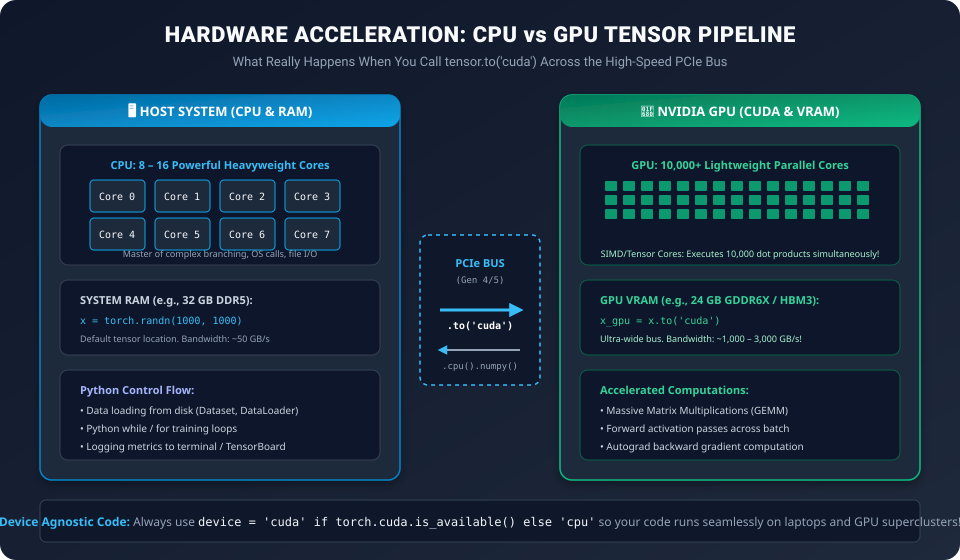

# Day 25: Introduction to PyTorch — The Industry-Standard Framework


| ⬅️ Previous Day | 📚 Course Hub | ➡️ Next Day |
|:---|:---:|---:|
| [← Day 24: Building a Complete Neural Network from Scratch](../Day_24_Building_Neural_Network_From_Scratch/Day_24_Building_Neural_Network_From_Scratch.md) | [All 50 Days Overview](../../README.md) | [Day 26: CNNs Part 1 →](../../Phase_05_Specialized_Neural_Networks/Day_26_CNNs_Part_1/Day_26_CNNs_Part_1.md) |

> **"Yesterday you hand-built a Swiss watch from raw gears in NumPy. Today, you take the wheel of a Formula 1 supercar: PyTorch."**  
> Welcome to Day 25 — the grand finale of **Phase 4: Deep Learning Foundations**! Having implemented every neuron, activation, loss, and backward gradient by hand, you now possess the rare superpower of knowing *exactly* what PyTorch does behind every line of code.

---

## 🧭 The Mental Compass: Why Did PyTorch Conquer AI?

In the early days of deep learning, researchers struggled with **TensorFlow 1.0**:
* You had to define a static graph first, compile it into an abstract session, and run it via `sess.run()`.
* If a shape error occurred, the stack trace was an incomprehensible 500-line C++ dump.
* You could not place a Python `print()` or set a debugger breakpoint inside your forward pass.

In 2016, Meta AI released **PyTorch**:
* **Define-by-Run (Dynamic Graphs):** The computation graph is built on the fly in real time.
* **Pythonic to the Core:** If you want to debug, you just write `print(x.shape)` or set `breakpoint()`.
* Today, virtually **100% of Generative AI research** (including GPT, Claude, LLaMA, Stable Diffusion, and Sora) is built natively in PyTorch.

---

## 1. The 3 Core Pillars of PyTorch


---

### Pillar 1: The Tensor (`torch.Tensor`)
A PyTorch Tensor is identical to a NumPy `ndarray`, with two game-changing superpowers:
1. **GPU Acceleration:** Can be teleported from CPU RAM to GPU VRAM in one call: `x.to('cuda')`.
2. **Automatic Differentiation:** Tracks computational history when `requires_grad=True`.

```python
import torch

# Creating a tensor with gradient tracking
x = torch.tensor([2.0, 3.0], requires_grad=True)
y = x ** 2 + 5  # y = [9.0, 14.0]
z = y.sum()     # z = 23.0

# Automatically calculate dy/dx via backprop!
z.backward()
print(x.grad)  # Outputs: tensor([4.0, 6.0])  (because d/dx(x^2) = 2x)
```

---

### Pillar 2: The Module Blueprint (`nn.Module`)
In PyTorch, all neural network architectures inherit from `torch.nn.Module`:
* **`__init__()`:** Where you declare layers, weights, and sub-modules (`nn.Linear`, `nn.ReLU`).
* **`forward(x)`:** Where you define how data flows through those layers.

```python
import torch.nn as nn

class SimpleMLP(nn.Module):
    def __init__(self, input_dim, hidden_dim, output_dim):
        super().__init__()
        self.net = nn.Sequential(
            nn.Linear(input_dim, hidden_dim),
            nn.ReLU(),
            nn.Linear(hidden_dim, output_dim),
            nn.Sigmoid()
        )

    def forward(self, x):
        return self.net(x)
```

---

### Pillar 3: The Sacred 5-Step Training Loop
Every single deep learning model in PyTorch — from a 2-neuron perceptron to a 70-billion parameter LLaMA model — trains using the **exact same 5 lines in order**:

```python
# 1. Clear previous gradients (prevent accumulation)
optimizer.zero_grad()

# 2. Forward Pass: compute model predictions
outputs = model(inputs)

# 3. Compute Loss
loss = criterion(outputs, targets)

# 4. Backward Pass: compute all gradients via Autograd
loss.backward()

# 5. Optimizer Step: update weights
optimizer.step()
```

> [!CAUTION]
> **The `optimizer.zero_grad()` Beginner Trap:**  
> By default, PyTorch **accumulates (adds)** gradients to `.grad` on every `.backward()` call rather than overwriting them. If you forget `optimizer.zero_grad()`, your gradients from step 2 will add to step 1, exploding your weights!

---

## 2. Hardware Acceleration: CPU vs GPU Memory Flow

How does PyTorch achieve 100x speedups over pure Python?



* **Host RAM:** Holds Python data structures, raw datasets, and disk loaders.
* **PCIe Bus:** The physical interface connecting motherboard RAM to the GPU.
* **GPU VRAM:** Ultra-fast high-bandwidth memory feeding thousands of SIMD/Tensor cores.

### The Professional Device-Agnostic Pattern:
Never hardcode `'cuda'`. Write your code so it runs automatically on NVIDIA GPUs, Apple Silicon GPUs (M1/M2/M3/M4), or fallback CPU:

```python
# Device-agnostic PyTorch setup
device = (
    "cuda" if torch.cuda.is_available() 
    else "mps" if torch.backends.mps.is_available() 
    else "cpu"
)
print(f"Using accelerated compute device: {device}")

# Move model and data to target device
model = model.to(device)
inputs, targets = inputs.to(device), targets.to(device)
```

---

## 3. Hands-On Python Lab: Complete Production PyTorch Workflow

Let's solve the non-linear classification challenge using industry-standard PyTorch best practices:

```python
import torch
import torch.nn as nn
import torch.optim as optim
from torch.utils.data import TensorDataset, DataLoader
import numpy as np

# =====================================================================
# 1. HARDWARE SELECTION
# =====================================================================
device = (
    "cuda" if torch.cuda.is_available()
    else "mps" if torch.backends.mps.is_available()
    else "cpu"
)
print("=" * 65)
print(f"🔥 PyTorch Active Compute Device: {device.upper()}")
print("=" * 65)

# =====================================================================
# 2. SYNTHETIC DATASET (MOONS / CONCENTRIC CIRCLES)
# =====================================================================
np.random.seed(42)
n_samples = 1200

# Generate concentric circles
angles = np.random.uniform(0, 2 * np.pi, n_samples)
radii = np.concatenate([
    np.random.normal(0.4, 0.08, n_samples // 2),  # Inner circle (Class 0)
    np.random.normal(0.9, 0.08, n_samples // 2)   # Outer circle (Class 1)
])
X_np = np.stack([radii * np.cos(angles), radii * np.sin(angles)], axis=1).astype(np.float32)
y_np = np.concatenate([np.zeros(n_samples // 2), np.ones(n_samples // 2)]).reshape(-1, 1).astype(np.float32)

# Convert NumPy arrays to PyTorch Tensors
X_tensor = torch.from_numpy(X_np)
y_tensor = torch.from_numpy(y_np)

# Build PyTorch Dataset & DataLoader
dataset = TensorDataset(X_tensor, y_tensor)
train_loader = DataLoader(dataset, batch_size=32, shuffle=True)

# =====================================================================
# 3. DEFINE NEURAL NETWORK ARCHITECTURE
# =====================================================================
class ProductionMLP(nn.Module):
    def __init__(self, in_features=2, hidden_dim=32, out_features=1):
        super().__init__()
        self.architecture = nn.Sequential(
            nn.Linear(in_features, hidden_dim),
            nn.ReLU(),
            nn.Linear(hidden_dim, hidden_dim // 2),
            nn.ReLU(),
            nn.Linear(hidden_dim // 2, out_features)
            # Notice: No Sigmoid here! We use BCEWithLogitsLoss for numerical stability
        )

    def forward(self, x):
        return self.architecture(x)

model = ProductionMLP().to(device)
print("\nModel Architecture Summary:\n", model)

# =====================================================================
# 4. DEFINE LOSS FUNCTION & ADAM OPTIMIZER
# =====================================================================
# BCEWithLogitsLoss combines Sigmoid + BCE inside one numerically stable kernel
criterion = nn.BCEWithLogitsLoss()
optimizer = optim.Adam(model.parameters(), lr=0.01)

# =====================================================================
# 5. THE SACRED TRAINING LOOP
# =====================================================================
epochs = 40
print(f"\nBeginning training across {epochs} epochs...")

for epoch in range(1, epochs + 1):
    model.train()  # Set model to training mode
    running_loss = 0.0

    for batch_X, batch_y in train_loader:
        # Move batch to GPU / CPU
        batch_X, batch_y = batch_X.to(device), batch_y.to(device)

        # 1. Zero Gradients
        optimizer.zero_grad()

        # 2. Forward Pass
        predictions = model(batch_X)

        # 3. Calculate Loss
        loss = criterion(predictions, batch_y)

        # 4. Backward Pass (Autograd Chain Rule)
        loss.backward()

        # 5. Optimizer Step (Adam parameter update)
        optimizer.step()

        running_loss += loss.item() * batch_X.size(0)

    epoch_loss = running_loss / len(train_loader.dataset)
    if epoch % 10 == 0 or epoch == 1:
        # Evaluate accuracy
        model.eval()
        with torch.no_grad():
            raw_logits = model(X_tensor.to(device))
            predicted_classes = (torch.sigmoid(raw_logits) >= 0.5).float()
            accuracy = (predicted_classes == y_tensor.to(device)).float().mean().item() * 100
        print(f"  Epoch {epoch:2d}/{epochs} | Loss: {epoch_loss:.4f} | Accuracy: {accuracy:.1f}%")

# =====================================================================
# 6. MODEL PERSISTENCE: SAVING & LOADING WEIGHTS (.pt / .pth)
# =====================================================================
checkpoint_path = "concentric_classifier.pt"
torch.save(model.state_dict(), checkpoint_path)
print(f"\n✅ Model weights successfully saved to: {checkpoint_path}")

# Load back into fresh model
deployed_model = ProductionMLP().to(device)
deployed_model.load_state_dict(torch.load(checkpoint_path))
deployed_model.eval()

# Run single inference
dummy_sample = torch.tensor([[0.85, 0.10]], device=device)
with torch.no_grad():
    prob = torch.sigmoid(deployed_model(dummy_sample)).item()
print(f"Test Inference for Coordinate (0.85, 0.10):")
print(f"  Predicted Class : {1 if prob >= 0.5 else 0} | Confidence: {prob:.2%}")
```

---

## 4. Phase 4 Milestone Complete! 🏆

Congratulations! You have officially conquered **Phase 4: Deep Learning Foundations (Days 18–25)**:

* [x] **Day 18:** The Artificial Neuron (Perceptron math, weights, bias, XOR failure).
* [x] **Day 19:** Multi-Layer Neural Networks (Stacking neurons, matrix notation, universal approximation).
* [x] **Day 20:** Activation Functions (Proof of linear collapse, ReLU, GELU, vanishing gradients).
* [x] **Day 21:** Loss Functions (MSE, MAE, Huber, Binary & Categorical Cross-Entropy, Perplexity).
* [x] **Day 22:** Backpropagation (The calculus chain rule, forward/backward passes, gradient checking).
* [x] **Day 23:** Optimizers (Ravine oscillations, Momentum, RMSprop, Adam, AdamW).
* [x] **Day 24:** Building a Complete Neural Network from Scratch in Pure NumPy.
* [x] **Day 25:** PyTorch Masterclass (Tensors, Autograd, `nn.Module`, GPU acceleration).

---

## 🚀 Coming Up Next: Phase 5 — Specialized Neural Networks

Now that you understand deep learning from the ground up, how do neural networks process specialized modalities like images and temporal sequences?

Tomorrow in **Day 26**, we enter **Specialized Neural Networks**:
* **Convolutional Neural Networks (CNNs) Part 1:** How computers see images.
* Kernels, Filters, Feature Maps, Stride, and Padding.
* Why standard MLPs fail on images and how Convolutions preserve 2D spatial locality!


---

## 🧭 Navigation & Next Steps

| ⬅️ Previous Day | 📚 Course Hub | ➡️ Next Day |
|:---|:---:|---:|
| [← Day 24: Building a Complete Neural Network from Scratch](../Day_24_Building_Neural_Network_From_Scratch/Day_24_Building_Neural_Network_From_Scratch.md) | [All 50 Days Overview](../../README.md) | [Day 26: CNNs Part 1 →](../../Phase_05_Specialized_Neural_Networks/Day_26_CNNs_Part_1/Day_26_CNNs_Part_1.md) |
