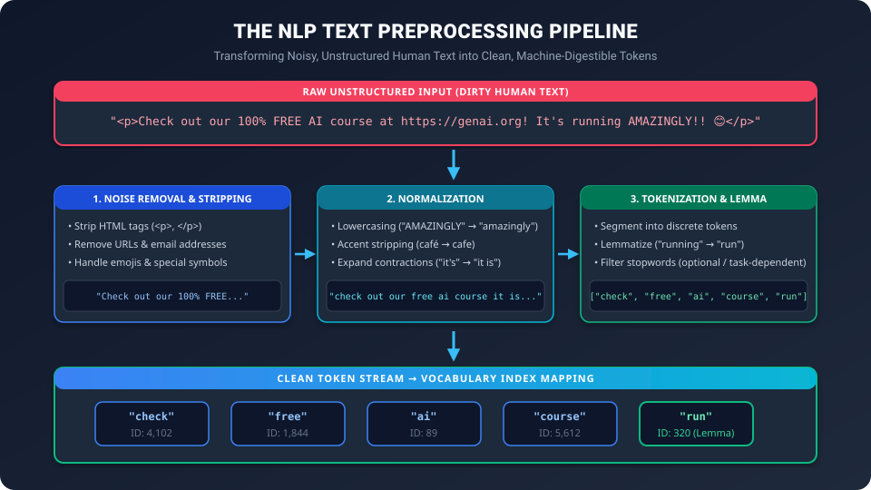
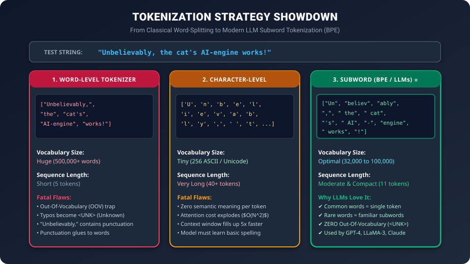

# Day 30: Text Processing Basics — Cleaning, Tokenization & Normalization

> "A neural network is fundamentally a giant matrix calculator. It cannot eat the English language. Before a single word can be processed by an AI model, raw human text must undergo surgical cleaning, normalization, and tokenization."

---

## 🧭 Roadmap Navigation

- **Previous Phase**: [Day 29: LSTMs & GRUs — Solving the Forgetting Problem](../../Phase_05_Specialized_Neural_Networks/Day_29_LSTMs_and_GRUs/Day_29_LSTMs_and_GRUs.md) (Phase 5 Complete)
- **Current Milestone**: Day 30 of 50 (Phase 6: NLP & Text Processing Foundations — Chapter 1)
- **Next Lesson**: [Day 31: Word Representations — From Text to Numbers](../Day_31_Word_Representations/Day_31_Word_Representations.md)

---

## 1. The Real-World Analogy: The Michelin-Star Kitchen Prep (*Mise en Place*)

Imagine you are the Head Chef at a 3-star Michelin restaurant.

A delivery truck arrives and unloads crates of raw vegetables: carrots covered in field dirt, unpeeled onions with papery husks, potatoes with sprouts, and leafy greens mixed with bugs and pesticide residue.

```
Messy Farm Crates ──▶ [ Dirt, Roots, Skins, Bugs ] ──▶ CANNOT go straight into the soup pot!
```

If you dump those raw, unwashed carrots directly into a boiling broth, the entire soup is ruined. 

Before cooking begins, the kitchen staff performs **Mise en Place** (everything in its place):
1. **Washing & Peeling (Cleaning)**: Scrub off the dirt, peel the bitter skins, strip away non-edible roots.
2. **Standardization (Normalization)**: Grade potatoes by size, trim off bruised edges, convert everything to uniform metrics.
3. **Dicing & Chopping (Tokenization)**: Cut whole vegetables into uniform 1-centimeter bite-sized cubes that cook evenly and fit on a spoon.

```
Raw Crate (Dirty Text) ──▶ Peeling (Regex Cleaning) ──▶ Dicing (Tokenization) ──▶ Uniform Cubes (Tokens)
```

In Natural Language Processing (NLP), **raw text scraped from the internet is the unwashed vegetable**. It is contaminated with HTML tags (`<p>`, `<div>`), broken Unicode accents (`café`), emojis, erratic capitalization (`AMAZING!!!`), typos, and unstructured whitespace.

Text preprocessing transforms this chaotic human scratchpad into clean, discrete mathematical units called **Tokens**.

---

## 2. The Text Preprocessing Pipeline

Every production NLP and LLM pipeline executes four core preparation stages:



1. **Noise Removal**: Strip away markup tags, URLs, metadata, control characters, and irrelevant artifacts.
2. **Text Normalization**: Unify casing, expand conversational contractions, convert Unicode accents into canonical forms.
3. **Tokenization**: Segment continuous strings of characters into discrete lexical tokens.
4. **Vocabulary Reduction / Morphological Analysis**: Stemming, lemmatization, and selective stopword filtering.

Let us dissect each stage with mathematical and algorithmic precision.

---

## 3. Stage 1: Noise Removal & Text Normalization

### 1. Stripping HTML and URLs with Regular Expressions
Web-scraped documents (e.g., Common Crawl used to train GPT-4) are drowned in HTML syntax and tracking parameters:

```python
import re

def clean_raw_html_and_urls(text: str) -> str:
    # 1. Remove HTML tags like <p>, <a href="...">, <br/>
    clean = re.sub(r'<[^>]+>', ' ', text)
    # 2. Remove URLs (http:// or https://)
    clean = re.sub(r'https?://\S+|www\.\S+', ' ', clean)
    # 3. Collapse multiple spaces and newlines into a single space
    clean = re.sub(r'\s+', ' ', clean).strip()
    return clean

raw_sample = "<p>Check out our <b>FREE</b> course at https://genai.org/join! It's awesome.</p>"
print(clean_raw_html_and_urls(raw_sample))
# Output: "Check out our FREE course at It's awesome."
```

### 2. Unicode Normalization: Solving the "é" Trap
In Unicode, identical-looking human characters can have completely different numeric byte representations!

For example, the letter **"é"** can be written in two ways:
1. **NFC (Composed)**: A single codepoint `\u00e9` (`é`).
2. **NFD (Decomposed)**: Two separate codepoints `\u0065` (regular `e`) + `\u0301` (combining acute accent `´`).

To a human reader, both look identical: **café**.
To Python and a neural network:

```python
import unicodedata

word_nfc = "caf\u00e9"       # 'café' (4 characters)
word_nfd = "cafe\u0301"      # 'café' (5 characters)

print(word_nfc == word_nfd)  # False! A lookup table will FAIL!

# Normalize both to NFC canonical form:
norm_1 = unicodedata.normalize('NFC', word_nfc)
norm_2 = unicodedata.normalize('NFC', word_nfd)
print(norm_1 == norm_2)      # True!
```

> [!IMPORTANT]
> **Always run `unicodedata.normalize('NFC', text)`** when building datasets. Failing to do so can secretly double your vocabulary size with duplicate, mismatched tokens.

### 3. Case Folding & Contraction Expansion
- **Case Folding**: `"Apple"` (noun) vs `"apple"` (fruit). In classical search/classification, lowercasing prevents duplicate vocabulary entries. (In modern LLMs, casing is preserved because `"Apple Inc."` vs `"apple fruit"` carry vital semantic differences).
- **Contractions**: `"don't"` $\to$ `"do not"`, `"they're"` $\to$ `"they are"`. Expanding contractions clarifies auxiliary verbs and negation.

---

## 4. Stage 2: The Tokenization Dilemma

How do we break a continuous sequence of characters into discrete tokens?

There are three competing philosophies:



### Strategy 1: Word-Level Tokenization (Whitespace & Punctuation)
The most intuitive approach: split strings whenever you encounter a space (`text.split()`).

#### Why Whitespace Splitting Fails Catastrophically:
1. **Punctuation Attachment**:
   `"I love AI!"` $\implies$ `["I", "love", "AI!"]`.
   `"AI!"` is treated as a completely different word from `"AI"`.
2. **Contractions**:
   `"we're"` $\implies$ Is it one word? Two words (`we` + `are`)?
3. **Compound Languages**:
   German, Finnish, and Chinese do not use simple space-separated word boundaries:
   - German: *Donaudampfschifffahrtsgesellschaftskapitän* (Danube steamship company captain) is a single written word!
   - Chinese: 我喜欢人工智能 (no spaces between words whatsoever).
4. **The Out-Of-Vocabulary (OOV) Disaster**:
   If your training set has 50,000 words, what happens when a user types `"unputdownable"` or a simple typo `"computerr"`?
   The model maps it to `<UNK>` (Unknown Token). If 5% of tokens in a prompt become `<UNK>`, the model outputs gibberish.

---

### Strategy 2: Character-Level Tokenization
Split text into individual characters (`['c', 'a', 't']`).

#### Advantages:
- Vocabulary is tiny: ~100 characters for standard English, ~256 for byte sequences.
- Zero Out-Of-Vocabulary (OOV) errors. Any word can be spelled.

#### The Fatal Flaws:
1. **Context Window Explosion**:
   A 500-word essay is ~3,000 characters. In a Transformer where Attention computational complexity is $\mathcal{O}(N^2)$ with sequence length $N$:
   $$(3,000)^2 = 9,000,000 \text{ operations vs } (500)^2 = 250,000 \text{ operations}$$
   Character tokenization is **36 times more computationally expensive**!
2. **Lack of Semantic Density**:
   The letter `'t'` has zero intrinsic meaning. The model must waste dozens of neural layers just learning that `c` + `a` + `t` forms a furry four-legged animal.

---

### Strategy 3: Subword Tokenization (BPE & WordPiece) — The Modern Standard ⭐

Used by **GPT-4, Claude, LLaMA-3, BERT, and Gemini**, **Subword Tokenization** is the Goldilocks sweet spot:

- **Frequent, common words** remain single whole tokens: `"the"`, `"cat"`, `"computer"`.
- **Rare, complex, or compound words** are chopped into familiar subword pieces:
  `"unbelievably"` $\implies$ `["un", "believ", "ably"]`.
- **Misspellings or brand-new words** are broken down to character-level pieces:
  `"neurosymbolic"` $\implies$ `["neuro", "symbol", "ic"]`.
- **Vocabulary size is strictly controlled**: typically 32,000 (LLaMA) to 100,000 (GPT-4) to 256,000 (Gemma).

---

## 5. Byte-Pair Encoding (BPE): How LLM Tokenizers Work

Invented in 1994 as a data compression algorithm (Philip Gage) and adapted for NLP by **Sennrich et al. (2016)**, **Byte-Pair Encoding (BPE)** iteratively merges the most frequently adjacent pairs of characters.

### Step-by-Step Algorithm Walkthrough

Suppose our training corpus contains just 4 words with frequencies:

| Word | Characters with End-of-Word Marker `</w>` | Frequency |
| :--- | :--- | :---: |
| `"low"` | `l o w </w>` | 5 |
| `"lower"` | `l o w e r </w>` | 2 |
| `"newest"` | `n e w e s t </w>` | 6 |
| `"widest"` | `w i d e s t </w>` | 3 |

**Initial Vocabulary**: All individual characters:
`{'l', 'o', 'w', 'e', 'r', 'n', 's', 't', 'i', 'd', '</w>'}` (11 tokens).

#### Iteration 1: Count Adjacent Pairs
Count how many times every pair appears across all words:
- `('e', 's')`: appears in `"newest"` (6) + `"widest"` (3) = **9 times**!
- `('s', 't')`: appears in `"newest"` (6) + `"widest"` (3) = **9 times**!
- `('l', 'o')`: appears in `"low"` (5) + `"lower"` (2) = 7 times.

`('e', 's')` has the highest frequency (9).
**Action**: Merge `('e', 's')` into a new token `'es'`.
**New Vocabulary**: Add `'es'` (12 tokens).
Words become:
- `n e w es t </w>`
- `w i d es t </w>`

#### Iteration 2: Next Most Frequent Pair
- `('es', 't')`: appears in `"newest"` (6) + `"widest"` (3) = **9 times**!
**Action**: Merge `('es', 't')` into `'est'`.
**New Vocabulary**: Add `'est'` (13 tokens).

#### Iteration 3:
- `('est', '</w>')`: appears $6 + 3 =$ **9 times**!
**Action**: Merge into `'est</w>'`.

#### Iteration 4:
- `('l', 'o')`: appears in `"low"` (5) + `"lower"` (2) = **7 times**!
**Action**: Merge into `'lo'`.

#### Resulting Subword Magic:
If a user now enters an unseen word: **`"lowest"`**:
The BPE tokenizer splits it into:
`['lo', 'w', 'est</w>']`

> [!NOTE]
> Even though `"lowest"` was **never in the training corpus**, the model tokenizes it into familiar subwords! There is **NO Out-Of-Vocabulary error**.

---

## 6. Stopwords: When to Remove vs When to NEVER Touch

**Stopwords** are high-frequency grammatical glue words: `"the"`, `"is"`, `"at"`, `"which"`, `"on"`, `"and"`.

```
                    THE GREAT STOPWORD DIVERGENCE
                    
    Classical Machine Learning (1990-2015)          Modern LLMs & GenAI (2017-Present)
    ──────────────────────────────────────          ──────────────────────────────────
    • Models: TF-IDF, Naive Bayes, SVM              • Models: GPT-4, LLaMA, BERT, Mistral
    • Task: Topic Classification, Spam Filter       • Task: Text Generation, Reasoning, Code
    • Action: STRIP ALL STOPWORDS                   • Action: NEVER TOUCH STOPWORDS!
    • Why: "The" adds no topic information          • Why: "To be or not to be" becomes ""!
```

### Why Generative AI Keeps Every Stopword:
1. **Negation & Logic**:
   *"The medicine is **not** safe for children."*
   If you remove the stopword `"not"`, the sentence means the exact opposite!
2. **Syntactic Structure**:
   Self-Attention mechanisms rely on prepositions and pronouns to resolve references (e.g., matching `"it"` to the correct previous noun).

---

## 7. Stemming vs Lemmatization

When reducing inflected words to their root forms, there are two distinct techniques:

```
                            INFLECTED WORD: "STUDYING"
                                        │
                    ┌───────────────────┴───────────────────┐
                    ▼                                       ▼
            STEMMING (Heuristic)                  LEMMATIZATION (Dictionary)
          Chops off suffixes with rules           Looks up word + Part of Speech
                    │                                       │
                    ▼                                       ▼
                 "studi"                                 "study"
            (Crude, non-word)                       (Valid dictionary lemma)
```

### 1. Stemming (The Porter / Snowball Stemmer)
- Uses crude heuristic pattern matching (e.g., "if word ends in *ing*, chop it off").
- **Speed**: Blazing fast (just string slicing).
- **Flaw 1 (Over-stemming)**: `"universe"` and `"university"` both become `"univers"`.
- **Flaw 2 (Under-stemming)**: `"alumnus"` $\to$ `"alumnu"`, `"alumni"` $\to$ `"alumni"` (fails to link them).

### 2. Lemmatization (WordNet / spaCy)
- Uses a complete morphological lexicon and requires knowing the word's **Part of Speech (POS)**:
  - `"meeting"` as a Noun $\to$ lemma: `"meeting"`
  - `"meeting"` as a Verb (*"we are meeting tomorrow"*) $\to$ lemma: `"meet"`
  - `"better"` as an Adjective $\to$ lemma: `"good"`
  - `"ran"` as a Verb $\to$ lemma: `"run"`

---

## 8. Hands-On Python Lab: Building a Preprocessing Pipeline & Pure Python BPE

Let us write a production-ready preprocessing pipeline and build a working **Byte-Pair Encoding (BPE)** tokenizer from scratch.

```python
"""
Day 30 Lab: Comprehensive Text Preprocessing & Pure Python BPE Tokenizer
Demonstrates:
1. Regex-based cleaning and normalization
2. Tokenization comparison (Word vs BPE)
3. Step-by-step BPE merge algorithm implemented from scratch
"""

import re
import unicodedata
from collections import Counter, defaultdict

# ==========================================
# 1. PRODUCTION TEXT CLEANER & NORMALIZER
# ==========================================
class TextPreprocessor:
    def __init__(self, lowercase=True, remove_html=True, remove_urls=True):
        self.lowercase = lowercase
        self.remove_html = remove_html
        self.remove_urls = remove_urls
        
    def clean(self, text: str) -> str:
        # Unicode normalization (NFC)
        text = unicodedata.normalize('NFC', text)
        
        # HTML tag removal
        if self.remove_html:
            text = re.sub(r'<[^>]+>', ' ', text)
            
        # URL removal
        if self.remove_urls:
            text = re.sub(r'https?://\S+|www\.\S+', ' ', text)
            
        # Optional lowercasing
        if self.lowercase:
            text = text.lower()
            
        # Clean extra whitespaces
        text = re.sub(r'\s+', ' ', text).strip()
        return text

sample_text = """
<div class="header">
    <h3>Welcome to the AI Revolution! 🚀</h3>
    <p>Visit https://genai.courses/masterclass for 100% FREE access.</p>
    <p>It's caf&eacute; style learning: fast, deep, and unputdownable!</p>
</div>
"""

preprocessor = TextPreprocessor()
cleaned_text = preprocessor.clean(sample_text)
print("--- 1. CLEANED TEXT ---")
print(cleaned_text)


# ==========================================
# 2. BUILDING A BPE TOKENIZER FROM SCRATCH
# ==========================================
class SimpleBPETokenizer:
    def __init__(self, num_merges=10):
        self.num_merges = num_merges
        self.merges = {}  # Stores pair -> merged_token mapping
        self.vocab = set()
        
    def _get_stats(self, corpus_words):
        """Counts frequency of all adjacent symbol pairs."""
        pairs = defaultdict(int)
        for word, freq in corpus_words.items():
            symbols = word.split()
            for i in range(len(symbols) - 1):
                pairs[(symbols[i], symbols[i + 1])] += freq
        return pairs
        
    def _merge_vocab(self, pair, corpus_words):
        """Replaces instances of pair with concatenated symbol."""
        bigram = re.escape(' '.join(pair))
        pattern = re.compile(r'(?<!\S)' + bigram + r'(?!\S)')
        merged_corpus = {}
        replacement = ''.join(pair)
        for word, freq in corpus_words.items():
            new_word = pattern.sub(replacement, word)
            merged_corpus[new_word] = freq
        return merged_corpus

    def fit(self, texts):
        # 1. Initialize corpus with characters separated by spaces and '</w>' at word end
        corpus = defaultdict(int)
        for text in texts:
            words = text.strip().split()
            for w in words:
                chars = ' '.join(list(w)) + ' </w>'
                corpus[chars] += 1
                
        # Base vocabulary of individual characters
        for word in corpus.keys():
            for sym in word.split():
                self.vocab.add(sym)
                
        print(f"\n--- 2. TRAINING BPE (Initial vocab size: {len(self.vocab)}) ---")
        
        # 2. Iteratively find best pair and merge
        for i in range(1, self.num_merges + 1):
            pairs = self._get_stats(corpus)
            if not pairs:
                break
                
            best_pair = max(pairs, key=pairs.get)
            best_count = pairs[best_pair]
            merged_token = ''.join(best_pair)
            
            self.merges[best_pair] = merged_token
            self.vocab.add(merged_token)
            corpus = self._merge_vocab(best_pair, corpus)
            
            print(f"Merge #{i:2d}: {best_pair} -> '{merged_token}' (count: {best_count})")
            
        print(f"Final Vocab Size after {self.num_merges} merges: {len(self.vocab)}")
        
    def tokenize_word(self, word: str):
        """Tokenizes a single word using learned BPE merge rules."""
        chars = list(word) + ['</w>']
        
        while True:
            # Look for pairs in current word that exist in learned merges
            pairs = [(chars[i], chars[i+1]) for i in range(len(chars)-1)]
            mergeable_pairs = [p for p in pairs if p in self.merges]
            
            if not mergeable_pairs:
                break  # No more merge rules apply
                
            # Pick the merge rule that was learned earliest
            pair_to_merge = min(mergeable_pairs, key=lambda p: list(self.merges.keys()).index(p))
            
            # Perform merge
            new_chars = []
            i = 0
            while i < len(chars):
                if i < len(chars) - 1 and (chars[i], chars[i+1]) == pair_to_merge:
                    new_chars.append(self.merges[pair_to_merge])
                    i += 2
                else:
                    new_chars.append(chars[i])
                    i += 1
            chars = new_chars
            
        return chars

# Training corpus
training_data = [
    "low low low low low",
    "lower lower",
    "newest newest newest newest newest newest",
    "widest widest widest"
]

bpe = SimpleBPETokenizer(num_merges=6)
bpe.fit(training_data)

print("\n--- 3. BPE INFERENCE ON UNSEEN WORDS ---")
test_words = ["lowest", "newer", "wider", "newest"]
for tw in test_words:
    tokens = bpe.tokenize_word(tw)
    print(f"Word: '{tw:<8}' -> Subword Tokens: {tokens}")
```

### Expected Output:

```text
--- 1. CLEANED TEXT ---
welcome to the ai revolution! 🚀 visit for 100% free access. it's café style learning: fast, deep, and unputdownable!

--- 2. TRAINING BPE (Initial vocab size: 11) ---
Merge # 1: ('e', 's') -> 'es' (count: 9)
Merge # 2: ('es', 't') -> 'est' (count: 9)
Merge # 3: ('est', '</w>') -> 'est</w>' (count: 9)
Merge # 4: ('l', 'o') -> 'lo' (count: 7)
Merge # 5: ('lo', 'w') -> 'low' (count: 7)
Merge # 6: ('n', 'e') -> 'ne' (count: 6)
Final Vocab Size after 6 merges: 17

--- 3. BPE INFERENCE ON UNSEEN WORDS ---
Word: 'lowest  ' -> Subword Tokens: ['low', 'est</w>']
Word: 'newer   ' -> Subword Tokens: ['ne', 'w', 'e', 'r', '</w>']
Word: 'wider   ' -> Subword Tokens: ['w', 'i', 'd', 'e', 'r', '</w>']
Word: 'newest  ' -> Subword Tokens: ['ne', 'w', 'est</w>']
```

Notice how `"lowest"` (which never existed in the training data) was seamlessly parsed into `['low', 'est</w>']`. That is the subword revolution in action!

---

## 9. Modern LLM Tokenizer Preview: `tiktoken` (OpenAI)

In real-world GenAI engineering, you will frequently use OpenAI's blazing-fast Rust-based tokenizer library, **`tiktoken`**:

```python
# pip install tiktoken
import tiktoken

# Load GPT-4's tokenizer encoding
enc = tiktoken.get_encoding("cl100k_base")

text = "Generative AI is revolutionary!"
token_ids = enc.encode(text)
print("Token IDs:    ", token_ids)
print("Decoded pieces:", [enc.decode([tid]) for tid in token_ids])

# Notice spaces are preserved inside tokens (e.g., ' AI', ' is')
# Output:
# Token IDs:     [38446, 5291, 374, 25298, 0]
# Decoded pieces: ['Generative', ' AI', ' is', ' revolutionary', '!']
```

---

## 10. Summary & Key Takeaways

1. **Garbage In, Garbage Out**: Uncleaned text degrades model performance and inflates vocabulary size with duplicate and broken tokens.
2. **Always Normalize Unicode**: Use `unicodedata.normalize('NFC', text)` to prevent composed vs decomposed character mismatches.
3. **Word Tokenization vs Subword Tokenization**:
   - Word tokenization suffers from catastrophic Out-Of-Vocabulary (`<UNK>`) failures.
   - Subword tokenization (BPE) ensures 100% coverage by breaking unknown words into common subwords or individual characters.
4. **Stopwords Rule of Thumb**:
   - Strip stopwords **only** for lightweight, classical ML text classifiers.
   - **Never strip stopwords** for LLMs, translation, or generative AI.

---

## 11. Practice Exercises

### Exercise 1: Token Count vs Word Count
Consider the sentence: *"Hyperparameter optimization in neuro-evolutionary systems is non-trivial."*
1. How many words exist using whitespace splitting?
2. Why would a subword tokenizer like BPE break `"neuro-evolutionary"` into multiple tokens?
3. What happens if a classical word-level model encounters the word `"neuro-evolutionary"` if it was never in its training dictionary?

### Exercise 2: Unicode Detection
Write a Python one-liner to verify whether two strings `"resume\u0301"` and `"resum\u00e9"` are equivalent after NFC normalization.

### Solutions:
- **Exercise 1**:
  1. Whitespace splitting yields 6 tokens: `["Hyperparameter", "optimization", "in", "neuro-evolutionary", "systems", "is", "non-trivial."]`.
  2. Because `"neuro-evolutionary"` is a rare compound term, BPE decomposes it into familiar morphological roots: `["neuro", "-", "evolution", "ary"]`.
  3. A classical word-level model would replace `"neuro-evolutionary"` with `<UNK>`, losing all semantic meaning of both "neuro" and "evolution".
- **Exercise 2**:
  `unicodedata.normalize('NFC', "resume\u0301") == unicodedata.normalize('NFC', "resum\u00e9")` (Evaluates to `True`).

---

## 🚀 Tomorrow's Mission: Day 31

Now that we understand how raw text is broken into clean tokens, how do we transform those discrete strings into actual mathematical vectors that a neural network can multiply? Tomorrow on [Day 31: Word Representations — From Text to Numbers](../Day_31_Word_Representations/Day_31_Word_Representations.md), we build **One-Hot Encodings, Bag-of-Words (BoW), and TF-IDF** from scratch!
