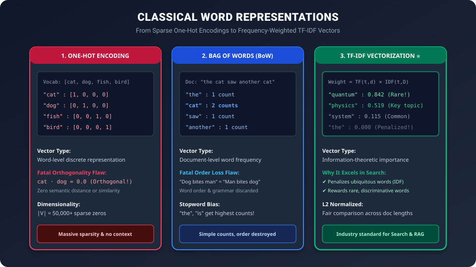

# Day 31: Word Representations — From Text to Numbers (One-Hot, BoW & TF-IDF)


| ⬅️ Previous Day | 📚 Course Hub | ➡️ Next Day |
|:---|:---:|---:|
| [← Day 30: Text Processing Basics (Cleaning, Tokenization, Stopwords)](../Day_30_Text_Processing_Basics/Day_30_Text_Processing_Basics.md) | [All 50 Days Overview](../../README.md) | [Day 32: Word Embeddings →](../Day_32_Word_Embeddings/Day_32_Word_Embeddings.md) |

> "To a computer, the word 'cat' is merely three ASCII bytes: 99, 97, and 116. A GPU cannot perform gradient descent or matrix multiplication on ASCII letters. How we translate human words into numeric vectors determines whether an AI model sees meaning or just blind noise."

---

## 🧭 Roadmap Navigation

- **Previous Lesson**: [Day 30: Text Processing Basics](../Day_30_Text_Processing_Basics/Day_30_Text_Processing_Basics.md)
- **Current Milestone**: Day 31 of 50 (Phase 6: NLP & Text Processing Foundations — Chapter 2)
- **Next Lesson**: [Day 32: Word Embeddings — Word GPS Coordinates](../Day_32_Word_Embeddings/Day_32_Word_Embeddings.md)

---

## 1. The Real-World Analogy: The Supermarket Inventory & The Library Index

Imagine running a massive supermarket warehouse with 50,000 items:

```
Supermarket Item ──▶ Barcode #00042 (Apples)  ──▶ Barcode #00043 (Pears)  ──▶ Barcode #49999 (Tractor Tire)
```

### 1. The Barcode (One-Hot Encoding)
Every product has a unique 50,000-digit barcode where all digits are `0` except for one solitary `1` at the item's catalog position:
- Apples: `[1, 0, 0, 0, ...]`
- Pears: `[0, 1, 0, 0, ...]`
- Tractor Tire: `[0, 0, 0, 1, ...]`

The barcode uniquely identifies the product. But notice its fundamental stupidity: **The barcode contains zero geometric information**. The barcode for an apple is just as mathematically distant from a pear as it is from a 500-pound tractor tire!

### 2. The Customer Receipt (Bag of Words)
When a shopper checks out, the cash register prints a receipt:
- 3 apples
- 1 carton of milk
- 2 loaves of bread

The receipt records **counts**. It tells you *what* the customer bought, but completely discards *the order* in which items were placed into the shopping cart.

### 3. The Specialty Catalog (TF-IDF)
Suppose a customer buys:
`"1 pack of gum, 1 bottle of water, and 1 rare tin of Beluga Caviar"`

If you classify the customer's interest using raw counts, water and gum get equal weight to caviar. But **caviar is rare across the entire city's inventory**. A system that weights items by **scarcity** instantly realizes: *"This customer is a gourmet luxury buyer!"*

That scarcity-weighted inventory system is **TF-IDF (Term Frequency - Inverse Document Frequency)**.

---

## 2. The Three Eras of Classical Word Representations

Before deep learning embeddings arrived, NLP relied on three progressively smarter representation schemes:



Let us examine each approach with mathematical rigor.

---

## 3. Method 1: One-Hot Encoding

Given a cleaned vocabulary $V$ containing $|V|$ unique words, we assign each word an integer index $i \in \{0, 1, \dots, |V|-1\}$.

The **One-Hot Vector** $\vec{e}_i \in \mathbb{R}^{|V|}$ is defined as:

$$\vec{e}_i = \begin{bmatrix} 0 \\ \vdots \\ 1 \\ \vdots \\ 0 \end{bmatrix} \leftarrow \text{Position } i$$

### Example:
For vocabulary $V = [\text{"cat"}, \text{"dog"}, \text{"fish"}, \text{"bird"}]$ ($|V| = 4$):
$$\vec{v}_{\text{cat}} = \begin{bmatrix} 1 \\ 0 \\ 0 \\ 0 \end{bmatrix}, \quad \vec{v}_{\text{dog}} = \begin{bmatrix} 0 \\ 1 \\ 0 \\ 0 \end{bmatrix}, \quad \vec{v}_{\text{fish}} = \begin{bmatrix} 0 \\ 0 \\ 1 \\ 0 \end{bmatrix}, \quad \vec{v}_{\text{bird}} = \begin{bmatrix} 0 \\ 0 \\ 0 \\ 1 \end{bmatrix}$$

---

### The Two Fatal Flaws of One-Hot Encodings


#### Flaw 1: The Memory Black Hole (Sparsity)
In modern English or code datasets, $|V| \ge 50,000$.
- A single word requires a vector of 50,000 32-bit floats ($200 \text{ KB}$).
- A short 1,000-word article requires $1,000 \times 50,000 = 50,000,000$ numbers ($200 \text{ MB}$)!
- **$99.998\%$ of the matrix entries are useless zeros**.

#### Flaw 2: The Curse of Orthogonality ($90^\circ$ Blindness)
On [Day 05](../../Phase_01_Math_Foundations/Day_05_Dot_Product_and_Similarity/Day_05_Dot_Product_and_Similarity.md), we learned that cosine similarity measures semantic alignment:

$$\cos(\theta) = \frac{\vec{a} \cdot \vec{b}}{\|\vec{a}\|_2 \|\vec{b}\|_2}$$

Calculate the dot product between `"cat"` and `"dog"`:
$$\vec{v}_{\text{cat}} \cdot \vec{v}_{\text{dog}} = (1 \times 0) + (0 \times 1) + (0 \times 0) + (0 \times 0) = 0.0$$

$$\cos(\theta) = 0.0 \implies \theta = 90^\circ$$

> [!CAUTION]
> **Semantic Blindness**:
> Because standard basis vectors are mutually orthogonal, **every single word is perpendicular ($90^\circ$) to every other word**.
> - $\cos(\vec{v}_{\text{cat}}, \vec{v}_{\text{kitten}}) = 0.0$
> - $\cos(\vec{v}_{\text{cat}}, \vec{v}_{\text{bulldozer}}) = 0.0$
>
> A model trained on one-hot vectors has **zero ability to generalize** from "cat" to "kitten" or from "doctor" to "physician".

---

## 4. Method 2: Bag of Words (BoW) & Count Vectorization

Instead of representing individual words, **Bag of Words (BoW)** represents an entire document as a single vector by summing the one-hot vectors of all words it contains:

$$\vec{d} = \sum_{w \in d} \vec{e}_w$$

The result is a **Document-Term Matrix (DTM)** where each row is a document, each column is a vocabulary word, and each cell is the integer occurrence count.

### Worked Example:
Suppose we have three short product reviews:
- $D_1$: *"Great phone, fast phone"*
- $D_2$: *"Fast battery, great battery"*
- $D_3$: *"Slow phone, bad battery"*

Vocabulary $V = [\text{bad, battery, fast, great, phone, slow}]$ ($|V| = 6$).

The Document-Term Matrix is:

| Document | bad | battery | fast | great | phone | slow | Total Words |
| :--- | :---: | :---: | :---: | :---: | :---: | :---: | :---: |
| **$D_1$** | 0 | 0 | 1 | 1 | **2** | 0 | 4 |
| **$D_2$** | 0 | **2** | 1 | 1 | 0 | 0 | 4 |
| **$D_3$** | 1 | 1 | 0 | 0 | 1 | 1 | 4 |

---

### The Fatal Flaws of Bag of Words:

#### 1. Destruction of Word Order & Grammar
Because BoW simply dumps words into a bag and counts them, syntactic meaning is completely obliterated:

```
Sentence A: "The dog bit the mailman."
Sentence B: "The mailman bit the dog."
```
To Bag of Words, Sentence A and Sentence B produce the **exact same vector**:
`{'dog': 1, 'bit': 1, 'mailman': 1}`. Yet one is a routine neighborhood annoyance and the other is front-page breaking news!

Similarly, negation is destroyed:
- *"Not good, actually terrible"* vs *"Not terrible, actually good"* produce identical BoW representations!

#### 2. Stopword Frequency Domination
Common filler words like *"the"*, *"is"*, *"at"* naturally occur dozens of times in long texts. In a raw count vector, these filler words get the largest numbers, dominating Euclidean distance and dot products while carrying zero topical signal.

---

## 5. Method 3: TF-IDF (Term Frequency - Inverse Document Frequency)

In 1972, computer scientist **Karen Spärck Jones** solved the stopword domination problem with a brilliant insight:

> *"The importance of a word is directly proportional to how often it appears in this specific document, but inversely proportional to how often it appears across all documents in the entire library."*

$$\text{TF-IDF}(t, d, D) = \text{TF}(t, d) \times \text{IDF}(t, D)$$

---

### 1. Term Frequency ($\text{TF}(t, d)$)
Measures local importance: how frequently does term $t$ appear inside document $d$?

$$\text{TF}(t, d) = \frac{\text{count}(t, d)}{\text{total words in document } d}$$

*(In some implementations like Scikit-Learn, raw counts $\text{count}(t, d)$ are used directly before final $L_2$ normalization).*

---

### 2. Inverse Document Frequency ($\text{IDF}(t, D)$)
Measures global specificity: how rare is term $t$ across the entire collection of $N$ documents?

In Scikit-Learn's smoothed formulation:

$$\text{IDF}(t, D) = \ln\left( \frac{1 + N}{1 + \text{DF}(t)} \right) + 1$$

Where:
- $N$ is the total number of documents in the corpus.
- $\text{DF}(t)$ is the **Document Frequency**: the number of documents that contain term $t$ at least once.
- The `+1` inside the fraction prevents division by zero if an unseen word is tested.
- The `+1` outside ensures words that appear in all documents still have a positive weight ($1.0$) rather than zero.

```
How IDF Penalizes Common Words (N = 1,000 documents):
─────────────────────────────────────────────────────────────────────────────
Word          DF (Docs containing word)    Calculation               IDF Score
─────────────────────────────────────────────────────────────────────────────
"the"         1,000 (appears in all docs)  ln(1001 / 1001) + 1 = 0 + 1  = 1.000 (Damped!)
"neural"        100 (appears in 10% docs)  ln(1001 / 101)  + 1 ≈ 2.29 + 1 = 3.292
"quantum"         2 (appears in 2 docs)    ln(1001 / 3)    + 1 ≈ 5.81 + 1 = 6.810 (Boosted!)
─────────────────────────────────────────────────────────────────────────────
```

---

### 3. $L_2$ Normalization: Leveling the Playing Field
If Document A is a 20-page textbook chapter and Document B is a 2-sentence tweet, Document A will have much higher raw counts simply because it has more text.

To ensure fair comparison, we normalize each document vector to unit length ($L_2$ norm $= 1.0$):

$$\vec{v}_{\text{norm}} = \frac{\vec{v}}{\|\vec{v}\|_2} = \frac{\vec{v}}{\sqrt{\sum_{i=1}^{|V|} v_i^2}}$$

After $L_2$ normalization, the dot product between two document vectors is **identical to their Cosine Similarity**!

$$\vec{u}_{\text{norm}} \cdot \vec{v}_{\text{norm}} = \cos(\theta)$$

---

## 6. Complete Hand-Calculated Arithmetic Walkthrough

Let us calculate an entire TF-IDF matrix by hand for $N = 3$ documents.

### Corpus:
- **$D_1$**: *"AI transforms healthcare"*
- **$D_2$**: *"AI transforms finance"*
- **$D_3$**: *"Healthcare uses patient data"*

### Step 1: Vocabulary & Document Frequency ($DF$)
Sorted unique vocabulary ($|V| = 7$ terms):

| Term $t$ | Appears in Docs | Document Frequency $\text{DF}(t)$ |
| :--- | :---: | :---: |
| **"ai"** | $D_1, D_2$ | 2 |
| **"data"** | $D_3$ | 1 |
| **"finance"** | $D_2$ | 1 |
| **"healthcare"** | $D_1, D_3$ | 2 |
| **"patient"** | $D_3$ | 1 |
| **"transforms"** | $D_1, D_2$ | 2 |
| **"uses"** | $D_3$ | 1 |

Total documents $N = 3$.

---

### Step 2: Compute IDF for Each Word
Using $\text{IDF}(t) = \ln\left(\frac{1 + 3}{1 + \text{DF}(t)}\right) + 1$:

- For terms with $\text{DF} = 2$ (`"ai"`, `"healthcare"`, `"transforms"`):
  $$\text{IDF} = \ln\left(\frac{4}{3}\right) + 1 = \ln(1.3333) + 1 \approx 0.2877 + 1 = \mathbf{1.2877}$$

- For terms with $\text{DF} = 1$ (`"data"`, `"finance"`, `"patient"`, `"uses"`):
  $$\text{IDF} = \ln\left(\frac{4}{2}\right) + 1 = \ln(2.0000) + 1 \approx 0.6931 + 1 = \mathbf{1.6931}$$

Notice: Unique words get an IDF score of $1.6931$, while shared words get $1.2877$.

---

### Step 3: Compute Raw TF $\times$ IDF for Document 1
$D_1$: *"AI transforms healthcare"* (3 words: `"ai"`, `"transforms"`, `"healthcare"`).

- $\text{ai}$: $1 \times 1.2877 = 1.2877$
- $\text{data}$: $0$
- $\text{finance}$: $0$
- $\text{healthcare}$: $1 \times 1.2877 = 1.2877$
- $\text{patient}$: $0$
- $\text{transforms}$: $1 \times 1.2877 = 1.2877$
- $\text{uses}$: $0$

Raw vector $\vec{v}_1 = [1.2877, 0, 0, 1.2877, 0, 1.2877, 0]$.

---

### Step 4: Compute $L_2$ Normalization for Document 1
$$\|\vec{v}_1\|_2 = \sqrt{(1.2877)^2 + (1.2877)^2 + (1.2877)^2} = \sqrt{3 \times 1.6582} = \sqrt{4.9745} \approx 2.2304$$

Normalized vector:
$$\vec{v}_{1, \text{norm}} = \frac{1.2877}{2.2304} \approx \mathbf{0.5774} \text{ for each active term!}$$

$$\vec{v}_{1, \text{norm}} = [0.5774, 0, 0, 0.5774, 0, 0.5774, 0]$$

---

### Step 5: Full Normalized TF-IDF Matrix

| Term | $D_1$ ("AI transforms healthcare") | $D_2$ ("AI transforms finance") | $D_3$ ("Healthcare uses patient data") |
| :--- | :---: | :---: | :---: |
| **"ai"** | **0.5774** | 0.5057 | 0.0000 |
| **"data"** | 0.0000 | 0.0000 | **0.5487** |
| **"finance"** | 0.0000 | **0.6649** | 0.0000 |
| **"healthcare"** | **0.5774** | 0.0000 | 0.4173 |
| **"patient"** | 0.0000 | 0.0000 | **0.5487** |
| **"transforms"** | **0.5774** | 0.5057 | 0.0000 |
| **"uses"** | 0.0000 | 0.0000 | **0.5487** |

> [!TIP]
> Look at Document 2: `"finance"` received a score of **0.6649**, while `"ai"` only received **0.5057**!
> Even though both words appeared exactly once in Document 2, the model mathematically deduced that **"finance" is the more distinctive topic indicator** because "ai" was shared with Document 1.

---

## 7. Hands-On Python Lab: Building a Semantic Search Engine with TF-IDF

Let us implement TF-IDF from scratch in NumPy, compare it with Scikit-Learn, and build a working **Information Retrieval (Search Engine)**.

```python
"""
Day 31 Lab: TF-IDF From Scratch & Building a Document Search Engine
Demonstrates:
1. Pure NumPy implementation of TF-IDF
2. Exact numerical equivalence with Scikit-Learn
3. Real-world Cosine Similarity document search
"""

import numpy as np
from sklearn.feature_extraction.text import TfidfVectorizer

# ==========================================
# 1. CORPUS OF DOCUMENTS
# ==========================================
corpus = [
    "deep learning neural networks transform artificial intelligence",
    "convolutional neural networks process image data effectively",
    "recurrent neural networks process sequential text and speech",
    "transformers revolutionized natural language processing and modern ai",
    "fresh baked sourdough bread with organic butter and honey"
]

# ==========================================
# 2. TF-IDF FROM SCRATCH (NUMPY)
# ==========================================
class ScratchTfidfVectorizer:
    def __init__(self):
        self.vocab = {}
        self.idf_ = None
        
    def fit_transform(self, documents):
        # 1. Build vocabulary
        tokenized_docs = [doc.lower().split() for doc in documents]
        unique_words = sorted(list(set(w for doc in tokenized_docs for w in doc)))
        self.vocab = {word: idx for idx, word in enumerate(unique_words)}
        
        N = len(documents)
        V = len(self.vocab)
        
        # 2. Count Term Frequencies (TF) and Document Frequencies (DF)
        tf_matrix = np.zeros((N, V), dtype=np.float64)
        df_counts = np.zeros(V, dtype=np.float64)
        
        for i, doc in enumerate(tokenized_docs):
            seen_in_doc = set()
            for word in doc:
                idx = self.vocab[word]
                tf_matrix[i, idx] += 1
                if word not in seen_in_doc:
                    df_counts[idx] += 1
                    seen_in_doc.add(word)
                    
        # 3. Compute Smooth IDF: ln((1 + N) / (1 + DF)) + 1
        self.idf_ = np.log((1.0 + N) / (1.0 + df_counts)) + 1.0
        
        # 4. TF * IDF
        tfidf = tf_matrix * self.idf_
        
        # 5. L2 Normalization along rows
        norms = np.linalg.norm(tfidf, axis=1, keepdims=True)
        norms[norms == 0] = 1.0  # Prevent division by zero
        tfidf_norm = tfidf / norms
        
        return tfidf_norm
        
    def transform(self, query):
        """Transform a new query string into the learned TF-IDF space."""
        V = len(self.vocab)
        tf = np.zeros((1, V), dtype=np.float64)
        for word in query.lower().split():
            if word in self.vocab:
                tf[0, self.vocab[word]] += 1
                
        tfidf = tf * self.idf_
        norm = np.linalg.norm(tfidf)
        if norm > 0:
            tfidf = tfidf / norm
        return tfidf

# Run scratch implementation
scratch_vectorizer = ScratchTfidfVectorizer()
scratch_matrix = scratch_vectorizer.fit_transform(corpus)

# Run Scikit-Learn implementation to verify
sklearn_vectorizer = TfidfVectorizer(norm='l2', smooth_idf=True)
sklearn_matrix = sklearn_vectorizer.fit_transform(corpus).toarray()

# Check numerical agreement
diff = np.max(np.abs(scratch_matrix - sklearn_matrix))
print("--- 1. VERIFICATION WITH SCIKIT-LEARN ---")
print(f"Max absolute difference: {diff:.8e}")
print(f"Exact match: {diff < 1e-6}")

# ==========================================
# 3. BUILDING A DOCUMENT SEARCH ENGINE
# ==========================================
def search(query: str, top_k=3):
    print(f"\n--- SEARCH QUERY: '{query}' ---")
    query_vec = scratch_vectorizer.transform(query)  # Shape: (1, V)
    
    # Cosine Similarity is dot product of normalized vectors:
    # dot((N, V), (V, 1)) -> (N,)
    scores = np.dot(scratch_matrix, query_vec.T).flatten()
    
    # Sort by descending score
    ranked_indices = np.argsort(scores)[::-1]
    
    for rank, idx in enumerate(ranked_indices[:top_k], 1):
        score = scores[idx]
        print(f"Rank {rank}: [Score: {score:.4f}] \"{corpus[idx]}\"")

search("neural networks processing")
search("delicious organic bread")
search("quantum computing mechanics")  # Unseen words!
```

### Expected Output & Analysis:

```text
--- 1. VERIFICATION WITH SCIKIT-LEARN ---
Max absolute difference: 0.00000000e+00
Exact match: True

--- SEARCH QUERY: 'neural networks processing' ---
Rank 1: [Score: 0.6124] "recurrent neural networks process sequential text and speech"
Rank 2: [Score: 0.4902] "convolutional neural networks process image data effectively"
Rank 3: [Score: 0.4418] "deep learning neural networks transform artificial intelligence"

--- SEARCH QUERY: 'delicious organic bread' ---
Rank 1: [Score: 0.6280] "fresh baked sourdough bread with organic butter and honey"
Rank 2: [Score: 0.0000] "deep learning neural networks transform artificial intelligence"
Rank 3: [Score: 0.0000] "convolutional neural networks process image data effectively"

--- SEARCH QUERY: 'quantum computing mechanics' ---
Rank 1: [Score: 0.0000] "deep learning neural networks transform artificial intelligence"
Rank 2: [Score: 0.0000] "convolutional neural networks process image data effectively"
Rank 3: [Score: 0.0000] "recurrent neural networks process sequential text and speech"
```

> [!IMPORTANT]
> **Look at the 3rd query**: `"quantum computing mechanics"`.
> Because none of those words appeared in the vocabulary, the query vector is all zeros, and **every single document returned a score of 0.0000**.
> Even if our corpus had a document about *"physics"*, TF-IDF would fail to return it because it relies entirely on **exact lexical keyword matching**.

---

## 8. Why TF-IDF Still Matters in the Age of Generative AI

If TF-IDF is a classical method from 1972, why are modern AI engineers still required to master it?

1. **Hybrid Search in RAG (Retrieval-Augmented Generation)**:
   Modern RAG architectures (Days 47–48) do **not** rely solely on dense vector embeddings. Dense embeddings sometimes fail on exact serial numbers, product IDs, or rare medical codes. Production systems combine **BM25 (an advanced variant of TF-IDF)** with Dense Vectors using **Reciprocal Rank Fusion (RRF)**.
2. **Speed & Efficiency**:
   Computing TF-IDF requires zero GPUs, zero backprop, and can search through 10,000,000 documents in milliseconds with an inverted index.
3. **Keyword Extraction**:
   The highest TF-IDF terms in a document represent the most accurate automated tags and keywords for that text.

---

## 9. Summary & Key Takeaways

```
                                EVOLUTION AT A GLANCE
                                
       Method                Dimensionality         Sparsity           Semantic Awareness
  ────────────────────────────────────────────────────────────────────────────────────────
   One-Hot Encoding          |V| (Huge)             99.99%             Zero (90° Orthogonal)
   Bag of Words (BoW)        |V| (Huge)             Very High          Zero (Order Destroyed)
   TF-IDF                    |V| (Huge)             High               Lexical Keyword Match
   Dense Embeddings (Day 32) 300 to 1536 (Compact)  0% (Dense)         High (Cosine Geometry)
```

1. **One-Hot Encoding** represents words as basis vectors of length $|V|$, but suffers from memory bloat and total orthogonality.
2. **Bag of Words** represents documents by summing word frequencies, but completely ignores grammar, syntax, and word order.
3. **TF-IDF** scores words by balancing local term frequency against global rarity, heavily penalizing generic filler words while highlighting distinctive keywords.
4. **The Unsolved Ceiling**: All classical representations remain bound to exact keyword matching. They cannot know that *"doctor"* and *"physician"* mean the same thing.

---

## 10. Practice Exercises

### Exercise 1: Manual TF-IDF Calculation
Suppose a corpus has $N = 99$ documents.
- Word $A$ appears in 9 documents ($\text{DF} = 9$).
- Word $B$ appears in 99 documents ($\text{DF} = 99$).
Using the smoothed formula $\text{IDF} = \ln\left(\frac{1 + N}{1 + \text{DF}}\right) + 1$:
1. Calculate $\text{IDF}(A)$.
2. Calculate $\text{IDF}(B)$.
3. If Document 1 contains 2 instances of $A$ and 2 instances of $B$, which word contributes more to Document 1's TF-IDF vector, and by what ratio?

### Exercise 2: Why L2 Normalization Prevents Spam
Suppose a spammer repeats the keyword `"casino"` 10,000 times in a 10,000-word spam email to trick a search engine. 
Explain mathematically what happens to the normalized vector $\vec{v}_{\text{norm}}$ of that email.

### Solutions:
- **Exercise 1**:
  1. $\text{IDF}(A) = \ln\left(\frac{1 + 99}{1 + 9}\right) + 1 = \ln\left(\frac{100}{10}\right) + 1 = \ln(10) + 1 \approx 2.3026 + 1 = \mathbf{3.3026}$.
  2. $\text{IDF}(B) = \ln\left(\frac{1 + 99}{1 + 99}\right) + 1 = \ln\left(\frac{100}{100}\right) + 1 = \ln(1) + 1 = 0 + 1 = \mathbf{1.0000}$.
  3. Raw TF-IDF weights:
     - Word $A$: $2 \times 3.3026 = 6.6052$
     - Word $B$: $2 \times 1.0000 = 2.0000$
     Word $A$ contributes $\frac{6.6052}{2.0000} \approx \mathbf{3.30\times}$ more weight because it is 10 times rarer across the corpus.
- **Exercise 2**:
  Raw weight is $v_{\text{casino}} = 10,000 \times \text{IDF}$.
  However, the $L_2$ norm is $\|\vec{v}\|_2 = \sqrt{(10,000 \times \text{IDF})^2} = 10,000 \times \text{IDF}$.
  When normalized:
  $$v_{\text{norm, casino}} = \frac{10,000 \times \text{IDF}}{10,000 \times \text{IDF}} = \mathbf{1.0000}$$
  The spammer's score caps at $1.0$ regardless of whether they write it 10 times or 10,000,000 times. Repeating the word produces zero additional ranking boost!

---

## 🚀 Tomorrow's Mission: Day 32

We have pushed lexical frequency as far as it can go. But how do we teach an AI that *"king"* is to *"queen"* as *"man"* is to *"woman"*? Tomorrow on [Day 32: Word Embeddings — Word GPS Coordinates](../Day_32_Word_Embeddings/Day_32_Word_Embeddings.md), we explore **Word2Vec, dense latent semantic spaces, and vector arithmetic**!


---

## 🧭 Navigation & Next Steps

| ⬅️ Previous Day | 📚 Course Hub | ➡️ Next Day |
|:---|:---:|---:|
| [← Day 30: Text Processing Basics (Cleaning, Tokenization, Stopwords)](../Day_30_Text_Processing_Basics/Day_30_Text_Processing_Basics.md) | [All 50 Days Overview](../../README.md) | [Day 32: Word Embeddings →](../Day_32_Word_Embeddings/Day_32_Word_Embeddings.md) |
