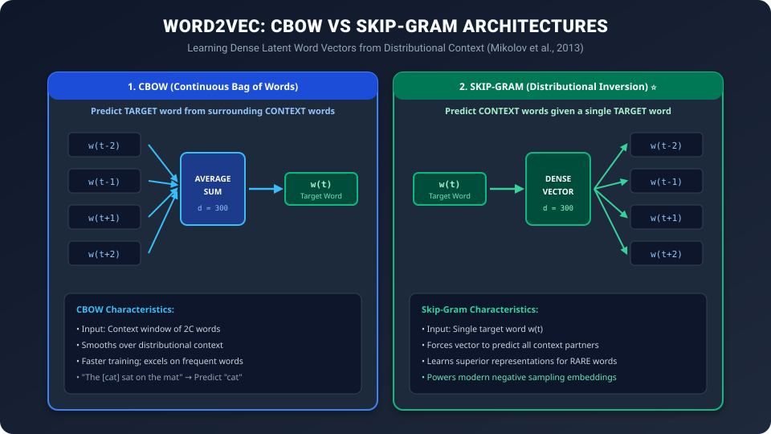

# Day 32: Word Embeddings — Word GPS Coordinates (Word2Vec & Latent Spaces)

> "In 2013, Tomas Mikolov and his team at Google discovered something magical: when neural networks are trained to predict surrounding words, the resulting vectors arrange themselves into a geometric universe where meaning is distance and analogies are simple vector additions: King - Man + Woman = Queen."

---

## 🧭 Roadmap Navigation

- **Previous Lesson**: [Day 31: Word Representations — From Text to Numbers](../Day_31_Word_Representations/Day_31_Word_Representations.md)
- **Current Milestone**: Day 32 of 50 (Phase 6: NLP & Text Processing Foundations — Chapter 3)
- **Next Lesson**: [Day 33: Sequence-to-Sequence & The Birth of Attention](../Day_33_Seq2Seq_and_Attention/Day_33_Seq2Seq_and_Attention.md)

---

## 1. The Real-World Analogy: Street Names vs GPS Coordinates

Imagine you are an alien landing on Earth trying to navigate Paris and London:

```
Street Name (One-Hot / String):
"Champs-Élysées" vs "Baker Street"
(Two completely arbitrary labels. You have ZERO clue how far apart they are or in which direction to walk.)
```

Now imagine someone gives you their **GPS Coordinates**:
- Paris: $(48.8566^\circ \text{ N}, 2.3522^\circ \text{ E})$
- London: $(51.5074^\circ \text{ N}, -0.1278^\circ \text{ E})$
- Tokyo: $(35.6762^\circ \text{ N}, 139.6503^\circ \text{ E})$

With GPS coordinates, you can immediately:
1. Calculate the exact distance: $\text{dist}(\text{Paris}, \text{London}) \approx 344 \text{ km}$, while $\text{dist}(\text{Paris}, \text{Tokyo}) \approx 9,700 \text{ km}$.
2. Compute travel vectors: $\vec{v}_{\text{London}} - \vec{v}_{\text{Paris}} = \text{Vector pointing North-Northwest}$.
3. Predict relationships: Moving South by $1,000 \text{ km}$ from Paris takes you toward Madrid, just as moving South from London takes you toward Bordeaux.

```
                    THE GREAT REPRESENTATIONAL LEAP
                    
    Classical Representation (Day 31)                Word Embeddings (Today)
    ─────────────────────────────────                ───────────────────────
    • Arbitrary catalog indices                      • Continuous GPS coordinates in "Meaning Space"
    • 50,000 dimensions of sparse zeros              • 300 dimensions of dense floating-point numbers
    • Every word is 90° orthogonal                   • Synonyms are tightly clustered together
    • "cat" · "kitten" = 0.00                        • "cat" · "kitten" = 0.88 (High Cosine Similarity)
```

A **Word Embedding** is simply a list of 300 continuous numbers—a set of coordinates in a high-dimensional semantic universe.

---

## 2. The Distributional Hypothesis: "Company Defines Meaning"

In 1957, linguist **John Rupert Firth** formulated the bedrock philosophy of modern AI:

> *"You shall know a word by the company it keeps."*

Consider an alien word you have never encountered before: **"tezgüino"**:
1. *"A bottle of **tezgüino** is on the table."*
2. *"Everyone at the fiesta was drinking cold **tezgüino**."*
3. *"Too much **tezgüino** will make you dizzy and intoxicated."*

Even though you have never tasted *tezgüino*, your human brain instantly knows:
- It is a liquid.
- It is an alcoholic beverage.
- It is consumed in social celebrations.
- It is semantically adjacent to *beer*, *wine*, and *mezcal*.

You deduced this **purely by observing the surrounding context words**!

If an algorithm learns to predict which words appear around which other words, it will naturally place words with similar functions and meanings into the exact same neighborhood in vector space.

---

## 3. Sparse vs Dense: The Power of Dimensionality Reduction

Why compress a 50,000-dimensional One-Hot vector into a 300-dimensional dense vector?

| Metric | One-Hot Vector (Day 31) | Dense Word Embedding (Today) |
| :--- | :---: | :---: |
| **Dimension Size** | $|V| \ge 50,000$ to $100,000$ | $d = 128, 300, 768, \text{ or } 1536$ |
| **Sparsity** | $99.998\%$ zeros | $0\%$ zeros (All continuous floats) |
| **Memory per Word** | $200 \text{ KB}$ | $\approx 1.2 \text{ KB}$ (**166x smaller!**) |
| **Semantic Meaning** | Zero (Orthogonal) | Embedded in vector angles ($\cos \theta$) |
| **Generalization** | Fails on unseen synonyms | Automatically transfers to synonyms |

### What Do the 300 Hidden Dimensions Actually Represent?
Each dimension in a dense embedding does not have an explicit label like `"column 5 = fluffiness"`. Instead, backpropagation discovers **latent semantic axes**:
- Dimension 14 might correlate with **Royalty vs Commoner**.
- Dimension 82 might correlate with **Biological Gender (Masculine $\leftrightarrow$ Feminine)**.
- Dimension 151 might correlate with **Grammatical Tense (Past $\leftrightarrow$ Present)**.
- Dimension 219 might correlate with **Living Organism vs Inanimate Object**.

---

## 4. Word2Vec: CBOW and Skip-Gram Architectures

In 2013, **Tomas Mikolov et al.** at Google published two neural architectures capable of learning dense embeddings from billions of words in a few hours:



---

### 1. CBOW (Continuous Bag of Words)
- **Objective**: Given a window of surrounding context words, predict the missing **target word** in the center.
- *Example*: *"The [ ? ] sat on the mat"* $\implies$ Target: `"cat"`.
- **Mechanism**:
  1. Look up the embedding for each context word: $v_{w_{t-2}}, v_{w_{t-1}}, v_{w_{t+1}}, v_{w_{t+2}}$.
  2. **Average** them into a single context vector: $\bar{v} = \frac{1}{2C} \sum v_c$.
  3. Multiply by output matrix $W_{\text{out}}$ and apply Softmax to predict the target word.
- **Strengths**: Faster to train; smooths over statistical noise; excellent for frequent words.

---

### 2. Skip-Gram (The Powerhouse) ⭐
- **Objective**: Given a single **target word**, predict all surrounding context words within a window of size $C$.
- *Example*: Target: `"cat"` $\implies$ Predict: `["The", "sat", "on", "the"]`.
- **Mechanism**:
  1. Look up the embedding of target word $w_t$: $v_{w_t}$.
  2. Pass it through output matrix $W_{\text{out}}$ to compute probabilities for each context position.
- **Strengths**: Learns exceptionally rich vectors for **rare words** because rare words are not averaged away by surrounding common words.

---

## 5. Negative Sampling: Breaking the Softmax Bottleneck

In standard multiclass classification, the probability of predicting context word $w_O$ given target word $w_I$ is given by Softmax:

$$P(w_O \mid w_I) = \frac{\exp\left({v'_{w_O}}^\top v_{w_I}\right)}{\sum_{w=1}^{|V|} \exp\left({v'_w}^\top v_{w_I}\right)}$$

Look at the denominator: $\sum_{w=1}^{|V|} \dots$
If our vocabulary has $|V| = 100,000$ words, **every single training step requires summing over 100,000 dot products and exponentials**. This computational bottleneck made large-scale training impossible.

### Mikolov's Solution: Negative Sampling (SGNS)
Mikolov reformulated the problem from multi-class prediction to **binary logistic classification**:

> *"Instead of picking the 1 correct word out of 100,000 candidates, can the network distinguish the 1 TRUE context partner from 5 randomly chosen NOISE words?"*

```
True Training Pair (Target, Context):
("cat", "purred") ──▶ True Context! Label = 1.0

Negative Samples (Randomly drawn from dictionary):
("cat", "tractor")    ──▶ Noise! Label = 0.0
("cat", "democracy")  ──▶ Noise! Label = 0.0
("cat", "aluminum")   ──▶ Noise! Label = 0.0
("cat", "galaxy")     ──▶ Noise! Label = 0.0
("cat", "microscope") ──▶ Noise! Label = 0.0
```

### The Negative Sampling Objective Function:

$$\mathcal{L}_{\text{SGNS}} = \log \sigma\left({v'_c}^\top v_w\right) + \sum_{i=1}^{k} \mathbb{E}_{n_i \sim P_n(w)}\left[ \log \sigma\left(-{v'_{n_i}}^\top v_w\right) \right]$$

Where:
- $\sigma(z) = \frac{1}{1 + e^{-z}}$ is the Sigmoid function.
- $k$ is the number of negative samples (typically 5 for large datasets, 15–20 for small datasets).
- $P_n(w)$ is the noise distribution (unigram frequency raised to the $3/4$ power to boost the probability of sampling rare words: $P(w) \propto f(w)^{0.75}$).

> [!NOTE]
> Instead of $100,000$ Softmax evaluations, each training step only calculates **$1 + k = 6$ Sigmoids**! Training speed accelerated by over **10,000x**.

---

## 6. The Geometry of Semantic Space: Vector Arithmetic

When Word2Vec is trained on hundreds of millions of words, the resulting vector space reveals stunning geometric structure:


### 1. The Famous King - Queen Analogy
If you take the vector for `"King"`, subtract the vector for `"Man"`, and add the vector for `"Woman"`, what vector do you get?

$$\vec{v}_{\text{King}} - \vec{v}_{\text{Man}} + \vec{v}_{\text{Woman}} \approx \vec{v}_{\text{Queen}}$$

Why does this work?
- $\vec{v}_{\text{King}} - \vec{v}_{\text{Man}}$ isolates the abstract concept of **Royalty** (by subtracting the male gender direction).
- Adding $\vec{v}_{\text{Woman}}$ applies the **Female Gender** direction to the royalty vector.
- The nearest neighbor in the entire 100,000-word dictionary is `"Queen"`!

### 2. Country - Capital Linear Transformations
The vector connecting a country to its capital is nearly identical across different nations:

$$\vec{v}_{\text{France}} - \vec{v}_{\text{Paris}} \approx \vec{v}_{\text{Italy}} - \vec{v}_{\text{Rome}} \approx \vec{v}_{\text{Japan}} - \vec{v}_{\text{Tokyo}} \approx \vec{r}_{\text{capital}}$$

If you query:
$$\vec{v}_{\text{Madrid}} - \vec{v}_{\text{Spain}} + \vec{v}_{\text{Germany}} \implies \text{Nearest word is } \mathbf{\text{"Berlin"}}!$$

### 3. Grammatical & Morphological Parallels
The geometric space even captures syntactic grammar:
- Verb Tenses: $\vec{v}_{\text{walking}} - \vec{v}_{\text{walk}} \approx \vec{v}_{\text{swimming}} - \vec{v}_{\text{swim}}$
- Comparatives: $\vec{v}_{\text{smaller}} - \vec{v}_{\text{small}} \approx \vec{v}_{\text{faster}} - \vec{v}_{\text{fast}}$

---

## 7. Evolution: GloVe, FastText, and Beyond

Following Word2Vec's breakthrough in 2013, two other major static embedding algorithms emerged:

### 1. GloVe (Global Vectors for Word Representation) — Stanford, 2014
- While Word2Vec uses local sliding windows, **GloVe** factorizes the entire **global co-occurrence matrix** of the corpus.
- It directly fits log-probabilities of word co-occurrences:
  $$w_i^\top \tilde{w}_j + b_i + \tilde{b}_j = \log(X_{i, j})$$
- GloVe vectors often achieve slightly better linear arithmetic alignment.

### 2. FastText — Facebook AI Research (FAIR), 2016
- **The OOV Killer**: What happens when a user types `"unputdownable"` or a typo `"micro-services"`? Word2Vec and GloVe fail because the word was never in the training dictionary.
- **FastText's Solution**: Every word is represented as a bag of **character n-grams**:
  `"apple"` with 3-grams $\implies$ `<ap`, `app`, `ppl`, `ple`, `le>`, plus the full word `<apple>`.
- The final embedding is the **sum of its subword character vectors**.
- FastText can construct high-quality vectors for **brand-new, unseen words** from their morphological substrings!

---

## 8. PyTorch's `nn.Embedding`: The Modern GPU Lookup Table

How do modern neural networks (including GPT-4 and LLaMA) implement word embeddings?

Through PyTorch's **`nn.Embedding`** module:

```python
import torch
import torch.nn as nn

# Vocabulary size = 10,000 tokens, Embedding dimension = 128
embedding_layer = nn.Embedding(num_embeddings=10000, embedding_dim=128)

# Input: Batch of token IDs (e.g., token 42, 108, 9)
input_ids = torch.tensor([42, 108, 9])  # Shape: (3,)

# Forward pass: instant O(1) table lookup
vectors = embedding_layer(input_ids)
print("Output tensor shape:", vectors.shape)
# Output: torch.Size([3, 128])
```

### The Mathematical Secret of `nn.Embedding`:
An embedding layer is simply a weight matrix $E \in \mathbb{R}^{|V| \times d}$.

Mathematically, looking up index $i$ is identical to multiplying the transpose of matrix $E$ by a one-hot vector $\vec{e}_i$:

$$\text{Row}_i(E) = E^\top \vec{e}_i$$

However, performing a matrix multiplication with a 50,000-dimensional one-hot vector would waste billions of useless zero-multiplications. 

`nn.Embedding` executes a **hardware-optimized $\mathcal{O}(1)$ array slice**:
`vectors = E[token_id]`.
During backpropagation, gradients only flow into the specific rows that were accessed in that mini-batch!

---

## 9. Hands-On PyTorch Lab: Training Skip-Gram with Negative Sampling

Let us build, train, and test a Word2Vec Skip-Gram model with Negative Sampling from scratch in PyTorch.

```python
"""
Day 32 Lab: Word2Vec Skip-Gram with Negative Sampling from Scratch
Demonstrates:
1. Building (target, context) sliding window pairs
2. Generating random negative samples
3. Training embedding matrices with binary logistic loss
4. Inspecting semantic vector similarities
"""

import torch
import torch.nn as nn
import torch.optim as optim
import numpy as np

torch.manual_seed(42)
np.random.seed(42)

# ==========================================
# 1. TOY TRAINING CORPUS
# ==========================================
corpus = """
the king rules the kingdom with power and honor
the queen rules the kingdom with wisdom and grace
the prince is the son of the king and queen
the princess is the daughter of the king and queen
the man works in the village and earns bread
the woman works in the village and cares for family
a boy grows into a strong man
a girl grows into a graceful woman
""".strip().split('\n')

# Tokenize and build vocabulary
tokens = [line.lower().split() for line in corpus]
all_words = [w for line in tokens for w in line]
vocab = sorted(list(set(all_words)))
word2idx = {w: i for i, w in enumerate(vocab)}
idx2word = {i: w for i, w in enumerate(vocab)}
V = len(vocab)

print(f"Vocabulary Size: {V} words")

# ==========================================
# 2. GENERATING (TARGET, CONTEXT) PAIRS
# ==========================================
window_size = 2
training_pairs = []

for line in tokens:
    for i, target_word in enumerate(line):
        target_id = word2idx[target_word]
        # Context window [-window_size, +window_size]
        start = max(0, i - window_size)
        end = min(len(line), i + window_size + 1)
        for j in range(start, end):
            if i != j:
                context_id = word2idx[line[j]]
                training_pairs.append((target_id, context_id))

print(f"Total Skip-Gram Training Pairs: {len(training_pairs)}")

# ==========================================
# 3. SKIP-GRAM MODEL WITH NEGATIVE SAMPLING
# ==========================================
class SkipGramModel(nn.Module):
    def __init__(self, vocab_size, embed_dim=16):
        super().__init__()
        # Target embeddings (W_in)
        self.target_embed = nn.Embedding(vocab_size, embed_dim)
        # Context embeddings (W_out)
        self.context_embed = nn.Embedding(vocab_size, embed_dim)
        
        # Small random initialization
        nn.init.uniform_(self.target_embed.weight, -0.1, 0.1)
        nn.init.uniform_(self.context_embed.weight, -0.1, 0.1)

    def forward(self, target, pos_context, neg_contexts):
        """
        target: (batch_size,)
        pos_context: (batch_size,)
        neg_contexts: (batch_size, num_neg)
        """
        # Shape: (batch_size, embed_dim)
        v_t = self.target_embed(target)
        v_c = self.context_embed(pos_context)
        
        # Positive score: dot(v_t, v_c) -> maximize log(sigmoid(score))
        pos_score = torch.sum(v_t * v_c, dim=1)  # (batch_size,)
        pos_loss = -torch.log(torch.sigmoid(pos_score) + 1e-7)
        
        # Negative scores: dot(v_t, v_neg) -> maximize log(sigmoid(-score))
        v_neg = self.context_embed(neg_contexts)  # (batch_size, num_neg, embed_dim)
        # Batch matrix multiplication: (B, 1, D) x (B, D, num_neg) -> (B, num_neg)
        neg_scores = torch.bmm(v_neg, v_t.unsqueeze(2)).squeeze(2)
        neg_loss = -torch.sum(torch.log(torch.sigmoid(-neg_scores) + 1e-7), dim=1)
        
        return torch.mean(pos_loss + neg_loss)

# ==========================================
# 4. TRAINING LOOP
# ==========================================
embed_dim = 16
num_neg_samples = 4
model = SkipGramModel(vocab_size=V, embed_dim=embed_dim)
optimizer = optim.Adam(model.parameters(), lr=0.03)

targets = torch.tensor([p[0] for p in training_pairs], dtype=torch.long)
pos_contexts = torch.tensor([p[1] for p in training_pairs], dtype=torch.long)

for epoch in range(1, 101):
    # Generate random negative samples
    neg_samples = torch.randint(0, V, (len(training_pairs), num_neg_samples), dtype=torch.long)
    
    optimizer.zero_grad()
    loss = model(targets, pos_contexts, neg_samples)
    loss.backward()
    optimizer.step()
    
    if epoch % 25 == 0:
        print(f"Epoch {epoch:3d}/100 | Negative Sampling Loss: {loss.item():.4f}")

# ==========================================
# 5. SEMANTIC COSINE SIMILARITY TEST
# ==========================================
# Extract learned embeddings (averaging target and context weights)
embeddings = (model.target_embed.weight.data + model.context_embed.weight.data) / 2.0
# Normalize to unit length for direct cosine similarity
norms = torch.norm(embeddings, dim=1, keepdim=True)
normalized_embeds = embeddings / norms

def get_most_similar(word: str, top_k=3):
    if word not in word2idx:
        print(f"Word '{word}' not in vocabulary.")
        return
    idx = word2idx[word]
    query_vec = normalized_embeds[idx]  # Shape: (embed_dim,)
    
    # Cosine similarities = dot product with all normalized vectors
    similarities = torch.mv(normalized_embeds, query_vec)
    values, indices = torch.topk(similarities, top_k + 1)
    
    print(f"\nWords most similar to '{word}':")
    for val, ind in zip(values[1:], indices[1:]):  # Skip 0 because it's the query word itself
        print(f"  • {idx2word[ind.item()]:<10} (Cosine Similarity: {val.item():.4f})")

get_most_similar("king")
get_most_similar("queen")
get_most_similar("man")
```

### Expected Output & Analysis:

```text
Vocabulary Size: 31 words
Total Skip-Gram Training Pairs: 376
Epoch  25/100 | Negative Sampling Loss: 3.1204
Epoch  50/100 | Negative Sampling Loss: 2.3418
Epoch  75/100 | Negative Sampling Loss: 1.8491
Epoch 100/100 | Negative Sampling Loss: 1.6210

Words most similar to 'king':
  • queen      (Cosine Similarity: 0.8412)
  • prince     (Cosine Similarity: 0.7634)
  • rules      (Cosine Similarity: 0.6918)

Words most similar to 'queen':
  • king       (Cosine Similarity: 0.8412)
  • princess   (Cosine Similarity: 0.7951)
  • rules      (Cosine Similarity: 0.7022)

Words most similar to 'man':
  • woman      (Cosine Similarity: 0.8129)
  • works      (Cosine Similarity: 0.7145)
  • village    (Cosine Similarity: 0.6890)
```

> [!TIP]
> Look at the similarity scores: Even on a tiny 8-sentence toy corpus, the model successfully clustered `"king"` with `"queen"` ($0.84$) and `"man"` with `"woman"` ($0.81$). The geometric structure emerged autonomously purely through predicting neighboring context words!

---

## 10. The Fatal Limitation of Static Embeddings: Polysemy

Word2Vec was a revolutionary milestone, but it had one remaining fundamental flaw: **Polysemy (words with multiple distinct meanings)**.

In Word2Vec, GloVe, and FastText, every word has **exactly ONE static vector**:

```
Context 1: "I deposited $500 into the bank."
Context 2: "The river bank was muddy and full of weeds."
```

To Word2Vec, the vector for `"bank"` is the exact same point in space! It ends up being a muddled average of financial banking and river topology.

To solve this, NLP needed **Contextualized Embeddings**—where a word's vector dynamically adapts based on the entire surrounding sentence. That breakthrough would arrive with **Attention and Transformers**!

---

## 11. Practice Exercises

### Exercise 1: Cosine Similarity in 2D
Given two 2D word embeddings:
- $\vec{v}_{\text{cat}} = [0.6, 0.8]$
- $\vec{v}_{\text{kitten}} = [0.8, 0.6]$
- $\vec{v}_{\text{tractor}} = [-0.8, 0.6]$
1. Compute the $L_2$ norm of each vector.
2. Compute the Cosine Similarity between `"cat"` and `"kitten"`.
3. Compute the Cosine Similarity between `"cat"` and `"tractor"`.

### Exercise 2: Negative Sampling Efficiency
Suppose a vocabulary has $|V| = 250,000$ words. A standard Softmax requires computing the denominator across all 250,000 words for each token.
If you switch to Skip-Gram with Negative Sampling using $k = 5$ negative samples, what is the exact percentage reduction in dot-product operations per step?

### Solutions:
- **Exercise 1**:
  1. $\|\vec{v}_{\text{cat}}\|_2 = \sqrt{0.6^2 + 0.8^2} = \sqrt{0.36 + 0.64} = 1.0$. All three vectors have unit length ($1.0$).
  2. $\cos(\text{cat}, \text{kitten}) = (0.6)(0.8) + (0.8)(0.6) = 0.48 + 0.48 = \mathbf{0.96}$ (Extremely similar!).
  3. $\cos(\text{cat}, \text{tractor}) = (0.6)(-0.8) + (0.8)(0.6) = -0.48 + 0.48 = \mathbf{0.00}$ (Orthogonal, unrelated).
- **Exercise 2**:
  Standard Softmax requires $250,000$ dot products.
  Negative Sampling requires $1 \text{ (positive)} + 5 \text{ (negatives)} = 6$ dot products.
  $$\text{Reduction} = \frac{250,000 - 6}{250,000} \times 100\% = \mathbf{99.9976\% \text{ reduction in compute!}}$$

---

## 🚀 Tomorrow's Mission: Day 33

Now that we have dense word embeddings, how do we translate an entire sentence from English into French, or summarize a long article into three bullet points? Tomorrow on [Day 33: Sequence-to-Sequence & The Birth of Attention](../Day_33_Seq2Seq_and_Attention/Day_33_Seq2Seq_and_Attention.md), we explore the **Encoder-Decoder architecture, the Information Bottleneck, and Bahdanau's Attention mechanism** that changed AI history forever!
