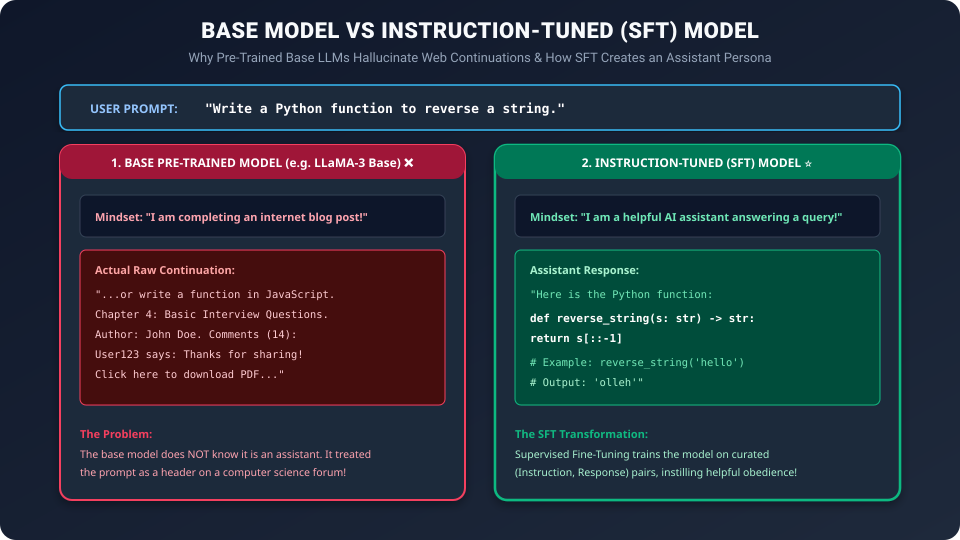

# Day 40: Supervised Fine-Tuning (SFT) — Teaching Models to Be Helpful


| ⬅️ Previous Day | 📚 Course Hub | ➡️ Next Day |
|:---|:---:|---:|
| [← Day 39: How LLMs are Pre-Trained](../Day_39_How_LLMs_are_Pre_Trained/Day_39_How_LLMs_are_Pre_Trained.md) | [All 50 Days Overview](../../README.md) | [Day 41: RLHF & Alignment →](../Day_41_RLHF_and_Alignment/Day_41_RLHF_and_Alignment.md) |

> "Pre-training creates an encyclopedic genius that knows everything about the world but has no manners, no empathy, and no concept of an instruction. Supervised Fine-Tuning (SFT) is the diplomatic finishing school that transforms a wild document predictor into ChatGPT."

---

## 🧭 Roadmap Navigation

- **Previous Lesson**: [Day 39: How LLMs are Pre-Trained — Reading the Entire Internet](../Day_39_How_LLMs_are_Pre_Trained/Day_39_How_LLMs_are_Pre_Trained.md)
- **Current Milestone**: Day 40 of 50 (Phase 8: Large Language Models — Chapter 3)
- **Next Lesson**: [Day 41: RLHF & Alignment — Making Models Safe and Honest](../Day_41_RLHF_and_Alignment/Day_41_RLHF_and_Alignment.md)

---

## 1. The Real-World Analogy: The Wild Hermit at Finishing School

Imagine an isolated scholar who lived in a cave for 40 years reading the entire Library of Alexandria:

```
                  THE TWO PHASES OF AN ARTIFICIAL MIND
                  
  PHASE 1: THE HERMIT (Pre-training)               PHASE 2: DIPLOMATIC SCHOOL (SFT)
 ┌────────────────────────────────────────┐       ┌────────────────────────────────────────┐
 │ Knows every treaty, algorithm, and     │       │ Taught conversational etiquette,       │
 │ historical date. But if you say:       │ ────▶ │ persona, direct instruction following, │
 │ "Help me draft an email to my boss",   │       │ and structured output formats.         │
 │ he responds with a lecture on feudalism│       │ "Here is your email draft:"            │
 └────────────────────────────────────────┘       └────────────────────────────────────────┘
```

A **Base Model** (e.g., LLaMA-3 Base, Mistral Base) is the wild hermit. It has seen 15 Trillion words, but it only knows how to continue internet documents:



- If you prompt a Base Model: *"What is the capital of Australia?"*
- It might predict: *"...What is the capital of New Zealand? What is the capital of Canada? 10 Geography Questions for Kids."*
- It treated your question as **Question 1 of an online quiz**!

**Supervised Fine-Tuning (SFT)** (also known as **Instruction Tuning**) breaks this document-continuation habit. It trains the model on thousands of curated (Instruction, Helpful Response) dialogues, transforming the wild hermit into a courteous, obedient AI assistant.

---

## 2. The Instruction Tuning Revolution

In late 2021, **Jason Wei et al. (Google)** published **FLAN** (*"Finetuned Language Models Are Zero-Shot Learners"*), followed closely by OpenAI's **InstructGPT (Ouyang et al., 2022)**.

Their breakthrough discovery:

> *"You do NOT need trillions of tokens to teach an LLM how to follow instructions. If the base model already has knowledge, it only needs a few thousand high-quality instruction examples to unlock that knowledge in a conversational format!"*

```
Pre-training:       15,000,000,000,000 tokens  (Acquires Knowledge & Reasoning)
Supervised Tuning:          50,000,000 tokens  (Acquires Persona & Format)
```

SFT is less than **$0.01\%$** of the compute of pre-training, but it accounts for **$99\%$ of the user experience**.

---

### The "Less Is More for Alignment" (LIMA) Discovery (Meta, 2023)
In 2023, Meta researchers published **LIMA**:
- Model A: Fine-tuned on **52,000 noisy instruction examples** (Stanford Alpaca).
- Model B: Fine-tuned on only **1,000 meticulously human-written, gold-standard examples**.
- **Result**: Human evaluators preferred Model B (1,000 examples) over Model A!
- **Takeaway**: When fine-tuning, **quality beats quantity by an order of magnitude**.

---

## 3. Chat Templates & Special Control Tokens

How does an LLM know who is speaking in a multi-turn conversation?

In pure text, there is no inherent concept of "User" vs "Assistant". We must introduce **Special Control Tokens** that act as lexical walls:

### The OpenAI ChatML Standard:
```text
<|im_start|>system
You are a helpful coding assistant.<|im_end|>
<|im_start|>user
Write a function in Python to calculate factorial.<|im_end|>
<|im_start|>assistant
def factorial(n: int) -> int:
    return 1 if n <= 1 else n * factorial(n - 1)<|im_end|>
```

Where:
- `<|im_start|>`: Special token marking the start of a conversational turn.
- `system`, `user`, `assistant`: The role tag.
- `<|im_end|>`: Special token signaling that the speaker has finished. When the assistant emits `<|im_end|>`, generation immediately halts!

### Hugging Face `apply_chat_template()`:
In modern Python, you do not hardcode these tags manually. You use the tokenizer's built-in Jinja2 chat template:

```python
messages = [
    {"role": "system", "content": "You are a concise mathematician."},
    {"role": "user", "content": "What is the square root of 144?"}
]

# Formats messages into model-specific special tokens (ChatML, LLaMA, or Mistral):
formatted_prompt = tokenizer.apply_chat_template(messages, tokenize=False, add_generation_prompt=True)
print(formatted_prompt)
# Output:
# <|im_start|>system
# You are a concise mathematician.<|im_end|>
# <|im_start|>user
# What is the square root of 144?<|im_end|>
# <|im_start|>assistant
```

Notice `add_generation_prompt=True`: it automatically appends `<|im_start|>assistant\n` at the end, prompting the LLM to begin generating the assistant's reply!

---

## 4. The Technical Secret of SFT: Prompt Loss Masking

Here is the most critical technical detail in all of instruction fine-tuning:


### The Problem:
If you train on the entire conversation text:
$$\text{Prompt} + \text{Response}$$
The standard Cross-Entropy loss will update weights to predict **both** the user's question AND the assistant's response.
- We do **not** want the model to learn how to generate user questions.
- We only want to maximize the **conditional probability of the assistant's response given the user's prompt**:

$$\mathcal{L}_{\text{SFT}}(\theta) = - \sum_{t \in \text{Assistant Tokens}} \log P_\theta(y_t \mid y_{<t}, X_{\text{prompt}})$$

---

### The Solution: Setting Prompt Labels to `-100`

In PyTorch, `nn.CrossEntropyLoss` has a default argument: `ignore_index = -100`.

Any token whose target label is `-100` produces **zero loss and zero gradient**:

```
Input Tokens:  [ <|im_start|>, system, ..., <|im_start|>, user, What, is, 2+2?, <|im_start|>, assistant, 4, <|im_end|> ]
Target Labels: [     -100,      -100,  ...,     -100,    -100,  -100, -100, -100,     -100,      -100,    220,  151645   ]
                     ▲                                                             ▲                  ▲
                     └──────── PROMPT MASKED OUT! (ZERO LOSS) ─────────────────────┘                  └── ACTIVE LOSS!
```

1. **System & User Tokens**: Target labels are set to `-100`. The model reads them as context during the forward pass, but gradients are **never computed** for these positions.
2. **Assistant Tokens**: Target labels match the actual next token IDs. Gradients flow backwards, directly shaping the model's helpful assistant persona.

---

## 5. SFT Training Hyperparameters: Avoiding Catastrophic Forgetting

Fine-tuning is vastly different from pre-training. If you train too aggressively, the model suffers from **Catastrophic Forgetting**—it becomes an obedient chat assistant but forgets its underlying mathematical reasoning and coding knowledge!

| Hyperparameter | Pre-Training (Day 39) | Supervised Fine-Tuning (SFT) | Why the Difference? |
| :--- | :---: | :---: | :--- |
| **Learning Rate** | $3 \times 10^{-4}$ | **$1 \times 10^{-5}$ to $2 \times 10^{-5}$** | Tiny LR prevents overwriting core pre-trained weights |
| **Epochs** | 1 Epoch | **1 to 3 Epochs Maximum** | More than 3 epochs causes catastrophic overfitting & memorization |
| **LR Schedule** | Cosine with 2,000-step warmup | **Cosine with 10% warmup** | Smooth decay down to zero |
| **Weight Decay** | 0.1 | **0.01 or 0.0** | Minimal weight decay during fine-tuning |
| **Packing** | Packed to max sequence length | **Packed multi-turn dialogues** | Maximizes GPU training efficiency |

---

## 6. Hands-On Python Lab: Building an SFT Dataset with Loss Masking

Let us implement a complete PyTorch Dataset class that formats conversations into ChatML and masks prompt tokens with `-100`.

```python
"""
Day 40 Lab: Supervised Fine-Tuning (SFT) Dataset & Loss Masking from Scratch
Demonstrates:
1. Formatting multi-turn dialogues with ChatML control tokens
2. Applying target label masking (-100) to system and user prompts
3. Verifying that PyTorch CrossEntropyLoss computes loss ONLY on assistant tokens
"""

import torch
import torch.nn as nn
import torch.nn.functional as F

torch.manual_seed(42)

# ==========================================
# 1. TOY VOCABULARY & SPECIAL TOKENS
# ==========================================
# Define special tokens
IM_START = "<|im_start|>"
IM_END = "<|im_end|>"

vocab = {
    "<PAD>": 0, "<UNK>": 1, IM_START: 2, IM_END: 3,
    "system": 4, "user": 5, "assistant": 6,
    "You": 7, "are": 8, "helpful": 9, "AI": 10,
    "What": 11, "is": 12, "2+2?": 13, "4": 14,
    "Reverse": 15, "cat": 16, "tac": 17, ".": 18
}
inv_vocab = {v: k for k, v in vocab.items()}

# ==========================================
# 2. SFT DATASET WITH PROMPT LOSS MASKING
# ==========================================
class SFTConversationDataset:
    def __init__(self, conversations, vocab):
        self.conversations = conversations
        self.vocab = vocab
        
    def format_and_mask(self, dialogue):
        """
        dialogue: list of dicts [{'role': 'system'/'user'/'assistant', 'content': '...'}]
        Returns: (input_ids, labels) where prompt tokens have label = -100
        """
        input_ids = []
        labels = []
        
        for turn in dialogue:
            role = turn['role']
            content = turn['content']
            
            # Construct formatted string: <|im_start|>role\ncontent<|im_end|>\n
            header_tokens = [self.vocab[IM_START], self.vocab[role]]
            content_tokens = [self.vocab.get(w, self.vocab["<UNK>"]) for w in content.split()]
            end_tokens = [self.vocab[IM_END]]
            
            turn_tokens = header_tokens + content_tokens + end_tokens
            input_ids.extend(turn_tokens)
            
            # THE CORE LOGIC: Mask out system and user turns!
            if role in ['system', 'user']:
                # Label is -100 for all prompt tokens
                labels.extend([-100] * len(turn_tokens))
            else:
                # For assistant turns: header (<|im_start|>assistant) is masked, but content + <|im_end|> is trained!
                labels.extend([-100] * len(header_tokens))
                labels.extend(content_tokens + end_tokens)
                
        return torch.tensor(input_ids, dtype=torch.long), torch.tensor(labels, dtype=torch.long)

# Sample dialogue
sample_conversation = [
    {"role": "system", "content": "You are helpful AI"},
    {"role": "user", "content": "What is 2+2?"},
    {"role": "assistant", "content": "4 ."}
]

dataset = SFTConversationDataset([sample_conversation], vocab)
input_ids, labels = dataset.format_and_mask(sample_conversation)

print("--- 1. TOKEN IDS VS TARGET LABELS ---")
print(f"{'INDEX':<6} {'TOKEN':<15} {'INPUT ID':<10} {'LABEL (-100 = IGNORED)':<25}")
print("-" * 60)
for idx, (inp, lbl) in enumerate(zip(input_ids, labels)):
    token_str = inv_vocab.get(inp.item(), "<?>")
    lbl_str = str(lbl.item()) if lbl.item() != -100 else "-100 (MASKED)"
    print(f"{idx:<6} {token_str:<15} {inp.item():<10} {lbl_str:<25}")

# ==========================================
# 3. PYTORCH LOSS VERIFICATION
# ==========================================
# Simulate a tiny language model outputting random logits
vocab_size = len(vocab)
seq_len = len(input_ids)
mock_logits = torch.randn(1, seq_len, vocab_size, requires_grad=True)

# Standard CrossEntropyLoss with ignore_index=-100
criterion = nn.CrossEntropyLoss(ignore_index=-100)

# Reshape for loss: (Batch * Seq_Len, Vocab_Size) vs (Batch * Seq_Len)
loss = criterion(mock_logits.view(-1, vocab_size), labels.unsqueeze(0).view(-1))
loss.backward()

print("\n--- 2. VERIFYING LOSS COMPUTATION ---")
print(f"Total Sequence Tokens:   {seq_len}")
print(f"Active Tokens (Not -100): {(labels != -100).sum().item()} (Only assistant content: '4', '.')")
print(f"Computed SFT Loss:       {loss.item():.4f}")

# Check gradients on mock_logits:
# Gradients should be 0.0 for all masked positions!
prompt_grad_norm = mock_logits.grad[0, :8, :].norm().item()
assistant_grad_norm = mock_logits.grad[0, 8:, :].norm().item()

print(f"Gradient Norm on Masked Prompt Tokens:    {prompt_grad_norm:.6f} (Exactly ZERO!)")
print(f"Gradient Norm on Active Assistant Tokens: {assistant_grad_norm:.6f} (Active Updates!)")
```

### Expected Output:

```text
--- 1. TOKEN IDS VS TARGET LABELS ---
INDEX  TOKEN           INPUT ID   LABEL (-100 = IGNORED)   
------------------------------------------------------------
0      <|im_start|>    2          -100 (MASKED)            
1      system          4          -100 (MASKED)            
2      You             7          -100 (MASKED)            
3      are             8          -100 (MASKED)            
4      helpful         9          -100 (MASKED)            
5      AI              10         -100 (MASKED)            
6      <|im_end|>      3          -100 (MASKED)            
7      <|im_start|>    2          -100 (MASKED)            
8      user            5          -100 (MASKED)            
9      What            11         -100 (MASKED)            
10     is              12         -100 (MASKED)            
11     2+2?            13         -100 (MASKED)            
12     <|im_end|>      3          -100 (MASKED)            
13     <|im_start|>    2          -100 (MASKED)            
14     assistant       6          -100 (MASKED)            
15     4               14         14                       
16     .               18         18                       
17     <|im_end|>      3          3                        

--- 2. VERIFYING LOSS COMPUTATION ---
Total Sequence Tokens:   18
Active Tokens (Not -100): 3 (Only assistant content: '4', '.')
Computed SFT Loss:       2.6418
Gradient Norm on Masked Prompt Tokens:    0.000000 (Exactly ZERO!)
Gradient Norm on Active Assistant Tokens: 1.148201 (Active Updates!)
```

> [!TIP]
> Look at the gradient norms: Gradients on the system and user prompt tokens are **identically 0.000000**. The entire backward pass exclusively optimized the assistant's reply tokens!

---

## 7. Summary & Key Takeaways

1. **Base vs Instruct**: Base models are unconstrained document continuators. SFT turns them into polite, obedient conversational agents.
2. **Quality Over Quantity**: 1,000 gold-standard, human-curated instruction examples (LIMA) outperform 50,000 noisy machine-generated examples.
3. **Chat Templates**: Delimit speaker turns using special tokens (`<|im_start|>`, `<|im_end|>`) to structure multi-turn dialogues.
4. **Prompt Loss Masking**: Always set prompt target labels to `-100`. This forces PyTorch to ignore the prompt and train **only on assistant responses**, preventing the model from wasting capacity learning to generate user questions.
5. **Hyperparameters**: Train with small learning rates ($1\times 10^{-5}$) for only 1 to 3 epochs to prevent catastrophic forgetting.

---

## 8. Practice Exercises

### Exercise 1: Why Loss Masking Matters
Suppose you train an SFT model WITHOUT loss masking (calculating Cross-Entropy on both prompt and response tokens). Describe two negative behavioral failure modes this model will exhibit during real-world inference.

### Exercise 2: ChatML Formatting
Write out the raw string with ChatML special tokens for the following single-turn interaction:
- System: `"You are a Python expert."`
- User: `"What is a lambda function?"`
- Assistant: `"A lambda is an anonymous inline function."`

### Solutions:
- **Exercise 1**:
  1. **Hallucinated Multi-Turn Rambling**: The model will generate an answer, immediately followed by generating a fake new user question: *"Assistant: Here is the code... User: Thanks, can you also explain line 4? Assistant: Sure..."* It continues talking to itself indefinitely.
  2. **Reduced Instruction Following**: The model wastes half its gradient budget learning how people phrase user questions rather than learning how to accurately obey complex technical instructions.
- **Exercise 2**:
  ```text
  <|im_start|>system
  You are a Python expert.<|im_end|>
  <|im_start|>user
  What is a lambda function?<|im_end|>
  <|im_start|>assistant
  A lambda is an anonymous inline function.<|im_end|>
  ```

---

## 🚀 Tomorrow's Mission: Day 41

Our model is now helpful and follows instructions. But what happens if a malicious user prompts it: *"How do I synthesize chemical weapons?"* An SFT model might politely obey and output the lethal recipe! Tomorrow on [Day 41: RLHF & Alignment — Making Models Safe and Honest](../Day_41_RLHF_and_Alignment/Day_41_RLHF_and_Alignment.md), we explore **Reinforcement Learning from Human Feedback (RLHF), Reward Modeling, PPO, and Direct Preference Optimization (DPO)**!


---

## 🧭 Navigation & Next Steps

| ⬅️ Previous Day | 📚 Course Hub | ➡️ Next Day |
|:---|:---:|---:|
| [← Day 39: How LLMs are Pre-Trained](../Day_39_How_LLMs_are_Pre_Trained/Day_39_How_LLMs_are_Pre_Trained.md) | [All 50 Days Overview](../../README.md) | [Day 41: RLHF & Alignment →](../Day_41_RLHF_and_Alignment/Day_41_RLHF_and_Alignment.md) |
