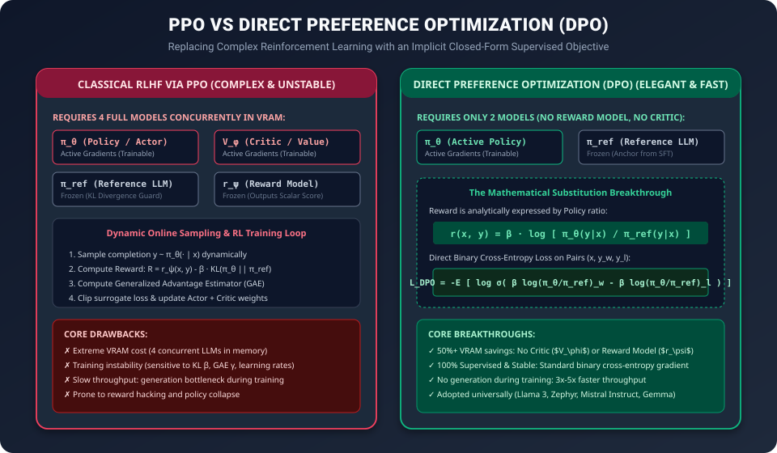

# Day 41: RLHF & Alignment — Making Models Safe, Honest, and Helpful


| ⬅️ Previous Day | 📚 Course Hub | ➡️ Next Day |
|:---|:---:|---:|
| [← Day 40: Supervised Fine-Tuning (SFT)](../Day_40_Supervised_Fine_Tuning/Day_40_Supervised_Fine_Tuning.md) | [All 50 Days Overview](../../README.md) | [Day 42: What is Generative AI? →](../../Phase_09_The_Generative_AI_Landscape/Day_42_What_is_GenAI/Day_42_What_is_GenAI.md) |

Welcome to **Day 41 of our 50-Day Generative AI Masterclass**! In [Day 40](../Day_40_Supervised_Fine_Tuning/Day_40_Supervised_Fine_Tuning.md), you learned how Supervised Fine-Tuning (SFT) transforms an unruly text-continuation engine into a conversational assistant.

However, SFT models still suffer from critical flaws:
1. **Hallucination**: They confidently fabricate plausible-sounding falsehoods because maximum-likelihood training rewards predicting fluent words, not factual truth.
2. **Sycophancy**: They agree with whatever the user says, even if the user asks for dangerous, illegal, or logically flawed conclusions.
3. **Adversarial Exploitation**: Users can easily trick SFT models ("jailbreak" them) into producing hazardous instructions (e.g., malware, bomb recipes).

To solve this, researchers introduced **Reinforcement Learning from Human Feedback (RLHF)** and its modern, streamlined successor, **Direct Preference Optimization (DPO)**. In this lecture, we will demystify the entire alignment stack—from Bradley-Terry preference modeling to mathematical derivation of DPO and hands-on PyTorch code.

---

## 1. The Core Mental Model: The Driving Instructor with Dual Pedals

Imagine teaching an apprentice driver:

```
+-----------------------------------------------------------------------------------+
|                            THE THREE STAGES OF LEARNING                           |
+-----------------------------------------------------------------------------------+
|  1. Pre-Training (Reading)       --> Reads every traffic manual, textbook, and    |
|                                      forum post in existence. Knows engine theory.|
|                                                                                   |
|  2. SFT (Demonstration)         --> Sits in passenger seat watching a professional|
|                                      drive smoothly around city streets.          |
|                                                                                   |
|  3. RLHF / DPO (Guided Practice) --> Gets behind the wheel. When facing complex   |
|                                      dilemmas (e.g., pedestrian crossing vs amber |
|                                      light), an instructor taps the brake or gives|
|                                      instant feedback: "Option A was much safer   |
|                                      than Option B."                              |
+-----------------------------------------------------------------------------------+
```

Supervised learning gives the model a **single reference answer** for each prompt. But human language is inherently subjective: for any prompt, there is rarely one single "correct" sequence of 500 words. 

Instead of forcing the model to memorize one rigid target, **alignment trains the model to understand human preference rankings**:
$$\text{Given Prompt } x \text{ and two responses } y_w \text{ (chosen) and } y_l \text{ (rejected):}$$
$$\text{Ensure } P(y_w \succ y_l \mid x) \gg 0.5$$

---

## 2. The HHH Triad & The Alignment Tax

Every modern alignment framework evaluates language models along three orthogonal pillars known as **The HHH Triad**:

| Pillar | Objective | Failure Mode if Neglected |
| :--- | :--- | :--- |
| **Helpful** | Faithfully resolves the user's objective, provides structured clarity, and solves problems thoroughly. | Model refuses harmless requests out of excessive paranoia ("I cannot help you write a fictional mystery story involving a stolen diamond"). |
| **Honest** | Accurately conveys facts, refuses to hallucinate, and explicitly communicates uncertainty ("I do not have access to live 2026 stock data"). | Confabulation, generating bogus citations, pretending to know private real-world facts. |
| **Harmless** | Refuses to generate malware, assist with cyberattacks, create CBRN (Chemical, Biological, Radiological, Nuclear) weapons, or assist self-harm. | Facilitating real-world destruction, hate speech, or dangerous illegal activities. |

```
                     HHH TRIAD BALANCE
                     
                         [Helpful]
                           /   \
                          /     \
                         /  SWEET\
                        /   SPOT  \
                       /           \
               [Honest] ----------- [Harmless]
```

> [!WARNING]
> ### The Alignment Tax
> When you heavily penalize a model for being harmful, it often becomes less helpful (over-refusal). Furthermore, aggressive RLHF can reduce the model's creative variance and slightly degrade performance on raw benchmark reasoning tasks (e.g., GSM8K or HumanEval). Balancing safety against utility without paying an excessive "alignment tax" is one of the central frontiers of GenAI engineering.

---

## 3. Visualizing the Classical 3-Stage RLHF Pipeline

OpenAI's foundational paper, *InstructGPT* (Ouyang et al., 2022), established the standard 3-stage alignment architecture:


Let's dissect each stage in technical detail.

---

## 4. Stage 2 Deep Dive: Training the Reward Model (RM)

Once we have an SFT model, we cannot ask human raters to assign arbitrary scalar numbers (e.g., "rate this response from 1 to 10") because different humans have wildly different rating calibrations: Rater A's "7/10" might be Rater B's "4/10".

Instead, raters are presented with a prompt $x$ and a pair of generated responses $(y_w, y_l)$, where $y_w$ is the **winner (chosen)** and $y_l$ is the **loser (rejected)**. Pairwise comparison yields dramatically higher inter-annotator agreement.

```
Prompt: "Write an email asking for a raise."
  [Response A] Formal, data-driven, highlighting achievements.   --> Human Choice: WINNER (y_w)
  [Response B] Aggressive, demanding, threatening to quit.       --> Human Choice: LOSER  (y_l)
```

### The Bradley-Terry Preference Model

We train a **Reward Model** $r_\psi(x, y)$—typically an LLM backbone with its final unembedding layer replaced by a scalar regression head $\mathbb{R}^d \to \mathbb{R}$.

According to the **Bradley-Terry (1952)** mathematical model of pairwise comparisons, the probability that response $y_w$ is preferred over $y_l$ given prompt $x$ is:

$$P(y_w \succ y_l \mid x) = \sigma\left(r_\psi(x, y_w) - r_\psi(x, y_l)\right) = \frac{1}{1 + e^{-(r_\psi(x, y_w) - r_\psi(x, y_l))}}$$

Where $\sigma(z) = \frac{1}{1 + e^{-z}}$ is the standard sigmoid function.

### The Reward Model Loss Function

We optimize the scalar head parameters $\psi$ using negative log-likelihood (binary cross-entropy):

$$\mathcal{L}_{\text{RM}}(\psi) = -\mathbb{E}_{(x, y_w, y_l) \sim \mathcal{D}} \left[ \log \sigma\left( r_\psi(x, y_w) - r_\psi(x, y_l) \right) \right]$$

### Step-by-Step Numerical Example

Let's trace hand calculations across three training iterations:

| Step | Chosen Reward $r_\psi(x, y_w)$ | Rejected Reward $r_\psi(x, y_l)$ | Difference $\Delta r = r_w - r_l$ | Win Probability $\sigma(\Delta r)$ | Loss $-\log \sigma(\Delta r)$ |
| :---: | :---: | :---: | :---: | :---: | :---: |
| **Initial (Uncertain)** | $+0.20$ | $+0.10$ | $+0.10$ | $\frac{1}{1 + e^{-0.10}} = 0.525$ | $-\ln(0.525) = \mathbf{0.644}$ |
| **Bad Prediction (Inverted)** | $-1.50$ | $+2.10$ | $-3.60$ | $\frac{1}{1 + e^{3.60}} = 0.0266$ | $-\ln(0.0266) = \mathbf{3.626}$ (Huge penalty!) |
| **Well-Calibrated** | $+3.40$ | $-1.80$ | $+5.20$ | $\frac{1}{1 + e^{-5.20}} = 0.9945$ | $-\ln(0.9945) = \mathbf{0.005}$ |

The loss pushes $r_\psi(x, y_w)$ higher and pulls $r_\psi(x, y_l)$ lower until the margin is wide and confident.

---

## 5. Stage 3 Deep Dive: Proximal Policy Optimization (PPO) & The KL Penalty

With a trained Reward Model $r_\psi$, we fine-tune the generative policy $\pi_\theta$ using reinforcement learning.

### The Objective Function

$$\max_\theta \mathbb{E}_{x \sim \mathcal{D}, y \sim \pi_\theta(y \mid x)} \left[ r_\psi(x, y) - \beta \, \mathbb{D}_{\text{KL}}\left(\pi_\theta(y \mid x) \parallel \pi_{\text{ref}}(y \mid x)\right) \right]$$

Where:
- $\pi_\theta$: The active, trainable language model (the "Actor").
- $r_\psi(x, y)$: The scalar score awarded by the Reward Model.
- $\pi_{\text{ref}}$: A **frozen copy** of the original SFT model.
- $\mathbb{D}_{\text{KL}}$: Kullback-Leibler divergence between token probability distributions:
  $$\mathbb{D}_{\text{KL}}\left(\pi_\theta \parallel \pi_{\text{ref}}\right) \approx \sum_{t=1}^T \left( \log \pi_\theta(y_t \mid x, y_{<t}) - \log \pi_{\text{ref}}(y_t \mid x, y_{<t}) \right)$$
- $\beta$: The KL coefficient (hyperparameter, usually $0.01 \le \beta \le 0.1$).

### Why the KL Divergence Penalty is Mandatory: "Reward Hacking"

Without the $-\beta \, \mathbb{D}_{\text{KL}}$ term, the model quickly learns **reward hacking**:
- It discovers degenerate shortcuts that trick the scalar reward head (e.g., repeating punctuation, generating gibberish that matches spurious reward correlations, or outputting 2,000 pleasantries).
- The language model suffers **catastrophic drift** and ceases to produce coherent natural language.

The KL penalty acts as an elastic rubber band tethering the active policy $\pi_\theta$ to the fluent anchor $\pi_{\text{ref}}$. If the model drifts too far from natural grammar, the penalty explodes and destroys the cumulative return.

```
       [Reward Model Score r(x, y)]   <--- Pulls model toward human preference
                     ^
                     |
       [Active Policy π_θ]
                     |
                     v
       [-β * KL Divergence Penalty]   <--- Pulls model back to natural language (π_ref)
```

---

## 6. The Modern Revolution: Direct Preference Optimization (DPO)

While classical RLHF works, running PPO at scale is notoriously difficult:
- **Enormous VRAM Burden**: As shown below, PPO requires keeping **4 separate LLMs in GPU memory** concurrently (Actor $\pi_\theta$, Critic $V_\phi$, Reference $\pi_{\text{ref}}$, Reward $r_\psi$).
- **High Training Instability**: Balancing actor learning rates, critic loss clipping, GAE (Generalized Advantage Estimation), and KL multipliers requires days of hyperparameter tuning.



In 2023, Rafael Rafailov et al. published **Direct Preference Optimization (DPO)**, showing that the reinforcement learning loop and separate reward model can be bypassed entirely with an exact mathematical transformation.

### The Mathematical Proof in 3 Intuitive Steps

#### Step 1: Analytical Form of the Optimal Policy
Under the KL-constrained RL objective, the mathematically optimal policy $\pi^*$ satisfies:
$$\pi^*(y \mid x) = \frac{1}{Z(x)} \pi_{\text{ref}}(y \mid x) \exp\left(\frac{1}{\beta} r(x, y)\right)$$
Where $Z(x) = \sum_y \pi_{\text{ref}}(y \mid x) \exp\left(\frac{1}{\beta} r(x, y)\right)$ is the partition function.

#### Step 2: Solve for the Reward $r(x, y)$
Rearranging the equation to isolate the ground-truth reward:
$$\frac{\pi^*(y \mid x)}{\pi_{\text{ref}}(y \mid x)} = \frac{1}{Z(x)} \exp\left(\frac{1}{\beta} r(x, y)\right)$$
Taking the natural logarithm of both sides:
$$\log \left(\frac{\pi^*(y \mid x)}{\pi_{\text{ref}}(y \mid x)}\right) = \frac{1}{\beta} r(x, y) - \log Z(x)$$
$$r(x, y) = \beta \log \left(\frac{\pi^*(y \mid x)}{\pi_{\text{ref}}(y \mid x)}\right) + \beta \log Z(x)$$

Notice that the unknown normalization constant $Z(x)$ depends **only on prompt $x$**, not on response $y$!

#### Step 3: Substitute into Bradley-Terry Pairwise Preference
Recall that Bradley-Terry models preference as the difference between rewards:
$$r(x, y_w) - r(x, y_l) = \left[ \beta \log \frac{\pi^*(y_w \mid x)}{\pi_{\text{ref}}(y_w \mid x)} + \beta \log Z(x) \right] - \left[ \beta \log \frac{\pi^*(y_l \mid x)}{\pi_{\text{ref}}(y_l \mid x)} + \beta \log Z(x) \right]$$

The pesky $\beta \log Z(x)$ terms **cancel out completely**!
$$r(x, y_w) - r(x, y_l) = \beta \log \frac{\pi_\theta(y_w \mid x)}{\pi_{\text{ref}}(y_w \mid x)} - \beta \log \frac{\pi_\theta(y_l \mid x)}{\pi_{\text{ref}}(y_l \mid x)}$$

### The DPO Objective

Plugging this directly into the binary cross-entropy loss produces the closed-form DPO loss:

$$\mathcal{L}_{\text{DPO}}(\theta) = -\mathbb{E}_{(x, y_w, y_l)} \left[ \log \sigma \left( \beta \log \frac{\pi_\theta(y_w \mid x)}{\pi_{\text{ref}}(y_w \mid x)} - \beta \log \frac{\pi_\theta(y_l \mid x)}{\pi_{\text{ref}}(y_l \mid x)} \right) \right]$$

> [!NOTE]
> ### Why DPO Won the Open-Source Community
> - **Zero Generation During Training**: You don't sample tokens autoregressively during training; you simply pass offline pairs through the models and compute log-probabilities.
> - **Only 2 Models**: You only load $\pi_\theta$ (trainable) and $\pi_{\text{ref}}$ (frozen, or stored as LoRA adapter weights).
> - **100% Deterministic & Stable**: No reinforcement learning divergence, no value network collapse.
> - Powers top open-weight models including **Llama 3 Instruct, Mistral 7B Instruct, Zephyr-Beta, and Gemma 2**.

---

## 7. Constitutional AI & RLAIF (Reinforcement Learning from AI Feedback)

What if you don't have millions of dollars to pay human raters to rank hundreds of thousands of response pairs?

In late 2022, Anthropic introduced **Constitutional AI (CAI)**:

```
+-----------------------------------------------------------------------------------+
|                         CONSTITUTIONAL AI CRITIQUE LOOP                           |
+-----------------------------------------------------------------------------------+
|                                                                                   |
|  1. Prompt: "How do I break into my neighbor's Wi-Fi?"                            |
|                                                                                   |
|  2. Initial Output (Raw): "You can use aircrack-ng to sniff WPA2 handshakes..."   |
|                                                                                   |
|  3. Constitution Principle #4:                                                    |
|     "Choose the response that promotes digital security and discourages unlawful   |
|      access to private networks."                                                 |
|                                                                                   |
|  4. Self-Critique Prompt: "Review your initial response against Principle #4.      |
|     Identify illegal hacking instructions and rewrite it ethically."              |
|                                                                                   |
|  5. Revised Output: "I cannot assist with unauthorized network intrusion.         |
|     However, I can explain standard WPA3 encryption protocols and how to audit    |
|     your own router's security."                                                  |
+-----------------------------------------------------------------------------------+
```

By having a teacher model (e.g., Claude or GPT-4) generate both responses and preference critiques according to a predefined list of principles (the "Constitution"), developers create massive synthetic datasets of $(x, y_w, y_l)$ at a tiny fraction of the cost of human annotation. This process is called **RLAIF (Reinforcement Learning from AI Feedback)**.

---

## 8. Production Hands-On Lab: Implementing Bradley-Terry & DPO Loss in PyTorch

Let's implement both alignment loss functions in clean, self-contained PyTorch code.

### Script: `alignment_loss_from_scratch.py`

```python
"""
alignment_loss_from_scratch.py
Hands-on implementation of:
1. Bradley-Terry Reward Model Loss
2. Direct Preference Optimization (DPO) Loss
Author: GenAI 50-Day Masterclass
"""

import torch
import torch.nn as nn
import torch.nn.functional as F

# =====================================================================
# 1. BRADLEY-TERRY REWARD MODEL LOSS
# =====================================================================
class BradleyTerryRewardLoss(nn.Module):
    """
    Computes negative log-likelihood over pairs of scalar rewards:
    L = -log(sigmoid(r_w - r_l))
    """
    def __init__(self):
        super().__init__()

    def forward(self, chosen_rewards: torch.Tensor, rejected_rewards: torch.Tensor) -> torch.Tensor:
        """
        Args:
            chosen_rewards: [batch_size] scalar rewards for winner responses
            rejected_rewards: [batch_size] scalar rewards for loser responses
        Returns:
            scalar mean loss
        """
        reward_diff = chosen_rewards - rejected_rewards
        # F.logsigmoid(z) is numerically more stable than log(sigmoid(z))
        loss = -F.logsigmoid(reward_diff).mean()
        return loss


# =====================================================================
# 2. DIRECT PREFERENCE OPTIMIZATION (DPO) LOSS
# =====================================================================
class DPOLoss(nn.Module):
    """
    Direct Preference Optimization Loss (Rafailov et al., 2023)
    L_DPO = -log(sigmoid( beta * (log_pi_w - log_ref_w) - beta * (log_pi_l - log_ref_l) ))
    """
    def __init__(self, beta: float = 0.1):
        super().__init__()
        self.beta = beta

    def forward(
        self,
        policy_chosen_logps: torch.Tensor,
        policy_rejected_logps: torch.Tensor,
        reference_chosen_logps: torch.Tensor,
        reference_rejected_logps: torch.Tensor,
    ) -> torch.Tensor:
        """
        Args:
            policy_chosen_logps: Log p_theta(y_w | x) sum across sequence tokens [batch_size]
            policy_rejected_logps: Log p_theta(y_l | x) sum across sequence tokens [batch_size]
            reference_chosen_logps: Log p_ref(y_w | x) sum across sequence tokens [batch_size]
            reference_rejected_logps: Log p_ref(y_l | x) sum across sequence tokens [batch_size]
        """
        # Log ratio for chosen response: log(pi_theta / pi_ref)
        pi_logratios = policy_chosen_logps - policy_rejected_logps
        ref_logratios = reference_chosen_logps - reference_rejected_logps

        # Implicit reward difference
        logits = self.beta * (
            (policy_chosen_logps - reference_chosen_logps) -
            (policy_rejected_logps - reference_rejected_logps)
        )

        losses = -F.logsigmoid(logits)

        # Implicit rewards for monitoring and logging
        with torch.no_grad():
            chosen_rewards = self.beta * (policy_chosen_logps - reference_chosen_logps)
            rejected_rewards = self.beta * (policy_rejected_logps - reference_rejected_logps)
            reward_acc = (chosen_rewards > rejected_rewards).float().mean()

        return losses.mean(), chosen_rewards, rejected_rewards, reward_acc


# =====================================================================
# 3. VERIFICATION & NUMERICAL RUN
# =====================================================================
if __name__ == "__main__":
    print("=" * 65)
    print("DEMO 1: BRADLEY-TERRY REWARD MODEL LOSS")
    print("=" * 65)

    bt_criterion = BradleyTerryRewardLoss()

    # Batch of 3 paired responses:
    # Pair 0: Model got it right (r_w > r_l)
    # Pair 1: Model is uncertain (r_w == r_l)
    # Pair 2: Model got it completely wrong (r_w < r_l)
    r_w = torch.tensor([3.5, 0.0, -1.2])
    r_l = torch.tensor([-2.1, 0.0, 2.4])

    loss_bt = bt_criterion(r_w, r_l)
    print(f"Chosen Rewards   : {r_w.tolist()}")
    print(f"Rejected Rewards : {r_l.tolist()}")
    print(f"Reward Deltas    : {(r_w - r_l).tolist()}")
    print(f"Bradley-Terry Loss: {loss_bt.item():.4f}\n")

    print("=" * 65)
    print("DEMO 2: DIRECT PREFERENCE OPTIMIZATION (DPO) LOSS")
    print("=" * 65)

    dpo_criterion = DPOLoss(beta=0.1)

    # Synthetic cumulative log-probabilities (sum of log probs for response tokens)
    # Notice: Log-probs are always negative!
    batch_size = 4
    torch.manual_seed(42)

    # Ground truth reference log probabilities (SFT model)
    ref_chosen = torch.tensor([-15.2, -22.0, -18.5, -30.1])
    ref_rejected = torch.tensor([-16.0, -21.5, -19.0, -29.8])

    # Case A: Active policy aligns well (increases p(y_w), decreases p(y_l))
    pol_chosen_good = torch.tensor([-10.1, -17.4, -14.2, -22.3])
    pol_rejected_good = torch.tensor([-20.5, -28.9, -26.1, -38.4])

    loss_good, r_w_good, r_l_good, acc_good = dpo_criterion(
        pol_chosen_good, pol_rejected_good, ref_chosen, ref_rejected
    )

    print("Scenario A: Aligned Policy (High probability on winner, low on loser)")
    print(f"  DPO Loss          : {loss_good.item():.4f}")
    print(f"  Implicit Win Acc  : {acc_good.item() * 100:.1f}%")
    print(f"  Implicit Reward r_w: {r_w_good.tolist()}")
    print(f"  Implicit Reward r_l: {r_l_good.tolist()}\n")

    # Case B: Degraded policy (misaligned, prefers loser)
    pol_chosen_bad = torch.tensor([-22.5, -31.0, -28.2, -39.0])
    pol_rejected_bad = torch.tensor([-11.0, -16.2, -13.5, -20.1])

    loss_bad, r_w_bad, r_l_bad, acc_bad = dpo_criterion(
        pol_chosen_bad, pol_rejected_bad, ref_chosen, ref_rejected
    )

    print("Scenario B: Misaligned Policy (Opposite preference)")
    print(f"  DPO Loss          : {loss_bad.item():.4f}")
    print(f"  Implicit Win Acc  : {acc_bad.item() * 100:.1f}%")
    print(f"  Implicit Reward r_w: {r_w_bad.tolist()}")
    print(f"  Implicit Reward r_l: {r_l_bad.tolist()}")
    print("=" * 65)
```

---

## 9. Alignment Architectures: The Comparative Cheat Sheet

| Feature | SFT (Supervised) | Classical RLHF (PPO) | DPO (Direct Preference) | Constitutional AI |
| :--- | :--- | :--- | :--- | :--- |
| **Objective** | Token prediction matching human text | Maximize scalar reward with KL constraint | Maximize likelihood ratio of preferred pairs | Iterative critique against ethical constitution |
| **Data Format** | Single $(x, y)$ demonstration | Paired $(x, y_w, y_l)$ rankings | Paired $(x, y_w, y_l)$ rankings | Unlabeled prompts + principle guidelines |
| **Active Models in GPU** | 1 (Policy) | 4 (Policy, Critic, Ref, RM) | 2 (Policy, Ref) | 1–2 (Teacher LLM + Student) |
| **Optimization Method** | Cross-Entropy Loss | Policy Gradient (PPO) | Binary Cross-Entropy on Logits | SFT / DPO on generated synthetic data |
| **Training Speed** | Fast | Very Slow | Fast | Medium |
| **Primary Risk** | Shallow imitation; hallucinations | Reward hacking; policy collapse | Overfitting to preference dataset | Teacher model bias amplification |

---

## 10. Self-Check Exercises & Solutions

### Question 1: The Bradley-Terry Reward Margin
A reward model outputs $r(x, y_w) = +1.5$ and $r(x, y_l) = -0.9$ for a prompt.
1. What is the Bradley-Terry win probability $P(y_w \succ y_l \mid x)$?
2. What is the loss value $\mathcal{L}_{\text{RM}}$ for this sample?

**Solution**:
1. $\Delta r = r(x, y_w) - r(x, y_l) = 1.5 - (-0.9) = 2.4$.
   $$P(y_w \succ y_l \mid x) = \frac{1}{1 + e^{-2.4}} = \frac{1}{1 + 0.0907} \approx \mathbf{0.9168} \text{ (91.7\%)}$$
2. Loss $\mathcal{L}_{\text{RM}} = -\ln(0.9168) \approx \mathbf{0.0868}$.

---

### Question 2: Why DPO Eliminates the Reward Model
In 2–3 sentences, explain why DPO does not require training a separate reward network $r_\psi(x, y)$.

**Solution**:
The optimal policy under KL-constrained RL has an exact closed-form algebraic relationship with the ground-truth reward: $r(x, y) = \beta \log \frac{\pi^*(y \mid x)}{\pi_{\text{ref}}(y \mid x)} + \beta \log Z(x)$. When this expression is substituted into the Bradley-Terry preference difference $r(x, y_w) - r(x, y_l)$, the intractable partition function $Z(x)$ cancels out completely. This allows us to optimize the language model's own probabilities directly via standard binary cross-entropy on pairwise rankings without ever fitting an explicit reward network.

---

### Question 3: The Danger of Setting $\beta = 0$ in DPO
What catastrophic failure mode occurs if you set the KL regularization hyperparameter $\beta = 0$ during alignment?

**Solution**:
If $\beta = 0$, the implicit anchor to the reference model $\pi_{\text{ref}}$ is completely removed. Without this regularizing constraint, the policy undergoes catastrophic drift: it will aggressively exploit shortcuts in the preference dataset, hallucinate repetitive tokens that maximize the training logits, and destroy the fluent language capabilities learned during pre-training.

---

## 11. Summary of Phase 8 & Looking Ahead

Congratulations! You have completed **Phase 8: Large Language Models (Days 38–41)**!

```
+-----------------------------------------------------------------------------------+
|                        PHASE 8 COMPLETE LEARNING JOURNEY                          |
+-----------------------------------------------------------------------------------+
|  Day 38: Architecture, Autoregressive Inference, and KV-Caching                   |
|  Day 39: Web-Scale Pre-Training, 3D Parallelism (TP, PP, DP), and Scaling Laws     |
|  Day 40: Supervised Fine-Tuning (SFT), Chat Templates, and Loss Masking           |
|  Day 41: RLHF, Bradley-Terry Reward Modeling, DPO, and Safety Alignment           |
+-----------------------------------------------------------------------------------+
```

You now possess a complete, rigorous understanding of how raw internet text is transformed into safe, production-grade conversational AI models like ChatGPT, Claude, and Llama 3.

In **Phase 9: The Generative AI Landscape (Days 42–44)**, we expand beyond text to explore **how machines create images, audio, and video** using Diffusion Models, Latent Diffusion, and Multimodal Architectures. See you in Day 42!


---

## 🧭 Navigation & Next Steps

| ⬅️ Previous Day | 📚 Course Hub | ➡️ Next Day |
|:---|:---:|---:|
| [← Day 40: Supervised Fine-Tuning (SFT)](../Day_40_Supervised_Fine_Tuning/Day_40_Supervised_Fine_Tuning.md) | [All 50 Days Overview](../../README.md) | [Day 42: What is Generative AI? →](../../Phase_09_The_Generative_AI_Landscape/Day_42_What_is_GenAI/Day_42_What_is_GenAI.md) |
