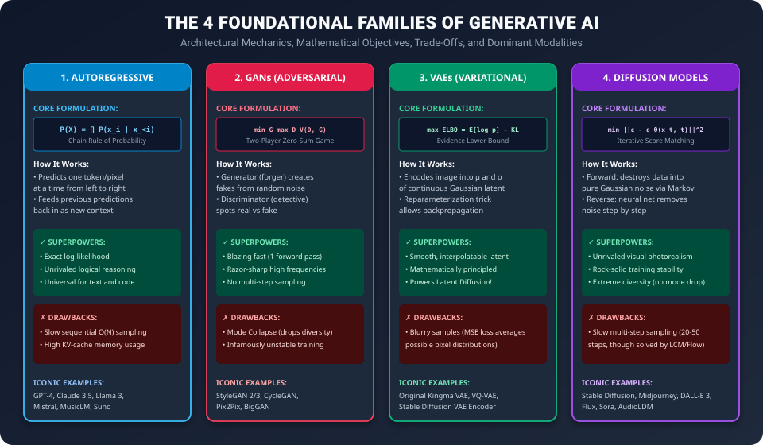

# Day 42: What is Generative AI? — The Paradigm Shift Defined

Welcome to **Day 42 of our 50-Day Generative AI Masterclass**! Over the previous 41 days, you traversed the mathematical, architectural, and algorithmic foundations of artificial intelligence—culminating in the pre-training and alignment of Large Language Models in [Day 41](../../Phase_08_Large_Language_Models/Day_41_RLHF_and_Alignment/Day_41_RLHF_and_Alignment.md).

Today, we launch **Phase 9: The Generative AI Landscape (Days 42–44)**. Here, we step back from purely text-based LLMs to examine the fundamental mathematical paradigm shift that separates **Discriminative AI** from **Generative AI**, and dissect the four foundational model families that power modern creative machines.

---

## 1. The Core Mental Model: The Art Critic vs. The Renaissance Painter

To software engineers entering the field, machine learning often appears to be one homogenous collection of matrix multiplications. However, mathematically, ML is fractured into two diametrically opposed objectives:

```
+-----------------------------------------------------------------------------------+
|                        THE TWO PHILOSOPHIES OF INTELLIGENCE                       |
+-----------------------------------------------------------------------------------+
|                                                                                   |
|  1. DISCRIMINATIVE AI (The Art Critic)                                            |
|     • Task: "Here is an oil painting. Tell me if it was painted by Rembrandt or   |
|       an amateur imposter."                                                       |
|     • Role: A Judge / Classifier.                                                 |
|     • Input: Massive, complex data (e.g., 5,000,000 pixels).                      |
|     • Output: A tiny scalar label (e.g., "Rembrandt: 98.4%, Fake: 1.6%").         |
|     • What it learns: The minimal boundary that splits category A from category B.|
|                                                                                   |
|  2. GENERATIVE AI (The Renaissance Painter)                                       |
|     • Task: "Here is an empty canvas. Paint a brand new, historically authentic   |
|       Rembrandt-style portrait that has never existed in human history."          |
|     • Role: A Creator / Synthesizer.                                              |
|     • Input: A simple seed or prompt (e.g., random noise vector or 5 words).      |
|     • Output: Massive, high-dimensional data (e.g., 5,000,000 coordinated pixels).|
|     • What it learns: The full underlying probability distribution of all valid   |
|       paintings in the universe.                                                  |
+-----------------------------------------------------------------------------------+
```

---

## 2. The Mathematical Foundation: $P(Y \mid X)$ vs. $P(X)$

Let $X$ represent our high-dimensional data (such as a $512 \times 512 \times 3$ image with 786,432 numbers) and $Y$ represent a category label (such as `"dog"` or `"cat"`).


### The Discriminative Objective: $P(Y \mid X)$
A discriminative model asks: **"Given this specific high-dimensional input $X$, what is the conditional probability distribution over the labels $Y$?"**

$$P(Y \mid X) = \text{Softmax}\left(f_\theta(X)\right)$$

- **Information Bottleneck**: The network compresses millions of input values down to a single categorical prediction.
- **Ignorance of Data Mechanics**: The model does not need to know what constitutes a realistic eye, fur texture, or lighting angle. It only needs to identify the single most distinctive shortcut feature (e.g., "pointy ears vs. floppy ears") to draw a separating hyperplane.

### The Generative Objective: $P(X)$ or $P(X \mid Y)$
A generative model asks: **"What is the true probability distribution over the entire space of valid data points $X$?"**

$$P(X) \quad \text{or} \quad P(X \mid Y) = \frac{P(Y \mid X) \, P(X)}{P(Y)}$$

- **The Manifold Hypothesis**: In a random $512 \times 512$ color image, there are $256^{786,432}$ possible configurations of pixels. An overwhelming 99.9999999% of these configurations look like television static (pure Gaussian noise). Realistic images of human faces or cats exist on a tiny, curled, low-dimensional "manifold" embedded inside this astronomical space.
- **Sampling**: If a neural network can successfully learn the probability landscape $P(X)$, we can generate infinite novel samples by simply drawing random numbers from high-density regions:
  $$x^* \sim P_\theta(X)$$

---

## 3. The Generative Learning Trilemma

When designing generative models, researchers face a fundamental engineering trade-off known as the **Generative Trilemma**:

```
                       [SAMPLE QUALITY / FIDELITY]
                             (High Resolution,
                              Sharp Details)
                                  /\
                                 /  \
                                /    \
                               /  ★   \
                              /        \
                             /          \
   [SAMPLING SPEED] <--------------------> [MODE DIVERSITY]
   (Single Forward Pass,                   (Covers All Variations,
    Real-Time Latency)                      No Mode Collapse)
```

No single generative architecture historically maximized all three vertices simultaneously:

| Desired Property | Requirement | Historical Obstacle |
| :--- | :--- | :--- |
| **High Sample Quality** | Images must be photorealistic, crisp, and free from artifacts or blurriness. | VAEs often produced blurry outputs due to pixel averaging. |
| **Fast Sampling Speed** | Generation must occur in a single low-latency forward pass ($\le 50$ ms). | Autoregressive models and Diffusion require dozens or thousands of sequential steps. |
| **Mode Diversity** | Must capture every valid variant (e.g., generating dogs of all breeds, colors, and poses). | GANs suffered from catastrophic **mode collapse** (generating only one single perfect golden retriever repeatedly). |

---

## 4. The 4 Foundational Families of Generative AI

Modern Generative AI is built upon four distinct architectural paradigms, each attacking the estimation of $P(X)$ with different mathematical tools.



Let's dissect each family's core mechanics and mathematical formulation.

---

### Family 1: Autoregressive Models (ARM)

Autoregressive models factorize the astronomical joint probability distribution $P(X)$ into a tractable product of conditional one-dimensional distributions using the classical **chain rule of probability**:

$$P(X) = P(x_1, x_2, \dots, x_T) = \prod_{t=1}^T P(x_t \mid x_1, x_2, \dots, x_{t-1})$$

```
Step 1: P("The" | <BOS>)                 --> Outputs "The"
Step 2: P("future" | "The")              --> Outputs "future"
Step 3: P("of" | "The", "future")        --> Outputs "of"
Step 4: P("AI" | "The", "future", "of")  --> Outputs "AI"
```

- **Objective**: Exact log-likelihood maximization:
  $$\mathcal{L}_{\text{AR}}(\theta) = -\sum_{t=1}^T \log P_\theta(x_t \mid x_{<t})$$
- **Dominant Modalities**: Natural language processing, code generation, music composition, symbolic reasoning.
- **Architectures**: GPT-4, Claude 3.5 Sonnet, LLaMA 3, Mistral, Suno, Bark.

---

### Family 2: Generative Adversarial Networks (GANs)

Introduced by Ian Goodfellow et al. in 2014, GANs frame generative modeling as a **two-player zero-sum game** between two competing neural networks:

```
Random Noise Vector z ~ N(0, I)
        |
        v
+---------------+
|  GENERATOR G  | ---> Synthetic Image G(z)
+---------------+            |
                             v
Real Images x ---------> +-------------------+
                         |  DISCRIMINATOR D  | ---> Scalar Output D(x) ∈ [0, 1]
                         +-------------------+      (0 = Fake, 1 = Real)
```

The networks are trained concurrently with opposing minimax objectives:

$$\min_G \max_D V(D, G) = \mathbb{E}_{x \sim p_{\text{data}}(x)} \left[ \log D(x) \right] + \mathbb{E}_{z \sim p_z(z)} \left[ \log \left(1 - D(G(z))\right) \right]$$

- **The Discriminator $D$**: Tries to maximize the probability of correctly labeling real training images as $1$ and fake generated images as $0$.
- **The Generator $G$**: Tries to minimize $\log(1 - D(G(z)))$, effectively trying to trick the discriminator into classifying fakes as real ($D(G(z)) \to 1$).

#### Step-by-Step Numerical Example: Minimax Dynamics

| Iteration | Discriminator on Real $D(x)$ | Discriminator on Fake $D(G(z))$ | Real Loss $-\log D(x)$ | Fake Loss $-\log(1 - D(G(z)))$ | Generator Target $D(G(z)) \to 1$ |
| :---: | :---: | :---: | :---: | :---: | :---: |
| **Epoch 1 (Unskilled)** | $0.55$ | $0.45$ | $-\ln(0.55) = 0.597$ | $-\ln(0.55) = 0.597$ | $G$ generates random static |
| **Epoch 20 (D Dominates)** | $0.98$ | $0.03$ | $-\ln(0.98) = 0.020$ | $-\ln(0.97) = 0.030$ | $G$ gets vanishing gradients! |
| **Epoch 100 (Equilibrium)** | $0.50$ | $0.50$ | $-\ln(0.50) = 0.693$ | $-\ln(0.50) = 0.693$ | **Nash Equilibrium**: $G(z)$ indistinguishable from real data |

> [!CAUTION]
> ### Mode Collapse in GANs
> If the generator discovers that generating one particular face of a blonde woman consistently tricks the discriminator with 99% success, it may stop learning how to generate men, children, or different poses entirely. It "collapses" all random noise vectors $z$ onto that single winning output. This fundamental instability led the research world to pivot toward Diffusion models for image generation.

---

### Family 3: Variational Autoencoders (VAEs)

Introduced by Diederik Kingma and Max Welling in 2013, VAEs approach generation through **probabilistic graphical modeling**.

A standard autoencoder compresses an image into a single discrete latent point $z \in \mathbb{R}^d$. This leaves huge gaps in the latent space where random decoding produces nonsense. A VAE fixes this by forcing the encoder to output a **continuous probability distribution**:

```
Input Image x 
      |
      v
+-------------+
|   ENCODER   | ---> Mean Vector μ  and  Log-Variance Vector log(σ^2)
+-------------+
      |
      v
Sampling with Reparameterization Trick: z = μ + σ ⊙ ε,  where ε ~ N(0, I)
      |
      v
+-------------+
|   DECODER   | ---> Reconstructed Image x̂
+-------------+
```

#### The Evidence Lower Bound (ELBO)
Because computing the true data evidence $P(X) = \int P(X \mid z) P(z) dz$ is mathematically intractable, VAEs maximize the **Evidence Lower Bound (ELBO)**:

$$\log P(X) \ge \mathcal{L}_{\text{ELBO}} = \underbrace{\mathbb{E}_{q_\phi(z \mid x)} \left[ \log p_\theta(x \mid z) \right]}_{\text{Reconstruction Fidelity (MSE or Cross-Entropy)}} - \underbrace{\mathbb{D}_{\text{KL}}\left( q_\phi(z \mid x) \parallel p(z) \right)}_{\text{Regularization (Forces Latent to Standard Normal } \mathcal{N}(0, I)\text{)}}$$

- **The Reparameterization Trick**: You cannot backpropagate gradients through a stochastic sampling operation $z \sim \mathcal{N}(\mu, \sigma^2)$. By expressing $z = \mu + \sigma \odot \epsilon$ where $\epsilon \sim \mathcal{N}(0, I)$ is an external random noise parameter, gradients flow smoothly back into $\mu$ and $\sigma$ via standard backpropagation!
- **Modern Superpower**: While standalone VAEs produce slightly blurry images, their encoders and decoders serve as the **indispensable compression engine** for modern Latent Diffusion Models (like Stable Diffusion).

---

### Family 4: Diffusion Models (DDPM & Score-Based)

Originating from non-equilibrium thermodynamics (Sohl-Dickstein et al., 2015) and popularized by Denoising Diffusion Probabilistic Models (DDPM, Ho et al., 2020), diffusion models represent the gold standard of image and video generation:

```
FORWARD PROCESS q (Destruction): Slowly inject Gaussian noise across T steps (e.g., T=1000)
Clean Image x_0  --->  x_1  --->  x_250  --->  x_500  --->  x_1000 (Pure Gaussian Noise)

REVERSE PROCESS p_θ (Creation): Neural network predicts and subtracts noise step-by-step
Pure Noise x_1000 --->  x_750  --->  x_500  --->  x_250  --->  x_0 (Photorealistic Artwork!)
```

We will dedicate the entirety of [Day 43](../Day_43_Text_to_Image_Diffusion/Day_43_Text_to_Image_Diffusion.md) to the rigorous mathematical mechanics of Diffusion and Classifier-Free Guidance.

---

## 5. Architectural Comparison Matrix

| Dimension | Autoregressive (ARM) | GANs | VAEs | Diffusion (DDPM) |
| :--- | :--- | :--- | :--- | :--- |
| **Probability Estimation** | Exact Tractable Likelihood | Implicit (No likelihood) | Approximate (ELBO lower bound) | Tractable Variational Bound |
| **Sampling Mechanism** | Iterative token-by-token $O(T)$ | Single forward pass $O(1)$ | Single forward pass $O(1)$ | Iterative denoising $O(T)$ |
| **Training Stability** | Extremely Stable | Highly Unstable (Minimax) | Very Stable | Rock-Solid Stable |
| **Sample Quality** | Unbeatable for Text/Code | Extremely Sharp for Images | Blurry / Smooth | State-of-the-Art Photorealism |
| **Mode Diversity** | Full distribution coverage | Vulnerable to Mode Collapse | Full distribution coverage | Full distribution coverage |
| **Dominant Use Cases** | LLMs, Audio, Reasoning | Fast face generation, Real-time upscaling | Latent compression for Diffusion | Midjourney, Stable Diffusion, Sora |

---

## 6. Hands-On Lab: Comparing Discriminative Boundaries vs. Generative Densities in PyTorch

To solidify this intuition, let's build a self-contained PyTorch experiment. We will generate a synthetic 2D dataset with two distinct clusters (e.g., representing cats and dogs in a 2-feature space).
1. We will train a **Discriminative Classifier** that only learns a decision boundary line.
2. We will fit a **Generative Density Model (Gaussian Mixture)** that models the full landscape $P(X)$ and generates brand-new synthetic data points.

### Python Script: `discriminative_vs_generative_lab.py`

```python
"""
discriminative_vs_generative_lab.py
Demonstrating the mathematical difference between:
1. Discriminative Modeling: P(Y | X)
2. Generative Modeling: P(X) and Sampling Novel Points x* ~ P(X)
Author: GenAI 50-Day Masterclass
"""

import torch
import torch.nn as nn
import torch.optim as optim
import math

# 1. SYNTHETIC MULTI-MODAL DATA GENERATION
torch.manual_seed(42)

# Cluster 0 ("Cats"): Centered at (-2.0, -2.0)
num_samples = 500
cluster_0 = torch.randn(num_samples, 2) * 0.7 + torch.tensor([-2.0, -2.0])
labels_0 = torch.zeros(num_samples, 1)

# Cluster 1 ("Dogs"): Centered at (+2.0, +2.0)
cluster_1 = torch.randn(num_samples, 2) * 0.7 + torch.tensor([2.0, 2.0])
labels_1 = torch.ones(num_samples, 1)

X = torch.cat([cluster_0, cluster_1], dim=0)
Y = torch.cat([labels_0, labels_1], dim=0)

print(f"Dataset Shape: X = {X.shape}, Y = {Y.shape}")
print(f"Mean Cluster 0: {cluster_0.mean(dim=0).tolist()}")
print(f"Mean Cluster 1: {cluster_1.mean(dim=0).tolist()}\n")


# =====================================================================
# 2. DISCRIMINATIVE MODEL: P(Y | X)
# =====================================================================
class DiscriminativeClassifier(nn.Module):
    """Learns separating decision hyperplane: P(Y=1 | X) = Sigmoid(W * X + b)"""
    def __init__(self):
        super().__init__()
        self.linear = nn.Linear(2, 1)

    def forward(self, x):
        return torch.sigmoid(self.linear(x))

disc_model = DiscriminativeClassifier()
bce_loss = nn.BCELoss()
optimizer = optim.Adam(disc_model.parameters(), lr=0.05)

# Train the classifier
for epoch in range(100):
    optimizer.zero_grad()
    predictions = disc_model(X)
    loss = bce_loss(predictions, Y)
    loss.backward()
    optimizer.step()

print("=" * 60)
print("1. DISCRIMINATIVE MODEL EVALUATION (THE JUDGE)")
print("=" * 60)
# Test on arbitrary coordinates
test_points = torch.tensor([
    [-2.5, -2.5],  # Deep in Cat territory
    [2.5, 2.5],    # Deep in Dog territory
    [0.0, 0.0]     # On the razor edge boundary
])

with torch.no_grad():
    probs = disc_model(test_points)
    for pt, p in zip(test_points, probs):
        label = "Dog" if p.item() > 0.5 else "Cat"
        print(f"Point {pt.tolist()} -> P(Dog | X) = {p.item():.4f} (Classified: {label})")

print("\nNotice: The discriminative model has NO IDEA how to generate a cat or dog!")
print("It can only evaluate points you hand to it.\n")


# =====================================================================
# 3. GENERATIVE MODEL: P(X) VIA GAUSSIAN MIXTURE DENSITY
# =====================================================================
class GenerativeGaussianModel:
    """
    Learns full data distribution P(X) = sum_k pi_k * N(X | mu_k, Sigma_k)
    Enables direct sampling of novel synthetic data points x* ~ P(X)
    """
    def __init__(self):
        self.mu_0 = None
        self.mu_1 = None
        self.cov_0 = None
        self.cov_1 = None

    def fit(self, x_cat, x_dog):
        # Maximum Likelihood Estimation of distribution parameters
        self.mu_0 = x_cat.mean(dim=0)
        self.mu_1 = x_dog.mean(dim=0)
        
        # Empirical covariance
        self.std_0 = x_cat.std(dim=0)
        self.std_1 = x_dog.std(dim=0)

    def sample(self, num_samples: int, class_choice: int) -> torch.Tensor:
        """Generates brand-new, never-before-seen synthetic data points!"""
        if class_choice == 0:
            noise = torch.randn(num_samples, 2)
            synthetic_samples = self.mu_0 + noise * self.std_0
        else:
            noise = torch.randn(num_samples, 2)
            synthetic_samples = self.mu_1 + noise * self.std_1
        return synthetic_samples

gen_model = GenerativeGaussianModel()
gen_model.fit(cluster_0, cluster_1)

print("=" * 60)
print("2. GENERATIVE MODEL IN ACTION (THE CREATOR)")
print("=" * 60)
print(f"Estimated Cat Latent Center  μ_0: {gen_model.mu_0.tolist()}")
print(f"Estimated Dog Latent Center  μ_1: {gen_model.mu_1.tolist()}\n")

# Generate 3 novel synthetic cats and 3 novel synthetic dogs
novel_cats = gen_model.sample(num_samples=3, class_choice=0)
novel_dogs = gen_model.sample(num_samples=3, class_choice=1)

print("Synthesized Brand New 'Cat' Data Points:")
for i, cat in enumerate(novel_cats):
    print(f"  Synthetic Cat #{i+1}: {cat.tolist()}")

print("\nSynthesized Brand New 'Dog' Data Points:")
for i, dog in enumerate(novel_dogs):
    print(f"  Synthetic Dog #{i+1}: {dog.tolist()}")

print("\nVerification: Feeding our generated cats into our Discriminative Model:")
with torch.no_grad():
    cat_eval = disc_model(novel_cats)
    for cat, score in zip(novel_cats, cat_eval):
        print(f"  Point {cat.tolist()} -> Judged as Cat with confidence {(1 - score.item()) * 100:.1f}%")
print("=" * 60)
```

---

## 7. Self-Check Exercises & Solutions

### Question 1: Discriminative vs. Generative Dimension Mismatch
Suppose you are working with $1024 \times 1024$ RGB medical scans to detect pneumonia (Binary: 0 or 1).
1. What is the input and output dimensionality of a discriminative model for this task?
2. What is the input and output dimensionality of a generative model designed to synthesize realistic chest X-rays of patients with pneumonia?

**Solution**:
1. **Discriminative**:
   - Input: $1024 \times 1024 \times 3 = 3,145,728$ real values.
   - Output: 1 scalar probability $\in [0, 1]$ (or 2 logits).
2. **Generative (Conditional Text/Class to Image)**:
   - Input: A low-dimensional conditioning vector (e.g., class index `pneumonia=1` and a random noise seed $z \in \mathbb{R}^{512}$).
   - Output: $3,145,728$ coordinated, photorealistic pixel values that adhere to true clinical anatomy.

---

### Question 2: The Reparameterization Trick
In a Variational Autoencoder, why can you not simply sample $z \sim \mathcal{N}(\mu, \sigma^2)$ directly during forward propagation? How does $z = \mu + \sigma \odot \epsilon$ fix this?

**Solution**:
Stochastic sampling is a non-differentiable operation: the derivative of a random number generation with respect to network parameters $\mu$ and $\sigma$ is undefined ($\frac{\partial z}{\partial \mu}$ cannot backpropagate through random sampling).

The reparameterization trick isolates the stochasticity by drawing $\epsilon \sim \mathcal{N}(0, I)$ independently of the network parameters. Because $z = \mu + \sigma \odot \epsilon$ is a purely deterministic linear combination of $\mu$ and $\sigma$, standard calculus applies:
$$\frac{\partial z}{\partial \mu} = 1, \quad \frac{\partial z}{\partial \sigma} = \epsilon$$
This allows the backpropagation algorithm to optimize encoder weights without obstruction.

---

### Question 3: The Generative Trilemma in Production
A self-driving car company needs a generative simulator that produces real-time photorealistic video of emergency road situations at 60 frames per second (16 milliseconds per frame) with maximum visual diversity.
Which of the classic generative families would struggle the most with the 16ms latency constraint, and why?

**Solution**:
Standard **Diffusion Models (DDPM)** and **Autoregressive pixel models** would struggle the most. Standard diffusion requires iteratively running a multi-billion-parameter neural network across 20 to 50 sequential denoising steps per frame ($20 \times 20\text{ms} = 400\text{ms}$ per frame), which violates the 16ms real-time budget. (Note: While modern 1-step distilled models like SD-Turbo or LCM are closing this gap, classical diffusion is fundamentally an iterative multi-step process).

---

## 8. Summary & Next Steps

Today, you established the grand conceptual framework of Generative AI:
- **Discriminative models** draw decision boundaries $P(Y \mid X)$ to classify inputs.
- **Generative models** learn the dense underlying data manifold $P(X)$ to synthesize novel points $x^*$.
- **The Generative Trilemma** balances Sample Quality, Sampling Speed, and Mode Diversity.
- **The 4 Core Families**: Autoregressive (text/audio), GANs (fast image synthesis), VAEs (latent compression), and Diffusion (state-of-the-art photorealism).

Tomorrow in **Day 43: Text-to-Image — How Machines Create Art**, we delve deep into the mathematics and architecture of **Diffusion Models (DDPM, Latent Diffusion, and Classifier-Free Guidance)** to understand how Stable Diffusion and Midjourney turn simple text prompts into breathtaking visual art.
