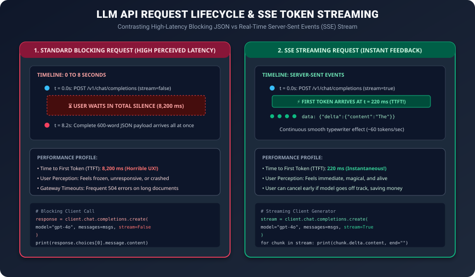

# Day 46: Working with LLM APIs — OpenAI, Anthropic & Local Models

Welcome to **Day 46 of our 50-Day Generative AI Masterclass**! In [Day 45](../Day_45_Prompt_Engineering/Day_45_Prompt_Engineering.md), you mastered prompt engineering, few-shot conditioning, and self-healing JSON pipelines.

Today, we take those prompts and integrate them into production software systems. We demystify the **API infrastructure layer** of modern AI engineering:
1. **The Mental Model**: Understanding LLMs as **stateless HTTP microservices**.
2. **Key Hyperparameters**: Demystifying `temperature`, `top_p`, `frequency_penalty`, and `seed`.
3. **Server-Sent Events (SSE) Streaming**: Achieving sub-300ms Time-to-First-Token (TTFT).
4. **The Major Provider Ecosystem**: OpenAI, Anthropic, and Local On-Premise models (via Ollama / vLLM).
5. **Enterprise Reliability**: Rate-limiting defense via **Exponential Backoff with Jitter** and a **Multi-Provider Failover Gateway**.

---

## 1. The Core Mental Model: The Stateless Cloud Microservice

A frequent point of confusion for software engineers is: *"Where does ChatGPT store my conversation memory?"*

The answer is: **It doesn't!**

```
+-----------------------------------------------------------------------------------+
|                        THE STATELESS HTTP CALL ARCHITECTURE                       |
+-----------------------------------------------------------------------------------+
|                                                                                   |
|  Turn 1:                                                                          |
|  Client  ---> POST /v1/chat/completions                                           |
|               {"messages": [{"role": "user", "content": "My name is Alice"}]}    |
|  Server  <--- "Hello Alice! How can I help you today?"                            |
|                                                                                   |
|  Turn 2: (If Client only sends "What is my name?", the model has NO CLUE!)        |
|  Client  ---> POST /v1/chat/completions                                           |
|               {"messages": [                                                      |
|                 {"role": "user", "content": "My name is Alice"},                  |
|                 {"role": "assistant", "content": "Hello Alice!"},                 |
|                 {"role": "user", "content": "What is my name?"}                   |
|               ]}                                                                  |
|  Server  <--- "Your name is Alice!"                                               |
|                                                                                   |
+-----------------------------------------------------------------------------------+
```

LLM inference engines have **zero persistent session memory** between HTTP requests. Every conversational turn requires the client to bundle the **entire conversation history** into the `messages` array and send it over the wire.

---

## 2. Demystifying Sampling Hyperparameters

When you call an LLM API, you control the autoregressive token sampler via several hyperparameters:

| Parameter | Type | Default | Mathematical Mechanism | When to Modify |
| :--- | :--- | :--- | :--- | :--- |
| **`temperature`** | Float ($0.0 \to 2.0$) | $0.7$ | Divides logits before softmax: $P(x_i) = \frac{e^{z_i / T}}{\sum e^{z_j / T}}$. As $T \to 0$, collapses into greedy argmax. | Set $T = 0.0$ for deterministic JSON extraction and math. Set $T = 0.8$ for creative writing. |
| **`top_p`** (Nucleus) | Float ($0.0 \to 1.0$) | $1.0$ | Cumulative probability cutoff: sorts tokens by probability and samples only from the smallest set whose sum exceeds $p$. | Alternative to temperature. Set `top_p = 0.9` to eliminate the long tail of bizarre tokens while preserving fluency. |
| **`frequency_penalty`**| Float ($-2.0 \to 2.0$)| $0.0$ | Subtracts a penalty proportional to how many times a token has *already appeared* in the response. | Increase ($0.2 \to 0.5$) if the model gets stuck in repetitive loops or repeats words. |
| **`presence_penalty`** | Float ($-2.0 \to 2.0$)| $0.0$ | One-time flat penalty if a token has appeared at least once. | Increase ($0.2 \to 0.5$) to encourage the model to introduce brand-new topics. |
| **`seed`** | Integer | `None` | Fixes the random number generator seed on the server backend. | Set `seed = 42` for reproducible debugging and automated regression testing. |

> [!NOTE]
> ### Best Practice Rule
> Research from OpenAI recommends altering **either `temperature` OR `top_p`**, but **not both** simultaneously, to avoid conflicting probability distortions.

---

## 3. Server-Sent Events (SSE): Streaming Tokens in Real-Time

In a traditional blocking HTTP call, the client sends a prompt and waits while the server generates 800 tokens at 60 tokens per second. The client experiences **13+ seconds of total silence** before any data arrives!



### The HTTP Streaming Protocol: `text/event-stream`
When you set `"stream": true`, the server immediately responds with an HTTP 200 header:
```http
HTTP/1.1 200 OK
Content-Type: text/event-stream
Cache-Control: no-cache
Connection: keep-alive
```

The connection stays open, and the server pushes discrete data packets as each token is generated:
```
data: {"choices": [{"delta": {"content": "The"}}]}

data: {"choices": [{"delta": {"content": " capital"}}]}

data: {"choices": [{"delta": {"content": " of"}}]}

data: {"choices": [{"delta": {"content": " France"}}]}

data: [DONE]
```

### Why Streaming is Mandatory in Production
- **Time-to-First-Token (TTFT)** drops from 10,000ms down to **200–300ms**! The user sees immediate visual activity.
- **Early Cancellation**: If the model starts hallucinating or heading down the wrong path, the user can hit "Stop Generating", severing the TCP stream and saving significant token costs.

---

## 4. The Modern Provider Landscape: OpenAI vs. Anthropic vs. Local

While all major LLM providers offer chat completions, their API schemas possess critical architectural nuances:

```
+-----------------------------------------------------------------------------------+
|                        PROVIDER API SCHEMA COMPARISONS                            |
+-----------------------------------------------------------------------------------+
|  1. OpenAI API (The Industry Standard Format):                                    |
|     • Endpoint: POST /v1/chat/completions                                         |
|     • System Prompt: Included as the first message: {"role": "system", ...}       |
|     • Models: gpt-4o, gpt-4o-mini, o1-preview                                     |
|                                                                                   |
|  2. Anthropic Claude API:                                                         |
|     • Endpoint: POST /v1/messages                                                 |
|     • System Prompt: A DEDICATED top-level parameter: `system="You are an expert"`|
|       (Anthropic explicitly rejects {"role": "system"} inside messages!)          |
|     • Models: claude-3-5-sonnet-20241022, claude-3-haiku                          |
|                                                                                   |
|  3. Local On-Premise Models (Ollama / vLLM / llama.cpp):                          |
|     • Endpoint: POST http://localhost:11434/v1/chat/completions                   |
|     • Standard: 100% compatible with OpenAI's request and response schema!        |
|     • Models: llama3.1:8b, mistral:7b, qwen2.5:14b, deepseek-coder                |
+-----------------------------------------------------------------------------------+
```

---

## 5. Enterprise Reliability: Multi-Provider Failover & Backoff

In production, relying on a single third-party AI vendor is a major architectural liability:
- Providers experience outages (HTTP 500, 502, 503).
- Your application hits unexpected rate limits (**HTTP 429 Too Many Requests**).
- Cloud outages can take down whole regions.


### Algorithm: Exponential Backoff with Full Jitter

When a rate limit or network error strikes, naive retry loops (e.g., retrying every 1 second) create a **thundering herd problem** that hammers the failing server.

The industry-standard solution developed by AWS is **Exponential Backoff with Full Jitter**:

$$T_{\text{sleep}} = \text{Uniform}\left(0, \, \min(T_{\text{max}}, \, T_{\text{base}} \cdot 2^{\text{attempt}})\right)$$

| Attempt $n$ | Base Window $T_{\text{base}} \cdot 2^n$ ($T_{\text{base}} = 1.0\text{s}$) | Sleep Duration Range | Actual Sampled Sleep |
| :---: | :---: | :---: | :---: |
| **Attempt 1** | $1.0 \times 2^1 = 2.0\text{s}$ | $[0.0\text{s}, 2.0\text{s}]$ | **$1.42\text{s}$** |
| **Attempt 2** | $1.0 \times 2^2 = 4.0\text{s}$ | $[0.0\text{s}, 4.0\text{s}]$ | **$3.15\text{s}$** |
| **Attempt 3** | $1.0 \times 2^3 = 8.0\text{s}$ | $[0.0\text{s}, 8.0\text{s}]$ | **$5.88\text{s}$** |
| **Attempt 4** | $1.0 \times 2^4 = 16.0\text{s}$ | $[0.0\text{s}, 16.0\text{s}]$ | **$11.20\text{s}$** |

The randomized uniform jitter distributes client retries smoothly across time, allowing the provider's rate-limiting token bucket to replenish without being overwhelmed.

---

## 6. Production Hands-On Lab: Multi-Provider Gateway with Streaming & Failover

Let's build a self-contained, production-grade Python gateway. It provides:
1. Unified message translation for OpenAI, Anthropic, and Local Ollama.
2. Simulated real-time token streaming via Python generators.
3. Exponential backoff with jitter retry wrapper.
4. Automatic failover: if Provider 1 hits an HTTP 429 or 503, the gateway seamlessly fails over to Provider 2 without crashing!

### Python Script: `multi_provider_resilience_gateway.py`

```python
"""
multi_provider_resilience_gateway.py
Production-grade multi-provider gateway featuring:
1. Unified API Request Normalization
2. Real-Time Generator-Based Streaming
3. Exponential Backoff with Jitter
4. Automatic Provider Outage Failover (OpenAI -> Anthropic -> Local Ollama)
Author: GenAI 50-Day Masterclass
"""

import time
import random
import json
from typing import Generator, List, Dict, Any, Optional

# =====================================================================
# 1. EXPONENTIAL BACKOFF WITH JITTER UTILITY
# =====================================================================
def calculate_backoff_sleep(attempt: int, base_delay: float = 1.0, max_delay: float = 16.0) -> float:
    """
    Computes randomized exponential backoff with full jitter:
    Sleep = Uniform(0, min(max_delay, base_delay * 2^attempt))
    """
    ceiling = min(max_delay, base_delay * (2 ** attempt))
    sleep_time = random.uniform(0.5, ceiling)
    return sleep_time


# =====================================================================
# 2. MOCK PROVIDER CLIENT SIMULATORS
# =====================================================================
class MockAPIError(Exception):
    def __init__(self, status_code: int, message: str):
        self.status_code = status_code
        self.message = message
        super().__init__(f"HTTP {status_code}: {message}")


class MockOpenAIProvider:
    name = "OpenAI (gpt-4o)"
    
    def __init__(self, simulate_outage: bool = True):
        self.simulate_outage = simulate_outage
        self.call_count = 0

    def stream_completion(self, system_prompt: str, user_prompt: str) -> Generator[str, None, None]:
        self.call_count += 1
        # Simulate an unexpected HTTP 429 Rate Limit error on the primary provider!
        if self.simulate_outage:
            raise MockAPIError(429, "Rate limit exceeded (TPM quota reached).")
        
        tokens = ["OpenAI: ", "Authentication ", "tokens ", "are ", "valid."]
        for tok in tokens:
            time.sleep(0.05)
            yield tok


class MockAnthropicProvider:
    name = "Anthropic (claude-3-5-sonnet)"

    def __init__(self, simulate_outage: bool = False):
        self.simulate_outage = simulate_outage

    def stream_completion(self, system_prompt: str, user_prompt: str) -> Generator[str, None, None]:
        if self.simulate_outage:
            raise MockAPIError(503, "Anthropic API overloaded. Service unavailable.")
        
        tokens = ["Claude: ", "Here ", "is ", "the ", "resilient ", "system ", "response."]
        for tok in tokens:
            time.sleep(0.05)
            yield tok


class MockLocalOllamaProvider:
    name = "Local Ollama (llama-3.1-8b)"

    def stream_completion(self, system_prompt: str, user_prompt: str) -> Generator[str, None, None]:
        tokens = ["Local-Llama: ", "Operating ", "100% ", "air-gapped ", "offline."]
        for tok in tokens:
            time.sleep(0.05)
            yield tok


# =====================================================================
# 3. UNIFIED RESILIENT GATEWAY
# =====================================================================
class ResilientLLMGateway:
    """
    Orchestrates execution across a priority list of providers.
    Applies backoff retries on transient errors and cascades to fallback providers.
    """
    def __init__(self, providers: List[Any], max_retries_per_provider: int = 2):
        self.providers = providers
        self.max_retries = max_retries_per_provider

    def complete_stream(self, system_prompt: str, user_prompt: str) -> Generator[str, None, None]:
        last_error = None

        for provider in self.providers:
            print(f"\n[Gateway] Routing request to: {provider.name}")

            for attempt in range(self.max_retries):
                try:
                    # Attempt to stream from the provider
                    stream = provider.stream_completion(system_prompt, user_prompt)
                    for chunk in stream:
                        yield chunk
                    # If stream finishes successfully, exit cleanly!
                    return

                except MockAPIError as err:
                    last_error = err
                    print(f"  ✗ [{provider.name}] Encountered {err.message}")
                    
                    if attempt < self.max_retries - 1:
                        sleep_duration = calculate_backoff_sleep(attempt)
                        print(f"    -> Retrying {provider.name} in {sleep_duration:.2f}s (Backoff with Jitter)...")
                        time.sleep(sleep_duration)
                    else:
                        print(f"    -> Exhausted {self.max_retries} retries for {provider.name}. Triggering failover!")

                except Exception as ex:
                    print(f"  ✗ Unexpected failure on {provider.name}: {str(ex)}")
                    break

        # If all providers fail
        raise RuntimeError(f"All configured LLM providers failed. Last recorded error: {str(last_error)}")


# =====================================================================
# 4. EXECUTION
# =====================================================================
if __name__ == "__main__":
    print("=" * 65)
    print("DEMONSTRATION: RESILIENT MULTI-PROVIDER FAILOVER PIPELINE")
    print("=" * 65)

    # Configure a failover cascade:
    # 1. Primary: OpenAI (simulating rate limit outage)
    # 2. Secondary: Anthropic Claude (healthy)
    # 3. Tertiary: Local Ollama (air-gapped guarantee)
    gateway = ResilientLLMGateway(
        providers=[
            MockOpenAIProvider(simulate_outage=True),
            MockAnthropicProvider(simulate_outage=False),
            MockLocalOllamaProvider()
        ],
        max_retries_per_provider=2
    )

    sys_prompt = "You are a customer support agent."
    usr_prompt = "How do I reset my password?"

    print(f"User Prompt: '{usr_prompt}'\nStreaming response:")
    print("-" * 65)

    try:
        response_stream = gateway.complete_stream(sys_prompt, usr_prompt)
        for token in response_stream:
            print(token, end="", flush=True)
        print("\n" + "-" * 65)
        print("✓ Response streamed successfully to client despite primary outage!")
    except Exception as e:
        print(f"\nFatal Gateway Crash: {e}")

    print("=" * 65)
```

---

## 7. Comparative API Features Matrix

| Feature | OpenAI | Anthropic Claude | Local (Ollama / vLLM) |
| :--- | :--- | :--- | :--- |
| **System Prompt Placement** | In `messages` (`role="system"`) | Dedicated top-level `system="..."` | In `messages` (`role="system"`) |
| **Streaming Support** | Yes (SSE `data: {...}`) | Yes (SSE `event: content_block_delta`) | Yes (OpenAI-compatible SSE) |
| **Structured JSON Schema** | Strict Schema via `response_format` | Pre-fill assistant message with `{` | Supported via Grammar Masking / GBNF |
| **Context Window** | Up to 128k tokens (GPT-4o) | Up to 200k tokens (Claude 3.5) | Hardware-limited (8k–128k) |
| **Pricing Model** | Pay per 1M tokens ($$$) | Pay per 1M tokens ($$$) | **$0.00** (Free on your own hardware) |
| **Privacy / Compliance** | Cloud Data Transmission | Cloud Data Transmission | **100% On-Premise (HIPAA/GDPR safe)** |

---

## 8. Self-Check Exercises & Solutions

### Question 1: The Stateless Conversation Trap
A developer writes the following Python code for a multi-turn chat interface:
```python
# Turn 1
client.chat.completions.create(model="gpt-4o", messages=[{"role": "user", "content": "I live in Seattle."}])

# Turn 2
response = client.chat.completions.create(model="gpt-4o", messages=[{"role": "user", "content": "What is the weather where I live?"}])
```
Why does Turn 2 fail to answer correctly, and what exact data structure must be modified?

**Solution**:
LLM APIs are **entirely stateless**: the server retains no memory of Turn 1 once the HTTP response is sent. In Turn 2, the model receives only `"What is the weather where I live?"` with zero context regarding Seattle.
**Fix**: The client must maintain a local conversation array and append both the user questions and assistant replies:
```python
messages = [
    {"role": "user", "content": "I live in Seattle."},
    {"role": "assistant", "content": "Understood, you live in Seattle."},
    {"role": "user", "content": "What is the weather where I live?"}
]
```

---

### Question 2: Why Exponential Backoff Needs Jitter
Suppose 500 parallel microservice workers all encounter an HTTP 429 rate limit at the exact same second $t=0$. If all 500 workers use standard exponential backoff **without jitter** ($T = 2.0\text{s}$), what happens at $t = 2.0\text{s}$?

**Solution**:
At exactly $t = 2.0\text{s}$, all 500 workers will simultaneously fire their retry HTTP requests at the exact same millisecond. This causes an instantaneous spike in traffic that immediately overwhelms the provider's token bucket algorithm, triggering a fresh wave of 500 HTTP 429 errors. This self-inflicted cycle is called the **thundering herd problem**. Adding random jitter spreads the 500 retries smoothly across a time window (e.g., between $0.2\text{s}$ and $2.0\text{s}$), allowing requests to succeed individually as rate limits clear.

---

### Question 3: Time-to-First-Token (TTFT) in User Experience
Why is a system with a 300ms TTFT that takes 6 seconds to finish generating perceived by human users as significantly faster than a system that delivers the entire answer in a single block after 3.5 seconds?

**Solution**:
Human psychology and cognitive perception are heavily influenced by **immediate feedback**:
- In the 3.5-second blocking system, the user stares at a static loading spinner for over 3 seconds, triggering anxiety that the system has hung or crashed.
- In the 300ms streaming system, text begins appearing almost instantly (like a human typing). The user starts reading the first sentences immediately while the rest of the answer is still being computed. The perceived wait time is effectively reduced to the TTFT (300ms).

---

## 9. Summary & Next Steps

Today, you mastered production LLM API engineering:
- **Statelessness**: Every request must carry full conversational context over HTTP.
- **Hyperparameters**: Calibrating `temperature`, `top_p`, `frequency_penalty`, and `seed`.
- **SSE Streaming**: Slashing Time-to-First-Token to sub-300ms using `text/event-stream`.
- **Ecosystem Integration**: Standardizing schemas across OpenAI, Anthropic, and Local Ollama.
- **Enterprise Resiliency**: Implementing Exponential Backoff with Jitter and a Multi-Provider Failover Gateway.

Tomorrow in **Day 47: RAG Part 1 — Embeddings, Vector Databases & Semantic Search**, we dive into the most sought-after architecture in enterprise AI: connecting LLMs to private corporate knowledge bases using **Vector Embeddings, HNSW graphs, and semantic search**!
