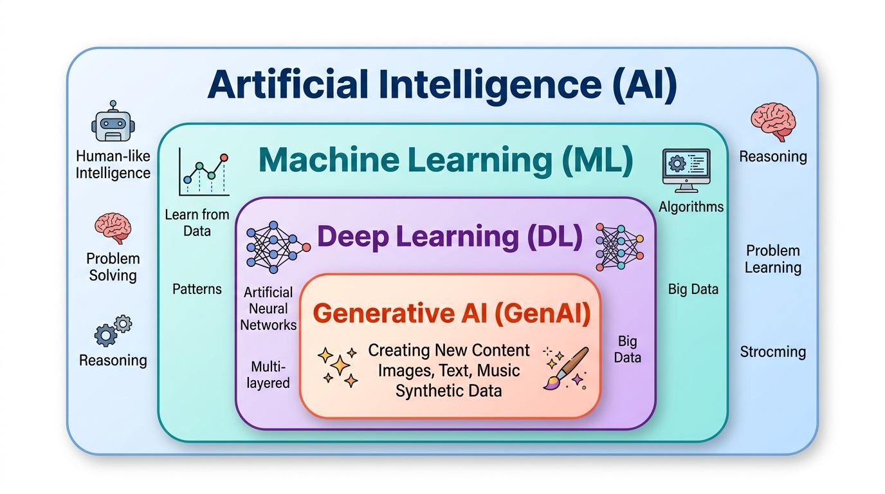
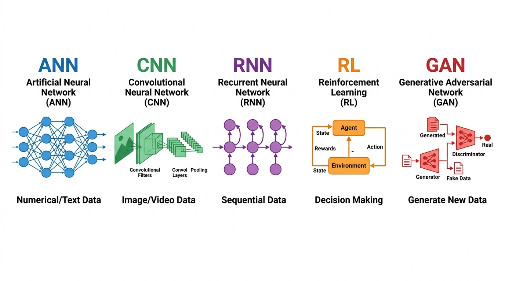
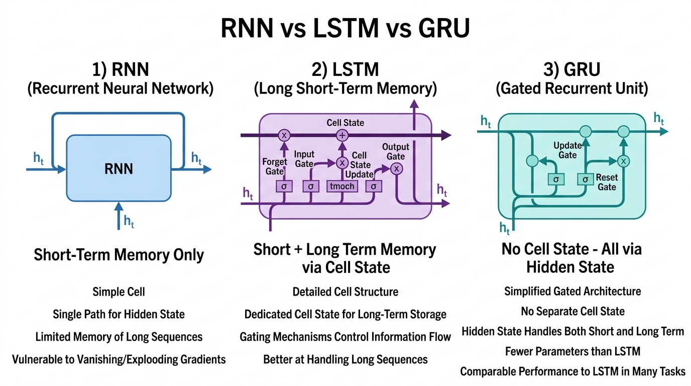
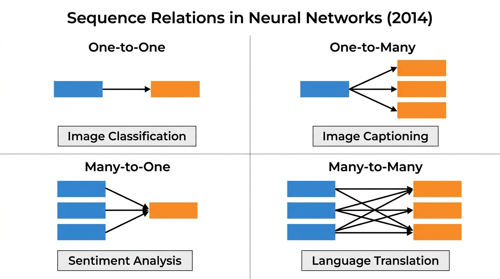
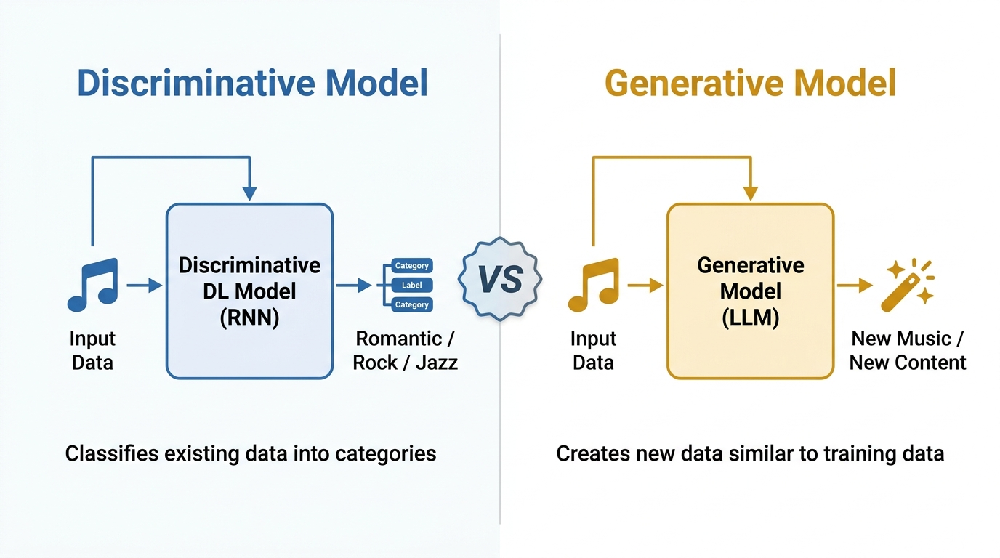
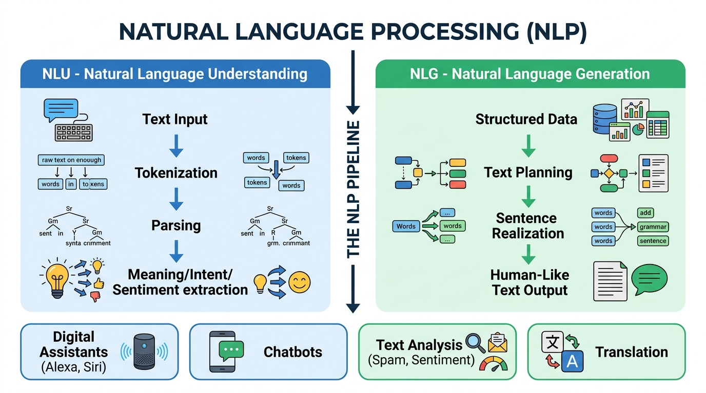

# 🧠 Day 01 — Introduction to Generative AI: The Complete Big Picture

> **Zero to Hero Gen AI Course — Phase 01: GenAI Foundations**
>
> 📅 Day 1 of 50 | ⏱️ Estimated Reading Time: 45 minutes
>
> **What you will learn today:** The entire landscape of AI, from basic neural networks to cutting-edge Generative AI. By the end, you will understand exactly where every concept fits and how everything connects.

---

## 📑 Table of Contents

1. [Where Does Generative AI Fit?](#1-where-does-generative-ai-fit)
2. [Deep Learning — The Five Pillars](#2-deep-learning--the-five-pillars)
3. [Understanding Sequential Data Models: RNN → LSTM → GRU](#3-understanding-sequential-data-models-rnn--lstm--gru)
4. [Sequence Relations in Neural Networks (2014)](#4-sequence-relations-in-neural-networks-2014)
5. [Seq2Seq Learning (2014-2015)](#5-seq2seq-learning-2014-2015)
6. [Attention Is All You Need (2017)](#6-attention-is-all-you-need-2017)
7. [Discriminative vs Generative Models](#7-discriminative-vs-generative-models)
8. [What is Generative AI?](#8-what-is-generative-ai)
9. [What is an LLM (Large Language Model)?](#9-what-is-an-llm-large-language-model)
10. [Natural Language Processing (NLP)](#10-natural-language-processing-nlp)
11. [The Complete Timeline — How We Got Here](#11-the-complete-timeline--how-we-got-here)
12. [Code Examples](#12-code-examples)
13. [Key Takeaways](#13-key-takeaways)
14. [Curated Video Walkthroughs & Visual Animations](#14-curated-video-walkthroughs--visual-animations)
15. [Practice Questions](#15-practice-questions)

---

## 1. Where Does Generative AI Fit?

Before diving deep, let's understand the **hierarchy** of the entire AI field. Think of it like Russian nesting dolls — each field lives inside a bigger one.



### The Nesting Order

```
🤖 Artificial Intelligence (AI)          ← The broadest field
  └── 📊 Machine Learning (ML)           ← Subset of AI
        └── 🧠 Deep Learning (DL)        ← Subset of ML
              └── ✨ Generative AI (GenAI) ← Subset of DL
```

### Let's Break This Down:

| Layer | What It Is | Example |
|-------|-----------|---------|
| **AI (Artificial Intelligence)** | Any technique that enables machines to mimic human intelligence — rule-based systems, expert systems, search algorithms, and more. | A chess engine that uses rules to play chess (like IBM's Deep Blue). |
| **ML (Machine Learning)** | A subset of AI where machines **learn patterns from data** instead of being explicitly programmed with rules. | A spam filter that learns from examples of spam vs. non-spam emails. |
| **DL (Deep Learning)** | A subset of ML that uses **multi-layered neural networks** (deep = many layers) to automatically learn complex patterns from raw data. | A face recognition system that identifies faces in photos. |
| **GenAI (Generative AI)** | A subset of DL that doesn't just *analyze* data — it **creates entirely new data** (text, images, audio, video, code) that resembles the training data. | ChatGPT generating human-like text, or DALL-E creating images from descriptions. |

### 🔑 Key Insight
> **Not all AI is Machine Learning.** Not all Machine Learning is Deep Learning. And not all Deep Learning is Generative AI. But **all Generative AI IS Deep Learning**, which IS Machine Learning, which IS AI.

### Real-World Analogy
Think of it like **education levels**:
- **AI** = All of "Education" (kindergarten through PhD)
- **ML** = "College Education" (a focused subset)
- **DL** = "Engineering Degree" (even more specialized)
- **GenAI** = "PhD in Creative Engineering" (the most specialized — not just understanding, but **creating** new things)

---

## 2. Deep Learning — The Five Pillars

Deep Learning is not a single technique — it's a **family of architectures**, each designed for a specific type of data. Think of them as specialized tools in a toolbox.



### 2.1 ANN — Artificial Neural Network

**What it is:** The foundational building block of all deep learning. ANNs are inspired by the human brain — a network of interconnected "neurons" organized in layers.

**Best for:** Numerical data, tabular data, structured text data.

**How it works:**
```
Input Layer → Hidden Layer(s) → Output Layer
   (data)     (learn patterns)   (prediction)
```

**Architecture explained:**
- **Input Layer:** Receives the raw data (numbers, features)
- **Hidden Layers:** Each neuron performs a weighted sum + activation function. These layers learn increasingly abstract patterns.
- **Output Layer:** Produces the final prediction

**Example use cases:**
- Predicting house prices from features (bedrooms, area, location)
- Credit card fraud detection
- Customer churn prediction

> ### 🎥 Visual Explainer & Animation
> [](https://www.youtube.com/watch?v=aircAruvnKk)
>
> 🎬 **[3Blue1Brown — But what is a neural network? | Chapter 1, Deep learning](https://www.youtube.com/watch?v=aircAruvnKk)** (⏱️ 19 mins)  
> 💡 *Visual Highlights:* The gold standard of neural network animation. Watch how handwritten digit pixels light up layers of neurons, weights, and biases to form high-level pattern recognition.

```python
# Simple ANN conceptual example
# Each neuron does: output = activation(weight * input + bias)

import numpy as np

def sigmoid(x):
    """Activation function - squashes output between 0 and 1"""
    return 1 / (1 + np.exp(-x))

# Simple neuron
inputs = np.array([0.5, 0.3, 0.2])   # 3 input features
weights = np.array([0.4, 0.7, 0.2])   # learned weights
bias = 0.1                             # bias term

# Forward pass through one neuron
weighted_sum = np.dot(inputs, weights) + bias  # 0.5*0.4 + 0.3*0.7 + 0.2*0.2 + 0.1
output = sigmoid(weighted_sum)

print(f"Weighted Sum: {weighted_sum:.4f}")
print(f"Neuron Output: {output:.4f}")
```

---

### 2.2 CNN — Convolutional Neural Network

**What it is:** A specialized neural network designed to process **grid-like data** — primarily images and videos.

**Best for:** Images, videos, any grid/spatial data.

**The Big Insight:** CNN = CNN layers (feature extraction) + ANN layers (classification). It's actually **two networks working together**:
1. **CNN Layers** (Convolutional + Pooling): Automatically detect features like edges, textures, shapes
2. **ANN Layers** (Fully Connected): Take those features and make the final classification

**How it works:**
```
Image → [Conv Layer → ReLU → Pooling] × N → Flatten → [ANN Layers] → Output
         ↑ CNN Part (Feature Extraction) ↑            ↑ ANN Part  ↑
```

**Example use cases:**
- Image classification (cat vs dog)
- Object detection in self-driving cars
- Medical image analysis (X-rays, MRIs)
- Video analysis

```python
# CNN conceptual structure (using PyTorch-like pseudocode)
"""
CNN Architecture for Image Classification:

Layer 1: Conv2D(3, 32, kernel_size=3)   → Detects simple edges
Layer 2: MaxPool2D(2, 2)                → Reduces spatial dimensions
Layer 3: Conv2D(32, 64, kernel_size=3)  → Detects complex patterns
Layer 4: MaxPool2D(2, 2)                → Further reduction
Layer 5: Flatten()                      → Convert 2D → 1D
Layer 6: Linear(64*6*6, 128)            → ANN hidden layer
Layer 7: Linear(128, 10)                → ANN output (10 classes)
"""

# What a convolution does conceptually:
import numpy as np

# A simple 5x5 image (grayscale)
image = np.array([
    [1, 1, 1, 0, 0],
    [0, 1, 1, 1, 0],
    [0, 0, 1, 1, 1],
    [0, 0, 1, 1, 0],
    [0, 1, 1, 0, 0]
])

# A 3x3 edge-detection filter (kernel)
kernel = np.array([
    [1,  0, -1],
    [1,  0, -1],
    [1,  0, -1]
])

# Convolution = slide the kernel across the image and compute dot products
# This detects vertical edges in the image!
print("Image shape:", image.shape)
print("Kernel shape:", kernel.shape)
print("Output shape would be: 3x3 (after valid convolution)")
```

---

### 2.3 RNN — Recurrent Neural Network

**What it is:** A neural network with **memory** — it can process sequences of data by passing information from one step to the next.

**Best for:** Sequential/time-series data — text, speech, stock prices, music.

**The Key Difference from ANN:** In an ANN, each input is processed independently. In an RNN, the output from the previous step becomes part of the input for the current step, creating a **loop**.

```
Standard ANN:  Input → Process → Output  (no memory)
RNN:           Input + Previous Memory → Process → Output + Updated Memory
```

**Example use cases:**
- Text generation
- Speech recognition
- Time series forecasting
- Music composition

**The Problem with RNN:** It suffers from **vanishing gradient problem** — it can only remember recent information (short-term memory). If a sequence is too long, the RNN "forgets" the earlier parts.

---

### 2.4 RL — Reinforcement Learning

**What it is:** A learning paradigm where an **agent** learns by interacting with an **environment** and receiving **rewards** or **penalties**.

**Best for:** Decision-making, game playing, robotics.

**How it works:**
```
Agent → Takes Action → Environment responds → Agent receives Reward/Penalty → Repeat
```

**Example use cases:**
- AlphaGo (beating world champions at Go)
- Robot navigation
- Game AI (Atari games, Dota 2)
- Autonomous driving decisions

**Connection to GenAI:** RL is used in **RLHF (Reinforcement Learning from Human Feedback)** — the technique used to align LLMs like ChatGPT to be helpful and safe.

---

### 2.5 GAN — Generative Adversarial Network

**What it is:** Two neural networks competing against each other — a **Generator** that creates fake data and a **Discriminator** that tries to detect the fakes.

**Best for:** Generating realistic images, videos, audio.

**How it works (The Counterfeiter Analogy):**
```
Generator (Counterfeiter) → Creates fake data
                    ↓
Discriminator (Detective) → Tries to tell real from fake
                    ↓
Both improve over time → Generator creates increasingly realistic data
```

**Example use cases:**
- Generating realistic human faces (StyleGAN)
- Image-to-image translation
- Creating art and designs
- Data augmentation for training other models

### 📊 Summary Comparison Table

| Network | Data Type | Memory | Key Feature | Example Use |
|---------|-----------|--------|-------------|-------------|
| **ANN** | Numerical/Text | None | Connected layers | Price prediction |
| **CNN** | Image/Video | None | Spatial feature extraction | Face recognition |
| **RNN** | Sequential | Short-term | Recurrent connections | Text generation |
| **RL** | Actions/Rewards | Policy | Trial-and-error learning | Game AI |
| **GAN** | Any (generative) | None | Two competing networks | Image generation |

---

## 3. Understanding Sequential Data Models: RNN → LSTM → GRU

Since sequential data is critical for language (and therefore for GenAI), let's deep-dive into the three models that handle sequences.



> ### 🎥 Visual Explainer & Animation
> [](https://www.youtube.com/watch?v=AsNTP8Kwu80)
>
> 🎬 **[StatQuest — Recurrent Neural Networks (RNNs), Clearly Explained!](https://www.youtube.com/watch?v=AsNTP8Kwu80)** (⏱️ 17 mins)  
> 💡 *Visual Highlights:* Step-by-step cartoon animations walking through word sequence processing, feedback loops, and why standard RNNs suffer from vanishing gradients.

### 3.1 RNN — Recurrent Neural Network (The Basics)

**Memory type:** Short-term memory only.

**How it works:** The RNN cell takes two inputs at each time step:
1. The current input `x_t`
2. The hidden state from the previous step `h_{t-1}`

It produces:
1. An output `y_t`
2. An updated hidden state `h_t` (passed to the next step)

```
        ┌──────────┐
x_t ──→ │          │ ──→ y_t
        │  RNN     │
h_{t-1}→│  Cell    │ ──→ h_t (passed to next step)
        └──────────┘
```

**The Problem:** As the sequence gets longer, the gradient (the learning signal) gets multiplied many times, becoming extremely small (**vanishing gradient**) or extremely large (**exploding gradient**). This means RNNs **cannot learn long-range dependencies**.

```python
# RNN Problem Illustrated
# Consider this sentence:
# "I grew up in France. (...100 words later...) I speak fluent ___"
# 
# The answer is "French" but the RNN has forgotten "France"
# because it was too many steps ago!

# Vanishing gradient mathematically:
import numpy as np

# If gradient is multiplied by 0.9 at each step:
gradient = 1.0
for step in range(50):
    gradient *= 0.9  # multiply by weight < 1

print(f"Gradient after 50 steps: {gradient:.10f}")
# Output: 0.0051537752 → Almost zero! The learning signal vanished.

# This is why RNNs struggle with long sequences
```

---

### 3.2 LSTM — Long Short-Term Memory

**Memory type:** Both short-term AND long-term memory (via **Cell State**).

**Why it was invented:** To solve the vanishing gradient problem of RNNs.

**The Key Innovation — Cell State:** LSTM introduces a separate highway called the **Cell State** (`C_t`) that runs on top of the hidden state. Think of it as a **conveyor belt** — information can flow along it mostly unchanged, allowing long-range memory.

**Three Gates control what information flows:**

| Gate | Purpose | Analogy |
|------|---------|---------|
| **Forget Gate** (`f_t`) | Decides what to **throw away** from the cell state | "Should I forget my old address after moving?" |
| **Input Gate** (`i_t`) | Decides what **new information** to add to the cell state | "Should I store my new phone number?" |
| **Output Gate** (`o_t`) | Decides what to **output** from the cell state | "When someone asks, which info should I share?" |

```python
# LSTM Conceptual Implementation
import numpy as np

def sigmoid(x):
    return 1 / (1 + np.exp(-x))

def tanh(x):
    return np.tanh(x)

def lstm_cell(x_t, h_prev, c_prev, weights):
    """
    One step of LSTM computation.
    
    x_t:    Current input
    h_prev: Previous hidden state (short-term memory)
    c_prev: Previous cell state (long-term memory)
    
    Returns: h_t (new hidden state), c_t (new cell state)
    """
    # Concatenate input and previous hidden state
    combined = np.concatenate([h_prev, x_t])
    
    # Step 1: FORGET GATE — What to remove from long-term memory?
    f_t = sigmoid(np.dot(weights['Wf'], combined) + weights['bf'])
    # f_t = 0 means "forget everything", f_t = 1 means "remember everything"
    
    # Step 2: INPUT GATE — What new info to add to long-term memory?
    i_t = sigmoid(np.dot(weights['Wi'], combined) + weights['bi'])
    candidate = tanh(np.dot(weights['Wc'], combined) + weights['bc'])
    # i_t controls HOW MUCH of the candidate to add
    
    # Step 3: UPDATE CELL STATE (long-term memory)
    c_t = f_t * c_prev + i_t * candidate
    # ↑ Forget old stuff  + Add new stuff
    
    # Step 4: OUTPUT GATE — What to output from the cell?
    o_t = sigmoid(np.dot(weights['Wo'], combined) + weights['bo'])
    h_t = o_t * tanh(c_t)
    
    return h_t, c_t

print("LSTM has TWO memory lines:")
print("  1. Hidden State (h_t) → Short-term / working memory")
print("  2. Cell State (c_t)   → Long-term memory highway")
```

---

### 3.3 GRU — Gated Recurrent Unit

**Memory type:** Combines short and long-term memory into **one** hidden state (no separate cell state).

**Why it exists:** GRU is a **simplified, faster version** of LSTM that achieves **comparable performance** with fewer parameters.

**Key differences from LSTM:**
- ❌ No separate Cell State — the hidden state does everything
- ✅ Only **2 gates** instead of 3 (Reset Gate + Update Gate)
- ✅ Faster to train (fewer parameters)
- ✅ Often performs just as well as LSTM

| Feature | RNN | LSTM | GRU |
|---------|-----|------|-----|
| **Gates** | 0 | 3 (Forget, Input, Output) | 2 (Reset, Update) |
| **Cell State** | ❌ | ✅ | ❌ |
| **Memory** | Short-term only | Short + Long term | Combined via hidden state |
| **Parameters** | Fewest | Most | Medium |
| **Training Speed** | Fastest | Slowest | Medium |
| **Long Sequences** | ❌ Poor | ✅ Good | ✅ Good |
| **When to use** | Short sequences | Complex long-term dependencies | Default choice (good balance) |

```python
# Comparison of parameter counts (approximate for hidden_size=256, input_size=100)

hidden_size = 256
input_size = 100

# RNN: 1 weight matrix
rnn_params = (input_size + hidden_size) * hidden_size + hidden_size
print(f"RNN Parameters:  {rnn_params:,}")       # ~91,392

# LSTM: 4 weight matrices (forget, input, cell, output gates)
lstm_params = 4 * ((input_size + hidden_size) * hidden_size + hidden_size)
print(f"LSTM Parameters: {lstm_params:,}")       # ~365,568

# GRU: 3 weight matrices (reset, update, new gates)
gru_params = 3 * ((input_size + hidden_size) * hidden_size + hidden_size)
print(f"GRU Parameters:  {gru_params:,}")        # ~274,176

print(f"\nLSTM has {lstm_params/rnn_params:.1f}x more parameters than RNN")
print(f"GRU has {gru_params/rnn_params:.1f}x more parameters than RNN")
print(f"GRU has {gru_params/lstm_params:.1%} of LSTM's parameters")
```

---

## 4. Sequence Relations in Neural Networks (2014)

In 2014, researchers categorized how neural networks can map inputs to outputs based on their **sequence lengths**. This classification was crucial for understanding what tasks different architectures can handle.



### The Four Types of Sequence Relations

### 4.1 One-to-One
```
Single Input → Single Output
```
- **What:** Fixed-size input produces fixed-size output
- **Example:** Image Classification — one image in, one label out
- **Network:** Standard ANN or CNN
- **Real-world:** "Is this X-ray normal or abnormal?"

### 4.2 One-to-Many
```
Single Input → Multiple Sequential Outputs
```
- **What:** One fixed input generates a sequence of outputs
- **Example:** Image Captioning — one image in, a sentence of words out
- **Network:** CNN (to encode image) + RNN (to generate words)
- **Real-world:** "Describe this image: 'A dog playing fetch in a sunny park'"

### 4.3 Many-to-One
```
Multiple Sequential Inputs → Single Output
```
- **What:** A sequence of inputs produces one fixed output
- **Example:** Sentiment Analysis — a sentence of words in, one sentiment label out
- **Network:** RNN/LSTM/GRU
- **Real-world:** "This movie was absolutely terrible" → ⭐ Negative

### 4.4 Many-to-Many
```
Multiple Inputs → Multiple Outputs
```
- **What:** A sequence of inputs produces a sequence of outputs
- **Example:** Language Translation — sentence in English → sentence in Hindi
- **Network:** RNN/LSTM/GRU (Encoder-Decoder architecture)
- **Real-world:** "How are you?" → "आप कैसे हैं?"

```python
# Illustrating Sequence Relations with simple examples

# 1. ONE-TO-ONE: Image Classification
print("=" * 60)
print("ONE-TO-ONE: Image Classification")
print("=" * 60)
print("Input:  [Image of a cat]  (single input)")
print("Output: 'Cat'             (single output)")
print()

# 2. ONE-TO-MANY: Image Captioning
print("=" * 60)
print("ONE-TO-MANY: Image Captioning")
print("=" * 60)
print("Input:  [Image of sunset over ocean]")
print("Output: ['A', 'beautiful', 'sunset', 'over', 'the', 'ocean']")
print("         ↑ Single image generates a SEQUENCE of words")
print()

# 3. MANY-TO-ONE: Sentiment Analysis
print("=" * 60)
print("MANY-TO-ONE: Sentiment Analysis")
print("=" * 60)
print("Input:  ['This', 'movie', 'was', 'absolutely', 'amazing']")
print("Output: 'Positive ⭐⭐⭐⭐⭐'")
print("         ↑ SEQUENCE of words produces single label")
print()

# 4. MANY-TO-MANY: Translation
print("=" * 60)
print("MANY-TO-MANY: Language Translation")
print("=" * 60)
print("Input:  ['I', 'love', 'programming']     (English)")
print("Output: ['मुझे', 'प्रोग्रामिंग', 'पसंद', 'है']  (Hindi)")
print("         ↑ SEQUENCE in → SEQUENCE out")
```

> **Important:** All four of these sequence relations were handled by RNN, LSTM, and GRU networks. But they all had a critical limitation — they processed sequences **one word at a time**, which was slow and couldn't handle long contexts well.

---

## 5. Seq2Seq Learning (2014-2015)

### The Problem That Needed Solving

By 2014, researchers needed a way to handle **Many-to-Many** tasks (like translation) where the input and output sequences could have **different lengths**.

### The Solution: Encoder-Decoder Architecture

The paper **"Sequence to Sequence Learning with Neural Networks"** (Sutskever et al., 2014) introduced the **Encoder-Decoder** model:

```
                    Context Vector
                    (fixed-size)
                         ↓
┌─────────────┐    ┌────────┐    ┌─────────────┐
│   ENCODER   │ →  │   C    │ →  │   DECODER   │
│ (LSTM/RNN)  │    │        │    │ (LSTM/RNN)  │
└─────────────┘    └────────┘    └─────────────┘
       ↑                                ↓
  Input Sequence              Output Sequence
  "I love AI"               "मुझे AI पसंद है"
```

**How it works:**
1. **Encoder** reads the entire input sequence word by word and compresses it into a single **context vector** (a fixed-size representation)
2. **Decoder** takes that context vector and generates the output sequence word by word

### ⚠️ The Critical Bottleneck Problem

The context vector is a **fixed-size** vector (typically 256 or 512 dimensions). ALL the information from the input sentence must be crammed into this single vector.

```python
# The Bottleneck Problem Illustrated

# Short sentence — works well!
short_sentence = "I love AI"  # 3 words → fits in context vector ✅

# Long sentence — information loss!
long_sentence = """
The artificial intelligence research community has been making 
remarkable progress in developing systems that can understand and 
generate human language with increasing sophistication and accuracy, 
leading to breakthroughs in machine translation, text summarization, 
and question answering systems that were previously thought impossible.
"""  # 40+ words → too much for a single fixed vector! ❌

print("Short sentence words:", len(short_sentence.split()))  # 3
print("Long sentence words:", len(long_sentence.split()))    # 40+

print("\n⚠️ PROBLEM:")
print("Both sentences must be compressed into the SAME SIZE vector!")
print("Context vector size: 512 dimensions")
print("Short sentence: Easy to encode everything")
print("Long sentence: Critical information is LOST during compression")
print("\n📏 Practical limit: ~30-50 words maximum for good results")
```

> **Key Limitation:** Seq2Seq models could only effectively handle sequences of about **30-50 words**. Beyond that, the fixed-size context vector couldn't hold enough information, and the translation quality degraded significantly.

---

## 6. Attention Is All You Need (2017)

### The Revolution

In 2017, the Google Brain team published one of the most influential papers in AI history: **"Attention Is All You Need"** (Vaswani et al., 2017). This paper introduced the **Transformer** architecture, which solved the bottleneck problem and revolutionized AI.


> ### 🎥 Visual Explainer & Animation
> [](https://www.youtube.com/watch?v=wjZofJX0v4U)
>
> 🎬 **[3Blue1Brown — Transformers, the tech behind LLMs | Chapter 5, Deep learning](https://www.youtube.com/watch?v=wjZofJX0v4U)** (⏱️ 27 mins)  
> 💡 *Visual Highlights:* The definitive 3D animated walkthrough of how Attention and Transformers process words in parallel, compute context-rich vectors, and generate text.

### What is Attention?

**Simple Analogy:** Imagine you're translating a long English paragraph to Hindi. Without attention, you'd read the entire paragraph, try to memorize everything, then translate from memory. With attention, you can **look back at specific parts** of the original text while translating each word.

**Before Attention (Seq2Seq):**
```
Encoder reads all words → Compresses to ONE vector → Decoder guesses from that single vector
```

**After Attention:**
```
Encoder reads all words → Keeps ALL hidden states → Decoder LOOKS BACK at relevant words for each output
```

### How Attention Works (Simplified)

At each decoding step, the attention mechanism:
1. **Compares** the current decoder state with ALL encoder states
2. **Scores** each encoder state for relevance (how important is this input word for the current output?)
3. **Creates a weighted combination** of encoder states (focus more on relevant words)
4. **Uses this focused context** to generate the output word

```python
import numpy as np

def softmax(x):
    """Convert scores to probabilities (sum to 1)"""
    exp_x = np.exp(x - np.max(x))
    return exp_x / exp_x.sum()

# Example: Translating "I love programming" to Hindi
# When generating the Hindi word for "programming":

encoder_words = ["I", "love", "programming"]
encoder_states = np.array([
    [0.1, 0.2, 0.3],   # hidden state for "I"
    [0.4, 0.5, 0.1],   # hidden state for "love"
    [0.8, 0.9, 0.7],   # hidden state for "programming"
])

# Current decoder state (trying to generate "प्रोग्रामिंग")
decoder_state = np.array([0.7, 0.8, 0.6])

# Step 1: Compute attention scores (dot product similarity)
attention_scores = np.dot(encoder_states, decoder_state)
print("Raw attention scores:", attention_scores)
# "programming" should get the highest score!

# Step 2: Normalize with softmax
attention_weights = softmax(attention_scores)
print("\nAttention weights:")
for word, weight in zip(encoder_words, attention_weights):
    bar = "█" * int(weight * 40)
    print(f"  '{word}':          {weight:.4f} {bar}")

# Step 3: Create weighted context vector
context = np.dot(attention_weights.reshape(1, -1), encoder_states).flatten()
print(f"\nContext vector: {context}")
print("→ This context focuses heavily on 'programming', which is exactly")
print("  what we need to generate the Hindi translation 'प्रोग्रामिंग'!")
```

### The Transformer's Key Innovations

The "Attention Is All You Need" paper didn't just add attention to RNNs — it **completely removed** RNNs and used **only** attention:

| Feature | Seq2Seq (RNN-based) | Transformer |
|---------|-------------------|-------------|
| **Encoder** | LSTM/RNN/GRU | Self-Attention layers |
| **Decoder** | LSTM/RNN/GRU | Self-Attention layers |
| **Processing** | Sequential (one word at a time) | **Parallel** (all words at once!) |
| **Context limit** | ~30-50 words | Thousands of tokens! |
| **Speed** | Slow (sequential) | **Fast** (parallelizable on GPUs) |
| **Long-range dependencies** | Poor | **Excellent** |

> **🔑 Why Transformers Won:** They process all words **simultaneously** (in parallel), they can attend to any word in the sequence regardless of distance, and they scale beautifully on modern GPUs. This is why they became the foundation for ALL modern LLMs.

---

## 7. Discriminative vs Generative Models

This is one of the most fundamental distinctions in all of machine learning.



> ### 🎥 Visual Explainer & Animation
> [](https://www.youtube.com/watch?v=0k_b_m70-98)
>
> 🎬 **[IBM Technology — Generative AI vs. Traditional AI: What's the Difference?](https://www.youtube.com/watch?v=0k_b_m70-98)** (⏱️ 6 mins)  
> 💡 *Visual Highlights:* Clear lightboard diagrams illustrating the geometric difference between decision boundaries ($P(Y|X)$) and generating from probability distributions ($P(X)$).

### Discriminative Models — "The Judge"

**What they do:** Learn the **boundary** between categories. Given input data, they predict which **category** it belongs to.

**Mathematical view:** They learn `P(Y|X)` — the probability of a label Y given input X.

**Analogy:** A music critic who listens to songs and says "This is Rock", "This is Jazz", "This is Classical". The critic **doesn't create music** — they only **classify** existing music.

**Examples:**
- Logistic Regression
- SVMs (Support Vector Machines)
- Random Forests
- CNNs for image classification
- RNNs for sentiment analysis

### Generative Models — "The Creator"

**What they do:** Learn the **underlying patterns and distribution** of the data, then use that understanding to **create new data** that looks like the training data.

**Mathematical view:** They learn `P(X)` or `P(X,Y)` — the probability distribution of the data itself.

**Analogy:** A musician who studies thousands of songs, learns patterns of melody, rhythm, and harmony, then **composes brand new songs** that sound like real music.

**Examples:**
- GANs (for generating images)
- LLMs like GPT (for generating text)
- Diffusion Models like Stable Diffusion (for generating images)
- VAEs (Variational Autoencoders)

### Side-by-Side Comparison

| Aspect | Discriminative Model | Generative Model |
|--------|---------------------|-----------------|
| **Goal** | Classify/predict labels | Generate new data |
| **Learns** | Decision boundaries | Data distribution |
| **Output** | Label/category | New data (text, image, audio) |
| **Question it answers** | "What IS this?" | "What would MORE of this look like?" |
| **Music example** | "This song is Romantic" | Creates a new romantic song |
| **Image example** | "This image is a cat" | Creates a new image of a cat |

```python
# Discriminative vs Generative — Conceptual Code Example

# ============================================
# DISCRIMINATIVE MODEL (Classification)
# ============================================
# Input: A movie review
# Output: Positive or Negative (classification)

review = "This movie was absolutely fantastic! The acting was superb."
# Discriminative model says: → "Positive 😊" (just a label)

print("DISCRIMINATIVE MODEL:")
print(f"  Input:  '{review}'")
print(f"  Output: 'Positive' (a category label)")
print()

# ============================================
# GENERATIVE MODEL (Content Creation)
# ============================================
# Input: A prompt or seed
# Output: Entirely NEW text/content

prompt = "Write a movie review:"
# Generative model creates: → A completely new review
generated = "The cinematography was breathtaking, with every frame composed like a painting..."

print("GENERATIVE MODEL:")
print(f"  Input:  '{prompt}'")
print(f"  Output: '{generated}'")
print(f"  → This text was CREATED, not selected from existing data!")
```

---

## 8. What is Generative AI?

Now that we understand the building blocks, let's formally define **Generative AI**.

### Definition

> **Generative AI** is a category of artificial intelligence that can **generate new data** (text, images, audio, video, code, 3D models) based on patterns learned from **training data**. Instead of just analyzing or classifying existing data, it **creates entirely new content** that resembles — but is not a copy of — its training data.

### What Can Generative AI Generate?

| Output Type | Model/Technology | Example |
|-------------|-----------------|---------|
| **Text → Text** | LLMs (GPT, Gemini, Claude) | ChatGPT writing an essay |
| **Text → Image** | Diffusion Models (DALL-E, Midjourney, Stable Diffusion) | "Draw a sunset over mountains" → image |
| **Image → Image** | GANs, Diffusion Models | Style transfer, super-resolution |
| **Image → Text** | Multimodal LLMs (GPT-4V, Gemini Vision) | Describing what's in a photo |
| **Text → Audio** | Audio models (Bark, MusicGen) | Text-to-speech, music generation |
| **Text → Video** | Video models (Sora, Runway) | "A cat riding a surfboard" → video |
| **Text → Code** | Code LLMs (Codex, GitHub Copilot) | "Write a Python function to..." → code |

### The Two Main Branches of Generative AI

#### 1. Generative Image Models (GANs, Diffusion Models)
- Primarily work with **visual data**
- GANs: Generator vs Discriminator competition
- Diffusion Models: Learn to gradually remove noise from random noise to create images
- Primarily: **Image → Image** transformations

#### 2. Generative Language Models (LLMs)
- Work with **text and increasingly multimodal data**
- Based on the **Transformer architecture**
- Can handle: **Text → Text**, **Text → Image**, **Image → Text**, **Image → Image**
- More versatile and general-purpose than GANs

### Why Generative AI is a Huge Topic

Generative AI is not just one technique — it encompasses:
- **Multiple architectures:** Transformers, GANs, Diffusion Models, VAEs
- **Multiple modalities:** Text, images, audio, video, 3D, code
- **Multiple applications:** Chatbots, content creation, code generation, drug discovery, game design
- **Constantly evolving:** New models and capabilities emerge monthly

```python
# Generative AI — The Different Modalities

gen_ai_landscape = {
    "Text Generation": {
        "Models": ["GPT-4", "Gemini", "Claude", "LLaMA", "Mistral"],
        "Tasks": ["Chatbots", "Story writing", "Code generation", "Summarization"],
        "Architecture": "Transformer (Decoder-only)"
    },
    "Image Generation": {
        "Models": ["DALL-E 3", "Midjourney", "Stable Diffusion", "StyleGAN"],
        "Tasks": ["Art creation", "Photo editing", "Design", "Data augmentation"],
        "Architecture": "Diffusion Models / GANs"
    },
    "Audio Generation": {
        "Models": ["Bark", "MusicGen", "AudioLDM", "Eleven Labs"],
        "Tasks": ["Text-to-speech", "Music composition", "Voice cloning"],
        "Architecture": "Transformer + Audio Codecs"
    },
    "Video Generation": {
        "Models": ["Sora", "Runway Gen-3", "Pika"],
        "Tasks": ["Text-to-video", "Video editing", "Animation"],
        "Architecture": "Diffusion Models with Temporal Attention"
    },
    "Code Generation": {
        "Models": ["GitHub Copilot", "Code Llama", "StarCoder", "DeepSeek Coder"],
        "Tasks": ["Code completion", "Bug fixing", "Code explanation"],
        "Architecture": "Transformer (trained on code)"
    }
}

for modality, details in gen_ai_landscape.items():
    print(f"\n{'='*60}")
    print(f"🎯 {modality}")
    print(f"{'='*60}")
    print(f"  Architecture: {details['Architecture']}")
    print(f"  Key Models:   {', '.join(details['Models'])}")
    print(f"  Use Cases:    {', '.join(details['Tasks'])}")
```

---

## 9. What is an LLM (Large Language Model)?

### Definition

> A **Large Language Model (LLM)** is a deep learning model — specifically a **Transformer** — trained on massive amounts of text data that can **understand** and **generate** human language in a remarkably human-like fashion.

### Breaking Down the Name

| Word | Meaning |
|------|---------|
| **Large** | Billions of parameters (GPT-3: 175B, GPT-4: ~1.8T estimated, LLaMA 3: 405B) |
| **Language** | Trained on and designed for human language (text) |
| **Model** | A mathematical function that maps inputs to outputs |

### What Makes LLMs Special?

1. **Scale:** Trained on trillions of words from books, websites, code, and more
2. **Emergent abilities:** At large enough scale, they develop capabilities nobody explicitly programmed — reasoning, translation, coding, summarization
3. **Few-shot learning:** Can perform new tasks with just a few examples, no retraining needed
4. **Versatility:** A single model can do translation, coding, writing, analysis, math

### How LLMs Work — The Core Idea

LLMs are fundamentally **next-token predictors**. They predict the most likely next word (token) given all the previous words:

```python
# How an LLM generates text — next-token prediction

prompt = "The capital of France is"

# The LLM has seen billions of text examples during training.
# It learned that after "The capital of France is", 
# the most likely next word is "Paris"

predictions = {
    "Paris":    0.92,   # 92% probability
    "Lyon":     0.03,   # 3% probability
    "the":      0.02,   # 2% probability
    "a":        0.01,   # 1% probability
    "located":  0.01,   # 1% probability
    "...":      0.01    # other words
}

print(f"Prompt: '{prompt}'")
print(f"\nLLM's predictions for the next word:")
for word, prob in predictions.items():
    bar = "█" * int(prob * 50)
    print(f"  '{word}': {prob:.0%} {bar}")

# The LLM selects "Paris" (highest probability)
# Then it asks: "The capital of France is Paris" → what's next?
# Answer: "." (period) → the sentence ends.

print(f"\nGenerated: '{prompt} Paris.'")
print("\n→ This simple process of predicting one word at a time")
print("  is how LLMs generate entire paragraphs, essays, and code!")
```

### The LLM Training Pipeline

```
Step 1: Pre-training
   Massive text data (internet, books, code)
   → Self-supervised learning (predict next word)
   → Base model (knows language but isn't helpful yet)

Step 2: Fine-tuning (SFT — Supervised Fine-Tuning)
   Human-curated instruction-response pairs
   → Teaches the model to follow instructions
   → Instruction-tuned model

Step 3: Alignment (RLHF — Reinforcement Learning from Human Feedback)
   Human preferences (which response is better?)
   → Teaches the model to be helpful, harmless, honest
   → Aligned model (like ChatGPT)
```

### Key LLMs and Their Sizes

| Model | Company | Parameters | Key Feature |
|-------|---------|-----------|-------------|
| GPT-4 | OpenAI | ~1.8 Trillion (est.) | Most capable, multimodal |
| Gemini Ultra | Google | Undisclosed | Native multimodal |
| Claude 3 | Anthropic | Undisclosed | Strong reasoning, safe |
| LLaMA 3 | Meta | 8B / 70B / 405B | Open source |
| Mistral | Mistral AI | 7B / 8x7B / 8x22B | Efficient, open source |

---

## 10. Natural Language Processing (NLP)

NLP is the **broader field** that LLMs operate within. Understanding NLP helps you understand what LLMs do and why they're revolutionary.



### What is NLP?

> **Natural Language Processing (NLP)** is a branch of AI that helps computers **understand**, **interpret**, and **generate** human language. It bridges the gap between human communication and computer understanding.

### The Two Halves of NLP

#### NLU — Natural Language Understanding
**Focus:** Getting meaning FROM text/speech.

| Task | What it Does | Example |
|------|-------------|---------|
| **Tokenization** | Splits text into words/subwords | "I love AI" → ["I", "love", "AI"] |
| **Part-of-Speech Tagging** | Labels grammatical roles | "I/PRON love/VERB AI/NOUN" |
| **Named Entity Recognition** | Identifies people, places, dates | "Elon Musk" → PERSON, "Tesla" → ORG |
| **Sentiment Analysis** | Determines emotion/opinion | "Great product!" → Positive |
| **Intent Detection** | Understands what user wants | "Book a flight" → BOOKING_INTENT |

#### NLG — Natural Language Generation
**Focus:** Producing human-like text.

| Task | What it Does | Example |
|------|-------------|---------|
| **Text Generation** | Creates new text content | Writing stories, articles |
| **Summarization** | Condenses long text | 10-page report → 3 sentences |
| **Translation** | Converts between languages | English → Hindi |
| **Question Answering** | Generates answers to questions | "What is AI?" → detailed explanation |
| **Dialogue** | Generates conversational responses | Chatbot interactions |

### Real-World NLP Applications

```python
# NLP in the Real World — Examples

nlp_applications = {
    "🗣️ Digital Assistants": {
        "examples": ["Amazon Alexa", "Apple Siri", "Google Assistant"],
        "nlp_tasks": ["Speech-to-Text", "Intent Detection", "Text-to-Speech"],
        "how": "You speak → NLU understands → System acts → NLG responds"
    },
    "🤖 Customer Service Chatbots": {
        "examples": ["Bank chatbots", "E-commerce support", "FAQ bots"],
        "nlp_tasks": ["Intent Classification", "Entity Extraction", "Response Generation"],
        "how": "Customer types question → NLU extracts intent → NLG generates answer"
    },
    "📧 Email Spam Detection": {
        "examples": ["Gmail spam filter", "Outlook junk filter"],
        "nlp_tasks": ["Text Classification", "Pattern Recognition"],
        "how": "Email arrives → NLU analyzes content → Classify as spam/not-spam"
    },
    "🌐 Machine Translation": {
        "examples": ["Google Translate", "DeepL"],
        "nlp_tasks": ["Tokenization", "Seq2Seq/Transformer", "Text Generation"],
        "how": "Source text → Encoder understands → Decoder generates translated text"
    },
    "😊 Social Media Sentiment": {
        "examples": ["Brand monitoring", "Election analysis", "Product reviews"],
        "nlp_tasks": ["Sentiment Analysis", "Topic Modeling", "Trend Detection"],
        "how": "Millions of posts → NLU extracts sentiment → Dashboard shows trends"
    }
}

for app_name, details in nlp_applications.items():
    print(f"\n{app_name}")
    print(f"  Examples:  {', '.join(details['examples'])}")
    print(f"  NLP Tasks: {', '.join(details['nlp_tasks'])}")
    print(f"  How:       {details['how']}")
```

### How NLP Evolved into LLMs

```
Traditional NLP (2000s-2010s)          Modern NLP (2017-Present)
├── Rule-based systems                 ├── Transformers
├── Bag of Words                       ├── Pre-trained models (BERT, GPT)
├── TF-IDF                            ├── Transfer learning
├── Word2Vec                           ├── LLMs (GPT-4, Gemini)
├── RNN/LSTM for sequences             └── Multimodal models
└── Separate models per task               └── ONE model, MANY tasks!
```

> **🔑 The Revolution:** Traditional NLP needed a separate model for each task (one for translation, one for sentiment, one for summarization). LLMs can do ALL these tasks with a single model — you just change the prompt!

---

## 11. The Complete Timeline — How We Got Here

```
Year    Milestone                              Impact
────    ─────────                              ──────
1958    Perceptron (Frank Rosenblatt)          First neural network concept
1986    Backpropagation                        Made training neural networks practical
1998    LeNet (Yann LeCun)                     First successful CNN (digit recognition)
2012    AlexNet                                Deep learning revolution begins (ImageNet)
2013    Word2Vec                               Words as vectors (semantic meaning)
2014    GAN (Goodfellow)                       Generative image models born
2014    Seq2Seq                                Encoder-decoder for translation
2014    Sequence Relations classified          One-to-one, one-to-many, etc.
2015    Attention Mechanism (Bahdanau)         Looking back at relevant inputs
2015    ResNet                                 Very deep networks (152 layers!)
2017    "Attention Is All You Need"            🔥 TRANSFORMER — Everything changed!
2018    BERT (Google)                          Pre-trained language understanding
2018    GPT-1 (OpenAI)                         First generative pre-trained transformer
2019    GPT-2 (OpenAI)                         "Too dangerous to release" (1.5B params)
2020    GPT-3 (OpenAI)                         175B parameters, few-shot learning
2021    DALL-E (OpenAI)                        Text-to-image generation
2022    ChatGPT                                🔥 AI goes mainstream!
2022    Stable Diffusion                       Open-source image generation
2023    GPT-4                                  Multimodal (text + images)
2023    LLaMA (Meta)                           Open-source LLMs
2023    Gemini (Google)                        Natively multimodal
2024    Sora (OpenAI)                          Text-to-video generation
2024    Claude 3 (Anthropic)                   Advanced reasoning
2025    Open-source catches up                 LLaMA 3, Mistral, DeepSeek
```

---

## 12. Code Examples

### Example 1: Simple Sentiment Classifier (Discriminative Model)

```python
"""
Simple Sentiment Analysis — A Discriminative Model Example
This is a MANY-TO-ONE task: sequence of words → single label
"""

# Simple rule-based sentiment (no ML needed to understand the concept)
positive_words = {'good', 'great', 'amazing', 'fantastic', 'excellent', 
                  'wonderful', 'love', 'best', 'awesome', 'superb', 
                  'happy', 'beautiful', 'perfect', 'brilliant'}

negative_words = {'bad', 'terrible', 'awful', 'horrible', 'worst',
                  'hate', 'poor', 'ugly', 'boring', 'disappointing',
                  'sad', 'angry', 'failure', 'useless'}

def analyze_sentiment(text):
    """Simple sentiment analysis — Discriminative approach"""
    words = text.lower().split()
    
    pos_count = sum(1 for word in words if word in positive_words)
    neg_count = sum(1 for word in words if word in negative_words)
    total = pos_count + neg_count
    
    if total == 0:
        return "Neutral 😐", 0.5
    
    score = pos_count / total
    
    if score > 0.6:
        return "Positive 😊", score
    elif score < 0.4:
        return "Negative 😞", score
    else:
        return "Mixed 🤔", score

# Test it!
reviews = [
    "This movie was absolutely amazing and fantastic!",
    "The food was terrible and the service was horrible",
    "The weather is nice today",
    "I love the great design but hate the poor battery life"
]

print("DISCRIMINATIVE MODEL — Sentiment Analysis")
print("=" * 60)
for review in reviews:
    sentiment, score = analyze_sentiment(review)
    print(f"\n📝 Review: \"{review}\"")
    print(f"   Result: {sentiment} (confidence: {score:.0%})")
```

### Example 2: Simple Text Generator (Generative Model Concept)

```python
"""
Simple Text Generation — A Generative Model Concept
This shows the CORE IDEA of how generative models work:
predicting the next word based on previous words.
"""

import random

# A simple bigram model (next word prediction based on current word)
# In reality, LLMs use billions of parameters — this is a toy example

training_data = [
    "I love programming in Python",
    "I love building AI applications",  
    "Python is great for machine learning",
    "Machine learning is a subset of AI",
    "AI is transforming the world",
    "Deep learning powers modern AI",
    "I love learning new things",
    "Programming in Python is fun",
]

def build_bigram_model(sentences):
    """Build a simple next-word prediction model"""
    model = {}
    for sentence in sentences:
        words = sentence.lower().split()
        for i in range(len(words) - 1):
            current_word = words[i]
            next_word = words[i + 1]
            if current_word not in model:
                model[current_word] = []
            model[current_word].append(next_word)
    return model

def generate_text(model, start_word, length=10):
    """Generate text by predicting one word at a time"""
    current_word = start_word.lower()
    generated = [current_word]
    
    for _ in range(length - 1):
        if current_word in model:
            next_word = random.choice(model[current_word])
            generated.append(next_word)
            current_word = next_word
        else:
            break  # No prediction available
    
    return ' '.join(generated)

# Build the model
bigram_model = build_bigram_model(training_data)

# Show the model's learned patterns
print("GENERATIVE MODEL — Text Generation")
print("=" * 60)
print("\n📚 What the model learned (word → possible next words):")
for word, next_words in sorted(bigram_model.items()):
    unique_next = list(set(next_words))
    print(f"  '{word}' → {unique_next}")

# Generate new text!
print(f"\n🤖 Generated Texts:")
print("-" * 40)
for start in ["i", "python", "machine", "deep"]:
    for i in range(3):
        text = generate_text(bigram_model, start, length=8)
        print(f"  Starting with '{start}': {text}")
    print()

print("💡 Note: Real LLMs use the same core concept (next-word prediction)")
print("   but with BILLIONS of parameters and much longer context windows!")
```

### Example 3: Visualizing the RNN Memory Problem

```python
"""
Visualizing why RNNs forget — The Vanishing Gradient Problem
"""

import numpy as np

def simulate_memory_decay(model_type, sequence_length=20):
    """Simulate how well each model remembers the first word"""
    
    if model_type == "RNN":
        # RNN: Memory decays exponentially
        decay_rate = 0.85  # Each step retains 85% of previous memory
        memory = [decay_rate ** i for i in range(sequence_length)]
        
    elif model_type == "LSTM":
        # LSTM: Cell state preserves memory much better
        # Forget gate keeps ~95% + input gate adds relevant new info
        memory = []
        cell_state_retention = 0.98
        for i in range(sequence_length):
            # Cell state retains memory well, with slight additions
            retention = cell_state_retention ** i * 0.95 + 0.05
            memory.append(min(retention, 1.0))
            
    elif model_type == "GRU":
        # GRU: Update gate balances old and new information
        memory = []
        for i in range(sequence_length):
            retention = 0.96 ** i * 0.90 + 0.08
            memory.append(min(retention, 1.0))
    
    return memory

print("MEMORY RETENTION: How well does each model remember word #1?")
print("=" * 65)
print(f"{'Step':>4} | {'RNN':>8} | {'LSTM':>8} | {'GRU':>8} | Visual (RNN)")
print("-" * 65)

rnn_mem  = simulate_memory_decay("RNN", 20)
lstm_mem = simulate_memory_decay("LSTM", 20)
gru_mem  = simulate_memory_decay("GRU", 20)

for i in range(20):
    bar = "█" * int(rnn_mem[i] * 30)
    print(f"  {i+1:>2}  | {rnn_mem[i]:>7.1%} | {lstm_mem[i]:>7.1%} | {gru_mem[i]:>7.1%} | {bar}")

print("\n📊 RESULTS:")
print(f"  RNN  after 20 steps: {rnn_mem[-1]:.1%} memory retention")
print(f"  LSTM after 20 steps: {lstm_mem[-1]:.1%} memory retention")
print(f"  GRU  after 20 steps: {gru_mem[-1]:.1%} memory retention")
print("\n💡 This is why LSTM and GRU were invented — to preserve long-term memory!")
print("   And Transformers solved this even better with ATTENTION mechanism.")
```

---

## 13. Key Takeaways

### 🎯 Must-Remember Points

1. **AI ⊃ ML ⊃ DL ⊃ GenAI** — Each is a subset of the one above it.

2. **5 Deep Learning Architectures:**
   - **ANN** → Numerical/text data (basic building block)
   - **CNN** → Images/video (spatial patterns)
   - **RNN** → Sequential data (but short memory!)
   - **RL** → Decision-making via rewards
   - **GAN** → Generate new data via competition

3. **Memory evolution:** RNN (short-term only) → LSTM (cell state for long-term) → GRU (simplified LSTM)

4. **Sequence relations (2014):** One-to-one, one-to-many, many-to-one, many-to-many

5. **Seq2Seq (2014-2015):** Encoder-Decoder with a bottleneck problem (30-50 word limit)

6. **Attention (2017):** The decoder can "look back" at ALL encoder states — no more bottleneck!

7. **Transformers:** Replaced RNNs entirely, process in parallel, scale to thousands of tokens

8. **Discriminative models** classify data; **Generative models** create new data

9. **LLMs** are large Transformer models that predict the next token

10. **NLP** = NLU (understanding) + NLG (generation) — LLMs excel at both

---

## 14. Curated Video Walkthroughs & Visual Animations

To visually solidify the foundational concepts of Artificial Intelligence, Deep Learning architectures, and the Transformer paradigm, watch these world-renowned animated explanations:

| # | Topic / Concept | Recommended Video | Channel / Creator | Why Watch? (Visual & Animation Highlights) |
|---|-----------------|-------------------|-------------------|--------------------------------------------|
| 1 | **What is a Neural Network?** | [But what is a neural network? \| Chapter 1, Deep learning](https://www.youtube.com/watch?v=aircAruvnKk) | **3Blue1Brown (Grant Sanderson)** | The gold standard of mathematical animation. Uses the MNIST digit recognition task to illustrate layers, activations, weights, biases, and matrix transformations. |
| 2 | **How Neural Networks Learn** | [Gradient descent, how neural networks learn \| Chapter 2, Deep learning](https://www.youtube.com/watch?v=IHZwWFHWa-w) | **3Blue1Brown (Grant Sanderson)** | Brilliant 3D visualizations of high-dimensional cost functions, loss landscapes, and how gradient descent finds optimal weights. |
| 3 | **Neural Networks Inside Out** | [Neural Networks Part 1: Inside the Black Box](https://www.youtube.com/watch?v=CqOfi41LfDw) | **StatQuest (Josh Starmer)** | Extremely accessible, step-by-step visual walkthrough showing how simple linear functions combine with activation functions to fit complex boundaries. |
| 4 | **Generative AI vs Traditional AI** | [Generative AI vs. Traditional AI: What's the Difference?](https://www.youtube.com/watch?v=0k_b_m70-98) | **IBM Technology (Martin Keen)** | Crystal-clear lightboard explanation contrasting discriminative classification models with generative probability distribution models. |
| 5 | **Transformers & Attention Breakthrough** | [Transformers, the tech behind LLMs \| Chapter 5, Deep learning](https://www.youtube.com/watch?v=wjZofJX0v4U) | **3Blue1Brown (Grant Sanderson)** | Mind-bending 3D geometric animation showing how word embeddings move through vector space and how attention replaces recurrent loops. |

### 🎬 Deep-Dive Video Breakdown

#### 1. [3Blue1Brown — But what is a neural network?](https://www.youtube.com/watch?v=aircAruvnKk)
[](https://www.youtube.com/watch?v=aircAruvnKk)
> ⏱️ **Duration:** ~19 mins | 🎯 **Core Concept:** Neurons as Numbers, Layer-by-Layer Activation, Linear Combinations  
> 💡 **Key Visual Takeaway:** Watch how the activation of a neuron lights up sub-components (edges, loops) in handwritten digits. It visually transforms the abstract formula $a^{(1)} = \sigma(Wa^{(0)} + b)$ into concrete intuitive geometry.

#### 2. [3Blue1Brown — Gradient descent, how neural networks learn](https://www.youtube.com/watch?v=IHZwWFHWa-w)
[](https://www.youtube.com/watch?v=IHZwWFHWa-w)
> ⏱️ **Duration:** ~21 mins | 🎯 **Core Concept:** Cost Functions, Minima, Negative Gradient Vector, Learning Rate  
> 💡 **Key Visual Takeaway:** The ball rolling down a complex multidimensional terrain animation clearly demystifies why the negative gradient gives the direction of steepest descent.

#### 3. [StatQuest — Neural Networks Part 1: Inside the Black Box](https://www.youtube.com/watch?v=CqOfi41LfDw)
[](https://www.youtube.com/watch?v=CqOfi41LfDw)
> ⏱️ **Duration:** ~18 mins | 🎯 **Core Concept:** Linear Combinations, Activation Functions, Visual Fitting  
> 💡 **Key Visual Takeaway:** Step-by-step visual curves showing how adding simple mathematical curves together allows neural networks to fit complex classification frontiers.

#### 4. [IBM Technology — Generative AI vs. Traditional AI](https://www.youtube.com/watch?v=0k_b_m70-98)
[](https://www.youtube.com/watch?v=0k_b_m70-98)
> ⏱️ **Duration:** ~6 mins | 🎯 **Core Concept:** Discriminative Classification vs. Generative Synthesis  
> 💡 **Key Visual Takeaway:** Martin Keen visually diagrams how traditional machine learning draws decision boundaries (e.g. Cat vs Dog), whereas Generative AI models learn the underlying probability distribution $P(X)$ to synthesize entirely new samples.

#### 5. [3Blue1Brown — Transformers, the tech behind LLMs](https://www.youtube.com/watch?v=wjZofJX0v4U)
[](https://www.youtube.com/watch?v=wjZofJX0v4U)
> ⏱️ **Duration:** ~27 mins | 🎯 **Core Concept:** Self-Attention, High-Dimensional Word Embeddings, Parallel Processing  
> 💡 **Key Visual Takeaway:** Incredible 3D geometric visualization showing how word vectors update their semantic orientation in real time as they pay attention to surrounding tokens.


---

## 15. Practice Questions

### Conceptual Questions

1. **Explain in your own words:** Why is Generative AI a subset of Deep Learning and not a separate field?

2. **Compare:** What is the fundamental difference between how a CNN processes an image and how an RNN processes a sentence?

3. **The Bottleneck:** Why can't a basic Seq2Seq model translate a 100-word paragraph well? What exactly goes wrong?

4. **Attention Analogy:** If you're reading a book and someone asks "Who is the main character?", how does the attention mechanism help you answer? (Hint: you don't re-read the entire book.)

5. **Discriminative vs Generative:** You're building an email system. Which type of model would you use for (a) spam detection, and (b) auto-reply suggestions? Why?

### Fill in the Blanks

6. RNN has __________ memory, LSTM has __________ via Cell State, and GRU combines both using only __________.

7. The paper "__________ Is All You Need" (2017) introduced the __________ architecture.

8. In an LLM, the core task is __________ prediction — predicting the most likely __________ given the previous ones.

9. NLP is divided into two branches: __________ (understanding) and __________ (generation).

10. A GAN consists of two competing networks: the __________ (creates fake data) and the __________ (detects fakes).

### Answers

<details>
<summary>Click to reveal answers</summary>

6. **short-term** memory, **short-term AND long-term** via Cell State, and GRU combines both using only **hidden state**.

7. The paper "**Attention** Is All You Need" (2017) introduced the **Transformer** architecture.

8. In an LLM, the core task is **next-token** prediction — predicting the most likely **word/token** given the previous ones.

9. NLP is divided into two branches: **NLU (Natural Language Understanding)** and **NLG (Natural Language Generation)**.

10. A GAN consists of two competing networks: the **Generator** and the **Discriminator**.

</details>

---

## 🗺️ What's Next?

In **Day 02**, we'll dive deep into the **Transformer Architecture** — the single most important invention in modern AI. We'll understand self-attention, multi-head attention, positional encoding, and build a mini-Transformer from scratch!

---

> **📌 Navigation**
>
> ← Previous: Start of Course | [Day 02: Transformer Architecture →](../Day_02_Transformer_Architecture/)
>
> [📚 Back to Course Overview](../../README.md)
