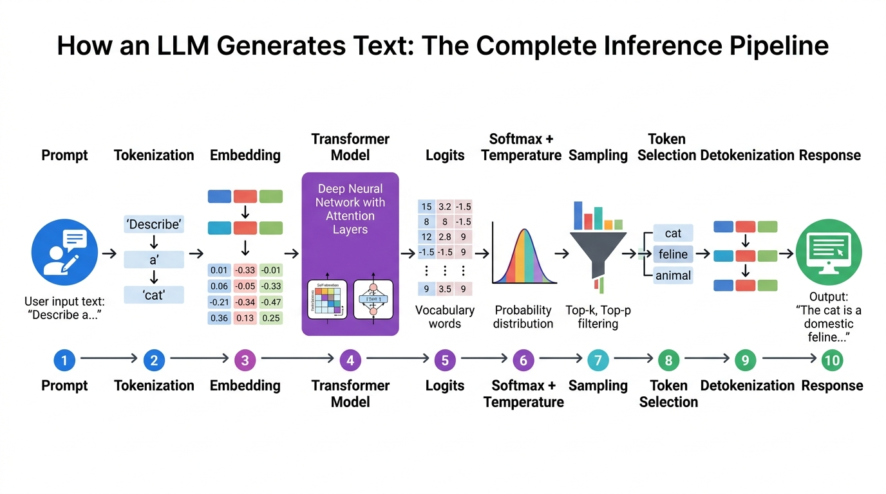
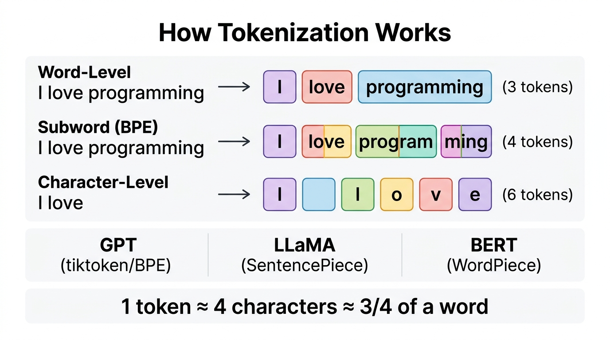
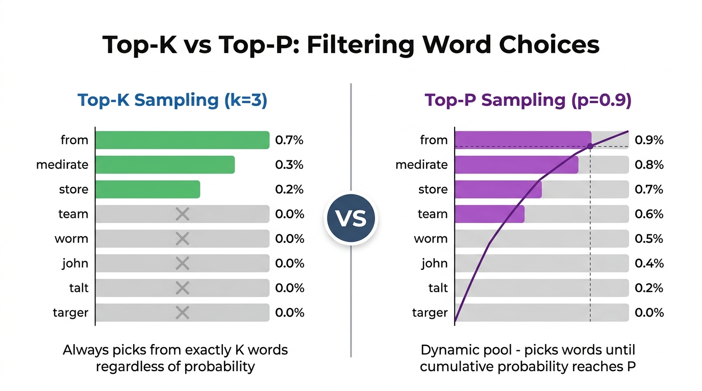
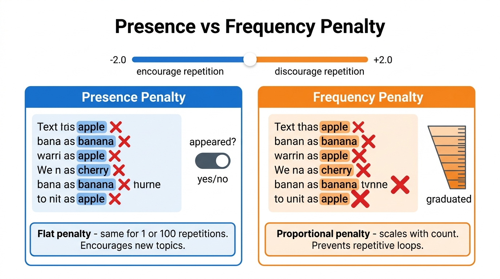

# 🎛️ Day 02 — LLM Parameters, Inference & Decoding Strategies

> **Zero to Hero Gen AI Course — Phase 01: GenAI Foundations**
>
> 📅 Day 2 of 50 | ⏱️ Estimated Reading Time: 50 minutes
>
> **What you will learn today:** Every parameter that controls how an LLM generates text — from temperature and sampling to penalties and reproducibility. You'll understand the complete inference pipeline and learn to tune LLMs like a pro.

---

## 📑 Table of Contents

1. [Prerequisite: How Does an LLM Actually Generate Text?](#1-prerequisite-how-does-an-llm-actually-generate-text)
2. [Tokens & Tokenization — The Language LLMs Speak](#2-tokens--tokenization--the-language-llms-speak)
3. [The Softmax Function — Turning Scores into Probabilities](#3-the-softmax-function--turning-scores-into-probabilities)
4. [Temperature — Controlling Creativity](#4-temperature--controlling-creativity)
5. [Top-K Sampling — Fixed Word Pool](#5-top-k-sampling--fixed-word-pool)
6. [Top-P (Nucleus Sampling) — Dynamic Word Pool](#6-top-p-nucleus-sampling--dynamic-word-pool)
7. [Top-K vs Top-P — When to Use Which?](#7-top-k-vs-top-p--when-to-use-which)
8. [Decoding Strategies — Greedy, Beam Search & Sampling](#8-decoding-strategies--greedy-beam-search--sampling)
9. [Max Tokens — Controlling Response Length](#9-max-tokens--controlling-response-length)
10. [Stop Sequences — Smart Response Termination](#10-stop-sequences--smart-response-termination)
11. [Presence Penalty — Encouraging New Topics](#11-presence-penalty--encouraging-new-topics)
12. [Frequency Penalty — Preventing Repetitive Loops](#12-frequency-penalty--preventing-repetitive-loops)
13. [Presence vs Frequency Penalty — Key Differences](#13-presence-vs-frequency-penalty--key-differences)
14. [N — Multiple Response Variations](#14-n--multiple-response-variations)
15. [Logit Bias — Forcing or Banning Specific Words](#15-logit-bias--forcing-or-banning-specific-words)
16. [Seed — Reproducible Outputs](#16-seed--reproducible-outputs)
17. [Context Window — The Model's Working Memory](#17-context-window--the-models-working-memory)
18. [Prompt Tokens vs Completion Tokens — Understanding Costs](#18-prompt-tokens-vs-completion-tokens--understanding-costs)
19. [Logprobs — Seeing the Model's Confidence](#19-logprobs--seeing-the-models-confidence)
20. [Streaming — Real-Time Response Delivery](#20-streaming--real-time-response-delivery)
21. [Response Format — Structured Outputs](#21-response-format--structured-outputs)
22. [System, User & Assistant Messages — The Chat Structure](#22-system-user--assistant-messages--the-chat-structure)
23. [The Master Cheat Sheet — All Parameters at a Glance](#23-the-master-cheat-sheet--all-parameters-at-a-glance)
24. [Practical Recipes — Best Settings for Common Tasks](#24-practical-recipes--best-settings-for-common-tasks)
25. [Code Examples](#25-code-examples)
26. [Practice Questions](#26-practice-questions)

---

## 1. Prerequisite: How Does an LLM Actually Generate Text?

Before understanding individual parameters, you **must** understand the pipeline they plug into. Every time you send a prompt to ChatGPT, Gemini, or Claude, this exact process happens:



### The 10-Step Inference Pipeline

```
Step 1:  PROMPT          → Your text input ("Write a poem about AI")
Step 2:  TOKENIZATION    → Split text into tokens: ["Write", " a", " poem", " about", " AI"]
Step 3:  EMBEDDING       → Convert each token to a vector of numbers (e.g., 4096 dimensions)
Step 4:  TRANSFORMER     → Process through billions of parameters (attention layers)
Step 5:  LOGITS          → Raw scores for EVERY word in vocabulary (e.g., 50,257 scores)
Step 6:  SOFTMAX + TEMP  → Convert raw scores to probabilities using temperature
Step 7:  SAMPLING        → Filter probabilities using top_k, top_p
Step 8:  TOKEN SELECTION → Pick one token based on the filtered probability distribution
Step 9:  DETOKENIZATION  → Convert selected token back to text
Step 10: RESPONSE        → Output text (then REPEAT from Step 4 for the next token)
```

### Where Each Parameter Plugs In

```
┌──────────────────────────────────────────────────────────────────┐
│                    THE LLM INFERENCE PIPELINE                     │
│                                                                   │
│  Prompt → Tokenize → Model → Logits → Softmax → Sample → Output │
│                                  │        │         │        │    │
│                          logit_bias  temperature  top_k   max_tokens│
│                                              │    top_p    stop   │
│                                        presence_penalty    n      │
│                                       frequency_penalty   seed    │
└──────────────────────────────────────────────────────────────────┘
```

> **🔑 Key Insight:** The LLM generates text **one token at a time**. Each parameter controls a different part of this loop. Understanding where they plug in is the key to mastering them.

---

## 2. Tokens & Tokenization — The Language LLMs Speak

LLMs don't process words — they process **tokens**. Understanding tokens is essential because almost every parameter relates to them.



### What is a Token?

A token is the **smallest unit of text** that an LLM processes. It can be:
- A full word: `"hello"` → 1 token
- A part of a word (subword): `"programming"` → `["program", "ming"]` → 2 tokens
- A single character: `"a"` → 1 token
- Punctuation: `"!"` → 1 token
- A space: `" "` → often merged with the next word

### The Rule of Thumb

```
1 token ≈ 4 characters in English
1 token ≈ ¾ of a word
100 tokens ≈ 75 words
```

### Types of Tokenizers

| Tokenizer | Used By | Method | Example: "unhappiness" |
|-----------|---------|--------|----------------------|
| **BPE (Byte Pair Encoding)** | GPT-4, Claude | Learns frequent character pairs | `["un", "happiness"]` |
| **WordPiece** | BERT, DistilBERT | Maximizes training data likelihood | `["un", "##happi", "##ness"]` |
| **SentencePiece** | LLaMA, T5, Gemini | Language-agnostic, works on raw text | `["▁un", "happi", "ness"]` |

### Why Tokenization Matters for Parameters

```python
# Token counting directly affects:
# - max_tokens: limits are in TOKENS, not words
# - Cost: you pay per token (prompt + completion)
# - Context window: measured in tokens

# Example: How many tokens is a sentence?
sentence = "Artificial Intelligence is transforming the world rapidly."

# Approximate token count (English text)
word_count = len(sentence.split())
approx_tokens = int(word_count / 0.75)  # 1 token ≈ 0.75 words

print(f"Sentence: '{sentence}'")
print(f"Word count: {word_count}")
print(f"Approximate tokens: {approx_tokens}")
print(f"Character count: {len(sentence)}")
print(f"Character/4 estimate: {len(sentence) // 4} tokens")

# Real-world GPT tokenization of common text:
examples = {
    "Hello!": "~2 tokens",
    "Artificial Intelligence": "~3 tokens",
    "antidisestablishmentarianism": "~7 tokens (broken into subwords)",
    "こんにちは": "~3-5 tokens (non-English uses more tokens)",
    "print('Hello World')": "~6 tokens (code has special patterns)",
    "🚀": "~2-3 tokens (emojis use multiple tokens)",
}

print("\nToken Estimates for Different Text:")
print("-" * 55)
for text, tokens in examples.items():
    print(f"  '{text}' → {tokens}")
```

---

## 3. The Softmax Function — Turning Scores into Probabilities

Before diving into temperature, you need to understand **softmax** — the function that converts raw model scores (logits) into probabilities.

### What Are Logits?

After the Transformer processes your input, it produces **raw scores** (logits) for every word in its vocabulary (typically 32,000 to 100,000+ words). These scores are NOT probabilities — they can be any number, positive or negative.

```python
import numpy as np

# The model produces raw logits (scores) for each word in vocabulary
# Let's say we have 8 candidate words and their raw scores:

words  = ["Paris", "London", "the",   "is",   "France", "Berlin", "a",    "Tokyo"]
logits = [5.2,     3.8,      2.1,     1.5,    1.0,      0.8,      0.3,    -0.5]

# These are NOT probabilities! They don't sum to 1.
print("Raw Logits (NOT probabilities):")
for word, logit in zip(words, logits):
    print(f"  {word:>8}: {logit:>6.1f}")
print(f"  Sum: {sum(logits):.1f}  ← Doesn't sum to 1!")

# SOFTMAX converts logits to probabilities
def softmax(logits):
    """Convert raw scores to probabilities that sum to 1"""
    exp_logits = np.exp(logits - np.max(logits))  # subtract max for numerical stability
    return exp_logits / exp_logits.sum()

probabilities = softmax(np.array(logits))

print("\nAfter Softmax (proper probabilities):")
for word, prob in zip(words, probabilities):
    bar = "█" * int(prob * 60)
    print(f"  {word:>8}: {prob:>6.1%} {bar}")
print(f"  Sum: {sum(probabilities):.4f}  ← Sums to 1! ✅")
```

> **🔑 Key Point:** Softmax is the bridge between raw model outputs and probabilities. Temperature modifies this softmax to control how "sharp" or "flat" the distribution is.

---

## 4. Temperature — Controlling Creativity


### What It Does

**Temperature** controls the **randomness and creativity** of the LLM's output by modifying the softmax function.

### How It Works Mathematically

The standard softmax formula is:
```
P(word_i) = exp(logit_i) / Σ exp(logit_j)
```

With temperature, it becomes:
```
P(word_i) = exp(logit_i / T) / Σ exp(logit_j / T)
```

Where `T` is the temperature value.

### The Effect of Temperature

| Temperature | Effect | Distribution Shape | Use Case |
|------------|--------|-------------------|----------|
| **T = 0** | Always picks highest probability word (deterministic) | Single spike | Factual Q&A, math, code |
| **T = 0.1-0.3** | Very focused, minimal randomness | Sharp peak | Technical writing, data extraction |
| **T = 0.5-0.7** | Balanced, natural-sounding | Moderate curve | General conversation, emails |
| **T = 0.8-1.0** | Creative, diverse outputs | Broad distribution | Creative writing, brainstorming |
| **T = 1.5-2.0** | Wild, unpredictable, often incoherent | Nearly flat | Experimental, rarely used |

### Intuitive Analogy

Imagine you're at a restaurant choosing what to order:
- **Temperature = 0:** You ALWAYS order your #1 favorite dish (predictable but boring)
- **Temperature = 0.5:** You usually order favorites but sometimes try new things
- **Temperature = 1.0:** You're adventurous — any appealing dish has a fair chance
- **Temperature = 2.0:** You randomly point at the menu (unpredictable, might order something terrible)

```python
import numpy as np

def softmax_with_temperature(logits, temperature):
    """Apply temperature-modified softmax"""
    if temperature == 0:
        # Greedy: always pick the highest
        result = np.zeros_like(logits, dtype=float)
        result[np.argmax(logits)] = 1.0
        return result
    
    scaled_logits = logits / temperature
    exp_logits = np.exp(scaled_logits - np.max(scaled_logits))
    return exp_logits / exp_logits.sum()

# Raw logits from the model
words  = ["brilliant", "great", "good", "nice", "okay", "fine", "bad"]
logits = np.array([4.5, 3.8, 3.0, 2.5, 1.0, 0.5, -1.0])

print("TEMPERATURE EFFECT ON WORD PROBABILITIES")
print("=" * 70)
print(f"{'Word':>12} | {'T=0':>8} | {'T=0.3':>8} | {'T=0.7':>8} | {'T=1.0':>8} | {'T=2.0':>8}")
print("-" * 70)

temperatures = [0, 0.3, 0.7, 1.0, 2.0]
all_probs = {t: softmax_with_temperature(logits, t) for t in temperatures}

for i, word in enumerate(words):
    row = f"{word:>12} |"
    for t in temperatures:
        row += f" {all_probs[t][i]:>7.1%} |"
    print(row)

print("\n📊 OBSERVATION:")
print("  T=0:   100% goes to 'brilliant' (deterministic)")
print("  T=0.3: 'brilliant' dominates at 80%+ (very focused)")
print("  T=0.7: Top words share probability (balanced)")
print("  T=1.0: Spread more evenly (creative)")
print("  T=2.0: Almost uniform — even 'bad' has a real chance! (chaotic)")
```

---

## 5. Top-K Sampling — Fixed Word Pool

### What It Does

**Top-K** limits the model's choices to exactly the **K highest-probability words**, completely discarding everything else.

### How It Works

1. Model generates probabilities for all 50,000+ words
2. Sort words by probability (highest first)
3. **Keep only the top K words**
4. Discard the rest (set their probability to 0)
5. Redistribute probabilities among the K survivors
6. Randomly sample from these K words

### Example with K=3

```
Before Top-K (all words):
  "Paris"   → 45%
  "London"  → 25%
  "Berlin"  → 15%     ← Top 3 kept ✅
  "Tokyo"   → 8%      ← Discarded ❌
  "Madrid"  → 4%      ← Discarded ❌
  "Rome"    → 3%      ← Discarded ❌
  ...other words...    ← All discarded ❌

After Top-K (k=3), redistribute:
  "Paris"   → 45/85 = 52.9%
  "London"  → 25/85 = 29.4%
  "Berlin"  → 15/85 = 17.6%
  (Everything else: 0%)
```

### The Problem with Top-K

Top-K uses a **fixed number** regardless of the probability distribution. This can cause issues:

```python
import numpy as np

def top_k_sampling(words, probs, k):
    """Apply Top-K filtering"""
    # Sort by probability (descending)
    sorted_indices = np.argsort(probs)[::-1]
    
    # Keep only top k
    top_k_indices = sorted_indices[:k]
    
    # Redistribute probabilities
    filtered_probs = np.zeros_like(probs)
    for idx in top_k_indices:
        filtered_probs[idx] = probs[idx]
    
    # Normalize
    filtered_probs = filtered_probs / filtered_probs.sum()
    
    return filtered_probs

# SCENARIO 1: Model is confident — K=5 is fine
print("SCENARIO 1: Model is CONFIDENT")
print("-" * 50)
words1 = ["Paris", "France", "Lyon", "Nice", "Marseille", "Berlin", "Tokyo", "Rome"]
probs1 = np.array([0.70, 0.12, 0.08, 0.04, 0.03, 0.01, 0.01, 0.01])

filtered1 = top_k_sampling(words1, probs1, k=5)
for w, orig, filt in zip(words1, probs1, filtered1):
    status = "✅" if filt > 0 else "❌"
    print(f"  {status} {w:>10}: {orig:.0%} → {filt:.0%}")

print("\n→ K=5 works well — all reasonable words are included\n")

# SCENARIO 2: Model is uncertain — K=5 might miss good words
print("SCENARIO 2: Model is UNCERTAIN")
print("-" * 50)
words2 = ["happy", "glad", "joyful", "pleased", "content", "cheerful", "excited", "elated"]
probs2 = np.array([0.16, 0.15, 0.14, 0.13, 0.12, 0.11, 0.10, 0.09])

filtered2 = top_k_sampling(words2, probs2, k=5)
for w, orig, filt in zip(words2, probs2, filtered2):
    status = "✅" if filt > 0 else "❌"
    print(f"  {status} {w:>10}: {orig:.0%} → {filt:.0%}")

print("\n→ K=5 PROBLEM: 'cheerful', 'excited', 'elated' had 30% total")
print("   probability but were discarded! This is why Top-P is often better.")
```

---

## 6. Top-P (Nucleus Sampling) — Dynamic Word Pool

### What It Does

**Top-P** (also called **Nucleus Sampling**) creates a **dynamic** word pool. Instead of keeping a fixed number of words, it keeps the **smallest set of words** whose combined probability exceeds the threshold P.

### How It Works

1. Sort all words by probability (highest first)
2. Add words one by one, accumulating their probabilities
3. **Stop when cumulative probability reaches P**
4. Discard remaining words
5. Redistribute and sample

### Example with P=0.9

```
Cumulative probabilities:
  "Paris"  → 45%  (cumulative: 45%)  ← Include ✅
  "London" → 25%  (cumulative: 70%)  ← Include ✅
  "Berlin" → 15%  (cumulative: 85%)  ← Include ✅
  "Tokyo"  → 8%   (cumulative: 93%)  ← Include ✅ (this crosses 90%)
  "Madrid" → 4%   (cumulative: 97%)  ← STOP! Already past 90% ❌
  "Rome"   → 3%   (cumulative: 100%) ← Discarded ❌
```

### Why Top-P is Often Better Than Top-K

Top-P **adapts automatically** to the model's confidence:
- When the model is **confident** → fewer words make it into the pool (tight focus)
- When the model is **uncertain** → more words make it into the pool (broad exploration)

```python
import numpy as np

def top_p_sampling(words, probs, p):
    """Apply Top-P (Nucleus) filtering"""
    # Sort by probability (descending)
    sorted_indices = np.argsort(probs)[::-1]
    sorted_probs = probs[sorted_indices]
    
    # Find cutoff where cumulative probability exceeds p
    cumulative = np.cumsum(sorted_probs)
    cutoff_idx = np.searchsorted(cumulative, p) + 1  # +1 to include the crossing word
    
    # Keep only the nucleus
    nucleus_indices = sorted_indices[:cutoff_idx]
    
    filtered_probs = np.zeros_like(probs)
    for idx in nucleus_indices:
        filtered_probs[idx] = probs[idx]
    
    # Normalize
    filtered_probs = filtered_probs / filtered_probs.sum()
    
    return filtered_probs, cutoff_idx

# SCENARIO 1: Confident model → Top-P naturally selects fewer words
print("SCENARIO 1: CONFIDENT model (Top-P=0.9)")
print("-" * 55)
words1 = ["Paris", "France", "Lyon", "Nice", "Berlin", "Tokyo"]
probs1 = np.array([0.70, 0.12, 0.08, 0.04, 0.03, 0.03])

filtered1, n_words1 = top_p_sampling(words1, probs1, 0.9)
for w, orig, filt in zip(words1, probs1, filtered1):
    status = "✅" if filt > 0 else "❌"
    print(f"  {status} {w:>8}: {orig:.0%} → {filt:.0%}")
print(f"\n→ Top-P kept only {n_words1} words (model was confident)\n")

# SCENARIO 2: Uncertain model → Top-P naturally includes more words
print("SCENARIO 2: UNCERTAIN model (Top-P=0.9)")
print("-" * 55)
words2 = ["happy", "glad", "joyful", "pleased", "content", "cheerful"]
probs2 = np.array([0.20, 0.18, 0.17, 0.16, 0.15, 0.14])

filtered2, n_words2 = top_p_sampling(words2, probs2, 0.9)
for w, orig, filt in zip(words2, probs2, filtered2):
    status = "✅" if filt > 0 else "❌"
    print(f"  {status} {w:>8}: {orig:.0%} → {filt:.0%}")
print(f"\n→ Top-P kept {n_words2} words (model was uncertain, so more diversity)")
print("\n💡 INSIGHT: Top-P adapts automatically! Top-K would keep the")
print("   same number in both cases, which is suboptimal.")
```

---

## 7. Top-K vs Top-P — When to Use Which?



### Head-to-Head Comparison

| Feature | Top-K | Top-P (Nucleus) |
|---------|-------|-----------------|
| **Pool size** | Fixed (always K words) | Dynamic (varies per step) |
| **Adapts to confidence?** | ❌ No | ✅ Yes |
| **When model is confident** | May include unlikely words | Naturally narrows down |
| **When model is uncertain** | May exclude good words | Naturally expands |
| **Risk** | Too rigid | Can be very broad with flat distributions |
| **Default in most APIs** | Not default | ✅ Default (usually 1.0 = off) |
| **Typical values** | 20-100 | 0.8-0.95 |

### Can You Use Both Together?

**Yes!** Many APIs support using both simultaneously. When combined:
- First, Top-K filters to the top K words
- Then, Top-P further filters from those K words
- This gives you a **hard ceiling** (Top-K) with **adaptive refinement** (Top-P)

```python
# Using both together (conceptual)
# Step 1: Top-K=50 → keep only top 50 words (hard limit)
# Step 2: Top-P=0.9 → from those 50, keep until 90% cumulative
# Result: Dynamic pool, but never more than 50 words

settings_guide = {
    "Factual Q&A":       {"top_k": 10,  "top_p": 0.3, "why": "Very narrow pool for precise answers"},
    "General Chat":      {"top_k": 40,  "top_p": 0.9, "why": "Balanced — natural and diverse"},
    "Creative Writing":  {"top_k": 100, "top_p": 0.95,"why": "Wide pool for surprising word choices"},
    "Code Generation":   {"top_k": 20,  "top_p": 0.5, "why": "Code needs precision, not creativity"},
    "Brainstorming":     {"top_k": 80,  "top_p": 0.95,"why": "Maximum diversity for idea generation"},
}

print("RECOMMENDED TOP-K + TOP-P COMBINATIONS")
print("=" * 65)
for task, settings in settings_guide.items():
    print(f"\n  📌 {task}")
    print(f"     top_k={settings['top_k']}, top_p={settings['top_p']}")
    print(f"     Why: {settings['why']}")
```

---

## 8. Decoding Strategies — Greedy, Beam Search & Sampling

These are the **fundamental strategies** for selecting the next token. Temperature, top_k, and top_p are all **variations of sampling**, but there are other approaches too.

### 8.1 Greedy Decoding

**How it works:** Always pick the word with the **highest probability**. No randomness at all.

```
"The capital of France is" → [Paris: 92%, London: 3%, ...] → Always picks "Paris"
```

**Pros:** Fast, deterministic, consistent
**Cons:** Repetitive, boring, can get stuck in loops
**Equivalent to:** `temperature=0`

### 8.2 Beam Search

**How it works:** Instead of picking just the best word at each step, keep track of the **B best partial sequences** (beams) and expand all of them. At the end, pick the overall best sequence.

```
Beam width B=2:
Step 1: "The cat"  →  Beam 1: "The cat sat"  (score: 0.9)
                      Beam 2: "The cat ran"  (score: 0.7)
                      
Step 2: Expand both beams:
  "The cat sat" → "The cat sat on"    (score: 0.85)
                  "The cat sat down"  (score: 0.82)
  "The cat ran" → "The cat ran away"  (score: 0.78)
                  "The cat ran fast"  (score: 0.65)
                  
Keep top 2: "The cat sat on" and "The cat sat down"
```

**Pros:** Often finds better overall sequences than greedy
**Cons:** More computationally expensive, still deterministic
**Used for:** Machine translation, summarization

### 8.3 Random Sampling (with Temperature)

**How it works:** Sample randomly from the probability distribution, optionally modified by temperature, top_k, and top_p.

**Pros:** Diverse, creative outputs
**Cons:** Can produce incoherent text if not constrained
**This is what ChatGPT, Claude, etc. use!**

### 8.4 Comparison Table

| Strategy | Randomness | Quality | Diversity | Speed | Used By |
|----------|-----------|---------|-----------|-------|---------|
| **Greedy** | None | Decent | None | Fastest | Simple tasks |
| **Beam Search** | None | Best single answer | None | Slow | Translation |
| **Sampling** | Controlled | Good | High | Fast | ChatGPT, Claude |
| **Sampling + Top-K** | Bounded | Good | Medium | Fast | Most LLMs |
| **Sampling + Top-P** | Adaptive | Good | Adaptive | Fast | Most LLMs |

```python
import numpy as np
import random

def greedy_decode(probs, words):
    """Always pick the highest probability word"""
    return words[np.argmax(probs)]

def random_sample(probs, words):
    """Sample randomly based on probabilities"""
    return random.choices(words, weights=probs, k=1)[0]

def top_k_sample(probs, words, k=3):
    """Sample from top-k words only"""
    top_k_idx = np.argsort(probs)[-k:]
    filtered_probs = np.zeros_like(probs)
    filtered_probs[top_k_idx] = probs[top_k_idx]
    filtered_probs = filtered_probs / filtered_probs.sum()
    return random.choices(words, weights=filtered_probs, k=1)[0]

# Test all strategies 10 times each
words = ["brilliant", "great", "good", "okay", "fine", "terrible"]
probs = np.array([0.40, 0.25, 0.15, 0.10, 0.07, 0.03])

print("DECODING STRATEGY COMPARISON (10 runs each)")
print("=" * 55)

for strategy_name, strategy_func in [
    ("Greedy", lambda: greedy_decode(probs, words)),
    ("Random Sampling", lambda: random_sample(probs, words)),
    ("Top-K (k=3)", lambda: top_k_sample(probs, words, k=3)),
]:
    results = [strategy_func() for _ in range(10)]
    unique = len(set(results))
    print(f"\n  {strategy_name}:")
    print(f"    Results: {results}")
    print(f"    Unique words used: {unique}/6")
```

---

## 9. Max Tokens — Controlling Response Length

### What It Does

**max_tokens** sets an absolute **hard ceiling** on the number of tokens in the generated response. The model stops immediately when this limit is hit — even mid-sentence.

### Important Distinctions

```
┌──────────────────────────────────────────────────┐
│          YOUR API CALL                            │
│                                                   │
│  ┌──────────────────┐  ┌──────────────────────┐  │
│  │  PROMPT TOKENS   │  │ COMPLETION TOKENS    │  │
│  │  (your input)    │  │ (model's response)   │  │
│  │                  │  │                      │  │
│  │  NOT counted in  │  │ ← max_tokens limits  │  │
│  │  max_tokens!     │  │    ONLY this part    │  │
│  └──────────────────┘  └──────────────────────┘  │
│                                                   │
│  ←─────── context_window (total limit) ─────────→ │
└──────────────────────────────────────────────────┘
```

### Key Details

| Aspect | Detail |
|--------|--------|
| **What it limits** | ONLY the model's response (completion tokens) |
| **What it does NOT limit** | Your input (prompt tokens) |
| **If exceeded** | Response is **cut off** mid-sentence — no graceful ending |
| **If not set** | Model generates until it produces a stop token (like `<|endoftext|>`) |
| **Cost impact** | You pay for prompt tokens + completion tokens |

```python
# max_tokens behavior illustration

prompt = "Write a detailed essay about climate change."
prompt_tokens = 8  # approximate

# Scenario 1: max_tokens = 50
max_tokens_50_response = (
    "Climate change is one of the most pressing issues facing "
    "our planet today. Rising global temperatures are causing "
    "widespread environmental disruption, including melting polar "
    "ice caps, rising sea levels, and increasingly severe weather"
    # ← CUT OFF HERE! Mid-sentence!
)

# Scenario 2: max_tokens = 500
# Full essay with proper conclusion

# Scenario 3: max_tokens = None (no limit)  
# Model writes until it naturally stops

print("MAX TOKENS BEHAVIOR:")
print("=" * 55)
print(f"\n  max_tokens=50:  Response cut off at ~50 tokens")
print(f"  max_tokens=500: Full response with room to finish")
print(f"  max_tokens=None: Model decides when to stop")

# Token budget calculation
print("\n\nTOKEN BUDGET PLANNING:")
print("-" * 55)
context_window = 128000  # GPT-4 Turbo
prompt_tokens = 2000     # Your prompt
max_completion = context_window - prompt_tokens

print(f"  Context window:      {context_window:>8,} tokens")
print(f"  Prompt uses:        -{prompt_tokens:>8,} tokens")
print(f"  Available for reply: {max_completion:>8,} tokens")
print(f"  (that's ~{max_completion * 3 // 4:,} words of response)")
```

---

## 10. Stop Sequences — Smart Response Termination

### What It Does

**Stop sequences** are strings that tell the model to **immediately halt** generation when they appear in the output. Unlike max_tokens (which is a blunt cutoff), stop sequences enable **intelligent, context-aware stopping**.

### How It Works

You provide a list of strings. The moment any of these sequences appear in the model's output, generation stops instantly. The stop sequence itself is **NOT included** in the response.

```python
# Stop sequence examples

# Example 1: Stop at end of first paragraph
stop_sequences_1 = ["\n\n"]
# Model generates one paragraph, then stops at the double newline

# Example 2: Stop at specific markers  
stop_sequences_2 = ["END", "---", "```"]
# Useful for structured generation

# Example 3: Stop at numbered items
stop_sequences_3 = ["4."]
# "List 3 fruits:" → "1. Apple\n2. Banana\n3. Cherry\n" STOPS before "4."

# Example 4: Chat-style — stop at user turn
stop_sequences_4 = ["User:", "Human:", "\nQ:"]
# Prevents the model from generating both sides of a conversation

# Practical demonstration
print("STOP SEQUENCE EXAMPLES")
print("=" * 55)

examples = [
    {
        "prompt": "List 3 programming languages:",
        "stop": ["4."],
        "output": "1. Python\n2. JavaScript\n3. Java",
        "why": "Stops before generating a 4th item"
    },
    {
        "prompt": "Write a haiku about coding:",
        "stop": ["\n\n"],
        "output": "Lines of logic flow\nBugs emerge from nested depths\nCoffee fuels the fix",
        "why": "Stops after the poem, prevents extra commentary"
    },
    {
        "prompt": "User: What is AI?\nAssistant:",
        "stop": ["User:", "\n\n"],
        "output": " AI is the simulation of human intelligence by machines.",
        "why": "Prevents model from generating the next 'User:' turn"
    }
]

for i, ex in enumerate(examples, 1):
    print(f"\n  Example {i}:")
    print(f"    Prompt: \"{ex['prompt']}\"")
    print(f"    Stop:   {ex['stop']}")
    print(f"    Output: \"{ex['output']}\"")
    print(f"    Why:    {ex['why']}")
```

---

## 11. Presence Penalty — Encouraging New Topics

### What It Does

**Presence penalty** discourages the model from repeating **any word that has already appeared** in the output. It treats repetition as a **binary** (yes/no) question — it doesn't matter if a word appeared 1 time or 100 times, the penalty is the same.

### How It Works

- **Range:** -2.0 to +2.0
- **Default:** 0 (no penalty)
- **Positive values:** Discourage words that have appeared → forces new vocabulary, new topics
- **Negative values:** Encourage words that have appeared → reinforces existing topics

### The Binary Nature

```
Text so far: "The cat sat on the mat. The cat is happy."

Word "cat" appeared 2 times  → Penalty applied: SAME as if it appeared once
Word "the" appeared 3 times  → Penalty applied: SAME as if it appeared once
Word "dog" appeared 0 times  → No penalty at all
Word "sat" appeared 1 time   → Penalty applied: SAME as if it appeared 100 times
```

> **The key insight:** Presence penalty is **binary** — did the word appear? Yes → apply fixed penalty. No → no penalty. It doesn't care about HOW MANY times.

```python
# Presence penalty effect on word probabilities

def apply_presence_penalty(logits, generated_tokens, penalty):
    """Apply presence penalty to logits"""
    adjusted = logits.copy()
    for i, token in enumerate(["happy", "joy", "great", "sad", "new", "fresh"]):
        if token in generated_tokens:
            # Binary: same penalty regardless of count
            adjusted[i] -= penalty
    return adjusted

# Words already generated (with counts)
already_used = {"happy": 3, "joy": 1, "great": 5}  # count doesn't matter!

words = ["happy", "joy", "great", "sad", "new", "fresh"]
original_logits = [4.0, 3.5, 3.0, 2.5, 2.0, 1.5]

print("PRESENCE PENALTY EFFECT (Binary — count doesn't matter)")
print("=" * 60)
print(f"{'Word':>8} | {'Used?':>8} | {'Count':>5} | {'Original':>8} | {'Penalty=1':>9} | {'Penalty=2':>9}")
print("-" * 60)

for penalty in [0, 1.0, 2.0]:
    adjusted = original_logits.copy()
    for i, word in enumerate(words):
        if word in already_used:
            adjusted[i] -= penalty

if True:  # just formatting
    for i, word in enumerate(words):
        used = "Yes" if word in already_used else "No"
        count = already_used.get(word, 0)
        p0 = original_logits[i]
        p1 = original_logits[i] - (1.0 if word in already_used else 0)
        p2 = original_logits[i] - (2.0 if word in already_used else 0)
        print(f"{word:>8} | {used:>8} | {count:>5} | {p0:>8.1f} | {p1:>9.1f} | {p2:>9.1f}")

print("\n💡 Notice: 'happy' (used 3x) and 'joy' (used 1x) get the SAME penalty!")
print("   This is the binary nature of presence penalty.")
```

---

## 12. Frequency Penalty — Preventing Repetitive Loops

### What It Does

**Frequency penalty** penalizes words **proportionally** to how many times they've already appeared. The more a word repeats, the **stronger** the penalty.

### How It Works

- **Range:** -2.0 to +2.0
- **Default:** 0 (no penalty)
- **Formula:** `adjusted_logit = logit - (frequency_penalty × count)`
- **Positive values:** Increasingly penalize repeated words
- **Negative values:** Increasingly encourage repeated words

### The Proportional Nature

```
Text so far: "The cat sat on the mat. The cat is happy."

Word "the" appeared 3 times  → Penalty = 3 × frequency_penalty  (HEAVY)
Word "cat" appeared 2 times  → Penalty = 2 × frequency_penalty  (MODERATE)
Word "sat" appeared 1 time   → Penalty = 1 × frequency_penalty  (LIGHT)
Word "dog" appeared 0 times  → No penalty
```

```python
# Frequency penalty — proportional to count

def apply_frequency_penalty(logits, word_counts, penalty):
    """Apply frequency penalty proportional to usage count"""
    adjusted = logits.copy()
    for i in range(len(logits)):
        count = word_counts[i]
        adjusted[i] -= penalty * count  # Proportional!
    return adjusted

words  =    ["the",  "cat",  "happy", "sat",  "dog",   "new"]
logits =    [4.0,    3.5,    3.0,     2.5,    2.0,     1.5]
counts =    [5,      3,      1,       1,      0,       0]

print("FREQUENCY PENALTY EFFECT (Proportional to count)")
print("=" * 70)
print(f"{'Word':>8} | {'Count':>5} | {'Original':>8} | {'Pen=0.5':>8} | {'Pen=1.0':>8} | {'Pen=2.0':>8}")
print("-" * 70)

for i, word in enumerate(words):
    p_05 = logits[i] - 0.5 * counts[i]
    p_10 = logits[i] - 1.0 * counts[i]
    p_20 = logits[i] - 2.0 * counts[i]
    print(f"{word:>8} | {counts[i]:>5} | {logits[i]:>8.1f} | {p_05:>8.1f} | {p_10:>8.1f} | {p_20:>8.1f}")

print("\n💡 Notice: 'the' (used 5x) gets 5× more penalty than 'sat' (used 1x)!")
print("   This is the proportional nature of frequency penalty.")
print("   At penalty=2.0, 'the' goes from 4.0 to -6.0 (virtually impossible)")
```

---

## 13. Presence vs Frequency Penalty — Key Differences



### Side-by-Side Comparison

| Feature | Presence Penalty | Frequency Penalty |
|---------|-----------------|-------------------|
| **Penalty type** | Binary (flat) | Proportional (scaled) |
| **Cares about count?** | ❌ No (1 time = 100 times) | ✅ Yes (more uses = more penalty) |
| **Formula** | `logit - penalty × (1 if used else 0)` | `logit - penalty × count` |
| **Best for** | Introducing **new topics** | Preventing **word-level repetition** |
| **Analogy** | "Don't go back to places you've visited" | "Don't keep ordering the same dish" |
| **Effect** | Broad topic diversity | Smooth word variety |
| **Typical range** | 0.0 to 0.6 | 0.0 to 0.5 |

### When to Use Each

```python
use_cases = {
    "Presence Penalty ≈ 0.5": [
        "Creative brainstorming (force new ideas)",
        "Exploring diverse topics in conversation",
        "Generating lists of unique items",
        "Avoiding the model circling back to the same theme",
    ],
    "Frequency Penalty ≈ 0.5": [
        "Long-form writing (avoid word repetition)",
        "Preventing 'I think... I think... I think...' loops",
        "Technical documentation (varied vocabulary)",
        "Chat responses that feel natural, not robotic",
    ],
    "Both at 0.0": [
        "Code generation (repetition is expected: if, for, return)",
        "Translation (must use exact words)",
        "Factual Q&A (precision > variety)",
    ],
    "Both at ~0.3-0.5": [
        "General chatbot conversations",
        "Email drafting",
        "Content creation",
    ],
}

print("WHEN TO USE EACH PENALTY")
print("=" * 60)
for setting, cases in use_cases.items():
    print(f"\n  🎛️ {setting}:")
    for case in cases:
        print(f"     • {case}")
```

---

## 14. N — Multiple Response Variations

### What It Does

The **n** parameter tells the model to generate **multiple independent responses** for a single prompt in one API call.

### How It Works

- **Default:** n=1 (one response)
- Setting n=3 generates 3 **completely separate** responses
- Each response is generated independently (different random seeds)
- **Cost:** You pay for ALL generated tokens (n × tokens_per_response)

```python
# Conceptual: n=3 generates 3 different responses

prompt = "Write a one-line joke about programming"

# With n=3, you get:
responses = [
    "Why do programmers prefer dark mode? Because light attracts bugs.",
    "There are 10 types of people: those who understand binary and those who don't.",
    "A SQL query walks into a bar, sees two tables and asks: 'Can I JOIN you?'",
]

print("N=3: THREE INDEPENDENT RESPONSES FOR ONE PROMPT")
print("=" * 60)
print(f"\n  Prompt: '{prompt}'\n")

for i, response in enumerate(responses, 1):
    print(f"  Response {i}: \"{response}\"")

print(f"\n  💰 Cost: 3× the tokens (you pay for all 3 responses)")
print(f"  🎯 Use case: Pick the best one, or show alternatives to user")
print(f"  ⚠️  Warning: n=5 with max_tokens=1000 = 5000 tokens generated!")
```

### When to Use N > 1

| Use Case | N Value | Why |
|----------|---------|-----|
| A/B testing responses | 2-3 | Compare quality side-by-side |
| Creative options | 3-5 | Give user multiple choices |
| Best-of-N sampling | 5-10 | Generate many, pick the best |
| Production chatbot | 1 | Cost efficiency |

---

## 15. Logit Bias — Forcing or Banning Specific Words

### What It Does

**Logit bias** lets you directly **boost or suppress** specific tokens by modifying their logit scores before sampling. This gives you surgical control over which words appear.

### How It Works

You provide a dictionary mapping **token IDs** (not words!) to bias values:
- **Positive bias (+1 to +100):** Makes the token more likely to appear
- **Negative bias (-1 to -100):** Makes the token less likely to appear
- **-100:** Effectively **bans** the token entirely
- **+100:** Virtually **forces** the token to appear

```python
# Logit bias examples

# You need TOKEN IDs, not words. Here's how to find them:
# For GPT models, use the tiktoken library:

# import tiktoken
# enc = tiktoken.encoding_for_model("gpt-4")
# token_id = enc.encode("Python")  # → [31380]

# Example logit_bias configurations:
logit_bias_examples = {
    "Ban specific words": {
        "config": {15836: -100},  # ban "Python" token
        "effect": "Model will NEVER generate the word 'Python'",
        "use_case": "Prevent biased recommendations"
    },
    "Force a word": {
        "config": {15836: 10},    # boost "Python" token
        "effect": "Model strongly prefers generating 'Python'",
        "use_case": "Ensure specific terminology is used"
    },
    "Ban profanity": {
        "config": {12345: -100, 67890: -100},  # ban multiple tokens
        "effect": "Banned words will never appear in output",
        "use_case": "Content moderation"
    },
    "Encourage formal language": {
        "config": {
            # Suppress casual words, boost formal ones
            # "gonna" → -50, "therefore" → +5
        },
        "effect": "Model avoids slang, prefers formal vocabulary",
        "use_case": "Professional document generation"
    }
}

print("LOGIT BIAS EXAMPLES")
print("=" * 60)
for name, details in logit_bias_examples.items():
    print(f"\n  📌 {name}")
    print(f"     Effect:   {details['effect']}")
    print(f"     Use case: {details['use_case']}")

print("\n⚠️  IMPORTANT NOTES:")
print("  • You must use TOKEN IDs, not words")
print("  • One word might be multiple tokens ('programming' → 'program' + 'ming')")
print("  • Use tiktoken (GPT) or tokenizer libraries to find token IDs")
print("  • Extreme values (-100/+100) can break coherence — use cautiously")
```

---

## 16. Seed — Reproducible Outputs

### What It Does

The **seed** parameter enables **reproducible, identical outputs**. If you use the same seed, same prompt, and same parameters, you get the **same response** every time.

### How It Works

- LLMs use random number generators for sampling
- The **seed** initializes this random generator to a specific state
- Same seed + same inputs = same random choices = same output

```python
# Seed for reproducibility

# WITHOUT seed: Different response each time
# Request 1: "The best programming language is Python because..."
# Request 2: "The best programming language is JavaScript because..."
# Request 3: "The best programming language is Rust because..."

# WITH seed=42: Same response every time
# Request 1 (seed=42): "The best programming language is Python because..."
# Request 2 (seed=42): "The best programming language is Python because..."
# Request 3 (seed=42): "The best programming language is Python because..."

print("SEED PARAMETER: REPRODUCIBILITY")
print("=" * 55)

import random

prompt = "Pick a random color:"
colors = ["red", "blue", "green", "yellow", "purple", "orange"]

print("\n WITHOUT seed (different each time):")
for i in range(3):
    random.seed(None)  # Random seed
    choice = random.choice(colors)
    print(f"   Run {i+1}: {choice}")

print("\n WITH seed=42 (same every time):")
for i in range(3):
    random.seed(42)
    choice = random.choice(colors)
    print(f"   Run {i+1}: {choice}")

print("\n🔑 Use cases for seed:")
print("   • Debugging: reproduce a specific bad output")
print("   • Testing: consistent results across test runs")
print("   • Research: reproducible experiments")
print("   • Comparison: change ONE parameter, keep everything else identical")

print("\n⚠️  CAVEATS:")
print("   • Not guaranteed across model versions/updates")
print("   • Some providers offer 'best effort' reproducibility")
print("   • GPU floating-point can cause tiny differences")
```

---

## 17. Context Window — The Model's Working Memory

### What It Is

The **context window** (also called **context length**) is the **total number of tokens** a model can process at once — including both your input AND its output.

### Think of it as RAM

```
┌───────────────────────────────────────────────────┐
│              CONTEXT WINDOW (128K tokens)           │
│                                                     │
│  ┌──────────────────┐  ┌────────────────────────┐  │
│  │  Prompt Tokens    │  │  Completion Tokens      │  │
│  │  (your input)     │  │  (model's response)     │  │
│  │                   │  │                         │  │
│  │  System message   │  │  Generated text...      │  │
│  │  + Chat history   │  │                         │  │
│  │  + Current query  │  │                         │  │
│  └──────────────────┘  └────────────────────────┘  │
│  ←── Must fit within context window ──────────────→ │
└───────────────────────────────────────────────────┘
```

### Context Windows by Model

| Model | Context Window | Approximate Words |
|-------|---------------|-------------------|
| GPT-3.5 | 4K / 16K tokens | 3K / 12K words |
| GPT-4 | 8K / 128K tokens | 6K / 96K words |
| GPT-4o | 128K tokens | 96K words |
| Claude 3 | 200K tokens | 150K words |
| Gemini 1.5 Pro | 1M / 2M tokens | 750K / 1.5M words |
| LLaMA 3 | 8K / 128K tokens | 6K / 96K words |

### What Happens When You Exceed It?

```python
print("CONTEXT WINDOW OVERFLOW")
print("=" * 55)

# The model CANNOT process more than its context window
# If you try, the earliest messages get TRUNCATED (removed)

context_window = 4096  # tokens (old GPT-3.5)

# Conversation history grows over time
messages = [
    {"role": "system", "content": "You are a helpful assistant."},          # ~10 tokens
    {"role": "user", "content": "Explain quantum computing"},               # ~5 tokens
    {"role": "assistant", "content": "..." * 500},                          # ~1500 tokens
    {"role": "user", "content": "Now explain in more detail"},              # ~7 tokens  
    {"role": "assistant", "content": "..." * 800},                          # ~2400 tokens
    {"role": "user", "content": "What about quantum error correction?"},     # ~8 tokens
]

total_tokens = 10 + 5 + 1500 + 7 + 2400 + 8
print(f"  Total conversation tokens: {total_tokens}")
print(f"  Context window:            {context_window}")
print(f"  Overflow by:               {total_tokens - context_window} tokens!")
print(f"\n  ⚠️  RESULT: Earliest messages get dropped!")
print(f"  The model 'forgets' the beginning of the conversation.")
print(f"\n  💡 SOLUTIONS:")
print(f"     1. Use a model with a larger context window")
print(f"     2. Summarize old messages to save tokens")
print(f"     3. Use RAG (Retrieval-Augmented Generation)")
print(f"     4. Implement a sliding window strategy")
```

---

## 18. Prompt Tokens vs Completion Tokens — Understanding Costs

### The Two Types of Tokens

| Type | What It Is | You Control? | Cost |
|------|-----------|-------------|------|
| **Prompt tokens** | Tokens in YOUR input (system message + chat history + current query) | Yes (by writing shorter prompts) | Usually cheaper |
| **Completion tokens** | Tokens in the MODEL'S response | Via `max_tokens` | Usually 2-4× more expensive |

### Pricing Example (GPT-4o, approximate)

```python
# Token pricing calculation

pricing = {
    "GPT-4o": {"prompt": 2.50, "completion": 10.00, "unit": "per 1M tokens"},
    "GPT-4o-mini": {"prompt": 0.15, "completion": 0.60, "unit": "per 1M tokens"},
    "Claude 3 Opus": {"prompt": 15.00, "completion": 75.00, "unit": "per 1M tokens"},
    "Claude 3 Haiku": {"prompt": 0.25, "completion": 1.25, "unit": "per 1M tokens"},
}

print("LLM API PRICING COMPARISON")
print("=" * 65)
print(f"{'Model':<18} | {'Prompt':>12} | {'Completion':>12} | {'Unit'}")
print("-" * 65)
for model, prices in pricing.items():
    print(f"{model:<18} | ${prices['prompt']:>10.2f} | ${prices['completion']:>10.2f} | {prices['unit']}")

# Cost calculation example
print("\n\nCOST CALCULATION EXAMPLE:")
print("-" * 55)
prompt_tokens = 500
completion_tokens = 1000
model = "GPT-4o"

prompt_cost = (prompt_tokens / 1_000_000) * pricing[model]["prompt"]
completion_cost = (completion_tokens / 1_000_000) * pricing[model]["completion"]
total_cost = prompt_cost + completion_cost

print(f"  Model: {model}")
print(f"  Prompt tokens:     {prompt_tokens:>6} × ${pricing[model]['prompt']}/1M = ${prompt_cost:.6f}")
print(f"  Completion tokens: {completion_tokens:>6} × ${pricing[model]['completion']}/1M = ${completion_cost:.6f}")
print(f"  Total cost:        ${total_cost:.6f} per request")
print(f"  At 10,000 requests/day: ${total_cost * 10000:.2f}/day")
```

---

## 19. Logprobs — Seeing the Model's Confidence

### What It Is

**Logprobs** (log probabilities) let you see the **probability scores** the model assigned to each token it generated, as well as the top alternative tokens it considered.

### Why It's Useful

- **Measure confidence:** Low probability = model is uncertain
- **Debug outputs:** See why the model chose a specific word
- **Classification:** Use token probabilities for yes/no decisions
- **Fact-checking:** Low confidence might indicate hallucination

```python
import numpy as np

# Simulated logprobs output
# (In real API, you'd get this from the response object)

generated_tokens = [
    {
        "token": "Paris",
        "logprob": -0.05,  # ln(0.95) ≈ -0.05 → 95% confident
        "top_alternatives": [
            {"token": "London", "logprob": -3.0},   # ~5%
            {"token": "Berlin", "logprob": -4.6},    # ~1%
        ]
    },
    {
        "token": "is",
        "logprob": -0.01,  # ln(0.99) ≈ -0.01 → 99% confident
        "top_alternatives": [
            {"token": ",", "logprob": -4.6},
        ]
    },
    {
        "token": "beautiful",
        "logprob": -1.2,   # ln(0.30) ≈ -1.2 → only 30% confident!
        "top_alternatives": [
            {"token": "stunning", "logprob": -1.5},  # 22%
            {"token": "amazing", "logprob": -1.6},    # 20%
            {"token": "lovely", "logprob": -1.8},     # 17%
        ]
    },
]

print("LOGPROBS: MODEL CONFIDENCE PER TOKEN")
print("=" * 65)

for token_info in generated_tokens:
    prob = np.exp(token_info["logprob"]) * 100
    confidence = "🟢 HIGH" if prob > 80 else "🟡 MEDIUM" if prob > 50 else "🔴 LOW"
    
    print(f"\n  Token: '{token_info['token']}' → {prob:.1f}% confident {confidence}")
    print(f"    Alternatives considered:")
    for alt in token_info["top_alternatives"]:
        alt_prob = np.exp(alt["logprob"]) * 100
        print(f"      '{alt['token']}': {alt_prob:.1f}%")

print("\n💡 INSIGHT: 'beautiful' had only 30% confidence — the model")
print("   was uncertain and could have equally chosen 'stunning' or 'amazing'")
```

---

## 20. Streaming — Real-Time Response Delivery

### What It Is

**Streaming** delivers the model's response **token by token** in real-time, instead of waiting for the entire response to be generated before showing anything.

### Without Streaming vs With Streaming

```
WITHOUT Streaming (stream=false):
  User sends prompt → [waits 5 seconds...] → Gets entire response at once

WITH Streaming (stream=true):
  User sends prompt → "The" → " capital" → " of" → " France" → " is" → " Paris"
  (each token appears as it's generated — feels instant!)
```

### Why Streaming Matters

| Aspect | Without Streaming | With Streaming |
|--------|------------------|----------------|
| **User experience** | Long wait, then wall of text | Words appear as typed — feels fast |
| **Time to first token** | Same as total time | Almost instant |
| **Total time** | Same | Same (just perceived differently) |
| **Use case** | Background processing | Real-time chat UIs |
| **Implementation** | Simple (single response) | Event-based (SSE/WebSocket) |

```python
# Streaming conceptual example
import time

def simulate_streaming(text, delay=0.05):
    """Simulate how streaming feels to the user"""
    words = text.split()
    print("  Streaming: ", end="", flush=True)
    for word in words:
        print(word + " ", end="", flush=True)
        time.sleep(delay)
    print()  # newline at end

def simulate_no_streaming(text, delay=0.5):
    """Simulate waiting for full response"""
    print("  Waiting", end="", flush=True)
    for _ in range(5):
        print(".", end="", flush=True)
        time.sleep(delay)
    print(f"\n  Response: {text}")

response = "The capital of France is Paris, known for the Eiffel Tower."

print("WITHOUT STREAMING:")
simulate_no_streaming(response, delay=0.3)

print("\nWITH STREAMING:")
simulate_streaming(response, delay=0.08)

print("\n💡 Both deliver the same content — streaming just FEELS faster!")
```

---

## 21. Response Format — Structured Outputs

### What It Is

**Response format** controls the **structure** of the model's output. Instead of free-form text, you can force the model to output valid JSON, specific schemas, or other structured formats.

### Available Formats

| Format | Description | Use Case |
|--------|-------------|----------|
| **text** (default) | Free-form text response | General conversation |
| **json_object** | Valid JSON output guaranteed | API integrations, data extraction |
| **json_schema** | JSON conforming to a specific schema | Structured data with exact fields |

```python
# Response format examples

# FORMAT 1: text (default)
# Prompt: "What are the top 3 programming languages?"
# Response: "The top 3 programming languages are:
#            1. Python - great for AI/ML
#            2. JavaScript - powers the web
#            3. Java - enterprise standard"

# FORMAT 2: json_object
# Same prompt with response_format={"type": "json_object"}
# Response: {
#   "languages": [
#     {"rank": 1, "name": "Python", "strength": "AI/ML"},
#     {"rank": 2, "name": "JavaScript", "strength": "Web development"},
#     {"rank": 3, "name": "Java", "strength": "Enterprise"}
#   ]
# }

# FORMAT 3: json_schema (most precise)
# You define EXACTLY what fields the JSON must have

import json

schema_example = {
    "type": "json_schema",
    "json_schema": {
        "name": "language_ranking",
        "schema": {
            "type": "object",
            "properties": {
                "languages": {
                    "type": "array",
                    "items": {
                        "type": "object",
                        "properties": {
                            "rank": {"type": "integer"},
                            "name": {"type": "string"},
                            "strength": {"type": "string"},
                            "year_created": {"type": "integer"}
                        },
                        "required": ["rank", "name", "strength"]
                    }
                }
            },
            "required": ["languages"]
        }
    }
}

print("RESPONSE FORMAT: STRUCTURED OUTPUTS")
print("=" * 55)
print("\nJSON Schema Definition:")
print(json.dumps(schema_example, indent=2))
print("\n💡 The model is GUARANTEED to output JSON matching this schema!")
print("   No more parsing errors or missing fields.")
```

---

## 22. System, User & Assistant Messages — The Chat Structure

### The Three Roles

Modern LLMs use a **chat format** with three distinct roles:

| Role | Who | Purpose | Example |
|------|-----|---------|---------|
| **system** | Developer (you) | Sets behavior, personality, rules | "You are a helpful coding assistant" |
| **user** | End user | Asks questions, gives instructions | "Write a Python function for sorting" |
| **assistant** | The AI model | Responds to the user | "Here's a sorting function..." |

### The Message Structure

```python
# The chat messages format used by most LLM APIs

messages = [
    # SYSTEM: Sets the stage (hidden from end user, controls behavior)
    {
        "role": "system",
        "content": """You are an expert Python tutor. 
        Rules:
        - Always explain code line by line
        - Use beginner-friendly language
        - Include practical examples
        - If unsure, say so honestly"""
    },
    
    # USER: First question
    {
        "role": "user",
        "content": "What is a list comprehension?"
    },
    
    # ASSISTANT: Model's previous response (for context in multi-turn)
    {
        "role": "assistant",
        "content": "A list comprehension is a concise way to create lists..."
    },
    
    # USER: Follow-up question
    {
        "role": "user",
        "content": "Can you show me nested list comprehension?"
    },
    
    # The model generates the next assistant response
]

print("CHAT MESSAGE STRUCTURE")
print("=" * 60)
for msg in messages:
    role_emoji = {"system": "⚙️", "user": "👤", "assistant": "🤖"}
    emoji = role_emoji.get(msg["role"], "❓")
    preview = msg["content"][:60] + "..." if len(msg["content"]) > 60 else msg["content"]
    print(f"\n  {emoji} [{msg['role'].upper():>9}]: {preview}")

print("\n\n💡 KEY INSIGHTS:")
print("  • System message is set ONCE and shapes all responses")
print("  • Chat history (user + assistant turns) provides context")
print("  • ALL messages consume tokens from the context window")
print("  • The system message is the most powerful control you have!")
```

---

## 23. The Master Cheat Sheet — All Parameters at a Glance

| Parameter | Range | Default | Controls | Quick Description |
|-----------|-------|---------|----------|-------------------|
| **temperature** | 0.0 – 2.0 | 1.0 | Creativity | Higher = more random, lower = more focused |
| **top_p** | 0.0 – 1.0 | 1.0 | Word pool (dynamic) | Keeps words until cumulative prob ≥ P |
| **top_k** | 1 – vocab_size | varies | Word pool (fixed) | Keeps exactly K highest-prob words |
| **max_tokens** | 1 – model_max | model_max | Response length | Hard cutoff for response length |
| **stop** | list of strings | None | Termination | Stops generation at matching strings |
| **presence_penalty** | -2.0 – 2.0 | 0.0 | Topic diversity | Binary penalty on used words → new topics |
| **frequency_penalty** | -2.0 – 2.0 | 0.0 | Word repetition | Proportional penalty → fewer repeated words |
| **n** | 1 – 128 | 1 | Response count | Number of independent responses |
| **logit_bias** | {token_id: -100 to 100} | {} | Word forcing/banning | Directly modify individual token scores |
| **seed** | any integer | None | Reproducibility | Same seed + same input = same output |
| **stream** | true/false | false | Delivery method | Token-by-token vs all-at-once |
| **response_format** | text/json_object/json_schema | text | Output structure | Force structured output format |
| **logprobs** | true/false | false | Debugging | Show probability scores per token |

---

## 24. Practical Recipes — Best Settings for Common Tasks

```python
# ============================================================
# PRACTICAL PARAMETER RECIPES FOR COMMON TASKS
# ============================================================

recipes = {
    "📝 Factual Q&A / Data Extraction": {
        "temperature": 0,
        "top_p": 1.0,
        "max_tokens": 500,
        "presence_penalty": 0,
        "frequency_penalty": 0,
        "why": "Deterministic, precise, no creativity needed"
    },
    "💻 Code Generation": {
        "temperature": 0.2,
        "top_p": 0.5,
        "max_tokens": 2000,
        "presence_penalty": 0,
        "frequency_penalty": 0,
        "why": "Low randomness — code needs precision, not creativity"
    },
    "💬 General Chatbot": {
        "temperature": 0.7,
        "top_p": 0.9,
        "max_tokens": 1000,
        "presence_penalty": 0.3,
        "frequency_penalty": 0.3,
        "why": "Balanced — natural, diverse, not too wild"
    },
    "🎨 Creative Writing / Storytelling": {
        "temperature": 0.9,
        "top_p": 0.95,
        "max_tokens": 4000,
        "presence_penalty": 0.6,
        "frequency_penalty": 0.5,
        "why": "High creativity, diverse vocabulary, new ideas"
    },
    "📊 JSON Data Extraction": {
        "temperature": 0,
        "top_p": 1.0,
        "max_tokens": 1000,
        "response_format": "json_object",
        "why": "Zero randomness + forced JSON structure"
    },
    "🧪 Brainstorming / Idea Generation": {
        "temperature": 1.2,
        "top_p": 0.95,
        "max_tokens": 2000,
        "presence_penalty": 0.8,
        "frequency_penalty": 0.5,
        "n": 3,
        "why": "Maximum creativity, multiple options, force new ideas"
    },
    "📋 Summarization": {
        "temperature": 0.3,
        "top_p": 0.8,
        "max_tokens": 500,
        "presence_penalty": 0,
        "frequency_penalty": 0.3,
        "why": "Focused but with some word variety"
    },
    "🔬 Reproducible Testing": {
        "temperature": 0,
        "seed": 42,
        "max_tokens": 1000,
        "why": "Same output every time for consistent testing"
    },
}

print("🍳 PARAMETER RECIPES FOR EVERY USE CASE")
print("=" * 65)

for task, settings in recipes.items():
    why = settings.pop("why")
    print(f"\n  {task}")
    for param, value in settings.items():
        print(f"    {param}: {value}")
    print(f"    Rationale: {why}")
    settings["why"] = why  # restore
```

---

## 25. Code Examples

### Example 1: Complete OpenAI API Call with All Parameters

```python
"""
Complete example showing ALL parameters in a single API call.
This is what a real production API call looks like.

NOTE: You need an OpenAI API key to run this.
      pip install openai
"""

# from openai import OpenAI
# client = OpenAI(api_key="your-key-here")

# The complete API call with ALL parameters:
api_call_example = {
    "model": "gpt-4o",
    "messages": [
        {
            "role": "system",
            "content": "You are a creative writing assistant. Write vivid, engaging prose."
        },
        {
            "role": "user", 
            "content": "Write a short story opening about a time traveler."
        }
    ],
    
    # --- CREATIVITY CONTROLS ---
    "temperature": 0.8,         # Moderately creative
    "top_p": 0.9,               # Dynamic word pool (top 90%)
    # "top_k" is NOT in OpenAI API — it's in other APIs like Google/Anthropic
    
    # --- LENGTH CONTROLS ---
    "max_tokens": 500,          # Max 500 tokens in response
    "stop": ["\n\n\n", "THE END"],  # Stop at triple newline or "THE END"
    
    # --- REPETITION CONTROLS ---
    "presence_penalty": 0.5,    # Encourage new topics
    "frequency_penalty": 0.3,   # Reduce word repetition
    
    # --- MULTIPLE RESPONSES ---
    "n": 1,                     # Generate 1 response
    
    # --- TOKEN-LEVEL CONTROL ---
    "logit_bias": {},           # No word forcing/banning
    
    # --- REPRODUCIBILITY ---
    "seed": 42,                 # For reproducible output
    
    # --- DELIVERY ---
    "stream": False,            # Get complete response at once
    
    # --- OUTPUT FORMAT ---
    # "response_format": {"type": "text"},  # Free-form text
}

# Display the call
import json
print("COMPLETE OPENAI API CALL")
print("=" * 55)
print(json.dumps(api_call_example, indent=2))
```

### Example 2: Interactive Temperature Explorer

```python
"""
Explore how temperature changes the model's word choices.
Run this to see the effect visually!
"""

import numpy as np
import random

def softmax_temp(logits, temperature):
    if temperature == 0:
        result = np.zeros_like(logits, dtype=float)
        result[np.argmax(logits)] = 1.0
        return result
    scaled = np.array(logits) / temperature
    exp_vals = np.exp(scaled - np.max(scaled))
    return exp_vals / exp_vals.sum()

def generate_word(words, logits, temperature, top_p=1.0):
    """Generate a word using temperature and top_p"""
    probs = softmax_temp(logits, temperature)
    
    # Apply top_p
    if top_p < 1.0:
        sorted_idx = np.argsort(probs)[::-1]
        cumsum = np.cumsum(probs[sorted_idx])
        cutoff = np.searchsorted(cumsum, top_p) + 1
        mask = np.zeros_like(probs)
        mask[sorted_idx[:cutoff]] = probs[sorted_idx[:cutoff]]
        probs = mask / mask.sum()
    
    return random.choices(words, weights=probs, k=1)[0]

# Simulate "The weather today is ___"
words  = ["beautiful", "nice", "sunny", "cloudy", "rainy", "terrible", "apocalyptic"]
logits = [5.0,         4.2,    3.8,     2.5,      1.0,     -1.0,       -3.0]

print("SENTENCE: 'The weather today is ___'")
print("=" * 65)

for temp in [0, 0.3, 0.7, 1.0, 1.5]:
    results = [generate_word(words, logits, temp) for _ in range(20)]
    counts = {w: results.count(w) for w in words if results.count(w) > 0}
    sorted_counts = dict(sorted(counts.items(), key=lambda x: -x[1]))
    
    print(f"\n  Temperature = {temp}")
    for word, count in sorted_counts.items():
        bar = "█" * (count * 2)
        print(f"    {word:>13}: {bar} ({count}/20)")
```

### Example 3: Token Budget Calculator

```python
"""
Calculate your token budget and costs for any LLM application.
"""

def calculate_budget(
    model_name,
    context_window,
    system_prompt_words,
    avg_chat_history_words,
    user_query_words,
    desired_response_words,
    prompt_cost_per_1m,
    completion_cost_per_1m
):
    """Calculate token budget and costs"""
    
    # Convert words to tokens (1 token ≈ 0.75 words)
    system_tokens = int(system_prompt_words / 0.75)
    history_tokens = int(avg_chat_history_words / 0.75)
    query_tokens = int(user_query_words / 0.75)
    response_tokens = int(desired_response_words / 0.75)
    
    total_prompt_tokens = system_tokens + history_tokens + query_tokens
    total_tokens = total_prompt_tokens + response_tokens
    
    # Check if it fits
    fits = total_tokens <= context_window
    utilization = (total_tokens / context_window) * 100
    
    # Calculate cost
    prompt_cost = (total_prompt_tokens / 1_000_000) * prompt_cost_per_1m
    completion_cost = (response_tokens / 1_000_000) * completion_cost_per_1m
    total_cost = prompt_cost + completion_cost
    
    return {
        "model": model_name,
        "system_tokens": system_tokens,
        "history_tokens": history_tokens,
        "query_tokens": query_tokens,
        "response_tokens": response_tokens,
        "total_prompt_tokens": total_prompt_tokens,
        "total_tokens": total_tokens,
        "context_window": context_window,
        "fits": fits,
        "utilization": utilization,
        "prompt_cost": prompt_cost,
        "completion_cost": completion_cost,
        "total_cost_per_request": total_cost,
        "cost_per_1000_requests": total_cost * 1000,
    }

# Example: Customer support chatbot
result = calculate_budget(
    model_name="GPT-4o",
    context_window=128000,
    system_prompt_words=200,          # System instructions
    avg_chat_history_words=1500,      # Previous conversation
    user_query_words=50,              # Current question
    desired_response_words=300,       # Expected answer length
    prompt_cost_per_1m=2.50,
    completion_cost_per_1m=10.00
)

print("TOKEN BUDGET CALCULATOR")
print("=" * 55)
print(f"\n  Model: {result['model']}")
print(f"\n  Token Breakdown:")
print(f"    System prompt:    {result['system_tokens']:>6} tokens")
print(f"    Chat history:     {result['history_tokens']:>6} tokens")
print(f"    User query:       {result['query_tokens']:>6} tokens")
print(f"    ─────────────────────────────")
print(f"    Total prompt:     {result['total_prompt_tokens']:>6} tokens")
print(f"    Response:         {result['response_tokens']:>6} tokens")
print(f"    ═════════════════════════════")
print(f"    TOTAL:            {result['total_tokens']:>6} tokens")
print(f"\n  Context Window:     {result['context_window']:>6} tokens")
print(f"  Utilization:        {result['utilization']:.1f}%")
print(f"  Fits: {'✅ Yes' if result['fits'] else '❌ NO — will be truncated!'}")
print(f"\n  Cost Analysis:")
print(f"    Per request:      ${result['total_cost_per_request']:.6f}")
print(f"    Per 1,000 requests: ${result['cost_per_1000_requests']:.4f}")
print(f"    Per 100,000 requests: ${result['total_cost_per_request'] * 100000:.2f}")
```

---

## 26. Practice Questions

### Conceptual Questions

1. **Temperature = 0 vs Temperature = 1.0:** A user asks "What is 2+2?" — should you use T=0 or T=1.0? Why?

2. **Top-K vs Top-P:** The model is very confident about its next word (90% probability for one word). What happens differently with top_k=50 vs top_p=0.9?

3. **The Penalty Puzzle:** A model keeps repeating "I think it's important to note that..." in every response. Which penalty would fix this — presence or frequency? Why?

4. **Token Budget:** You have a 4K context window. Your system prompt uses 500 tokens, and you want 1000-token responses. How many tokens of chat history can you store?

5. **Streaming vs Non-Streaming:** Why do ALL major chatbots (ChatGPT, Claude, Gemini) use streaming even though it doesn't actually make the model faster?

### Fill in the Blanks

6. Temperature modifies the __________ function, which converts raw __________ into probabilities.

7. Top-P keeps the smallest set of words whose __________ probability reaches the threshold, making it __________ (fixed/dynamic).

8. Presence penalty is __________ (binary/proportional), while frequency penalty is __________ (binary/proportional).

9. The context window must fit both __________ tokens and __________ tokens.

10. Setting seed to the same integer produces __________ outputs given the same prompt and parameters.

### Answers

<details>
<summary>Click to reveal answers</summary>

1. **T=0** — Math has one correct answer. T=0 gives deterministic, precise output. T=1.0 might give creative but wrong answers like "2+2 could be considered 5 in certain philosophical frameworks..."

2. **Top-K=50** would include 50 words even though only 1 has real probability — wasting the pool. **Top-P=0.9** would include just that 1 word (since it alone exceeds 90%) — much more efficient.

3. **Frequency penalty** — because it penalizes words proportionally to their count. The repeated phrase appears many times, so frequency penalty would increasingly suppress each word in it. Presence penalty wouldn't help much since it only applies a flat penalty regardless of count.

4. **4000 - 500 - 1000 = 2500 tokens** of chat history (about 1,875 words).

5. **Perceived speed / user experience.** Streaming shows the first token almost instantly, so users feel the response is fast. Without streaming, users stare at a blank screen for several seconds. The total generation time is identical — streaming just makes it feel responsive.

6. Temperature modifies the **softmax** function, which converts raw **logits** into probabilities.

7. Top-P keeps the smallest set of words whose **cumulative** probability reaches the threshold, making it **dynamic**.

8. Presence penalty is **binary**, while frequency penalty is **proportional**.

9. The context window must fit both **prompt** tokens and **completion** tokens.

10. Setting seed to the same integer produces **identical/reproducible** outputs.

</details>

---

## 🗺️ What's Next?

In **Day 03**, we'll dive into **Prompt Engineering** — the art and science of crafting effective prompts. You'll learn zero-shot, few-shot, chain-of-thought, and advanced techniques to get the best out of any LLM!

---

> **📌 Navigation**
>
> [← Day 01: Introduction to GenAI](../Day_01_Introduction_to_GenAI/Day_01_Introduction_to_GenAI.md) | [Day 03: Prompt Engineering →](../Day_03_Prompt_Engineering/)
>
> [📚 Back to Course Overview](../../README.md)
