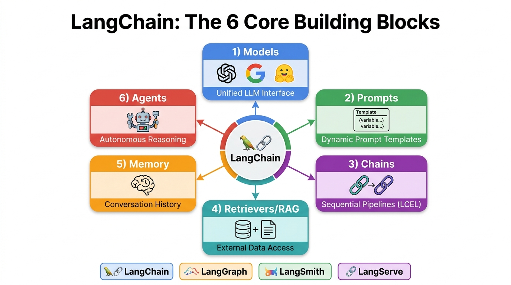
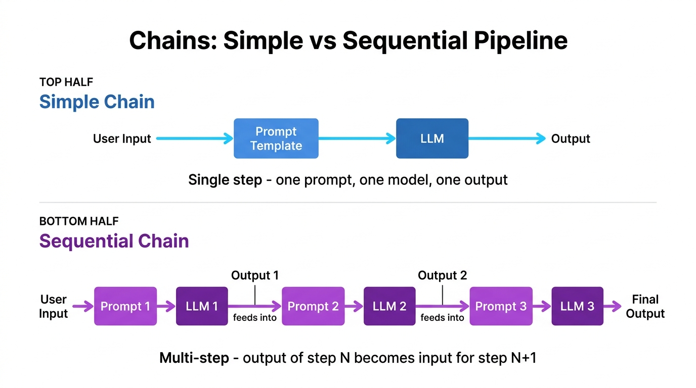
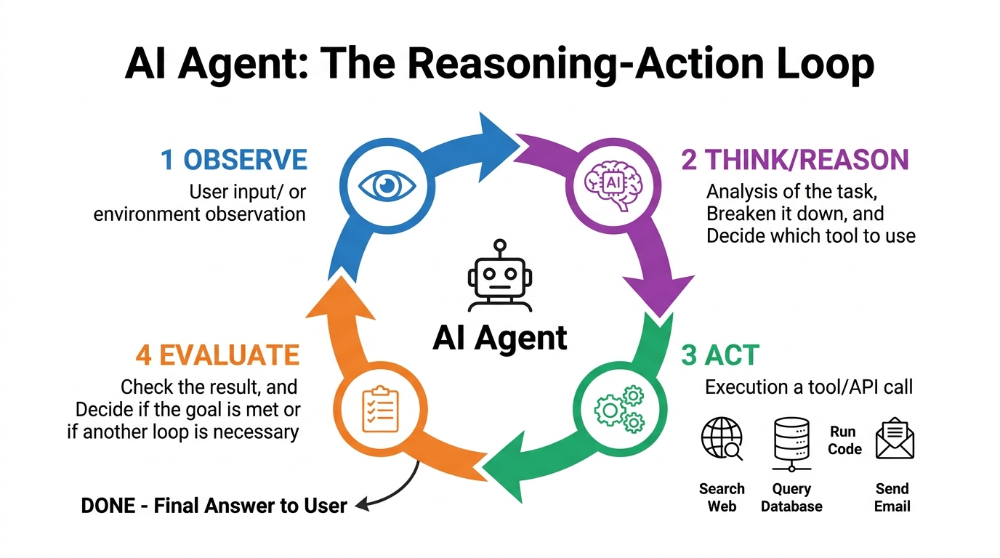
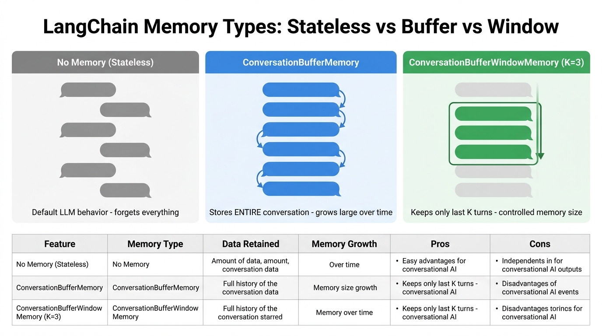

# 🔧 Day 03 — Function Calling, LangChain, Chains, Agents & Memory

> **Zero to Hero Gen AI Course — Phase 01: GenAI Foundations**
>
> 📅 Day 3 of 50 | ⏱️ Estimated Reading Time: 55 minutes
>
> **What you will learn today:** How LLMs connect to the real world through Function Calling, how LangChain orchestrates complex AI applications, and how to build Chains, Agents, and Memory systems. Includes complete runnable code examples.

---

## 📑 Table of Contents

1. [Function Calling — Connecting LLMs to the Real World](#1-function-calling--connecting-llms-to-the-real-world)
2. [Function Calling: The 4-Step Lifecycle](#2-function-calling-the-4-step-lifecycle)
3. [Function Calling: Code Examples](#3-function-calling-code-examples)
4. [What is LangChain?](#4-what-is-langchain)
5. [LangChain: The 6 Core Components](#5-langchain-the-6-core-components)
6. [LangChain Ecosystem Tools](#6-langchain-ecosystem-tools)
7. [LangChain Advantages & Disadvantages](#7-langchain-advantages--disadvantages)
8. [Using OpenAI via LangChain](#8-using-openai-via-langchain)
9. [Prompt Templates — Dynamic Prompt Engineering](#9-prompt-templates--dynamic-prompt-engineering)
10. [Chains — Linking Components Together](#10-chains--linking-components-together)
11. [Agents — Autonomous AI with Tools](#11-agents--autonomous-ai-with-tools)
12. [Memory — Making LLMs Remember](#12-memory--making-llms-remember)
13. [Hugging Face with LangChain — Open-Source Models](#13-hugging-face-with-langchain--open-source-models)
14. [Text Generation Models — Decoder-Only Architecture](#14-text-generation-models--decoder-only-architecture)
15. [LCEL — LangChain Expression Language (Modern Approach)](#15-lcel--langchain-expression-language-modern-approach)
16. [Complete Project: Building a Multi-Tool Agent](#16-complete-project-building-a-multi-tool-agent)
17. [Key Takeaways](#17-key-takeaways)
18. [Practice Questions](#18-practice-questions)

---

## 1. Function Calling — Connecting LLMs to the Real World

### The Fundamental Problem

LLMs are incredibly good at understanding and generating text, but they have critical limitations:

| Limitation | Example |
|-----------|---------|
| **No real-time data** | Can't tell you today's weather or stock price |
| **No actions** | Can't send emails, book flights, or update databases |
| **No computation** | Might miscalculate complex math |
| **No private data** | Can't access your company's internal documents |

### The Solution: Function Calling

> **Function Calling** is a feature that allows an AI model to connect with external tools, APIs, and databases. The AI does **not** run the code itself — instead, it reads the user's prompt and outputs a **structured JSON object** containing the exact arguments needed to execute a specific function in your software.

### Real-World Analogy

Think of it like a **doctor writing a prescription**:
- The **doctor** (LLM) understands what the patient needs
- The doctor **doesn't mix the medicine** themselves
- Instead, they write a **structured prescription** (JSON output) with exact drug names, dosages, and instructions
- The **pharmacist** (your code) reads the prescription and prepares the actual medicine
- The patient gets the result

```
User: "What's the weather in Hyderabad?"

WITHOUT Function Calling:
  LLM: "I don't have access to real-time weather data. As of my
        training cutoff..." ← Useless!

WITH Function Calling:
  LLM: {"function": "get_weather", "arguments": {"city": "Hyderabad"}}
  Your Code: calls weather API → gets "32°C, Sunny"
  LLM: "The weather in Hyderabad is currently 32°C and Sunny! ☀️" ← Useful!
```

---

## 2. Function Calling: The 4-Step Lifecycle


### Step 1: Define the Tools 🔧

You provide the AI with a **structured description** of your functions using a JSON schema. This tells the AI:
- What functions are available
- What each function does (description)
- What parameters each function needs (name, type, required)

```python
# Step 1: Define your tools using JSON schema

tools = [
    {
        "type": "function",
        "function": {
            "name": "get_weather",
            "description": "Get the current weather for a specific city. Call this when the user asks about weather conditions.",
            "parameters": {
                "type": "object",
                "properties": {
                    "city": {
                        "type": "string",
                        "description": "The city name, e.g., 'Hyderabad', 'Mumbai', 'New York'"
                    },
                    "unit": {
                        "type": "string",
                        "enum": ["celsius", "fahrenheit"],
                        "description": "Temperature unit. Default is celsius."
                    }
                },
                "required": ["city"]
            }
        }
    },
    {
        "type": "function",
        "function": {
            "name": "send_email",
            "description": "Send an email to a recipient. Call this when user wants to send an email.",
            "parameters": {
                "type": "object",
                "properties": {
                    "to": {
                        "type": "string",
                        "description": "Recipient email address"
                    },
                    "subject": {
                        "type": "string",
                        "description": "Email subject line"
                    },
                    "body": {
                        "type": "string",
                        "description": "Email body content"
                    }
                },
                "required": ["to", "subject", "body"]
            }
        }
    }
]

print("✅ Tools defined! The AI now knows about:")
for tool in tools:
    func = tool["function"]
    params = list(func["parameters"]["properties"].keys())
    print(f"   🔧 {func['name']}({', '.join(params)})")
    print(f"      Description: {func['description'][:60]}...")
```

### Step 2: AI Decision 🧠

The user sends a prompt. The AI analyzes it and decides:
- **Option A:** This is a normal conversation → generate a text response
- **Option B:** This requires a tool → output a structured JSON payload with extracted parameters

```python
import json

# The AI receives this prompt:
user_prompt = "What's the weather like in Hyderabad right now?"

# The AI DOES NOT generate conversational text.
# Instead, it outputs a structured tool call:
ai_decision = {
    "tool_calls": [
        {
            "id": "call_abc123",
            "type": "function",
            "function": {
                "name": "get_weather",              # Which function to call
                "arguments": json.dumps({
                    "city": "Hyderabad",             # Extracted from user's prompt
                    "unit": "celsius"                # Inferred default
                })
            }
        }
    ]
}

print("USER: \"What's the weather like in Hyderabad right now?\"")
print()
print("AI DECISION: Tool call required!")
print(json.dumps(ai_decision, indent=2))
print()
print("💡 Notice: The AI extracted 'Hyderabad' from the natural language")
print("   prompt and structured it into a proper function argument!")
```

### Step 3: Code Execution ⚙️

Your application server receives the AI's JSON output, executes the actual function, and captures the result.

```python
# Step 3: YOUR CODE executes the function

def get_weather(city: str, unit: str = "celsius") -> dict:
    """Simulate a weather API call"""
    # In real life, this would call an actual weather API
    weather_data = {
        "Hyderabad": {"temp": 32, "condition": "Sunny", "humidity": 65},
        "Mumbai": {"temp": 28, "condition": "Rainy", "humidity": 85},
        "Delhi": {"temp": 38, "condition": "Hot", "humidity": 40},
    }
    
    data = weather_data.get(city, {"temp": 25, "condition": "Unknown", "humidity": 50})
    return {
        "city": city,
        "temperature": f"{data['temp']}°{'C' if unit == 'celsius' else 'F'}",
        "condition": data["condition"],
        "humidity": f"{data['humidity']}%"
    }

# Parse the AI's function call
function_name = "get_weather"
arguments = {"city": "Hyderabad", "unit": "celsius"}

# Execute the actual function
result = get_weather(**arguments)

print("STEP 3: CODE EXECUTION")
print("=" * 50)
print(f"  Function called: {function_name}({arguments})")
print(f"  Result: {json.dumps(result, indent=4)}")
```

### Step 4: Final Synthesis 🗣️

Send the function result back to the AI. The AI reads the raw data and converts it into a natural, human-friendly response.

```python
# Step 4: Send result back to AI for final response

function_result = {
    "city": "Hyderabad",
    "temperature": "32°C",
    "condition": "Sunny",
    "humidity": "65%"
}

# The AI receives this raw data and generates:
final_response = (
    "The weather in Hyderabad is currently **32°C** and **Sunny** ☀️ "
    "with a humidity of **65%**. It's a warm day — stay hydrated! 💧"
)

print("STEP 4: FINAL SYNTHESIS")
print("=" * 50)
print(f"\n  Raw data sent to AI: {json.dumps(function_result)}")
print(f"\n  AI's natural language response:")
print(f"  \"{final_response}\"")
print(f"\n  💡 The AI transformed raw JSON data into a friendly response!")
```

---

## 3. Function Calling: Code Examples

### Complete Function Calling Example (OpenAI)

```python
"""
Complete Function Calling Example with OpenAI API.
This shows the FULL lifecycle in production code.

Requirements: pip install openai
"""

# from openai import OpenAI
# client = OpenAI(api_key="your-api-key")

import json

# ============================================================
# STEP 1: Define your real functions
# ============================================================

def get_weather(city: str, unit: str = "celsius") -> str:
    """Get weather for a city (simulated)"""
    weather_db = {
        "hyderabad": {"temp_c": 32, "condition": "Sunny", "humidity": 65},
        "mumbai": {"temp_c": 28, "condition": "Partly Cloudy", "humidity": 85},
        "new york": {"temp_c": 18, "condition": "Rainy", "humidity": 70},
    }
    data = weather_db.get(city.lower(), {"temp_c": 22, "condition": "Unknown", "humidity": 50})
    temp = data["temp_c"] if unit == "celsius" else (data["temp_c"] * 9/5) + 32
    unit_symbol = "°C" if unit == "celsius" else "°F"
    return json.dumps({
        "city": city,
        "temperature": f"{temp}{unit_symbol}",
        "condition": data["condition"],
        "humidity": f"{data['humidity']}%"
    })

def calculate(expression: str) -> str:
    """Safely evaluate a math expression"""
    try:
        # WARNING: In production, use a safe math parser, not eval()
        result = eval(expression, {"__builtins__": {}}, {})
        return json.dumps({"expression": expression, "result": str(result)})
    except Exception as e:
        return json.dumps({"error": str(e)})

def search_database(query: str, table: str) -> str:
    """Search a database (simulated)"""
    fake_db = {
        "customers": [
            {"name": "Rahul", "city": "Hyderabad", "orders": 15},
            {"name": "Priya", "city": "Mumbai", "orders": 23},
            {"name": "Arun", "city": "Chennai", "orders": 8},
        ]
    }
    results = fake_db.get(table, [])
    return json.dumps({"query": query, "table": table, "results": results})

# ============================================================
# STEP 2: Map function names to actual functions
# ============================================================

available_functions = {
    "get_weather": get_weather,
    "calculate": calculate,
    "search_database": search_database,
}

# ============================================================
# STEP 3: Define tool schemas for the AI
# ============================================================

tools = [
    {
        "type": "function",
        "function": {
            "name": "get_weather",
            "description": "Get current weather for a city",
            "parameters": {
                "type": "object",
                "properties": {
                    "city": {"type": "string", "description": "City name"},
                    "unit": {"type": "string", "enum": ["celsius", "fahrenheit"]}
                },
                "required": ["city"]
            }
        }
    },
    {
        "type": "function",
        "function": {
            "name": "calculate",
            "description": "Evaluate a mathematical expression",
            "parameters": {
                "type": "object",
                "properties": {
                    "expression": {"type": "string", "description": "Math expression like '2+2' or '15*3.14'"}
                },
                "required": ["expression"]
            }
        }
    },
    {
        "type": "function",
        "function": {
            "name": "search_database",
            "description": "Search the company database",
            "parameters": {
                "type": "object",
                "properties": {
                    "query": {"type": "string", "description": "Search query"},
                    "table": {"type": "string", "description": "Table name: 'customers', 'orders', 'products'"}
                },
                "required": ["query", "table"]
            }
        }
    }
]

# ============================================================
# STEP 4: The complete lifecycle (simulated)
# ============================================================

def simulate_function_calling(user_message):
    """Simulate the complete function calling lifecycle"""
    print(f"\n{'='*60}")
    print(f"USER: \"{user_message}\"")
    print(f"{'='*60}")
    
    # In real code, you'd send this to the OpenAI API:
    # response = client.chat.completions.create(
    #     model="gpt-4o",
    #     messages=[{"role": "user", "content": user_message}],
    #     tools=tools,
    #     tool_choice="auto"
    # )
    
    # Simulate AI deciding which function to call
    if "weather" in user_message.lower():
        # Extract city from the message
        for city in ["Hyderabad", "Mumbai", "New York"]:
            if city.lower() in user_message.lower():
                func_name = "get_weather"
                func_args = {"city": city, "unit": "celsius"}
                break
        else:
            func_name = None
            func_args = {}
    elif "calculate" in user_message.lower() or any(c in user_message for c in "+-*/"):
        func_name = "calculate"
        func_args = {"expression": "15 * 3.14"}
    elif "database" in user_message.lower() or "customers" in user_message.lower():
        func_name = "search_database"
        func_args = {"query": user_message, "table": "customers"}
    else:
        print("  AI: (Normal text response — no function call needed)")
        return

    print(f"\n  📤 AI Decision: Call '{func_name}' with args: {func_args}")
    
    # Execute the function
    function_to_call = available_functions[func_name]
    result = function_to_call(**func_args)
    print(f"  ⚙️  Function Result: {result}")
    
    # AI synthesizes final response
    print(f"  🗣️  AI Final Response: (Would generate natural language from result)")

# Test it!
simulate_function_calling("What's the weather in Hyderabad?")
simulate_function_calling("Show me all customers from the database")
simulate_function_calling("Calculate 15 times pi")
```

### Primary Use Cases of Function Calling

| Use Case | What Happens | Example |
|----------|-------------|---------|
| **AI Agents** | LLM takes real-world actions | Book a calendar appointment, send an email |
| **Live Data Retrieval** | Fetch real-time information | Current weather, stock prices, shipping status |
| **Database Interaction** | Convert natural language to DB queries | "Show me last month's top customers" → SQL |
| **Structured Data Extraction** | Convert unstructured text to JSON | Invoice text → `{amount: 500, date: "2024-01-15"}` |

---

## 4. What is LangChain?



### Definition

> **LangChain** is an open-source development framework (available in Python and JavaScript) designed to simplify building applications powered by LLMs. It is **not** an AI model — it's the **orchestration layer** or "plumbing" that connects raw LLMs to external data sources, APIs, and workflows.

### The Core Problem It Solves

```
RAW LLM (like GPT-4 alone):
├── ❌ Stateless — no memory between conversations
├── ❌ No external data — stuck at training cutoff
├── ❌ No actions — can't send emails, query DBs
├── ❌ No private data — can't access your documents
└── ❌ Single step — can't do multi-step reasoning

LLM + LANGCHAIN:
├── ✅ Memory — remembers conversation history
├── ✅ RAG — accesses your documents & databases
├── ✅ Tools — sends emails, queries APIs, runs code
├── ✅ Private data — connects to your vector stores
└── ✅ Agents — multi-step autonomous reasoning
```

### Real-World Analogy

Think of LangChain as the **operating system** for AI applications:
- The **LLM** is like a powerful CPU — great at processing but can't do much alone
- **LangChain** is like the OS — it connects the CPU to storage (memory), peripherals (tools), file system (documents), and manages workflows (chains)
- Without the OS, the CPU just sits there. With the OS, it becomes a full computer.

---

## 5. LangChain: The 6 Core Components

### Component 1: Models — Unified LLM Interface

```python
"""
LangChain Models: Switch between ANY LLM provider with minimal code changes.
"""

# ============================================================
# Using OpenAI
# ============================================================
# from langchain_openai import ChatOpenAI
# 
# llm = ChatOpenAI(
#     model="gpt-4o",
#     temperature=0.7,
#     api_key="your-openai-key"
# )
# response = llm.invoke("What is AI?")
# print(response.content)

# ============================================================
# Switch to Google Gemini — SAME interface!
# ============================================================
# from langchain_google_genai import ChatGoogleGenerativeAI
#
# llm = ChatGoogleGenerativeAI(
#     model="gemini-1.5-pro",
#     temperature=0.7,
#     google_api_key="your-google-key"
# )
# response = llm.invoke("What is AI?")
# print(response.content)

# ============================================================
# Switch to Anthropic Claude — SAME interface!
# ============================================================
# from langchain_anthropic import ChatAnthropic
#
# llm = ChatAnthropic(
#     model="claude-3-opus-20240229",
#     temperature=0.7,
#     anthropic_api_key="your-anthropic-key"
# )
# response = llm.invoke("What is AI?")
# print(response.content)

print("LangChain Model Interface — Provider Flexibility")
print("=" * 55)
print()
print("  Same code structure, different providers:")
print("  ┌─────────────────────────────────────────┐")
print("  │  llm = ChatOpenAI(model='gpt-4o')       │ ← OpenAI")
print("  │  llm = ChatGoogleGenerativeAI(...)       │ ← Google")
print("  │  llm = ChatAnthropic(...)                │ ← Anthropic")
print("  │                                          │")
print("  │  response = llm.invoke('What is AI?')    │ ← Same method!")
print("  │  print(response.content)                 │ ← Same output!")
print("  └─────────────────────────────────────────┘")
print()
print("  💡 Switch providers by changing ONE line of code!")
```

### Component 2: Prompts — Dynamic Prompt Templates

```python
"""
LangChain Prompt Templates: Dynamic, reusable, structured prompts.
Instead of hardcoding strings, use templates with variables.
"""

# from langchain_core.prompts import PromptTemplate, ChatPromptTemplate

# ============================================================
# BASIC PROMPT TEMPLATE
# ============================================================
# Without LangChain (hardcoded):
topic = "Machine Learning"
prompt_hardcoded = f"Explain {topic} in simple terms for a beginner."
# Problem: Not reusable, no structure, no validation

# With LangChain (template):
# template = PromptTemplate(
#     input_variables=["topic", "audience"],
#     template="Explain {topic} in simple terms for {audience}."
# )
# prompt = template.format(topic="Machine Learning", audience="a 10-year-old")

# ============================================================
# CHAT PROMPT TEMPLATE (for chat models)
# ============================================================
# chat_template = ChatPromptTemplate.from_messages([
#     ("system", "You are an expert {role}. Always explain with examples."),
#     ("user", "{question}")
# ])
# 
# messages = chat_template.format_messages(
#     role="Python tutor",
#     question="What are list comprehensions?"
# )
# response = llm.invoke(messages)

print("PROMPT TEMPLATES — Dynamic Variable Injection")
print("=" * 55)

# Simulating template behavior
class SimpleTemplate:
    def __init__(self, template_str, variables):
        self.template = template_str
        self.variables = variables
    
    def format(self, **kwargs):
        result = self.template
        for key, value in kwargs.items():
            result = result.replace(f"{{{key}}}", str(value))
        return result

# Create reusable templates
explain_template = SimpleTemplate(
    template_str="Explain {topic} in {style} for {audience}.",
    variables=["topic", "style", "audience"]
)

# Use the SAME template with different variables
prompts = [
    explain_template.format(topic="Neural Networks", style="simple terms", audience="beginners"),
    explain_template.format(topic="Quantum Computing", style="an analogy", audience="kids"),
    explain_template.format(topic="Blockchain", style="3 bullet points", audience="executives"),
]

for i, prompt in enumerate(prompts, 1):
    print(f"\n  Prompt {i}: \"{prompt}\"")

print("\n  💡 ONE template, THREE different prompts — reusable and clean!")
```

### Component 3: Chains — Pipelines

See [Section 10](#10-chains--linking-components-together) for detailed coverage.

### Component 4: Retrievers / RAG

Covered in future days (RAG Part 1 & 2).

### Component 5: Memory

See [Section 12](#12-memory--making-llms-remember) for detailed coverage.

### Component 6: Agents

See [Section 11](#11-agents--autonomous-ai-with-tools) for detailed coverage.

---

## 6. LangChain Ecosystem Tools

| Tool | What It Is | Purpose |
|------|-----------|---------|
| **LangChain** | The core open-source library | Standard interfaces, building blocks, chains |
| **LangGraph** | Agentic engine | Build complex, stateful, multi-actor agent systems |
| **LangSmith** | Developer platform (commercial) | Testing, debugging, tracing, evaluating LLM workflows |
| **LangServe** | Deployment utility | Turn chains into production REST APIs |

```
Your Application Stack:

┌──────────────────────────────────────────┐
│              YOUR AI APP                  │
│                                           │
│  ┌─────────┐  ┌──────────┐  ┌─────────┐ │
│  │LangChain│  │ LangGraph│  │LangSmith│ │
│  │ (build) │  │ (agents) │  │ (debug) │ │
│  └────┬────┘  └────┬─────┘  └────┬────┘ │
│       └──────┬─────┘             │       │
│              ↓                   ↓       │
│  ┌──────────────────┐  ┌─────────────┐  │
│  │   LangServe      │  │  Monitoring │  │
│  │   (deploy API)   │  │  & Tracing  │  │
│  └──────────────────┘  └─────────────┘  │
└──────────────────────────────────────────┘
```

---

## 7. LangChain Advantages & Disadvantages

### ✅ Advantages

| Advantage | Detail |
|-----------|--------|
| **Accelerated Development** | Pre-built modules and templates speed up building LLM apps |
| **Ecosystem & Integrations** | Largest library of integrations — vector DBs, APIs, tools |
| **Flexibility** | Swap OpenAI for Hugging Face with minimal code changes |
| **Community Support** | Extensive docs, tutorials, large active community |

### ❌ Disadvantages

| Disadvantage | Detail |
|-------------|--------|
| **Steep Learning Curve** | Framework is comprehensive but can overwhelm beginners |
| **Abstraction Overhead** | Hiding complexity makes debugging harder |
| **Overkill for Simple Tasks** | A basic chatbot doesn't need a full framework |
| **Scalability Concerns** | Custom orchestration may perform better at scale |

### When to Use LangChain vs When NOT To

```python
print("WHEN TO USE LANGCHAIN")
print("=" * 55)

decisions = {
    "✅ USE LangChain": [
        "Complex multi-step workflows (chains, agents)",
        "You need RAG (document retrieval)",
        "You want to switch LLM providers easily",
        "You need conversation memory",
        "Rapid prototyping and experimentation",
    ],
    "❌ DON'T USE LangChain": [
        "Simple single API call to OpenAI",
        "You need maximum control over every detail",
        "High-performance production at massive scale",
        "You only use one LLM provider permanently",
        "Minimal dependencies are critical",
    ],
    "🤔 CONSIDER Alternatives": [
        "LlamaIndex → specialized for RAG/data pipelines",
        "Haystack → enterprise search and Q&A",
        "Semantic Kernel → Microsoft's orchestration framework",
        "Direct API calls → maximum simplicity",
    ]
}

for category, items in decisions.items():
    print(f"\n  {category}:")
    for item in items:
        print(f"    • {item}")
```

---

## 8. Using OpenAI via LangChain

```python
"""
Using OpenAI through LangChain.
This shows how LangChain wraps the raw API into a cleaner interface.

Requirements:
  pip install langchain langchain-openai
"""

# ============================================================
# METHOD 1: Direct OpenAI (without LangChain)
# ============================================================
# from openai import OpenAI
# 
# client = OpenAI(api_key="your-key")
# response = client.chat.completions.create(
#     model="gpt-4o",
#     messages=[
#         {"role": "system", "content": "You are a helpful assistant."},
#         {"role": "user", "content": "What is Python?"}
#     ],
#     temperature=0.7,
#     max_tokens=500
# )
# print(response.choices[0].message.content)

# ============================================================
# METHOD 2: OpenAI via LangChain (cleaner, more features)
# ============================================================
# from langchain_openai import ChatOpenAI
# from langchain_core.messages import HumanMessage, SystemMessage
# 
# # Initialize the model
# llm = ChatOpenAI(
#     model="gpt-4o",
#     temperature=0.7,
#     max_tokens=500,
#     api_key="your-key"
# )
# 
# # Simple invocation
# response = llm.invoke("What is Python?")
# print(response.content)
# 
# # With system message
# messages = [
#     SystemMessage(content="You are an expert Python tutor."),
#     HumanMessage(content="Explain decorators in Python")
# ]
# response = llm.invoke(messages)
# print(response.content)

print("OPENAI VIA LANGCHAIN — Comparison")
print("=" * 55)
print()
print("  Direct OpenAI API:         ~10 lines of boilerplate")
print("  LangChain OpenAI wrapper:   ~3 lines")
print()
print("  But the REAL power is combining it with:")
print("    • Prompt Templates → Dynamic prompts")
print("    • Chains → Multi-step workflows")
print("    • Memory → Conversation history")
print("    • Tools → Function calling")
print()
print("  LangChain isn't just a wrapper — it's an orchestrator!")
```

---

## 9. Prompt Templates — Dynamic Prompt Engineering

```python
"""
LangChain Prompt Templates — Complete Guide.
Templates turn hardcoded strings into reusable, dynamic components.
"""

# from langchain_core.prompts import (
#     PromptTemplate,
#     ChatPromptTemplate,
#     FewShotPromptTemplate
# )

# ============================================================
# TYPE 1: Simple PromptTemplate
# ============================================================
# template = PromptTemplate.from_template(
#     "You are a {language} expert. Explain {concept} with a code example."
# )
# prompt = template.format(language="Python", concept="list comprehension")

# ============================================================
# TYPE 2: ChatPromptTemplate (multi-message)
# ============================================================
# chat_template = ChatPromptTemplate.from_messages([
#     ("system", "You are a {role}. Be concise and give examples."),
#     ("human", "{question}")
# ])
# messages = chat_template.format_messages(
#     role="senior data scientist",
#     question="What is overfitting?"
# )

# ============================================================
# TYPE 3: Few-Shot PromptTemplate (with examples)
# ============================================================
# examples = [
#     {"input": "happy", "output": "sad"},
#     {"input": "hot", "output": "cold"},
#     {"input": "big", "output": "small"},
# ]
# 
# example_template = PromptTemplate(
#     input_variables=["input", "output"],
#     template="Input: {input}\nOutput: {output}"
# )
# 
# few_shot_template = FewShotPromptTemplate(
#     examples=examples,
#     example_prompt=example_template,
#     prefix="Give the antonym of every input.",
#     suffix="Input: {user_input}\nOutput:",
#     input_variables=["user_input"]
# )
# 
# prompt = few_shot_template.format(user_input="bright")
# # Output includes the examples + the new input

# Demonstrate the concept
print("PROMPT TEMPLATE TYPES")
print("=" * 60)

# Simulated outputs
print("\n📝 TYPE 1: Simple Template")
print("   Template: 'Explain {concept} in {language}'")
print("   Result:   'Explain decorators in Python'")

print("\n💬 TYPE 2: Chat Template")
print("   System:   'You are a {role}. Be concise.'")
print("   User:     '{question}'")
print("   Result:   [SystemMessage, HumanMessage]")

print("\n📚 TYPE 3: Few-Shot Template")
print("   Examples: happy→sad, hot→cold, big→small")
print("   Input:    'bright'")
print("   Result:   'Give the antonym: ... Input: bright\\nOutput:'")
print("   AI says:  'dark'")

print("\n🔑 WHY TEMPLATES MATTER:")
print("   • Reusable across different inputs")
print("   • Separates prompt logic from data")
print("   • Easy to test and version control")
print("   • Can be serialized/loaded from files")
```

---

## 10. Chains — Linking Components Together



### What is a Chain?

> Using an LLM in isolation is fine for simple applications, but complex applications require **chaining** LLMs — either with each other or with other components. A Chain is a pipeline that links multiple steps together.

### 10.1 Simple Chain (Single Step)

A simple chain connects ONE prompt template to ONE LLM:

```python
"""
Simple Chain: Prompt Template → LLM → Output
One step, one model call.
"""

# from langchain_openai import ChatOpenAI
# from langchain_core.prompts import ChatPromptTemplate
# from langchain_core.output_parsers import StrOutputParser
# 
# # Define components
# prompt = ChatPromptTemplate.from_template(
#     "Explain {topic} in 3 sentences for a beginner."
# )
# model = ChatOpenAI(model="gpt-4o")
# output_parser = StrOutputParser()
# 
# # Create chain using LCEL (pipe operator)
# chain = prompt | model | output_parser
# 
# # Run the chain
# result = chain.invoke({"topic": "Machine Learning"})
# print(result)

print("SIMPLE CHAIN")
print("=" * 50)
print()
print("  Flow: User Input → Prompt Template → LLM → Output")
print()
print("  Code (LCEL syntax):")
print("    chain = prompt | model | output_parser")
print("    result = chain.invoke({'topic': 'ML'})")
print()
print("  Example:")
print("    Input:  {'topic': 'Machine Learning'}")
print("    Output: 'Machine Learning is a subset of AI...'")
```

### 10.2 Sequential Chain (Multi-Step Pipeline)

A sequential chain links MULTIPLE steps where the output of one step feeds into the next:

```python
"""
Sequential Chain: Step 1 → Step 2 → Step 3
Output of each step becomes input for the next.

Example: Research Assistant Pipeline
  Step 1: Generate a research summary on a topic
  Step 2: Extract key points from the summary
  Step 3: Write a tweet thread from the key points
"""

# from langchain_openai import ChatOpenAI
# from langchain_core.prompts import ChatPromptTemplate
# from langchain_core.output_parsers import StrOutputParser
# 
# model = ChatOpenAI(model="gpt-4o")
# parser = StrOutputParser()
# 
# # Step 1: Research summary
# prompt1 = ChatPromptTemplate.from_template(
#     "Write a 200-word research summary about {topic}."
# )
# chain1 = prompt1 | model | parser
# 
# # Step 2: Extract key points
# prompt2 = ChatPromptTemplate.from_template(
#     "Extract 5 key points from this text:\n{summary}"
# )
# chain2 = prompt2 | model | parser
# 
# # Step 3: Generate tweet thread
# prompt3 = ChatPromptTemplate.from_template(
#     "Convert these key points into a Twitter thread (5 tweets):\n{key_points}"
# )
# chain3 = prompt3 | model | parser
# 
# # Sequential execution
# summary = chain1.invoke({"topic": "Transformer Architecture"})
# key_points = chain2.invoke({"summary": summary})
# tweets = chain3.invoke({"key_points": key_points})
# print(tweets)

# Demonstrating the concept
print("SEQUENTIAL CHAIN — Multi-Step Pipeline")
print("=" * 55)
print()
print("  Step 1: 'Research {topic}' → Summary (200 words)")
print("     ↓ (summary feeds into step 2)")
print("  Step 2: 'Extract key points from {summary}' → 5 Points")
print("     ↓ (points feed into step 3)")
print("  Step 3: 'Write tweets from {key_points}' → Tweet Thread")
print()
print("  Each step is a separate LLM call, but they're CONNECTED!")
print()
print("  Real-world use cases:")
print("    • Research → Summarize → Translate")
print("    • Code → Review → Improve")
print("    • Data → Analyze → Report → Email")
```

---

## 11. Agents — Autonomous AI with Tools



### What is an AI Agent?

> An **AI Agent** is a sophisticated software program powered by AI that can **autonomously** perform tasks to achieve specific goals. Unlike standard generative AI which waits for a prompt and produces a single response, an agent is designed to **plan, reason, and take action** in its environment.

### Key Capabilities

| Capability | Description | Example |
|-----------|-------------|---------|
| **Autonomy** | Manages multi-step workflows without constant human intervention | Plans a trip: searches flights, hotels, restaurants |
| **Reasoning & Planning** | Breaks down complex objectives into actionable steps | "Analyze our sales data" → load data → calculate metrics → generate report |
| **Tool Interaction** | Uses external tools — web search, code execution, APIs | Searches Google, runs Python code, queries databases |
| **Decision Making** | Evaluates results and adjusts approach if needed | If a search returns no results, tries a different query |

### The Agent Loop (ReAct Pattern)

```
1. OBSERVE → Read user input / environment state
2. THINK   → Reason about what needs to happen next
3. ACT     → Execute a tool (search, calculate, API call)
4. EVALUATE→ Check: Did this achieve the goal?
                ├── YES → Return final answer to user
                └── NO  → Loop back to OBSERVE with new info
```

### Agent vs Chain — Key Difference

| Feature | Chain | Agent |
|---------|-------|-------|
| **Steps** | Fixed, predefined | Dynamic, decided at runtime |
| **Flow** | Always runs Step 1 → 2 → 3 | AI decides which steps to take |
| **Tools** | Not typically tool-aware | Picks and uses tools as needed |
| **Flexibility** | Rigid pipeline | Adaptive, handles unexpected inputs |
| **Analogy** | Assembly line (fixed sequence) | Human employee (thinks and decides) |

```python
"""
LangChain Agent Example (Conceptual).
An agent that can search the web, do math, and query a database.

Requirements: pip install langchain langchain-openai
"""

# from langchain_openai import ChatOpenAI
# from langchain.agents import create_tool_calling_agent, AgentExecutor
# from langchain_core.prompts import ChatPromptTemplate
# from langchain_core.tools import tool
# 
# # Define tools the agent can use
# @tool
# def search_web(query: str) -> str:
#     """Search the web for current information."""
#     # In real life: call Google/Bing search API
#     return f"Search results for '{query}': [simulated results]"
# 
# @tool
# def calculator(expression: str) -> str:
#     """Evaluate a mathematical expression."""
#     return str(eval(expression))
# 
# @tool
# def get_date() -> str:
#     """Get today's date."""
#     from datetime import date
#     return str(date.today())
# 
# # Create the agent
# llm = ChatOpenAI(model="gpt-4o")
# tools = [search_web, calculator, get_date]
# 
# prompt = ChatPromptTemplate.from_messages([
#     ("system", "You are a helpful assistant with access to tools."),
#     ("human", "{input}"),
#     ("placeholder", "{agent_scratchpad}")
# ])
# 
# agent = create_tool_calling_agent(llm, tools, prompt)
# agent_executor = AgentExecutor(agent=agent, tools=tools, verbose=True)
# 
# # Run the agent
# result = agent_executor.invoke({
#     "input": "What's today's date? Also calculate 15% tip on a $85 bill."
# })

# Simulated agent execution trace
print("AGENT EXECUTION TRACE")
print("=" * 60)
print()
print("  User: 'What is today? Calculate 15% tip on $85 bill.'")
print()
print("  🧠 THINK: I need to: 1) Get today's date, 2) Calculate tip")
print()
print("  🔧 ACT #1: Call get_date()")
print("     Result: '2026-10-01'")
print()
print("  🧠 THINK: Got the date. Now I need to calculate the tip.")
print()
print("  🔧 ACT #2: Call calculator('85 * 0.15')")
print("     Result: '12.75'")
print()
print("  🧠 THINK: I have both answers. I can respond now.")
print()
print("  ✅ FINAL ANSWER:")
print("     'Today is October 1, 2026. A 15% tip on an $85 bill")
print("      would be $12.75, making the total $97.75.'")
print()
print("  💡 The agent made TWO tool calls autonomously!")
print("     It decided WHICH tools to use and in what ORDER.")
```

---

## 12. Memory — Making LLMs Remember



### The Stateless Problem

> By default, LLMs are **stateless** — they treat every new query as a completely fresh start. They don't remember anything from previous interactions.

```
WITHOUT MEMORY:
  User: "My name is Srinu."
  AI:   "Nice to meet you, Srinu!"
  
  User: "What's my name?"
  AI:   "I don't know your name. You haven't told me." ← FORGOT!

WITH MEMORY:
  User: "My name is Srinu."
  AI:   "Nice to meet you, Srinu!"
  
  User: "What's my name?"
  AI:   "Your name is Srinu!" ← REMEMBERS! ✅
```

### How Memory Works in LangChain

Memory works by **injecting conversation history** into each new prompt:

```
WITHOUT memory, the LLM sees:
  messages = [
      {"role": "user", "content": "What's my name?"}
  ]
  → AI has no context!

WITH memory, the LLM sees:
  messages = [
      {"role": "user", "content": "My name is Srinu."},       ← INJECTED
      {"role": "assistant", "content": "Nice to meet you!"},   ← INJECTED
      {"role": "user", "content": "What's my name?"}           ← Current
  ]
  → AI has full context!
```

### 12.1 ConversationBufferMemory — Remember Everything

Stores the **entire** conversation history. Every single message is kept and injected into the next prompt.

```python
"""
ConversationBufferMemory — Stores ALL conversation history.
"""

# from langchain.memory import ConversationBufferMemory
# from langchain.chains import ConversationChain
# from langchain_openai import ChatOpenAI
# 
# llm = ChatOpenAI(model="gpt-4o", temperature=0.7)
# memory = ConversationBufferMemory()
# conversation = ConversationChain(llm=llm, memory=memory, verbose=True)
# 
# # Multi-turn conversation
# conversation.predict(input="Hi! My name is Srinu.")
# conversation.predict(input="I'm learning about Generative AI.")
# conversation.predict(input="What's my name and what am I learning?")
# # → "Your name is Srinu and you're learning about Generative AI!"

# Simulated Buffer Memory
class SimpleBufferMemory:
    def __init__(self):
        self.history = []
    
    def add_message(self, role, content):
        self.history.append({"role": role, "content": content})
    
    def get_context(self):
        return "\n".join([f"{m['role']}: {m['content']}" for m in self.history])
    
    def token_count(self):
        return sum(len(m['content'].split()) for m in self.history)

memory = SimpleBufferMemory()

# Simulate a conversation
turns = [
    ("User", "Hi! My name is Srinu."),
    ("AI", "Nice to meet you, Srinu! How can I help?"),
    ("User", "I'm learning about Generative AI."),
    ("AI", "That's great! GenAI is a fascinating field. What specifically interests you?"),
    ("User", "I want to learn about LangChain."),
    ("AI", "LangChain is an excellent framework for building LLM applications!"),
    ("User", "What's my name and what am I learning?"),
]

print("CONVERSATION BUFFER MEMORY — Full History")
print("=" * 60)

for role, content in turns:
    memory.add_message(role, content)
    print(f"  {role}: {content}")

print(f"\n  📊 Memory Stats:")
print(f"     Messages stored: {len(memory.history)}")
print(f"     Approximate tokens: ~{memory.token_count()}")
print(f"\n  ⚠️  PROBLEM: Memory grows with EVERY turn!")
print(f"     After 100 turns: ~5000+ tokens consumed")
print(f"     After 1000 turns: 50000+ tokens → context window overflow!")
```

### 12.2 ConversationBufferWindowMemory — Sliding Window

Stores only the **last K interactions**, creating a sliding window that prevents unbounded memory growth.

```python
"""
ConversationBufferWindowMemory — Keeps only the last K turns.
"""

# from langchain.memory import ConversationBufferWindowMemory
# 
# # Only remember the last 3 exchanges
# memory = ConversationBufferWindowMemory(k=3)
# conversation = ConversationChain(llm=llm, memory=memory, verbose=True)

class SimpleWindowMemory:
    def __init__(self, k=3):
        self.k = k
        self.history = []
    
    def add_message(self, role, content):
        self.history.append({"role": role, "content": content})
        # Keep only last K pairs (K*2 messages for user+AI pairs)
        max_messages = self.k * 2
        if len(self.history) > max_messages:
            self.history = self.history[-max_messages:]
    
    def get_context(self):
        return "\n".join([f"{m['role']}: {m['content']}" for m in self.history])

# Simulate with K=2 (remember last 2 exchanges)
memory = SimpleWindowMemory(k=2)

all_turns = [
    ("User", "My name is Srinu."),
    ("AI", "Nice to meet you, Srinu!"),
    ("User", "I live in Hyderabad."),
    ("AI", "Hyderabad is a great tech city!"),
    ("User", "I love Python programming."),
    ("AI", "Python is excellent for AI/ML!"),
    ("User", "What's my name and where do I live?"),
]

print("CONVERSATION BUFFER WINDOW MEMORY (K=2)")
print("=" * 60)
print("  Only keeps the last 2 user-AI exchanges\n")

for i, (role, content) in enumerate(all_turns):
    memory.add_message(role, content)
    
    if role == "User" and i > 0:
        print(f"\n  --- Memory window at turn {i//2 + 1} ---")
        print(f"  {memory.get_context()}")
        print(f"  Messages in memory: {len(memory.history)}")

print("\n\n  ❓ User asks: 'What's my name and where do I live?'")
print("  🧠 AI can see: last 2 exchanges (Python + the question)")
print("  ❌ AI CANNOT see: name (Srinu) or city (Hyderabad)")
print("     → Those were more than 2 turns ago, they've been DROPPED!")
print()
print("  💡 Trade-off:")
print("     Buffer Memory:  Perfect recall, but grows infinitely")
print("     Window Memory:  Fixed size, but forgets old context")
```

### Memory Types Comparison

| Memory Type | Stores | Size | Recall | Use Case |
|------------|--------|------|--------|----------|
| **No Memory** | Nothing | 0 | None | Simple Q&A |
| **ConversationBufferMemory** | Everything | Grows | Perfect | Short conversations |
| **ConversationBufferWindowMemory** | Last K turns | Fixed | Recent only | Long-running chatbots |
| **ConversationSummaryMemory** | Summary | Small | Gist only | Very long conversations |
| **ConversationTokenBufferMemory** | Last N tokens | Fixed | Token-based | Token budget control |
| **VectorStoreMemory** | Embeddings | Large | Semantic search | Knowledge-heavy apps |

---

## 13. Hugging Face with LangChain — Open-Source Models

### What is Hugging Face?

> **Hugging Face** is the largest open-source platform for machine learning models. Think of it as the **"GitHub for AI models"** — it hosts thousands of pre-trained models you can use for free.

### Why Use Hugging Face?

| Feature | OpenAI (Closed) | Hugging Face (Open) |
|---------|-----------------|---------------------|
| **Cost** | Pay per API call | Free (run locally) |
| **Privacy** | Data sent to cloud | Data stays local |
| **Customization** | Limited fine-tuning | Full control |
| **Model variety** | Few models | 500,000+ models |
| **Internet required** | Yes (API) | No (run offline) |

```python
"""
Using Hugging Face Models with LangChain.

Requirements:
  pip install langchain-huggingface transformers torch
"""

# ============================================================
# METHOD 1: Hugging Face Hub (API — cloud)
# ============================================================
# from langchain_huggingface import HuggingFaceEndpoint
# 
# llm = HuggingFaceEndpoint(
#     repo_id="mistralai/Mistral-7B-Instruct-v0.3",
#     huggingfacehub_api_token="your-hf-token",
#     temperature=0.7,
#     max_new_tokens=512,
# )
# response = llm.invoke("Explain quantum computing in simple terms.")
# print(response)

# ============================================================
# METHOD 2: Hugging Face Pipeline (Local — on your machine)
# ============================================================
# from langchain_huggingface import HuggingFacePipeline
# from transformers import pipeline
# 
# # Load model locally (downloads once, runs offline)
# pipe = pipeline(
#     "text-generation",
#     model="TinyLlama/TinyLlama-1.1B-Chat-v1.0",
#     max_new_tokens=256,
#     temperature=0.7,
# )
# llm = HuggingFacePipeline(pipeline=pipe)
# 
# response = llm.invoke("What is machine learning?")
# print(response)

print("HUGGING FACE WITH LANGCHAIN")
print("=" * 55)
print()
print("  Option 1: HuggingFace Hub (Cloud API)")
print("    ├── Uses Hugging Face's servers")
print("    ├── Needs API token + internet")
print("    └── Good for large models (70B+)")
print()
print("  Option 2: HuggingFace Pipeline (Local)")
print("    ├── Runs on YOUR machine")
print("    ├── Downloads model once, runs offline")
print("    ├── Full privacy — data never leaves your PC")
print("    └── Limited by your GPU/RAM")
print()
print("  Popular Open-Source Models:")
print("    • mistralai/Mistral-7B-Instruct-v0.3")
print("    • meta-llama/Meta-Llama-3-8B-Instruct")
print("    • TinyLlama/TinyLlama-1.1B-Chat-v1.0")
print("    • google/gemma-2-2b-it")
print("    • microsoft/phi-3-mini-128k-instruct")
```

---

## 14. Text Generation Models — Decoder-Only Architecture

### The Three Transformer Variants

| Variant | Architecture | Training Objective | Example Models | Best For |
|---------|-------------|-------------------|----------------|----------|
| **Encoder-Only** | Encoder only | Masked Language Modeling | BERT, RoBERTa | Understanding (classification, NER) |
| **Decoder-Only** | Decoder only | Next Token Prediction | GPT, LLaMA, Mistral | **Text generation** |
| **Encoder-Decoder** | Both | Seq2Seq | T5, BART | Translation, summarization |

### Why Decoder-Only Dominates Text Generation

```
DECODER-ONLY MODEL (GPT, LLaMA, etc.):

Input:  "The weather today is"
         ↓ ↓ ↓ ↓
        [Decoder Layers with Causal (Masked) Self-Attention]
         ↓ ↓ ↓ ↓
Output: "The weather today is sunny"
                                  ↑
                          Next token predicted!

Key Feature: CAUSAL MASKING
  Each token can ONLY attend to tokens BEFORE it (left context).
  This makes it naturally suited for generation — it generates
  one token at a time, left to right, just like writing a sentence.
```

```python
# Why Decoder-Only models are the default for GenAI

print("TRANSFORMER VARIANTS FOR TEXT GENERATION")
print("=" * 60)

architectures = {
    "Encoder-Only (BERT)": {
        "sees": "Bidirectional (sees ALL tokens, both left and right)",
        "generates": "❌ Not designed for text generation",
        "best_for": "Classification, Named Entity Recognition, Embeddings",
        "models": "BERT, RoBERTa, DistilBERT, ALBERT"
    },
    "Decoder-Only (GPT)": {
        "sees": "Left-to-right only (causal masking)",
        "generates": "✅ Generates text one token at a time",
        "best_for": "Text generation, chatbots, code generation",
        "models": "GPT-4, LLaMA, Mistral, Claude, Gemini"
    },
    "Encoder-Decoder (T5)": {
        "sees": "Encoder sees full input, Decoder generates output",
        "generates": "✅ Generates text (conditioned on input)",
        "best_for": "Translation, summarization, question answering",
        "models": "T5, BART, mBART, FLAN-T5"
    }
}

for arch, details in architectures.items():
    print(f"\n  📐 {arch}")
    for key, value in details.items():
        print(f"     {key:>10}: {value}")

print("\n\n  🔑 KEY INSIGHT: Almost ALL modern LLMs (GPT-4, LLaMA, Mistral,")
print("     Claude, Gemini) are DECODER-ONLY models. This is the dominant")
print("     architecture for generative AI in 2024-2025.")
```

---

## 15. LCEL — LangChain Expression Language (Modern Approach)

### What is LCEL?

**LCEL** (LangChain Expression Language) is the modern way to build chains in LangChain using the **pipe operator `|`**. It replaces the older `LLMChain`, `SimpleSequentialChain`, etc.

```python
"""
LCEL: The Modern Way to Build LangChain Pipelines.
Uses the pipe (|) operator to chain components.
"""

# OLD WAY (deprecated):
# chain = LLMChain(llm=model, prompt=template)
# result = chain.run(topic="AI")

# NEW WAY (LCEL):
# chain = template | model | output_parser
# result = chain.invoke({"topic": "AI"})

# from langchain_openai import ChatOpenAI
# from langchain_core.prompts import ChatPromptTemplate
# from langchain_core.output_parsers import StrOutputParser
# 
# # Build a chain with LCEL
# prompt = ChatPromptTemplate.from_template("Tell me a joke about {topic}")
# model = ChatOpenAI(model="gpt-4o")
# parser = StrOutputParser()
# 
# # The pipe operator chains them together
# chain = prompt | model | parser
# 
# # Invoke the chain
# result = chain.invoke({"topic": "programming"})
# print(result)

# How LCEL works conceptually
print("LCEL — LANGCHAIN EXPRESSION LANGUAGE")
print("=" * 55)
print()
print("  OLD syntax (deprecated):")
print("    chain = LLMChain(llm=model, prompt=template)")
print("    result = chain.run(topic='AI')")
print()
print("  NEW syntax (LCEL — use this!):")
print("    chain = prompt | model | parser")
print("    result = chain.invoke({'topic': 'AI'})")
print()
print("  The PIPE operator (|) connects components:")
print()
print("    prompt | model | parser")
print("      │       │       │")
print("      │       │       └─ Extracts text from response")
print("      │       └─ Sends formatted prompt to LLM")
print("      └─ Formats the template with variables")
print()
print("  LCEL advantages:")
print("    ✅ Cleaner, more readable syntax")
print("    ✅ Built-in streaming support")
print("    ✅ Automatic batching")
print("    ✅ Easy parallel execution")
print("    ✅ Built-in retry logic")
```

---

## 16. Complete Project: Building a Multi-Tool Agent

```python
"""
COMPLETE PROJECT: Multi-Tool Customer Support Agent
This combines EVERYTHING from Day 3:
- Function Calling (tools)
- LangChain (orchestration)
- Prompt Templates (system prompt)
- Chains (LCEL)
- Agents (autonomous reasoning)
- Memory (conversation history)

Requirements:
  pip install langchain langchain-openai
"""

# ============================================================
# Full Implementation (requires API key to run)
# ============================================================

# from langchain_openai import ChatOpenAI
# from langchain_core.prompts import ChatPromptTemplate, MessagesPlaceholder
# from langchain_core.tools import tool
# from langchain.agents import create_tool_calling_agent, AgentExecutor
# from langchain.memory import ConversationBufferWindowMemory
#
# # 1. Define Tools
# @tool
# def check_order_status(order_id: str) -> str:
#     """Check the shipping status of an order by its ID."""
#     orders = {
#         "ORD-001": "Shipped — arriving Oct 3",
#         "ORD-002": "Processing — ships tomorrow",
#         "ORD-003": "Delivered on Sep 28",
#     }
#     return orders.get(order_id, f"Order {order_id} not found.")
#
# @tool
# def search_products(query: str) -> str:
#     """Search the product catalog."""
#     products = {
#         "laptop": "MacBook Air M3 - $1,099 | Dell XPS 15 - $1,299",
#         "phone": "iPhone 16 Pro - $999 | Samsung S25 - $899",
#     }
#     for key, value in products.items():
#         if key in query.lower():
#             return value
#     return "No products found matching your query."
#
# @tool
# def calculate_discount(price: float, discount_percent: float) -> str:
#     """Calculate discounted price."""
#     final = price * (1 - discount_percent / 100)
#     savings = price - final
#     return f"Original: ${price} | Discount: {discount_percent}% | Final: ${final:.2f} | You save: ${savings:.2f}"
#
# # 2. Setup Model + Memory
# llm = ChatOpenAI(model="gpt-4o", temperature=0.3)
# memory = ConversationBufferWindowMemory(k=5, return_messages=True)
#
# # 3. Create Agent Prompt
# prompt = ChatPromptTemplate.from_messages([
#     ("system", """You are a friendly customer support agent for TechShop.
#     You can check order status, search products, and calculate discounts.
#     Always be helpful and professional."""),
#     MessagesPlaceholder(variable_name="chat_history"),
#     ("human", "{input}"),
#     MessagesPlaceholder(variable_name="agent_scratchpad"),
# ])
#
# # 4. Create and Run Agent
# tools = [check_order_status, search_products, calculate_discount]
# agent = create_tool_calling_agent(llm, tools, prompt)
# agent_executor = AgentExecutor(
#     agent=agent, tools=tools, memory=memory, verbose=True
# )
#
# # 5. Have a conversation!
# agent_executor.invoke({"input": "Hi! Check my order ORD-001"})
# agent_executor.invoke({"input": "Show me laptops"})
# agent_executor.invoke({"input": "What's 15% off the MacBook?"})
# agent_executor.invoke({"input": "What was my order status again?"})  # Uses MEMORY!

# Simulated execution trace
print("🏪 TECHSHOP CUSTOMER SUPPORT AGENT")
print("=" * 60)

conversations = [
    {
        "user": "Hi! Check my order ORD-001",
        "thought": "User wants order status. I'll use check_order_status tool.",
        "tool": "check_order_status(order_id='ORD-001')",
        "result": "Shipped — arriving Oct 3",
        "response": "Your order ORD-001 has been shipped and is expected to arrive on October 3rd! 📦"
    },
    {
        "user": "Show me laptops",
        "thought": "User wants to browse laptops. I'll search the catalog.",
        "tool": "search_products(query='laptop')",
        "result": "MacBook Air M3 - $1,099 | Dell XPS 15 - $1,299",
        "response": "Here are our laptops:\n• MacBook Air M3 — $1,099\n• Dell XPS 15 — $1,299\nWould you like more details?"
    },
    {
        "user": "What's 15% off the MacBook?",
        "thought": "User wants a discount calculation. MacBook is $1,099.",
        "tool": "calculate_discount(price=1099, discount_percent=15)",
        "result": "Original: $1099 | Discount: 15% | Final: $934.15 | Save: $164.85",
        "response": "With 15% off, the MacBook Air M3 drops from $1,099 to **$934.15**! That's a saving of $164.85! 🎉"
    },
    {
        "user": "What was my order status again?",
        "thought": "Using MEMORY — user asked about ORD-001 earlier.",
        "tool": "None (answered from memory!)",
        "result": "From conversation history",
        "response": "Your order ORD-001 is shipped and arriving October 3rd! (I remembered from earlier! 😊)"
    }
]

for i, conv in enumerate(conversations, 1):
    print(f"\n  {'─'*55}")
    print(f"  👤 User: \"{conv['user']}\"")
    print(f"  🧠 Think: {conv['thought']}")
    print(f"  🔧 Tool:  {conv['tool']}")
    print(f"  📊 Data:  {conv['result']}")
    print(f"  🤖 AI:    {conv['response']}")

print(f"\n{'='*60}")
print("  This agent used: Function Calling + LangChain + Memory + Tools")
print("  All concepts from Day 3 working TOGETHER! 🚀")
```

---

## 17. Key Takeaways

### 🎯 Must-Remember Points

1. **Function Calling** = AI outputs **structured JSON** (not code execution). Your app runs the actual function.

2. **4-Step Lifecycle:** Define Tools → AI Decision → Code Execution → Final Synthesis

3. **LangChain** = Orchestration framework with 6 components: Models, Prompts, Chains, Retrievers, Memory, Agents

4. **Prompt Templates** = Reusable, dynamic prompts with variable injection (not hardcoded strings)

5. **Simple Chain** = One step (Prompt → LLM → Output)
   **Sequential Chain** = Multi-step (output of step N → input of step N+1)

6. **Agents** = Autonomous AI that reasons, plans, and dynamically picks tools (not fixed pipelines)

7. **ConversationBufferMemory** = Stores ALL history (grows infinitely)
   **ConversationBufferWindowMemory** = Stores last K turns (fixed size)

8. **Hugging Face** = Open-source model hub. Run locally for free, full privacy.

9. **Decoder-Only** models (GPT, LLaMA) dominate text generation

10. **LCEL** = Modern LangChain syntax using pipe operator `|`

---

## 18. Practice Questions

### Conceptual Questions

1. **Function Calling:** The AI doesn't actually run functions — why not? What are the security implications if it could?

2. **Chain vs Agent:** You need to build a system that translates text, then summarizes it. Would you use a Chain or an Agent? What if the system also needs to decide WHICH language to translate from?

3. **Memory Trade-off:** Your chatbot uses ConversationBufferMemory with a 4K token context window. After 20 turns, the memory takes up 3,500 tokens. What happens when the user asks the next question?

4. **LangChain Decision:** Your app makes a single API call to GPT-4 with no memory, no tools, no chains. Should you use LangChain? Why or why not?

5. **Hugging Face vs OpenAI:** You're building a medical chatbot that processes patient data. Would you use OpenAI's API or a Hugging Face model running locally? Explain your reasoning.

### Fill in the Blanks

6. Function Calling outputs a __________ object, not actual code execution. Your __________ server handles the real function.

7. LangChain's 6 core components are: Models, __________, Chains, __________, Memory, and __________.

8. ConversationBufferMemory stores __________ history, while ConversationBufferWindowMemory stores only the last __________ turns.

9. LCEL uses the __________ operator to chain components: `prompt __ model __ parser`.

10. Decoder-only models use __________ masking, meaning each token can only see tokens __________ it.

### Answers

<details>
<summary>Click to reveal answers</summary>

1. **Security:** If the AI could directly execute code, a prompt injection attack could make it run `delete_all_data()` or access sensitive systems. By only outputting JSON, your application layer acts as a safety gate — you validate and control what actually runs.

2. **Translation + Summarize (fixed steps):** Use a **Chain** — it's a deterministic 2-step pipeline. **But** if the system needs to detect/decide the language first, use an **Agent** — it needs reasoning ability to analyze the input and make dynamic decisions.

3. **Context overflow:** With 3,500 tokens of memory + system prompt + new question, you'll exceed the 4K window. The earliest messages will be truncated, causing the model to "forget" the beginning. Solution: switch to WindowMemory or SummaryMemory.

4. **Don't use LangChain** — it's overkill. Direct OpenAI API call is simpler, faster, fewer dependencies. LangChain adds value only when you need its features (memory, chains, tools).

5. **Hugging Face locally** — patient data is highly sensitive (HIPAA). Sending it to OpenAI's cloud raises privacy/compliance concerns. Running a model locally keeps data on your own servers.

6. Function Calling outputs a **JSON** object. Your **application** server handles the real function.

7. Models, **Prompts**, Chains, **Retrievers/RAG**, Memory, and **Agents**.

8. ConversationBufferMemory stores **entire** history, while ConversationBufferWindowMemory stores only the last **K** turns.

9. LCEL uses the **pipe (`|`)** operator: `prompt | model | parser`.

10. Decoder-only models use **causal** masking, meaning each token can only see tokens **before** it.

</details>

---

## 🗺️ What's Next?

In **Day 04**, we'll dive into **Prompt Engineering Mastery** — zero-shot, few-shot, chain-of-thought, tree-of-thought, and advanced techniques to extract maximum value from any LLM!

---

> **📌 Navigation**
>
> [← Day 02: LLM Parameters & Inference](../Day_02_LLM_Parameters_and_Inference/Day_02_LLM_Parameters_and_Inference.md) | [Day 04: Prompt Engineering →](../Day_04_Prompt_Engineering/)
>
> [📚 Back to Course Overview](../../README.md)
